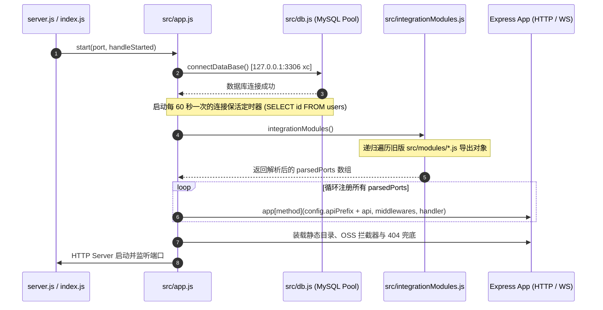
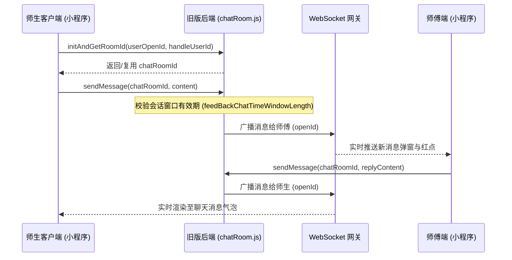

# 【旧版参考】xc_backend 原始后端业务逻辑与 API 契约深度解析手册

> [!WARNING]
> **版本性质声明 (Legacy Software Notice)**：  
> 本文档描述的系统为 **高校后勤巡查e速办 v4.0 诞生之前的旧版本上线后端业务系统 (`xc_backend`)**。  
> **文档编写目的**：仅作为重构迁移阶段的底层业务逻辑溯源、状态机流转对照与 REST API 契约逆向参考手册。  
> **重要红线**：后续所有全新开发、性能优化与微服务演进**必须在 `v4.0/Backend` (TypeScript + Express 5 + AST + Redis) 中进行**，切勿将此旧版本程序（JavaScript + 单体 Express 4 + 裸写 SQL 拼接）与当前新工程的代码逻辑、依赖环境或架构规范相混淆！

> **旧版工程名称**：高校后勤巡查e速办 - 原始旧版后端系统 (`xc_backend`)  
> **旧版源码绝对路径**：[E:\Projects\University\后勤巡查e速办 大二下学期 大学身份上线项目\xc_backend](file:///e:/Projects/University/后勤巡查e速办%20大二下学期%20大学身份上线项目/xc_backend)  
> **文档归档位置**：[v4.0/Docs/Backend/【旧版参考】xc_backend原后端业务逻辑与API契约深度解析手册.md](file:///e:/Projects/University/后勤巡查e速办%20大二下学期%20大学身份上线项目/v4.0/Docs/Backend/【旧版参考】xc_backend原后端业务逻辑与API契约深度解析手册.md)  
> **编制目标**：为 v4.0 (TypeScript + Express 5 + AST + Redis) 的新版业务重构提供 100% 精确的历史业务逻辑、数据字典、流转状态机、API 接口契约与踩坑指南。

---

## 目录索引 (Table of Contents)

1. [旧版 xc_backend 系统架构与启动运行机制](#一-旧版-xc_backend-系统架构与启动运行机制)
   - 1.1 [进程启动与 Express 实例装配流程 (app.js & server.js)](#11-进程启动与-express-实例装配流程-appjs--serverjs)
   - 1.2 [动态 API 模块自动扫描与路由注册 (integrationModules.js)](#12-动态-api-模块自动扫描与路由注册-integrationmodulesjs)
   - 1.3 [旧版鉴权拦截器与自定义 Token 编解码机制](#13-旧版鉴权拦截器与自定义-token-编解码机制)
   - 1.4 [数据库初始化与长连接保活机制 (db.js)](#14-数据库初始化与长连接保活机制-dbjs)
2. [旧版 15 个成熟业务模块控制器 (src/modules/) 深度详析](#二-旧版-15-个成熟业务模块控制器-srcmodules-深度详析)
   - 2.1 [patrol.js (巡查工单生命周期控制器)](#21-patroljs-巡查工单生命周期控制器)
   - 2.2 [user.js (用户中心与鉴权体系)](#22-userjs-用户中心与鉴权体系)
   - 2.3 [chatRoom.js (在线客服即时通讯)](#23-chatroomjs-在线客服即时通讯)
   - 2.4 [feedback.js (师生诉求意见箱)](#24-feedbackjs-师生诉求意见箱)
   - 2.5 [admin.js (管理员综合中台)](#25-adminjs-管理员综合中台)
   - 2.6 [notification.js (站内消息与广播)](#26-notificationjs-站内消息与广播)
   - 2.7 [campus.js & category.js & departments.js (基础组织字典)](#27-campusjs--categoryjs--departmentsjs-基础组织字典)
   - 2.8 [setting.js & qrcode.js & statistics.js (配置、扫码与数据大盘)](#28-settingjs--qrcodejs--statisticsjs-配置扫码与数据大盘)
3. [旧版 20 个底层服务方法封装 (src/methods/) 核心算法剖析](#三-旧版-20-个底层服务方法封装-srcmethods-核心算法剖析)
   - 3.1 [patrol.js 底层：状态流转判定与延期时效算法](#31-patroljs-底层状态流转判定与延期时效算法)
   - 3.2 [permissions.js 底层：三维权限矩阵调度与动态按钮控制](#32-permissionsjs-底层三维权限矩阵调度与动态按钮控制)
   - 3.3 [alert.js 底层：多通道自动化督办与提醒引擎](#33-alertjs-底层多通道自动化督办与提醒引擎)
   - 3.4 [postWechatMessage.js 底层：异步任务队列与防限流推送](#34-postwechatmessagejs-底层异步任务队列与防限流推送)
   - 3.5 [chatRoom.js 底层：长连接推送、未读红点与会话有效窗口](#35-chatroomjs-底层长连接推送未读红点与会话有效窗口)
4. [旧版全量 API 接口契约清单 (API Contract Reference)](#四-旧版全量-api-接口契约清单-api-contract-reference)
5. [迁移至 v4.0 的业务重构与踩坑规避指南](#五-迁移至-v40-的业务重构与踩坑规避指南)

---

## 一、 旧版 xc_backend 系统架构与启动运行机制

### 1.1 进程启动与 Express 实例装配流程 (app.js & server.js)

旧版 `xc_backend` 是一个典型的单体 Node.js 服务端应用，其启动装配链条如下：



- **高容量 Body 解析**：装载了 `bodyParser.json({ limit: '1gb' })` 以及 `text`, `raw`, `urlencoded`，支持超大表单和图片二进制数据的直传；
- **CORS 跨域全开放**：装载 `cors()`，允许小程序与管理后台跨域访问；
- **数据库连接保活**：由于 MySQL 默认对空闲超过 `wait_timeout`（通常为 8 小时或云数据库 600 秒）的连接会自动释放，系统使用 `setInterval` 每 60 秒执行一次轻量查询 `select id from users limit 1`，避免连接池假死。

---

### 1.2 动态 API 模块自动扫描与路由注册 (integrationModules.js)

旧版 `xc_backend` 没有采用传统的 `express.Router()` 手工逐行路由注册，而是自研了一套**基于对象树递归扫描的动态路由引擎**：

1. **扫描目录**：遍历旧版 `src/modules/` 下的所有 `.js` 文件（如 `patrol.js`, `user.js` 等）；
2. **递归解析算法**：
   - 根前缀为模块文件名，例如 `/patrol`；
   - 检查导出对象上的每个键，如果键对应的值包含 `func` 函数属性，则视其为最终的 API 接口；
   - 如果对应值未包含 `func`，则视为嵌套子路由分组，继续递归拼装路径 `currentName + '/' + k`；
   - 最终拼装成路由，例如：`modules/patrol.js` 中的 `edit.campusCategory` 自动生成为 `/api/patrol/edit/campusCategory`。
3. **接口配置元数据规范**：
   ```javascript
   {
       exp: '接口业务中文说明描述',
       method: 'post' | 'get',
       auth: true | { admin: true, per1: true, per2: true }, // 权限声明
       middleware: [/* 可选中间件 */],
       async func(data) {
           // data 包含: query, param, currentUserId, currentUserName, currentUserOpenId
           return result;
       }
   }
   ```

---

### 1.3 旧版鉴权拦截器与自定义 Token 编解码机制

在旧版 `src/app.js` 的动态路由循环处理器中，每一次 HTTP 请求均会执行以下鉴权前置流水线：

```mermaid
flowchart TD
    Req[客户端发起 HTTP 请求] --> TokenCheck{接口是否声明 auth?}
    TokenCheck -- 否 (公开接口) --> Exec[解析 req.body / req.query 并执行 func]
    TokenCheck -- 是 (鉴权接口) --> HasToken{req.headers.token 是否存在?}
    HasToken -- 否 --> Err1[抛出 -1: 未提供凭证]
    HasToken -- 是 --> Decode[tool.decodeString 解密 Token]
    Decode --> Parse[JSON.parse 获取 openId 与过期时间]
    Parse --> DBUser[查询 users 表校验用户有效性]
    DBUser --> PermCheck{比对 auth 级别要求}
    PermCheck -- admin=true 且非管理员 --> Err2[抛出 -1: 权限不足]
    PermCheck -- per1=true 且非整改师傅 --> Err3[抛出 -1: 无整改权限]
    PermCheck -- per2=true 且非复核验收员 --> Err4[抛出 -1: 无复核权限]
    PermCheck -- 验证通过 --> Inject[注入 currentUserId / openId / username 到 data]
    Inject --> Exec
    Exec --> Resp[返回统一格式 { status: 1, content: result }]
```

- **旧版 Token 结构设计**：
  旧版 Token 并非标准 JWT，而是通过自定义对称混淆算法 `tool.encodeString` 加密的 JSON 字符串：
  ```json
  {
      "openId": "o_xxxxxxxxxxxxxxxxxxxxxx",
      "time": 1725510000000
  }
  ```
- **权限角色映射**：
  - `admin`: 要求 `user.isAdmin === 1`；
  - `per1`: 要求在 `permissions` 表中有对应记录且 `type === 1`（巡查整改施工师傅）；
  - `per2`: 要求在 `permissions` 表中有对应记录且 `type === 2`（工程验收复核人员）。

---

## 二、 旧版 15 个成熟业务模块控制器 (src/modules/) 深度详析

### 2.1 patrol.js (巡查工单生命周期控制器)

旧版 `src/modules/patrol.js` 是原系统的业务枢纽，共包含 20 个高频接口：

| 接口标识 (URI) | 方法 | 鉴权要求 | 核心功能与参数说明 | 业务约束与异常分支 |
| :--- | :---: | :---: | :--- | :--- |
| `/patrol/store` | POST | `auth: true` | **创建巡查工单 (草稿态)**<br/>入参：`patrolData` 对象 | • 校验用户当日新建巡查是否超过 `dailyPatrolLimitPerUser` 阈值；<br/>• 校验期望完成时间 `endTime` 必须晚于当前服务器时间；<br/>• 初始生成状态为 `status = 0`。 |
| `/patrol/setImage` | POST | `auth: true` | **追加巡查现场证据图**<br/>入参：`id`, `fileName` | • 依次写入工单记录的 `image1` 至 `image5`，上限 5 张。 |
| `/patrol/publish` | POST | `auth: true` | **正式发布巡查工单**<br/>入参：`id`, `images[]` | • 移除 1 小时未发布自动清理定时器；<br/>• 状态从 0 置为 1 (待处理)；<br/>• 触发 `alert.patrol.add(id)` 延迟调度督办通知。 |
| `/patrol/preview` | GET | 公开 | **首页大厅展示列表**<br/>入参：`finalId`, `size`, `username`, `phone`, `departmentId`, `createdAt_start/end`, `endTime_start/end` | • 滚动分页 (`finalId` 游标翻页)；<br/>• 未登录用户仅默认可见已完成工单 (`status = 4`)；<br/>• 动态拼装 `detail`, `status_read`, 高亮颜色。 |
| `/patrol/singleDetail` | GET | `auth: true` | **获取工单详情全景树**<br/>入参：`id` | • 自动调用 `userReadRecord.setRead.patrol` 消除当前用户红点；<br/>• 聚合 handle, review, feedback, comment, like 完整时间轴。 |
| `/patrol/delete` | POST | `auth: true` | **删除工单**<br/>入参：`id` | • 仅允许本人在 `status = 1` (未施工) 时删除，或管理员强制删除；<br/>• 级联删除关联的实证图片文件及 5 张子表记录；<br/>• 用户当日已建工单计数 `-1`。 |
| `/patrol/delay` | POST | `per1: true` | **整改师傅申请延期**<br/>入参：`patrolId`, `datetime` | • 校验该师傅是否享有该校区/类别的整改权限；<br/>• 工单必须处于 `status = 1` 或 `status = 2`；<br/>• 最多延期 3 次 (`endTime1~3`)；<br/>• 延期上限受 `settings.maxDelayTime` 限制；<br/>• **已被驳回过的工单不允许再次申请延期**。 |
| `/patrol/handle` | POST | `per1: true` | **整改施工提交 / 拒绝**<br/>入参：`patrolId`, `form: { img1~5, desc, reject }` | • 校验师傅整改权限；<br/>• 若 `reject === 1`，状态变更为 `5` (已拒绝/驳回)；<br/>• 若正常施工完工：根据 `settings.progress_feedBack` 决定流转至 `3` (满意度调查中) 还是直接 `4` (已完成)。 |
| `/patrol/review` | POST | `per2: true` | **验收复核驳回**<br/>入参：`patrolId`, `desc` | • 验收复核人员到场检验不达标；<br/>• 插入 `patrols_review` 留痕；<br/>• **将工单状态打回重置为 `status = 1`**，由师傅重新进场整改。 |
| `/patrol/feedBack` | POST | `auth: true` | **师生打分评价**<br/>入参：`patrolId`, `rating`, `desc` | • 仅限上报师生本人操作；<br/>• 评分 1~5 星；<br/>• 状态变更为 `4` (已完成归档)。 |
| `/patrol/priority` | POST | `auth: true` | **师生紧急催办**<br/>入参：`patrolId` | • 检查催办权限；<br/>• **每张工单每日仅允许催办一次** (记录 `priorityTime`)；<br/>• 触发向师傅端推送加急微信模板消息。 |
| `/patrol/myTasks` | POST | `auth: true` | **师傅/用户专属待办列表**<br/>入参：`groupName`, `campusId`, `categoryId`, `isDelay`, `finalId`, `size` | • `preToHandle`: 师傅待处理列表 (`status = 1` 或 `2`)；<br/>• `preToReview`: 验收人员待验收列表 (`status >= 3`)；<br/>• `waitingForHandle`: 用户等待被处理的工单；<br/>• `waitingForRating`: 用户等待评价的工单 (`status = 3`)；<br/>• `myHistory`: 我的全部历史。 |
| `/patrol/search` | POST | `auth: true` | **复杂组合条件精准/模糊搜索**<br/>入参：大表单多维筛选对象 | • 支持按工单描述、图片数量、有无位置、多级状态、延期次数、人员姓名手机号、多表关联交叉检索。 |
| `/patrol/genExcel` | POST | `admin: true` | **导出 Excel 审计报表**<br/>入参：筛选条件 | • 服务端调用 exceljs 导出完整台账；<br/>• 自动为每个包含经纬度坐标的工单生成高德定位二维码直接插入单元格中。 |

---

### 2.2 user.js (用户中心与鉴权体系)

- **微信静默授权登录 (`loginByCode`)**：
  旧版小程序调用 `wx.login()` 获取临时授权码 `code`，后端请求微信官方接口：
  `https://api.weixin.qq.com/sns/jscode2session?appid=...&secret=...&js_code=CODE&grant_type=authorization_code`
  换取 `openid`。若数据库中不存在该 openId，则在 `openIds` 表与 `users` 表中创建访客账号；若已存在则更新访问计数并签发 Token。
- **账号密码登录 (`loginByPassword`)**：
  提供给后勤师傅和后勤管理处的 PC 端/快捷登录入口，入参为 `account` 与 `password`。密码使用散列校验。
- **双身份切换机制 (`switchRole`)**：
  后勤师傅本身往往也是教职工（具备师生身份）。旧版系统支持同一个 openId 在“师生端”与“后勤师傅端”之间一键切换上下文，切换后前端请求携带的身份标记发生变更，对应渲染不同的视图与待办列表。

---

### 2.3 chatRoom.js (在线客服即时通讯)

为解决师生与施工师傅/后勤管理员之间对隐患点位不清、钥匙未带、现场门禁等即时沟通痛点，旧版系统内嵌了专属轻量级 1v1 客服聊天室：



- **卡片消息嵌入能力**：除了常规文本和图片，聊天室支持在会话中直接由系统插入 `feedBackCard`（诉求卡片）和 `patrolCard`（工单卡片），卡片包含状态、标题与缩略图，点击可直接跳入工单详情。
- **沟通窗口时限保护**：为避免师生在非维保时段或工单归档很久后无休止打扰师傅，旧版系统设置了 `feedBackChatTimeWindowLength`（如师傅回复后 24 小时内有效），超出窗口后师生发消息会被拦截并提示会话已结束。

---

### 2.4 feedback.js (师生诉求意见箱)

师生在校园内除了巡查故障，常有对后勤管理、食堂餐饮、宿舍卫生的宏观诉求与建议：
- `add`: 师生提交建议主题、详细文字与图片凭据；
- `reply`: 后勤专员在后台或移动端予以官方答复（记录 `replyTime` 与 `replyUserId`）；
- `like`: 师生可对优秀建议及官方答复进行点赞支持；
- `setRead`: 红点消除，记录用户最近阅读时间点。

---

### 2.5 admin.js (管理员综合中台)

面向后勤处主管与校领导的全局中台接口：
- `userList` / `userUpdate` / `userDelete`: 维护全校后勤师生账号，指派 `isAdmin`、`isHandleUser` 身份；
- `permissionsSet`: 核心调度配置，为指定用户批量绑定 `campusId × categoryId × type` 权限；
- `statisticsOverview`: 抓取全校总体巡查总数、待处理数、延期数、平均整改耗时（精确到小时与分钟）、好评率分布；
- `settingsUpdate`: 动态修改首页公告、轮播 Banner 图列表、系统通知推送开关。

---

## 三、 旧版 20 个底层服务方法封装 (src/methods/) 核心算法剖析

### 3.1 patrol.js 底层：状态流转判定与延期时效算法

在旧版 `src/methods/patrol.js`（超过 1250 行代码）中，封装了最核心的工单业务计算逻辑：

#### 1. 状态高亮与主题色彩映射
工单在各状态下的视觉呈现具有严格的语义色彩：
```javascript
item.highLightColor = (() => {
    if (item.status == 1) return 'rgba(0,120,215,1)' // 待处理：科技蓝
    if (item.status == 2) return '#7100ac'           // 延期中：警示紫
    if (item.status == 3) return '#01bd40'           // 调查中：生机绿
    return 'rgba(0,0,0,0)'
})()
```

#### 2. 延期时效链式计算与超时追踪
工单支持最多 3 次延期，数据表中有 `endTime`（当前有效截止时间）、`endTime1`、`endTime2`、`endTime3` 及对应的 `delay1UserId`~`delay3UserId`。底层算法会对延期记录进行时间轴排序重组：
```javascript
// 计算各次延期跨度与审批责任人
let chain = [item.endTime, item.endTime1, item.endTime2, item.endTime3]
    .filter(Boolean)
    .sort((a, b) => new Date(a) - new Date(b));

// 计算当前是否已经逾期及逾期绝对时长
item.over = new Date(item.endTime) < new Date();
item.overSize = tool.formatTimeDifference(item.endTime, new Date());
```

---

### 3.2 permissions.js 底层：三维权限矩阵调度与动态按钮控制

后勤巡查的调度核心是 **`用户 × 校区 × 类别`** 的网格化分配。

#### 1. 权限判定核心算法 (`checkUserPermission`)
```javascript
async function checkUserPermission(userId, type, campusId, categoryId) {
    let re = await db.selectWithParams(
        `SELECT id FROM permissions WHERE userId = ? AND type = ? AND campusId = ? AND categoryId = ?`,
        [userId, type, campusId, categoryId]
    );
    return re.length > 0;
}
```

#### 2. 工单详情页动态操作权限萃取 (`getUserPatrolPermissions`)
每个进入工单详情页的用户，系统会动态计算出一张布尔权限能力表：
- `handle`: 允许接单/施工完工。条件：用户具备该工单校区+门类的 `type=1` 权限，且工单处于 `status=1` (待处理) 或 `status=2` (延期中)；
- `delay`: 允许申请延期。条件：具备 `type=1` 权限，工单在 `status=1` 或 `2`，延期次数 `< 3`，且**此前未被驳回过**；
- `review`: 允许驳回重做。条件：具备 `type=2` 复核权限，且工单处于 `status=3` (师傅已报完工)；
- `feedBack`: 允许打分评价。条件：当前用户是该工单的上报创建人 (`userId === item.userId`)，且工单处于 `status=3`；
- `priority`: 允许催办。条件：上报人本人，工单未完工，且当日尚未催办过。

---

### 3.3 alert.js 底层：多通道自动化督办与提醒引擎

旧版 `src/methods/alert.js` 是全系统的自动化神经中枢。在关键业务事件发生时，它负责编排站内信、微信订阅消息与短信通道：

1. **工单发布延迟告警 (`patrol.add`)**：
   师生提交工单后，并非立即轰炸师傅手机，而是设置定时器等待 `newPatrolSendNotificationWaitTime`（如 5~10 分钟）。若该时间内无管理员手动调整分类，则正式将工单推送至所属分类的师傅施工群组；
2. **延期提醒 (`patrol.delay`)**：
   延期被批准后，系统同时向**上报师生**与**整改组其他成员**发送变更通知，解释延期理由与新截止日期；
3. **完工催评 (`patrol.handle`)**：
   师傅完工上传实证图后，第一时间向师生推送“请您为后勤整改打分”的服务消息。

---

### 3.4 postWechatMessage.js 底层：异步任务队列与防限流推送

微信官方对小程序模板/订阅消息有严格的频次限制与单并发安全风控。旧版系统设计了基于内存单向循环的 `task` 队列：
```javascript
const task = {
    list: [],
    running: false,
    async run() {
        if (this.running) return;
        this.running = true;
        while (1) {
            await tool.wait(0.01);
            let current = this.list[0];
            if (!current) continue;
            // 调用微信官方 API 发送订阅消息
            await tool.sendSubscribeMessage(current.openId, current.content, ...);
            this.shift();
        }
    }
}
```
- **内容截断保护**：微信规定单字段长度超标直接抛错 47003，代码中强制执行 `content.length > 20 ? content.slice(0, 19) + '…' : content`；
- **多维度寻址投递**：支持 `byOpenId`, `byUserId`, `byPhone`, `byAccount`, `toDepartment` 自动化转换映射。

---

## 四、 旧版全量 API 接口契约清单 (API Contract Reference)

以下为旧版 `xc_backend` 全部对外暴露的 HTTP RESTful 路由契约：

| 序号 | 接口完整路径 (URL) | 请求方式 | 认证要求 | 核心入参 (JSON Payload) | 典型响应出参 (status = 1) | 业务职责 |
| :---: | :--- | :---: | :---: | :--- | :--- | :--- |
| 1 | `/api/patrol/store` | POST | Token (User) | `{ patrolData: { campusId, categoryId, desc, location, endTime, image1 } }` | `patrolId (int)` | 创建巡查工单 (草稿) |
| 2 | `/api/patrol/publish` | POST | Token (User) | `{ id: 1024, images: ["img1.jpg"] }` | `null` | 正式发布巡查工单 |
| 3 | `/api/patrol/singleDetail` | GET | Token (User) | `?id=1024` | 完整的工单对象 (含处理轴、评价、权限) | 获取工单详情 |
| 4 | `/api/patrol/preview` | GET | 公开 | `?finalId=1020&size=10&status=4` | `[ patrolItem, ... ]` | 首页大厅瀑布流列表 |
| 5 | `/api/patrol/delay` | POST | Token (Per1) | `{ patrolId: 1024, datetime: "2026-09-10 18:00:00" }` | `null` | 师傅申请延期 |
| 6 | `/api/patrol/handle` | POST | Token (Per1) | `{ patrolId: 1024, form: { image1: "...", desc: "已修好", reject: 0 } }` | `null` | 师傅完工提交/驳回 |
| 7 | `/api/patrol/review` | POST | Token (Per2) | `{ patrolId: 1024, desc: "地砖未贴平，驳回重修" }` | `null` | 验收员驳回重办 |
| 8 | `/api/patrol/feedBack` | POST | Token (User) | `{ patrolId: 1024, rating: 5, desc: "响应极快，好评！" }` | `null` | 师生满意度评价 |
| 9 | `/api/patrol/priority` | POST | Token (User) | `{ patrolId: 1024 }` | `null` | 每日限一次紧急催办 |
| 10 | `/api/patrol/myTasks` | POST | Token (User) | `{ groupName: "preToHandle", campusId: 1, categoryId: 2 }` | `[ patrolItem, ... ]` | 师傅/用户分类待办 |
| 11 | `/api/patrol/search` | POST | Token (User) | 组合查询过滤条件表单 | `{ list: [...], total: 42 }` | 高级多维检索 |
| 12 | `/api/user/loginByCode` | POST | 公开 | `{ code: "0a1b2c..." }` | `{ token, isNew, userInfo }` | 微信一键授权静默登录 |
| 13 | `/api/user/loginByPassword` | POST | 公开 | `{ account: "admin", password: "..." }` | `{ token, userInfo }` | 账号密码认证登录 |
| 14 | `/api/user/getMe` | GET | Token (User) | 无 | 用户主表详细信息、所属部门、权限列表 | 获取当前登录人资料 |
| 15 | `/api/chatRoom/initAndGetRoomId` | POST | Token (User) | `{ handleUserId: 5 }` | `chatRoomId (int)` | 创建/获取 1v1 聊天室 |
| 16 | `/api/chatRoom/sendMessage` | POST | Token (User) | `{ chatRoomId: 88, content: "师傅您大概几点到？" }` | `null` | 发送聊天消息 |
| 17 | `/api/chatRoom/getChatHistoryList` | GET | Token (User) | `?chatRoomId=88&finalId=50` | `[ messageItem, ... ]` | 倒序拉取历史消息 |
| 18 | `/api/feedback/add` | POST | Token (User) | `{ title: "东校区二餐空调故障", content: "...", images: [] }` | `feedbackId (int)` | 提交意见建议 |
| 19 | `/api/feedback/reply` | POST | Token (Admin) | `{ id: 12, reply: "已安排暖通班组排查" }` | `null` | 管理员答复建议 |
| 20 | `/api/notification/list` | GET | Token (User) | `?finalId=0&size=20` | `[ notificationItem, ... ]` | 获取站内通知广播列表 |
| 21 | `/api/campus/list` | GET | 公开 | 无 | `[ { id: 1, name: "东校区", scanCodeCount: 1520 }, ... ]` | 全校区字典 |
| 22 | `/api/category/list` | GET | 公开 | 无 | `[ { id: 1, name: "消防设施", sort: 10 }, ... ]` | 隐患类别字典 |
| 23 | `/api/setting/get` | GET | 公开 | `?key=banner` | 对应配置项值 (如轮播图数组) | 获取系统动态配置 |
| 24 | `/api/admin/permissions/set` | POST | Token (Admin) | `{ userId: 10, permissions: [ { campusId: 1, categoryId: 2, type: 1 } ] }` | `null` | 调度管理员批量授权 |

---

## 五、 迁移至 v4.0 的业务重构与踩坑规避指南

将 `xc_backend` 的上述业务逻辑迁入全新架构 `v4.0/Backend` 时，必须严格遵循以下原则，避免将旧版本逻辑混入新工程：

1. **废弃旧式对称加密 Token，全量接入标准 JWT**：
   - 原旧版系统使用 `tool.encodeString` 混淆 openId，无过期校验与防伪签名；v4.0 已在 `src/shared/crypto` 中内置标准的 `signToken` 与 `verifyToken`，迁移后统一使用 Bearer JWT。
2. **消灭裸写 SQL 拼接，全面接入 AST 树构建器**：
   - 原旧版 `patrol.list` 和 `patrol.search` 中存在大量通过 `if (x) sql += ' and ...'` 动态拼字符串的脆弱逻辑；
   - 在 v4.0 中，必须统一使用 `SelectBuilder`、`WhereNode` 与占位符 `?`，并自动继承软删除 `isDeleted = 0` 保护。
3. **写操作全面绑定 Saga 事务撤回栈 (WithdrawStack)**：
   - 原旧版 `patrol.handle`、`patrol.delay`、`patrol.delete` 等涉及多表操作（如更新工单、插入流转记录、修改用户计数、清理实证图），一旦中途崩溃会导致数据脏乱；
   - 必须通过 `WithdrawStack.push` 注册反向补偿闭包，确保在抛出业务异常时自动回滚已执行的写操作。
4. **长连接网关防环特征码要求**：
   - 客服聊天室与工单实时播报在接入 `v4.0/ws` 集群广播时，必须随消息体注入当前进程的 `originInstanceId`，杜绝 Redis Pub/Sub 跨进程消费造成的二次重复推送。
5. **严禁在后端运维脚本中误伤前端**：
   - 任何涉及 npm 依赖的脚本，只能在 `v4.0/Backend` 根目录下执行，严禁触碰 `WeChatMiniProgram/miniprogram_npm`。
