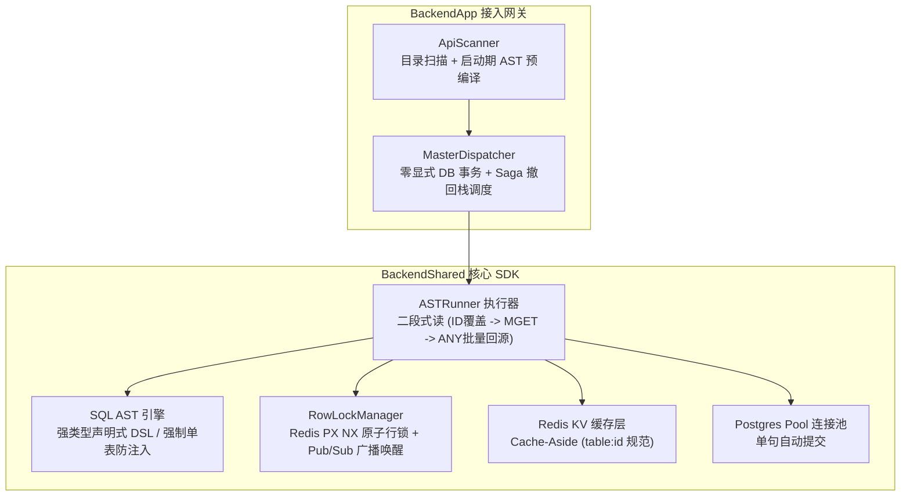
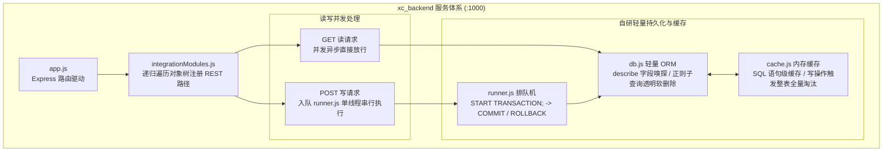
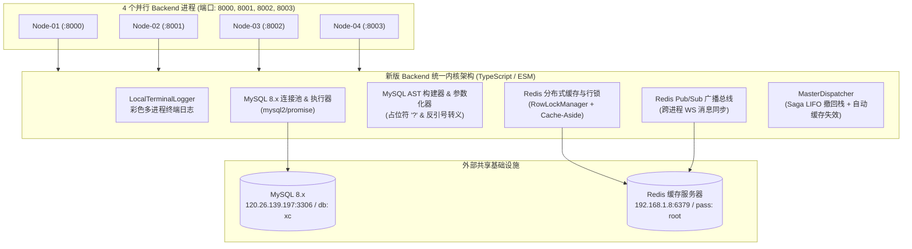
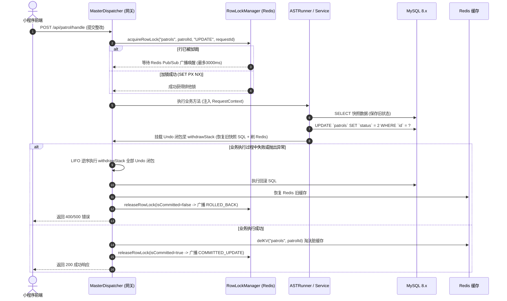
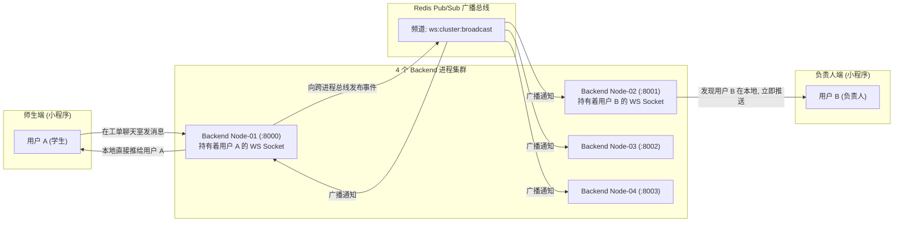
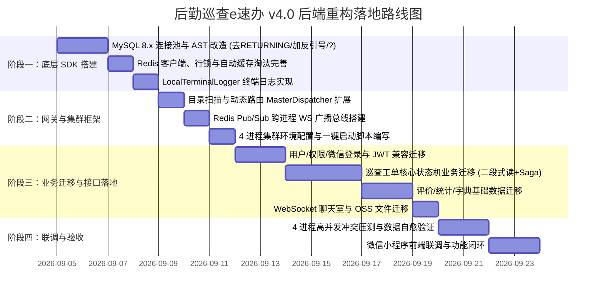

# 后勤巡查e速办 v4.0 新版后端架构深度剖析与搭建设计蓝图

---

## 目录
- [一、 导言与重构目标](#一-导言与重构目标)
- [二、 深度理解：原有两个项目架构剖析](#二-深度理解原有两个项目架构剖析)
  - [1. RuruChat 现代化企业级后端架构 (BackendApp + BackendShared)](#1-ruruchat-现代化企业级后端架构-backendapp--backendshared)
  - [2. 高校后勤巡查e速办旧版后端 (xc_backend)](#2-高校后勤巡查e速办旧版后端-xc_backend)
  - [3. 关键机制演进对比与技术反思](#3-关键机制演进对比与技术反思)
- [三、 深入对照发现的 7 个关键逻辑盲区与语法陷阱](#三-深入对照发现的-7-个关键逻辑盲区与语法陷阱)
  - [1. 原 RuruChat 框架遗留的 3 个逻辑缺陷与盲区](#1-原-ruruchat-框架遗留的-3-个逻辑缺陷与盲区)
  - [2. 从 PostgreSQL 切换至 MySQL 8.x 的 4 个底层语法陷阱](#2-从-postgresql-切换至-mysql-8x-的-4-个底层语法陷阱)
- [四、 新版后端 (v4.0/Backend) 核心技术改造方案](#四-新版后端-v40backend-核心技术改造方案)
  - [1. 数据库引擎全面适配：PostgreSQL -> MySQL 8.x](#1-数据库引擎全面适配postgresql---mysql-8x)
  - [2. 修复 UPDATE/DELETE 自动淘汰 Redis 脏缓存机制](#2-修复-updatedelete-自动淘汰-redis-脏缓存机制)
  - [3. 日志系统改造：去除 gRPC 远程强依赖，适配多进程彩色终端输出](#3-日志系统改造去除-grpc-远程强依赖适配多进程彩色终端输出)
  - [4. 并发控制与缓存重构：Redis 行锁 + Saga 撤回栈取代单机串行队列](#4-并发控制与缓存重构redis-行锁--saga-撤回栈取代单机串行队列)
  - [5. 动态路径参数与静态文件下载适配 (扩展 MasterDispatcher)](#5-动态路径参数与静态文件下载适配-扩展-masterdispatcher)
  - [6. 四进程集群下的 WebSocket 跨进程广播总线 (Redis Pub/Sub 解决孤岛)](#6-四进程集群下的-websocket-跨进程广播总线-redis-pubsub-解决孤岛)
  - [7. 鉴权升级：从自定义字符串混淆迁移到标准 JWT + 兼容模式](#7-鉴权升级从自定义字符串混淆迁移到标准-jwt--兼容模式)
- [五、 新版工程项目结构规划 (TypeScript / ESM)](#五-新版工程项目结构规划-typescript--esm)
- [六、 业务模块重构与 API 契约映射规划](#六-业务模块重构与-api-契约映射规划)
  - [1. 模块迁移对照表](#1-模块迁移对照表)
  - [2. 关键业务流程的 Saga 补偿与二段式缓存设计](#2-关键业务流程的-saga-补偿与二段式缓存设计)
  - [3. WebSocket 长连接与文件存储 (OSS) 保留方案](#3-websocket-长连接与文件存储-oss-保留方案)
- [七、 搭建与落地的分步实施计划](#七-搭建与落地的分步实施计划)

---

## 一、 导言与重构目标

本项目旨在对聊城大学**“后勤巡查e速办”**微信小程序后端进行全面现代化重构升级（v4.0 版本）。

重构的核心思路是：
**以企业级大模型调度系统 RuruChat (`BackendApp` + `BackendShared`) 的现代化高性能内核为骨架，以原有成熟的大学上线项目 `xc_backend` 的业务逻辑为血肉。**

### 核心改造目标与关键基础设施
1. **框架技术继承**：采用物理文件目录树路由自动扫描、声明式 SQL AST 语法树 DSL、启动期路由与 SQL 预编译、二段式（主键索引抽取 + Redis MGET 缓存 + 向量批量回源）极速查询机制、Saga 逆序 LIFO 撤回栈。
2. **底层数据库适配**：将原 RuruChat 框架针对 PostgreSQL 的底层实现，全面无缝适配改造成针对 **MySQL 8.x**（参数化占位符由 `$1,$2` 改造为 `?`，连接池接入 `mysql2/promise`，批量回源适配为 `WHERE id IN (?)`，语法树内置软删除 `isDeleted = 0` 约束，字段名强制反引号转义）。
   - **MySQL 地址**：`120.26.139.197:3306`
   - **用户/密码**：`root` / `Ldhq_123`
   - **目标库名**：`xc`
3. **高并发缓存与分布式锁接入**：
   - **Redis 地址**：`192.168.1.8:6379`
   - **密码**：`root`
   - 彻底取代旧版的单机内存缓存和单进程串行排队队列，使用 Redis 分布式排他行锁 (`RowLockManager`) 与 Cache-Aside 架构保证行级并发强一致性。
4. **日志体系轻量化**：剥离原 RuruChat 框架中强制连接外部 gRPC `LogClient` 的 Fail-Fast 限制，设计内置美观、高可读性的结构化终端控制台彩色日志输出，支持多进程实例打标。
5. **多进程集群部署**：通过集群拉起脚本并行启动 **4 个独立 Backend 进程**（例如端口 8000~8003），全部挂载相同的 MySQL 与 Redis 服务，具备真正的水平扩展与负载均衡承载能力。

---

## 二、 深度理解：原有两个项目架构剖析

### 1. RuruChat 现代化企业级后端架构 (BackendApp + BackendShared)

RuruChat 是一个针对超高并发大模型调度、多硬件加速节点通信和算力计量而设计的高性能分布式后端系统。其设计哲学体现了现代云原生和高吞吐架构的精髓：



#### 核心技术闪光点：
1. **零显式 DB 事务（Zero-Explicit-DB-Transactions）+ Saga 撤回栈（WithdrawStack）**：
   - 传统数据库事务（`BEGIN ... COMMIT`）在高并发场景或跨网络 I/O 链路中会长期占用连接池物理连接，造成连接耗尽与行锁死锁。
   - RuruChat 采用单句自动提交，并在每个数据操作成功时将一个**对称的反向补偿闭包（Undo Closure）**推入请求上下文的 `withdrawStack` 中。
   - 若接口返回 `status: 0` 或抛出未捕获异常，调度器严格按照 **后进先出 (LIFO)** 顺序执行栈中全部补偿函数，回滚数据库脏数据并还原 Redis 缓存，实现了应用层自愈与补偿机制。
2. **基于 Redis Pub/Sub 的分布式排他行锁 (`RowLockManager`)**：
   - 采用 `SET lock:table:id payload PX 10000 NX` 原子抢锁。
   - **支持同请求重入（Re-entrancy）**：若锁由当前 `requestId` 持有，则允许业务代码在同一调用链中反复读取与更新同一行。
   - **Lua 脚本安全校验释放**：严格比对持锁者，杜绝因超时过期导致误删后续请求的锁。
   - **Pub/Sub 广播唤醒与引用计数防泄漏**：无锁等待者不采用消耗 CPU 的 `while(true)` 轮询，而是通过专用的 Redis 订阅客户端监听 `unlock:lock:table:id`，配合引用计数安全退订，实现毫秒级唤醒。
3. **声明式 SQL AST DSL 与二段式极速读**：
   - 强制只允许单表查询（`uniqueTables.length > 1` 直接拦截），彻底规避多表 JOIN 导致的性能劣化与缓存失效复杂化。
   - 语法结构严格交替校验，内置严格的黑名单与参数化替换，杜绝 SQL 注入。
   - **SELECT 五阶段二段式读机制**：
     - ① 轻量 SQL 只提取主键 `id` 列表（充分利用覆盖索引）；
     - ② 校验行锁状态，剔除已提交删除的幽灵数据；
     - ③ Redis `mgetKV` 批量并行读取已缓存行实体；
     - ④ 针对未命中缓存的 ID 向量回源数据库并异步回填 Redis；
     - ⑤ 严格按原 ID 排序还原数据输出。

---

### 2. 高校后勤巡查e速办旧版后端 (xc_backend)

`xc_backend` 是一个大学二年级时期独立开发的真实商业/校级上线项目，具有强烈的极客特色和针对特定单机环境的工程智慧：



#### 核心技术机制剖析：
1. **读写分离与写入串行化执行器（`runner.js`）**：
   - 在单机单进程环境下，为了解决工单状态机流转并发冲突、两人同时处理同一工单等并发问题，设计了一个基于 Node.js 单线程事件循环的内存 FIFO 队列。
   - **GET 请求直接并发执行**；**POST 请求全部进队，严格一个接一个执行**，并在每个任务执行前后包裹 MySQL 原生事务：
     `START TRANSACTION;` -> `curr.func(...)` -> `COMMIT;` / `ROLLBACK;`。
   - 这种设计在单机低吞吐量下能够 100% 保证数据一致性，但无法扩展到多进程/多节点集群环境，成为性能与水平扩展的最大瓶颈。
2. **自研轻量 ORM 引擎（`src/db.js`）**：
   - **动态表结构嗅探**：通过 `describe \`tableName\`` 动态获取字段名与类型（int/datetime/varchar/longtext）。
   - **严格类型安全与零值回填**：在 `insertInto` 与 `updateById` 中，比对字段类型并校验传入值类型，缺失字段按类型安全补 0 或空字符串，自动维护 `createdAt` 与 `updatedAt` 时间戳。
   - **正则表达式驱动的透明软删除**：执行查询时，自动用正则捕获表名。若表元数据中包含 `isDeleted` 字段且未传 `all=true`，动态将 `FROM tableName` 篡改为子查询：
     `FROM (select * from tableName where isDeleted = 0) as filtered_table`。
3. **基于 SQL 语义正则解析的进程内存级缓存（`src/tools/cache.js`）**：
   - 使用多组正则表达式分析 SQL 语句类型（`select/insert/update/delete/describe`）并提取表名。
   - 内存字典二级索引：`data[tableName][sql] = deepCopy(result)`。
   - **写操作触发整表失效**：当对某张表发生任何 `INSERT/UPDATE/DELETE` 时，直接删除 `data[tableName]` 清空整张表的所有查询缓存，杜绝脏读。
4. **微信服务集成**：
   - 微信授权换取 openId、自定义可逆字符串编码算法生成身份 Token、微信订阅模板消息发送、小程序码动态生成、基于原生 WebSocket 的工单协同聊天室。

---

### 3. 关键机制演进对比与技术反思

| 机制维度 | 旧版小程序后端 (`xc_backend`) | 新版架构目标 (`v4.0/Backend`) | 演进原因与架构提升 |
| :--- | :--- | :--- | :--- |
| **并发控制** | 单进程内存队列串行化 (`runner.js`)，写请求单线程排队 | **Redis 分布式排他行锁 (`RowLockManager`)** | 彻底打破单机单线程限制，允许多个 Backend 进程并发处理不同记录，仅在同一记录发生竞争时精准串行化。 |
| **事务控制** | 显式数据库事务 (`START TRANSACTION ... COMMIT`) | **零显式 DB 事务 + 连接池自动提交 + Saga LIFO 撤回栈** | 消除数据库长事务占用连接池的隐患，彻底规避数据库底层死锁。 |
| **数据库** | MySQL 5.7/8.0 (`mysql2` 单连接驱动) | **MySQL 8.x (`mysql2/promise` 池化连接 + AST 语法树)** | 提高 SQL 编写安全性与规范性，池化连接支持弹性并发。 |
| **缓存架构** | 单机 Node.js 进程内存字典缓存，写操作全量清空整表 | **分布式 Redis Cache-Aside (`table:id`) 行级缓存** | 缓存多进程共享，粒度细化至单行，支持并发 MGET 极速组装，避免整表雪崩失效。 |
| **软删除机制**| 正则表达式强行替换 SQL 字符串为子查询 (`filtered_table`) | **AST 语法树构建阶段原生挂载 `isDeleted = 0` 条件** | 消除正则替换 SQL 带来的语法歧义风险，生成的 SQL 更符合 MySQL 执行计划优化。 |
| **API 组织** | 遍历嵌套对象树 (`integrationModules.js`) + Express | **物理目录约定文件树 (`apiScanner.ts`) + 原生 HTTP 极速分发** | 启动期静态预编译完成，运行时零反射开销，接口与文件一一对应。 |
| **日志机制** | 原 RuruChat 强制依赖 gRPC 远程 LogClient | **内置结构化终端彩色日志输出，带多进程实例标示** | 消除本地开发与单机部署时对第三方日志服务的强依赖，开箱即用。 |
| **服务部署** | 单进程单端口运行 (`node index.js`) | **多进程实例并行（4 个 Backend 进程，端口 8000~8003）** | 充分利用多核 CPU 算力，具备高可用与负载均衡基础。 |

---

## 三、 深入对照发现的 7 个关键逻辑盲区与语法陷阱

通过将 RuruChat 全部源码与原小程序业务进行逐行深度对照，新版架构必须对以下 7 个关键点做出彻底的修正与补全：

### 1. 原 RuruChat 框架遗留的 3 个逻辑缺陷与盲区

#### (1) `astRunner.ts` UPDATE 成功后“未自动淘汰 Redis 缓存”的隐蔽缺陷
- **源码问题定位**（`BackendShared/src/sql/astRunner.ts#L137-L151`）：
  原框架的 UPDATE 执行器在更新成功后，**既没有调用 `delKV` 淘汰旧缓存，也没有覆写新缓存**；仅在 `withdraw` 异常回滚时写回旧快照！
  这导致 RuruChat 的 `billingService.ts#L120` 必须在业务层手动打补丁写 `await delKV("users", userId)`。如果其他业务接口漏写此行，后续查询将**持续命中已过期的旧缓存（产生脏读）**。
- **修正对策**：新版在框架层彻底消除该隐患：由 `astRunner.ts` 的 UPDATE 成功处或 `masterDispatcher.ts` 的提交处（`releaseMemoryLocks` 时），**由框架自动触发 `delKV(tableName, targetId)` 淘汰缓存**。

#### (2) `masterDispatcher.ts` 缺少动态路径参数（Path Params）匹配支持
- **源码问题定位**（`BackendApp/src/dispatcher/masterDispatcher.ts#L47-L57`）：
  原分发器只通过 `registry.get(pathname)` 执行精确哈希匹配。
  但旧版小程序存在文件下载接口：`GET /api/file/download/:filename`（文件名作为 URL 路径的一部分）。若直接套用原分发器，文件下载请求将被判定为 404 Not Found。
- **修正对策**：在 `masterDispatcher` 中引入前缀路由通配机制（例如以 `/api/file/download/` 开头直接分发至下载流控制器），并同时向下兼容 `?filename=xxx` 查询参数传参。

#### (3) 4 个独立进程下的 “WebSocket 消息孤岛” 盲区
- **源码问题定位**：
  原 RuruChat 主要是面向局域网独立硬件节点做任务分发。但在校园小程序业务中，学生连在 Node-01 的 WebSocket 上，后勤老师连在 Node-02 的 WebSocket 上。
  若 Node-01 产生了一条工单变更或聊天消息，它仅能检索自身的本地内存连接列表，**导致 Node-02 上的用户无法收到实时推送**。
- **修正对策**：新版必须在 4 个进程间建立基于 **Redis Pub/Sub 的跨进程 WebSocket 广播总线**。任意节点产生广播消息时发布到 Redis，所有节点订阅并在本地寻址推送。

---

### 2. 从 PostgreSQL 切换至 MySQL 8.x 的 4 个底层语法陷阱

| 陷阱序号 | 原 PostgreSQL 实现 (`BackendShared`) | MySQL 8.x 冲突与报错原因 | 新版底层适配方案 |
| :--- | :--- | :--- | :--- |
| **陷阱 1** | `insertBuilder.ts` 末尾强制追加：<br/>`VALUES (...) RETURNING id` | **MySQL 不支持 `RETURNING` 语法**，执行直接报错 `Syntax Error 1064`。 | 移除 `RETURNING id` 语法，插入后从 `mysql2` 返回的 `result.insertId` 获取自增主键。 |
| **陷阱 2** | 表名声明 `declare.table("public", "users")`<br/>生成 SQL: `FROM public.users` | MySQL 中无 PG 的 `public` Schema 概念，MySQL 会将其识别为库名，报错 `Table 'public.users' doesn't exist`。 | 移除 `public` 前缀，严格规范为纯表名 `` `users` ``。 |
| **陷阱 3** | `updateBuilder.ts` 生成无引号字段名：<br/>`setClauses.push(`${key} = $${index + 1}`)` | `xc_backend` 的表含有大量 MySQL 保留字，如 **`patrols.desc`**、**`settings.key`**、**`settings.value`**。不加反引号在 MySQL 会直接报语法错误！ | 字段名必须强制用反引号转义：<br/>`` `${key}` = ? ``。 |
| **陷阱 4** | 二段式回源语法：<br/>`WHERE id::text = ANY($1::text[])` | MySQL 不支持 `::text` 类型转换操作符与 `ANY(array)` 向量语法。 | 改造为 MySQL 原生支持的高效向量查询：<br/>``WHERE `id` IN (?)``。 |

---

## 四、 新版后端 (v4.0/Backend) 核心技术改造方案



### 1. 数据库引擎全面适配：PostgreSQL -> MySQL 8.x

#### (1) 连接池驱动升级 (`src/shared/db/mysql.ts`)
使用 `mysql2/promise` 替换原 `pg` 模块，配置长连接保活与连接池：
```typescript
import mysql from "mysql2/promise";
import { returnError, returnSuccess, StandardResult } from "../flow/result.js";

let pool: mysql.Pool | null = null;

export function initMySQLPool(config?: mysql.PoolOptions): StandardResult<mysql.Pool> {
  try {
    if (pool) return returnSuccess(pool);

    pool = mysql.createPool({
      host: process.env.MYSQL_HOST || "120.26.139.197",
      port: parseInt(process.env.MYSQL_PORT || "3306", 10),
      user: process.env.MYSQL_USER || "root",
      password: process.env.MYSQL_PASSWORD || "Ldhq_123",
      database: process.env.MYSQL_DATABASE || "xc",
      waitForConnections: true,
      connectionLimit: parseInt(process.env.MYSQL_CONNECTION_LIMIT || "20", 10),
      queueLimit: 0,
      charset: "utf8mb4",
      ...config,
    });

    return returnSuccess(pool);
  } catch (error) {
    return returnError(`初始化 MySQL 连接池失败: ${String(error)}`);
  }
}
```

#### (2) SQL 参数化与保留字反引号转义 (`parameterizer.ts` & `builders`)
- 占位符统一替换为 MySQL 原生 `?`：
```typescript
export function parameterizeSql(rawSql: string, values: any[] = []): StandardResult<ParameterizeResult> {
  let paramIndex = 0;
  const params: any[] = [];
  const parameterizedSql = rawSql.replace(/-!!value!!-/g, () => {
    const currentVal = values.length > paramIndex ? values[paramIndex] : undefined;
    params.push(currentVal);
    paramIndex++;
    return "?";
  });
  return returnSuccess({ parameterizedSql, params });
}
```
- 在 `updateBuilder` 与 `insertBuilder` 中，为避免 `desc`、`key` 等保留字冲突，列名强制加反引号：
```typescript
setClauses.push(`\`${key}\` = ?`);
```

#### (3) 移除 `RETURNING id` 并在执行器获取自增主键
- `insertBuilder.ts` 生成标准的 MySQL 插入语句：
  `INSERT INTO \`${tableName}\` (\`${columnNames.join("`, `")}\`) VALUES (${placeholders})`。
- 在 `astRunner.ts` 的 INSERT 执行器中：
```typescript
const [result] = await pool.query<mysql.ResultSetHeader>(sql, params);
const insertedId = result.insertId;
```

#### (4) 软删除在 AST 层面的原生支持
不再使用旧版脆弱的正则子查询替换，而是在 AST 构建或 `astRunner` 时，若数据表具备 `isDeleted` 字段且未传 `includeDeleted: true`，自动在 WHERE 条件数组追加：
```typescript
declare.where.compare(declare.column(tableNode, "isDeleted"), "=", declare.customValue("0"))
```

---

### 2. 修复 UPDATE/DELETE 自动淘汰 Redis 脏缓存机制

针对原 RuruChat 遗漏的缓存淘汰缺陷，在框架层做出双重保障：

1. **在 `astRunner.ts` 的 UPDATE / DELETE 执行成功后直接调用 `delKV`**：
```typescript
// UPDATE 成功后立即淘汰缓存，防止后续读请求脏读
await delKV(tableName, targetId).catch(() => {});
```
2. **在 `masterDispatcher.ts` 释放锁时补充确认**：
```typescript
async function releaseMemoryLocks(
  lockedRows: Array<{ tableName: string; targetId: string | number; requestId: string }>,
  isCommitted: boolean
) {
  for (const item of lockedRows) {
    if (isCommitted) {
      // 成功提交：确保 Redis 对应行实体缓存已淘汰
      await delKV(item.tableName, item.targetId).catch(() => {});
    }
    await RowLockManager.releaseRowLock(item.tableName, item.targetId, item.requestId, isCommitted);
  }
}
```

---

### 3. 日志系统改造：去除 gRPC 远程强依赖，适配多进程彩色终端输出

移除 RuruChat 在 `index.ts` 启动时必须向远程 gRPC 日志服务器发 Ping 探测的阻断式逻辑，实现自包含的 **`LocalTerminalLogger`**：

```typescript
export class TerminalLogger {
  private static COLORS: Record<string, string> = {
    DEBUG: "\x1b[35m", // 洋红
    INFO: "\x1b[32m",  // 绿色
    WARN: "\x1b[33m",  // 黄色
    ERROR: "\x1b[31m", // 红色
    NODE_01: "\x1b[36m", // 青色
    NODE_02: "\x1b[33m", // 黄色
    NODE_03: "\x1b[32m", // 绿色
    NODE_04: "\x1b[35m", // 洋红
    RESET: "\x1b[0m",
  };

  public static info(message: string, meta?: any, module: string = "Server") {
    const nodeId = process.env.NODE_ID || "Node-01";
    const time = new Date().toLocaleTimeString();
    console.log(`[${time}] ${this.COLORS.INFO}[INFO]${this.COLORS.RESET} [${nodeId}] [${module}] ${message}`);
  }
}
```

---

### 4. 并发控制与缓存重构：Redis 行锁 + Saga 撤回栈取代单机串行队列

针对多进程集群环境，彻底废弃旧版 `runner.js` 单线程排队机制，采用高并发行锁与撤回栈：



---

### 5. 动态路径参数与静态文件下载适配 (扩展 MasterDispatcher)

针对 `GET /api/file/download/:filename` 静态下载与 OSS 直链转签，在 `masterDispatcher.ts` 增设路径匹配拦截：

```typescript
// 1. 优先匹配精确注册的 API 路由
let route = getApiRoute(pathname);

// 2. 若未匹配，检查特殊的前缀动态路由 (如文件下载)
if (!route && pathname.startsWith("/api/file/download/")) {
  const filename = pathname.replace("/api/file/download/", "");
  return handleFileDownload(req, res, filename);
}
```
该方案既保留了文件树约定的毫秒级哈希检索优势，又完美兼容旧版小程序的动态资源路径。

---

### 6. 四进程集群下的 WebSocket 跨进程广播总线 (Redis Pub/Sub 解决孤岛)

在多节点集群环境下，使用 Redis Pub/Sub 构建跨进程 WebSocket 消息同步骨干网：



- **实现要点**：
  - 每个进程启动时创建专用的 Redis 订阅客户端，监听频道 `ws:cluster:broadcast`。
  - 广播报文格式：`{ targetOpenId?: string, patrolId?: number, packet: WsMessagePacket }`。
  - 各进程收到广播后，检索本地内存中的连接，若用户恰好连在本节点则即刻送达，彻底解决跨进程消息孤岛问题。

---

### 7. 鉴权升级：从自定义字符串混淆迁移到标准 JWT + 兼容模式

1. **主流采用标准 JWT**：使用 `jsonwebtoken` 签署载荷（包含 `userId`, `openId`, `role`, `isAdmin`, `isSAdmin`），过期时间默认 7 天。
2. **平滑过渡旧版 Token**：在 Token 解析入口增加前缀嗅探：
   - 若符合旧版字符混淆模式，调用兼容解密函数提取 `openId` 和 `id`；
   - 保证旧版小程序用户升级后无感免重新登录。

---

## 五、 新版工程项目结构规划 (TypeScript / ESM)

项目将在 `e:\Projects\University\后勤巡查e速办 大二下学期 大学身份上线项目\v4.0\Backend` 下组织为结构严谨的工程：

```
v4.0/Backend/
├── package.json                   # 模块配置 (ESM, TypeScript, 依赖项)
├── tsconfig.json                  # TS 编译选项
├── generate_envs.js               # 4 节点 .env 文件自动生成脚本
├── start_all_backends.js          # 4 进程一键并行启动脚本
├── 1.env, 2.env, 3.env, 4.env     # 各实例环境变量文件
│
├── src/
│   ├── index.ts                   # 进程启动入口 (连通性自检、路由预编译、HTTP/WS 监听)
│   │
│   ├── config/                    # 全局配置中心 (OSS 密钥、微信 appId/secret、规则参数)
│   │   └── index.ts
│   │
│   ├── shared/                    # 现代化核心 SDK 内核 (适配 MySQL 8.x 与 Redis)
│   │   ├── flow/                  # StandardResult, 统一返回结构
│   │   ├── db/                    # MySQL 8.x 连接池与单句执行器 (mysql2/promise)
│   │   ├── cache/                 # Redis 客户端, KV 读写 (getKV, mgetKV, setKV, delKV)
│   │   ├── lock/                  # Redis 分布式行锁与 Pub/Sub 唤醒 (RowLockManager)
│   │   ├── sql/                   # MySQL 专用的 SQL AST 语法树 DSL、构建器与执行器
│   │   │   ├── type.ts
│   │   │   ├── ast/ (declare, validator, parameterizer)
│   │   │   ├── builders/ (select, insert, update, delete)
│   │   │   └── astRunner.ts       # 二段式读写、自动缓存淘汰与 Undo 闭包编译器
│   │   ├── log/                   # LocalTerminalLogger 多进程彩色终端日志模块
│   │   └── crypto/                # JWT 签名/校验, 微信解密, 兼容旧版 Token 解码
│   │
│   ├── dispatcher/                # 网关核心层
│   │   ├── apiScanner.ts          # 物理文件目录路由自动扫描器
│   │   └── masterDispatcher.ts    # HTTP 请求分发、动态路径适配、Saga 撤回栈调度
│   │
│   ├── ws/                        # WebSocket 实时推送层
│   │   ├── wsGateway.ts           # 小程序端 WS 接入网关 (/api/ws)
│   │   ├── redisWsBridge.ts       # 基于 Redis Pub/Sub 的跨进程 WS 消息广播总线
│   │   └── chatRoomHandler.ts     # 工单协同聊天室长连接管理
│   │
│   ├── services/                  # 业务领域服务层 (从旧版 methods 改造抽取)
│   │   ├── userService.ts         # 用户账户、微信登录认证、权限矩阵
│   │   ├── patrolService.ts       # 巡查工单状态机核心流转逻辑
│   │   ├── feedbackService.ts     # 评价与自动回访逻辑
│   │   ├── notificationService.ts # 微信模板消息与站内广播通知
│   │   ├── ossService.ts          # 阿里云 OSS 上传与直链转签
│   │   ├── statisticsService.ts   # 大屏数据可视化与日报聚合
│   │   └── qrcodeService.ts       # 巡查点位微信小程序码动态生成
│   │
│   └── api/                       # 遵循文件树约定的 REST 接口契约层
│       ├── user/                  # /api/user/* (login, profile, list, update)
│       ├── patrol/                # /api/patrol/* (create, handle, review, list, detail, delay)
│       ├── feedback/              # /api/feedback/* (add, list)
│       ├── category/              # /api/category/* (list, update)
│       ├── campus/                # /api/campus/* (list)
│       ├── department/            # /api/department/* (list)
│       ├── admin/                 # /api/admin/* (permissions, userStatus)
│       ├── statistics/            # /api/statistics/* (overview, dailyReport)
│       └── file/                  # /api/file/* (upload, download)
```

---

## 六、 业务模块重构与 API 契约映射规划

### 1. 模块迁移对照表

| 原 xc_backend 模块 | 新版迁移目标 | 采用的技术机制 |
| :--- | :--- | :--- |
| `modules/user.js`<br/>`methods/user.js` | `src/api/user/*`<br/>`src/services/userService.ts` | AST SELECT 个人信息（读 Redis 缓存）；登录签发标准 JWT；微信 `jscode2session` 登录打通。 |
| `modules/patrol.js`<br/>`methods/patrol.js` | `src/api/patrol/*`<br/>`src/services/patrolService.ts` | 巡查核心工单流。状态机更新加 Redis 行锁；AST INSERT / UPDATE 挂载撤回闭包；列表查询走二段式读。 |
| `modules/feedback.js`<br/>`methods/feedback.js` | `src/api/feedback/*`<br/>`src/services/feedbackService.ts` | 满意度评价与超时自动好评。更新评价并联动变更工单最终状态。 |
| `modules/chatRoom.js`<br/>`methods/chatRoom.js` | `src/ws/chatRoomHandler.ts`<br/>`src/ws/redisWsBridge.ts` | 原生 WebSocket 绑定 + Redis Pub/Sub 跨进程总线，实现多节点协同的工单实时沟通。 |
| `modules/campus.js`<br/>`modules/category.js`<br/>`methods/departments.js` | `src/api/campus/*`<br/>`src/api/category/*`<br/>`src/api/department/*` | 基础静态字典数据。AST 预编译查询，Redis 长期全量缓存（TTL 7天），后台修改主动淘汰。 |
| `modules/admin.js`<br/>`methods/permissions.js` | `src/api/admin/*`<br/>`src/services/userService.ts` | 权限矩阵维护（处理人对应校区/分类绑定、审核人绑定、封号/解封）。 |
| `methods/oss.js`<br/>`app.js 文件路由` | `src/api/file/*`<br/>`src/services/ossService.ts` | Multer 本地临时缓冲接收 -> 异步同步上传至阿里云 OSS -> 下载自动转签 302 重定向直链。 |
| `methods/postWechatMessage.js`<br/>`methods/sendMessage.js` | `src/services/notificationService.ts` | 微信 AccessToken 自动刷新缓存于 Redis，异步调用微信接口向师生与负责人推送工单进度。 |

---

### 2. 关键业务流程的 Saga 补偿与二段式缓存设计

以最核心的**负责人处理整改工单 (`/api/patrol/handle`)** 为例：
1. **获取行级排他锁**：
   ```typescript
   await RowLockManager.acquireRowLock("patrols", patrolId, "UPDATE", ctx.requestId);
   ```
2. **快照抓取与状态校验**：
   查询 `patrols` 当前状态快照（`status`、`endTime` 等），校验工单是否处于可处理状态。
3. **写入整改记录与更新主表**：
   - AST INSERT 插入 `patrols_handle` 表（含整改后图片、说明），获取自增 `handleId`。
   - AST UPDATE 更新 `patrols` 表的 `status = 2`（待复核状态）。
   - 自动在 `ctx.withdrawStack` 中压入两道撤回闭包（删除整改记录、恢复主表状态为待处理）。
4. **触发外发通知与自动淘汰缓存**：
   - 异步通知审核人复核。
   - 提交时自动淘汰 Redis `patrols:${patrolId}` 缓存，释放行锁并广播 `COMMITTED_UPDATE`。
   - 若后续逻辑产生异常，调度器自动按 LIFO 执行撤回闭包回滚数据并还原缓存。

---

### 3. WebSocket 长连接与文件存储 (OSS) 保留方案

1. **WebSocket 支持**：
   - 沿用 HTTP Server 的 Upgrade 机制挂载在 `/api/ws` 上。
   - 接入 `redisWsBridge` 广播总线，4 个 Backend 节点协同推送消息给跨节点客户端。
2. **阿里云 OSS 保持 100% 兼容**：
   - 沿用原有的 OSS Bucket 与密钥配置：
     - Bucket: `ldhq-xcesb-wx-miniprogram`
     - Region: `oss-cn-beijing`
   - 图片下载请求到达时，优先通过 OSS SDK 校验是否存在，存在则直接 302 Redirect 到阿里云 CDN/OSS 带签直链，极大减轻 4 个 Backend 进程的本地网络带宽与磁盘压力。

---

## 七、 搭建与落地的分步实施计划



### 具体推进步骤：
- [ ] **Step 1（基础设施就绪）**：在 `v4.0/Backend` 初始化 `package.json` 与 `tsconfig.json`，安装 `mysql2`、`ioredis`、`ali-oss`、`ws`、`jsonwebtoken` 等核心依赖。
- [ ] **Step 2（内核移植与 MySQL 适配）**：建立 `src/shared/`，将 SQL AST 改造成 MySQL 占位符 `?`、移除 `RETURNING id`、强制字段名反引号包裹、向量回源改为 `WHERE \`id\` IN (?)`；完善 UPDATE 成功后的自动缓存淘汰。
- [ ] **Step 3（调度、WS总线与多进程环境）**：实现支持动态路径拦截的 `masterDispatcher`；搭建 Redis Pub/Sub 跨进程 WS 总线；编写 `generate_envs.js` 生成 4 节点配置，编写 `start_all_backends.js` 实现彩色终端一键并行启动。
- [ ] **Step 4（业务模块逐一迁移）**：
  - 迁移用户模块（`/api/user/*`），测试微信小程序登录与 JWT 生成；
  - 迁移巡查工单模块（`/api/patrol/*`），测试上报、处理、审核的全流程状态机与 Redis 二段式缓存；
  - 迁移评价与统计模块（`/api/feedback/*`、`/api/statistics/*`）；
  - 挂载跨进程 WebSocket 聊天室与 OSS 文件上传接口。
- [ ] **Step 5（多进程并发与撤回测试）**：模拟两用户在不同节点同时处理同一工单的并发竞争，验证 Redis 行锁等待与重入机制；模拟异常故障，验证 Saga 撤回闭包对 MySQL 数据库与 Redis 缓存的自动补偿自愈。
