# 后勤巡查e速办 v4.0 新版多租户后端架构深度剖析与搭建设计蓝图

> **重要演进声明**：
> 本设计方案针对未来面向全国更多高校（如清华、北大、山大等）规模化 SaaS 部署需求，在系统底层全面引入**多租户（Multi-Tenant）架构体系**。
> **明确区分学校ID (`schoolId`) 与 校区ID (`campusId`) 的两级层级拓扑关系**：学校是顶层独立租户，校区是学校下属地理区域。
> **彻底废弃原有旧版单校后端 (`xc_backend`)**，所有数据表与领域模型全部推倒重构，全表强制植入 `schoolId` 隔离红线与复合索引，从数据库底层到应用网关杜绝任何跨校数据穿透风险。

---

## 目录
- [一、 导言与重构核心诉求](#一-导言与重构核心诉求)
  - [1. 为什么原有单校后端与旧表结构必须彻底废弃？](#1-为什么原有单校后端与旧表结构必须彻底废弃)
  - [2. 学校ID (`schoolId`) 与校区ID (`campusId`) 的两级层级拓扑](#2-学校id-schoolid-与校区id-campusid-的两级层级拓扑)
  - [3. 新版多租户高可用架构演进目标](#3-新版多租户高可用架构演进目标)
- [二、 深度剖析：从单校极客架构到企业级多租户 SaaS 内核](#二-深度剖析从单校极客架构到企业级多租户-saas-内核)
  - [1. 原 RuruChat 分布式高性能内核机制继承与提炼](#1-原-ruruchat-分布式高性能内核机制继承与提炼)
  - [2. 旧版 `xc_backend` 的历史局限与单机单校设计反思](#2-旧版-xc_backend-的历史局限与单机单校设计反思)
  - [3. 7 项底层陷阱与关键盲区的多租户适配升级](#3-7-项底层陷阱与关键盲区的多租户适配升级)
- [三、 新版多租户数据底座：全表 `schoolId` 深度规划与 27 表 7 视图拓扑](#三-新版多租户数据底座全表-schoolid-深度规划与-27-表-7-视图拓扑)
  - [1. 租户隔离模型选择：共享数据库、共享数据表、全表行级 `schoolId` 隔离](#1-租户隔离模型选择共享数据库共享数据表全表行级-schoolid-隔离)
  - [2. 数据库设计哲学：物理零外键 (Zero Foreign Keys) + 数据库原生约束 (DB-Level Constraints)](#2-数据库设计哲学物理零外键-zero-foreign-keys-数据库原生约束-db-level-constraints)
  - [3. 核心 27 张物理表与 7 大视图多租户字典规划 (含飞书工作台、微应用、日程调度、群聊与AI Agent)](#3-核心-27-张物理表与-7-大视图多租户字典规划-含飞书工作台微应用日程调度群聊与ai-agent)
  - [4. 多租户复合索引与查询性能红线](#4-多租户复合索引与查询性能红线)
- [四、 新版后端 (v4.0/Backend) 多租户核心技术改造方案](#四-新版后端-v40backend-多租户核心技术改造方案)
  - [1. 数据库引擎适配：MySQL 8.x + AST 语法树自动注入 `schoolId`](#1-数据库引擎适配mysql-8x-ast-语法树自动注入-schoolid)
  - [2. 多租户上下文网关：TenantContext 与 MasterDispatcher](#2-多租户上下文网关tenantcontext-与-masterdispatcher)
  - [3. 多租户分布式行锁与缓存体系：Redis 命名空间隔离](#3-多租户分布式行锁与缓存体系redis-命名空间隔离)
  - [4. 多租户四级立体权限矩阵与角色鉴权 (RBAC)](#4-多租户四级立体权限矩阵与角色鉴权-rbac)
  - [5. 四进程集群下的多租户 WebSocket 广播总线](#5-四进程集群下的多租户-websocket-广播总线)
  - [6. 多租户文件存储与对象存储 (OSS) 租户路径隔离](#6-多租户文件存储与对象存储-oss-租户路径隔离)
  - [7. 日志体系：内置多进程、多租户结构化终端彩色输出](#7-日志体系内置多进程多租户结构化终端彩色输出)
  - [8. SaaS 学校付费级别配额核算与服务到期阻断中间件 (TenantPlanInterceptor)](#8-saas-学校付费级别配额核算与服务到期阻断中间件-tenantplaninterceptor)
  - [9. 后勤专属类 QQ 即时协同通讯后端长连接体系 (汲取 city_system 精髓)](#9-后勤专属类-qq-即时协同通讯后端长连接体系-汲取-city_system-精髓)
  - [10. 双轨合一校园公开广场数据流与访客评论机制](#10-双轨合一校园公开广场数据流与访客评论机制)
  - [11. 多租户自适应 OpenAI 大模型客户端工厂与 AI Agent 工具调用引擎 (AiAgentService)](#11-多租户自适应-openai-大模型客户端工厂与-ai-agent-工具调用引擎-aiagentservice)
  - [12. WebSocket 1秒网络闪断重连缓冲队列与双向 WS-RPC 请求协议](#12-websocket-1秒网络闪断重连缓冲队列与双向-ws-rpc-请求协议)
  - [13. 业务连续性防错熔断中间件 (Flow Lock Safety Circuit Breaker)](#13-业务连续性防错熔断中间件-flow-lock-safety-circuit-breaker)
  - [14. 递点（类飞书）组织树与岗位职能标签 (Tag) 动态派单调度引擎](#14-递点类飞书组织树与岗位职能标签-tag-动态派单调度引擎)
- [五、 新版工程项目结构规划 (TypeScript / ESM)](#五-新版工程项目结构规划-typescript-esm)
- [六、 核心业务领域多租户流转与 API 契约设计](#六-核心业务领域多租户流转与-api-契约设计)
  - [1. 模块迁移与多租户对照表](#1-模块迁移与多租户对照表)
  - [2. 巡查工单状态机流转与 Saga 补偿设计 (带租户隔离)](#2-巡查工单状态机流转与-saga-补偿设计-带租户隔离)
  - [3. 类 QQ 即时通讯与工单责任人主动发起会话流转](#3-类-qq-即时通讯与工单责任人主动发起会话流转)
  - [4. 专属 AI Agent 智能助手多轮会话流与 Function Calling 执行流](#4-专属-ai-agent-智能助手多轮会话流与-function-calling-执行流)
  - [5. 校园公开广场（双轨合一）多租户数据流与访客评论](#5-校园公开广场双轨合一多租户数据流与访客评论)
  - [6. 核心 API 路由与多租户契约清单](#6-核心-api-路由与多租户契约清单)
- [七、 搭建与落地的分步实施规划](#七-搭建与落地的分步实施规划)

---

## 一、 导言与重构核心诉求

### 1. 为什么原有单校后端与旧表结构必须彻底废弃？

在旧版 `xc_backend` 开发时，系统仅针对单一学校（聊城大学）运行，数据库设计中仅存在 `campusId`（校区ID），从未考虑过多学校并存的场景。如果直接基于旧版后端拓展，会引发灾难性系统崩溃：

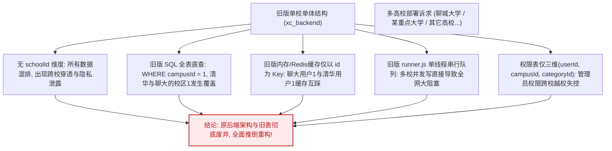

- **数据无法隔离**：旧版所有表（如 `patrols`、`users`、`departments`）均没有 `schoolId` 字段。一旦部署新学校，所有学校的学生报修单混杂在一起。
- **校区概念冲突**：各高校均存在“东校区”、“西校区”、“南校区”，其内部主键通常为 `1, 2, 3`。若没有 `schoolId`，系统根本无法分辨 `campusId = 1` 是聊城大学东校区还是清华大学本部。
- **缓存体系污染**：旧版缓存 Key 为 `users:1`、`patrols:102`。在多校环境下，不同学校自增 ID 发生冲突，导致用户 A 登录看到其他学校用户 B 的报修与个人档案。
- **单进程排队成为致命瓶颈**：旧版通过 Node.js 内存 FIFO 队列对写操作执行单线程串行处理。多校数万师生同时使用时，并发响应延迟将呈指数级恶化。

### 2. 学校ID (`schoolId`) 与校区ID (`campusId`) 的两级层级拓扑

必须从顶层建立不可撼动的两级拓扑模型：

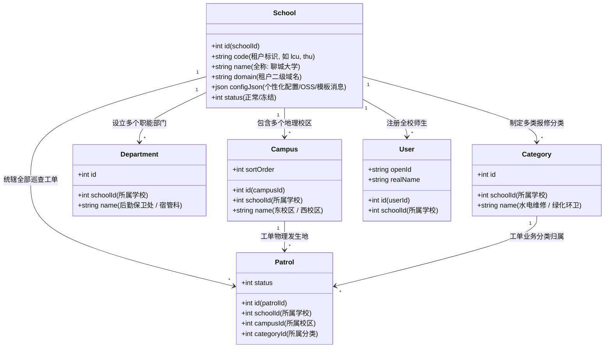

- **学校ID (`schoolId`)**：**顶层租户标识符**。全局独立、跨校唯一。任何学校的数据在物理数据库与逻辑服务中绝对互不侵犯。
- **校区ID (`campusId`)**：**学校下属地理区域标识符**。严格依附于 `schoolId` 存在（即复合外键/复合主键逻辑 `(schoolId, campusId)`）。不同学校可以拥有同名或相同编号的校区，但在 `schoolId` 隔离下完全互不干扰。

### 3. 新版多租户高可用架构演进目标

1. **多租户全表隔离**：所有 20 张物理业务表一律内置 `schoolId INT NOT NULL`，建立 `(schoolId, ...)` 复合索引。
2. **AST 语法树自动注入**：框架底层 SQL AST 引擎在编译期与执行期自动补全 `schoolId = ?` 约束条件，无需业务开发者在每一处手写判空，杜绝漏写导致的跨校越权。
3. **高并发内核继承**：以 RuruChat 的现代分布式内核（声明式 AST DSL、二段式缓存极速读、Redis 分布式排他行锁、Saga 逆序撤回补偿栈）为支撑，支撑多校集群高吞吐。
4. **4 进程高并发集群**：支持并行拉起 4 个后端实例（端口 8000~8003），依托 Redis 广播总线打通跨进程通信，实现真正的水平扩展能力。

---

## 二、 深度剖析：从单校极客架构到企业级多租户 SaaS 内核

### 1. 原 RuruChat 分布式高性能内核机制继承与提炼

RuruChat 是为超大规模并发、算力计量与动态调度设计的分布式云原生系统。其核心技术为高校后勤巡查系统的升级改造提供了坚实的基础设施：

1. **零显式 DB 事务 + Saga 撤回栈 (`withdrawStack`)**：
   - 传统数据库事务在复杂业务交互、跨网络外部通信（如微信接口调用、阿里云 OSS 上传）时会长期占死连接池，引发严重的死锁和连接枯竭。
   - RuruChat 采用单句执行自动提交，并在每个步骤成功时向 `withdrawStack` 压入对称的逆向补偿闭包（Undo Closure）。
   - 若业务失败或异常，调度器严格按照 **后进先出 (LIFO)** 顺序逆序调用补偿闭包，完成数据库脏数据回滚与 Redis 缓存恢复。
2. **基于 Redis Pub/Sub 的分布式排他行锁 (`RowLockManager`)**：
   - 采用 `SET lock:{schoolId}:{table}:{id} requestId PX 10000 NX` 原子操作。
   - 支持同一请求上下文的**重入机制（Re-entrancy）**。
   - 锁等待者监听 Redis 频道毫秒级唤醒，彻底告别单机单线程排队队列。
3. **声明式 SQL AST DSL 与二段式缓存极速读取**：
   - 强类型 DSL 结构化解析，单表执行约束，杜绝 SQL 注入。
   - **二段式读**：轻量覆盖索引提取主键 ID 向量 -> 批量读取 Redis 缓存 (`mgetKV`) -> 未命中者执行向量批量回源（`WHERE id IN (?)`）并异步回填 Redis。

### 2. 旧版 `xc_backend` 的历史局限与单机单校设计反思

| 核心维度 | 旧版小程序后端 (`xc_backend`) | 新版多租户架构 (`v4.0/Backend`) | 升级原因与架构质变 |
| :--- | :--- | :--- | :--- |
| **租户支持** | 纯单校单体设计，无 `schoolId` 概念 | **全表强制 `schoolId` 隔离 + 多租户动态解析** | 彻底支持未来全国 100+ 高校弹性接入与 SaaS 运营。 |
| **并发调度** | 单机 Node.js 单线程 FIFO 队列 (`runner.js`) | **4 节点集群 + Redis 分布式排他行锁** | 解除单核串行限制，支持多进程、多服务器横向水平扩容。 |
| **数据事务** | 显式数据库事务包裹 (`START TRANSACTION`) | **连接池自动提交 + Saga LIFO 撤回补偿栈** | 杜绝长事务导致的数据库连接耗尽与行锁死锁。 |
| **缓存机制** | 单机内存 SQL 文本缓存，写操作全表全量清空 | **Redis 行级缓存 (`{schoolId}:{table}:{id}`) + 自动淘汰** | 缓存多节点共享，粒度细化至单行，避免雪崩失效。 |
| **权限控制** | 三维矩阵 (`userId × campusId × categoryId`) | **四维多租户矩阵 (`schoolId × userId × campusId × categoryId`)** | 彻底防止不同高校之间管理员越权管理其他学校工单。 |
| **代码工程** | 纯 JavaScript CommonJS、对象树嵌套注册 | **TypeScript 严格模式、ESM 模块、文件目录路由约定** | 编译期类型安全保障，团队敏捷协作，易于长期维护。 |

### 3. 7 项底层陷阱与关键盲区的多租户适配升级

在新版重构中，必须对底层数据库与多租户适配做到底层修正：

1. **MySQL 不支持 `RETURNING id`**：
   - 移除原 PostgreSQL 的 `RETURNING id` 语法，改为执行后从 `mysql2/promise` 的 `result.insertId` 获取自增主键。
2. **多租户与软删除在 AST 层强制交替校验**：
   - 在 AST 语法树遍历构建阶段，框架内核强制在 WHERE 条件中自动注入：
     ```sql
     WHERE `schoolId` = ? AND `isDeleted` = 0
     ```
   - 业务代码无需显式拼接，彻底杜绝漏写可能。
3. **保留字反引号转义**：
   - 字段名一律用反引号转义：`` `desc` = ? ``、`` `key` = ? ``，防止 MySQL 语法解析报错。
4. **二段式回源批量查询适配**：
   - 由 PostgreSQL 的 `WHERE id = ANY($1)` 改为 MySQL 原生的 ``WHERE `id` IN (?)``。
5. **UPDATE 成功后自动淘汰 Redis 多租户缓存**：
   - 框架在 UPDATE 执行成功时，自动计算 Key `{schoolId}:{table}:{id}` 并执行 `delKV`，解决脏读漏洞。
6. **MasterDispatcher 扩展动态路径匹配**：
   - 兼容 `/api/file/download/:filename` 动态路由通配解析与 OSS 预签名 302 重定向。
7. **跨进程多租户 WebSocket 广播总线**：
   - Redis Pub/Sub 频道广播格式增加 `schoolId` 租户过滤标签，保证 A 大学工单动态绝不推送到 B 大学连接上。

---

## 三、 新版多租户数据底座：全表 `schoolId` 深度规划与 27 表 7 视图拓扑

### 1. 租户隔离模型选择：共享数据库、共享数据表、全表行级 `schoolId` 隔离

在 SaaS 架构中，行级字段隔离（Shared Database, Shared Schema, Row-Level Isolation）兼顾了资源利用率最大化与维护成本极小化：
- 单一 MySQL 实例即可支持上百所高校平滑入驻；
- 数据库连接池复用，极低硬件成本；
- 统计报表、跨校横向后勤数据分析极其便捷；
- **核心保障**：依靠框架层 AST 语法树自动强制注入与复合主键/复合索引体系，从代码根基上构建 100% 可靠的物理隔离壁垒。

### 2. 数据库设计哲学：物理零外键 (Zero Foreign Keys) + 数据库原生约束 (DB-Level Constraints)

> [!IMPORTANT]
> **设计准则一：100% 物理零外键，最多仅保留主键 (PRIMARY KEY)**  
> - **杜绝级联锁与性能拖垮**：在高并发多校报修和频繁工单状态流转下，物理外键会产生严重的跨表级联共享锁，极大降低并发插入吞吐，并极易引发分布式场景下的死锁。  
> - **继承旧版极客哲学的自由度**：全系统 27 张物理表仅保留自增主键 `PRIMARY KEY (id)`，严禁任何物理 `FOREIGN KEY` 约束。表间全部通过逻辑外键字段（`schoolId`, `campusId`, `departmentId`, `tagId`, `patrolId`, `userId`, `appCode`）维系关联，轻量高效，易于水平分表与数据归档。
>
> **设计准则二：数据的完整性与合法性主要通过数据库级原生约束深度实现**  
> - **非空与默认值强固化 (`NOT NULL` + 精准 `DEFAULT`)**：全表核心业务列强制 `NOT NULL`，杜绝 NULL 带来的逻辑陷阱与索引膨胀；  
> - **联合唯一防重约束 (`UNIQUE KEY`)**：  
>   - 微信授权：`UNIQUE KEY (schoolId, openId)` 防跨校串号；  
>   - 标签成员：`UNIQUE KEY (schoolId, tagId, userId)` 防单人重复绑定相同标签；  
>   - 群聊成员：`UNIQUE KEY (schoolId, roomId, userId)` 防重复入群；  
>   - 广场点赞：`UNIQUE KEY (schoolId, postId, userId)` 数据库级防并发重复点赞；  
>   - 工单评价：`UNIQUE KEY (schoolId, patrolId)` 保证一单只评一次；  
>   - 系统配置：`UNIQUE KEY (schoolId, key)` 保证配置项唯一；  
> - **MySQL 8.x 原生 `CHECK` 约束**：从数据库引擎层卡死业务非法值写入：  
>   - `CHECK (status BETWEEN 0 AND 5)` 卡死工单状态机范围；  
>   - `CHECK (role IN (0, 1, 2, 3, 4, 9))` 卡死四级权限角色取值；  
>   - `CHECK (roomType IN ('patrol', 'direct', 'group'))` 卡死即时通信会话类型；  
>   - `CHECK (score BETWEEN 1 AND 5)` 卡死满意度打分星级；  
>   - `CHECK (type IN (1, 2, 3))` 卡死派单权限类型。

### 3. 核心 27 张物理表与 7 大视图多租户字典规划 (含飞书工作台、微应用、日程调度、群聊与AI Agent)

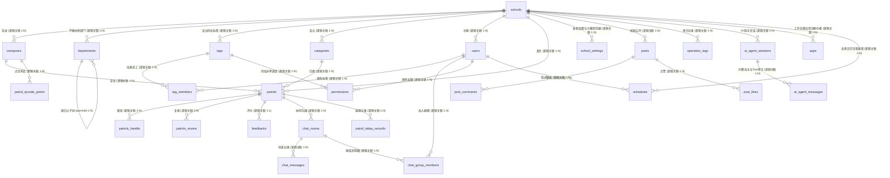

#### 27 张核心物理表多租户数据字典

| 序号 | 表名 (`Table Name`) | 中文名称 | 是否含 `schoolId` | 核心字段、数据库级约束与索引说明 |
| :--- | :--- | :--- | :--- | :--- |
| 1 | **`schools`** | **学校租户主表** | **根节点** | `id (PK)`, `code`, `name`, `logo`, `domain`, `status`, `planLevel`, `planType`, `maxMonthlyPatrols`, `storageQuotaMb`, `planExpireAt`, `configJson`。约束: `CHECK (status IN (-1, 0, 1))`, `CHECK (planLevel IN (0, 1, 2))`, `CHECK (planType IN ('limited', 'unlimited'))`。唯一索引: `uk_school_code (code)`，索引: `idx_school_expire (planExpireAt, status)` |
| 2 | **`campuses`** | 校区字典表 | **YES** | `id (PK)`, `schoolId`, `name`, `address`, `sortOrder`, `isDeleted`。约束: `CHECK (isDeleted IN (0, 1))`。索引: `(schoolId, isDeleted)` |
| 3 | **`departments`** | 部门架构树表 | **YES** | `id (PK)`, `schoolId`, `parentId`, `name`, `path`, `leaderId`, `contactPhone`, `sortOrder`, `isDeleted`。支持飞书式无限级树状部门与路径检索（如 `/1/2/3/`）。索引: `(schoolId, parentId)`, `(schoolId, path)` |
| 4 | **`categories`** | 巡查故障分类表 | **YES** | `id (PK)`, `schoolId`, `name`, `icon`, `defaultDays`, `sortOrder`, `isDeleted`。约束: `CHECK (defaultDays > 0)`。索引: `(schoolId, isDeleted)` |
| 5 | **`users`** | 师生与各级管理员主表 | **YES** | `id (PK)`, `schoolId`, `openId`, `role`, `realName`, `phone`, `jobNo`。约束: `CHECK (role IN (0, 1, 2, 3, 4, 9))`。唯一索引: `uk_school_openid (schoolId, openId)` |
| 6 | **`permissions`** | 四维权限派单调度表 | **YES** | `id (PK)`, `schoolId`, `userId`, `tagId`, `campusId`, `categoryId`, `type`。支持按人员或按职能标签派发。约束: `CHECK (type IN (1, 2, 3))`。复合索引: `(schoolId, userId)`, `(schoolId, tagId)`, `(schoolId, campusId, categoryId, type)` |
| 7 | **`patrols`** | 巡查工单主表 | **YES** | `id (PK)`, `schoolId`, `campusId`, `categoryId`, `orderNo`, `creatorId`, `imagesJson`, `status`, `deadline`。约束: `CHECK (status BETWEEN 0 AND 5)`。复合索引: `(schoolId, status, createdAt)` |
| 8 | **`patrols_handle`**| 整改处理记录表 | **YES** | `id (PK)`, `schoolId`, `patrolId`, `handlerId`, `content`, `imagesJson`, `durationHours`。约束: `NOT NULL`。索引: `(schoolId, patrolId)` |
| 9 | **`patrols_review`**| 复核审核记录表 | **YES** | `id (PK)`, `schoolId`, `patrolId`, `reviewerId`, `isPassed`, `remark`。约束: `CHECK (isPassed IN (0, 1))`。索引: `(schoolId, patrolId)` |
| 10 | **`feedbacks`** | 满意度评价表 | **YES** | `id (PK)`, `schoolId`, `patrolId`, `userId`, `score`, `isAutoPassed`。约束: `CHECK (score BETWEEN 1 AND 5)`。唯一索引: `uk_school_patrol (schoolId, patrolId)` |
| 11 | **`patrol_delay_records`**| 工单延期申请表| **YES** | `id (PK)`, `schoolId`, `patrolId`, `applicantId`, `reason`, `delayHours`, `status`。约束: `CHECK (status IN (0, 1, 2))`。索引: `(schoolId, patrolId)` |
| 12 | **`chat_rooms`** | 即时通信协同会话表| **YES** | `id (PK)`, `schoolId`, `patrolId`, `roomType`, `name`, `avatar`, `ownerId`, `creatorId`, `handlerId`, `initiatedByHandler`, `isPinned`, `handlerUnreadCount`, `creatorUnreadCount`, `isClosed`, `lastMessage`。约束: `CHECK (roomType IN ('patrol', 'direct', 'group'))`。索引: `idx_room_type (schoolId, roomType)`, `idx_room_handler_pin (schoolId, handlerId, isPinned)` |
| 13 | **`chat_messages`**| 聊天消息明细表 | **YES** | `id (PK)`, `schoolId`, `chatRoomId`, `senderId`, `answerMessageId`, `content`, `type`, `isWithDraw`, `withdrawnAt`。约束: `CHECK (type IN (0, 1, 2, 3))`, `CHECK (isWithDraw IN (0, 1))`。索引: `(schoolId, chatRoomId, id)` |
| 14 | **`messages`** | 统一消息中枢流表 | **YES** | `id (PK)`, `schoolId`, `receiverId`, `appId`, `title`, `content`, `cardPayloadJson`, `priority`, `isRead`, `externalPushStatus`。约束: `CHECK (isRead IN (0, 1))`。索引: `(schoolId, receiverId, isRead)`, `(schoolId, appId, createdAt)` |
| 15 | **`posts`** | 校园公开广场动态表 | **YES** | `id (PK)`, `schoolId`, `creatorId`, `title`, `content`, `imagesJson`, `likeCount`, `status`。约束: `CHECK (status IN (-1, 0, 1))`。索引: `(schoolId, status, createdAt)` |
| 16 | **`post_comments`**| 广场评论表 (支持访客)| **YES** | `id (PK)`, `schoolId`, `postId`, `userId`, `guestNick`, `guestAvatar`, `replyCommentId`, `content`。约束: `CHECK (isDeleted IN (0, 1))`。索引: `(schoolId, postId, isDeleted, createdAt)` |
| 17 | **`post_likes`** | 广场点赞记录表 | **YES** | `id (PK)`, `schoolId`, `postId`, `userId`。约束: `NOT NULL`。唯一复合索引: `uk_school_post_user (schoolId, postId, userId)` |
| 18 | **`school_settings`**| 学校配置与AI大模型字典表| **YES** | `id (PK)`, `schoolId`, `key`, `value`, `desc`, `isEncrypted`。约束: `CHECK (isEncrypted IN (0, 1))`。唯一索引: `uk_school_key (schoolId, key)` |
| 19 | **`operation_logs`**| 审计操作日志表 | **YES** | `id (PK)`, `schoolId`, `userId`, `action`, `module`, `ip`, `payloadJson`。约束: `NOT NULL`。索引: `(schoolId, module, createdAt)` |
| 20 | **`patrol_qrcode_points`**| 巡检点位二维码表| **YES**| `id (PK)`, `schoolId`, `campusId`, `name`, `code`, `location`。约束: `CHECK (isDeleted IN (0, 1))`。唯一索引: `uk_school_code (schoolId, code)` |
| 21 | **`ai_agent_sessions`**| AI智能助手多轮会话表| **YES**| `id (PK)`, `schoolId`, `userId`, `title`, `isDeleted`。约束: `CHECK (isDeleted IN (0, 1))`。索引: `(schoolId, userId, isDeleted, updatedAt)` |
| 22 | **`ai_agent_messages`**| AI对话与工具调用审计表| **YES**| `id (PK)`, `schoolId`, `sessionId`, `role`, `content`, `toolCallsJson`, `toolResultsJson`。约束: `CHECK (role IN ('user', 'assistant', 'tool', 'system'))`。索引: `(schoolId, sessionId, id)` |
| 23 | **`tags`** | 组织职能标签表 | **YES** | `id (PK)`, `schoolId`, `name`, `color`, `description`, `sortOrder`, `isDeleted`。实现“权限随岗不随人”，配有 Windows Metro UI 经典色彩标识。约束: `CHECK (isDeleted IN (0, 1))`。唯一索引: `uk_school_tag (schoolId, name)` |
| 24 | **`tag_members`** | 标签与员工映射表 | **YES** | `id (PK)`, `schoolId`, `tagId`, `userId`, `createdAt`。人员调休、轮岗一键换人交接。唯一复合索引: `uk_school_tag_user (schoolId, tagId, userId)`，索引: `idx_tag_user (schoolId, userId)` |
| 25 | **`chat_group_members`**| 群聊成员明细表 | **YES** | `id (PK)`, `schoolId`, `roomId`, `userId`, `role`, `lastReadMessageId`, `joinedAt`。约束: `CHECK (role IN ('owner', 'admin', 'member'))`。唯一复合索引: `uk_school_room_user (schoolId, roomId, userId)` |
| 26 | **`apps`** **[全新表]** | 工作台微应用注册表 | **YES** | `id (PK)`, `schoolId`, `appCode`, `name`, `category`, `entryRoute`, `minRole`, `badgeApi`, `sortOrder`。约束: `CHECK (category IN ('daily', 'service', 'emergency', 'management'))`。唯一索引: `uk_school_app_code (schoolId, appCode)` |
| 27 | **`schedules`** **[全新表]** | 全景日历日程排班表 | **YES** | `id (PK)`, `schoolId`, `userId`, `title`, `type`, `startTime`, `endTime`, `priority`, `dutyPhone`。约束: `CHECK (type IN ('custom', 'sla_deadline', 'duty', 'maintenance'))`。索引: `(schoolId, userId, startTime, endTime)` |

#### 7 大全景视图规划 (Views)

| 序号 | 视图名称 (`View Name`) | 视图类型 | 核心聚合业务与作用 |
| :---: | :--- | :--- | :--- |
| 1 | **`v_patrol_details`** | 工单全景宽表视图 | 联结工单、学校、校区、分类、报修人、处理人、验收人与评价打分，零多表 JOIN 极速拉取详情 |
| 2 | **`v_pending_tasks`** | 师傅与科室待办视图 | 实时筛选未结工单，计算剩余工时与超期状态（`isOverdue`），驱动师傅接单大厅 |
| 3 | **`v_school_stats`** | 租户效能大盘统计视图 | 聚合全校累计工单数、今日新增、当月新增、完工率、平均时效与综合评分 |
| 4 | **`v_category_health`**| 故障类型健康度视图 | 统计各类故障上报频次、平均处理工时与满意度，为校园资产维保改造提供决策支撑 |
| 5 | **`v_chat_active_sessions`**| 活跃即时通信会话大盘 | 联结工单与群聊信息，聚合展示未读消息数、最后聊天摘要与置顶状态 |
| 6 | **`v_admin_workbench`**| 管理员全局中枢大盘 | 聚合待审核延期、严重超时预警与异常退单，一站式向高校管理层警示风险 |
| 7 | **`v_org_tree`** | 组织架构与部门树全景视图 | 联结父子部门信息与部门负责人名册，毫秒级输出高校组织架构树形拓扑 |

### 4. 多租户复合索引与查询性能红线

为了保证多租户体系在高并发下的极速响应，新版确立严格的**索引设计三大准则**：
1. **左前缀规则**：所有业务查询表的复合索引，必须以 `schoolId` 作为第一列（例如 `INDEX idx_school_status (schoolId, status, createdAt)`）。
2. **唯一性约束绑定租户**：用户表的 openId 或工单的外部编号不能建立全局唯一索引，必须建立联合唯一索引：`UNIQUE KEY uk_school_openid (schoolId, openId)`。
3. **主键查询强制挂载租户**：即便通过自增主键 `id` 查询单条记录，SQL 必须写成 ``WHERE `id` = ? AND `schoolId` = ?``，确保用户无法通过篡改 URL 主键探测跨校数据。

---

## 四、 新版后端 (v4.0/Backend) 多租户核心技术改造方案

### 1. 数据库引擎适配：MySQL 8.x + AST 语法树自动注入 `schoolId`

在底层 AST 执行器 (`astRunner.ts`) 和查询构建器 (`selectBuilder.ts`) 中，引入**租户透明注入器（TenantInjector）**：

```typescript
// ASTRunner 执行前自动核查并注入租户约束
export function injectTenantConstraint(ast: AstRoot, schoolId: number): void {
  // 1. 过滤系统级免隔离表 (如 schools 表本身)
  if (ast.table === "schools") return;

  // 2. 检查 AST 中是否已显式挂载 schoolId 比较节点
  const hasSchoolConstraint = ast.whereNodes.some(
    (node) => node.type === "COMPARE" && node.column === "schoolId"
  );

  // 3. 若无，在 WHERE 根节点追加: `schoolId` = ?
  if (!hasSchoolConstraint) {
    ast.whereNodes.push({
      type: "COMPARE",
      column: "schoolId",
      operator: "=",
      value: schoolId,
    });
  }
}
```
**安全收益**：
即使未来新加入的初级后端开发者直接写 `declare.where.compare("status", "=", 0)`，框架底层在编译 SQL 阶段也会自动将其编译为：
```sql
SELECT `id` FROM `patrols` WHERE `status` = ? AND `schoolId` = ? AND `isDeleted` = 0
```
从根本上斩断人为失误造成的跨租户数据穿透隐患。

### 2. 多租户上下文网关：TenantContext 与 MasterDispatcher

在 `MasterDispatcher` 请求处理入口，优先解析客户端请求来源中的租户身份：

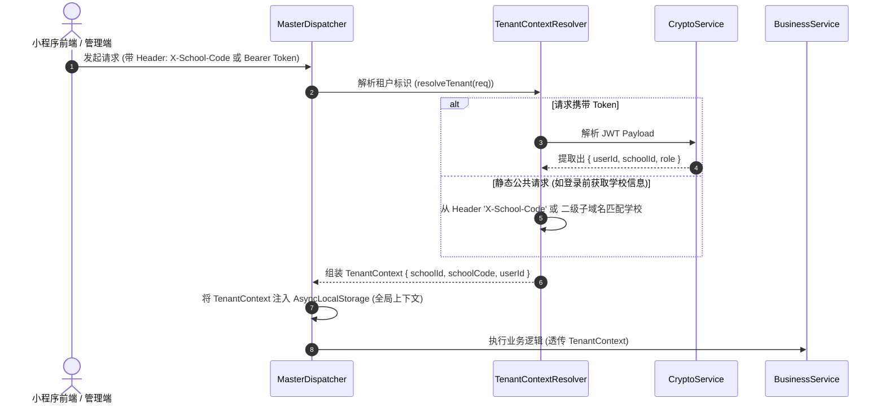

- **三级租户识别策略**：
  1. **已登录请求**：从经过非对称校验的 JWT Token 中直接提取权威的 `schoolId` 与 `userId`（无法被伪造）。
  2. **未登录公开请求**（如首页全校公开广场瀑布流）：从请求头 `X-School-Code: lcu` 获取学校简称代码，在 Redis 租户缓存字典中 O(1) 转换获取 `schoolId`。
  3. **域名二级解析**：支持多租户 Web 管理后台根据 `lcu.xcesb.cn` 直接锁定学校租户。

### 3. 多租户分布式行锁与缓存体系：Redis 命名空间隔离

在多租户集群环境下，所有 Redis 键名与分布式行锁必须强制携带 `schoolId` 租户前缀：

```typescript
// 缓存 Key 规范化生成函数
export function getTenantCacheKey(schoolId: number, table: string, id: number | string): string {
  return `school:${schoolId}:${table}:${id}`;
}

// 分布式排他行锁规范化生成函数
export function getTenantRowLockKey(schoolId: number, table: string, id: number | string): string {
  return `lock:school:${schoolId}:${table}:${id}`;
}
```

- **彻底规避 Key 碰撞**：不同学校即便是同为 ID 为 1 的工单，其行锁分别为 `lock:school:1:patrols:1` 与 `lock:school:2:patrols:1`，互不阻塞、互不污染。
- **租户级批量缓存清空**：当某一所学校进行配置全量重载时，可针对 `school:{schoolId}:*` 进行平滑失效，完全不影响其他在线高校。

### 4. 多租户四级立体权限矩阵与角色鉴权 (RBAC)

新版权限模型重构为**四级多租户立体权限体系**，彻底废除旧版扁平单一的角色逻辑：

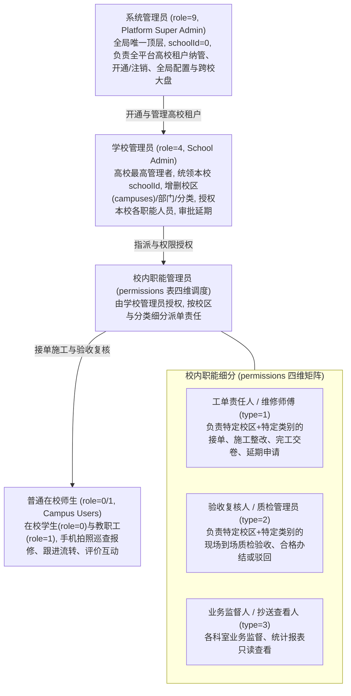

#### 四维调度表设计 (物理零外键 + 原生 CHECK 约束)：
```sql
CREATE TABLE `permissions` (
  `id` INT AUTO_INCREMENT PRIMARY KEY,
  `schoolId` INT NOT NULL COMMENT '所属学校ID (逻辑关联 schools.id)',
  `userId` INT NOT NULL COMMENT '被授权用户ID (逻辑关联 users.id)',
  `campusId` INT NOT NULL DEFAULT 0 COMMENT '所属校区ID (0为全校通配)',
  `categoryId` INT NOT NULL DEFAULT 0 COMMENT '所属故障分类ID (0为全分类通配)',
  `type` TINYINT NOT NULL COMMENT '权限类型: 1处理人, 2审核人, 3抄送人',
  `createdAt` DATETIME NOT NULL DEFAULT CURRENT_TIMESTAMP,
  INDEX `idx_school_user` (`schoolId`, `userId`),
  INDEX `idx_school_dispatch` (`schoolId`, `campusId`, `categoryId`, `type`),
  CONSTRAINT `chk_perm_type` CHECK (`type` IN (1, 2, 3))
) ENGINE=InnoDB DEFAULT CHARSET=utf8mb4 COMMENT='多租户四维权限分配矩阵 (零外键)';
```

- **分级鉴权与越权拦截**：
  - **系统管理员 (`role = 9`)**：可通过请求头 `X-Target-School-Id` 临时穿透进入任意高校视角进行运维排障；
  - **学校管理员 (`role = 4`)**：仅能管理本校（`schoolId === token.schoolId`）的校区、人员与延期申请，杜绝跨校管理；
  - **责任人与复核人 (`type = 1/2`)**：系统通过 `permissions` 自动匹配 `(schoolId, campusId, categoryId)`，实现毫秒级精准派单与验收复核。
- **通配调度能力**：
  - `campusId = 0` 表示该人员负责该学校所有校区的某类问题；
  - `categoryId = 0` 表示该人员负责某校区的所有分类问题。

### 5. 四进程集群下的多租户 WebSocket 广播总线

多节点集群拉起 4 个并行 Backend 实例（端口 8000~8003），依托 Redis 广播总线同步推送消息：

```typescript
// 跨节点广播数据包
export interface WsClusterBroadcastPayload {
  schoolId: number;         // 租户过滤标记 (强制)
  patrolId?: number;        // 工单聊天室 ID
  targetUserId?: number;    // 单播目标用户
  event: string;            // 事件名: PATROL_UPDATED / CHAT_MESSAGE
  data: any;                // 消息实体
}
```
**推送节点行为**：
任意 Backend 实例接收到广播包后，优先判断本地连接是否属于对应的 `schoolId`。若不属于该学校，直接丢弃该数据包，杜绝跨校消息穿透。

### 6. 多租户文件存储与对象存储 (OSS) 租户路径隔离

巡查工单现场照片、整改后照片、巡查点位小程序码均存储至阿里云 OSS，但在路径组织上全面升级为租户隔离：

```
OSS Bucket/
├── school_1/ (聊城大学)
│   ├── patrols/202609/patrol_102_before.jpg
│   ├── handles/202609/handle_88_after.jpg
│   └── qrcodes/point_west_dorm1.png
│
├── school_2/ (某重点大学)
│   ├── patrols/202609/...
│   └── handles/202609/...
```
- **安全与账单隔离**：支持各高校在 `schools.configJson` 中自定义私有 OSS Bucket，或在统一共享 Bucket 内通过根目录租户隔离。

### 7. 日志体系：内置多进程、多租户结构化终端彩色输出

自研 `LocalTerminalLogger`，支持多进程实例打标与多租户标识高亮：

```typescript
[13:10:25] [INFO] [Node-01] [Tenant:101-聊城大学] [PatrolService] 工单 #892 状态更新成功: 待复核 -> 已办结 (耗时: 12ms)
```

### 8. SaaS 学校付费级别配额核算与服务到期阻断中间件 (TenantPlanInterceptor)

为支持面向全国多所高校的商业化 SaaS 运营与灵活配额管理，网关层内置 `TenantPlanInterceptor`：

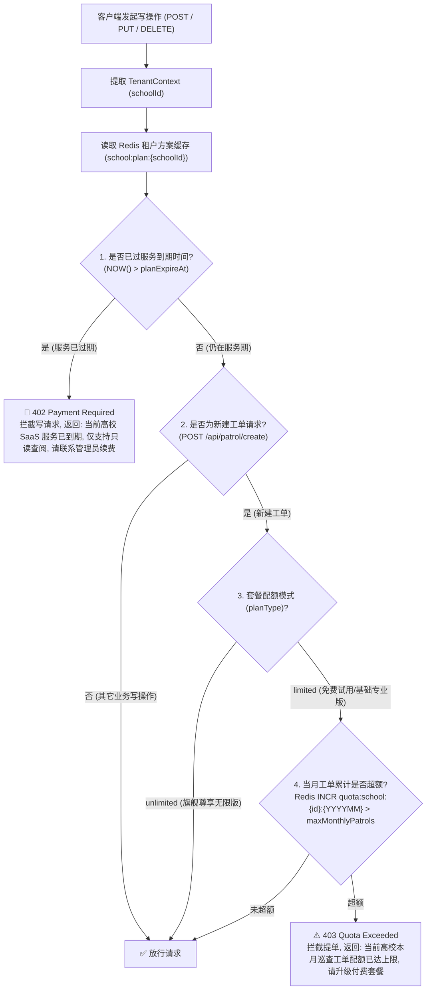

- **三级付费版本策略实现**：
  - **免费体验版 (`planLevel=0`, `planType='limited'`, `maxMonthlyPatrols=100`)**：高校免费体验接入，月工单配额硬顶 100 单，存储上限 1GB；
  - **基础专业版 (`planLevel=1`, `planType='limited'`, `maxMonthlyPatrols=500~2000`)**：按月/年采购配额，支持工单流转、数据大屏与延迟审批；
  - **旗舰尊享版 (`planLevel=2`, `planType='unlimited'`, `maxMonthlyPatrols=-1`)**：高校标杆专属，无限工单、无限存储、集群多进程 WebSocket 与 SLA 级技术保障。
- **Redis 计数器原子操作**：
  每月初由 Redis 原子自增 `INCR quota:school:{schoolId}:{YYYYMM}` 并设置 60 天自动过期，杜绝并发提单导致的超额穿透。

---

### 9. 后勤专属类 QQ 即时协同通讯后端长连接体系 (汲取 city_system 精髓)

新版后端参考成熟系统 `e:\Projects\Personal\city_system` 的架构精髓，为后勤人员与师生打造了高度沉浸、工业级的工单即时通信中台：

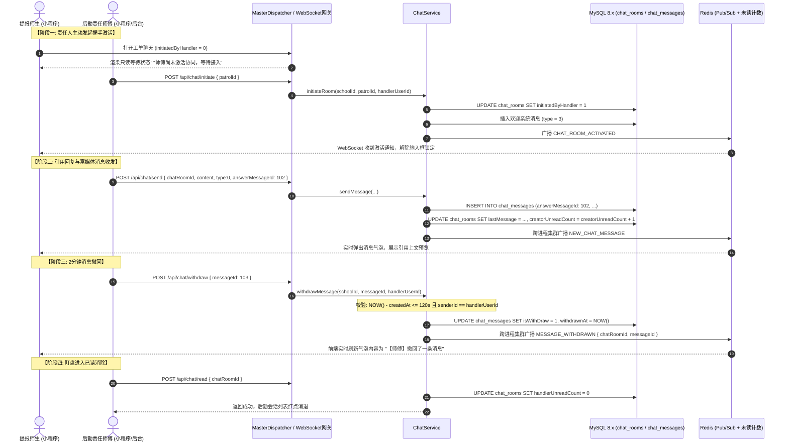

- **类 QQ 核心机制落地保障**：
  1. **主动发起守卫机制**：`initiatedByHandler` 字段由后端强校验。提报人若尝试调用 `POST /api/chat/send` 发送第一条消息，网关将以 `403` 拦截，杜绝学生报障后对后勤师傅造成恶意电话或消息骚扰。
  2. **2分钟撤回控制 (`isWithDraw`)**：严格比对发信时间戳，超过 120 秒拒绝撤回；撤回消息保留元数据，但内容置灰保护；引用了撤回消息的前端智能降级展示为“引用的消息已被撤回”。
  3. **触顶历史漫游拉取 (`beforeId`)**：
     ```sql
     SELECT * FROM `chat_messages` 
     WHERE `schoolId` = ? AND `chatRoomId` = ? AND `id` < ? 
     ORDER BY `id` DESC LIMIT 20;
     ```
     倒序分页后在应用层逆序反转，配合小程序前端 `scroll-view` 动态锚定视口，杜绝翻页跳屏。
  4. **会话大盘与置顶调度 (`v_chat_sessions`)**：
     针对后勤维修师傅与管理员，支持一键将重点关注工单会话置顶（`isPinned = 1`），查询会话列表时严格按照 `isPinned DESC, lastMessageAt DESC` 排序输出。

---

### 10. 双轨合一校园公开广场数据流与访客评论机制

v4.0 打造了“内部工单闭环轨”与“外部校园公开轨”的双轨合一机制：

- **未登录访客公开展示**：
  - 师生提报问题时可自愿勾选 `isPublic = 1`，工单通过审核后自动联动映射到 `posts` 表；
  - 访客即便未微信登录授权，进入小程序即可直接调用 `GET /api/post/list` 浏览全校后勤保修进展与整改公开实况。
- **访客安全公开评论 (`guestNick`, `guestAvatar`)**：
  - 未登录用户可在公开广场动态下发表公开评论，接口 `POST /api/post/comment` 允许访客免登录调用；
  - **防刷频与内容安全三道防线**：
    1. **IP 频控**：基于 Redis 令牌桶对 `rate:comment:ip:{ip}` 限流（单 IP 每分钟最多发表 3 条评论）；
    2. **客户端指纹防刷**：由小程序本地生成并在请求头携带访客指纹 `X-Visitor-Fingerprint`；
    3. **内容安全合规审查**：评论内容强制通过微信文本安全接口 (`msg_sec_check`) 或系统敏感词字典检测，违规内容即时阻断。

### 11. 多租户自适应 OpenAI 大模型客户端工厂与 AI Agent 工具调用引擎 (AiAgentService)

为了实现各高校管理员自由接入各自的大模型并在小程序端支撑强大的智能后勤助手，后端设计了**多租户动态 LLM 接入中枢与 ReAct 智能体引擎**：

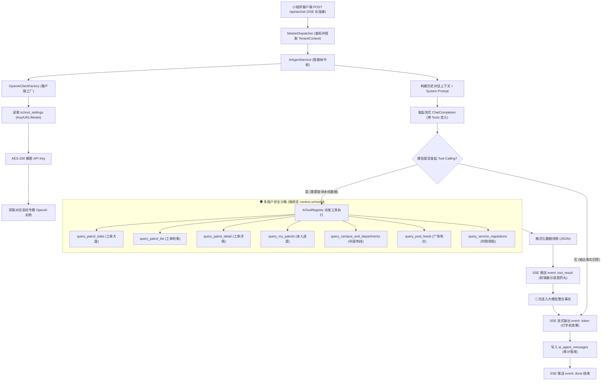

#### (1) 多租户动态客户端工厂 (`OpenAiClientFactory`)
- 各高校的大模型参数存储于 `school_settings` 表中，包括 `ai_api_key`（密文）、`ai_base_url`、`ai_model`、`ai_temperature` 与 `ai_system_prompt`；
- 后端维护多租户 LRU 缓存池 `Map<schoolId, OpenAIClient>`，缓存有效生命周期 30 分钟。当学校管理员更新配置后，发布 Redis 消息广播各 Backend 节点平滑刷新客户端，实现零停机热切换。

#### (2) 7 大专用后勤数据工具集实现 (`aiToolRegistry.ts`)
所有 Agent 工具由后端强类型实现，并通过租户上下文卡死隔离边界：
```typescript
export interface AiToolContext {
  schoolId: number;
  userId: number;
  role: number;
}

export const aiTools: Record<string, (args: any, ctx: AiToolContext) => Promise<any>> = {
  // 1. 查询宏观工单大盘统计
  query_patrol_stats: async (args, ctx) => {
    return await statisticsService.getOverviewStats(ctx.schoolId, args.campusId, args.timeRange);
  },
  // 2. 检索巡查工单列表
  query_patrol_list: async (args, ctx) => {
    return await patrolService.searchPatrols(ctx.schoolId, {
      campusId: args.campusId,
      categoryId: args.categoryId,
      status: args.status,
      keyword: args.keyword,
      limit: Math.min(args.limit || 5, 10) // 限制最大条数保护上下文窗口
    });
  },
  // 3. 查看具体工单流转与照片
  query_patrol_detail: async (args, ctx) => {
    return await patrolService.getPatrolDetail(ctx.schoolId, args.patrolId);
  },
  // 4. 查询当前用户本人的工单进度 (自动注入当前 userId)
  query_my_patrols: async (args, ctx) => {
    return await patrolService.getMyPatrols(ctx.schoolId, ctx.userId);
  },
  // 5. 查询校区与科室对外联系电话
  query_campus_and_departments: async (args, ctx) => {
    return await schoolService.getCampusAndDepts(ctx.schoolId, args.keyword);
  },
  // 6. 检索校园广场热点关注
  query_post_feeds: async (args, ctx) => {
    return await postService.getPublicFeeds(ctx.schoolId, args.keyword);
  },
  // 7. 查询后勤服务承诺时效标准
  query_service_regulations: async (args, ctx) => {
    return await schoolService.getRegulations(ctx.schoolId, args.categoryName);
  }
};
```

#### (3) 流式 SSE (Server-Sent Events) 响应协议规范
接口 `POST /api/ai/chat` 采用流式传输，分阶段下发高保真事件：
```
event: status
data: {"stage":"calling_tool","toolName":"query_patrol_list","desc":"正在检索聊大东校区水管保修记录..."}

event: tool_result
data: {"toolName":"query_patrol_list","matchCount":2,"summary":"找到2条处理中的水管报修工单"}

event: token
data: {"delta":"根据后勤实时数据，聊城大学东校区目前有 **2项** 正在紧急抢修的水管漏水工单：\n\n"}

event: card
data: {"type":"patrol_card","orderNo":"LCU-202609-088","title":"东校区实验楼1楼男厕水管破裂","status":1,"handler":"张师傅 (13806351234)"}

event: done
data: {"sessionId":5,"totalTokens":642,"latencyMs":1120}
```

---

### 12. WebSocket 1秒网络闪断重连缓冲队列与双向 WS-RPC 请求协议

针对高校复杂物理网络环境（如地下泵房、电梯井、高配电房弱网）与移动端切后台、熄屏导致的瞬时连接中断，后端即时通信网关构建了两大工业级通信保障机制：

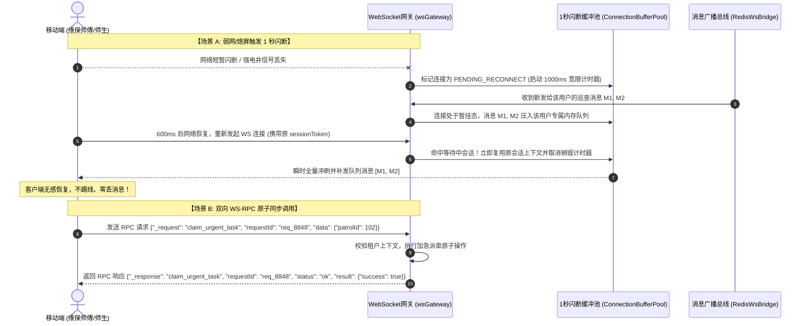

1. **1秒网络闪断重连缓冲队列 (Grace Period Buffer)**：
   - 当客户端物理 WS 断开时，网关并不立即触发 `onUserOffline` 并销毁会话，而是将其连接句柄置为 `SUSPENDED` 状态，并启动一个 **1000ms 的宽限等待定时器**；
   - 在这 1 秒内，所有发往该用户的广播或即时消息自动压入该用户绑定的内存缓冲队列（`UserPendingMessageQueue`）；
   - 若客户端在 1 秒内携带相同的 `sessionToken` 重新发起 WS 连接握手，网关瞬间激活原有上下文，并**一次性将缓冲队列中的消息全量冲刷（Flush）下发**，随后恢复正常通信；
   - 若超过 1000ms 仍未重连，定时器到期，正式将该连接标记为离线，将未下发消息持久化为离线未读数，并广播用户下线事件。
2. **双向 WS-RPC 请求协议 (`wsRpcEngine.ts`)**：
   - 传统 WebSocket 为无状态异步单向流，难以实现“必须确认服务端处理完毕才展示下一步”的严谨操作；
   - 系统在 WS 协议帧中定义 `_request` 与 `requestId` 规范，实现类 HTTP 请求/响应的同步双向 RPC 调用；
   - 配备客户端 3 秒超时熔断器（`timeoutMs = 3000`）与服务端处理器 2 秒防挂起超时保护，完美支撑加急抢单、安全验收签字确认等强一致性事务。

---

### 13. 业务连续性防错熔断中间件 (Flow Lock Safety Circuit Breaker)

为彻底解决传统后勤管理系统中“人员离职/调休或部门撤并后，名下在办报修工单沦为死单、无人跟进引发师生投诉”的严重顽疾，新版后端设计了全局业务防错熔断中间件（`flowLockInterceptor.ts`）：

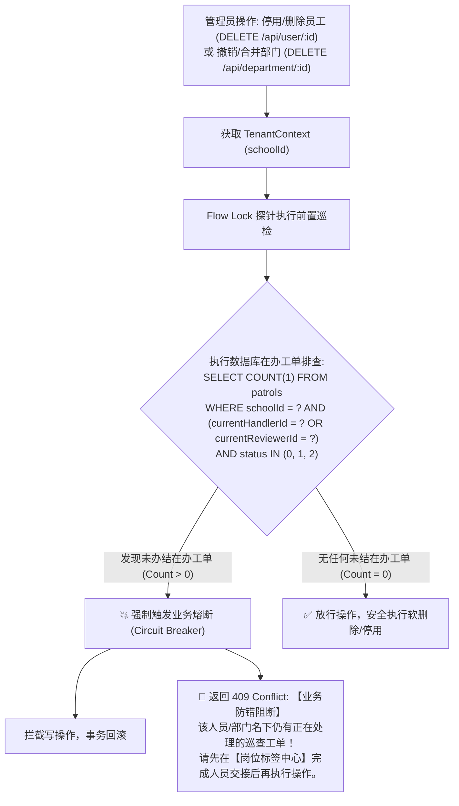

- **底层防错红线卡死**：
  - 无论是通过 REST API 还是批量操作，只要探测到目标主体名下有处于 `0:待处理`, `1:处理中`, `2:待复核` 状态的工单，系统**坚决抛出 BusinessLockException 阻断操作**；
  - 阻断提示清晰引导管理员前往【岗位标签中心 (Admin Tags)】，将相关员工承担的职能标签一键转移给接班师傅，完成交接后系统方才解除锁定。

---

### 14. 递点（类飞书）组织树与岗位职能标签 (Tag) 动态派单调度引擎

系统深度融入类飞书组织中台思想，构建了“树状行政部门”与“网格化职能岗位标签”双轮驱动的派单调度体系：

```mermaid
flowchart LR
    subgraph AdminLevel["行政组织架构维度 (departments 表)"]
        D1["后勤保障处 (Level 1)"]
        D2["能源动力中心 (Level 2)"]
        D3["西校区水电班组 (Level 3)"]
        D1 --> D2 --> D3
    end

    subgraph TagLevel["岗位职能标签维度 (tags 表, Metro UI)"]
        T1["【西校区水电抢修组长】(Metro Blue)"]
        T2["【防汛应急响应专员】(Metro Purple)"]
    end

    subgraph StaffLevel["在编维保人员维度 (users 表)"]
        U1["李师傅 (userId: 101)"]
        U2["王师傅 (userId: 102)"]
    end

    T1 -->|挂接人员 (tag_members)| U1
    T1 -.->|轮岗交接一键平移| U2

    subgraph DispatchEngine["四维工单调度网关 (permissions 表)"]
        P["派单规则: 西校区 × 水电类 ➔ 绑定 TagId = 1"]
        P --> T1
    end
```

1. **“权限随岗不随人”核心调度算法 (`tagService.ts`)**：
   - 派单规则（`permissions` 表）直接绑定岗位标签 `tagId`，而非具体自然人 `userId`；
   - 派单引擎依据工单的 `(schoolId, campusId, categoryId)` 检索匹配的 `tagId`，再通过 `tag_members` 视图毫秒级解析出当前承担该标签的值班师傅；
   - **零维护成本交接**：人员轮班换岗时，仅需更新 `tag_members` 中的 1 条记录，系统名下所有在办任务与后续待办自动瞬间流转至新接班人，**全校历史与流转中工单数据结构无需发生任何变更**！
2. **多级组织架构树递归解析 (`orgTreeService.ts`)**：
   - 利用 `departments.parentId` 与 `path` 字段，提供 `getDepartmentTree(schoolId)` 接口，一次性返回整棵树状 JSON，供移动端通讯录面包屑与无限级折叠渲染；
   - 支持权限向下辐射与行政层级向上递归追踪（Breadcrumbs）。

---

## 五、 新版工程项目结构规划 (TypeScript / ESM)

新版后端工程将严格组织在 `v4.0/Backend` 目录下，彻底去除单机排队单体残留：

```
v4.0/Backend/
├── package.json                   # ESM + TypeScript + 生产依赖 (mysql2, ioredis, ws, etc.)
├── tsconfig.json                  # 严格类型检查配置
├── generate_envs.js               # 自动生成 4 个节点环境变量配置文件
├── start_all_backends.js          # 彩色终端一键并行拉起 4 个 Backend 进程
├── 1.env, 2.env, 3.env, 4.env     # 各节点运行时环境变量
│
├── src/
│   ├── index.ts                   # 进程启动入口 (自检、AST预编译、HTTP/WS 启动)
│   │
│   ├── config/                    # 全局基础配置与环境加载
│   │   └── index.ts
│   │
│   ├── shared/                    # 现代化分布式多租户核心 SDK (BackendShared 内核)
│   │   ├── flow/                  # StandardResult (统一接口输出格式)
│   │   ├── tenant/                # 多租户上下文解析器 (TenantContext, TenantInjector)
│   │   ├── db/                    # MySQL 8.x 连接池与单句执行驱动 (mysql2/promise)
│   │   ├── cache/                 # Redis 多租户命名空间 KV 缓存操作
│   │   ├── lock/                  # 多租户 Redis 分布式排他行锁与重入管理器 (RowLockManager)
│   │   ├── sql/                   # MySQL 专用 SQL AST 语法树 DSL、参数化与执行器
│   │   │   ├── type.ts
│   │   │   ├── ast/ (declare, validator, parameterizer, tenantInjector)
│   │   │   ├── builders/ (select, insert, update, delete)
│   │   │   └── astRunner.ts       # 二段式读、租户约束自动注入、Undo 闭包回滚
│   │   ├── log/                   # LocalTerminalLogger 多进程/多租户彩色终端日志
│   │   └── crypto/                # JWT 租户签名验证、微信登录解密算法
│   │
│   ├── dispatcher/                # 请求网关层
│   │   ├── apiScanner.ts          # 物理文件目录路由自动扫描器
│   │   └── masterDispatcher.ts    # 租户解析、动态路由前缀通配、Saga 撤回栈调度
│   │
│   ├── ws/                        # 多租户 WebSocket 实时通信层
│   │   ├── wsGateway.ts           # 小程序长连接接入网关 (/api/ws)
│   │   ├── redisWsBridge.ts       # 基于 Redis Pub/Sub 的跨进程多租户广播总线
│   │   └── chatRoomHandler.ts     # 工单协同聊天室管理
│   │
│   ├── dispatcher/                # 请求网关层
│   │   ├── apiScanner.ts          # 物理文件目录路由自动扫描器
│   │   ├── masterDispatcher.ts    # 租户解析、动态路由前缀通配、Saga 撤回栈调度
│   │   └── flowLockInterceptor.ts # 业务连续性防错熔断中间件 (防止在办工单主体被删除)
│   │
│   ├── ws/                        # 多租户 WebSocket 实时通信层
│   │   ├── wsGateway.ts           # 小程序长连接接入网关 (/api/ws)
│   │   ├── redisWsBridge.ts       # 基于 Redis Pub/Sub 的跨进程多租户广播总线
│   │   ├── connectionBuffer.ts    # 1秒网络闪断重连缓冲池 (Grace Period Buffer)
│   │   ├── wsRpcEngine.ts         # 双向 WS-RPC 强一致性同步调用引擎
│   │   └── chatRoomHandler.ts     # 工单协同/单聊/群聊管理
│   │
│   ├── services/                  # 领域业务服务层 (多租户业务逻辑核心)
│   │   ├── schoolService.ts       # 学校租户信息与基础配置管理
│   │   ├── orgTreeService.ts      # 飞书式多级组织架构树与部门路径递归解析服务
│   │   ├── tagService.ts          # 岗位职能标签、权限随岗不随人与调换交接中枢
│   │   ├── planQuotaService.ts    # SaaS 付费级别核算、月度工单配额与到期拦截中枢
│   │   ├── userService.ts         # 用户体系、微信登录、多租户四维权限矩阵
│   │   ├── patrolService.ts       # 巡查工单全生命周期状态机 (行锁+Saga)
│   │   ├── chatService.ts         # 类 QQ 即时通讯服务 (工单房/单聊/群聊/撤回/引用/已读)
│   │   ├── postService.ts         # 校园公开广场动态、点赞与流式评论 (支持访客)
│   │   ├── aiAgentService.ts      # 高校专属 OpenAI 大模型客户端与 Agent 推理中枢
│   │   ├── aiToolRegistry.ts      # 7 大带租户隔离的后勤业务事实数据检索工具集
│   │   ├── feedbackService.ts     # 满意度评价与超时自动好评流转
│   │   ├── notificationService.ts # 微信模板消息、短信与靶向四维广播推送
│   │   ├── ossService.ts          # 阿里云 OSS 多租户目录上传与防盗链直签
│   │   └── statisticsService.ts   # 多租户大屏统计报表与能效聚合计算
│   │
│   └── api/                       # 遵循物理文件树约定的 REST 接口契约层
│       ├── school/                # /api/school/* (info, list, config, plan, settings)
│       ├── user/                  # /api/user/* (login, profile, list, update)
│       ├── patrol/                # /api/patrol/* (create, handle, review, list, detail, delay)
│       ├── chat/                  # /api/chat/* (initiate, send, withdraw, read, pin, sessions, messages, groups)
│       ├── department/            # /api/department/* (tree, list, create, update, delete[FlowLock])
│       ├── tag/                   # /api/tag/* (list, create, update, transfer, members)
│       ├── ai/                    # /api/ai/* (chat, sessions, messages, prompt)
│       ├── post/                  # /api/post/* (list, create, comment, like)
│       ├── feedback/              # /api/feedback/* (add, list)
│       ├── category/              # /api/category/* (list, update)
│       ├── campus/                # /api/campus/* (list, update)
│       ├── admin/                 # /api/admin/* (permissions, userStatus, auditLogs)
│       ├── statistics/            # /api/statistics/* (overview, dailyReport, rank)
│       └── file/                  # /api/file/* (upload, download)
```

---

## 六、 核心业务领域多租户流转与 API 契约设计

### 1. 模块迁移与多租户对照表

| 原 xc_backend 模块 | 新版迁移目标 (`v4.0/Backend`) | 多租户改造重点与核心特性 |
| :--- | :--- | :--- |
| `modules/user.js`<br/>`methods/user.js` | `src/api/user/*`<br/>`src/services/userService.ts` | 微信登录换取 openId 后，必须绑定 `schoolId` 锁定学校用户；JWT 签发必须携带 `schoolId` 与 `role`。 |
| `modules/patrol.js`<br/>`methods/patrol.js` | `src/api/patrol/*`<br/>`src/services/patrolService.ts` | 工单主表带 `schoolId` 与 `campusId`；所有状态更新均加多租户 Redis 行锁；Saga 撤回保证多校一致性；接入配额与到期拦截。 |
| *(新增全新模块)* | `src/services/planQuotaService.ts`<br/>`src/api/school/plan.ts` | **SaaS 付费中枢**：管理学校付费级别（0免费/1专业/2旗舰）、配额模式（limited/unlimited）、到期拦截与 Redis 计数器。 |
| `modules/chatRoom.js`<br/>`methods/chatRoom.js` | `src/api/chat/*`<br/>`src/services/chatService.ts`<br/>`src/ws/chatRoomHandler.ts` | **颠覆性类 QQ 聊天中台 (深度汲取 city_system 精髓)**：责任人主动发起握手激活 (`initiatedByHandler`)、2分钟撤回 (`isWithDraw`)、引用回复 (`answerMessageId`)、盯盘已读消除与会话置顶。 |
| *(新增全新模块)* | `src/api/ai/*`<br/>`src/services/aiAgentService.ts`<br/>`src/services/aiToolRegistry.ts` | **高校专属 AI 后勤智能助手中台 (AI Copilot)**：动态加载各校 `school_settings` 中的 OpenAI 凭证，ReAct 范式 + 7 大后勤工具箱（强隔离 context.schoolId），SSE 流式打字与完整审计。 |
| *(新增全新模块)* | `src/api/post/*`<br/>`src/services/postService.ts` | **校园公开广场 (双轨合一)**：支持未登录状态按 `schoolId` 浏览全校公开动态，支持未登录访客公开评论与防刷频风控。 |
| `modules/feedback.js`<br/>`methods/feedback.js` | `src/api/feedback/*`<br/>`src/services/feedbackService.ts` | 评价记录强绑定 `schoolId` 与 `patrolId`；超时未评触发租户级定时任务自动好评。 |
| `modules/campus.js`<br/>`modules/category.js`<br/>`methods/departments.js` | `src/api/campus/*`<br/>`src/api/category/*`<br/>`src/api/department/*` | 字典表全量添加 `schoolId`；各高校自主维护其校区、部门和故障分类，缓存按租户隔离。 |
| `modules/admin.js`<br/>`methods/permissions.js` | `src/api/admin/*`<br/>`src/services/userService.ts` | 四维权限调度表改造，校级管理员仅能指派并查看本校的处理人与审核人。 |
| `methods/oss.js`<br/>`app.js 文件路由` | `src/api/file/*`<br/>`src/services/ossService.ts` | 上传自动在 OSS 创建 `school_{id}/` 专属子目录；下载请求支持 302 重定向到阿里云带签直链。 |

### 2. 巡查工单状态机流转与 Saga 补偿设计 (带租户隔离)

以**负责人处理整改工单 (`POST /api/patrol/handle`)** 为例：

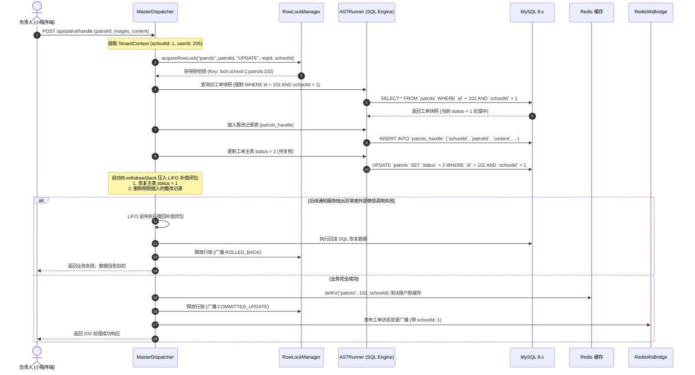

### 3. 类 QQ 即时通讯与工单责任人主动发起会话流转

#### (1) 会话生命周期与主动激活逻辑
1. **初始静默态 (`initiatedByHandler = 0`)**：
   - 师生提报工单后，系统自动在 `chat_rooms` 插入记录，但将 `initiatedByHandler` 设为 `0`；
   - 提报人端界面呈现只读温和提示：“工单已派发，请耐心等待负责师傅接入联系”，输入框与发送按钮处于锁定（Disabled）状态；
   - 杜绝提报人无休止催促、骚扰或误发垃圾消息给后勤人员。
2. **后勤责任人主动激活 (`initiatedByHandler = 1`)**：
   - 维修师傅/后勤管理员在工单详情或类 QQ 会话大盘中，点击【主动联络师生】按钮；
   - 客户端调用 `POST /api/chat/initiate { patrolId: 102 }`；
   - 后端核验操作者身份必须属于该工单的责任人（`currentHandlerId`）或本校管理员；
   - 激活成功后，后端自动写入一条系统欢迎广播并推送 WebSocket 事件 `CHAT_SESSION_ACTIVATED`；提报人端输入框秒级解锁。

#### (2) 消息 2 分钟撤回与引用回复流转
- **2 分钟撤回 API (`POST /api/chat/withdraw`)**：
  ```json
  // Request
  { "chatRoomId": 18, "messageId": 105 }
  // Response (Result.success)
  { "messageId": 105, "isWithDraw": 1, "withdrawnAt": "2026-09-05 13:30:00" }
  ```
  - 后端校验：`(NOW() - createdAt) <= 120s` 且 `senderId == currentUserId`；
  - 标记软撤回 `isWithDraw = 1`，内容留存底层审计，但对外广播与拉取时将内容置为空；
  - 跨进程 Redis 广播 `MESSAGE_WITHDRAWN`，多端即时渲染为“xxx 撤回了一条消息”。
- **引用回复 API (`POST /api/chat/send`)**：
  ```json
  // Request
  {
    "chatRoomId": 18,
    "content": "好的，这个水龙头型号我们库房有，半小时后到场",
    "type": 0,
    "answerMessageId": 101
  }
  ```
  - 后端若解析到 `answerMessageId > 0`，自动从 Redis 缓存或 DB 中加载原消息摘要 `{ id, senderRealName, content, isWithDraw }` 一并下发；
  - 若原消息后续被撤回，前端响应式判定 `answerMessage.isWithDraw === 1`，自动降级为“被引用的消息已被撤回”，彻底杜绝空引用异常。

---

### 4. 专属 AI Agent 智能助手多轮会话流与 Function Calling 执行流

#### (1) 会话建立与流式请求生命周期
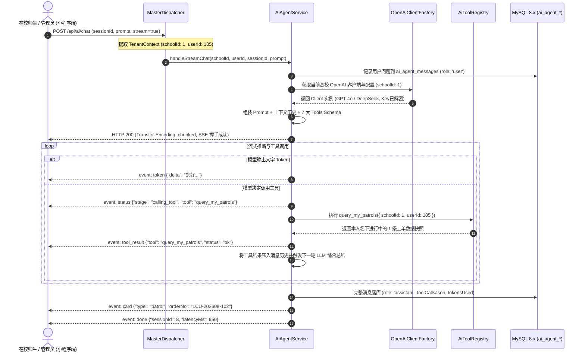

- **底层安全保障**：所有 Tool 执行时均强绑定 `schoolId`，即使提示词存在注入（Prompt Injection），Tool 内部也只能访问本校数据，杜绝越权。

---

### 5. 校园公开广场（双轨合一）多租户数据流与访客评论

1. **未登录师生访问（公开展示）**：
   - 小程序打开时根据本地缓存或扫码进入的小程序参数获取 `schoolCode`（如 `lcu`）。
   - 请求 `GET /api/post/list?schoolCode=lcu`。
   - 后端通过 `schoolCode` 解析出 `schoolId`，执行 SQL：
     ```sql
     SELECT `id` FROM `posts` 
     WHERE `schoolId` = ? AND `status` = 1 AND `isDeleted` = 0 
     ORDER BY `isTop` DESC, `createdAt` DESC LIMIT 20;
     ```
   - 走二段式读快速组装广场动态瀑布流，公开展示全校后勤风貌与工单整改现场。
2. **未登录访客公开评论与多级回复 (`POST /api/post/comment`)**：
   - 允许未登录在校访客在广场发表公开评论；
   - 客户端上传可选的 `guestNick`（默认生成“热心校友_xxxx”）与 `guestAvatar`；
   - **安全防御**：接入微信敏感词与文本合规安全检测（`msg_sec_check`），并施加 Redis 60 秒 IP 限流与防刷校验。
3. **登录后无缝双轨联动**：
   - 师生一键微信授权，系统解析出当前用户的 `userId` 与所属 `schoolId`；
   - 提报工单若勾选“公开至校园广场”（`isPublic = 1`），工单审核后自动在 `posts` 表生成一条公开动态，师生可实时点赞（唯一索引 `uk_school_post_user` 强防重）与楼中楼回复。

---

### 6. 核心 API 路由与多租户契约清单

| 请求路径 (`Path`) | Method | 权限门禁 (`Role/Auth`) | 核心参数与功能描述 |
| :--- | :---: | :--- | :--- |
| **`/api/school/info`** | `GET` | 公开免登录 | `schoolCode` ➔ 获取学校名称、校徽、专属配置 |
| **`/api/school/plan`** | `GET` | 学校管理员(`role=4`) / 超管(`role=9`) | 获取本校付费级别 (`planLevel`)、配额模式 (`planType`)、当月已用/剩余配额与到期时间 |
| **`/api/school/settings`** | `GET` | 学校管理员(`role=4`) | 获取本校自定义参数与大模型配置（`ai_api_key` 脱敏展示） |
| **`/api/school/settings`** | `POST` | 学校管理员(`role=4`) | 保存本校配置（支持维护 OpenAI API Key/URL/Model/Prompt，密文存储并热生效） |
| **`/api/school/settings/test-llm`**| `POST`| 学校管理员(`role=4`) | 测试当前配置的大模型连通性、网络握手延迟与模型可用性 |
| **`/api/user/wx-login`** | `POST` | 公开免登录 | `code, schoolCode, userInfo` ➔ 微信登录绑定租户签发 JWT |
| **`/api/patrol/create`** | `POST` | 普通师生(`role=0/1`) | 提交巡查报修（自动校验学校付费是否到期及当月配额上限） |
| **`/api/patrol/handle`** | `POST` | 责任处理人(`type=1`) | 负责人上传整改后照片、施工说明并交卷待核（行锁+Saga） |
| **`/api/patrol/review`** | `POST` | 验收复核人(`type=2`) | 到场验收核验工单，评定合格办结或驳回重修 |
| **`/api/chat/initiate`** | `POST` | 责任处理人(`type=1`) / 校管(`role=4`) | **类 QQ 聊天主动激活**：`patrolId`，责任人主动联系师生，解除静默锁定 |
| **`/api/chat/sessions`** | `GET` | 责任处理人 / 管理员 | **后勤类 QQ 会话大盘**：拉取会话列表（支持按 `isPinned` 置顶与最后消息排序） |
| **`/api/chat/messages`** | `GET` | 会话参与双方 | `chatRoomId, beforeId, limit` ➔ 触顶倒序历史消息漫游 |
| **`/api/chat/send`** | `POST` | 会话参与双方 (需已激活) | 发送消息（支持富文本/图片、可选 `answerMessageId` 引用回复） |
| **`/api/chat/withdraw`**| `POST` | 消息发信人 / 管理员 | **2分钟撤回机制**：`messageId`，时间超 120 秒自动拦截 |
| **`/api/chat/read`** | `POST` | 会话参与双方 | 盯盘进入聊天窗口，原子清空本地会话未读计数器 |
| **`/api/chat/pin`** | `POST` | 责任处理人 / 管理员 | `chatRoomId, isPinned` ➔ 后勤人员专属置顶会话切换 |
| **`/api/ai/chat`** | `POST` | 已登录用户 | **专属 AI Copilot 流式问答**：SSE 长连接，支持 7 大带租户隔离工具自动执行 |
| **`/api/ai/sessions`** | `GET` | 已登录用户 | 获取当前用户在当前学校的 AI 历史会话列表（分页） |
| **`/api/ai/messages`** | `GET` | 已登录用户 | `sessionId` ➔ 拉取某次会话的消息明细、工具执行记录快照与消耗审计 |
| **`/api/post/list`** | `GET` | **公开免登录** | `schoolCode, page, pageSize` ➔ 校园广场双轨公开瀑布流 |
| **`/api/post/comment`** | `POST` | **支持访客免登录** / 已登录 | 广场动态发表公开评论（支持访客昵称与安全合规过滤） |
| **`/api/post/like`** | `POST` | 已登录用户 | 广场动态点赞/取消点赞（联合唯一索引防并发刷赞） |
| **`/api/department/tree`** | `GET` | 已登录用户 | 获取本校飞书式完整多级组织架构树（含父子嵌套、在编人数、在办工单数） |
| **`/api/department/create`**| `POST` | 学校管理员(`role=4`) | 创建部门节点（支持指定 `parentId`，系统自动维护物化路径 `path`） |
| **`/api/department/delete`**| `POST` | 学校管理员(`role=4`) | 删除部门节点（**前置 Flow Lock 熔断探针**：若名下有在办工单立即强力阻断） |
| **`/api/tag/list`** | `GET` | 后勤人员 / 管理员 | 获取全校岗位职能标签库列表（含 Windows Metro 色标与当前持有人） |
| **`/api/tag/create`** | `POST` | 学校管理员(`role=4`) | 创建或更新岗位标签信息与 Metro 色标 |
| **`/api/tag/transfer`** | `POST` | 学校管理员(`role=4`) | **人员调休/轮岗一键无缝交接**：将某标签由员工 A 转移给员工 B，工单派单秒级平移 |
| **`/api/chat/groups`** | `GET` | 已登录人员 | 获取用户参与的科室协同与突发抢险应急群聊列表 |
| **`/api/chat/group/create`**| `POST` | 后勤科室长 / 管理员 | 创建突发应急/科室协作群聊（支持指派群主、管理员与初始成员） |
| **`/api/chat/group/members`**| `POST` | 群主 / 群管理员 | 增删群成员或调整群内身份角色 |

---

## 七、 搭建与落地的分步实施规划

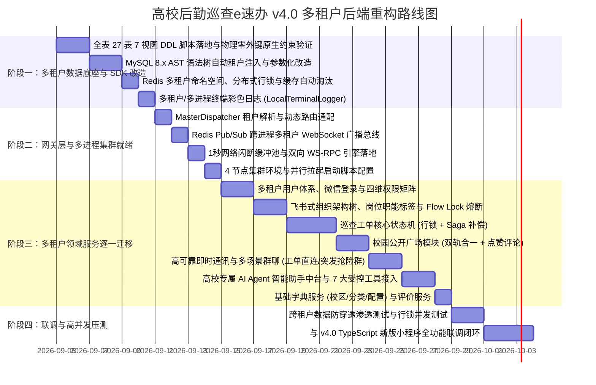

### 实施承诺：
1. **严格禁止在未获批准前盲目写业务代码**：每一步必须基于本设计文档与多租户 27 表 7 视图 DDL 规范推进。
2. **一个模块一个模块写**：优先夯实多租户基础设施、飞书组织树与岗位标签调度中枢，再依次推进核心工单、校园广场、群聊协同与 AI Agent。
3. **安全红线绝对把控**：全库 100% 物理零外键，所有物理表强制携带 `schoolId`，所有业务操作必须通过租户上下文校验，彻底消除多高校部署时的穿透隐患！
