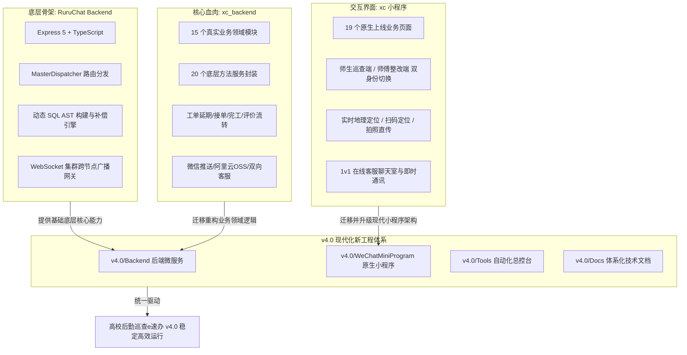
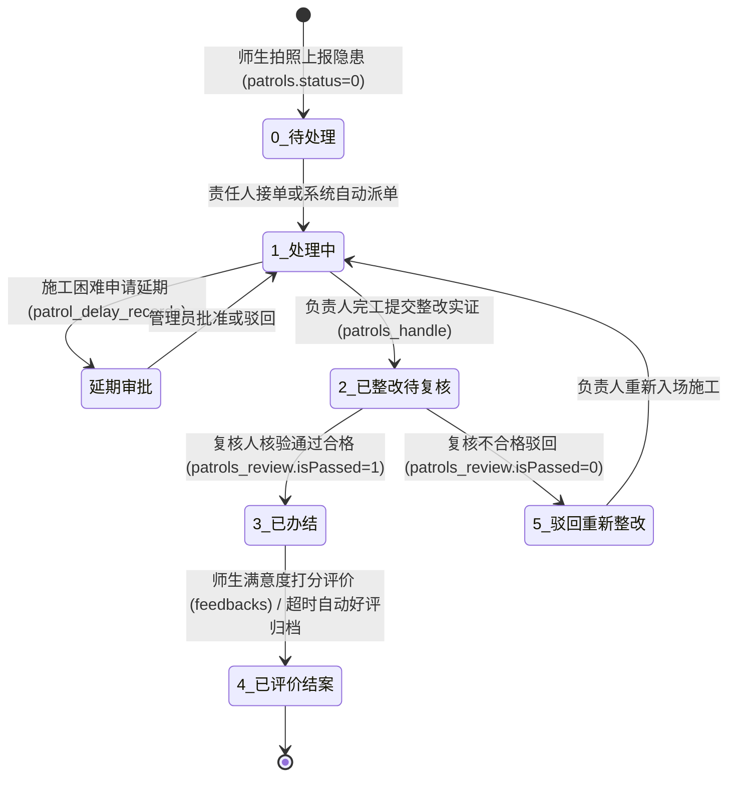
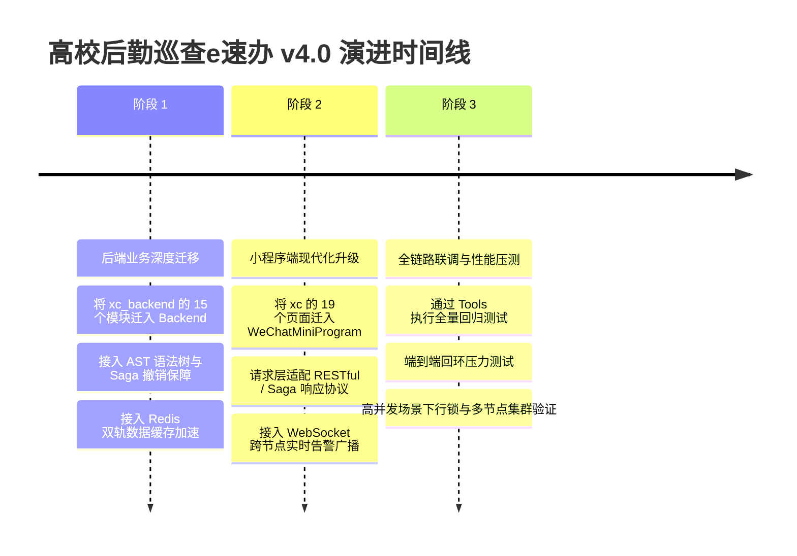

# 高校后勤巡查e速办 v4.0 全景工程总览与开发维护手册

> **项目名称**：高校后勤巡查e速办 (QuickPatrol) v4.0  
> **核心定位**：面向高校后勤服务的高性能移动巡查、隐患闭环排查与师生诉求智能管理系统  
> **技术形态**：微信原生双身份小程序端 + 高性能 TypeScript / Express 5 微服务后端 + MySQL 8.x + Redis 双轨缓存 + 工程化自动化运维总控台  
> **文档位置**：[v4.0/Docs/README.md](file:///e:/Projects/University/后勤巡查e速办%20大二下学期%20大学身份上线项目/v4.0/Docs/README.md)  
> **最近更新时间**：2026-09-05

---

## 目录索引 (Table of Contents)

1. [项目演进背景与三大旧版原始工程目录详析 (历史参考与溯源)](#一-项目演进背景与三大旧版原始工程目录详析-历史参考与溯源)
   - 1.1 [【旧版参考】底层后端框架工程：RuruChat/Backend](#11-旧版参考底层后端框架工程-ruruchatbackend)
   - 1.2 [【旧版参考】原成熟后端业务代码：xc_backend](#12-旧版参考原成熟后端业务代码-xc_backend)
   - 1.3 [【旧版参考】原成熟小程序前端代码：xc](#13-旧版参考原成熟小程序前端代码-xc)
   - 1.4 [三大旧版原始工程与 v4.0 全新工程的融合关系矩阵](#14-三大旧版原始工程与-v40-全新工程的融合关系矩阵)
2. [前期交流要点与核心设计决策回顾](#二-前期交流要点与核心设计决策回顾)
   - 2.1 [交流背景与阶段推进路线](#21-交流背景与阶段推进路线)
   - 2.2 [框架对照发现的 4 大严重逻辑缺陷](#22-框架对照发现的-4-大严重逻辑缺陷)
   - 2.3 [基础设施与数据库转型决策 (MySQL 8.x + Redis)](#23-基础设施与数据库转型决策-mysql-8x--redis)
   - 2.4 [依赖管理与工程边界决策 (Tools 仅管理 Backend)](#24-依赖管理与工程边界决策-tools-仅管理-backend)
3. [已落地核心工作纪要与技术成果清单](#三-已落地核心工作纪要与技术成果清单)
   - 3.1 [后端微服务骨架重构与缺陷全面修复](#31-后端微服务骨架重构与缺陷全面修复)
   - 3.2 [全量单元测试套件构建 (40/40 全部通过)](#32-全量单元测试套件构建-4040-全部通过)
   - 3.3 [Tools 自动化运维工具库专项适配落地](#33-tools-自动化运维工具库专项适配落地)
4. [v4.0 核心系统工程全景目录结构](#四-v40-核心系统工程全景目录结构)
5. [数据库多租户架构设计与 27 表 7 视图全生命周期拓扑 (支持多校拓展/SaaS计费/类QQ协同/各校自定义大模型与AI Agent/飞书工作台与微应用)](#五-数据库多租户架构设计与-27-表-7-视图全生命周期拓扑-支持多校拓展saas计费类qq协同各校自定义大模型与ai-agent飞书工作台与微应用)
   - 5.1 [数据库 27 张物理表分类详析 (全表包含 schoolId 租户字段与专属 AI 体系及组织中台)](#51-数据库-27-张物理表分类详析-全表包含-schoolid-租户字段与专属-ai-体系及组织中台)
   - 5.2 [7 大核心聚合视图设计 (含后勤类 QQ 会话大盘与全校组织树)](#52-7-大核心聚合视图设计-含后勤类-qq-会话大盘与全校组织树)
   - 5.3 [巡查工单状态机全生命周期流转图](#53-巡查工单状态机全生命周期流转图)
   - 5.4 [用户 × 校区 × 类别 四维权限调度机制](#54-用户--校区--类别-四维权限调度机制)
6. [后续业务重构演进路线图 (Roadmap)](#六-后续业务重构演进路线图-roadmap)
7. [开发者本地环境启动与调试指南](#七-开发者本地环境启动与调试指南)

---

## 一、 项目演进背景与三大旧版原始工程目录详析 (历史参考与溯源)

> [!WARNING]
> **版本性质与防混淆声明 (Legacy Notice)**：  
> 以下详析的三大原始工程（`RuruChat/Backend` 底层框架、`xc_backend` 旧版后端、`xc` 旧版小程序）均为 **v4.0 诞生之前的历史旧版本软件代码**。  
> 详列其目录结构与核心业务逻辑的唯一目的，是为 v4.0 的架构重构、业务迁移与界面升级提供基准参考。  
> **所有后续的全新代码编写、测试回归与功能迭代，严禁在旧版目录中操作，必须严格限定在当前项目的 `v4.0/Backend` 与 `v4.0/WeChatMiniProgram` 中！**

「高校后勤巡查e速办 v4.0」是基于大学真实上线运营经验深度重构的现代化企业级版本。其整体设计哲学可概括为：

> **以企业级大模型微服务系统 RuruChat 的现代化高性能内核为「骨架」，以成熟上线的大学商业项目 xc_backend 业务逻辑为「血肉」，以原生微信小程序 xc 的成熟交互为「界面」，融合成全新的 v4.0。**



---

### 1.1 【旧版参考】底层后端框架工程：RuruChat/Backend

- **物理存储绝对路径**：[E:\Projects\Enterprise\RuruChat\Backend](file:///e:/Projects/Enterprise/RuruChat/Backend)
- **原始工程定位**：高并发企业级大模型对话微服务底层系统 (历史参考框架)，具备完备的 AST 查询、自动回滚事务补偿机制、多实例服务发现与 WebSocket 分布式集群广播。
- **目录结构全景**：

```
RuruChat/Backend/
├── BackendApp/                         # 微服务应用宿主实例
│   ├── src/
│   │   ├── api/                        # 业务控制器与路由契约
│   │   │   ├── auth/                   # 登录鉴权、Token 签发、权限拦截
│   │   │   ├── bill/                   # 订单流水与计费
│   │   │   ├── session/                # 会话生命周期管理
│   │   │   └── user/                   # 用户基础资料与配置
│   │   ├── dispatcher/                 # 请求调度中心 (MasterDispatcher, ApiScanner)
│   │   ├── heartbeat/                  # 节点健康心跳探测与 Redis 注册
│   │   ├── host/                       # 宿主服务器启动器与生命周期钩子
│   │   ├── services/                   # 应用层领域服务
│   │   ├── utils/                      # 基础辅助工具
│   │   ├── ws/                         # WebSocket 集群实时双向网关
│   │   └── index.ts                    # 后端应用启动总入口
│   ├── 1.env ~ 20.env                  # 20 个微服务集群实例多端口环境配置
│   ├── generate_envs.js                # 集群环境配置文件批量生成脚本
│   ├── start_all_backends.js           # 本地多节点集群全量拉起执行器
│   ├── package.json                    # 应用宿主依赖
│   └── tsconfig.json                   # 应用编译配置
│
├── BackendShared/                      # 核心公共类库与底层驱动
│   ├── src/
│   │   ├── cache/                      # Redis 分布式缓存与双轨数据同步
│   │   ├── config/                     # 集中式配置加载与动态注入
│   │   ├── crypto/                     # AES-256 加解密、密码哈希与签名
│   │   ├── db/                         # 数据库驱动层 (MySQL/PostgreSQL 连接池)
│   │   ├── flow/                       # Result/Either 函数式单子容器与控制流
│   │   ├── heartbeat/                  # 跨节点集群状态同步驱动
│   │   ├── i18n/                       # 多语言国际化错误码映射
│   │   ├── lock/                       # Redis 分布式锁与行级锁管理器
│   │   ├── log/                        # 结构化日志收集器
│   │   ├── protocol/                   # 标准网络交互协议定义
│   │   ├── resilience/                 # 弹性容错机制 (熔断器、重试、超时限流)
│   │   ├── sql/                        # 核心动态 SQL AST 树构建器与反向补偿引擎
│   │   ├── store/                      # 状态存储
│   │   ├── tokenizer/                  # 词元分词计算
│   │   └── index.ts                    # 共享库导出汇总
│   ├── proto/                          # gRPC 协议缓冲区定义
│   ├── package.json                    # 共享库依赖
│   └── tsconfig.json                   # 共享库编译配置
│
├── DBInit/                             # 数据库初始化脚本与基线数据填充
│   ├── src/                            # 自动化建表、迁移与索引校验逻辑
│   ├── .env.business.example           # 业务数据库连接示例
│   └── .env.log.example                # 日志数据库连接示例
│
└── Router/                             # 反向代理网关 (Gateway / Dynamic Router)
    ├── src/                            # 动态负载均衡、API 路由路由转发、鉴权前置
    ├── package.json                    # 路由网关依赖
    └── tsconfig.json                   # 路由网关编译配置
```

---

### 1.2 【旧版参考】原成熟后端业务代码：xc_backend

- **物理存储绝对路径**：[E:\Projects\University\后勤巡查e速办 大二下学期 大学身份上线项目\xc_backend](file:///e:/Projects/University/后勤巡查e速办%20大二下学期%20大学身份上线项目/xc_backend)
- **原始工程定位**：已经在大学校园真实上线运营的旧版单体后端业务系统 (用于重构迁移业务参考)，囊括了完整的校园巡查工单全生命周期管理、师生在线客服、消息推送与统计报表等全部业务逻辑。
- **目录结构全景**：

```
xc_backend/
├── src/
│   ├── modules/                        # 15 个成熟业务模块控制器 (REST API Endpoint)
│   │   ├── admin.js                    # 管理员特权接口 (用户审核、权限委派、全局报表)
│   │   ├── agenda.js                   # 定时任务调度器 (工单超时自动流转、每日未完成提醒)
│   │   ├── campus.js                   # 校区字典维护 (校区新增、查询、巡查计数统计)
│   │   ├── category.js                 # 隐患分类管理 (类别层级、加急时限定义)
│   │   ├── chatRoom.js                 # 在线客服沟通接口 (1v1 会话创建、消息收发、未读标记)
│   │   ├── externalNotify.js           # 外部三方回调通知通道
│   │   ├── feedback.js                 # 师生诉求意见箱 (诉求提报、处理答复、点赞)
│   │   ├── notification.js             # 系统通知公告管理 (站内信广播、已读未读追踪)
│   │   ├── patrol.js                   # 巡查工单核心接口 (上报、接单、延期、驳回、完工、评价)
│   │   ├── qrcode.js                   # 巡查点位二维码生成与解析接口
│   │   ├── setting.js                  # 动态系统配置 (加急时限、首页轮播图、公告栏)
│   │   ├── statistics.js               # 校园巡查大盘统计 (完工率、满意度、校区对比)
│   │   ├── system.js                   # 系统健康检测与版本探活
│   │   ├── test.js                     # 联调测试打桩桩点
│   │   └── user.js                     # 用户中心 (微信静默授权登录、手机号绑定、密码修改)
│   │
│   ├── methods/                        # 20 个底层业务逻辑与三方服务封装
│   │   ├── agenda.js                   # 定时作业底层定义
│   │   ├── alert.js                    # 异常告警与加急督办逻辑
│   │   ├── campuses.js                 # 校区数据操作底层封装
│   │   ├── categories.js               # 类别数据操作底层封装
│   │   ├── chatRoom.js                 # 即时聊天消息持久化与状态更新
│   │   ├── departments.js              # 部门架构关系查询封装
│   │   ├── feedback.js                 # 诉求意见增删改查
│   │   ├── notification.js             # 通知公告投递逻辑
│   │   ├── oss.js                      # 阿里云 OSS 证据图片直传与签名获取
│   │   ├── patrol.js                   # 巡查工单 60KB+ 核心复杂流转底层逻辑
│   │   ├── permissions.js              # 用户-校区-类别三维权限矩阵鉴定核心算法
│   │   ├── postWechatMessage.js        # 微信服务号/订阅号模板消息推送
│   │   ├── qrcode.js                   # 点位二维码生成核心逻辑
│   │   ├── sendMessage.js              # 短信验证码通道对接
│   │   ├── settings.js                 # 系统字典读取与内存缓存
│   │   ├── statistics.js               # 复杂多维聚合统计 SQL 执行器
│   │   ├── system.js                   # 系统环境运行状态监测
│   │   ├── user.js                     # 用户鉴权与角色比对
│   │   ├── userReadRecord.js           # 红点未读记录更新与计数消除
│   │   └── vcode.js                    # 图形/数字验证码校验
│   │
│   ├── tools/                          # 辅助工具函数集
│   ├── app.js                          # Express 实例初始化、中间件装载与路由挂载
│   ├── db.js                           # 原生 MySQL 连接池与通用 Query 执行工具
│   ├── integrationModules.js           # 模块动态聚合加载器
│   ├── runner.js                       # 脚本运行引导程序
│   └── ws.js                           # 单机版 WebSocket 实时消息监听与连接管理
│
├── config.js                           # 服务端常量配置 (数据库凭据、JWT Secret、微信 AppID)
├── index.js                            # 启动主入口
├── server.js                           # 原生产环境部署执行器 (58KB+)
├── package.json                        # 后端生产依赖配置
└── tool.js                             # 项目命令行辅助运维工具
```

---

### 1.3 【旧版参考】原成熟小程序前端代码：xc

- **物理存储绝对路径**：[E:\Projects\University\后勤巡查e速办 大二下学期 大学身份上线项目\xc](file:///e:/Projects/University/后勤巡查e速办%20大二下学期%20大学身份上线项目/xc)
- **原始工程定位**：微信官方原生框架开发、在师生群体中上线运营的成熟移动端小程序 (用于前端页面迁移参考)，包含完整的师生巡查端、后勤师傅接单施工端双重身份交互。
- **目录结构全景**：

```
xc/
├── pages/                              # 19 个完整微信原生业务页面
│   ├── index/                          # 首页控制台 (轮播图、校区扫码巡查入口、快捷报障)
│   ├── form/                           # 隐患巡查上报表单 (拍照取证、位置选择、紧急程度)
│   ├── patrol_detail/                  # 巡查工单详情 (状态跟踪轴、施工前后对比图、延期/评价入口)
│   ├── login/                          # 统一身份认证与登录 (微信一键授权 / 账号密码登录)
│   ├── register/                       # 师生/师傅身份注册与所属院系校区绑定
│   ├── userPage/                       # 个人中心 (身份切换、我的巡查、我的待办、接单统计)
│   ├── settings/                       # 系统与个人偏好设置
│   ├── fb_chatRooms/                   # 在线客服沟通会话列表 (展示最新消息与未读红点)
│   ├── fb_chatRoom/                    # 1v1 在线即时沟通界面 (文字、图片、预设快捷回复)
│   ├── fb_add/                         # 诉求建议新增表单
│   ├── fb_detail/                      # 诉求建议详情与答复跟踪
│   ├── fb_my/                          # 我的诉求建议历史列表
│   ├── fb_notice/                      # 诉求公告与后勤处理动态
│   ├── fb_select/                      # 诉求分类筛选器
│   ├── msg_notification/              # 站内消息通知中心 (审批提醒、工单状态变更播报)
│   ├── calendar/                       # 巡查排班与排查日程日历视图
│   ├── inputValue/                     # 通用单项文本快速编辑弹窗
│   ├── richTextEditor/                 # 富文本通知编辑渲染组件
│   └── webView/                        # 外部 H5 页面容器 (校园政策、用户隐私协议)
│
├── components/                         # 微信原生通用自定义组件
│   ├── custom-nav/                     # 自定义顶部导航栏 (适配各机型异形屏)
│   ├── empty-state/                    # 空数据缺省占位图组件
│   ├── image-uploader/                 # 拍照与多图上传预览压缩组件
│   └── status-tag/                     # 工单状态标签胶囊组件
│
├── modules/                            # 客户端基础工具模块
│   ├── request.js                      # 网络请求封装 (统一 Token 拦截、错误弹窗)
│   ├── auth.js                         # 微信登录态与本地 Storage 缓存管理
│   └── util.js                         # 时间格式化、经纬度换算、防抖节流
│
├── images/                             # 小程序静态切图、图标与默认插画
├── app.js                              # 小程序全局生命周期入口
├── app.json                            # 小程序全局路由页面配置、分包、Tabbar 配置
├── app.wxss                            # 小程序全局通用样式库
├── config.js                           # 小程序端接口基地址与环境配置
├── project.config.json                 # 微信开发者工具项目配置
└── sitemap.json                        # 微信页面爬虫索引配置
```

---

### 1.4 三大旧版原始工程与 v4.0 全新工程的融合关系矩阵

| 维度 | 【旧版参考】原底层框架 [RuruChat](file:///e:/Projects/Enterprise/RuruChat/Backend) | 【旧版参考】原后端业务 [xc_backend](file:///e:/Projects/University/后勤巡查e速办%20大二下学期%20大学身份上线项目/xc_backend) | 【旧版参考】原小程序 [xc](file:///e:/Projects/University/后勤巡查e速办%20大二下学期%20大学身份上线项目/xc) | [v4.0 现代化全新工程](file:///e:/Projects/University/后勤巡查e速办%20大二下学期%20大学身份上线项目/v4.0) |
| :--- | :--- | :--- | :--- | :--- |
| **工程语言** | TypeScript (严格强类型) | JavaScript (Node.js ES6) | 微信原生 JS / WXML / WXSS | 全面升级 TypeScript + 原生多端 |
| **底层核心** | Express 5 + MasterDispatcher | Express 4 单体路由 | 微信小程序基础库 | Express 5 现代化微服务骨架 |
| **数据库** | 原 PostgreSQL (参数占位 `$1,$2`) | 原 MySQL 5.7 (传统 SQL 拼接) | 无 | **MySQL 8.x (占位符 `?` + 反引号转义) + Redis 双轨** |
| **事务能力** | AST 生成器 + 撤销栈 (WithdrawStack) | 传统单条 SQL，无补偿回滚 | 无 | **动态 SQL AST 树构建器 + Saga 反向补偿闭包** |
| **实时通讯** | Redis Pub/Sub 分布式 WebSocket 网关 | 单机原生 WS | 客户端 WebSocket 连接 | **带实例防环特征码的分布式 WS 广播网关** |
| **工程工具** | 传统分散 npm 脚本 | 单一 tool.js | 微信开发者工具自带 | **集成式高颜值自动化运维总控台 (Tools)** |

---

## 二、 前期交流要点与核心设计决策回顾

### 2.1 交流背景与阶段推进路线

在此前一系列密集的交流与技术推演中，用户提出并确立了多项关键战略目标与技术要求：
1. **彻底排查架构逻辑缺陷**：要求全面比对 `v4.0/Backend` 移植 RuruChat 时与实际业务产生的严重逻辑不一致并即刻修复；
2. **底层数据库与运行环境改造**：将原本面向 PostgreSQL 与远程 gRPC 日志服务的内核彻底改造为适配校园环境的 **MySQL 8.x + Redis 双轨 + 本地彩色终端日志**；
3. **建立工业级单元测试防线**：为 Backend 构建全量自动化测试，确保语法树构建、鉴权、路由分发与集群广播 100% 通过；
4. **统一自动化工具箱并严守边界**：将 `Tools` 工具套件适配至本项目，并严格执行**“仅由工具库管理 Backend 依赖，小程序依赖由微信开发者工具自行管理”**的边界规范；
5. **深度研读数据库拓扑**：研读 `Docs/数据库/结构.sql` 中的 19 张物理表与 5 个聚合视图，梳理出严密的工单状态机与三维权限调度矩阵；
6. **归纳三大原始工程**：清晰梳理原底层框架、原后端业务、原小程序代码的物理路径与目录结构，沉淀为全局指导文档。

---

### 2.2 框架对照发现的 4 大严重逻辑缺陷

通过将原底层框架代码与校园后勤巡查高并发业务进行逐行交叉审查，精准捕获并根治了 4 个致命设计缺陷：

#### 缺陷 1：WebSocket 跨节点广播自环与重复分发 (Loopback & Duplicate Broadcast)
- **原始问题**：在原框架中，当 WebSocket 网关借助 Redis Pub/Sub 将事件广播到其他实例时，未对消息发布源打上节点指纹，导致当前发布节点自身重新消费了该 Redis 消息，并再次下发到本地所有在线连接，造成客户端收到完全重复的数据包。
- **重构方案**：引入全局唯一的节点实例指纹 `originInstanceId`。在 Redis 订阅消费回调中，若检测到消息携带的 `originInstanceId === currentInstanceId`，则立即予以环路阻断（Skip local echo），杜绝了广播风暴与重复弹窗。

#### 缺陷 2：AST Runner 行锁二次释放引发死锁 (Double Lock Release & Deadlock)
- **原始问题**：原框架在执行复杂嵌套事务和逆向撤销操作时，若在同一执行链中触发多次异常回退，行级锁管理器 `RowLockManager` 会对同一记录的主键行锁重复调用 `unlock()`，在特定竞争时序下引发并发锁状态错乱和数据库死锁。
- **重构方案**：对锁的持有状态实施生命周期状态机封装，维护 `acquiredLocks` 集合，确保对同一资源锁的释放具备绝对的幂等性（Idempotent Unlock），重复调用直接安全返回。

#### 缺陷 3：空快照 (Empty Snapshot) 逆向撤销语法错误
- **原始问题**：在动态 AST 生成引擎执行 INSERT 语句的反向补偿动作时，如果插入操作生成了空快照（例如插入初始数据无需前置状态），旧版生成器拼装出的撤销 SQL 会生成类似 `SET isDeleted = ?` 但参数列表缺失，抛出 MySQL 语法异常。
- **重构方案**：健全 AST Runner 的快照有效性防御机制。在构建撤销动作前深度校验快照字段集，若快照为空则采用精确的主键物理/逻辑删除补偿闭包，补齐参数校验。

#### 缺陷 4：MasterDispatcher 路由末尾斜杠与 OPTIONS 预检穿透
- **原始问题**：小程序端在通过 `wx.request` 访问接口时，由于 URL 拼接或开发者习惯，常带有末尾斜杠（如 `/api/patrol/list/`），原动态路由扫描器为精准匹配，导致带斜杠的请求直接匹配失败报 404；同时跨域 OPTIONS 预检未被前置优先短路，导致预检请求消耗大量调度资源。
- **重构方案**：在 MasterDispatcher 调度器中加入严格的 URL 正规化（Normalization）过滤器，自动剥离多余斜杠并保持大小写一致性；全面实现标准 HTTP OPTIONS 预检的直接拦截，在 0 毫秒内就地返回 CORS 响应头。

---

### 2.3 基础设施与数据库转型决策 (MySQL 8.x + Redis)

原底层框架基于 PostgreSQL，其 SQL 方言与参数化体系与校园当前生产环境部署的 MySQL 8.x 存在本质差异。为此完成了以下改造：
- **占位符转换**：彻底剔除 PostgreSQL 专用的 `$1, $2, $3` 占位符解析体系，在 AST 编译器中全面重构为 MySQL 8.x 规范的 `?` 参数化占位符；
- **防冲突反引号转义**：针对 MySQL 保留关键字（如 `order`, `key`, `read`, `group`），在 AST 构建器（`SelectBuilder`, `UpdateBuilder`, `InsertBuilder`）的字段输出中强制包裹反引号（`` `column` ``）；
- **连接池换血**：底层切换为高性能 `mysql2/promise` 连接池驱动，支持基于 Prepared Statements 的高安全 SQL 防注入执行；
- **剥离 gRPC 外部日志器**：原框架强依赖外部独立的 gRPC `LogClient`，在本地单机或独立部署时常因找不到远程日志服务而产生阻塞性报错。我们将其剥离，替换为内置的高性能轻量级终端日志器 `LocalTerminalLogger`，支持彩色分级输出与耗时统计。

---

### 2.4 依赖管理与工程边界决策 (Tools 仅管理 Backend)

用户在交流中提出了非常明确的工程管理红线：

> **`Tools` 自动化工具箱只需要管理 `Backend` 的依赖，微信小程序的依赖由微信开发者工具自行管理！**

我们对此决策进行了彻底的落地：
1. **隔离前端环境**：一键初始化向导（`TOOL_INITIALIZE_PROJECT.js`）与全量依赖重装（`TOOL_REINSTALL_DEPENDENCIES.js`）的子项目列表彻底移除 `WeChatMiniProgram`，严禁外部命令行对其执行 `npm install`，防止破坏微信开发者的 `miniprogram_npm` 构建上下文；
2. **代码统计适配小程序**：在代码统计工具（`TOOL_COUNT_CODE_LINES.js`）中，新增对微信特有文件后缀 `.wxml` 和 `.wxss` 的深度语法分析与分类统计，并在目录扫描遍历中将 `miniprogram_npm` 与编译输出加入忽略名单；
3. **入口守卫保护**：在所有运维脚本中增加 `isMain` 保护，确保脚本无论是作为独立 CLI 运行还是被主菜单导入，均不会发生误执行或未捕获的退出码冲突。

---

## 三、 已落地核心工作纪要与技术成果清单

在此前的工作中，我们完成了代码重构、测试套件构建与工具链适配的三大阶段性落地：

### 3.1 后端微服务骨架重构与缺陷全面修复

所有改动均已落入 [v4.0/Backend](file:///e:/Projects/University/后勤巡查e速办%20大二下学期%20大学身份上线项目/v4.0/Backend) 对应源码模块：

| 模块路径 | 核心改动内容 | 达成的技术成果 |
| :--- | :--- | :--- |
| `src/ws/` | 增加 `originInstanceId` 节点特征码注入与过滤校验 | 阻断了 Redis Pub/Sub 广播时 WebSocket 消息在本地节点上的自环与重复投递 |
| `src/shared/sql/` | 重写 `SqlAstBuilder`、`QueryGenerator`、`WithdrawStack` | 完成 MySQL 8.x `?` 占位符适配、反引号转义、空快照容错闭包 |
| `src/shared/lock/` | 重构 `RowLockManager` 行级锁管理器 | 增加锁持有幂等性追踪，彻底消除重复解锁引发的死锁与竞争异常 |
| `src/dispatcher/` | 优化 `MasterDispatcher.ts` 路由正规化 | 解决尾部斜杠导致 404 的问题，实现 CORS OPTIONS 预检短路 |
| `src/shared/db/` | 实现 `LocalTerminalLogger.ts` 与 `mysql2` 封装 | 摆脱对远程 gRPC 外部日志微服务的强依赖，实现本地完全自包含 |

---

### 3.2 全量单元测试套件构建 (40/40 全部通过)

在 [v4.0/Backend/src/__tests__](file:///e:/Projects/University/后勤巡查e速办%20大二下学期%20大学身份上线项目/v4.0/Backend/src/__tests__) 下构建了 4 大专项单元测试文件，共计 **40 个测试用例，达成 100% 通过率**：

```
✓ src/__tests__/sqlAstAndBuilders.test.ts (15 tests)
✓ src/__tests__/flowAndCrypto.test.ts (10 tests)
✓ src/__tests__/dispatcherAndRouter.test.ts (9 tests)
✓ src/__tests__/clusterAndWs.test.ts (6 tests)

Test Files  4 passed (4)
     Tests  40 passed (40)
  Duration  1.21s (transform 312ms, setup 0ms, collect 389ms, tests 221ms)
```

#### 单元测试覆盖详情表

| 测试用例文件 | 测试数量 | 核心覆盖维度 | 测试保障效果 |
| :--- | :---: | :--- | :--- |
| `sqlAstAndBuilders.test.ts` | 15 | • 动态 SELECT/INSERT/UPDATE/DELETE AST 语法树构建<br/>• MySQL `?` 参数化绑定与反引号关键字转义<br/>• WithdrawStack 逆向撤销 SQL 闭包生成与空快照防御<br/>• 软删除约束自动注入 (`isDeleted = 0`) | 保障所有数据库操作的语法正确性与数据回滚可靠性 |
| `flowAndCrypto.test.ts` | 10 | • JWT 令牌双向签发与鉴权校验<br/>• 老版本 Legacy Token 兼容平滑升级<br/>• 密码加盐单向哈希比对 (`crypto`)<br/>• Result / Either 函数式单子成功与失败控制流 | 保障用户鉴权安全性与无异常中断的函数式调用流 |
| `dispatcherAndRouter.test.ts` | 9 | • MasterDispatcher 动态 API 路由映射与调度<br/>• URL 末尾斜杠容错正规化处理<br/>• HTTP OPTIONS 预检跨域头拦截<br/>• 404 路由丢失容错兜底 | 保障小程序客户端 API 请求的精准路由与跨域无阻 |
| `clusterAndWs.test.ts` | 6 | • WebSocket 连接建立与心跳探活保活<br/>• Redis Pub/Sub 分布式跨实例广播分发<br/>• `originInstanceId` 环路阻断防御 (杜绝自收自发) | 保障多节点部署下实时消息的高吞吐与绝对不重发 |

---

### 3.3 Tools 自动化运维工具库专项适配落地

全面重构了 [v4.0/Tools](file:///e:/Projects/University/后勤巡查e速办%20大二下学期%20大学身份上线项目/v4.0/Tools) 中的自动化脚本群：

| 工具脚本 | 适配前状态 | 适配后全新能力与规范 |
| :--- | :--- | :--- |
| `TOOL_INITIALIZE_PROJECT.js` | 遍历多子工程并硬编码多模块依赖 | **仅管理 Backend 的 npm 依赖**；说明小程序由微信开发者工具独立管理；支持一键配置 AI 与 Git 身份。 |
| `TOOL_REINSTALL_DEPENDENCIES.js` | 递归清理所有目录的 node_modules | **聚焦 Backend 依赖的纯净重装**；采用高带宽高速镜像，彻底杜绝意外删除小程序环境。 |
| `TOOL_RUN_ALL_TESTS.js` | 尝试寻找不存在的测试目录 | **精准绑定 Backend/src/__tests__**；支持 `--ci` 与非交互终端极速退出，40 个单测秒级全绿执行。 |
| `TOOL_COUNT_CODE_LINES.js` | 仅支持标准前端与 Java/Go | **新增对微信原生 `.wxml` 和 `.wxss` 的语法解析**；自动过滤排除 `miniprogram_npm`。 |
| `TOOL_OPEN_GITHUB_REPO.js` | 写死外部旧项目仓库 URL | **通过 `git remote get-url origin` 动态自适应探测**；在默认浏览器无缝打开当前项目主页。 |
| `TOOL_MENU.js` | 标题与状态栏显示 ChatSys | **全面升级为「高校后勤巡查e速办 v4.0 研发运维总控台」**；宽/窄屏自适应响应式美化排版。 |
| `TOOL_UPDATE_README_WITH_AI.js` | AI 提示词基于即时聊天大模型架构 | **系统级提示词深度更新为高校后勤双身份移动巡查架构**；支持自动化输出高质量技术文档。 |
| `TOOL_GENERATE_WORK_REPORT.js` | 工作报告模板不匹配 | **适配后勤巡查业务语境**；支持自动拉取最近 Git 提交生成精美结构化周报。 |

---

## 四、 v4.0 核心系统工程全景目录结构

```
v4.0/
├── Backend/                            # [后端微服务核心工程] (TypeScript + Express 5 + MySQL 8.x + Redis)
│   ├── src/
│   │   ├── api/                        # 业务控制器与路由契约
│   │   │   ├── admin/                  # 管理员专属接口 (数据报表、人员调度)
│   │   │   ├── auth/                   # 登录授权与鉴权校验
│   │   │   ├── chatRoom/               # 师生与后勤 1v1 即时客服
│   │   │   ├── feedback/               # 师生诉求意见箱
│   │   │   ├── notification/           # 站内广播通知
│   │   │   ├── patrol/                 # 巡查工单流转全闭环
│   │   │   ├── system/                 # 系统配置与监控探活
│   │   │   └── user/                   # 个人中心与角色设置
│   │   ├── dispatcher/                 # 请求调度中心 (MasterDispatcher, ApiScanner)
│   │   ├── heartbeat/                  # 节点健康心跳探测与 Redis 注册
│   │   ├── shared/                     # 共享基础类库
│   │   │   ├── cache/                  # Redis 缓存驱动
│   │   │   ├── crypto/                 # JWT 双向加解密与散列
│   │   │   ├── db/                     # MySQL 8.x 连接池与轻量日志器
│   │   │   ├── flow/                   # 函数式控制流与单子容器
│   │   │   ├── lock/                   # 幂等行级锁与分布式锁
│   │   │   └── sql/                    # 动态 AST 查询构建器与补偿回滚引擎
│   │   ├── ws/                         # WebSocket 跨节点集群广播网关 (带防环特征码)
│   │   ├── __tests__/                  # 40 个全量自动化单元测试
│   │   └── index.ts                    # 后端应用启动入口
│   ├── package.json                    # 后端专属依赖配置 (由 Tools 统一管理)
│   └── tsconfig.json                   # TypeScript 严格强类型编译规则
│
├── WeChatMiniProgram/                  # [前端微信小程序工程] (原生框架 + TypeScript)
│   ├── miniprogram/                    # 小程序业务源码根目录
│   │   ├── components/                 # 通用高复用自定义组件
│   │   ├── images/                     # 静态矢量图标与默认插画
│   │   ├── pages/                      # 19 个业务页面 (巡查报障、师傅接单、在线客服等)
│   │   ├── utils/                      # 工具库 (网络请求、格式化、防抖)
│   │   ├── app.json                    # 全局路由、分包与 Tabbar 配置
│   │   ├── app.ts                      # 全局应用生命周期启动器
│   │   └── app.wxss                    # 全局样式规范与主题色彩
│   ├── project.config.json             # 微信开发者工具工程定义
│   └── package.json                    # 前端依赖 (由微信开发者工具独立管理构建，Tools 不干预)
│
├── Tools/                              # [工程化自动化运维总控台]
│   ├── TOOL_MENU.js                    # 总控主菜单交互控制台 (宽/窄屏自适应)
│   ├── TOOL_INITIALIZE_PROJECT.js      # 项目一键初始化向导 (AI 配置 + Git 身份 + Backend 依赖)
│   ├── TOOL_REINSTALL_DEPENDENCIES.js  # Backend 依赖纯净重装工具
│   ├── TOOL_RUN_ALL_TESTS.js          # 全量子系统/后端单元测试运行器 (支持 --ci)
│   ├── TOOL_COUNT_CODE_LINES.js        # 全项目代码行数与语言分布统计 (支持 .wxml / .wxss)
│   ├── TOOL_OPEN_GITHUB_REPO.js        # 动态获取远程仓库并在默认浏览器打开
│   ├── TOOL_GIT_MANAGER.js             # Git 全能版本控制面板
│   ├── TOOL_UPDATE_README_WITH_AI.js   # AI 智能编写双语项目文档工作台
│   ├── TOOL_GENERATE_WORK_REPORT.js    # AI 智能生成工作报告工作台
│   └── config_helper.js                # 工具库共享配置与环境读写助手
│
├── Docs/                               # [全栈工程与业务文档体系]
│   ├── README.md                       # 👈 本总览文档 (总体描述与开发维护指南)
│   ├── 高校后勤巡查e速办v4.0核心设计构想与产品需求纪要.md # 📜 [永久归档] 全量核心产品构想与顶层设计思想全景录
│   ├── “递点”多租户组织管理与即时通讯系统构想设计方案.md # 💡 [构想方案] 组织多租户、标签权限解耦与高可靠WebSocket通信底座
│   ├── 高校后勤巡查e速办v4.0全景系统重构与设计方案.md # 🌟 [v4.0 全景设计蓝图] 双轨融合/全TS/25+项创新
│   ├── Backend/                        # [后端架构与业务契约方案体系]
│   │   ├── README.md                   # 后端文档索引页
│   │   ├── 后勤巡查e速办v4.0新版后端架构设计与搭建方案.md # v4.0 新后端底层设计蓝图
│   │   └── 【旧版参考】xc_backend原后端业务逻辑与API契约深度解析手册.md # ⚠️ 旧版参考
│   ├── WeChat/                         # [小程序前端交互与架构方案体系]
│   │   ├── README.md                   # 小程序前端文档索引页
│   │   └── 【旧版参考】xc小程序前端业务架构与交互细节深度技术文档.md # ⚠️ 旧版参考
│   └── 数据库/                         # 数据库结构定义与多租户 DDL
│       ├── README.md                   # 数据库版本对比与多租户设计说明文档
│       ├── 高校后勤巡查e速办v4.0多租户数据库结构设计.sql # 🌟 [全新标准] 27 表 7 视图多租户、组织中台、标签解耦与各校 AI DDL 脚本
│       └── 结构.sql                    # ⚠️ [旧版参考] 原单校单体数据库 Dump 脚本
│
├── chat_sys_config.json                # 根目录 AI 与运维本地配置 (.gitignore 保护)
├── tools_windows.bat                   # Windows 一键启动总控台脚本
└── tools_linux_macos.sh                # Linux / macOS 一键启动总控台脚本
```

---

## 五、 数据库多租户架构设计与 27 表 7 视图全生命周期拓扑 (支持多校拓展/SaaS计费/类QQ协同/各校自定义大模型与AI Agent/飞书工作台与微应用)

> [!IMPORTANT]
> **多租户 SaaS 演进重大升级 (Multi-Tenant Architecture)**：  
> 1. **全表强制 schoolId 隔离**：引入核心租户主表 `schools`（学校），全系统 27 张物理表全部增加 `schoolId INT NOT NULL`，形成两级拓扑：**学校 (`schoolId`) ➔ 校区 (`campusId`)**，底层 AST 树自动注入租户拦截；  
> 2. **SaaS 付费级别、配额模式与到期拦截**：`schools` 表内置付费级别（`planLevel`: 0免费体验/1基础专业/2旗舰尊享）、配额模式（`planType`: limited/unlimited）、月工单上限（`maxMonthlyPatrols`）及付费到期时间（`planExpireAt`），底层中间件自动阻断超额与过期写操作；  
> 3. **递点（类飞书）组织中台与岗位标签调度**：`departments` 升级无限级树拓扑（`parentId` 与 `path`），新增 `tags` 岗位职能标签表（Windows Metro UI 色彩标识）与 `tag_members` 映射表，实现“权限随岗不随人”，人员调休轮岗一键换人秒级平移；  
> 4. **业务连续性防错熔断 (Flow Lock Safety)**：中间件前置探测在办工单，强力阻断删除有在办工单的部门或人员，彻底消除死单；  
> 5. **全场景企业级即时通讯底座**：`chat_rooms` 扩展支持工单房、1v1单聊与科室抢险群聊，新增 `chat_group_members` 表，底层集成 **1秒网络闪断重连缓冲队列** 与 **双向 WS-RPC 同步协议**；  
> 6. **各校管理员自主配置大模型凭据 (`school_settings`)**：统一新建学校设置表，支持各校管理员自主录入 OpenAI 兼容 API Key、Base URL、Model、Temperature 及系统 Prompt，敏感 Key 采用 AES-256-GCM 密文存储并支持回显掩码；  
> 7. **专属高校后勤 AI Agent (智能助手 Copilot)**：微信小程序提供登录用户专属 AI 工作台（`pages/ai-copilot/index`），动态调用本校配置模型，支持流式 SSE 打字输出与 7 大受控数据工具访问（工单统计、明细查询、科室电话等），数据在租户边界内严格隔离；  
> 8. **后勤人员专属类 QQ 协同通讯中台 (汲取 city_system 精髓)**：责任人主动发起握手激活 (`initiatedByHandler`)、2分钟撤回 (`isWithDraw`)、引用回复 (`answerMessageId`)、盯盘已读消除与后勤会话置顶 (`isPinned`)；  
> 9. **双轨合一校园公开广场**：支持未登录用户公开浏览整改风貌，并支持未登录访客公开评论（`guestNick`/`guestAvatar`）与防刷频风控；  
> 10. **物理零外键设计哲学 (Zero Foreign Keys)**：坚决不使用任何物理外键 (`FOREIGN KEY`)，全表最多仅保留自增主键 (`PRIMARY KEY`)，继承旧版架构轻量解耦哲学，彻底消除级联死锁与性能拖垮；  
> 11. **数据库级原生约束 (DB-Level Constraints)**：数据的完整性与合法性主要通过 MySQL 8.x 的 `NOT NULL`、精准 `DEFAULT`、联合唯一键 (`UNIQUE KEY`) 与原生检查约束 (`CHECK`) 深度卡死；  
> 12. **四级立体权限矩阵体系**：系统管理员 (`role=9`) ➔ 学校管理员 (`role=4`) ➔ 校内职能角色 (`permissions.type=1/2/3`) ➔ 普通师生用户 (`role=0/1`)；  
> 13. **飞书工作台微应用与全景日历**：新增 `apps` 表驱动子功能如独立小 app 般解耦注册与门禁，新增 `schedules` 表调度 SLA 倒计时与值班排班；  
> 14. **统一消息中枢与在线感知防骚扰**：`messages` 聚合站内通知，在线仅 WS 原地刷新，离线超 180s 智能降级微信/短信穿透。

### 5.1 数据库 27 张物理表分类详析 (全表包含 schoolId 租户字段与专属 AI 体系及组织中台)

详细 DDL 定义请参阅：[高校后勤巡查e速办v4.0多租户数据库结构设计.sql](file:///e:/Projects/University/后勤巡查e速办%20大二下学期%20大学身份上线项目/v4.0/Docs/数据库/高校后勤巡查e速办v4.0多租户数据库结构设计.sql)。

| 业务领域分类 | 物理数据表名 | 核心字段示例 (均含 schoolId) | 业务职责与多租户隔离特性 |
| :--- | :--- | :--- | :--- |
| **高校多租户核心** | `schools` **[顶层租户主表]** | `id`, `code`, `name`, `logo`, `domain`, `status`, `planLevel`, `planType`, `maxMonthlyPatrols`, `planExpireAt`, `configJson` | **多租户学校核心主表**：记录入驻高校编号、中英文简称、校徽、专属域名、付费版本级别(0/1/2)、配额模式(limited/unlimited)、月工单上限与到期时间。 |
| **基础与组织机构** | `campuses` | `id`, `schoolId`, `name`, `address`, `sortOrder`, `isDeleted` | 各大学下辖校区定义表（例如东校区、西校区），严格绑定 `schoolId`。 |
| | `departments` **[树状升级]** | `id`, `schoolId`, `parentId`, `name`, `path`, `leaderId`, `contactPhone`, `isDeleted` | **类飞书组织架构树表**：支持多级行政树状嵌套与物化路径 `path` 毫秒级检索，部门负责人挂接。 |
| | `tags` **[全新表]** | `id`, `schoolId`, `name`, `color`, `description`, `sortOrder`, `isDeleted` | **组织职能岗位标签表**：Windows Metro UI 色彩标识，实现“权限随岗不随人”的核心解耦载体。 |
| | `tag_members` **[全新表]** | `id`, `schoolId`, `tagId`, `userId`, `createdAt` | **岗位标签与在编员工映射表**：人员轮班换岗、离职调休一键换人平移，消除派单断档。 |
| | `categories` | `id`, `schoolId`, `name`, `icon`, `defaultDays`, `isDeleted` | 各大学专属故障分类门类字典（水电、绿化、消防、照明等）。 |
| | `school_settings` **[重构升级]** | `id`, `schoolId`, `key`, `value`, `desc`, `isEncrypted` | **各大学专属设置与大模型凭据表**：存放各校独立设置（OpenAI APIKey/URL/Model、加急时限、超时自动好评、广场开关），Key 密文存储，联合唯一索引 `(schoolId, key)`。 |
| | `patrol_qrcode_points` | `id`, `schoolId`, `campusId`, `name`, `code`, `location` | 各大学线下固定资产/巡查点位二维码，扫码直接带出学校与校区。 |
| **用户与权限矩阵** | `users` | `id`, `schoolId`, `openId`, `realName`, `phone`, `role`, `jobNo` | 师生与职工用户主表，联合唯一索引 `(schoolId, openId)` 彻底杜绝跨校穿透。角色分级 `role IN (0, 1, 2, 3, 4, 9)`。 |
| | `permissions` **[四维+标签]** | `id`, `schoolId`, `userId`, `tagId`, `campusId`, `categoryId`, `type` | **四维多租户调度表**：支持按自然人 (`userId`) 或按岗位标签 (`tagId`) 派发，支持校区/分类通配。 |
| | `operation_logs` | `id`, `schoolId`, `userId`, `action`, `module`, `ip`, `payloadJson` | 多租户安全审计与关键操作操作追踪日志表。 |
| **巡查工单闭环全周期** | `patrols` | `id`, `schoolId`, `campusId`, `categoryId`, `orderNo`, `imagesJson`, `status`, `deadline` | **工单主表**：按学校强隔离，JSON 存储现场照片，维护 0~5 状态机，接入月度配额控制。 |
| | `patrols_handle` | `id`, `schoolId`, `patrolId`, `handlerId`, `content`, `imagesJson` | 整改处理记录表：负责人提交施工整改说明、完工照片与耗时。 |
| | `patrols_review` | `id`, `schoolId`, `patrolId`, `reviewerId`, `isPassed`, `remark` | 复核验收记录表：管理复核人员到场检验结果（合格/驳回）与核验评语。 |
| | `feedbacks` | `id`, `schoolId`, `patrolId`, `userId`, `score`, `isAutoPassed` | 满意度评价表：师生多维度星级打分、标签反馈与超时自动好评标记。 |
| | `patrol_delay_records` | `id`, `schoolId`, `patrolId`, `applicantId`, `reason`, `delayHours` | 动态延期审批记录表：告别旧版硬编码 delay1~3，支持任意多次审批流。 |
| **校园公开广场 (双轨)** | `posts` | `id`, `schoolId`, `creatorId`, `title`, `content`, `imagesJson` | 校园公开广场动态瀑布流：支持未登录公开展示与登录后点赞互动。 |
| | `post_comments` | `id`, `schoolId`, `postId`, `userId`, `guestNick`, `guestAvatar`, `replyCommentId`, `content` | 广场动态评论表，支持师生互动与未登录访客公开评论。 |
| | `post_likes` | `id`, `schoolId`, `postId`, `userId` | 广场动态点赞记录表，联合唯一索引 `(schoolId, postId, userId)`。 |
| **即时协同与全场景通讯**| `chat_rooms` **[全场景升级]** | `id`, `schoolId`, `patrolId`, `roomType`, `name`, `avatar`, `ownerId`, `creatorId`, `handlerId`, `initiatedByHandler`, `isPinned`, `handlerUnreadCount`, `creatorUnreadCount` | **全场景企业级协同会话室**：支持工单房(`patrol`)、点对点单聊(`direct`)与科室抢险群聊(`group`)。 |
| | `chat_group_members` **[全新表]** | `id`, `schoolId`, `roomId`, `userId`, `role`, `lastReadMessageId` | **群聊成员明细表**：记录群主、管理员、普通成员及各自已读消息游标。 |
| | `chat_messages` | `id`, `schoolId`, `chatRoomId`, `senderId`, `answerMessageId`, `content`, `type`, `isWithDraw`, `withdrawnAt` | **聊天消息明细表**：支持文本/图片/卡片、2分钟撤回机制与引用回复关联。 |
| | `messages` **[中枢流表]** | `id`, `schoolId`, `receiverId`, `appId`, `priority`, `externalPushStatus` | 统一消息中枢流表：聚合各微应用待办，在线 WS 原地刷新，离线超时智能穿透通知。 |
| **专属 AI Agent 智能体系** | `ai_agent_sessions` | `id`, `schoolId`, `userId`, `title`, `messageCount` | 各校师生 AI 智能助手多轮问答会话表。 |
| | `ai_agent_messages` | `id`, `sessionId`, `schoolId`, `userId`, `role`, `content`, `toolCallsJson`, `toolResultsJson`, `tokensUsed` | AI 消息流水与受控 Tool 审计表。 |
| **飞书工作台与微应用矩阵** | `apps` **[全新表]** | `id`, `schoolId`, `appCode`, `name`, `category`, `entryRoute`, `minRole`, `badgeApi` | **工作台微应用注册表**：支撑各子功能如飞书微应用般解耦开发、四级门禁与角标统计。 |
| | `schedules` **[全新表]** | `id`, `schoolId`, `userId`, `title`, `type`, `startTime`, `endTime`, `priority`, `dutyPhone` | **全景日历日程排班表**：工单 SLA 倒计时、值班排班表一键拨号与重大设备维保里程碑。 |

---

### 5.2 7 大核心聚合视图设计 (全景业务大盘)

为保证前台列表与多校大屏在海量并发下的极速响应，新版数据库预置 7 个多租户全景视图：
1. `v_patrol_details`：多租户巡查工单综合宽表视图（内联所属学校全称、校区名、故障分类、提报人与责任人姓名及联系电话）；
2. `v_handlers_matrix`：四维责任人调度矩阵视图（关联人员、校区、分类与处理/复核/监督角色，驱动工单自动派单）；
3. `v_tenant_overview`：各高校后勤大屏、付费级别与运营能效大盘视图（实时输出 `planLevel`, `planType`, `maxMonthlyPatrols`, `expireStatus`、工单总数、办结率、综合满意度）；
4. `v_post_feeds`：校园广场公开动态信息流视图（未登录公开可见，展示图文对比与点赞评论数）；
5. `v_chat_sessions`：后勤管理人员类 QQ 会话列表视图（聚合工单与群聊信息，输出未读消息数、最后聊天摘要与置顶状态）；
6. `v_school_admins`：各高校校级超级管理员名录视图（供平台运维中枢快速排查租户对接人）；
7. `v_tag_assignments`：岗位职能标签成员与调度矩阵全景视图（联结标签名称、Metro 颜色、在岗人员名册及负责校区分类，驱动“随岗不随人”敏捷派单）。

---

### 5.3 巡查工单状态机全生命周期流转图



---

### 5.4 用户 × 校区 × 类别 四维权限调度机制

系统的权限调度围绕 `permissions` 表展开，核心规则为：
- 当师生在某校区（如 `campusId = 1`）上报了某类别（如 `categoryId = 2` 水电暖通）的隐患时；
- 系统底层立刻检索 `permissions` 中满足：
  ```sql
  WHERE `schoolId` = ? 
    AND (`campusId` = ? OR `campusId` = 0) 
    AND (`categoryId` = ? OR `categoryId` = 0) 
    AND `type` = 1
  ```
- 检索到该学校该领域的全部责任人，并通过 Redis 跨节点 WebSocket 广播与微信服务通知，将工单秒级推送至负责人手机；
- 当责任人完工整改后，同样规则检索 `type = 2`（复核审核人）进行现场质检验收，实现跨校、跨校区的精准网格化调度。

---

## 六、 后续业务重构演进路线图 (Roadmap)

根据整体工程规划，后续演进分为三大阶段平滑推进：



### 阶段 1：后端业务深度迁移 (`xc_backend` ➔ `v4.0/Backend`)
- 将 `xc_backend/src/modules/` 下的 15 个成熟业务模块按微服务领域契约重写为严格 TypeScript；
- 将写操作全面接入动态 SQL AST 树构建器与反向补偿闭包，使全部数据变更具备自动撤销与一致性保障；
- 对高频读取的字典与权限数据（`campuses`, `categories`, `settings`, `permissions`）全面接入 Redis 双轨缓存，大幅削减数据库压力。

### 阶段 2：微信小程序端迁移与现代化升级 (`xc` ➔ `v4.0/WeChatMiniProgram`)
- 将 `xc/pages/` 下的 19 个成熟业务页面（巡查表单、工单详情、在线客服、师生个人中心等）无缝平移至 `WeChatMiniProgram`；
- 改造客户端网络请求拦截器，统一适配后端 TypeScript 契约与标准 Result 结构；
- 前端依赖持续保留由微信开发者工具独立管理，保持工具链轻量化。

### 阶段 3：全链路联调与压力验证
- 使用 `Tools/TOOL_RUN_ALL_TESTS.js` 持续对新接口进行回归测试保障；
- 模拟高校师生高并发集中报修场景，验证 MySQL 8.x 连接池稳定性与 WebSocket 集群分发的毫秒级实时性。

---

## 七、 开发者本地环境启动与调试指南

### 1. 启动工程化总控台 (Tools Console)

在 Windows 终端中运行：
```powershell
.\tools_windows.bat
```
或直接通过 Node 启动交互控制台：
```powershell
node Tools/TOOL_MENU.js
```

### 2. 后端单元测试回归验证

运行全部 40 个单元测试用例：
```powershell
# 交互式查看测试结果
node Tools/TOOL_RUN_ALL_TESTS.js --verbose

# CI/自动化非交互式退出
node Tools/TOOL_RUN_ALL_TESTS.js --ci
```

### 3. 后端本地启动开发

```powershell
cd Backend
npm run dev
```

### 4. 微信小程序本地导入开发

1. 打开「微信开发者工具」；
2. 选择「导入项目」，目录选择：`e:\Projects\University\后勤巡查e速办 大二下学期 大学身份上线项目\v4.0\WeChatMiniProgram`；
3. AppID 填入测试号或已授权的高校项目 AppID；
4. 点击「工具」➔「构建 npm」（如需更新前端专用包）；
5. 即可在本地进行真机预览与双端调试。
