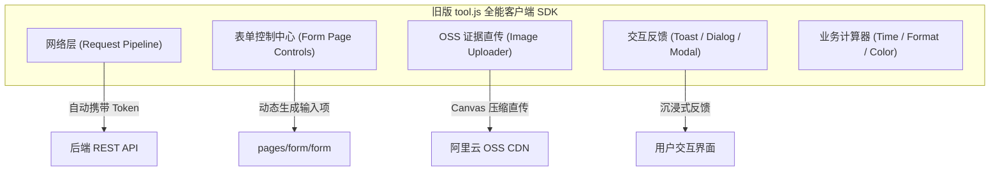
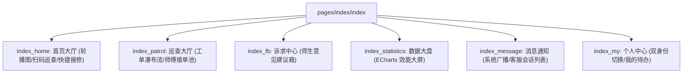
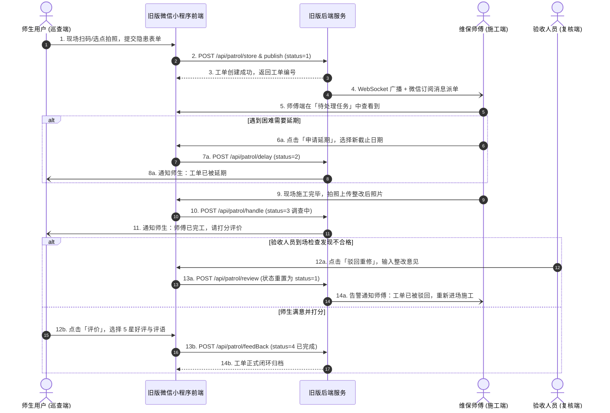

# 【旧版参考】xc 微信小程序前端业务架构与交互细节深度技术文档

> [!WARNING]
> **版本性质声明 (Legacy Software Notice)**：  
> 本文档描述的系统为 **高校后勤巡查e速办 v4.0 诞生之前的旧版本上线微信小程序原生代码 (`xc`)**。  
> **文档编写目的**：仅作为重构迁移阶段的前端业务交互溯源、页面生命周期对照与 UI 组件逆向参考手册。  
> **重要红线**：后续所有全新前端开发、组件增强与界面现代化升级**必须在 `v4.0/WeChatMiniProgram` 中进行**，切勿将此旧版本小程序（旧版原生 JS + 单体集中式 SDK）与当前新工程的代码逻辑、依赖环境或配置文件相混淆！

> **旧版工程名称**：高校后勤巡查e速办 - 原始旧版微信小程序 (`xc`)  
> **旧版源码绝对路径**：[E:\Projects\University\后勤巡查e速办 大二下学期 大学身份上线项目\xc](file:///e:/Projects/University/后勤巡查e速办%20大二下学期%20大学身份上线项目/xc)  
> **文档归档位置**：[v4.0/Docs/WeChat/【旧版参考】xc小程序前端业务架构与交互细节深度技术文档.md](file:///e:/Projects/University/后勤巡查e速办%20大二下学期%20大学身份上线项目/v4.0/Docs/WeChat/【旧版参考】xc小程序前端业务架构与交互细节深度技术文档.md)  
> **编制目标**：为 v4.0 小程序前端现代化迁移 (`v4.0/WeChatMiniProgram`) 提供全量页面交互模型、数据总线、SDK 接口、WebSocket 消息流与双身份调度机制的详尽技术指引。

---

## 目录索引 (Table of Contents)

1. [旧版小程序工程架构与全局运行规范](#一-旧版小程序工程架构与全局运行规范)
   - 1.1 [工程组织与全局配置 (app.json / app.wxss / app.js)](#11-工程组织与全局配置-appjson--appwxss--appjs)
   - 1.2 [微信官方 glass-easel 渲染管线与沉浸式导航](#12-微信官方-glass-easel-渲染管线与沉浸式导航)
   - 1.3 [环境配置与 CDN 静态资源映射 (config.js)](#13-环境配置与-cdn-静态资源映射-configjs)
2. [旧版核心基础设施与底层 SDK (modules/) 深度剖析](#二-旧版核心基础设施与底层-sdk-modules-深度剖析)
   - 2.1 [tool.js 全能客户端引擎 (网络请求 / 拦截 / 表单控件 / OSS)](#21-tooljs-全能客户端引擎-网络请求--拦截--表单控件--oss)
   - 2.2 [ws.js 原生 WebSocket 长连接客户端 (心跳 / 退避重连 / 事件分发)](#22-wsjs-原生-websocket-长连接客户端-心跳--退避重连--事件分发)
   - 2.3 [store.js & localSettings.js 全局状态机与本地持久化](#23-storejs--localsettingsjs-全局状态机与本地持久化)
   - 2.4 [formatRequestData.js 请求出入参处理](#24-formatrequestdatajs-请求出入参处理)
3. [旧版 19 个核心业务页面全景交互与生命周期逐一深度剖析](#三-旧版-19-个核心业务页面全景交互与生命周期逐一深度剖析)
   - 3.1 [pages/index/index (六合一超级主控台)](#31-pagesindexindex-六合一超级主控台)
   - 3.2 [pages/form/form (隐患巡查动态表单上报核心页)](#32-pagesformform-隐患巡查动态表单上报核心页)
   - 3.3 [pages/patrol_detail/patrol_detail (工单全生命周期看板与动态操作流)](#33-pagespatrol_detailpatrol_detail-工单全生命周期看板与动态操作流)
   - 3.4 [pages/fb_chatRoom/fb_chatRoom & fb_chatRooms (1v1 在线客服即时通讯)](#34-pagesfb_chatroomfb_chatroom--fb_chatrooms-1v1-在线客服即时通讯)
   - 3.5 [pages/fb_add, fb_detail, fb_my, fb_notice, fb_select (师生诉求意见箱闭环)](#35-pagesfb_add-fb_detail-fb_my-fb_notice-fb_select-师生诉求意见箱闭环)
   - 3.6 [pages/login/login & register/register (统一身份认证与组织绑定)](#36-pagesloginlogin--registerregister-统一身份认证与组织绑定)
   - 3.7 [pages/userPage/userPage & settings/settings (个人中心与双身份切换)](#37-pagesuserpageuserpage--settingssettings-个人中心与双身份切换)
   - 3.8 [pages/calendar & msg_notification (巡查排班甘特图与消息中心)](#38-pagescalendar--msg_notification-巡查排班甘特图与消息中心)
   - 3.9 [pages/richTextEditor & inputValue & webView (富文本 / 单项配置 / H5)](#39-pagesrichtexteditor--inputvalue--webview-富文本--单项配置--h5)
4. [旧版 17 个全局公共自定义组件交互与复用机制](#四-旧版-17-个全局公共自定义组件交互与复用机制)
5. [双身份（师生巡查端 vs 师傅施工端）端到端流转时序图](#五-双身份师生巡查端-vs-师傅施工端端到端流转时序图)
6. [迁移至 v4.0/WeChatMiniProgram 的演进规范与注意事项](#六-迁移至-v40wechatminiprogram-的演进规范与注意事项)

---

## 一、 旧版小程序工程架构与全局运行规范

### 1.1 工程组织与全局配置 (app.json / app.wxss / app.js)

旧版 `xc` 小程序遵循微信原生框架规范，其全局配置文件 [xc/app.json](file:///e:/Projects/University/后勤巡查e速办%20大二下学期%20大学身份上线项目/xc/app.json) 定义了完整的工程蓝图：

- **页面集合 (19 个核心页面)**：
  包含了从首页大厅、巡查报修、工单详情、在线即时聊天到日历排班的完整业务矩阵。
- **自定义导航风格**：
  `"window": { "navigationStyle": "custom" }`：全面剥离微信默认的顶部原生导航栏，由全局组件 `navigateBar` 统一接管，实现沉浸式全屏布局，自适应各机型刘海屏与右侧胶囊按钮高度。
- **组件按需注入优化**：
  `"lazyCodeLoading": "requiredComponents"`：开启微信官方按需注入特性，大幅削减小程序冷启动耗时与内存占用。
- **敏感隐私权限声明**：
  `"requiredPrivateInfos": ["chooseLocation"]`：依据微信小程序最新隐私合规规范，严格声明地理位置选择接口权限，支撑师生在现场上报隐患时调用腾讯地图 SDK 精准定点。

---

### 1.2 微信官方 glass-easel 渲染管线与沉浸式导航

`app.json` 中明确声明了 `"componentFramework": "glass-easel"`。  
`glass-easel` 是微信团队推出的新一代高性能双线程组件框架，拥有比旧版 WebView 渲染更极速的虚拟 DOM 比对与更高的长列表滚动帧率。这使得在包含大量现场证据图片的工单瀑布流（`patrolList`）与频繁实时滚动的聊天界面（`fb_chatRoom`）中，能够保持 60fps 的顺畅体验。

---

### 1.3 环境配置与 CDN 静态资源映射 (config.js)

旧版小程序根目录下的 [config.js](file:///e:/Projects/University/后勤巡查e速办%20大二下学期%20大学身份上线项目/xc/config.js) 集中管理了网络端点与第三方服务：

```javascript
module.exports = {
    apiBase: 'https://syg.ldazhe.cn/api',        // 旧版后端 HTTP REST API 基地址
    wsBase: 'wss://syg.ldazhe.cn/api',           // 旧版后端 WebSocket 实时推送网关
    imagePrefix: 'https://img.ldazhe.cn/',       // 阿里云/七牛云 OSS 图片 CDN 域名
    wechatAppId: 'wx89xxxxxxxxxxxxxx',           // 微信小程序 AppID
}
```

---

## 二、 旧版核心基础设施与底层 SDK (modules/) 深度剖析

### 2.1 tool.js 全能客户端引擎 (网络请求 / 拦截 / 表单控件 / OSS)

旧版 [xc/modules/tool.js](file:///e:/Projects/University/后勤巡查e速办%20大二下学期%20大学身份上线项目/xc/modules/tool.js) 高达 391KB，是整个小程序运转的客户端核心引擎，承担了网络层、视图层、表单生成器与文件存储直传的多重职责：



#### 1. 统一请求拦截流水线 (`tool.request`)
- **自动装配请求头**：自动从 `store` / `wx.getStorageSync` 中提取当前会话的 `token` 并挂入 `headers.token`；
- **响应体协议自动解包**：统一解包旧版后端约定的 `{ status, content }` 响应结构。当 `status === 1` 时正常透传 `content`；当 `status === -1` 时自动拦截并调用系统统一轻提示 `tool.handleShowToast(error, 'error')`；
- **401 凭证失效静默挽救**：若后端返回 Token 过期或无权限，自动触发 `loginByCode` 静默拉起微信重登录流程，尝试无感换取新 Token 并重新发起原请求。

#### 2. 表单控件动态生成器 (`tool.formPageControls`)
为了避免在各个页面中重复书写冗长的 WXML 表单标签，`tool.js` 设计了一套高度抽象的声明式表单 DSL：
- `tf.input(title, key, placeholder, rules)`: 文本输入框控件，内置正则校验；
- `tf.imageSelector(title, key, maxCount)`: 多图拍照与相册选择上传器，支持拖拽重排与单图删除；
- `tf.datePicker(title, key)`: 日期时间动态滚轮选择器；
- `tf.locationPicker(title, key)`: 调用 `wx.chooseLocation` 的地图选点控件；
- `tf.topBottom.button(title, type, onClick)`: 底部悬浮/操作按钮组。

#### 3. OSS 证据图片前端直传与 Canvas 压缩
- 师生使用手机拍摄的高清照片普遍在 5MB~15MB，直接上传会消耗大量流量并导致超时；
- `tool.js` 内部在选图后，自动借由隐式 `<canvas>` 进行离屏等比缩放和无损 JPEG 压缩（限制分辨率在 1920×1080 且体积控制在 500KB 以内）；
- 请求后端获取临时直传签名后，直接通过 `wx.uploadFile` 推送到 OSS 存储桶，减轻后端应用服务器带宽压力。

---

### 2.2 ws.js 原生 WebSocket 长连接客户端 (心跳 / 退避重连 / 事件分发)

旧版 [xc/modules/ws.js](file:///e:/Projects/University/后勤巡查e速办%20大二下学期%20大学身份上线项目/xc/modules/ws.js) 为小程序提供了全双工双向通信能力，主要用于在线客服即时聊天（`fb_chatRoom`）与后台工单实时督办弹窗：

```javascript
// 核心运行机制
1. init(openId): 调用 wx.connectSocket 建立连接，在 onOpen 成功回调中立即向服务端发送当前用户的 openId 完成信道绑定；
2. keepAlive 机制: 握手成功后，启动定时器每隔 20 秒向服务端发送一次 {"key": "keepAlive"} 心跳包，防止网络运营商 NAT 网关老化断开连接；
3. 指数退避断线重连: 监听 onClose 事件，记录重连次数 wsReconnectTime。重试间隔逐渐递增，达到 5 次失败后将状态标记为 -1 并停止重试，保护手机电量；
4. 事件订阅与派发: 通过 ws.on(key, callback) 注册监听，收到消息后按 key 广播执行回调。
```

---

### 2.3 store.js & localSettings.js 全局状态机与本地持久化

- **`store.js` (内存级状态总线)**：
  管理全局单例数据，如 `wsConnected`（长连接状态）、`patrol_detail`（页面跳转临时传递的工单巨型对象）、`currentUserData`（用户主档）、`badgeCount`（未读红点总数）；
- **`localSettings.js` (本地持久化偏好)**：
  借助 `wx.setStorageSync` 存储用户的长期偏好，如默认登录身份（师生 vs 师傅）、常用校区记忆（东校区 / 西校区）、振动与声音提醒开关。

---

## 三、 旧版 19 个核心业务页面全景交互与生命周期逐一深度剖析

### 3.1 pages/index/index (六合一超级主控台)

旧版 [pages/index/index](file:///e:/Projects/University/后勤巡查e速办%20大二下学期%20大学身份上线项目/xc/pages/index/index.js) 是小程序的主干中枢，通过底部 Tab 栏驱动 6 大业务模块的无缝切换：



#### 核心交互亮点：
1. **线下资产快速扫码巡查**：
   点击扫码图标调用 `wx.scanCode`，扫描张贴在线下消防栓、水龙头、照明灯旁的二维码。解析获取 `code` 后请求后端 `/api/qrcode/getInfo`，自动带出校区、具体楼栋、楼层房间并一键跳入报修表单；
2. **日历模式下钻检索 (`handleOpenCalendar`)**：
   在顶部点击日历，弹出全屏日历选择器。点击某一天（如 `2026-09-05`），通过 ActionSheet 提供两种下钻维度：
   - 查看该日全部巡查工单 (`searchPatrol`)；
   - 查看该日全部师生反馈诉求 (`searchFeedBack`)。

---

### 3.2 pages/form/form (隐患巡查动态表单上报核心页)

旧版 [pages/form/form](file:///e:/Projects/University/后勤巡查e速办%20大二下学期%20大学身份上线项目/xc/pages/form/form.js) 是师生提交隐患与后勤人员发起维保的统一表单载体：

1. **地理位置选择与地图选点**：
   通过微信原生 `wx.chooseLocation` 呼起腾讯地图，自动获取 `latitude` (纬度)、`longitude` (经度)、`name` (建筑物名) 与 `address` (详细地址)，精确到米级；
2. **证据链拍照留痕 (imageSelector)**：
   最多允许拍摄 5 张高清照片，调用内置 Canvas 压缩后逐张并发直传 OSS，并在页面实时展示带水印的缩略图；
3. **隐患类别与校区两级联动**：
   从全局缓存中读取 `campuses`（校区）与 `categories`（门类：消防、水电、暖通、绿化、保洁、土建），选择后动态展示对应类别的常规处理时限（如紧急水电 2 小时，常规土建 24 小时）；
4. **两步保存与防重发机制**：
   - 步骤 1：调用 `/api/patrol/store` 生成草稿态记录 (`status = 0`) 并分配工单编号；
   - 步骤 2：逐张上传实证图调用 `/api/patrol/setImage`；
   - 步骤 3：最终点击提交触发 `/api/patrol/publish`，将状态置为 `1` 并启动系统督办告警。

---

### 3.3 pages/patrol_detail/patrol_detail (工单全生命周期看板与动态操作流)

旧版 [pages/patrol_detail/patrol_detail](file:///e:/Projects/University/后勤巡查e速办%20大二下学期%20大学身份上线项目/xc/pages/patrol_detail/patrol_detail.js) 是全系统逻辑最复杂的界面，承载了工单从上报到归档的全生命周期动态跟踪：

#### 1. 动态能力操作栏根据当前用户权限实时计算 (`refreshControls`)
进入页面时，系统根据接口返回的 `permissions` 字典，动态装配底部浮动操作按钮：

| 按钮名称 | 触发条件 (按身份与状态) | 点击后执行的业务交互与弹窗 |
| :--- | :--- | :--- |
| **删除工单** | 当前用户是创建人且工单处于 `status=1` (未施工)，或者当前用户是管理员 | 弹出 Confirm 确认框，调用 `/api/patrol/delete` 级联清理，成功后返回上一页。 |
| **处理/完工** | 师傅拥有该校区/类别的整改权限 (`permissions.handle === true`) | 弹出表单弹窗，师傅可选择：<br/>• **正常完工**：拍摄上传整改后实证照片并填写施工说明；<br/>• **驳回拒绝**：勾选 `reject=1`，说明现场无法施工理由。 |
| **申请延期** | 师傅具备权限，工单在待处理或延期中，延期未满 3 次且未被驳回过 | 弹出日期时间选择器，要求选择新的截止时间，填写延期正当理由，受 `maxDelayTime` 天数约束。 |
| **验收驳回** | 复核人员拥有验收权限 (`permissions.review === true`)，工单处于待评价 | 现场复查质量不合格，输入驳回整改意见，工单直接打回重置为 `status=1`。 |
| **服务评价** | 上报师生本人，工单已完工处于满意度调查中 (`status=3`) | 弹出 1~5 星打分面板，提供快捷标签（响应迅速、技术精湛、态度良好），提交后工单正式归档。 |
| **加急催办** | 上报人本人，工单未完工，且当日未催办过 | 触发加急推送，向所属师傅群组发送催办告警，按钮随后置灰并显示“今日已催办”。 |

#### 2. 整改前后对比大图渲染轴
在页面核心区域，以时间轴形式自上而下并排渲染：
- **报修现场实证图** (上报人提交的 1~5 张图)；
- **各次延期申请记录与审批人签名**；
- **整改施工完工实证图** (师傅提交的 1~5 张施工后照片)；
- **复核验收意见**；
- **师生满意度星级与最终评语**。

---

### 3.4 pages/fb_chatRoom/fb_chatRoom & fb_chatRooms (1v1 在线客服即时通讯)

旧版 [pages/fb_chatRoom/fb_chatRoom](file:///e:/Projects/University/后勤巡查e速办%20大二下学期%20大学身份上线项目/xc/pages/fb_chatRoom/fb_chatRoom.js) 为师生与维保师傅构建了无障碍 1v1 沟通桥梁：

- **双向滚动定位与防闪烁**：
  采用微信 `<scroll-view>` 并绑定 `scroll-into-view` 锚点：
  - 发送新消息后自动触发 `toBottom()` 滑动至底部最新消息；
  - 向上滑动触顶时，触发 `getChatHistoryList` 分页拉取历史消息，并智能保持滚动条在原有阅读位置，避免画面剧烈跳动；
- **卡片消息混排渲染**：
  支持直接在气泡流中解析并展示系统卡片（诉求卡片 `feedBackCard`、工单卡片 `patrolCard`），点击卡片自动带参数跳转到对应详情页；
- **会话有效期倒计时提醒**：
  若师傅最后一条消息时间超出 `feedBackChatTimeWindowLength` 设定，底部输入框自动禁用并展示“会话已超期结束”，避免纠纷。

---

### 3.5 pages/fb_add, fb_detail, fb_my, fb_notice, fb_select (师生诉求意见箱闭环)

构建了完整的非紧急公共治理诉求闭环：
- `fb_add`: 提交诉求标题、长文本描述与环境照片；
- `fb_detail`: 查看后勤部门对该建议的官方答复、点赞总数及答复处理人身份；
- `fb_my`: 我的诉求历史进度列表；
- `fb_notice`: 诉求公共答复公示墙与全校后勤服务公告。

---

### 3.6 pages/login/login & register/register (统一身份认证与组织绑定)

- 支持 **微信静默授权登录** 与 **账号密码登录** 双通道；
- 首次进入小程序的师生，引导至 `register` 页面，选择校区（东校区/西校区）、选择所在院系/行政部门，并填写真实姓名与联系电话完成实名绑定；
- 手机号支持调用微信官方 `getPhoneNumber` 快捷授权解密。

---

### 3.7 pages/userPage/userPage & settings/settings (个人中心与双身份切换)

#### 关键机制：双身份一键无缝切换 (`switchRole`)
在 `userPage` 顶部，如果检测到当前用户在 `permissions` 中拥有整改或复核权限，则会显示显著的**「切换至师傅端 / 切换至师生端」**胶囊切换按钮：
- 切换为“师生端”：首页与待办展示“我上报的巡查”、“我的意见箱诉求”；
- 切换为“师傅端”：首页与待办自动重构为“待我整改施工的任务”、“待我复核验收的任务”，操作流全面转向后勤生产运维。

---

### 3.8 pages/calendar & msg_notification (巡查排班甘特图与消息中心)

- `calendar`: 按月份展示日历网格，每天下方标有彩色圆点代表当日工单密度，支持按日下钻检索；
- `msg_notification`: 聚合系统站内通知，展示工单状态变更（如“您的工单已被接单”、“您的工单已完工”），点击条目即消除未读红点并跳转详情。

---

### 3.9 pages/richTextEditor & inputValue & webView (富文本 / 单项配置 / H5)

- `richTextEditor`: 基于微信原生 `editor` 打造的移动端富文本编辑器，支持插入图片、加粗、文字变色，用于管理人员在手机端快速撰写紧急停水停电公告；
- `inputValue`: 高复用轻量级单项文本编辑弹窗页面；
- `webView`: 嵌入校园官网、后勤维保管理规定与隐私协议的外部安全 Web 容器。

---

## 四、 旧版 17 个全局公共自定义组件交互与复用机制

在 `app.json` 中注入的 17 个通用组件构成了旧版小程序的组件骨架：

| 组件名称 (Tag) | 物理路径 | 核心业务职责与封装特性 |
| :--- | :--- | :--- |
| `navigateBar` | `/components/navigateBar/navigateBar` | 自定义顶栏，自适应刘海屏高度、标题文本溢出省略、返回上一页/回首页快捷按钮。 |
| `patrolList` | `/components/patrolList/patrolList` | 巡查工单虚拟长列表，封装上拉触底分页、下拉刷新、空数据占位展示。 |
| `patrol` | `/components/patrol/patrol` | 单张巡查工单卡片，展示状态胶囊标签、多图九宫格、截止时间倒计时高亮。 |
| `feedBackCard` | `/components/feedBackCard/feedBackCard` | 诉求卡片摘要，嵌入在聊天室中直接引用展示。 |
| `imageSelector` | `/components/imageSelector/imageSelector` | 九宫格多图拍照与选择器，内置 Canvas 无损压缩与进度条展示。 |
| `imagePreviewer` | `/components/imagePreviewer/imagePreviewer` | 全屏大图画廊预览，支持双指缩放与长按保存到系统相册。 |
| `ec-canvas` | `/components/ec-canvas/ec-canvas` | ECharts 小程序适配版，绘制全校巡查效能饼图、柱状图与完工率趋势。 |
| `cImage` | `/components/cImage/cImage` | 高性能智能图片组件，支持图片加载中骨架屏占位、失败重试与淡入渐显动画。 |

---

## 五、 双身份（师生巡查端 vs 师傅施工端）端到端流转时序图



---

## 六、 迁移至 v4.0/WeChatMiniProgram 的演进规范与注意事项

在将上述旧版交互平移重构至新工程 `v4.0/WeChatMiniProgram` 时，必须严格遵守以下研发红线，避免混淆：

1. **依赖管理边界严禁越界**：
   - **小程序依赖必须由微信开发者工具独立管理**；
   - 严禁通过根目录或外部命令行对 `WeChatMiniProgram` 执行全局 `npm install`，避免破坏微信开发者工具专有的 `miniprogram_npm` 构建映射目录。
2. **请求层全面适配新版 JWT 鉴权**：
   - 将原旧版解密 Token 逻辑全面替换为标准 Bearer JWT；
   - 在 `modules/tool.js` 网络请求拦截器中，统一设置 `headers.Authorization = 'Bearer ' + token`。
3. **长连接 WebSocket 防自环与双向消息对齐**：
   - 适配新版后端 WebSocket 网关的 JSON 数据协议包，统一处理携带 `originInstanceId` 的集群消息体。
4. **编译与预览检查清单**：
   - 在微信开发者工具中开启「增强编译」与「ES6 转 ES5」；
   - 检查 `project.config.json` 中 AppID 是否配置正确，校验 `miniprogramRoot` 设置为 `./miniprogram/`。
