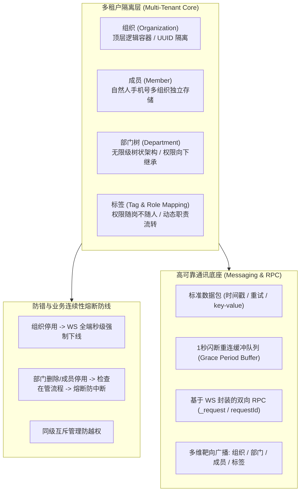
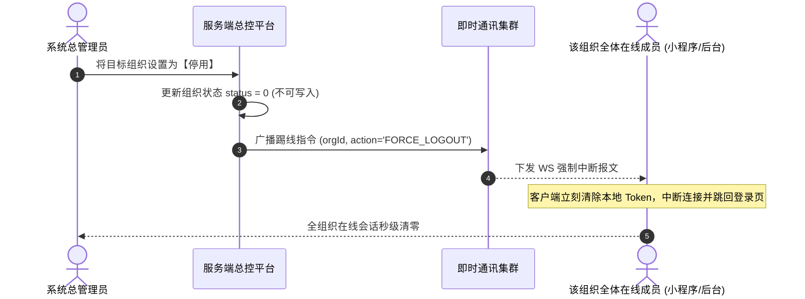
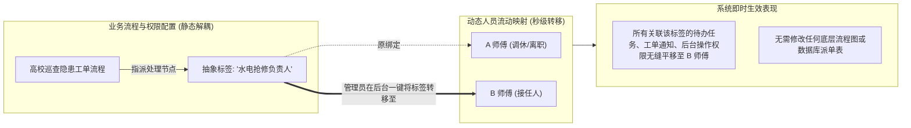
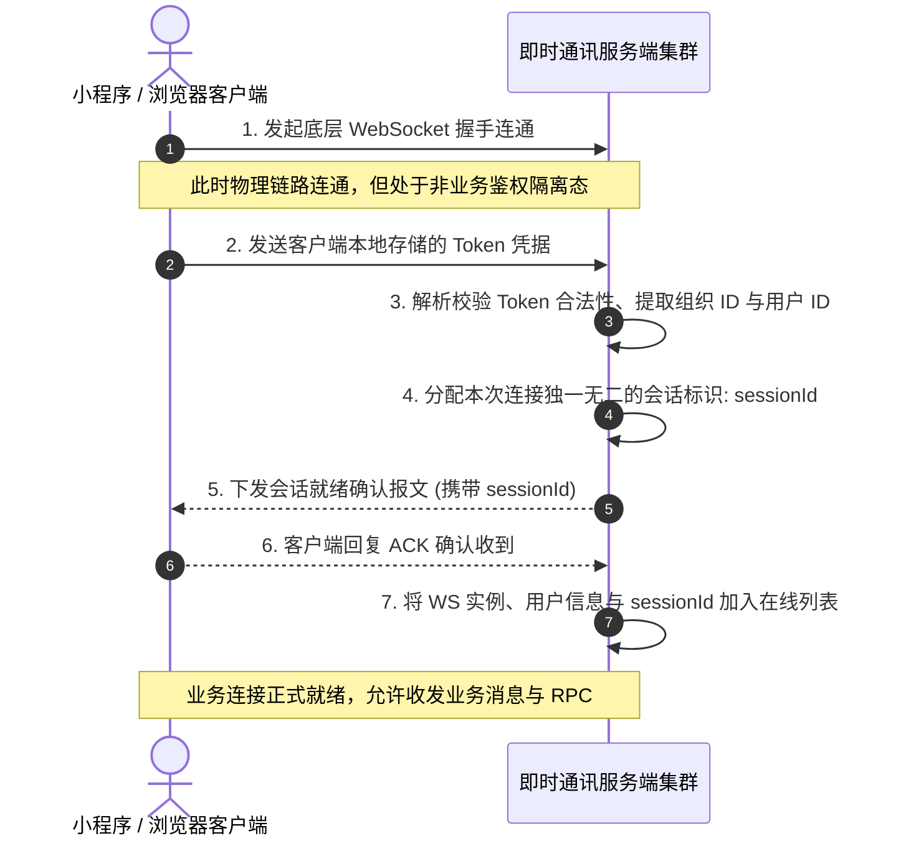

# “递点”多租户组织管理与即时通讯系统构想设计方案全景手册

> **项目代号**：“递点” (DiDian)  
> **核心定位**：高可靠、企业级多租户组织架构、权限解耦中台与分布式即时通讯（IM）通信系统  
> **文档属性**：原始设计构想完整系统化归档与技术落地全景方案  
> **溯源位置**：[v4.0/Docs/假象的一种系统/](file:///e:/Projects/University/后勤巡查e速办%20大二下学期%20大学身份上线项目/v4.0/Docs/假象的一种系统)  
> **归档时间**：2026-09-05  
> **文档路径**：[v4.0/Docs/“递点”多租户组织管理与即时通讯系统构想设计方案.md](file:///e:/Projects/University/后勤巡查e速办%20大二下学期%20大学身份上线项目/v4.0/Docs/“递点”多租户组织管理与即时通讯系统构想设计方案.md)

---

## 目录索引 (Table of Contents)

1. [系统总体概述与核心设计哲学](#一-系统总体概述与核心设计哲学)
2. [第一部分：四大核心逻辑实体模型定义](#二-第一部分四大核心逻辑实体模型定义)
   - 2.1 [组织 (Organization) 实体](#21-组织-organization-实体)
   - 2.2 [成员 (Member) 实体与多身份独立存储机制](#22-成员-member-实体与多身份独立存储机制)
   - 2.3 [部门 (Department) 树状实体与部门成员关联](#23-部门-department-树状实体与部门成员关联)
   - 2.4 [标签 (Tag) 实体与动态角色映射](#24-标签-tag-实体与动态角色映射)
3. [第二部分：组织管理全生命周期体系](#三-第二部分组织管理全生命周期体系)
   - 3.1 [组织创建与超级管理员强绑定](#31-组织创建与超级管理员强绑定)
   - 3.2 [级联删除与高危防误删机制](#32-级联删除与高危防误删机制)
   - 3.3 [组织停用联动与 WebSocket 强制下线广播](#33-组织停用联动与-websocket-强制下线广播)
   - 3.4 [多维度身份反查与组织定位流程](#34-多维度身份反查与组织定位流程)
4. [第三部分：部门架构与业务连续性防错熔断机制](#四-第三部分部门架构与业务连续性防错熔断机制)
   - 4.1 [树状架构与权限向下继承辐射](#41-树状架构与权限向下继承辐射)
   - 4.2 [递归删除与业务流程防中断锁定 (防错熔断)](#42-递归删除与业务流程防中断锁定-防错熔断)
   - 4.3 [同级互斥与防越权保护机制](#43-同级互斥与防越权保护机制)
   - 4.4 [部门架构动态调整与多维检索 (路径与子树)](#44-部门架构动态调整与多维检索-路径与子树)
5. [第四部分：成员全生命周期管理与多租户隔离](#五-第四部分成员全生命周期管理与多租户隔离)
   - 5.1 [成员增删改与唯一性校验](#51-成员增删改与唯一性校验)
   - 5.2 [手机号更换与密码安全规则](#52-手机号更换与密码安全规则)
   - 5.3 [成员停用与在管业务流程熔断保护](#53-成员停用与在管业务流程熔断保护)
6. [第五部分：核心设计哲学——标签与权限解耦 (权限随岗不随人)](#六-第五部分核心设计哲学标签与权限解耦-权限随岗不随人)
   - 6.1 [为什么传统 UID 权限绑定必然崩溃？](#61-为什么传统-uid-权限绑定必然崩溃)
   - 6.2 [基于标签的动态职责流转机制](#62-基于标签的动态职责流转机制)
   - 6.3 [Windows Metro UI 视觉标识与标签生命周期](#63-windows-metro-ui-视觉标识与标签生命周期)
7. [第六部分：即时通讯 (IM) 底座与高可靠 WebSocket 传输协议](#七-第六部分即时通讯-im-底座与高可靠-websocket-传输协议)
   - 7.1 [强类型数据包数据结构定义](#71-强类型数据包数据结构定义)
   - 7.2 [连接建立、Token 握手与动态 SessionId](#72-连接建立token-握手与动态-sessionid)
   - 7.3 [1 秒网络闪断重连缓冲队列机制 (Grace Period Buffer)](#73-1-秒网络闪断重连缓冲队列机制-grace-period-buffer)
   - 7.4 [基于 WebSocket 的双向 RPC 请求协议 (_request / requestId)](#74-基于-websocket-的双向-rpc-请求协议-_request--requestid)
   - 7.5 [服务端 RPC 请求处理、分发与超时熔断保护](#75-服务端-rpc-请求处理分发与超时熔断保护)
8. [第七部分：多维消息系统与双层后台体系](#八-第七部分多维消息系统与双层后台体系)
   - 8.1 [多维靶向触达机制 (组织/部门/成员/标签)](#81-多维靶向触达机制-组织部门成员标签)
   - 8.2 [双层后台管理架构 (系统后台 vs 组织后台)](#82-双层后台管理架构-系统后台-vs-组织后台)
   - 8.3 [双维度权限划分 (组织后台权限 vs 部门权限)](#83-双维度权限划分-组织后台权限-vs-部门权限)
9. [第八部分：“递点”架构对高校后勤巡查e速办 v4.0 的落地赋能矩阵](#九-第八部分递点架构对高校后勤巡查e速办-v40-的落地赋能矩阵)

---

## 一、 系统总体概述与核心设计哲学

“递点”是一套从零构建的标准多租户企业级协作平台构想。该系统以**组织多租户容器**为根基，以**权限随岗不随人的标签系统**为调度引擎，以**毫秒级闪断容错的高可靠 WebSocket RPC 通信协议**为脉络，构建出极度坚固、解耦且具备极强业务连续性保障的现代化协作中台。



---

## 二、 第一部分：四大核心逻辑实体模型定义

### 2.1 组织 (Organization) 实体
组织是系统的**顶层逻辑容器**，是实现租户间数据完全物理隔离的基本单位。系统支持多种组织形态（教育机构、高校、政府单位、企业公司及社团协会等）。

| 字段名称 | 数据类型 | 约束规范 | 字段职能与业务描述 |
| :--- | :--- | :--- | :--- |
| **组织ID (`id`)** | String | 唯一主键 | 系统底层生成的全局唯一标识符 UUID。 |
| **组织名称 (`name`)** | String | 唯一索引 | 组织的官方全称，用于界面展示、品牌识别与登录检索。 |
| **组织 Logo (`logo`)** | String | 可选 | 组织标识。未上传时系统根据首字与随机色自动生成矢量 Logo。 |
| **物理位置 (`location`)** | String | 必填 | 组织的行政归属或地理办公地址（如高校校区）。 |
| **创建时间 (`createdAt`)** | DateTime | 自动维护 | 记录组织入驻系统的初始时间戳。 |
| **更新时间 (`updatedAt`)** | DateTime | 自动维护 | 记录组织属性最后一次发生变更的时间戳。 |

- **唯一映射原则**：在逻辑层面上，一个现实世界的组织在系统中仅对应一条记录。
- **归属层级**：组织是系统层级的根节点，其下挂载成员、部门、标签及所有的业务数据，从物理根源上确保跨租户的数据安全与逻辑独立。

---

### 2.2 成员 (Member) 实体与多身份独立存储机制

| 字段名称 | 数据类型 | 约束规范 | 字段职能与业务描述 |
| :--- | :--- | :--- | :--- |
| **成员ID (`id`)** | String | 唯一主键 | 成员在该组织中的全局唯一标识 UUID。 |
| **组织ID (`orgId`)** | String | 外键逻辑关联 | 关联所属组织，实现多租户隔离。 |
| **身份核心 (`coreIdentity`)**| String | **联合唯一** | **组织ID + 手机号**：确保在该组织内身份绝对唯一。 |
| **姓名 (`realName`)** | String | 必填 | 成员真实姓名。 |
| **手机号 (`phone`)** | String | 必填 | 身份认证凭据。 |
| **登录密码 (`password`)** | String | 必填 (8~16位)| 大小写字母+数字+下划线安全散列。 |
| **工号 (`jobNo`)** | String | 可选 | 成员在组织内的工号或学号。 |
| **头像 (`avatarUrl`)** | String | 可选 | 成员个人资料头像。 |
| **管理状态 (`isSuperAdmin`)**| Int | 0/1 | 是否为超级管理员：定义组织顶层特权。 |
| **生命周期状态 (`status`)** | Int | 0正常/1停用/2已删 | 软删除与账号冻结标记。 |

#### 关键机制：自然人多身份独立存储 (Multi-Identity Storage)
- **自然人与组织解耦**：现实中的自然人（以唯一手机号为准）可同时加入多个组织（例如既是 A 高校职工，又是 B 协会会长）；
- **数据物理隔离**：系统采用“独立存储”原则。该手机号会在不同组织下生成**相互独立的成员记录**。不同组织间的成员数据（头像、姓名、角色、密码、所属部门）互不干涉，确保租户数据的纯净性；
- **平面化存储**：组织内的全部成员采用线性平铺存储，成员之间在底层不存在强绑定的父子层级，层级完全交给部门树解耦维护。

---

### 2.3 部门 (Department) 树状实体与部门成员关联

部门是组织内部的树状逻辑单元，用于模拟现实中的行政或业务架构（如后勤处 ➔ 水电维修科）。

#### 1. 部门实体定义 (`Department`)
| 字段名称 | 数据类型 | 约束规范 | 字段职能与业务描述 |
| :--- | :--- | :--- | :--- |
| **部门ID (`id`)** | String | 唯一主键 | 部门全局唯一标识 UUID。 |
| **父部门ID (`parentId`)** | String | 可为空 (`Nullable`) | 指向上级部门。**若为 `null`，则定义为组织架构的顶级根部门**。 |
| **部门名称 (`name`)** | String | 同级唯一 | 部门全称，同父节点下不得重名。 |
| **部门头像 (`logo`)** | String | 可选 | 部门专属徽标。 |

#### 2. 部门成员关联定义 (`DepartmentMember`)
| 字段名称 | 数据类型 | 约束规范 | 字段职能与业务描述 |
| :--- | :--- | :--- | :--- |
| **部门成员ID (`id`)** | String | 唯一主键 | 成员在特定部门归属关系的唯一标识 UUID。 |
| **成员ID (`memberId`)** | String | 逻辑关联 | 当前组织的成员 UUID。 |
| **所在部门ID (`deptId`)** | String | 可为空 (`Nullable`) | **若为 `null`，表示该成员直接隶属于组织根部**（平铺成员）。 |
| **管理权标记 (`isManager`)** | Int | 0普通/1部门主管 | 定义该成员在当前部门及其下属子树的行政管理权限。 |

---

### 2.4 标签 (Tag) 实体与动态角色映射

标签（Tag）是系统内实现**“职责与人员解耦”**的核心机制。通过将业务权限赋予抽象的标签而非具体的成员个体，系统能够完美适配组织内高频的人事变动需求。

| 字段名称 | 数据类型 | 约束规范 | 字段职能与业务描述 |
| :--- | :--- | :--- | :--- |
| **标签ID (`id`)** | String | 唯一主键 | 标签全局唯一标识 UUID。 |
| **组织ID (`orgId`)** | String | 逻辑隔离 | 归属组织 UUID。 |
| **标签名称 (`name`)** | String | 组织内唯一 | 如“校长”、“后勤主管”、“防汛紧急联络人”、“水电组长”。 |
| **视觉标识 (`color`)** | String | 可选 | 用于在 UI 界面区分不同属性（从 Windows Metro UI 标准色系中选取）。 |

- **多对多映射**：任一成员可拥有零个至多个标签，一个标签下也可聚合多名成员；
- **无状态即时生效**：标签的分配与解绑是即时生效的，不修改成员底层的身份档案。

---

## 三、 第二部分：组织管理全生命周期体系

### 3.1 组织创建与超级管理员强绑定
- **操作权限**：仅限系统总管理员（平台运营方）；
- **强绑定要求**：**创建组织时，必须同步指定一名该组织的超级管理员**。这样确保组织创建后，能立刻由专门人员入场配置部门、审批流程并导入成员，杜绝产生“无主组织”。
- **系统自动处理**：若未上传 Logo，系统自动截取组织名称首字，搭配随机背景色生成矢量 Logo。

### 3.2 级联删除与高危防误删机制
- **彻底清理**：由于组织是顶层容器，系统管理员删除组织属于级联操作，将同步清理该组织下的所有成员、部门架构、标签及所有流转中的业务数据；
- **高危二次确认防线**：管理后台严禁一键静默删除，必须弹出二次输入框，**强制要求管理员手动输入完整的组织全称**，校验完全一致方可执行。

### 3.3 组织停用联动与 WebSocket 强制下线广播
当系统管理员因欠费、合规审查或学期结束将某个组织设置为“停用”状态时：
1. 服务端立刻在内部消息总线上发布组织停用指令；
2. **即时通讯集群向该组织下辖的所有在线客户端（管理后台端、小程序移动端）推送专属 WS 强制下线消息**；
3. 客户端在收到指令后，**必须在 100 毫秒内强制切断本地长连接、清空 Token 缓存并弹出警告弹窗强退至登录页**，使停用指令即时生效，杜绝越权留存。



### 3.4 多维度身份反查与组织定位流程
针对用户不知道自己属于哪个组织或有多组织身份的场景，系统提供双轨查询通道：
1. **基于手机号的身份反查**：
   - 访客在未登录状态下输入手机号并获取短信验证码；
   - 验证通过后，系统检索该手机号关联的所有组织，列表渲染组织名称与 Logo；
   - 用户点击对应组织卡片，直接进入该组织的身份登录流程。
2. **基于组织名称的模糊检索**：
   - 用户输入学校或企业名称关键字（如“聊城”）；
   - 系统匹配所有符合条件的组织列表；
   - 用户选择对应组织，再输入自己的账号与密码完成定向登录。

---

## 四、 第三部分：部门架构与业务连续性防错熔断机制

### 4.1 树状架构与权限向下继承辐射
- **根节点界定**：若部门的 `parentId = null`，则代表直接挂载在组织根部的一级顶级部门；
- **权限向下辐射原则**：部门管理员的职权默认遵循“向下递归继承”，其行政管理效力自动覆盖至该节点下的所有子部门与孙部门，从而减少多级组织的配置冗余。

### 4.2 递归删除与业务流程防中断锁定 (防错熔断)
在实际企业运作中，最忌讳的是“某部门被删除了，但该部门负责的报修单/审批流还卡在中间，导致业务永远无法闭环”。

> [!CAUTION]
> **业务流程锁定防错机制 (Flow Lock Safety)**：  
> 当管理员尝试删除某个部门（及其子部门）或从部门中踢出成员时，系统**底层第一步必须主动检索该部门（或成员）当前是否有正在负责流转的业务流程**。  
> **若存在任何一条进行中的流程，系统必须立即熔断操作，拒绝删除**，并明确弹窗报错：  
> **“【XXX 部门 / 成员】还有正在负责流转的业务流程，严禁删除/停用！”**

### 4.3 同级互斥与防越权保护机制
- **同级互斥（管理防越权）**：若被操作者拥有“部门管理员”头衔，且操作者的最高权限仅为同级部门管理员（层级相同），则操作者无权删除或调整对方，系统坚决提示：“无权操作”；
- **跨组织隔离**：删除或调整部门成员时，必须校验操作者所在组织与目标成员所在组织完全一致。

### 4.4 部门架构动态调整与多维检索
- **变更父部门**：支持任意部门在树状拓扑中平移迁移至新父部门；若为局部管理员操作，系统递归核验其管辖范围是否完全覆盖“原父部门”与“新父部门”；
- **路径检索（向上递归）**：给定 `deptId`，从当前部门向上递归检索直至根节点，返回如 `后勤处 > 宿管科 > 1号公寓管理组` 的面包屑路径；
- **子树检索（向下递归）**：给定 `deptId` 与检索深度（可选），展开获取完整的下级树状 JSON。

---

## 五、 第四部分：成员全生命周期管理与多租户隔离

### 5.1 成员增删改与唯一性校验
1. **添加成员**：
   - 必填：组织 ID、姓名、手机号、初始登录密码；
   - **组织内唯一性校验**：同一组织内手机号严禁重复（若已存在提示：“成员已存在”）；密码强制校验 8~16 位大小写字母+数字+下划线；
2. **修改成员**：
   - 允许修改姓名、密码、头像、工号等基本资料；
   - **特别规定**：手机号作为组织内的身份核心标识，普通信息修改接口**不支持修改手机号**，必须走专职的【更换手机号】工单接口，并经过冲突检查。

### 5.2 成员停用机制
- **停用不删档案**：成员账号被禁用后，无法登录系统任何端；但组织内部完整保留其历史档案、历史工单处理痕迹与审批记录；
- **停用时同样触发流程熔断校验**：若该成员名下还有挂起的工单流程，系统拒绝停用，必须先完成交接。

---

## 六、 第五部分：核心设计哲学——标签与权限解耦 (权限随岗不随人)

### 6.1 为什么传统 UID 权限绑定必然崩溃？
在传统软件设计中，业务流通常形如：
$$\text{报修单} \longrightarrow \text{指定派给张三老师 (UID: 1002)} \longrightarrow \text{张三审核通过}$$
**致命缺陷**：高校人事调动极其频繁（退休、休假、轮岗、离职）。一旦张三离职，管理员需要打开十几个复杂的业务流程配置，逐个找出张三的节点换成李四，稍有遗漏就会造成工单积压与瘫痪。

### 6.2 基于标签的动态职责流转机制
“递点”系统提出了卓越的设计哲学：**“权限随岗而不随人 (Decoupling Logic)”**。



1. **静态权限绑定标签**：系统在定义流程或权限时，只绑定标签（如：“指定由拥有【水电维修组长】标签的成员复核”）；
2. **动态职责秒级转移**：人员变动时，管理员仅需在后台把【水电维修组长】标签从 A 转移给 B；
3. **即时无感生效**：系统瞬间将关联该标签的全部待办工单、审批权、微信通知下发目标秒级切换至 B，业务流零中断，运维成本降至最低。

### 6.3 视觉标签配色系统
- 标签内置 `color` 视觉属性，系统默认从经典的 **Windows Metro UI 标准色彩体系**中随机或按职能分配（如：管理岗用 Crimson 红，技术岗用 Cobalt 蓝，安全联络员用 Amber 橙），提升前台视觉辨识度。

---

## 七、 第六部分：即时通讯 (IM) 底座与高可靠 WebSocket 传输协议

在《底层传输方式.pdf》中，“递点”规划了一套极其详尽、工业级强度的即时通讯协议规范。

### 7.1 强类型数据包数据结构定义
通信底座严禁使用散乱字符串，必须采用标准强类型数据包：

```typescript
interface DiDianPacket<T = any> {
  id: string;             // 数据包唯一ID: (server / sessionId) + 添加时间戳
  createdTime: number;    // 生成时间: 压入待发送队列的时间戳
  sentTime?: number;      // 发送时间: 连接就绪且实际向网络链路发送的时间戳
  retryCount: number;     // 重试计数: 因网络异常回退重试的次数 (初始为0)
  from: string;           // 发送端源标识: 'server' 或特定客户端 sessionId
  to: string;             // 接收端目标标识: 'server' 或目标客户端 sessionId
  key: string;            // 消息类型标识符 (如 '_request', 'chat_msg', 'notice')
  value: T;               // 携带的数据载荷 (任意类型)
}
```

---

### 7.2 连接建立、Token 握手与动态 SessionId
客户端直连服务端成功后，**严禁立即进行业务通讯**，必须执行严格的二阶段握手：



- **多设备多会话支持**：同一用户可以在多台设备（手机小程序、iPad、PC 后台）同时在线；每个设备拥有独立的 `sessionId` 与独立的 WS 连接对象，但在服务端映射归属于同一个自然人用户。

---

### 7.3 1 秒网络闪断重连缓冲队列机制 (Grace Period Buffer)

> [!IMPORTANT]
> **移动端弱网与切后台痛点**：  
> 移动端微信小程序在熄屏、接听电话或进出电梯时，网络连接常出现 1~2 秒的短暂闪断。传统架构会立即判定“用户离线”并销毁会话，导致重连繁琐且闪断期间的消息全量丢失。

#### “递点”协议的优雅解法：
1. **1 秒等待重连保留期**：连接中断时，服务端**绝不立刻将客户端移出在线列表**，而是将其标记为 `WAITING_RECONNECT`（等待重连状态），并在内存中保留 **1 秒钟宽限期**；
2. **专属内存消息缓冲池**：每个客户端对象维护独立的待发送缓冲队列。在此 1 秒宽限期内，任何发给该用户的消息直接压入该队列暂存；
3. **闪断无缝自愈**：若客户端在 1 秒内重新发起连接且 Token 一致，服务端直接复用原会话上下文，更新 WS 实例，并**瞬间将缓冲队列中的全部消息补发给客户端**；
4. **超时真正离线**：超过 1 秒仍未重连，服务端才正式将其移出在线列表，判定为离线，并将缓冲队列中未发出的消息回执为发送失败。

---

### 7.4 基于 WebSocket 的双向 RPC 请求协议 (`_request` / `requestId`)
WebSocket 原生只支持“单向发，单向收”，无法像 HTTP 一样“发起请求并同步等待返回值”。“递点”通过协议封装实现了基于 WS 的 RPC 双向请求能力：

1. **协议包装**：
   - 当调用 `sendRequest(sessionId, key, value)` 时，底层发送一个固定 `key = "_request"` 的数据包；
   - 其载荷为：`{ key: '真实业务key', value: 真实参数, requestId: '全局唯一UUID' }`；
2. **响应监听与挂起**：
   - 客户端在本地 Promise 映射表中以 `requestId` 为键挂起等待；
3. **3 秒超时熔断**：
   - 若发出请求后 **3 秒内** 未收到相同 `requestId` 的应答报文，Promise 自动触发超时熔断，返回失败错误，杜绝内存泄漏与悬挂请求。

---

### 7.5 服务端 RPC 请求处理分发与 2 秒执行超时保护
当服务端接收到客户端的 RPC 请求时：
1. **路由检索**：根据 `value.key` 在服务端处理器字典中检索是否有对应的业务函数；
2. **未定义拦截**：若未定义该 key，直接回复 `status: 0, content: '没有此类请求'`；
3. **2 秒超时熔断**：若处理函数执行耗时超过 **2 秒**，系统强制中断并回复 `status: 0, content: '执行时间过长'`；
4. **异常捕获与成功返回**：执行异常返回错误原因，执行成功返回 `status: 1, content: '成功', data: 结果`，客户端由挂起的 `requestId` 精准接收。

---

## 八、 第七部分：多维消息系统与双层后台体系

### 8.1 多维靶向触达机制 (组织/部门/成员/标签)
消息子系统由三大支柱构成，均支持跨维度的批量靶向发送：
1. **即时通讯系统 (WebSocket IM)**：单聊、群聊、会话列表；
2. **微信服务通知系统**：结合微信小程序订阅消息模板，直达师生微信通知大厅；
3. **短信通知系统**：紧急突发事件时下发手机短信。

**统一发送维度**：
$$\text{通知发送目标} \in \{\text{整个组织}, \text{指定部门树}, \text{具体成员列表}, \text{指定职能标签}\}$$
例如：发布台风防汛预警，直接向拥有【后勤安全联络员】标签的全体成员一键全渠道触达。

### 8.2 双层后台管理架构 (系统后台 vs 组织后台)
明确界定管理界面职责，防止权限越界：
- **系统总后台 (Platform Admin)**：面向平台运营商与系统超管（`role = 9`），统辖所有租户组织，负责新组织开通、付费配额核定、组织停用、全平台运维审计；
- **组织后台 (Organization Admin)**：面向各入驻组织管理员（如学校后勤处长 `role = 4`），仅能操作本组织的部门架构、成员导入、标签映射与业务流程。

### 8.3 双维度权限划分 (组织后台权限 vs 部门权限)
- **组织后台权限**：决定该成员是否能登录组织 Web 管理端；
- **部门权限**：定义部门主管在其所辖部门子树范围内的成员调动与流程处理权。

---

## 九、 第八部分：“递点”架构对高校后勤巡查e速办 v4.0 的落地赋能矩阵

经过深入对照，“递点”系统的全部核心设想已无缝赋能并演进为当前「高校后勤巡查e速办 v4.0」的核心模块：

| “递点”系统原生构想 | 在高校后勤巡查e速办 v4.0 中的落地映射 | 技术优势与商业价值 |
| :--- | :--- | :--- |
| **组织 (Organization) 顶层容器** | 落地为 **`schools` 租户核心主表** | 彻底推翻旧版单校单体库，支撑全国高校规模化 SaaS 接入与物理隔离。 |
| **组织停用联动 WS 强制下线** | 落地为 **`TenantPlanInterceptor` 与 WS 踢线广播** | 服务欠费或到期（`planExpireAt`）时，秒级锁定写操作并全校广播退出。 |
| **标签解耦 (权限随岗不随人)** | 落地为 **`permissions` 四维调度矩阵上位引擎** | 维修师傅休假或离职时，工单派发按标签自动平移，杜绝高校后勤业务瘫痪。 |
| **业务流程防中断熔断 (Flow Lock)** | 落地为 **校区/部门/责任人删除的 AST 前置校验** | 只要所属校区或科室还有在办工单（状态 0/1/2），严禁删除，杜绝孤儿死单。 |
| **1秒闪断重连缓冲池 (Grace Period)** | 落地为 **后勤工单协同类 QQ 聊天通信协议** | 解决维修师傅在校园地下水泵房、强电井弱网环境下频繁闪断重登的痛点。 |
| **基于 WS 的双向 RPC 协议** | 落地为 **师傅端接单/到场/完工的即时强一致性 ACK** | 保证高并发抢单或加急工单在网络不稳定情况下的可靠双向确认。 |
| **自然人多身份独立存储** | 落地为 **用户表 `(schoolId, openId)` 联合唯一设计** | 师生或外聘维修工程师可在不同大学兼职或多校巡视，各校数据完全独立。 |
| **双层后台 (系统后台/组织后台)** | 落地为 **系统超级管理员 (`role=9`) 与 学校管理员 (`role=4`)** | 清晰划分平台运营方与高校自主管理的特权边界。 |
| **多维靶向消息广播** | 落地为 **微信模板通知与站内信 (`messages`) 批量下发引擎** | 按校区、分类、角色标签精准推送加急维修督办单。 |

---

> [!NOTE]
> 本文档已作为 v4.0 核心设计架构的基石之一，正式归档于 `v4.0/Docs/` 目录中。它不仅完整再现了“递点”系统的原创设想，更为高校后勤巡查e速办向全国标杆级商业化产品迈进提供了不可替代的顶层指引。
