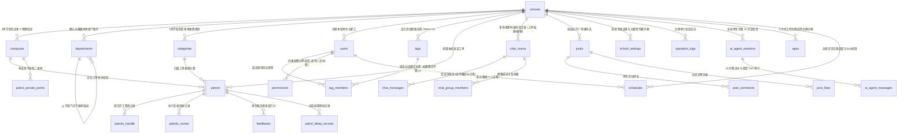

# 数据库架构演进与多租户设计文档索引

本目录收录了“高校后勤巡查e速办”项目的数据库结构定义。为满足未来面向全国更多高校（如清华、北大、山大等）规模化 SaaS 部署需求，以及**各高校管理员自主配置大模型凭据、使用专属智能后勤 AI Agent，并深度融合“递点（类飞书）”组织中台、标签权限解耦与高可靠即时通讯**的前沿业务诉求，系统已完成由**单校极客架构**向**企业级多租户与 AI/IM 原生数据底座**的彻底重构。

---

## 一、 文件清单与版本对照

| 文件名称 | 架构版本 | 适用范围 | 状态与说明 |
| :--- | :--- | :--- | :--- |
| [高校后勤巡查e速办v4.0多租户数据库结构设计.sql](file:///e:/Projects/University/后勤巡查e速办%20大二下学期%20大学身份上线项目/v4.0/Docs/数据库/高校后勤巡查e速办v4.0多租户数据库结构设计.sql) | **v4.0 Enterprise SaaS, AI & IM** | **全新重构标准（推荐）** | **当前正式基准**。支持多高校租户隔离、各校自主配置大模型与递点类飞书组织中台，包含完整的 **27 张物理业务表、7 个多租户全景视图**、多租户复合索引及初始化种子数据。 |
| [结构.sql](file:///e:/Projects/University/后勤巡查e速办%20大二下学期%20大学身份上线项目/v4.0/Docs/数据库/结构.sql) | v1.0~v3.0 Legacy | 仅供历史旧版功能对照 | **【旧版参考】已废弃**。原聊城大学单一学校单体数据库 Dump 脚本，无 `schoolId`，无大模型与组织标签支持，无法直接支持多学校部署。 |

---

## 二、 核心变革：为什么旧版 `结构.sql` 无法继续使用？

在旧版 `xc_backend` 中，数据库是针对聊城大学单所高校单机运行的：
1. **全表缺少学校ID (`schoolId`)**：所有业务表（如 `patrols`、`users`、`departments`）仅有校区ID（`campusId`）。若有第二所高校接入，数据将完全混淆并造成严重跨校数据泄露与越权漏洞。
2. **校区混淆冲突**：各高校均有“东校区/西校区”（自增 ID 通常为 1, 2）。旧版单列查询 `WHERE campusId = 1` 会同时误操作其他学校的同名校区数据。
3. **缓存击穿与污染**：旧版以单纯主键 `id` 建立缓存（如 `users:1`）。多校共存时，不同高校自增 ID 相同的用户缓存会严重互踩。
4. **硬编码扩展性差**：旧版包含大量硬编码字段（如 `image1~5`、`endTime1~3`、`delay1~3UserId`），无法满足正规软件工程标准。
5. **完全缺乏 AI、树状组织与解耦权限支持**：旧版缺乏学校维度独立设置表，无法让各校管理员自主配置大模型凭据，且权限死板绑定人员 UID，人员调休换岗极易导致业务瘫痪。

---

## 三、 数据库设计核心哲学：物理零外键 + 原生数据库级约束

> [!IMPORTANT]
> **准则 1：物理零外键 (Zero Physical Foreign Keys)，最多仅保留自增主键 (PRIMARY KEY)**  
> - **杜绝级联锁与性能拖垮**：在高并发多校巡查报修、高频聊天协同与 AI 对话流式写入场景下，物理外键会产生严重的跨表级联锁竞争，不仅急剧压制并发吞吐，更极易引发不可预测的死锁。  
> - **继承旧版极客哲学的自由度**：所有 27 张物理表仅保留自增主键 `PRIMARY KEY (id)`，表间完全通过逻辑字段（`schoolId`, `campusId`, `patrolId`, `userId`, `tagId`, `chatRoomId`, `appCode`）维系关联，轻量高效，易于后续水平分库分表、冷热分离与数据归档。
>
> **准则 2：数据的完整性与合法性主要通过数据库级原生约束 (DB-Level Constraints) 深度实现**  
> 不使用物理外键绝不意味着放任脏数据！系统深度利用 MySQL 8.x 的原生约束机制构建铁壁防线：  
> - **非空与默认值强约束 (`NOT NULL` + 精准 `DEFAULT`)**：全表核心业务列一律强制 `NOT NULL`，杜绝 NULL 带来的逻辑陷阱与索引膨胀；  
> - **防重防并发联合唯一约束 (`UNIQUE KEY`)**：  
>   - 用户唯一性：`UNIQUE KEY uk_school_openid (schoolId, openId)` 防跨校串号；  
>   - 广场点赞：`UNIQUE KEY uk_school_post_user (schoolId, postId, userId)` 数据库级防并发重复点赞；  
>   - 工单评价：`UNIQUE KEY uk_school_patrol (schoolId, patrolId)` 保证一单只评一次；  
>   - 学校配置：`UNIQUE KEY uk_school_key (schoolId, key)` 保证各校配置键名唯一；  
>   - 岗位标签：`UNIQUE KEY uk_school_tag (schoolId, name)` 保证校内岗位标签唯一；  
>   - 标签成员：`UNIQUE KEY uk_school_tag_user (schoolId, tagId, userId)` 防重复绑定；  
>   - 群聊成员：`UNIQUE KEY uk_group_user (schoolId, chatRoomId, userId)` 防重复入群；  
> - **MySQL 8.x 原生 `CHECK` 约束**：从数据库引擎层卡死业务非法值写入：  
>   - `CHECK (status BETWEEN 0 AND 5)` 卡死工单状态机范围；  
>   - `CHECK (role IN (0, 1, 2, 3, 4, 9))` 卡死四级权限角色取值；  
>   - `CHECK (roomType IN ('patrol', 'direct', 'group'))` 卡死即时通讯全场景类型；  
>   - `CHECK (role IN ('system', 'user', 'assistant', 'tool'))` 卡死 AI 对话消息角色合法性。

---

## 四、 新版多租户 27 张物理表拓扑字典 (全表 schoolId + 飞书微应用与日程体系)

新版 DDL 脚本全面重构为 27 张物理表，**全表强制嵌入 `schoolId` 租户字段**并配齐复合索引：



### 物理表清单 (27 表)：
1. **`schools`**（学校租户核心主表）：顶层租户实体，由系统管理员统辖，存储英文代号 (`code`)、全称、Logo、二级域名、**付费版本级别 (`planLevel`: 0免费, 1专业, 2旗舰)**、**配额模式 (`planType`: limited/unlimited)**、**月工单配额 (`maxMonthlyPatrols`)**、**服务到期时间 (`planExpireAt`)** 及配置 JSON。
2. **`campuses`**（校区字典表）：学校下属校区（`schoolId`, `campusId`, `name`）。
3. **`departments`**（树状部门字典表）：**升级为无限级树状架构**，含 `parentId`、`path`、`leaderId`、`category`、`contactPhone`，支持向上路径检索与向下子树展开。
4. **`categories`**（故障分类表）：水电、绿化、消防等（`schoolId`, `name`, `defaultDays`）。
5. **`users`**（用户主表）：全校师生与后勤职工，唯一联合索引 `(schoolId, openId)`，角色分级 `role IN (0, 1, 2, 3, 4, 9)`。
6. **`permissions`**（四维权限调度表）：支持**按人员 (`userId`)** 或**按岗位标签 (`tagId`)** 调度，实现权限随岗不随人。
7. **`patrols`**（巡查工单主表）：工单核心状态机，含 `schoolId`, `campusId`, `categoryId`, `imagesJson`。
8. **`patrols_handle`**（整改记录表）：完工照片与耗时说明（`schoolId`, `patrolId`）。
9. **`patrols_review`**（复核记录表）：现场复核合格与驳回记录（`schoolId`, `patrolId`）。
10. **`feedbacks`**（满意度评价表）：师生打分、标签与超时自动好评（`schoolId`, `patrolId`）。
11. **`patrol_delay_records`**（延期申请表）：支持任意多次延期申请与校级管理员审批（`schoolId`, `patrolId`）。
12. **`chat_rooms`**（多场景即时会话室表）：**升级支持多场景**（`roomType IN ('patrol', 'direct', 'group')`），工单房保持责任人主动激活 (`initiatedByHandler`)、置顶与未读管理。
13. **`chat_messages`**（聊天消息表）：流水明细，支持**消息类型 (0文本, 1图片, 2工单卡片, 3系统广播)**、**2分钟撤回机制 (`isWithDraw`)** 与**引用回复 (`answerMessageId`)**。
14. **`messages`**（统一消息中枢流表）：**升级统一消息中枢流表**，含 `appId`、`priority`、`externalPushStatus`，支持在线 WS 原地刷新防骚扰与离线超 180s 微信/短信智能穿透。
15. **`posts`**（校园广场动态表）：双轨合一公开瀑布流（`schoolId`, `creatorId`）。
16. **`post_comments`**（广场评论表）：师生互动评论，支持未登录访客公开评论（`guestNick`, `guestAvatar`）。
17. **`post_likes`**（广场点赞表）：联合唯一索引 `(schoolId, postId, userId)`。
18. **`school_settings`**（学校设置与大模型凭据表）：各校独立设置表，存放各校自定义参数与 OpenAI 兼容凭证（`apiKey`, `url`, `model`, `temperature`, `system_prompt`），敏感 Key 强制 AES-256 加密。
19. **`operation_logs`**（审计日志表）：核心安全操作审计追踪（`schoolId`, `userId`）。
20. **`patrol_qrcode_points`**（线下巡检点位表）：固定资产点位二维码打卡（`schoolId`, `campusId`, `code`）。
21. **`ai_agent_sessions`**（AI 智能助手会话表）：记录师生与专属 Copilot 的多轮会话（`schoolId`, `userId`）。
22. **`ai_agent_messages`**（AI 消息与受控 Tool 审计表）：记录完整人机问答、Reasoning 流与 7 大受控工具调用执行快照。
23. **`tags`** **[全新表]**（组织职能岗位标签表）：定义岗位抽象元数据与 Windows Metro UI 视觉色系（`schoolId`, `name`, `color`, `desc`）。
24. **`tag_members`** **[全新表]**（标签成员动态映射表）：人员轮岗调休仅需在此表转移标签，业务工单派单网关秒级平移（`schoolId`, `tagId`, `userId`）。
25. **`chat_group_members`** **[全新表]**（群聊成员关系档案表）：支撑科室工作群与突发应急抢险群聊成员角色（0普通, 1管理, 2群主）与已读游标。
26. **`apps`** **[全新表]**（飞书式工作台微应用注册表）：微应用唯一代号 (`appCode`)、归类 (`category`)、分包入口 (`entryRoute`)、最低角色 (`minRole`)、角标拉取接口 (`badgeApi`)，支撑像飞书应用一样解耦开发。
27. **`schedules`** **[全新表]**（全景日历日程与排班事件表）：工单 SLA 到期倒计时、值班排班表一键拨号、重大设备维保里程碑（`startTime`, `endTime`, `type`, `priority`, `dutyPhone`）。

---

---

## 五、 多租户全景视图体系 (7 大核心视图)

DDL 脚本内置了 7 个企业级视图，极大提升前端列表与统计大屏查询性能：
1. **`v_patrol_details`**：多租户巡查工单综合宽表视图（内联学校名、校区名、分类名、上报人与责任人姓名及电话）。
2. **`v_handlers_matrix`**：责任人四维调度矩阵视图（展平学校、校区、分类与责任人绑定关系）。
3. **`v_tenant_overview`**：各高校后勤大屏、SaaS 付费级别、配额上限与运营能效大盘视图。
4. **`v_post_feeds`**：校园广场公开动态展示视图（图文瀑布流、点赞数、评论数，支持未登录访客可见）。
5. **`v_chat_sessions`**：后勤人员类 QQ 会话大盘视图（聚合提报人头像、昵称、工单编号与分类、责任人主动激活状态、未读数与最后消息时间流）。
6. **`v_school_admins`**：各高校校级超级管理员名录视图。
7. **`v_tag_assignments`** **[全新视图]**：岗位职能标签成员与网格调度矩阵大盘视图（实时展现全校各岗位标签当前承接人员与联系电话）。

---

## 六、 学校自定义大模型凭据与 AI Agent 架构设计专章

### 6.1 `school_settings` 字段与预置大模型配置键值规范
| 配置键名 (`key`) | 字段类型与含义 | 示例值 | 加密标记 (`isEncrypted`) |
| :--- | :--- | :--- | :---: |
| `ai_enabled` | `BOOLEAN`: 是否开启本校专属 AI 助手 | `1` / `0` | 0 |
| `ai_api_key` | `STRING`: OpenAI 兼容 API 密钥凭据 | `sk-proj-xxxx...` (数据库密文存储) | 1 (AES-256-GCM) |
| `ai_base_url` | `STRING`: 兼容接口基地址 | `https://api.openai.com/v1` 或兼容端点 | 0 |
| `ai_model` | `STRING`: 调用的模型名称 | `gpt-4o-mini`, `deepseek-chat`, `qwen-max` | 0 |
| `ai_temperature` | `FLOAT`: 温度参数 (0.0~1.0) | `0.3` (针对高校后勤严谨事实查询推荐低温) | 0 |
| `ai_system_prompt` | `TEXT`: 学校专属系统人设 Prompt | `你是{schoolName}后勤智能助手小速...` | 0 |

### 6.2 7 大受控数据工具与多租户安全拦截
所有 7 个受控工具（大盘统计、工单检索、详情查看、本人报修进度、科室电话、广场动态、维修规程）在执行底层 AST 查询时，**强行由网关上下文注入 `context.schoolId`**，彻底屏蔽模型传入的学校参数，天然在租户边界内隔离。

---

## 七、 递点（类飞书）组织中台、标签解耦与高可靠即时通讯数据模型设计专章

### 7.1 树状组织架构与向下继承 (`departments`)
- 顶级部门 `parentId = NULL`，通过 `path` 字段建立快速祖先检索（如 `/1/3/8/`）；
- 权限向下继承：部门管理员自动拥有其辖下所有子科室的调度权。

### 7.2 岗位标签与“权限随岗不随人”解耦 (`tags` & `tag_members`)
- 业务派单优先绑定 `tagId`；
- 当人员调休、离职或接任时，管理员在后台执行一行 `tag_members` 的人员转移，关联该标签的在途工单待办与微信通知秒级平移，历史工单无需批量修改。

### 7.3 业务连续性防错熔断机制 (Flow Lock)
- 底层删除部门或停用人员前，自动执行：
  ```sql
  SELECT COUNT(1) FROM patrols 
  WHERE schoolId = :schoolId 
    AND (currentHandlerId = :userId OR currentReviewerId = :userId)
    AND status IN (0, 1, 2);
  ```
- 若有未结在办工单，强制熔断拒绝删除，报错提示必须先完成交接，杜绝死单。

### 7.4 即时通讯高可靠底座与双向 WS-RPC
- **1 秒网络闪断重连缓冲队列 (Grace Period Buffer)**：移动端网络闪断 1 秒内不踢线，消息压入内存缓冲队列，重连后瞬间全量补发；
- **基于 WS 的双向 RPC 协议 (`_request` / `requestId`)**：为加急抢单提供带 3 秒超时熔断的双向可靠同步。
