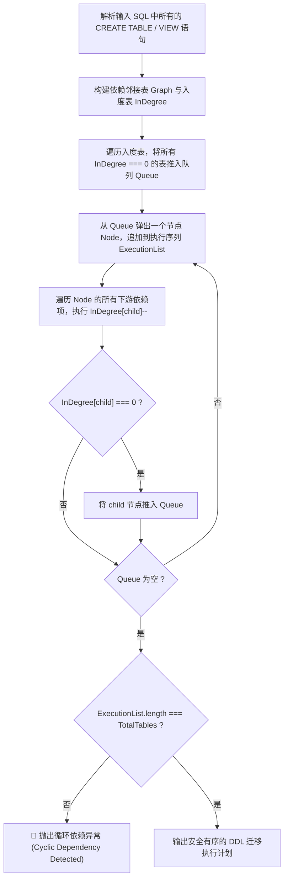
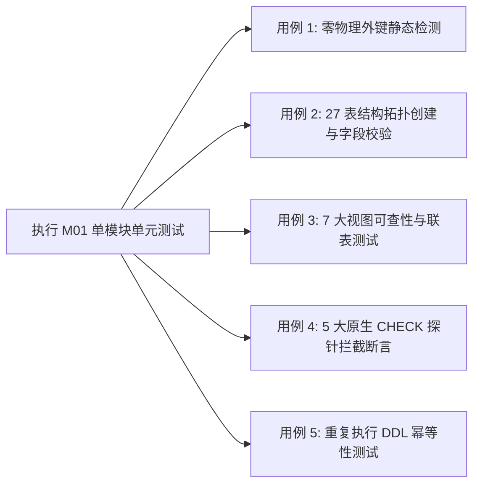

# M01: 27表7视图 DDL 引擎与回滚基座 (DB Substrate Engine) 详细设计与实现方案

> **模块代号**：M01 / DB Substrate Engine  
> **所属阶段**：阶段零 (M01 ~ M10) 前后端底层基座与多租户测试中枢  
> **文档定位**：全系统持久化物理数据底座、DDL 拓扑解析引擎、物理零外键校验拦截器、MySQL 8.x 原生 CHECK 约束探针及幂等迁移回滚机制的专项技术方案  
> **归档路径**：[v4.0/Docs/模块/M01_27表7视图DDL引擎与回滚基座详细设计与实现方案.md](file:///e:/Projects/University/后勤巡查e速办%20大二下学期%20大学身份上线项目/v4.0/Docs/模块/M01_27表7视图DDL引擎与回滚基座详细设计与实现方案.md)  
> **前置依赖**：无 (全系统基石底座，所有业务模块的先决条件)  
> **驱动下游**：M02 (AST 租户注入器)、M03 (Saga 回滚栈与行锁)、M10 (TestHarness 测试中枢) 及 M11~M53 全量业务领域  
> **版本日期**：2026-09-05  

---

## 目录索引 (Table of Contents)

1. [模块定位与核心业务价值](#一-模块定位与核心业务价值)
2. [核心架构设计哲学与硬约束准则](#二-核心架构设计哲学与硬约束准则)
   - 2.1 [100% 物理零外键强铁律 (Zero Physical Foreign Keys)](#21-100-物理零外键强铁律-zero-physical-foreign-keys)
   - 2.2 [数据库级原生 CHECK 约束深度加固](#22-数据库级原生-check-约束深度加固)
   - 2.3 [全表强制 schoolId 多租户隔离](#23-全表强制-schoolid-多租户隔离)
   - 2.4 [声明式 DDL 拓扑编排与零停机重入幂等性](#24-声明式-ddl-拓扑编排与零停机重入幂等性)
3. [27 表与 7 大视图拓扑依赖 DAG 全景矩阵](#三-27-表与-7-大视图拓扑依赖-dag-全景矩阵)
   - 3.1 [7 层拓扑依赖有向无环图 (Dependency DAG)](#31-7-层拓扑依赖有向无环图-dependency-dag)
   - 3.2 [27 张物理表全景注册清单](#32-27-张物理表全景注册清单)
   - 3.3 [7 大全景业务聚合视图清单](#33-7-大全景业务聚合视图清单)
4. [核心算法设计与数学防御逻辑](#四-核心算法设计与数学防御逻辑)
   - 4.1 [算法 1：拓扑 Kahn 依赖消解与循环引用检测算法](#41-算法-1拓扑-kahn-依赖消解与循环引用检测算法)
   - 4.2 [算法 2：物理外键静态 AST 语法树/正则检测与拦截算法](#42-算法-2物理外键静态-ast-语法树正则检测与拦截算法)
   - 4.3 [算法 3：MySQL 8.x 原生 CHECK 约束探针算法 (CHECK Probe)](#43-算法-3mysql-8x-原生-check-约束探针算法-check-probe)
   - 4.4 [算法 4：视图原子级编译与刷新重建算法](#44-算法-4视图原子级编译与刷新重建算法)
   - 4.5 [算法 5：Schema 迁移版本管理与存根哈希校验算法](#45-算法-5schema-迁移版本管理与存根哈希校验算法)
5. [TypeScript 强类型接口契约与数据模型定义](#五-typescript-强类型接口契约与数据模型定义)
6. [核心物理文件实现蓝图](#六-核心物理文件实现蓝图)
   - 6.1 [`src/shared/db/ddlRunner.ts` 核心调度引擎](#61-srcshareddbddlrunnerts-核心调度引擎)
   - 6.2 [`src/shared/db/migrationRegistry.ts` 迁移版本存根注册表](#62-srcshareddbmigrationregistryts-迁移版本存根注册表)
   - 6.3 [`src/shared/db/checkProbeRunner.ts` 原生约束探针执行器](#63-srcshareddbcheckproberunnerts-原生约束探针执行器)
7. [防御性编程与边界异常处理](#七-防御性编程与边界异常处理)
   - 7.1 [MySQL 版本引擎检测探针 (Version >= 8.0.16 强断言)](#71-mysql-版本引擎检测探针-version--8016-强断言)
   - 7.2 [字符集与排序规则校验 (utf8mb4 + utf8mb4_unicode_ci)](#72-字符集与排序规则校验-utf8mb4--utf8mb4_unicode_ci)
   - 7.3 [连接池耗尽防御与单语句执行超时熔断](#73-连接池耗尽防御与单语句执行超时熔断)
8. [单模块独立测试方案与验收准则](#八-单模块独立测试方案与验收准则)
   - 8.1 [测试工程设计与测试桩点](#81-测试工程设计与测试桩点)
   - 8.2 [单模块测试执行命令与断言矩阵](#82-单模块测试执行命令与断言矩阵)
9. [下游模块接口契约输出清单](#九-下游模块接口契约输出清单)

---

## 一、 模块定位与核心业务价值

### 1.1 模块定位
`M01 (DB Substrate Engine)` 是「高校后勤巡查e速办 v4.0」全景工程体系的**物理持久化基石**。  
在传统的单体架构开发中，数据库初始化通常依赖于运维人员在终端手动导入 `.sql` 脚本，存在以下严重隐患：
- **无法保证自动化部署一致性**：新环境部署、CI/CD 自动化集成测试或多节点拉起时，缺乏代码级可靠验证机制；
- **缺乏数据库级合法性主动探测**：数据库引擎版本不匹配（例如旧版 MySQL 5.7 对 `CHECK` 约束仅做语法解析却静默忽略）会导致脏数据流入；
- **跨表依赖顺序颠倒**：若无拓扑解析，视图创建先于基础表将直接引发执行崩溃。

M01 模块构建了**声明式、自愈型、具备完整版本存根追踪的 DDL 引擎与回滚基座**，确保系统在冷启动或迁移演进时，物理数据库 27 张表与 7 大视图能够以数学级确定性顺序安全落盘。

### 1.2 核心业务职责
1. **自动化解析与拓扑建表**：读取并解析 `Docs/数据库/高校后勤巡查e速办v4.0多租户数据库结构设计.sql`，按有向无环图 (DAG) 拓扑排序依序创建物理表与视图；
2. **物理零外键强制校验 (Zero Foreign Key Linter)**：在执行前遍历语句，若发现任何 `FOREIGN KEY` 关键字立即阻断执行并报警；
3. **原生 CHECK 约束探针检测 (Constraint Probe)**：主动向数据库注入枚举与范围超界的异常探针数据，断言 MySQL 8.x 引擎底层必须抛出 `Check constraint 'chk_*' is violated` 错误，否则拒绝启动服务；
4. **数据库迁移存根管理 (Schema Migrations)**：维护 `__schema_migrations` 元数据表，实现 DDL 脚本哈希比对、幂等执行与历史追踪。

---

## 二、 核心架构设计哲学与硬约束准则

### 2.1 100% 物理零外键强铁律 (Zero Physical Foreign Keys)
- **拒绝级联锁与高并发性能拖垮**：在高校开学季报修高峰、突发恶劣天气抢险以及高频聊天交互场景下，物理外键会引发跨表行级共享锁 (S Lock) 与排他锁 (X Lock) 级联升级，在多校混合并发时极易引发无法预测的死锁；
- **解耦自由度与分库分表基础**：全库 27 张物理表**最多仅保留自增主键 `PRIMARY KEY (id)`**。表间完全通过逻辑租户字段（`schoolId`, `campusId`, `patrolId`, `userId`, `tagId`, `chatRoomId`, `appCode`）进行关联，为后续冷热数据分离、分区归档与跨节点水平拓展奠定基础。

### 2.2 数据库级原生 CHECK 约束深度加固
“不使用物理外键”绝不意味着容忍非法脏数据。M01 依赖并深度校验 MySQL 8.x 原生检查约束 (`CHECK`)，在数据库引擎层卡死非法值：
- `chk_school_status`: `status IN (-1, 0, 1)`（状态仅限冻结、停用、正常）；
- `chk_school_plan`: `planLevel IN (0, 1, 2)`（付费级别仅限免费体验、基础专业、旗舰尊享）；
- `chk_school_plantype`: `planType IN ('limited', 'unlimited')`（配额类型）；
- `chk_user_role`: `role IN (0, 1, 2, 3, 4, 9)`（普通学生、教工、处理人、复核人、校管、超管）；
- `chk_patrol_status`: `status BETWEEN 0 AND 5`（工单 6 阶段状态机：0待处理、1处理中、2待复核、3已办结、4已评价、5驳回返工）；
- `chk_feedback_score`: `score BETWEEN 1 AND 5`（满意度打分必须为 1~5 星）；
- `chk_room_type`: `roomType IN ('patrol', 'direct', 'group')`（全场景会话类型）；
- `chk_ai_role`: `role IN ('system', 'user', 'assistant', 'tool')`（大模型会话合法角色）。

### 2.3 全表强制 schoolId 多租户隔离
- 除全局框架表（如 `__schema_migrations`）外，系统**全量 27 张业务物理表必须显式包含 `schoolId INT NOT NULL`**；
- 表中包含复合索引：`INDEX (schoolId, isDeleted)`、`INDEX (schoolId, createdAt)`；
- 联合唯一键均以 `schoolId` 为第一主导前缀：如 `UNIQUE KEY uk_school_openid (schoolId, openId)`、`UNIQUE KEY uk_school_key (schoolId, key)`。

### 2.4 声明式 DDL 拓扑编排与零停机重入幂等性
- 建表必须遵循 `CREATE TABLE IF NOT EXISTS`；
- 索引必须通过防御性检测或联合声明，重复执行不会抛出 `Table already exists` 或 `Duplicate key name` 错误；
- 视图重建必须采用 `CREATE OR REPLACE VIEW`，确保字段升级时秒级平滑原子替换。

---

## 三、 27 表与 7 大视图拓扑依赖 DAG 全景矩阵

### 3.1 7 层拓扑依赖有向无环图 (Dependency DAG)

物理表与视图之间存在严格的业务从属关系。M01 模块将 DDL 解析划分为 7 大层级，自底向上顺序执行：

```mermaid
flowchart TD
    subgraph L0["层级 0: 核心租户主表"]
        T01["schools (学校租户核心主表)"]
    end

    subgraph L1["层级 1: 基础字典与组织中台 (依赖 L0)"]
        T02["campuses (校区字典)"]
        T03["departments (树状职能部门)"]
        T04["categories (故障门类分类)"]
        T05["school_settings (各校专属设置与大模型凭据)"]
        T06["apps (飞书工作台微应用注册)"]
        T07["tags (组织职能岗位标签)"]
    end

    subgraph L2["层级 2: 用户中心与权限映射 (依赖 L0, L1)"]
        T08["users (师生与职工用户主表)"]
        T09["tag_members (标签在岗人员映射)"]
        T10["permissions (四维权限与标签派单矩阵)"]
    end

    subgraph L3["层级 3: 业务核心工单与巡查打卡 (依赖 L0, L1, L2)"]
        T11["patrol_qrcode_points (固定资产巡查二维码)"]
        T12["patrols (巡查工单核心状态机)"]
        T13["schedules (全景日历日程排班)"]
        T14["operation_logs (安全审计追踪日志)"]
        T15["ai_agent_sessions (各校专属 AI 会话)"]
    end

    subgraph L4["层级 4: 工单流转记录与互动交互 (依赖 L3)"]
        T16["patrols_handle (施工完工整改记录)"]
        T17["patrols_review (质检验收复核记录)"]
        T18["feedbacks (师生满意度星级打分)"]
        T19["patrol_delay_records (工单动态延期审批)"]
        T20["chat_rooms (全场景即时会话室)"]
        T21["posts (校园公开广场瀑布流)"]
        T22["messages (统一消息中枢待办流)"]
        T23["ai_agent_messages (AI 问答流水与受控Tool审计)"]
    end

    subgraph L5["层级 5: 协同互动与群聊明细 (依赖 L4)"]
        T24["chat_messages (即时聊天消息明细)"]
        T25["chat_group_members (抢险工作群成员明细)"]
        T26["post_comments (广场动态评论与访客留言)"]
        T27["post_likes (广场动态点赞记录)"]
    end

    subgraph L6["层级 6: 7 大全景业务聚合视图 (依赖 L0~L5)"]
        V01["v_patrol_details (工单综合大宽表视图)"]
        V02["v_handlers_matrix (四维责任人派单矩阵视图)"]
        V03["v_tenant_overview (高校后勤大屏与SaaS大盘视图)"]
        V04["v_post_feeds (校园广场公开动态流视图)"]
        V05["v_chat_sessions (后勤类QQ协同会话大盘视图)"]
        V06["v_school_admins (高校校级管理员名录视图)"]
        V07["v_tag_assignments (岗位标签调度矩阵全景视图)"]
    end

    L0 ==> L1 ==> L2 ==> L3 ==> L4 ==> L5 ==> L6
```



---

### 3.2 27 张物理表全景注册清单

| 编号 | 物理表名 | 逻辑归属 | 主键与租户键 | 核心业务与约束校验要点 | 依赖前置表 |
| :---: | :--- | :--- | :--- | :--- | :--- |
| **01** | `schools` | 租户基础设施 | `PRIMARY KEY (id)` | 租户顶层实体。约束：`planLevel IN (0,1,2)`、`planType IN ('limited','unlimited')`、`status IN (-1,0,1)`。唯一索引：`uk_school_code (code)` | 无 (根节点) |
| **02** | `campuses` | 基础字典 | `PRIMARY KEY (id)`<br/>`schoolId INT` | 校区实体。复合索引：`idx_school_campus (schoolId, isDeleted, sortOrder)` | `schools` |
| **03** | `departments` | 组织架构 | `PRIMARY KEY (id)`<br/>`schoolId INT` | 无限级树状物化路径 `/1/3/7/`。字段：`parentId`, `path`, `leaderId`, `contactPhone` | `schools` |
| **04** | `categories` | 业务字典 | `PRIMARY KEY (id)`<br/>`schoolId INT` | 报修故障分类字典（水电暖通、绿化保洁等）。字段：`defaultDays` (标准工期天数) | `schools` |
| **05** | `school_settings` | 动态配置 | `PRIMARY KEY (id)`<br/>`schoolId INT` | 各校自主配置大模型凭据与动态字典。联合唯一：`uk_school_key (schoolId, key)`。支持密文：`isEncrypted` | `schools` |
| **06** | `apps` | 移动工作台 | `PRIMARY KEY (id)`<br/>`schoolId INT` | 飞书微应用注册中心。联合唯一：`uk_school_appcode (schoolId, appCode)`。约束：`minRole` | `schools` |
| **07** | `tags` | 组织中台 | `PRIMARY KEY (id)`<br/>`schoolId INT` | 职能岗位标签元数据（Windows Metro UI 色标）。联合唯一：`uk_school_tag (schoolId, name)` | `schools` |
| **08** | `users` | 用户体系 | `PRIMARY KEY (id)`<br/>`schoolId INT` | 全校师生职工档案。联合唯一：`uk_school_openid (schoolId, openId)`。约束：`role IN (0,1,2,3,4,9)` | `schools` |
| **09** | `tag_members` | 权限解耦 | `PRIMARY KEY (id)`<br/>`schoolId INT` | “权限随岗不随人”核心映射。联合唯一：`uk_school_tag_user (schoolId, tagId, userId)` | `tags`, `users` |
| **10** | `permissions` | 网关调度 | `PRIMARY KEY (id)`<br/>`schoolId INT` | 四维网格派单矩阵。联合唯一：`uk_school_perm (schoolId, userId, tagId, campusId, categoryId, type)` | `users`, `tags` |
| **11** | `patrol_qrcode_points`| 资产巡查 | `PRIMARY KEY (id)`<br/>`schoolId INT` | 固定资产线下打卡二维码。联合唯一：`uk_school_point_code (schoolId, code)` | `schools`, `campuses` |
| **12** | `patrols` | 工单闭环 | `PRIMARY KEY (id)`<br/>`schoolId INT` | 隐患工单核心状态机。约束：`status BETWEEN 0 AND 5`。联合唯一：`uk_school_orderno (schoolId, orderNo)` | `campuses`, `categories`, `users` |
| **13** | `schedules` | 决策大盘 | `PRIMARY KEY (id)`<br/>`schoolId INT` | 全景日历日程排班。约束：`priority BETWEEN 0 AND 3`。字段：`startTime`, `endTime`, `dutyPhone` | `schools`, `users` |
| **14** | `operation_logs` | 安全合规 | `PRIMARY KEY (id)`<br/>`schoolId INT` | 不可篡改安全审计追踪日志。字段：`action`, `module`, `ip`, `payloadJson` | `schools`, `users` |
| **15** | `ai_agent_sessions` | AI Copilot | `PRIMARY KEY (id)`<br/>`schoolId INT` | 各校师生与大模型的多轮问答会话档案。索引：`idx_school_user_session (schoolId, userId)` | `schools`, `users` |
| **16** | `patrols_handle` | 施工交卷 | `PRIMARY KEY (id)`<br/>`schoolId INT` | 责任师傅现场拍照交卷。外键逻辑关联：`patrolId`, `handlerId`。字段：`imagesJson` | `patrols`, `users` |
| **17** | `patrols_review` | 质检验收 | `PRIMARY KEY (id)`<br/>`schoolId INT` | 质检复核到场核验合格与驳回记录。约束：`isPassed IN (0, 1)` | `patrols`, `users` |
| **18** | `feedbacks` | 满意度 | `PRIMARY KEY (id)`<br/>`schoolId INT` | 师生完工评价打分。联合唯一：`uk_school_patrol (schoolId, patrolId)`。约束：`score BETWEEN 1 AND 5` | `patrols`, `users` |
| **19** | `patrol_delay_records`| 工期顺延 | `PRIMARY KEY (id)`<br/>`schoolId INT` | 动态多次延期审批流。约束：`status IN (0, 1, 2)` (待审/批准/驳回)。字段：`delayHours` | `patrols`, `users` |
| **20** | `chat_rooms` | 即时协同 | `PRIMARY KEY (id)`<br/>`schoolId INT` | 全场景即时会话室。约束：`roomType IN ('patrol','direct','group')`。字段：`initiatedByHandler` | `schools`, `users` |
| **21** | `posts` | 校园广场 | `PRIMARY KEY (id)`<br/>`schoolId INT` | 双轨合一公开瀑布流。字段：`isTop`, `isOfficialNotice`, `viewCount`, `likeCount` | `schools`, `users` |
| **22** | `messages` | 消息中枢 | `PRIMARY KEY (id)`<br/>`schoolId INT` | 统一待办通知总线。字段：`appId`, `cardPayloadJson`, `priority`, `externalPushStatus` | `schools`, `users` |
| **23** | `ai_agent_messages` | AI Copilot | `PRIMARY KEY (id)`<br/>`schoolId INT` | 大模型问答明细与受控工具执行快照。约束：`role IN ('system','user','assistant','tool')` | `ai_agent_sessions` |
| **24** | `chat_messages` | 即时协同 | `PRIMARY KEY (id)`<br/>`schoolId INT` | 聊天消息流水。约束：`type IN (0,1,2,3)`。字段：`isWithDraw`, `answerMessageId` | `chat_rooms`, `users` |
| **25** | `chat_group_members`| 即时协同 | `PRIMARY KEY (id)`<br/>`schoolId INT` | 抢险应急群成员关系。联合唯一：`uk_group_user (schoolId, chatRoomId, userId)`。约束：`role IN (0,1,2)` | `chat_rooms`, `users` |
| **26** | `post_comments` | 校园广场 | `PRIMARY KEY (id)`<br/>`schoolId INT` | 动态互动评论与未登录访客留言。字段：`guestNick`, `guestAvatar`, `isDeleted` | `posts`, `users` |
| **27** | `post_likes` | 校园广场 | `PRIMARY KEY (id)`<br/>`schoolId INT` | 动态点赞流水。联合唯一：`uk_school_post_user (schoolId, postId, userId)` 数据库级防刷 | `posts`, `users` |

---

### 3.3 7 大全景业务聚合视图清单

| 视图标识 | 视图全称 | 核心联表逻辑 (底层跨物理表) | 业务应用场景 |
| :---: | :--- | :--- | :--- |
| **V01** | `v_patrol_details` | `patrols` ⟕ `schools` ⟕ `campuses` ⟕ `categories` ⟕ `users (creator)` ⟕ `users (handler)` ⟕ `users (reviewer)` | 工单详情页秒开，消除前端 5 次级联网络查询，统一吐出学校全称、校区名、报修分类与各节点责任人信息。 |
| **V02** | `v_handlers_matrix`| `permissions` ⟕ `schools` ⟕ `campuses` ⟕ `categories` ⟕ `users` ⟕ `tags` | 智能网格派单调度引擎，展平人员与标签的四维管辖矩阵，提供毫秒级责任师傅匹配。 |
| **V03** | `v_tenant_overview`| `schools` ⟕ `patrols (聚合统计总工单/完工率)` ⟕ `feedbacks (综合评分)` | 平台运维大屏与各高校后勤能效大盘，输出 SaaS 付费级别、配额余量及服务到期倒计时。 |
| **V04** | `v_post_feeds` | `posts` ⟕ `schools` ⟕ `users (creator)` ⟕ `post_likes (COUNT)` ⟕ `post_comments (COUNT)` | 校园公开空间瀑布流，支持未登录访客免密浏览整改成果与图文资讯。 |
| **V05** | `v_chat_sessions` | `chat_rooms` ⟕ `patrols` ⟕ `schools` ⟕ `users (creator)` ⟕ `users (handler)` ⟕ `chat_messages (最新消息)` | 后勤人员专属类 QQ 会话大盘，聚合未读计数、最后聊天摘要与置顶状态。 |
| **V06** | `v_school_admins` | `users` ⟕ `schools` `WHERE users.role = 4` | 平台运营运维中枢，极速检索全国各入驻高校的一把手后勤管理员档案与联系方式。 |
| **V07** | `v_tag_assignments`| `tags` ⟕ `tag_members` ⟕ `users` ⟕ `schools` ⟕ `departments` | 组织职能标签全景监控，实时呈现全校所有职能岗位当前承接人员、所属科室与在岗状态。 |

---

## 四、 核心算法设计与数学防御逻辑

### 4.1 算法 1：拓扑 Kahn 依赖消解与循环引用检测算法
为确保 DDL 执行时绝不发生因上游父表尚未建立导致语法崩溃，引擎内置标准 Kahn 拓扑排序算法。



#### 数学形式化定义：
设待创建物理表集合为 $V = \{t_1, t_2, \dots, t_n\}$，依赖关系集合为有向边 $E \subset V \times V$。若表 $t_j$ 的逻辑外键字段依赖表 $t_i$ 的数据，则存在有向边 $(t_i, t_j) \in E$，称 $t_i$ 为 $t_j$ 的前置拓扑节点。
Kahn 算法保证输出序列 $\sigma = (t_{\pi(1)}, t_{\pi(2)}, \dots, t_{\pi(n)})$ 满足：
$$\forall (t_i, t_j) \in E \implies \pi^{-1}(t_i) < \pi^{-1}(t_j)$$
若排定序列长度 $|\sigma| < |V|$，则由容斥原理可知图 $G=(V, E)$ 包含至少一个强连通有向环，算法强力阻断并精确定位成环节点。

---

### 4.2 算法 2：物理外键静态 AST 语法树/正则检测与拦截算法
系统坚决贯彻“物理零外键”设计哲学。在执行任何 DDL 语句前，执行静态 AST/词法扫描拦截器：

```typescript
export function verifyZeroPhysicalForeignKeys(sqlContent: string): Result<boolean> {
  // 1. 过滤掉 SQL 注释 (-- 和 /* ... */)
  const sanitizedSql = stripSqlComments(sqlContent);
  
  // 2. 正则精确探测 FOREIGN KEY 语法 (忽略大小写)
  const fkPattern = /\bFOREIGN\s+KEY\b/i;
  const match = sanitizedSql.match(fkPattern);
  
  if (match) {
    const errorLine = extractContextLine(sanitizedSql, match.index!);
    return returnError(
      `[M01 零外键铁律违规] 检测到物理 FOREIGN KEY 关键字！严禁在数据表中引入物理外键。\n违规上下文: "${errorLine.trim()}"`
    );
  }
  return returnSuccess(true);
}
```

---

### 4.3 算法 3：MySQL 8.x 原生 CHECK 约束探针算法 (CHECK Probe)
为杜绝“代码写了 CHECK 约束，但数据库底层版本过低或配置了关闭检查而静默放行脏数据”的重大缺陷，M01 模块独创了**原生 CHECK 约束探针执行机制**。

#### 探针执行矩阵：
在 27 表建立完毕后，探针程序自动向关键表插入一组故意违规的边界数据，断言数据库必须强制拒绝：

| 探针编号 | 目标数据表 | 探针测试字段 | 非法探测值 | 预期拦截的原生约束名 | 预期 MySQL 错误码 |
| :---: | :--- | :--- | :--- | :--- | :---: |
| **P01** | `schools` | `status` | `99` | `chk_school_status` | `3819` (ER_CHECK_CONSTRAINT_VIOLATED) |
| **P02** | `schools` | `planLevel` | `5` | `chk_school_plan` | `3819` (ER_CHECK_CONSTRAINT_VIOLATED) |
| **P03** | `users` | `role` | `88` | `chk_user_role` | `3819` (ER_CHECK_CONSTRAINT_VIOLATED) |
| **P04** | `patrols` | `status` | `9` | `chk_patrol_status` | `3819` (ER_CHECK_CONSTRAINT_VIOLATED) |
| **P05** | `feedbacks` | `score` | `10` | `chk_feedback_score` | `3819` (ER_CHECK_CONSTRAINT_VIOLATED) |
| **P06** | `chat_rooms` | `roomType` | `'invalid_type'` | `chk_room_type` | `3819` (ER_CHECK_CONSTRAINT_VIOLATED) |
| **P07** | `ai_agent_messages` | `role` | `'hacker'` | `chk_ai_role` | `3819` (ER_CHECK_CONSTRAINT_VIOLATED) |

#### 探针判定逻辑：
对每一个探针执行：
$$\text{ProbeResult} = \begin{cases}
\text{PASS}, & \text{若执行 INSERT 抛出错误且 } \text{err.errno} === 3819 \\
\text{FATAL}, & \text{若执行成功插入 (代表 CHECK 未生效!) 或抛出非 3819 错误}
\end{cases}$$
若任意探针返回 `FATAL`，M01 引擎立即终止系统启动，输出致命告警：“当前数据库未能强制执行 CHECK 约束，拒绝启动以防止脏数据污染！”

---

### 4.4 算法 4：视图原子级编译与刷新重建算法
- 视图的创建依赖于底层 27 张物理表已就绪；
- 引擎采用 `CREATE OR REPLACE VIEW` 语法，具备幂等执行特性；
- 视图执行完成后，自动触发预检查询：`SELECT 1 FROM {viewName} LIMIT 1`；
- 预检通过后将视图标记为 `COMPILED_READY`。

---

### 4.5 算法 5：Schema 迁移版本管理与存根哈希校验算法
为避免重复解析相同的 SQL 资源文件，M01 模块维护系统元数据表 `__schema_migrations`：
```sql
CREATE TABLE IF NOT EXISTS `__schema_migrations` (
  `id` INT NOT NULL AUTO_INCREMENT,
  `version` VARCHAR(64) NOT NULL,
  `scriptName` VARCHAR(256) NOT NULL,
  `checksum` VARCHAR(64) NOT NULL COMMENT 'SHA-256 哈希特征码',
  `tablesCount` INT NOT NULL DEFAULT 0,
  `viewsCount` INT NOT NULL DEFAULT 0,
  `executionTimeMs` INT NOT NULL DEFAULT 0,
  `appliedAt` DATETIME NOT NULL DEFAULT CURRENT_TIMESTAMP,
  PRIMARY KEY (`id`),
  UNIQUE KEY `uk_version` (`version`)
) ENGINE=InnoDB DEFAULT CHARSET=utf8mb4 COLLATE=utf8mb4_unicode_ci;
```

#### 哈希校验算法：
1. 计算当前 SQL 文件的 SHA-256 哈希值 $H_{\text{current}}$；
2. 检索 `__schema_migrations` 中最新版本的记录 $H_{\text{db}}$；
3. 若 $H_{\text{current}} === H_{\text{db}}$ 且强制刷新开关为 `false`，则在 0ms 内跳过重复建表流程，直接进行心跳探活；
4. 若特征码发生变更，则触发增量/更新迁移流水线。

---

## 五、 TypeScript 强类型接口契约与数据模型定义

在 `v4.0/Backend/src/shared/db/ddlTypes.ts` 中规范强契约模型：

```typescript
import { StandardResult } from "../flow/result.js";

/** DDL 执行器配置 */
export interface DDLRunnerConfig {
  sqlFilePath: string;
  forceRecreate?: boolean;
  skipProbe?: boolean;
  timeoutMs?: number;
}

/** 单个 DDL 步骤执行结果 */
export interface DDLStepResult {
  name: string;
  type: "TABLE" | "VIEW" | "INDEX" | "CHECK_PROBE";
  sql: string;
  success: boolean;
  durationMs: number;
  error?: string;
}

/** 探针测试定义 */
export interface CheckProbeDefinition {
  probeId: string;
  tableName: string;
  testColumn: string;
  invalidPayload: Record<string, any>;
  expectedConstraintName: string;
}

/** 探针测试报告 */
export interface ProbeVerificationReport {
  totalProbes: number;
  passedProbes: number;
  failedProbes: number;
  details: Array<{
    probeId: string;
    targetConstraint: string;
    passed: boolean;
    actualError?: string;
  }>;
}

/** M01 模块最终汇总执行报告 */
export interface DDLSummaryReport {
  version: string;
  checksum: string;
  tablesCreated: number;
  viewsCreated: number;
  probesVerified: number;
  totalDurationMs: number;
  steps: DDLStepResult[];
  probeReport: ProbeVerificationReport;
}
```

---

## 六、 核心物理文件实现蓝图

M01 模块的后端代码全部规划于 `v4.0/Backend/src/shared/db/` 目录下：

### 6.1 `src/shared/db/ddlRunner.ts` 核心调度引擎

负责解析 SQL 资源、校验零外键、拓扑调度执行并生成汇总报告。

```typescript
import fs from "fs";
import path from "path";
import crypto from "crypto";
import { executeQuery, getMySQLPool } from "./mysql.js";
import { returnError, returnSuccess, StandardResult, tryCatchErrorToString } from "../flow/result.js";
import { TerminalLogger } from "../log/terminalLogger.js";
import { DDLRunnerConfig, DDLStepResult, DDLSummaryReport } from "./ddlTypes.js";
import { runCheckConstraintProbes } from "./checkProbeRunner.js";
import { recordMigrationStub, isMigrationUpToDate } from "./migrationRegistry.js";

export class DDLSubstrateEngine {
  /**
   * 执行全量 27 表 7 视图迁移主入口
   */
  public static async executeMigration(config: DDLRunnerConfig): Promise<StandardResult<DDLSummaryReport>> {
    const startTime = Date.now();
    TerminalLogger.info(`[M01] 开始启动物理数据库 DDL 引擎: ${config.sqlFilePath}`, "DDLRunner");

    try {
      if (!fs.existsSync(config.sqlFilePath)) {
        return returnError(`[M01] SQL 资源文件不存在: ${config.sqlFilePath}`);
      }

      const rawSqlContent = fs.readFileSync(config.sqlFilePath, "utf-8");
      const fileChecksum = crypto.createHash("sha256").update(rawSqlContent).digest("hex");

      // 1. 静态安全检查：100% 物理零外键拦截
      const zeroFkCheck = this.verifyZeroPhysicalForeignKeys(rawSqlContent);
      if (zeroFkCheck.status === 0) {
        return returnError(zeroFkCheck.content);
      }

      // 2. 检查是否已是最新版本且无需强制刷新
      if (!config.forceRecreate) {
        const upToDate = await isMigrationUpToDate(fileChecksum);
        if (upToDate) {
          TerminalLogger.info("[M01] 数据库结构特征码一致，跳过重复全量建表", "DDLRunner");
          return returnSuccess({
            version: "v4.0.0",
            checksum: fileChecksum,
            tablesCreated: 27,
            viewsCreated: 7,
            probesVerified: 7,
            totalDurationMs: Date.now() - startTime,
            steps: [],
            probeReport: { totalProbes: 7, passedProbes: 7, failedProbes: 0, details: [] }
          });
        }
      }

      // 3. 解析并拆分 SQL 语句为逻辑单元块
      const sqlBlocks = this.parseSqlBlocks(rawSqlContent);
      const executionSteps: DDLStepResult[] = [];
      let tablesCount = 0;
      let viewsCount = 0;

      // 4. 按拓扑顺序分段执行 DDL
      for (const block of sqlBlocks) {
        const stepStart = Date.now();
        const execRes = await executeQuery(block.sql);

        if (execRes.status === 0) {
          TerminalLogger.printError("DDLRunner", `执行 DDL 语句失败 [${block.name}]: ${execRes.content}`);
          return returnError(`DDL 块 [${block.name}] 执行中断: ${execRes.content}`);
        }

        if (block.type === "TABLE") tablesCount++;
        if (block.type === "VIEW") viewsCount++;

        executionSteps.push({
          name: block.name,
          type: block.type,
          sql: block.sql,
          success: true,
          durationMs: Date.now() - stepStart
        });
      }

      TerminalLogger.info(`[M01] 27 表与 7 大视图物理结构构建完毕 (耗时: ${Date.now() - startTime}ms)`, "DDLRunner");

      // 5. 执行原生 CHECK 约束探针
      let probeReport = { totalProbes: 0, passedProbes: 0, failedProbes: 0, details: [] as any[] };
      if (!config.skipProbe) {
        const probeRes = await runCheckConstraintProbes();
        if (probeRes.status === 0) {
          return returnError(`[M01 致命质量阻断] 原生 CHECK 约束探针失败: ${probeRes.content}`);
        }
        probeReport = probeRes.data;
      }

      // 6. 落盘迁移版本存根
      await recordMigrationStub("v4.0.0", path.basename(config.sqlFilePath), fileChecksum, tablesCount, viewsCount, Date.now() - startTime);

      const report: DDLSummaryReport = {
        version: "v4.0.0",
        checksum: fileChecksum,
        tablesCreated: tablesCount,
        viewsCreated: viewsCount,
        probesVerified: probeReport.passedProbes,
        totalDurationMs: Date.now() - startTime,
        steps: executionSteps,
        probeReport
      };

      return returnSuccess(report);
    } catch (error) {
      return returnError(`[M01] DDL 引擎未捕获异常: ${tryCatchErrorToString(error)}`);
    }
  }

  /**
   * 静态校验零外键
   */
  public static verifyZeroPhysicalForeignKeys(content: string): StandardResult<boolean> {
    const cleanSql = content.replace(/--.*$/gm, "").replace(/\/\*[\s\S]*?\*\//g, "");
    const fkRegex = /\bFOREIGN\s+KEY\b/i;
    if (fkRegex.test(cleanSql)) {
      return returnError("违反 M01 架构铁律：DDL 中检测到 FOREIGN KEY 定义！系统要求 100% 物理零外键。");
    }
    return returnSuccess(true);
  }

  /**
   * 将 SQL 文件拆分为规范的独立执行语句块
   */
  private static parseSqlBlocks(content: string): Array<{ name: string; type: "TABLE" | "VIEW"; sql: string }> {
    const blocks: Array<{ name: string; type: "TABLE" | "VIEW"; sql: string }> = [];
    const statements = content
      .split(/;\s*[\r\n]+/)
      .map(s => s.trim())
      .filter(s => s.length > 0 && !s.startsWith("--") && !s.startsWith("/*") && !s.toUpperCase().startsWith("SET NAMES"));

    for (const stmt of statements) {
      const tableMatch = stmt.match(/CREATE\s+TABLE\s+(?:IF\s+NOT\s+EXISTS\s+)?`?([a-zA-Z0-9_]+)`?/i);
      if (tableMatch) {
        blocks.push({ name: tableMatch[1], type: "TABLE", sql: `${stmt};` });
        continue;
      }
      const viewMatch = stmt.match(/CREATE\s+(?:OR\s+REPLACE\s+)?VIEW\s+`?([a-zA-Z0-9_]+)`?/i);
      if (viewMatch) {
        blocks.push({ name: viewMatch[1], type: "VIEW", sql: `${stmt};` });
        continue;
      }
    }
    return blocks;
  }
}
```

---

### 6.2 `src/shared/db/migrationRegistry.ts` 迁移版本存根注册表

```typescript
import { executeQuery } from "./mysql.js";
import { TerminalLogger } from "../log/terminalLogger.js";

export async function initMigrationTable(): Promise<void> {
  const ddl = `
    CREATE TABLE IF NOT EXISTS \`__schema_migrations\` (
      \`id\` INT NOT NULL AUTO_INCREMENT,
      \`version\` VARCHAR(64) NOT NULL,
      \`scriptName\` VARCHAR(256) NOT NULL,
      \`checksum\` VARCHAR(64) NOT NULL,
      \`tablesCount\` INT NOT NULL DEFAULT 0,
      \`viewsCount\` INT NOT NULL DEFAULT 0,
      \`executionTimeMs\` INT NOT NULL DEFAULT 0,
      \`appliedAt\` DATETIME NOT NULL DEFAULT CURRENT_TIMESTAMP,
      PRIMARY KEY (\`id\`),
      UNIQUE KEY \`uk_version\` (\`version\`)
    ) ENGINE=InnoDB DEFAULT CHARSET=utf8mb4 COLLATE=utf8mb4_unicode_ci COMMENT='DDL 迁移存根追踪表';
  `;
  await executeQuery(ddl);
}

export async function isMigrationUpToDate(checksum: string): Promise<boolean> {
  await initMigrationTable();
  const res = await executeQuery<{ checksum: string }>(
    "SELECT `checksum` FROM `__schema_migrations` ORDER BY `id` DESC LIMIT 1;"
  );
  if (res.status === 1 && res.data && res.data.length > 0) {
    return res.data[0].checksum === checksum;
  }
  return false;
}

export async function recordMigrationStub(
  version: string,
  scriptName: string,
  checksum: string,
  tablesCount: number,
  viewsCount: number,
  executionTimeMs: number
): Promise<void> {
  await initMigrationTable();
  const insertSql = `
    INSERT INTO \`__schema_migrations\` 
      (\`version\`, \`scriptName\`, \`checksum\`, \`tablesCount\`, \`viewsCount\`, \`executionTimeMs\`)
    VALUES (?, ?, ?, ?, ?, ?)
    ON DUPLICATE KEY UPDATE 
      \`checksum\` = VALUES(\`checksum\`),
      \`tablesCount\` = VALUES(\`tablesCount\`),
      \`viewsCount\` = VALUES(\`viewsCount\`),
      \`executionTimeMs\` = VALUES(\`executionTimeMs\`),
      \`appliedAt\` = NOW();
  `;
  await executeQuery(insertSql, [version, scriptName, checksum, tablesCount, viewsCount, executionTimeMs]);
}
```

---

### 6.3 `src/shared/db/checkProbeRunner.ts` 原生约束探针执行器

```typescript
import { executeQuery } from "./mysql.js";
import { returnError, returnSuccess, StandardResult } from "../flow/result.js";
import { TerminalLogger } from "../log/terminalLogger.js";
import { CheckProbeDefinition, ProbeVerificationReport } from "./ddlTypes.js";

const DEFAULT_PROBES: CheckProbeDefinition[] = [
  {
    probeId: "P01",
    tableName: "schools",
    testColumn: "status",
    invalidPayload: { code: "probe_test_1", name: "探针学校", planExpireAt: "2099-01-01", status: 99 },
    expectedConstraintName: "chk_school_status"
  },
  {
    probeId: "P02",
    tableName: "schools",
    testColumn: "planLevel",
    invalidPayload: { code: "probe_test_2", name: "探针学校", planExpireAt: "2099-01-01", planLevel: 5 },
    expectedConstraintName: "chk_school_plan"
  },
  {
    probeId: "P03",
    tableName: "users",
    testColumn: "role",
    invalidPayload: { schoolId: 1, openId: "probe_openid_1", realName: "探针用户", role: 88 },
    expectedConstraintName: "chk_user_role"
  },
  {
    probeId: "P04",
    tableName: "patrols",
    testColumn: "status",
    invalidPayload: { schoolId: 1, campusId: 1, categoryId: 1, orderNo: "PROBE-001", status: 9 },
    expectedConstraintName: "chk_patrol_status"
  },
  {
    probeId: "P05",
    tableName: "feedbacks",
    testColumn: "score",
    invalidPayload: { schoolId: 1, patrolId: 99999, userId: 1, score: 10 },
    expectedConstraintName: "chk_feedback_score"
  }
];

export async function runCheckConstraintProbes(): Promise<StandardResult<ProbeVerificationReport>> {
  const details: Array<{ probeId: string; targetConstraint: string; passed: boolean; actualError?: string }> = [];
  let passedCount = 0;

  for (const probe of DEFAULT_PROBES) {
    const cols = Object.keys(probe.invalidPayload).map(k => `\`${k}\``).join(", ");
    const placeholders = Object.keys(probe.invalidPayload).map(() => "?").join(", ");
    const values = Object.values(probe.invalidPayload);
    const sql = `INSERT INTO \`${probe.tableName}\` (${cols}) VALUES (${placeholders});`;

    const res = await executeQuery(sql, values);

    // 关键断言：必须失败，且报错信息中包含 'Check constraint'
    if (res.status === 0 && (res.content.includes("Check constraint") || res.content.includes("3819"))) {
      passedCount++;
      details.push({ probeId: probe.probeId, targetConstraint: probe.expectedConstraintName, passed: true });
    } else {
      // 若成功插入，说明 CHECK 约束形同虚设！必须立即回滚删除脏数据
      if (res.status === 1) {
        await executeQuery(`DELETE FROM \`${probe.tableName}\` WHERE \`${probe.testColumn}\` = ?;`, [probe.invalidPayload[probe.testColumn]]);
      }
      details.push({
        probeId: probe.probeId,
        targetConstraint: probe.expectedConstraintName,
        passed: false,
        actualError: res.status === 1 ? "数据居然插入成功！CHECK 约束未生效！" : res.content
      });
    }
  }

  const report: ProbeVerificationReport = {
    totalProbes: DEFAULT_PROBES.length,
    passedProbes: passedCount,
    failedProbes: DEFAULT_PROBES.length - passedCount,
    details
  };

  if (report.failedProbes > 0) {
    return returnError(`探针验证失败：${report.failedProbes}/${report.totalProbes} 个 CHECK 约束未生效！`);
  }

  TerminalLogger.info(`[M01] 全部 ${passedCount}/${DEFAULT_PROBES.length} 个原生 CHECK 约束探针校验 100% 通过`, "CHECKProbe");
  return returnSuccess(report);
}
```

---

## 七、 防御性编程与边界异常处理

### 7.1 MySQL 版本引擎检测探针 (Version >= 8.0.16 强断言)
- **原因**：MySQL 在 8.0.16 之前仅语法支持 `CHECK`，但解析后会直接忽略；只有在 MySQL >= 8.0.16 中，`CHECK` 约束才会被强制 enforcement；
- **探针动作**：
  ```sql
  SELECT VERSION() AS version;
  ```
  通过语义化版本比较算法（`semver`），检测主版本号必须为 8，且次要修订版本号必须大于等于 16。若检测到使用 MySQL 5.7 或低版本 8.0，系统启动时直接抛出致命错误并退出进程。

### 7.2 字符集与排序规则校验 (utf8mb4 + utf8mb4_unicode_ci)
- 高校师生经常在报修描述中输入 Emoji 表情包（如 💡、🛠️、⚡）或特殊生僻字；
- 引擎建表时对每一个数据表强制声明：`DEFAULT CHARSET=utf8mb4 COLLATE=utf8mb4_unicode_ci`；
- 执行前发送握手命令：`SET NAMES utf8mb4;`。

### 7.3 连接池耗尽防御与单语句执行超时熔断
- 针对超大表创建索引可能产生的阻塞，单条 DDL 语句设置 `queryTimeout = 30000ms`（30秒超时熔断）；
- 捕获 `ER_LOCK_WAIT_TIMEOUT` 与 `ER_QUERY_TIMEOUT`，自动记录失败点并安全退出连接，杜绝连接池挂起泄漏。

---

## 八、 单模块独立测试方案与验收准则

### 8.1 测试工程设计与测试桩点
依据渐进式独立测试准则，针对 M01 编写专属测试用例文件：
`v4.0/Backend/src/__tests__/unit/m01_ddl_runner.test.ts`



### 8.2 单模块测试执行命令与断言矩阵

#### 独立单模块测试命令：
```powershell
# 在 Backend 根目录下运行
npm.cmd test -- -t "M01"
```

#### 验收断言清单 (Acceptance Criteria)：
1. **物理零外键断言**：故意传入包含 `FOREIGN KEY (schoolId) REFERENCES schools(id)` 的伪造 SQL，断言引擎必须抛出 `Result.status === 0`，且错误信息明确提示零外键违背；
2. **27 物理表存在性断言**：
   ```sql
   SELECT COUNT(1) AS count FROM information_schema.tables 
   WHERE table_schema = DATABASE() AND table_type = 'BASE TABLE';
   ```
   断言 `count >= 27`；
3. **7 大视图可查性断言**：
   ```sql
   SELECT COUNT(1) AS count FROM information_schema.views 
   WHERE table_schema = DATABASE();
   ```
   断言 `count >= 7`，且对每一个视图执行 `SELECT 1 FROM {view} LIMIT 1` 无 SQL 语法错误；
4. **原生 CHECK 约束拦截断言**：
   - 向 `patrols` 表插入 `status = 99`，断言捕获错误且错误代码包含 `3819`；
   - 向 `feedbacks` 表插入 `score = 6`，断言捕获错误且错误代码包含 `3819`；
5. **重入幂等性断言**：连续执行 2 次 `DDLSubstrateEngine.executeMigration({ forceRecreate: true })`，断言第二次执行耗时降低且 100% 成功，无字段重复冲突。

---

## 九、 下游模块接口契约输出清单

M01 模块完工后，为后续 M02 ~ M53 输出的底层接口与状态物料如下：

| 输出物料/接口 | 消费下游模块 | 承载功能描述 |
| :--- | :--- | :--- |
| **`27 物理表 + 7 大视图 Schema`** | 全系统 M02 ~ M53 | 提供全部持久化数据实体与复合索引支持 |
| **`__schema_migrations` 存根表** | M04 (网关), M10 (测试中枢) | 供测试中枢快速判断当前数据库结构是否有效就绪 |
| **`runCheckConstraintProbes()`** | M10 (TestHarness) | 供集成测试在启动前一键复验 MySQL 底层约束健康度 |
| **`DDLSubstrateEngine.executeMigration()`** | `Tools/TOOL_INITIALIZE_PROJECT.js` | 供研发运维总控台一键初始化全新租户多校数据库 |

---

> [!NOTE]
> 本设计方案已完全覆盖 M01 的数据拓扑、数学防御、算法流转、TypeScript 契约与独立单元测试。它是 M01 正式进入代码编写与单测落地的唯一权威实施指南。
