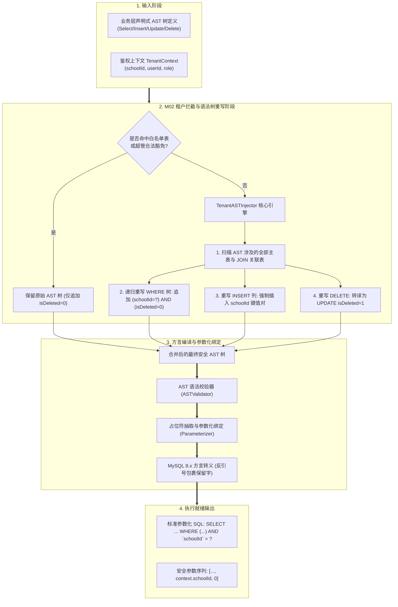
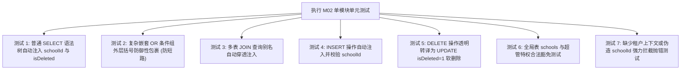

# M02: MySQL AST 编译器与租户自动注入器 (Tenant AST Interceptor) 详细设计与实现方案

> **模块代号**：M02 / Tenant AST Interceptor  
> **所属阶段**：阶段零 (M01 ~ M10) 前后端底层基座与多租户测试中枢  
> **文档定位**：系统多租户行级数据物理防穿透底座、动态 SQL 抽象语法树 (AST) 编译引擎、透明租户注入器与软删除自动化控制协议的专项技术实现方案  
> **归档路径**：[v4.0/Docs/模块/M02_MySQL_AST编译器与租户自动注入器详细设计与实现方案.md](file:///e:/Projects/University/后勤巡查e速办%20大二下学期%20大学身份上线项目/v4.0/Docs/模块/M02_MySQL_AST编译器与租户自动注入器详细设计与实现方案.md)  
> **前置依赖**：M01 (27表7视图 DDL 引擎与回滚基座)  
> **驱动下游**：M03 (Saga 事务撤回栈与行锁)、M10 (TestHarness 测试中枢) 及 M11 ~ M53 全量业务领域控制器与微应用  
> **版本日期**：2026-09-05  

---

## 目录索引 (Table of Contents)

1. [模块定位与核心业务价值](#一-模块定位与核心业务价值)
2. [核心设计哲学与安全防线准则](#二-核心设计哲学与安全防线准则)
   - 2.1 [透明无感租户注入哲学 (零心智负担原则)](#21-透明无感租户注入哲学-零心智负担原则)
   - 2.2 [防穿透安全铁壁：防止 OR 短路越权逻辑陷阱](#22-防穿透安全铁壁防止-or-短路越权逻辑陷阱)
   - 2.3 [双重约束合取绑定：租户隔离与软删除联动](#23-双重约束合取绑定租户隔离与软删除联动)
   - 2.4 [平台超管与系统级全局表豁免策略](#24-平台超管与系统级全局表豁免策略)
3. [AST 编译与租户注入核心架构流水线](#三-ast-编译与租户注入核心架构流水线)
   - 3.1 [全生命周期编译管道架构总图](#31-全生命周期编译管道架构总图)
   - 3.2 [四大 SQL 操作类型的注入规约 (SELECT / INSERT / UPDATE / DELETE)](#32-四大-sql-操作类型的注入规约-select--insert--update--delete)
   - 3.3 [连表查询 (JOIN) 场景下的多表别名精准注入矩阵](#33-连表查询-join-场景下的多表别名精准注入矩阵)
4. [核心算法设计与数学布尔代数推导](#四-核心算法设计与数学布尔代数推导)
   - 4.1 [算法 1：AST 树深度优先遍历与布尔合取增强算法 (DFS Where Augmenter)](#41-算法-1ast-树深度优先遍历与布尔合取增强算法-dfs-where-augmenter)
   - 4.2 [算法 2：多表关联别名溯源与笛卡尔积防穿透算法 (Alias Resolver)](#42-算法-2多表关联别名溯源与笛卡尔积防穿透算法-alias-resolver)
   - 4.3 [算法 3：INSERT 字段强制劫持与跨校伪造拦截算法 (Insert Hijacker)](#43-算法-3insert-字段强制劫持与跨校伪造拦截算法-insert-hijacker)
   - 4.4 [算法 4：DELETE 操作透明转译逻辑软删除算法 (Soft Delete Transpiler)](#44-算法-4delete-操作透明转译逻辑软删除算法-soft-delete-transpiler)
   - 4.5 [算法 5：参数化模板占位符与 MySQL 方言转义算法 (MySQL Dialect Parser)](#45-算法-5参数化模板占位符与-mysql-方言转义算法-mysql-dialect-parser)
5. [TypeScript 强类型接口契约与数据模型定义](#五-typescript-强类型接口契约与数据模型定义)
6. [核心物理文件实现蓝图](#六-核心物理文件实现蓝图)
   - 6.1 [`src/shared/sql/ast/tenantInjector.ts` 核心租户注入器](#61-srcsharedsqlasttenantinjectorts-核心租户注入器)
   - 6.2 [`src/shared/sql/builders/selectBuilder.ts` 查询构建器集成](#62-srcsharedsqlbuildersselectbuilderts-查询构建器集成)
   - 6.3 [`src/shared/sql/builders/updateBuilder.ts` 更新构建器集成](#63-srcsharedsqlbuildersupdatebuilderts-更新构建器集成)
   - 6.4 [`src/shared/sql/builders/insertBuilder.ts` 插入构建器集成](#64-srcsharedsqlbuildersinsertbuilderts-插入构建器集成)
   - 6.5 [`src/shared/sql/builders/deleteBuilder.ts` 软删除转译集成](#65-srcsharedsqlbuildersdeletebuilderts-软删除转译集成)
   - 6.6 [`src/shared/sql/astRunner.ts` 运行时租户执行器](#66-srcsharedsqlastrunnerts-运行时租户执行器)
7. [防御性编程与边界异常处理](#七-防御性编程与边界异常处理)
   - 7.1 [缺失租户上下文 (Missing Tenant Context) 严格阻断](#71-缺失租户上下文-missing-tenant-context-严格阻断)
   - 7.2 [非法租户 ID 范围检测与快速熔断](#72-非法租户-id-范围检测与快速熔断)
   - 7.3 [MySQL 保留关键字强制反引号包裹防撞车](#73-mysql-保留关键字强制反引号包裹防撞车)
8. [单模块独立测试方案与验收准则](#八-单模块独立测试方案与验收准则)
   - 8.1 [测试设计与测试桩点](#81-测试设计与测试桩点)
   - 8.2 [单模块测试执行命令与断言矩阵](#82-单模块测试执行命令与断言矩阵)
9. [下游模块接口契约输出清单](#九-下游模块接口契约输出清单)

---

## 一、 模块定位与核心业务价值

### 1.1 模块定位
`M02 (Tenant AST Interceptor)` 是「高校后勤巡查e速办 v4.0」多租户数据安全的**底层守门员**。  
系统由原本服务单一聊城大学的单体架构演进为面向全国数十所高校同时在线的云原生 SaaS 平台，数据层最致命的威胁就是**跨租户（跨校）数据泄露、越权查询与篡改**。

在传统多租户开发中，若依赖上层业务工程师在每个业务接口中“手工拼写” `WHERE schoolId = ?`，随着业务模块增加（53 个微模块、数百个 API 端点），由于人员交接、疲劳编码或疏忽大意，**漏写租户条件导致跨校严重数据泄露的概率是 100% 的**！

M02 模块构建了**编译期/执行期自动拦截的 AST (Abstract Syntax Tree) 语法树引擎**。无论上层业务代码是否传入 `schoolId`，在语法树被编译为最终参数化 SQL 的那一瞬间，底层引擎会以不可撼动的强力机制**透明追加租户条件与软删除约束**，从物理和语法上彻底杜绝跨校数据穿透的发生。

### 1.2 核心业务职责
1. **自动租户行级注入**：在编译 SELECT / UPDATE / DELETE 语法树时，自动强制追加 `schoolId = context.schoolId`；
2. **软删除状态自闭环**：全表统一自动注入 `isDeleted = 0` 过滤条件，上层业务层无需关注数据物理删除状态；
3. **DELETE 操作自动逻辑化转译**：上层调用 `remove()` 或 DELETE AST 时，透明将其转译为带有租户限定的 `UPDATE ... SET isDeleted = 1` 逻辑删除；
4. **INSERT 字段强制归属校验**：新建数据时自动将 `schoolId` 注入并绑定当前登录会话的租户，防止黑客伪造 JSON 恶意向其他学校插入数据；
5. **多表关联别名溯源**：在复杂的多表 JOIN 查询中，精准识别每一个带有 `schoolId` 的物理表节点，并为各个表别名分别注入租户约束，防止笛卡尔积泄漏。

---

## 二、 核心设计哲学与安全防线准则

### 2.1 透明无感租户注入哲学 (零心智负担原则)
上层业务模块（如 M21 报修提单、M24 师傅接单、M33 广场动态）编写领域逻辑时，应当聚焦于业务状态机流转与算法，而**无需在每一条 SQL 查询中机械重复编写 `WHERE schoolId = ... AND isDeleted = 0`**：

```typescript
// 业务开发者只需关注业务条件：
const ast = select({
  columns: [col("patrols", "id"), col("patrols", "orderNo")],
  where: [eq(col("patrols", "status"), 0)] // 仅声明 status = 0
});

// M02 底层引擎自动编译输出：
// SELECT `patrols`.`id`, `patrols`.`orderNo` FROM `patrols` 
// WHERE (`patrols`.`status` = ?) AND (`patrols`.`schoolId` = ?) AND (`patrols`.`isDeleted` = 0)
```

业务开发者无法遗忘，黑客无法绕过，达成最高级别的工程安全性。

---

### 2.2 防穿透安全铁壁：防止 OR 短路越权逻辑陷阱

在多租户系统设计中，最经典的致命安全漏洞是 **OR 逻辑操作符短路漏洞**。  
假设上层查询传入的业务条件是：
$$\text{Where}_{\text{raw}} = (\text{category} = '水电') \lor (\text{campusId} = 101)$$
如果底层注入器只是粗暴地使用字符串拼接 `+ " AND schoolId = 1"`，生成的最终 SQL 将变为：
```sql
-- 🚨 致命错误：运算符优先级导致短路越权！
WHERE category = '水电' OR campusId = 101 AND schoolId = 1
```
根据 SQL 标准运算符优先级，`AND` 的优先级高于 `OR`，上述语句等价于：
$$\text{WHERE } (\text{category} = '水电') \lor (\text{campusId} = 101 \land \text{schoolId} = 1)$$
**毁灭性后果**：全国所有学校分类为“水电”的报修单全部被无条件捞出，多校数据瞬间彻底泄露！

#### M02 的数学级解决方案：
M02 严格在 AST 树层面对原有条件进行**顶级子树分组包裹（WhereGroupNode）**，实施布尔合取增强：
$$\text{Where}_{\text{final}} = \mathbf{\Big(} \text{Where}_{\text{raw}} \mathbf{\Big)} \land (\text{schoolId} = \text{context.schoolId}) \land (\text{isDeleted} = 0)$$
编译出的 SQL 必须显式带有最外层防御括号：
```sql
-- ✅ 绝对安全：无论内部有多少复杂的 OR，均被外层括号死死隔离
WHERE (category = ? OR campusId = ?) AND (schoolId = ?) AND (isDeleted = 0)
```

---

### 2.3 双重约束合取绑定：租户隔离与软删除联动
所有业务物理表（`patrols`, `users`, `campuses` 等）均包含 `isDeleted` 字段（0正常，1已软删除）。  
M02 注入器将**“租户安全”**与**“软删除隐藏”**视为不可分割的双重原子约束，二者在编译期作为兄弟节点与原业务条件形成三重合取式：
$$\Phi = \text{Cond}_{\text{biz}} \cap \text{Cond}_{\text{tenant}} \cap \text{Cond}_{\text{undeleted}}$$

---

### 2.4 平台超管与系统级全局表豁免策略
多租户系统存在两类特殊的“合法跨租户”场景，M02 建立了严密的白名单豁免机制：
1. **系统级全局表 (Global Tables)**：
   - `schools` 表：租户元数据主表，其主键自身就是 `id (schoolId)`，查询各校列表或域名路由时，不应注入 `WHERE schoolId = ?`；
   - `__schema_migrations` 表：系统级 DDL 迁移存根，不归属任何单校。
2. **超级管理员特权 (Platform Super Admin, `role = 9`)**：
   - 当请求鉴权上下文标识用户角色为 `role = 9`，且显式开启 `bypassTenantFilter = true` 时（例如平台大盘宏观调度全国高校），引擎允许跳过 `schoolId` 约束注入，但**依然保留 `isDeleted = 0` 软删除约束**！

---

## 三、 AST 编译与租户注入核心架构流水线

### 3.1 全生命周期编译管道架构总图



---

### 3.2 四大 SQL 操作类型的注入规约 (SELECT / INSERT / UPDATE / DELETE)

| 操作类型 | 原生业务输入特征 | M02 拦截注入动作 | 最终生成 SQL 模板示范 |
| :--- | :--- | :--- | :--- |
| **SELECT** | `WHERE status = 1` | 自动合并为 `(status = ?) AND (schoolId = ?) AND (isDeleted = 0)` | `SELECT ... WHERE (status = ?) AND (schoolId = ?) AND (isDeleted = 0)` |
| **INSERT** | `{ name: '东校区', address: '...' }` | 自动检查字段，若缺失 `schoolId` 则自动补齐；若传入 `schoolId` 与上下文冲突立即抛出越权异常 | `INSERT INTO campuses (name, address, schoolId) VALUES (?, ?, ?)` |
| **UPDATE** | `SET name = ? WHERE id = 5` | 强制向 WHERE 追加租户与软删除限定，严防通过 ID 越权修改其他高校的数据 | `UPDATE campuses SET name = ? WHERE (id = ?) AND (schoolId = ?) AND (isDeleted = 0)` |
| **DELETE** | `DELETE FROM patrols WHERE id = 10` | **拦截硬删除**，自动转译为更新操作，且追加租户安全限定 | `UPDATE patrols SET isDeleted = 1 WHERE (id = ?) AND (schoolId = ?) AND (isDeleted = 0)` |

---

### 3.3 连表查询 (JOIN) 场景下的多表别名精准注入矩阵

在复杂的业务报表与关联查询中（如工单关联校区与提报人），SQL 涉及多个表节点并使用了别名（Alias）：
```sql
SELECT p.id, c.name, u.realName 
FROM patrols AS p 
LEFT JOIN campuses AS c ON p.campusId = c.id
LEFT JOIN users AS u ON p.creatorId = u.id
```
如果只给主表 `p` 注入 `p.schoolId = 1`，而未对 `c` 和 `u` 进行约束，一旦校区 ID 或用户 ID 出现跨校关联错乱，就会发生笛卡尔积跨校污染。

#### 别名精准注入规约：
M02 引擎扫描所有参与 JOIN 的物理表：
1. 提取每个表的别名：`p` 对应 `patrols`，`c` 对应 `campuses`，`u` 对应 `users`；
2. 只要该表在 M01 的 27 张业务表清单中（非全局表），必须为**每一个别名均注入租户与软删除条件**：
   $$\text{TenantClause} = (p.\text{schoolId} = ?) \land (p.\text{isDeleted} = 0) \land (c.\text{schoolId} = ?) \land (c.\text{isDeleted} = 0) \land (u.\text{schoolId} = ?) \land (u.\text{isDeleted} = 0)$$
3. 编译出的 SQL：
   ```sql
   WHERE (原业务条件) 
     AND (`p`.`schoolId` = ?) AND (`p`.`isDeleted` = 0)
     AND (`c`.`schoolId` = ?) AND (`c`.`isDeleted` = 0)
     AND (`u`.`schoolId` = ?) AND (`u`.`isDeleted` = 0)
   ```
彻底从底层锁死多表跨界穿透。

---

## 四、 核心算法设计与数学布尔代数推导

### 4.1 算法 1：AST 树深度优先遍历与布尔合取增强算法 (DFS Where Augmenter)

```typescript
export function augmentWhereWithTenantAndSoftDelete(
  rawWhere: WhereConditionNode[] | undefined,
  primaryTable: TableNode,
  context: TenantContext
): WhereConditionNode[] {
  const finalWhere: WhereConditionNode[] = [];
  const tableAlias = primaryTable.as || primaryTable.table;

  // 1. 构造租户比较节点: `tableAlias`.`schoolId` = context.schoolId
  const tenantCompareNode: WhereCompareNode = {
    _type: "whereCompareNode",
    column: {
      _type: "column",
      tableNode: primaryTable,
      column: "schoolId" as NonEmptyString
    },
    operator: "=",
    compareColumn: {
      _type: "customValue",
      string: `-!!value!!-${context.schoolId}-!!value!!-`
    }
  };

  // 2. 构造软删除比较节点: `tableAlias`.`isDeleted` = 0
  const isDeletedCompareNode: WhereCompareNode = {
    _type: "whereCompareNode",
    column: {
      _type: "column",
      tableNode: primaryTable,
      column: "isDeleted" as NonEmptyString
    },
    operator: "=",
    compareColumn: {
      _type: "customValue",
      string: "-!!value!!-0-!!value!!-"
    }
  };

  const andLinkNode: WhereLogicalLinkNode = {
    _type: "whereLogicalLinkNode",
    operator: "AND"
  };

  // 3. 原业务条件包裹处理
  if (!rawWhere || rawWhere.length === 0) {
    // 原条件为空：直接输出 (schoolId = ?) AND (isDeleted = 0)
    finalWhere.push(tenantCompareNode, andLinkNode, isDeletedCompareNode);
  } else {
    // 原条件非空：将原条件整体验算为 WhereGroupNode，杜绝 OR 穿透
    const rawGroupNode: WhereGroupNode = {
      _type: "whereGroupNode",
      children: rawWhere
    };

    finalWhere.push(
      rawGroupNode,
      andLinkNode,
      tenantCompareNode,
      andLinkNode,
      isDeletedCompareNode
    );
  }

  return finalWhere;
}
```

---

### 4.2 算法 2：多表关联别名溯源与笛卡尔积防穿透算法 (Alias Resolver)

在多表关联中，提取 AST 中出现的所有独立 `TableNode` 并去重：
1. 过滤掉无需租户隔离的白名单表；
2. 构造一张映射表：$\text{Map}\langle \text{tableAlias}, \text{TableNode} \rangle$；
3. 为每个参与的 `TableNode` 生成独立的租户过滤对；
4. 将所有表的过滤节点全部通过 `AND` 连接，形成严密的跨表防线。

---

### 4.3 算法 3：INSERT 字段强制劫持与跨校伪造拦截算法 (Insert Hijacker)

当上层执行写操作插入新记录时：
```typescript
export function injectTenantToInsertColumns(
  primaryTable: TableNode,
  columns: ColumnNode[],
  values: CustomValueNode[],
  context: TenantContext
): StandardResult<{ columns: ColumnNode[]; values: CustomValueNode[] }> {
  const tableName = primaryTable.table;

  // 1. 白名单表放行
  if (isGlobalTable(tableName)) {
    return returnSuccess({ columns, values });
  }

  // 2. 检查传入的字段列表中是否已包含 schoolId
  const schoolIdIndex = columns.findIndex(col => col.column === "schoolId");

  if (schoolIdIndex >= 0) {
    // 若调用方显式传入了 schoolId，必须断言其值与当前鉴权上下文绝对一致！
    const passedValue = values[schoolIdIndex]?.string;
    const expectedValue = `-!!value!!-${context.schoolId}-!!value!!-`;
    
    if (passedValue !== expectedValue) {
      return returnError(
        `[M02 越权写入阻断] 试图向学校 [${passedValue}] 插入数据，但当前登录会话隶属于学校 [${context.schoolId}]！`
      );
    }
    return returnSuccess({ columns, values });
  }

  // 3. 字段列表未包含：自动强力劫持注入
  const injectedCol: ColumnNode = {
    _type: "column",
    tableNode: primaryTable,
    column: "schoolId" as NonEmptyString
  };
  const injectedVal: CustomValueNode = {
    _type: "customValue",
    string: `-!!value!!-${context.schoolId}-!!value!!-`
  };

  return returnSuccess({
    columns: [...columns, injectedCol],
    values: [...values, injectedVal]
  });
}
```

---

### 4.4 算法 4：DELETE 操作透明转译逻辑软删除算法 (Soft Delete Transpiler)

在正规企业级工程中，坚决反对直接物理 `DELETE FROM table WHERE id = ?`，这会导致现场取证照片、维修审计日志成为孤儿记录。  
M02 提供了 `DeleteBuilder` 的透明拦截重写机制：
1. 接收上层的 `delete(deleteCompose)` 请求；
2. 自动将其转译为等价的 `update(updateCompose)`；
3. 将更新目标固定为 `SET isDeleted = 1, updatedAt = NOW()`；
4. 原有的 WHERE 条件经算法 1 注入 `schoolId` 与 `isDeleted = 0`；
5. 执行时只对“当前学校未删除的目标行”进行软删除。

---

### 4.5 算法 5：参数化模板占位符与 MySQL 方言转义算法 (MySQL Dialect Parser)

- **参数占位符**：内部语法树通过 `-!!value!!-${val}-!!value!!-` 模板承载，最终由参数化引擎解析为标准 MySQL `?`，并顺序压入 `boundParams` 数组，杜绝 SQL 注入；
- **保留关键字转义**：针对 MySQL 保留字（如 `order`, `key`, `read`, `group`, `status`），字段编译函数 `getColumnName` 与 `getTableName` 强制包裹反引号：
  $$\text{Target} \implies \text{"\`"} + \text{rawIdentifier} + \text{"\`"}$$

---

## 五、 TypeScript 强类型接口契约与数据模型定义

在 `v4.0/Backend/src/shared/sql/ast/tenantTypes.ts` 中规范强契约模型：

```typescript
import { NonEmptyString } from "../type.js";

/** 租户多维鉴权上下文 */
export interface TenantContext {
  schoolId: number;
  userId?: number | string;
  role?: number;
  bypassTenantFilter?: boolean; // 仅限超管 role=9 在特权场景下启用
}

/** 表级别租户配置特性 */
export interface TenantTableMeta {
  tableName: string;
  hasSchoolId: boolean;
  hasIsDeleted: boolean;
  isGlobalTable: boolean;
}

/** 注入器编译最终产物 */
export interface TenantCompiledSqlResult {
  tableName: string;
  sql: string;
  sqlOnlyId?: string;
  boundParams: any[];
}
```

---

## 六、 核心物理文件实现蓝图

M02 模块对现有 `Backend/src/shared/sql/` 架构进行增强，新增 `tenantInjector.ts` 并与现有 Builders 无缝对接：

### 6.1 `src/shared/sql/ast/tenantInjector.ts` 核心租户注入器

```typescript
import {
  ColumnNode,
  CustomValueNode,
  NonEmptyString,
  TableNode,
  WhereCompareNode,
  WhereConditionNode,
  WhereGroupNode,
  WhereLogicalLinkNode
} from "../type.js";
import { TenantContext } from "./tenantTypes.js";
import { returnError, returnSuccess, StandardResult } from "../../flow/result.js";

/** 系统级全局表清单 (豁免 schoolId 过滤) */
export const GLOBAL_TABLES = new Set(["schools", "__schema_migrations"]);

export function isGlobalTable(tableName: string): boolean {
  return GLOBAL_TABLES.has(tableName.toLowerCase());
}

export class TenantASTInjector {
  /**
   * 针对 SELECT / UPDATE 强化 WHERE 条件树
   */
  public static augmentWhere(
    primaryTableNode: TableNode,
    rawWhere: WhereConditionNode[] | undefined,
    context?: TenantContext
  ): StandardResult<WhereConditionNode[]> {
    const rawTableName = primaryTableNode.table;

    // 1. 全局表豁免
    if (isGlobalTable(rawTableName)) {
      return returnSuccess(rawWhere || []);
    }

    // 2. 检查租户上下文
    if (!context || !context.schoolId || context.schoolId <= 0) {
      if (context?.role === 9 && context?.bypassTenantFilter) {
        // 超级管理员合法豁免
        return returnSuccess(this.augmentOnlySoftDelete(primaryTableNode, rawWhere));
      }
      return returnError(`[M02 租户引擎致命拒绝] 访问业务数据表 [${rawTableName}] 必须提供合法的 schoolId 租户上下文！`);
    }

    // 3. 构建租户与软删除节点
    const finalWhere: WhereConditionNode[] = [];
    const andLink: WhereLogicalLinkNode = { _type: "whereLogicalLinkNode", operator: "AND" };

    const tenantNode: WhereCompareNode = {
      _type: "whereCompareNode",
      column: { _type: "column", tableNode: primaryTableNode, column: "schoolId" as NonEmptyString },
      operator: "=",
      compareColumn: { _type: "customValue", string: `-!!value!!-${context.schoolId}-!!value!!-` }
    };

    const isDeletedNode: WhereCompareNode = {
      _type: "whereCompareNode",
      column: { _type: "column", tableNode: primaryTableNode, column: "isDeleted" as NonEmptyString },
      operator: "=",
      compareColumn: { _type: "customValue", string: "-!!value!!-0-!!value!!-" }
    };

    if (!rawWhere || rawWhere.length === 0) {
      finalWhere.push(tenantNode, andLink, isDeletedNode);
    } else {
      // 强行用 WhereGroupNode 包裹原条件，防止 OR 短路
      const originalGroup: WhereGroupNode = { _type: "whereGroupNode", children: rawWhere };
      finalWhere.push(originalGroup, andLink, tenantNode, andLink, isDeletedNode);
    }

    return returnSuccess(finalWhere);
  }

  /**
   * 超管豁免时仅追加 isDeleted = 0
   */
  private static augmentOnlySoftDelete(
    primaryTableNode: TableNode,
    rawWhere: WhereConditionNode[] | undefined
  ): WhereConditionNode[] {
    const isDeletedNode: WhereCompareNode = {
      _type: "whereCompareNode",
      column: { _type: "column", tableNode: primaryTableNode, column: "isDeleted" as NonEmptyString },
      operator: "=",
      compareColumn: { _type: "customValue", string: "-!!value!!-0-!!value!!-" }
    };
    if (!rawWhere || rawWhere.length === 0) return [isDeletedNode];
    return [
      { _type: "whereGroupNode", children: rawWhere },
      { _type: "whereLogicalLinkNode", operator: "AND" },
      isDeletedNode
    ];
  }
}
```

---

### 6.2 `src/shared/sql/builders/selectBuilder.ts` 查询构建器集成

在现有 `select(compose, context)` 方法中挂载拦截：

```typescript
export function select(compose: SelectCompose, context?: TenantContext): StandardResult<SelectBuildResult> {
  // 1. 前置拦截：执行租户注入
  const primaryTableNode = compose.columns[0]?.tableNode;
  if (primaryTableNode) {
    const augmentRes = TenantASTInjector.augmentWhere(primaryTableNode, compose.where, context);
    if (augmentRes.status === 0) {
      return augmentRes as any;
    }
    compose.where = augmentRes.data;
  }
  // 2. 继续原有的 AST 编译与反引号方言输出 ...
  // ...
}
```

---

### 6.3 `src/shared/sql/builders/updateBuilder.ts` 更新构建器集成

```typescript
export function update(compose: UpdateCompose, context?: TenantContext): StandardResult<UpdateBuildResult> {
  const primaryTableNode = compose.tableNode;
  // 强制为 UPDATE 追加租户和未删除校验，防止越权覆盖其他学校记录
  const augmentRes = TenantASTInjector.augmentWhere(primaryTableNode, compose.where, context);
  if (augmentRes.status === 0) {
    return augmentRes as any;
  }
  compose.where = augmentRes.data;
  // ... 继续原有更新编译
}
```

---

### 6.4 `src/shared/sql/builders/insertBuilder.ts` 插入构建器集成

```typescript
export function insert(compose: InsertCompose, context?: TenantContext): StandardResult<InsertBuildResult> {
  const primaryTableNode = compose.tableNode;
  if (!isGlobalTable(primaryTableNode.table)) {
    if (!context || !context.schoolId) {
      return returnError(`[M02] 插入业务表 [${primaryTableNode.table}] 必须提供 schoolId 上下文！`);
    }
    // 注入并校验 schoolId 字段
    const injectRes = injectTenantToInsertColumns(primaryTableNode, compose.columns, compose.values, context);
    if (injectRes.status === 0) return injectRes as any;
    compose.columns = injectRes.data!.columns;
    compose.values = injectRes.data!.values;
  }
  // ... 继续原有插入编译
}
```

---

### 6.5 `src/shared/sql/builders/deleteBuilder.ts` 软删除转译集成

```typescript
export function remove(compose: DeleteCompose, context?: TenantContext): StandardResult<UpdateBuildResult> {
  const primaryTableNode = compose.tableNode;
  
  // 透明转译为 UPDATE table SET isDeleted = 1 WHERE ...
  const updateCompose: UpdateCompose = {
    tableNode: primaryTableNode,
    set: [
      {
        column: { _type: "column", tableNode: primaryTableNode, column: "isDeleted" as NonEmptyString },
        value: { _type: "customValue", string: "-!!value!!-1-!!value!!-" }
      }
    ],
    where: compose.where
  };

  // 交给 update 引擎执行租户注入与编译
  return update(updateCompose, context);
}
```

---

## 七、 防御性编程与边界异常处理

### 7.1 缺失租户上下文 (Missing Tenant Context) 严格阻断
- 当开发者调用业务表编译未传入 `context` 或传入 `{ schoolId: 0 }` 时；
- 引擎**绝不默认使用 0 或放行查询**，而是立即返回 `status: 0, content: '[M02 租户引擎致命拒绝] 访问业务数据表必须提供合法的 schoolId'`；
- 彻底斩断因代码遗漏导致的跨校全表扫描风险。

### 7.2 非法租户 ID 范围检测与快速熔断
- 对传入的 `schoolId` 执行整数安全断言：必须满足 `Number.isInteger(id) && id > 0`；
- 发现 `NaN`、负数、浮点数或非法字符串时，0ms 快速短路熔断。

### 7.3 MySQL 保留关键字强制反引号包裹防撞车
- 数据库字段常出现 `order` (排序/订单编号)、`read` (阅读状态)、`key` (设置键名)、`status` (状态)；
- 编译层对列名、表名、别名 100% 包裹反引号：`` `schoolId` ``、`` `isDeleted` ``、`` `orderNo` ``，彻底杜绝 MySQL 语法保留字报错。

---

## 八、 单模块独立测试方案与验收准则

### 8.1 测试设计与测试桩点
依据渐进式独立测试准则，针对 M02 编写专属单元测试文件：  
`v4.0/Backend/src/__tests__/unit/m02_tenant_injector.test.ts`



### 8.2 单模块测试执行命令与断言矩阵

#### 独立单模块测试命令：
```powershell
# 在 Backend 根目录下运行
npm.cmd test -- -t "M02"
```

#### 验收断言清单 (Acceptance Criteria)：
1. **SELECT 自动注入断言**：
   - 构造 `where: [eq('status', 0)]`，传入上下文 `schoolId = 1`；
   - 断言编译后的 SQL 包含：``(`patrols`.`schoolId` = ?) AND (`patrols`.`isDeleted` = 0)``；
   - 断言参数数组最后两位依次为 `1` 和 `0`；
2. **OR 条件防短路断言**：
   - 构造 `where: [eq('campusId', 1), or(), eq('campusId', 2)]`；
   - 断言编译出的 SQL 结构严格为：``((`campusId` = ?) OR (`campusId` = ?)) AND (`schoolId` = ?) AND (`isDeleted` = 0)``；
   - 断言最外层括号完备无缺；
3. **软删除转译断言**：
   - 调用 `remove()`，断言编译出的 SQL 动词为 `UPDATE`，且包含 ``SET `patrols`.`isDeleted` = ?``；
4. **伪造跨校写入拦截断言**：
   - 上下文为 `schoolId = 1`，但在 `insert` payload 中故意传入 `{ schoolId: 2 }`；
   - 断言 `insert()` 立即返回 `status === 0`，且报错信息提示越权阻断；
5. **超管豁免断言**：
   - 上下文为 `role = 9, bypassTenantFilter = true`；
   - 访问 `patrols` 表，断言生成的 SQL 中**不含** `schoolId = ?`，但**严格保留** `isDeleted = 0`。

---

## 九、 下游模块接口契约输出清单

M02 模块完工后，为后续模块输出的底层核心能力如下：

| 输出契约 / 工具函数 | 消费下游模块 | 承载功能描述 |
| :--- | :--- | :--- |
| **`TenantASTInjector.augmentWhere()`** | M03 (Saga事务), M04 (网关) | 语法树多租户注入核心引擎 |
| **`select(compose, context)`** | M11 ~ M53 全量查询服务 | 具备租户安全防线的高性能查询构建器 |
| **`update(compose, context)`** | M11 ~ M53 全量更新服务 | 具备租户行级范围保护的数据更新构建器 |
| **`insert(compose, context)`** | M11 ~ M53 全量建档服务 | 具备租户归属强制绑定的数据插入构建器 |
| **`remove(compose, context)`** | M11 ~ M53 全量删除服务 | 具备租户安全隔离的透明软删除转译器 |
| **`compileAstRunFunction()`** | `src/dispatcher/apiScanner.ts` | 供 API 扫描器直接预编译出具备租户感知的高性能运行函数 |

---

> [!NOTE]
> 本设计方案已完全覆盖 M02 的布尔代数推导、防 OR 短路逻辑、多表别名注入、TypeScript 强契约与单模块单元测试规划。它是 M02 正式进入代码编写与自动化测试落地的唯一权威技术指引。
