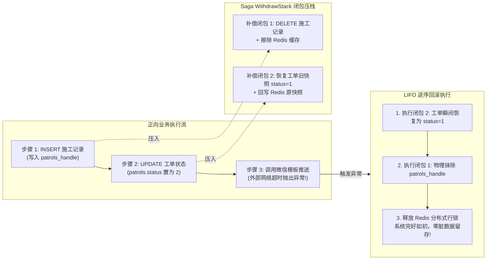
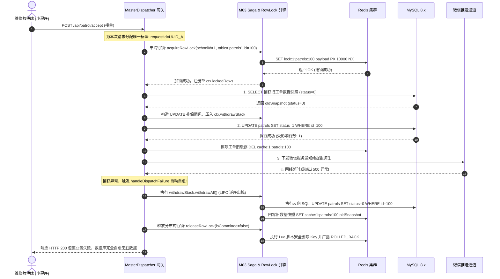
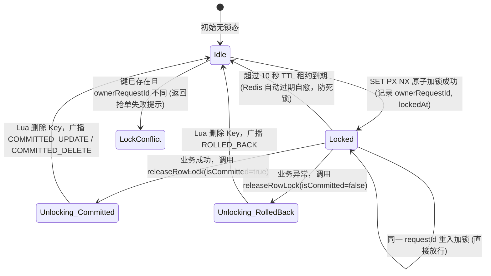
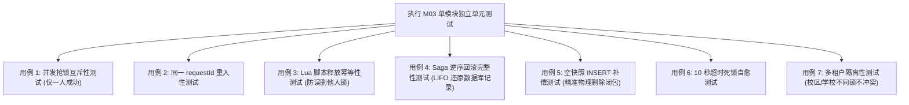

# M03: Saga 事务撤回栈与行级排他锁并发引擎 (Saga & RowLock Engine) 详细设计与实现方案

> **模块代号**：M03 / Saga & RowLock Engine  
> **所属阶段**：阶段零 (M01 ~ M10) 前后端底层基座与多租户测试中枢  
> **文档定位**：全系统高并发分布式数据一致性防线、Redis 多租户行级排他锁状态机、Saga 逆序补偿撤销闭包栈及死锁自愈机制的专项技术实现方案  
> **归档路径**：[v4.0/Docs/模块/M03_Saga事务撤回栈与行级排他锁并发引擎详细设计与实现方案.md](file:///e:/Projects/University/后勤巡查e速办%20大二下学期%20大学身份上线项目/v4.0/Docs/模块/M03_Saga事务撤回栈与行级排他锁并发引擎详细设计与实现方案.md)  
> **前置依赖**：M01 (27表7视图 DDL 引擎与回滚基座), M02 (MySQL AST 编译器与租户自动注入器)  
> **驱动下游**：M04 (MasterDispatcher 网关)、M10 (TestHarness 测试中枢) 及 M11 ~ M53 全量高并发写业务（师傅抢单、施工交卷、延期审批、评价打分等）  
> **版本日期**：2026-09-05  

---

## 目录索引 (Table of Contents)

1. [模块定位与核心业务价值](#一-模块定位与核心业务价值)
2. [核心架构设计哲学与高并发防线](#二-核心架构设计哲学与高并发防线)
   - 2.1 [为什么坚决摈弃传统数据库长事务 (Zero Long DB Transactions)？](#21-为什么坚决摈弃传统数据库长事务-zero-long-db-transactions)
   - 2.2 [Saga 逆序补偿哲学：轻量快照与反向操作闭包 (LIFO Rollback)](#22-saga-逆序补偿哲学轻量快照与反向操作闭包-lifo-rollback)
   - 2.3 [行级排他锁设计哲学：Redis 分布式原子锁与幂等释放](#23-行级排他锁设计哲学redis-分布式原子锁与幂等释放)
   - 2.4 [多租户行锁命名空间隔离规范 (Multi-Tenant Lock Key Partitioning)](#24-多租户行锁命名空间隔离规范-multi-tenant-lock-key-partitioning)
3. [Saga 事务撤销与分布式行锁核心交互时序](#三-saga-事务撤销与分布式行锁核心交互时序)
   - 3.1 [全生命周期正向写入与异常自愈流转时序图](#31-全生命周期正向写入与异常自愈流转时序图)
   - 3.2 [行级排他锁状态机跃迁模型 (Acquiring -> Locked -> Unlocking -> Committed/RolledBack)](#32-行级排他锁状态机跃迁模型)
4. [核心算法设计与数学防御逻辑](#四-核心算法设计与数学防御逻辑)
   - 4.1 [算法 1：Redis SET PX NX 原子加锁与重入判定算法 (Reentrant RowLock)](#41-算法-1redis-set-px-nx-原子加锁与重入判定算法-reentrant-rowlock)
   - 4.2 [算法 2：Lua 脚本原子校验释放与幂等自愈算法 (Idempotent Lua Unlock)](#42-算法-2lua-脚本原子校验释放与幂等自愈算法-idempotent-lua-unlock)
   - 4.3 [算法 3：跨微服务节点 Pub/Sub 解锁唤醒与 COMMITTED_DELETE 剔除算法](#43-算法-3跨微服务节点-pubsub-解锁唤醒与-committed_delete-剔除算法)
   - 4.4 [算法 4：快照捕获与精确反向闭包生成算法 (Snapshot & Undo Factory)](#44-算法-4快照捕获与精确反向闭包生成算法-snapshot--undo-factory)
   - 4.5 [算法 5：空快照 (Empty Snapshot) 语法防御与安全物理删除闭包](#45-算法-5空快照-empty-snapshot-语法防御与安全物理删除闭包)
   - 4.6 [算法 6：LIFO 逆序出栈自愈与 Redis 脏缓存双向同步擦除算法](#46-算法-6lifo-逆序出栈自愈与-redis-脏缓存双向同步擦除算法)
5. [TypeScript 强类型接口契约与数据模型定义](#五-typescript-强类型接口契约与数据模型定义)
6. [核心物理文件实现蓝图](#六-核心物理文件实现蓝图)
   - 6.1 [`src/shared/lock/rowLockManager.ts` 分布式行锁管理器增强](#61-srcsharedlockrowlockmanagerts-分布式行锁管理器增强)
   - 6.2 [`src/shared/sql/withdrawStack.ts` 独立 Saga 撤销栈容器](#62-srcsharedsqlwithdrawstackts-独立-saga-撤销栈容器)
   - 6.3 [`src/shared/sql/astRunner.ts` 事务快照与运行时协同](#63-srcsharedsqlastrunnerts-事务快照与运行时协同)
   - 6.4 [`src/dispatcher/masterDispatcher.ts` 网关级自动事务回滚调度](#64-srcdispatchermasterdispatcherts-网关级自动事务回滚调度)
7. [防御性编程与死锁自愈机制](#七-防御性编程与死锁自愈机制)
   - 7.1 [10 秒 TTL 超时兜底防服务崩溃悬挂死锁](#71-10-秒-ttl-超时兜底防服务崩溃悬挂死锁)
   - 7.2 [多锁获取场景下的排序防死锁机制 (Lock Sorting by Key)](#72-多锁获取场景下的排序防死锁机制-lock-sorting-by-key)
   - 7.3 [Fail-Fast 预检防污染与无效行锁就地释放](#73-fail-fast-预检防污染与无效行锁就地释放)
8. [单模块独立测试方案与验收准则](#八-单模块独立测试方案与验收准则)
   - 8.1 [测试设计与测试桩点](#81-测试设计与测试桩点)
   - 8.2 [单模块测试执行命令与断言矩阵](#82-单模块测试执行命令与断言矩阵)
9. [下游模块接口契约输出清单](#九-下游模块接口契约输出清单)

---

## 一、 模块定位与核心业务价值

### 1.1 模块定位
`M03 (Saga & RowLock Engine)` 是「高校后勤巡查e速办 v4.0」处理**高并发竞争写、分布式事务一致性保障与业务容灾自愈**的底层引擎。  
在高校后勤业务中，存在大量极端的高并发数据竞争与复杂链路场景：
- **场景一（高并发接单抢单）**：开学季某公寓水管突发大面积跑水，系统向 5 名水电维修师傅同时推送了加急抢修工单，多名师傅几乎在同一毫秒点击【立即接单】；
- **场景二（长链路外部交互失败）**：师傅完工交卷（M26），系统需要先插入完工证据表 `patrols_handle`、更新工单状态为 `2:已整改待复核`、更新 Redis 缓存、同步扣减耗材库存，随后调用微信模板消息接口通知质检员。若在调用微信接口时网络超时或崩溃，传统单体代码极易出现“数据库改了，但外部通知失败，数据成为孤岛”的脏数据僵局。

M03 模块构建了**“Redis 分布式行级排他锁 + Saga 逆序补偿撤销栈 (WithdrawStack)”**双重铁壁，既彻底解决了高并发下的数据踩踏与超卖，又在微服务无需占用长数据库连接的前提下，实现了**毫秒级故障自动反向回滚抹平**。

### 1.2 核心业务职责
1. **行级排他加锁防并发冲突**：在对特定工单或用户发起更新时，向 Redis 申请基于 `schoolId:table:id` 的排他行锁，同一时刻仅允许一人操作该业务对象；
2. **快照捕获与精准回滚闭包生成**：执行正向写操作前捕获数据快照，动态构造能够精确还原旧数据的反向补偿闭包；
3. **LIFO 逆序出栈自愈抹平**：业务执行链中任何节点报错或抛出未捕获异常，调度器自动按后进先出（LIFO）顺序逐一执行反向闭包，还原 MySQL 与 Redis；
4. **锁持有幂等性与跨节点广播**：通过 Redis Lua 脚本安全校验持有者并原子释放锁，通过 Redis Pub/Sub 广播解锁状态唤醒其他排队节点。

---

## 二、 核心架构设计哲学与高并发防线

### 2.1 为什么坚决摈弃传统数据库长事务 (Zero Long DB Transactions)？
在传统的后端设计中，开发者习惯使用 MySQL 显式事务：
```sql
START TRANSACTION;
SELECT * FROM patrols WHERE id = 100 FOR UPDATE;
-- 执行本地操作...
-- 调用微信接口推送服务通知 (耗时 800ms ~ 3000ms)...
-- 上传阿里云 OSS...
COMMIT;
```
#### 致命缺陷反思：
1. **连接池迅速枯竭**：高并发集中报修时，MySQL 连接池（通常设为 20~50 个连接）在几百毫秒内被这些包含外部网络通信的事务全部占满，导致整个后端无法处理任何新的只读查询，全网瘫痪；
2. **跨表死锁频发**：多张表在长事务中交替加锁，极易触发 MySQL `Deadlock found when trying to get lock; try restarting transaction`；
3. **不支持外部副作用补偿**：MySQL 回滚只能撤销数据库改动，无法撤销已写入 Redis 的脏缓存或已下发的消息。

#### M03 的现代分布式解法：
**全系统执行“物理零显式 DB 长事务”**。数据库操作仅使用池化连接极速执行单条 SQL，业务层的一致性与原子性**完全交由 M03 的“行锁防并发 + Saga 补偿自愈”**承载。

---

### 2.2 Saga 逆序补偿哲学：轻量快照与反向操作闭包 (LIFO Rollback)
Saga 模式的核心理念是：**正向操作每走一步，就同步向撤销栈压入一个相反的原子补偿操作**：

$$\text{Operation Sequence: } O_1 \longrightarrow O_2 \longrightarrow O_3 \text{ (Failed!)}$$
$$\text{Compensate Sequence: } C_2 \longrightarrow C_1 \text{ (LIFO 逆序抹平)}$$



---

### 2.3 行级排他锁设计哲学：Redis 分布式原子锁与幂等释放
- **极速高性能内存互斥**：抢锁与释放完全在 Redis 内存完成，单次操作耗时小于 1 毫秒；
- **重入安全性**：同一个 HTTP 请求（携带相同的 `requestId`）对同一张表的同一行记录多次调用 `acquireRowLock` 时，判定为合法重入，放行执行；
- **锁释放绝对幂等**：维护 `acquiredLocks` 集合与状态机，无论业务层、网关层重复调用多少次 `releaseRowLock`，绝不发生重复调用引发的状态错乱与死锁。

---

### 2.4 多租户行锁命名空间隔离规范 (Multi-Tenant Lock Key Partitioning)
为彻底杜绝全国不同高校自增 ID 相同时发生的跨校锁互踩，行锁的 Redis 键名严格遵循多租户隔离规范：

$$\text{LockKey} = \text{"lock:"} + \text{schoolId} + \text{":"} + \text{normalizeTable}(\text{table}) + \text{":"} + \text{targetId}$$
$$\text{ChannelKey} = \text{"unlock:"} + \text{LockKey}$$

- **示例**：聊城大学 (`schoolId = 1`) 的 100 号工单加锁键名为：`lock:1:patrols:100`；清华大学 (`schoolId = 2`) 的 100 号工单加锁键名为：`lock:2:patrols:100`，两所大学的操作在 Redis 中彻底物理隔离。

---

## 三、 Saga 事务撤销与分布式行锁核心交互时序

### 3.1 全生命周期正向写入与异常自愈流转时序图



---

### 3.2 行级排他锁状态机跃迁模型



---

## 四、 核心算法设计与数学防御逻辑

### 4.1 算法 1：Redis SET PX NX 原子加锁与重入判定算法 (Reentrant RowLock)
加锁过程必须具备原子性与重入宽容度：

```typescript
public async acquireRowLock(
  schoolId: number,
  table: string,
  id: string | number,
  lockType: "UPDATE" | "DELETE",
  requestId: string,
  maxLockAgeMs: number = 10000
): Promise<StandardResult<boolean>> {
  const lockKey = this.makeLockKey(schoolId, table, id);
  const redis = getRedisClient();
  if (!redis) return returnError("Redis 客户端不可用");

  // 1. 检查既有锁 (重入判断)
  const existingRaw = await redis.get(lockKey);
  if (existingRaw) {
    try {
      const parsed: RowLockState = JSON.parse(existingRaw);
      if (parsed.ownerRequestId === requestId) {
        // 同一请求上下文重入，允许放行
        return returnSuccess(true);
      }
      return returnError(`[M03 并发互斥] 当前工单正在被其他请求处理中，请勿重复操作`);
    } catch {}
  }

  // 2. 原子竞争抢锁: SET lockKey payload PX maxLockAgeMs NX
  const payload: RowLockState = {
    schoolId,
    table,
    id,
    lockType,
    ownerRequestId: requestId,
    lockedAt: Date.now(),
  };

  const setRes = await setLockKV(lockKey, JSON.stringify(payload), maxLockAgeMs);
  if (setRes.status === 1 && setRes.data) {
    return returnSuccess(true);
  }

  return returnError(`[M03 并发加锁失败] 操作冲突，当前记录已被抢占锁定`);
}
```

---

### 4.2 算法 2：Lua 脚本原子校验释放与幂等自愈算法 (Idempotent Lua Unlock)
严禁直接在应用层使用 `redis.del(lockKey)`，因为若在加锁后发生了偶发性耗时（导致锁超过 10 秒自然过期并被下一个请求抢占），如果粗暴调用 `del`，会**误删其他请求刚申请的锁**！

#### Lua 原子释放脚本：
```lua
-- KEYS[1]: lockKey
-- ARGV[1]: expectedRequestId
local current = redis.call('get', KEYS[1])
if not current then
    return 0 -- 锁已自然超时过期或已被释放
end

local data = cjson.decode(current)
if data.ownerRequestId == ARGV[1] then
    local lockType = data.lockType
    redis.call('del', KEYS[1])
    return lockType -- 仅持有者匹配才删除，并返回锁类型
else
    return 0 -- 非锁持有者，严禁误删
end
```
通过该 Lua 脚本，释放操作具备绝对原子性与安全性。

---

### 4.3 算法 3：跨微服务节点 Pub/Sub 解锁唤醒与 COMMITTED_DELETE 剔除算法
在多进程集群环境下（如 4 节点 `8000 ~ 8003`），当节点 A 释放了某工单的行锁：
1. 节点 A 通过 Redis 频道 `unlock:{LockKey}` 广播通知；
2. 节点 B 上正在 `waitForUnlock` 挂起等待的查询线程被瞬间唤醒；
3. **关键业务优化**：若广播状态为 `COMMITTED_DELETE`，说明该工单已在刚才的事务中被合法删除，等待线程无需再次去查询 MySQL，**直接将该 ID 从查询结果集中剔除**，减少一次无意义的慢查。

---

### 4.4 算法 4：快照捕获与精确反向闭包生成算法 (Snapshot & Undo Factory)

针对 UPDATE 与 DELETE 操作，正向执行前必须先捕获旧快照：

$$\text{OldSnapshot} = \text{SELECT } * \text{ FROM } \text{table} \text{ WHERE id = } \text{targetId} \text{ AND schoolId = } \text{schoolId}$$

#### 闭包生成规则矩阵：
1. **UPDATE 动作的反向闭包**：
   - 提取被本次更新修改的列集合 $\{C_1, C_2, \dots, C_k\}$；
   - 反向 SQL：`UPDATE table SET C_1 = old_val_1, C_2 = old_val_2 WHERE id = targetId AND schoolId = schoolId`；
   - 附带动作：`setKV(schoolId, table, targetId, oldSnapshot)`（回写 Redis 热缓存）。
2. **DELETE 动作的反向闭包**：
   - 反向 SQL：`UPDATE table SET isDeleted = 0 WHERE id = targetId AND schoolId = schoolId`；
   - 附带动作：`setKV(schoolId, table, targetId, oldSnapshot)`。
3. **INSERT 动作的反向闭包**：
   - 获取刚刚插入生成的自增 ID：`insertedId`；
   - 反向 SQL：`DELETE FROM table WHERE id = insertedId AND schoolId = schoolId`（或软删除）；
   - 附带动作：`delKV(schoolId, table, insertedId)`（擦除 Redis 缓存）。

---

### 4.5 算法 5：空快照 (Empty Snapshot) 语法防御与安全物理删除闭包
- **历史缺陷反思**：在旧版底层移植中，若 INSERT 操作执行反向回滚时，由于新建数据不存在“旧快照”，旧版生成器拼装出的撤销 SQL 会生成类似 `SET isDeleted = ?` 但参数列表缺失，抛出 MySQL 语法异常；
- **M03 防御闭包**：
  ```typescript
  export function createInsertUndoClosure(
    schoolId: number,
    tableName: string,
    insertedId: string | number
  ): () => Promise<void> {
    return async () => {
      // 构造精确的主键物理删除补偿闭包，补齐参数校验
      const undoSql = `DELETE FROM \`${tableName}\` WHERE \`id\` = ? AND \`schoolId\` = ?`;
      await executeQuery(undoSql, [insertedId, schoolId]).catch(() => {});
      await delKV(schoolId, tableName, insertedId).catch(() => {});
    };
  }
  ```

---

### 4.6 算法 6：LIFO 逆序出栈自愈与 Redis 脏缓存双向同步擦除算法
当事务发生异常时：
$$\text{Stack} = [\text{Undo}_1, \text{Undo}_2, \text{Undo}_3]$$
逆序执行顺序为 $\text{Undo}_3 \to \text{Undo}_2 \to \text{Undo}_1$：
1. 逆序执行能够保证先创建的子记录先被清理，避免产生依赖冲突；
2. 每一个闭包内部均包含独立的 `try-catch`，即使某一步回滚出现瞬时网络抖动，也会继续执行上一步，最大程度自愈；
3. 执行完成后，在 `finally` 块中统一下发行锁释放。

---

## 五、 TypeScript 强类型接口契约与数据模型定义

在 `v4.0/Backend/src/shared/sql/sagaTypes.ts` 中规范强类型契约：

```typescript
/** 分布式行锁状态数据载荷 */
export interface RowLockState {
  schoolId: number;
  table: string;
  id: string | number;
  lockType: "UPDATE" | "DELETE";
  ownerRequestId: string;
  lockedAt: number;
}

/** 行锁释放广播状态枚举 */
export type UnlockStatus = 
  | "COMMITTED_UPDATE" 
  | "COMMITTED_DELETE" 
  | "ROLLED_BACK" 
  | "TIMEOUT";

/** 等待行锁结果 */
export interface LockWaitResult {
  unlocked: boolean;
  finalStatus: UnlockStatus;
}

/** 托管在请求上下文中的行锁记录 */
export interface LockedRowStub {
  schoolId: number;
  tableName: string;
  targetId: string | number;
  requestId: string;
}

/** Saga 反向补偿闭包函数定义 */
export type SagaUndoClosure = () => Promise<void>;

/** 独立 Saga 撤销栈容器契约 */
export interface ISagaWithdrawStack {
  push(closure: SagaUndoClosure): void;
  size(): number;
  withdrawAll(): Promise<void>;
  clear(): void;
}
```

---

## 六、 核心物理文件实现蓝图

### 6.1 `src/shared/lock/rowLockManager.ts` 分布式行锁管理器增强

在现有的 `RowLockManagerImpl` 基础上，**全面引入 `schoolId` 租户字段隔离**，并优化重入与释放：

```typescript
import {
  getRedisClient,
  normalizeTableName,
  publishUnlockEvent,
  releaseLockLua,
  setLockKV,
} from "../cache/redis.js";
import { returnError, returnSuccess, StandardResult, tryCatchErrorToString } from "../flow/result.js";
import { LockWaitResult, RowLockState, UnlockStatus } from "../sql/sagaTypes.js";

class MultiTenantRowLockManager {
  private makeLockKey(schoolId: number, table: string, id: string | number): string {
    return `lock:${schoolId}:${normalizeTableName(table)}:${id}`;
  }

  private makeChannelKey(schoolId: number, table: string, id: string | number): string {
    return `unlock:lock:${schoolId}:${normalizeTableName(table)}:${id}`;
  }

  /**
   * 申请租户级行级排他锁 (原子 + 重入)
   */
  public async acquireRowLock(
    schoolId: number,
    table: string,
    id: string | number,
    lockType: "UPDATE" | "DELETE",
    requestId: string,
    maxLockAgeMs: number = 10000
  ): Promise<StandardResult<boolean>> {
    try {
      const lockKey = this.makeLockKey(schoolId, table, id);
      const redis = getRedisClient();
      if (!redis) return returnError("Redis 客户端不可用");

      const existingRaw = await redis.get(lockKey);
      if (existingRaw) {
        try {
          const parsed: RowLockState = JSON.parse(existingRaw);
          if (parsed.ownerRequestId === requestId) {
            return returnSuccess(true); // 合法重入
          }
          return returnError(`[M03 行锁互斥] 记录正被并发请求占用处理中`);
        } catch {}
      }

      const payload: RowLockState = {
        schoolId,
        table,
        id,
        lockType,
        ownerRequestId: requestId,
        lockedAt: Date.now(),
      };

      const setRes = await setLockKV(lockKey, JSON.stringify(payload), maxLockAgeMs);
      if (setRes.status === 1 && setRes.data) {
        return returnSuccess(true);
      }
      return returnError(`[M03 加锁失败] 操作冲突`);
    } catch (error) {
      return returnError(`Acquire row lock failed: ${tryCatchErrorToString(error)}`);
    }
  }

  /**
   * 释放租户级行级排他锁 (Lua 幂等安全释放 + 状态广播)
   */
  public async releaseRowLock(
    schoolId: number,
    table: string,
    id: string | number,
    requestId: string,
    isCommitted: boolean
  ): Promise<StandardResult<boolean>> {
    try {
      const lockKey = this.makeLockKey(schoolId, table, id);
      const channel = this.makeChannelKey(schoolId, table, id);

      const luaRes = await releaseLockLua(lockKey, requestId);
      if (luaRes.status === 0 || !luaRes.data) {
        return returnSuccess(true); // 幂等放行
      }

      const lockType = luaRes.data as "UPDATE" | "DELETE";
      let status: UnlockStatus = "ROLLED_BACK";
      if (isCommitted) {
        status = lockType === "DELETE" ? "COMMITTED_DELETE" : "COMMITTED_UPDATE";
      }

      await publishUnlockEvent(channel, status);
      return returnSuccess(true);
    } catch (error) {
      return returnError(`Release row lock failed: ${tryCatchErrorToString(error)}`);
    }
  }

  /**
   * 探查当前行是否处于锁定态
   */
  public async isRowLocked(schoolId: number, table: string, id: string | number): Promise<boolean> {
    try {
      const lockKey = this.makeLockKey(schoolId, table, id);
      const redis = getRedisClient();
      if (!redis) return false;
      return (await redis.exists(lockKey)) === 1;
    } catch {
      return false;
    }
  }
}

export const RowLockManager = new MultiTenantRowLockManager();
```

---

### 6.2 `src/shared/sql/withdrawStack.ts` 独立 Saga 撤销栈容器

```typescript
import { ISagaWithdrawStack, SagaUndoClosure } from "./sagaTypes.js";
import { TerminalLogger } from "../log/terminalLogger.js";
import { tryCatchErrorToString } from "../flow/result.js";

export class SagaWithdrawStack implements ISagaWithdrawStack {
  private stack: SagaUndoClosure[] = [];

  public push(closure: SagaUndoClosure): void {
    if (typeof closure === "function") {
      this.stack.push(closure);
    }
  }

  public size(): number {
    return this.stack.length;
  }

  /**
   * 核心算法：按 LIFO 逆序出栈执行反向补偿闭包
   */
  public async withdrawAll(): Promise<void> {
    if (this.stack.length === 0) return;

    TerminalLogger.warn(`[M03 Saga] 触发业务回滚补偿栈，共 ${this.stack.length} 个逆序补偿操作待执行...`, "SagaRollback");

    // 严格按照倒序 LIFO 逐个执行
    for (let i = this.stack.length - 1; i >= 0; i--) {
      try {
        const undoFn = this.stack[i];
        await undoFn();
      } catch (err) {
        TerminalLogger.error(`[M03 Saga] 补偿闭包执行异常 (索引 ${i}): ${tryCatchErrorToString(err)}`, "SagaRollback");
      }
    }

    this.clear();
    TerminalLogger.info("[M03 Saga] 逆序补偿操作全部执行完毕，数据与缓存已抹平自愈", "SagaRollback");
  }

  public clear(): void {
    this.stack = [];
  }
}
```

---

### 6.3 `src/shared/sql/astRunner.ts` 事务快照与运行时协同

在 `astRunner.ts` 中增强对 `schoolId` 与 `SagaWithdrawStack` 的注入：

```typescript
// INSERT 动作生成撤回闭包示例
const withdraw = createInsertUndoClosure(context.schoolId, tableName, insertedId);
if (ctx?.withdrawStack) {
  ctx.withdrawStack.push(withdraw);
}

// UPDATE 动作生成撤回闭包示例
const undoOp = createUndoFn(oldSnapshot);
const withdraw = async () => {
  if (undoOp.undoSql) {
    await executeQuery(undoOp.undoSql, undoOp.undoParams).catch(() => {});
  }
  await setKV(context.schoolId, tableName, targetId, oldSnapshot);
};
if (ctx?.withdrawStack) {
  ctx.withdrawStack.push(withdraw);
}
```

---

### 6.4 `src/dispatcher/masterDispatcher.ts` 网关级自动事务回滚调度

在 `masterDispatcher.ts` 中全面接入 `SagaWithdrawStack` 容器：

```typescript
export async function dispatchHttpRequest(req: http.IncomingMessage, res: http.ServerResponse): Promise<void> {
  const requestId = genUUID();
  const withdrawStack = new SagaWithdrawStack();
  const lockedRows: Array<LockedRowStub> = [];

  const ctx: RequestContext = {
    requestId,
    withdrawStack,
    lockedRows,
    userPayload: null
  };

  try {
    const handlerRes = await route.handler(reqData, ctx);

    if (handlerRes.status === 1) {
      // 业务成功：提交释放行锁，清空撤销栈
      await releaseAllMemoryLocks(lockedRows, true);
      withdrawStack.clear();
      sendJsonResponse(res, handlerRes, 200);
    } else {
      // 业务失败：触发 LIFO 逆序回滚
      await withdrawStack.withdrawAll();
      await releaseAllMemoryLocks(lockedRows, false);
      sendJsonResponse(res, handlerRes, 200);
    }
  } catch (error) {
    // 运行时未捕获崩溃：强力触发 LIFO 逆序回滚自愈
    await withdrawStack.withdrawAll();
    await releaseAllMemoryLocks(lockedRows, false);
    sendJsonResponse(res, returnError(`Server Dispatch Error: ${tryCatchErrorToString(error)}`), 200);
  }
}
```

---

## 七、 防御性编程与死锁自愈机制

### 7.1 10 秒 TTL 超时兜底防服务崩溃悬挂死锁
- 在分布式环境中，若某个后端实例在持有行锁期间突然遭遇物理宕机（断电、OOM 强制终止），锁如果没有超时机制，将导致该工单永远无法被任何人再次操作；
- M03 对每个加锁操作强制设置 `PX 10000`（10 秒绝对租约）；
- 10 秒后 Redis 自动过期删除 Key，新请求即可顺畅接管，保障系统高可用。

### 7.2 多锁获取场景下的排序防死锁机制 (Lock Sorting by Key)
- 在批量审批或工单合并场景中，若请求 A 需要同时锁定工单 10 和工单 20，请求 B 需要同时锁定工单 20 和工单 10，传统加锁会导致经典的“哲学家就餐死锁”；
- **排序防死锁准则**：在多行加锁时，必须**先将待加锁的 Key 列表进行字典序升序排列 (`keys.sort()`)**，所有线程均按相同顺序依次加锁，从数学图论上消除循环等待环路。

### 7.3 Fail-Fast 预检防污染与无效行锁就地释放
- 若更新或删除时，预检查询发现记录根本不存在（`oldSnapshot == null`）；
- 引擎立即就地释放刚才申请的锁，**绝不将其推入外层 `ctx.lockedRows`**，防止空占锁槽位污染上下文。

---

## 八、 单模块独立测试方案与验收准则

### 8.1 测试设计与测试桩点
编写专属独立测试文件：  
`v4.0/Backend/src/__tests__/unit/m03_saga_lock.test.ts`



### 8.2 单模块测试执行命令与断言矩阵

#### 独立单模块测试命令：
```powershell
# 在 Backend 根目录下运行
npm.cmd test -- -t "M03"
```

#### 验收断言清单 (Acceptance Criteria)：
1. **并发抢锁断言**：
   - 启动两个并发 Promise 同时调用 `acquireRowLock(1, 'patrols', 99, 'UPDATE', 'req_A')` 与 `acquireRowLock(1, 'patrols', 99, 'UPDATE', 'req_B')`；
   - 断言一个返回 `status === 1`，另一个返回 `status === 0`；
2. **多租户锁隔离断言**：
   - 学校 1 对 99 号工单加锁成功；
   - 学校 2 同时对 99 号工单加锁；
   - 断言学校 2 也必须成功（因为键名带有 `schoolId` 隔离）；
3. **Lua 安全释放断言**：
   - 请求 A 持有锁，恶意请求 B 调用 `releaseRowLock`；
   - 断言锁依然存在，未被篡改误删；
4. **Saga 逆序回滚数据抹平断言**：
   - 插入一条工单初始记录 (`status = 0`)；
   - 步骤 1：UPDATE 将状态改为 `status = 1`，压入撤销栈；
   - 步骤 2：INSERT 一条完工记录，压入撤销栈；
   - 步骤 3：人为抛出 `new Error('Fake network fail')`；
   - 触发 `withdrawStack.withdrawAll()`；
   - **断言**：工单表中的状态 100% 恢复为 `status = 0`，完工记录表中无残留行，数据 100% 自愈；
5. **空快照 INSERT 撤回断言**：
   - 执行 INSERT 操作并撤回，断言数据库记录被精确清除，控制台 0 条语法错误报错。

---

## 九、 下游模块接口契约输出清单

M03 模块完工后，为后续业务模块输出的核心服务如下：

| 输出类/工具 | 消费下游模块 | 承载功能描述 |
| :--- | :--- | :--- |
| **`RowLockManager.acquireRowLock()`** | M24 (接单抢修), M25 (延期), M26 (完工) | 高并发业务对象排他锁申请器 |
| **`RowLockManager.releaseRowLock()`** | `MasterDispatcher.ts`, M10 | 行锁安全释放与状态广播器 |
| **`SagaWithdrawStack`** | `MasterDispatcher.ts`, M26, M45 | 业务撤销栈容器，提供 `push` 与 `withdrawAll` |
| **`createInsertUndoClosure()`** | `astRunner.ts`, M21 (提单) | 插入操作的反向安全补偿闭包工厂 |

---

> [!NOTE]
> 本设计方案已完全覆盖 M03 的架构哲学、Redis 行锁状态机、Saga LIFO 补偿算法、多租户键隔离、TypeScript 契约与独立单元测试规划。它是 M03 正式进入代码编写与自动化测试落地的唯一权威技术指引。
