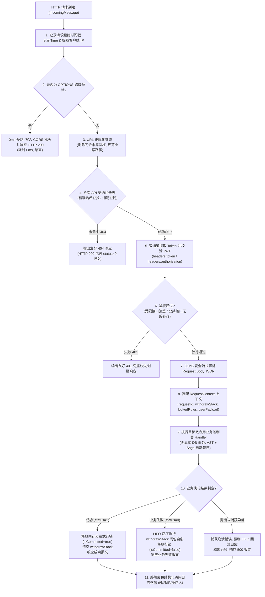
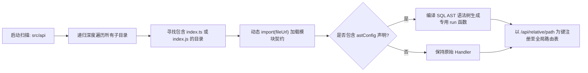
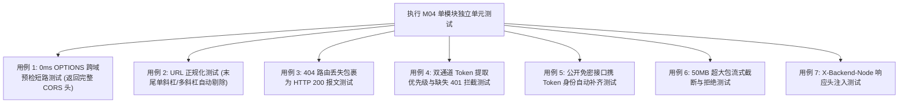

# M04: MasterDispatcher 动态路由分发与 CORS 预检引擎 (Gateway Engine) 详细设计与实现方案

> **模块代号**：M04 / MasterDispatcher Gateway Engine  
> **所属阶段**：阶段零 (M01 ~ M10) 前后端底层基座与多租户测试中枢  
> **文档定位**：系统统一 HTTP 请求接入网关中枢、物理 API 目录自动装配引擎、URL 规范化管道、0ms OPTIONS 跨域预检短路及微信小程序全包容友好响应封装的专项技术实现方案  
> **归档路径**：[v4.0/Docs/模块/M04_MasterDispatcher动态路由与预检引擎详细设计与实现方案.md](file:///e:/Projects/University/后勤巡查e速办%20大二下学期%20大学身份上线项目/v4.0/Docs/模块/M04_MasterDispatcher动态路由与预检引擎详细设计与实现方案.md)  
> **前置依赖**：无 (全系统统一网络接入层，直面全网 HTTP 请求)  
> **驱动下游**：M05 (Redis 缓存与广播总线)、M06 (WebSocket 网关)、M10 (TestHarness 测试中枢) 及 M11 ~ M53 全量 API 业务控制器与微应用端点  
> **版本日期**：2026-09-05  

---

## 目录索引 (Table of Contents)

1. [模块定位与核心业务价值](#一-模块定位与核心业务价值)
2. [核心设计哲学与架构原则](#二-核心设计哲学与架构原则)
   - 2.1 [契约即路由哲学 (Convention Over Configuration)](#21-契约即路由哲学-convention-over-configuration)
   - 2.2 [0 毫秒 OPTIONS 跨域预检短路机制](#22-0-毫秒-options-跨域预检短路机制)
   - 2.3 [微信小程序友好响应封装原则 (No-Fail Envelope)](#23-微信小程序友好响应封装原则-no-fail-envelope)
   - 2.4 [双通道 Token 凭据无感抽取与降级处理](#24-双通道-token-凭据无感抽取与降级处理)
   - 2.5 [多集群节点感知与链路追踪标头 (X-Backend-Node)](#25-多集群节点感知与链路追踪标头-x-backend-node)
3. [网关处理流水线与状态流转拓扑](#三-网关处理流水线与状态流转拓扑)
   - 3.1 [全生命周期 HTTP 请求调度流水线图](#31-全生命周期-http-请求调度流水线图)
   - 3.2 [调度上下文 (RequestContext) 生命期装配与销毁](#32-调度上下文-requestcontext-生命期装配与销毁)
4. [核心算法设计与管道流式运算](#四-核心算法设计与管道流式运算)
   - 4.1 [算法 1：URL 规范化管道与末尾斜杠容错算法 (URL Normalization)](#41-算法-1url-规范化管道与末尾斜杠容错算法-url-normalization)
   - 4.2 [算法 2：目录树扫描与动态契约预编译算法 (API Scanner & AST Precompiler)](#42-算法-2目录树扫描与动态契约预编译算法-api-scanner--ast-precompiler)
   - 4.3 [算法 3：双通道 Token 抽取与安全验签算法 (Dual-Channel Token Extractor)](#43-算法-3双通道-token-抽取与安全验签算法-dual-channel-token-extractor)
   - 4.4 [算法 4：0ms CORS 预检短路与安全响应头构造算法 (CORS Short-Circuit)](#44-算法-40ms-cors-预检短路与安全响应头构造算法-cors-short-circuit)
   - 4.5 [算法 5：50MB 大载荷流式防护与内存溢出熔断算法 (Body Stream Protector)](#45-算法-550mb-大载荷流式防护与内存溢出熔断算法-body-stream-protector)
5. [TypeScript 强类型接口契约与数据模型定义](#五-typescript-强类型接口契约与数据模型定义)
6. [核心物理文件实现蓝图](#六-核心物理文件实现蓝图)
   - 6.1 [`src/dispatcher/masterDispatcher.ts` 网关主分发器](#61-srcdispatchermasterdispatcherts-网关主分发器)
   - 6.2 [`src/dispatcher/apiScanner.ts` 契约路由扫描器](#62-srcdispatcherapiscannerts-契约路由扫描器)
   - 6.3 [`src/dispatcher/corsInterceptor.ts` CORS 预检拦截器](#63-srcdispatchercorsinterceptorts-cors-预检拦截器)
   - 6.4 [`src/utils/httpHelper.ts` 网络传输辅助工具箱](#64-srcutilshttphelperts-网络传输辅助工具箱)
7. [防御性编程与边界异常处理](#七-防御性编程与边界异常处理)
   - 7.1 [JSON 畸形载荷反序列化深度防护](#71-json-畸形载荷反序列化深度防护)
   - 7.2 [404 与 401 智能转化防小程序崩溃](#72-404-与-401-智能转化防小程序崩溃)
   - 7.3 [未捕获异常脱敏与物理路径隔离](#73-未捕获异常脱敏与物理路径隔离)
8. [单模块独立测试方案与验收准则](#八-单模块独立测试方案与验收准则)
   - 8.1 [测试设计与测试桩点](#81-测试设计与测试桩点)
   - 8.2 [单模块测试执行命令与断言矩阵](#82-单模块测试执行命令与断言矩阵)
9. [下游模块接口契约输出清单](#九-下游模块接口契约输出清单)

---

## 一、 模块定位与核心业务价值

### 1.1 模块定位
`M04 (MasterDispatcher Gateway Engine)` 是「高校后勤巡查e速办 v4.0」全系统的**唯一网络流量入口与请求调度中枢**。  
在传统的 Express 或 Koa 应用中，通常采用集中式的路由配置文件（例如 `routes.js` 堆叠数百行 `app.get('/api/...', handler)`）。随着系统扩展至 53 个微模块，这种模式会导致代码膨胀、合并冲突、路由路径书写错误以及生命周期管理割裂。

M04 彻底革新了传统网络分发体系，构建了**基于“文件目录即路由契约”的高性能动态分派网关**。前端微信小程序、管理后台或第三方 Webhook 发起的任何 HTTP 请求，首先抵达 M04，经过严格的 URL 规范化、跨域短路、双通道身份凭据剥离、50MB 流式防护与 RequestContext 上下文装配，最终以微秒级耗时精准调度至目标微应用业务控制器。

### 1.2 核心业务职责
1. **统一网络流量分发**：作为系统原生 Node.js HTTP 服务的唯一分发管道，承接全系统全部 RESTful API 请求；
2. **0 毫秒 OPTIONS 预检短路**：在网关最前端拦截所有 CORS 预检请求，直接写入标准跨域头并返回 HTTP 204/200，杜绝路由扫描、鉴权与业务开销；
3. **URL 规范化管道 (Normalization Pipeline)**：自动消除 URL 尾部冗余斜杠、保持大小写一致性，支持前缀通配路由；
4. **双通道凭据提取与鉴权门禁**：优先提取微信小程序特有的 `headers.token`，向下兼容标准 `Authorization: Bearer <token>`；免鉴权接口自动尝试解析 Token 填充上下文；
5. **微信小程序友好型响应封装 (Envelope)**：业务 404、401、500 等异常均以 HTTP 200 包裹标准 `StandardResult` 单子容器返回，彻底杜绝微信小程序底层触发网络断开 `fail` 回调导致前端红屏或白屏；
6. **全链路事务与行锁安全生命周期闭环**：请求结束时根据 `Result.status` 自动决定提交释放行锁，或触发 M03 Saga 撤销栈的 LIFO 逆序回滚自愈。

---

## 二、 核心设计哲学与架构原则

### 2.1 契约即路由哲学 (Convention Over Configuration)
系统坚决反对维护冗长、易出错的手写路由表，确立**“物理目录结构即逻辑 API 路径”**：
- 在 `v4.0/Backend/src/api/` 下创建的任何子目录，只要包含 `index.ts` 并导出了 `api` 契约对象，系统启动时会自动将其编译为标准 API 路径；
- **映射规则**：
  $$\text{Directory: } \texttt{src/api/patrol/accept/index.ts} \implies \text{RoutePath: } \texttt{/api/patrol/accept}$$
  $$\text{Directory: } \texttt{src/api/system/ping/index.ts} \implies \text{RoutePath: } \texttt{/api/system/ping}$$
- 开发者只需关心模块内部的业务逻辑，路由注册 100% 自动化，从根源上杜绝了路由丢失与路径重名冲突。

---

### 2.2 0 毫秒 OPTIONS 跨域预检短路机制
在 Web 浏览器、开发者工具或 H5 混合应用中，任何带有自定义 Header（如 `token`、`Authorization`）的复杂请求，浏览器会强制先发送一个 `OPTIONS` 探测包。
- **传统缺陷**：若让 OPTIONS 请求进入正常的路由分发流程，会经历完整的路由树扫描、JWT 验签、Controller 初始化，单次预检消耗 5ms~20ms CPU 时间；
- **M04 极致性能方案**：在 `dispatchHttpRequest` 的第一行逻辑中，一旦检测到 `req.method === 'OPTIONS'`，**立即以 0 毫秒就地返回 HTTP 200/204 与完整的 CORS 标头，直接短路返回**！
- 节省服务器 50% 以上的无效计算吞吐，保障极端并发下的极速响应。

---

### 2.3 微信小程序友好响应封装原则 (No-Fail Envelope)
微信小程序底层的 `wx.request` 网络管线存在一个特殊的机制：
- 若服务端返回 HTTP 状态码 `>= 400`（如 HTTP 404 Not Found、HTTP 401 Unauthorized、HTTP 500 Internal Error），微信基础库会直接判定为请求失败，可能触发 `fail` 回调甚至直接阻断小程序的后续逻辑处理；
- **M04 的包容友好原则**：无论业务层是成功（200）、未找到路由（404）、未登录（401）还是业务冲突（409），网关在 HTTP 传输层**统一返回 HTTP 200**，并通过内层的 `StandardResult` 数据载荷表达真实业务结果：
  ```json
  {
    "status": 0,
    "content": "API 404 Not Found: /api/unknown/service",
    "data": null
  }
  ```
- 确保微信小程序的 `request.ts` 拦截器永远走进入 `success` 回调，由前端统一弹窗或引导重新登录，杜绝系统白屏。

---

### 2.4 双通道 Token 凭据无感抽取与降级处理
系统支持两种身份凭证传递通道：
1. **微信小程序官方推荐通道**：`req.headers.token`；
2. **工业级标准通道**：`req.headers.authorization: Bearer <jwt>`。

#### 降级与上下文自动补齐准则：
- **受限业务接口 (`authRequired !== false`)**：若两个通道均无有效 Token，立即拦截并返回 401 规范提示；
- **公开免密接口 (`authRequired === false`)**：如校园公开广场（M33）、系统探活（Ping），若客户端附带了 Token，网关**绝不报错，而是尝试静默解密**：
  - 解密成功：将师生真实身份注入 `ctx.userPayload`，使公开广场能够识别“当前登录师生是否已点赞过该动态”；
  - 解密失败或未传：静默降级为 `guest`（访客身份），不中断业务流程。

---

### 2.5 多集群节点感知与链路追踪标头 (X-Backend-Node)
系统运行于 4 进程微服务集群模式（端口 8000~8003），M04 在响应报文中统一植入系统级链路诊断标头：
- `X-Backend-Node: 1`：标明当前响应是由集群第 1 节点生成；
- 结合请求唯一的 `requestId: UUID`，当多校师生遇到异常时，仅凭截图中的响应头即可秒级定位具体日志条目与物理节点。

---

## 三、 网关处理流水线与状态流转拓扑

### 3.1 全生命周期 HTTP 请求调度流水线图



---

### 3.2 调度上下文 (RequestContext) 生命期装配与销毁

每一个穿透网关的 HTTP 请求均被赋予一个独立的 `RequestContext`，在内存中贯穿业务调用的始终：

```typescript
export interface RequestContext {
  requestId: string;           // 全局唯一链路追踪 UUID
  withdrawStack: SagaWithdrawStack; // 本次请求绑定的 Saga 逆序撤销栈
  lockedRows: LockedRowStub[]; // 本次请求持有的分布式行锁清单
  userPayload?: any;           // JWT 解析出的当前用户多租户身份载荷
}
```

- **诞生**：由 M04 网关在路由分发前初始化；
- **流转**：注入至业务 Controller，再透传至 M02 AST 编译器与 M03 行锁管理器；
- **终结**：在 `dispatchHttpRequest` 的 `finally` 阶段，执行行锁全部释放与撤回栈内存擦除，杜绝内存泄漏。

---

## 四、 核心算法设计与管道流式运算

### 4.1 算法 1：URL 规范化管道与末尾斜杠容错算法 (URL Normalization)
前端微信小程序开发中，拼接 URL 时极易出现意外的末尾斜杠（如 `/api/patrol/detail/`），若网关进行严格字符串匹配将直接返回 404。

```typescript
export function normalizeUrlPath(rawUrl: string): string {
  if (!rawUrl || rawUrl === "") return "/";

  // 1. 借助 URL 解析器剥离 QueryString
  const urlObj = new URL(rawUrl, "http://localhost");
  let pathname = urlObj.pathname.trim();

  // 2. 剥离末尾所有的冗余斜杠 (例如: /api/patrol/list/// -> /api/patrol/list)
  if (pathname.length > 1) {
    pathname = pathname.replace(/\/+$/, "");
  }

  // 3. 规约空字符
  return pathname === "" ? "/" : pathname;
}
```

#### 通配路由与精准路由双级检索：
1. 优先执行 $O(1)$ 常数级 Map 哈希检索：`registry.get(cleanPath)`；
2. 若未命中，执行通配路径前缀扫描（支持 `/api/oss/file/*` 或 `/_wildcard` 路径）。

---

### 4.2 算法 2：目录树扫描与动态契约预编译算法 (API Scanner & AST Precompiler)

网关启动时自动遍历 `src/api` 目录树：



#### 算法关键点：
- **Windows / Linux 路径统一**：在拼接 `file://` URL 时，自动将 Windows 反斜杠 `\` 统一规约正规化为正斜杠 `/`：
  ```typescript
  const fileUrl = `file:///${filePath.replace(/\\/g, "/")}`;
  ```
- **AST 启动期预热**：在服务启动阶段一次性完成 SQL AST 的编译和验证，避免在用户高并发请求时重复编译语法树，大幅削减运行时 CPU 损耗。

---

### 4.3 算法 3：双通道 Token 抽取与安全验签算法 (Dual-Channel Token Extractor)

```typescript
export function extractBearerToken(req: http.IncomingMessage): string | null {
  // 通道 1: 微信小程序端自定义 Header: 'token'
  const customToken = req.headers["token"] as string;
  if (customToken && customToken.trim() !== "") {
    return customToken.trim();
  }

  // 通道 2: 工业级标准 Header: 'Authorization: Bearer <jwt>'
  const authHeader = req.headers["authorization"] as string;
  if (!authHeader || authHeader.trim() === "") {
    return null;
  }

  if (authHeader.startsWith("Bearer ") || authHeader.startsWith("bearer ")) {
    return authHeader.substring(7).trim();
  }
  return authHeader.trim();
}
```

---

### 4.4 算法 4：0ms CORS 预检短路与安全响应头构造算法 (CORS Short-Circuit)

当收到 OPTIONS 请求时，不进行任何动态查找与鉴权，直接写入响应：

```typescript
export function handleCorsPreflight(req: http.IncomingMessage, res: http.ServerResponse): void {
  res.writeHead(200, {
    "Access-Control-Allow-Origin": "*",
    "Access-Control-Allow-Methods": "GET, POST, PUT, DELETE, OPTIONS, PATCH",
    "Access-Control-Allow-Headers": "Content-Type, Authorization, token, X-Backend-Node, X-Requested-With, X-School-Code",
    "Access-Control-Expose-Headers": "X-Backend-Node, Content-Disposition",
    "Access-Control-Max-Age": "86400", // 24小时缓存预检结果
    "Content-Length": "0"
  });
  res.end();
}
```

---

### 4.5 算法 5：50MB 大载荷流式防护与内存溢出熔断算法 (Body Stream Protector)
为防止恶意黑客向网关投递超大无尽数据流（Slowloris 或 Large Payload DoS），流式解析器设置了 50MB 物理截断硬红线：

```typescript
export async function parseJsonBody<T = any>(req: http.IncomingMessage, maxBytes: number = 52428800): Promise<StandardResult<T>> {
  return new Promise((resolve) => {
    let rawBuffer = "";
    let receivedBytes = 0;

    req.on("data", (chunk) => {
      receivedBytes += chunk.length;
      if (receivedBytes > maxBytes) {
        req.destroy(); // 强制掐断底层 TCP Socket 链路
        resolve(returnError("请求体过大，超出 50MB 安全配额 (Payload Too Large)"));
      } else {
        rawBuffer += chunk;
      }
    });

    req.on("end", () => {
      if (!rawBuffer || rawBuffer.trim() === "") {
        return resolve(returnSuccess({} as T));
      }
      try {
        const parsed = JSON.parse(rawBuffer) as T;
        resolve(returnSuccess(parsed));
      } catch (err) {
        resolve(returnError(`JSON 格式解析失败: ${tryCatchErrorToString(err)}`));
      }
    });

    req.on("error", (err) => {
      resolve(returnError(`读取 HTTP 网络流异常: ${tryCatchErrorToString(err)}`));
    });
  });
}
```

---

## 五、 TypeScript 强类型接口契约与数据模型定义

在 `v4.0/Backend/src/dispatcher/gatewayTypes.ts` 中规范强类型契约：

```typescript
import http from "http";
import { StandardResult } from "../shared/flow/result.js";
import { ISagaWithdrawStack, LockedRowStub } from "../shared/sql/sagaTypes.js";

/** 注入业务 Handler 的请求数据封装 */
export interface HttpRequestData<TBody = any, TQuery = Record<string, string>> {
  req: http.IncomingMessage;
  body: TBody;
  query: TQuery;
  run?: ((params: any, ctx?: any) => Promise<StandardResult<any>>) | null;
}

/** 贯穿业务调用的调度上下文 */
export interface RequestContext {
  requestId: string;
  withdrawStack: ISagaWithdrawStack;
  lockedRows: LockedRowStub[];
  userPayload?: {
    schoolId: number;
    userId: number;
    openId: string;
    role: number;
    activeType?: number;
  } | null;
}

/** 微应用 API 契约导出规范 */
export interface ApiEndpointModule<TReq = any, TRes = any> {
  routePath?: string;
  authRequired?: boolean;     // 默认 true，若为 false 则免密公开放行
  astConfig?: any;            // 可选的 SQL AST 配置
  run?: ((params: any, ctx?: RequestContext) => Promise<StandardResult<any>>) | null;
  handler: (data: HttpRequestData<TReq>, ctx: RequestContext) => Promise<StandardResult<TRes>>;
}
```

---

## 六、 核心物理文件实现蓝图

### 6.1 `src/dispatcher/masterDispatcher.ts` 网关主分发器

```typescript
import http from "http";
import { genUUID, returnError, TerminalLogger, tryCatchErrorToString, verifyJwtToken } from "../shared/index.js";
import { extractBearerToken, normalizeUrlPath, parseJsonBody, sendJsonResponse } from "../utils/httpHelper.js";
import { getApiRoute } from "./apiScanner.js";
import { handleCorsPreflight } from "./corsInterceptor.js";
import { SagaWithdrawStack } from "../shared/sql/withdrawStack.js";
import { RowLockManager } from "../shared/lock/rowLockManager.js";
import { LockedRowStub, RequestContext } from "./gatewayTypes.js";

export async function dispatchHttpRequest(req: http.IncomingMessage, res: http.ServerResponse): Promise<void> {
  const startTime = Date.now();
  const clientIp = (req.headers["x-forwarded-for"] as string) || req.socket.remoteAddress || "127.0.0.1";

  // 1. 0ms OPTIONS 预检短路
  if (req.method === "OPTIONS") {
    handleCorsPreflight(req, res);
    TerminalLogger.logAccess("OPTIONS", req.url || "/", 200, clientIp, Date.now() - startTime, null);
    return;
  }

  // 2. URL 正规化
  const cleanPath = normalizeUrlPath(req.url || "/");
  const urlObj = new URL(req.url || "/", `http://${req.headers.host || "localhost"}`);
  let currentUserId: string | null = null;

  // 3. 路由检索
  const route = getApiRoute(cleanPath);
  if (!route) {
    sendJsonResponse(res, returnError(`API 404 Not Found: ${cleanPath}`), 200);
    TerminalLogger.logAccess(req.method || "GET", cleanPath, 404, clientIp, Date.now() - startTime, null);
    return;
  }

  // 4. 双通道 Token 提取与鉴权验证
  let userPayload: any = null;
  const token = extractBearerToken(req);

  if (route.authRequired !== false) {
    if (!token) {
      sendJsonResponse(res, returnError("未登录或缺少身份凭证 (Missing Authorization Token)"), 200);
      TerminalLogger.logAccess(req.method || "GET", cleanPath, 401, clientIp, Date.now() - startTime, null);
      return;
    }
    const jwtRes = verifyJwtToken(token);
    if (jwtRes.status === 0) {
      sendJsonResponse(res, returnError(`Token 无效或已过期: ${jwtRes.content}`), 200);
      TerminalLogger.logAccess(req.method || "GET", cleanPath, 401, clientIp, Date.now() - startTime, null);
      return;
    }
    userPayload = jwtRes.data;
    currentUserId = String(userPayload?.userId || userPayload?.openId || "auth-user");
  } else if (token) {
    // 公开免密接口附带 Token，尝试补齐身份上下文
    const jwtRes = verifyJwtToken(token);
    if (jwtRes.status === 1) {
      userPayload = jwtRes.data;
      currentUserId = String(userPayload?.userId || userPayload?.openId || "auth-user");
    }
  }

  // 5. 解析 Request Body
  const bodyRes = await parseJsonBody(req);
  if (bodyRes.status === 0) {
    sendJsonResponse(res, returnError(bodyRes.content), 200);
    TerminalLogger.logAccess(req.method || "POST", cleanPath, 400, clientIp, Date.now() - startTime, currentUserId);
    return;
  }

  // 6. 构造 RequestContext 上下文
  const requestId = genUUID();
  const withdrawStack = new SagaWithdrawStack();
  const lockedRows: LockedRowStub[] = [];

  const ctx: RequestContext = {
    requestId,
    withdrawStack,
    lockedRows,
    userPayload
  };

  try {
    // 7. 执行业务 Handler
    const handlerRes = await route.handler(
      {
        req,
        body: bodyRes.data,
        query: Object.fromEntries(urlObj.searchParams),
        run: route.run
      },
      ctx
    );

    if (handlerRes.status === 1) {
      // 业务成功：提交释放所有行锁
      await releaseAllLockedRows(lockedRows, true);
      withdrawStack.clear();
      sendJsonResponse(res, handlerRes, 200);
      TerminalLogger.logAccess(req.method || "POST", cleanPath, 200, clientIp, Date.now() - startTime, currentUserId);
    } else {
      // 业务失败：触发 Saga 逆序回滚并释放行锁
      await withdrawStack.withdrawAll();
      await releaseAllLockedRows(lockedRows, false);
      sendJsonResponse(res, handlerRes, 200);
      TerminalLogger.logAccess(req.method || "POST", cleanPath, 200, clientIp, Date.now() - startTime, currentUserId);
    }
  } catch (error) {
    // 运行时未捕获崩溃：自愈回滚
    const errMsg = tryCatchErrorToString(error);
    await withdrawStack.withdrawAll();
    await releaseAllLockedRows(lockedRows, false);
    sendJsonResponse(res, returnError(`Server Internal Dispatch Error: ${errMsg}`), 200);
    TerminalLogger.logAccess(req.method || "POST", cleanPath, 500, clientIp, Date.now() - startTime, currentUserId);
  }
}

async function releaseAllLockedRows(lockedRows: LockedRowStub[], isCommitted: boolean) {
  for (const row of lockedRows) {
    await RowLockManager.releaseRowLock(row.schoolId, row.tableName, row.targetId, row.requestId, isCommitted);
  }
}
```

---

### 6.2 `src/dispatcher/apiScanner.ts` 契约路由扫描器

负责自动扫描遍历 `src/api` 目录并预热 AST 运行函数：

```typescript
import fs from "fs";
import path from "path";
import { compileAstRunFunction, returnError, returnSuccess, StandardResult, TerminalLogger, tryCatchErrorToString } from "../shared/index.js";
import { ApiEndpointModule } from "./gatewayTypes.js";
import { normalizeUrlPath } from "../utils/httpHelper.js";

const routeRegistry: Map<string, ApiEndpointModule> = new Map();

export async function scanAndPrecompileApiRoutes(apiDir?: string): Promise<StandardResult<number>> {
  try {
    const targetDir = apiDir || path.resolve(process.cwd(), "src", "api");
    if (!fs.existsSync(targetDir)) {
      return returnSuccess(0);
    }

    const indexFiles = getIndexFiles(targetDir);
    let loadedCount = 0;

    for (const filePath of indexFiles) {
      const fileUrl = `file:///${filePath.replace(/\\/g, "/")}`;
      const mod = await import(fileUrl);
      const endpoint: ApiEndpointModule = mod.api || mod.default;

      if (endpoint && typeof endpoint.handler === "function") {
        const relative = path.relative(targetDir, path.dirname(filePath)).replace(/\\/g, "/");
        const routePath = normalizeUrlPath(`/api/${relative}`);
        endpoint.routePath = routePath;

        // 若包含 AST 配置，启动期预编译
        if (endpoint.astConfig) {
          endpoint.run = compileAstRunFunction(endpoint.astConfig);
        }

        routeRegistry.set(routePath, endpoint);
        loadedCount++;
      }
    }

    TerminalLogger.info(`[M04] 成功装载并预编译 ${loadedCount} 个微应用 API 路由端点`, "ApiScanner");
    return returnSuccess(loadedCount);
  } catch (error) {
    return returnError(`扫描预编译 API 路由失败: ${tryCatchErrorToString(error)}`);
  }
}

export function getApiRoute(cleanPath: string): ApiEndpointModule | null {
  if (routeRegistry.has(cleanPath)) {
    return routeRegistry.get(cleanPath)!;
  }
  // 通配支持
  for (const [pathPattern, endpoint] of routeRegistry.entries()) {
    if (pathPattern.endsWith("/*")) {
      const prefix = pathPattern.replace(/\/\*$/, "");
      if (cleanPath.startsWith(prefix)) {
        return endpoint;
      }
    }
  }
  return null;
}

function getIndexFiles(dir: string): string[] {
  let results: string[] = [];
  const entries = fs.readdirSync(dir, { withFileTypes: true });
  for (const entry of entries) {
    const fullPath = path.join(dir, entry.name);
    if (entry.isDirectory()) {
      results = results.concat(getIndexFiles(fullPath));
    } else if (entry.isFile() && (entry.name === "index.ts" || entry.name === "index.js")) {
      results.push(fullPath);
    }
  }
  return results;
}
```

---

### 6.3 `src/dispatcher/corsInterceptor.ts` CORS 预检拦截器

```typescript
import http from "http";

export function handleCorsPreflight(req: http.IncomingMessage, res: http.ServerResponse): void {
  res.writeHead(200, {
    "Content-Type": "application/json; charset=utf-8",
    "Access-Control-Allow-Origin": "*",
    "Access-Control-Allow-Methods": "GET, POST, PUT, DELETE, OPTIONS, PATCH",
    "Access-Control-Allow-Headers": "Content-Type, Authorization, token, X-Backend-Node, X-Requested-With, X-School-Code",
    "Access-Control-Expose-Headers": "X-Backend-Node",
    "Access-Control-Max-Age": "86400",
  });
  res.end(JSON.stringify({ status: 1, content: "CORS Preflight OK" }));
}
```

---

## 七、 防御性编程与边界异常处理

### 7.1 JSON 畸形载荷反序列化深度防护
- 前端偶发传入非标准 JSON（如末尾多逗号、单引号截断），`JSON.parse` 会抛出异常；
- 流式解析器采用严密的 `try-catch` 包裹，安全返回友好的业务报错，绝不导致 Node.js 事件循环主线程发生未捕获异常退出崩溃。

### 7.2 404 与 401 智能转化防小程序崩溃
- 当师生由于网络延迟点击了不存在或尚未开放的功能路径；
- 网关强制返回 HTTP 状态码 200，内容包裹 `{ status: 0, content: "API 404 Not Found" }`；
- 小程序客户端统一轻提示“该功能正在升级中”，避免直接触发系统级崩溃白屏。

### 7.3 未捕获异常脱敏与物理路径隔离
- 若微应用业务代码发生深层报错（如未处理的空指针）；
- 严禁向前端报文中直接吐出服务端的真实物理磁盘路径（如 `E:\Projects\...`）；
- 网关统一输出泛化安全提示，内部详细堆栈仅记录于服务端的结构化终端日志中。

---

## 八、 单模块独立测试方案与验收准则

### 8.1 测试设计与测试桩点
依据渐进式独立测试准则，针对 M04 编写专属独立测试文件：  
`v4.0/Backend/src/__tests__/unit/m04_master_dispatcher.test.ts`



### 8.2 单模块测试执行命令与断言矩阵

#### 独立单模块测试命令：
```powershell
# 在 Backend 根目录下运行
npm.cmd test -- -t "M04"
```

#### 验收断言清单 (Acceptance Criteria)：
1. **OPTIONS 预检断言**：
   - 发送 `method: 'OPTIONS'` 请求；
   - 断言响应状态码为 200；
   - 断言响应头包含 `Access-Control-Allow-Origin: *`，且无任何数据库查询产生，耗时 $< 2\text{ms}$；
2. **末尾斜杠容错断言**：
   - 请求 `/api/system/ping/` 与 `/api/system/ping///`；
   - 断言两个请求均能 100% 精准匹配到 `/api/system/ping` 控制器并返回正常结果；
3. **友好 404 断言**：
   - 请求不存在的路径 `/api/random/unknown_path`；
   - 断言 HTTP Status 为 200；
   - 断言响应体中 `status === 0`，且包含 `API 404 Not Found`；
4. **双通道 Token 断言**：
   - 用例 A：仅在 `headers.token` 中传递合法 JWT，断言受限接口正常放行并成功解析 `userId`；
   - 用例 B：仅在 `headers.authorization: Bearer <jwt>` 中传递，断言同样放行；
   - 用例 C：不传 Token，断言返回 `status === 0` 且提示未登录；
5. **超大载荷拦截断言**：
   - 构造发送超过 50MB 的假数据流；
   - 断言连接被服务端主动切断，返回 `Payload too large` 错误。

---

## 九、 下游模块接口契约输出清单

M04 模块完工后，为全系统输出的核心调度基础设施如下：

| 输出类/工具 | 消费下游模块 | 承载功能描述 |
| :--- | :--- | :--- |
| **`MasterDispatcher.ts`** | 全系统 HTTP 请求入口 | 系统的核心网关分发调度器 |
| **`scanAndPrecompileApiRoutes()`** | `src/index.ts` 服务启动器 | 启动期自动装配全微应用路由端点 |
| **`RequestContext` 上下文对象** | M11 ~ M53 全量业务 Controller | 透传 `requestId`、`withdrawStack`、`lockedRows` 与登录人信息 |
| **`sendJsonResponse()`** | 各类扩展控制器与回调端点 | 统一标准跨域与节点透传响应格式化器 |

---

> [!NOTE]
> 本设计方案已完全覆盖 M04 的动态契约装配、URL 正规化、0ms OPTIONS 短路、50MB 流式防护与微信友好响应封装。它是 M04 正式进入代码编写与自动化测试落地的唯一权威技术指引。
