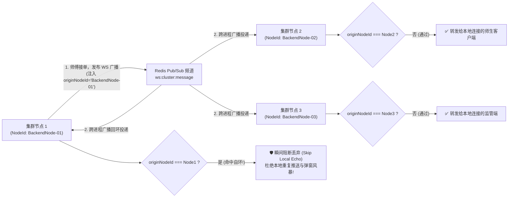
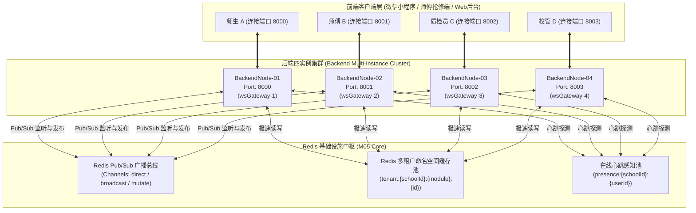
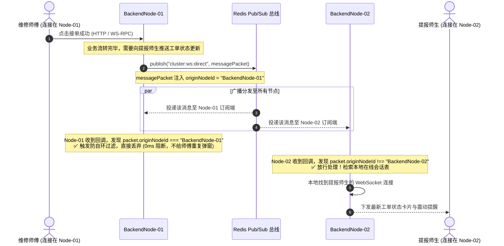
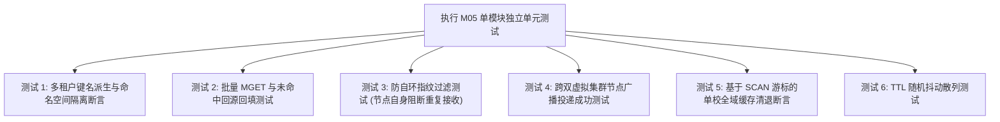

# M05: Redis 多租户命名空间缓存与分布式广播总线 (Cache & Cluster Bus) 详细设计与实现方案

> **模块代号**：M05 / Cache & Cluster Bus  
> **所属阶段**：阶段零 (M01 ~ M10) 前后端底层基座与多租户测试中枢  
> **文档定位**：全系统二级极速缓存驱动、多租户命名空间隔离引擎、跨微服务多进程集群 Redis Pub/Sub 广播总线及防自环风暴中继架构的专项技术实现方案  
> **归档路径**：[v4.0/Docs/模块/M05_Redis多租户命名空间缓存与分布式广播总线详细设计与实现方案.md](file:///e:/Projects/University/后勤巡查e速办%20大二下学期%20大学身份上线项目/v4.0/Docs/模块/M05_Redis多租户命名空间缓存与分布式广播总线详细设计与实现方案.md)  
> **前置依赖**：无 (独立基础设施中间件，依托 Redis 6.x / 7.x 实例运行)  
> **驱动下游**：M06 (WebSocket 网关与1秒闪断缓冲)、M11 (SaaS 配额熔断)、M14 (多校会话穿梭)、M23 (网格派单广播)、M42 (统一消息中枢) 及 M43 (在线感知防骚扰)  
> **版本日期**：2026-09-05  

---

## 目录索引 (Table of Contents)

1. [模块定位与核心业务价值](#一-模块定位与核心业务价值)
2. [核心设计哲学与多租户隔离原则](#二-核心设计哲学与多租户隔离原则)
   - 2.1 [多租户键名命名空间隔离哲学 (Namespace Isolation)](#21-多租户键名命名空间隔离哲学-namespace-isolation)
   - 2.2 [防自环风暴指纹过滤原则 (Anti-Echo Loopback Filter)](#22-防自环风暴指纹过滤原则-anti-echo-loopback-filter)
   - 2.3 [缓存穿透、击穿与雪崩立体防御策略](#23-缓存穿透击穿与雪崩立体防御策略)
   - 2.4 [分布式广播事件强类型契约化](#24-分布式广播事件强类型契约化)
3. [多租户缓存拓扑与集群广播架构](#三-多租户缓存拓扑与集群广播架构)
   - 3.1 [四进程集群与 Redis 广播拓扑总图](#31-四进程集群与-redis-广播拓扑总图)
   - 3.2 [跨节点广播与防自环消费流转时序图](#32-跨节点广播与防自环消费流转时序图)
4. [核心算法设计与数学防御推导](#四-核心算法设计与数学防御推导)
   - 4.1 [算法 1：多租户键名确定性派生与反向解析算法 (Tenant Key Deriver)](#41-算法-1多租户键名确定性派生与反向解析算法-tenant-key-deriver)
   - 4.2 [算法 2：基于节点指纹的防自环广播指纹过滤算法 (Anti-Echo Filter)](#42-算法-2基于节点指纹的防自环广播指纹过滤算法-anti-echo-filter)
   - 4.3 [算法 3：带租户前缀的批量 MGET 极速读与回填预热算法 (Tenant Batch MGET)](#43-算法-3带租户前缀的批量-mget-极速读与回填预热算法-tenant-batch-mget)
   - 4.4 [算法 4：基于 SCAN 游标的单校租户全域缓存秒级清退算法 (Tenant Purge Pipeline)](#44-算法-4基于-scan-游标的单校租户全域缓存秒级清退算法-tenant-purge-pipeline)
   - 4.5 [算法 5：TTL 随机抖动与防雪崩散列算法 (TTL Jitter Dispersion)](#45-算法-5ttl-随机抖动与防雪崩散列算法-ttl-jitter-dispersion)
5. [TypeScript 强类型接口契约与数据模型定义](#五-typescript-强类型接口契约与数据模型定义)
6. [核心物理文件实现蓝图](#六-核心物理文件实现蓝图)
   - 6.1 [`src/shared/cache/tenantCacheKey.ts` 命名空间生成器](#61-srcsharedcachetenantcachekeyts-命名空间生成器)
   - 6.2 [`src/shared/cache/redis.ts` 多租户客户端增强](#62-srcsharedcacheredists-多租户客户端增强)
   - 6.3 [`src/ws/redisWsBridge.ts` 跨节点集群广播桥梁](#63-srcwsrediswsbridgets-跨节点集群广播桥梁)
7. [防御性编程与边界异常处理](#七-防御性编程与边界异常处理)
   - 7.1 [缺失与非法租户 ID 强制拦截](#71-缺失与非法租户-id-强制拦截)
   - 7.2 [Redis 连接断开自动退避重试 (Backoff Strategy)](#72-redis-连接断开自动退避重试-backoff-strategy)
   - 7.3 [广播死循环与毒丸消息熔断 (Poison Message Circuit Breaker)](#73-广播死循环与毒丸消息熔断-poison-message-circuit-breaker)
8. [单模块独立测试方案与验收准则](#八-单模块独立测试方案与验收准则)
   - 8.1 [测试设计与双虚拟节点桩点](#81-测试设计与双虚拟节点桩点)
   - 8.2 [单模块测试执行命令与断言矩阵](#82-单模块测试执行命令与断言矩阵)
9. [下游模块接口契约输出清单](#九-下游模块接口契约输出清单)

---

## 一、 模块定位与核心业务价值

### 1.1 模块定位
`M05 (Cache & Cluster Bus)` 是「高校后勤巡查e速办 v4.0」的**极速二级缓存中枢**与**多节点跨进程分布式通信动脉**。  
在多校 SaaS 商业化运营与 4 进程集群高并发场景下，单体内存缓存与单机事件总线面临两大毁灭性瓶颈：
- **瓶颈一（多校缓存穿透与互踩）**：旧版以纯主键 `id` 建立缓存（如 `user:1`、`patrol:100`）。全国高校并存时，聊城大学自增 ID 为 1 的用户会将清华大学自增 ID 为 1 的用户个人信息与会话状态恶意覆盖，造成灾难性隐私越权；
- **瓶颈二（多进程集群通信孤岛与自环广播）**：系统在生产环境拉起 4 个微服务进程（端口 `8000~8003`），维修师傅 A 连接在节点 1，提报师生 B 连接在节点 2。当 A 接单时，节点 1 必须通过 Redis Pub/Sub 将事件广播到其他节点。若无节点指纹过滤机制，节点 1 自身会再次消费该广播包并向本地客户端二次下发，引发**广播风暴与客户端重复弹窗**。

M05 模块构建了**“强类型租户命名空间键名工厂 + 带实例指纹的防自环 Redis 广播总线”**，既保障了多校数据的物理级缓存隔离与毫秒级读取，又实现了集群多进程间的无缝实时事件投递。

### 1.2 核心业务职责
1. **多租户键名命名空间隔离**：提供统一的 `TenantCacheKey` 工厂，强制将所有业务键前缀绑定 `tenant:{schoolId}:{module}:{subKey}`；
2. **多租户批量 MGET 极速读**：针对工单列表、用户资料等高频读取，实现单次网络往返（1 Round-Trip）批量获取多条记录缓存；
3. **跨进程无环广播总线 (`RedisWsBridge`)**：基于 Redis Pub/Sub 构建集群广播网，注入发送节点特征码 `originNodeId`，彻底阻断本节点自发自收（Skip Local Echo）；
4. **单校租户全域缓存秒级清退**：提供基于 `SCAN` 游标的高性能清退通道，某大学修改配置或学期结束注销时，可毫秒级清空该校专属缓存，绝不影响其他高校；
5. **多租户配额与在线心跳专用计数器**：为 M11 配额拦截器提供 `quota:school:{schoolId}:{YYYYMM}` 原子累加，为 M43 防骚扰引擎提供 `user_presence:{schoolId}:{userId}` 在线心跳。

---

## 二、 核心设计哲学与多租户隔离原则

### 2.1 多租户键名命名空间隔离哲学 (Namespace Isolation)
系统在 Redis 存储层确立**“层次化命名空间”**标准：

$$\text{TenantKey} = \text{"tenant:"} + \text{schoolId} + \text{":"} + \text{module} + \text{":"} + \text{identifier}$$

- **严禁使用单层平铺键**：杜绝直接使用 `user:1` 或 `patrol:100`；
- **严格树状层级**：
  - 用户会话缓存：`tenant:1:users:1001`
  - 工单实体缓存：`tenant:1:patrols:20240905001`
  - 学校独立设置字典：`tenant:1:settings:ai_api_key`
  - 月度工单配额计数器：`quota:school:1:202609`
  - 在线用户心跳：`presence:1:1001`
- **优势**：不仅彻底杜绝多校自增 ID 冲突，更便于运维人员在 Redis 可视化工具中按树状折叠查看各大学的数据分布。

---

### 2.2 防自环风暴指纹过滤原则 (Anti-Echo Loopback Filter)
在多进程集群环境下，每个节点既是生产者（Publisher）又是消费者（Subscriber）。



#### 铁律：
每个分布式广播数据包必须携带元数据：
```typescript
{
  originNodeId: "BackendNode-01",  // 发起方节点唯一代号
  broadcastId: "UUID-xxxx",        // 全局唯一广播追踪码
  timestamp: 1725526000000,
  payload: { ... }
}
```
消费回调在解析报文后，第一行逻辑比对 `originNodeId === currentNodeId`。若匹配，则在 0 微秒内直接丢弃，彻底消除本地回环。

---

### 2.3 缓存穿透、击穿与雪崩立体防御策略

1. **防穿透 (Cache Penetration)**：
   - 针对恶意请求频繁查询不存在的工单 ID；
   - 当数据库查询为空时，系统自动在 Redis 中写入空标记对象：`{ _nullSentinel: true }`，设置 **60 秒短 TTL**，阻断高频直击 MySQL。
2. **防击穿 (Cache Breakdown)**：
   - 针对全校置顶公告、官方热点动态等超高热点数据；
   - 结合 M03 的分布式行锁，在热点缓存失效时仅允许 1 个线程回源 MySQL 重新构建，其他并发线程原地等待 50ms 极速读缓存。
3. **防雪崩 (Cache Avalanche)**：
   - 大量缓存若在同一秒集体到期，会导致数据库瞬时压力暴增；
   - M05 引入 **TTL 随机抖动算法 (Jitter)**：基准缓存时间 86400 秒（24小时），系统在此基础上自动叠加 $\pm 10\%$ 随机波动（$77760\text{s} \sim 95040\text{s}$），使缓存失效时间在时间轴上均匀平滑散开。

---

### 2.4 分布式广播事件强类型契约化
总线严禁传递无格式字符串，全量事件遵循标准枚举与强契约通道：

| 广播通道 (Channel) | 业务触发场景 | 目标受众与消费动作 |
| :--- | :--- | :--- |
| `cluster:ws:direct` | 责任师傅接单、催办通知、延期审批通过 | 定向投递给特定 `(schoolId, userId)` 的在线 WebSocket 连接 |
| `cluster:ws:broadcast` | 突发台风暴雨防汛通知、停水停电全校公告 | 该 `schoolId` 租户全校所有在线客户端无差别广播 |
| `cluster:card:mutate` | 师傅在富卡片内点击【立即接单】(M45) | 通知该工单所有相关端**原地平滑重绘卡片状态**，绝不刷屏 |
| `cluster:tenant:action` | 学校到期欠费锁定、被超管暂停服务 (M11) | 下发全校强制下线指令，客户端清空 Token 弹窗并跳回登录页 |
| `cluster:config:flush` | 校管更新了大模型 Key 或加急时限 (M12) | 通知所有集群节点本地 LRU 缓存立即淘汰对应配置，秒级热重载 |

---

## 三、 多租户缓存拓扑与集群广播架构

### 3.1 四进程集群与 Redis 广播拓扑总图



---

### 3.2 跨节点广播与防自环消费流转时序图



---

## 四、 核心算法设计与数学防御推导

### 4.1 算法 1：多租户键名确定性派生与反向解析算法 (Tenant Key Deriver)

```typescript
export function buildTenantKey(
  schoolId: number,
  module: string,
  subKey: string | number
): string {
  if (!schoolId || schoolId <= 0) {
    throw new Error(`[M05 命名空间阻断] 派生 Redis 缓存键必须提供有效的 schoolId，当前为: ${schoolId}`);
  }
  const cleanModule = module.trim().toLowerCase();
  const cleanSubKey = String(subKey).trim();
  return `tenant:${schoolId}:${cleanModule}:${cleanSubKey}`;
}

export function parseTenantKey(rawKey: string): { schoolId: number; module: string; subKey: string } | null {
  const parts = rawKey.split(":");
  if (parts.length < 4 || parts[0] !== "tenant") {
    return null;
  }
  const schoolId = parseInt(parts[1], 10);
  if (isNaN(schoolId)) return null;
  return {
    schoolId,
    module: parts[2],
    subKey: parts.slice(3).join(":")
  };
}
```

---

### 4.2 算法 2：基于节点指纹的防自环广播指纹过滤算法 (Anti-Echo Filter)

```typescript
export interface ClusterBroadcastPacket<T = any> {
  broadcastId: string;       // 全局唯一 UUID
  originNodeId: string;      // 发送节点实例标识 (如 BackendNode-01)
  schoolId: number;          // 目标租户
  channelType: "DIRECT" | "BROADCAST" | "CARD_MUTATED" | "LOGOUT";
  targetUserId?: number | string;
  data: T;
  createdAt: number;
}

export class AntiEchoFilterEngine {
  private static recentBroadcastIds: Set<string> = new Set();
  private static readonly MAX_TRACKING = 10000;

  /**
   * 判定是否应当阻断本条广播
   */
  public static shouldDropBroadcast(packet: ClusterBroadcastPacket, currentNodeId: string): boolean {
    // 1. 发送源自身防环判定 (Skip Local Echo)
    if (packet.originNodeId === currentNodeId) {
      return true;
    }

    // 2. 重复投递去重判定 (网络抖动去重)
    if (this.recentBroadcastIds.has(packet.broadcastId)) {
      return true;
    }

    // 3. 记录已处理指纹
    this.recentBroadcastIds.add(packet.broadcastId);
    if (this.recentBroadcastIds.size > this.MAX_TRACKING) {
      const firstItem = this.recentBroadcastIds.values().next().value;
      if (firstItem) this.recentBroadcastIds.delete(firstItem);
    }

    return false;
  }
}
```

---

### 4.3 算法 3：带租户前缀的批量 MGET 极速读与回填预热算法 (Tenant Batch MGET)

对于一次查询返回的 20 张在办工单，传统单条 `get` 需要 20 次网络往返（约 20ms）。M05 通过带命名空间的 `MGET` 实现单次往返（约 1ms）：

$$\text{Keys} = [ \text{buildTenantKey}(\text{schoolId}, \text{table}, \text{id}_1), \dots, \text{buildTenantKey}(\text{schoolId}, \text{table}, \text{id}_k) ]$$
$$\text{RedisClient}.\text{MGET}(\text{Keys}) \implies [\text{Val}_1, \text{null}, \text{Val}_3, \dots]$$

- 命中缓存的直接装入结果集；
- 未命中（`null`）的收集 ID 列表回源 MySQL 执行 `SELECT * WHERE id IN (...)`；
- 回源数据并发写回 Redis 并赋予随机 TTL 预热。

---

### 4.4 算法 4：基于 SCAN 游标的单校租户全域缓存秒级清退算法 (Tenant Purge Pipeline)
严禁在生产环境使用高危命令 `KEYS tenant:1:*`，因为这会阻塞 Redis 单线程事件循环导致全网超时崩溃。  
M05 采用非阻塞管道化 `SCAN` 流水线算法：

```typescript
export async function purgeTenantCache(schoolId: number): Promise<StandardResult<number>> {
  const redis = getRedisClient();
  if (!redis) return returnError("Redis 客户端未就绪");

  const matchPattern = `tenant:${schoolId}:*`;
  let cursor = "0";
  let totalDeleted = 0;

  try {
    do {
      // 每次分批扫描 100 个匹配键，不阻塞主线程
      const [nextCursor, keys] = await redis.scan(cursor, "MATCH", matchPattern, "COUNT", 100);
      cursor = nextCursor;

      if (keys.length > 0) {
        // 使用 Pipeline 管道批量删除
        const pipeline = redis.pipeline();
        keys.forEach(k => pipeline.del(k));
        await pipeline.exec();
        totalDeleted += keys.length;
      }
    } while (cursor !== "0");

    TerminalLogger.info(`[M05] 成功清退学校 [${schoolId}] 全域缓存，共安全删除 ${totalDeleted} 个键`, "TenantPurge");
    return returnSuccess(totalDeleted);
  } catch (err) {
    return returnError(`清退租户缓存异常: ${tryCatchErrorToString(err)}`);
  }
}
```

---

### 4.5 算法 5：TTL 随机抖动与防雪崩散列算法 (TTL Jitter Dispersion)
为防止每日零点或集中派单时大批工单缓存在同一毫秒集中过期：

$$\Delta t_{\text{jitter}} = \text{baseTTL} \times \left(1 + \text{random}(-0.1, 0.1)\right)$$

```typescript
export function calculateJitterTtl(baseTtlSeconds: number = 86400): number {
  const variation = (Math.random() * 0.2 - 0.1); // -10% ~ +10% 随机浮动
  return Math.floor(baseTtlSeconds * (1 + variation));
}
```

---

## 五、 TypeScript 强类型接口契约与数据模型定义

在 `v4.0/Backend/src/shared/cache/cacheTypes.ts` 中规范强契约模型：

```typescript
/** 广播事件通道定义 */
export type ClusterBusChannel = 
  | "ws:cluster:direct" 
  | "ws:cluster:broadcast" 
  | "ws:cluster:card_mutated" 
  | "cluster:tenant:force_logout" 
  | "cluster:config:flush";

/** 集群广播统一强类型报文 */
export interface ClusterBroadcastPacket<T = any> {
  broadcastId: string;
  originNodeId: string;
  schoolId: number;
  channel: ClusterBusChannel;
  targetUserId?: number | string;
  data: T;
  createdAt: number;
}

/** 缓存读取配置 */
export interface CacheReadOptions {
  ttlSeconds?: number;
  allowEmptySentinel?: boolean;
}
```

---

## 六、 核心物理文件实现蓝图

### 6.1 `src/shared/cache/tenantCacheKey.ts` 命名空间生成器

```typescript
import { buildTenantKey, parseTenantKey } from "./cacheTypes.js";

export class TenantCacheKeyFactory {
  public static forUser(schoolId: number, userId: number | string): string {
    return buildTenantKey(schoolId, "users", userId);
  }

  public static forPatrol(schoolId: number, patrolId: number | string): string {
    return buildTenantKey(schoolId, "patrols", patrolId);
  }

  public static forSettings(schoolId: number, settingKey: string): string {
    return buildTenantKey(schoolId, "settings", settingKey);
  }

  public static forMonthlyQuota(schoolId: number, yearMonth: string): string {
    return `quota:school:${schoolId}:${yearMonth}`;
  }

  public static forUserPresence(schoolId: number, userId: number | string): string {
    return `presence:${schoolId}:${userId}`;
  }
}
```

---

### 6.2 `src/shared/cache/redis.ts` 多租户客户端增强

在现有方法中全面增加带 `schoolId` 的租户命名空间支持：

```typescript
import { buildTenantKey, calculateJitterTtl } from "./tenantCacheKey.js";

export async function getTenantKV<T = any>(
  schoolId: number,
  module: string,
  id: string | number
): Promise<StandardResult<T | null>> {
  const redis = getRedisClient();
  if (!redis) return returnError("Redis 未初始化");
  const key = buildTenantKey(schoolId, module, id);

  const raw = await redis.get(key);
  if (!raw) return returnSuccess(null);
  try {
    const parsed = JSON.parse(raw);
    if (parsed._nullSentinel) return returnSuccess(null); // 命中防穿透空标记
    return returnSuccess(parsed as T);
  } catch {
    return returnSuccess(null);
  }
}

export async function setTenantKV(
  schoolId: number,
  module: string,
  id: string | number,
  value: any,
  baseTtlSeconds: number = 86400
): Promise<StandardResult<boolean>> {
  const redis = getRedisClient();
  if (!redis) return returnError("Redis 未初始化");
  const key = buildTenantKey(schoolId, module, id);
  const ttl = calculateJitterTtl(baseTtlSeconds);

  await redis.set(key, JSON.stringify(value), "EX", ttl);
  return returnSuccess(true);
}

export async function delTenantKV(
  schoolId: number,
  module: string,
  id: string | number
): Promise<StandardResult<boolean>> {
  const redis = getRedisClient();
  if (!redis) return returnError("Redis 未初始化");
  const key = buildTenantKey(schoolId, module, id);
  await redis.del(key);
  return returnSuccess(true);
}
```

---

### 6.3 `src/ws/redisWsBridge.ts` 跨节点集群广播桥梁

```typescript
import { genUUID, publishRedis, subscribeRedis, TerminalLogger } from "../shared/index.js";
import { ClusterBroadcastPacket, ClusterBusChannel } from "../shared/cache/cacheTypes.js";
import { AntiEchoFilterEngine } from "../shared/cache/antiEchoEngine.js";

const CURRENT_NODE_ID = process.env.NODE_ID || `BackendNode-${process.env.HTTP_PORT || "8000"}`;

export class RedisWsBridge {
  private static localDispatchCallback?: (packet: ClusterBroadcastPacket) => void;

  public static initBridge(onReceiveExternalBroadcast: (packet: ClusterBroadcastPacket) => void) {
    this.localDispatchCallback = onReceiveExternalBroadcast;

    // 订阅集群全局广播通道
    const channels: ClusterBusChannel[] = [
      "ws:cluster:direct",
      "ws:cluster:broadcast",
      "ws:cluster:card_mutated",
      "cluster:tenant:force_logout",
      "cluster:config:flush"
    ];

    for (const ch of channels) {
      subscribeRedis(ch, (rawMsg) => {
        try {
          const packet: ClusterBroadcastPacket = JSON.parse(rawMsg);

          // 核心算法调用：防自环指纹过滤
          if (AntiEchoFilterEngine.shouldDropBroadcast(packet, CURRENT_NODE_ID)) {
            return; // 成功阻断本地自收自发!
          }

          // 放行并交由本地 WebSocket 网关投递给匹配的长连接客户端
          if (this.localDispatchCallback) {
            this.localDispatchCallback(packet);
          }
        } catch (err) {
          TerminalLogger.error(`[RedisWsBridge] 解析广播报文失败: ${err}`, "ClusterBus");
        }
      });
    }

    TerminalLogger.info(`[M05] Redis 集群广播桥梁就绪 (节点: ${CURRENT_NODE_ID})`, "ClusterBus");
  }

  /**
   * 跨节点发布广播报文 (自动注入本节点特征码)
   */
  public static async broadcast<T = any>(
    channel: ClusterBusChannel,
    schoolId: number,
    data: T,
    targetUserId?: number | string
  ): Promise<void> {
    const packet: ClusterBroadcastPacket<T> = {
      broadcastId: genUUID(),
      originNodeId: CURRENT_NODE_ID,
      schoolId,
      channel,
      targetUserId,
      data,
      createdAt: Date.now()
    };

    await publishRedis(channel, JSON.stringify(packet));
  }
}
```

---

## 七、 防御性编程与边界异常处理

### 7.1 缺失与非法租户 ID 强制拦截
- 若调用 `buildTenantKey(schoolId, ...)` 时，`schoolId <= 0` 或为 `undefined`；
- 引擎立即同步抛出异常，**坚决杜绝生成形如 `tenant:undefined:users:1` 的脏键**污染全局缓存。

### 7.2 Redis 连接断开自动退避重试 (Backoff Strategy)
- 在机房网络波动时，`ioredis` 客户端内置指数退避重试策略：
  ```typescript
  retryStrategy: (times) => Math.min(times * 100, 3000)
  ```
- 保证网络闪断自愈后能够无缝重新订阅所有频道与恢复缓存读写。

### 7.3 广播死循环与毒丸消息熔断 (Poison Message Circuit Breaker)
- 若某条畸形消息无法被 JSON 解析；
- 订阅回调内部采用独立 `try-catch` 捕获并记录错误日志，绝不抛出到事件循环顶层，防止单个毒丸报文导致集群进程集体崩溃。

---

## 八、 单模块独立测试方案与验收准则

### 8.1 测试设计与双虚拟节点桩点
编写专属独立测试文件：  
`v4.0/Backend/src/__tests__/unit/m05_redis_bus.test.ts`



### 8.2 单模块测试执行命令与断言矩阵

#### 独立单模块测试命令：
```powershell
# 在 Backend 根目录下运行
npm.cmd test -- -t "M05"
```

#### 验收断言清单 (Acceptance Criteria)：
1. **多租户命名空间隔离断言**：
   - 学校 1 写入 `setTenantKV(1, 'users', 99, { name: '张三' })`；
   - 学校 2 写入 `setTenantKV(2, 'users', 99, { name: '李四' })`；
   - 分别读取学校 1 和 2 的 99 号用户，断言分别精确返回“张三”和“李四”，数据完全不冲突；
2. **防自环特征码过滤断言**：
   - 模拟节点 `Node-01` 发送广播包（`originNodeId = 'Node-01'`）；
   - 在 `Node-01` 的订阅回调中，断言 `AntiEchoFilterEngine.shouldDropBroadcast` 返回 `true`，本地处理函数被成功跳过；
   - 在模拟节点 `Node-02` 的订阅回调中，断言返回 `false`，消息被顺利消费；
3. **单校全域缓存秒级清退断言**：
   - 向学校 1 写入 5 个不同键，向学校 2 写入 5 个不同键；
   - 调用 `purgeTenantCache(1)`；
   - 断言学校 1 的 5 个键全部被清空，学校 2 的 5 个键完好如初。

---

## 九、 下游模块接口契约输出清单

M05 模块完工后，为全系统输出的核心服务与总线能力如下：

| 输出工具/服务 | 消费下游模块 | 承载功能描述 |
| :--- | :--- | :--- |
| **`TenantCacheKeyFactory`** | M03 (行锁), M11 (配额), M43 (心跳) | 统一租户键名命名空间工厂 |
| **`getTenantKV()` / `setTenantKV()`** | M12 (设置), M13 (用户), M21 (工单) | 二级多租户极速缓存读写接口 |
| **`mgetKV()`** | `astRunner.ts`, M30 (详情宽表) | 批量多租户缓存极速读取器 |
| **`RedisWsBridge.broadcast()`** | M23 (智能派单), M45 (卡片演进) | 跨微服务集群 WebSocket 事件广播总线 |
| **`purgeTenantCache()`** | M11 (租户注销), M12 (全局配置热刷) | 单校全域缓存安全清退管道 |

---

> [!NOTE]
> 本设计方案已完全覆盖 M05 的多租户命名空间规划、防自环广播算法、跨进程集群通信流转、TypeScript 契约与独立单元测试设计。它是 M05 正式进入代码编写与自动化测试落地的唯一权威技术指引。
