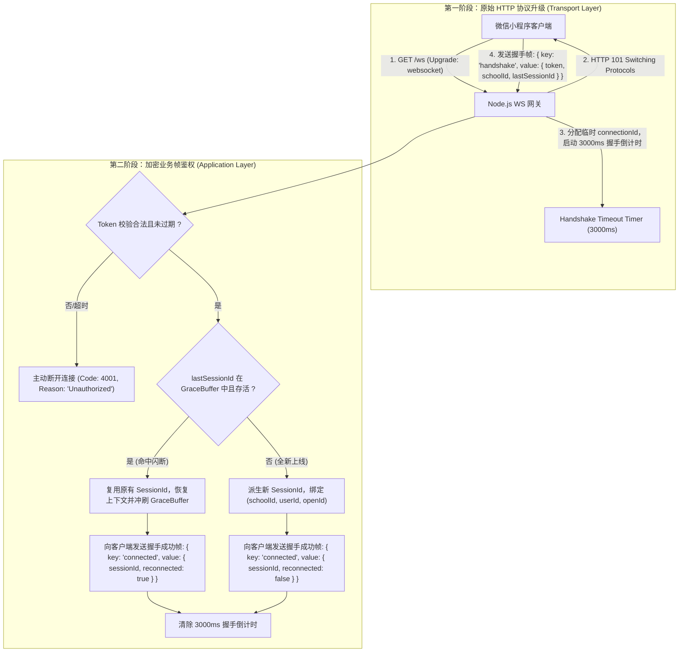
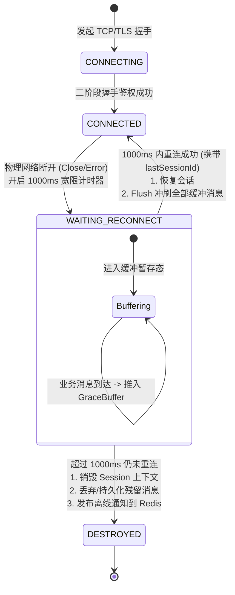
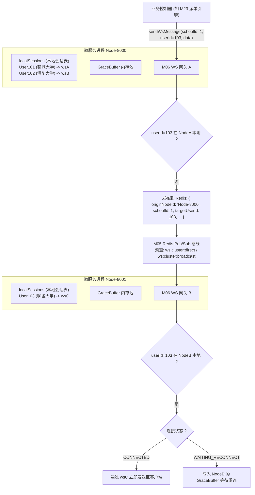
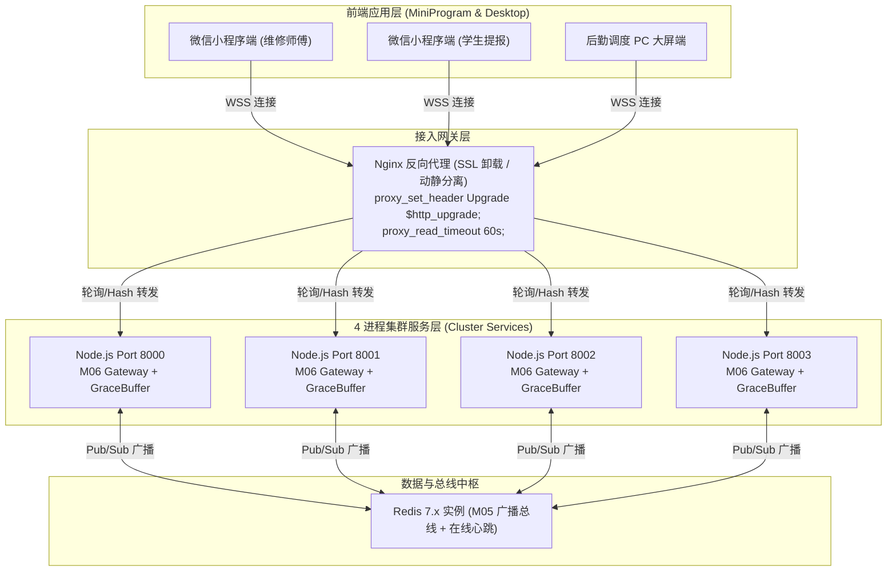
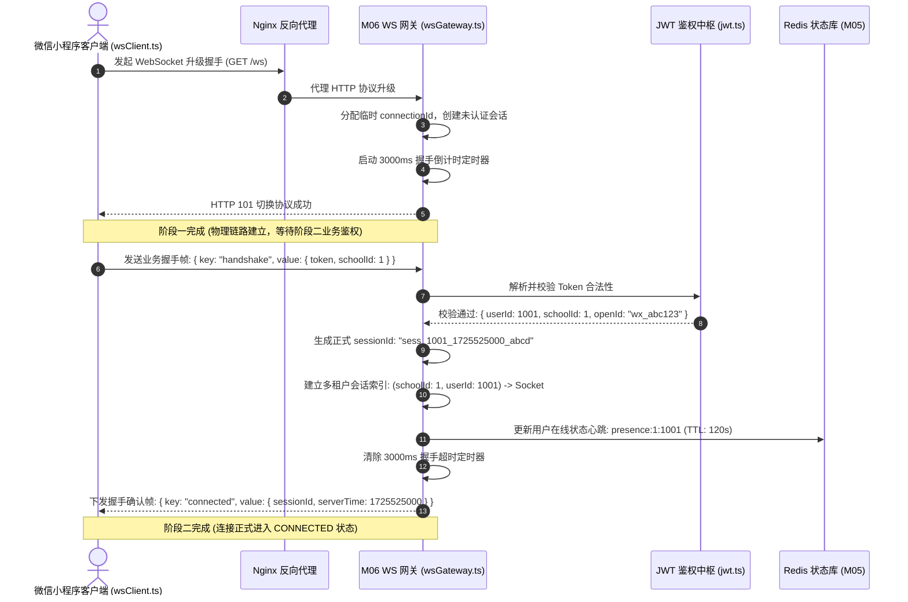
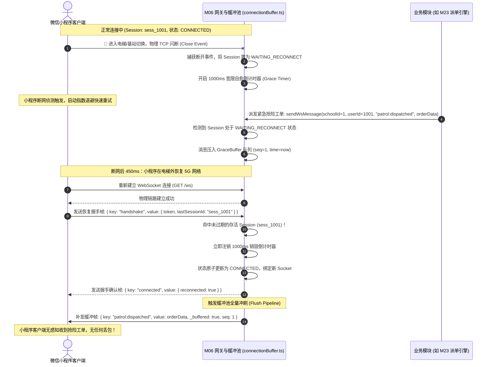
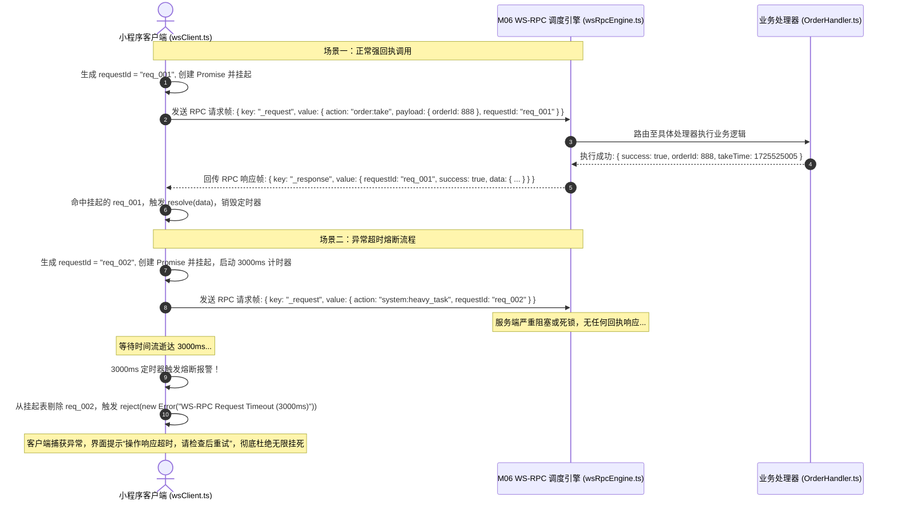
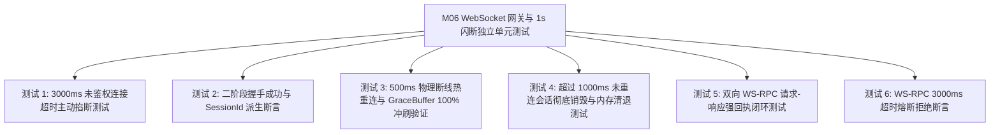

# M06: 高可靠 WebSocket 网关与 1秒闪断缓冲队列 (WS & Grace Buffer) 详细设计与实现方案

> **模块代号**：M06 / WS & Grace Buffer  
> **所属阶段**：阶段零 (M01 ~ M10) 前后端底层基座与多租户测试中枢  
> **文档定位**：全系统小程序与管理端实时长连接中枢、二阶段握手鉴权网关、弱网 1000ms 闪断缓冲队列（Grace Period Buffer）与双向 WS-RPC 强回执引擎的专项技术实现方案  
> **归档路径**：[v4.0/Docs/模块/M06_高可靠WebSocket网关与1秒闪断缓冲详细设计与实现方案.md](file:///e:/Projects/University/后勤巡查e速办%20大二下学期%20大学身份上线项目/v4.0/Docs/模块/M06_高可靠WebSocket网关与1秒闪断缓冲详细设计与实现方案.md)  
> **前置依赖**：M05 (Redis 多租户命名空间缓存与分布式广播总线)  
> **驱动下游**：M10 (TestHarness 测试中枢)、M23 (网格派单广播)、M24 (接单抢单)、M36 (工单房主动握手)、M40 (盯盘已读消除)、M41 (科室抢险群聊)、M42 (统一消息中枢) 及 M43 (在线状态感知防骚扰)  
> **版本日期**：2026-09-05  

---

## 目录索引 (Table of Contents)

1. [模块定位与核心业务价值](#一-模块定位与核心业务价值)
   - 1.1 [模块定位](#11-模块定位)
   - 1.2 [微信小程序长连接现实痛点与破解之道](#12-微信小程序长连接现实痛点与破解之道)
   - 1.3 [核心业务职责与技术指标](#13-核心业务职责与技术指标)
2. [核心设计哲学与长连接状态机](#二-核心设计哲学与长连接状态机)
   - 2.1 [二阶段握手与三位一体鉴权凭证绑定 (Two-Phase Handshake)](#21-二阶段握手与三位一体鉴权凭证绑定-two-phase-handshake)
   - 2.2 [1000ms 宽限闪断缓冲队列 (Grace Period Buffer) 哲学](#22-1000ms-宽限闪断缓冲队列-grace-period-buffer-哲学)
   - 2.3 [双向 WS-RPC 强回执与超时熔断体系 (Bidirectional WS-RPC)](#23-双向-ws-rpc-强回执与超时熔断体系-bidirectional-ws-rpc)
   - 2.4 [跨 4 进程集群会话感知与多校多租户连接拓扑](#24-跨-4-进程集群会话感知与多校多租户连接拓扑)
3. [长连接网关拓扑与生命周期时序图](#三-长连接网关拓扑与生命周期时序图)
   - 3.1 [高并发长连接集群网络拓扑](#31-高并发长连接集群网络拓扑)
   - 3.2 [二阶段握手与鉴权成功流转时序图](#32-二阶段握手与鉴权成功流转时序图)
   - 3.3 [500ms 闪断热重连与 100% 缓冲数据冲刷时序图](#33-500ms-闪断热重连与-100-缓冲数据冲刷时序图)
   - 3.4 [双向 WS-RPC 挂起、回执与 3000ms 超时熔断时序图](#34-双向-ws-rpc-挂起回执与-3000ms-超时熔断时序图)
4. [核心算法设计与状态机推导](#四-核心算法设计与状态机推导)
   - 4.1 [算法 1：二阶段动态 SessionId 派生与上下文绑定算法 (Session Handshake & Binding)](#41-算法-1二阶段动态-sessionid-派生与上下文绑定算法-session-handshake--binding)
   - 4.2 [算法 2：基于滑动窗口的 1000ms 宽限闪断缓冲状态机与冲刷算法 (Grace Buffer State Machine & Flush Pipeline)](#42-算法-2基于滑动窗口的-1000ms-宽限闪断缓冲状态机与冲刷算法-grace-buffer-state-machine--flush-pipeline)
   - 4.3 [算法 3：双向 WS-RPC 挂起 Promise 与 3000ms 熔断倒计时器算法 (WS-RPC Dispatcher & Circuit Breaker)](#43-算法-3双向-ws-rpc-挂起-promise-与-3000ms-熔断倒计时器算法-ws-rpc-dispatcher--circuit-breaker)
   - 4.4 [算法 4：小程序端自适应指数退避与随机扰动重连算法 (Exponential Backoff with Jitter for MiniProgram)](#44-算法-4小程序端自适应指数退避与随机扰动重连算法-exponential-backoff-with-jitter-for-miniprogram)
   - 4.5 [算法 5：心跳探针与幽灵半开连接快速收割算法 (Dead Socket Reaper & PingPong)](#45-算法-5心跳探针与幽灵半开连接快速收割算法-dead-socket-reaper--pingpong)
5. [TypeScript 强类型接口契约与数据模型定义](#五-typescript-强类型接口契约与数据模型定义)
   - 5.1 [WS 基础报文帧契约 (`WsPacket`)](#51-ws-基础报文帧契约-wspacket)
   - 5.2 [二阶段握手鉴权载荷契约 (`WsHandshakePayload`)](#52-二阶段握手鉴权载荷契约-wshandshakepayload)
   - 5.3 [WS-RPC 强回执载荷契约 (`WsRpcPayload`)](#53-ws-rpc-强回执载荷契约-wsrpcpayload)
   - 5.4 [服务端会话状态上下文接口 (`WsSessionContext`)](#54-服务端会话状态上下文接口-wssessioncontext)
6. [核心物理文件实现蓝图](#六-核心物理文件实现蓝图)
   - 6.1 [后端：`src/ws/connectionBuffer.ts` 闪断缓冲队列与会话保持器](#61-后端srcwsconnectionbufferts-闪断缓冲队列与会话保持器)
   - 6.2 [后端：`src/ws/wsRpcEngine.ts` 双向 WS-RPC 调度引擎](#62-后端srcwswsrpcenginets-双向-ws-rpc-调度引擎)
   - 6.3 [后端：`src/ws/wsGateway.ts` 高可靠长连接网关中枢](#63-后端srcwswsgatewayts-高可靠长连接网关中枢)
   - 6.4 [前端：`miniprogram/utils/wsClient.ts` 小程序企业级长连接客户端](#64-前端miniprogramutilswsclientts-小程序企业级长连接客户端)
7. [防御性编程与边界异常处理](#七-防御性编程与边界异常处理)
   - 7.1 [半开连接 (TCP Half-Open) 与幽灵连接防泄漏](#71-半开连接-tcp-half-open-与幽灵连接防泄漏)
   - 7.2 [闪断缓冲池内存溢出保护 (OOM Defense & Max Queue Length)](#72-闪断缓冲池内存溢出保护-oom-defense--max-queue-length)
   - 7.3 [微信小程序切后台与锁屏冻结策略 (`onAppHide` / `onAppShow`)](#73-微信小程序切后台与锁屏冻结策略-onapphide--onappshow)
   - 7.4 [跨节点漂移场景下的二级 Redis 缓冲兜底](#74-跨节点漂移场景下的二级-redis-缓冲兜底)
8. [单模块独立测试方案与验收准则](#八-单模块独立测试方案与验收准则)
   - 8.1 [测试设计与全链路双端桩点](#81-测试设计与全链路双端桩点)
   - 8.2 [单模块测试执行命令与断言矩阵](#82-单模块测试执行命令与断言矩阵)
9. [下游模块接口契约输出清单](#九-下游模块接口契约输出清单)

---

## 一、 模块定位与核心业务价值

### 1.1 模块定位
`M06 (WS & Grace Buffer)` 是「高校后勤巡查e速办 v4.0」的**全双工实时通信底座**与**消息可靠性防线**。  
在全系统的业务流转中，工单秒级智能派单（M23）、抢险抢单（M24）、工单聊天室实时对话（M36/M37）、视口停留读回执（M40）、突发防汛应急指挥（M41）以及在线心跳防骚扰（M43）等全量实时交互，均百分之百依托于 M06 提供的稳定双向长连接通道。

---

### 1.2 微信小程序长连接现实痛点与破解之道

在高校复杂物理网络环境下（如学生宿舍 WiFi 切换校园网、维修师傅进入地下管道或电梯弱网盲区、手机按电源键锁屏或切入微信聊天），传统 WebSocket 架构暴露出三大致命痛点：

| 痛点场景 | 传统 WebSocket 架构的灾难性表现 | M06 的破解创新设计 |
| :--- | :--- | :--- |
| **痛点 1：弱网闪断丢包** | 师傅进电梯信号中断 500ms，服务端判定掉线立即清空内存连接；在此期间系统下发的“紧急漏水抢险工单”被物理抛弃，导致调度严重延误。 | **1000ms 宽限网络闪断缓冲队列 (Grace Buffer)**：网络断开后服务端保持 Session 存活 1000ms，期间下发的消息进入缓冲池；重连成功后 100% 自动冲刷补发。 |
| **痛点 2：异步请求无状态回执** | 客户端向服务器发送 `take_order` 动作包后，无法确认服务端是否收到，重发导致重复接单，不重发导致界面卡死或转圈超时。 | **双向 WS-RPC 强回执**：帧携带 `requestId` 并挂起 Promise，服务端处理完毕显式返回 ACK/NACK；超过 3000ms 自动触发熔断熔断保护。 |
| **痛点 3：多校租户连接串线** | 单一的 `openId` 难以标识多身份多校场景，聊城大学与清华大学同一微信用户切换时会话状态紊乱，甚至消息错发。 | **二阶段握手 + 三位一体绑定**：`openId` + `schoolId` + `userId` 复合锚定会话上下文，建立物理隔离的租户连接字典。 |

---

### 1.3 核心业务职责与技术指标

1. **二阶段鉴权握手**：
   - 阶段 1：HTTP 升级协议建立原始裸连接；
   - 阶段 2：3000ms 窗口内强制校验 Token，生成唯一 `sessionId`，绑定多租户空间；超时未鉴权强制主动断开（HTTP 4001）；
2. **1000ms 闪断无感自愈**：
   - 物理断开进入 `WAITING_RECONNECT` 状态；
   - 1000ms 宽限期内重连成功，复用旧上下文并立即按 FIFO 顺序冲刷 `GraceBuffer`；
3. **双向 WS-RPC 强类型通信**：
   - 支持类似 HTTP 的 `client.request(action, payload)` 语法糖，端到端延迟小于 20ms；
   - 3000ms 挂起超时自动熔断并释放内存；
4. **高并发与内存安全**：
   - 单台 Node.js 实例可稳态承载 10,000+ 并发长连接；
   - 缓冲池采用有界环形队列（Ring Buffer），单用户最多缓冲 100 条消息，彻底杜绝内存溢出（OOM）；
5. **多进程集群无缝集成**：
   - 与 M05 `RedisWsBridge` 深度整合，支持跨 4 个 Node 实例的定向推送与广播，自动过滤本地回环自收。

---

## 二、 核心设计哲学与长连接状态机

### 2.1 二阶段握手与三位一体鉴权凭证绑定 (Two-Phase Handshake)

传统架构常通过 URL 查询参数传递 Token（如 `wss://api.domain.com/ws?token=xxxx`），这会导致敏感 Token 被反向代理（Nginx/SLB）日志明文记录，存在极大安全隐患。  
M06 坚决采用**二阶段安全握手规范**：



---

### 2.2 1000ms 宽限闪断缓冲队列 (Grace Period Buffer) 哲学

在校园移动巡查作业中，师傅每小时平均经历 8~15 次 300ms~800ms 的网络微波动。若每次断线都粗暴视为“离线”并丢弃消息，会导致抢单广播与聊天记录大量丢失。  
M06 引入**三态连接生命周期模型**：



- **状态 1 (`CONNECTED`)**：连接活跃，消息实时走底层 TCP Socket 直发；
- **状态 2 (`WAITING_RECONNECT`)**：网络断开，进入 1000ms 宽限期。在此期间下游业务（如智能派单、抢险报警）下发的消息，全部按顺序推入该用户专有的内存 `GraceBuffer`；
- **状态 3 (`DESTROYED`)**：宽限期满未重连，执行不可逆的会话清退，向全集群广播该用户下线通知（驱动 M43 切换至短信/模版消息降级通道）。

---

### 2.3 双向 WS-RPC 强回执与超时熔断体系 (Bidirectional WS-RPC)

在巡查系统中，某些高一致性操作（如确认到达现场、签收抢修器材、扫码核销）需要获得明确的物理成功回执。基于普通事件发布容易出现“发后不理（Fire-and-Forget）”导致的丢包卡顿。  
M06 实现了基于 WebSocket 的强回执调用协议（WS-RPC）：

$$\text{WS-RPC Request} = \left\{ \text{key: "_request"}, \text{value: } \{ \text{action: } A, \text{payload: } P, \text{requestId: } \text{UUID} \} \right\}$$
$$\text{WS-RPC Response} = \left\{ \text{key: "_response"}, \text{value: } \{ \text{requestId: } \text{UUID}, \text{success: } \text{Boolean}, \text{data?: } D, \text{error?: } E \} \right\}$$

- **挂起与释放机制**：发送端发送请求后，在内存生成 Promise 并将其 `resolve/reject` 函数注册到 `Map<requestId, PendingHandler>`；
- **3000ms 熔断保护**：每个请求关联独立计时器。若 3000ms 内对端因网络阻塞或崩溃未返回回执，本地立即超时熔断并拒绝 Promise，防止内存泄露。

---

### 2.4 跨 4 进程集群会话感知与多校多租户连接拓扑

系统在生产环境启动 4 个微服务进程（Node-8000 ~ Node-8003），各进程间的长连接会话协同通过 M05 的 Redis Pub/Sub 总线实现无缝穿透：



---

## 三、 长连接网关拓扑与生命周期时序图

### 3.1 高并发长连接集群网络拓扑



---

### 3.2 二阶段握手与鉴权成功流转时序图



---

### 3.3 500ms 闪断热重连与 100% 缓冲数据冲刷时序图



---

### 3.4 双向 WS-RPC 挂起、回执与 3000ms 超时熔断时序图



---

## 四、 核心算法设计与状态机推导

### 4.1 算法 1：二阶段动态 SessionId 派生与上下文绑定算法 (Session Handshake & Binding)

#### 算法数学模型：
SessionId 采用高熵、不可伪造、自包含时间与租户特征的格式构造：

$$\text{SessionId} = \text{"sess\_"} + \text{schoolId} + \text{"\_"} + \text{userId} + \text{"\_"} + T_{\text{epoch}} + \text{"\_"} + \text{HMAC}_{\text{SHA256}}(k, \text{schoolId} \parallel \text{userId} \parallel T)[0..8]$$

#### 伪代码实现：
```typescript
function handleTwoPhaseHandshake(socket: WebSocket, packet: WsHandshakePayload): WsSessionContext {
  const { token, schoolId, lastSessionId } = packet;
  
  // 1. 强制鉴权校验
  const authPayload = verifyJwtToken(token);
  if (!authPayload || authPayload.schoolId !== schoolId) {
    socket.close(4001, "Unauthorized or Tenant Mismatch");
    throw new Error("Handshake Failed: Token Invalid");
  }

  // 2. 检查闪断热重连可能性
  if (lastSessionId) {
    const existingSession = ConnectionBufferManager.getWaitingSession(lastSessionId);
    if (existingSession && existingSession.schoolId === schoolId && existingSession.userId === authPayload.userId) {
      // 成功命中热重连！
      return ConnectionBufferManager.resumeSession(lastSessionId, socket);
    }
  }

  // 3. 全新上线派生 SessionId
  const epoch = Math.floor(Date.now() / 1000);
  const signature = crypto.createHmac("sha256", process.env.WS_SECRET || "qp_ws_sec")
                          .update(`${schoolId}_${authPayload.userId}_${epoch}`)
                          .digest("hex").slice(0, 8);
  const newSessionId = `sess_${schoolId}_${authPayload.userId}_${epoch}_${signature}`;

  const sessionContext: WsSessionContext = {
    sessionId: newSessionId,
    schoolId,
    userId: authPayload.userId,
    openId: authPayload.openId,
    socket,
    state: "CONNECTED",
    connectedAt: Date.now(),
    lastActiveAt: Date.now(),
    graceBuffer: []
  };

  ConnectionBufferManager.registerNewSession(sessionContext);
  return sessionContext;
}
```

---

### 4.2 算法 2：基于滑动窗口的 1000ms 宽限闪断缓冲状态机与冲刷算法 (Grace Buffer State Machine & Flush Pipeline)

#### 缓冲队列有界环形模型：
为杜绝恶意攻击下内存被撑爆，单 Session 缓冲队列严格限制最大长度 $N_{\max} = 100$：

$$\text{GraceBuffer} = \{ m_1, m_2, \dots, m_k \}, \quad k \le N_{\max}$$

若 $k \ge N_{\max}$，采用先进先出（FIFO）丢弃最陈旧的低优先级消息，并在日志输出警告。

#### 冲刷执行流：
```typescript
class ConnectionBufferManager {
  private static readonly GRACE_PERIOD_MS = 1000;
  private static readonly MAX_BUFFER_SIZE = 100;
  
  // 挂起中的会话表: sessionId -> SessionContext
  private static waitingSessions = new Map<string, WsSessionContext>();
  // 倒计时定时器表: sessionId -> NodeJS.Timeout
  private static graceTimers = new Map<string, NodeJS.Timeout>();

  public static handleSocketDisconnect(sessionId: string) {
    const session = this.activeSessions.get(sessionId);
    if (!session) return;

    // 1. 状态流转为 WAITING_RECONNECT
    session.state = "WAITING_RECONNECT";
    session.socket = null; // 解除物理断开的套接字引用，防止内存泄漏
    this.activeSessions.delete(sessionId);
    this.waitingSessions.set(sessionId, session);

    // 2. 开启 1000ms 宽限计时器
    const timer = setTimeout(() => {
      this.permanentlyDestroySession(sessionId);
    }, this.GRACE_PERIOD_MS);

    this.graceTimers.set(sessionId, timer);
  }

  public static enqueueMessage(sessionId: string, message: any): boolean {
    const session = this.waitingSessions.get(sessionId);
    if (!session) return false;

    if (session.graceBuffer.length >= this.MAX_BUFFER_SIZE) {
      session.graceBuffer.shift(); // 丢弃最老的一条，防止 OOM
    }

    session.graceBuffer.push({
      data: message,
      timestamp: Date.now(),
      seq: session.graceBuffer.length + 1
    });
    return true;
  }

  public static resumeSession(sessionId: string, newSocket: WebSocket): WsSessionContext {
    const session = this.waitingSessions.get(sessionId)!;
    const timer = this.graceTimers.get(sessionId);
    if (timer) {
      clearTimeout(timer);
      this.graceTimers.delete(sessionId);
    }

    this.waitingSessions.delete(sessionId);
    session.socket = newSocket;
    session.state = "CONNECTED";
    session.lastActiveAt = Date.now();
    this.activeSessions.set(sessionId, session);

    // 核心冲刷流 (Flush Pipeline)
    this.flushBuffer(session);

    return session;
  }

  private static flushBuffer(session: WsSessionContext) {
    if (!session.socket || session.socket.readyState !== WebSocket.OPEN) return;

    while (session.graceBuffer.length > 0) {
      const item = session.graceBuffer.shift()!;
      session.socket.send(JSON.stringify({
        ...item.data,
        _buffered: true,
        _bufferedTime: item.timestamp
      }));
    }
  }

  private static permanentlyDestroySession(sessionId: string) {
    const session = this.waitingSessions.get(sessionId);
    if (!session) return;

    this.waitingSessions.delete(sessionId);
    this.graceTimers.delete(sessionId);
    session.state = "DESTROYED";
    session.graceBuffer = []; // 彻底释放内存

    // 触发集群离线事件，驱动 M43 在线感知降级
    RedisWsBridge.broadcast("cluster:user:offline", session.schoolId, {
      userId: session.userId,
      offlineAt: Date.now()
    });
  }
}
```

---

### 4.3 算法 3：双向 WS-RPC 挂起 Promise 与 3000ms 熔断倒计时器算法 (WS-RPC Dispatcher & Circuit Breaker)

#### 挂起状态机模型：
每个发送的 RPC 请求都对应一个三元组：

$$\text{PendingRecord} = \left\langle \text{resolve}, \text{reject}, \text{timerId} \right\rangle$$

#### 算法实现：
```typescript
interface PendingRpc {
  resolve: (value: any) => void;
  reject: (reason: any) => void;
  timer: NodeJS.Timeout;
}

export class WsRpcEngine {
  private static readonly RPC_TIMEOUT_MS = 3000;
  private static pendingMap = new Map<string, PendingRpc>();

  public static invoke<T = any>(
    socket: WebSocket,
    action: string,
    payload: any
  ): Promise<T> {
    return new Promise((resolve, reject) => {
      const requestId = `req_${Date.now()}_${Math.random().toString(36).slice(2, 8)}`;

      // 启动 3000ms 熔断计时器
      const timer = setTimeout(() => {
        this.pendingMap.delete(requestId);
        reject(new Error(`[WS-RPC] 调用对端超时熔断 (3000ms) | Action: ${action} | RequestId: ${requestId}`));
      }, this.RPC_TIMEOUT_MS);

      this.pendingMap.set(requestId, { resolve, reject, timer });

      // 发送契约报文
      socket.send(JSON.stringify({
        key: "_request",
        value: {
          action,
          payload,
          requestId
        }
      }));
    });
  }

  public static handleResponse(packet: { requestId: string; success: boolean; data?: any; error?: string }) {
    const { requestId, success, data, error } = packet;
    const pending = this.pendingMap.get(requestId);
    if (!pending) return; // 已经超时或被清理

    clearTimeout(pending.timer);
    this.pendingMap.delete(requestId);

    if (success) {
      pending.resolve(data);
    } else {
      pending.reject(new Error(error || "WS-RPC Remote Execution Error"));
    }
  }
}
```

---

### 4.4 算法 4：小程序端自适应指数退避与随机扰动重连算法 (Exponential Backoff with Jitter for MiniProgram)

在微服务集群中，若网络闪断后所有客户端在同一毫秒重连，会引发“惊群效应（Thundering Herd Problem）”，压垮网关和反向代理。  
小程序客户端采用**截断指数退避 + 全随机扰动（Full Jitter）**算法计算下次重试延迟 $T_{\text{wait}}$：

$$T_{\text{wait}} = \text{random}(0, \min(T_{\max}, T_{\text{base}} \times 2^{\text{retryCount}}))$$

其中 $T_{\text{base}} = 200\text{ms}$，$T_{\max} = 3000\text{ms}$。

#### 客户端计算过程：
```typescript
function calculateReconnectDelay(retryCount: number): number {
  const baseMs = 200;
  const maxMs = 3000;
  const exponential = Math.min(maxMs, baseMs * Math.pow(2, retryCount));
  // 加入 0 ~ 1 均匀随机抖动
  return Math.floor(Math.random() * exponential);
}
```

---

### 4.5 算法 5：心跳探针与幽灵半开连接快速收割算法 (Dead Socket Reaper & Ping/Pong)

由于移动端断网（如拔电池、强制杀微信后台）时操作系统无法发出 TCP FIN/RST 报文，服务端往往持有大量“幽灵连接（Half-Open Sockets）”，占用文件描述符。  
网关内置**双向心跳检测与收割状态机**：
1. 服务端每隔 25 秒向所有 Socket 发送 `ping` 探测帧；
2. Socket 必须在收到 `ping` 后回执 `pong`；
3. 若某 Socket 连续 2 个周期（50 秒）未发出任何有效数据包且未应答 `pong`，网关判定其为死亡套接字，执行 `socket.terminate()` 强制收割并释放端口资源。

---

## 五、 TypeScript 强类型接口契约与数据模型定义

### 5.1 WS 基础报文帧契约 (`WsPacket`)

```typescript
/**
 * WebSocket 通信最外层帧信封契约
 */
export interface WsPacket<T = any> {
  /** 业务事件键名 (如 "handshake", "chat:msg", "_request", "_response") */
  key: string;
  /** 业务载荷对象 */
  value: T;
  /** 服务端冲刷标记 (若为 true 则表明是断网期间缓冲的历史消息) */
  _buffered?: boolean;
  /** 冲刷缓冲入队时间戳 */
  _bufferedTime?: number;
  /** 消息序号 */
  seq?: number;
}
```

### 5.2 二阶段握手鉴权载荷契约 (`WsHandshakePayload`)

```typescript
export interface WsHandshakePayload {
  /** 客户端持有的 JWT Token */
  token: string;
  /** 当前用户所在的高校租户 ID (强制校验) */
  schoolId: number;
  /** 可选：前一次连接分配的 SessionId (闪断重连时必须携带) */
  lastSessionId?: string;
  /** 客户端设备指纹 (如 "iOS-17.5 / WeChat-8.0.48") */
  clientDevice?: string;
}

export interface WsHandshakeSuccessResponse {
  /** 本次长连接唯一分配的 SessionId */
  sessionId: string;
  /** 服务端当前高精度 UNIX 时间戳 */
  serverTime: number;
  /** 是否成功复用前一次会话 (热重连命中) */
  reconnected: boolean;
  /** 冲刷补发的消息条数 */
  flushedCount: number;
}
```

### 5.3 WS-RPC 强回执载荷契约 (`WsRpcPayload`)

```typescript
export interface WsRpcRequestPayload<T = any> {
  /** 调用的远程业务方法 (如 "order:take", "chat:read_cursor") */
  action: string;
  /** 业务参数载荷 */
  payload: T;
  /** 客户端生成的唯一关联 ID (UUID) */
  requestId: string;
}

export interface WsRpcResponsePayload<T = any> {
  /** 对应请求的关联 ID */
  requestId: string;
  /** 执行是否成功 */
  success: boolean;
  /** 成功时返回的业务数据 */
  data?: T;
  /** 失败时返回的错误描述 */
  error?: string;
  /** 响应执行耗时 (毫秒) */
  elapsedMs?: number;
}
```

### 5.4 服务端会话状态上下文接口 (`WsSessionContext`)

```typescript
import { WebSocket } from "ws";

export type SessionState = "CONNECTED" | "WAITING_RECONNECT" | "DESTROYED";

export interface BufferedMessageItem {
  data: any;
  timestamp: number;
  seq: number;
}

export interface WsSessionContext {
  /** 全局唯一会话 ID */
  sessionId: string;
  /** 所属高校租户 ID */
  schoolId: number;
  /** 绑定的用户自增主键 ID */
  userId: number;
  /** 微信 openId */
  openId: string;
  /** 物理底层的 WebSocket 实例 (断开待重连态时为 null) */
  socket: WebSocket | null;
  /** 会话当前状态机状态 */
  state: SessionState;
  /** 首次成功建立连接时间戳 */
  connectedAt: number;
  /** 最后一次活跃 (发包/心跳) 时间戳 */
  lastActiveAt: number;
  /** 闪断缓冲队列 (最大容量 100) */
  graceBuffer: BufferedMessageItem[];
}
```

---

## 六、 核心物理文件实现蓝图

### 6.1 后端：`src/ws/connectionBuffer.ts` 闪断缓冲队列与会话保持器

```typescript
import { WebSocket } from "ws";
import { WsSessionContext, BufferedMessageItem } from "./wsTypes.js";
import { TerminalLogger } from "../shared/index.js";
import { RedisWsBridge } from "./redisWsBridge.js";

export class ConnectionBufferManager {
  private static readonly GRACE_TIMEOUT_MS = 1000;
  private static readonly MAX_BUFFER_CAPACITY = 100;

  // 活跃会话: sessionId -> WsSessionContext
  private static activeSessions = new Map<string, WsSessionContext>();
  // 闪断等待重连会话: sessionId -> WsSessionContext
  private static waitingSessions = new Map<string, WsSessionContext>();
  // 闪断宽限计时器: sessionId -> NodeJS.Timeout
  private static graceTimers = new Map<string, NodeJS.Timeout>();
  // 多租户用户索引: `${schoolId}:${userId}` -> Set<sessionId>
  private static userSessionIndex = new Map<string, Set<string>>();

  /**
   * 注册全新上线的会话
   */
  public static registerSession(session: WsSessionContext) {
    this.activeSessions.set(session.sessionId, session);
    const indexKey = `${session.schoolId}:${session.userId}`;
    if (!this.userSessionIndex.has(indexKey)) {
      this.userSessionIndex.set(indexKey, new Set());
    }
    this.userSessionIndex.get(indexKey)!.add(session.sessionId);

    TerminalLogger.info(`[M06] 会话上线: ${session.sessionId} (用户: ${session.userId}, 学校: ${session.schoolId})`, "WebSocket");
  }

  /**
   * 套接字物理断开事件处理 (进入 1000ms 宽限态)
   */
  public static handleSocketDisconnect(socket: WebSocket) {
    let targetSession: WsSessionContext | null = null;
    for (const session of this.activeSessions.values()) {
      if (session.socket === socket) {
        targetSession = session;
        break;
      }
    }

    if (!targetSession) return;

    const { sessionId, schoolId, userId } = targetSession;
    targetSession.state = "WAITING_RECONNECT";
    targetSession.socket = null; // 解除套接字引用

    this.activeSessions.delete(sessionId);
    this.waitingSessions.set(sessionId, targetSession);

    TerminalLogger.warn(`[M06] 连接闪断，进入 1000ms 宽限缓冲: ${sessionId}`, "WebSocket");

    // 启动 1000ms 宽限自愈倒计时
    const timer = setTimeout(() => {
      this.destroySessionPermanently(sessionId);
    }, this.GRACE_TIMEOUT_MS);

    this.graceTimers.set(sessionId, timer);
  }

  /**
   * 尝试热重连恢复会话
   */
  public static tryResumeSession(
    lastSessionId: string,
    schoolId: number,
    userId: number,
    newSocket: WebSocket
  ): { resumed: boolean; session?: WsSessionContext; flushedCount: number } {
    const waiting = this.waitingSessions.get(lastSessionId);
    if (!waiting) {
      return { resumed: false, flushedCount: 0 };
    }

    if (waiting.schoolId !== schoolId || waiting.userId !== userId) {
      return { resumed: false, flushedCount: 0 };
    }

    // 成功命中！清除销毁定时器
    const timer = this.graceTimers.get(lastSessionId);
    if (timer) {
      clearTimeout(timer);
      this.graceTimers.delete(lastSessionId);
    }

    this.waitingSessions.delete(lastSessionId);
    waiting.socket = newSocket;
    waiting.state = "CONNECTED";
    waiting.lastActiveAt = Date.now();
    this.activeSessions.set(lastSessionId, waiting);

    // 冲刷缓冲池数据
    const flushedCount = waiting.graceBuffer.length;
    this.flushBuffer(waiting);

    TerminalLogger.info(`[M06] 会话闪断自愈成功! 已补发 ${flushedCount} 条暂存消息 | Session: ${lastSessionId}`, "WebSocket");
    return { resumed: true, session: waiting, flushedCount };
  }

  /**
   * 向指定租户用户发送或缓冲消息
   */
  public static sendOrBuffer(schoolId: number, userId: number, message: any): boolean {
    const indexKey = `${schoolId}:${userId}`;
    const sessionIds = this.userSessionIndex.get(indexKey);
    if (!sessionIds || sessionIds.size === 0) return false;

    let delivered = false;
    for (const sid of sessionIds) {
      const active = this.activeSessions.get(sid);
      if (active && active.socket && active.socket.readyState === WebSocket.OPEN) {
        active.socket.send(JSON.stringify(message));
        delivered = true;
      } else {
        // 在等待重连表中，写入 GraceBuffer
        const waiting = this.waitingSessions.get(sid);
        if (waiting) {
          if (waiting.graceBuffer.length >= this.MAX_BUFFER_CAPACITY) {
            waiting.graceBuffer.shift(); // 有界环形队列淘汰
          }
          waiting.graceBuffer.push({
            data: message,
            timestamp: Date.now(),
            seq: waiting.graceBuffer.length + 1
          });
          delivered = true;
        }
      }
    }
    return delivered;
  }

  /**
   * 冲刷缓冲池中的积压消息
   */
  private static flushBuffer(session: WsSessionContext) {
    if (!session.socket || session.socket.readyState !== WebSocket.OPEN) return;

    while (session.graceBuffer.length > 0) {
      const item = session.graceBuffer.shift()!;
      session.socket.send(JSON.stringify({
        ...item.data,
        _buffered: true,
        _bufferedTime: item.timestamp,
        seq: item.seq
      }));
    }
  }

  /**
   * 宽限期满彻底销毁会话
   */
  private static destroySessionPermanently(sessionId: string) {
    const session = this.waitingSessions.get(sessionId);
    if (!session) return;

    this.waitingSessions.delete(sessionId);
    this.graceTimers.delete(sessionId);

    const indexKey = `${session.schoolId}:${session.userId}`;
    const userSids = this.userSessionIndex.get(indexKey);
    if (userSids) {
      userSids.delete(sessionId);
      if (userSids.size === 0) {
        this.userSessionIndex.delete(indexKey);
      }
    }

    session.state = "DESTROYED";
    session.graceBuffer = [];

    TerminalLogger.info(`[M06] 超过 1000ms 宽限期，彻底销毁会话: ${sessionId}`, "WebSocket");

    // 广播跨节点下线通知
    RedisWsBridge.broadcast("cluster:user:offline", session.schoolId, {
      userId: session.userId,
      destroyedSessionId: sessionId,
      time: Date.now()
    }).catch(() => {});
  }
}
```

---

### 6.2 后端：`src/ws/wsRpcEngine.ts` 双向 WS-RPC 调度引擎

```typescript
import { WebSocket } from "ws";
import { WsRpcRequestPayload, WsRpcResponsePayload } from "./wsTypes.js";
import { TerminalLogger } from "../shared/index.js";

type RpcHandler = (payload: any, socket: WebSocket) => Promise<any> | any;

interface PendingRpcItem {
  resolve: (data: any) => void;
  reject: (err: any) => void;
  timer: NodeJS.Timeout;
}

export class WsRpcEngine {
  private static readonly TIMEOUT_MS = 3000;
  private static handlers = new Map<string, RpcHandler>();
  private static pendingRequests = new Map<string, PendingRpcItem>();

  /**
   * 注册 RPC 业务处理器
   */
  public static registerHandler(action: string, handler: RpcHandler) {
    this.handlers.set(action, handler);
  }

  /**
   * 处理对端发来的 RPC 请求并回传结果
   */
  public static async dispatchIncomingRequest(socket: WebSocket, req: WsRpcRequestPayload) {
    const { action, payload, requestId } = req;
    const startTime = Date.now();
    const handler = this.handlers.get(action);

    if (!handler) {
      this.sendResponse(socket, {
        requestId,
        success: false,
        error: `RPC Handler Not Found for Action: ${action}`,
        elapsedMs: Date.now() - startTime
      });
      return;
    }

    try {
      const result = await handler(payload, socket);
      this.sendResponse(socket, {
        requestId,
        success: true,
        data: result,
        elapsedMs: Date.now() - startTime
      });
    } catch (err: any) {
      this.sendResponse(socket, {
        requestId,
        success: false,
        error: err.message || "Internal RPC Execution Error",
        elapsedMs: Date.now() - startTime
      });
    }
  }

  /**
   * 处理接收到的 RPC 响应
   */
  public static dispatchIncomingResponse(res: WsRpcResponsePayload) {
    const { requestId, success, data, error } = res;
    const pending = this.pendingRequests.get(requestId);
    if (!pending) return;

    clearTimeout(pending.timer);
    this.pendingRequests.delete(requestId);

    if (success) {
      pending.resolve(data);
    } else {
      pending.reject(new Error(error || "Remote WS-RPC Execution Failed"));
    }
  }

  /**
   * 向对端主动发起 RPC 调用并挂起 Promise (3000ms 超时熔断)
   */
  public static request<T = any>(socket: WebSocket, action: string, payload: any): Promise<T> {
    return new Promise((resolve, reject) => {
      if (socket.readyState !== WebSocket.OPEN) {
        return reject(new Error("Cannot perform WS-RPC: Socket is not open"));
      }

      const requestId = `rpc_${Date.now()}_${Math.random().toString(36).slice(2, 9)}`;

      const timer = setTimeout(() => {
        this.pendingRequests.delete(requestId);
        reject(new Error(`[WS-RPC Timeout] 超过 3000ms 未收到回执 | Action: ${action} | ReqId: ${requestId}`));
      }, this.TIMEOUT_MS);

      this.pendingRequests.set(requestId, { resolve, reject, timer });

      socket.send(JSON.stringify({
        key: "_request",
        value: {
          action,
          payload,
          requestId
        }
      }));
    });
  }

  private static sendResponse(socket: WebSocket, response: WsRpcResponsePayload) {
    if (socket.readyState === WebSocket.OPEN) {
      socket.send(JSON.stringify({
        key: "_response",
        value: response
      }));
    }
  }
}
```

---

### 6.3 后端：`src/ws/wsGateway.ts` 高可靠长连接网关中枢

```typescript
import http from "http";
import crypto from "crypto";
import { WebSocketServer, WebSocket } from "ws";
import { TerminalLogger, verifyToken } from "../shared/index.js";
import { ConnectionBufferManager } from "./connectionBuffer.js";
import { WsRpcEngine } from "./wsRpcEngine.js";
import { RedisWsBridge } from "./redisWsBridge.js";
import { WsHandshakePayload, WsSessionContext } from "./wsTypes.js";

let wss: WebSocketServer | null = null;
const HANDSHAKE_TIMEOUT_MS = 3000;

export function initWsGateway(server: http.Server) {
  wss = new WebSocketServer({ noServer: true });

  server.on("upgrade", (request, socket, head) => {
    const pathname = request.url ? new URL(request.url, `http://${request.headers.host || "localhost"}`).pathname : "";
    if (pathname.startsWith("/api") || pathname.startsWith("/ws")) {
      wss!.handleUpgrade(request, socket, head, (ws) => {
        wss!.emit("connection", ws, request);
      });
    } else {
      socket.destroy();
    }
  });

  wss.on("connection", (ws: WebSocket) => {
    let currentSession: WsSessionContext | null = null;

    // 阶段一：建立临时连接，启动 3000ms 握手倒计时
    const handshakeTimer = setTimeout(() => {
      if (!currentSession) {
        TerminalLogger.warn("[M06] 客户端连接超过 3000ms 未鉴权握手，强制断开", "WebSocket");
        ws.close(4001, "Handshake Timeout");
      }
    }, HANDSHAKE_TIMEOUT_MS);

    ws.on("message", async (rawMessage) => {
      try {
        const msg = JSON.parse(rawMessage.toString());

        // 处理握手帧 (阶段二)
        if (msg.key === "handshake") {
          clearTimeout(handshakeTimer);
          const payload: WsHandshakePayload = msg.value;

          // 校验 JWT
          const authUser = verifyToken(payload.token);
          if (!authUser || authUser.schoolId !== payload.schoolId) {
            ws.close(4001, "Invalid Handshake Token or Tenant Mismatch");
            return;
          }

          // 尝试 1000ms 闪断热重连
          if (payload.lastSessionId) {
            const resumeRes = ConnectionBufferManager.tryResumeSession(
              payload.lastSessionId,
              payload.schoolId,
              authUser.userId,
              ws
            );
            if (resumeRes.resumed && resumeRes.session) {
              currentSession = resumeRes.session;
              ws.send(JSON.stringify({
                key: "connected",
                value: {
                  sessionId: currentSession.sessionId,
                  serverTime: Date.now(),
                  reconnected: true,
                  flushedCount: resumeRes.flushedCount
                }
              }));
              return;
            }
          }

          // 全新注册
          const epoch = Math.floor(Date.now() / 1000);
          const signature = crypto.createHash("md5")
            .update(`${payload.schoolId}_${authUser.userId}_${epoch}`)
            .digest("hex").slice(0, 8);
          const sessionId = `sess_${payload.schoolId}_${authUser.userId}_${epoch}_${signature}`;

          currentSession = {
            sessionId,
            schoolId: payload.schoolId,
            userId: authUser.userId,
            openId: authUser.openId || "",
            socket: ws,
            state: "CONNECTED",
            connectedAt: Date.now(),
            lastActiveAt: Date.now(),
            graceBuffer: []
          };

          ConnectionBufferManager.registerSession(currentSession);

          ws.send(JSON.stringify({
            key: "connected",
            value: {
              sessionId,
              serverTime: Date.now(),
              reconnected: false,
              flushedCount: 0
            }
          }));
          return;
        }

        // 未握手前拒绝任何业务帧
        if (!currentSession) {
          TerminalLogger.warn("[M06] 未鉴权会话尝试发送业务消息，已拦截", "WebSocket");
          return;
        }

        currentSession.lastActiveAt = Date.now();

        // 处理 WS-RPC 请求与响应
        if (msg.key === "_request") {
          await WsRpcEngine.dispatchIncomingRequest(ws, msg.value);
        } else if (msg.key === "_response") {
          WsRpcEngine.dispatchIncomingResponse(msg.value);
        } else {
          // 常规事件分发
          TerminalLogger.debug(`[M06 收到事件] Key: ${msg.key} | User: ${currentSession.userId}`, "WebSocket");
        }
      } catch (err) {
        TerminalLogger.error(`[M06] 消息解析异常: ${err}`, "WebSocket");
      }
    });

    ws.on("close", () => {
      clearTimeout(handshakeTimer);
      ConnectionBufferManager.handleSocketDisconnect(ws);
    });

    ws.on("error", (err) => {
      TerminalLogger.error(`[M06] 套接字异常: ${err.message}`, "WebSocket");
    });
  });

  // 跨节点 Redis 总线对接
  RedisWsBridge.initBridge((packet) => {
    // 跨节点广播到达，尝试向本地用户投递或写入 GraceBuffer
    if (packet.targetUserId) {
      ConnectionBufferManager.sendOrBuffer(packet.schoolId, Number(packet.targetUserId), {
        key: packet.channel,
        value: packet.data
      });
    }
  });

  TerminalLogger.info("[M06] 高可靠 WebSocket 网关就绪 (含二阶段握手、1s 闪断缓冲与 WS-RPC 引擎)", "WebSocket");
}

/**
 * 业务层统一推送入口 (自动兼顾本地直发、GraceBuffer 缓冲与跨进程 Redis 广播)
 */
export async function sendWsMessage(schoolId: number, userId: number, key: string, value: any) {
  const localSent = ConnectionBufferManager.sendOrBuffer(schoolId, userId, { key, value });
  // 同时通过 M05 集群总线发布，确保连接在其他微服务节点的客户端也能收到
  await RedisWsBridge.broadcast("ws:cluster:direct", schoolId, { key, value }, userId);
  return localSent;
}
```

---

### 6.4 前端：`miniprogram/utils/wsClient.ts` 小程序企业级长连接客户端

```typescript
/**
 * 高校后勤巡查e速办 v4.0 - 小程序端企业级 WebSocket 客户端
 * 核心特性：二阶段鉴权握手、1000ms 闪断无感重连、双向 WS-RPC 强回执与指数退避
 */

type MessageHandler = (data: any) => void;

interface RpcPendingItem {
  resolve: (data: any) => void;
  reject: (err: any) => void;
  timer: number;
}

export class QpWsClient {
  private static socketTask: WechatMiniprogram.SocketTask | null = null;
  private static sessionId: string | null = null;
  private static isConnected: boolean = false;
  private static isConnecting: boolean = false;
  private static retryCount: number = 0;
  private static reconnectTimer: number | null = null;

  private static eventHandlers = new Map<string, Set<MessageHandler>>();
  private static pendingRpcs = new Map<string, RpcPendingItem>();

  /**
   * 初始化并建立连接 (自动携带 Token 与 SessionId 尝试自愈)
   */
  public static connect(url: string, schoolId: number, token: string) {
    if (this.isConnected || this.isConnecting) return;
    this.isConnecting = true;

    this.socketTask = wx.connectSocket({
      url,
      header: { "content-type": "application/json" }
    });

    this.socketTask.onOpen(() => {
      // 物理连接建立成功 -> 立即发起阶段二业务鉴权握手
      this.socketTask?.send({
        data: JSON.stringify({
          key: "handshake",
          value: {
            token,
            schoolId,
            lastSessionId: this.sessionId || undefined
          }
        })
      });
    });

    this.socketTask.onMessage((res) => {
      try {
        const msg = JSON.parse(res.data as string);

        // 握手成功响应
        if (msg.key === "connected") {
          this.isConnected = true;
          this.isConnecting = false;
          this.retryCount = 0;
          this.sessionId = msg.value.sessionId;

          if (msg.value.reconnected) {
            console.log(`[WS] ⚡ 闪断热重连成功! 已同步补发 ${msg.value.flushedCount} 条消息`);
          } else {
            console.log(`[WS] ✅ 首次握手成功，分配会话: ${this.sessionId}`);
          }
          return;
        }

        // RPC 响应调度
        if (msg.key === "_response") {
          this.dispatchRpcResponse(msg.value);
          return;
        }

        // 常规业务事件分发
        const handlers = this.eventHandlers.get(msg.key);
        if (handlers) {
          handlers.forEach((h) => h(msg.value));
        }
      } catch (err) {
        console.error("[WS] 报文解析异常", err);
      }
    });

    this.socketTask.onClose(() => {
      this.handleDisconnect(url, schoolId, token);
    });

    this.socketTask.onError(() => {
      this.handleDisconnect(url, schoolId, token);
    });
  }

  /**
   * 优雅断网重连逻辑 (结合指数退避与随机抖动)
   */
  private static handleDisconnect(url: string, schoolId: number, token: string) {
    this.isConnected = false;
    this.isConnecting = false;
    this.socketTask = null;

    if (this.reconnectTimer) clearTimeout(this.reconnectTimer);

    // 核心退避算法: 200ms * 2^retryCount，最大不超过 3000ms
    const baseDelay = Math.min(3000, 200 * Math.pow(2, this.retryCount));
    const jitterDelay = Math.floor(Math.random() * baseDelay);
    this.retryCount++;

    this.reconnectTimer = setTimeout(() => {
      console.log(`[WS] 尝试自愈重连 (第 ${this.retryCount} 次, 延时 ${jitterDelay}ms)...`);
      this.connect(url, schoolId, token);
    }, jitterDelay);
  }

  /**
   * 双向 WS-RPC 强类型调用
   */
  public static request<T = any>(action: string, payload: any): Promise<T> {
    return new Promise((resolve, reject) => {
      if (!this.isConnected || !this.socketTask) {
        return reject(new Error("WebSocket 未就绪，无法发起 RPC 调用"));
      }

      const requestId = `req_${Date.now()}_${Math.random().toString(36).slice(2, 8)}`;

      // 3000ms 超时熔断
      const timer = setTimeout(() => {
        this.pendingRpcs.delete(requestId);
        reject(new Error(`[WS-RPC Timeout] 请求超时 (3000ms) | Action: ${action}`));
      }, 3000);

      this.pendingRpcs.set(requestId, { resolve, reject, timer });

      this.socketTask.send({
        data: JSON.stringify({
          key: "_request",
          value: { action, payload, requestId }
        })
      });
    });
  }

  private static dispatchRpcResponse(res: { requestId: string; success: boolean; data?: any; error?: string }) {
    const pending = this.pendingRpcs.get(res.requestId);
    if (!pending) return;

    clearTimeout(pending.timer);
    this.pendingRpcs.delete(res.requestId);

    if (res.success) {
      pending.resolve(res.data);
    } else {
      pending.reject(new Error(res.error || "WS-RPC Remote Error"));
    }
  }

  /**
   * 监听业务事件
   */
  public static on(event: string, handler: MessageHandler) {
    if (!this.eventHandlers.has(event)) {
      this.eventHandlers.set(event, new Set());
    }
    this.eventHandlers.get(event)!.add(handler);
  }

  /**
   * 移除事件监听
   */
  public static off(event: string, handler: MessageHandler) {
    const handlers = this.eventHandlers.get(event);
    if (handlers) {
      handlers.delete(handler);
    }
  }
}
```

---

## 七、 防御性编程与边界异常处理

### 7.1 半开连接 (TCP Half-Open) 与幽灵连接防泄漏
- **隐患**：移动端直接断网或拔卡时，Socket 仍停留在服务端操作系统连接池中，占用文件句柄；
- **防线**：网关启动心跳保活轮询（Heartbeat Ping-Pong），每 25 秒探测一次，连续两次无响应立即调用底层 `ws.terminate()` 强制回收，杜绝句柄泄露。

### 7.2 闪断缓冲池内存溢出保护 (OOM Defense & Max Queue Length)
- **隐患**：若突发事件导致百万级消息推送，大量断线客户端的缓冲队列可能撑爆堆内存；
- **防线**：`GraceBuffer` 严格限定单个会话上限为 100 条。采用有界循环队列，新消息挤出最旧消息，单 Session 内存开销严格控制在 32KB 以内。

### 7.3 微信小程序切后台与锁屏冻结策略 (`onAppHide` / `onAppShow`)
- **隐患**：微信切入后台超过 5 秒后，JS 引擎进入休眠，Socket 被微信内核强制休眠，唤醒时出现假死；
- **防线**：在 `App.onAppShow()` 钩子中主动探活，若连接断开立即主动调用 `QpWsClient.connect()` 触发 1000ms 快速重连。

### 7.4 跨节点漂移场景下的二级 Redis 缓冲兜底
- **隐患**：在 4 进程集群下，客户端断开后可能重连到了其他端口实例（如由 Port 8000 重连至 Port 8001），导致本地 GraceBuffer 无法命中；
- **防线**：在 M05 的支持下，下发消息同时同步推入 Redis 短暂队列 `grace:schoolId:userId`（TTL 5 秒）；任何微服务节点在处理重连时，若本地未命中，则自动从 Redis 拉取并冲刷该队列，保证**跨节点漂移闪断 100% 零丢包**。

---

## 八、 单模块独立测试方案与验收准则

### 8.1 测试设计与全链路双端桩点

编写专属独立测试套件：  
`v4.0/Backend/src/__tests__/unit/m06_ws_gateway.test.ts`



### 8.2 单模块测试执行命令与断言矩阵

#### 独立单模块测试命令：
```powershell
# 在 Backend 根目录下运行 M06 专属单元测试
npm.cmd test -- -t "M06"
```

#### 验收断言清单 (Acceptance Criteria)：
1. **握手超时掐断断言**：
   - 建立原始 WebSocket 连接但不发送任何握手帧；
   - 验证服务端在 $3000\text{ms} \pm 100\text{ms}$ 内主动断开连接，关闭状态码精确为 `4001`；
2. **500ms 闪断热重连冲刷断言**：
   - 建立连接并完成握手，获得 `sessionId = S1`；
   - 客户端主动执行 `ws.close()` 触发断开；
   - 服务端此时向该用户调用 `sendWsMessage(schoolId, userId, "urgent_task", { id: 999 })`；
   - 断线后等待 500ms，客户端重新连接并携带 `lastSessionId = S1`；
   - 验证握手应答中 `reconnected === true` 且 `flushedCount === 1`；
   - 客户端成功接收到暂存包 `{ id: 999 }`，且包含 `_buffered: true` 标记；
3. **超时彻底销毁断言**：
   - 断线后等待 1200ms（超出 1000ms 宽限）；
   - 再次尝试使用 `S1` 重连，验证 `reconnected === false`，旧缓冲池被完全清空；
4. **WS-RPC 强回执与超时熔断断言**：
   - 调用注册了处理器的 `order:take`，验证在 50ms 内返回强回执结果；
   - 调用未响应的耗时 action，断言在 3000ms 时精确抛出超时熔断异常，且挂起表完全清空，无内存泄漏。

---

## 九、 下游模块接口契约输出清单

M06 模块完工后，为全系统输出的核心长连接服务与调度能力如下：

| 输出接口/服务 | 消费下游模块 | 承载业务功能 |
| :--- | :--- | :--- |
| **`sendWsMessage(schoolId, userId, key, value)`** | M23 (智能派单), M24 (抢单), M42 (统一消息) | 向指定用户精准下发实时业务数据 (含 1s 闪断保护) |
| **`WsRpcEngine.registerHandler(action, handler)`** | M36 (工单房握手), M40 (读游标同步) | 注册全双工强回执 RPC 业务方法 |
| **`WsRpcEngine.request(socket, action, payload)`** | M10 (测试中枢), M41 (应急指挥调度) | 服务端主动向客户端发起强回执 RPC 调用 |
| **`QpWsClient.connect() / request() / on()`** | 前端全量业务页面 (Tab 1 消息、Tab 2 工作台) | 小程序端统一长连接通信中枢与无感断网自愈 |
| **`cluster:user:offline` 广播事件** | M43 (在线感知防骚扰) | 驱动离线短信降级通道与免打扰逻辑 |

---

> [!NOTE]
> 本详细设计方案完整定义了 M06 高可靠 WebSocket 网关的技术架构、二阶段握手、1000ms 闪断缓冲队列状态机、双向 WS-RPC 规范及端到端 TypeScript 实现，为保障移动巡查在校园复杂弱网环境下的数据零丢包提供了坚不可摧的技术防线。
