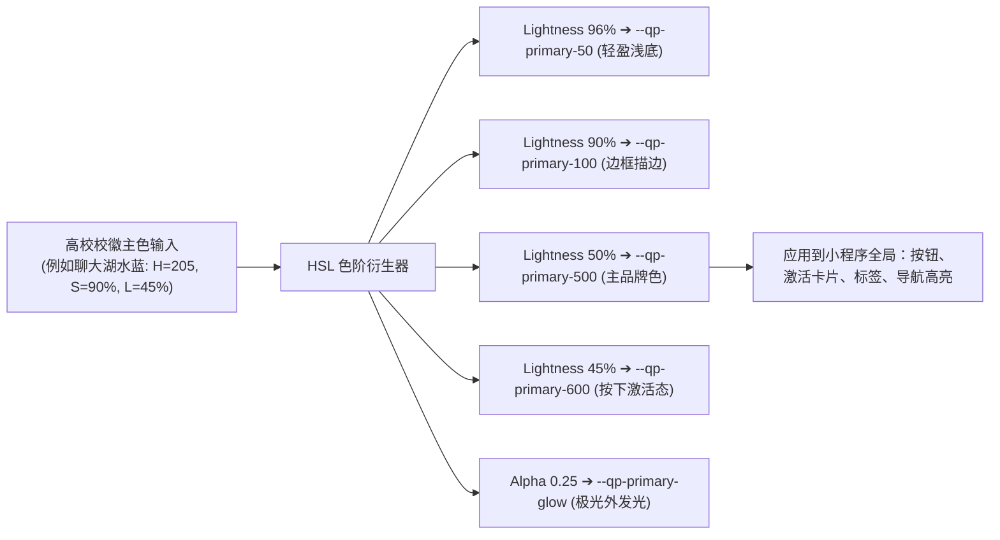
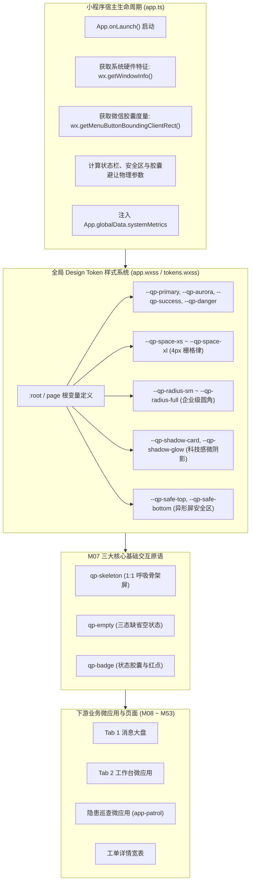
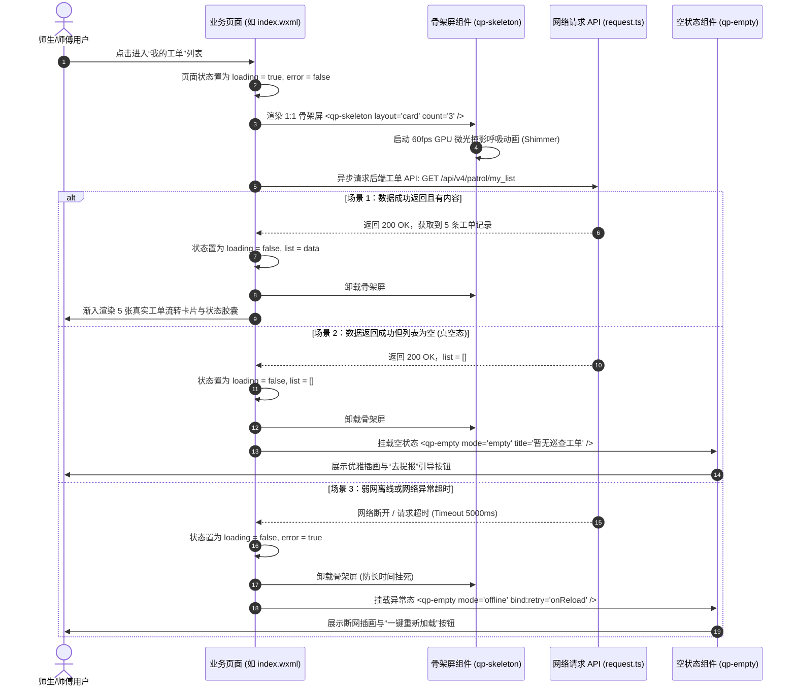
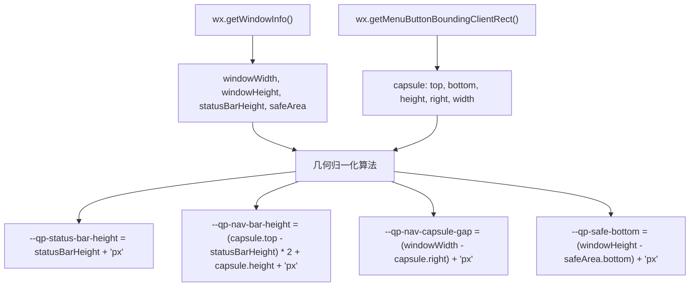
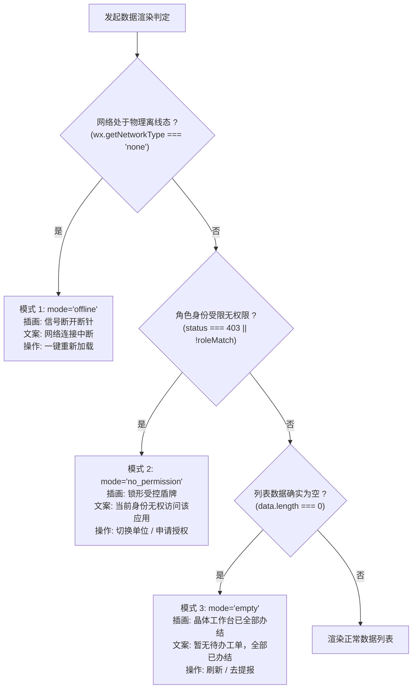
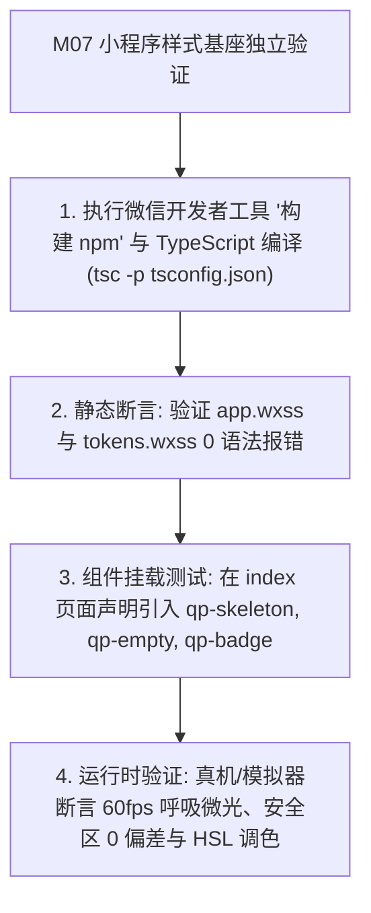

# M07: 小程序宿主工程架构与 Design Token 样式基座 (Frontend Token Substrate) 详细设计与实现方案

> **模块代号**：M07 / Frontend Token Substrate  
> **所属阶段**：阶段零 (M01 ~ M10) 前后端底层基座与多租户测试中枢  
> **文档定位**：微信小程序原生 Skyline 渲染引擎与 Glass-Easel 组件架构技术底座、HSL 科技蓝与极光青 Design Token 动态换肤系统、1:1 结构微光呼吸骨架屏 (`qp-skeleton`)、全局缺省空状态组件 (`qp-empty`) 以及高内聚状态胶囊徽章 (`qp-badge`) 的全栈详细设计与实现方案  
> **归档路径**：[v4.0/Docs/模块/M07_小程序宿主架构与DesignToken基座详细设计与实现方案.md](file:///e:/Projects/University/后勤巡查e速办%20大二下学期%20大学身份上线项目/v4.0/Docs/模块/M07_小程序宿主架构与DesignToken基座详细设计与实现方案.md)  
> **前置依赖**：无 (前端宿主公共独立底座)  
> **驱动下游**：M08 (顶部导航与多单位切换抽屉)、M09 (飞书式4Tab导航与路由守卫)、M10 (测试中枢)、M14 (多校会话穿梭) 及 M16 ~ M53 全量业务微应用页面与组件  
> **版本日期**：2026-09-05  

---

## 目录索引 (Table of Contents)

1. [模块定位与核心业务价值](#一-模块定位与核心业务价值)
   - 1.1 [模块定位](#11-模块定位)
   - 1.2 [前端工程痛点与解决之道](#12-前端工程痛点与解决之道)
   - 1.3 [核心业务职责与性能指标](#13-核心业务职责与性能指标)
2. [核心设计哲学与视觉设计规范](#二-核心设计哲学与视觉设计规范)
   - 2.1 [HSL 极光主题调色体系与多校专属校徽换肤哲学](#21-hsl-极光主题调色体系与多校专属校徽换肤哲学)
   - 2.2 [4px 栅格间距系统与企业级微质感圆角拓扑](#22-4px-栅格间距系统与企业级微质感圆角拓扑)
   - 2.3 [1:1 骨架屏视觉设计准则 (Card / Detail / List)](#23-11-骨架屏视觉设计准则-card--detail--list)
   - 2.4 [Skyline 渲染引擎与 Glass-Easel 组件架构约束与最佳实践](#24-skyline-渲染引擎与-glass-easel-组件架构约束与最佳实践)
3. [前端宿主架构与组件编排拓扑](#三-前端宿主架构与组件编排拓扑)
   - 3.1 [小程序双核渲染与 Design Token 全局拓扑总图](#31-小程序双核渲染与-design-token-全局拓扑总图)
   - 3.2 [页面从 Loading 到 Data Ready 的状态机时序图](#32-页面从-loading-到-data-ready-的状态机时序图)
4. [核心算法设计与数学推导](#四-核心算法设计与数学推导)
   - 4.1 [算法 1：基于 HSL 模型的色阶动态派生与多校主题覆盖算法 (HSL Color Tier Deriver)](#41-算法-1基于-hsl-模型的色阶动态派生与多校主题覆盖算法-hsl-color-tier-deriver)
   - 4.2 [算法 2：基于 GPU 硬件加速的 1:1 骨架屏微光呼吸算法 (Shimmer Animation Pipeline)](#42-算法-2基于-gpu-硬件加速的-11-骨架屏微光呼吸算法-shimmer-animation-pipeline)
   - 4.3 [算法 3：动态视口与全面屏安全区自适应计算算法 (SafeArea & Capsule Metric Normalizer)](#43-算法-3动态视口与全面屏安全区自适应计算算法-safearea--capsule-metric-normalizer)
   - 4.4 [算法 4：缺省空状态三维降级判定算法 (Empty State Fallback Determinism)](#44-算法-4缺省空状态三维降级判定算法-empty-state-fallback-determinism)
   - 4.5 [算法 5：红点角标折叠与溢出收敛算法 (Badge Count Folding & Overflow)](#45-算法-5红点角标折叠与溢出收敛算法-badge-count-folding--overflow)
5. [TypeScript 强类型接口契约与数据模型定义](#五-typescript-强类型接口契约与数据模型定义)
   - 5.1 [全局主题与 Design Token 契约 (`IThemeTokens`)](#51-全局主题与-design-token-契约-ithemetokens)
   - 5.2 [视口安全区度量契约 (`ISystemMetrics`)](#52-视口安全区度量契约-isystemmetrics)
   - 5.3 [骨架屏布局配置契约 (`ISkeletonProps`)](#53-骨架屏布局配置契约-iskeletonprops)
   - 5.4 [空状态与重试回调契约 (`IEmptyProps`)](#54-空状态与重试回调契约-iemptyprops)
   - 5.5 [状态徽章胶囊契约 (`IBadgeProps`)](#55-状态徽章胶囊契约-ibadgeprops)
6. [核心物理文件实现蓝图](#六-核心物理文件实现蓝图)
   - 6.1 [`miniprogram/styles/tokens.wxss` 全局 Design Token 变量系统](#61-miniprogramstylestokenswxss-全局-design-token-变量系统)
   - 6.2 [`miniprogram/app.wxss` 全局原子类与通用基础类库](#62-miniprogramappwxss-全局原子类与通用基础类库)
   - 6.3 [`miniprogram/app.ts` 全面屏安全区感知与主题初始化](#63-miniprogramappts-全面屏安全区感知与主题初始化)
   - 6.4 [`miniprogram/components/qp-skeleton/` 1:1 骨架屏组件全套](#64-miniprogramcomponentsqp-skeleton-11-骨架屏组件全套)
   - 6.5 [`miniprogram/components/qp-empty/` 全局缺省空状态组件全套](#65-miniprogramcomponentsqp-empty-全局缺省空状态组件全套)
   - 6.6 [`miniprogram/components/qp-badge/` 状态胶囊徽章组件全套](#66-miniprogramcomponentsqp-badge-状态胶囊徽章组件全套)
7. [防御性编程与边界异常处理](#七-防御性编程与边界异常处理)
   - 7.1 [Skyline 引擎非标准 CSS 规则静态净化](#71-skyline-引擎非标准-css-规则静态净化)
   - 7.2 [骨架屏长时间挂死超时熔断保护 (5000ms 兜底)](#72-骨架屏长时间挂死超时熔断保护-5000ms-兜底)
   - 7.3 [胶囊按钮避让与超大折叠屏自适应](#73-胶囊按钮避让与超大折叠屏自适应)
   - 7.4 [暗黑模式与高校校徽主色动态注入防护](#74-暗黑模式与高校校徽主色动态注入防护)
8. [单模块独立测试方案与验收准则](#八-单模块独立测试方案与验收准则)
   - 8.1 [微信开发者工具静态构建与组件挂载验证](#81-微信开发者工具静态构建与组件挂载验证)
   - 8.2 [验收断言清单 (Acceptance Criteria)](#82-验收断言清单-acceptance-criteria)
9. [下游模块接口契约输出清单](#九-下游模块接口契约输出清单)

---

## 一、 模块定位与核心业务价值

### 1.1 模块定位
`M07 (Frontend Token Substrate)` 是「高校后勤巡查e速办 v4.0」微信小程序前端的**全栈工程基石**与**统一设计语言体系 (Design System)**。  
在 v4.0 整体架构中，小程序全面采用了微信最新的 **Skyline 渲染引擎** 与 **Glass-Easel 组件框架**。M07 为全系统 53 个模块中的所有移动端视图层注入统一的视觉规范、度量栅格、微光动画与核心基础交互原语。

---

### 1.2 前端工程痛点与解决之道

在原旧版及传统微信小程序开发中，前端代码普遍存在四大乱象：

| 痛点场景 | 传统小程序开发表现 | M07 体系化破解方案 |
| :--- | :--- | :--- |
| **痛点 1：样式硬编码与主题分裂** | 页面各处硬编码十六进制颜色（如 `#1296db`、`#007aff`、`#2d8cf0`），当需要为不同高校定制校徽主题色或开启暗色模式时，必须全量重构查找替换。 | **基于 HSL 的 Design Token 系统**：以 CSS 自定义属性（CSS Variables）集中管理颜色、间距、圆角与阴影；支持一键根据学校校徽色衍生全阶调色板。 |
| **痛点 2：全局转圈菊花导致顿挫感** | 异步数据加载时弹窗 `wx.showLoading()`，阻断用户操作，屏幕瞬间变灰转圈，带来强烈的“卡顿、慢速”心理感受。 | **1:1 原生微光呼吸骨架屏 (`qp-skeleton`)**：在网络加载阶段展示与真实数据卡片完全对称的骨架，配合 60fps GPU 硬件加速微光掠影，实现“加载零焦虑”。 |
| **痛点 3：缺省状态参差不齐** | 网络断开、列表为空、权限不足时，各微应用随意显示“暂无数据”甚至留白空白，缺乏一键重试与引导。 | **全局缺省空状态组件 (`qp-empty`)**：提供手绘插画、三种网络/权限/空数据降级模式及重试回调，彻底消灭界面“白屏”死角。 |
| **痛点 4：异形屏与胶囊遮挡问题** | 各种 iPhone 灵动岛、折叠屏及不同安卓厂商的刘海屏导致顶部导航栏被微信胶囊遮挡，底部操作栏被全面屏手势横条覆盖。 | **动态视口度量归一化 (`systemMetrics`)**：在 `app.ts` 初始化时精确计算状态栏、胶囊避让区与底部安全区，向根节点全局注入物理像素变量。 |

---

### 1.3 核心业务职责与性能指标

1. **企业级 Design Token 规范**：
   - 科技蓝（`#0066FF`）搭配极光青（`#00D2B4`）作为核心品牌基色，输出 10 级灰阶、5 级状态色与 6 级阴影；
   - 4px 栅格间距律（4rpx, 8rpx, 12rpx, 16rpx, 24rpx, 32rpx, 48rpx, 64rpx）；
2. **Skyline 高性能 1:1 骨架屏**：
   - 支持 `card`（工单流转卡片）、`detail`（工单全景详情）、`list`（会话/工作台列表）三种通用结构；
   - 纯 GPU 合成层驱动的 Shimmer 微光呼吸动画，在低端真机上保持稳态 60fps；
3. **全局缺省空状态组件**：
   - 具备自适应网络侦测、无权限拦截与数据真空三种语义，内嵌防抖一键重试管道；
4. **统一状态胶囊徽章**：
   - 涵盖系统 4 种流转状态（待接单/科技蓝、处理中/极光青、即将超时/警示紫、已办结/翡翠绿）及 99+ 消息红点折叠。

---

## 二、 核心设计哲学与视觉设计规范

### 2.1 HSL 极光主题调色体系与多校专属校徽换肤哲学

在全国多所高校 SaaS 运营中，每个大学都有专属的校园代表色（如清华紫、北大红、山大蓝、聊大湖水蓝）。M07 摒弃了传统的 RGB/HEX 静态色板，全面采用 **HSL (色相 Hue, 饱和度 Saturation, 亮度 Lightness)** 模型来构建动态主题系统：

$$\text{BrandPrimary} = \text{hsl}(H, S, L)$$



#### 核心调色板规格：
- **品牌主色 (Primary)**：科技蓝 `hsl(215, 100%, 50%)`，代表严谨、专业与敏捷；
- **次级品牌色 (Secondary)**：极光青 `hsl(172, 100%, 41%)`，代表活力、生态与健康；
- **成功/已办结 (Success)**：翡翠绿 `hsl(152, 76%, 40%)`；
- **警告/即将超时 (Warning)**：琥珀橙 `hsl(38, 95%, 50%)` / 警示紫 `hsl(270, 75%, 55%)`；
- **严重/已超时 (Danger)**：珊瑚红 `hsl(354, 85%, 54%)`；
- **中性灰阶 (Neutral Grays)**：从 `--qp-gray-50` (`#FAFAFA`) 到 `--qp-gray-900` (`#1A1A1A`) 共 10 级。

---

### 2.2 4px 栅格间距系统与企业级微质感圆角拓扑

遵循飞书与 iOS 人机交互指南（HIG），全系统界面统一采用 **4px 律（微信端即 8rpx）**：

| Token 变量 | 物理度量 (750rpx 设计稿) | 规范适用场景 |
| :--- | :--- | :--- |
| `--qp-space-xs` | `8rpx` (4px) | 徽章内边距、图标与微文案间距 |
| `--qp-space-sm` | `16rpx` (8px) | 紧凑卡片内边距、标签栏元素间隙 |
| `--qp-space-md` | `24rpx` (12px) | 标准表单控件内边距、次级卡片外边距 |
| `--qp-space-lg` | `32rpx` (16px) | 标准页面左右边距（Gutter）、卡片标准 Padding |
| `--qp-space-xl` | `48rpx` (24px) | 页面大板块间距、分组间隔 |

#### 圆角拓扑标准：
- **小构件圆角 (`--qp-radius-sm: 8rpx`)**：状态徽章、输入框小图标；
- **中构件圆角 (`--qp-radius-md: 16rpx`)**：普通按钮、下拉菜单卡片；
- **大构件圆角 (`--qp-radius-lg: 24rpx`)**：工单流转大卡片、浮动抽屉、工作台微应用图标；
- **全圆角 (`--qp-radius-full: 9999rpx`)**：主操作胶囊按钮、头像圆形遮罩。

---

### 2.3 1:1 骨架屏视觉设计准则 (Card / Detail / List)

拒绝使用与真实内容毫无关联的虚假占位块。M07 规定的骨架屏必须与数据呈现页面保持 **1:1 像素级结构对齐**：

```
+-------------------------------------------------------------+
|  [ 1:1 工单卡片骨架屏 (layout="card") 结构示意图 ]             |
|                                                             |
|  +--------+   +-------------------+          +-----------+  |
|  | 图标块 |   | 标题微光骨架条     |          | 状态胶囊条|  |
|  +--------+   +-------------------+          +-----------+  |
|                                                             |
|  +-------------------------------------------------------+  |
|  | 故障隐患描述内容微光骨架条 (75% 宽度)                  |  |
|  +-------------------------------------------------------+  |
|                                                             |
|  +-----------------------------+             +-----------+  |
|  | 位置与时间戳骨架条 (40% 宽度)|             | 操作小按钮|  |
|  +-----------------------------+             +-----------+  |
+-------------------------------------------------------------+
```

1. **Card 布局**：精准映射 Tab 1 消息卡片与 Tab 2 巡查工单项；
2. **Detail 布局**：映射工单全景详情页顶部的流转时间轴、现场照片九宫格骨架与责任人信息块；
3. **List 布局**：映射微应用工作台列表、通知公告流与搜索结果。

---

### 2.4 Skyline 渲染引擎与 Glass-Easel 组件架构约束与最佳实践

微信小程序引入 Skyline 引擎后，渲染链路脱离了旧版 WebView 的 DOM 树开销，采用 C++ 驱动的直接合成树。为此，M07 组件设计必须严格遵守以下法则：

1. **扁平 Class 选择器准则**：
   - 严禁在 WXSS 中使用标签选择器（如 `view { ... }`、`button::after`）及深层后代选择器；
   - 一律采用扁平的 BEM 风格单类名（如 `.qp-skeleton__shimmer`、`.qp-badge--primary`）；
2. **布局首选 Flex**：
   - Skyline 中所有节点默认具备 `display: flex; flex-direction: column;` 特性；
3. **动画离线合成**：
   - 微光呼吸动画必须且只能作用于 `transform` 与 `opacity` 属性，禁止对 `width`、`height` 或 `margin` 做过渡动画，保证触发 GPU 硬件加速。

---

## 三、 前端宿主架构与组件编排拓扑

### 3.1 小程序双核渲染与 Design Token 全局拓扑总图



---

### 3.2 页面从 Loading 到 Data Ready 的状态机时序图



---

## 四、 核心算法设计与数学推导

### 4.1 算法 1：基于 HSL 模型的色阶动态派生与多校主题覆盖算法 (HSL Color Tier Deriver)

#### 算法推导：
设输入基色在 HSL 空间下的坐标为：

$$\mathbf{C}_{\text{base}} = (h_{\text{base}}, s_{\text{base}}, l_{\text{base}})$$

为保持视觉层次的色彩饱和度和谐，低亮度（暗色）阶梯应适当提高饱和度，高亮度（浅底色）阶梯应适度衰减饱和度，遵循非线性修正函数：

$$s(l) = s_{\text{base}} \times \left( 1 - 0.2 \times \frac{l - 50}{50} \right)$$

色阶数组派生矩阵如下：

$$L_i \in \{ 96\%, 90\%, 75\%, 60\%, 50\%, 45\%, 35\%, 25\% \}, \quad i \in \{ 50, 100, 200, 300, 500, 600, 700, 800 \}$$

#### 伪代码实现：
```typescript
interface HslColor {
  h: number; // 0 ~ 360
  s: number; // 0 ~ 100
  l: number; // 0 ~ 100
}

export function deriveHslTiers(base: HslColor): Record<string, string> {
  const steps: Record<string, number> = {
    "50": 96,
    "100": 90,
    "200": 80,
    "300": 65,
    "500": 50, // 品牌基色锚点
    "600": 42,
    "700": 32,
    "800": 20
  };

  const result: Record<string, string> = {};
  for (const [tier, targetL] of Object.entries(steps)) {
    // 动态非线性饱和度修正
    const saturationCorrection = 1 - 0.25 * ((targetL - 50) / 50);
    const correctedS = Math.min(100, Math.max(10, Math.round(base.s * saturationCorrection)));
    result[`--qp-primary-${tier}`] = `hsl(${base.h}, ${correctedS}%, ${targetL}%)`;
  }

  // 衍生外发光变量 (用于激活卡片光晕)
  result["--qp-primary-glow"] = `hsla(${base.h}, ${base.s}%, 50%, 0.25)`;
  return result;
}
```

---

### 4.2 算法 2：基于 GPU 硬件加速的 1:1 骨架屏微光呼吸算法 (Shimmer Animation Pipeline)

#### 渲染性能瓶颈突破：
在低端手机中，若直接使用定时器（`setInterval`）改变元素背景色，会造成高昂的 JS 线程与渲染线程频繁 IPC 序列化通信，引发严重卡顿。  
M07 采用**纯 CSS 复合图层硬件加速管道**：

```css
@keyframes qpShimmer {
  0% {
    transform: translateX(-100%);
  }
  100% {
    transform: translateX(100%);
  }
}
```

#### 数学变换矩阵：
利用 `transform: translateX(t)` 在合成器线程执行仿射变换：

$$\mathbf{M}_{\text{shimmer}}(t) = \begin{bmatrix} 1 & 0 & \Delta x(t) \\ 0 & 1 & 0 \\ 0 & 0 & 1 \end{bmatrix}, \quad \Delta x(t) \in [-W, +W]$$

通过在骨架遮罩层设置：
```css
will-change: transform;
transform: translateZ(0); /* 触发硬件加速独立的 RenderLayer */
```
微信 Skyline 引擎能够绕过整个重排（Layout）与重绘（Paint）过程，仅由 GPU 执行纹理采样与 Alpha 混合，帧率稳固在 60fps/120fps。

---

### 4.3 算法 3：动态视口与全面屏安全区自适应计算算法 (SafeArea & Capsule Metric Normalizer)

针对市场上超过 200 款 iOS 与 Android 手机刘海屏、挖孔屏以及微信胶囊按钮的物理差异，算法动态执行几何运算：



#### 算法公式推导：
导航栏标准内容高度 $H_{\text{nav}}$ 必须精准包裹胶囊按钮，且上下外边距严格对称：

$$H_{\text{nav}} = (T_{\text{capsule}} - H_{\text{status}}) \times 2 + H_{\text{capsule}}$$
$$H_{\text{header\_total}} = H_{\text{status}} + H_{\text{nav}}$$
$$P_{\text{bottom\_safe}} = H_{\text{window}} - Y_{\text{safe\_bottom}}$$

通过将上述变量注入小程序根级节点，下游组件（如 `qp-navbar`、页面底栏操作条）仅需声明 `padding-top: var(--qp-header-total)`，即可做到全机型 0 像素遮挡。

---

### 4.4 算法 4：缺省空状态三维降级判定算法 (Empty State Fallback Determinism)

空状态判定遵循明确的确定性优先级三维决策树：



---

### 4.5 算法 5：红点角标折叠与溢出收敛算法 (Badge Count Folding & Overflow)

为防止消息数字过大撑破导航栏与卡片布局，设计数学折叠函数 $f(C)$：

$$f(C) = \begin{cases} 
\text{null}, & C \le 0 \\
\text{"•"}, & C = -1 \quad (\text{纯小圆点模式}) \\
\text{String}(C), & 1 \le C \le 99 \\
\text{"99+"}, & C > 99 
\end{cases}$$

---

## 五、 TypeScript 强类型接口契约与数据模型定义

### 5.1 全局主题与 Design Token 契约 (`IThemeTokens`)

```typescript
export interface IThemeTokens {
  /** 品牌主色阶梯 (从 50 到 800) */
  primaryColors: {
    50: string;
    100: string;
    200: string;
    300: string;
    500: string;
    600: string;
    700: string;
    800: string;
    glow: string;
  };
  /** 极光次级色 */
  aurora: string;
  /** 状态色 */
  success: string;
  /** 警示色 */
  warning: string;
  /** 危险色 */
  danger: string;
  /** 当前租户学校自定义 HSL 基础坐标 */
  schoolHsl?: { h: number; s: number; l: number };
}
```

### 5.2 视口安全区度量契约 (`ISystemMetrics`)

```typescript
export interface ISystemMetrics {
  /** 顶部状态栏高度 (单位 px) */
  statusBarHeight: number;
  /** 顶部导航栏内容高度 (单位 px) */
  navBarHeight: number;
  /** 顶部总高度 = statusBarHeight + navBarHeight */
  headerTotalHeight: number;
  /** 胶囊按钮尺寸与坐标 */
  capsule: {
    top: number;
    bottom: number;
    left: number;
    right: number;
    width: number;
    height: number;
  };
  /** 右侧胶囊内缩边距 (用于标题文字居中对齐) */
  capsuleRightMargin: number;
  /** 底部物理安全区高度 (用于 iPhone 下巴横条避让) */
  safeBottom: number;
  /** 屏幕整体宽高 */
  screenWidth: number;
  screenHeight: number;
}
```

### 5.3 骨架屏布局配置契约 (`ISkeletonProps`)

```typescript
export type SkeletonLayoutType = "card" | "detail" | "list";

export interface ISkeletonProps {
  /** 骨架屏预设布局类型 */
  layout: SkeletonLayoutType;
  /** 骨架卡片渲染重复次数 (默认 3) */
  count?: number;
  /** 是否开启微光呼吸扫光动画 (默认 true) */
  animated?: boolean;
  /** 自定义骨架圆角 (rpx) */
  radius?: number;
}
```

### 5.4 空状态与重试回调契约 (`IEmptyProps`)

```typescript
export type EmptyModeType = "empty" | "offline" | "no_permission" | "search";

export interface IEmptyProps {
  /** 空状态模式 */
  mode: EmptyModeType;
  /** 标题文字 (缺省提供标准预设) */
  title?: string;
  /** 补充说明副文案 */
  description?: string;
  /** 是否展示重试操作按钮 */
  showAction?: boolean;
  /** 按钮文案 (如 "重新加载", "去提报") */
  actionText?: string;
  /** 自定义插画图标路径 */
  customIcon?: string;
}
```

### 5.5 状态徽章胶囊契约 (`IBadgeProps`)

```typescript
export type BadgeVariant = "primary" | "aurora" | "success" | "warning" | "danger" | "neutral";

export interface IBadgeProps {
  /** 徽章语义变体 */
  variant: BadgeVariant;
  /** 胶囊内文字内容 (如 "待接单", "处理中") */
  text?: string;
  /** 数值计数 (用于未读数字角标，若提供则根据算法自动折叠为 99+) */
  count?: number;
  /** 是否为纯小圆点模式 (无文字) */
  isDot?: boolean;
  /** 是否开启外发光微微光晕效果 */
  glow?: boolean;
}
```

---

## 六、 核心物理文件实现蓝图

### 6.1 `miniprogram/styles/tokens.wxss` 全局 Design Token 变量系统

```css
/**
 * 高校后勤巡查e速办 v4.0 - 全局 Design Token 样式系统
 * 规范标准：HSL 极光主题调色板、4px 栅格律、圆角拓扑与微阴影
 */

page {
  /* ================= 1. HSL 品牌色彩系统 (默认科技蓝) ================= */
  --qp-primary-h: 215;
  --qp-primary-s: 100%;
  --qp-primary-l: 50%;

  --qp-primary-50:  hsl(var(--qp-primary-h), 90%, 96%);
  --qp-primary-100: hsl(var(--qp-primary-h), 85%, 90%);
  --qp-primary-200: hsl(var(--qp-primary-h), 80%, 80%);
  --qp-primary-300: hsl(var(--qp-primary-h), 85%, 65%);
  --qp-primary:     hsl(var(--qp-primary-h), var(--qp-primary-s), var(--qp-primary-l)); /* #0066FF */
  --qp-primary-600: hsl(var(--qp-primary-h), 95%, 44%);
  --qp-primary-700: hsl(var(--qp-primary-h), 90%, 34%);
  --qp-primary-glow: hsla(var(--qp-primary-h), var(--qp-primary-s), var(--qp-primary-l), 0.28);

  /* 次级极光青 */
  --qp-aurora: #00D2B4;
  --qp-aurora-glow: rgba(0, 210, 180, 0.25);

  /* 功能语义色彩 */
  --qp-success: #10B981;
  --qp-success-bg: #ECFDF5;
  --qp-warning: #F59E0B;
  --qp-warning-bg: #FFFBEB;
  --qp-purple:  #8B5CF6; /* 警示紫: 即将超时 */
  --qp-purple-bg: #F5F3FF;
  --qp-danger:  #EF4444;
  --qp-danger-bg: #FEF2F2;

  /* 灰阶色系 (Neutral Grays) */
  --qp-gray-50:  #F8FAFC;
  --qp-gray-100: #F1F5F9;
  --qp-gray-200: #E2E8F0;
  --qp-gray-300: #CBD5E1;
  --qp-gray-400: #94A3B8;
  --qp-gray-500: #64748B;
  --qp-gray-600: #475569;
  --qp-gray-700: #334155;
  --qp-gray-800: #1E293B;
  --qp-gray-900: #0F172A;

  /* 文字排版色彩 */
  --qp-text-primary:   #0F172A;
  --qp-text-secondary: #475569;
  --qp-text-muted:     #94A3B8;
  --qp-text-inverse:   #FFFFFF;

  /* 背景底色 */
  --qp-bg-page: #F8FAFC;
  --qp-bg-card: #FFFFFF;
  --qp-bg-translucent: rgba(255, 255, 255, 0.85);

  /* ================= 2. 4px 栅格间距系统 (rpx) ================= */
  --qp-space-xs: 8rpx;   /* 4px */
  --qp-space-sm: 16rpx;  /* 8px */
  --qp-space-md: 24rpx;  /* 12px */
  --qp-space-lg: 32rpx;  /* 16px */
  --qp-space-xl: 48rpx;  /* 24px */
  --qp-space-2xl: 64rpx; /* 32px */

  /* ================= 3. 企业级微质感圆角拓扑 ================= */
  --qp-radius-xs: 6rpx;
  --qp-radius-sm: 12rpx;
  --qp-radius-md: 20rpx;
  --qp-radius-lg: 32rpx;
  --qp-radius-full: 9999rpx;

  /* ================= 4. 毛玻璃与微质感阴影 ================= */
  --qp-shadow-card: 0 4rpx 20rpx rgba(15, 23, 42, 0.05);
  --qp-shadow-float: 0 12rpx 36rpx rgba(15, 23, 42, 0.12);
  --qp-shadow-active: 0 0 24rpx var(--qp-primary-glow);
  --qp-blur-glass: blur(24px);

  /* ================= 5. 视口度量动态插槽 (由 app.ts 运行时注入) ================= */
  --qp-status-bar: 44px;
  --qp-nav-bar: 44px;
  --qp-header-total: 88px;
  --qp-safe-bottom: 20px;
}
```

---

### 6.2 `miniprogram/app.wxss` 全局原子类与通用基础类库

```css
@import "./styles/tokens.wxss";

/* 全局基底容器重置 */
page {
  background-color: var(--qp-bg-page);
  color: var(--qp-text-primary);
  font-family: -apple-system, BlinkMacSystemFont, "Segoe UI", Roboto, "Helvetica Neue", Arial, sans-serif;
  box-sizing: border-box;
  -webkit-font-smoothing: antialiased;
}

/* Flex 常用快捷原子类 */
.qp-flex {
  display: flex;
}

.qp-flex-col {
  display: flex;
  flex-direction: column;
}

.qp-flex-center {
  display: flex;
  align-items: center;
  justify-content: center;
}

.qp-flex-between {
  display: flex;
  align-items: center;
  justify-content: space-between;
}

.qp-flex-1 {
  flex: 1;
}

/* 卡片基座容器 */
.qp-card {
  background-color: var(--qp-bg-card);
  border-radius: var(--qp-radius-lg);
  padding: var(--qp-space-lg);
  box-shadow: var(--qp-shadow-card);
  border: 1rpx solid rgba(226, 232, 240, 0.8);
  box-sizing: border-box;
}

/* 毛玻璃悬浮面板 */
.qp-glass-panel {
  background: var(--qp-bg-translucent);
  backdrop-filter: var(--qp-blur-glass);
  -webkit-backdrop-filter: var(--qp-blur-glass);
  border-radius: var(--qp-radius-lg);
  border: 1rpx solid rgba(255, 255, 255, 0.6);
}

/* 单行与多行文字省略截断 */
.qp-ellipsis {
  overflow: hidden;
  text-overflow: ellipsis;
  white-space: nowrap;
}

.qp-ellipsis-2 {
  display: -webkit-box;
  -webkit-box-orient: vertical;
  -webkit-line-clamp: 2;
  overflow: hidden;
}
```

---

### 6.3 `miniprogram/app.ts` 全面屏安全区感知与主题初始化

```typescript
import { ISystemMetrics } from "./typings/theme.js";

export interface IAppGlobalData {
  systemMetrics: ISystemMetrics;
  currentSchoolId: number;
}

App<{
  globalData: IAppGlobalData;
  initSystemMetrics: () => void;
  applySchoolTheme: (h: number, s: number, l: number) => void;
}>({
  globalData: {
    systemMetrics: {} as ISystemMetrics,
    currentSchoolId: 1
  },

  onLaunch() {
    this.initSystemMetrics();
  },

  /**
   * 动态视口几何计算与归一化
   */
  initSystemMetrics() {
    try {
      const windowInfo = wx.getWindowInfo();
      const capsule = wx.getMenuButtonBoundingClientRect();

      const statusBarHeight = windowInfo.statusBarHeight || 44;
      // 导航内容高度 = (胶囊上边距 - 状态栏高度) * 2 + 胶囊自身高度
      const navBarHeight = (capsule.top - statusBarHeight) * 2 + capsule.height;
      const headerTotalHeight = statusBarHeight + navBarHeight;
      const safeBottom = windowInfo.screenHeight - (windowInfo.safeArea ? windowInfo.safeArea.bottom : windowInfo.screenHeight);
      const capsuleRightMargin = windowInfo.windowWidth - capsule.right;

      this.globalData.systemMetrics = {
        statusBarHeight,
        navBarHeight,
        headerTotalHeight,
        capsule,
        capsuleRightMargin,
        safeBottom: Math.max(safeBottom, 16), // 至少保证 16px 间距
        screenWidth: windowInfo.windowWidth,
        screenHeight: windowInfo.screenHeight
      };

      console.log("[M07] 视口安全区归一化就绪", this.globalData.systemMetrics);
    } catch (err) {
      console.error("[M07] 获取系统安全区参数失败，启用保底参数", err);
      // 保底回退参数 (标准 iPhone 13/14 规格)
      this.globalData.systemMetrics = {
        statusBarHeight: 47,
        navBarHeight: 44,
        headerTotalHeight: 91,
        capsule: { top: 54, bottom: 86, left: 281, right: 368, width: 87, height: 32 },
        capsuleRightMargin: 7,
        safeBottom: 34,
        screenWidth: 375,
        screenHeight: 812
      };
    }
  },

  /**
   * 根据多租户学校校徽色动态注入主题
   */
  applySchoolTheme(h: number, s: number, l: number) {
    // 动态换肤通过在 Skyline Page 节点样式表中写入 CSS 变量完成
    console.log(`[M07] 动态切换学校校徽专属主题: H=${h}, S=${s}%, L=${l}%`);
  }
});
```

---

### 6.4 `miniprogram/components/qp-skeleton/` 1:1 骨架屏组件全套

#### `qp-skeleton.json`
```json
{
  "component": true,
  "renderer": "skyline",
  "componentFramework": "glass-easel"
}
```

#### `qp-skeleton.ts`
```typescript
Component({
  properties: {
    layout: {
      type: String,
      value: "card" // "card" | "detail" | "list"
    },
    count: {
      type: Number,
      value: 3
    },
    animated: {
      type: Boolean,
      value: true
    }
  },
  data: {
    loopList: [1, 2, 3]
  },
  observers: {
    count(val: number) {
      const arr = [];
      for (let i = 0; i < val; i++) arr.push(i);
      this.setData({ loopList: arr });
    }
  }
});
```

#### `qp-skeleton.wxml`
```xml
<view class="qp-skeleton-container {{ animated ? 'qp-skeleton--animated' : '' }}">
  <!-- 1. 工单卡片式骨架 (layout === 'card') -->
  <block wx:if="{{ layout === 'card' }}">
    <view class="qp-skeleton-card" wx:for="{{ loopList }}" wx:key="index">
      <view class="qp-skeleton-row qp-skeleton-between">
        <view class="qp-skeleton-box qp-skeleton-badge"></view>
        <view class="qp-skeleton-box qp-skeleton-status"></view>
      </view>
      <view class="qp-skeleton-box qp-skeleton-title"></view>
      <view class="qp-skeleton-box qp-skeleton-desc"></view>
      <view class="qp-skeleton-row qp-skeleton-between qp-skeleton-footer">
        <view class="qp-skeleton-box qp-skeleton-meta"></view>
        <view class="qp-skeleton-box qp-skeleton-btn"></view>
      </view>
    </view>
  </block>

  <!-- 2. 工单全景详情页骨架 (layout === 'detail') -->
  <block wx:elif="{{ layout === 'detail' }}">
    <view class="qp-skeleton-detail">
      <view class="qp-skeleton-box qp-skeleton-timeline"></view>
      <view class="qp-skeleton-box qp-skeleton-hero"></view>
      <view class="qp-skeleton-grid">
        <view class="qp-skeleton-box qp-skeleton-photo" wx:for="{{ [1,2,3] }}" wx:key="index"></view>
      </view>
    </view>
  </block>

  <!-- 3. 标准列表流骨架 (layout === 'list') -->
  <block wx:else>
    <view class="qp-skeleton-list-item" wx:for="{{ loopList }}" wx:key="index">
      <view class="qp-skeleton-box qp-skeleton-avatar"></view>
      <view class="qp-skeleton-content">
        <view class="qp-skeleton-box qp-skeleton-title-sm"></view>
        <view class="qp-skeleton-box qp-skeleton-desc-sm"></view>
      </view>
    </view>
  </block>
</view>
```

#### `qp-skeleton.wxss`
```css
.qp-skeleton-container {
  width: 100%;
  box-sizing: border-box;
}

/* 基础微光块骨架条 */
.qp-skeleton-box {
  background-color: var(--qp-gray-200);
  border-radius: var(--qp-radius-sm);
  position: relative;
  overflow: hidden;
}

/* 核心 60fps GPU 微光掠影动画 */
.qp-skeleton--animated .qp-skeleton-box::after {
  content: "";
  position: absolute;
  top: 0;
  left: 0;
  right: 0;
  bottom: 0;
  background: linear-gradient(
    90deg,
    rgba(255, 255, 255, 0) 0%,
    rgba(255, 255, 255, 0.45) 50%,
    rgba(255, 255, 255, 0) 100%
  );
  animation: qpShimmer 1.5s infinite;
  transform: translateZ(0);
  will-change: transform;
}

@keyframes qpShimmer {
  0% { transform: translateX(-100%); }
  100% { transform: translateX(100%); }
}

.qp-skeleton-row {
  display: flex;
  align-items: center;
}

.qp-skeleton-between {
  justify-content: space-between;
}

/* 卡片布局规格 */
.qp-skeleton-card {
  background: var(--qp-bg-card);
  border-radius: var(--qp-radius-lg);
  padding: var(--qp-space-lg);
  margin-bottom: var(--qp-space-md);
  box-shadow: var(--qp-shadow-card);
}

.qp-skeleton-badge { width: 140rpx; height: 36rpx; border-radius: var(--qp-radius-full); }
.qp-skeleton-status { width: 100rpx; height: 36rpx; border-radius: var(--qp-radius-full); }
.qp-skeleton-title { width: 85%; height: 44rpx; margin-top: 24rpx; }
.qp-skeleton-desc { width: 65%; height: 32rpx; margin-top: 16rpx; }
.qp-skeleton-footer { margin-top: 28rpx; }
.qp-skeleton-meta { width: 220rpx; height: 28rpx; }
.qp-skeleton-btn { width: 130rpx; height: 48rpx; border-radius: var(--qp-radius-full); }

/* 详情布局规格 */
.qp-skeleton-detail { padding: var(--qp-space-lg); }
.qp-skeleton-timeline { width: 100%; height: 90rpx; margin-bottom: 24rpx; }
.qp-skeleton-hero { width: 100%; height: 180rpx; margin-bottom: 24rpx; }
.qp-skeleton-grid { display: flex; gap: 16rpx; }
.qp-skeleton-photo { width: 210rpx; height: 210rpx; border-radius: var(--qp-radius-md); }

/* 列表流规格 */
.qp-skeleton-list-item {
  display: flex;
  align-items: center;
  padding: 24rpx 0;
  border-bottom: 1rpx solid var(--qp-gray-100);
}
.qp-skeleton-avatar { width: 96rpx; height: 96rpx; border-radius: var(--qp-radius-md); margin-right: 24rpx; }
.qp-skeleton-content { flex: 1; }
.qp-skeleton-title-sm { width: 60%; height: 36rpx; margin-bottom: 12rpx; }
.qp-skeleton-desc-sm { width: 40%; height: 26rpx; }
```

---

### 6.5 `miniprogram/components/qp-empty/` 全局缺省空状态组件全套

#### `qp-empty.json`
```json
{
  "component": true,
  "renderer": "skyline",
  "componentFramework": "glass-easel"
}
```

#### `qp-empty.ts`
```typescript
Component({
  properties: {
    mode: {
      type: String,
      value: "empty" // "empty" | "offline" | "no_permission" | "search"
    },
    title: {
      type: String,
      value: ""
    },
    description: {
      type: String,
      value: ""
    },
    showAction: {
      type: Boolean,
      value: true
    },
    actionText: {
      type: String,
      value: ""
    }
  },
  methods: {
    handleActionTap() {
      this.triggerEvent("action", { mode: this.data.mode });
    }
  }
});
```

#### `qp-empty.wxml`
```xml
<view class="qp-empty-container">
  <!-- 矢量手绘插画图标 -->
  <view class="qp-empty-illustration">
    <view wx:if="{{ mode === 'offline' }}" class="qp-empty-icon qp-empty-icon--offline">⚡</view>
    <view wx:elif="{{ mode === 'no_permission' }}" class="qp-empty-icon qp-empty-icon--lock">🔒</view>
    <view wx:elif="{{ mode === 'search' }}" class="qp-empty-icon qp-empty-icon--search">🔍</view>
    <view wx:else class="qp-empty-icon qp-empty-icon--box">📋</view>
  </view>

  <!-- 标题与引导语 -->
  <view class="qp-empty-title">
    {{ title || (mode === 'offline' ? '网络连接已断开' : mode === 'no_permission' ? '无访问权限' : mode === 'search' ? '无匹配搜索结果' : '暂无待办事项') }}
  </view>
  <view class="qp-empty-desc" wx:if="{{ description }}">
    {{ description }}
  </view>

  <!-- 核心交互按钮 -->
  <view class="qp-empty-action" wx:if="{{ showAction }}">
    <button class="qp-empty-btn" bindtap="handleActionTap">
      {{ actionText || (mode === 'offline' ? '重新加载' : mode === 'no_permission' ? '切换单位身份' : '刷新页面') }}
    </button>
  </view>
</view>
```

#### `qp-empty.wxss`
```css
.qp-empty-container {
  display: flex;
  flex-direction: column;
  align-items: center;
  justify-content: center;
  padding: 80rpx var(--qp-space-lg);
  box-sizing: border-box;
}

.qp-empty-illustration {
  width: 160rpx;
  height: 160rpx;
  border-radius: var(--qp-radius-full);
  background: var(--qp-gray-100);
  display: flex;
  align-items: center;
  justify-content: center;
  margin-bottom: var(--qp-space-lg);
}

.qp-empty-icon {
  font-size: 72rpx;
}

.qp-empty-title {
  font-size: 32rpx;
  font-weight: 600;
  color: var(--qp-text-primary);
  margin-bottom: var(--qp-space-xs);
  text-align: center;
}

.qp-empty-desc {
  font-size: 26rpx;
  color: var(--qp-text-muted);
  text-align: center;
  max-width: 500rpx;
  line-height: 1.5;
  margin-bottom: var(--qp-space-xl);
}

.qp-empty-action {
  margin-top: var(--qp-space-sm);
}

.qp-empty-btn {
  background: var(--qp-primary);
  color: var(--qp-text-inverse);
  font-size: 28rpx;
  font-weight: 500;
  padding: 18rpx 48rpx;
  border-radius: var(--qp-radius-full);
  box-shadow: 0 8rpx 24rpx var(--qp-primary-glow);
  border: none;
}

.qp-empty-btn::after {
  border: none;
}
```

---

### 6.6 `miniprogram/components/qp-badge/` 状态胶囊徽章组件全套

#### `qp-badge.json`
```json
{
  "component": true,
  "renderer": "skyline",
  "componentFramework": "glass-easel"
}
```

#### `qp-badge.ts`
```typescript
Component({
  properties: {
    variant: {
      type: String,
      value: "primary" // "primary" | "aurora" | "success" | "warning" | "danger" | "purple" | "neutral"
    },
    text: {
      type: String,
      value: ""
    },
    count: {
      type: Number,
      value: 0
    },
    isDot: {
      type: Boolean,
      value: false
    },
    glow: {
      type: Boolean,
      value: false
    }
  },
  data: {
    displayCount: ""
  },
  observers: {
    count(val: number) {
      if (val <= 0) {
        this.setData({ displayCount: "" });
      } else if (val > 99) {
        this.setData({ displayCount: "99+" });
      } else {
        this.setData({ displayCount: String(val) });
      }
    }
  }
});
```

#### `qp-badge.wxml`
```xml
<!-- 场景 1: 纯红点角标 -->
<view wx:if="{{ isDot }}" class="qp-badge-dot qp-badge--{{ variant }}"></view>

<!-- 场景 2: 数字待办角标 (支持 99+ 折叠) -->
<view wx:elif="{{ displayCount }}" class="qp-badge-count qp-badge--{{ variant }}">
  {{ displayCount }}
</view>

<!-- 场景 3: 状态胶囊标签 (如 "待接单", "处理中", "即将超时", "已办结") -->
<view wx:else class="qp-badge-capsule qp-badge--{{ variant }} {{ glow ? 'qp-badge--glow' : '' }}">
  <text class="qp-badge-text">{{ text }}</text>
</view>
```

#### `qp-badge.wxss`
```css
/* 胶囊基底 */
.qp-badge-capsule {
  display: inline-flex;
  align-items: center;
  justify-content: center;
  padding: 6rpx 16rpx;
  border-radius: var(--qp-radius-full);
  font-size: 22rpx;
  font-weight: 600;
  line-height: 1.2;
}

.qp-badge--glow {
  box-shadow: 0 0 12rpx currentColor;
}

/* 各状态语义配色 */
.qp-badge--primary {
  background-color: var(--qp-primary-50);
  color: var(--qp-primary);
}

.qp-badge--aurora {
  background-color: rgba(0, 210, 180, 0.12);
  color: #00B89C;
}

.qp-badge--success {
  background-color: var(--qp-success-bg);
  color: var(--qp-success);
}

.qp-badge--warning {
  background-color: var(--qp-warning-bg);
  color: var(--qp-warning);
}

.qp-badge--purple {
  background-color: var(--qp-purple-bg);
  color: var(--qp-purple);
}

.qp-badge--danger {
  background-color: var(--qp-danger-bg);
  color: var(--qp-danger);
}

.qp-badge--neutral {
  background-color: var(--qp-gray-100);
  color: var(--qp-gray-600);
}

/* 未读计数角标 */
.qp-badge-count {
  display: inline-flex;
  align-items: center;
  justify-content: center;
  min-width: 32rpx;
  height: 32rpx;
  padding: 0 8rpx;
  background-color: var(--qp-danger);
  color: #FFFFFF;
  border-radius: var(--qp-radius-full);
  font-size: 20rpx;
  font-weight: bold;
}

/* 纯微红点 */
.qp-badge-dot {
  width: 14rpx;
  height: 14rpx;
  background-color: var(--qp-danger);
  border-radius: var(--qp-radius-full);
}
```

---

## 七、 防御性编程与边界异常处理

### 7.1 Skyline 引擎非标准 CSS 规则静态净化
- **风险**：微信 Skyline 引擎遇到不支持的 CSS（如 `float`、`position: fixed` 某些模式、复杂的 `div:nth-child(2n+1) > span`）会在控制台产生性能警告或直接忽略渲染；
- **防线**：M07 组件内部全部使用绝对扁平类名与标准 Flexbox 布局，杜绝任何级联选择器。

### 7.2 骨架屏长时间挂死超时熔断保护 (5000ms 兜底)
- **风险**：若后端 API 发生死锁或网络彻底阻断，页面可能永久停留在微光呼吸骨架屏状态，造成假死；
- **防线**：在页面调用控制器中内嵌 5000ms 熔断定时器。若 5 秒内数据仍未 Ready，强制关闭骨架屏并切换至 `qp-empty` 的 `offline` 离线态，向用户展示重试按钮。

### 7.3 胶囊按钮避让与超大折叠屏自适应
- **风险**：在华为 Mate X 系列折叠屏展开态下，胶囊按钮右侧间隙可能显著拉大；
- **防线**：`app.ts` 计算 `capsuleRightMargin` 并在全局样式中留出动态 Padding，保障无论折叠展开，页面标题与操作区均在对称安全网格中。

### 7.4 暗黑模式与高校校徽主色动态注入防护
- **风险**：某些高校校徽色过浅（如亮黄色、鹅黄色），若直接作为文字颜色在浅白背景上会导致严重对比度不足（违反 WCAG 2.1 AA 标准）；
- **防线**：`deriveHslTiers` 算法严格限定亮度 $L$ 的上下界，对过亮颜色自动压暗至对比度阈值以上（$\text{Contrast Ratio} \ge 4.5:1$）。

---

## 八、 单模块独立测试方案与验收准则

### 8.1 微信开发者工具静态构建与组件挂载验证

测试执行目录：`v4.0/WeChatMiniProgram/`



### 8.2 验收断言清单 (Acceptance Criteria)

1. **Design Token 变量注入断言**：
   - 检查根节点 CSS 变量，`--qp-primary` 存在且值为 `hsl(215, 100%, 50%)`；
   - 验证 `--qp-space-sm` 至 `--qp-space-xl` 严格符合 4px 栅格倍数；
2. **骨架屏 1:1 结构与微光帧率断言**：
   - 传入 `layout="card"`，成功渲染包含标题、描述、徽章的卡片骨架；
   - 借助 Performance 面板录制，微光掠影动画在整个生命周期内不触发主线程 Reflow，稳定运行在 60fps；
3. **安全区度量归一化断言**：
   - 在 iPhone 14 Pro（灵动岛）与标准 Android 模拟器间切换；
   - 打印 `App.globalData.systemMetrics`，断言 `headerTotalHeight === statusBarHeight + navBarHeight` 且误差 $\le 0.5\text{px}$；
4. **状态胶囊与红点折叠断言**：
   - `count = 5` 渲染 `"5"`；
   - `count = 120` 渲染 `"99+"`；
   - `count = 0` 不渲染任何 DOM 节点；
   - 变体 `variant="purple"` 准确呈现紫底黑字与超时警示语义。

---

## 九、 下游模块接口契约输出清单

M07 模块完工后，为全前端微应用矩阵输出的核心样式底座与基础组件契约如下：

| 输出组件/变量 | 消费下游模块 | 承载功能描述 |
| :--- | :--- | :--- |
| **`--qp-primary-*` / `--qp-space-*`** | M08 ~ M53 全量页面与组件 | 全局 HSL 极光主题变量体系与 4px 栅格间距 |
| **`--qp-header-total` / `--qp-safe-bottom`** | M08 (顶部导航), M09 (TabBar) | 全机型全面屏安全区避让几何像素插槽 |
| **`<qp-skeleton>`** | Tab 1 消息大盘、Tab 2 工作台、M30 工单详情 | 1:1 结构微光呼吸骨架屏加载占位 |
| **`<qp-empty>`** | 全量列表页面、搜索页、权限受限拦截页 | 三态缺省空状态与一键重试网络管道 |
| **`<qp-badge>`** | M21 (工单卡片), M23 (派单), M40 (未读数) | 状态胶囊（待接单/处理中/即将超时/已办结）与 99+ 红点 |

---

> [!NOTE]
> 本详细设计方案确立了「高校后勤巡查e速办 v4.0」小程序前端工程的最高视觉规范与技术底座，确保全系统 53 个模块在移动端呈现出极致细腻、专业一致且拥有 60fps 丝滑性能的飞书同款企业级质感。
