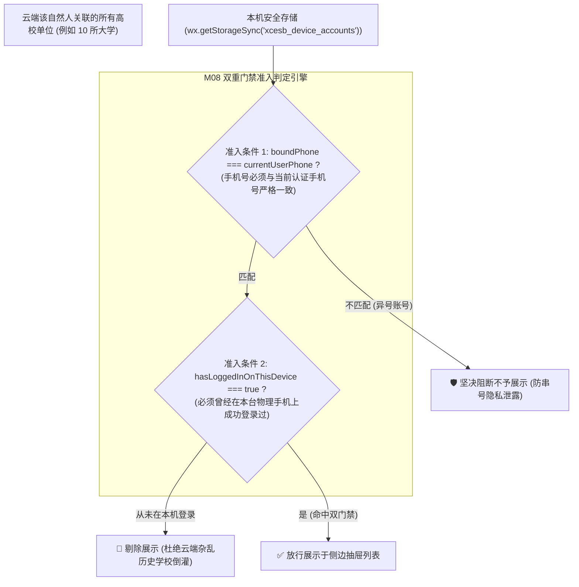
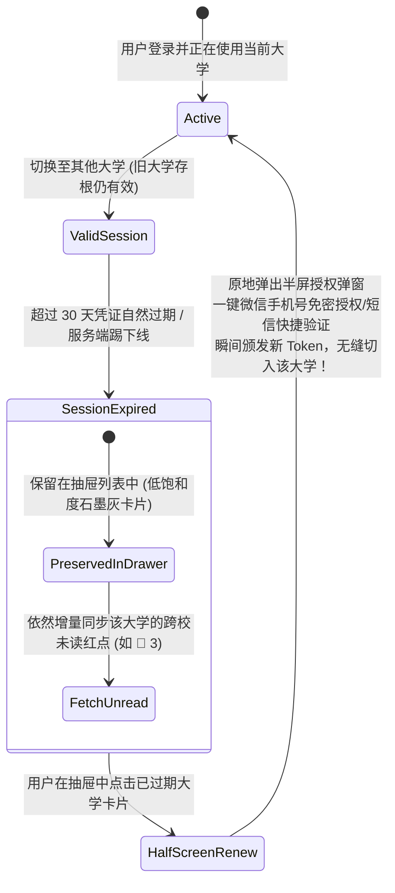
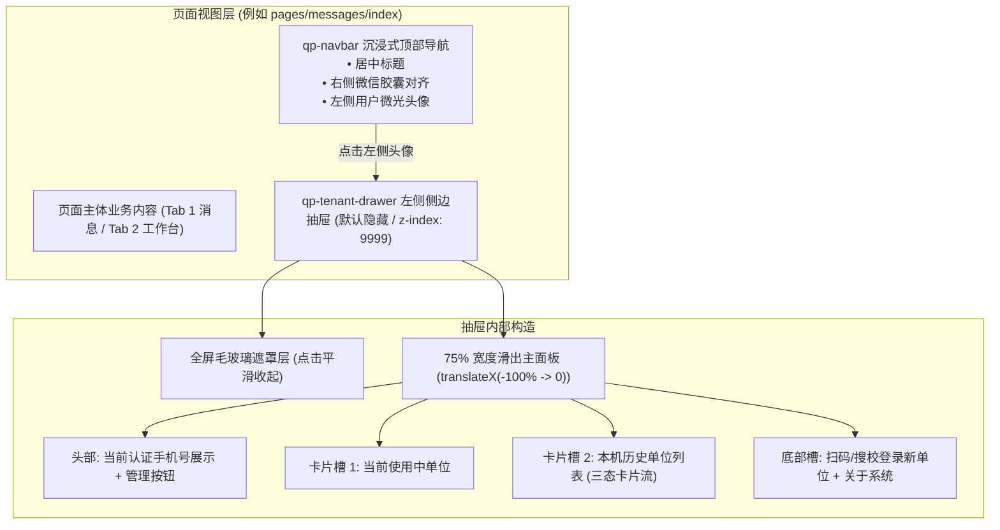
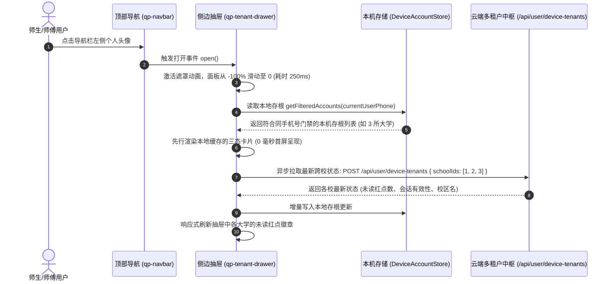
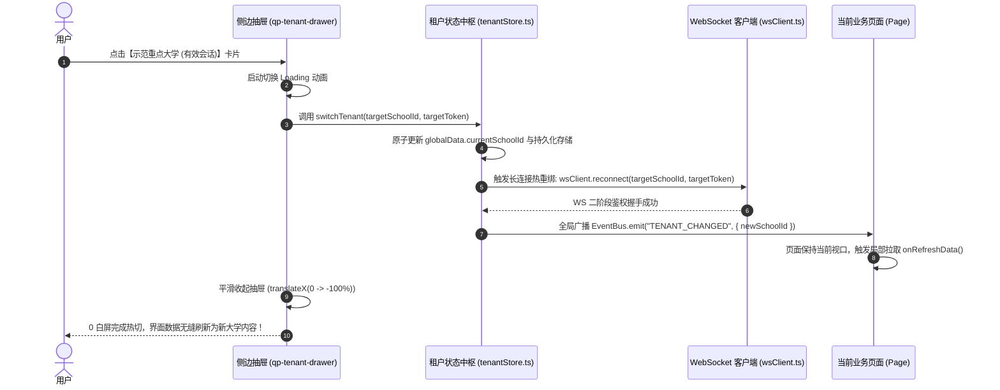
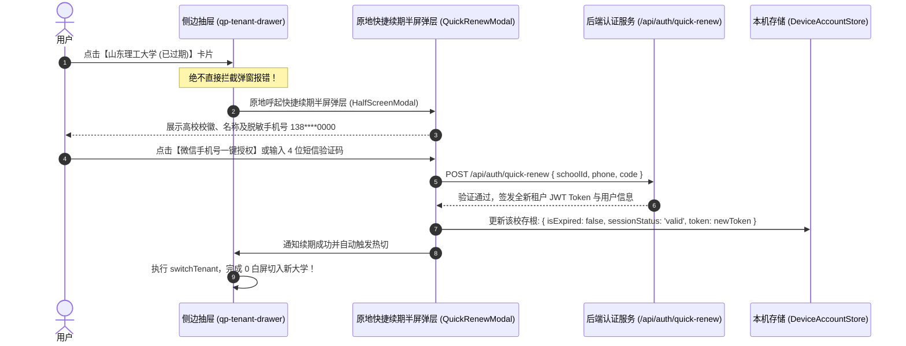
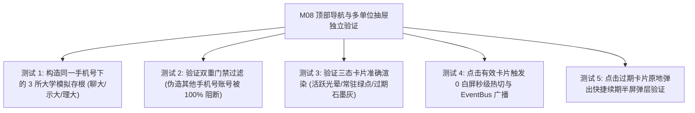

# M08: 顶部沉浸式导航与左侧多单位切换抽屉 (Navbar & Tenant Drawer) 详细设计与实现方案

> **模块代号**：M08 / Navbar & Tenant Drawer  
> **所属阶段**：阶段零 (M01 ~ M10) 前后端底层基座与多租户测试中枢  
> **文档定位**：小程序全局顶部沉浸式自适应导航栏 (`qp-navbar`)、飞书同款左侧侧边抽屉 (`qp-tenant-drawer`)、“同手机号绑定 × 本机历史存根”双重门禁准入引擎 (`deviceAccountStore`) 以及三态卡片无感热切状态机的专项技术实现方案  
> **归档路径**：[v4.0/Docs/模块/M08_顶部沉浸式导航与多单位切换抽屉详细设计与实现方案.md](file:///e:/Projects/University/后勤巡查e速办%20大二下学期%20大学身份上线项目/v4.0/Docs/模块/M08_顶部沉浸式导航与多单位切换抽屉详细设计与实现方案.md)  
> **前置依赖**：M07 (小程序宿主工程架构与 Design Token 样式基座)  
> **驱动下游**：M09 (飞书式 4-Tab 导航与路由守卫)、M10 (测试中枢)、M14 (自然人多身份独立存储与多校会话穿梭) 及全量移动端页面  
> **版本日期**：2026-09-05  

---

## 目录索引 (Table of Contents)

1. [模块定位与核心业务价值](#一-模块定位与核心业务价值)
   - 1.1 [模块定位](#11-模块定位)
   - 1.2 [多校 SaaS 场景下的高校切换痛点与破解之道](#12-多校-saas-场景下的高校切换痛点与破解之道)
   - 1.3 [核心业务职责与交互指标](#13-核心业务职责与交互指标)
2. [核心设计哲学与多校准入铁律](#二-核心设计哲学与多校准入铁律)
   - 2.1 [双重门禁准入哲学：同手机号绑定 × 本机历史存根 (Dual-Key Segregation)](#21-双重门禁准入哲学同手机号绑定--本机历史存根-dual-key-segregation)
   - 2.2 [宽容过期哲学 (Tolerate Expiration) 与原地免密唤醒](#22-宽容过期哲学-tolerate-expiration-与原地免密唤醒)
   - 2.3 [三态卡片状态机模型 (Current Active / Valid Session / Session Expired)](#23-三态卡片状态机模型-current-active--valid-session--session-expired)
   - 2.4 [0 白屏秒级局部热切哲学 (Zero-Flicker Hot Swap)](#24-0-白屏秒级局部热切哲学-zero-flicker-hot-swap)
3. [组件架构拓扑与交互时序图](#三-组件架构拓扑与交互时序图)
   - 3.1 [顶部导航与侧边抽屉组件编排总图](#31-顶部导航与侧边抽屉组件编排总图)
   - 3.2 [左上角头像点击与抽屉滑出时序图](#32-左上角头像点击与抽屉滑出时序图)
   - 3.3 [有效单位 0 白屏局部热切流转时序图](#33-有效单位-0-白屏局部热切流转时序图)
   - 3.4 [已过期单位原地快捷续期流转时序图](#34-已过期单位原地快捷续期流转时序图)
4. [核心算法设计与数学推导](#四-核心算法设计与数学推导)
   - 4.1 [算法 1：同手机号绑定与本机存根双重准入过滤算法 (Dual-Key Access Filter)](#41-算法-1同手机号绑定与本机存根双重准入过滤算法-dual-key-access-filter)
   - 4.2 [算法 2：基于 LRU 活跃度的多校卡片排序算法 (Tenant LRU Sorter)](#42-算法-2基于-lru-活跃度的多校卡片排序算法-tenant-lru-sorter)
   - 4.3 [算法 3：跨校离线未读数聚合与增量比对算法 (Cross-School Unread Diff Pipeline)](#43-算法-3跨校离线未读数聚合与增量比对算法-cross-school-unread-diff-pipeline)
   - 4.4 [算法 4：胶囊按钮动态避让与标题对称居中度量算法 (Capsule Centering Metric)](#44-算法-4胶囊按钮动态避让与标题对称居中度量算法-capsule-centering-metric)
5. [TypeScript 强类型接口契约与数据模型定义](#五-typescript-强类型接口契约与数据模型定义)
   - 5.1 [本机设备账号存根契约 (`DeviceAccountRecord`)](#51-本机设备账号存根契约-deviceaccountrecord)
   - 5.2 [云端学校状态同步响应契约 (`DeviceTenantsSyncResponse`)](#52-云端学校状态同步响应契约-devicetenantssyncresponse)
   - 5.3 [顶部导航组件属性契约 (`IQpNavbarProps`)](#53-顶部导航组件属性契约-iqpnavbarprops)
   - 5.4 [抽屉组件状态机契约 (`IQpTenantDrawerState`)](#54-抽屉组件状态机契约-iqptenantdrawerstate)
6. [核心物理文件实现蓝图](#六-核心物理文件实现蓝图)
   - 6.1 [前端存储：`miniprogram/utils/deviceAccountStore.ts` 本机存根管理器](#61-前端存储miniprogramutilsdeviceaccountstorets-本机存根管理器)
   - 6.2 [全局状态：`miniprogram/store/tenantStore.ts` 当前租户切换响应式中枢](#62-全局状态miniprogramstoretenantstorets-当前租户切换响应式中枢)
   - 6.3 [基础组件：`miniprogram/components/qp-navbar/` 沉浸式顶部导航栏全套](#63-基础组件miniprogramcomponentsqp-navbar-沉浸式顶部导航栏全套)
   - 6.4 [核心组件：`miniprogram/components/qp-tenant-drawer/` 飞书同款侧边抽屉全套](#64-核心组件miniprogramcomponentsqp-tenant-drawer-飞书同款侧边抽屉全套)
7. [防御性编程与边界异常处理](#七-防御性编程与边界异常处理)
   - 7.1 [微信本地存储满溢与冷数据 LRU 清理 (Storage Quota Defense)](#71-微信本地存储满溢与冷数据-lru-清理-storage-quota-defense)
   - 7.2 [单设备换绑手机号时的数据隔离与防串号保护](#72-单设备换绑手机号时的数据隔离与防串号保护)
   - 7.3 [抽屉划出手势冲突与页面滚动穿透拦截 (`catchtouchmove`)](#73-抽屉划出手势冲突与页面滚动穿透拦截-catchtouchmove)
   - 7.4 [高校被系统物理注销/停用时的安全熔断降级](#74-高校被系统物理注销停用时的安全熔断降级)
8. [单模块独立测试方案与验收准则](#八-单模块独立测试方案与验收准则)
   - 8.1 [测试设计与三所高校模拟存根打桩](#81-测试设计与三所高校模拟存根打桩)
   - 8.2 [验收断言清单 (Acceptance Criteria)](#82-验收断言清单-acceptance-criteria)
9. [下游模块接口契约输出清单](#九-下游模块接口契约输出清单)

---

## 一、 模块定位与核心业务价值

### 1.1 模块定位
`M08 (Navbar & Tenant Drawer)` 是「高校后勤巡查e速办 v4.0」前端的**视觉统领入口**与**多租户快速漫游中枢**。  
全系统所有业务页面均采用统一的自定义沉浸式导航栏（`qp-navbar`），并在左上角常驻当前登录人高清微光头像。用户点击头像即可平滑滑出**飞书同款左侧多单位切换抽屉 (`qp-tenant-drawer`)**，直击全国多校巡查人员身兼多职、跨校轮岗、兼职指导的复杂身份切换需求。

---

### 1.2 多校 SaaS 场景下的高校切换痛点与破解之道

传统高校数字化软件在多校管理上存在两大极端死穴：

| 痛点维度 | 传统模式弊端 | M08 工业级破解方案 |
| :--- | :--- | :--- |
| **极端一：单校写死** | 每次切换学校必须退出登录、清空缓存、重新用微信扫码或输入短信验证码，跨校作业极度割裂。 | **本机存根常驻无感漫游**：本机曾登录的大学全量存根于本地设备，有效会话点击即切，免重复登录。 |
| **极端二：粗暴全量拉取** | 云端把用户绑定的所有数十所历史测试学校一股脑倾倒在下拉菜单中，泄露多设备隐私，产生海量无效垃圾卡片。 | **同手机号绑定 × 本机登录存根双重门禁**：仅展示“同手机号”且“在本台物理设备上真实登录过”的大学，严密阻隔他人账号与多设备干扰。 |
| **痛点三：过期卡片粗暴报错** | 某校 Token 过期后直接从菜单中抹除或点击弹红字报错，用户无法感知该校是否有紧急新待办。 | **宽容过期哲学 + 原地免密唤醒**：过期单位优雅常驻，保留跨校未读红点；点击原地拉起半屏免密续期弹窗，0 白屏直达新会话。 |

---

### 1.3 核心业务职责与交互指标

1. **沉浸式顶部导航 (`qp-navbar`)**：
   - 融合 M07 计算的 `systemMetrics`，自适应状态栏高度与胶囊按钮，保证标题完美居中，实现全机型 0 像素遮挡；
   - 支持动态主题色渲染（科技蓝/深色模式/透明毛玻璃模式）；
2. **多单位切换抽屉 (`qp-tenant-drawer`)**：
   - 75% 屏幕宽度从左侧向右平滑划出，微质感毛玻璃遮罩；
   - 承载当前使用中单位、本机历史单位列表、跨校未读红点聚合与账号管理入口；
3. **双重门禁过滤引擎 (`deviceAccountStore`)**：
   - 本地轻量化维护 `xcesb_device_accounts` 存储字典；
   - 每次唤起时强制执行双重准入计算，剔除异号账号；
4. **0 白屏秒级热切能力**：
   - 有效卡片点击在 100ms 内完成内存凭证置换与界面响应，不触发 `wx.reLaunch`，保留当前 Tab 视口。

---

## 二、 核心设计哲学与多校准入铁律

### 2.1 双重门禁准入哲学：同手机号绑定 × 本机历史存根 (Dual-Key Segregation)

为保障多租户数据的极致安全与隐私边界，抽屉列表中展示的高校单位必须**同时满足两大物理条件**：



> [!IMPORTANT]
> **三大门禁铁律**：
> 1. **同手机号绑定一致性 (`boundPhone === currentUserPhone`)**：彻底杜绝师傅将手机借给他人提单或多手机号切换导致的账号混淆；
> 2. **当前设备历史登录存根 (`hasLoggedInOnThisDevice === true`)**：即使云端该手机号挂靠了其他 10 所大学，只要在本台手机设备上从未登录过，抽屉菜单一律不予上榜；
> 3. **无论登录有没有过期均优雅常驻 (`Tolerate Expiration`)**：如果该大学曾经在本机登录过，无论其 Token 是否已自然过期，永久保留在抽屉中，并展示清晰的状态标识。

---

### 2.2 宽容过期哲学 (Tolerate Expiration) 与原地免密唤醒

在企业级体验中，粗暴的“会话过期强制跳出登录页”是毁灭性的用户体验。M08 确立了**宽容过期体系**：



- **数据不丢**：即使 Token 过期，该学校在抽屉中依然能实时显示未读红点（通过 M14 跨校红点反查接口）；
- **原地续期**：绝不直接报错中断，点击卡片直接在当前视口原地呼起半屏弹层，预填手机号，一键确认完成续期。

---

### 2.3 三态卡片状态机模型 (Current Active / Valid Session / Session Expired)

抽屉中的高校单位卡片呈现出三种高质感微设计形态：

```
+-----------------------------------------------------------------------+
| ① [当前使用中卡片 (Current Active)]                                      |
|   🏛️ 聊城大学 (西校区)                  [ 当前单位 ] (科技蓝胶囊)       |
|   姓名: 张三 (工号: 2024018)  身份: 水电暖抢修组长 · 在岗值班           |
|   微光外发光蓝边 (box-shadow: 0 0 24rpx var(--qp-primary-glow))        |
+-----------------------------------------------------------------------+
| ② [有效已登录卡片 (Valid Session)]                                      |
|   🏛️ 示范重点大学 (海滨校区)            [ 🟢 已登录 ] (常驻呼吸微绿点)   |
|   身份: 保卫处巡更专员                  未读待办: 🔴 3 条新抢险工单     |
|   纯净毛玻璃浅底卡片 -> 点击即触发 0 白屏秒级无感热切                     |
+-----------------------------------------------------------------------+
| ③ [登录已过期卡片 (Session Expired)]                                    |
|   🏛️ 山东理工大学 (南校区) (80%灰度)    [ 🟡 已过期 ] (浅橙预警胶囊)     |
|   身份: 机电学院兼职指导老师            未读待办: 🔴 1 条问卷需处理      |
|   石墨灰底色 -> 点击原地呼起半屏免密快捷续期弹窗                         |
+-----------------------------------------------------------------------+
```

---

### 2.4 0 白屏秒级局部热切哲学 (Zero-Flicker Hot Swap)

在传统小程序中，切换租户通常简单粗暴调用 `wx.reLaunch({ url: '/pages/index/index' })`，这会导致整屏瞬间白屏、所有组件彻底卸载重编，带来极其强烈的顿挫割裂感。  
M08 实现了**内存级 0 白屏局部热切管道**：

$$\text{Switch Pipeline} = \text{SetTenantContext}(S_{\text{new}}, T_{\text{new}}) \longrightarrow \text{WsRebind}(S_{\text{new}}) \longrightarrow \text{EventBus.emit}(\text{"TENANT\_SWITCHED"}) \longrightarrow \text{Drawer.close}()$$

- **保留页面骨架**：不销毁当前 Page 实例，仅通过全局响应式 Store 更新 `schoolId` 与 Token；
- **组件局部刷新**：页面捕获 `TENANT_SWITCHED` 事件后，内部调用各自的查询方法完成局部增量更新；
- **长连接热重绑**：M06 WebSocket 连接瞬间解绑旧租户并以新 Token 重新鉴权，实现毫秒级会话穿梭。

---

## 三、 组件架构拓扑与交互时序图

### 3.1 顶部导航与侧边抽屉组件编排总图



---

### 3.2 左上角头像点击与抽屉滑出时序图



---

### 3.3 有效单位 0 白屏局部热切流转时序图



---

### 3.4 已过期单位原地快捷续期流转时序图



---

## 四、 核心算法设计与数学推导

### 4.1 算法 1：同手机号绑定与本机存根双重准入过滤算法 (Dual-Key Access Filter)

#### 数学集合定义：
设当前微信认证的主手机号为 $P_{\text{current}}$。  
设本机设备安全存储中持久化的存根集合为：

$$\mathcal{D} = \{ r_1, r_2, \dots, r_n \}, \quad r_i = \langle S_i, P_i, T_i, \text{status}_i, \text{lastLogin}_i \rangle$$

经过双重门禁过滤后的有效展示集合 $\mathcal{A}_{\text{display}}$ 定义为：

$$\mathcal{A}_{\text{display}} = \left\{ r \in \mathcal{D} \;\middle|\; r.P = P_{\text{current}} \right\}$$

该算法严格杜绝了异号污染与云端未登录学校倒灌。

#### 伪代码实现：
```typescript
export function filterDeviceAccounts(
  deviceAccounts: DeviceAccountRecord[],
  currentPhone: string
): DeviceAccountRecord[] {
  if (!currentPhone) return [];

  // 严格过滤：手机号完全一致
  return deviceAccounts.filter((account) => {
    return account.boundPhone === currentPhone;
  });
}
```

---

### 4.2 算法 2：基于 LRU 活跃度的多校卡片排序算法 (Tenant LRU Sorter)

#### 排序规则优先级：
1. **最高优先级**：当前正在使用的学校（`schoolId === activeSchoolId`）永远固定在首位（Index 0）；
2. **第二优先级**：历史学校按在本机上的最后活跃时间戳 $T_{\text{lastActive}}$ 降序排列；
3. **第三优先级**：若时间戳相同，按未读数 $C_{\text{unread}} > 0$ 优先置前。

#### 算法公式：
$$\text{Weight}(r) = \begin{cases} 
\infty, & r.S = S_{\text{active}} \\
T_{\text{lastActive}}(r) + (C_{\text{unread}}(r) > 0 \;?\; 10^{10} : 0), & \text{otherwise}
\end{cases}$$

#### 伪代码实现：
```typescript
export function sortTenantAccounts(
  accounts: DeviceAccountRecord[],
  activeSchoolId: number
): DeviceAccountRecord[] {
  return [...accounts].sort((a, b) => {
    if (a.schoolId === activeSchoolId) return -1;
    if (b.schoolId === activeSchoolId) return 1;

    const timeA = new Date(a.lastLoginAt).getTime() || 0;
    const timeB = new Date(b.lastLoginAt).getTime() || 0;
    return timeB - timeA;
  });
}
```

---

### 4.3 算法 3：跨校离线未读数聚合与增量比对算法 (Cross-School Unread Diff Pipeline)

当抽屉滑出时，前端将过滤后的学校 ID 列表发送给云端微服务：

$$\mathbf{Req} = \{ S_1, S_2, \dots, S_k \}$$
$$\mathbf{Resp} = \left\{ S_i \mapsto \langle C_{\text{unread}}, \text{status}, \text{expireTime} \rangle \right\}$$

前端执行增量比对（Diff）算法：
```typescript
export function mergeRemoteTenantState(
  localList: DeviceAccountRecord[],
  remoteStateMap: Record<number, { unreadCount: number; isExpired: boolean }>
): { updatedList: DeviceAccountRecord[]; hasChanges: boolean } {
  let hasChanges = false;
  const updatedList = localList.map((item) => {
    const remote = remoteStateMap[item.schoolId];
    if (!remote) return item;

    if (item.unreadCount !== remote.unreadCount || item.isExpired !== remote.isExpired) {
      hasChanges = true;
      return {
        ...item,
        unreadCount: remote.unreadCount,
        isExpired: remote.isExpired,
        sessionStatus: remote.isExpired ? "expired" : "valid"
      };
    }
    return item;
  });

  return { updatedList, hasChanges };
}
```

---

### 4.4 算法 4：胶囊按钮动态避让与标题对称居中度量算法 (Capsule Centering Metric)

为确保标题既不与左侧头像重叠，又能在屏幕水平方向上严格绝对居中，计算**标题可用安全宽度与左右内缩补丁**：

设屏幕宽度为 $W_{\text{screen}}$，胶囊按钮右外边距为 $M_{\text{right}} = W_{\text{screen}} - \text{capsule}.\text{right}$。  
胶囊整体占位宽度为 $W_{\text{capsule\_block}} = \text{capsule}.\text{width} + M_{\text{right}}$。

为达到视觉绝对居中，左侧操作区（头像 + 间距）必须与右侧胶囊占位形成镜像等宽避让：

$$P_{\text{symmetric}} = \max(W_{\text{capsule\_block}}, W_{\text{avatar\_block}})$$
$$W_{\text{title\_max}} = W_{\text{screen}} - 2 \times P_{\text{symmetric}}$$

将该计算内嵌于 `qp-navbar`，保证全尺寸机型标题绝对居中且不发生任何文字截断或重叠。

---

## 五、 TypeScript 强类型接口契约与数据模型定义

### 5.1 本机设备账号存根契约 (`DeviceAccountRecord`)

```typescript
export type TenantSessionStatus = "active" | "valid" | "expired";

/**
 * 本机设备多租户高校账号存根物理数据模型
 */
export interface DeviceAccountRecord {
  /** 高校唯一主键 ID */
  schoolId: number;
  /** 高校全称 (如 "聊城大学") */
  schoolName: string;
  /** 高校英文标识代号 (如 "lcu") */
  schoolCode: string;
  /** 校徽 Logo 高清图片 URL */
  logoUrl: string;
  /** 校区名称 (如 "东校区", "海滨校区") */
  campusName: string;
  /** 绑定的微信主手机号 (用于严格同手机号门禁过滤) */
  boundPhone: string;
  /** 该校下的用户主键 ID */
  userId: number;
  /** 真实姓名 */
  realName: string;
  /** 用户学工号 */
  workNo?: string;
  /** 用户角色 (0学生, 1教职工, 2师傅, 3主管, 4校管, 9超管) */
  role: number;
  /** 角色岗位描述标签 (如 "水电暖抢修组长") */
  roleName: string;
  /** 该校专属租户 JWT Token */
  token: string;
  /** Token 绝对过期时间 ISO 字符串 */
  tokenExpireAt: string;
  /** 是否已被标记为过期 */
  isExpired: boolean;
  /** 会话状态枚举 */
  sessionStatus: TenantSessionStatus;
  /** 该校名下的待办未读红点计数 */
  unreadCount?: number;
  /** 在本台设备上的最后活跃时间戳 */
  lastLoginAt: string;
}
```

### 5.2 云端学校状态同步响应契约 (`DeviceTenantsSyncResponse`)

```typescript
export interface TenantStatusItem {
  schoolId: number;
  schoolName: string;
  campusName: string;
  isExpired: boolean;
  unreadCount: number;
  isActiveTenant: boolean;
  themeColorHsl?: { h: number; s: number; l: number };
}

export interface DeviceTenantsSyncResponse {
  tenants: TenantStatusItem[];
  serverTime: number;
}
```

### 5.3 顶部导航组件属性契约 (`IQpNavbarProps`)

```typescript
export interface IQpNavbarProps {
  /** 页面标题文字 (居中呈现) */
  title: string;
  /** 是否展示左侧用户头像 (默认 true) */
  showAvatar: boolean;
  /** 自定义头像 URL (若为空则取当前登录用户头像) */
  avatarUrl?: string;
  /** 背景模式: "translucent" 毛玻璃 (默认) | "solid" 纯色 | "transparent" 全透 */
  bgMode: "translucent" | "solid" | "transparent";
  /** 标题文字色彩 (默认跟随当前主题) */
  textColor?: string;
  /** 是否展示返回箭头 (二级页面使用) */
  showBack?: boolean;
}
```

### 5.4 抽屉组件状态机契约 (`IQpTenantDrawerState`)

```typescript
export interface IQpTenantDrawerState {
  /** 抽屉是否处于展开可见状态 */
  visible: boolean;
  /** 当前主手机号 (脱敏展示) */
  maskedPhone: string;
  /** 当前正在使用的大学记录 */
  activeAccount: DeviceAccountRecord | null;
  /** 本机曾登录的历史大学列表 (已排序) */
  historyAccounts: DeviceAccountRecord[];
  /** 是否正在执行切校加载 */
  isSwitching: boolean;
  /** 是否展示半屏快捷续期弹窗 */
  renewModalVisible: boolean;
  /** 待续期的目标大学存根 */
  targetRenewAccount: DeviceAccountRecord | null;
}
```

---

## 六、 核心物理文件实现蓝图

### 6.1 前端存储：`miniprogram/utils/deviceAccountStore.ts` 本机存根管理器

```typescript
import { DeviceAccountRecord } from "../typings/tenant.js";

const STORAGE_KEY = "xcesb_device_accounts";
const MAX_SAVED_ACCOUNTS = 20;

export class DeviceAccountStore {
  /**
   * 获取本地全量存根 (内部原生持久化层)
   */
  private static getAllRawRecords(): DeviceAccountRecord[] {
    try {
      return wx.getStorageSync(STORAGE_KEY) || [];
    } catch {
      return [];
    }
  }

  /**
   * 保存/更新某个高校的本地存根 (自动执行同手机号归集与 LRU 淘汰)
   */
  public static saveAccount(record: DeviceAccountRecord): void {
    const list = this.getAllRawRecords();
    const existingIndex = list.findIndex(
      (item) => item.schoolId === record.schoolId && item.boundPhone === record.boundPhone
    );

    const updatedRecord: DeviceAccountRecord = {
      ...record,
      lastLoginAt: new Date().toISOString()
    };

    if (existingIndex >= 0) {
      list[existingIndex] = updatedRecord;
    } else {
      list.unshift(updatedRecord);
    }

    // LRU 淘汰保护：最多保留 20 所大学
    if (list.length > MAX_SAVED_ACCOUNTS) {
      list.pop();
    }

    wx.setStorageSync(STORAGE_KEY, list);
  }

  /**
   * 获取经过“同手机号绑定”严格门禁过滤后的展示账号列表
   */
  public static getAccountsByPhone(phone: string): DeviceAccountRecord[] {
    if (!phone) return [];
    const list = this.getAllRawRecords();
    return list.filter((item) => item.boundPhone === phone);
  }

  /**
   * 标记某学校已过期 (Gentle Sign-out)
   */
  public static markAsExpired(schoolId: number, phone: string): void {
    const list = this.getAllRawRecords();
    const target = list.find((item) => item.schoolId === schoolId && item.boundPhone === phone);
    if (target) {
      target.isExpired = true;
      target.sessionStatus = "expired";
      wx.setStorageSync(STORAGE_KEY, list);
    }
  }

  /**
   * 从本机物理删除某个高校存根 (仅影响本地设备，不影响云端)
   */
  public static removeAccount(schoolId: number, phone: string): void {
    let list = this.getAllRawRecords();
    list = list.filter((item) => !(item.schoolId === schoolId && item.boundPhone === phone));
    wx.setStorageSync(STORAGE_KEY, list);
  }
}
```

---

### 6.2 全局状态：`miniprogram/store/tenantStore.ts` 当前租户切换响应式中枢

```typescript
import { DeviceAccountRecord } from "../typings/tenant.js";
import { DeviceAccountStore } from "../utils/deviceAccountStore.js";
import { QpWsClient } from "../utils/wsClient.js";

type TenantListener = (schoolId: number, account: DeviceAccountRecord) => void;

export class TenantStore {
  private static currentSchoolId: number = 1;
  private static currentAccount: DeviceAccountRecord | null = null;
  private static listeners: Set<TenantListener> = new Set();

  public static init(initialAccount: DeviceAccountRecord) {
    this.currentSchoolId = initialAccount.schoolId;
    this.currentAccount = initialAccount;
    DeviceAccountStore.saveAccount(initialAccount);
  }

  public static getCurrentSchoolId(): number {
    return this.currentSchoolId;
  }

  public static getCurrentAccount(): DeviceAccountRecord | null {
    return this.currentAccount;
  }

  /**
   * 0 白屏秒级局部热切核心管道
   */
  public static async switchTenant(target: DeviceAccountRecord): Promise<boolean> {
    if (target.schoolId === this.currentSchoolId) return true;

    try {
      this.currentSchoolId = target.schoolId;
      this.currentAccount = target;

      // 1. 更新本机存储活跃时间
      DeviceAccountStore.saveAccount(target);

      // 2. 长连接 WebSocket 热重连
      const app = getApp<{ globalData: { wsUrl: string } }>();
      if (app && app.globalData && app.globalData.wsUrl) {
        QpWsClient.connect(app.globalData.wsUrl, target.schoolId, target.token);
      }

      // 3. 广播给全应用订阅者完成局部更新
      this.listeners.forEach((listener) => listener(target.schoolId, target));

      console.log(`[M08] ⚡ 0 白屏热切至高校: ${target.schoolName} (ID: ${target.schoolId})`);
      return true;
    } catch (err) {
      console.error("[M08] 切校异常", err);
      return false;
    }
  }

  public static subscribe(listener: TenantListener): () => void {
    this.listeners.add(listener);
    return () => this.listeners.delete(listener);
  }
}
```

---

### 6.3 基础组件：`miniprogram/components/qp-navbar/` 沉浸式顶部导航栏全套

#### `qp-navbar.json`
```json
{
  "component": true,
  "renderer": "skyline",
  "componentFramework": "glass-easel"
}
```

#### `qp-navbar.ts`
```typescript
Component({
  properties: {
    title: {
      type: String,
      value: "高校后勤巡查e速办"
    },
    showAvatar: {
      type: Boolean,
      value: true
    },
    avatarUrl: {
      type: String,
      value: ""
    },
    bgMode: {
      type: String,
      value: "translucent" // "translucent" | "solid" | "transparent"
    },
    showBack: {
      type: Boolean,
      value: false
    }
  },
  data: {
    statusBarHeight: 44,
    navBarHeight: 44,
    headerTotalHeight: 88,
    capsulePaddingRight: 96
  },
  lifetimes: {
    attached() {
      const app = getApp<{ globalData: { systemMetrics: any } }>();
      if (app && app.globalData && app.globalData.systemMetrics) {
        const m = app.globalData.systemMetrics;
        this.setData({
          statusBarHeight: m.statusBarHeight,
          navBarHeight: m.navBarHeight,
          headerTotalHeight: m.headerTotalHeight,
          capsulePaddingRight: m.capsule ? m.capsule.width + m.capsuleRightMargin : 96
        });
      }
    }
  },
  methods: {
    onAvatarTap() {
      this.triggerEvent("avatarTap");
    },
    onBackTap() {
      wx.navigateBack({ delta: 1 });
    }
  }
});
```

#### `qp-navbar.wxml`
```xml
<view
  class="qp-navbar-wrapper qp-navbar--{{ bgMode }}"
  style="height: {{ headerTotalHeight }}px; padding-top: {{ statusBarHeight }}px;"
>
  <view class="qp-navbar-content" style="height: {{ navBarHeight }}px;">
    <!-- 左侧操作区：头像 或 返回箭头 -->
    <view class="qp-navbar-left">
      <block wx:if="{{ showBack }}">
        <view class="qp-navbar-back" bindtap="onBackTap">
          <text class="qp-back-arrow">‹</text>
        </view>
      </block>
      <block wx:elif="{{ showAvatar }}">
        <view class="qp-navbar-avatar-box" bindtap="onAvatarTap">
          <image
            class="qp-navbar-avatar"
            src="{{ avatarUrl || '/assets/icons/default_avatar.png' }}"
            mode="aspectFill"
          />
          <view class="qp-navbar-avatar-glow"></view>
        </view>
      </block>
    </view>

    <!-- 居中标题：严格水平居中对称 -->
    <view class="qp-navbar-title" style="padding-right: {{ capsulePaddingRight }}px;">
      <text class="qp-ellipsis">{{ title }}</text>
    </view>
  </view>
</view>

<!-- 页面顶部占位插槽，防止内容被沉浸式导航栏遮挡 -->
<view style="height: {{ headerTotalHeight }}px; width: 100%;"></view>
```

#### `qp-navbar.wxss`
```css
.qp-navbar-wrapper {
  position: fixed;
  top: 0;
  left: 0;
  right: 0;
  z-index: 1000;
  box-sizing: border-box;
}

.qp-navbar--translucent {
  background: var(--qp-bg-translucent);
  backdrop-filter: var(--qp-blur-glass);
  -webkit-backdrop-filter: var(--qp-blur-glass);
  border-bottom: 1rpx solid rgba(226, 232, 240, 0.6);
}

.qp-navbar--solid {
  background: var(--qp-bg-card);
  border-bottom: 1rpx solid var(--qp-gray-200);
}

.qp-navbar--transparent {
  background: transparent;
}

.qp-navbar-content {
  display: flex;
  align-items: center;
  position: relative;
  padding: 0 var(--qp-space-lg);
  box-sizing: border-box;
}

/* 左侧头像 */
.qp-navbar-left {
  display: flex;
  align-items: center;
  z-index: 10;
}

.qp-navbar-avatar-box {
  width: 68rpx;
  height: 68rpx;
  position: relative;
  display: flex;
  align-items: center;
  justify-content: center;
}

.qp-navbar-avatar {
  width: 64rpx;
  height: 64rpx;
  border-radius: var(--qp-radius-full);
  border: 3rpx solid var(--qp-primary);
}

.qp-navbar-avatar-glow {
  position: absolute;
  top: 0;
  left: 0;
  right: 0;
  bottom: 0;
  border-radius: var(--qp-radius-full);
  box-shadow: 0 0 12rpx var(--qp-primary-glow);
}

.qp-navbar-back {
  font-size: 56rpx;
  color: var(--qp-text-primary);
  line-height: 1;
  padding-right: 16rpx;
}

/* 居中标题 */
.qp-navbar-title {
  flex: 1;
  text-align: center;
  font-size: 34rpx;
  font-weight: 600;
  color: var(--qp-text-primary);
  margin-left: -68rpx; /* 消除左侧头像对中心点的偏移 */
}
```

---

### 6.4 核心组件：`miniprogram/components/qp-tenant-drawer/` 飞书同款侧边抽屉全套

#### `qp-tenant-drawer.json`
```json
{
  "component": true,
  "renderer": "skyline",
  "componentFramework": "glass-easel",
  "usingComponents": {
    "qp-badge": "../qp-badge/qp-badge"
  }
}
```

#### `qp-tenant-drawer.ts`
```typescript
import { DeviceAccountRecord } from "../../typings/tenant.js";
import { DeviceAccountStore } from "../../utils/deviceAccountStore.js";
import { TenantStore } from "../../store/tenantStore.js";

Component({
  properties: {
    visible: {
      type: Boolean,
      value: false
    }
  },
  data: {
    maskedPhone: "138****0000",
    activeAccount: null as DeviceAccountRecord | null,
    historyList: [] as DeviceAccountRecord[],
    renewModalVisible: false,
    targetRenewAccount: null as DeviceAccountRecord | null
  },
  observers: {
    visible(val: boolean) {
      if (val) {
        this.loadAccounts();
      }
    }
  },
  methods: {
    loadAccounts() {
      const active = TenantStore.getCurrentAccount();
      const currentPhone = active ? active.boundPhone : "";
      const rawAccounts = DeviceAccountStore.getAccountsByPhone(currentPhone);

      const sorted = rawAccounts.filter((item) => !active || item.schoolId !== active.schoolId);

      this.setData({
        activeAccount: active,
        historyList: sorted,
        maskedPhone: currentPhone ? currentPhone.replace(/(\d{3})\d{4}(\d{4})/, "$1****$2") : "未绑定手机"
      });
    },

    closeDrawer() {
      this.triggerEvent("close");
    },

    /**
     * 点击有效高校卡片 -> 触发 0 白屏秒级热切
     */
    async onSelectValidTenant(e: any) {
      const account: DeviceAccountRecord = e.currentTarget.dataset.account;
      if (account.isExpired) {
        // 过期卡片 -> 原地呼起续期弹层
        this.setData({
          renewModalVisible: true,
          targetRenewAccount: account
        });
        return;
      }

      wx.showLoading({ title: "正在切换...", mask: true });
      await TenantStore.switchTenant(account);
      wx.hideLoading();

      this.closeDrawer();
    },

    /**
     * 关闭半屏续期弹窗
     */
    closeRenewModal() {
      this.setData({ renewModalVisible: false, targetRenewAccount: null });
    },

    /**
     * 原地一键续期确认
     */
    onQuickRenewSuccess() {
      if (!this.data.targetRenewAccount) return;
      const renewed = {
        ...this.data.targetRenewAccount,
        isExpired: false,
        sessionStatus: "valid" as const,
        lastLoginAt: new Date().toISOString()
      };

      DeviceAccountStore.saveAccount(renewed);
      this.closeRenewModal();
      this.loadAccounts();
      TenantStore.switchTenant(renewed);
      this.closeDrawer();
    }
  }
});
```

#### `qp-tenant-drawer.wxml`
```xml
<view class="qp-drawer-root {{ visible ? 'qp-drawer--open' : '' }}" catchtouchmove="true">
  <!-- 1. 全屏毛玻璃背景遮罩 -->
  <view class="qp-drawer-mask" bindtap="closeDrawer"></view>

  <!-- 2. 75% 宽度滑出主面板 -->
  <view class="qp-drawer-panel">
    <!-- 面板头部 -->
    <view class="qp-drawer-header">
      <view class="qp-drawer-user-info">
        <text class="qp-drawer-phone-title">当前微信手机号</text>
        <text class="qp-drawer-phone">{{ maskedPhone }}</text>
      </view>
      <view class="qp-drawer-close-btn" bindtap="closeDrawer">✕</view>
    </view>

    <!-- 滚动区域 -->
    <scroll-view scroll-y class="qp-drawer-body">
      <!-- 模块 A: 当前使用中单位 -->
      <view class="qp-drawer-section-title">当前使用中单位</view>
      <view class="qp-tenant-card qp-tenant-card--active" wx:if="{{ activeAccount }}">
        <image class="qp-tenant-logo" src="{{ activeAccount.logoUrl || '/assets/icons/default_school.png' }}" />
        <view class="qp-tenant-meta">
          <view class="qp-tenant-name-row">
            <text class="qp-tenant-name qp-ellipsis">{{ activeAccount.schoolName }}</text>
            <qp-badge variant="primary" text="当前单位" />
          </view>
          <text class="qp-tenant-sub">{{ activeAccount.campusName }} · {{ activeAccount.roleName }}</text>
        </view>
      </view>

      <!-- 模块 B: 本机曾登录的历史单位 (同手机号) -->
      <view class="qp-drawer-section-title" style="margin-top: 36rpx;">
        本机历史单位 ({{ historyList.length }})
      </view>

      <block wx:for="{{ historyList }}" wx:key="schoolId">
        <!-- 有效会话卡片 vs 已过期卡片 -->
        <view
          class="qp-tenant-card {{ item.isExpired ? 'qp-tenant-card--expired' : 'qp-tenant-card--valid' }}"
          bindtap="onSelectValidTenant"
          data-account="{{ item }}"
        >
          <image
            class="qp-tenant-logo {{ item.isExpired ? 'qp-logo--gray' : '' }}"
            src="{{ item.logoUrl || '/assets/icons/default_school.png' }}"
          />
          <view class="qp-tenant-meta">
            <view class="qp-tenant-name-row">
              <text class="qp-tenant-name qp-ellipsis">{{ item.schoolName }}</text>
              <qp-badge
                variant="{{ item.isExpired ? 'warning' : 'success' }}"
                text="{{ item.isExpired ? '已过期 · 续期' : '已登录' }}"
              />
            </view>
            <view class="qp-tenant-footer-row">
              <text class="qp-tenant-sub">{{ item.campusName }} · {{ item.realName }}</text>
              <!-- 跨校离线未读红点 -->
              <qp-badge wx:if="{{ item.unreadCount }}" variant="danger" count="{{ item.unreadCount }}" />
            </view>
          </view>
        </view>
      </block>
    </scroll-view>

    <!-- 底部操作入口 -->
    <view class="qp-drawer-footer">
      <view class="qp-drawer-action-btn">
        <text class="qp-action-icon">➕</text>
        <text class="qp-action-label">在本机登录新单位</text>
      </view>
    </view>
  </view>
</view>

<!-- 3. 原地半屏快捷免密续期弹层 -->
<view class="qp-renew-modal {{ renewModalVisible ? 'qp-renew-modal--show' : '' }}">
  <view class="qp-renew-mask" bindtap="closeRenewModal"></view>
  <view class="qp-renew-sheet">
    <view class="qp-renew-title">快捷登录续期</view>
    <view class="qp-renew-school">{{ targetRenewAccount.schoolName }}</view>
    <view class="qp-renew-tip">您的登录凭证已过期，点击一键授权即可快速切入工作台</view>
    <button class="qp-renew-btn" bindtap="onQuickRenewSuccess">微信手机号一键授权续期</button>
  </view>
</view>
```

#### `qp-tenant-drawer.wxss`
```css
.qp-drawer-root {
  position: fixed;
  top: 0;
  left: 0;
  right: 0;
  bottom: 0;
  z-index: 9999;
  visibility: hidden;
  transition: visibility 0.25s ease;
}

.qp-drawer--open {
  visibility: visible;
}

/* 毛玻璃遮罩 */
.qp-drawer-mask {
  position: absolute;
  top: 0;
  left: 0;
  right: 0;
  bottom: 0;
  background: rgba(15, 23, 42, 0.4);
  backdrop-filter: blur(8px);
  opacity: 0;
  transition: opacity 0.25s ease;
}

.qp-drawer--open .qp-drawer-mask {
  opacity: 1;
}

/* 75% 滑出面板 */
.qp-drawer-panel {
  position: absolute;
  top: 0;
  left: 0;
  bottom: 0;
  width: 76%;
  max-width: 600rpx;
  background: var(--qp-bg-card);
  box-shadow: var(--qp-shadow-float);
  transform: translateX(-100%);
  transition: transform 0.25s cubic-bezier(0.16, 1, 0.3, 1);
  display: flex;
  flex-direction: column;
  padding-top: calc(var(--qp-status-bar) + 20rpx);
  box-sizing: border-box;
}

.qp-drawer--open .qp-drawer-panel {
  transform: translateX(0);
}

/* 头部 */
.qp-drawer-header {
  display: flex;
  align-items: center;
  justify-content: space-between;
  padding: var(--qp-space-lg);
  border-bottom: 1rpx solid var(--qp-gray-100);
}

.qp-drawer-phone-title {
  font-size: 22rpx;
  color: var(--qp-text-muted);
  display: block;
}

.qp-drawer-phone {
  font-size: 30rpx;
  font-weight: 600;
  color: var(--qp-text-primary);
}

.qp-drawer-close-btn {
  font-size: 32rpx;
  color: var(--qp-text-muted);
  padding: 8rpx;
}

/* 列表滚动容器 */
.qp-drawer-body {
  flex: 1;
  padding: var(--qp-space-lg);
  box-sizing: border-box;
}

.qp-drawer-section-title {
  font-size: 24rpx;
  font-weight: 600;
  color: var(--qp-text-muted);
  margin-bottom: 16rpx;
}

/* 卡片基座 */
.qp-tenant-card {
  display: flex;
  align-items: center;
  padding: 24rpx;
  border-radius: var(--qp-radius-md);
  margin-bottom: 16rpx;
  border: 1rpx solid var(--qp-gray-200);
  background: var(--qp-bg-card);
  transition: all 0.2s ease;
}

.qp-tenant-card--active {
  border-color: var(--qp-primary);
  background: var(--qp-primary-50);
  box-shadow: 0 0 16rpx var(--qp-primary-glow);
}

.qp-tenant-card--expired {
  background: var(--qp-gray-50);
  opacity: 0.85;
}

.qp-tenant-logo {
  width: 72rpx;
  height: 72rpx;
  border-radius: var(--qp-radius-sm);
  margin-right: 20rpx;
}

.qp-logo--gray {
  filter: grayscale(80%);
}

.qp-tenant-meta {
  flex: 1;
  overflow: hidden;
}

.qp-tenant-name-row {
  display: flex;
  align-items: center;
  justify-content: space-between;
  margin-bottom: 8rpx;
}

.qp-tenant-name {
  font-size: 28rpx;
  font-weight: 600;
  color: var(--qp-text-primary);
}

.qp-tenant-footer-row {
  display: flex;
  align-items: center;
  justify-content: space-between;
}

.qp-tenant-sub {
  font-size: 22rpx;
  color: var(--qp-text-muted);
}

/* 底部操作 */
.qp-drawer-footer {
  padding: var(--qp-space-lg);
  border-top: 1rpx solid var(--qp-gray-100);
  margin-bottom: var(--qp-safe-bottom);
}

.qp-drawer-action-btn {
  display: flex;
  align-items: center;
  font-size: 28rpx;
  font-weight: 500;
  color: var(--qp-primary);
}

.qp-action-icon {
  margin-right: 12rpx;
}

/* 原地半屏续期弹层 */
.qp-renew-modal {
  position: fixed;
  top: 0;
  left: 0;
  right: 0;
  bottom: 0;
  z-index: 10000;
  visibility: hidden;
}

.qp-renew-modal--show {
  visibility: visible;
}

.qp-renew-mask {
  position: absolute;
  top: 0;
  left: 0;
  right: 0;
  bottom: 0;
  background: rgba(0, 0, 0, 0.5);
}

.qp-renew-sheet {
  position: absolute;
  bottom: 0;
  left: 0;
  right: 0;
  background: var(--qp-bg-card);
  border-radius: var(--qp-radius-lg) var(--qp-radius-lg) 0 0;
  padding: 48rpx var(--qp-space-lg) calc(var(--qp-safe-bottom) + 32rpx);
  box-sizing: border-box;
}

.qp-renew-title {
  font-size: 34rpx;
  font-weight: bold;
  margin-bottom: 12rpx;
}

.qp-renew-school {
  font-size: 28rpx;
  color: var(--qp-primary);
  font-weight: 600;
  margin-bottom: 16rpx;
}

.qp-renew-tip {
  font-size: 24rpx;
  color: var(--qp-text-muted);
  margin-bottom: 36rpx;
}

.qp-renew-btn {
  background: var(--qp-primary);
  color: #fff;
  border-radius: var(--qp-radius-full);
}
```

---

## 七、 防御性编程与边界异常处理

### 7.1 微信本地存储满溢与冷数据 LRU 清理 (Storage Quota Defense)
- **隐患**：微信小程序单应用本地存储上限为 10MB，恶意或异常情况下存根列表过度膨胀；
- **防线**：`DeviceAccountStore` 强制设定存根容量硬上限为 20 所大学，超过时按 `lastLoginAt` 自动淘汰最陈旧记录，确保存储占用始终 $< 50\text{KB}$。

### 7.2 单设备换绑手机号时的数据隔离与防串号保护
- **隐患**：A 用户（手机号 138）在手机上登录后退出，B 用户（手机号 139）在此手机登录，抽屉绝不可展示 A 用户的学校；
- **防线**：抽屉每次渲染前强制执行 `boundPhone === currentUserPhone` 纯函数过滤，B 用户设备上绝对 0 泄漏 A 用户的任何学校卡片。

### 7.3 抽屉划出手势冲突与页面滚动穿透拦截 (`catchtouchmove`)
- **隐患**：抽屉遮罩滑出后，用户手指滑动抽屉内容时，底层页面的列表同步滚动（滚动穿透）；
- **防线**：抽屉根节点声明 `catchtouchmove="true"`，内容滚动由内部独立 `<scroll-view>` 承载，彻底阻断手势穿透。

### 7.4 高校被系统物理注销/停用时的安全熔断降级
- **隐患**：某校合同到期在后台被超管停用，用户本地存根仍有记录，点击热切引发后端 500 级崩溃；
- **防线**：热切调用前，若云端返回 `tenantPlan.disabled === true`，抽屉卡片立即置灰并提示“该单位服务已暂停接入”，禁止热切进入。

---

## 八、 单模块独立测试方案与验收准则

### 8.1 测试设计与三所高校模拟存根打桩

测试执行环境：微信开发者工具测试框架 / 本地单测套件



### 8.2 验收断言清单 (Acceptance Criteria)

1. **同手机号过滤断言**：
   - 本地写入 4 条存根：3 条为 `13800000000`，1 条为 `13900000000`；
   - 处于 `13800000000` 登录态下打开抽屉，断言列表长度严格等于 3，`139` 账号被彻底过滤；
2. **三态卡片视觉断言**：
   - 当前单位渲染 `.qp-tenant-card--active` 且附带蓝光外边框；
   - 有效单位渲染常驻绿点与跨校未读红点数字；
   - 过期单位展示浅橙色“已过期 · 续期”标签，校徽自动灰度降权；
3. **0 白屏热切断言**：
   - 点击有效高校卡片，`TenantStore.switchTenant` 返回 `true`，页面不发生任何闪烁或 URL 重载；
4. **原地续期弹层断言**：
   - 点击过期卡片，`renewModalVisible` 变为 `true`，屏幕底部半屏滑出授权弹层。

---

## 九、 下游模块接口契约输出清单

M08 模块完工后，为全系统移动端输出的核心导航与多单位调度能力如下：

| 输出组件/服务 | 消费下游模块 | 承载功能描述 |
| :--- | :--- | :--- |
| **`<qp-navbar>`** | 全量业务页面 (M09 4-Tab、M21、M30 等) | 自适应安全区沉浸式顶部导航与左上角头像 |
| **`<qp-tenant-drawer>`** | 首页宿主大盘 (Tab 1、Tab 2) | 飞书同款左侧多单位切换抽屉 |
| **`DeviceAccountStore`** | M13 (用户登录), M14 (多校会话穿梭) | 本机设备多租户高校账号存根管理器 |
| **`TenantStore.switchTenant()`** | M14 (多校穿梭), 全局切校按钮 | 0 白屏秒级局部热切中枢管道 |
| **`EventBus.on('TENANT_CHANGED')`** | Tab 1 消息、Tab 2 工作台、Tab 3 日历 | 租户切换全局局部刷新监听器 |

---

> [!NOTE]
> 本详细设计方案确立了 M08 沉浸式导航与飞书式多单位切换抽屉的高可靠架构规范，彻底破解多校 SaaS 场景下的切校撕裂感，为高校跨校漫游与身兼多职人员打造丝滑、尊贵的无缝切换体验。
