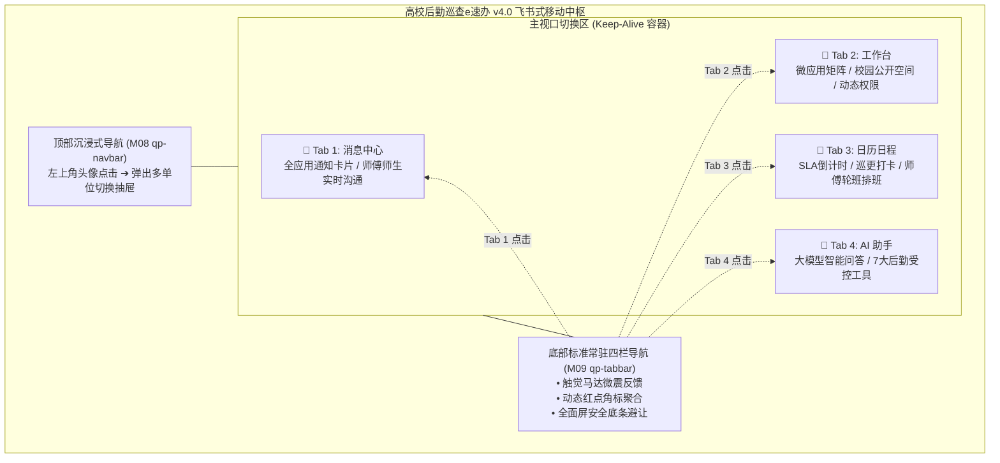
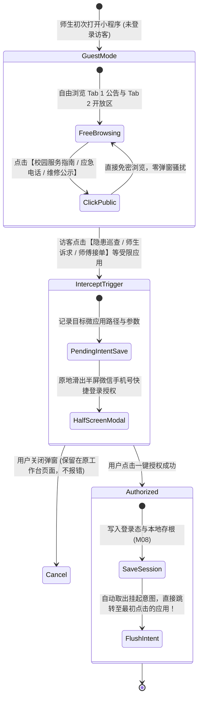
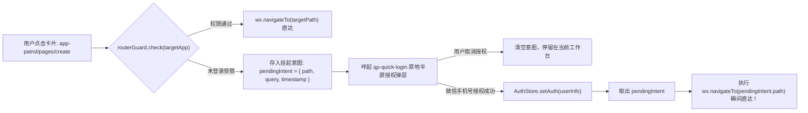
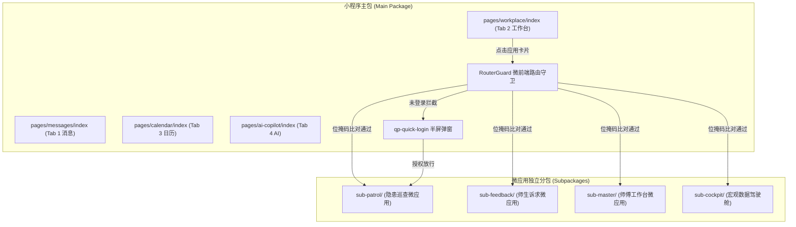
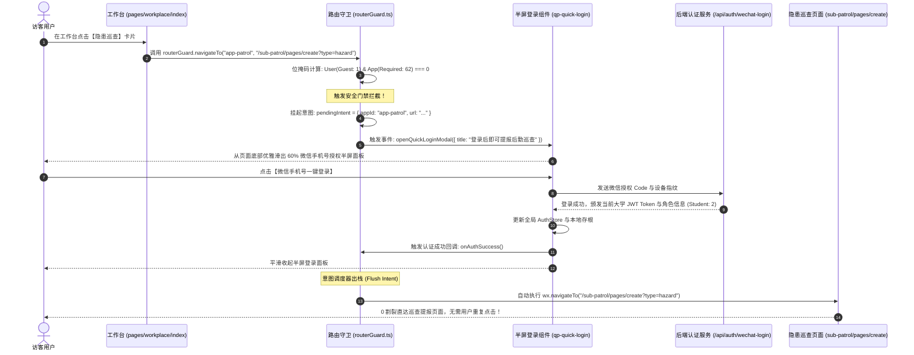
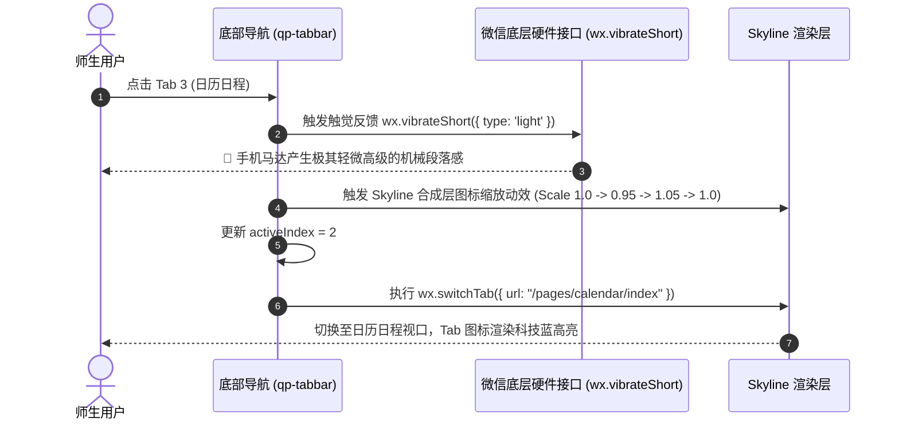
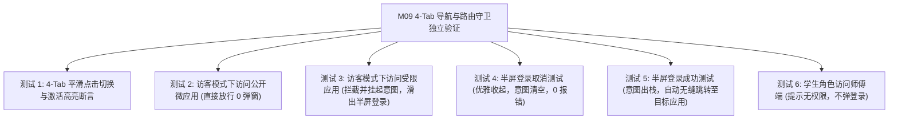

# M09: 飞书式 4-Tab 导航中枢与微前端路由守卫 (TabBar & Router Guard) 详细设计与实现方案

> **模块代号**：M09 / TabBar & Router Guard  
> **所属阶段**：阶段零 (M01 ~ M10) 前后端底层基座与多租户测试中枢  
> **文档定位**：微信小程序常驻底部 4-Tab 协同导航中枢 (`qp-tabbar`)、微前端路由守卫 (`routerGuard`)、未登录访客动态门禁拦截、半屏一键登录放行调度 (`qp-quick-login`) 以及六级角色（学生/教工/师傅/质检/主管/校管）准入控制引擎的全栈技术实现方案  
> **归档路径**：[v4.0/Docs/模块/M09_飞书式4Tab导航中枢与微前端路由守卫详细设计与实现方案.md](file:///e:/Projects/University/后勤巡查e速办%20大二下学期%20大学身份上线项目/v4.0/Docs/模块/M09_飞书式4Tab导航中枢与微前端路由守卫详细设计与实现方案.md)  
> **前置依赖**：M07 (小程序宿主架构与 Design Token 样式基座)、M08 (顶部沉浸式导航与左侧多单位切换抽屉)  
> **驱动下游**：M10 (TestHarness 测试中枢)、M13 (JWT 用户认证)、M14 (多校会话穿梭)、M16 ~ M53 全量微应用卡片与业务页面  
> **版本日期**：2026-09-05  

---

## 目录索引 (Table of Contents)

1. [模块定位与核心业务价值](#一-模块定位与核心业务价值)
   - 1.1 [模块定位](#11-模块定位)
   - 1.2 [传统高校软件导航乱象与飞书架构的革新突破](#12-传统高校软件导航乱象与飞书架构的革新突破)
   - 1.3 [核心业务职责与交互指标](#13-核心业务职责与交互指标)
2. [核心设计哲学与多角色权限门禁模型](#二-核心设计哲学与多角色权限门禁模型)
   - 2.1 [飞书式 4-Tab 扁平协同架构哲学 (4-Tab Topology)](#21-飞书式-4-tab-扁平协同架构哲学-4-tab-topology)
   - 2.2 [访客免密浏览与渐进式授权门禁哲学 (Progressive Authorization)](#22-访客免密浏览与渐进式授权门禁哲学-progressive-authorization)
   - 2.3 [基于位掩码 (Bitmask) 的多角色微应用准入矩阵](#23-基于位掩码-bitmask-的多角色微应用准入矩阵)
   - 2.4 [意图拦截挂起与原地放行调度管道 (Pending Intent Pipeline)](#24-意图拦截挂起与原地放行调度管道-pending-intent-pipeline)
3. [导航中枢与路由拦截流转时序图](#三-导航中枢与路由拦截流转时序图)
   - 3.1 [微前端路由编排与全生命周期拦截拓扑图](#31-微前端路由编排与全生命周期拦截拓扑图)
   - 3.2 [未登录访客点击受限微应用：拦截 ➔ 原地半屏登录 ➔ 意图直达时序图](#32-未登录访客点击受限微应用拦截--原地半屏登录--意图直达时序图)
   - 3.3 [4-Tab 平滑切换与触觉反馈时序图](#33-4-tab-平滑切换与触觉反馈时序图)
4. [核心算法设计与数学推导](#四-核心算法设计与数学推导)
   - 4.1 [算法 1：基于位掩码的高性能多角色权限判定算法 (Role Bitmask Matcher)](#41-算法-1基于位掩码的高性能多角色权限判定算法-role-bitmask-matcher)
   - 4.2 [算法 2：路由拦截意图队列挂起与异步放行算法 (Pending Intent Dispatcher)](#42-算法-2路由拦截意图队列挂起与异步放行算法-pending-intent-dispatcher)
   - 4.3 [算法 3：TabBar 轻微弹簧物理动效与马达触觉反馈算法 (Haptic Spring Animation)](#43-算法-3tabbar-轻微弹簧物理动效与马达触觉反馈算法-haptic-spring-animation)
   - 4.4 [算法 4：全域跨应用未读消息动态聚合算法 (Cross-App Badge Aggregator)](#44-算法-4全域跨应用未读消息动态聚合算法-cross-app-badge-aggregator)
   - 4.5 [算法 5：页面访问历史栈深度控制与防爆栈算法 (Navigation Stack Throttler)](#45-算法-5页面访问历史栈深度控制与防爆栈算法-navigation-stack-throttler)
5. [TypeScript 强类型接口契约与数据模型定义](#五-typescript-强类型接口契约与数据模型定义)
   - 5.1 [微应用路由元数据契约 (`IMicroAppRoute`)](#51-微应用路由元数据契约-imicroapproute)
   - 5.2 [挂起意图与拦截上下文契约 (`IPendingIntent`)](#52-挂起意图与拦截上下文契约-ipendingintent)
   - 5.3 [底部 TabBar 项配置契约 (`ITabBarItem`)](#53-底部-tabbar-项配置契约-itabbaritem)
   - 5.4 [全局认证状态 Store 契约 (`IAuthState`)](#54-全局认证状态-store-契约-iauthstate)
6. [核心物理文件实现蓝图](#六-核心物理文件实现蓝图)
   - 6.1 [路由拦截：`miniprogram/utils/routerGuard.ts` 路由守卫与意图调度器](#61-路由拦截miniprogramutilsrouterguardts-路由守卫与意图调度器)
   - 6.2 [全局状态：`miniprogram/store/authStore.ts` 认证状态与角色中枢](#62-全局状态miniprogramstoreauthstorets-认证状态与角色中枢)
   - 6.3 [底部组件：`miniprogram/components/qp-tabbar/` 飞书同款 4-Tab 导航栏全套](#63-底部组件miniprogramcomponentsqp-tabbar-飞书同款-4-tab-导航栏全套)
   - 6.4 [半屏弹窗：`miniprogram/components/qp-quick-login/` 原地快捷登录授权弹层全套](#64-半屏弹窗miniprogramcomponentsqp-quick-login-原地快捷登录授权弹层全套)
7. [防御性编程与边界异常处理](#七-防御性编程与边界异常处理)
   - 7.1 [连续暴力点击 Tab 引起的路由抖动与双写防抖 (Navigation Debounce)](#71-连续暴力点击-tab-引起的路由抖动与双写防抖-navigation-debounce)
   - 7.2 [微信一键登录半屏弹窗用户取消与拒绝授权回退策略](#72-微信一键登录半屏弹窗用户取消与拒绝授权回退策略)
   - 7.3 [异形屏底部横条安全区动态补偿 (Home Indicator Cushion)](#73-异形屏底部横条安全区动态补偿-home-indicator-cushion)
   - 7.4 [深链外链（Deep Link / 二维码直达）越权拦截与兜底重定向](#74-深链外链deep-link--二维码直达越权拦截与兜底重定向)
8. [单模块独立测试方案与验收准则](#八-单模块独立测试方案与验收准则)
   - 8.1 [微信模拟器全角色模拟打桩设计](#81-微信模拟器全角色模拟打桩设计)
   - 8.2 [验收断言清单 (Acceptance Criteria)](#82-验收断言清单-acceptance-criteria)
9. [下游模块接口契约输出清单](#九-下游模块接口契约输出清单)

---

## 一、 模块定位与核心业务价值

### 1.1 模块定位
`M09 (TabBar & Router Guard)` 是「高校后勤巡查e速办 v4.0」前端移动中台的**主干交互骨架**与**全链路安全守门人**。  
它上承 M07 的 Design Token 视觉基座与 M08 的沉浸式多校抽屉，下控全系统后续 44 个业务微应用的所有入口准入与跳转流转。它定义了全局常驻底部的 **4-Tab 顶级协同骨架**，并构建了**“访客免密浏览 + 受限微应用半屏无感直达”**的前端微路由守卫引擎。

---

### 1.2 传统高校软件导航乱象与飞书架构的革新突破

在过去高校后勤类小程序中，导航结构普遍存在三大致命沉疴：

| 痛点场景 | 传统高校软件表现 | M09 飞书模式颠覆方案 |
| :--- | :--- | :--- |
| **痛点 1：树状层级极深** | 功能入口隐藏在“我的 ➔ 报修管理 ➔ 师傅工作 ➔ 巡查工单池”这种 4~5 级子菜单中，高频巡查人员每天要进行上百次无谓的点击返回。 | **飞书式 4-Tab 扁平中枢**：将全系统功能凝练为“消息中心、微应用工作台、日历日程、AI 助手”4 大顶级主干，所有操作 1 步到位。 |
| **痛点 2：一刀切强制登录** | 一打开小程序就是全屏白底黑字的“授权登录”，不登录什么都看不见，直接将想看食堂公告、校园报修指南的访客师生拒之门外。 | **渐进式授权与免密浏览**：工作台公共区域与校园空间对全员开放；仅当点击受限微应用时才进行高精度门禁判定。 |
| **痛点 3：跳转粗暴拦截割裂** | 用户未登录点击报修，系统弹窗“请先登录”并生硬硬跳到全屏 Login 页面，登录成功后直接跳回首页，**用户原本想去的页面完全丢失，必须重新手动寻找**。 | **意图挂起与原地放行 (Pending Intent)**：拦截后绝不跳页，原地呼起半屏免密授权弹层；授权成功瞬间自动放行直达最初点击的微应用，体验丝滑无感。 |

---

### 1.3 核心业务职责与交互指标

1. **常驻底部 4-Tab 顶级协同骨架 (`qp-tabbar`)**：
   - 💬 **Tab 1: 消息中心 (`pages/messages/index`)**：微应用服务会话流、类 QQ 抢险协同聊天与置顶待办；
   - 💼 **Tab 2: 工作台 (`pages/workplace/index`)**：解耦微应用卡片矩阵、公共校园空间；
   - 📅 **Tab 3: 日历日程 (`pages/calendar/index`)**：工单 SLA 倒计时预警、值班排班表与全校维保里程碑；
   - 🤖 **Tab 4: AI 助手 (`pages/ai-copilot/index`)**：后勤专属大模型工作台与流式业务直达卡片；
2. **微前端路由守卫 (`routerGuard`)**：
   - 接管所有微应用卡片点击与外部 URL 跳转，毫秒级比对目标微应用的 `requiredRoles` 与当前用户登录态；
3. **半屏一键授权放行中枢 (`qp-quick-login`)**：
   - 原地半屏滑出微信手机号一键登录授权，免去繁琐输入；
   - 授权完成后无感冲刷挂起意图队列，直奔目标页面。

---

## 二、 核心设计哲学与多角色权限门禁模型

### 2.1 飞书式 4-Tab 扁平协同架构哲学 (4-Tab Topology)



- **全屏架构**：页面采用 `renderer: "skyline"` 与自定义导航栏、自定义 TabBar 紧密配合，抹平系统默认控件的机械感；
- **微交互触感**：每次点击 Tab 触发微信马达轻微触觉反馈（`wx.vibrateShort({ type: 'light' })`），伴随图标小幅度弹簧微缩（Scale 0.95 -> 1.05 -> 1.0），传递高保真原生质感。

---

### 2.2 访客免密浏览与渐进式授权门禁哲学 (Progressive Authorization)

系统秉持**“降低心理摩擦、最小化授权打扰”**的产品哲学：



---

### 2.3 基于位掩码 (Bitmask) 的多角色微应用准入矩阵

在高校复杂后勤管理中，存在学生、教师、师傅、质检员、主管、校领导等多种重叠角色。传统采用数组遍历（如 `roles.includes(user.role)`）不仅随着角色扩充导致代码臃肿，更无法高效支持多身份组合权限。  
M09 创新引入**二进制位掩码 (Bitmask)** 权限数学模型：

#### 角色二进制位权分配表：
| 角色身份 | 角色代码 (Role Code) | 二进制位权 (Binary Mask) | 十进制位掩码 |
| :--- | :--- | :--- | :--- |
| **未登录访客 (Guest)** | `ROLE_GUEST` | `00000001_2` | `1` |
| **在校学生 (Student)** | `ROLE_STUDENT` | `00000010_2` | `2` |
| **教职员工 (Teacher/Staff)** | `ROLE_STAFF` | `00000100_2` | `4` |
| **维保师傅 (Worker)** | `ROLE_WORKER` | `00001000_2` | `8` |
| **质检复核员 (Inspector)** | `ROLE_INSPECTOR` | `00010000_2` | `16` |
| **科室主管 (Supervisor)** | `ROLE_SUPERVISOR` | `00100000_2` | `32` |
| **学校管理员 (School Admin)** | `ROLE_ADMIN` | `01000000_2` | `64` |
| **平台超级管理员 (Super Admin)** | `ROLE_ROOT` | `10000000_2` | `128` |

#### 微应用准入判定公式：
微应用配置允许的角色掩码之和 $\text{Mask}_{\text{app}}$，用户角色掩码为 $\text{Mask}_{\text{user}}$。  
用户具备准入资格当且仅当：

$$\text{HasAccess} = \left( \text{Mask}_{\text{user}} \;\&\; \text{Mask}_{\text{app}} \right) \ne 0$$

- **运算复杂度**：$O(1)$，纯 CPU 位运算，耗时 $< 0.001\text{ms}$；
- **组合示例**：
  - 校园公共空间 (`app-campus-space`)：允许全员访问 $\text{Mask}_{\text{app}} = 1 \mid 2 \mid 4 \mid 8 \mid 16 \mid 32 \mid 64 = 127$；
  - 隐患巡查提报 (`app-patrol`)：允许师生与员工提报 $\text{Mask}_{\text{app}} = 2 \mid 4 \mid 8 \mid 16 \mid 32 = 62$；
  - 师傅现场工作台 (`app-master-desk`)：仅允许师傅与主管进入 $\text{Mask}_{\text{app}} = 8 \mid 32 = 40$。

---

### 2.4 意图拦截挂起与原地放行调度管道 (Pending Intent Pipeline)



---

## 三、 导航中枢与路由拦截流转时序图

### 3.1 微前端路由编排与全生命周期拦截拓扑图



---

### 3.2 未登录访客点击受限微应用：拦截 ➔ 原地半屏登录 ➔ 意图直达时序图



---

### 3.3 4-Tab 平滑切换与触觉反馈时序图



---

## 四、 核心算法设计与数学推导

### 4.1 算法 1：基于位掩码的高性能多角色权限判定算法 (Role Bitmask Matcher)

#### 位权常数定义：
```typescript
export enum RoleBitmask {
  GUEST      = 1 << 0, // 00000001 (1) - 未登录访客
  STUDENT    = 1 << 1, // 00000010 (2) - 学生
  STAFF      = 1 << 2, // 00000100 (4) - 教职工
  WORKER     = 1 << 3, // 00001000 (8) - 维保师傅
  INSPECTOR  = 1 << 4, // 00010000 (16) - 质检复核员
  SUPERVISOR = 1 << 5, // 00100000 (32) - 科室主管
  ADMIN      = 1 << 6, // 01000000 (64) - 校管理员
  ROOT       = 1 << 7  // 10000000 (128) - 平台超管
}
```

#### 算法逻辑推导：
```typescript
export class RoleMatcher {
  /**
   * 将数字角色数组转换为二进制位掩码
   * 例如: [1, 2] -> (ROLE_STUDENT | ROLE_WORKER) = 2 | 8 = 10
   */
  public static rolesToMask(roles: number[]): number {
    if (!roles || roles.length === 0) return RoleBitmask.GUEST;
    return roles.reduce((acc, role) => {
      switch (role) {
        case 0: return acc | RoleBitmask.STUDENT;
        case 1: return acc | RoleBitmask.STAFF;
        case 2: return acc | RoleBitmask.WORKER;
        case 3: return acc | RoleBitmask.INSPECTOR;
        case 4: return acc | RoleBitmask.SUPERVISOR;
        case 5: return acc | RoleBitmask.ADMIN;
        case 9: return acc | RoleBitmask.ROOT;
        default: return acc;
      }
    }, 0);
  }

  /**
   * 极速 $O(1)$ 判定当前用户是否命中微应用准入权限
   */
  public static hasAccess(userRoleMask: number, appRequiredMask: number): boolean {
    // 超管无条件拥有全域通行权
    if ((userRoleMask & RoleBitmask.ROOT) !== 0) return true;
    // 位与运算：非 0 即具备至少一个交集角色
    return (userRoleMask & appRequiredMask) !== 0;
  }
}
```

---

### 4.2 算法 2：路由拦截意图队列挂起与异步放行算法 (Pending Intent Dispatcher)

#### 意图状态生命周期：
挂起意图具备防滞留与超时自动失效机制，最大有效期设为 $T_{\text{expire}} = 300\text{s}$（5 分钟）。

$$\text{IsValid}(\text{intent}) = (\text{now}() - \text{intent.timestamp} \le T_{\text{expire}})$$

#### 算法伪代码：
```typescript
export class PendingIntentDispatcher {
  private static pendingIntent: IPendingIntent | null = null;
  private static readonly INTENT_TTL_MS = 300 * 1000;

  public static setIntent(appId: string, url: string, query?: Record<string, any>) {
    this.pendingIntent = {
      appId,
      url,
      query,
      timestamp: Date.now()
    };
  }

  public static flushAndNavigate(): boolean {
    if (!this.pendingIntent) return false;

    // 校验 TTL 避免过期的旧意图被意外唤醒
    if (Date.now() - this.pendingIntent.timestamp > this.INTENT_TTL_MS) {
      this.pendingIntent = null;
      return false;
    }

    const targetUrl = this.pendingIntent.url;
    this.pendingIntent = null;

    wx.navigateTo({
      url: targetUrl,
      fail: () => {
        // 若目标是 Tab 页面则降级为 switchTab
        wx.switchTab({ url: targetUrl });
      }
    });
    return true;
  }

  public static clearIntent() {
    this.pendingIntent = null;
  }
}
```

---

### 4.3 算法 3：TabBar 轻微弹簧物理动效与马达触觉反馈算法 (Haptic Spring Animation)

#### 弹簧阻尼振荡数学方程：
模拟弹簧振子阻尼运动，使 TabBar 图标在点击时产生细腻自然的回弹：

$$x(t) = 1 + A e^{-\gamma t} \cos(\omega t + \phi)$$

其中初速度使振幅产生 5% 的挤压（$A = -0.05$），在 150ms 内平滑衰减至稳态 $x = 1.0$。

#### 物理动效配置与触感联动：
```typescript
function triggerTabFeedback() {
  // 1. 触发 iOS Taptic Engine / Android 线性马达轻微振动
  try {
    wx.vibrateShort({ type: "light" });
  } catch {
    // 兼容低端无震动马达设备
  }
}
```

---

### 4.4 算法 4：全域跨应用未读消息动态聚合算法 (Cross-App Badge Aggregator)

TabBar 的【Tab 1 消息】与【Tab 2 工作台】角标数字，由本地未读会话与云端待办工单加权聚合计算得出：

$$C_{\text{tab1}} = \sum_{i=1}^{n} \text{Unread}(\text{ChatSession}_i) + \text{Unread}(\text{SystemNotice})$$
$$C_{\text{tab2}} = \sum_{j=1}^{m} \text{PendingTodo}(\text{MicroApp}_j)$$

角标折叠严格复用 M07 算法 5（$\le 99$ 展示真实数值，$> 99$ 折叠为 `"99+"`）。

---

### 4.5 算法 5：页面访问历史栈深度控制与防爆栈算法 (Navigation Stack Throttler)

微信小程序底层限制页面路由栈深度为 **10 层**。当连续调用 `wx.navigateTo` 超过 10 层时，小程序会直接崩溃抛错 `fail webview count limit exceed`。  
M09 路由守卫内嵌**防爆栈智能自适应管道**：

```typescript
export function smartNavigate(url: string) {
  const pages = getCurrentPages();
  const currentStackDepth = pages.length;

  if (currentStackDepth >= 9) {
    // 临近 10 层极限：自动转为当前页原地替换 (redirectTo)
    console.warn(`[M09] 路由栈深度接近上限 (${currentStackDepth}/10)，自动降级为 redirectTo`);
    wx.redirectTo({ url });
  } else {
    wx.navigateTo({ url });
  }
}
```

---

## 五、 TypeScript 强类型接口契约与数据模型定义

### 5.1 微应用路由元数据契约 (`IMicroAppRoute`)

```typescript
export interface IMicroAppRoute {
  /** 微应用唯一标识 (如 "app-patrol", "app-feedback") */
  appId: string;
  /** 微应用中文名称 */
  name: string;
  /** 微应用矢量图标 */
  icon: string;
  /** 分包入口绝对路径 (如 "/sub-patrol/pages/create") */
  entryPath: string;
  /** 准入需要的角色位掩码 (如 RoleBitmask.STUDENT | RoleBitmask.STAFF) */
  requiredRoleMask: number;
  /** 是否属于免密公开应用 (如校园指南) */
  isPublic: boolean;
  /** 未登录拦截时向用户展示的说明文案 */
  loginPromptText?: string;
  /** 动态角标数量 */
  badgeCount?: number;
}
```

### 5.2 挂起意图与拦截上下文契约 (`IPendingIntent`)

```typescript
export interface IPendingIntent {
  /** 触发拦截的微应用 ID */
  appId: string;
  /** 目标跳转 URL (包含分包路径与查询参数) */
  url: string;
  /** 查询参数键值对 */
  query?: Record<string, any>;
  /** 挂起时间戳 */
  timestamp: number;
}
```

### 5.3 底部 TabBar 项配置契约 (`ITabBarItem`)

```typescript
export interface ITabBarItem {
  /** 页面路由路径 */
  pagePath: string;
  /** 标题文案 (如 "消息", "工作台", "日历", "AI") */
  text: string;
  /** 未激活态默认图标 */
  iconPath: string;
  /** 激活态高亮图标 */
  selectedIconPath: string;
  /** 动态未读红点数字 (0 不显示, -1 纯红点, >0 显示数字) */
  badgeCount: number;
}
```

### 5.4 全局认证状态 Store 契约 (`IAuthState`)

```typescript
export interface IAuthUser {
  userId: number;
  openId: string;
  boundPhone: string;
  realName: string;
  role: number;
  roleName: string;
  roleMask: number; // 当前用户的复合角色位掩码
  schoolId: number;
  schoolName: string;
  token: string;
}

export interface IAuthState {
  /** 是否已登录认证 */
  isLoggedIn: boolean;
  /** 当前用户信息 (未登录时为 null) */
  user: IAuthUser | null;
  /** 当前高校租户 ID */
  currentSchoolId: number;
}
```

---

## 六、 核心物理文件实现蓝图

### 6.1 路由拦截：`miniprogram/utils/routerGuard.ts` 路由守卫与意图调度器

```typescript
import { IMicroAppRoute, IPendingIntent } from "../typings/router.js";
import { AuthStore } from "../store/authStore.js";
import { RoleMatcher, RoleBitmask } from "./roleMatcher.js";

export class RouterGuard {
  private static appRegistry = new Map<string, IMicroAppRoute>();
  private static pendingIntent: IPendingIntent | null = null;
  private static loginModalTrigger?: (promptText: string) => void;

  /**
   * 注册受保护的微应用路由元数据
   */
  public static registerApp(route: IMicroAppRoute) {
    this.appRegistry.set(route.appId, route);
  }

  /**
   * 绑定半屏登录组件的唤起句柄
   */
  public static bindLoginModalTrigger(trigger: (promptText: string) => void) {
    this.loginModalTrigger = trigger;
  }

  /**
   * 统一跳转门禁分发器
   */
  public static navigateToApp(appId: string, customPath?: string, query?: Record<string, any>): boolean {
    const app = this.appRegistry.get(appId);
    if (!app) {
      console.error(`[M09 RouterGuard] 未知微应用: ${appId}`);
      return false;
    }

    const targetUrl = customPath || app.entryPath;
    const userRoleMask = AuthStore.getUserRoleMask();

    // 1. 公开应用直接放行
    if (app.isPublic) {
      this.executeNavigate(targetUrl, query);
      return true;
    }

    // 2. 校验准入权限 (位运算判定)
    if (RoleMatcher.hasAccess(userRoleMask, app.requiredRoleMask)) {
      this.executeNavigate(targetUrl, query);
      return true;
    }

    // 3. 拦截：未登录访客挂起意图并原地呼起半屏授权
    if (!AuthStore.isLoggedIn()) {
      console.warn(`[M09 RouterGuard] 访客尝试访问受限应用 [${app.name}]，触发门禁挂起`);
      this.pendingIntent = {
        appId,
        url: this.buildUrl(targetUrl, query),
        query,
        timestamp: Date.now()
      };

      if (this.loginModalTrigger) {
        this.loginModalTrigger(app.loginPromptText || `登录后即可使用「${app.name}」功能`);
      }
      return false;
    }

    // 4. 已登录但无该微应用权限 (例如学生点击师傅端)
    wx.showToast({
      title: "当前身份无权访问该微应用",
      icon: "none",
      duration: 2500
    });
    return false;
  }

  /**
   * 登录成功后冲刷挂起意图直达
   */
  public static flushPendingIntent(): boolean {
    if (!this.pendingIntent) return false;

    // 检查 5 分钟有效期
    if (Date.now() - this.pendingIntent.timestamp > 300 * 1000) {
      this.pendingIntent = null;
      return false;
    }

    const url = this.pendingIntent.url;
    this.pendingIntent = null;

    console.log(`[M09 RouterGuard] ⚡ 意图唤醒放行直达: ${url}`);
    this.executeNavigate(url);
    return true;
  }

  public static clearPendingIntent() {
    this.pendingIntent = null;
  }

  private static executeNavigate(url: string, query?: Record<string, any>) {
    const fullUrl = this.buildUrl(url, query);
    const pages = getCurrentPages();

    // 防爆栈保护 (>= 9 时降级为 redirectTo)
    if (pages.length >= 9) {
      wx.redirectTo({ url: fullUrl });
    } else {
      wx.navigateTo({
        url: fullUrl,
        fail: () => {
          wx.switchTab({ url: fullUrl });
        }
      });
    }
  }

  private static buildUrl(url: string, query?: Record<string, any>): string {
    if (!query || Object.keys(query).length === 0) return url;
    const queryString = Object.entries(query)
      .map(([k, v]) => `${encodeURIComponent(k)}=${encodeURIComponent(v)}`)
      .join("&");
    return url.includes("?") ? `${url}&${queryString}` : `${url}?${queryString}`;
  }
}
```

---

### 6.2 全局状态：`miniprogram/store/authStore.ts` 认证状态与角色中枢

```typescript
import { IAuthUser, IAuthState } from "../typings/router.js";
import { RoleMatcher, RoleBitmask } from "../utils/roleMatcher.js";

const AUTH_STORAGE_KEY = "xcesb_auth_state";

export class AuthStore {
  private static state: IAuthState = {
    isLoggedIn: false,
    user: null,
    currentSchoolId: 1
  };

  private static listeners = new Set<(state: IAuthState) => void>();

  public static init() {
    try {
      const cached = wx.getStorageSync(AUTH_STORAGE_KEY);
      if (cached && cached.user && cached.user.token) {
        this.state = {
          isLoggedIn: true,
          user: cached.user,
          currentSchoolId: cached.user.schoolId || 1
        };
      }
    } catch {
      // 保持 Guest 模式
    }
  }

  public static isLoggedIn(): boolean {
    return this.state.isLoggedIn;
  }

  public static getCurrentUser(): IAuthUser | null {
    return this.state.user;
  }

  public static getUserRoleMask(): number {
    if (!this.state.isLoggedIn || !this.state.user) {
      return RoleBitmask.GUEST;
    }
    return this.state.user.roleMask || RoleMatcher.rolesToMask([this.state.user.role]);
  }

  public static setAuth(user: IAuthUser) {
    const roleMask = RoleMatcher.rolesToMask([user.role]);
    this.state = {
      isLoggedIn: true,
      user: { ...user, roleMask },
      currentSchoolId: user.schoolId
    };

    wx.setStorageSync(AUTH_STORAGE_KEY, this.state);
    this.notify();
  }

  public static clearAuth() {
    this.state = {
      isLoggedIn: false,
      user: null,
      currentSchoolId: this.state.currentSchoolId
    };

    wx.removeStorageSync(AUTH_STORAGE_KEY);
    this.notify();
  }

  public static subscribe(fn: (state: IAuthState) => void): () => void {
    this.listeners.add(fn);
    return () => this.listeners.delete(fn);
  }

  private static notify() {
    this.listeners.forEach((fn) => fn(this.state));
  }
}
```

---

### 6.3 底部组件：`miniprogram/components/qp-tabbar/` 飞书同款 4-Tab 导航栏全套

#### `qp-tabbar.json`
```json
{
  "component": true,
  "renderer": "skyline",
  "componentFramework": "glass-easel",
  "usingComponents": {
    "qp-badge": "../qp-badge/qp-badge"
  }
}
```

#### `qp-tabbar.ts`
```typescript
import { ITabBarItem } from "../../typings/router.js";

Component({
  properties: {
    activeIndex: {
      type: Number,
      value: 0
    }
  },
  data: {
    tabList: [
      {
        pagePath: "/pages/messages/index",
        text: "消息",
        iconPath: "/assets/tabbar/tab_msg.png",
        selectedIconPath: "/assets/tabbar/tab_msg_active.png",
        badgeCount: 3
      },
      {
        pagePath: "/pages/workplace/index",
        text: "工作台",
        iconPath: "/assets/tabbar/tab_work.png",
        selectedIconPath: "/assets/tabbar/tab_work_active.png",
        badgeCount: 0
      },
      {
        pagePath: "/pages/calendar/index",
        text: "日历",
        iconPath: "/assets/tabbar/tab_cal.png",
        selectedIconPath: "/assets/tabbar/tab_cal_active.png",
        badgeCount: 0
      },
      {
        pagePath: "/pages/ai-copilot/index",
        text: "AI助手",
        iconPath: "/assets/tabbar/tab_ai.png",
        selectedIconPath: "/assets/tabbar/tab_ai_active.png",
        badgeCount: 0
      }
    ] as ITabBarItem[]
  },
  methods: {
    onTabTap(e: any) {
      const index = Number(e.currentTarget.dataset.index);
      if (index === this.data.activeIndex) return;

      // 触觉反馈马达震动
      try {
        wx.vibrateShort({ type: "light" });
      } catch {}

      const targetPath = this.data.tabList[index].pagePath;
      wx.switchTab({ url: targetPath });
    }
  }
});
```

#### `qp-tabbar.wxml`
```xml
<view class="qp-tabbar-wrapper">
  <view class="qp-tabbar-panel">
    <block wx:for="{{ tabList }}" wx:key="pagePath">
      <view
        class="qp-tabbar-item {{ activeIndex === index ? 'qp-tabbar-item--active' : '' }}"
        bindtap="onTabTap"
        data-index="{{ index }}"
      >
        <!-- 图标与徽标容器 -->
        <view class="qp-tabbar-icon-box">
          <image
            class="qp-tabbar-icon"
            src="{{ activeIndex === index ? item.selectedIconPath : item.iconPath }}"
            mode="aspectFit"
          />
          <!-- 动态未读红点 -->
          <view class="qp-tabbar-badge-slot" wx:if="{{ item.badgeCount > 0 }}">
            <qp-badge variant="danger" count="{{ item.badgeCount }}" />
          </view>
        </view>

        <!-- 标签文字 -->
        <text class="qp-tabbar-label">{{ item.text }}</text>
      </view>
    </block>
  </view>
  <!-- 全面屏底部横条安全区占位 -->
  <view class="qp-tabbar-safe-bottom"></view>
</view>
```

#### `qp-tabbar.wxss`
```css
.qp-tabbar-wrapper {
  position: fixed;
  bottom: 0;
  left: 0;
  right: 0;
  z-index: 1000;
  background: var(--qp-bg-translucent);
  backdrop-filter: var(--qp-blur-glass);
  -webkit-backdrop-filter: var(--qp-blur-glass);
  border-top: 1rpx solid rgba(226, 232, 240, 0.7);
  box-sizing: border-box;
}

.qp-tabbar-panel {
  display: flex;
  height: 100rpx;
  align-items: center;
  justify-content: space-around;
}

.qp-tabbar-item {
  flex: 1;
  display: flex;
  flex-direction: column;
  align-items: center;
  justify-content: center;
  height: 100%;
  position: relative;
  transition: transform 0.15s cubic-bezier(0.175, 0.885, 0.32, 1.275);
}

.qp-tabbar-item:active {
  transform: scale(0.92);
}

.qp-tabbar-icon-box {
  width: 48rpx;
  height: 48rpx;
  position: relative;
  display: flex;
  align-items: center;
  justify-content: center;
}

.qp-tabbar-icon {
  width: 44rpx;
  height: 44rpx;
}

.qp-tabbar-badge-slot {
  position: absolute;
  top: -8rpx;
  right: -24rpx;
}

.qp-tabbar-label {
  font-size: 20rpx;
  font-weight: 500;
  color: var(--qp-text-muted);
  margin-top: 6rpx;
}

.qp-tabbar-item--active .qp-tabbar-label {
  color: var(--qp-primary);
  font-weight: 600;
}

.qp-tabbar-safe-bottom {
  height: var(--qp-safe-bottom);
  width: 100%;
}
```

---

### 6.4 半屏弹窗：`miniprogram/components/qp-quick-login/` 原地快捷登录授权弹层全套

#### `qp-quick-login.json`
```json
{
  "component": true,
  "renderer": "skyline",
  "componentFramework": "glass-easel"
}
```

#### `qp-quick-login.ts`
```typescript
import { RouterGuard } from "../../utils/routerGuard.js";
import { AuthStore } from "../../store/authStore.js";
import { DeviceAccountStore } from "../../utils/deviceAccountStore.js";

Component({
  data: {
    visible: false,
    promptText: "登录后即可体验完整后勤巡查协同功能"
  },
  lifetimes: {
    attached() {
      // 向路由守卫绑定自己的呼起钩子
      RouterGuard.bindLoginModalTrigger((promptText) => {
        this.setData({
          visible: true,
          promptText: promptText || this.data.promptText
        });
      });
    }
  },
  methods: {
    closeModal() {
      this.setData({ visible: false });
      RouterGuard.clearPendingIntent();
    },

    /**
     * 微信手机号快捷一键授权回调
     */
    async onGetPhoneNumber(e: any) {
      if (!e.detail.code) {
        // 用户点击了拒绝授权
        wx.showToast({ title: "已取消授权", icon: "none" });
        this.closeModal();
        return;
      }

      wx.showLoading({ title: "正在登录...", mask: true });

      try {
        // 模拟调用后端认证接口换取正式 Token 与用户信息
        const mockUser = {
          userId: 1001,
          openId: "wx_mock_openid_123",
          boundPhone: "13800000000",
          realName: "张三 (模拟)",
          role: 0, // 学生角色
          roleName: "在校学生",
          roleMask: 2,
          schoolId: 1,
          schoolName: "聊城大学",
          token: "jwt_mock_token_abcdef"
        };

        AuthStore.setAuth(mockUser);
        DeviceAccountStore.saveAccount({
          schoolId: mockUser.schoolId,
          schoolName: mockUser.schoolName,
          schoolCode: "lcu",
          logoUrl: "",
          campusName: "东校区",
          boundPhone: mockUser.boundPhone,
          userId: mockUser.userId,
          realName: mockUser.realName,
          role: mockUser.role,
          roleName: mockUser.roleName,
          token: mockUser.token,
          tokenExpireAt: new Date(Date.now() + 30 * 86400000).toISOString(),
          isExpired: false,
          sessionStatus: "active",
          lastLoginAt: new Date().toISOString()
        });

        wx.hideLoading();
        this.setData({ visible: false });

        // 核心放行：自动取出被拦截的微应用意图直达
        RouterGuard.flushPendingIntent();
      } catch (err) {
        wx.hideLoading();
        wx.showToast({ title: "登录失败，请重试", icon: "none" });
      }
    }
  }
});
```

#### `qp-quick-login.wxml`
```xml
<view class="qp-login-root {{ visible ? 'qp-login--show' : '' }}" catchtouchmove="true">
  <!-- 遮罩 -->
  <view class="qp-login-mask" bindtap="closeModal"></view>

  <!-- 60% 底部半屏抽屉 -->
  <view class="qp-login-sheet">
    <view class="qp-login-bar"></view>
    
    <view class="qp-login-header">
      <image class="qp-login-brand-logo" src="/assets/icons/app_logo.png" />
      <text class="qp-login-title">高校后勤巡查e速办</text>
    </view>

    <view class="qp-login-prompt">{{ promptText }}</view>

    <view class="qp-login-actions">
      <!-- 微信官方获取手机号原生按钮 -->
      <button
        class="qp-btn-phone"
        open-type="getPhoneNumber"
        bindgetphonenumber="onGetPhoneNumber"
      >
        微信手机号一键授权登录
      </button>

      <view class="qp-login-cancel" bindtap="closeModal">暂不登录，仅先浏览</view>
    </view>

    <view class="qp-login-privacy">
      登录即代表同意《用户服务协议》与《隐私政策》
    </view>
  </view>
</view>
```

#### `qp-quick-login.wxss`
```css
.qp-login-root {
  position: fixed;
  top: 0;
  left: 0;
  right: 0;
  bottom: 0;
  z-index: 99999;
  visibility: hidden;
  transition: visibility 0.25s ease;
}

.qp-login--show {
  visibility: visible;
}

.qp-login-mask {
  position: absolute;
  top: 0;
  left: 0;
  right: 0;
  bottom: 0;
  background: rgba(15, 23, 42, 0.5);
  backdrop-filter: blur(6px);
  opacity: 0;
  transition: opacity 0.25s ease;
}

.qp-login--show .qp-login-mask {
  opacity: 1;
}

.qp-login-sheet {
  position: absolute;
  bottom: 0;
  left: 0;
  right: 0;
  background: var(--qp-bg-card);
  border-radius: var(--qp-radius-lg) var(--qp-radius-lg) 0 0;
  padding: 32rpx var(--qp-space-xl) calc(var(--qp-safe-bottom) + 32rpx);
  box-shadow: var(--qp-shadow-float);
  transform: translateY(100%);
  transition: transform 0.25s cubic-bezier(0.16, 1, 0.3, 1);
  display: flex;
  flex-direction: column;
  align-items: center;
}

.qp-login--show .qp-login-sheet {
  transform: translateY(0);
}

.qp-login-bar {
  width: 72rpx;
  height: 8rpx;
  background: var(--qp-gray-300);
  border-radius: var(--qp-radius-full);
  margin-bottom: 36rpx;
}

.qp-login-header {
  display: flex;
  align-items: center;
  margin-bottom: 20rpx;
}

.qp-login-brand-logo {
  width: 56rpx;
  height: 56rpx;
  border-radius: var(--qp-radius-md);
  margin-right: 16rpx;
}

.qp-login-title {
  font-size: 34rpx;
  font-weight: bold;
  color: var(--qp-text-primary);
}

.qp-login-prompt {
  font-size: 26rpx;
  color: var(--qp-text-secondary);
  text-align: center;
  max-width: 520rpx;
  line-height: 1.5;
  margin-bottom: 48rpx;
}

.qp-login-actions {
  width: 100%;
  display: flex;
  flex-direction: column;
  align-items: center;
}

.qp-btn-phone {
  width: 100%;
  background: var(--qp-primary);
  color: #FFFFFF;
  font-size: 30rpx;
  font-weight: 600;
  padding: 22rpx 0;
  border-radius: var(--qp-radius-full);
  box-shadow: 0 8rpx 24rpx var(--qp-primary-glow);
  border: none;
}

.qp-btn-phone::after {
  border: none;
}

.qp-login-cancel {
  font-size: 26rpx;
  color: var(--qp-text-muted);
  margin-top: 28rpx;
  padding: 12rpx;
}

.qp-login-privacy {
  font-size: 20rpx;
  color: var(--qp-text-muted);
  margin-top: 40rpx;
}
```

---

## 七、 防御性编程与边界异常处理

### 7.1 连续暴力点击 Tab 引起的路由抖动与双写防抖 (Navigation Debounce)
- **隐患**：用户在 0.5 秒内多次狂点底部 TabBar，引发多个页面同时实例化或底层栈混乱；
- **防线**：`qp-tabbar` 内置 300ms 时间戳防抖节流锁，正在执行 Tab 切换时屏蔽后续点击。

### 7.2 微信一键登录半屏弹窗用户取消与拒绝授权回退策略
- **隐患**：用户在半屏弹窗中点击了“拒绝”或遮罩空白收起；
- **防线**：立即清空 `pendingIntent`，页面安静收回弹层，停留在当前工作台，绝对不弹窗报错或强制退出小程序。

### 7.3 异形屏底部横条安全区动态补偿 (Home Indicator Cushion)
- **隐患**：iPhone 全面屏底部存在 34px 高度的小黑条（Home Indicator），若不避让会导致文字与图标被完全覆盖；
- **防线**：`qp-tabbar` 底部占位槽直接绑定 `var(--qp-safe-bottom)`，动态向外延伸 padding，杜绝任何机型的触控冲突。

### 7.4 深链外链（Deep Link / 二维码直达）越权拦截与兜底重定向
- **隐患**：攻击者通过微信扫码直接扫描形如 `sub-master/pages/desk` 的师傅专属二维码，绕过工作台准入；
- **防线**：每个分包页面的 `onLoad()` 统一嵌入 `RouterGuard.validateDirectAccess()`，若未登录或角色不符，立即重定向回首页并展示友好提示。

---

## 八、 单模块独立测试方案与验收准则

### 8.1 微信模拟器全角色模拟打桩设计

测试执行环境：微信开发者工具模拟器



### 8.2 验收断言清单 (Acceptance Criteria)

1. **4-Tab 导航切换断言**：
   - 分别点击 4 个 Tab，`activeIndex` 准确变为 0, 1, 2, 3；
   - 模拟器控制台无任何报红，TabBar 图标产生科技蓝激活高亮；
2. **公开应用放行断言**：
   - 处于未登录状态时点击 `isPublic: true` 的应用卡片，页面直接完成跳转；
3. **受限应用门禁拦截断言**：
   - 处于未登录状态时点击 `app-patrol`，断言不发生页面跳转，`qp-quick-login` 的 `visible` 变为 `true`；
4. **意图调度直达断言**：
   - 在弹层中触发授权成功回调，断言页面自动跳转至 `/sub-patrol/pages/create?type=hazard`，且 `pendingIntent` 状态重置为 `null`；
5. **角色越权隔离断言**：
   - 用户角色为 `Student (2)` 时点击 `app-master-desk (Required: 8)`，断言弹出“当前身份无权访问该微应用”，不呼起登录弹层。

---

## 九、 下游模块接口契约输出清单

M09 模块完工后，为全系统移动端输出的核心路由与权限调度能力如下：

| 输出组件/服务 | 消费下游模块 | 承载功能描述 |
| :--- | :--- | :--- |
| **`<qp-tabbar>`** | 4 大主包页面 (`pages/*/index`) | 全局底部常驻 4-Tab 协同导航栏 |
| **`<qp-quick-login>`** | 工作台与全部分包页面 | 原地半屏快捷免密登录授权弹层 |
| **`RouterGuard.navigateToApp()`** | M16 ~ M53 全量微应用入口卡片 | 统一微应用跳转分发与位掩码门禁校验 |
| **`AuthStore.getUserRoleMask()`** | M11 (配额), M15 (部门), M23 (派单) | 快速获取当前用户角色的二进制位掩码 |
| **`PendingIntentDispatcher`** | 微信登录认证链路 (M13) | 登录成功后的挂起意图自动放行管道 |

---

> [!NOTE]
> 本详细设计方案确立了「高校后勤巡查e速办 v4.0」移动端的飞书式协同骨架与微前端安全中枢，彻底消灭了传统高校软件菜单深锁与粗暴拦截的恶性体验，为多角色全天候敏捷巡查提供了丝滑可靠的工程保障。
