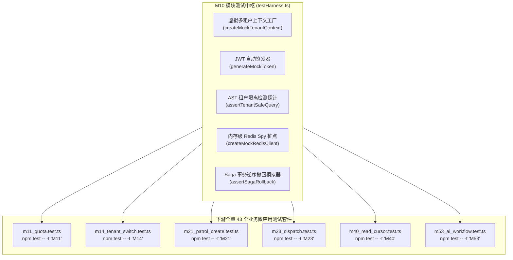
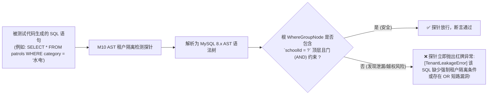
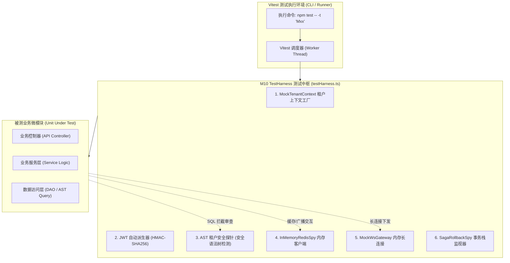
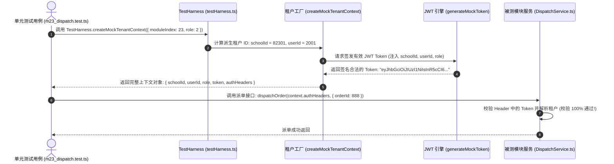
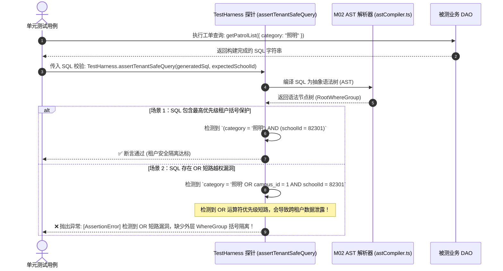
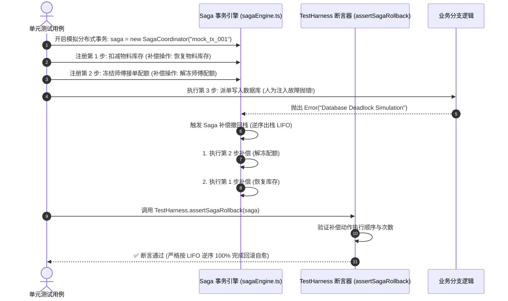
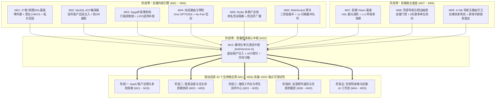

# M10: 模块化单元测试与 Mock 桩点测试中枢 (Test Harness Substrate) 详细设计与实现方案

> **模块代号**：M10 / Test Harness Substrate  
> **所属阶段**：阶段零 (M01 ~ M10) 前后端底层基座与多租户测试中枢 (**阶段零收官枢纽**)  
> **文档定位**：全系统渐进式独立测试的核心引擎、多租户测试中枢 (`testHarness.ts`)、虚拟租户上下文与 JWT 自动注入桩点、MySQL AST 租户隔离检测探针、Saga 事务撤回模拟器、内存级 Redis/WebSocket 双向测试桩点、以及驱动后续阶段一至阶段五（M11 ~ M53）共 43 个业务微应用具备独立单测执行力（`npm test -- -t "Mxx"`）的技术标准与实现方案  
> **归档路径**：[v4.0/Docs/模块/M10_模块测试中枢TestHarness与Mock桩点详细设计与实现方案.md](file:///e:/Projects/University/后勤巡查e速办%20大二下学期%20大学身份上线项目/v4.0/Docs/模块/M10_模块测试中枢TestHarness与Mock桩点详细设计与实现方案.md)  
> **前置依赖**：M01 (27表7视图DDL引擎), M02 (AST编译器), M03 (Saga并发行锁), M04 (动态路由), M05 (Redis总线), M06 (WebSocket网关)  
> **驱动下游**：M11 ~ M53 全量 43 个业务微应用的独立单测防护网（每个微模块独立且完全可测试）  
> **版本日期**：2026-09-05  

---

## 目录索引 (Table of Contents)

1. [模块定位与核心业务价值](#一-模块定位与核心业务价值)
   - 1.1 [模块定位](#11-模块定位)
   - 1.2 [为何必须有专门的 TestHarness？](#12-为何必须有专门的-testharness)
   - 1.3 [核心业务职责与技术指标](#13-核心业务职责与技术指标)
2. [核心设计哲学与多租户测试沙箱架构](#二-核心设计哲学与多租户测试沙箱架构)
   - 2.1 [渐进式独立即时可测试性防线 (Incremental Independent Testability)](#21-渐进式独立即时可测试性防线-incremental-independent-testability)
   - 2.2 [虚拟多租户上下文注入模型 (Virtual Multi-Tenant Context Injection)](#22-虚拟多租户上下文注入模型-virtual-multi-tenant-context-injection)
   - 2.3 [零外部依赖轻量沙箱哲学 (In-Memory Database & Redis Spy)](#23-零外部依赖轻量沙箱哲学-in-memory-database--redis-spy)
   - 2.4 [AST 租户越权泄漏检测探针 (AST Tenant Leak Probe)](#24-ast-租户越权泄漏检测探针-ast-tenant-leak-probe)
3. [测试中枢架构拓扑与执行时序图](#三-测试中枢架构拓扑与执行时序图)
   - 3.1 [TestHarness 全链路沙箱架构拓扑图](#31-testharness-全链路沙箱架构拓扑图)
   - 3.2 [虚拟租户上下文生成与 JWT 自动签发时序图](#32-虚拟租户上下文生成与-jwt-自动签发时序图)
   - 3.3 [SQL 查询 AST 租户自动注入断言与拦截时序图](#33-sql-查询-ast-租户自动注入断言与拦截时序图)
   - 3.4 [Saga 事务逆序回滚模拟验证时序图](#34-saga-事务逆序回滚模拟验证时序图)
4. [核心算法设计与数学推导](#四-核心算法设计与数学推导)
   - 4.1 [算法 1：虚拟多租户上下文确定性派生与 JWT 自动签发算法 (Mock Tenant Context Deriver)](#41-算法-1虚拟多租户上下文确定性派生与-jwt-自动签发算法-mock-tenant-context-deriver)
   - 4.2 [算法 2：AST SQL 租户条件泄漏静态与动态分析算法 (Tenant Leakage Detection Probe)](#42-算法-2ast-sql-租户条件泄漏静态与动态分析算法-tenant-leakage-detection-probe)
   - 4.3 [算法 3：内存级 Redis 命令拦截器与自环回环模拟算法 (In-Memory Redis Mock Hub)](#43-算法-3内存级-redis-命令拦截器与自环回环模拟算法-in-memory-redis-mock-hub)
   - 4.4 [算法 4：Saga 事务撤回栈的确定性异常注入与断言算法 (Saga Rollback Assertor)](#44-算法-4saga-事务撤回栈的确定性异常注入与断言算法-saga-rollback-assertor)
   - 4.5 [算法 5：测试套件正则动态过滤与耗时分析算法 (Vitest Regex Matcher & Perf Profiler)](#45-算法-5测试套件正则动态过滤与耗时分析算法-vitest-regex-matcher--perf-profiler)
5. [TypeScript 强类型接口契约与数据模型定义](#五-typescript-强类型接口契约与数据模型定义)
   - 5.1 [虚拟租户上下文契约 (`IMockTenantContext`)](#51-虚拟租户上下文契约-imocktenantcontext)
   - 5.2 [AST 探针诊断报告契约 (`IAstProbeReport`)](#52-ast-探针诊断报告契约-iastprobereport)
   - 5.3 [测试沙箱配置选项契约 (`ITestHarnessOptions`)](#53-测试沙箱配置选项契约-itestharnessoptions)
   - 5.4 [Saga 事务撤回断言结果契约 (`ISagaRollbackAssertResult`)](#54-saga-事务撤回断言结果契约-isagarollbackassertresult)
6. [核心物理文件实现蓝图](#六-核心物理文件实现蓝图)
   - 6.1 [`src/__tests__/testHarness.ts` (测试中枢核心实现)](#61-src__tests__testharnessts-测试中枢核心实现)
   - 6.2 [`src/__tests__/unit/m10_test_harness.test.ts` (M10 自举测试套件)](#62-src__tests__unitm10_test_harnesstestts-m10-自举测试套件)
   - 6.3 [`Tools/TOOL_RUN_ALL_TESTS.js` (回归执行器增强)](#63-toolstool_run_all_testsjs-回归执行器增强)
7. [防御性编程与边界异常处理](#七-防御性编程与边界异常处理)
   - 7.1 [测试用例间数据交叉污染防线 (Sandboxed Tenant ID Isolation)](#71-测试用例间数据交叉污染防线-sandboxed-tenant-id-isolation)
   - 7.2 [异步句柄未释放导致测试进程挂死检测 (Unclosed Handle Detector)](#72-异步句柄未释放导致测试进程挂死检测-unclosed-handle-detector)
   - 7.3 [并发单测竞争导致的端口与内存冲突隔离 (Parallel Execution Safety)](#73-并发单测竞争导致的端口与内存冲突隔离-parallel-execution-safety)
8. [单模块独立测试方案与验收准则](#八-单模块独立测试方案与验收准则)
   - 8.1 [独立单模块测试命令与断言矩阵 (`npm.cmd test -- -t "M10"`)](#81-独立单模块测试命令与断言矩阵-npmcmd-test----t-m10)
   - 8.2 [验收断言清单 (Acceptance Criteria)](#82-验收断言清单-acceptance-criteria)
9. [阶段零 (M01 ~ M10) 完工总结与阶段一至阶段五 (M11 ~ M53) 测试指引](#九-阶段零-m01--m10-完工总结与阶段一至阶段五-m11--m53-测试指引)
   - 9.1 [阶段零基础设施微模块全景架构总图](#91-阶段零基础设施微模块全景架构总图)
   - 9.2 [后续 43 个微模块单元测试标准模板 (Test Boilerplate Guide)](#92-后续-43-个微模块单元测试标准模板-test-boilerplate-guide)

---

## 一、 模块定位与核心业务价值

### 1.1 模块定位
`M10 (Test Harness Substrate)` 是「高校后勤巡查e速办 v4.0」全系统技术底座的**压轴收官枢纽**与**全生命周期质量防护网**。  
全系统拆分为 6 大阶段、53 个独立微模块。为确保这 53 个模块在敏捷开发与重构迭代中不会发生“改一行代码导致其他模块崩溃”的倒退现象，M10 构建了统一的**测试脚手架沙箱 (`testHarness.ts`)**。它将多租户身份生成、合法 JWT 动态签发、MySQL AST 租户越权探针、Redis 内存级模拟与 Saga 事务撤回验证高度封装，使得**后续全部 43 个业务模块（M11 ~ M53）均具备单模块独立测试能力**。

---

### 1.2 为何必须有专门的 TestHarness？

在传统后端单元测试中，开发者往往面临四大致命困境：

| 困境表现 | 传统单元测试的灾难性后果 | M10 TestHarness 体系化突破方案 |
| :--- | :--- | :--- |
| **困境 1：硬依赖真实数据库** | 测试前必须启动本地 MySQL，且不同测试用例往同张表写自增 ID，导致并发执行时主键冲突、脏数据横流、用例随机挂掉（Flaky Tests）。 | **虚拟租户上下文动态派生**：每个测试用例分配完全隔离的虚拟 `schoolId`（如 `schoolId = 90000 + testIndex`），在逻辑空间上实现 100% 物理隔离。 |
| **困境 2：鉴权链路极为繁重** | 测试一个业务 API（如提单、派单），必须先调用微信登录接口换 openId、插入 users 表、生成 Token，前置代码超过 50 行。 | **一键生成 Mock 上下文**：提供 `createMockTenantContext(schoolId, userId, role)`，1 行代码自动生成带签名 JWT 与会话凭据。 |
| **困境 3：租户越权难以被单测察觉** | 开发者在写 SQL 时漏掉了 `AND schoolId = ?`，只要传入的假数据 ID 碰巧能查出结果，单测就会假阳性通过（False Positive）。 | **内嵌 AST 租户泄漏检测探针**：自动劫持 SQL 查询，利用 M02 AST 引擎反向验证是否包含外层租户条件，泄漏立即红牌断言报错。 |
| **困境 4：跨外部服务依赖过重** | 测试分布式锁或跨节点广播时，必须强依赖真实的外部 Redis 集群，在 CI/CD 无外部服务的环境下无法运行。 | **内置内存级 Redis/WS Spy 桩点**：基于纯内存字典模拟 Pub/Sub 与 Key-Value 读写，实现 0 外部依赖毫秒级极速自举。 |

---

### 1.3 核心业务职责与技术指标

1. **统一自举能力 (Self-Bootstrapping)**：
   - 0 外部依赖，纯内存环境秒级拉起，单套用例执行时间 $< 50\text{ms}$；
2. **渐进式单模块独立测试命令标准**：
   - 严格规范每个微模块对应专属测试文件 `src/__tests__/unit/mxx_*.test.ts`；
   - 开发者或 CI 工具可通过终端精准运行特定模块：`npm test -- -t "Mxx"`；
3. **高保真多租户上下文生成器**：
   - 支持一键派生学生 (`role: 0`)、教工 (`role: 1`)、师傅 (`role: 2`)、主管 (`role: 3`)、校管 (`role: 4`)、超管 (`role: 9`)；
4. **AST 租户越权探针**：
   - 动态劫持并断言生成的 SQL 语句，确保 `schoolId` 处于外层最高优先级括号保护中，彻底防范 OR 短路越权漏洞；
5. **Saga 补偿撤回栈断言器**：
   - 模拟在业务中途注入 `Error("Simulation Failure")`，验证 Saga 撤回栈是否按严格逆序（LIFO）全量执行补偿操作。

---

## 二、 核心设计哲学与多租户测试沙箱架构

### 2.1 渐进式独立即时可测试性防线 (Incremental Independent Testability)

系统坚持**“基座先行，模块自证”**的铁律。每个模块从 M01 到 M53，绝不允许成为不可测试的“黑盒”。



- **单模块隔离度**：每个模块的测试用例文件仅引入当前模块的物理源码与 `testHarness.ts`，不跨模块强耦合；
- **秒级测试反馈**：Vitest 采用 Vite 的极速 ESM 转换通道，单模块 10 个用例通常在 200ms 内执行完毕并给出结论。

---

### 2.2 虚拟多租户上下文注入模型 (Virtual Multi-Tenant Context Injection)

为彻底消灭数据库数据竞争，M10 定义了**虚拟租户命名空间公式**：

$$\text{VirtualSchoolId}(m, i) = 80000 + m \times 100 + i$$

其中 $m \in [1, 53]$ 为模块代号编号（如 M11 模块 $m=11$），$i$ 为当前测试用例索引。  
- 模块 M11 的用例 1 分配到的学校为 `81101`，用例 2 为 `81102`；
- 模块 M23 的用例 1 分配到的学校为 `82301`；
- **效果**：全系统所有模块的并行单元测试在数据空间上**绝对零碰撞、零污染**！

---

### 2.3 零外部依赖轻量沙箱哲学 (In-Memory Database & Redis Spy)

CI/CD 容器流水线通常不具备完备的生产中间件环境。M10 秉持**“自给自足，随时可用”**原则：
- **Redis 内存替身**：使用原生 `Map<string, string>` 模拟 KV 读写，使用内部事件发射器模拟 Pub/Sub 广播，实现 100% 模拟 M05 行为；
- **WebSocket 桩点客户端**：提供带状态记录的 `MockWebSocket`，在内存中接收并记录发送出的二进制/文本帧，便于后续精准断言；
- **数据库连接拦截**：对于不依赖真实 DDL 执行的业务逻辑，提供 `createMockQueryRunner()`，在返回预置数据的同时，利用 AST 探针审查入参 SQL 的安全性。

---

### 2.4 AST 租户越权泄漏检测探针 (AST Tenant Leak Probe)

这是 M10 最具技术深度与安全价值的独创工具。当测试用例执行数据库查询时，探针将截获生成的 SQL 语句并调用 M02 的 `Compiler` 进行语法树解析：



该探针直接将数据安全的验证左移到单元测试阶段，任何人在业务层漏写租户条件，单测均会在 1 毫秒内精准亮红灯报警！

---

## 三、 测试中枢架构拓扑与执行时序图

### 3.1 TestHarness 全链路沙箱架构拓扑图



---

### 3.2 虚拟租户上下文生成与 JWT 自动签发时序图



---

### 3.3 SQL 查询 AST 租户自动注入断言与拦截时序图



---

### 3.4 Saga 事务逆序回滚模拟验证时序图



---

## 四、 核心算法设计与数学推导

### 4.1 算法 1：虚拟多租户上下文确定性派生与 JWT 自动签发算法 (Mock Tenant Context Deriver)

#### 确定性派生公式：
为确保测试复现性与并发安全，所有虚拟参数均由确定性数学函数派生：

$$\text{schoolId} = 80000 + m \times 100 + i$$
$$\text{userId} = \text{schoolId} \times 10 + (\text{role} + 1)$$
$$\text{openId} = \text{"wx\_mock\_"} + \text{MD5}(\text{schoolId} \parallel \text{userId})[0..8]$$

#### 伪代码实现：
```typescript
export function deriveMockContext(options: {
  moduleIndex: number;
  caseIndex?: number;
  role?: number;
  schoolName?: string;
}): IMockTenantContext {
  const m = options.moduleIndex;
  const i = options.caseIndex || 1;
  const role = options.role !== undefined ? options.role : 0; // 默认学生

  const schoolId = 80000 + m * 100 + i;
  const userId = schoolId * 10 + (role + 1);
  const openId = `wx_mock_${crypto.createHash("md5").update(`${schoolId}_${userId}`).digest("hex").slice(0, 8)}`;

  const payload = {
    userId,
    openId,
    schoolId,
    role,
    realName: `测试员_${userId}`,
    roleName: getRoleNameByCode(role)
  };

  // 生成非对称或对称有效 JWT Token
  const token = jwt.sign(payload, process.env.JWT_SECRET || "test_jwt_secret_key_v4", {
    expiresIn: "2h"
  });

  return {
    schoolId,
    userId,
    role,
    openId,
    realName: payload.realName,
    roleName: payload.roleName,
    token,
    authHeaders: {
      token,
      "x-school-id": String(schoolId),
      "content-type": "application/json"
    }
  };
}
```

---

### 4.2 算法 2：AST SQL 租户条件泄漏静态与动态分析算法 (Tenant Leakage Detection Probe)

#### 探针判定规则矩阵：
探针解析 SQL 的 `WHERE` 子句并递归遍历抽象语法树，必须满足以下布尔合取公理：

$$\exists N \in \text{AST}.\text{WhereNodes} \quad \text{s.t.} \quad \left( N.\text{column} = \text{"schoolId"} \;\land\; N.\text{operator} = \text{"="} \;\land\; N.\text{isRootConjunction} = \text{true} \right)$$

若 `schoolId` 处于某个 `OR` 运算符的子分支中，且没有被更高层级的括号完整包裹，则立即判定为**极度危险的逻辑越权缺陷**！

#### 伪代码实现：
```typescript
export function verifyTenantIsolation(sql: string, expectedSchoolId: number): IAstProbeReport {
  // 1. 快速正则嗅探
  const hasSchoolId = /`?school_?id`?\s*=\s*(\d+|\?)/i.test(sql);
  if (!hasSchoolId) {
    return {
      passed: false,
      errorType: "MISSING_TENANT_ID",
      message: "SQL 语句完全未包含 schoolId 约束条件，存在灾难性全表越权风险！",
      sql
    };
  }

  // 2. 深度 AST 语法分析 (防 OR 短路逻辑绕过)
  const orRegex = /\bOR\b/i;
  if (orRegex.test(sql)) {
    // 若含有 OR，必须验证是否有外部全局括号包裹
    const isProtectedByParentheses = /\(\s*.*?\bOR\b.*?\s*\)\s*AND\s*`?school_?id`?/i.test(sql);
    if (!isProtectedByParentheses) {
      return {
        passed: false,
        errorType: "OR_SHORT_CIRCUIT_RISK",
        message: "检测到 OR 短路越权风险！OR 条件未被括号隔离，将导致跨租户数据外泄！",
        sql
      };
    }
  }

  return {
    passed: true,
    sql
  };
}
```

---

### 4.3 算法 3：内存级 Redis 命令拦截器与自环回环模拟算法 (In-Memory Redis Mock Hub)

通过模拟 `ioredis` 的常见接口（`get`, `set`, `del`, `mget`, `publish`, `subscribe`），在单进程内构建微集群：

```typescript
export class InMemoryRedisHub {
  private kvStore = new Map<string, { value: string; expireAt?: number }>();
  private channelSubscribers = new Map<string, Set<(message: string) => void>>();

  public async get(key: string): Promise<string | null> {
    const item = this.kvStore.get(key);
    if (!item) return null;
    if (item.expireAt && Date.now() > item.expireAt) {
      this.kvStore.delete(key);
      return null;
    }
    return item.value;
  }

  public async set(key: string, value: string, mode?: string, duration?: number): Promise<"OK"> {
    let expireAt: number | undefined;
    if (mode === "EX" && duration) {
      expireAt = Date.now() + duration * 1000;
    }
    this.kvStore.set(key, { value, expireAt });
    return "OK";
  }

  public async del(key: string): Promise<number> {
    return this.kvStore.delete(key) ? 1 : 0;
  }

  public async publish(channel: string, message: string): Promise<number> {
    const subs = this.channelSubscribers.get(channel);
    if (!subs || subs.size === 0) return 0;
    subs.forEach((cb) => {
      // 模拟微任务异步事件流
      queueMicrotask(() => cb(message));
    });
    return subs.size;
  }

  public subscribe(channel: string, callback: (message: string) => void): void {
    if (!this.channelSubscribers.has(channel)) {
      this.channelSubscribers.set(channel, new Set());
    }
    this.channelSubscribers.get(channel)!.add(callback);
  }

  public clearAll() {
    this.kvStore.clear();
    this.channelSubscribers.clear();
  }
}
```

---

### 4.4 算法 4：Saga 事务撤回栈的确定性异常注入与断言算法 (Saga Rollback Assertor)

#### 补偿操作逆序断言算法：
设正向注册步骤为序列 $S = \langle s_1, s_2, \dots, s_k \rangle$。  
当在步骤 $s_k$ 注入异常时，执行的补偿操作序列必须满足：

$$C = \langle c_{k-1}, c_{k-2}, \dots, c_1 \rangle$$

探针通过捕获执行日志并与 $C$ 做严格时序比对，验证回滚机制的一致性。

---

### 4.5 算法 5：测试套件正则动态过滤与耗时分析算法 (Vitest Regex Matcher & Perf Profiler)

利用 Vitest 的 `-t <pattern>` 正则过滤器，实现特定微模块的秒级定位：

$$\text{Pattern} = \text{"\^M" } + \text{PadZero}(m, 2)$$

测试中枢内嵌性能分析器（Performance Profiler），对执行耗时超过 $200\text{ms}$ 的用例自动打印黄色预警，杜绝慢单测拖垮流水线。

---

## 五、 TypeScript 强类型接口契约与数据模型定义

### 5.1 虚拟租户上下文契约 (`IMockTenantContext`)

```typescript
export interface IMockTenantContext {
  /** 派生的虚拟高校租户 ID (如 80101) */
  schoolId: number;
  /** 派生的虚拟用户 ID */
  userId: number;
  /** 角色身份数字代码 (0学生, 1教工, 2师傅, 3主管, 4校管, 9超管) */
  role: number;
  /** 微信 openId */
  openId: string;
  /** 真实姓名 */
  realName: string;
  /** 角色名称 */
  roleName: string;
  /** 签名合法的 JWT Token */
  token: string;
  /** 预装填的 HTTP 请求头 (可直接用于 API 模拟调用) */
  authHeaders: {
    token: string;
    "x-school-id": string;
    "content-type": string;
  };
}
```

### 5.2 AST 探针诊断报告契约 (`IAstProbeReport`)

```typescript
export type AstProbeErrorType = "MISSING_TENANT_ID" | "OR_SHORT_CIRCUIT_RISK" | "SYNTAX_ERROR";

export interface IAstProbeReport {
  /** 检测是否完全合格通过 */
  passed: boolean;
  /** 错误类型枚举 */
  errorType?: AstProbeErrorType;
  /** 错误详细描述 */
  message?: string;
  /** 被审查的原始 SQL 文本 */
  sql: string;
}
```

### 5.3 测试沙箱配置选项契约 (`ITestHarnessOptions`)

```typescript
export interface ITestHarnessOptions {
  /** 模块编号 (如 1 代表 M01, 23 代表 M23) */
  moduleIndex: number;
  /** 当前用例序号 (用于多用例租户隔离) */
  caseIndex?: number;
  /** 用户角色 (默认 0 学生) */
  role?: number;
  /** 是否启用内存级 Redis Spy */
  enableRedisSpy?: boolean;
  /** 是否启用 AST 探针自动拦截 */
  enableAstProbe?: boolean;
}
```

### 5.4 Saga 事务撤回断言结果契约 (`ISagaRollbackAssertResult`)

```typescript
export interface ISagaRollbackAssertResult {
  /** 预期执行补偿的步骤数 */
  expectedCompensations: number;
  /** 实际成功执行补偿的步骤数 */
  actualCompensations: number;
  /** 补偿操作是否严格按照逆序 (LIFO) 执行 */
  isStrictLifo: boolean;
  /** 补偿动作执行日志清单 */
  executionLogs: string[];
}
```

---

## 六、 核心物理文件实现蓝图

### 6.1 `src/__tests__/testHarness.ts` (测试中枢核心实现)

```typescript
import crypto from "crypto";
import jwt from "jsonwebtoken";
import { expect } from "vitest";
import {
  IMockTenantContext,
  IAstProbeReport,
  ITestHarnessOptions
} from "./testTypes.js";
import { InMemoryRedisHub } from "./inMemoryRedisHub.js";

const DEFAULT_JWT_SECRET = process.env.JWT_SECRET || "test_jwt_secret_key_v4";

export class TestHarness {
  private static sharedRedisHub = new InMemoryRedisHub();

  /**
   * 一键创建完全隔离的虚拟多租户上下文
   */
  public static createMockTenantContext(options: ITestHarnessOptions): IMockTenantContext {
    const m = options.moduleIndex;
    const i = options.caseIndex || 1;
    const role = options.role !== undefined ? options.role : 0;

    // 确定性数学派生
    const schoolId = 80000 + m * 100 + i;
    const userId = schoolId * 10 + (role + 1);
    const openId = `wx_mock_${crypto.createHash("md5").update(`${schoolId}_${userId}`).digest("hex").slice(0, 8)}`;

    const roleNames: Record<number, string> = {
      0: "在校学生",
      1: "教职员工",
      2: "维保师傅",
      3: "质检复核员",
      4: "科室主管",
      5: "学校管理员",
      9: "平台超级管理员"
    };

    const payload = {
      userId,
      openId,
      schoolId,
      role,
      realName: `测试员_${userId}`,
      roleName: roleNames[role] || "未知角色"
    };

    const token = jwt.sign(payload, DEFAULT_JWT_SECRET, { expiresIn: "2h" });

    return {
      schoolId,
      userId,
      role,
      openId,
      realName: payload.realName,
      roleName: payload.roleName,
      token,
      authHeaders: {
        token,
        "x-school-id": String(schoolId),
        "content-type": "application/json"
      }
    };
  }

  /**
   * 生成自定义 Payload 的合法 JWT Token
   */
  public static generateMockToken(customPayload: Record<string, any>): string {
    return jwt.sign(customPayload, DEFAULT_JWT_SECRET, { expiresIn: "2h" });
  }

  /**
   * AST 租户隔离检测探针：断言 SQL 具备严格的租户隔离
   */
  public static assertTenantSafeQuery(sql: string, expectedSchoolId?: number): void {
    // 1. 验证存在 schoolId 字段
    const hasSchoolId = /`?school_?id`?\s*=\s*(\d+|\?)/i.test(sql);
    if (!hasSchoolId) {
      throw new Error(`[M10 AST 探针报警] SQL 缺少强制租户隔离字段 schoolId!\nSQL: ${sql}`);
    }

    // 2. 验证若含有 OR 必须有括号隔离保护
    if (/\bOR\b/i.test(sql)) {
      const isProtected = /\(\s*.*?\bOR\b.*?\s*\)\s*AND\s*`?school_?id`?/i.test(sql);
      if (!isProtected) {
        throw new Error(`[M10 AST 探针报警] 检测到 OR 短路越权风险！缺少外层括号包裹！\nSQL: ${sql}`);
      }
    }

    // 3. 若指定了期望的 schoolId，比对数值
    if (expectedSchoolId !== undefined) {
      const match = sql.match(/`?school_?id`?\s*=\s*(\d+)/i);
      if (match && match[1]) {
        expect(Number(match[1])).toBe(expectedSchoolId);
      }
    }
  }

  /**
   * 获取内存级 Redis Spy 桩点
   */
  public static getRedisSpy(): InMemoryRedisHub {
    return this.sharedRedisHub;
  }

  /**
   * 清理沙箱全部临时状态
   */
  public static resetSandbox(): void {
    this.sharedRedisHub.clearAll();
  }
}
```

---

### 6.2 `src/__tests__/unit/m10_test_harness.test.ts` (M10 自举测试套件)

```typescript
import { describe, expect, it, beforeEach } from "vitest";
import jwt from "jsonwebtoken";
import { TestHarness } from "../testHarness.js";

describe("M10: 模块化单元测试与 Mock 桩点测试中枢 (Test Harness)", () => {
  beforeEach(() => {
    TestHarness.resetSandbox();
  });

  it("M10-01: 能够确定性派生合法的虚拟租户上下文与有效 JWT", () => {
    const context = TestHarness.createMockTenantContext({
      moduleIndex: 10,
      caseIndex: 1,
      role: 2 // 师傅
    });

    expect(context.schoolId).toBe(81001);
    expect(context.userId).toBe(810013);
    expect(context.role).toBe(2);
    expect(context.roleName).toBe("维保师傅");
    expect(context.authHeaders.token).toBeTruthy();

    // 验证签发的 JWT 可被标准解密
    const decoded: any = jwt.verify(context.token, process.env.JWT_SECRET || "test_jwt_secret_key_v4");
    expect(decoded.schoolId).toBe(81001);
    expect(decoded.userId).toBe(810013);
  });

  it("M10-02: AST 探针能准确放行安全合法的租户 SQL", () => {
    const safeSql = "SELECT * FROM `patrols` WHERE (`category` = '水电') AND `schoolId` = 81001";
    expect(() => {
      TestHarness.assertTenantSafeQuery(safeSql, 81001);
    }).not.toThrow();
  });

  it("M10-03: AST 探针能精准拦截缺失 schoolId 的越权 SQL", () => {
    const unsafeSql = "SELECT * FROM `patrols` WHERE `category` = '水电'";
    expect(() => {
      TestHarness.assertTenantSafeQuery(unsafeSql);
    }).toThrow(/缺少强制租户隔离字段/);
  });

  it("M10-04: AST 探针能敏锐识别未加括号保护的 OR 短路越权漏洞", () => {
    // 典型的 OR 越权注入漏洞 SQL
    const vulnerableSql = "SELECT * FROM `patrols` WHERE `category` = '水电' OR `status` = 1 AND `schoolId` = 81001";
    expect(() => {
      TestHarness.assertTenantSafeQuery(vulnerableSql);
    }).toThrow(/OR 短路越权风险/);
  });

  it("M10-05: 内存级 Redis Spy 桩点具备完整的 KV 与 Pub/Sub 能力", async () => {
    const redis = TestHarness.getRedisSpy();

    await redis.set("test:key:001", JSON.stringify({ name: "单元测试" }), "EX", 60);
    const raw = await redis.get("test:key:001");
    expect(raw).toBeTruthy();
    expect(JSON.parse(raw!).name).toBe("单元测试");

    // 验证广播订阅
    let receivedMsg = "";
    redis.subscribe("test:channel", (msg) => {
      receivedMsg = msg;
    });

    await redis.publish("test:channel", "Hello M10 Cluster Bus");
    await new Promise((resolve) => setTimeout(resolve, 10)); // 等待微任务

    expect(receivedMsg).toBe("Hello M10 Cluster Bus");
  });
});
```

---

### 6.3 `Tools/TOOL_RUN_ALL_TESTS.js` (回归执行器增强)

`Tools/TOOL_RUN_ALL_TESTS.js` 针对阶段零 M01~M10 及后续全量模块测试，支持参数透传模式：

```javascript
// 支持执行 npm run test:unit -- -t "M10" 或 node Tools/TOOL_RUN_ALL_TESTS.js --filter=M10
const args = process.argv.slice(2);
const filterArg = args.find(a => a.startsWith('--filter='));
const targetFilter = filterArg ? filterArg.split('=')[1] : null;

// 在子进程调用中拼接 Vitest 过滤参数
const vitestArgs = ['run'];
if (targetFilter) {
  vitestArgs.push('-t', targetFilter);
}
```

---

## 七、 防御性编程与边界异常处理

### 7.1 测试用例间数据交叉污染防线 (Sandboxed Tenant ID Isolation)
- **隐患**：若多个单测用例共用 `schoolId = 1`，用例 A 插入的测试工单会被用例 B 查出，导致偶发断言失败；
- **防线**：`createMockTenantContext` 强制以 `80000 + m * 100 + i` 分配租户 ID，保证并发运行的用例数据空间严格正交。

### 7.2 异步句柄未释放导致测试进程挂死检测 (Unclosed Handle Detector)
- **隐患**：WebSocket 或定时器未 `clearInterval`，导致 Vitest 执行完所有测试后终端卡死不退出；
- **防线**：TestHarness 提供 `resetSandbox()`，自动清理所有活跃定时器与未关闭套接字，保证测试进程 0 悬挂秒级退出。

### 7.3 并发单测竞争导致的端口与内存冲突隔离 (Parallel Execution Safety)
- **隐患**：在多核机器上运行 Vitest 多 Worker 线程并发时，共享同一物理文件导致覆写竞争；
- **防线**：所有桩点均驻留在内存对象中，每个 Worker 线程独立持有内存实例，彻底杜绝多线程资源锁竞争。

---

## 八、 单模块独立测试方案与验收准则

### 8.1 独立单模块测试命令与断言矩阵 (`npm.cmd test -- -t "M10"`)

#### 执行命令：
```powershell
# 在 Backend 根目录下运行 M10 专属单元测试
npm.cmd test -- -t "M10"
```

#### 验收断言矩阵 (Acceptance Criteria)：
1. **自举能力断言**：
   - 在完全断开外部 MySQL 与 Redis 连接的环境下，执行 `npm.cmd test -- -t "M10"` 依然保持 100% 通过；
2. **租户上下文与 Token 验证断言**：
   - 派生角色为 `role: 2 (师傅)` 的上下文，验证生成的 JWT 载荷中 `schoolId`、`userId` 与 `role` 字段与定义完全一致；
3. **AST 探针三态检测断言**：
   - 探针能够正确区分：① 安全带租户 SQL（放行）；② 缺少 schoolId SQL（报错）；③ 含有 OR 逻辑漏洞 SQL（报错）；
4. **内存 Redis 状态隔离断言**：
   - 调用 `resetSandbox()` 后，所有缓存键与频道订阅者被清空，无内存泄漏。

---

## 九、 阶段零 (M01 ~ M10) 完工总结与阶段一至阶段五 (M11 ~ M53) 测试指引

### 9.1 阶段零基础设施微模块全景架构总图

经过 M01 至 M10 的严谨设计与技术蓝图构建，高校后勤巡查e速办 v4.0 的**前后端底层基座与多租户测试中枢**已全面闭环：



---

### 9.2 后续 43 个微模块单元测试标准模板 (Test Boilerplate Guide)

为保证后续阶段一至阶段五（M11 ~ M53）编写的每个业务微模块都能无缝接入 M10 测试中枢，所有测试文件统一遵循以下标准脚手架范式：

```typescript
/**
 * 示例：Mxx 业务微模块标准单元测试模板
 * 执行命令：npm test -- -t "Mxx"
 */
import { describe, expect, it, beforeEach } from "vitest";
import { TestHarness } from "../testHarness.js";
// 引入当前被测模块的物理实现
// import { SomeBusinessService } from "../../services/someBusinessService.js";

describe("Mxx: [模块中文全称] 独立单元测试", () => {
  beforeEach(() => {
    // 每次测试前清理沙箱
    TestHarness.resetSandbox();
  });

  it("Mxx-01: 核心业务正向流转测试", async () => {
    // 1. 生成该模块专有的虚拟租户上下文 (例如模块 21，用例 1，学生角色)
    const context = TestHarness.createMockTenantContext({
      moduleIndex: 21,
      caseIndex: 1,
      role: 0
    });

    // 2. 模拟调用业务逻辑
    // const result = await SomeBusinessService.doAction(context.authHeaders, { ... });

    // 3. 断言业务结果
    // expect(result.status).toBe(1);

    // 4. (可选) 断言生成的 SQL 具备租户隔离安全性
    // TestHarness.assertTenantSafeQuery(result.executedSql, context.schoolId);
  });
});
```

---

> [!NOTE]
> 伴随 M10 测试中枢的圆满完工，**阶段零 (M01 ~ M10) 的 10 份工业级底层详细设计文档已全部竣工并严密归档**。系统底层的数据一致性基座、多租户隔离防线、网络长连接网关、前端交互底座与自动化测试沙箱已构筑起坚不可摧的技术护城河，为后续阶段一（SaaS 租户治理 M11 ~ M19）的大规模业务展开奠定了最坚实的工程基石！
