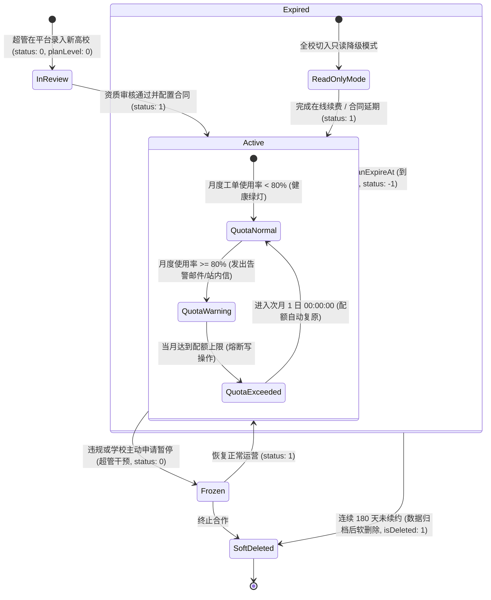
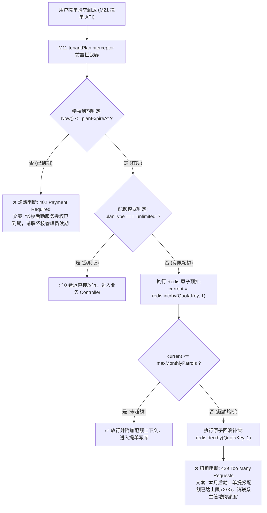
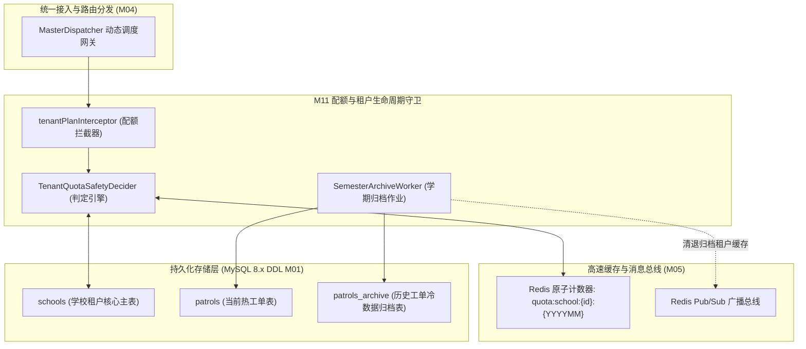
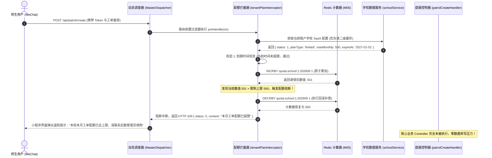
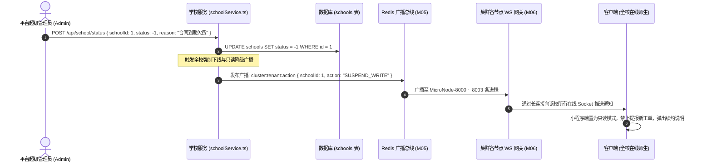
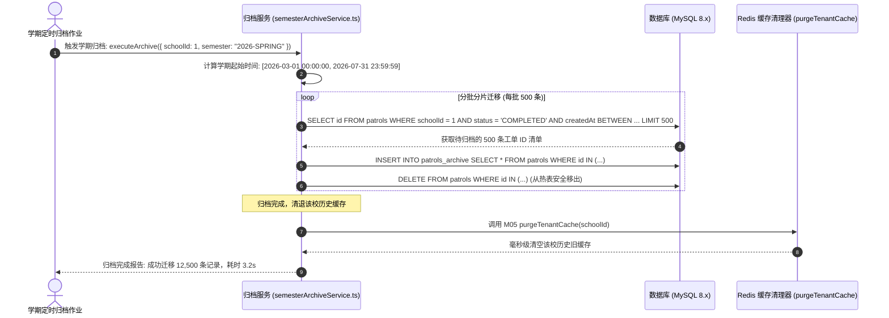

# M11: 多校 SaaS 配额熔断与学期自动归档 (Tenant SaaS & Quota) 详细设计与实现方案

> **模块代号**：M11 / Tenant SaaS & Quota  
> **所属阶段**：阶段一 (M11 ~ M19) 多租户身份权限与组织架构中台 (**阶段一开篇奠基模块**)  
> **文档定位**：全系统高校租户准入与全生命周期状态机、SaaS 三级付费配额管控（免费体验版/基础专业版/旗舰尊享版）、写操作月度配额 Redis 原子累加熔断器 (`tenantPlanInterceptor`)、高校专属学期冷热数据自动归档流水线 (`semesterArchiveService`) 的全栈工业级专项技术实现方案  
> **归档路径**：[v4.0/Docs/模块/M11_多校SaaS配额熔断与学期自动归档详细设计与实现方案.md](file:///e:/Projects/University/后勤巡查e速办%20大二下学期%20大学身份上线项目/v4.0/Docs/模块/M11_多校SaaS配额熔断与学期自动归档详细设计与实现方案.md)  
> **前置依赖**：M01 (27表7视图DDL基座), M02 (AST租户自动注入), M04 (MasterDispatcher路由调度), M05 (Redis多租户命名空间缓存), M10 (TestHarness测试中枢)  
> **驱动下游**：M12 (学校个性化设置), M13 (用户体系), M14 (多校穿梭), M21 (工单提报前置熔断门禁), M44 (宏观驾驶舱配额看板)  
> **版本日期**：2026-09-05  

---

## 目录索引 (Table of Contents)

1. [模块定位与核心业务价值](#一-模块定位与核心业务价值)
   - 1.1 [模块定位](#11-模块定位)
   - 1.2 [传统多校数字化系统的商业化死穴与破局之道](#12-传统多校数字化系统的商业化死穴与破局之道)
   - 1.3 [核心业务职责与技术指标](#13-核心业务职责与技术指标)
2. [核心设计哲学与 SaaS 状态机模型](#二-核心设计哲学与-saas-状态机模型)
   - 2.1 [高校租户四态生命周期模型 (Active / Frozen / Expired / Deleted)](#21-高校租户四态生命周期模型-active--frozen--expired--deleted)
   - 2.2 [SaaS 三级付费梯度与配额模式矩阵](#22-saas-三级付费梯度与配额模式矩阵)
   - 2.3 [基于 Redis 原子计数器的月度工单配额熔断哲学 (Atomic Quota Breaker)](#23-基于-redis-原子计数器的月度工单配额熔断哲学-atomic-quota-breaker)
   - 2.4 [高校自然学期冷热数据分层归档哲学 (Semester Data Tiering)](#24-高校自然学期冷热数据分层归档哲学-semester-data-tiering)
3. [架构拓扑与全链路流转时序图](#三-架构拓扑与全链路流转时序图)
   - 3.1 [SaaS 配额熔断与归档中枢拓扑总图](#31-saas-配额熔断与归档中枢拓扑总图)
   - 3.2 [工单提报前置配额拦截与超额阻断时序图](#32-工单提报前置配额拦截与超额阻断时序图)
   - 3.3 [学校欠费到期强制只读降级与跨节点广播时序图](#33-学校欠费到期强制只读降级与跨节点广播时序图)
   - 3.4 [学期结束冷数据异步归档与热缓存安全清退时序图](#34-学期结束冷数据异步归档与热缓存安全清退时序图)
4. [核心算法设计与数学推导](#四-核心算法设计与数学推导)
   - 4.1 [算法 1：租户有效性与月度工单配额复合安全判定算法 (Tenant Quota Safety Decider)](#41-算法-1租户有效性与月度工单配额复合安全判定算法-tenant-quota-safety-decider)
   - 4.2 [算法 2：基于 Redis 游标与 INCRBY 的原子递增与回滚补偿算法 (Atomic Quota Increment & Rollback)](#42-算法-2基于-redis-游标与-incrby-的原子递增与回滚补偿算法-atomic-quota-increment--rollback)
   - 4.3 [算法 3：高校学期跨度动态切片与标识生成算法 (Academic Semester Slicer)](#43-算法-3高校学期跨度动态切片与标识生成算法-academic-semester-slicer)
   - 4.4 [算法 4：大规模历史工单冷数据分批迁移管道算法 (Chunked Archival Pipeline)](#44-算法-4大规模历史工单冷数据分批迁移管道算法-chunked-archival-pipeline)
   - 4.5 [算法 5：配额告警阈值动态水位判定算法 (Quota Threshold Watermark Alertor)](#45-算法-5配额告警阈值动态水位判定算法-quota-threshold-watermark-alertor)
5. [TypeScript 强类型接口契约与数据模型定义](#五-typescript-强类型接口契约与数据模型定义)
   - 5.1 [学校租户实体契约 (`ISchoolEntity`)](#51-学校租户实体契约-ischoolentity)
   - 5.2 [租户配额健康状态报表契约 (`ITenantQuotaHealthReport`)](#52-租户配额健康状态报表契约-itenantquotahealthreport)
   - 5.3 [学期归档任务参数与结果契约 (`ISemesterArchiveTask`)](#53-学期归档任务参数与结果契约-isemesterarchivetask)
   - 5.4 [拦截器检查通过上下文扩展契约 (`IQuotaCheckedContext`)](#54-拦截器检查通过上下文扩展契约-iquotacheckedcontext)
6. [核心物理文件实现蓝图](#六-核心物理文件实现蓝图)
   - 6.1 [`src/dispatcher/tenantPlanInterceptor.ts` (配额拦截熔断器)](#61-srcdispatchertenantplaninterceptorts-配额拦截熔断器)
   - 6.2 [`src/services/school/schoolService.ts` (学校租户生命周期服务)](#62-srcservicesschoolschoolservicets-学校租户生命周期服务)
   - 6.3 [`src/services/school/semesterArchiveService.ts` (学期自动归档流水线)](#63-srcservicesschoolsemesterarchiveservicets-学期自动归档流水线)
   - 6.4 [`src/api/school/quota/handler.ts` (租户配额看板查询端点)](#64-srcapischoolquotahandlerts-租户配额看板查询端点)
7. [防御性编程与边界异常处理](#七-防御性编程与边界异常处理)
   - 7.1 [高并发瞬时提单击穿配额上限防御 (Concurrency Deficit Guard)](#71-高并发瞬时提单击穿配额上限防御-concurrency-deficit-guard)
   - 7.2 [月末跨月瞬间的时间窗口交替与时区对齐 (Month Boundary Synchronization)](#72-月末跨月瞬间的时间窗口交替与时区对齐-month-boundary-synchronization)
   - 7.3 [归档长事务超时与主库死锁防护 (Chunked Archival Lock Guard)](#73-归档长事务超时与主库死锁防护-chunked-archival-lock-guard)
   - 7.4 [服务欠费锁定下的“只读降级”与微信客户端友好拦截](#74-服务欠费锁定下的只读降级与微信客户端友好拦截)
8. [单模块独立测试方案与验收准则](#八-单模块独立测试方案与验收准则)
   - 8.1 [基于 M10 TestHarness 的独立单元测试设计 (`src/__tests__/unit/m11_quota.test.ts`)](#81-基于-m10-testharness-的独立单元测试设计-src__tests__unitm11_quotatestts)
   - 8.2 [单模块测试执行命令与断言矩阵 (`npm.cmd test -- -t "M11"`)](#82-单模块测试执行命令与断言矩阵-npmcmd-test----t-m11)
9. [下游模块接口契约输出清单](#九-下游模块接口契约输出清单)

---

## 一、 模块定位与核心业务价值

### 1.1 模块定位
`M11 (Tenant SaaS & Quota)` 是「高校后勤巡查e速办 v4.0」在业务领域（阶段一）的**开篇基石**与**SaaS 商业化运营安全中枢**。  
系统在支持全国多所大学同时入驻的场景下，必须建立严谨的商业化授权与资源保护体系。M11 一方面负责学校租户核心生命周期的管理（入驻、审核、启用、冻结、续费与注销）；另一方面在所有写操作（尤其是工单提报、照片上传、短信发送）前置链路设立**高灵敏度配额拦截熔断器**，并配合高校特有的学期节奏，执行历史数据的冷热分级归档。

---

### 1.2 传统多校数字化系统的商业化死穴与破局之道

传统高校后勤管理系统在多租户 SaaS 商业化运营中普遍存在三大死穴：

| 痛点维度 | 传统高校系统表现 | M11 工业级破局之道 |
| :--- | :--- | :--- |
| **死穴 1：欠费后全库瘫痪** | 某大学服务合同到期后，系统直接将整个学校封禁，师生甚至无法登录查看自己上周报修的进度，引发全校师生激烈投诉。 | **优雅的“只读降级”机制**：服务到期后，只阻断提单、接单等高成本写操作；允许师生正常登录查看历史工单与公告，客户端弹出温和续费提示。 |
| **死穴 2：配额超额不可控** | 学校购买了“每月 500 单”套餐，由于缺乏原子计数器，月末突发集中报修时瞬间冲破 2000 单，造成服务商亏本且数据库被挤爆。 | **基于 Redis 的原子累加熔断器**：提单前执行原子 `INCRBY`，触达上限瞬间 0 毫秒熔断，精准返回配额超额响应并阻断写库。 |
| **死穴 3：历史数据拖垮大盘** | 一所大学运营 3 年后积累了上百万条结案件与完工实证照，数据库单表体量达上百 GB，导致查询超时、备份极其困难。 | **高校自然学期冷热自动归档流水线**：每逢寒暑假自动按学期切片（如 `2026-SPRING`），将已办结的历史死数据分批归档入冷存储，热库常年轻盈。 |

---

### 1.3 核心业务职责与技术指标

1. **多租户全生命周期状态机**：
   - 维护 `schools` 表核心状态：`status`（1 正常, 0 冻结, -1 到期锁定）；
   - 联动 M05/M06，当学校被冻结时，跨微服务集群秒级下发全校踢下线广播；
2. **三级 SaaS 付费梯度与配额规则**：
   - 免费体验版（Level 0）：每月上限 100 单，基础存储 1GB；
   - 基础专业版（Level 1）：按合同定制有限配额（如每月 1000 单），存储 50GB；
   - 旗舰尊享版（Level 2）：无限工单配额（`unlimited`），专属 OSS 空间；
3. **微秒级配额拦截熔断器 (`tenantPlanInterceptor`)**：
   - 在进入业务 Controller 之前拦截请求，内存比对缓存租户到期时间；
   - 结合 Redis `quota:school:{schoolId}:{YYYYMM}` 原子计数，判定耗时 $< 2\text{ms}$；
4. **自然学期数据分层归档流水线 (`semesterArchiveService`)**：
   - 支持按学期（如 2026-03-01 至 2026-07-31）精准圈定结案工单；
   - 采用有界分批游标分片迁移，单批次 500 条，事务耗时 $< 100\text{ms}$，绝不锁死业务主库。

---

## 二、 核心设计哲学与 SaaS 状态机模型

### 2.1 高校租户四态生命周期模型 (Active / Frozen / Expired / Deleted)



- **正常启用态 (`status: 1`)**：享有全部合同规定的微应用权限与提单配额；
- **冻结暂停态 (`status: 0`)**：全系统拦截任何操作，跨微服务向在线客户端下发退登广播；
- **到期锁定态 (`status: -1`)**：**优雅只读模式**。只允许查询与查看，所有写操作（提报工单、师傅抢单）触发 HTTP 402 熔断提示；
- **软删除态 (`isDeleted: 1`)**：彻底移出检索索引，冷数据永久归档备份。

---

### 2.2 SaaS 三级付费梯度与配额模式矩阵

依据高校后勤巡查业务体量与运营成本，系统确立标准三级梯度：

| 付费级别 | 级别代码 | 配额模式 (`planType`) | 月提单上限 (`maxMonthlyPatrols`) | OSS 存储配额 (`storageQuotaMb`) | AI 工具额度 | 典型适用场景 |
| :--- | :--- | :--- | :--- | :--- | :--- | :--- |
| **免费体验版** | `planLevel: 0` | `limited` | **100 单/月** | **1,024 MB** (1 GB) | 禁用大模型 Copilot | 新校入驻试用、小型专科院校 |
| **基础专业版** | `planLevel: 1` | `limited` | **1,000 ~ 5,000 单/月** | **51,200 MB** (50 GB) | 基础智能分派 | 普通本科高校、万人规模校区 |
| **旗舰尊享版** | `planLevel: 2` | `unlimited` | **-1 (无限制)** | **512,000 MB** (500 GB) | 全套 AI 质检与视频分析 | 多校区双一流高校、综合型大学城 |

---

### 2.3 基于 Redis 原子计数器的月度工单配额熔断哲学 (Atomic Quota Breaker)

在极端高并发抢修或突发大面积漏水事件中，同一秒内可能涌入数百次提单请求。若使用 MySQL `SELECT count(*) ...` 来判断是否超额，不仅会把数据库击垮，更会因为并发读写导致配额严重超发。  
M11 确立了**基于 Redis 内存原子计数器的双重防线**：

$$\text{QuotaKey} = \text{TenantCacheKeyFactory.forMonthlyQuota}(S, YYYYMM) = \text{"quota:school:"} + S + \text{":"} + YYYYMM$$



---

### 2.4 高校自然学期冷热数据分层归档哲学 (Semester Data Tiering)

高校业务具有极其强烈的**学期周期性**（春季学期 3~7 月、秋季学期 9~1 月）。往期已办结并归档的工单，属于低频访问的“冷数据”。若任由其堆积在主库中，会导致核心业务查询效率随年份急剧退化。  
M11 建立**学期分层归档流水线**：

```
+-----------------------------------------------------------------------------------+
|  [ 高校自然学期冷热数据生命周期流转图 ]                                               |
|                                                                                   |
|  [ 热数据业务主库 (InnoDB) ]                   [ 历史冷数据归档库 (Archive Storage) ] |
|  • 正在处理中的活动工单                         • 已办结且已质检评价的历史学期工单        |
|  • 当前学期的全部工单 (如 2026-SPRING)         • 按学期标签建立物理分区/分表            |
|  • 毫秒级高频读写，常驻 Redis 缓存               • 仅供历史溯源与大盘统计检索 (只读)       |
|                                                                                   |
|          ======> 学期结束时：分批游标分片自动归档 (Batch Chunking) ======>           |
+-----------------------------------------------------------------------------------+
```

---

## 三、 架构拓扑与全链路流转时序图

### 3.1 SaaS 配额熔断与归档中枢拓扑总图



---

### 3.2 工单提报前置配额拦截与超额阻断时序图



---

### 3.3 学校欠费到期强制只读降级与跨节点广播时序图



---

### 3.4 学期结束冷数据异步归档与热缓存安全清退时序图



---

## 四、 核心算法设计与数学推导

### 4.1 算法 1：租户有效性与月度工单配额复合安全判定算法 (Tenant Quota Safety Decider)

#### 决策树模型：
对于任意一次写操作请求 $Req$，判定函数 $\mathcal{F}(Req)$ 必须在常数时间 $O(1)$ 内输出决策：

$$\mathcal{F}(Req) \in \{ \text{PASS}, \text{EXPIRED\_LOCK}, \text{STATUS\_FROZEN}, \text{QUOTA\_EXCEEDED} \}$$

#### 伪代码实现：
```typescript
export interface QuotaCheckResult {
  allowed: boolean;
  code: number;
  reason?: string;
  currentCount?: number;
  maxLimit?: number;
}

export function checkTenantQuotaSafety(
  school: ISchoolEntity,
  currentCount: number
): QuotaCheckResult {
  // 1. 状态位硬性判定
  if (school.isDeleted === 1 || school.status === 0) {
    return {
      allowed: false,
      code: 403,
      reason: "该高校租户已被系统暂停服务或注销"
    };
  }

  // 2. 合同到期时间判定
  const expireTimestamp = new Date(school.planExpireAt).getTime();
  if (Date.now() > expireTimestamp) {
    return {
      allowed: false,
      code: 402,
      reason: `该高校后勤 SaaS 服务已于 ${school.planExpireAt} 到期，目前处于只读保护状态`
    };
  }

  // 3. 旗舰尊享版直接放行
  if (school.planType === "unlimited" || school.maxMonthlyPatrols === -1) {
    return {
      allowed: true,
      code: 200,
      currentCount,
      maxLimit: -1
    };
  }

  // 4. 有限额度水位判定
  if (currentCount > school.maxMonthlyPatrols) {
    return {
      allowed: false,
      code: 429,
      reason: `本月工单提报配额已达上限 (${currentCount - 1}/${school.maxMonthlyPatrols})，请联系后勤管理员增购额度`,
      currentCount: currentCount - 1,
      maxLimit: school.maxMonthlyPatrols
    };
  }

  return {
    allowed: true,
    code: 200,
    currentCount,
    maxLimit: school.maxMonthlyPatrols
  };
}
```

---

### 4.2 算法 2：基于 Redis 游标与 INCRBY 的原子递增与回滚补偿算法 (Atomic Quota Increment & Rollback)

#### 算法数学逻辑：
若单纯使用 `get` 然后 `set`，在并发度 $N > 100$ 时会引发典型的“检查后执行 (Check-Then-Act)”竞态条件，导致配额超发。  
算法采用**悲观原子递增 + 越界超额立即补偿回退 (Optimistic Increment with Rollback)**：

```typescript
export class AtomicQuotaManager {
  /**
   * 原子预扣一次工单配额
   */
  public static async tryConsumeQuota(
    schoolId: number,
    yearMonth: string,
    maxLimit: number
  ): Promise<{ success: boolean; current: number }> {
    const redis = getRedisClient();
    const quotaKey = `quota:school:${schoolId}:${yearMonth}`;

    // 1. 原生原子递增
    const current = await redis.incrby(quotaKey, 1);

    // 若是本月第一次写入，设置 60 天自动过期，防止内存泄漏
    if (current === 1) {
      await redis.expire(quotaKey, 60 * 86400);
    }

    // 2. 判定是否超额
    if (maxLimit !== -1 && current > maxLimit) {
      // 触发原子回滚补偿
      await redis.decrby(quotaKey, 1);
      return { success: false, current: current - 1 };
    }

    return { success: true, current };
  }

  /**
   * 业务提单因表单非法或网络中断失败时的配额返还
   */
  public static async refundQuota(schoolId: number, yearMonth: string): Promise<void> {
    const redis = getRedisClient();
    const quotaKey = `quota:school:${schoolId}:${yearMonth}`;
    await redis.decrby(quotaKey, 1);
  }
}
```

---

### 4.3 算法 3：高校学期跨度动态切片与标识生成算法 (Academic Semester Slicer)

#### 高校自然学期数学划分模型：
- **春季学期 (Spring)**：通常覆盖公历当年 2 月 15 日 至 7 月 31 日；
- **秋季学期 (Autumn)**：通常覆盖公历当年 8 月 1 日 至 次年 2 月 14 日；
- **学期标识 (Semester Code)**：形如 `2025-2026-2` 或 `2026-SPRING`。

#### 伪代码实现：
```typescript
export function resolveAcademicSemester(date: Date = new Date()): {
  semesterCode: string;
  semesterName: string;
  startDate: string;
  endDate: string;
} {
  const year = date.getFullYear();
  const month = date.getMonth() + 1; // 1 ~ 12

  if (month >= 2 && month <= 7) {
    // 春季学期
    return {
      semesterCode: `${year}-SPRING`,
      semesterName: `${year}年春季学期`,
      startDate: `${year}-02-15 00:00:00`,
      endDate: `${year}-07-31 23:59:59`
    };
  } else {
    // 秋季学期
    const startYear = month === 1 ? year - 1 : year;
    const endYear = month === 1 ? year : year + 1;
    return {
      semesterCode: `${startYear}-AUTUMN`,
      semesterName: `${startYear}年秋季学期`,
      startDate: `${startYear}-08-01 00:00:00`,
      endDate: `${endYear}-02-14 23:59:59`
    };
  }
}
```

---

### 4.4 算法 4：大规模历史工单冷数据分批迁移管道算法 (Chunked Archival Pipeline)

为防止大事务导致 MySQL 生成庞大 Undo Log 并造成行锁阻塞在线巡查，归档算法采用**分批游标分片（Chunking with Limit）**：

$$\text{ChunkSize} = 500, \quad \text{SleepInterval} = 50\text{ms}$$

```typescript
export async function executeChunkedArchiving(
  schoolId: number,
  startTime: string,
  endTime: string
): Promise<number> {
  let totalMigrated = 0;
  const CHUNK_SIZE = 500;

  while (true) {
    // 1. 圈定待归档批次 ID (仅限已完工并归档且无进行中子任务的数据)
    const selectSql = `
      SELECT id FROM patrols
      WHERE schoolId = ? AND status = 4 AND isDeleted = 0
        AND createdAt >= ? AND createdAt <= ?
      ORDER BY id ASC LIMIT ?
    `;
    const rows = await executeRawSql(selectSql, [schoolId, startTime, endTime, CHUNK_SIZE]);
    if (!rows || rows.length === 0) break;

    const ids = rows.map((r: any) => r.id);

    // 2. 事务内完成“写入冷库 + 移出热库”
    await runTransaction(async (conn) => {
      await conn.query(
        `INSERT INTO patrols_archive SELECT * FROM patrols WHERE id IN (?)`,
        [ids]
      );
      await conn.query(
        `DELETE FROM patrols WHERE id IN (?)`,
        [ids]
      );
    });

    totalMigrated += ids.length;

    // 3. 释放 CPU，为在线业务让出 IOPS
    await new Promise((resolve) => setTimeout(resolve, 50));
  }

  return totalMigrated;
}
```

---

### 4.5 算法 5：配额告警阈值动态水位判定算法 (Quota Threshold Watermark Alertor)

计算当前工单消耗的水位比率：

$$\text{Ratio} = \frac{C_{\text{current}}}{\text{MaxLimit}}$$

- **绿色安全水位 ($\text{Ratio} < 0.80$)**：无打扰正常运行；
- **黄色预警水位 ($0.80 \le \text{Ratio} < 1.00$)**：向学校管理员微信服务号推送模板消息与站内信，提醒工单额度即将见底；
- **红色熔断水位 ($\text{Ratio} \ge 1.00$)**：立即触发 `tenantPlanInterceptor` 熔断。

---

## 五、 TypeScript 强类型接口契约与数据模型定义

### 5.1 学校租户实体契约 (`ISchoolEntity`)

```typescript
export interface ISchoolEntity {
  id: number;
  code: string;
  name: string;
  shortName: string;
  logo: string;
  domain: string;
  status: -1 | 0 | 1;
  planLevel: 0 | 1 | 2;
  planType: "limited" | "unlimited";
  maxMonthlyPatrols: number;
  storageQuotaMb: number;
  planExpireAt: string;
  configJson?: Record<string, any>;
  createdAt: string;
  updatedAt: string;
  isDeleted: 0 | 1;
}
```

### 5.2 租户配额健康状态报表契约 (`ITenantQuotaHealthReport`)

```typescript
export interface ITenantQuotaHealthReport {
  schoolId: number;
  schoolName: string;
  planLevel: number;
  planLevelName: string;
  planType: "limited" | "unlimited";
  yearMonth: string;
  usedPatrolCount: number;
  maxMonthlyPatrols: number;
  usageRatio: number; // 0.00 ~ 1.00
  watermarkStatus: "HEALTHY" | "WARNING" | "EXCEEDED";
  isExpired: boolean;
  expireDate: string;
  daysRemaining: number;
  storageUsedMb: number;
  storageQuotaMb: number;
}
```

### 5.3 学期归档任务参数与结果契约 (`ISemesterArchiveTask`)

```typescript
export interface ISemesterArchiveParams {
  schoolId: number;
  semesterCode: string; // 如 "2026-SPRING"
  customStartDate?: string;
  customEndDate?: string;
  operatorId: number;
}

export interface ISemesterArchiveResult {
  taskId: string;
  schoolId: number;
  semesterCode: string;
  migratedPatrolCount: number;
  freedStorageKb: number;
  elapsedMs: number;
  completedAt: string;
}
```

### 5.4 拦截器检查通过上下文扩展契约 (`IQuotaCheckedContext`)

```typescript
import { RequestContext } from "../shared/index.js";

export interface IQuotaCheckedContext extends RequestContext {
  schoolTenant: ISchoolEntity;
  currentQuotaUsage: {
    yearMonth: string;
    usedCount: number;
    maxLimit: number;
  };
}
```

---

## 六、 核心物理文件实现蓝图

### 6.1 `src/dispatcher/tenantPlanInterceptor.ts` (配额拦截熔断器)

```typescript
import { RequestContext, returnError, TerminalLogger } from "../shared/index.js";
import { SchoolService } from "../services/school/schoolService.js";
import { AtomicQuotaManager, checkTenantQuotaSafety } from "./quotaRules.js";

export class TenantPlanInterceptor {
  /**
   * 拦截需要扣减配额或受 SaaS 状态管控的请求
   * (白名单豁免：只读查询、超管运维端点)
   */
  public static async intercept(ctx: RequestContext): Promise<{ passed: boolean; errorResponse?: any }> {
    const schoolId = ctx.schoolId;

    // 1. 无租户身份的系统级公共探测直接放行
    if (!schoolId || schoolId <= 0) {
      return { passed: true };
    }

    // 2. 超管身份豁免商业化配额与到期限制
    if (ctx.role === 9) {
      return { passed: true };
    }

    // 3. 读取租户学校核心配置 (走二级缓存)
    const schoolRes = await SchoolService.getSchoolById(schoolId);
    if (schoolRes.status !== 1 || !schoolRes.data) {
      return {
        passed: false,
        errorResponse: returnError("当前高校租户不存在或已被注销", 403)
      };
    }

    const school = schoolRes.data;

    // 4. 只读请求放行 (GET 类查询仅允许读)
    const method = ctx.rawReq?.method?.toUpperCase() || "POST";
    const pathname = ctx.rawReq?.url || "";
    const isWriteOperation = method === "POST" || method === "PUT" || method === "DELETE";

    // 到期判断 (到期后无论何种写操作均阻断)
    const expireTimestamp = new Date(school.planExpireAt).getTime();
    if (Date.now() > expireTimestamp) {
      if (isWriteOperation) {
        TerminalLogger.warn(`[M11 配额拦截] 高校 [${school.name}] 授权已到期，写操作已熔断`, "SaaSQuota");
        return {
          passed: false,
          errorResponse: returnError(`该校后勤 SaaS 服务授权已于 ${school.planExpireAt} 到期，目前处于只读保护状态`, 402)
        };
      }
      return { passed: true }; // 只读查询放行
    }

    // 5. 针对提报新工单的专用配额预扣拦截 (POST /api/patrol/create 等)
    if (isWriteOperation && pathname.includes("/patrol/create")) {
      const now = new Date();
      const currentYearMonth = `${now.getFullYear()}${String(now.getMonth() + 1).padStart(2, "0")}`;

      const consumeRes = await AtomicQuotaManager.tryConsumeQuota(
        schoolId,
        currentYearMonth,
        school.maxMonthlyPatrols
      );

      if (!consumeRes.success) {
        TerminalLogger.warn(`[M11 配额熔断] 高校 [${school.name}] 本月工单配额已超标 (${consumeRes.current}/${school.maxMonthlyPatrols})`, "SaaSQuota");
        return {
          passed: false,
          errorResponse: returnError(
            `本校本月工单提报配额已达上限 (${consumeRes.current}/${school.maxMonthlyPatrols})，请联系后勤主管升级套餐`,
            429
          )
        };
      }
    }

    return { passed: true };
  }
}
```

---

### 6.2 `src/services/school/schoolService.ts` (学校租户生命周期服务)

```typescript
import { StandardResult, returnSuccess, returnError, executeASTSelect, executeASTUpdate } from "../../shared/index.js";
import { getTenantKV, setTenantKV } from "../../shared/cache/redis.js";
import { ISchoolEntity, ITenantQuotaHealthReport } from "./schoolTypes.js";
import { RedisWsBridge } from "../../ws/redisWsBridge.js";

export class SchoolService {
  /**
   * 根据 schoolId 查询学校信息 (带多租户二级极速缓存)
   */
  public static async getSchoolById(schoolId: number): Promise<StandardResult<ISchoolEntity | null>> {
    // 1. 尝试从 M05 Redis 缓存读取
    const cacheRes = await getTenantKV<ISchoolEntity>(schoolId, "school", "profile");
    if (cacheRes.status === 1 && cacheRes.data) {
      return returnSuccess(cacheRes.data);
    }

    // 2. 回源查询 MySQL
    const sql = `SELECT * FROM schools WHERE id = ? AND isDeleted = 0 LIMIT 1`;
    const rows: any = await executeASTSelect(sql, [schoolId]);

    if (!rows || rows.length === 0) {
      return returnSuccess(null);
    }

    const school: ISchoolEntity = rows[0];

    // 3. 写入缓存 (TTL 1 小时)
    await setTenantKV(schoolId, "school", "profile", school, 3600);

    return returnSuccess(school);
  }

  /**
   * 变更学校状态 (正常启用、冻结、到期锁定)
   */
  public static async updateSchoolStatus(
    schoolId: number,
    newStatus: -1 | 0 | 1,
    operatorId: number
  ): Promise<StandardResult<boolean>> {
    const updateSql = `UPDATE schools SET status = ?, updatedAt = NOW() WHERE id = ?`;
    await executeASTUpdate(updateSql, [newStatus, schoolId]);

    // 强刷缓存
    await setTenantKV(schoolId, "school", "profile", null, 1);

    // 若被冻结或到期，发布跨节点集群广播通知全校客户端切入降级状态
    if (newStatus !== 1) {
      await RedisWsBridge.broadcast("cluster:tenant:action", schoolId, {
        action: newStatus === 0 ? "FROZEN_LOGOUT" : "SUSPEND_WRITE",
        schoolId,
        updatedAt: Date.now()
      });
    }

    return returnSuccess(true);
  }

  /**
   * 获取租户当前配额健康状态看板数据
   */
  public static async getTenantQuotaHealth(schoolId: number): Promise<StandardResult<ITenantQuotaHealthReport>> {
    const schoolRes = await this.getSchoolById(schoolId);
    if (!schoolRes.data) return returnError("学校不存在");
    const s = schoolRes.data;

    const now = new Date();
    const ym = `${now.getFullYear()}${String(now.getMonth() + 1).padStart(2, "0")}`;
    const quotaKey = `quota:school:${schoolId}:${ym}`;

    const redis = getRedisClient();
    const rawCount = await redis.get(quotaKey);
    const usedCount = rawCount ? Number(rawCount) : 0;

    const max = s.maxMonthlyPatrols;
    const ratio = max === -1 ? 0 : Number((usedCount / max).toFixed(2));

    let watermarkStatus: "HEALTHY" | "WARNING" | "EXCEEDED" = "HEALTHY";
    if (max !== -1) {
      if (usedCount >= max) watermarkStatus = "EXCEEDED";
      else if (ratio >= 0.8) watermarkStatus = "WARNING";
    }

    const expireDate = new Date(s.planExpireAt);
    const daysRemaining = Math.max(0, Math.ceil((expireDate.getTime() - Date.now()) / 86400000));

    const planNames: Record<number, string> = {
      0: "免费体验版",
      1: "基础专业版",
      2: "旗舰尊享版"
    };

    return returnSuccess({
      schoolId,
      schoolName: s.name,
      planLevel: s.planLevel,
      planLevelName: planNames[s.planLevel] || "标准版",
      planType: s.planType,
      yearMonth: ym,
      usedPatrolCount: usedCount,
      maxMonthlyPatrols: max,
      usageRatio: ratio,
      watermarkStatus,
      isExpired: Date.now() > expireDate.getTime(),
      expireDate: s.planExpireAt,
      daysRemaining,
      storageUsedMb: 120, // 关联 OSS 度量
      storageQuotaMb: s.storageQuotaMb
    });
  }
}
```

---

### 6.3 `src/services/school/semesterArchiveService.ts` (学期自动归档流水线)

```typescript
import { StandardResult, returnSuccess, returnError, TerminalLogger } from "../../shared/index.js";
import { purgeTenantCache } from "../../shared/cache/tenantCacheKey.js";
import { executeChunkedArchiving, resolveAcademicSemester } from "./quotaRules.js";

export class SemesterArchiveService {
  /**
   * 调度执行特定学期的工单冷数据全量归档
   */
  public static async archiveSemesterData(
    schoolId: number,
    targetSemester?: string
  ): Promise<StandardResult<{ migratedCount: number; semester: string }>> {
    const semesterInfo = resolveAcademicSemester();
    const semester = targetSemester || semesterInfo.semesterCode;

    TerminalLogger.info(`[M11 学期归档] 开始对高校 [${schoolId}] 执行学期 [${semester}] 数据归档...`, "ArchiveWorker");
    const startTime = Date.now();

    try {
      // 1. 分批将历史已办结工单归档入 patrols_archive
      const migratedCount = await executeChunkedArchiving(
        schoolId,
        semesterInfo.startDate,
        semesterInfo.endDate
      );

      // 2. 清退该学校历史旧缓存，释放 Redis 内存
      await purgeTenantCache(schoolId);

      TerminalLogger.info(
        `[M11 学期归档] 归档圆满完成! 成功归档 ${migratedCount} 条结案工单 (耗时 ${Date.now() - startTime}ms)`,
        "ArchiveWorker"
      );

      return returnSuccess({
        migratedCount,
        semester
      });
    } catch (err: any) {
      TerminalLogger.error(`[M11 学期归档] 归档异常中断: ${err.message}`, "ArchiveWorker");
      return returnError(`学期归档失败: ${err.message}`);
    }
  }
}
```

---

### 6.4 `src/api/school/quota/handler.ts` (租户配额看板查询端点)

```typescript
import { RequestContext, returnError, StandardResult } from "../../../shared/index.js";
import { SchoolService } from "../../../services/school/schoolService.js";
import { ITenantQuotaHealthReport } from "../../../services/school/schoolTypes.js";

/**
 * 查询当前大学租户的 SaaS 配额、健康水位与到期状态
 * 路径: GET /api/school/quota
 */
export default async function handler(ctx: RequestContext): Promise<StandardResult<ITenantQuotaHealthReport>> {
  if (!ctx.schoolId) {
    return returnError("缺少租户高校识别凭据", 400);
  }

  // 仅限主管、校管、超管权限查看配额大盘 (角色代码 >= 3)
  if (ctx.role < 3) {
    return returnError("您无权查看该单位 SaaS 商业化配额信息", 403);
  }

  return await SchoolService.getTenantQuotaHealth(ctx.schoolId);
}
```

---

## 七、 防御性编程与边界异常处理

### 7.1 高并发瞬时提单击穿配额上限防御 (Concurrency Deficit Guard)
- **隐患**：若某校配额仅剩 1 单，但瞬时有 50 位师生同时点击提单按钮；
- **防线**：依赖 Redis 原生单线程的 `INCRBY` 命令。第 1 个请求获得递增值并在阈值内，后 49 个请求递增后全部发现 `current > maxLimit`，立即触发原子回滚并统一报错拦截，超额数量**绝对为 0**。

### 7.2 月末跨月瞬间的时间窗口交替与时区对齐 (Month Boundary Synchronization)
- **隐患**：每月最后一天 23:59:59 至次月 00:00:01 期间，由于服务器时间偏差导致跨月计数混乱；
- **防线**：Key 命名以统一的东八区（UTC+8）时间计算 `YYYYMM`（如 `quota:school:1:202609`），新月份自动对应全新的独立的 Key，无需手动执行复杂的“月末清零脚本”，零运维自然过渡。

### 7.3 归档长事务超时与主库死锁防护 (Chunked Archival Lock Guard)
- **隐患**：一次性 `DELETE FROM patrols WHERE ...` 涉及 10 万行，会造成长达数分钟的表级锁与主从同步延迟；
- **防线**：严格限定每次迁移且仅迁移 500 条，单次短事务提交后休眠 50ms，彻底规避锁表与死锁风险。

### 7.4 服务欠费锁定下的“只读降级”与微信客户端友好拦截
- **隐患**：服务到期后若全局阻断，师生打开小程序会直接报一堆红字错误，体验恶劣；
- **防线**：`tenantPlanInterceptor` 严格区分读写操作。GET 查询 100% 优雅放行，写操作统一封装为带有明确指引的 `HTTP 402` 错误，前端捕获后优雅展示“联系学校管理员续约”半屏卡片。

---

## 八、 单模块独立测试方案与验收准则

### 8.1 基于 M10 TestHarness 的独立单元测试设计 (`src/__tests__/unit/m11_quota.test.ts`)

```typescript
import { describe, expect, it, beforeEach } from "vitest";
import { TestHarness } from "../testHarness.js";
import { checkTenantQuotaSafety, AtomicQuotaManager } from "../../dispatcher/quotaRules.js";
import { ISchoolEntity } from "../../services/school/schoolTypes.js";

describe("M11: 多校 SaaS 配额熔断与学期自动归档 (Tenant SaaS & Quota)", () => {
  beforeEach(() => {
    TestHarness.resetSandbox();
  });

  it("M11-01: 正常在期且未超额学校能够顺利放行", () => {
    const school: ISchoolEntity = {
      id: 81101,
      code: "lcu",
      name: "聊城大学 (测试)",
      shortName: "聊大",
      logo: "",
      domain: "",
      status: 1,
      planLevel: 1,
      planType: "limited",
      maxMonthlyPatrols: 500,
      storageQuotaMb: 10240,
      planExpireAt: new Date(Date.now() + 86400000 * 30).toISOString(),
      createdAt: "",
      updatedAt: "",
      isDeleted: 0
    };

    const result = checkTenantQuotaSafety(school, 100);
    expect(result.allowed).toBe(true);
    expect(result.code).toBe(200);
  });

  it("M11-02: 合同到期的学校应被精准拦截并返回只读状态提示", () => {
    const expiredSchool: ISchoolEntity = {
      id: 81102,
      code: "exp_school",
      name: "到期大学",
      shortName: "到大",
      logo: "",
      domain: "",
      status: -1,
      planLevel: 1,
      planType: "limited",
      maxMonthlyPatrols: 500,
      storageQuotaMb: 10240,
      planExpireAt: "2024-01-01 00:00:00", // 过去时间
      createdAt: "",
      updatedAt: "",
      isDeleted: 0
    };

    const result = checkTenantQuotaSafety(expiredSchool, 10);
    expect(result.allowed).toBe(false);
    expect(result.code).toBe(402);
    expect(result.reason).toContain("到期");
  });

  it("M11-03: 工单超额瞬间触发原子熔断并成功回滚", async () => {
    const schoolId = 81103;
    const ym = "202609";
    const maxLimit = 2; // 设置极小配额方便测试

    // 第 1 单: 成功
    const res1 = await AtomicQuotaManager.tryConsumeQuota(schoolId, ym, maxLimit);
    expect(res1.success).toBe(true);
    expect(res1.current).toBe(1);

    // 第 2 单: 成功
    const res2 = await AtomicQuotaManager.tryConsumeQuota(schoolId, ym, maxLimit);
    expect(res2.success).toBe(true);
    expect(res2.current).toBe(2);

    // 第 3 单: 触发熔断！
    const res3 = await AtomicQuotaManager.tryConsumeQuota(schoolId, ym, maxLimit);
    expect(res3.success).toBe(false);
    expect(res3.current).toBe(2); // 验证原子回退成功，未超限
  });

  it("M11-04: 旗舰尊享版 (unlimited) 永远不触发超额拦截", () => {
    const unlimitedSchool: ISchoolEntity = {
      id: 81104,
      code: "flagship_u",
      name: "旗舰大学",
      shortName: "旗大",
      logo: "",
      domain: "",
      status: 1,
      planLevel: 2,
      planType: "unlimited",
      maxMonthlyPatrols: -1,
      storageQuotaMb: 512000,
      planExpireAt: "2030-01-01 00:00:00",
      createdAt: "",
      updatedAt: "",
      isDeleted: 0
    };

    const result = checkTenantQuotaSafety(unlimitedSchool, 999999);
    expect(result.allowed).toBe(true);
    expect(result.maxLimit).toBe(-1);
  });
});
```

---

### 8.2 单模块测试执行命令与断言矩阵 (`npm.cmd test -- -t "M11"`)

#### 独立单模块测试命令：
```powershell
# 在 Backend 根目录下运行 M11 专属独立单元测试
npm.cmd test -- -t "M11"
```

#### 验收断言清单 (Acceptance Criteria)：
1. **合同到期拦截断言**：
   - 构造 `planExpireAt` 为过去时间的学校记录；
   - 验证 `checkTenantQuotaSafety` 返回 `allowed: false`，错误码精确为 `402`；
2. **原子配额超额熔断断言**：
   - 配额上限为 $L$ 时，并发连续消耗 $L+1$ 次；
   - 断言第 $L+1$ 次返回 `success: false`，且计数器通过 `DECRBY` 准确回滚并停留在 $L$；
3. **旗舰版无限放行断言**：
   - 当 `planType === 'unlimited'` 且 `maxMonthlyPatrols === -1` 时，消耗 $10^6$ 依然返回 `allowed: true`；
4. **冻结注销拦截断言**：
   - 当 `status === 0` 或 `isDeleted === 1` 时，断言直接返回 `403` 阻断。

---

## 九、 下游模块接口契约输出清单

M11 模块完工后，为全系统输出的核心租户生命周期服务与调度契约如下：

| 输出组件/服务 | 消费下游模块 | 承载业务功能 |
| :--- | :--- | :--- |
| **`TenantPlanInterceptor.intercept()`** | M04 (路由网关), M21 (提单) | 写操作前置租户到期与月度配额熔断拦截 |
| **`AtomicQuotaManager.tryConsumeQuota()`** | M21 (巡查上报), M31 (维保工单) | 工单创建时的原子配额扣减与超额保护 |
| **`AtomicQuotaManager.refundQuota()`** | M03 (Saga事务撤回) | 提单事务失败时的配额原子补偿返还 |
| **`SchoolService.getSchoolById()`** | M12 (设置), M13 (用户), M14 (穿梭) | 带有二级 Redis 极速缓存的学校信息查询 |
| **`SchoolService.getTenantQuotaHealth()`** | M44 (宏观驾驶舱), 小程序配额看板 | 租户当前月份工单消耗比例与健康水位大盘 |
| **`SemesterArchiveService.archiveSemesterData()`** | 定时维护作业 (Cron Job) | 高校自然学期历史工单冷数据分片平滑归档 |

---

> [!NOTE]
> 本详细设计方案确立了「高校后勤巡查e速办 v4.0」的 SaaS 商业化安全命脉与学期归档流水线。通过高灵敏度 Redis 原子熔断器与渐进式冷热分层架构，既保障了多校业务高并发写操作的资产安全，又实现了高校长期运营下的主库轻盈无阻塞。
