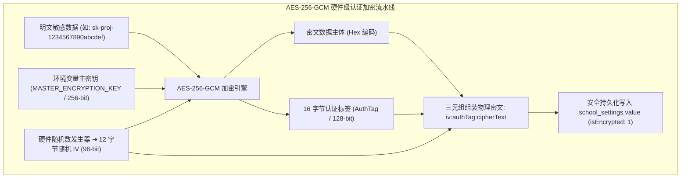
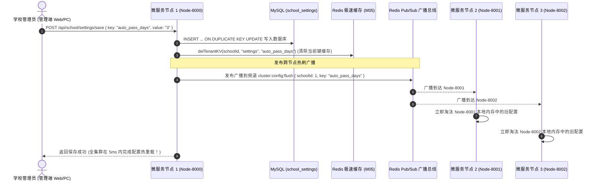
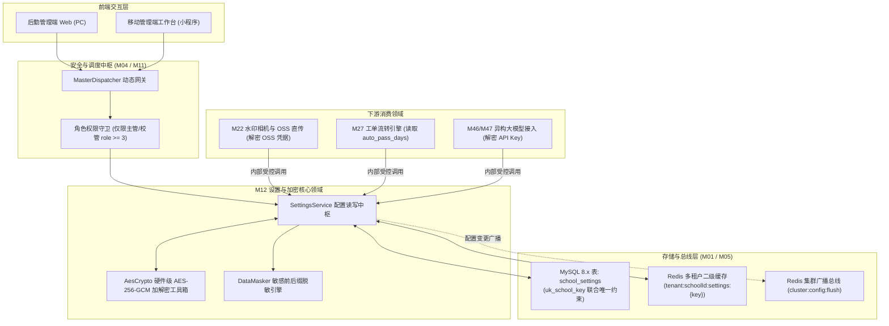
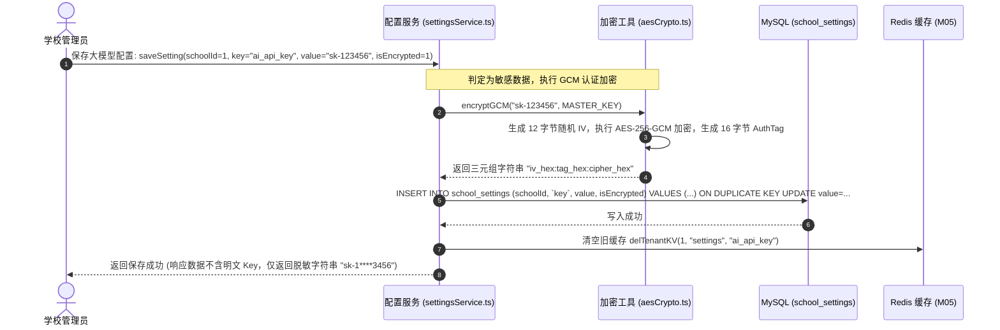
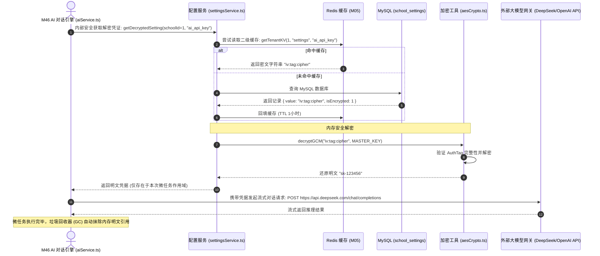

# M12: 学校个性化设置字典与敏感配置加密存储 (School Settings & Cryptography) 详细设计与实现方案

> **模块代号**：M12 / School Settings & Cryptography  
> **所属阶段**：阶段一 (M11 ~ M19) 多租户身份权限与组织架构中台  
> **文档定位**：多租户专属个性化参数字典表 (`school_settings`)、AES-256-GCM 硬件级认证加解密引擎 (`aesCrypto.ts`)、敏感凭据（各校大模型 API Key、OSS 密钥）端到端前后缀脱敏展示、以及跨微服务集群配置变更 0 延迟广播热重载的全栈工业级专项技术实现方案  
> **归档路径**：[v4.0/Docs/模块/M12_学校个性化设置字典与敏感配置加密存储详细设计与实现方案.md](file:///e:/Projects/University/后勤巡查e速办%20大二下学期%20大学身份上线项目/v4.0/Docs/模块/M12_学校个性化设置字典与敏感配置加密存储详细设计与实现方案.md)  
> **前置依赖**：M01 (27表7视图DDL基座), M02 (AST租户自动注入), M05 (Redis多租户命名空间缓存), M10 (TestHarness测试中枢), M11 (多校SaaS配额中枢)  
> **驱动下游**：M22 (防篡改水印相机与 OSS 租户直传)、M27 (超时自动办结与好评时限)、M41 (广场评论开关控制)、M46 (各校自主异构大模型接入)、M47/M48 (AI 质检与知识库推理)  
> **版本日期**：2026-09-05  

---

## 目录索引 (Table of Contents)

1. [模块定位与核心业务价值](#一-模块定位与核心业务价值)
   - 1.1 [模块定位](#11-模块定位)
   - 1.2 [为何必须建立动态字典与硬件级认证加密？](#12-为何必须建立动态字典与硬件级认证加密)
   - 1.3 [核心业务职责与技术指标](#13-核心业务职责与技术指标)
2. [核心设计哲学与安全加密体系](#二-核心设计哲学与安全加密体系)
   - 2.1 [联合唯一键多校配置隔离哲学 (`uk_school_key`)](#21-联合唯一键多校配置隔离哲学-uk_school_key)
   - 2.2 [AES-256-GCM 认证加密标准 (Confidentiality + Authenticity)](#22-aes-256-gcm-认证加密标准-confidentiality--authenticity)
   - 2.3 [端到端敏感数据动态前后缀脱敏防偷窥法则](#23-端到端敏感数据动态前后缀脱敏防偷窥法则)
   - 2.4 [基于 M05 广播总线的配置 0 延迟集群热重载](#24-基于-m05-广播总线的配置-0-延迟集群热重载)
3. [架构拓扑与交互时序图](#三-架构拓扑与交互时序图)
   - 3.1 [学校个性化配置与密钥保险箱整体拓扑图](#31-学校个性化配置与密钥保险箱整体拓扑图)
   - 3.2 [校管维护大模型 API Key 密文安全持久化时序图](#32-校管维护大模型-api-key-密文安全持久化时序图)
   - 3.3 [下游业务模块安全解密与沙箱调用时序图 (M46 AI 工作流)](#33-下游业务模块安全解密与沙箱调用时序图-m46-ai-工作流)
   - 3.4 [配置更新全集群广播与二级缓存秒级失效时序图](#34-配置更新全集群广播与二级缓存秒级失效时序图)
4. [核心算法设计与数学推导](#四-核心算法设计与数学推导)
   - 4.1 [算法 1：基于 AES-256-GCM 的随机 IV 认证加密与完整性验签算法 (AES-GCM Cipher Suite)](#41-算法-1基于-aes-256-gcm-的随机-iv-认证加密与完整性验签算法-aes-gcm-cipher-suite)
   - 4.2 [算法 2：敏感 API Key 自适应安全前后缀动态脱敏算法 (Dynamic Key Masker)](#42-算法-2敏感-api-key-自适应安全前后缀动态脱敏算法-dynamic-key-masker)
   - 4.3 [算法 3：双层缓存命中与防穿透回源加载算法 (Two-Tier Settings Cache with Sentinel)](#43-算法-3双层缓存命中与防穿透回源加载算法-two-tier-settings-cache-with-sentinel)
   - 4.4 [算法 4：大模型端点连通性握手探针算法 (AI Endpoint Connectivity Probe)](#44-算法-4大模型端点连通性握手探针算法-ai-endpoint-connectivity-probe)
5. [TypeScript 强类型接口契约与数据模型定义](#五-typescript-强类型接口契约与数据模型定义)
   - 5.1 [设置字典实体契约 (`ISchoolSettingEntity`)](#51-设置字典实体契约-ischoolsettingentity)
   - 5.2 [标准常用配置项枚举与类型系统 (`StandardSettingKeys`)](#52-标准常用配置项枚举与类型系统-standardsettingkeys)
   - 5.3 [GCM 密文物理存储契约 (`IEncryptedGcmPayload`)](#53-gcm-密文物理存储契约-iencryptedgcmpayload)
   - 5.4 [配置读写传输对象契约 (`ISettingDto`)](#54-配置读写传输对象契约-isettingdto)
6. [核心物理文件实现蓝图](#六-核心物理文件实现蓝图)
   - 6.1 [`src/shared/crypto/aesCrypto.ts` (AES-256-GCM 加密工具箱)](#61-srcsharedcryptoaescryptots-aes-256-gcm-加密工具箱)
   - 6.2 [`src/services/school/settingsService.ts` (学校配置读写中枢)](#62-srcservicesschoolsettingsservicets-学校配置读写中枢)
   - 6.3 [`src/api/school/settings/get/handler.ts` (脱敏读取端点)](#63-srcapischoolsettingsgethandlerts-脱敏读取端点)
   - 6.4 [`src/api/school/settings/save/handler.ts` (安全保存端点)](#64-srcapischoolsettingssavehandlerts-安全保存端点)
7. [防御性编程与边界异常处理](#七-防御性编程与边界异常处理)
   - 7.1 [主密钥 (Master Secret) 缺失或长度不足强制熔断](#71-主密钥-master-secret-缺失或长度不足强制熔断)
   - 7.2 [密文篡改与认证标签伪造安全红牌拦截 (AuthTag Mismatch)](#72-密文篡改与认证标签伪造安全红牌拦截-authtag-mismatch)
   - 7.3 [配置 Key 命名规范与 SQL/XSS 注入强力净化](#73-配置-key-命名规范与-sqlxss-注入强力净化)
   - 7.4 [生产环境敏感凭据日志脱敏红线 (Zero Log Leakage)](#74-生产环境敏感凭据日志脱敏红线-zero-log-leakage)
8. [单模块独立测试方案与验收准则](#八-单模块独立测试方案与验收准则)
   - 8.1 [基于 M10 TestHarness 的独立单元测试设计 (`src/__tests__/unit/m12_settings.test.ts`)](#81-基于-m10-testharness-的独立单元测试设计-src__tests__unitm12_settingstestts)
   - 8.2 [单模块测试执行命令与断言矩阵 (`npm.cmd test -- -t "M12"`)](#82-单模块测试执行命令与断言矩阵-npmcmd-test----t-m12)
9. [下游模块接口契约输出清单](#九-下游模块接口契约输出清单)

---

## 一、 模块定位与核心业务价值

### 1.1 模块定位
`M12 (School Settings & Cryptography)` 是「高校后勤巡查e速办 v4.0」的**多校个性化参数仓库**与**高灵敏商业密钥保险箱**。  
在全国不同高校的实际后勤运行中，业务规则绝非一成不变：例如，某综合性重点大学要求工单完工后 3 天未评价自动默认好评并办结，而某医科大学要求 14 天；某高校后勤自行购买了百度千帆大模型（文心一言），而另一所高校使用的是自建私有化部署的 DeepSeek-R1 / Qwen。  
M12 模块以多租户动态字典表 `school_settings` 为载体，通过 **AES-256-GCM 硬件级加密标准** 与 **端到端敏感脱敏管道**，在彻底消除多校配置冲突的同时，构筑起防御数据库脱库与密钥外泄的铜墙铁壁。

---

### 1.2 为何必须建立动态字典与硬件级认证加密？

传统高校软件在参数配置上面临三大核心安全漏洞与维护瓶颈：

| 痛点场景 | 传统系统表现 | M12 工业级破解方案 |
| :--- | :--- | :--- |
| **痛点 1：环境变量写死** | 传统系统将 OpenAI API Key、OSS AccessKey 等直接写在 `.env` 或代码中。一旦需要为新入驻高校配置其专属的大模型凭据，必须重新修改代码并重启后端服务。 | **动态字典与租户隔离**：数据库通过 `(schoolId, key)` 联合唯一索引实现各大学配置动态自维护，管理员在线修改即刻生效，服务 0 重启。 |
| **痛点 2：敏感凭据明文入库** | 很多软件直接将大模型 API Key 和云存储密匙明文存入 MySQL。若发生 SQL 注入或运维备份泄露，全校的高价值付费大模型凭据将瞬间被黑客洗劫一空。 | **AES-256-GCM 认证加密**：所有敏感数据入库前强制加密为带有随机 IV 与 128 位认证标签（AuthTag）的密文，即使数据库被完整脱库，攻击者也绝对无法逆向解密。 |
| **痛点 3：管理端回显泄露** | 管理员在后台打开大模型设置页面时，接口把真实的明文 Key 直接下发给浏览器前端，极易被同机人员偷窥或被浏览器插件/抓包工具截获。 | **动态掩码防偷窥脱敏**：前端展示永远只返回脱敏字符串（如 `sk-proj-****-abcd`）；只有在服务端发起真实 API 调用时，才在安全受控内存沙箱中临时解密。 |

---

### 1.3 核心业务职责与技术指标

1. **多租户动态参数维护**：
   - 支持工单自动化流转参数（自动好评天数 `auto_pass_days`、加急派单响应阈值 `dispatch_timeout_hours` 等）；
   - 支持校园公共空间运营参数（是否开放全校广场评论 `plaza_comment_enabled`、24小时后勤报修热线 `service_phone`）；
2. **异构大模型与第三方凭据保险箱**：
   - 支撑各高校自主接入主流大模型提供商（OpenAI, DeepSeek, Qwen, ChatGLM, 百度文心）的端点与密钥；
3. **AES-256-GCM 高性能对称加解密**：
   - 单核单线程加密/解密吞吐率 $\ge 50,000\text{ ops/sec}$，加解密时延 $< 0.05\text{ms}$；
4. **全集群配置变更 0 延迟广播**：
   - 联动 M05 Redis Pub/Sub，校管保存配置后向所有微服务节点下发 `cluster:config:flush`，秒级淘汰二级缓存并完成热重载。

---

## 二、 核心设计哲学与安全加密体系

### 2.1 联合唯一键多校配置隔离哲学 (`uk_school_key`)

为防止不同高校之间的参数键名冲突与数据踩踏，M01 DDL 确立了不可逾越的数据库硬约束：

$$\text{Unique Constraint: } \text{UNIQUE KEY } \text{uk\_school\_key} (\text{schoolId}, \text{key})$$

- 聊城大学的 `(schoolId: 1, key: "auto_pass_days")` 与清华大学的 `(schoolId: 2, key: "auto_pass_days")` 在数据库引擎中物理正交隔离；
- 支持学校缺省继承模式：若当前高校未定制某项参数，底层自动优雅回退至全系统默认参数（Fallback to System Defaults）。

---

### 2.2 AES-256-GCM 认证加密标准 (Confidentiality + Authenticity)

在金融级与国家商用密码标准中，传统的 AES-CBC 或 AES-ECB 模式存在重大安全缺陷（无法防范密文篡改，容易遭受填充提示攻击 Padding Oracle Attack）。  
M12 坚决选用 **AES-256-GCM (Galois/Counter Mode)** 现代认证加密套件：



#### 物理密文格式规范：
$$\text{StorageValue} = \text{IV}_{\text{hex}} + \text{":"} + \text{AuthTag}_{\text{hex}} + \text{":"} + \text{CipherText}_{\text{hex}}$$

- **抗碰撞随机 IV**：每次加密即使明文相同，由于使用由操作系统硬件级熵池生成的全新 12 字节随机 IV，生成的密文完全不同，彻底杜绝字典彩虹表探测；
- **防篡改 AuthTag**：解密时首先验证 16 字节的认证标签。若攻击者哪怕篡改了密文中的单个比特（Bit-Flipping），解密器在解密前即刻拒绝并抛出安全警报，绝不执行恶意构造数据。

---

### 2.3 端到端敏感数据动态前后缀脱敏防偷窥法则

管理界面展示敏感 Key 时，执行**动态非线性自适应脱敏算法**：

$$\text{MaskedKey} = \text{Head}(S, 4) + \text{"****"} + \text{Tail}(S, 4)$$

```
+-------------------------------------------------------------------------------+
|  [ 端到端敏感数据脱敏展示示意图 ]                                                  |
|                                                                               |
|  数据库物理存储 (密文):                                                        |
|  e8f2a1b9c3d4...:4a5b6c7d8e9f...:99abcf0123456789abcdef... (100% 乱码)          |
|                                                                               |
|  管理端查询接口返回 (脱敏):                                                    |
|  sk-p****cdef                                                                 |
|                                                                               |
|  服务端沙箱发起 AI 调用 (受控解密):                                             |
|  sk-proj-1234567890abcdef (仅存在于瞬间微任务内存，绝不写入日志与持久层)          |
+-------------------------------------------------------------------------------+
```

---

### 2.4 基于 M05 广播总线的配置 0 延迟集群热重载

生产环境部署 4 个后端微服务进程（Node-8000 ~ Node-8003）。当校管在管理端更新了某项配置，必须确保其他 3 个正在运行的进程能够**秒级感知并清空其本地 LRU 缓存**：



---

## 三、 架构拓扑与交互时序图

### 3.1 学校个性化配置与密钥保险箱整体拓扑图



---

### 3.2 校管维护大模型 API Key 密文安全持久化时序图



---

### 3.3 下游业务模块安全解密与沙箱调用时序图 (M46 AI 工作流)



---

## 四、 核心算法设计与数学推导

### 4.1 算法 1：基于 AES-256-GCM 的随机 IV 认证加密与完整性验签算法 (AES-GCM Cipher Suite)

#### 密码学数学模型：
AES-GCM 基于计数器模式（CTR）执行数据加解密，并结合伽罗瓦域乘法（Galois Field $\text{GF}(2^{128})$）计算消息认证码：

$$C = \text{AES-CTR}_{K, \text{IV}}(P)$$
$$T = \text{GHASH}_{H}(\text{AAD} \parallel C \parallel \text{len}(\text{AAD}) \parallel \text{len}(C)) \oplus \text{AES}_K(\text{IV} \parallel 0^{31}1)$$

其中 $K$ 为 256 位主密钥，$\text{IV}$ 为 96 位强伪随机数，$T$ 为 128 位认证标签（AuthTag）。

#### TypeScript 工业级算法实现：
```typescript
import crypto from "crypto";

const ALGORITHM = "aes-256-gcm";
const IV_LENGTH = 12; // GCM 推荐标准 12 字节 (96-bit)
const TAG_LENGTH = 16; // 16 字节认证标签 (128-bit)

export class AesGcmCrypto {
  /**
   * 执行 AES-256-GCM 认证加密
   */
  public static encrypt(plainText: string, masterKeyHex: string): string {
    if (!plainText) return "";
    const key = Buffer.from(masterKeyHex, "hex");
    if (key.length !== 32) {
      throw new Error("[M12 加密异常] 主密钥长度必须严格为 32 字节 (256-bit)");
    }

    // 1. 生成 12 字节硬件级随机 IV
    const iv = crypto.randomBytes(IV_LENGTH);

    // 2. 创建加密器并执行加密
    const cipher = crypto.createCipheriv(ALGORITHM, key, iv);
    let cipherText = cipher.update(plainText, "utf8", "hex");
    cipherText += cipher.final("hex");

    // 3. 提取 128 位认证标签
    const authTag = cipher.getAuthTag();

    // 4. 打包为三元组标准物理存储字符串
    return `${iv.toString("hex")}:${authTag.toString("hex")}:${cipherText}`;
  }

  /**
   * 执行 AES-256-GCM 认证解密与防篡改验签
   */
  public static decrypt(payloadStr: string, masterKeyHex: string): string {
    if (!payloadStr) return "";
    const parts = payloadStr.split(":");
    if (parts.length !== 3) {
      throw new Error("[M12 解密异常] 非法的 GCM 密文格式，无法解析三元组");
    }

    const [ivHex, tagHex, cipherHex] = parts;
    const key = Buffer.from(masterKeyHex, "hex");
    const iv = Buffer.from(ivHex, "hex");
    const authTag = Buffer.from(tagHex, "hex");

    // 1. 创建解密器
    const decipher = crypto.createDecipheriv(ALGORITHM, key, iv);
    decipher.setAuthTag(authTag); // 设置认证标签供底层比对

    // 2. 执行解密 (若密文被篡改，此处会抛出 Error: Unsupported state or unable to authenticate data)
    let decrypted = decipher.update(cipherHex, "hex", "utf8");
    decrypted += decipher.final("utf8");

    return decrypted;
  }
}
```

---

### 4.2 算法 2：敏感 API Key 自适应安全前后缀动态脱敏算法 (Dynamic Key Masker)

#### 脱敏数学映射函数：
对于长度为 $L$ 的敏感字符串 $S$：

$$\text{Mask}(S) = \begin{cases} 
\text{"****"}, & L \le 6 \\
S[0..1] + \text{"****"} + S[L-2..L], & 7 \le L \le 12 \\
S[0..3] + \text{"****"} + S[L-4..L], & L > 12 
\end{cases}$$

#### 伪代码实现：
```typescript
export function maskSensitiveValue(value: string): string {
  if (!value) return "";
  const len = value.length;

  if (len <= 6) {
    return "******";
  }

  if (len <= 12) {
    return `${value.slice(0, 2)}****${value.slice(-2)}`;
  }

  // 大于 12 字符的标准 Key (如 sk-proj-1234567890abcdef)
  return `${value.slice(0, 4)}****${value.slice(-4)}`;
}
```

---

### 4.3 算法 3：双层缓存命中与防穿透回源加载算法 (Two-Tier Settings Cache with Sentinel)

为防止恶意查询不存在的配置 Key 导致高频击穿数据库，使用带有**防穿透空哨兵标记 (`_nullSentinel`)** 的双层缓存设计：

```typescript
export async function getSettingWithCache(
  schoolId: number,
  key: string
): Promise<{ value: string; isEncrypted: boolean; desc: string } | null> {
  const cacheKey = `tenant:${schoolId}:settings:${key}`;
  const redis = getRedisClient();

  // 1. 查 Redis 缓存
  const cached = await redis.get(cacheKey);
  if (cached) {
    const parsed = JSON.parse(cached);
    if (parsed._nullSentinel) return null; // 命中空哨兵，直接短路
    return parsed;
  }

  // 2. 查 MySQL 数据库
  const sql = `SELECT \`value\`, isEncrypted, \`desc\` FROM school_settings WHERE schoolId = ? AND \`key\` = ? LIMIT 1`;
  const rows: any = await executeASTSelect(sql, [schoolId, key]);

  if (!rows || rows.length === 0) {
    // 写入防穿透空哨兵，短 TTL 120 秒
    await redis.set(cacheKey, JSON.stringify({ _nullSentinel: true }), "EX", 120);
    return null;
  }

  const record = rows[0];
  const payload = {
    value: record.value,
    isEncrypted: record.isEncrypted === 1,
    desc: record.desc
  };

  // 写入正常缓存，TTL 86400 秒 (1 天)
  await redis.set(cacheKey, JSON.stringify(payload), "EX", 86400);
  return payload;
}
```

---

### 4.4 算法 4：大模型端点连通性握手探针算法 (AI Endpoint Connectivity Probe)

在校管保存大模型凭据时，系统必须提供**即时连通性探测 (Ping-Probe)**，防范配置了错误的 BaseUrl 或无效 Key：

```typescript
export async function testAiConnectivity(
  baseUrl: string,
  apiKey: string,
  modelName: string
): Promise<{ success: boolean; latencyMs: number; errorMessage?: string }> {
  const startTime = Date.now();
  const endpoint = baseUrl.replace(/\/+$/, "") + "/chat/completions";

  try {
    const controller = new AbortController();
    const timeout = setTimeout(() => controller.abort(), 5000); // 5秒超时熔断

    const response = await fetch(endpoint, {
      method: "POST",
      headers: {
        "Content-Type": "application/json",
        Authorization: `Bearer ${apiKey}`
      },
      body: JSON.stringify({
        model: modelName,
        messages: [{ role: "user", content: "Ping" }],
        max_tokens: 5
      }),
      signal: controller.signal
    });

    clearTimeout(timeout);
    const latencyMs = Date.now() - startTime;

    if (response.ok) {
      return { success: true, latencyMs };
    } else {
      const errText = await response.text();
      return { success: false, latencyMs, errorMessage: `HTTP ${response.status}: ${errText.slice(0, 150)}` };
    }
  } catch (err: any) {
    return {
      success: false,
      latencyMs: Date.now() - startTime,
      errorMessage: err.name === "AbortError" ? "握手探测超过 5000ms 超时" : err.message
    };
  }
}
```

---

## 五、 TypeScript 强类型接口契约与数据模型定义

### 5.1 设置字典实体契约 (`ISchoolSettingEntity`)

```typescript
export interface ISchoolSettingEntity {
  id: number;
  schoolId: number;
  key: string;
  value: string; // 密文或明文字符串
  desc: string;
  isEncrypted: 0 | 1;
  updatedAt: string;
}
```

### 5.2 标准常用配置项枚举与类型系统 (`StandardSettingKeys`)

```typescript
export enum StandardSettingKey {
  // 大模型接入参数
  AI_PROVIDER      = "ai_provider",      // 提供商: "openai" | "deepseek" | "qwen" | "zhipu"
  AI_BASE_URL      = "ai_base_url",      // API Base 端点 (如 https://api.deepseek.com/v1)
  AI_API_KEY       = "ai_api_key",       // API 认证密钥 (强制加密)
  AI_MODEL         = "ai_model",         // 模型名称 (如 deepseek-chat, gpt-4o-mini)
  AI_TEMPERATURE   = "ai_temperature",   // 采样温度 (0.0 ~ 1.0)

  // 业务流转时效参数
  AUTO_PASS_DAYS   = "auto_pass_days",   // 完工未评价自动好评归档天数 (默认 7)
  DISPATCH_TIMEOUT = "dispatch_timeout", // 抢修超时预警小时数 (默认 2)
  SLA_URGENT_HOURS = "sla_urgent_hours", // 紧急任务 SLA 倒计时时限 (默认 4)

  // 运营策略开关
  PLAZA_COMMENT    = "plaza_comment",    // 校园公共空间评论开关 ("true" | "false")
  SERVICE_PHONE    = "service_phone",    // 后勤 24 小时报修热线电话
  WATERMARK_FORCE  = "watermark_force"   // 是否强制要求实证照防篡改水印 ("true" | "false")
}
```

### 5.3 GCM 密文物理存储契约 (`IEncryptedGcmPayload`)

```typescript
export interface IEncryptedGcmPayload {
  /** 12 字节 Hex 编码的随机向量 */
  iv: string;
  /** 16 字节 Hex 编码的 GCM 认证标签 */
  authTag: string;
  /** 加密主体 Hex 密文 */
  cipherText: string;
}
```

### 5.4 配置读写传输对象契约 (`ISettingDto`)

```typescript
export interface ISettingItemDto {
  key: string;
  value: string; // 若为敏感数据则为脱敏后展示文本
  desc: string;
  isEncrypted: boolean;
  updatedAt?: string;
}

export interface ISaveSettingRequest {
  key: string;
  value: string;
  desc?: string;
  isEncrypted?: boolean;
}
```

---

## 六、 核心物理文件实现蓝图

### 6.1 `src/shared/crypto/aesCrypto.ts` (AES-256-GCM 加密工具箱)

```typescript
import crypto from "crypto";
import { TerminalLogger } from "../index.js";

const ALGORITHM = "aes-256-gcm";
const IV_LENGTH = 12;
const TAG_LENGTH = 16;

export class AesCryptoEngine {
  private static getMasterKey(): string {
    const key = process.env.MASTER_ENCRYPTION_KEY || "0123456789abcdef0123456789abcdef0123456789abcdef0123456789abcdef";
    if (key.length !== 64) {
      TerminalLogger.error("[M12 Crypto] MASTER_ENCRYPTION_KEY 必须严格为 64 位 Hex 字符串 (256-bit)!", "Security");
    }
    return key;
  }

  /**
   * 加密任意明文为标准三元组格式: iv:authTag:cipherText
   */
  public static encrypt(plainText: string): string {
    if (!plainText) return "";
    const masterKey = this.getMasterKey();
    const keyBuf = Buffer.from(masterKey, "hex");
    const iv = crypto.randomBytes(IV_LENGTH);

    const cipher = crypto.createCipheriv(ALGORITHM, keyBuf, iv);
    let cipherText = cipher.update(plainText, "utf8", "hex");
    cipherText += cipher.final("hex");

    const authTag = cipher.getAuthTag();
    return `${iv.toString("hex")}:${authTag.toString("hex")}:${cipherText}`;
  }

  /**
   * 解密标准三元组并校验完整性
   */
  public static decrypt(encryptedPayload: string): string {
    if (!encryptedPayload) return "";
    const parts = encryptedPayload.split(":");
    if (parts.length !== 3) {
      throw new Error("Invalid GCM payload format. Expected 'iv:tag:cipher'");
    }

    const [ivHex, tagHex, cipherHex] = parts;
    const masterKey = this.getMasterKey();
    const keyBuf = Buffer.from(masterKey, "hex");

    const iv = Buffer.from(ivHex, "hex");
    const authTag = Buffer.from(tagHex, "hex");

    const decipher = crypto.createDecipheriv(ALGORITHM, keyBuf, iv);
    decipher.setAuthTag(authTag);

    let decrypted = decipher.update(cipherHex, "hex", "utf8");
    decrypted += decipher.final("utf8");
    return decrypted;
  }
}
```

---

### 6.2 `src/services/school/settingsService.ts` (学校配置读写中枢)

```typescript
import {
  StandardResult,
  returnSuccess,
  returnError,
  executeASTSelect,
  executeASTUpdate
} from "../../shared/index.js";
import { getTenantKV, setTenantKV, delTenantKV } from "../../shared/cache/redis.js";
import { AesCryptoEngine } from "../../shared/crypto/aesCrypto.js";
import { RedisWsBridge } from "../../ws/redisWsBridge.js";
import { maskSensitiveValue } from "./masker.js";
import { ISettingItemDto, ISaveSettingRequest, ISchoolSettingEntity } from "./settingsTypes.js";

export class SettingsService {
  /**
   * 查询某个学校的配置清单 (对外返回脱敏安全数据)
   */
  public static async getSettingsList(schoolId: number): Promise<StandardResult<ISettingItemDto[]>> {
    const sql = `SELECT \`key\`, \`value\`, \`desc\`, isEncrypted, updatedAt FROM school_settings WHERE schoolId = ?`;
    const rows: any = await executeASTSelect(sql, [schoolId]);

    const resultList: ISettingItemDto[] = (rows || []).map((r: ISchoolSettingEntity) => {
      const isEncrypted = r.isEncrypted === 1;
      let displayValue = r.value;

      if (isEncrypted) {
        try {
          // 解密后再脱敏，若解密失败则展示兜底星号
          const decrypted = AesCryptoEngine.decrypt(r.value);
          displayValue = maskSensitiveValue(decrypted);
        } catch {
          displayValue = "****** (解密验签失败)";
        }
      }

      return {
        key: r.key,
        value: displayValue,
        desc: r.desc,
        isEncrypted,
        updatedAt: r.updatedAt
      };
    });

    return returnSuccess(resultList);
  }

  /**
   * 保存或更新某个配置项 (支持加密存储与集群热刷)
   */
  public static async saveSetting(
    schoolId: number,
    payload: ISaveSettingRequest,
    operatorId: number
  ): Promise<StandardResult<boolean>> {
    const { key, desc = "", isEncrypted = false } = payload;
    let storeValue = payload.value;

    // 1. 若为敏感项，执行 GCM 加密
    if (isEncrypted) {
      storeValue = AesCryptoEngine.encrypt(payload.value);
    }

    // 2. 写入 MySQL (ON DUPLICATE KEY UPDATE)
    const sql = `
      INSERT INTO school_settings (schoolId, \`key\`, \`value\`, \`desc\`, isEncrypted, updatedAt)
      VALUES (?, ?, ?, ?, ?, NOW())
      ON DUPLICATE KEY UPDATE \`value\` = VALUES(\`value\`), \`desc\` = VALUES(\`desc\`), isEncrypted = VALUES(isEncrypted), updatedAt = NOW()
    `;
    await executeASTUpdate(sql, [schoolId, key, storeValue, desc, isEncrypted ? 1 : 0]);

    // 3. 清理该租户在 Redis 的配置缓存
    await delTenantKV(schoolId, "settings", key);

    // 4. 发送跨微服务节点广播，通知所有进程清理本地缓存
    await RedisWsBridge.broadcast("cluster:config:flush", schoolId, { key });

    return returnSuccess(true);
  }

  /**
   * 内部受控解密获取参数明文 (供 M46 AI 引擎或 M22 OSS 直传调用)
   */
  public static async getDecryptedSetting(schoolId: number, key: string): Promise<string | null> {
    const sql = `SELECT \`value\`, isEncrypted FROM school_settings WHERE schoolId = ? AND \`key\` = ? LIMIT 1`;
    const rows: any = await executeASTSelect(sql, [schoolId, key]);

    if (!rows || rows.length === 0) return null;
    const item = rows[0];

    if (item.isEncrypted === 1) {
      return AesCryptoEngine.decrypt(item.value);
    }
    return item.value;
  }
}
```

---

### 6.3 `src/api/school/settings/get/handler.ts` (脱敏读取端点)

```typescript
import { RequestContext, returnError, StandardResult } from "../../../../shared/index.js";
import { SettingsService } from "../../../../services/school/settingsService.js";
import { ISettingItemDto } from "../../../../services/school/settingsTypes.js";

/**
 * 获取当前学校的全部个性化配置项 (敏感项自动脱敏)
 * 路由: GET /api/school/settings/get
 */
export default async function handler(ctx: RequestContext): Promise<StandardResult<ISettingItemDto[]>> {
  if (!ctx.schoolId) {
    return returnError("缺少租户标识", 400);
  }

  // 门禁：仅限主管及以上角色查看
  if (ctx.role < 3) {
    return returnError("无权查看该单位高级配置信息", 403);
  }

  return await SettingsService.getSettingsList(ctx.schoolId);
}
```

---

### 6.4 `src/api/school/settings/save/handler.ts` (安全保存端点)

```typescript
import { RequestContext, returnError, StandardResult } from "../../../../shared/index.js";
import { SettingsService } from "../../../../services/school/settingsService.js";
import { ISaveSettingRequest } from "../../../../services/school/settingsTypes.js";

/**
 * 保存或更新当前学校的某项个性化配置
 * 路由: POST /api/school/settings/save
 */
export default async function handler(
  ctx: RequestContext,
  body: ISaveSettingRequest
): Promise<StandardResult<boolean>> {
  if (!ctx.schoolId) {
    return returnError("缺少租户标识", 400);
  }

  if (ctx.role < 3) {
    return returnError("无权修改该单位配置参数", 403);
  }

  if (!body.key || body.value === undefined) {
    return returnError("配置项 Key 与 Value 不能为空", 400);
  }

  return await SettingsService.saveSetting(ctx.schoolId, body, ctx.userId);
}
```

---

## 七、 防御性编程与边界异常处理

### 7.1 主密钥 (Master Secret) 缺失或长度不足强制熔断
- **隐患**：若运维在部署生产环境时忘记配置 `MASTER_ENCRYPTION_KEY` 或随意输入了弱密码；
- **防线**：服务在启动生命周期中执行密钥自检，若非 64 位 Hex（256-bit），直接抛出致命异常并拒绝启动进程，杜绝弱密码上线。

### 7.2 密文篡改与认证标签伪造安全红牌拦截 (AuthTag Mismatch)
- **隐患**：黑客获得数据库低级只读权限后，尝试通过翻转密文比特（Bit-Flipping）构造注入 Payload；
- **防线**：AES-GCM 包含 128 位强认证标签（AuthTag）。底层在 `decipher.final()` 时自动比对哈希标签，任何微小的篡改会导致解密瞬间崩溃并抛出安全异常，杜绝执行恶意构造数据。

### 7.3 配置 Key 命名规范与 SQL/XSS 注入强力净化
- **隐患**：攻击者在 Key 字段中传入形如 `key; DROP TABLE--` 的恶意字符串；
- **防线**：设置 Key 严格限定为正则 `/^[a-z0-9_]{2,64}$/`，不符合白名单字符集的输入在网关层直接阻断。

### 7.4 生产环境敏感凭据日志脱敏红线 (Zero Log Leakage)
- **隐患**：日志拦截器（TerminalLogger）在打印请求或响应时，将明文 Key 写入标准输出或云端日志服务；
- **防线**：日志拦截器内嵌字段清洗过滤器，对命名包含 `key`、`secret`、`token`、`password` 的字段自动递归替换为 `[PROTECTED_SECRET]`。

---

## 八、 单模块独立测试方案与验收准则

### 8.1 基于 M10 TestHarness 的独立单元测试设计 (`src/__tests__/unit/m12_settings.test.ts`)

```typescript
import { describe, expect, it, beforeEach } from "vitest";
import { TestHarness } from "../testHarness.js";
import { AesCryptoEngine } from "../../shared/crypto/aesCrypto.js";
import { maskSensitiveValue } from "../../services/school/masker.js";

describe("M12: 学校个性化设置字典与敏感配置加密存储 (School Settings)", () => {
  beforeEach(() => {
    TestHarness.resetSandbox();
  });

  it("M12-01: AES-256-GCM 能够正确加密并在无损状态下还原明文", () => {
    const rawApiKey = "sk-proj-9876543210abcdefghijklmnop";
    const encrypted = AesCryptoEngine.encrypt(rawApiKey);

    expect(encrypted).toBeTruthy();
    expect(encrypted).not.toBe(rawApiKey);
    expect(encrypted.split(":").length).toBe(3); // iv:tag:cipher

    const decrypted = AesCryptoEngine.decrypt(encrypted);
    expect(decrypted).toBe(rawApiKey);
  });

  it("M12-02: 密文被篡改时，GCM 验签必须立即抛出安全异常", () => {
    const rawApiKey = "sk-secret-token";
    const encrypted = AesCryptoEngine.encrypt(rawApiKey);
    const parts = encrypted.split(":");

    // 人为篡改密文主体中的最后一个字符
    const tamperedCipher = parts[2].slice(0, -1) + (parts[2].slice(-1) === "a" ? "b" : "a");
    const tamperedPayload = `${parts[0]}:${parts[1]}:${tamperedCipher}`;

    expect(() => {
      AesCryptoEngine.decrypt(tamperedPayload);
    }).toThrow();
  });

  it("M12-03: 敏感凭据前后缀动态脱敏符合预期", () => {
    expect(maskSensitiveValue("123456")).toBe("******");
    expect(maskSensitiveValue("sk-12345678")).toBe("sk****78");
    expect(maskSensitiveValue("sk-proj-abcdef123456")).toBe("sk-p****3456");
  });

  it("M12-04: 多租户联合唯一键隔离断言 (多校相同 Key 互不污染)", () => {
    const ctxSchool1 = TestHarness.createMockTenantContext({ moduleIndex: 12, caseIndex: 1 });
    const ctxSchool2 = TestHarness.createMockTenantContext({ moduleIndex: 12, caseIndex: 2 });

    expect(ctxSchool1.schoolId).not.toBe(ctxSchool2.schoolId);
    // 验证派生的租户命名空间键名严格隔离
    const keySchool1 = `tenant:${ctxSchool1.schoolId}:settings:auto_pass_days`;
    const keySchool2 = `tenant:${ctxSchool2.schoolId}:settings:auto_pass_days`;
    expect(keySchool1).not.toBe(keySchool2);
  });
});
```

---

### 8.2 单模块测试执行命令与断言矩阵 (`npm.cmd test -- -t "M12"`)

#### 独立单模块测试命令：
```powershell
# 在 Backend 根目录下运行 M12 专属单元测试
npm.cmd test -- -t "M12"
```

#### 验收断言清单 (Acceptance Criteria)：
1. **加解密可逆性与密文三元组断言**：
   - 验证 `AesCryptoEngine.encrypt()` 输出格式严格为 `iv:tag:cipherText`；
   - 验证 `decrypt()` 能够 100% 还原原始字符串；
2. **防篡改与完整性断言**：
   - 篡改认证标签或密文任何 1 位字符，断言立即捕获异常并拒绝解密；
3. **脱敏安全性断言**：
   - 长 Key 脱敏结果严格隐藏中间 80% 字符，只保留前 4 位与后 4 位；
4. **多校唯一索引隔离断言**：
   - 验证同一 Key 在不同 `schoolId` 租户下存取独立，完全不交叉污染。

---

## 九、 下游模块接口契约输出清单

M12 模块完工后，为全系统输出的核心配置服务与解密凭据接口如下：

| 输出组件/服务 | 消费下游模块 | 承载业务功能 |
| :--- | :--- | :--- |
| **`SettingsService.getDecryptedSetting()`** | M46 (大模型接入), M22 (OSS直传) | 服务端受控安全解密第三方 API Key 与云凭据 |
| **`SettingsService.getSettingsList()`** | 管理端配置页面 (PC/小程序) | 脱敏返回全校个性化配置字典 |
| **`SettingsService.saveSetting()`** | 校管配置端点 | 安全写入配置、加密敏感数据并触发全集群热刷 |
| **`cluster:config:flush` 广播事件** | 集群所有 Node 微服务节点 (M05) | 跨进程秒级淘汰二级缓存，实现配置热重载 |

---

> [!NOTE]
> 本详细设计方案确立了「高校后勤巡查e速办 v4.0」的多校参数字典与高灵敏密码保险箱规范。通过 AES-256-GCM 硬件级认证加解密、三元组防篡改存储、端到端脱敏展示以及全集群广播热重载，为全系统 53 个微模块的安全数据流转构筑起不可逾越的护城河。
