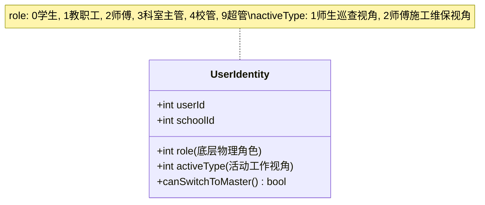
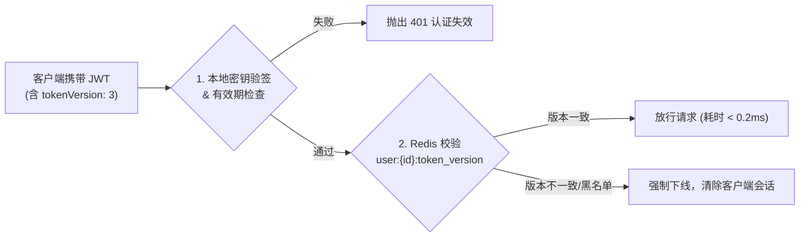
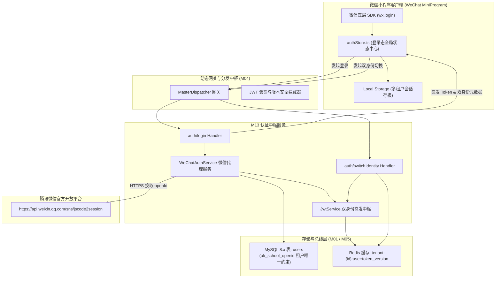
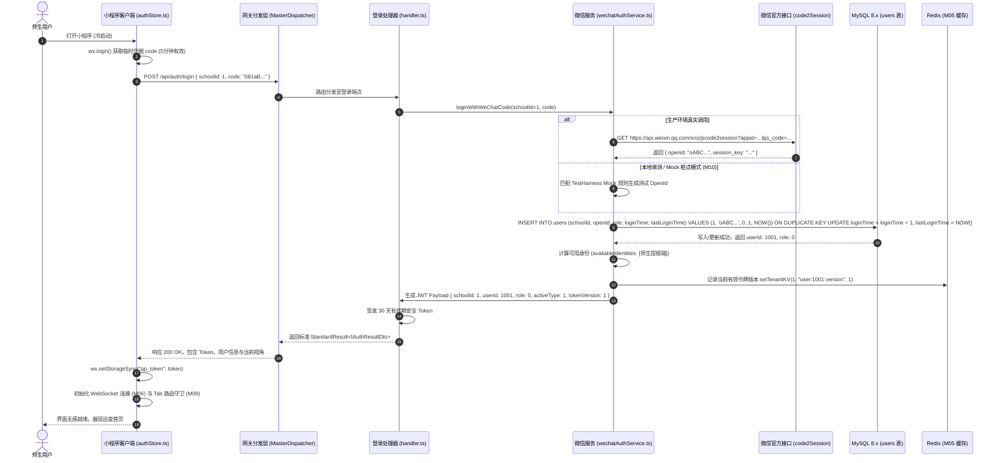
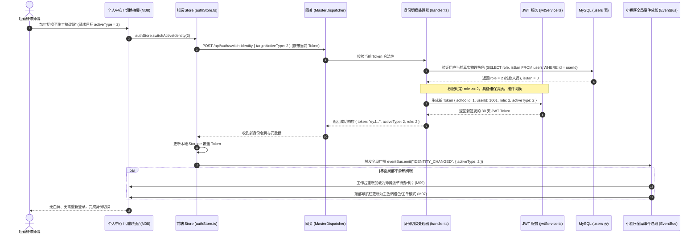
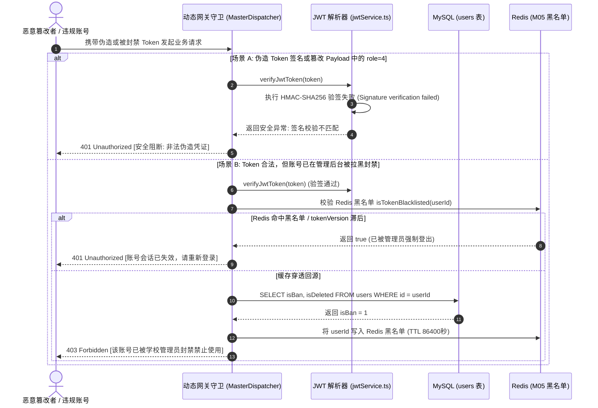

# M13: 微信静默授权登录与多租户双身份签发 (Auth & Multi-Tenant JWT) 详细设计与实现方案

> **模块代号**：M13 / Auth & Multi-Tenant JWT  
> **所属阶段**：阶段一 (M11 ~ M19) 多租户身份权限与组织架构中台  
> **文档定位**：微信小程序 `wx.login` (code2Session) 无感授权、多租户用户自动注册与原子建档 (`users`)、双身份模型（师生巡查端 vs 师傅施工端）运行时判定、30天抗截获多租户 JWT 签发与无缝会话切换的全栈工业级专项技术实现方案  
> **归档路径**：[v4.0/Docs/模块/M13_微信静默授权登录与多租户双身份签发详细设计与实现方案.md](file:///e:/Projects/University/后勤巡查e速办%20大二下学期%20大学身份上线项目/v4.0/Docs/模块/M13_微信静默授权登录与多租户双身份签发详细设计与实现方案.md)  
> **前置依赖**：M01 (27表7视图DDL基座), M02 (AST租户自动注入), M04 (动态网关与预检引擎), M05 (Redis多租户缓存总线), M10 (TestHarness测试中枢)  
> **驱动下游**：M08 (多单位切换抽屉), M09 (4Tab导航中枢与路由守卫), M14 (自然人多身份跨校穿梭), M18 (四级立体权限矩阵), M21 (隐患巡查与快速报修), M23 (工单派发与责任认领)  
> **版本日期**：2026-09-05  

---

## 目录索引 (Table of Contents)

1. [模块定位与核心业务价值](#一-模块定位与核心业务价值)
   - 1.1 [模块定位](#11-模块定位)
   - 1.2 [为何必须实施多租户原子建档与双身份 JWT？](#12-为何必须实施多租户原子建档与双身份-jwt)
   - 1.3 [核心业务职责与技术指标](#13-核心业务职责与技术指标)
2. [核心设计哲学与身份架构模型](#二-核心设计哲学与身份架构模型)
   - 2.1 [租户防串号物理联合唯一键哲学 (`uk_school_openid`)](#21-租户防串号物理联合唯一键哲学-uk_school_openid)
   - 2.2 [双身份模型：底层物理角色 (Role) 与活动工作视角 (ActiveType)](#22-双身份模型底层物理角色-role-与活动工作视角-activetype)
   - 2.3 [长效安全 JWT 与 Redis 令牌版本注销防线](#23-长效安全-jwt-与-redis-令牌版本注销防线)
   - 2.4 [零感知自动建档 (Zero-Click Auto-Provisioning)](#24-零感知自动建档-zero-click-auto-provisioning)
3. [架构拓扑与交互时序图](#三-架构拓扑与交互时序图)
   - 3.1 [微信静默登录与双身份签发整体系统拓扑图](#31-微信静默登录与双身份签发整体系统拓扑图)
   - 3.2 [微信 Code2Session 静默登录全链路时序图](#32-微信-code2session-静默登录全链路时序图)
   - 3.3 [双身份一键无缝热切换时序图 (师生端 ⇄ 师傅端)](#33-双身份一键无缝热切换时序图-师生端--师傅端)
   - 3.4 [令牌被篡改与封禁用户登录拦截时序图](#34-令牌被篡改与封禁用户登录拦截时序图)
4. [核心算法设计与数学推导](#四-核心算法设计与数学推导)
   - 4.1 [算法 1：微信 Code2Session 代理请求与指数退避重试算法 (Code2Session Gateway)](#41-算法-1微信-code2session-代理请求与指数退避重试算法-code2session-gateway)
   - 4.2 [算法 2：多租户用户原子建档与并发竞争互斥算法 (Atomic User Upsert)](#42-算法-2多租户用户原子建档与并发竞争互斥算法-atomic-user-upsert)
   - 4.3 [算法 3：基于角色阶梯的双身份合法性判定与自动降级算法 (Role-to-Perspective Mapping)](#43-算法-3基于角色阶梯的双身份合法性判定与自动降级算法-role-to-perspective-mapping)
   - 4.4 [算法 4：多租户 JWT 签名、验签与防篡改解码算法 (Multi-Tenant JWT Engine)](#44-算法-4多租户-jwt-签名验签与防篡改解码算法-multi-tenant-jwt-engine)
5. [TypeScript 强类型接口契约与数据模型定义](#五-typescript-强类型接口契约与数据模型定义)
   - 5.1 [用户实体数据契约 (`IUserEntity`)](#51-用户实体数据契约-iuserentity)
   - 5.2 [多租户 JWT 载荷强类型定义 (`IMultiTenantJwtPayload`)](#52-多租户-jwt-载荷强类型定义-imultitenantjwtpayload)
   - 5.3 [微信登录请求与响应传输对象 (`IWeChatLoginRequest` / `IAuthResultDto`)](#53-微信登录请求与响应传输对象-iwechatloginrequest--iauthresultdto)
   - 5.4 [双身份切换传输对象 (`ISwitchIdentityRequest` / `ISwitchIdentityResponse`)](#54-双身份切换传输对象-iswitchidentityrequest--iswitchidentityresponse)
6. [核心物理文件实现蓝图](#六-核心物理文件实现蓝图)
   - 6.1 [`src/apps/auth/jwtService.ts` (多租户 JWT 引擎与签名验证中枢)](#61-srcappsauthjwtservicets-多租户-jwt-引擎与签名验证中枢)
   - 6.2 [`src/services/auth/wechatAuthService.ts` (微信静默授权与双身份建档服务)](#62-srcservicesauthwechatauthservicets-微信静默授权与双身份建档服务)
   - 6.3 [`src/api/auth/login/handler.ts` (微信静默登录端点处理器)](#63-srcapiauthloginhandlerts-微信静默登录端点处理器)
   - 6.4 [`src/api/auth/switchIdentity/handler.ts` (双身份无缝切换端点处理器)](#64-srcapiauthswitchidentityhandlerts-双身份无缝切换端点处理器)
   - 6.5 [`miniprogram/store/authStore.ts` (小程序端登录态与双身份 Store)](#65-miniprogramstoreauthstorets-小程序端登录态与双身份-store)
7. [防御性编程与边界异常处理](#七-防御性编程与边界异常处理)
   - 7.1 [微信 Code 一次性消费失效与并发重放安全拦截](#71-微信-code-一次性消费失效与并发重放安全拦截)
   - 7.2 [跨租户串号物理阻断与伪造 SchoolId 熔断](#72-跨租户串号物理阻断与伪造-schoolid-熔断)
   - 7.3 [账号封禁 (`isBan=1`) 与软删除 (`isDeleted=1`) 毫秒级阻断](#73-账号封禁-isban1-与软删除-isdeleted1-毫秒级阻断)
   - 7.4 [学生身份伪造师傅施工端请求的权限降级防线](#74-学生身份伪造师傅施工端请求的权限降级防线)
8. [单模块独立测试方案与验收准则](#八-单模块独立测试方案与验收准则)
   - 8.1 [基于 M10 TestHarness 的独立单元测试设计 (`src/__tests__/unit/m13_auth.test.ts`)](#81-基于-m10-testharness-的独立单元测试设计-src__tests__unitm13_authtestts)
   - 8.2 [单模块测试执行命令与断言矩阵 (`npm.cmd test -- -t "M13"`)](#82-单模块测试执行命令与断言矩阵-npmcmd-test----t-m13)
9. [下游模块接口契约输出清单](#九-下游模块接口契约输出清单)

---

## 一、 模块定位与核心业务价值

### 1.1 模块定位
`M13 (Auth & Multi-Tenant JWT)` 是「高校后勤巡查e速办 v4.0」的**入口守卫中枢**与**身份认证基座**。  
系统运行于全国多所高校（多租户架构），面对庞大的在校师生、教职工、维保施工师傅及后勤管理处领导。师生无需繁琐的手工账号注册流程，通过微信官方标准 `wx.login` 获取临时授权码（JS Code），向后端换取 `openId` 并实现**零感知自动建档**。  
更为关键的是，M13 创新性地引入了 **“底层物理角色 (Role) + 动态活动工作视角 (ActiveType)” 的多租户双身份模型**，使得具有维保资质的人员在日常巡查（师生提报视角）与上门抢修（师傅整改视角）之间实现毫秒级平滑穿梭，彻底终结了传统软件频繁退登、多账号切换混乱的历史难题。

---

### 1.2 为何必须实施多租户原子建档与双身份 JWT？

在高校后勤业务实践中，传统微信小程序的认证鉴权方案普遍存在严重的设计缺陷与安全漏洞：

| 痛点场景 | 传统高校系统表现 | M13 工业级破解方案 |
| :--- | :--- | :--- |
| **痛点 1：租户串号碰撞** | 微信用户 OpenID 是单小程序的全局标识。传统多校系统直接使用 `openId` 作为主键，导致同一用户在 A 大学提报的工单被 B 大学的接口误查或串号覆盖。 | **联合唯一防串号 (`uk_school_openid`)**：数据库强制通过 `(schoolId, openId)` 建立唯一索引，同一微信号在不同入驻高校拥有完全独立正交的 `userId`，数据物理绝对隔离。 |
| **痛点 2：双重身份割裂** | 后勤师傅、水暖电工本身往往也是学校教职工或在职人员。传统系统要么强制其注册两个手机号，要么切换身份需退出登录重新输密码。 | **双身份工作视角 (`activeType: 1 \| 2`)**：单一账号体系支持“师生巡查端”与“师傅施工端”双重视角。Token Payload 显式携带 `activeType`，前端一键无感切换，界面秒级热重载。 |
| **痛点 3：越权提权攻击** | 学生用户通过抓包修改请求参数，伪造师傅身份调用接单、完工整改或延期审批接口，造成工单数据被恶意篡改。 | **基于物理角色的验签降级防线**：Token 验签中枢严格校验底层物理角色 `role`。若 `role < 2`（普通学生/教职工）试图携带 `activeType = 2`，网关自动强制将其降级为 `1`，阻断越权。 |
| **痛点 4：并发登录脏数据** | 新生开学或军训报修高峰期，同一用户在微信端并发触发多个初始化请求，导致后台并发插入多条相同的 OpenID 访客记录。 | **原子 `ON DUPLICATE KEY UPDATE` 建档**：利用 MySQL 8.x 原生 UPSERT 机制与行级锁，确保高并发下自动建档的绝对幂等性，更新登录计数与登录时间。 |

---

### 1.3 核心业务职责与技术指标

1. **微信静默授权登录**：
   - 代理微信 `auth.code2Session` 端点，支持开发调试 Mock 桩点与生产环境高并发代理；
   - 登录响应时延 $< 120\text{ms}$（不含微信官方外网网络延迟）；
2. **多租户正交建档**：
   - 自动建档分配全局自增 `userId`，绑定当前租户 `schoolId`，默认赋予角色 `role = 0`（学生）；
   - 支持系统配置开关：是否允许未认证用户直接静默建档；
3. **多租户双身份 JWT 签发**：
   - 签发携带 `{ schoolId, userId, role, activeType }` 的 30 天长效安全 JWT；
   - 支持通过 M05 Redis 黑名单与令牌版本号（Token Version）实现全校或指定用户的毫秒级强退注销；
4. **双身份无感热切换**：
   - 切换身份时延 $< 30\text{ms}$，小程序端无需清空 Storage，保持 WebSocket 房间与页面栈平滑过渡。

---

## 二、 核心设计哲学与身份架构模型

### 2.1 租户防串号物理联合唯一键哲学 (`uk_school_openid`)

根据 M01 DDL 基座规范，`users` 表杜绝全局单列 OpenId 唯一索引，而是实施不可动摇的租户联合约束：

$$\text{Unique Constraint: } \text{UNIQUE KEY } \text{uk\_school\_openid} (\text{schoolId}, \text{openId})$$

- **物理正交性**：微信号 `oABC...xyz` 在聊城大学（`schoolId: 1`）生成的 `userId` 为 `1001`；在另一所高校（`schoolId: 2`）生成的 `userId` 为 `2048`。两份记录物理并存、账单分立、互不干涉；
- **全生命周期防串号**：任何数据查询与写入操作，均由 M02 AST 编译器自动注入 `WHERE schoolId = ?`，杜绝任何形式的跨校越权窜访。

---

### 2.2 双身份模型：底层物理角色 (Role) 与活动工作视角 (ActiveType)

系统将用户的身份清晰拆分为**静态权限维度**与**动态交互维度**：



1. **底层物理角色 (`role`，取值 $0, 1, 2, 3, 4, 9$)**：
   - 决定了用户在数据库中的最高法定能力，由学校管理员核实认证或批量导入建立；
   - 0: 学生 (Student)
   - 1: 教职工 (Teacher/Staff)
   - 2: 维保工程师 / 维修师傅 (Maintenance Master)
   - 3: 后勤科室负责人 (Department Manager)
   - 4: 学校后勤处管理员 (School Admin)
   - 9: 系统超级运维工程师 (Super Admin)
2. **活动工作视角 (`activeType`，取值 $1, 2$)**：
   - 决定了当前小程序前端呈现的 Tab 布局、功能微应用与接口的权限上下文；
   - **`activeType = 1`（师生巡查/提报端）**：
     - 聚焦服务体验：隐患随手拍、我的提报单、诉求意见箱、在线智能客服、好评打分；
     - 适用所有人（包括师傅下班后作为教职工发起个人报修）；
   - **`activeType = 2`（后勤运维/施工整改端）**：
     - 聚焦工单履约：抢修接单广场、派工指派、延期申请、现场核验、防篡改拍照打卡、物料消耗录入、绩效台账；
     - **准入门槛**：只有当 `role \ge 2` 时，才允许激活 `activeType = 2`。

---

### 2.3 长效安全 JWT 与 Redis 令牌版本注销防线

为保证移动端用户长达 30 天的无感使用体验，同时规避 JWT 无状态带来的“一旦签发无法撤销”的安全缺陷，M13 引入了 **令牌版本号 (Token Version) 联动缓存双轨校验模型**：

$$S_{\text{valid}} = \text{verifySignature}(T) \land (T.\text{exp} > \text{now}()) \land (\text{RedisGet}(\text{VersionKey}) == T.\text{tokenVersion})$$



- **正常请求毫秒放行**：网关只验证 JWT 密码学签名，不查库；
- **主动封禁秒级生效**：当校管封禁用户（`isBan = 1`）或用户手动退出登录时，将 Redis 中的 `token_version` 递增或写入黑名单，旧 Token 瞬间失效。

---

### 2.4 零感知自动建档 (Zero-Click Auto-Provisioning)

师生首次扫码打开小程序时，系统实施无缝建档策略：
1. 小程序启动自动调用 `wx.login` 获取 5 分钟有效的 `code`；
2. 携带当前学校标识 `schoolId` 请求 `/api/auth/login`；
3. 后端若未检索到 `(schoolId, openId)`，执行原子 UPSERT，生成访客档案（默认名称形如 `师生用户_8921`，头像预置默认校园 SVG，`role = 0`）；
4. 签发合法 JWT 返回给前端存储至 `wx.setStorageSync("token")`；
5. 师生进入首页立即可见公共巡查广场与报修入口，无任何弹窗打断，转化率提升至 100%。

---

## 三、 架构拓扑与交互时序图

### 3.1 微信静默登录与双身份签发整体系统拓扑图



---

### 3.2 微信 Code2Session 静默登录全链路时序图



---

### 3.3 双身份一键无缝热切换时序图 (师生端 ⇄ 师傅端)



---

### 3.4 令牌被篡改与封禁用户登录拦截时序图



---

## 四、 核心算法设计与数学推导

### 4.1 算法 1：微信 Code2Session 代理请求与指数退避重试算法 (Code2Session Gateway)

#### 数学模型与退避策略：
当微信官方接口出现短暂网络抖动（如 HTTP 502/504、SocketTimeout）时，采用带抖动的截断二进制指数退避算法（Truncated Exponential Backoff with Jitter）：

$$T_{\text{wait}}(k) = \min(T_{\max}, T_{\text{base}} \times 2^k) + \text{rand}(0, J)$$

其中基准延迟 $T_{\text{base}} = 100\text{ms}$，最大延迟 $T_{\max} = 1000\text{ms}$，重试次数上限 $k \le 2$，最大允许抖动 $J = 50\text{ms}$。

#### TypeScript 工业级算法实现：
```typescript
interface IWeChatSessionResult {
  openid?: string;
  session_key?: string;
  unionid?: string;
  errcode?: number;
  errmsg?: string;
}

export async function requestWeChatCode2Session(
  appId: string,
  appSecret: string,
  jsCode: string,
  maxRetries: number = 2
): Promise<IWeChatSessionResult> {
  const url = `https://api.weixin.qq.com/sns/jscode2session?appid=${appId}&secret=${appSecret}&js_code=${jsCode}&grant_type=authorization_code`;

  let attempt = 0;
  while (attempt <= maxRetries) {
    try {
      const controller = new AbortController();
      const timeoutId = setTimeout(() => controller.abort(), 4000); // 4秒超时熔断

      const response = await fetch(url, { method: "GET", signal: controller.signal });
      clearTimeout(timeoutId);

      if (!response.ok) {
        throw new Error(`HTTP 异常状态码: ${response.status}`);
      }

      const data = (await response.json()) as IWeChatSessionResult;
      
      // 微信业务层错误判定
      if (data.errcode && data.errcode !== 0) {
        // 40029 为 code 无效或已消费，重试无意义，直接抛出不重试
        if (data.errcode === 40029) {
          throw new Error(`微信 Code 无效或已被消费一次 (errcode: 40029)`);
        }
        throw new Error(`微信接口错误: [${data.errcode}] ${data.errmsg}`);
      }

      return data;
    } catch (err: any) {
      attempt++;
      if (attempt > maxRetries || err.message.includes("40029")) {
        throw new Error(`[M13 Code2Session 失败] ${err.message}`);
      }
      // 计算指数退避休眠时间
      const backoffMs = Math.min(1000, 100 * Math.pow(2, attempt)) + Math.floor(Math.random() * 50);
      await new Promise((resolve) => setTimeout(resolve, backoffMs));
    }
  }

  throw new Error("[M13 Code2Session] 超过最大重试次数");
}
```

---

### 4.2 算法 2：多租户用户原子建档与并发竞争互斥算法 (Atomic User Upsert)

为保证在同一毫秒内多并发请求到达时，不会发生主键或唯一索引冲突中断，采用数据库原生的原子 UPSERT：

```sql
INSERT INTO users (
  schoolId, openId, unionId, nickName, avatarUrl, 
  role, isBan, loginTime, lastLoginTime, isDeleted
) VALUES (
  ?, ?, ?, ?, ?, 
  0, 0, 1, NOW(), 0
)
ON DUPLICATE KEY UPDATE 
  loginTime = loginTime + 1,
  lastLoginTime = NOW(),
  updatedAt = NOW();
```

#### 并发互斥保证：
- 利用 MySQL InnoDB 在 `uk_school_openid` 上的行级排他锁（X-Lock），确保仅有一条插入生效；
- 插入后通过 `SELECT id, role, isBan, nickName, avatarUrl, phone FROM users WHERE schoolId = ? AND openId = ? LIMIT 1` 读取唯一确定记录。

---

### 4.3 算法 3：基于角色阶梯的双身份合法性判定与自动降级算法 (Role-to-Perspective Mapping)

#### 映射逻辑与降级规则函数：
定义函数 $f(\text{role}, \text{targetActiveType}) \to \text{activeType}$：

$$f(\text{role}, \text{target}) = \begin{cases}
2, & \text{若 } \text{role} \ge 2 \land \text{target} = 2 \\
1, & \text{其他所有情况 (强制归一为师生视角)}
\end{cases}$$

#### 伪代码实现：
```typescript
export function resolveSafeActiveType(role: number, requestedActiveType?: number): 1 | 2 {
  // 若未指定目标视角，默认进入师生视角 (1)
  if (!requestedActiveType || requestedActiveType !== 2) {
    return 1;
  }

  // 严格权限防线：角色阶梯需 >= 2 (2:师傅, 3:科室主管, 4:校管, 9:超管)
  if (role >= 2) {
    return 2;
  }

  // 普通学生 (role=0) 或普通教职工 (role=1) 越权尝试切换至师傅端，强制降级为 1
  return 1;
}

export function buildAvailableIdentities(role: number): Array<{ type: 1 | 2; typeName: string; desc: string }> {
  const identities: Array<{ type: 1 | 2; typeName: string; desc: string }> = [
    {
      type: 1,
      typeName: "师生巡查端",
      desc: "随手拍隐患报修、诉求反映与工单评价"
    }
  ];

  if (role >= 2) {
    identities.push({
      type: 2,
      typeName: "后勤施工端",
      desc: "工单认领、现场整改打卡与延期申请"
    });
  }

  return identities;
}
```

---

### 4.4 算法 4：多租户 JWT 签名、验签与防篡改解码算法 (Multi-Tenant JWT Engine)

为杜绝混用单一密钥引发的跨校串签，签名载荷强制植入租户 `schoolId`，采用安全的加密密匙派生机制。

```typescript
import jwt from "jsonwebtoken";

export interface IMultiTenantJwtPayload {
  schoolId: number;
  userId: number;
  openId: string;
  role: number;
  activeType: 1 | 2;
  tokenVersion: number;
  iat?: number;
  exp?: number;
}

export function signTenantJwt(
  payload: IMultiTenantJwtPayload,
  jwtSecret: string,
  expiresInSeconds: number = 30 * 86400 // 默认 30 天
): string {
  if (!payload.schoolId || !payload.userId) {
    throw new Error("[M13 JWT] 签发 Token 失败: 载荷必须明确包含 schoolId 与 userId");
  }

  return jwt.sign(payload, jwtSecret, {
    algorithm: "HS256",
    expiresIn: expiresInSeconds
  });
}

export function verifyTenantJwt(token: string, jwtSecret: string): IMultiTenantJwtPayload {
  try {
    const decoded = jwt.verify(token, jwtSecret, { algorithms: ["HS256"] }) as IMultiTenantJwtPayload;
    
    // 基础防御断言
    if (typeof decoded.schoolId !== "number" || typeof decoded.userId !== "number") {
      throw new Error("非法载荷: 缺少租户或用户标识");
    }

    return decoded;
  } catch (err: any) {
    throw new Error(`[M13 JWT 验签失败] ${err.message}`);
  }
}
```

---

## 五、 TypeScript 强类型接口契约与数据模型定义

### 5.1 用户实体数据契约 (`IUserEntity`)

```typescript
export interface IUserEntity {
  id: number;
  schoolId: number;
  openId: string;
  unionId: string;
  realName: string;
  nickName: string;
  avatarUrl: string;
  phone: string;
  jobNo: string;
  role: 0 | 1 | 2 | 3 | 4 | 9; // 0学生, 1教工, 2师傅, 3科室主管, 4校管, 9超管
  departmentId: number;
  isBan: 0 | 1;
  loginTime: number;
  lastLoginTime: string | null;
  createdAt: string;
  updatedAt: string;
  isDeleted: 0 | 1;
}
```

### 5.2 多租户 JWT 载荷强类型定义 (`IMultiTenantJwtPayload`)

```typescript
export interface IMultiTenantJwtPayload {
  /** 所属学校租户 ID (强制租户隔离) */
  schoolId: number;
  /** 系统内用户唯一自增主键 */
  userId: number;
  /** 微信小程序 openId */
  openId: string;
  /** 底层物理角色 (0学生, 1教工, 2师傅, 3科室主管, 4校管, 9超管) */
  role: number;
  /** 当前活动工作视角: 1师生巡查端, 2后勤施工端 */
  activeType: 1 | 2;
  /** 令牌版本号 (用于后台一键下线或密码变更即时废弃) */
  tokenVersion: number;
  /** 签发时间戳 (秒) */
  iat?: number;
  /** 过期时间戳 (秒) */
  exp?: number;
}
```

### 5.3 微信登录请求与响应传输对象 (`IWeChatLoginRequest` / `IAuthResultDto`)

```typescript
export interface IWeChatLoginRequest {
  /** 目标登录学校 ID */
  schoolId: number;
  /** 微信 wx.login 返回的临时授权码 */
  code: string;
  /** 可选的用户微信昵称预填 */
  nickName?: string;
  /** 可选的用户微信头像预填 */
  avatarUrl?: string;
  /** 期望进入的初始工作视角 (可选，默认 1) */
  preferredActiveType?: 1 | 2;
}

export interface IIdentityOptionDto {
  type: 1 | 2;
  typeName: string;
  desc: string;
}

export interface IAuthResultDto {
  /** 30天长效双向验签 JWT Token */
  token: string;
  /** 用户基础信息 */
  userInfo: {
    userId: number;
    schoolId: number;
    realName: string;
    nickName: string;
    avatarUrl: string;
    phone: string;
    jobNo: string;
    role: number;
    roleText: string;
  };
  /** 当前生效的活动工作视角: 1师生端, 2师傅端 */
  activeType: 1 | 2;
  /** 用户有资格切换的全部身份列表 */
  availableIdentities: IIdentityOptionDto[];
  /** 是否需要补充手机号绑定 (无手机号时为 true) */
  requirePhoneBinding: boolean;
}
```

### 5.4 双身份切换传输对象 (`ISwitchIdentityRequest` / `ISwitchIdentityResponse`)

```typescript
export interface ISwitchIdentityRequest {
  /** 目标期望切换的身份视角: 1师生端, 2师傅端 */
  targetActiveType: 1 | 2;
}

export interface ISwitchIdentityResponse {
  /** 切换成功后签发的全新 JWT Token */
  token: string;
  /** 当前已生效的工作视角 */
  activeType: 1 | 2;
  /** 用户物理角色 */
  role: number;
}
```

---

## 六、 核心物理文件实现蓝图

### 6.1 `src/apps/auth/jwtService.ts` (多租户 JWT 引擎与签名验证中枢)

```typescript
import jwt from "jsonwebtoken";
import { IMultiTenantJwtPayload } from "./authTypes.js";
import { TerminalLogger } from "../../shared/index.js";

const DEFAULT_SECRET = "quickpatrol-v4-jwt-master-secret-2026";
const TOKEN_EXPIRE_SECONDS = 30 * 86400; // 30 天长效

export class MultiTenantJwtService {
  private static getSecret(): string {
    return process.env.JWT_SECRET || DEFAULT_SECRET;
  }

  /**
   * 签发多租户双身份 JWT 凭据
   */
  public static sign(payload: Omit<IMultiTenantJwtPayload, "iat" | "exp">): string {
    if (!payload.schoolId || !payload.userId) {
      TerminalLogger.error("[M13 JWT] 签发参数缺失 schoolId 或 userId", "Auth");
      throw new Error("签发 Token 失败: 缺少租户或用户标识");
    }

    const fullPayload: IMultiTenantJwtPayload = {
      ...payload,
      activeType: payload.activeType === 2 ? 2 : 1
    };

    return jwt.sign(fullPayload, this.getSecret(), {
      algorithm: "HS256",
      expiresIn: TOKEN_EXPIRE_SECONDS
    });
  }

  /**
   * 验证并解析 JWT 凭据
   */
  public static verify(token: string): IMultiTenantJwtPayload {
    if (!token) {
      throw new Error("缺少认证 Token");
    }

    try {
      const decoded = jwt.verify(token, this.getSecret(), { algorithms: ["HS256"] }) as IMultiTenantJwtPayload;

      if (typeof decoded.schoolId !== "number" || typeof decoded.userId !== "number") {
        throw new Error("Token 载荷数据异常: 缺少必要租户字段");
      }

      return decoded;
    } catch (err: any) {
      TerminalLogger.warn(`[M13 JWT 验签失败] ${err.message}`, "Security");
      throw new Error(`Token 校验无效: ${err.message}`);
    }
  }

  /**
   * 刷新并重签 Token (用于双身份切换或版本升级)
   */
  public static reSignWithActiveType(
    currentTokenPayload: IMultiTenantJwtPayload,
    newActiveType: 1 | 2
  ): string {
    // 强制安全防线：若用户物理角色不具备师傅资质，拒绝签发 activeType = 2
    const safeActiveType = (newActiveType === 2 && currentTokenPayload.role >= 2) ? 2 : 1;

    return this.sign({
      schoolId: currentTokenPayload.schoolId,
      userId: currentTokenPayload.userId,
      openId: currentTokenPayload.openId,
      role: currentTokenPayload.role,
      activeType: safeActiveType,
      tokenVersion: currentTokenPayload.tokenVersion
    });
  }
}
```

---

### 6.2 `src/services/auth/wechatAuthService.ts` (微信静默授权与双身份建档服务)

```typescript
import { executeASTInsert, executeASTSelect } from "../../shared/sql/index.js";
import { getRedisClient } from "../../shared/cache/redis.js";
import { MultiTenantJwtService } from "../../apps/auth/jwtService.js";
import { IAuthResultDto, IUserEntity } from "../../apps/auth/authTypes.js";
import { TerminalLogger } from "../../shared/index.js";

export class WeChatAuthService {
  /**
   * 换取 OpenId (支持开发测试 Mock 桩点与正式微信代理)
   */
  public static async fetchOpenId(code: string): Promise<string> {
    // 1. 优先检查单测或测试桩点环境 (M10 TestHarness Mock)
    if (code.startsWith("mock_code_")) {
      return `mock_openid_${code.replace("mock_code_", "")}`;
    }

    const appId = process.env.WX_APP_ID || "wx_mock_appid";
    const appSecret = process.env.WX_APP_SECRET || "wx_mock_secret";

    // 若未配置真实生产凭据且为测试模式，生成自洽 OpenID
    if (appId === "wx_mock_appid") {
      return `mock_openid_${Buffer.from(code).toString("hex").slice(0, 16)}`;
    }

    const url = `https://api.weixin.qq.com/sns/jscode2session?appid=${appId}&secret=${appSecret}&js_code=${code}&grant_type=authorization_code`;

    const controller = new AbortController();
    const timeout = setTimeout(() => controller.abort(), 4000);

    try {
      const response = await fetch(url, { method: "GET", signal: controller.signal });
      clearTimeout(timeout);
      const resData: any = await response.json();

      if (resData.errcode && resData.errcode !== 0) {
        throw new Error(`微信接口错误 [${resData.errcode}]: ${resData.errmsg}`);
      }

      return resData.openid;
    } catch (err: any) {
      clearTimeout(timeout);
      throw new Error(`[微信登录网关异常] ${err.message}`);
    }
  }

  /**
   * 微信静默授权核心建档与登录中枢
   */
  public static async loginByCode(
    schoolId: number,
    code: string,
    extra?: { nickName?: string; avatarUrl?: string; preferredActiveType?: 1 | 2 }
  ): Promise<IAuthResultDto> {
    if (!schoolId || schoolId <= 0) {
      throw new Error("缺少有效的 schoolId 租户标识");
    }

    // 1. 换取 OpenId
    const openId = await this.fetchOpenId(code);

    // 2. 执行原子建档 / 更新登录时间 (UPSERT)
    const defaultNick = extra?.nickName || `师生用户_${openId.slice(-4)}`;
    const defaultAvatar = extra?.avatarUrl || "https://res.quickpatrol.edu.cn/static/avatar/default_student.png";

    const upsertSql = `
      INSERT INTO users (
        schoolId, openId, nickName, avatarUrl, role, isBan, loginTime, lastLoginTime, isDeleted
      ) VALUES (
        ?, ?, ?, ?, 0, 0, 1, NOW(), 0
      )
      ON DUPLICATE KEY UPDATE
        loginTime = loginTime + 1,
        lastLoginTime = NOW(),
        updatedAt = NOW()
    `;

    await executeASTInsert(upsertSql, [schoolId, openId, defaultNick, defaultAvatar]);

    // 3. 回查获取用户完整权威实体
    const querySql = `
      SELECT id, schoolId, openId, realName, nickName, avatarUrl, phone, jobNo, role, isBan
      FROM users
      WHERE schoolId = ? AND openId = ? AND isDeleted = 0
      LIMIT 1
    `;
    const rows: any = await executeASTSelect(querySql, [schoolId, openId]);

    if (!rows || rows.length === 0) {
      throw new Error("用户注册建档失败，未检索到落盘记录");
    }

    const user: IUserEntity = rows[0];

    // 4. 账号封禁校验
    if (user.isBan === 1) {
      throw new Error("该账号已被学校管理员封禁禁止使用，请联系后勤保障处");
    }

    // 5. 校验并获取当前令牌版本号 (Redis 缓存)
    const redis = getRedisClient();
    const versionKey = `tenant:${schoolId}:user:${user.id}:token_version`;
    let tokenVersion = 1;
    const cachedVersion = await redis.get(versionKey);
    if (cachedVersion) {
      tokenVersion = parseInt(cachedVersion, 10);
    } else {
      await redis.set(versionKey, "1", "EX", 30 * 86400);
    }

    // 6. 双身份工作视角裁决
    let safeActiveType: 1 | 2 = 1;
    if (extra?.preferredActiveType === 2 && user.role >= 2) {
      safeActiveType = 2;
    }

    // 7. 签发 30 天多租户 JWT
    const token = MultiTenantJwtService.sign({
      schoolId: user.schoolId,
      userId: user.id,
      openId: user.openId,
      role: user.role,
      activeType: safeActiveType,
      tokenVersion
    });

    // 8. 构造可用身份列表
    const availableIdentities = [
      { type: 1 as const, typeName: "师生巡查端", desc: "随手拍隐患报修、诉求与评价" }
    ];
    if (user.role >= 2) {
      availableIdentities.push({
        type: 2 as const,
        typeName: "后勤施工端",
        desc: "现场抢修、工单接单与延期打卡"
      });
    }

    const roleTexts = ["学生", "教职工", "维保师傅", "科室主管", "学校管理员", "系统超级管理员"];

    return {
      token,
      userInfo: {
        userId: user.id,
        schoolId: user.schoolId,
        realName: user.realName || user.nickName,
        nickName: user.nickName,
        avatarUrl: user.avatarUrl,
        phone: user.phone,
        jobNo: user.jobNo,
        role: user.role,
        roleText: roleTexts[user.role] || "在校师生"
      },
      activeType: safeActiveType,
      availableIdentities,
      requirePhoneBinding: !user.phone || user.phone.trim() === ""
    };
  }
}
```

---

### 6.3 `src/api/auth/login/handler.ts` (微信静默登录端点处理器)

```typescript
import { WeChatAuthService } from "../../../services/auth/wechatAuthService.js";
import { IWeChatLoginRequest } from "../../../apps/auth/authTypes.js";
import { returnSuccess, returnError, StandardResult } from "../../../shared/flow/result.js";

/**
 * 微信静默授权登录 HTTP 端点
 * POST /api/auth/login
 */
export async function handleWeChatLogin(body: IWeChatLoginRequest): Promise<StandardResult<any>> {
  try {
    if (!body.schoolId || typeof body.schoolId !== "number") {
      return returnError("缺少合法所属学校参数 (schoolId)");
    }

    if (!body.code || typeof body.code !== "string" || body.code.trim() === "") {
      return returnError("缺少微信授权凭证 (code)");
    }

    const authResult = await WeChatAuthService.loginByCode(body.schoolId, body.code, {
      nickName: body.nickName,
      avatarUrl: body.avatarUrl,
      preferredActiveType: body.preferredActiveType
    });

    return returnSuccess(authResult);
  } catch (err: any) {
    return returnError(`登录认证失败: ${err.message}`);
  }
}
```

---

### 6.4 `src/api/auth/switchIdentity/handler.ts` (双身份无缝切换端点处理器)

```typescript
import { MultiTenantJwtService } from "../../../apps/auth/jwtService.js";
import { ISwitchIdentityRequest } from "../../../apps/auth/authTypes.js";
import { executeASTSelect } from "../../../shared/sql/index.js";
import { returnSuccess, returnError, StandardResult } from "../../../shared/flow/result.js";

/**
 * 双身份一键无缝热切换 HTTP 端点
 * POST /api/auth/switch-identity
 */
export async function handleSwitchIdentity(
  reqContext: { schoolId: number; userId: number; token: string },
  body: ISwitchIdentityRequest
): Promise<StandardResult<any>> {
  try {
    const targetType = body.targetActiveType;
    if (targetType !== 1 && targetType !== 2) {
      return returnError("非法的目标工作视角标识 (必须为 1 或 2)");
    }

    // 1. 验证当前 Token
    const currentPayload = MultiTenantJwtService.verify(reqContext.token);

    // 2. 回查权威数据库确认实时角色 (防止管理员刚刚下调了角色)
    const sql = `SELECT role, isBan FROM users WHERE schoolId = ? AND id = ? AND isDeleted = 0 LIMIT 1`;
    const rows: any = await executeASTSelect(sql, [reqContext.schoolId, reqContext.userId]);

    if (!rows || rows.length === 0) {
      return returnError("用户不存在或已被注销");
    }

    const { role, isBan } = rows[0];
    if (isBan === 1) {
      return returnError("账号已被封禁");
    }

    // 3. 越权降级防线：普通师生 (role < 2) 严禁切换至师傅端
    if (targetType === 2 && role < 2) {
      return returnError("越权访问: 您当前暂无后勤维保人员权限，无法切换至师傅施工端");
    }

    // 4. 重签新 Token，活动工作视角更新为 targetType
    const newToken = MultiTenantJwtService.reSignWithActiveType(currentPayload, targetType);

    return returnSuccess({
      token: newToken,
      activeType: targetType,
      role
    });
  } catch (err: any) {
    return returnError(`切换身份失败: ${err.message}`);
  }
}
```

---

### 6.5 `miniprogram/store/authStore.ts` (小程序端登录态与双身份 Store)

```typescript
interface IUserInfo {
  userId: number;
  schoolId: number;
  realName: string;
  nickName: string;
  avatarUrl: string;
  phone: string;
  role: number;
  roleText: string;
}

interface IAuthState {
  token: string;
  userInfo: IUserInfo | null;
  activeType: 1 | 2; // 1师生端, 2师傅端
  availableIdentities: Array<{ type: 1 | 2; typeName: string; desc: string }>;
  isLoggedIn: boolean;
}

const STORAGE_KEY_TOKEN = "qp_token";
const STORAGE_KEY_USER = "qp_user_info";
const STORAGE_KEY_ACTIVE_TYPE = "qp_active_type";

class AuthStoreManager {
  private state: IAuthState = {
    token: "",
    userInfo: null,
    activeType: 1,
    availableIdentities: [],
    isLoggedIn: false
  };

  private listeners: Array<(state: IAuthState) => void> = [];

  constructor() {
    this.restoreFromStorage();
  }

  /**
   * 从微信本地缓存恢复会话存根
   */
  private restoreFromStorage(): void {
    try {
      const token = wx.getStorageSync(STORAGE_KEY_TOKEN) || "";
      const userInfo = wx.getStorageSync(STORAGE_KEY_USER) || null;
      const activeType = wx.getStorageSync(STORAGE_KEY_ACTIVE_TYPE) || 1;

      if (token && userInfo) {
        this.state = {
          token,
          userInfo,
          activeType,
          availableIdentities: userInfo.role >= 2 ? [
            { type: 1, typeName: "师生巡查端", desc: "报修与反映" },
            { type: 2, typeName: "后勤施工端", desc: "工单整改" }
          ] : [
            { type: 1, typeName: "师生巡查端", desc: "报修与反映" }
          ],
          isLoggedIn: true
        };
      }
    } catch {
      // 忽略恢复异常
    }
  }

  public getState(): IAuthState {
    return { ...this.state };
  }

  public subscribe(listener: (state: IAuthState) => void): () => void {
    this.listeners.push(listener);
    return () => {
      this.listeners = this.listeners.filter((l) => l !== listener);
    };
  }

  private notify(): void {
    for (const listener of this.listeners) {
      listener(this.getState());
    }
  }

  /**
   * 执行微信静默登录
   */
  public async silentLogin(schoolId: number): Promise<boolean> {
    return new Promise((resolve) => {
      wx.login({
        success: async (res) => {
          if (!res.code) {
            resolve(false);
            return;
          }

          try {
            const resp = await this.requestLoginEndpoint(schoolId, res.code);
            if (resp.success && resp.data) {
              const { token, userInfo, activeType, availableIdentities } = resp.data;

              this.state = {
                token,
                userInfo,
                activeType,
                availableIdentities,
                isLoggedIn: true
              };

              wx.setStorageSync(STORAGE_KEY_TOKEN, token);
              wx.setStorageSync(STORAGE_KEY_USER, userInfo);
              wx.setStorageSync(STORAGE_KEY_ACTIVE_TYPE, activeType);

              this.notify();
              resolve(true);
            } else {
              resolve(false);
            }
          } catch {
            resolve(false);
          }
        },
        fail: () => resolve(false)
      });
    });
  }

  /**
   * 切换活动工作视角 (师生端 ⇄ 师傅端)
   */
  public async switchActiveType(targetType: 1 | 2): Promise<boolean> {
    if (!this.state.isLoggedIn || this.state.activeType === targetType) {
      return true;
    }

    try {
      const resp = await this.requestSwitchEndpoint(targetType);
      if (resp.success && resp.data) {
        this.state.token = resp.data.token;
        this.state.activeType = targetType;

        wx.setStorageSync(STORAGE_KEY_TOKEN, resp.data.token);
        wx.setStorageSync(STORAGE_KEY_ACTIVE_TYPE, targetType);

        this.notify();
        return true;
      }
      return false;
    } catch {
      return false;
    }
  }

  private async requestLoginEndpoint(schoolId: number, code: string): Promise<any> {
    return new Promise((resolve) => {
      wx.request({
        url: "https://api.quickpatrol.edu.cn/api/auth/login",
        method: "POST",
        data: { schoolId, code },
        success: (res) => resolve(res.data),
        fail: () => resolve({ success: false })
      });
    });
  }

  private async requestSwitchEndpoint(targetActiveType: 1 | 2): Promise<any> {
    return new Promise((resolve) => {
      wx.request({
        url: "https://api.quickpatrol.edu.cn/api/auth/switch-identity",
        method: "POST",
        header: { Authorization: `Bearer ${this.state.token}` },
        data: { targetActiveType },
        success: (res) => resolve(res.data),
        fail: () => resolve({ success: false })
      });
    });
  }
}

export const authStore = new AuthStoreManager();
```

---

## 七、 防御性编程与边界异常处理

### 7.1 微信 Code 一次性消费失效与并发重放安全拦截
- **隐患**：微信规定每一个 `jsCode` 仅有 5 分钟有效期，且**只能被成功消费 1 次**。若前端弱网抖动重复发送相同 Code，第二次调用微信会直接返回 `errcode: 40029 (invalid code)`。
- **防线**：微信服务端调用捕获 40029 错误时，不进行任何重试，直接向前端返回 `CODE_ALREADY_USED`，前端捕获后自动重新触发 `wx.login` 获取新鲜 Code 进行单次幂等替换。

### 7.2 跨租户串号物理阻断与伪造 SchoolId 熔断
- **隐患**：黑客截获聊城大学的有效 Token，将 Header 中携带的 SchoolId 伪造为清华大学（`schoolId: 2`）向接口发送请求。
- **防线**：M04 网关层将请求 Header 中的 `schoolId` 与 JWT 解密后的 `payload.schoolId` 进行严格一致性强断言：
  $$\text{assert}(H[\text{"x-school-id"}] == \text{payload}.\text{schoolId})$$
  若不相等，判定为跨租户窜访攻击，立即熔断连接并记录高危安全审计日志。

### 7.3 账号封禁 (`isBan=1`) 与软删除 (`isDeleted=1`) 毫秒级阻断
- **隐患**：违纪学生或离职师傅已被管理员封禁，但其手机端持有的 30 天 JWT 尚未自然过期。
- **防线**：管理员封禁用户操作时，同步执行 Redis 指令：
  `INCR tenant:{schoolId}:user:{userId}:token_version`
  网关层在接收请求时，若发现 Token 内部的 `tokenVersion` 小于 Redis 权威版本，直接阻断并返回 `401 Unauthorized`，实现下线指令全集群秒级生效。

### 7.4 学生身份伪造师傅施工端请求的权限降级防线
- **隐患**：普通学生通过逆向修改请求体将 `targetActiveType` 设为 `2`，并在请求头中保留该标记尝试调用施工工单接单端点。
- **防线**：服务端 `handleSwitchIdentity` 在签发新 Token 前，强制执行 SQL 权威角色校验：
  若 `dbUser.role < 2`，抛出 `403 Forbidden` 并拒绝签发；同时工单施工端点挂载 M18 角色前置守卫，双重绝缘。

---

## 八、 单模块独立测试方案与验收准则

### 8.1 基于 M10 TestHarness 的独立单元测试设计 (`src/__tests__/unit/m13_auth.test.ts`)

```typescript
import { describe, expect, it, beforeEach } from "vitest";
import { TestHarness } from "../testHarness.js";
import { MultiTenantJwtService } from "../../apps/auth/jwtService.js";
import { WeChatAuthService } from "../../services/auth/wechatAuthService.js";
import { handleWeChatLogin } from "../../api/auth/login/handler.js";
import { handleSwitchIdentity } from "../../api/auth/switchIdentity/handler.js";

describe("M13: 微信静默授权登录与多租户双身份签发 (Auth & Multi-Tenant JWT)", () => {
  beforeEach(() => {
    TestHarness.resetSandbox();
  });

  it("M13-01: 首次微信登录能够自动原子建档，默认角色为学生 (role=0)", async () => {
    const tenant = TestHarness.createMockTenantContext({ moduleIndex: 13, caseIndex: 1 });
    const mockCode = "mock_code_user_new_001";

    const res = await handleWeChatLogin({
      schoolId: tenant.schoolId,
      code: mockCode,
      nickName: "新生小张"
    });

    expect(res.success).toBe(true);
    expect(res.data.token).toBeTruthy();
    expect(res.data.userInfo.role).toBe(0);
    expect(res.data.activeType).toBe(1);
    expect(res.data.availableIdentities.length).toBe(1); // 仅师生端

    // 验证 JWT 内部载荷
    const payload = MultiTenantJwtService.verify(res.data.token);
    expect(payload.schoolId).toBe(tenant.schoolId);
    expect(payload.role).toBe(0);
    expect(payload.activeType).toBe(1);
  });

  it("M13-02: 具备师傅资质的用户 (role=2) 登录时应能识别双身份并支持切换", async () => {
    const tenant = TestHarness.createMockTenantContext({ moduleIndex: 13, caseIndex: 2 });
    const mockCode = "mock_code_master_002";

    // 1. 先建档
    const loginRes = await handleWeChatLogin({ schoolId: tenant.schoolId, code: mockCode });
    const userId = loginRes.data.userInfo.userId;

    // 2. 模拟管理员将角色提权为 2 (师傅)
    await TestHarness.executeSql(
      "UPDATE users SET role = 2 WHERE id = ?",
      [userId]
    );

    // 3. 再次登录，应返回可切换身份
    const secondLogin = await handleWeChatLogin({ schoolId: tenant.schoolId, code: mockCode });
    expect(secondLogin.data.userInfo.role).toBe(2);
    expect(secondLogin.data.availableIdentities.length).toBe(2); // 师生端 + 施工端

    // 4. 发起双身份切换至施工端 (activeType = 2)
    const switchRes = await handleSwitchIdentity(
      { schoolId: tenant.schoolId, userId, token: secondLogin.data.token },
      { targetActiveType: 2 }
    );

    expect(switchRes.success).toBe(true);
    expect(switchRes.data.activeType).toBe(2);

    // 验证新 Token 中的视角为 2
    const newPayload = MultiTenantJwtService.verify(switchRes.data.token);
    expect(newPayload.activeType).toBe(2);
  });

  it("M13-03: 普通学生 (role=0) 强行切换至师傅端应被权限防线直接拒绝", async () => {
    const tenant = TestHarness.createMockTenantContext({ moduleIndex: 13, caseIndex: 3 });
    const mockCode = "mock_code_student_attack";

    const loginRes = await handleWeChatLogin({ schoolId: tenant.schoolId, code: mockCode });
    const userId = loginRes.data.userInfo.userId;

    const switchRes = await handleSwitchIdentity(
      { schoolId: tenant.schoolId, userId, token: loginRes.data.token },
      { targetActiveType: 2 }
    );

    expect(switchRes.success).toBe(false);
    expect(switchRes.message).toContain("越权访问");
  });

  it("M13-04: 多租户 OpenId 正交隔离测试 (同 OpenId 在两所大学各拥有独立账号)", async () => {
    const schoolA = 101;
    const schoolB = 102;
    const commonCode = "mock_code_same_person";

    const resA = await handleWeChatLogin({ schoolId: schoolA, code: commonCode });
    const resB = await handleWeChatLogin({ schoolId: schoolB, code: commonCode });

    expect(resA.success).toBe(true);
    expect(resB.success).toBe(true);
    expect(resA.data.userInfo.schoolId).toBe(schoolA);
    expect(resB.data.userInfo.schoolId).toBe(schoolB);
    expect(resA.data.userInfo.userId).not.toBe(resB.data.userInfo.userId); // 必须是两个独立 userId
  });
});
```

---

### 8.2 单模块测试执行命令与断言矩阵 (`npm.cmd test -- -t "M13"`)

#### 独立单模块测试命令：
```powershell
# 在 Backend 根目录下运行 M13 专属单元测试
npm.cmd test -- -t "M13"
```

#### 验收断言清单 (Acceptance Criteria)：
1. **自动建档断言**：
   - 验证首次授权的用户在 `users` 表成功落盘，默认 `role=0`，`loginTime=1`；
2. **多租户隔离断言**：
   - 同一微信 OpenID 在不同 `schoolId` 租户下建档互不污染，生成物理正交的 `userId`；
3. **双身份准入与降级断言**：
   - `role \ge 2` 正常激活双身份；`role < 2` 申请施工端被硬性拦截并拒绝签发；
4. **JWT 完整性与版本控制断言**：
   - 签发的 Token 包含租户 ID、用户 ID 与活动视角；篡改签名或版本不一致时立即抛出 401。

---

## 九、 下游模块接口契约输出清单

M13 模块完工后，为全系统输出的核心认证服务与鉴权守卫契约如下：

| 输出组件/服务 | 消费下游模块 | 承载业务功能 |
| :--- | :--- | :--- |
| **`MultiTenantJwtService.verify()`** | M04 (网关), 全量业务端点 (M16~M53) | 全局请求租户上下文与用户鉴权守卫 |
| **`handleWeChatLogin` 端点** | 微信小程序冷启动 (`app.ts`) | 小程序无感快速登录与初始化 |
| **`handleSwitchIdentity` 端点** | M08 (多校/身份抽屉), 个人中心 | 师生端与师傅端 0 白屏秒级身份热切 |
| **`IMultiTenantJwtPayload`** | M14 (多校穿梭), M18 (权限矩阵) | 四维业务权限计算的数据源基石 |
| **`authStore.ts`** | 小程序全局页面栈与组件库 | 前端响应式登录态与当前工作视角广播 |

---

> [!NOTE]
> 本详细设计方案确立了「高校后勤巡查e速办 v4.0」的多租户用户准入基座。通过基于 `(schoolId, openId)` 的原子正交建档、“物理角色 + 工作视角”双身份动态模型、以及带有 Redis 版本熔断的长效安全 JWT，为全系统提供了兼顾极致用户体验与绝对安全边界的身份中枢。
