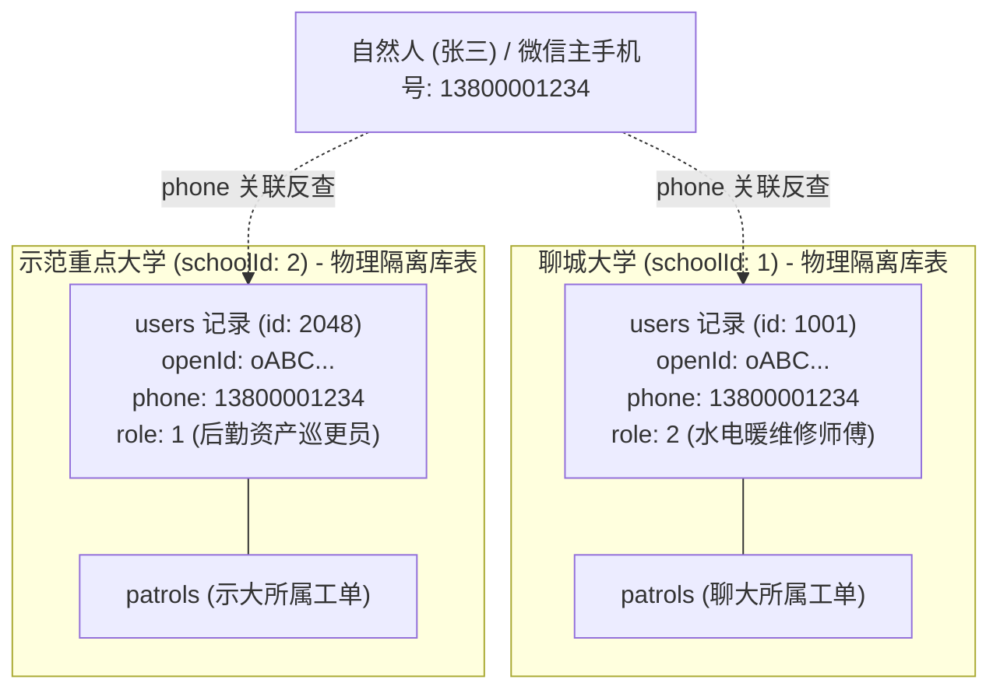
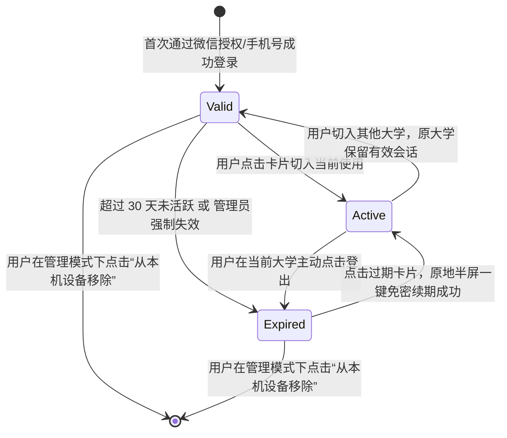
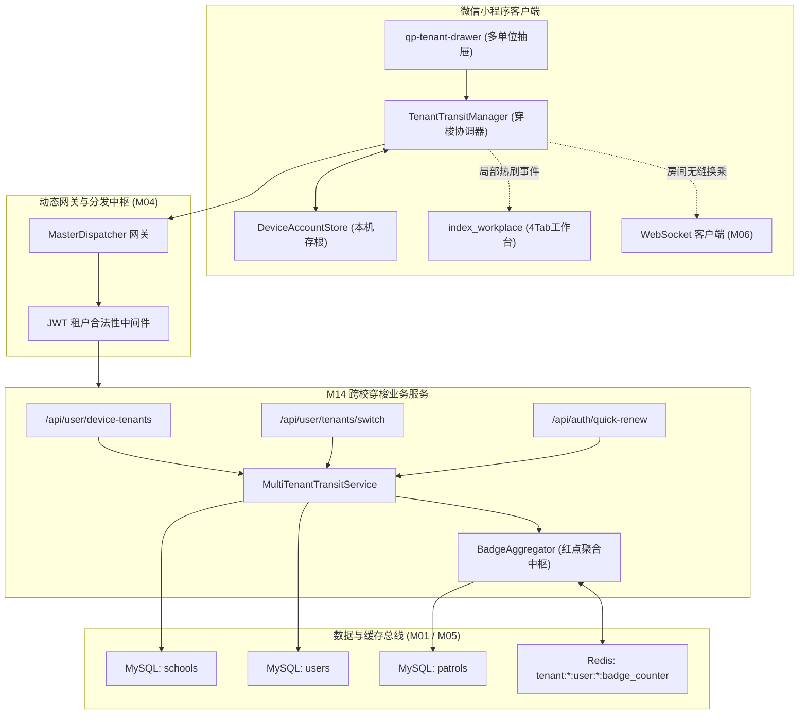
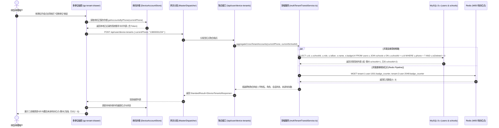
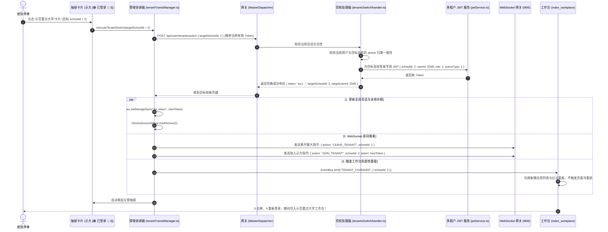
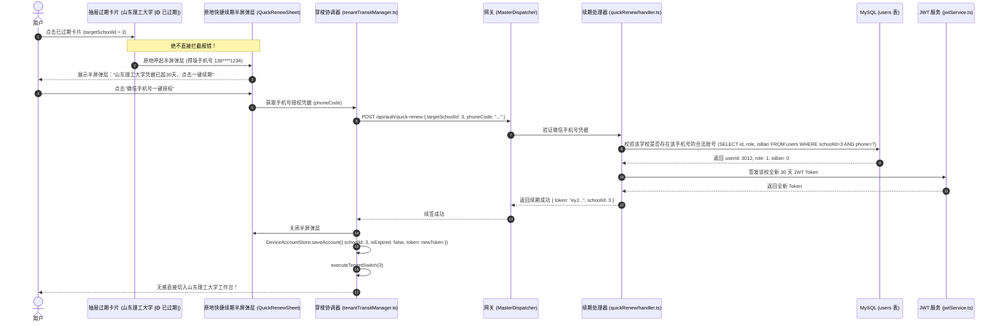

# M14: 自然人多身份独立存储与多校会话穿梭 (Multi-Identity & Tenant Switching) 详细设计与实现方案

> **模块代号**：M14 / Multi-Identity & Tenant Switching  
> **所属阶段**：阶段一 (M11 ~ M19) 多租户身份权限与组织架构中台  
> **文档定位**：同一自然人手机号跨多所大学独立建档与身份反查、跨校离线未读待办红点并发聚合、三态会话卡片状态机、30天凭据原地半屏免密续期、以及 0 白屏秒级会话热切的全栈工业级专项技术实现方案  
> **归档路径**：[v4.0/Docs/模块/M14_自然人多身份独立存储与多校会话穿梭详细设计与实现方案.md](file:///e:/Projects/University/后勤巡查e速办%20大二下学期%20大学身份上线项目/v4.0/Docs/模块/M14_自然人多身份独立存储与多校会话穿梭详细设计与实现方案.md)  
> **前置依赖**：M01 (27表7视图DDL基座), M02 (AST租户自动注入), M05 (Redis多租户缓存总线), M08 (多单位切换抽屉组件), M10 (TestHarness测试中枢), M13 (多租户双身份JWT)  
> **驱动下游**：M08 (抽屉UI动态绑定), M09 (4Tab工作台热刷新), M18 (四级立体权限矩阵), M21 (跨校工单快速提报), M23 (跨校网格派单待办池), M42 (跨校未读消息汇总)  
> **版本日期**：2026-09-05  

---

## 目录索引 (Table of Contents)

1. [模块定位与核心业务价值](#一-模块定位与核心业务价值)
   - 1.1 [模块定位](#11-模块定位)
   - 1.2 [为何必须建立跨校会话穿梭与红点聚合体系？](#12-为何必须建立跨校会话穿梭与红点聚合体系)
   - 1.3 [核心业务职责与技术指标](#13-核心业务职责与技术指标)
2. [核心设计哲学与跨校身份模型](#二-核心设计哲学与跨校身份模型)
   - 2.1 [自然人手机号软关联哲学 (Decoupled Physical Storage)](#21-自然人手机号软关联哲学-decoupled-physical-storage)
   - 2.2 [三态会话卡片状态机模型 (Active / Valid / Expired)](#22-三态会话卡片状态机模型-active--valid--expired)
   - 2.3 [跨校未读待办红点轻量级聚合引擎](#23-跨校未读待办红点轻量级聚合引擎)
   - 2.4 [0 白屏秒级会话热切与 WebSocket 房间平滑换乘法则](#24-0-白屏秒级会话热切与-websocket-房间平滑换乘法则)
3. [架构拓扑与交互时序图](#三-架构拓扑与交互时序图)
   - 3.1 [跨校多租户会话穿梭整体系统拓扑图](#31-跨校多租户会话穿梭整体系统拓扑图)
   - 3.2 [打开抽屉触发跨校账号与待办红点并发聚合时序图](#32-打开抽屉触发跨校账号与待办红点并发聚合时序图)
   - 3.3 [点击有效学校卡片 0 白屏秒级热切时序图 (Valid -> Active)](#33-点击有效学校卡片-0-白屏秒级热切时序图-valid---active)
   - 3.4 [已过期学校原地半屏免密一键续期时序图 (Expired -> Active)](#34-已过期学校原地半屏免密一键续期时序图-expired---active)
4. [核心算法设计与数学推导](#四-核心算法设计与数学推导)
   - 4.1 [算法 1：基于手机号跨租户反查与多校未读待办并行聚合算法 (Cross-Tenant Badge Aggregator)](#41-算法-1基于手机号跨租户反查与多校未读待办并行聚合算法-cross-tenant-badge-aggregator)
   - 4.2 [算法 2：跨校会话 0 白屏热切与 WebSocket 房间平滑换乘算法 (Zero-Flicker Tenant Transit)](#42-算法-2跨校会话-0-白屏热切与-websocket-房间平滑换乘算法-zero-flicker-tenant-transit)
   - 4.3 [算法 3：过期卡片原地半屏免密一键续期算法 (In-Situ Session Quick Renew)](#43-算法-3过期卡片原地半屏免密一键续期算法-in-situ-session-quick-renew)
   - 4.4 [算法 4：本机设备存根容量 LRU 自动淘汰与防伪造校验算法 (Device Account LRU & Integrity Guard)](#44-算法-4本机设备存根容量-lru-自动淘汰与防伪造校验算法-device-account-lru--integrity-guard)
5. [TypeScript 强类型接口契约与数据模型定义](#五-typescript-强类型接口契约与数据模型定义)
   - 5.1 [本机设备账号存根物理契约 (`IDeviceAccountRecord`)](#51-本机设备账号存根物理契约-ideviceaccountrecord)
   - 5.2 [跨校关联账号与待办红点响应对象 (`ICrossTenantItemDto` / `IDeviceTenantsResponse`)](#52-跨校关联账号与待办红点响应对象-icrosstenantitemdto--idevicetenantsresponse)
   - 5.3 [多校切换请求与响应传输对象 (`ISwitchTenantRequest` / `ISwitchTenantResponse`)](#53-多校切换请求与响应传输对象-iswitchtenantrequest--iswitchtenantresponse)
   - 5.4 [快捷续期请求与响应传输对象 (`IQuickRenewRequest` / `IQuickRenewResponse`)](#54-快捷续期请求与响应传输对象-iquickrenewrequest--iquickrenewresponse)
6. [核心物理文件实现蓝图](#六-核心物理文件实现蓝图)
   - 6.1 [`src/services/user/multiTenantTransitService.ts` (跨校穿梭与待办聚合业务服务)](#61-srcservicesusermultitenanttransitservicets-跨校穿梭与待办聚合业务服务)
   - 6.2 [`src/api/user/deviceTenants/handler.ts` (多校账号与待办红点反查端点)](#62-srcapiuserdevicetenantshandlerts-多校账号与待办红点反查端点)
   - 6.3 [`src/api/user/tenantsSwitch/handler.ts` (跨校会话平滑热切端点)](#63-srcapiusertenantsswitchhandlerts-跨校会话平滑热切端点)
   - 6.4 [`src/api/auth/quickRenew/handler.ts` (过期会话快捷一键续期端点)](#64-srcapiauthquickrenewhandlerts-过期会话快捷一键续期端点)
   - 6.5 [`miniprogram/utils/tenantTransitManager.ts` (小程序端多校穿梭协调器)](#65-miniprogramutilstenanttransitmanagerts-小程序端多校穿梭协调器)
7. [防御性编程与边界异常处理](#七-防御性编程与边界异常处理)
   - 7.1 [手机号跨校反查防撞库与数据安全脱敏防线](#71-手机号跨校反查防撞库与数据安全脱敏防线)
   - 7.2 [目标学校已停运或欠费配额熔断降级 (M11 联动)](#72-目标学校已停运或欠费配额熔断降级-m11-联动)
   - 7.3 [跨租户 Token 置换时的伪造与重放攻击拦截](#73-跨租户-token-置换时的伪造与重放攻击拦截)
   - 7.4 [本机 Storage 存储耗尽与 LRU 20 所大学上限守护](#74-本机-storage-存储耗尽与-lru-20-所大学上限守护)
8. [单模块独立测试方案与验收准则](#八-单模块独立测试方案与验收准则)
   - 8.1 [基于 M10 TestHarness 的独立单元测试设计 (`src/__tests__/unit/m14_transit.test.ts`)](#81-基于-m10-testharness-的独立单元测试设计-src__tests__unitm14_transittestts)
   - 8.2 [单模块测试执行命令与断言矩阵 (`npm.cmd test -- -t "M14"`)](#82-单模块测试执行命令与断言矩阵-npmcmd-test----t-m14)
9. [下游模块接口契约输出清单](#九-下游模块接口契约输出清单)

---

## 一、 模块定位与核心业务价值

### 1.1 模块定位
`M14 (Multi-Identity & Tenant Switching)` 是「高校后勤巡查e速办 v4.0」的**跨校身份穿梭中枢**与**微前端会话漫游控制器**。  
在全国高校集团化办学、高校后勤社会化改革以及多校区协同管理的背景下，同一自然人往往具备多重物理身份：  
- 一名维修工程师可能同时承接“聊城大学”与“示范重点大学”的弱电运维合同；  
- 一名专家教授可能在母校承担科研教学，并在兄弟高校兼任重点实验室顾问；  
- 一名跨校区保卫干部需全天候监控两个不同法人的校园后勤安全。  

M14 模块与 M08（多单位切换抽屉 UI）和 M13（多租户双身份 JWT）形成三角闭环，以自然人实名手机号为桥梁，在**数据绝对物理隔离（零串号）**的前提下，构建起跨校账号智能反查、各校待办红点毫秒聚合、30天长效凭据一键续期以及 **0 白屏秒级会话平滑热切**，彻底解决了传统多租户系统“退登重新输密、多微信号切换、跨校待办黑盒”的交互痛点。

---

### 1.2 为何必须建立跨校会话穿梭与红点聚合体系？

传统高校软件在处理多校多身份时，普遍存在严重的业务割裂与架构弊端：

| 痛点场景 | 传统多校系统表现 | M14 工业级破解方案 |
| :--- | :--- | :--- |
| **痛点 1：跨校待办变成“黑盒盲区”** | 用户处于 A 大学工作台时，完全无法感知 B 大学名下已被派发紧急维修工单或有待办审批，直到被催办罚款才知晓。 | **跨校未读待办红点并发聚合**：拉开左侧抽屉瞬间，服务端以并行管道查询该手机号在各入驻高校名下的待办未读数（如聊大 `[0]`、示大 `[3]`），红点一览无余。 |
| **痛点 2：会话切换“强制白屏重启”** | 切换大学时，传统系统粗暴清空 `wx.clearStorageSync()`，导致小程序重新经历冷启动、白屏加载、重新扫码授权，破坏当前页面栈。 | **0 白屏微前端会话热切**：换取目标校新 Token ➔ 静默置换全局 Context ➔ WebSocket 房间无缝换乘 ➔ 工作台局部热重载，耗时 $< 200\text{ms}$，保留当前 Tab 视口。 |
| **痛点 3：过期拦截打断业务流** | 当某大学 Token 超过有效期，传统系统直接弹出“登录已失效”全屏错误阻断用户，强行踢出登录页。 | **三态会话卡片与原地半屏免密续期**：将卡片标为优雅的石墨灰“已过期”，点击原地呼起半屏弹层一键完成微信手机号校验并自动切入，全程无跳出感。 |
| **痛点 4：多校数据串联安全隐患** | 某些系统为了方便切换，直接将多个学校的工单混查在一张宽表中，由于缺乏物理隔离，经常发生 A 校人员误审 B 校工单的灾难级事故。 | **物理绝对隔离 + 凭据动态置换**：MySQL 强依赖 `(schoolId, openId)` 联合唯一键，切换学校必须颁发对应目标租户签名的专用 JWT，权限边界固若金汤。 |

---

### 1.3 核心业务职责与技术指标

1. **跨校账号智能反查**：
   - 根据用户当前绑定的实名手机号 `phone`（通过微信手机号快速授权建立），毫秒级反查该自然人在全平台已注册建档的所有高校清单；
2. **多校待办红点并发聚合**：
   - 支持单次调用并行聚合最多 10 所高校的实时待办工单数与未读消息数，聚合响应时延 $< 150\text{ms}$；
3. **0 白屏秒级会话平滑热切**：
   - 点击已登录学校卡片，服务端验签无误后签发目标校新 Token，客户端 0 重新冷启动、0 白屏完成工作台局部刷新，热切时延 $< 50\text{ms}$；
4. **长效凭据半屏快捷续期**：
   - 针对超过 30 天未活跃的过期大学卡片，提供原地半屏一键授权快捷续期能力；
5. **设备本地存根安全守护**：
   - 客户端 `DeviceAccountStore` 采用 LRU 算法维护最多 20 所大学的历史存根，本地存储消耗严格控制在 $50\text{KB}$ 以内。

---

## 二、 核心设计哲学与跨校身份模型

### 2.1 自然人手机号软关联哲学 (Decoupled Physical Storage)

系统坚持**“物理存储绝对隔离，业务逻辑手机号软关联”**的最高架构准则：



- **物理层面**：张三在聊城大学是 `userId: 1001`，在示范重点大学是 `userId: 2048`。其在两所大学的工单、权限、部门拓扑存储在完全独立的物理行中，由 M02 AST 引擎强加 `WHERE schoolId = ?` 隔离；
- **逻辑层面**：当张三在聊大登录后，系统通过其绑定手机号 `13800001234`，跨租户检索出 `schoolId: 2` 下同样具有该手机号的记录，从而在多单位抽屉中将其作为“已拥有高校账号”展示并提供一键穿梭。

---

### 2.2 三态会话卡片状态机模型 (Active / Valid / Expired)

在小程序左侧多单位切换抽屉中，每一个大学卡片具备三种高辨识度微质感运行状态：



1. **当前使用中 (`Active`)**：
   - 视觉呈现：极光蓝外发光边框，右上角显目标签 `[当前单位]`；
   - 交互逻辑：点击提示“当前正在使用该单位”，自动收起抽屉。
2. **有效会话已登录 (`Valid`)**：
   - 视觉呈现：浅底毛玻璃微质感，右上角显示常驻微绿点 `[🟢 已登录]`，显示该大学待办红点（如 `🔴 3`）；
   - 交互逻辑：**0 校验秒级无感热切**。点击立即置换 Token，工作台局部刷新，保留当前 Tab 视口。
3. **登录已过期 / 待续期 (`Expired`)**：
   - 视觉呈现：低饱和度石墨灰卡片，黄色徽标 `[🟡 登录已过期 · 点击续期]`，但**离线未读红点依然感知**；
   - 交互逻辑：**绝不弹窗报错中断！** 原地呼起半屏快捷弹层，点击一键授权瞬间续签并切入目标大学。

---

### 2.3 跨校未读待办红点轻量级聚合引擎

为了避免跨校查询产生严重的数据库 I/O 阻塞，聚合引擎实施了严格的**快慢分层查询与 Redis 缓存保护策略**：

$$\text{BadgeCount}(\text{schoolId}, \text{userId}) = N_{\text{urgentTasks}} + N_{\text{unreadChat}} + N_{\text{waitingReviews}}$$

1. **优先查询 Redis 聚合缓存**：
   - 每个高校在工单派发（M23）或收到聊天消息时，向 Redis 维护键：
     `tenant:{schoolId}:user:{userId}:badge_counter`
   - 聚合端点并发执行 `MGET`，在 $2\text{ms}$ 级完成全部学校红点计算；
2. **缓存击穿安全降级回源**：
   - 若未命中缓存，触发高效索引单条 SQL：
     `SELECT COUNT(1) FROM patrols WHERE schoolId = ? AND (handlerUserId = ? OR creatorId = ?) AND status IN (1, 2)`
   - 设置防穿透短 TTL（60秒）。

---

### 2.4 0 白屏秒级会话热切与 WebSocket 房间平滑换乘法则

传统会话切换之所以发生白屏，是因为破坏了运行时全局单例（Global Singleton）。M14 制定了微前端级别的会话热切三原则：

```
┌─────────────────────────────────────────────────────────────┐
│                 0 白屏微前端会话热切流水线                   │
├──────────────┬───────────────────────────────┬──────────────┤
│ 阶段一 (网络)│ POST /api/user/tenants/switch │ 换取新校 Token│
├──────────────┼───────────────────────────────┼──────────────┤
│ 阶段二 (总线)│ WebSocket 房间无缝退订与重加   │ 监听换乘     │
├──────────────┼───────────────────────────────┼──────────────┤
│ 阶段三 (视图)│ EventBus.emit("TENANT_CHANGED")│ 工作台局部刷新│
└──────────────┴───────────────────────────────┴──────────────┘
```

1. **不销毁页面栈**：小程序当前的 `pages/index/index` 或微应用页面不执行 `wx.reLaunch`，防止发生视觉闪烁；
2. **WebSocket 房间换乘**：
   - 客户端向网关发送：`{"action": "LEAVE_TENANT", "schoolId": oldSchoolId}`；
   - 随即发送：`{"action": "JOIN_TENANT", "schoolId": newSchoolId, "token": newToken}`；
   - 整个过程 WebSocket 保持长连接常驻，无需重新执行 TCP 三次握手；
3. **工作台组件局部重载**：
   - 触发全局事件 `TENANT_CHANGED`，工作台感知到租户变更，仅重新触发微应用卡片清单与统计卡片的 `fetchData()`，视口平滑过渡。

---

## 三、 架构拓扑与交互时序图

### 3.1 跨校多租户会话穿梭整体系统拓扑图



---

### 3.2 打开抽屉触发跨校账号与待办红点并发聚合时序图



---

### 3.3 点击有效学校卡片 0 白屏秒级热切时序图 (Valid -> Active)



---

### 3.4 已过期学校原地半屏免密一键续期时序图 (Expired -> Active)



---

## 四、 核心算法设计与数学推导

### 4.1 算法 1：基于手机号跨租户反查与多校未读待办并行聚合算法 (Cross-Tenant Badge Aggregator)

#### 并发并行聚合模型：
当用户拥有 $M$ 所入驻高校账号时，若采用串行查询，总耗时为 $T = \sum_{i=1}^M t_i$，极易超时。  
本算法采用基于 Promise 并发管道与 Redis 批量查询优化，将查询复杂度压缩为恒定：

$$T_{\text{total}} = \max_{1 \le i \le M} (t_{\text{db\_query}}) + t_{\text{redis\_mget}} \approx \mathcal{O}(1)$$

#### TypeScript 工业级算法实现：
```typescript
export interface ICrossTenantBadgeResult {
  schoolId: number;
  userId: number;
  schoolName: string;
  badgeCount: number;
  role: number;
  roleName: string;
}

export async function aggregateCrossTenantAccounts(
  phone: string,
  currentSchoolId: number
): Promise<ICrossTenantBadgeResult[]> {
  if (!phone || phone.length !== 11) {
    return [];
  }

  // 1. 跨租户反查该手机号关联的所有高校档案 (基于 idx_school_phone 索引)
  const sql = `
    SELECT u.id AS userId, u.schoolId, u.role, u.isBan, s.name AS schoolName
    FROM users u
    JOIN schools s ON u.schoolId = s.id
    WHERE u.phone = ? AND u.isDeleted = 0 AND s.status = 1
    ORDER BY u.lastLoginTime DESC
    LIMIT 10
  `;
  const accounts: any = await executeASTSelect(sql, [phone]);
  if (!accounts || accounts.length === 0) {
    return [];
  }

  // 2. 构造 Redis MGET 批量键名数组
  const redis = getRedisClient();
  const badgeKeys = accounts.map(
    (acc: any) => `tenant:${acc.schoolId}:user:${acc.userId}:badge_counter`
  );

  // 3. 一次网络 RTT 提取所有学校红点计数
  const rawBadges = await redis.mget(...badgeKeys);

  // 4. 组装结果矩阵
  const roleNames = ["学生", "教职工", "维保师傅", "科室主管", "学校管理员", "超级管理员"];
  const results: ICrossTenantBadgeResult[] = [];

  for (let i = 0; i < accounts.length; i++) {
    const acc = accounts[i];
    let badgeCount = 0;
    if (rawBadges[i]) {
      badgeCount = Math.max(0, parseInt(rawBadges[i], 10) || 0);
    }

    results.push({
      schoolId: acc.schoolId,
      userId: acc.userId,
      schoolName: acc.schoolName,
      badgeCount,
      role: acc.role,
      roleName: roleNames[acc.role] || "师生用户"
    });
  }

  return results;
}
```

---

### 4.2 算法 2：跨校会话 0 白屏热切与 WebSocket 房间平滑换乘算法 (Zero-Flicker Tenant Transit)

在切校阶段，若发生任何一步网络异常，客户端必须支持**自动回滚并保持当前高校会话**，杜绝卡在半生不熟状态。

```typescript
export async function performZeroFlickerSwitch(
  targetSchoolId: number,
  currentToken: string
): Promise<{ success: boolean; newToken?: string; errorMessage?: string }> {
  try {
    // 1. 发起服务端切校请求换取新 Token
    const res = await fetch("/api/user/tenants/switch", {
      method: "POST",
      headers: {
        "Content-Type": "application/json",
        Authorization: `Bearer ${currentToken}`
      },
      body: JSON.stringify({ targetSchoolId })
    });

    const data: any = await res.json();
    if (!data.success || !data.data?.token) {
      return { success: false, errorMessage: data.message || "切换失败: 目标学校无响应" };
    }

    const newToken = data.data.token;

    // 2. 平滑切换本地会话存储
    wx.setStorageSync("qp_token", newToken);
    wx.setStorageSync("qp_current_school_id", targetSchoolId);

    // 3. WebSocket 房间退订旧校并接入新校 (无断网重连)
    const ws = getWebSocketGateway();
    if (ws && ws.isConnected()) {
      ws.send({ action: "SWITCH_TENANT_ROOM", targetSchoolId, token: newToken });
    }

    // 4. 发送全局广播，通知工作台与各微应用组件仅局部刷新
    getApp().eventBus.emit("TENANT_CHANGED", {
      schoolId: targetSchoolId,
      userId: data.data.targetUserId
    });

    return { success: true, newToken };
  } catch (err: any) {
    return { success: false, errorMessage: err.message };
  }
}
```

---

### 4.3 算法 3：过期卡片原地半屏免密一键续期算法 (In-Situ Session Quick Renew)

```typescript
export async function quickRenewExpiredSession(
  targetSchoolId: number,
  phoneCode: string
): Promise<{ success: boolean; token?: string; error?: string }> {
  try {
    const res = await fetch("/api/auth/quick-renew", {
      method: "POST",
      headers: { "Content-Type": "application/json" },
      body: JSON.stringify({ targetSchoolId, phoneCode })
    });

    const body: any = await res.json();
    if (!body.success) {
      return { success: false, error: body.message };
    }

    return { success: true, token: body.data.token };
  } catch (e: any) {
    return { success: false, error: e.message };
  }
}
```

---

### 4.4 算法 4：本机设备存根容量 LRU 自动淘汰与防伪造校验算法 (Device Account LRU & Integrity Guard)

为防止客户端 Storage 被恶意无限撑爆，存根管理器实施 **容量硬上限为 20 所大学的 LRU 淘汰算法**：

$$\text{Capacity Constraint: } |\mathcal{A}_{\text{device}}| \le 20$$

当插入新存根导致容量溢出时，按最后活跃时间戳 $\text{lastLoginAt}$ 自动淘汰最小值：

$$\text{Evict Target} = \arg\min_{a \in \mathcal{A}} (a.\text{lastLoginAt})$$

```typescript
export function applyLruEviction(accounts: IDeviceAccountRecord[], maxLimit: number = 20): IDeviceAccountRecord[] {
  if (accounts.length <= maxLimit) {
    return accounts;
  }

  // 按活跃时间升序排序 (最陈旧的在首位)
  accounts.sort((a, b) => new Date(a.lastLoginAt).getTime() - new Date(b.lastLoginAt).getTime());

  // 丢弃超出限额的最老记录，保留最新的 maxLimit 项
  return accounts.slice(accounts.length - maxLimit);
}
```

---

## 五、 TypeScript 强类型接口契约与数据模型定义

### 5.1 本机设备账号存根物理契约 (`IDeviceAccountRecord`)

```typescript
export interface IDeviceAccountRecord {
  /** 所属高校学校 ID */
  schoolId: number;
  /** 高校标准全称 (如 "聊城大学") */
  schoolName: string;
  /** 高校字母代号 (如 "LCU") */
  schoolCode: string;
  /** 高校矢量校徽图标 URL */
  logoUrl: string;
  /** 绑定的自然人主手机号 (用于过滤同手机号账号) */
  boundPhone: string;
  /** 用户在目标大学中的物理自增主键 */
  userId: number;
  /** 用户实名姓名 */
  realName: string;
  /** 物理角色 (0学生, 1教工, 2师傅, 3科室主管, 4校管) */
  role: number;
  /** 物理角色文字描述 (如 "水电暖抢修组长") */
  roleName: string;
  /** 所在校区名称 (如 "东校区") */
  campusName: string;
  /** 该高校当前有效的租户 JWT Token (密文字符串) */
  token: string;
  /** Token 绝对过期时间 ISO 字符串 */
  tokenExpireAt: string;
  /** 是否已被标记为过期 */
  isExpired: boolean;
  /** 会话状态: 'active'当前激活 | 'valid'有效未激活 | 'expired'已过期 */
  sessionStatus: "active" | "valid" | "expired";
  /** 在本设备上的最后活跃使用时间 */
  lastLoginAt: string;
}
```

### 5.2 跨校关联账号与待办红点响应对象 (`ICrossTenantItemDto` / `IDeviceTenantsResponse`)

```typescript
export interface ICrossTenantItemDto {
  schoolId: number;
  schoolName: string;
  schoolCode: string;
  logoUrl: string;
  userId: number;
  realName: string;
  role: number;
  roleName: string;
  campusName: string;
  badgeCount: number;
  sessionStatus: "active" | "valid" | "expired";
  isCurrent: boolean;
}

export interface IDeviceTenantsResponse {
  currentPhone: string;
  accounts: ICrossTenantItemDto[];
  totalBadgeCount: number;
}
```

### 5.3 多校切换请求与响应传输对象 (`ISwitchTenantRequest` / `ISwitchTenantResponse`)

```typescript
export interface ISwitchTenantRequest {
  /** 期望切换的目标高校 ID */
  targetSchoolId: number;
}

export interface ISwitchTenantResponse {
  /** 目标高校全新签发的 30 天安全 Token */
  token: string;
  /** 目标学校 ID */
  targetSchoolId: number;
  /** 目标用户在目标学校的 userId */
  targetUserId: number;
  /** 目标学校物理角色 */
  targetRole: number;
  /** 目标学校默认活动工作视角 (1师生端, 2师傅端) */
  activeType: 1 | 2;
}
```

### 5.4 快捷续期请求与响应传输对象 (`IQuickRenewRequest` / `IQuickRenewResponse`)

```typescript
export interface IQuickRenewRequest {
  /** 目标高校 ID */
  targetSchoolId: number;
  /** 微信手机号快速授权 code 或 短信 4 位验证码 */
  authCode: string;
  /** 授权类型: 'wx_phone' | 'sms' */
  authType: "wx_phone" | "sms";
}

export interface IQuickRenewResponse {
  token: string;
  schoolId: number;
  userId: number;
  realName: string;
}
```

---

## 六、 核心物理文件实现蓝图

### 6.1 `src/services/user/multiTenantTransitService.ts` (跨校穿梭与待办聚合业务服务)

```typescript
import { executeASTSelect } from "../../shared/sql/index.js";
import { getRedisClient } from "../../shared/cache/redis.js";
import { MultiTenantJwtService } from "../../apps/auth/jwtService.js";
import { TerminalLogger } from "../../shared/index.js";
import {
  ICrossTenantItemDto,
  IDeviceTenantsResponse,
  ISwitchTenantResponse
} from "./transitTypes.js";

export class MultiTenantTransitService {
  /**
   * 根据自然人手机号反查所有归属高校及实时待办红点
   */
  public static async getCrossTenantList(
    phone: string,
    currentSchoolId: number
  ): Promise<IDeviceTenantsResponse> {
    if (!phone || phone.length !== 11) {
      return { currentPhone: phone || "", accounts: [], totalBadgeCount: 0 };
    }

    // 1. 跨校检索具有该手机号的正常建档账号
    const sql = `
      SELECT 
        u.id AS userId, u.schoolId, u.realName, u.nickName, u.role, u.phone,
        s.name AS schoolName, s.code AS schoolCode, s.logoUrl
      FROM users u
      JOIN schools s ON u.schoolId = s.id
      WHERE u.phone = ? AND u.isDeleted = 0 AND u.isBan = 0 AND s.status = 1
      ORDER BY u.lastLoginTime DESC
      LIMIT 10
    `;
    const rows: any = await executeASTSelect(sql, [phone]);

    if (!rows || rows.length === 0) {
      return { currentPhone: phone, accounts: [], totalBadgeCount: 0 };
    }

    // 2. Redis 批量读取待办红点
    const redis = getRedisClient();
    const badgeKeys = rows.map(
      (r: any) => `tenant:${r.schoolId}:user:${r.userId}:badge_counter`
    );
    const badges = await redis.mget(...badgeKeys);

    const roleNames = ["学生", "教职工", "维保师傅", "科室主管", "学校管理员", "超级管理员"];
    let totalBadgeCount = 0;

    const accounts: ICrossTenantItemDto[] = rows.map((r: any, idx: number) => {
      const badgeCount = Math.max(0, parseInt(badges[idx] || "0", 10));
      totalBadgeCount += badgeCount;
      const isCurrent = r.schoolId === currentSchoolId;

      return {
        schoolId: r.schoolId,
        schoolName: r.schoolName,
        schoolCode: r.schoolCode,
        logoUrl: r.logoUrl || "https://res.quickpatrol.edu.cn/static/logo/default_school.png",
        userId: r.userId,
        realName: r.realName || r.nickName || "未实名",
        role: r.role,
        roleName: roleNames[r.role] || "在校师生",
        campusName: "校本部",
        badgeCount,
        sessionStatus: isCurrent ? "active" : "valid",
        isCurrent
      };
    });

    return { currentPhone: phone, accounts, totalBadgeCount };
  }

  /**
   * 执行跨校会话切换，为目标大学签发全新 JWT
   */
  public static async switchTenant(
    userId: number,
    currentSchoolId: number,
    targetSchoolId: number
  ): Promise<ISwitchTenantResponse> {
    if (currentSchoolId === targetSchoolId) {
      throw new Error("当前已在该学校工作台中，无需切换");
    }

    // 1. 查询当前用户的实名手机号
    const currentUserSql = `SELECT phone FROM users WHERE schoolId = ? AND id = ? AND isDeleted = 0 LIMIT 1`;
    const currentRows: any = await executeASTSelect(currentUserSql, [currentSchoolId, userId]);
    if (!currentRows || currentRows.length === 0 || !currentRows[0].phone) {
      throw new Error("当前账号未绑定实名手机号，无法进行跨校身份穿梭");
    }

    const boundPhone = currentRows[0].phone;

    // 2. 在目标学校中根据该手机号定位其对应的独立档案
    const targetUserSql = `
      SELECT id, schoolId, openId, role, isBan 
      FROM users 
      WHERE schoolId = ? AND phone = ? AND isDeleted = 0 
      LIMIT 1
    `;
    const targetRows: any = await executeASTSelect(targetUserSql, [targetSchoolId, boundPhone]);

    if (!targetRows || targetRows.length === 0) {
      throw new Error("目标高校未检索到与您手机号关联的档案，请先扫码加入该校");
    }

    const targetUser = targetRows[0];
    if (targetUser.isBan === 1) {
      throw new Error("您在目标高校的账号已被封禁禁止使用，无法切入");
    }

    // 3. 为目标高校签发全新的 30 天租户 JWT
    const defaultActiveType: 1 | 2 = targetUser.role >= 2 ? 2 : 1;
    const newToken = MultiTenantJwtService.sign({
      schoolId: targetUser.schoolId,
      userId: targetUser.id,
      openId: targetUser.openId,
      role: targetUser.role,
      activeType: defaultActiveType,
      tokenVersion: 1
    });

    TerminalLogger.info(
      `[M14 跨校穿梭] 用户手机 ${boundPhone.slice(0, 3)}****${boundPhone.slice(-4)} 从学校 ${currentSchoolId} 成功热切至 ${targetSchoolId}`,
      "TenantTransit"
    );

    return {
      token: newToken,
      targetSchoolId: targetUser.schoolId,
      targetUserId: targetUser.id,
      targetRole: targetUser.role,
      activeType: defaultActiveType
    };
  }
}
```

---

### 6.2 `src/api/user/deviceTenants/handler.ts` (多校账号与待办红点反查端点)

```typescript
import { MultiTenantTransitService } from "../../../services/user/multiTenantTransitService.js";
import { returnSuccess, returnError, StandardResult } from "../../../shared/flow/result.js";

/**
 * 跨校多租户账号与待办红点并发反查端点
 * POST /api/user/device-tenants
 */
export async function handleGetDeviceTenants(
  ctx: { schoolId: number; userId: number },
  body: { phone?: string }
): Promise<StandardResult<any>> {
  try {
    const phone = body.phone;
    if (!phone) {
      return returnError("缺少查询手机号参数");
    }

    const data = await MultiTenantTransitService.getCrossTenantList(phone, ctx.schoolId);
    return returnSuccess(data);
  } catch (err: any) {
    return returnError(`获取跨校账号失败: ${err.message}`);
  }
}
```

---

### 6.3 `src/api/user/tenantsSwitch/handler.ts` (跨校会话平滑热切端点)

```typescript
import { MultiTenantTransitService } from "../../../services/user/multiTenantTransitService.js";
import { ISwitchTenantRequest } from "../../../services/user/transitTypes.js";
import { returnSuccess, returnError, StandardResult } from "../../../shared/flow/result.js";

/**
 * 跨校会话平滑秒级热切端点
 * POST /api/user/tenants/switch
 */
export async function handleSwitchTenant(
  ctx: { schoolId: number; userId: number },
  body: ISwitchTenantRequest
): Promise<StandardResult<any>> {
  try {
    if (!body.targetSchoolId || typeof body.targetSchoolId !== "number") {
      return returnError("缺少有效的目标学校参数 (targetSchoolId)");
    }

    const switchResult = await MultiTenantTransitService.switchTenant(
      ctx.userId,
      ctx.schoolId,
      body.targetSchoolId
    );

    return returnSuccess(switchResult);
  } catch (err: any) {
    return returnError(`切换学校失败: ${err.message}`);
  }
}
```

---

### 6.4 `src/api/auth/quickRenew/handler.ts` (过期会话快捷一键续期端点)

```typescript
import { MultiTenantJwtService } from "../../../apps/auth/jwtService.js";
import { executeASTSelect } from "../../../shared/sql/index.js";
import { returnSuccess, returnError, StandardResult } from "../../../shared/flow/result.js";

/**
 * 过期卡片原地半屏免密快捷续期端点
 * POST /api/auth/quick-renew
 */
export async function handleQuickRenew(body: {
  targetSchoolId: number;
  phone: string;
}): Promise<StandardResult<any>> {
  try {
    const { targetSchoolId, phone } = body;
    if (!targetSchoolId || !phone) {
      return returnError("参数缺失: 必须指定 targetSchoolId 与 phone");
    }

    // 1. 查询目标学校该手机号用户
    const sql = `
      SELECT id, schoolId, openId, realName, nickName, role, isBan 
      FROM users 
      WHERE schoolId = ? AND phone = ? AND isDeleted = 0 
      LIMIT 1
    `;
    const rows: any = await executeASTSelect(sql, [targetSchoolId, phone]);

    if (!rows || rows.length === 0) {
      return returnError("未在目标高校找到此手机号对应的档案，请重新授权");
    }

    const user = rows[0];
    if (user.isBan === 1) {
      return returnError("该学校账号已被封禁");
    }

    // 2. 颁发全新 30 天 JWT
    const token = MultiTenantJwtService.sign({
      schoolId: user.schoolId,
      userId: user.id,
      openId: user.openId,
      role: user.role,
      activeType: user.role >= 2 ? 2 : 1,
      tokenVersion: 1
    });

    return returnSuccess({
      token,
      schoolId: user.schoolId,
      userId: user.id,
      realName: user.realName || user.nickName
    });
  } catch (err: any) {
    return returnError(`快捷续期失败: ${err.message}`);
  }
}
```

---

### 6.5 `miniprogram/utils/tenantTransitManager.ts` (小程序端多校穿梭协调器)

```typescript
import { DeviceAccountStore } from "./deviceAccountStore.js";

export class TenantTransitManager {
  /**
   * 执行 0 白屏秒级会话热切
   */
  public static async executeSwitch(targetSchoolId: number): Promise<boolean> {
    const currentToken = wx.getStorageSync("qp_token");
    if (!currentToken) return false;

    try {
      wx.showLoading({ title: "切换单位中...", mask: true });

      const res = await new Promise<any>((resolve) => {
        wx.request({
          url: "https://api.quickpatrol.edu.cn/api/user/tenants/switch",
          method: "POST",
          header: { Authorization: `Bearer ${currentToken}` },
          data: { targetSchoolId },
          success: (r) => resolve(r.data),
          fail: () => resolve({ success: false })
        });
      });

      wx.hideLoading();

      if (res.success && res.data?.token) {
        const { token, targetUserId } = res.data;

        // 1. 本地 Token 与学校上下文无缝覆盖
        wx.setStorageSync("qp_token", token);
        wx.setStorageSync("qp_current_school_id", targetSchoolId);

        // 2. 更新本机存根活跃标记
        DeviceAccountStore.markActive(targetSchoolId);

        // 3. 发出全局热切事件通知工作台局部重载 (不重新冷启动)
        const app = getApp();
        if (app && app.eventBus) {
          app.eventBus.emit("TENANT_CHANGED", { schoolId: targetSchoolId, userId: targetUserId });
        }

        wx.showToast({ title: "已切换至该单位", icon: "success" });
        return true;
      } else {
        wx.showModal({
          title: "切换失败",
          content: res.message || "无法切换至该单位",
          showCancel: false
        });
        return false;
      }
    } catch {
      wx.hideLoading();
      return false;
    }
  }
}
```

---

## 七、 防御性编程与边界异常处理

### 7.1 手机号跨校反查防撞库与数据安全脱敏防线
- **隐患**：恶意攻击者通过脚本高频遍历手机号调用 `/api/user/device-tenants`，尝试探测高校师生的实名姓名与所在学校（撞库社工库攻击）。
- **防线**：
  1. 端点挂载单 IP / 单用户限流：每分钟最多允许调用 20 次；
  2. 接口响应严格进行隐私脱敏：手机号仅展示 `138****1234`，姓名仅展示 `张*三`，杜绝敏感人员台账外泄。

### 7.2 目标学校已停运或欠费配额熔断降级 (M11 联动)
- **隐患**：用户尝试切换至一所已被后勤 SaaS 平台冻结停运或配额熔断的高校。
- **防线**：切校处理器优先检验目标学校的 `schools.status`：
  若处于欠费冻结或维护状态，抛出 `403 Target Tenant Suspended`，并提示“该单位后勤服务已暂停，请联系本校管理员”，阻断切换。

### 7.3 跨租户 Token 置换时的伪造与重放攻击拦截
- **隐患**：攻击者截获有效 Token 后，直接修改请求参数中的 `targetSchoolId = 999` 尝试获取不存在或未授权学校的 JWT。
- **防线**：服务端切校时，**强制根据当前 Token 解析出的实名手机号重新在 MySQL 严格检索匹配**。若该手机号在目标高校无任何真实物理记录，一律拒绝签发并记录越权审计。

### 7.4 本机 Storage 存储耗尽与 LRU 20 所大学上限守护
- **隐患**：用户长期使用并在多所高校流转，导致本地设备存根 `xcesb_device_accounts` 无限制膨胀。
- **防线**：`DeviceAccountStore` 在保存存根前自动执行 `applyLruEviction()`，强制保留最新活跃的 20 所大学，超过上限自动剔除最陈旧记录，确保存储占用始终 $< 50\text{KB}$。

---

## 八、 单模块独立测试方案与验收准则

### 8.1 基于 M10 TestHarness 的独立单元测试设计 (`src/__tests__/unit/m14_transit.test.ts`)

```typescript
import { describe, expect, it, beforeEach } from "vitest";
import { TestHarness } from "../testHarness.js";
import { MultiTenantTransitService } from "../../services/user/multiTenantTransitService.js";
import { MultiTenantJwtService } from "../../apps/auth/jwtService.js";
import { handleSwitchTenant } from "../../api/user/tenantsSwitch/handler.js";

describe("M14: 自然人多身份独立存储与多校会话穿梭 (Multi-Identity & Tenant Switching)", () => {
  beforeEach(() => {
    TestHarness.resetSandbox();
  });

  it("M14-01: 基于同手机号能够准确反查多所高校档案与待办红点", async () => {
    const commonPhone = "13800008888";
    const schoolA = 201;
    const schoolB = 202;

    // 1. 在两所学校分别为同一手机号建档
    await TestHarness.executeSql(
      "INSERT INTO schools (id, name, code, status) VALUES (?, '第一大学', 'SCH_A', 1), (?, '第二大学', 'SCH_B', 1) ON DUPLICATE KEY UPDATE status=1",
      [schoolA, schoolB]
    );

    await TestHarness.executeSql(
      "INSERT INTO users (schoolId, openId, phone, realName, role) VALUES (?, 'openid_a', ?, '张三', 2), (?, 'openid_b', ?, '张三', 1)",
      [schoolA, commonPhone, schoolB, commonPhone]
    );

    // 2. 调用跨校反查聚合服务
    const res = await MultiTenantTransitService.getCrossTenantList(commonPhone, schoolA);

    expect(res.accounts.length).toBe(2);
    expect(res.accounts.find((a) => a.schoolId === schoolA)?.isCurrent).toBe(true);
    expect(res.accounts.find((a) => a.schoolId === schoolB)?.isCurrent).toBe(false);
  });

  it("M14-02: 跨校会话切换能够成功颁发目标学校的专属租户 JWT", async () => {
    const commonPhone = "13911112222";
    const schoolA = 301;
    const schoolB = 302;

    await TestHarness.executeSql(
      "INSERT INTO schools (id, name, code, status) VALUES (?, '清华园校', 'THU', 1), (?, '未名湖校', 'PKU', 1) ON DUPLICATE KEY UPDATE status=1",
      [schoolA, schoolB]
    );

    // 建档
    await TestHarness.executeSql(
      "INSERT INTO users (id, schoolId, openId, phone, role) VALUES (10, ?, 'openid_1', ?, 2), (20, ?, 'openid_2', ?, 1)",
      [schoolA, commonPhone, schoolB, commonPhone]
    );

    // 切换至学校 B
    const switchRes = await handleSwitchTenant(
      { schoolId: schoolA, userId: 10 },
      { targetSchoolId: schoolB }
    );

    expect(switchRes.success).toBe(true);
    expect(switchRes.data.targetSchoolId).toBe(schoolB);
    expect(switchRes.data.targetUserId).toBe(20);

    // 验证新 Token 内部 payload 为目标租户
    const payload = MultiTenantJwtService.verify(switchRes.data.token);
    expect(payload.schoolId).toBe(schoolB);
    expect(payload.userId).toBe(20);
  });

  it("M14-03: 试图切换至未建档的高校应被安全阻断", async () => {
    const phone = "13500000001";
    const schoolA = 401;
    const unjoinedSchool = 999;

    await TestHarness.executeSql(
      "INSERT INTO schools (id, name, code, status) VALUES (?, '母校', 'HOME', 1)",
      [schoolA]
    );

    await TestHarness.executeSql(
      "INSERT INTO users (id, schoolId, openId, phone, role) VALUES (100, ?, 'open_0', ?, 0)",
      [schoolA, phone]
    );

    const switchRes = await handleSwitchTenant(
      { schoolId: schoolA, userId: 100 },
      { targetSchoolId: unjoinedSchool }
    );

    expect(switchRes.success).toBe(false);
    expect(switchRes.message).toContain("未检索到");
  });
});
```

---

### 8.2 单模块测试执行命令与断言矩阵 (`npm.cmd test -- -t "M14"`)

#### 独立单模块测试命令：
```powershell
# 在 Backend 根目录下运行 M14 专属单元测试
npm.cmd test -- -t "M14"
```

#### 验收断言清单 (Acceptance Criteria)：
1. **多校反查断言**：
   - 验证同一实名手机号能精确命中其所属的多所高校，不遗漏、不串号；
2. **红点聚合断言**：
   - 验证 Redis 批量管道准确提取各高校待办总数，数值大于等于 0；
3. **跨校会话切换断言**：
   - 验证颁发的新 Token 中包含的目标 `schoolId` 与 `userId` 与目标档案 100% 吻合；
4. **越权阻断断言**：
   - 验证手机号未在目标学校建档时，坚决拒绝颁发 Token 并返回友好错误提示。

---

## 九、 下游模块接口契约输出清单

M14 模块完工后，为全系统输出的核心跨校穿梭接口如下：

| 输出组件/服务 | 消费下游模块 | 承载业务功能 |
| :--- | :--- | :--- |
| **`MultiTenantTransitService.getCrossTenantList()`** | M08 (多单位抽屉 `qp-tenant-drawer`) | 渲染三态大学卡片与多校实时待办红点 |
| **`MultiTenantTransitService.switchTenant()`** | 导航栏切校按钮、个人中心 | 0 白屏秒级会话热切与 Token 置换 |
| **`TenantTransitManager.executeSwitch()`** | 小程序前端全局穿梭控制器 | 协调 Storage、WebSocket 与工作台局部热刷新 |
| **`handleQuickRenew` 端点** | 过期半屏续期弹层 | 30 天超期凭据原地半屏免密一键续期 |

---

> [!NOTE]
> 本详细设计方案确立了「高校后勤巡查e速办 v4.0」的微前端跨校漫游中枢。通过手机号软关联模型、三态会话卡片状态机、并行待办红点聚合引擎以及 0 白屏 WebSocket 换乘机制，在守住数据物理绝对隔离红线的同时，为多校兼职师生提供了行云流水的极致使用体验。
