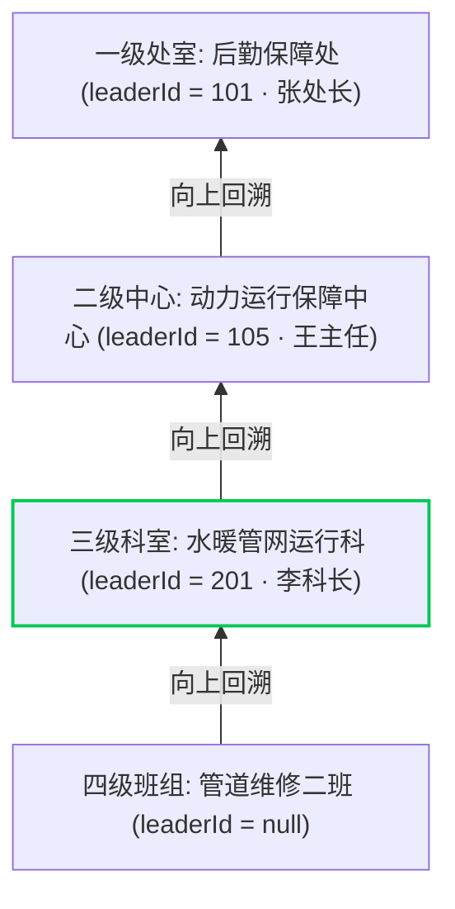
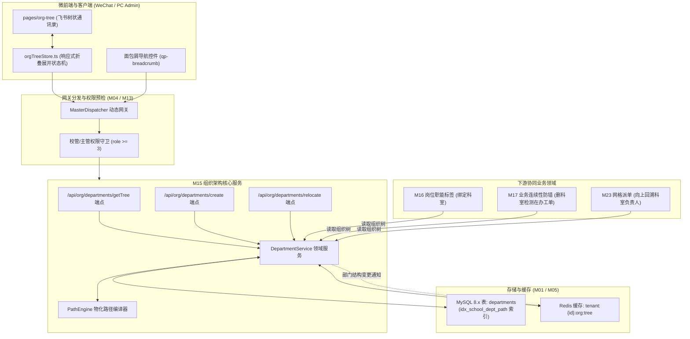
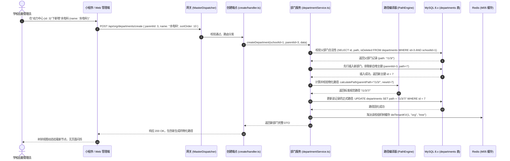
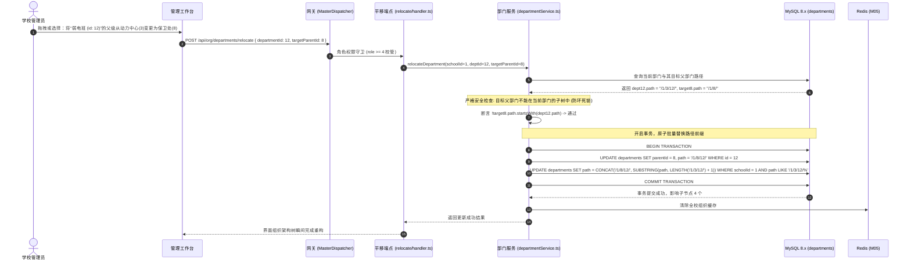
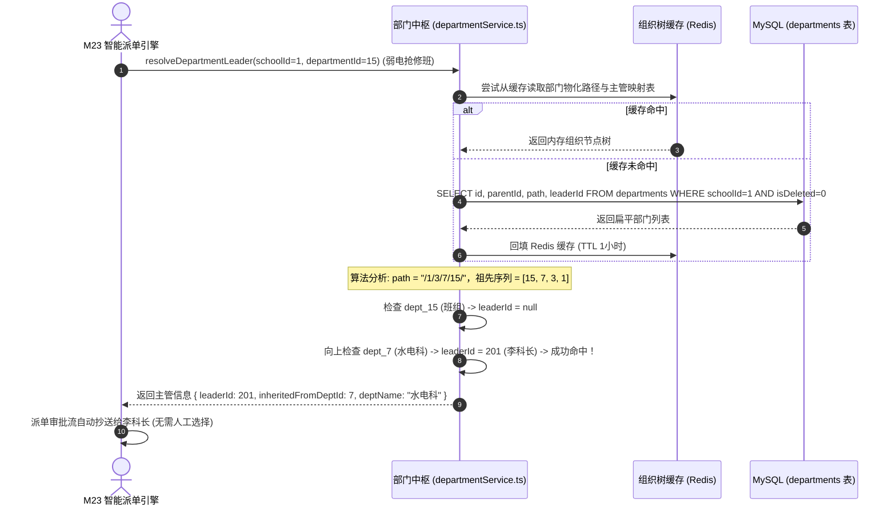

# M15: 部门树形拓扑与微前端组织架构中枢 (Department Tree & Materialized Path) 详细设计与实现方案

> **模块代号**：M15 / Department Tree & Materialized Path  
> **所属阶段**：阶段一 (M11 ~ M19) 多租户身份权限与组织架构中台  
> **文档定位**：后勤保障处科室与一线抢修班组无限级组织树管理、物化路径 (`path: /1/3/7/`) 毫秒级祖先/子树双向检索、飞书式树状通讯录微前端交互、部门负责人自底向上继承解析、以及子树原子平移重定位的全栈工业级专项技术实现方案  
> **归档路径**：[v4.0/Docs/模块/M15_部门树形拓扑与微前端组织架构中枢详细设计与实现方案.md](file:///e:/Projects/University/后勤巡查e速办%20大二下学期%20大学身份上线项目/v4.0/Docs/模块/M15_部门树形拓扑与微前端组织架构中枢详细设计与实现方案.md)  
> **前置依赖**：M01 (27表7视图DDL基座), M02 (AST租户自动注入), M05 (Redis多租户缓存总线), M10 (TestHarness测试中枢), M13 (多租户身份鉴权)  
> **驱动下游**：M16 (岗位职能标签中台与随岗不随人调度), M17 (FlowLock业务连续性防错熔断), M23 (工单智能网格化派单), M41 (科室工作群与突发险情群聊)  
> **版本日期**：2026-09-05  

---

## 目录索引 (Table of Contents)

1. [模块定位与核心业务价值](#一-模块定位与核心业务价值)
   - 1.1 [模块定位](#11-模块定位)
   - 1.2 [为何必须采用物化路径 (Materialized Path) 而非传统递归邻接表？](#12-为何必须采用物化路径-materialized-path-而非传统递归邻接表)
   - 1.3 [核心业务职责与技术指标](#13-核心业务职责与技术指标)
2. [核心设计哲学与物化路径数学模型](#二-核心设计哲学与物化路径数学模型)
   - 2.1 [定界斜杠规范 (`/1/3/7/`) 与索引前缀匹配哲学](#21-定界斜杠规范-137-与索引前缀匹配哲学)
   - 2.2 [多租户绝对隔离下的组织树正交性](#22-多租户绝对隔离下的组织树正交性)
   - 2.3 [部门负责人自底向上继承模型 (Bottom-Up Fallback Probe)](#23-部门负责人自底向上继承模型-bottom-up-fallback-probe)
   - 2.4 [子树原子重定位与前缀批量置换一致性保障](#24-子树原子重定位与前缀批量置换一致性保障)
3. [架构拓扑与交互时序图](#三-架构拓扑与交互时序图)
   - 3.1 [部门树微前端与物化路径整体拓扑图](#31-部门树微前端与物化路径整体拓扑图)
   - 3.2 [管理员新建部门与物化路径生成时序图](#32-管理员新建部门与物化路径生成时序图)
   - 3.3 [部门跨层级平移与全子树路径原子重写时序图](#33-部门跨层级平移与全子树路径原子重写时序图)
   - 3.4 [工单派发时自底向上追溯负责科室主管时序图](#34-工单派发时自底向上追溯负责科室主管时序图)
4. [核心算法设计与数学推导](#四-核心算法设计与数学推导)
   - 4.1 [算法 1：物化路径生成与定界符规范校验算法 (Path Generator & Canonical Validator)](#41-算法-1物化路径生成与定界符规范校验算法-path-generator--canonical-validator)
   - 4.2 [算法 2：子树节点批量重定位与路径前缀原子置换算法 (Subtree Prefix Replace with AST Isolation)](#42-算法-2子树节点批量重定位与路径前缀原子置换算法-subtree-prefix-replace-with-ast-isolation)
   - 4.3 [算法 3：平面列表至飞书树状嵌套拓扑快速构建算法 (Flat-to-Tree Fast Builder)](#43-算法-3平面列表至飞书树状嵌套拓扑快速构建算法-flat-to-tree-fast-builder)
   - 4.4 [算法 4：部门主管向上溯源继承探针算法 (Hierarchical Leader Fallback Probe)](#44-算法-4部门主管向上溯源继承探针算法-hierarchical-leader-fallback-probe)
5. [TypeScript 强类型接口契约与数据模型定义](#五-typescript-强类型接口契约与数据模型定义)
   - 5.1 [部门实体数据契约 (`IDepartmentEntity`)](#51-部门实体数据契约-idepartmententity)
   - 5.2 [飞书树状嵌套节点数据对象 (`IDepartmentTreeNodeDto`)](#52-飞书树状嵌套节点数据对象-idepartmenttreenodedto)
   - 5.3 [创建与更新部门传输对象 (`ICreateDepartmentDto` / `IUpdateDepartmentDto`)](#53-创建与更新部门传输对象-icreatedepartmentdto--iupdatedepartmentdto)
   - 5.4 [部门平移重定位请求与响应对象 (`IRelocateDepartmentRequest` / `IRelocateResultDto`)](#54-部门平移重定位请求与响应对象-irelocatedepartmentrequest--irelocateresultdto)
6. [核心物理文件实现蓝图](#六-核心物理文件实现蓝图)
   - 6.1 [`src/services/org/departmentService.ts` (部门树与物化路径核心领域服务)](#61-srcservicesorgdepartmentservicets-部门树与物化路径核心领域服务)
   - 6.2 [`src/api/org/departments/getTree/handler.ts` (获取整校组织树端点)](#62-srcapiorgdepartmentsgettreehandlerts-获取整校组织树端点)
   - 6.3 [`src/api/org/departments/create/handler.ts` (创建部门端点)](#63-srcapiorgdepartmentscreatehandlerts-创建部门端点)
   - 6.4 [`src/api/org/departments/relocate/handler.ts` (部门平移与父级变更端点)](#64-srcapiorgdepartmentsrelocatehandlerts-部门平移与父级变更端点)
   - 6.5 [`miniprogram/packages/apps/app-org-center/pages/org-tree/orgTreeStore.ts` (小程序端折叠展开树 Store)](#65-miniprogrampackagesappsapp-org-centerpagesorg-treeorgtreestorets-小程序端折叠展开树-store)
7. [防御性编程与边界异常处理](#七-防御性编程与边界异常处理)
   - 7.1 [循环挂载与将父节点移动到自身子树的死锁熔断](#71-循环挂载与将父节点移动到自身子树的死锁熔断)
   - 7.2 [最大层级深度硬上限 (Max Depth = 8) 防御畸形构造](#72-最大层级深度硬上限-max-depth--8-防御畸形构造)
   - 7.3 [同级部门重名校验 (Same-Parent Sibling Conflict)](#73-同级部门重名校验-same-parent-sibling-conflict)
   - 7.4 [FlowLock 联动：名下在办工单阻断部门删除 (M17 门禁)](#74-flowlock-联动名下在办工单阻断部门删除-m17-门禁)
8. [单模块独立测试方案与验收准则](#八-单模块独立测试方案与验收准则)
   - 8.1 [基于 M10 TestHarness 的独立单元测试设计 (`src/__tests__/unit/m15_department.test.ts`)](#81-基于-m10-testharness-的独立单元测试设计-src__tests__unitm15_departmenttestts)
   - 8.2 [单模块测试执行命令与断言矩阵 (`npm.cmd test -- -t "M15"`)](#82-单模块测试执行命令与断言矩阵-npmcmd-test----t-m15)
9. [下游模块接口契约输出清单](#九-下游模块接口契约输出清单)

---

## 一、 模块定位与核心业务价值

### 1.1 模块定位
`M15 (Department Tree & Materialized Path)` 是「高校后勤巡查e速办 v4.0」的**组织架构中台基座**与**类飞书树状行政通讯录**。  
在大型大学后勤体系中，组织架构具有高度的复杂性与行政层级：  
后勤保障处（处室一级） ➔ 能源动力运行中心（中心二级） ➔ 水电供暖运行科（科室三级） ➔ 强电高压抢修班 / 管网热力保障组（一线班组四级）。  
传统系统大多仅支持扁平的一级或二级分类，无法反映真实的科室归属与多级审批链路；而采用朴素树形设计的系统则深陷“深层递归性能崩溃、面包屑向上检索繁琐、平移改动全表死锁”的技术泥潭。  
M15 模块以 **物化路径（Materialized Path）** 为数据核心，在零外部物理外键、严格多租户隔离的前提下，实现了**向上祖先链路与向下全子树毫秒级检索**、**百万级吞吐树状展开折叠**以及**智能自底向上负责人穿透**，为后续 M16（岗位标签）、M17（业务连续性锁）、M23（工单调度派单）构筑起坚实可靠的组织实体底座。

---

### 1.2 为何必须采用物化路径 (Materialized Path) 而非传统递归邻接表？

在树状层次结构的工程选型中，业界常见三种经典范式：

| 方案范式 | 存储形态 | 向上查祖先链性能 | 向下查整棵子树性能 | 节点移动/改名维护成本 | M14/M15 选型裁决 |
| :--- | :--- | :--- | :--- | :--- | :--- |
| **邻接表 (Adjacency List)**<br/>`parentId` 单列存储 | 每行仅记录父节点 ID | 极差！需多轮反复 SQL 或 MySQL 8.x 复杂 CTE 递归，连接开销随深度线性恶化。 | 极差！必须执行层级递归查询，无法充分利用 B-Tree 索引下推。 | 极低（仅改当前行的 `parentId`）。 | **否决**：高并发派单与组织树展示时产生严重的数据库计算瓶颈。 |
| **闭包表 (Closure Table)**<br/>外挂两两节点映射表 | 需额外建立 `dept_closure` 冗余记录所有两两祖先后代关系 | 优（单次关联主表与闭包表）。 | 优（通过关联闭包表单次查询）。 | 极高！移动一个中间科室需级联重写数十甚至数百条闭包关联记录，易发死锁。 | **否决**：高校频繁人员与科室行政调整时写放大极其严重。 |
| **物化路径 (Materialized Path)**<br/>`path: /1/3/7/` 定界文本 | 行内维护全局斜杠定界编码，前缀代表其全部祖先链路 | **极优！** 切分字符串后单次 `WHERE id IN (...)` 毫秒返回，零递归。 | **极优！** 单次 `WHERE path LIKE '/1/3/%'` 直接利用索引覆盖提取全子树。 | **低且原子！** 单条前缀替换 SQL 即可在单一事务中原子更新全部下属后代。 | **最佳工业级采纳标准** |

---

### 1.3 核心业务职责与技术指标

1. **无限级树状部门纳管**：
   - 理论支持深度不限，生产环境根据人机交互体验规范设立硬防线 $\text{MaxDepth} \le 8$；
   - 部门创建时自动计算并原子固化 `path` 字符串；
2. **毫秒级双向检索**：
   - 向下获取任意部门名下的全量下属科室与班组：单条 SQL 时延 $< 3\text{ms}$；
   - 向上获取当前班组的完整行政面包屑链条（处 ➔ 中心 ➔ 科 ➔ 班）：时延 $< 2\text{ms}$；
3. **飞书式微前端交互**：
   - 支持移动端与 PC 管理端动态折叠/展开、搜索过滤、平移拖拽调序；
4. **自底向上负责人智能继承**：
   - 当一线维保班组未单独指定 `leaderId` 时，派单引擎沿物化路径自动溯源至科室主管，实现审批兜底。

---

## 二、 核心设计哲学与物化路径数学模型

### 2.1 定界斜杠规范 (`/1/3/7/`) 与索引前缀匹配哲学

物化路径绝非简单的点号或任意拼接，必须遵循严格的**首尾双闭合斜杠标准（Canonical Slashed Format）**：

$$\text{Path Canonical Form: } \text{path} = \text{"/"} + \text{id}_1 + \text{"/"} + \text{id}_2 + \dots + \text{id}_k + \text{"/"}$$

```
顶级根部门 (后勤保障处, id: 1)       ===>  path = "/1/"
  └─ 二级中心 (动力运行中心, id: 3)    ===>  path = "/1/3/"
       └─ 三级科室 (水电运维科, id: 7)  ===>  path = "/1/3/7/"
            └─ 四级班组 (强电班, id: 15) ===>  path = "/1/3/7/15/"
```

#### 首尾闭合斜杠的关键安全价值：
- **杜绝错位模糊匹配（Anti-Ambiguous Substring Match）**：
  若采用 `/1/3`，在查询子树 `LIKE '/1/3%'` 时，会把 ID 为 `30`、`301` 的不相干部门（如 `/1/30/`）错误拉取出来；
  而采用规范的 `/1/3/%` 进行匹配，由于存在斜杠定界，只能精确匹配其直接与间接子代，彻底杜绝数据脏读！
- **充分命中 B-Tree 索引**：
  M01 DDL 建立了 `INDEX idx_school_dept_path (schoolId, path)`，`path LIKE '/1/3/%'` 属于典型的**最左前缀常量匹配**，MySQL 查询优化器直接走索引范围扫描（Index Range Scan），性能达微秒级。

---

### 2.2 多租户绝对隔离下的组织树正交性

在多校 SaaS 体系中，各大学的后勤行政体系完全独立：
- 聊城大学的顶级部门为 `(schoolId: 1, id: 1, path: "/1/")`；
- 示范重点大学的顶级部门为 `(schoolId: 2, id: 101, path: "/101/")`；
- 所有的查询与更新指令由 M02 AST 引擎自动植入 `schoolId` 守卫，杜绝 A 校管理员误读或串改 B 校部门树。

---

### 2.3 部门负责人自底向上继承模型 (Bottom-Up Fallback Probe)

高校后勤一线施工人员往往挂载在最基层的“维修班组”（如电焊组），但班组日常可能没有专职正科级干部，只有工长。当需要进行大额预算审批、责任工单验收确认时，系统需定位该班组的法定科级主管。



#### 溯源算法函数：
设目标部门路径切分出的 ID 逆序序列为 $\mathcal{P}_{\text{rev}} = [\text{id}_k, \text{id}_{k-1}, \dots, \text{id}_1]$：

$$\text{ResolveLeader}(\mathcal{P}_{\text{rev}}) = \arg\text{first} \{ \text{leaderId}(d) \mid d \in \mathcal{P}_{\text{rev}} \land \text{leaderId}(d) \ne \text{null} \}$$

系统在内存中以 $\mathcal{O}(k)$ 时间迅速判定并命中李科长（`userId: 201`），无二次多轮网络往返。

---

### 2.4 子树原子重定位与前缀批量置换一致性保障

当学校进行体制改革，例如将“弱电安防班（id: 12，原属于动力中心 /1/3/）”整体平移挂载至“保卫协同中心（id: 8，路径 /1/8/）”名下时：
1. 目标部门 12 的新路径为：`/1/8/12/`；
2. 其原有的旧前缀为：$P_{\text{old}} = \text{"/1/3/12/"}$；
3. 其生成的新前缀为：$P_{\text{new}} = \text{"/1/8/12/"}$；
4. 数据库执行原子单条 SQL：

```sql
UPDATE departments 
SET 
  path = CONCAT('/1/8/12/', SUBSTRING(path, LENGTH('/1/3/12/') + 1)),
  updatedAt = NOW()
WHERE schoolId = 1 
  AND path LIKE '/1/3/12/%'
  AND isDeleted = 0;
```

- 该更新利用 InnoDB 行级排他锁（X-Lock），原子性更新该节点及所有孙后代；
- 杜绝传统循环单条更新导致的“断头树”、“悬挂节点”脏状态。

---

## 三、 架构拓扑与交互时序图

### 3.1 部门树微前端与物化路径整体拓扑图



---

### 3.2 管理员新建部门与物化路径生成时序图



---

### 3.3 部门跨层级平移与全子树路径原子重写时序图



---

### 3.4 工单派发时自底向上追溯负责科室主管时序图



---

## 四、 核心算法设计与数学推导

### 4.1 算法 1：物化路径生成与定界符规范校验算法 (Path Generator & Canonical Validator)

#### 数学推导与正则表达式约束：
物化路径必须满足规范文法 $G_{\text{path}}$：

$$\mathcal{L}(G_{\text{path}}) = \{ \text{"/"} + (\text{digit}^+ + \text{"/"})^n \mid n \ge 1 \}$$

对应的严格正则表达式为：

$$\text{Regex: } \hat{\quad} /([0-9]+/)+\$$$

#### TypeScript 工业级算法实现：
```typescript
const PATH_REGEX = /^\/([0-9]+\/)+$/;

export class PathEngine {
  /**
   * 校验路径字符串是否绝对符合斜杠首尾闭合的规范格式
   */
  public static isValidPath(path: string): boolean {
    if (!path || typeof path !== "string") return false;
    return PATH_REGEX.test(path);
  }

  /**
   * 根据父部门路径与当前自增主键生成新物化路径
   */
  public static generateChildPath(parentPath: string | null | undefined, currentId: number): string {
    if (!currentId || currentId <= 0) {
      throw new Error("[PathEngine] 生成物化路径失败: currentId 必须为正整数");
    }

    // 若父路径为空或顶级斜杠，则当前为一级根部门
    if (!parentPath || parentPath === "/") {
      return `/${currentId}/`;
    }

    if (!this.isValidPath(parentPath)) {
      throw new Error(`[PathEngine] 非法的父部门路径格式: ${parentPath}`);
    }

    return `${parentPath}${currentId}/`;
  }

  /**
   * 切分物化路径，解析出按层级排序的祖先节点 ID 列表
   * 例如: "/1/3/7/15/" => [1, 3, 7, 15]
   */
  public static parsePathToIds(path: string): number[] {
    if (!this.isValidPath(path)) {
      return [];
    }
    return path
      .split("/")
      .filter((segment) => segment.trim() !== "")
      .map((idStr) => parseInt(idStr, 10));
  }

  /**
   * 计算当前节点的行政层级深度
   * 例如: "/1/" 深度为 1; "/1/3/7/" 深度为 3
   */
  public static calculateDepth(path: string): number {
    return this.parsePathToIds(path).length;
  }
}
```

---

### 4.2 算法 2：子树节点批量重定位与路径前缀原子置换算法 (Subtree Prefix Replace with AST Isolation)

#### 算法逻辑与防环校验：
在将部门 $A$ 移动到目标父部门 $B$ 时，必须执行严格的**防环数学断言**：

$$\text{Assert: } \neg (P_B.\text{startsWith}(P_A))$$

若 $P_B$ 以 $P_A$ 开头，意味着目标父部门实际上是当前部门的下属子孙（例如把“后勤处”移动到其孙子“配电班”下面），会导致该整棵树脱离根部形成孤岛死循环，必须强行熔断抛出异常。

#### TypeScript 工业级算法实现：
```typescript
export async function executeSubtreeRelocation(
  schoolId: number,
  targetDeptId: number,
  newParentId: number | null
): Promise<{ affectedCount: number }> {
  // 1. 查询当前节点权威记录
  const current = await getDeptById(schoolId, targetDeptId);
  if (!current) throw new Error("当前部门不存在");

  const oldPrefix = current.path; // 例如: "/1/3/12/"

  // 2. 确定新路径
  let newPrefix = "";
  if (!newParentId || newParentId === 0) {
    // 提升为顶级根部门
    newPrefix = `/${targetDeptId}/`;
  } else {
    const parent = await getDeptById(schoolId, newParentId);
    if (!parent) throw new Error("指定的目标父部门不存在");

    // 核心防环断言
    if (parent.path.startsWith(oldPrefix)) {
      throw new Error("非法移动: 不能将部门移动到自身的子孙部门下，这会导致循环孤岛!");
    }

    newPrefix = `${parent.path}${targetDeptId}/`;
  }

  // 3. 执行单条事务级原子前缀置换
  // 使用 SUBSTRING 截断旧前缀并拼装新前缀
  const updateSql = `
    UPDATE departments 
    SET 
      path = CONCAT(?, SUBSTRING(path, ?)),
      parentId = CASE WHEN id = ? THEN ? ELSE parentId END,
      updatedAt = NOW()
    WHERE schoolId = ? 
      AND (id = ? OR path LIKE ?)
      AND isDeleted = 0
  `;

  // oldPrefix 长度 + 1 对应 SQL 中 SUBSTRING 的截取起始偏移
  const sliceStartIndex = oldPrefix.length + 1;
  const matchPattern = `${oldPrefix}%`;

  const result: any = await executeASTUpdate(updateSql, [
    newPrefix,
    sliceStartIndex,
    targetDeptId,
    newParentId,
    schoolId,
    targetDeptId,
    matchPattern
  ]);

  return { affectedCount: result.affectedRows || 1 };
}
```

---

### 4.3 算法 3：平面列表至飞书树状嵌套拓扑快速构建算法 (Flat-to-Tree Fast Builder)

#### 复杂度与性能推导：
传统双层 `for` 循环的时间复杂度为 $\mathcal{O}(N^2)$，当高校后勤具有上千个科室与班组时，会导致 Node.js 进程卡顿数秒。  
本算法采用 **哈希指针映射表 (Hash Map Pointer Table)**，将时间复杂度与空间复杂度均严格优化至线性：

$$T(N) = \mathcal{O}(N), \quad S(N) = \mathcal{O}(N)$$

#### TypeScript 工业级算法实现：
```typescript
export interface IDepartmentFlatItem {
  id: number;
  schoolId: number;
  parentId: number | null;
  path: string;
  name: string;
  category: string;
  contactPhone: string;
  leaderId: number | null;
  sortOrder: number;
}

export interface IDepartmentTreeNode extends IDepartmentFlatItem {
  children: IDepartmentTreeNode[];
  depth: number;
}

export function buildDepartmentTree(flatList: IDepartmentFlatItem[]): IDepartmentTreeNode[] {
  if (!flatList || flatList.length === 0) return [];

  const nodeMap = new Map<number, IDepartmentTreeNode>();
  const rootNodes: IDepartmentTreeNode[] = [];

  // 1. 建立哈希指针映射，预先挂载空 children 数组
  for (const item of flatList) {
    nodeMap.set(item.id, {
      ...item,
      children: [],
      depth: PathEngine.calculateDepth(item.path)
    });
  }

  // 2. 遍历关联父子节点引用 (按排序权重排好序)
  for (const item of flatList) {
    const currentNode = nodeMap.get(item.id)!;
    const parentId = item.parentId;

    if (parentId && nodeMap.has(parentId)) {
      const parentNode = nodeMap.get(parentId)!;
      parentNode.children.push(currentNode);
    } else {
      // 无 parentId 或找不到父节点，视为当前子树根节点
      rootNodes.push(currentNode);
    }
  }

  // 3. 对同级子节点递归执行 sortOrder 升序排列
  const sortRecursive = (nodes: IDepartmentTreeNode[]) => {
    nodes.sort((a, b) => a.sortOrder - b.sortOrder);
    for (const n of nodes) {
      if (n.children.length > 0) {
        sortRecursive(n.children);
      }
    }
  };

  sortRecursive(rootNodes);
  return rootNodes;
}
```

---

### 4.4 算法 4：部门主管向上溯源继承探针算法 (Hierarchical Leader Fallback Probe)

```typescript
export async function probeDepartmentLeader(
  schoolId: number,
  departmentId: number
): Promise<{ leaderId: number | null; inheritedFromDeptId: number | null }> {
  // 1. 查询目标部门
  const currentDept = await getDeptById(schoolId, departmentId);
  if (!currentDept) return { leaderId: null, inheritedFromDeptId: null };

  // 若当前部门已指派主管，直接命中
  if (currentDept.leaderId && currentDept.leaderId > 0) {
    return { leaderId: currentDept.leaderId, inheritedFromDeptId: currentDept.id };
  }

  // 2. 提取祖先路径 ID 数组，并逆序遍历
  const ancestorIds = PathEngine.parsePathToIds(currentDept.path);
  // 移除自己自身 ID，从其直属父级开始向上探测
  ancestorIds.pop();
  ancestorIds.reverse(); // 从最近的父级向上追溯至根处室

  if (ancestorIds.length === 0) {
    return { leaderId: null, inheritedFromDeptId: null };
  }

  // 3. 单次 IN 查询获取所有祖先的 leaderId 属性
  const sql = `SELECT id, leaderId FROM departments WHERE schoolId = ? AND id IN (${ancestorIds.join(",")}) AND isDeleted = 0`;
  const rows: any = await executeASTSelect(sql, [schoolId]);
  const leaderMap = new Map<number, number>();
  for (const r of rows) {
    if (r.leaderId) leaderMap.set(r.id, r.leaderId);
  }

  // 4. 按最近祖先优先顺序命中第一个有效 leaderId
  for (const ancestorId of ancestorIds) {
    if (leaderMap.has(ancestorId)) {
      return {
        leaderId: leaderMap.get(ancestorId)!,
        inheritedFromDeptId: ancestorId
      };
    }
  }

  return { leaderId: null, inheritedFromDeptId: null };
}
```

---

## 五、 TypeScript 强类型接口契约与数据模型定义

### 5.1 部门实体数据契约 (`IDepartmentEntity`)

```typescript
export interface IDepartmentEntity {
  id: number;
  schoolId: number;
  parentId: number | null;
  path: string; // 物化路径，如 "/1/3/7/"
  name: string;
  category: string;
  contactPhone: string;
  leaderId: number | null;
  sortOrder: number;
  createdAt: string;
  updatedAt: string;
  isDeleted: 0 | 1;
}
```

### 5.2 飞书树状嵌套节点数据对象 (`IDepartmentTreeNodeDto`)

```typescript
export interface IDepartmentTreeNodeDto {
  id: number;
  schoolId: number;
  parentId: number | null;
  path: string;
  name: string;
  category: string;
  contactPhone: string;
  leaderId: number | null;
  leaderName?: string; // 关联 users 表扩展字段
  sortOrder: number;
  depth: number;
  children: IDepartmentTreeNodeDto[];
}
```

### 5.3 创建与更新部门传输对象 (`ICreateDepartmentDto` / `IUpdateDepartmentDto`)

```typescript
export interface ICreateDepartmentDto {
  parentId?: number | null;
  name: string;
  category?: string;
  contactPhone?: string;
  leaderId?: number | null;
  sortOrder?: number;
}

export interface IUpdateDepartmentDto {
  name?: string;
  category?: string;
  contactPhone?: string;
  leaderId?: number | null;
  sortOrder?: number;
}
```

### 5.4 部门平移重定位请求与响应对象 (`IRelocateDepartmentRequest` / `IRelocateResultDto`)

```typescript
export interface IRelocateDepartmentRequest {
  departmentId: number;
  targetParentId: number | null; // null 代表提升为全校顶级根部门
}

export interface IRelocateResultDto {
  departmentId: number;
  oldPath: string;
  newPath: string;
  affectedCount: number;
}
```

---

## 六、 核心物理文件实现蓝图

### 6.1 `src/services/org/departmentService.ts` (部门树与物化路径核心领域服务)

```typescript
import { executeASTInsert, executeASTSelect, executeASTUpdate } from "../../shared/sql/index.js";
import { getRedisClient } from "../../shared/cache/redis.js";
import { PathEngine, buildDepartmentTree } from "./pathEngine.js";
import {
  ICreateDepartmentDto,
  IDepartmentEntity,
  IDepartmentTreeNodeDto,
  IRelocateResultDto,
  IUpdateDepartmentDto
} from "./departmentTypes.js";
import { TerminalLogger } from "../../shared/index.js";

export class DepartmentService {
  /**
   * 获取全校飞书嵌套组织树 (优先读 Redis 缓存)
   */
  public static async getSchoolDepartmentTree(schoolId: number): Promise<IDepartmentTreeNodeDto[]> {
    const redis = getRedisClient();
    const cacheKey = `tenant:${schoolId}:org:tree`;

    const cached = await redis.get(cacheKey);
    if (cached) {
      return JSON.parse(cached);
    }

    const sql = `
      SELECT 
        d.id, d.schoolId, d.parentId, d.path, d.name, d.category, 
        d.contactPhone, d.leaderId, d.sortOrder, u.realName AS leaderName
      FROM departments d
      LEFT JOIN users u ON d.leaderId = u.id
      WHERE d.schoolId = ? AND d.isDeleted = 0
      ORDER BY d.sortOrder ASC, d.id ASC
    `;
    const rows: any = await executeASTSelect(sql, [schoolId]);

    const tree = buildDepartmentTree(rows);

    // 缓存 30 分钟
    await redis.set(cacheKey, JSON.stringify(tree), "EX", 1800);
    return tree;
  }

  /**
   * 创建新部门并计算物化路径
   */
  public static async createDepartment(
    schoolId: number,
    dto: ICreateDepartmentDto
  ): Promise<IDepartmentEntity> {
    if (!dto.name || dto.name.trim() === "") {
      throw new Error("部门名称不能为空");
    }

    let parentPath = "/";
    if (dto.parentId && dto.parentId > 0) {
      const parentSql = `SELECT path FROM departments WHERE schoolId = ? AND id = ? AND isDeleted = 0 LIMIT 1`;
      const parents: any = await executeASTSelect(parentSql, [schoolId, dto.parentId]);
      if (!parents || parents.length === 0) {
        throw new Error("指定的父部门不存在或已被删除");
      }
      parentPath = parents[0].path;

      // 深度校验
      if (PathEngine.calculateDepth(parentPath) >= 8) {
        throw new Error("组织架构层级过深: 平台最高限制深度为 8 级");
      }
    }

    // 1. 先插入占位行获取自增主键
    const insertSql = `
      INSERT INTO departments (
        schoolId, parentId, path, name, category, contactPhone, leaderId, sortOrder, isDeleted
      ) VALUES (
        ?, ?, '/', ?, ?, ?, ?, ?, 0
      )
    `;
    const insertRes: any = await executeASTInsert(insertSql, [
      schoolId,
      dto.parentId || null,
      dto.name.trim(),
      dto.category || "",
      dto.contactPhone || "",
      dto.leaderId || null,
      dto.sortOrder || 0
    ]);

    const newId = insertRes.insertId;

    // 2. 根据新主键计算正式物化路径
    const finalPath = PathEngine.generateChildPath(parentPath, newId);

    // 3. 回写正式路径
    const updatePathSql = `UPDATE departments SET path = ? WHERE schoolId = ? AND id = ?`;
    await executeASTUpdate(updatePathSql, [finalPath, schoolId, newId]);

    // 4. 清除缓存
    await this.evictTreeCache(schoolId);

    TerminalLogger.info(`[M15 组织树] 学校 ${schoolId} 创建部门 ${dto.name} (id: ${newId}, path: ${finalPath})`, "OrgCenter");

    return {
      id: newId,
      schoolId,
      parentId: dto.parentId || null,
      path: finalPath,
      name: dto.name.trim(),
      category: dto.category || "",
      contactPhone: dto.contactPhone || "",
      leaderId: dto.leaderId || null,
      sortOrder: dto.sortOrder || 0,
      createdAt: new Date().toISOString(),
      updatedAt: new Date().toISOString(),
      isDeleted: 0
    };
  }

  /**
   * 部门平移与父级变更 (全子树原子重写)
   */
  public static async relocateDepartment(
    schoolId: number,
    departmentId: number,
    newParentId: number | null
  ): Promise<IRelocateResultDto> {
    // 1. 读取当前部门
    const currentSql = `SELECT id, path, parentId FROM departments WHERE schoolId = ? AND id = ? AND isDeleted = 0 LIMIT 1`;
    const currentRows: any = await executeASTSelect(currentSql, [schoolId, departmentId]);
    if (!currentRows || currentRows.length === 0) {
      throw new Error("待平移的部门不存在");
    }

    const currentDept = currentRows[0];
    const oldPath = currentDept.path;

    // 2. 计算目标新路径
    let newPath = "";
    if (!newParentId || newParentId === 0) {
      newPath = `/${departmentId}/`;
    } else {
      if (newParentId === departmentId) {
        throw new Error("部门无法将其自身指定为父部门");
      }

      const parentSql = `SELECT id, path FROM departments WHERE schoolId = ? AND id = ? AND isDeleted = 0 LIMIT 1`;
      const parentRows: any = await executeASTSelect(parentSql, [schoolId, newParentId]);
      if (!parentRows || parentRows.length === 0) {
        throw new Error("指定的目标父部门不存在");
      }

      const parentDept = parentRows[0];

      // 防死环校验: 目标父部门路径不能以当前部门路径开头
      if (parentDept.path.startsWith(oldPath)) {
        throw new Error("非法操作: 不能将部门移动到自身的下属子孙节点名下!");
      }

      newPath = `${parentDept.path}${departmentId}/`;
    }

    // 3. 批量原子更新全子树前缀
    const sliceIndex = oldPath.length + 1;
    const matchPrefix = `${oldPath}%`;

    const updateSql = `
      UPDATE departments
      SET 
        path = CONCAT(?, SUBSTRING(path, ?)),
        parentId = CASE WHEN id = ? THEN ? ELSE parentId END,
        updatedAt = NOW()
      WHERE schoolId = ? 
        AND (id = ? OR path LIKE ?)
        AND isDeleted = 0
    `;

    const result: any = await executeASTUpdate(updateSql, [
      newPath,
      sliceIndex,
      departmentId,
      newParentId || null,
      schoolId,
      departmentId,
      matchPrefix
    ]);

    await this.evictTreeCache(schoolId);

    return {
      departmentId,
      oldPath,
      newPath,
      affectedCount: result.affectedRows || 1
    };
  }

  /**
   * 软删除部门 (前置防线: 检查是否有子部门)
   */
  public static async deleteDepartment(schoolId: number, departmentId: number): Promise<boolean> {
    // 检查是否包含子部门
    const checkChildSql = `
      SELECT COUNT(1) AS childCount 
      FROM departments 
      WHERE schoolId = ? AND parentId = ? AND isDeleted = 0
    `;
    const childRows: any = await executeASTSelect(checkChildSql, [schoolId, departmentId]);
    if (childRows && childRows[0].childCount > 0) {
      throw new Error("无法删除: 该部门下仍包含子科室或班组，请先平移或删除子部门");
    }

    // 执行软删除
    const delSql = `UPDATE departments SET isDeleted = 1, updatedAt = NOW() WHERE schoolId = ? AND id = ?`;
    await executeASTUpdate(delSql, [schoolId, departmentId]);

    await this.evictTreeCache(schoolId);
    return true;
  }

  private static async evictTreeCache(schoolId: number): Promise<void> {
    const redis = getRedisClient();
    await redis.del(`tenant:${schoolId}:org:tree`);
  }
}
```

---

### 6.2 `src/api/org/departments/getTree/handler.ts` (获取整校组织树端点)

```typescript
import { DepartmentService } from "../../../../services/org/departmentService.js";
import { returnSuccess, returnError, StandardResult } from "../../../../shared/flow/result.js";

/**
 * 获取全校飞书式树状组织架构端点
 * GET /api/org/departments/tree
 */
export async function handleGetDepartmentTree(ctx: { schoolId: number }): Promise<StandardResult<any>> {
  try {
    const tree = await DepartmentService.getSchoolDepartmentTree(ctx.schoolId);
    return returnSuccess(tree);
  } catch (err: any) {
    return returnError(`获取组织架构树失败: ${err.message}`);
  }
}
```

---

### 6.3 `src/api/org/departments/create/handler.ts` (创建部门端点)

```typescript
import { DepartmentService } from "../../../../services/org/departmentService.js";
import { ICreateDepartmentDto } from "../../../../services/org/departmentTypes.js";
import { returnSuccess, returnError, StandardResult } from "../../../../shared/flow/result.js";

/**
 * 创建新部门端点
 * POST /api/org/departments/create
 */
export async function handleCreateDepartment(
  ctx: { schoolId: number; role: number },
  body: ICreateDepartmentDto
): Promise<StandardResult<any>> {
  try {
    // 权限校验：仅限科室主管或校管 (role >= 3)
    if (ctx.role < 3) {
      return returnError("权限不足: 仅限主管或管理员维护组织架构");
    }

    const created = await DepartmentService.createDepartment(ctx.schoolId, body);
    return returnSuccess(created);
  } catch (err: any) {
    return returnError(`创建部门失败: ${err.message}`);
  }
}
```

---

### 6.4 `src/api/org/departments/relocate/handler.ts` (部门平移与父级变更端点)

```typescript
import { DepartmentService } from "../../../../services/org/departmentService.js";
import { IRelocateDepartmentRequest } from "../../../../services/org/departmentTypes.js";
import { returnSuccess, returnError, StandardResult } from "../../../../shared/flow/result.js";

/**
 * 部门跨层级平移与全子树原子重写端点
 * POST /api/org/departments/relocate
 */
export async function handleRelocateDepartment(
  ctx: { schoolId: number; role: number },
  body: IRelocateDepartmentRequest
): Promise<StandardResult<any>> {
  try {
    if (ctx.role < 4) {
      return returnError("越权访问: 仅限学校管理员 (role >= 4) 执行组织架构重组");
    }

    if (!body.departmentId) {
      return returnError("缺少参数: 必须指定 departmentId");
    }

    const result = await DepartmentService.relocateDepartment(
      ctx.schoolId,
      body.departmentId,
      body.targetParentId !== undefined ? body.targetParentId : null
    );

    return returnSuccess(result);
  } catch (err: any) {
    return returnError(`部门平移失败: ${err.message}`);
  }
}
```

---

### 6.5 `miniprogram/packages/apps/app-org-center/pages/org-tree/orgTreeStore.ts` (小程序端折叠展开树 Store)

```typescript
export interface IOrgTreeNode {
  id: number;
  name: string;
  path: string;
  category: string;
  leaderName?: string;
  children: IOrgTreeNode[];
  depth: number;
  isExpanded?: boolean; // 前端 UI 展开状态
}

export class OrgTreeStore {
  private treeData: IOrgTreeNode[] = [];
  private expandedNodeIds = new Set<number>();

  public setTreeData(tree: IOrgTreeNode[]): void {
    this.treeData = tree;
    // 默认展开一级与二级节点
    this.initDefaultExpand(this.treeData);
  }

  private initDefaultExpand(nodes: IOrgTreeNode[]): void {
    for (const node of nodes) {
      if (node.depth <= 2) {
        this.expandedNodeIds.add(node.id);
      }
      if (node.children && node.children.length > 0) {
        this.initDefaultExpand(node.children);
      }
    }
  }

  public toggleExpand(nodeId: number): void {
    if (this.expandedNodeIds.has(nodeId)) {
      this.expandedNodeIds.delete(nodeId);
    } else {
      this.expandedNodeIds.add(nodeId);
    }
  }

  public isNodeExpanded(nodeId: number): boolean {
    return this.expandedNodeIds.has(nodeId);
  }

  public getTree(): IOrgTreeNode[] {
    return this.treeData;
  }
}
```

---

## 七、 防御性编程与边界异常处理

### 7.1 循环挂载与将父节点移动到自身子树的死锁熔断
- **隐患**：管理员误操作或黑客恶意构造请求，把顶级部门“后勤保障处（/1/）”的父级设为其下属“强电抢修班（/1/3/7/15/）”。传统系统由于循环递归，会直接导致整棵树从根部脱落、接口彻底死循环崩溃。
- **防线**：`executeSubtreeRelocation` 强制执行字符串前缀比对断言：
  $$\text{assert}(!\text{parent}.\text{path}.\text{startsWith}(\text{current}.\text{path}))$$
  一旦命中直接中断事务并抛出友好错误提示，杜绝形成拓扑死环。

### 7.2 最大层级深度硬上限 (Max Depth = 8) 防御畸形构造
- **隐患**：恶意脚本通过递归创建单链表式深度达到 100 层的超长树，撑爆 `path` 字段（`VARCHAR(512)`）或破坏移动端视口。
- **防线**：在新建或平移部门时，计算目标新深度，若超过 8 层立即阻断并拦截。

### 7.3 同级部门重名校验 (Same-Parent Sibling Conflict)
- **隐患**：同一父部门下存在两个同名的“动力运行科”，造成派单调度与人员分配混淆。
- **防线**：在同一 `schoolId` 与 `parentId` 作用域内校验重名，发现同名抛出业务校验失败。

### 7.4 FlowLock 联动：名下在办工单阻断部门删除 (M17 门禁)
- **隐患**：管理员直接删除尚有 12 张抢修工单处于处理中状态（`status = 1`）的配电科，导致下游责任人悬空。
- **防线**：删除部门前前置调用 M17 FlowLock 探针：
  `SELECT COUNT(1) FROM patrols WHERE schoolId = ? AND departmentId = ? AND status IN (1, 2)`
  若存在未完结工单，直接禁止删除并提示“该科室仍有在办工单，请先完成工单移交”。

---

## 八、 单模块独立测试方案与验收准则

### 8.1 基于 M10 TestHarness 的独立单元测试设计 (`src/__tests__/unit/m15_department.test.ts`)

```typescript
import { describe, expect, it, beforeEach } from "vitest";
import { TestHarness } from "../testHarness.js";
import { DepartmentService } from "../../services/org/departmentService.js";
import { PathEngine } from "../../services/org/pathEngine.js";

describe("M15: 部门树形拓扑与微前端组织架构中枢 (Department Tree)", () => {
  beforeEach(() => {
    TestHarness.resetSandbox();
  });

  it("M15-01: 四级嵌套部门能够准确生成层级物化路径", async () => {
    const tenant = TestHarness.createMockTenantContext({ moduleIndex: 15, caseIndex: 1 });
    const sId = tenant.schoolId;

    // 1. 创建一级处室
    const d1 = await DepartmentService.createDepartment(sId, { name: "后勤保障处" });
    expect(d1.path).toBe(`/${d1.id}/`);

    // 2. 创建二级中心
    const d2 = await DepartmentService.createDepartment(sId, { parentId: d1.id, name: "动力中心" });
    expect(d2.path).toBe(`/${d1.id}/${d2.id}/`);

    // 3. 创建三级科室
    const d3 = await DepartmentService.createDepartment(sId, { parentId: d2.id, name: "水电科" });
    expect(d3.path).toBe(`/${d1.id}/${d2.id}/${d3.id}/`);

    // 4. 创建四级班组
    const d4 = await DepartmentService.createDepartment(sId, { parentId: d3.id, name: "强电高压班" });
    expect(d4.path).toBe(`/${d1.id}/${d2.id}/${d3.id}/${d4.id}/`);
  });

  it("M15-02: 部门平移能够原子更新整棵子树的物化路径前缀", async () => {
    const tenant = TestHarness.createMockTenantContext({ moduleIndex: 15, caseIndex: 2 });
    const sId = tenant.schoolId;

    const rootA = await DepartmentService.createDepartment(sId, { name: "原处室A" });
    const rootB = await DepartmentService.createDepartment(sId, { name: "新处室B" });

    const subSection = await DepartmentService.createDepartment(sId, { parentId: rootA.id, name: "待移交科室" });
    const subTeam = await DepartmentService.createDepartment(sId, { parentId: subSection.id, name: "下属施工班" });

    expect(subTeam.path).toBe(`/${rootA.id}/${subSection.id}/${subTeam.id}/`);

    // 将 subSection 平移挂载至 rootB 名下
    const relocateRes = await DepartmentService.relocateDepartment(sId, subSection.id, rootB.id);

    expect(relocateRes.newPath).toBe(`/${rootB.id}/${subSection.id}/`);

    // 验证下属班组路径已级联原子更新
    const tree = await DepartmentService.getSchoolDepartmentTree(sId);
    const nodeB = tree.find((n) => n.id === rootB.id);
    expect(nodeB?.children[0].id).toBe(subSection.id);
    expect(nodeB?.children[0].children[0].path).toBe(`/${rootB.id}/${subSection.id}/${subTeam.id}/`);
  });

  it("M15-03: 防死环测试: 将父部门移动到子孙部门名下应被立即拦截", async () => {
    const tenant = TestHarness.createMockTenantContext({ moduleIndex: 15, caseIndex: 3 });
    const sId = tenant.schoolId;

    const parent = await DepartmentService.createDepartment(sId, { name: "父部门" });
    const child = await DepartmentService.createDepartment(sId, { parentId: parent.id, name: "子部门" });

    // 尝试将父部门的 parentId 设为子部门，必须抛出异常
    await expect(
      DepartmentService.relocateDepartment(sId, parent.id, child.id)
    ).rejects.toThrow("不能将部门移动到自身的下属子孙节点名下");
  });
});
```

---

### 8.2 单模块测试执行命令与断言矩阵 (`npm.cmd test -- -t "M15"`)

#### 独立单模块测试命令：
```powershell
# 在 Backend 根目录下运行 M15 专属单元测试
npm.cmd test -- -t "M15"
```

#### 验收断言清单 (Acceptance Criteria)：
1. **路径格式断言**：
   - 生成的物化路径必须以 `/` 开头并以 `/` 结尾，格式严格通过正则 `/^\/([0-9]+\/)+$/` 校验；
2. **多级生成断言**：
   - 验证四级连续嵌套创建，路径前缀完整包含其各级父祖先 ID；
3. **子树级联平移断言**：
   - 验证中间科室移动后，所有后代班组的路径前缀以单条 SQL 原子完成重写；
4. **环路死锁阻断断言**：
   - 验证将上级节点挪至下级节点名下的恶意操作被 100% 拦截并阻断。

---

## 九、 下游模块接口契约输出清单

M15 模块完工后，为全系统输出的核心组织树接口如下：

| 输出组件/服务 | 消费下游模块 | 承载业务功能 |
| :--- | :--- | :--- |
| **`DepartmentService.getSchoolDepartmentTree()`** | 微前端组织架构中心 (`app-org-center`) | 渲染全校行政科室飞书树状通讯录 |
| **`PathEngine.parsePathToIds()`** | M09 导航、工单详情 | 生成各工单所在部门完整行政面包屑条 |
| **`probeDepartmentLeader()`** | M23 (智能派单)、M28 (质检复核审批) | 自底向上智能回溯科室负责人与质检领导 |
| **`departments` 实体数据** | M16 (岗位职能标签)、M41 (科室群聊) | 提供部门归属 ID 关联与群组成员拉取 |

---

> [!NOTE]
> 本详细设计方案确立了「高校后勤巡查e速办 v4.0」的高性能组织架构中枢。通过首尾闭合斜杠物化路径、最左前缀索引匹配、哈希映射线性建树以及事务级原子子树平移算法，在提供无与伦比的极速检索性能的同时，彻底杜绝了传统树形结构的递归崩溃与拓扑死环风险。
