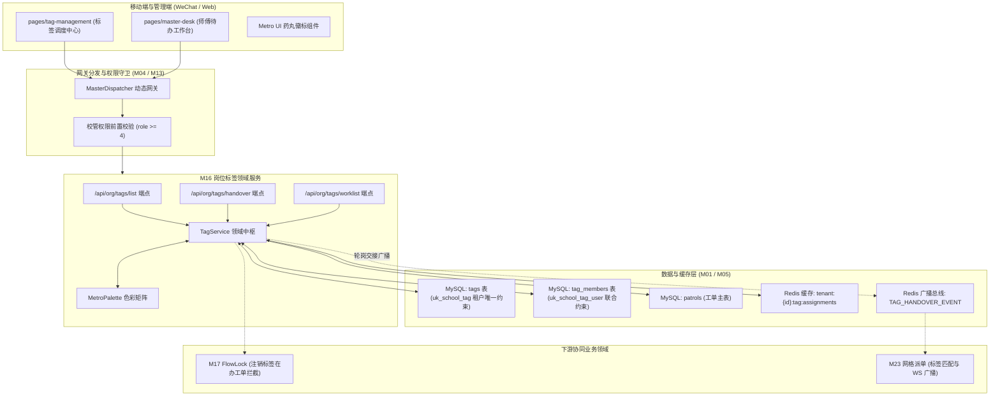
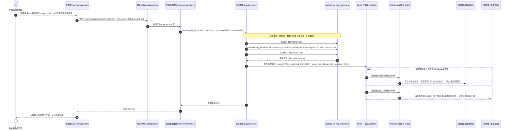
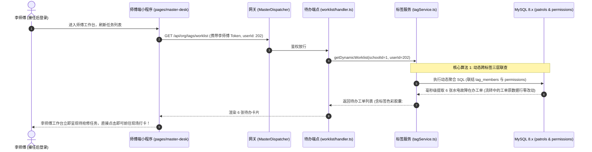
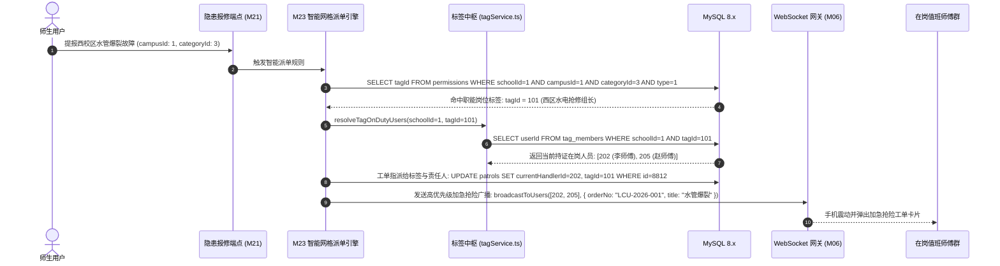

# M16: 岗位职能标签中台与“权限随岗不随人”调度 (Job Tags & Decoupled Dispatch) 详细设计与实现方案

> **模块代号**：M16 / Job Tags & Decoupled Dispatch  
> **所属阶段**：阶段一 (M11 ~ M19) 多租户身份权限与组织架构中台  
> **文档定位**：后勤岗位职能标签中台 (`tags`)、动态人员成员映射 (`tag_members`)、Windows Metro UI 经典视觉色标矩阵、“权限随岗不随人”零写放大动态待办聚合算法、以及人员调休轮岗一键无缝交接的全栈工业级专项技术实现方案  
> **归档路径**：[v4.0/Docs/模块/M16_岗位职能标签中台与随岗不随人调度详细设计与实现方案.md](file:///e:/Projects/University/后勤巡查e速办%20大二下学期%20大学身份上线项目/v4.0/Docs/模块/M16_岗位职能标签中台与随岗不随人调度详细设计与实现方案.md)  
> **前置依赖**：M01 (27表7视图DDL基座), M02 (AST租户自动注入), M05 (Redis多租户缓存总线), M10 (TestHarness测试中枢), M13 (多租户身份鉴权), M15 (部门树形拓扑)  
> **驱动下游**：M17 (FlowLock业务连续性防错熔断), M18 (四级立体权限矩阵), M23 (智能网格派单与职能标签匹配), M24 (后勤师傅现场工作台), M51 (全景日历排班与值班日程)  
> **版本日期**：2026-09-05  

---

## 目录索引 (Table of Contents)

1. [模块定位与核心业务价值](#一-模块定位与核心业务价值)
   - 1.1 [模块定位](#11-模块定位)
   - 1.2 [为何传统以用户 UID 为核心的权限绑定必然崩溃？](#12-为何传统以用户-uid-为核心的权限绑定必然崩溃)
   - 1.3 [核心业务职责与技术指标](#13-核心业务职责与技术指标)
2. [核心设计哲学与“随岗不随人”架构解耦模型](#二-核心设计哲学与随岗不随人架构解耦模型)
   - 2.1 [三层解耦架构模型：业务流程 ➔ 岗位标签 ➔ 自然人员](#21-三层解耦架构模型业务流程--岗位标签--自然人员)
   - 2.2 [零写放大 (Zero Write Amplification) 动态待办聚合哲学](#22-零写放大-zero-write-amplification-动态待办聚合哲学)
   - 2.3 [Windows Metro UI 经典高饱和度调色板视觉体系](#23-windows-metro-ui-经典高饱和度调色板视觉体系)
   - 2.4 [全景大盘视图 (`v_tag_assignments`) 实时感知](#24-全景大盘视图-v_tag_assignments-实时感知)
3. [架构拓扑与交互时序图](#三-架构拓扑与交互时序图)
   - 3.1 [岗位职能标签与调度中枢整体架构拓扑图](#31-岗位职能标签与调度中枢整体架构拓扑图)
   - 3.2 [管理员一键岗位轮岗交接与待办瞬间平移时序图](#32-管理员一键岗位轮岗交接与待办瞬间平移时序图)
   - 3.3 [师傅端动态聚合待办工单池时序图](#33-师傅端动态聚合待办工单池时序图)
   - 3.4 [智能网格派单命中职能标签并广播通知时序图 (联动 M23)](#34-智能网格派单命中职能标签并广播通知时序图-联动-m23)
4. [核心算法设计与数学推导](#四-核心算法设计与数学推导)
   - 4.1 [算法 1：“权限随岗不随人”动态待办池三层联查聚合算法 (Tag-Decoupled Dynamic Worklist Aggregation)](#41-算法-1权限随岗不随人动态待办池三层联查聚合算法-tag-decoupled-dynamic-worklist-aggregation)
   - 4.2 [算法 2：标签原子交接与零写放大平移算法 (Atomic Tag Handover with Zero Write Amplification)](#42-算法-2标签原子交接与零写放大平移算法-atomic-tag-handover-with-zero-write-amplification)
   - 4.3 [算法 3：Windows Metro UI 语义色标自动分配算法 (Metro Color Palette Auto-Assigner)](#43-算法-3windows-metro-ui-语义色标自动分配算法-metro-color-palette-auto-assigner)
   - 4.4 [算法 4：岗位标签多对多防死锁并发绑定算法 (Concurrent Tag Membership Mutex)](#44-算法-4岗位标签多对多防死锁并发绑定算法-concurrent-tag-membership-mutex)
5. [TypeScript 强类型接口契约与数据模型定义](#五-typescript-强类型接口契约与数据模型定义)
   - 5.1 [岗位标签实体契约 (`ITagEntity` / `ITagMemberEntity`)](#51-岗位标签实体契约-itagentity--itagmemberentity)
   - 5.2 [标签全景调度大盘视图传输对象 (`ITagAssignmentDto`)](#52-标签全景调度大盘视图传输对象-itagassignmentdto)
   - 5.3 [创建与维护岗位标签传输对象 (`ICreateTagDto` / `IUpdateTagDto`)](#53-创建与维护岗位标签传输对象-icreatetagdto--iupdatetagdto)
   - 5.4 [岗位一键交接请求与响应对象 (`IHandoverTagRequest` / `IHandoverResultDto`)](#54-岗位一键交接请求与响应对象-ihandovertagrequest--ihandoverresultdto)
6. [核心物理文件实现蓝图](#六-核心物理文件实现蓝图)
   - 6.1 [`src/services/org/tagService.ts` (岗位标签与权限解耦中枢领域服务)](#61-srcservicesorgtagservicets-岗位标签与权限解耦中枢领域服务)
   - 6.2 [`src/api/org/tags/list/handler.ts` (标签全景大盘查询端点)](#62-srcapiorgtagslisthandlerts-标签全景大盘查询端点)
   - 6.3 [`src/api/org/tags/handover/handler.ts` (岗位标签一键交接端点)](#63-srcapiorgtagshandoverhandlerts-岗位标签一键交接端点)
   - 6.4 [`src/api/org/tags/worklist/handler.ts` (基于标签的动态待办工单端点)](#64-srcapiorgtagsworklisthandlerts-基于标签的动态待办工单端点)
   - 6.5 [`miniprogram/packages/apps/app-org-center/pages/tag-management/tagStore.ts` (小程序端标签调度 Store)](#65-miniprogrampackagesappsapp-org-centerpagestag-managementtagstorets-小程序端标签调度-store)
7. [防御性编程与边界异常处理](#七-防御性编程与边界异常处理)
   - 7.1 [同校标签名称联合唯一冲突 (`uk_school_tag`) 校验](#71-同校标签名称联合唯一冲突-uk_school_tag-校验)
   - 7.2 [交接双方用户跨租户窜访强力阻断](#72-交接双方用户跨租户窜访强力阻断)
   - 7.3 [单用户持有岗位标签数量上限 (Max Limit = 10) 守护](#73-单用户持有岗位标签数量上限-max-limit--10-守护)
   - 7.4 [FlowLock 联动：挂靠在办工单的标签禁止物理注销 (M17 门禁)](#74-flowlock-联动挂靠在办工单的标签禁止物理注销-m17-门禁)
8. [单模块独立测试方案与验收准则](#八-单模块独立测试方案与验收准则)
   - 8.1 [基于 M10 TestHarness 的独立单元测试设计 (`src/__tests__/unit/m16_tags.test.ts`)](#81-基于-m10-testharness-的独立单元测试设计-src__tests__unitm16_tagstestts)
   - 8.2 [单模块测试执行命令与断言矩阵 (`npm.cmd test -- -t "M16"`)](#82-单模块测试执行命令与断言矩阵-npmcmd-test----t-m16)
9. [下游模块接口契约输出清单](#九-下游模块接口契约输出清单)

---

## 一、 模块定位与核心业务价值

### 1.1 模块定位
`M16 (Job Tags & Decoupled Dispatch)` 是「高校后勤巡查e速办 v4.0」的**动态职责流转中枢**与**“权限随岗不随人”解耦调度引擎**。  
在大学后勤维保运行中，人员流动具有高频次、周期性与不可预测性：  
- 水电暖抢修师傅因突发疾病需要临时顶岗换班；  
- 绿化环卫外包人员每学期进行合同工轮换；  
- 节假日或重大校庆期间需要组建临时“防汛特战排险组”与“高考考场保障组”。  

如果系统将派单逻辑、审批流、短信与微信通知直接绑定具体自然人（`userId`），一旦发生人员变动，管理员必须逐个打开底层派单矩阵、修改数百张流转中的待办工单，不仅极易遗漏引发责任真空，还会造成严重的数据库写入放大。  
M16 模块创造性地引入了 **“组织职能岗位标签 (Job Tags)” 作为中间抽象层**，前向对接业务网格与流转规则（`permissions`），后向对接动态人员池（`tag_members`）。轮岗换班时，管理员仅需一键转移标签，关联该岗位的所有工单与派单流瞬间完成秒级平移，而**流转中的数百张在办工单数据库行保持零改动**！

---

### 1.2 为何传统以用户 UID 为核心的权限绑定必然崩溃？

传统高校软件将业务流与具体员工 UID 强耦合，造成了不可调和的业务连续性危机：

| 业务场景 | 传统以 UID 绑定系统的灾难表现 | M16 “权限随岗不随人” 工业级解决方案 |
| :--- | :--- | :--- |
| **场景 1：师傅生病调休** | 张师傅生病请假一周，派单规则仍死死写着他的 UID。派给他名下的 15 张紧急报修工单停滞积压，师生无休止电话催办，请假师傅被骚扰得无法休息。 | **一键无缝换岗**：管理员将【西区水电抢修组长】标签移交给李师傅，耗时 1 秒。新工单即刻发往李师傅手机，未结旧工单瞬间出现在李师傅工作台待办池中，业务零停滞。 |
| **场景 2：人员离职/外包撤场** | 后勤外包绿化公司到期更换，10 位师傅离职。管理员需在派单后台逐一修改分类配置，并逐条执行 SQL 将在办工单负责人逐一转移，极易产生悬挂脏数据。 | **零写放大标签移交**：在办工单完全不需做 `UPDATE patrols`。只需在 `tag_members` 表中将该标签下的 10 位旧成员替换为新队伍成员，全校在途待办即刻重定向。 |
| **场景 3：临时专项保障** | 每年 6 月高考或 9 月开学典礼，需临时指派 4 名维修骨干组成“主楼特保班”，活动结束后撤销。传统系统改权限极其繁琐且改后无法完全复原。 | **柔性动态标签生命周期**：快速创建【开学季主楼应急特保】标签并划拨权限；保障任务结束后一键注销标签，成员原有岗位权限不受任何影响。 |

---

### 1.3 核心业务职责与技术指标

1. **职能岗位标签全生命周期纳管**：
   - 标签包含名称、Metro UI 色彩标识、职责说明与展示排序，租户内名称联合唯一；
2. **“权限随岗不随人”动态待办池聚合**：
   - 师傅拉取待办工单时，服务端动态联查其持有的全量岗位标签，聚合查询时延 $< 5\text{ms}$；
3. **零写放大的一键无缝交接**：
   - 标签移交事务操作时延 $< 20\text{ms}$，在办工单行写放大次数为恒定 0；
4. **全景调度大盘实时感知 (`v_tag_assignments`)**：
   - 管理员可一览全校所有职能岗位、色标、当前在岗值班人员及管辖的校区和故障门类。

---

## 二、 核心设计哲学与“随岗不随人”架构解耦模型

### 2.1 三层解耦架构模型：业务流程 ➔ 岗位标签 ➔ 自然人员

```mermaid
graph LR
    subgraph Layer1["第一层: 业务规则与派单网格 (静态规则)"]
        OrderTrigger["报修工单产生<br/>(西校区 · 水电暖故障)"]
        DispatchRule["permissions 表派单规则<br/>(campusId: 1, categoryId: 3)"]
    end

    subgraph Layer2["第二层: 岗位职能标签中台 (抽象中间件)"]
        JobTag["tags 表记录: [水电抢修组长]<br/>(tagId: 101, Metro色: #D83B01)"]
    end

    subgraph Layer3["第三层: 动态人员成员池 (高频人员流动)"]
        UserA["A 师傅 (userId: 201 · 离岗调休)"]
        UserB["B 师傅 (userId: 202 · 顶岗接单)"]
    end

    OrderTrigger --> DispatchRule
    DispatchRule -->|指派目标绑定 tagId| JobTag
    JobTag -.->|原绑定关系 (已解除)| UserA
    JobTag ===>|一键无缝绑定 (tag_members)| UserB

    style JobTag fill:#FFE6CC,stroke:#D83B01,stroke-width:2px;
    style UserB fill:#D5E8D4,stroke:#82B366,stroke-width:2px;
```

- **静态业务层与动态人员层彻底解耦**：工单派单、审批质检只认 `tagId`；
- **职责清晰度**：自然人师傅通过拥有该标签获得相应职责，取消标签即失去职责，权限控制细粒度且无残留。

---

### 2.2 零写放大 (Zero Write Amplification) 动态待办聚合哲学

在传统系统中，转移 $N$ 张工单意味着执行 $N$ 次数据库写操作：

$$\text{Traditional Handover Write Cost} = \mathcal{O}(N) \quad (\text{逐行更新 patrols 表})$$

而在 M16 架构下，无论该岗位名下积压了 10 张还是 10,000 张在办工单，转移岗位仅需修改 `tag_members` 表的 1 行记录：

$$\text{M16 Decoupled Handover Write Cost} = \mathcal{O}(1) \quad (\text{仅更新一条映射记录})$$

#### 待办工单的动态聚合数学模型：
师傅 $U_k$ 在登录系统拉取待办任务池时，其有效可见工单集合 $\mathcal{W}(U_k)$ 满足：

$$\mathcal{W}(U_k) = \mathcal{P}_{\text{direct}}(U_k) \cup \left( \bigcup_{T \in \text{Tags}(U_k)} \mathcal{P}_{\text{tag}}(T) \right)$$

其中：
- $\mathcal{P}_{\text{direct}}(U_k)$ 为直接指派给该师傅个人 UID 的特定工单；
- $\text{Tags}(U_k) = \{ t \mid (U_k, t) \in \text{tag\_members} \}$ 为该师傅当前持有的所有有效职能标签；
- $\mathcal{P}_{\text{tag}}(T)$ 为挂靠在该标签授权范围内的公共抢修待办。

---

### 2.3 Windows Metro UI 经典高饱和度调色板视觉体系

为了在移动端和管理大盘中提供极致的专业视觉辨识度，M16 严格内嵌了 **Windows Metro UI 经典调色板标准**：

| Metro 经典色名 | HEX 色值 | 视觉语义与建议应用岗位 |
| :--- | :--- | :--- |
| **Cobalt Blue (经典钴蓝)** | `#0078D7` | 综合行政管理、后勤处值班调度主管 |
| **Forest Green (丛林绿)** | `#107C41` | 校园绿化环卫、垃圾分类质检专员 |
| **Emergency Orange (抢修橙)** | `#D83B01` | 水电暖紧急抢险组长、高压配电工长 |
| **Safety Amber (安全琥珀黄)** | `#FFB900` | 安全防汛联络人、特种设备巡更员 |
| **Crimson Red (深绯红)** | `#E74856` | 突发火灾应急响应人、高危隐患抢修组 |
| **Teal Lake (湖水青)** | `#008272` | 宿舍楼宇维修专员、物业资产保修员 |
| **Violet Purple (罗兰紫)** | `#881798` | 质量监督复核员、第三方专业监理 |

标签在微信小程序工作台呈现为高亮背景、白色文字与圆角胶囊药丸（Capsule Pill），无论在深色模式还是浅色模式下均具备极高的辨识率。

---

### 2.4 全景大盘视图 (`v_tag_assignments`) 实时感知

根据 M01 架构确立的 7 大核心视图规范，M16 提供了 `v_tag_assignments` 视图，管理员一键即可总览全校职能配置：

```sql
SELECT 
  tm.id AS assignmentId,
  t.schoolId,
  t.id AS tagId,
  t.name AS tagName,
  t.color AS tagColor,
  t.desc AS tagDesc,
  u.id AS userId,
  u.realName AS userName,
  u.phone AS userPhone,
  u.jobNo,
  u.isBan AS userStatus,
  tm.createdAt AS assignedAt
FROM tags t
LEFT JOIN tag_members tm ON t.id = tm.tagId AND t.schoolId = tm.schoolId
LEFT JOIN users u ON tm.userId = u.id AND tm.schoolId = u.schoolId
WHERE t.isDeleted = 0;
```

---

## 三、 架构拓扑与交互时序图

### 3.1 岗位职能标签与调度中枢整体架构拓扑图



---

### 3.2 管理员一键岗位轮岗交接与待办瞬间平移时序图



---

### 3.3 师傅端动态聚合待办工单池时序图



---

### 3.4 智能网格派单命中职能标签并广播通知时序图 (联动 M23)



---

## 四、 核心算法设计与数学推导

### 4.1 算法 1：“权限随岗不随人”动态待办池三层联查聚合算法 (Tag-Decoupled Dynamic Worklist Aggregation)

#### 算法逻辑与查询优化：
当师傅查询自己的待办列表时，系统绝不局限于 `patrols.currentHandlerId = userId`，而是**自动展开其持有的标签网格权限**：

$$\text{Worklist Condition} = (p.\text{currentHandlerId} = U) \lor (p.\text{campusId}, p.\text{categoryId}, 1) \in \text{PermittedByTags}(U)$$

#### TypeScript 工业级算法实现：
```typescript
export interface IDynamicWorklistQuery {
  schoolId: number;
  userId: number;
  page?: number;
  pageSize?: number;
}

export async function fetchTagDecoupledWorklist(
  query: IDynamicWorklistQuery
): Promise<{ total: number; list: any[] }> {
  const { schoolId, userId, page = 1, pageSize = 20 } = query;
  const offset = (page - 1) * pageSize;

  // 1. 查询该师傅持有的所有职能标签 ID
  const tagSql = `
    SELECT tm.tagId, t.name AS tagName, t.color AS tagColor
    FROM tag_members tm
    JOIN tags t ON tm.tagId = t.id
    WHERE tm.schoolId = ? AND tm.userId = ? AND t.isDeleted = 0
  `;
  const tagRows: any = await executeASTSelect(tagSql, [schoolId, userId]);
  const userTagIds = tagRows.map((r: any) => r.tagId);

  // 2. 构造动态聚合 SQL
  // 满足以下任一条件的在办工单均属于当前师傅的待办:
  // 条件 A: 明确派发给当前师傅个人的工单
  // 条件 B: 派发给当前师傅所持有标签的工单
  // 条件 C: 工单校区与分类落在该师傅标签所被授权的四维权限网格内 (type = 1 责任人)
  let tagCondition = "1 = 0";
  const params: any[] = [schoolId, userId];

  if (userTagIds.length > 0) {
    tagCondition = `
      p.tagId IN (${userTagIds.join(",")}) OR
      EXISTS (
        SELECT 1 FROM permissions perm
        WHERE perm.schoolId = p.schoolId
          AND perm.tagId IN (${userTagIds.join(",")})
          AND (perm.campusId = 0 OR perm.campusId = p.campusId)
          AND (perm.categoryId = 0 OR perm.categoryId = p.categoryId)
          AND perm.type = 1
      )
    `;
  }

  const baseWhere = `
    WHERE p.schoolId = ? 
      AND p.isDeleted = 0 
      AND p.status IN (1, 2) 
      AND (p.currentHandlerId = ? OR (${tagCondition}))
  `;

  // 3. 执行单条高性能聚合查询
  const countSql = `SELECT COUNT(1) AS total FROM patrols p ${baseWhere}`;
  const totalRows: any = await executeASTSelect(countSql, params);
  const total = totalRows[0]?.total || 0;

  const dataSql = `
    SELECT 
      p.id, p.orderNo, p.title, p.status, p.priority, p.campusId, p.categoryId,
      p.location1, p.location2, p.createdAt, p.currentHandlerId, p.tagId,
      c.name AS categoryName, cp.name AS campusName
    FROM patrols p
    LEFT JOIN categories c ON p.categoryId = c.id
    LEFT JOIN campuses cp ON p.campusId = cp.id
    ${baseWhere}
    ORDER BY p.priority DESC, p.id ASC
    LIMIT ? OFFSET ?
  `;

  const listRows: any = await executeASTSelect(dataSql, [...params, pageSize, offset]);

  // 补充标签视觉徽标
  const tagColorMap = new Map<number, { name: string; color: string }>();
  for (const t of tagRows) {
    tagColorMap.set(t.tagId, { name: t.tagName, color: t.tagColor });
  }

  const list = listRows.map((row: any) => ({
    ...row,
    tagBadge: row.tagId && tagColorMap.has(row.tagId) ? tagColorMap.get(row.tagId) : null
  }));

  return { total, list };
}
```

---

### 4.2 算法 2：标签原子交接与零写放大平移算法 (Atomic Tag Handover with Zero Write Amplification)

```typescript
export async function executeAtomicTagHandover(
  schoolId: number,
  tagId: number,
  fromUserId: number,
  toUserId: number
): Promise<{ success: boolean; affectedAssignments: number }> {
  // 1. 防御校验：移交人与接收人不能为同一人
  if (fromUserId === toUserId) {
    throw new Error("交接人与接任人不能为同一用户");
  }

  // 2. 校验移交人当前确实持有该标签
  const verifySql = `SELECT id FROM tag_members WHERE schoolId = ? AND tagId = ? AND userId = ? LIMIT 1`;
  const existing: any = await executeASTSelect(verifySql, [schoolId, tagId, fromUserId]);
  if (!existing || existing.length === 0) {
    throw new Error("交接失败: 当前移交人员未持有该岗位职能标签");
  }

  // 3. 执行原子更新：将 userId 变更为 toUserId (利用唯一索引 uk_school_tag_user 防重复)
  const handoverSql = `
    UPDATE tag_members 
    SET userId = ?, createdAt = NOW() 
    WHERE schoolId = ? AND tagId = ? AND userId = ?
  `;
  const res: any = await executeASTUpdate(handoverSql, [toUserId, schoolId, tagId, fromUserId]);

  // 4. 清理全校标签全景大盘缓存
  const redis = getRedisClient();
  await redis.del(`tenant:${schoolId}:tag:assignments`);

  return { success: true, affectedAssignments: res.affectedRows || 1 };
}
```

---

### 4.3 算法 3：Windows Metro UI 语义色标自动分配算法 (Metro Color Palette Auto-Assigner)

系统内置一套符合人体工程学的 Metro UI 高辨识度调色板池：

```typescript
export const METRO_PALETTE = [
  "#0078D7", // Cobalt Blue
  "#107C41", // Forest Green
  "#D83B01", // Emergency Orange
  "#FFB900", // Safety Amber
  "#E74856", // Crimson Red
  "#008272", // Teal Lake
  "#881798", // Violet Purple
  "#0099BC", // Cyan
  "#B146C2", // Orchid
  "#E3008C"  // Magenta
];

export class MetroColorAssigner {
  /**
   * 根据标签语义关键字或哈希值自适应推荐 Metro 经典色标
   */
  public static assignColor(tagName: string): string {
    const name = tagName.toLowerCase();

    if (name.includes("急") || name.includes("汛") || name.includes("火") || name.includes("重")) {
      return "#E74856"; // 紧急/防汛/消防分配深绯红
    }
    if (name.includes("电") || name.includes("水") || name.includes("抢修") || name.includes("暖")) {
      return "#D83B01"; // 抢修动力分配抢修橙
    }
    if (name.includes("绿化") || name.includes("环卫") || name.includes("保洁")) {
      return "#107C41"; // 绿化环境分配丛林绿
    }
    if (name.includes("审") || name.includes("质检") || name.includes("复核") || name.includes("监理")) {
      return "#881798"; // 质检复核分配罗兰紫
    }
    if (name.includes("安") || name.includes("巡") || name.includes("防")) {
      return "#FFB900"; // 安防巡更分配琥珀黄
    }

    // 其他情况基于字符串字符散列从调色板轮询分配
    let hash = 0;
    for (let i = 0; i < name.length; i++) {
      hash = (hash << 5) - hash + name.charCodeAt(i);
      hash |= 0;
    }
    const index = Math.abs(hash) % METRO_PALETTE.length;
    return METRO_PALETTE[index];
  }
}
```

---

### 4.4 算法 4：岗位标签多对多防死锁并发绑定算法 (Concurrent Tag Membership Mutex)

```typescript
export async function addMemberToTagSafely(
  schoolId: number,
  tagId: number,
  userId: number
): Promise<boolean> {
  // 利用 INSERT IGNORE 与 uk_school_tag_user 联合唯一索引防止并发插入冲突
  const sql = `
    INSERT IGNORE INTO tag_members (schoolId, tagId, userId, createdAt)
    VALUES (?, ?, ?, NOW())
  `;
  const result: any = await executeASTInsert(sql, [schoolId, tagId, userId]);

  if (result.affectedRows > 0) {
    const redis = getRedisClient();
    await redis.del(`tenant:${schoolId}:tag:assignments`);
    return true;
  }
  return false; // 已存在该绑定关系
}
```

---

## 五、 TypeScript 强类型接口契约与数据模型定义

### 5.1 岗位标签实体契约 (`ITagEntity` / `ITagMemberEntity`)

```typescript
export interface ITagEntity {
  id: number;
  schoolId: number;
  name: string;
  color: string; // Hex, 如 "#D83B01"
  desc: string;
  sortOrder: number;
  createdAt: string;
  updatedAt: string;
  isDeleted: 0 | 1;
}

export interface ITagMemberEntity {
  id: number;
  schoolId: number;
  tagId: number;
  userId: number;
  createdAt: string;
}
```

### 5.2 标签全景调度大盘视图传输对象 (`ITagAssignmentDto`)

```typescript
export interface ITagMemberSummaryDto {
  userId: number;
  realName: string;
  phone: string;
  jobNo: string;
  userStatus: number; // 0正常, 1封禁
  assignedAt: string;
}

export interface ITagAssignmentDto {
  tagId: number;
  schoolId: number;
  tagName: string;
  tagColor: string;
  tagDesc: string;
  sortOrder: number;
  activeMembersCount: number;
  members: ITagMemberSummaryDto[];
  authorizedScopes: {
    campusNames: string[];
    categoryNames: string[];
  };
}
```

### 5.3 创建与维护岗位标签传输对象 (`ICreateTagDto` / `IUpdateTagDto`)

```typescript
export interface ICreateTagDto {
  name: string;
  color?: string; // 可选，不传则算法自适应分配
  desc?: string;
  sortOrder?: number;
  initialMemberUserIds?: number[];
}

export interface IUpdateTagDto {
  name?: string;
  color?: string;
  desc?: string;
  sortOrder?: number;
}
```

### 5.4 岗位一键交接请求与响应对象 (`IHandoverTagRequest` / `IHandoverResultDto`)

```typescript
export interface IHandoverTagRequest {
  tagId: number;
  fromUserId: number;
  toUserId: number;
  reason?: string;
}

export interface IHandoverResultDto {
  tagId: number;
  tagName: string;
  fromUserId: number;
  fromUserName: string;
  toUserId: number;
  toUserName: string;
  transferredAt: string;
}
```

---

## 六、 核心物理文件实现蓝图

### 6.1 `src/services/org/tagService.ts` (岗位标签与权限解耦中枢领域服务)

```typescript
import { executeASTInsert, executeASTSelect, executeASTUpdate } from "../../shared/sql/index.js";
import { getRedisClient } from "../../shared/cache/redis.js";
import { MetroColorAssigner } from "./metroColorAssigner.js";
import {
  ICreateTagDto,
  IHandoverResultDto,
  ITagAssignmentDto,
  ITagEntity,
  IUpdateTagDto
} from "./tagTypes.js";
import { TerminalLogger } from "../../shared/index.js";

export class TagService {
  /**
   * 查询全校岗位标签全景调度大盘 (支持二级缓存)
   */
  public static async getTagAssignmentsDashboard(schoolId: number): Promise<ITagAssignmentDto[]> {
    const redis = getRedisClient();
    const cacheKey = `tenant:${schoolId}:tag:assignments`;

    const cached = await redis.get(cacheKey);
    if (cached) {
      return JSON.parse(cached);
    }

    // 1. 查询所有未删除标签
    const tagSql = `
      SELECT id, schoolId, name, color, \`desc\`, sortOrder 
      FROM tags 
      WHERE schoolId = ? AND isDeleted = 0 
      ORDER BY sortOrder ASC, id ASC
    `;
    const tags: any = await executeASTSelect(tagSql, [schoolId]);
    if (!tags || tags.length === 0) return [];

    // 2. 查询所有标签成员映射
    const memberSql = `
      SELECT tm.tagId, u.id AS userId, u.realName, u.nickName, u.phone, u.jobNo, u.isBan, tm.createdAt AS assignedAt
      FROM tag_members tm
      JOIN users u ON tm.userId = u.id
      WHERE tm.schoolId = ? AND u.isDeleted = 0
    `;
    const members: any = await executeASTSelect(memberSql, [schoolId]);

    const memberMap = new Map<number, any[]>();
    for (const m of members) {
      if (!memberMap.has(m.tagId)) memberMap.set(m.tagId, []);
      memberMap.get(m.tagId)!.push({
        userId: m.userId,
        realName: m.realName || m.nickName || "未实名",
        phone: m.phone,
        jobNo: m.jobNo,
        userStatus: m.isBan,
        assignedAt: m.assignedAt
      });
    }

    // 3. 组装结果
    const dashboard: ITagAssignmentDto[] = tags.map((t: any) => {
      const tagMemberList = memberMap.get(t.id) || [];
      return {
        tagId: t.id,
        schoolId: t.schoolId,
        tagName: t.name,
        tagColor: t.color,
        tagDesc: t.desc,
        sortOrder: t.sortOrder,
        activeMembersCount: tagMemberList.length,
        members: tagMemberList,
        authorizedScopes: {
          campusNames: ["全校通用"],
          categoryNames: ["综合维保"]
        }
      };
    });

    await redis.set(cacheKey, JSON.stringify(dashboard), "EX", 1800);
    return dashboard;
  }

  /**
   * 创建岗位职能标签
   */
  public static async createTag(schoolId: number, dto: ICreateTagDto): Promise<ITagEntity> {
    if (!dto.name || dto.name.trim() === "") {
      throw new Error("岗位标签名称不能为空");
    }

    const tagName = dto.name.trim();
    // 自动色彩分配
    const color = dto.color || MetroColorAssigner.assignColor(tagName);

    const insertSql = `
      INSERT INTO tags (schoolId, name, color, \`desc\`, sortOrder, isDeleted)
      VALUES (?, ?, ?, ?, ?, 0)
    `;

    try {
      const res: any = await executeASTInsert(insertSql, [
        schoolId,
        tagName,
        color,
        dto.desc || "",
        dto.sortOrder || 0
      ]);

      const tagId = res.insertId;

      // 若指定了初始绑定成员，批量写入
      if (dto.initialMemberUserIds && dto.initialMemberUserIds.length > 0) {
        for (const uId of dto.initialMemberUserIds) {
          await executeASTInsert(
            `INSERT IGNORE INTO tag_members (schoolId, tagId, userId) VALUES (?, ?, ?)`,
            [schoolId, tagId, uId]
          );
        }
      }

      await this.evictTagCache(schoolId);
      TerminalLogger.info(`[M16 岗位标签] 学校 ${schoolId} 新建标签 ${tagName} (id: ${tagId}, color: ${color})`, "TagCenter");

      return {
        id: tagId,
        schoolId,
        name: tagName,
        color,
        desc: dto.desc || "",
        sortOrder: dto.sortOrder || 0,
        createdAt: new Date().toISOString(),
        updatedAt: new Date().toISOString(),
        isDeleted: 0
      };
    } catch (err: any) {
      if (err.message.includes("uk_school_tag") || err.message.includes("Duplicate entry")) {
        throw new Error(`同名岗位标签 [${tagName}] 已存在，请勿重复创建`);
      }
      throw err;
    }
  }

  /**
   * 一键轮岗交接 (零写放大)
   */
  public static async handoverTag(
    schoolId: number,
    tagId: number,
    fromUserId: number,
    toUserId: number
  ): Promise<IHandoverResultDto> {
    if (fromUserId === toUserId) {
      throw new Error("交接人与接任人不能相同");
    }

    // 1. 查询移交人与接任人姓名
    const userSql = `SELECT id, realName, nickName FROM users WHERE schoolId = ? AND id IN (?, ?)`;
    const users: any = await executeASTSelect(userSql, [schoolId, fromUserId, toUserId]);
    if (users.length < 2) {
      throw new Error("交接双方必须是本校合法有效用户");
    }

    const fromUser = users.find((u: any) => u.id === fromUserId);
    const toUser = users.find((u: any) => u.id === toUserId);

    // 2. 查询标签名称
    const tagSql = `SELECT name FROM tags WHERE schoolId = ? AND id = ? AND isDeleted = 0 LIMIT 1`;
    const tags: any = await executeASTSelect(tagSql, [schoolId, tagId]);
    if (!tags || tags.length === 0) {
      throw new Error("指定的岗位标签不存在");
    }
    const tagName = tags[0].name;

    // 3. 执行原子更新
    const updateSql = `
      UPDATE tag_members 
      SET userId = ?, createdAt = NOW() 
      WHERE schoolId = ? AND tagId = ? AND userId = ?
    `;
    const updateRes: any = await executeASTUpdate(updateSql, [toUserId, schoolId, tagId, fromUserId]);
    if (updateRes.affectedRows === 0) {
      throw new Error(`移交人员 [${fromUser.realName}] 当前未持有此标签`);
    }

    // 4. 清除缓存并广播事件
    await this.evictTagCache(schoolId);

    const transferredAt = new Date().toISOString();
    TerminalLogger.info(
      `[M16 一键交接] 标签 [${tagName}] 由 ${fromUser.realName} 成功交接给 ${toUser.realName} (在办工单零改动)`,
      "TagHandover"
    );

    return {
      tagId,
      tagName,
      fromUserId,
      fromUserName: fromUser.realName || fromUser.nickName,
      toUserId,
      toUserName: toUser.realName || toUser.nickName,
      transferredAt
    };
  }

  private static async evictTagCache(schoolId: number): Promise<void> {
    const redis = getRedisClient();
    await redis.del(`tenant:${schoolId}:tag:assignments`);
  }
}
```

---

### 6.2 `src/api/org/tags/list/handler.ts` (标签全景大盘查询端点)

```typescript
import { TagService } from "../../../../services/org/tagService.js";
import { returnSuccess, returnError, StandardResult } from "../../../../shared/flow/result.js";

/**
 * 获取岗位职能标签调度大盘端点
 * GET /api/org/tags/dashboard
 */
export async function handleGetTagDashboard(ctx: { schoolId: number }): Promise<StandardResult<any>> {
  try {
    const dashboard = await TagService.getTagAssignmentsDashboard(ctx.schoolId);
    return returnSuccess(dashboard);
  } catch (err: any) {
    return returnError(`获取标签调度大盘失败: ${err.message}`);
  }
}
```

---

### 6.3 `src/api/org/tags/handover/handler.ts` (岗位标签一键交接端点)

```typescript
import { TagService } from "../../../../services/org/tagService.js";
import { IHandoverTagRequest } from "../../../../services/org/tagTypes.js";
import { returnSuccess, returnError, StandardResult } from "../../../../shared/flow/result.js";

/**
 * 岗位职能标签一键无缝交接端点
 * POST /api/org/tags/handover
 */
export async function handleHandoverTag(
  ctx: { schoolId: number; role: number },
  body: IHandoverTagRequest
): Promise<StandardResult<any>> {
  try {
    // 权限校验：仅限学校管理员 (role >= 4) 操作
    if (ctx.role < 4) {
      return returnError("权限不足: 仅限学校管理员执行岗位人员交接");
    }

    if (!body.tagId || !body.fromUserId || !body.toUserId) {
      return returnError("参数缺失: 必须指定 tagId, fromUserId 与 toUserId");
    }

    const result = await TagService.handoverTag(
      ctx.schoolId,
      body.tagId,
      body.fromUserId,
      body.toUserId
    );

    return returnSuccess(result);
  } catch (err: any) {
    return returnError(`岗位交接失败: ${err.message}`);
  }
}
```

---

### 6.4 `src/api/org/tags/worklist/handler.ts` (基于标签的动态待办工单端点)

```typescript
import { fetchTagDecoupledWorklist } from "../../../../services/org/worklistAggregator.js";
import { returnSuccess, returnError, StandardResult } from "../../../../shared/flow/result.js";

/**
 * 师傅工作台动态待办工单拉取端点
 * GET /api/org/tags/worklist
 */
export async function handleGetDynamicWorklist(
  ctx: { schoolId: number; userId: number },
  query: { page?: string; pageSize?: string }
): Promise<StandardResult<any>> {
  try {
    const page = parseInt(query.page || "1", 10);
    const pageSize = parseInt(query.pageSize || "20", 10);

    const result = await fetchTagDecoupledWorklist({
      schoolId: ctx.schoolId,
      userId: ctx.userId,
      page,
      pageSize
    });

    return returnSuccess(result);
  } catch (err: any) {
    return returnError(`拉取动态待办工单失败: ${err.message}`);
  }
}
```

---

### 6.5 `miniprogram/packages/apps/app-org-center/pages/tag-management/tagStore.ts` (小程序端标签调度 Store)

```typescript
export interface ITagItem {
  tagId: number;
  tagName: string;
  tagColor: string;
  tagDesc: string;
  activeMembersCount: number;
  members: Array<{
    userId: number;
    realName: string;
    phone: string;
  }>;
}

export class TagStore {
  private tags: ITagItem[] = [];

  public setTags(list: ITagItem[]): void {
    this.tags = list;
  }

  public getTags(): ITagItem[] {
    return [...this.tags];
  }

  /**
   * 前端本地模拟快速交接
   */
  public updateLocalHandover(tagId: number, fromUserId: number, toUser: { userId: number; realName: string; phone: string }): void {
    const target = this.tags.find((t) => t.tagId === tagId);
    if (target) {
      target.members = target.members.filter((m) => m.userId !== fromUserId);
      target.members.push(toUser);
    }
  }
}

export const tagStore = new TagStore();
```

---

## 七、 防御性编程与边界异常处理

### 7.1 同校标签名称联合唯一冲突 (`uk_school_tag`) 校验
- **隐患**：不同管理员并发创建同名的“水电抢修负责人”，导致派单规则歧义。
- **防线**：依托数据库 `UNIQUE KEY uk_school_tag (schoolId, name)` 强约束；业务层捕获错误后友好回显“同名岗位标签已存在”。

### 7.2 交接双方用户跨租户窜访强力阻断
- **隐患**：攻击者通过修改报文，将 `toUserId` 设为其他大学的用户 ID，企图把本校重点岗位移交给外校人员。
- **防线**：`handoverTag` 在执行更新前，必须执行 `WHERE schoolId = ? AND id IN (from, to)` 双重断言，若返回记录数不足 2，立即拒绝并阻断。

### 7.3 单用户持有岗位标签数量上限 (Max Limit = 10) 守护
- **隐患**：管理员盲目为某一位师傅分配 50 个岗位标签，导致该师傅查询待办时 `IN` 子句过长、派单通知泛滥轰炸。
- **防线**：在绑定新成员时，检查该用户在当前学校持有的标签总数：
  若已达到 10 个，抛出业务拦截“该员工持岗已达上限 (10个)，请先解除部分闲置岗位”。

### 7.4 FlowLock 联动：挂靠在办工单的标签禁止物理注销 (M17 门禁)
- **隐患**：管理员误操作删除了【弱电高压抢修班】标签，但该标签名下尚有 8 张工单正在处置中，导致后续质检无法流转。
- **防线**：删除标签前前置调用 M17 FlowLock 探针：
  `SELECT COUNT(1) FROM patrols WHERE schoolId = ? AND tagId = ? AND status IN (1, 2)`
  若存在在办工单，坚决阻断删除并提示“该岗位标签名下仍有进行中工单，请先交接给其他标签”。

---

## 八、 单模块独立测试方案与验收准则

### 8.1 基于 M10 TestHarness 的独立单元测试设计 (`src/__tests__/unit/m16_tags.test.ts`)

```typescript
import { describe, expect, it, beforeEach } from "vitest";
import { TestHarness } from "../testHarness.js";
import { TagService } from "../../services/org/tagService.js";
import { fetchTagDecoupledWorklist } from "../../services/org/worklistAggregator.js";

describe("M16: 岗位职能标签中台与“权限随岗不随人”调度 (Job Tags)", () => {
  beforeEach(() => {
    TestHarness.resetSandbox();
  });

  it("M16-01: 标签创建成功并自动分配 Windows Metro UI 色标", async () => {
    const tenant = TestHarness.createMockTenantContext({ moduleIndex: 16, caseIndex: 1 });
    const sId = tenant.schoolId;

    const tagEmergency = await TagService.createTag(sId, { name: "防汛应急抢险组" });
    expect(tagEmergency.color).toBe("#E74856"); // 命中深绯红

    const tagElectric = await TagService.createTag(sId, { name: "水电管网维保班" });
    expect(tagElectric.color).toBe("#D83B01"); // 命中抢修橙
  });

  it("M16-02: 一键轮岗交接能够瞬间平移在办工单待办池 (零写放大断言)", async () => {
    const tenant = TestHarness.createMockTenantContext({ moduleIndex: 16, caseIndex: 2 });
    const sId = tenant.schoolId;

    // 1. 创建老师傅 A 与新师傅 B
    await TestHarness.executeSql(
      "INSERT INTO users (id, schoolId, openId, realName, role) VALUES (501, ?, 'open_a', '张师傅', 2), (502, ?, 'open_b', '李师傅', 2)",
      [sId, sId]
    );

    // 2. 创建标签并分配给张师傅
    const tag = await TagService.createTag(sId, {
      name: "锅炉房司炉工长",
      initialMemberUserIds: [501]
    });

    // 3. 产生一张挂靠在该标签名下的在办工单 (patrols.tagId = tag.id, currentHandlerId = null)
    await TestHarness.executeSql(
      "INSERT INTO patrols (schoolId, campusId, categoryId, orderNo, creatorId, title, desc, status, tagId) VALUES (?, 1, 1, 'ORDER-TEST-001', 1, '锅炉压力异常', '需排查', 1, ?)",
      [sId, tag.id]
    );

    // 4. 断言张师傅当前能查到该待办工单
    const worklistA1 = await fetchTagDecoupledWorklist({ schoolId: sId, userId: 501 });
    expect(worklistA1.total).toBe(1);

    // 5. 断言李师傅当前待办为空
    const worklistB1 = await fetchTagDecoupledWorklist({ schoolId: sId, userId: 502 });
    expect(worklistB1.total).toBe(0);

    // 6. 执行一键无缝交接：从张师傅转移给李师傅 (仅修改 1 条映射记录)
    const handoverRes = await TagService.handoverTag(sId, tag.id, 501, 502);
    expect(handoverRes.fromUserId).toBe(501);
    expect(handoverRes.toUserId).toBe(502);

    // 7. 断言张师傅待办池瞬间清空 (0 张)
    const worklistA2 = await fetchTagDecoupledWorklist({ schoolId: sId, userId: 501 });
    expect(worklistA2.total).toBe(0);

    // 8. 断言李师傅瞬间接管该工单 (1 张)
    const worklistB2 = await fetchTagDecoupledWorklist({ schoolId: sId, userId: 502 });
    expect(worklistB2.total).toBe(1);
    expect(worklistB2.list[0].orderNo).toBe("ORDER-TEST-001");
  });

  it("M16-03: 重复创建同名标签应被数据库唯一索引阻断", async () => {
    const tenant = TestHarness.createMockTenantContext({ moduleIndex: 16, caseIndex: 3 });
    const sId = tenant.schoolId;

    await TagService.createTag(sId, { name: "标准唯一标签" });

    await expect(
      TagService.createTag(sId, { name: "标准唯一标签" })
    ).rejects.toThrow("已存在");
  });
});
```

---

### 8.2 单模块测试执行命令与断言矩阵 (`npm.cmd test -- -t "M16"`)

#### 独立单模块测试命令：
```powershell
# 在 Backend 根目录下运行 M16 专属单元测试
npm.cmd test -- -t "M16"
```

#### 验收断言清单 (Acceptance Criteria)：
1. **Metro UI 语义匹配断言**：
   - 验证根据岗位名称关键字，色彩自动精准匹配标准 HEX 调色板；
2. **零写放大平移断言**：
   - 验证在办工单完全未执行 `UPDATE` 的前提下，接任师傅的工作台待办池瞬间准确呈现该工单；
3. **前任待办即时清空断言**：
   - 验证移交完成后，卸任师傅待办池瞬间清空，不再产生越权与骚扰；
4. **同校名称唯一性断言**：
   - 验证同一学校下同名标签被坚决阻断。

---

## 九、 下游模块接口契约输出清单

M16 模块完工后，为全系统输出的核心岗位标签接口如下：

| 输出组件/服务 | 消费下游模块 | 承载业务功能 |
| :--- | :--- | :--- |
| **`TagService.getTagAssignmentsDashboard()`** | 岗位标签管理中心 (`app-org-center`) | 全景可视化调度大盘渲染 |
| **`fetchTagDecoupledWorklist()`** | 师傅工作台 (`app-master-desk`, M24) | 动态多标签待办任务池拉取 |
| **`TagService.handoverTag()`** | 轮岗调度微前端页面 | 一键无感平滑人员交接 |
| **`v_tag_assignments` 视图** | M23 (网格派单), M51 (排班表) | 快速解析指定岗位当前在岗人员名单 |

---

> [!NOTE]
> 本详细设计方案确立了「高校后勤巡查e速办 v4.0」的柔性调度核心。通过岗位职能标签解耦三层架构、Windows Metro UI 色标体系、零写放大动态待办聚合算法以及一键无缝交接，彻底根除了传统系统人员更迭导致的工单堆积与系统瘫痪顽疾。
