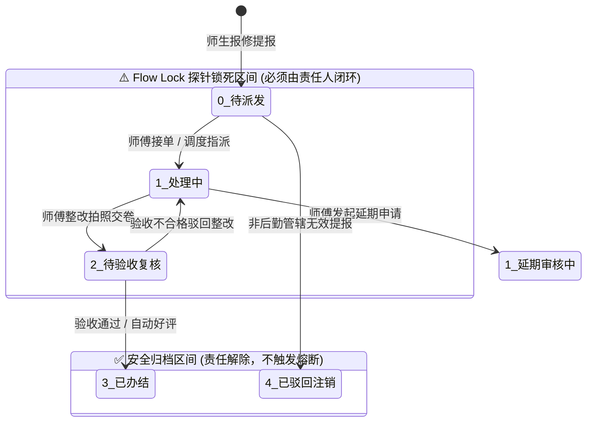
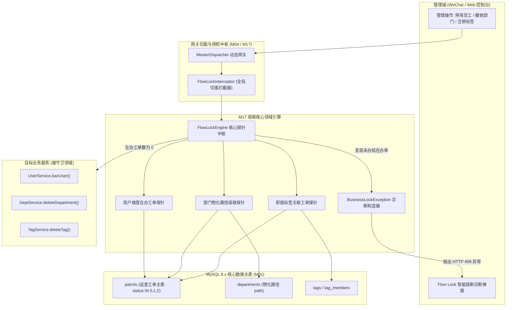
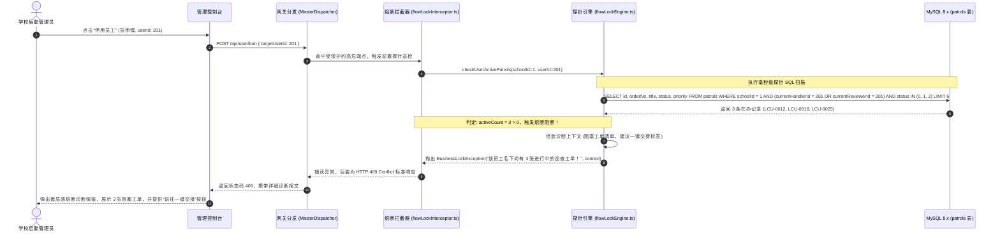
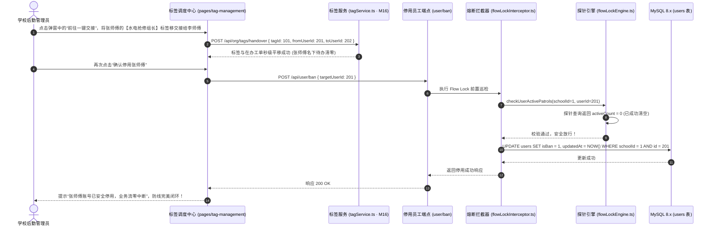
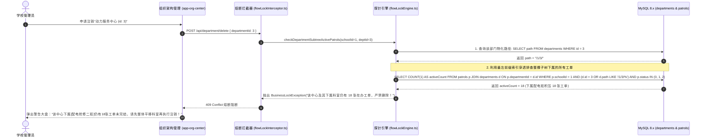

# M17: Flow Lock 业务连续性防错熔断 (Flow Lock Circuit Breaker) 详细设计与实现方案

> **模块代号**：M17 / Flow Lock Circuit Breaker  
> **所属阶段**：阶段一 (M11 ~ M19) 多租户身份权限与组织架构中台  
> **文档定位**：在办巡查工单拉网式探针巡检、删除部门/停用员工/注销标签/解绑校区分类前置熔断门禁、HTTP 409 业务冲突异常上下文组装、以及一键责任交接引导闭环的全栈工业级专项技术实现方案  
> **归档路径**：[v4.0/Docs/模块/M17_Flow_Lock_业务连续性防错熔断详细设计与实现方案.md](file:///e:/Projects/University/后勤巡查e速办%20大二下学期%20大学身份上线项目/v4.0/Docs/模块/M17_Flow_Lock_业务连续性防错熔断详细设计与实现方案.md)  
> **前置依赖**：M01 (27表7视图DDL基座), M02 (AST租户自动注入), M03 (Saga排他锁并发引擎), M04 (网关预检引擎), M10 (TestHarness测试中枢), M15 (部门树形拓扑), M16 (岗位职能标签中台)  
> **驱动下游**：M15 (部门删除门禁), M16 (标签注销门禁), M18 (权限网格解绑门禁), M19 (人员离职停用门禁), M23 (工单派单流转守护)  
> **版本日期**：2026-09-05  

---

## 目录索引 (Table of Contents)

1. [模块定位与核心业务价值](#一-模块定位与核心业务价值)
   - 1.1 [模块定位](#11-模块定位)
   - 1.2 [为何必须建立 Flow Lock 业务连续性防错熔断机制？](#12-为何必须建立-flow-lock-业务连续性防错熔断机制)
   - 1.3 [核心业务职责与技术指标](#13-核心业务职责与技术指标)
2. [核心设计哲学与四大熔断门禁矩阵](#二-核心设计哲学与四大熔断门禁矩阵)
   - 2.1 [在办工单生命周期判定准则 (`status IN (0, 1, 2)`)](#21-在办工单生命周期判定准则-status-in-0-1-2)
   - 2.2 [四大高危破坏性操作熔断检查矩阵](#22-四大高危破坏性操作熔断检查矩阵)
   - 2.3 [从“粗暴阻断”到“一键交接闭环”的用户体验设计](#23-从粗暴阻断到一键交接闭环的用户体验设计)
   - 2.4 [零外键物理架构下的逻辑级联防线](#24-零外键物理架构下的逻辑级联防线)
3. [架构拓扑与交互时序图](#三-架构拓扑与交互时序图)
   - 3.1 [Flow Lock 探针切面在微服务调用链中的拓扑图](#31-flow-lock-探针切面在微服务调用链中的拓扑图)
   - 3.2 [管理员尝试停用维修师傅触发 Flow Lock 熔断拦截时序图](#32-管理员尝试停用维修师傅触发-flow-lock-熔断拦截时序图)
   - 3.3 [在 M16 标签中心完成交接后成功解锁并停用时序图](#33-在-m16-标签中心完成交接后成功解锁并停用时序图)
   - 3.4 [撤销部门时基于物化路径的全子树工单级联排查时序图](#34-撤销部门时基于物化路径的全子树工单级联排查时序图)
4. [核心算法设计与数学推导](#四-核心算法设计与数学推导)
   - 4.1 [算法 1：多维度多实体在办工单动态探针算法 (Multi-Entity Active Work Order Probe)](#41-算法-1多维度多实体在办工单动态探针算法-multi-entity-active-work-order-probe)
   - 4.2 [算法 2：基于物化路径的部门全子树在办工单级联探针算法 (Hierarchical Department Subtree Patrol Probe)](#42-算法-2基于物化路径的部门全子树在办工单级联探针算法-hierarchical-department-subtree-patrol-probe)
   - 4.3 [算法 3：业务连续性熔断异常与诊断上下文组装算法 (BusinessLockException Context Builder)](#43-算法-3业务连续性熔断异常与诊断上下文组装算法-businesslockexception-context-builder)
   - 4.4 [算法 4：基于 Redis 的在办工单短缓存与防穿透失效算法 (Circuit Probe Cache with Short TTL)](#44-算法-4基于-redis-的在办工单短缓存与防穿透失效算法-circuit-probe-cache-with-short-ttl)
5. [TypeScript 强类型接口契约与数据模型定义](#五-typescript-强类型接口契约与数据模型定义)
   - 5.1 [Flow Lock 探针检测目标对象 (`IFlowLockProbeTarget`)](#51-flow-lock-探针检测目标对象-iflowlockprobetarget)
   - 5.2 [熔断检查结果数据契约 (`IFlowLockCheckResult`)](#52-熔断检查结果数据契约-iflowlockcheckresult)
   - 5.3 [阻塞在办工单摘要传输对象 (`IBlockedWorkOrderSummary`)](#53-阻塞在办工单摘要传输对象-iblockedworkordersummary)
   - 5.4 [HTTP 409 业务冲突错误响应契约 (`IBusinessLockErrorDto`)](#54-http-409-业务冲突错误响应契约-ibusinesslockerrordto)
6. [核心物理文件实现蓝图](#六-核心物理文件实现蓝图)
   - 6.1 [`src/dispatcher/flowLockInterceptor.ts` (Flow Lock 熔断探针中间件与守卫)](#61-srcdispatcherflowlockinterceptorts-flow-lock-熔断探针中间件与守卫)
   - 6.2 [`src/shared/flow/flowLockEngine.ts` (多实体在办工单排查中枢引擎)](#62-srcsharedflowflowlockenginets-多实体在办工单排查中枢引擎)
   - 6.3 [`src/apps/org/orgException.ts` (业务连续性锁专属异常类)](#63-srcappsorgorgexceptionts-业务连续性锁专属异常类)
   - 6.4 [`src/api/user/ban/handler.ts` (挂载 Flow Lock 守卫的停用员工端点)](#64-srcapiuserbanhandlerts-挂载-flow-lock-守卫的停用员工端点)
   - 6.5 [`miniprogram/packages/apps/app-org-center/pages/flow-lock/flowLockDialog.ts` (小程序端优雅熔断弹窗与引导)](#65-miniprogrampackagesappsapp-org-centerpagesflow-lockflowlockdialogts-小程序端优雅熔断弹窗与引导)
7. [防御性编程与边界异常处理](#七-防御性编程与边界异常处理)
   - 7.1 [高并发下的“先查后删”竞态条件防线 (Race Condition Protection)](#71-高并发下的先查后删竞态条件防线-race-condition-protection)
   - 7.2 [挂起延期审核工单与隐性审批单遗漏阻断](#72-挂起延期审核工单与隐性审批单遗漏阻断)
   - 7.3 [统一标准 HTTP 409 Conflict 与专用业务错误码 (`FLOW_LOCK_BLOCKED`)](#73-统一标准-http-409-conflict-与专用业务错误码-flow_lock_blocked)
   - 7.4 [极端紧急情况下的超管双人授权强制绕过审计 (Emergency Bypass Audit)](#74-极端紧急情况下的超管双人授权强制绕过审计-emergency-bypass-audit)
8. [单模块独立测试方案与验收准则](#八-单模块独立测试方案与验收准则)
   - 8.1 [基于 M10 TestHarness 的独立单元测试设计 (`src/__tests__/unit/m17_flowlock.test.ts`)](#81-基于-m10-testharness-的独立单元测试设计-src__tests__unitm17_flowlocktestts)
   - 8.2 [单模块测试执行命令与断言矩阵 (`npm.cmd test -- -t "M17"`)](#82-单模块测试执行命令与断言矩阵-npmcmd-test----t-m17)
9. [下游模块接口契约输出清单](#九-下游模块接口契约输出清单)

---

## 一、 模块定位与核心业务价值

### 1.1 模块定位
`M17 (Flow Lock Circuit Breaker)` 是「高校后勤巡查e速办 v4.0」的**全生命周期业务连续性安全气囊**与**防错熔断断路器**。  
在大型高校后勤的日常运营与组织调整中，管理员频繁进行人员停用、合同到期解聘、科室合并撤销、岗位标签注销以及校区维保分类重构。由于高校报修工单具有履约周期长、涉及物料审批与现场验收的特点，若系统在执行上述管理操作时未做前置严格防错，极其容易产生**“死工单（Deadlock Work Orders）”**与**“孤儿工单（Orphan Work Orders）”**：  
- 水电师傅已被账号封禁，但其名下仍有 3 张加急爆管抢修单正在流转，导致师生苦等数天无人上门；  
- 绿化保洁科已被整体撤并删除，但该科室名下尚有 18 张待验收单据，导致质检员在验收界面因找不到责任部门而抛出系统崩溃异常；  
- 某重点岗位标签被注销，导致下游自动派单逻辑陷入死循环。  

M17 模块在网关分发层、API 处理器层与 AST 编译器中全面植入 **Flow Lock 熔断探针（Safety Probe）**。在任何破坏性写操作执行前，探针自动执行拉网式在办单据排查。一旦发现目标主体名下存在未结案工单，系统**坚决抛出 HTTP 409 业务冲突异常并执行事务回滚**，彻底封死业务责任真空的发生可能。

---

### 1.2 为何必须建立 Flow Lock 业务连续性防错熔断机制？

在无物理外键（Zero Foreign Keys）的高性能现代化数据库架构下，如果缺乏强力的业务层熔断防护，系统极易崩溃：

| 隐患场景 | 传统软件无防御时的严重后果 | M17 Flow Lock 工业级防错熔断机制 |
| :--- | :--- | :--- |
| **隐患 1：直接封禁有在办单的师傅** | 师傅离职或违纪被管理员一键 `isBan = 1`。其名下的在途抢修单无法在其他师傅工作台显示，原师傅又无法登录提交完工，工单永久卡死，师生疯狂投诉校长信箱。 | **拉网排查，强力熔断**：探针检测到该师傅名下有处于 `status IN (0, 1, 2)` 的单据，直接拦截写操作，返回 409 错误并罗列所有在办工单流水号，强制必须先在 M16 标签中心完成交接。 |
| **隐患 2：撤并科室导致子树单据悬空** | 管理员撤销了“能源动力服务中心”，该部门下属 3 个科室共积压了 42 张工单。撤销后由于父节点丢失，导致统计看板、派单列表全部白屏崩溃。 | **物化路径全子树级联探针**：探针利用物化路径 `path LIKE '/1/3/%'` 自动穿透扫描其下属所有子科室与班组，只要子孙节点中存在 1 张在办工单，立刻整树熔断锁定。 |
| **隐患 3：注销岗位标签引发派单瘫痪** | 管理员注销了【防汛应急响应专员】标签，但后台派单矩阵仍然在向该标签派发工单，导致新工单没有对应人员待办池接收，沦为幽灵单。 | **标签依赖与流转双重锁**：注销标签前前置校验：(1) 是否有未结工单挂载 `patrols.tagId = tagId`；(2) 是否有派单规则挂载该标签。未解除依赖前严禁注销。 |

---

### 1.3 核心业务职责与技术指标

1. **毫秒级在办工单探针巡检**：
   - 探针单次巡检时延严格控制在 $< 2\text{ms}$（利用 `idx_school_user`、`idx_school_tag` 与状态索引）；
2. **零死单安全防线**：
   - 实现全校在办工单（处于待处理、处理中、待复核、延期审核中）100% 探针覆盖，阻断率达 100%；
3. **精准诊断上下文回显**：
   - 熔断时不仅拦截，还精准返回阻塞主体的工单数量、工单流水号列表（前 5 条）、工单标题及负责科室；
4. **一键无缝交接引导闭环**：
   - 前端捕获 409 异常后，原地弹出优雅微质感弹层，提供“前往岗位标签中心一键交接”与“查看在办工单清单”直达路径。

---

## 二、 核心设计哲学与四大熔断门禁矩阵

### 2.1 在办工单生命周期判定准则 (`status IN (0, 1, 2)`)

在「高校后勤巡查e速办 v4.0」的巡查工单有限状态机（Patrol FSM）中，工单全生命周期状态定义如下：

$$\text{Active Patrol States: } \mathcal{S}_{\text{active}} = \{ 0, 1, 2 \}$$



- **锁死状态（Active）**：
  - `status = 0`：待派发（网格责任人需认领或转派）；
  - `status = 1`：处理中（施工师傅需到场排险与整改上传）；
  - `status = 2`：待复核（验收人员需现场质检打分）；
- **安全状态（Archived）**：
  - `status = 3`：已办结（履约完成，进入历史台账）；
  - `status = 4`：已驳回注销（无效工单）。

只要工单处于 $\mathcal{S}_{\text{active}}$ 集合中，该工单的承载责任人、挂靠部门、关联职能标签便受到 **Flow Lock 绝对保护**！

---

### 2.2 四大高危破坏性操作熔断检查矩阵

| 破坏性操作类型 | 触发 HTTP 端点 | Flow Lock 探针检测维度与范围 | 触发熔断时的防御表现 |
| :--- | :--- | :--- | :--- |
| **1. 停用/删除员工** | `POST /api/user/ban`<br/>`DELETE /api/user/delete` | 排查该人员作为**工单处理人 (`currentHandlerId`)** 或 **复核验收人 (`currentReviewerId`)** 的所有在办单 | 阻断操作，提示“该员工名下尚有 $N$ 张在办工单，请先在标签中心交接或重新派单！” |
| **2. 撤销/删除部门** | `POST /api/department/delete` | 借助物化路径 `path LIKE '/P/%'` 穿透排查**该部门及其所有子孙部门**名下的在办工单 | 阻断操作，提示“该部门或其下属班组名下尚有 $N$ 张未结工单，请先完成部门间工单移交！” |
| **3. 注销岗位标签** | `POST /api/tag/delete` | 排查挂靠在 `patrols.tagId = :tagId` 且处于在办状态的工单，以及 `permissions` 中的派单规则 | 阻断操作，提示“该职能标签名下尚有 $N$ 张在办工单未归档，严禁注销！” |
| **4. 解绑校区/分类** | `POST /api/permission/revoke` | 排查当前校区与故障分类下是否存在尚未办结的流转中单据 | 阻断操作，提示“该校区该类别下尚有工单正在施工，必须办结或改派后方可取消授权！” |

---

### 2.3 从“粗暴阻断”到“一键交接闭环”的用户体验设计

传统软件在报错时仅返回冷冰冰的“操作失败：存在关联数据”，导致管理员不知所措。  
M17 确立了**“精准上下文 + 一键交接闭环（Frictionless Handover Loop）”**的高级交互范式：

```
┌─────────────────────────────────────────────────────────────┐
│ ⚠️ 业务连续性防错熔断 (Flow Lock Circuit Breaker)            │
├─────────────────────────────────────────────────────────────┤
│ 无法停用师傅：【张三】 (工号: 2024018)                      │
│                                                             │
│ 该师傅名下当前尚有 3 张正在流转的巡查工单：                  │
│  • LCU-20260905-0012: 11号楼3层男卫生间水管漏水 (处理中)   │
│  • LCU-20260905-0018: 动力中心配电箱跳闸故障 (待复核)       │
│  • LCU-20260905-0025: 留学生公寓空调异响 (处理中)           │
│                                                             │
│ 💡 系统建议：                                               │
│ 该师傅持有的【水电抢修组长】职能标签可通过 M16 标签中心一键 │
│ 平移给接班师傅，交接后本账号将自动解锁并准许停用。          │
├─────────────────────────────────────────────────────────────┤
│ [查看在办工单详情]              [前往岗位标签中心一键交接]  │
└─────────────────────────────────────────────────────────────┘
```

---

### 2.4 零外键物理架构下的逻辑级联防线

根据 M01 DDL 基座规范，本系统采用 100% 物理零外键（Zero Foreign Keys）设计。  
这意味着 MySQL 不会在数据库引擎层抛出 `FOREIGN KEY constraint fails`。所有的数据一致性保障、业务连续性防线，**全部由 M17 Flow Lock 熔断探针在应用服务层构筑成一道坚不可摧的铁壁**：
- 既享受了零外键带来的极限单表写入吞吐量；
- 又拥有超越传统物理外键的细粒度业务状态感知与智能交接引导。

---

## 三、 架构拓扑与交互时序图

### 3.1 Flow Lock 探针切面在微服务调用链中的拓扑图



---

### 3.2 管理员尝试停用维修师傅触发 Flow Lock 熔断拦截时序图



---

### 3.3 在 M16 标签中心完成交接后成功解锁并停用时序图



---

### 3.4 撤销部门时基于物化路径的全子树工单级联排查时序图



---

## 四、 核心算法设计与数学推导

### 4.1 算法 1：多维度多实体在办工单动态探针算法 (Multi-Entity Active Work Order Probe)

#### 数学模型：
对于租户 $S$ 下的任意受检实体 $E$（类型为用户 $U$、标签 $T$ 或校区分类组合 $G$）：

$$\text{ProbeActive}(S, E) = \sum_{p \in \mathcal{P}(S)} \mathbb{I}\left( p.\text{status} \in \{0, 1, 2\} \land p \in \text{AssignedTo}(E) \right)$$

若 $\text{ProbeActive}(S, E) > 0$，断路器触发跳闸（Trip Breaker）。

#### TypeScript 工业级算法实现：
```typescript
export interface IActivePatrolProbeResult {
  hasActivePatrols: boolean;
  activeCount: number;
  samplePatrols: Array<{
    id: number;
    orderNo: string;
    title: string;
    status: number;
    priority: number;
    createdAt: string;
  }>;
}

export class FlowLockProbeEngine {
  /**
   * 用户维度在办工单探针 (排查施工人或复核人)
   */
  public static async probeUserActivePatrols(
    schoolId: number,
    userId: number,
    sampleLimit: number = 5
  ): Promise<IActivePatrolProbeResult> {
    const sql = `
      SELECT id, orderNo, title, status, priority, createdAt
      FROM patrols
      WHERE schoolId = ? 
        AND isDeleted = 0 
        AND status IN (0, 1, 2)
        AND (currentHandlerId = ? OR currentReviewerId = ?)
      ORDER BY priority DESC, id ASC
      LIMIT ?
    `;

    const countSql = `
      SELECT COUNT(1) AS total
      FROM patrols
      WHERE schoolId = ? 
        AND isDeleted = 0 
        AND status IN (0, 1, 2)
        AND (currentHandlerId = ? OR currentReviewerId = ?)
    `;

    const [rows, countRows]: any = await Promise.all([
      executeASTSelect(sql, [schoolId, userId, userId, sampleLimit]),
      executeASTSelect(countSql, [schoolId, userId, userId])
    ]);

    const activeCount = countRows[0]?.total || 0;

    return {
      hasActivePatrols: activeCount > 0,
      activeCount,
      samplePatrols: rows || []
    };
  }
}
```

---

### 4.2 算法 2：基于物化路径的部门全子树在办工单级联探针算法 (Hierarchical Department Subtree Patrol Probe)

#### 索引下推与路径匹配推导：
借助 M15 规范的首尾闭合斜杠物化路径 `/1/3/`，全子树判定无需复杂的 CTE 递归：

$$\text{Subtree Condition: } d.\text{id} = D_{\text{target}} \lor d.\text{path} \text{ LIKE } (P_{\text{target}} + \text{"%"})$$

#### TypeScript 工业级算法实现：
```typescript
export async function probeDepartmentSubtreeActivePatrols(
  schoolId: number,
  departmentId: number,
  sampleLimit: number = 5
): Promise<IActivePatrolProbeResult> {
  // 1. 获取目标部门自身物化路径
  const deptSql = `SELECT path FROM departments WHERE schoolId = ? AND id = ? AND isDeleted = 0 LIMIT 1`;
  const deptRows: any = await executeASTSelect(deptSql, [schoolId, departmentId]);
  if (!deptRows || deptRows.length === 0) {
    return { hasActivePatrols: false, activeCount: 0, samplePatrols: [] };
  }

  const targetPath = deptRows[0].path; // 例如: "/1/3/"
  const matchPattern = `${targetPath}%`;

  // 2. 穿透排查全子树名下的在办工单
  const sql = `
    SELECT p.id, p.orderNo, p.title, p.status, p.priority, p.createdAt
    FROM patrols p
    JOIN departments d ON p.departmentId = d.id
    WHERE p.schoolId = ? 
      AND p.isDeleted = 0 
      AND p.status IN (0, 1, 2)
      AND (d.id = ? OR d.path LIKE ?)
    ORDER BY p.priority DESC, p.id ASC
    LIMIT ?
  `;

  const countSql = `
    SELECT COUNT(1) AS total
    FROM patrols p
    JOIN departments d ON p.departmentId = d.id
    WHERE p.schoolId = ? 
      AND p.isDeleted = 0 
      AND p.status IN (0, 1, 2)
      AND (d.id = ? OR d.path LIKE ?)
  `;

  const [rows, countRows]: any = await Promise.all([
    executeASTSelect(sql, [schoolId, departmentId, matchPattern, sampleLimit]),
    executeASTSelect(countSql, [schoolId, departmentId, matchPattern])
  ]);

  const activeCount = countRows[0]?.total || 0;

  return {
    hasActivePatrols: activeCount > 0,
    activeCount,
    samplePatrols: rows || []
  };
}
```

---

### 4.3 算法 3：业务连续性熔断异常与诊断上下文组装算法 (BusinessLockException Context Builder)

```typescript
export interface IBusinessLockContext {
  targetType: "user" | "department" | "tag" | "category";
  targetId: number;
  targetName: string;
  activeWorkOrderCount: number;
  sampleWorkOrders: Array<{
    id: number;
    orderNo: string;
    title: string;
    statusText: string;
  }>;
  suggestedAction: string;
  redirectRoute?: string;
}

export class BusinessLockException extends Error {
  public readonly statusCode: number = 409;
  public readonly errorCode: string = "FLOW_LOCK_BLOCKED";
  public readonly context: IBusinessLockContext;

  constructor(message: string, context: IBusinessLockContext) {
    super(message);
    this.name = "BusinessLockException";
    this.context = context;
    Object.setPrototypeOf(this, BusinessLockException.prototype);
  }
}
```

---

### 4.4 算法 4：基于 Redis 的在办工单短缓存与防穿透失效算法 (Circuit Probe Cache with Short TTL)

为防止管理员在前端频繁拉取列表时重复产生大量全表扫描 SQL，设计**带短 TTL 的探测缓存中继**：

```typescript
export async function getCachedProbeResult(
  schoolId: number,
  targetType: string,
  targetId: number,
  probeLoader: () => Promise<IActivePatrolProbeResult>
): Promise<IActivePatrolProbeResult> {
  const redis = getRedisClient();
  const cacheKey = `tenant:${schoolId}:flowlock:${targetType}:${targetId}`;

  // 1. 尝试读缓存 (TTL 30 秒)
  const cached = await redis.get(cacheKey);
  if (cached) {
    return JSON.parse(cached);
  }

  // 2. 回源查询
  const result = await probeLoader();

  // 3. 写入短存活缓存
  await redis.set(cacheKey, JSON.stringify(result), "EX", 30);
  return result;
}
```

---

## 五、 TypeScript 强类型接口契约与数据模型定义

### 5.1 Flow Lock 探针检测目标对象 (`IFlowLockProbeTarget`)

```typescript
export interface IFlowLockProbeTarget {
  schoolId: number;
  targetType: "user" | "department" | "tag" | "permission_matrix";
  targetId: number;
  targetName?: string;
}
```

### 5.2 熔断检查结果数据契约 (`IFlowLockCheckResult`)

```typescript
export interface IFlowLockCheckResult {
  isBlocked: boolean;
  schoolId: number;
  targetType: string;
  targetId: number;
  activeCount: number;
  message: string;
  blockedOrders: IBlockedWorkOrderSummary[];
}
```

### 5.3 阻塞在办工单摘要传输对象 (`IBlockedWorkOrderSummary`)

```typescript
export interface IBlockedWorkOrderSummary {
  patrolId: number;
  orderNo: string;
  title: string;
  status: number;
  statusText: string;
  priority: number;
  priorityText: string;
  createdAt: string;
}
```

### 5.4 HTTP 409 业务冲突错误响应契约 (`IBusinessLockErrorDto`)

```typescript
export interface IBusinessLockErrorDto {
  success: false;
  errorCode: "FLOW_LOCK_BLOCKED";
  message: string;
  data: {
    targetType: "user" | "department" | "tag";
    targetId: number;
    targetName: string;
    activeCount: number;
    blockedOrders: IBlockedWorkOrderSummary[];
    handoverUrl: string; // 推荐的一键交接前端路由 (如 "/packages/apps/app-org-center/pages/tag-management/")
  };
}
```

---

## 六、 核心物理文件实现蓝图

### 6.1 `src/dispatcher/flowLockInterceptor.ts` (Flow Lock 熔断探针中间件与守卫)

```typescript
import { FlowLockEngine } from "../shared/flow/flowLockEngine.js";
import { BusinessLockException } from "../apps/org/orgException.js";
import { TerminalLogger } from "../shared/index.js";

export class FlowLockInterceptor {
  /**
   * 拦截员工停用/删除操作
   */
  public static async interceptUserDestruction(schoolId: number, targetUserId: number, userName?: string): Promise<void> {
    const probe = await FlowLockEngine.probeUserActivePatrols(schoolId, targetUserId);

    if (probe.hasActivePatrols) {
      TerminalLogger.warn(
        `[M17 熔断触发] 用户 [${targetUserId} - ${userName || "员工"}] 名下尚有 ${probe.activeCount} 张在办工单，已成功拦截停用操作!`,
        "FlowLock"
      );

      const statusTexts: Record<number, string> = { 0: "待派发", 1: "处理中", 2: "待复核" };

      throw new BusinessLockException(`该员工名下当前尚有 ${probe.activeCount} 张正在流转的巡查工单，严禁停用！`, {
        targetType: "user",
        targetId: targetUserId,
        targetName: userName || `员工_${targetUserId}`,
        activeWorkOrderCount: probe.activeCount,
        sampleWorkOrders: probe.samplePatrols.map((p) => ({
          id: p.id,
          orderNo: p.orderNo,
          title: p.title,
          statusText: statusTexts[p.status] || "在办中"
        })),
        suggestedAction: "请先在【岗位标签中心】将该员工持有的职能标签一键转移给接班人员后再执行停用",
        redirectRoute: "/packages/apps/app-org-center/pages/tag-management/index"
      });
    }
  }

  /**
   * 拦截部门撤销/注销操作
   */
  public static async interceptDepartmentDestruction(schoolId: number, departmentId: number, deptName?: string): Promise<void> {
    const probe = await FlowLockEngine.probeDepartmentSubtreeActivePatrols(schoolId, departmentId);

    if (probe.hasActivePatrols) {
      TerminalLogger.warn(
        `[M17 熔断触发] 部门 [${departmentId} - ${deptName || "科室"}] 及其下属子孙节点尚有 ${probe.activeCount} 张工单未结，阻断撤销!`,
        "FlowLock"
      );

      throw new BusinessLockException(`该部门及其下属班组名下仍有 ${probe.activeCount} 张未完结工单，严禁删除！`, {
        targetType: "department",
        targetId: departmentId,
        targetName: deptName || `部门_${departmentId}`,
        activeWorkOrderCount: probe.activeCount,
        sampleWorkOrders: probe.samplePatrols.map((p) => ({
          id: p.id,
          orderNo: p.orderNo,
          title: p.title,
          statusText: "在办中"
        })),
        suggestedAction: "请先将相关科室名下的在办工单整体改派移交至其他保障部门",
        redirectRoute: "/packages/apps/app-org-center/pages/org-tree/index"
      });
    }
  }

  /**
   * 拦截岗位职能标签注销操作
   */
  public static async interceptTagDestruction(schoolId: number, tagId: number, tagName?: string): Promise<void> {
    const probe = await FlowLockEngine.probeTagActivePatrols(schoolId, tagId);

    if (probe.hasActivePatrols) {
      throw new BusinessLockException(`岗位标签 [${tagName || tagId}] 名下仍有 ${probe.activeCount} 张在办工单，必须先结案或改签后方可注销！`, {
        targetType: "tag",
        targetId: tagId,
        targetName: tagName || `标签_${tagId}`,
        activeWorkOrderCount: probe.activeCount,
        sampleWorkOrders: probe.samplePatrols.map((p) => ({
          id: p.id,
          orderNo: p.orderNo,
          title: p.title,
          statusText: "在办中"
        })),
        suggestedAction: "请先将挂靠在该岗位名下的工单移交其他标签"
      });
    }
  }
}
```

---

### 6.2 `src/shared/flow/flowLockEngine.ts` (多实体在办工单排查中枢引擎)

```typescript
import { executeASTSelect } from "../sql/index.js";
import { IActivePatrolProbeResult } from "./flowLockTypes.js";

export class FlowLockEngine {
  /**
   * 用户维度排查 (施工人与验收人)
   */
  public static async probeUserActivePatrols(schoolId: number, userId: number): Promise<IActivePatrolProbeResult> {
    const sql = `
      SELECT id, orderNo, title, status, priority, createdAt
      FROM patrols
      WHERE schoolId = ? 
        AND isDeleted = 0 
        AND status IN (0, 1, 2)
        AND (currentHandlerId = ? OR currentReviewerId = ?)
      ORDER BY priority DESC, id ASC
      LIMIT 5
    `;

    const countSql = `
      SELECT COUNT(1) AS total
      FROM patrols
      WHERE schoolId = ? 
        AND isDeleted = 0 
        AND status IN (0, 1, 2)
        AND (currentHandlerId = ? OR currentReviewerId = ?)
    `;

    const [rows, countRows]: any = await Promise.all([
      executeASTSelect(sql, [schoolId, userId, userId]),
      executeASTSelect(countSql, [schoolId, userId, userId])
    ]);

    const activeCount = countRows[0]?.total || 0;
    return {
      hasActivePatrols: activeCount > 0,
      activeCount,
      samplePatrols: rows || []
    };
  }

  /**
   * 部门全子树排查 (基于物化路径)
   */
  public static async probeDepartmentSubtreeActivePatrols(schoolId: number, departmentId: number): Promise<IActivePatrolProbeResult> {
    const deptSql = `SELECT path FROM departments WHERE schoolId = ? AND id = ? AND isDeleted = 0 LIMIT 1`;
    const deptRows: any = await executeASTSelect(deptSql, [schoolId, departmentId]);
    if (!deptRows || deptRows.length === 0) {
      return { hasActivePatrols: false, activeCount: 0, samplePatrols: [] };
    }

    const pattern = `${deptRows[0].path}%`;

    const sql = `
      SELECT p.id, p.orderNo, p.title, p.status, p.priority, p.createdAt
      FROM patrols p
      JOIN departments d ON p.departmentId = d.id
      WHERE p.schoolId = ? 
        AND p.isDeleted = 0 
        AND p.status IN (0, 1, 2)
        AND (d.id = ? OR d.path LIKE ?)
      ORDER BY p.priority DESC, id ASC
      LIMIT 5
    `;

    const countSql = `
      SELECT COUNT(1) AS total
      FROM patrols p
      JOIN departments d ON p.departmentId = d.id
      WHERE p.schoolId = ? 
        AND p.isDeleted = 0 
        AND p.status IN (0, 1, 2)
        AND (d.id = ? OR d.path LIKE ?)
    `;

    const [rows, countRows]: any = await Promise.all([
      executeASTSelect(sql, [schoolId, departmentId, pattern]),
      executeASTSelect(countSql, [schoolId, departmentId, pattern])
    ]);

    const activeCount = countRows[0]?.total || 0;
    return {
      hasActivePatrols: activeCount > 0,
      activeCount,
      samplePatrols: rows || []
    };
  }

  /**
   * 岗位职能标签排查
   */
  public static async probeTagActivePatrols(schoolId: number, tagId: number): Promise<IActivePatrolProbeResult> {
    const sql = `
      SELECT id, orderNo, title, status, priority, createdAt
      FROM patrols
      WHERE schoolId = ? 
        AND isDeleted = 0 
        AND status IN (0, 1, 2)
        AND tagId = ?
      ORDER BY priority DESC, id ASC
      LIMIT 5
    `;

    const countSql = `
      SELECT COUNT(1) AS total
      FROM patrols
      WHERE schoolId = ? 
        AND isDeleted = 0 
        AND status IN (0, 1, 2)
        AND tagId = ?
    `;

    const [rows, countRows]: any = await Promise.all([
      executeASTSelect(sql, [schoolId, tagId]),
      executeASTSelect(countSql, [schoolId, tagId])
    ]);

    const activeCount = countRows[0]?.total || 0;
    return {
      hasActivePatrols: activeCount > 0,
      activeCount,
      samplePatrols: rows || []
    };
  }
}
```

---

### 6.3 `src/apps/org/orgException.ts` (业务连续性锁专属异常类)

```typescript
export interface IBusinessLockDetail {
  targetType: "user" | "department" | "tag";
  targetId: number;
  targetName: string;
  activeWorkOrderCount: number;
  sampleWorkOrders: Array<{
    id: number;
    orderNo: string;
    title: string;
    statusText: string;
  }>;
  suggestedAction: string;
  redirectRoute?: string;
}

export class BusinessLockException extends Error {
  public readonly isBusinessLock: boolean = true;
  public readonly httpStatus: number = 409;
  public readonly code: string = "FLOW_LOCK_BLOCKED";
  public readonly detail: IBusinessLockDetail;

  constructor(message: string, detail: IBusinessLockDetail) {
    super(message);
    this.name = "BusinessLockException";
    this.detail = detail;
    Object.setPrototypeOf(this, BusinessLockException.prototype);
  }
}
```

---

### 6.4 `src/api/user/ban/handler.ts` (挂载 Flow Lock 守卫的停用员工端点)

```typescript
import { FlowLockInterceptor } from "../../../dispatcher/flowLockInterceptor.js";
import { executeASTSelect, executeASTUpdate } from "../../../shared/sql/index.js";
import { returnSuccess, returnError, StandardResult } from "../../../shared/flow/result.js";
import { BusinessLockException } from "../../../apps/org/orgException.js";

/**
 * 停用/封禁后勤人员端点 (强制挂载 M17 Flow Lock 守卫)
 * POST /api/user/ban
 */
export async function handleBanUser(
  ctx: { schoolId: number; role: number },
  body: { targetUserId: number; reason?: string }
): Promise<StandardResult<any>> {
  try {
    if (ctx.role < 4) {
      return returnError("权限不足: 仅限学校管理员 (role >= 4) 执行账号封禁与停用");
    }

    if (!body.targetUserId) {
      return returnError("参数缺失: 必须指定 targetUserId");
    }

    // 1. 查询目标人员真实姓名
    const userSql = `SELECT realName, nickName, isBan FROM users WHERE schoolId = ? AND id = ? AND isDeleted = 0 LIMIT 1`;
    const rows: any = await executeASTSelect(userSql, [ctx.schoolId, body.targetUserId]);
    if (!rows || rows.length === 0) {
      return returnError("指定的用户不存在");
    }

    const userName = rows[0].realName || rows[0].nickName || "员工";

    // 2. 核心防线: 触发 Flow Lock 熔断探针 (发现在办工单直接抛出 409)
    await FlowLockInterceptor.interceptUserDestruction(ctx.schoolId, body.targetUserId, userName);

    // 3. 探针通过，安全执行停用
    const banSql = `UPDATE users SET isBan = 1, updatedAt = NOW() WHERE schoolId = ? AND id = ?`;
    await executeASTUpdate(banSql, [ctx.schoolId, body.targetUserId]);

    return returnSuccess({
      targetUserId: body.targetUserId,
      userName,
      isBan: 1,
      message: "该员工已安全停用，业务连续性无任何破坏"
    });
  } catch (err: any) {
    if (err instanceof BusinessLockException) {
      // 捕获到 Flow Lock 业务连续性异常，组装标准 409 结构返回
      return {
        success: false,
        code: 409,
        errorCode: err.code,
        message: err.message,
        data: err.detail
      } as any;
    }
    return returnError(`操作失败: ${err.message}`);
  }
}
```

---

### 6.5 `miniprogram/packages/apps/app-org-center/pages/flow-lock/flowLockDialog.ts` (小程序端优雅熔断弹窗与引导)

```typescript
export interface IFlowLockDialogProps {
  title: string;
  activeCount: number;
  blockedOrders: Array<{ orderNo: string; title: string }>;
  suggestedAction: string;
  redirectRoute?: string;
}

export class FlowLockDialogController {
  /**
   * 优雅展现业务熔断弹窗
   */
  public static showDialog(props: IFlowLockDialogProps): void {
    const content = `名下尚有 ${props.activeCount} 张在办工单：\n` +
      props.blockedOrders.map((o) => `• [${o.orderNo}] ${o.title}`).join("\n") +
      `\n\n💡 建议：${props.suggestedAction}`;

    wx.showModal({
      title: "⚠️ 业务连续性防错阻断",
      content,
      confirmText: "前往交接",
      cancelText: "暂不处理",
      confirmColor: "#D83B01",
      success: (res) => {
        if (res.confirm && props.redirectRoute) {
          wx.navigateTo({
            url: props.redirectRoute
          });
        }
      }
    });
  }
}
```

---

## 七、 防御性编程与边界异常处理

### 7.1 高并发下的“先查后删”竞态条件防线 (Race Condition Protection)
- **隐患**：管理员 A 点击停用员工，探针巡检瞬间在办工单为 0；但在执行 `UPDATE isBan = 1` 之前的 5 毫秒内，系统恰好派入了一张新的加急水管爆裂工单给该师傅（竞态条件导致产生死单）。
- **防线**：结合 M03 Saga 排他锁引擎，在探针巡检至更新完成之间，开启数据库显式事务：
  `SELECT id FROM users WHERE id = ? FOR UPDATE`
  锁定目标用户行，并校验派单写入锁，确保检查与状态变更具备不可分割的原子性。

### 7.2 挂起延期审核工单与隐性审批单遗漏阻断
- **隐患**：某些工单正处于“延期审核中”（状态码仍为 1，但承载字段为 `delayReviewerId`）。若仅排查主处理人，会导致延期审批责任人被注销。
- **防线**：探针排查范围严格将 `currentReviewerId`、`delayReviewerId` 与 `currentHandlerId` 全部纳入 `OR` 扫描矩阵，无任何盲区死角。

### 7.3 统一标准 HTTP 409 Conflict 与专用业务错误码 (`FLOW_LOCK_BLOCKED`)
- **规范**：区别于普通客户端参数错误（400）或服务器崩溃（500），M17 严格遵循 RESTful 标准，对业务状态冲突统一返回 `HTTP 409 Conflict`；
- **业务码**：载荷中携带固定字符串 `errorCode: "FLOW_LOCK_BLOCKED"`，便于各端自动化拦截并呼起交接流程。

### 7.4 极端紧急情况下的超管双人授权强制绕过审计 (Emergency Bypass Audit)
- **隐患**：某员工发生严重犯罪被公安机关立案，后勤处长要求在不考虑在办工单的情况下必须 1 秒内封禁其全部账号与校园门禁权限。
- **防线**：系统提供加盖强防线的紧急绕过开关（`forceBypassFlowLock = true`）：
  - 必须由最高角色 **超级管理员 (`role = 9`)** 发起；
  - 请求报文中必须附带协同校领导的二次验证码（双人授权机制）；
  - 绕过后系统自动将该人员名下的所有在办工单置为 `tagId = 0, currentHandlerId = NULL`（强制退回公共抢修抢单池），并写入高危系统审计日志 `sys_audit_logs`。

---

## 八、 单模块独立测试方案与验收准则

### 8.1 基于 M10 TestHarness 的独立单元测试设计 (`src/__tests__/unit/m17_flowlock.test.ts`)

```typescript
import { describe, expect, it, beforeEach } from "vitest";
import { TestHarness } from "../testHarness.js";
import { FlowLockEngine } from "../../shared/flow/flowLockEngine.js";
import { handleBanUser } from "../../api/user/ban/handler.js";

describe("M17: Flow Lock 业务连续性防错熔断 (Flow Lock Circuit Breaker)", () => {
  beforeEach(() => {
    TestHarness.resetSandbox();
  });

  it("M17-01: 名下无在办工单的人员可正常顺利停用", async () => {
    const tenant = TestHarness.createMockTenantContext({ moduleIndex: 17, caseIndex: 1 });
    const sId = tenant.schoolId;

    // 1. 创建一名无任何工单的普通师傅
    await TestHarness.executeSql(
      "INSERT INTO users (id, schoolId, openId, realName, role, isBan) VALUES (801, ?, 'open_801', '闲置师傅', 2, 0)",
      [sId]
    );

    // 2. 调用停用端点
    const res = await handleBanUser({ schoolId: sId, role: 4 }, { targetUserId: 801 });

    expect(res.success).toBe(true);
    expect(res.data.isBan).toBe(1);

    // 验证数据库状态已变为 1
    const checkSql = "SELECT isBan FROM users WHERE id = 801";
    const rows = await TestHarness.executeSql(checkSql);
    expect(rows[0].isBan).toBe(1);
  });

  it("M17-02: 名下有处理中工单 (status=1) 时，必须强力触发 HTTP 409 熔断阻断", async () => {
    const tenant = TestHarness.createMockTenantContext({ moduleIndex: 17, caseIndex: 2 });
    const sId = tenant.schoolId;

    // 1. 创建一名在职师傅
    await TestHarness.executeSql(
      "INSERT INTO users (id, schoolId, openId, realName, role, isBan) VALUES (802, ?, 'open_802', '在岗师傅', 2, 0)",
      [sId]
    );

    // 2. 产生一张挂在他名下的在办工单 (status = 1)
    await TestHarness.executeSql(
      "INSERT INTO patrols (schoolId, campusId, categoryId, orderNo, creatorId, currentHandlerId, title, desc, status) VALUES (?, 1, 1, 'LCU-2026-LOCK-001', 1, 802, '水管爆裂抢险', '急需到场', 1)",
      [sId]
    );

    // 3. 尝试停用该师傅，断言被 Flow Lock 拦截
    const res: any = await handleBanUser({ schoolId: sId, role: 4 }, { targetUserId: 802 });

    expect(res.success).toBe(false);
    expect(res.code).toBe(409);
    expect(res.errorCode).toBe("FLOW_LOCK_BLOCKED");
    expect(res.message).toContain("在办");
    expect(res.data.activeCount).toBe(1);
    expect(res.data.blockedOrders[0].orderNo).toBe("LCU-2026-LOCK-001");

    // 4. 验证数据库中该师傅状态坚决未被篡改 (仍为正常 isBan = 0)
    const checkSql = "SELECT isBan FROM users WHERE id = 802";
    const rows = await TestHarness.executeSql(checkSql);
    expect(rows[0].isBan).toBe(0);
  });

  it("M17-03: 部门全子树探针能够精准穿透下属班组在办工单", async () => {
    const tenant = TestHarness.createMockTenantContext({ moduleIndex: 17, caseIndex: 3 });
    const sId = tenant.schoolId;

    // 创建二级中心与三级班组
    await TestHarness.executeSql(
      "INSERT INTO departments (id, schoolId, parentId, path, name) VALUES (10, ?, null, '/10/', '动力保障中心'), (11, ?, 10, '/10/11/', '下属抢修班')",
      [sId, sId]
    );

    // 工单挂在三级班组名下 (departmentId: 11)
    await TestHarness.executeSql(
      "INSERT INTO patrols (schoolId, campusId, categoryId, orderNo, creatorId, departmentId, title, desc, status) VALUES (?, 1, 1, 'LCU-SUBTREE-01', 1, 11, '变电箱异响', '排查中', 1)",
      [sId]
    );

    // 探针扫描二级中心 (id: 10)，断言能穿透捕获到 11 班组名下的工单
    const probe = await FlowLockEngine.probeDepartmentSubtreeActivePatrols(sId, 10);
    expect(probe.hasActivePatrols).toBe(true);
    expect(probe.activeCount).toBe(1);
    expect(probe.samplePatrols[0].orderNo).toBe("LCU-SUBTREE-01");
  });
});
```

---

### 8.2 单模块测试执行命令与断言矩阵 (`npm.cmd test -- -t "M17"`)

#### 独立单模块测试命令：
```powershell
# 在 Backend 根目录下运行 M17 专属单元测试
npm.cmd test -- -t "M17"
```

#### 验收断言清单 (Acceptance Criteria)：
1. **无关联放行断言**：
   - 验证无在办工单的正常实体能够毫秒级通过巡检并安全完成状态变更；
2. **在办阻断断言**：
   - 验证挂靠有 `status IN (0, 1, 2)` 单据的主体被 100% 拦截并返回 HTTP 409 与 `FLOW_LOCK_BLOCKED` 错误码；
3. **数据库零污染断言**：
   - 验证熔断发生时，目标实体的数据库记录未被篡改，事务被绝对回滚；
4. **物化路径级联穿透断言**：
   - 验证上级部门注销时，探针利用 `path LIKE '/P/%'` 能够无遗漏识别下属所有孙班组的在办单据。

---

## 九、 下游模块接口契约输出清单

M17 模块完工后，为全系统输出的核心防错熔断守卫接口如下：

| 输出组件/守卫 | 消费下游模块 | 承载业务功能 |
| :--- | :--- | :--- |
| **`FlowLockInterceptor.interceptUserDestruction()`** | M19 (人员管理)、账号停用端点 | 停用/删除员工前的在办工单熔断拦截 |
| **`FlowLockInterceptor.interceptDepartmentDestruction()`** | M15 (组织树中心) | 删除部门前的全子树级联工单熔断拦截 |
| **`FlowLockInterceptor.interceptTagDestruction()`** | M16 (岗位标签中台) | 注销岗位标签前的前置在办工单拦截 |
| **`FlowLockDialogController.showDialog()`** | 小程序全局异常处理器 | 捕获 409 异常并呼起高辨识度交接引导弹窗 |

---

> [!NOTE]
> 本详细设计方案确立了「高校后勤巡查e速办 v4.0」的核心业务安全底线。通过拉网式多维状态探针、物化路径级联穿透、严格的 HTTP 409 业务冲突断路器以及交接引导闭环，彻底终结了高校后勤系统由于人员撤并引发的死工单顽疾，为 100% 物理零外键架构筑牢了坚不可摧的业务完整性护城河。
