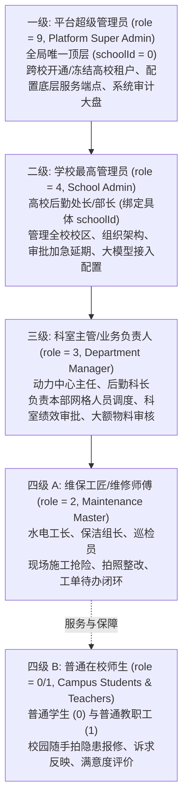
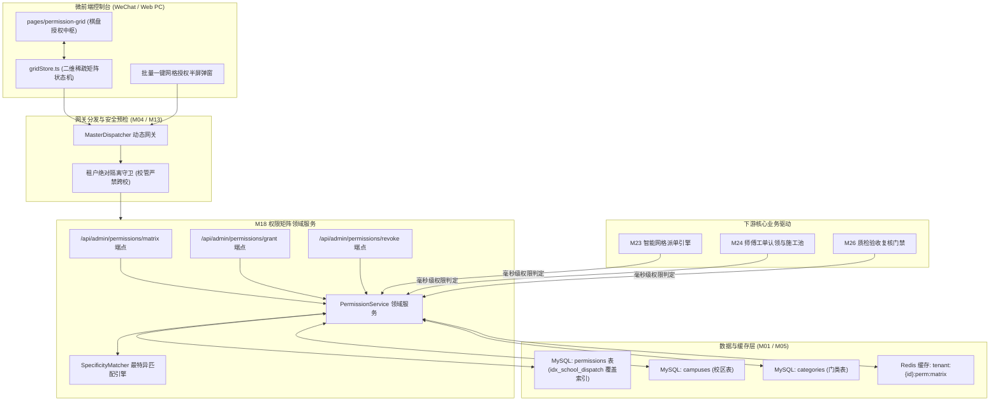
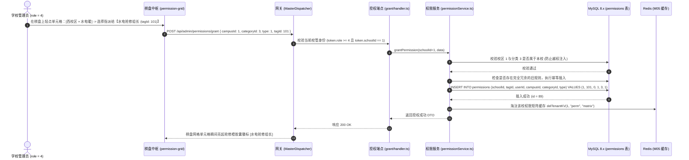
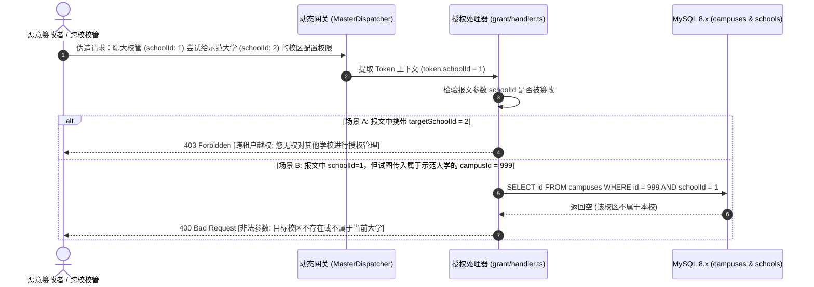

# M18: 四级立体权限矩阵与校内网格化授权 (4-Level RBAC & Grid Matrix) 详细设计与实现方案

> **模块代号**：M18 / 4-Level RBAC & Grid Matrix  
> **所属阶段**：阶段一 (M11 ~ M19) 多租户身份权限与组织架构中台  
> **文档定位**：四级多租户法定角色阶梯 (`role`: 9, 4, 3, 2, 1, 0)、四维空间业务权限张量 (`schoolId × (userId|tagId) × campusId × categoryId × type`)、最特异优先通配符匹配算法 (Most-Specific-First)、棋盘式 (Grid Matrix) 可视化网格授权交互、以及跨校越权强阻断的全栈工业级专项技术实现方案  
> **归档路径**：[v4.0/Docs/模块/M18_四级立体权限矩阵与校内网格化授权详细设计与实现方案.md](file:///e:/Projects/University/后勤巡查e速办%20大二下学期%20大学身份上线项目/v4.0/Docs/模块/M18_四级立体权限矩阵与校内网格化授权详细设计与实现方案.md)  
> **前置依赖**：M01 (27表7视图DDL基座), M02 (AST租户自动注入), M04 (网关路由与预检引擎), M05 (Redis多租户缓存总线), M10 (TestHarness测试中枢), M13 (多租户身份鉴权), M16 (岗位职能标签中台)  
> **驱动下游**：M19 (移动端批量调度与审计日志), M23 (智能网格派单与标签匹配), M24 (后勤师傅现场接单工作台), M26 (质检人员到场复核验收), M44 (全校后勤宏观效能驾驶舱)  
> **版本日期**：2026-09-05  

---

## 目录索引 (Table of Contents)

1. [模块定位与核心业务价值](#一-模块定位与核心业务价值)
   - 1.1 [模块定位](#11-模块定位)
   - 1.2 [为何传统扁平 RBAC 在多校区高校后勤中必然失灵？](#12-为何传统扁平-rbac-在多校区高校后勤中必然失灵)
   - 1.3 [核心业务职责与技术指标](#13-核心业务职责与技术指标)
2. [核心设计哲学与立体权限架构模型](#二-核心设计哲学与立体权限架构模型)
   - 2.1 [四级垂直法定角色层级 (`users.role`: 9 ➔ 4 ➔ 3 ➔ 2 ➔ 1/0)](#21-四级垂直法定角色层级-usersrole-9--4--3--2--10)
   - 2.2 [四维业务权限空间张量模型 (`schoolId × target × campusId × categoryId × type`)](#22-四维业务权限空间张量模型-schoolid--target--campusid--categoryid--type)
   - 2.3 [通配符 `0` 泛化与最特异优先匹配法则 (Most-Specific-First Rule)](#23-通配符-0-泛化与最特异优先匹配法则-most-specific-first-rule)
   - 2.4 [人员与职能标签双轨授权模型 (Direct User vs Job Tag)](#24-人员与职能标签双轨授权模型-direct-user-vs-job-tag)
3. [架构拓扑与交互时序图](#三-架构拓扑与交互时序图)
   - 3.1 [四级立体权限矩阵与棋盘调度整体架构拓扑图](#31-四级立体权限矩阵与棋盘调度整体架构拓扑图)
   - 3.2 [学校管理员在棋盘矩阵上一键授权/收回权限时序图](#32-学校管理员在棋盘矩阵上一键授权收回权限时序图)
   - 3.3 [新报修工单产生时四维网格毫秒级调度匹配时序图](#33-新报修工单产生时四维网格毫秒级调度匹配时序图)
   - 3.4 [跨校越权操作强力拦截时序图](#34-跨校越权操作强力拦截时序图)
4. [核心算法设计与数学推导](#四-核心算法设计与数学推导)
   - 4.1 [算法 1：四维业务权限最特异优先精确匹配算法 (Most-Specific-First Matcher)](#41-算法-1四维业务权限最特异优先精确匹配算法-most-specific-first-matcher)
   - 4.2 [算法 2：棋盘式多维网格状态压缩与稀疏矩阵投影算法 (Sparse Matrix Projection for UI Grid)](#42-算法-2棋盘式多维网格状态压缩与稀疏矩阵投影算法-sparse-matrix-projection-for-ui-grid)
   - 4.3 [算法 3：通配符泛化与重复冗余授权修剪算法 (Wildcard Redundancy Pruner)](#43-算法-3通配符泛化与重复冗余授权修剪算法-wildcard-redundancy-pruner)
   - 4.4 [算法 4：基于位掩码的角色法定能力判定算法 (Bitmask Role Capability Check)](#44-算法-4基于位掩码的角色法定能力判定算法-bitmask-role-capability-check)
5. [TypeScript 强类型接口契约与数据模型定义](#五-typescript-强类型接口契约与数据模型定义)
   - 5.1 [四维权限物理实体契约 (`IPermissionEntity`)](#51-四维权限物理实体契约-ipermissionentity)
   - 5.2 [棋盘网格交叉单元格数据传输对象 (`IPermissionGridCellDto` / `IPermissionMatrixResponse`)](#52-棋盘网格交叉单元格数据传输对象-ipermissiongridcelldto--ipermissionmatrixresponse)
   - 5.3 [批量网格授权传输对象 (`IBatchGrantPermissionRequest` / `IGrantResultDto`)](#53-批量网格授权传输对象-ibatchgrantpermissionrequest--igrantresultdto)
   - 5.4 [权限回收与清退传输对象 (`IRevokePermissionRequest`)](#54-权限回收与清退传输对象-irevokepermissionrequest)
6. [核心物理文件实现蓝图](#六-核心物理文件实现蓝图)
   - 6.1 [`src/services/admin/permissionService.ts` (四维权限中枢领域服务)](#61-srcservicesadminpermissionservicets-四维权限中枢领域服务)
   - 6.2 [`src/api/admin/permissions/matrix/handler.ts` (棋盘网格大盘端点)](#62-srcapiadminpermissionsmatrixhandlerts-棋盘网格大盘端点)
   - 6.3 [`src/api/admin/permissions/grant/handler.ts` (批量网格授权端点)](#63-srcapiadminpermissionsgranthandlerts-批量网格授权端点)
   - 6.4 [`src/api/admin/permissions/revoke/handler.ts` (网格权限回收端点)](#64-srcapiadminpermissionsrevokehandlerts-网格权限回收端点)
   - 6.5 [`miniprogram/packages/apps/app-org-center/pages/permission-grid/gridStore.ts` (小程序端棋盘交互 Store)](#65-miniprogrampackagesappsapp-org-centerpagespermission-gridgridstorets-小程序端棋盘交互-store)
7. [防御性编程与边界异常处理](#七-防御性编程与边界异常处理)
   - 7.1 [跨校越权授权与租户窜访强力阻断](#71-跨校越权授权与租户窜访强力阻断)
   - 7.2 [虚假校区 ID 与非法故障分类注入校验](#72-虚假校区-id-与非法故障分类注入校验)
   - 7.3 [人员与岗位标签双轨互斥与约束守卫](#73-人员与岗位标签双轨互斥与约束守卫)
   - 7.4 [解绑权限时的 FlowLock 警告感知 (联动 M17)](#74-解绑权限时的-flowlock-警告感知-联动-m17)
8. [单模块独立测试方案与验收准则](#八-单模块独立测试方案与验收准则)
   - 8.1 [基于 M10 TestHarness 的独立单元测试设计 (`src/__tests__/unit/m18_permission.test.ts`)](#81-基于-m10-testharness-的独立单元测试设计-src__tests__unitm18_permissiontestts)
   - 8.2 [单模块测试执行命令与断言矩阵 (`npm.cmd test -- -t "M18"`)](#82-单模块测试执行命令与断言矩阵-npmcmd-test----t-m18)
9. [下游模块接口契约输出清单](#九-下游模块接口契约输出清单)

---

## 一、 模块定位与核心业务价值

### 1.1 模块定位
`M18 (4-Level RBAC & Grid Matrix)` 是「高校后勤巡查e速办 v4.0」的**授权调度大脑**与**网格化精细治理矩阵**。  
高校后勤绝非单一维度的企业行政架构，而是融合了**多物理校区跨地域分布**（东校区、西校区、南校区、高新校区）、**多学科专业技术工种细分**（高压配电、供暖管网、土建绿化、电梯维保、餐饮卫生）、以及**多权责环节交织**（施工抢修、现场验收、监察抄送）的立体空间治理体系。  
传统软件中的权限系统往往仅能做“页面级管理员”或简单的“粗粒度角色”，无法表达诸如“李师傅仅负责西校区的水电暖抢修，而王主任负责全校所有校区的供暖工程质量验收”等真实复杂的校园后勤分工。  
M18 模块构筑起**“法定角色垂直层级（4级）”**与**“校内业务四维空间网格（校区 × 分类 × 权责 × 主体）”**交叉融合的立体授权中枢，结合创新的**棋盘式（Grid Matrix）微前端可视化交互**，彻底终结了配置繁琐、权限泛滥与调度越权的系统痛点。

---

### 1.2 为何传统扁平 RBAC 在多校区高校后勤中必然失灵？

传统软件方案在面对高校真实业务场景时存在三大致命缺陷：

| 业务场景 | 传统扁平 RBAC 的灾难表现 | M18 四级立体权限网格工业级方案 |
| :--- | :--- | :--- |
| **缺陷 1：多校区分工混乱** | 传统系统给师傅分配“维修员”角色后，东校区的灯具损坏会被错误推送给驻扎在 20 公里外西校区的师傅，引发推诿与延误。 | **校区精准绑定 (`campusId`)**：权限精确限定物理校区（如 `campusId: 1` 为西校区），支持跨校区精准分流，亦支持 `campusId: 0` 全校通配。 |
| **缺陷 2：施工与质检验收权责不分** | 很多软件只区分“管理员”与“普通用户”。施工师傅修完后竟然可以在系统里自己给自己验收合格，丧失监督底线。 | **权责类型严格分立 (`type: 1/2/3`)**：明确拆分为：`type=1` (工单责任人/施工维修)、`type=2` (验收复核人/现场到场质检)、`type=3` (业务监督人/抄送只读)，严禁既当运动员又当裁判员。 |
| **缺陷 3：海量下拉列表操作崩溃** | 高校有 4 个校区、15 个故障门类，传统下拉列表授权需配置 $4 \times 15 = 60$ 次组合，管理员配错率极高。 | **棋盘式网格一键点选 (Grid Matrix)**：横轴为门类、纵轴为校区，单元格以高亮色块展示当前指派人，轻点即可授予或收回，秒级完成全校网格拓扑配置。 |

---

### 1.3 核心业务职责与技术指标

1. **四级法定角色守卫**：
   - 平台超管 (`role=9`)、学校管理员 (`role=4`)、科室主管 (`role=3`)、维保师傅 (`role=2`)、普通师生 (`role=0/1`)；
2. **四维业务网格权限调度**：
   - 支持按人员个人（`userId`）或按 M16 岗位职能标签（`tagId`）进行四维授权绑定；
   - 权限精确匹配判定时延 $< 1\text{ms}$；
3. **最特异优先匹配与通配符支持**：
   - 支持 `campusId = 0` (全校通配) 与 `categoryId = 0` (全门类通配)；
   - 派单匹配时，专属指定规则优先于通配规则；
4. **棋盘式微前端可视化交互**：
   - 管理端单次渲染输出全校网格大盘，数据聚合时延 $< 50\text{ms}$。

---

## 二、 核心设计哲学与立体权限架构模型

### 2.1 四级垂直法定角色层级 (`users.role`: 9 ➔ 4 ➔ 3 ➔ 2 ➔ 1/0)

系统的垂直管理权力划分为不可僭越的四级阶梯：



---

### 2.2 四维业务权限空间张量模型 (`schoolId × target × campusId × categoryId × type`)

业务层面的精细派单与质检验收，脱离了单纯的 Role，采用**四维权限张量**定义：

$$\mathcal{T}_{\text{perm}} = \langle \text{schoolId}, \text{Target}, \text{campusId}, \text{categoryId}, \text{type} \rangle$$

其中：
- $\text{Target} \in \{ \text{userId}: U \mid \text{tagId}: T \}$：支持人员直接授权，更推荐绑定 M16 岗位职能标签；
- $\text{campusId} \in \{ 0 \} \cup \mathcal{C}_{\text{school}}$：$0$ 代表本校所有校区通配；
- $\text{categoryId} \in \{ 0 \} \cup \mathcal{K}_{\text{school}}$：$0$ 代表全校所有故障分类通配；
- $\text{type} \in \{ 1, 2, 3 \}$：
  - `1`: 工单责任人 / 施工处理人 (认领任务、现场打卡整改、延期申请)；
  - `2`: 验收复核人 / 质检管理员 (到场核验施工质量、验收通过或驳回)；
  - `3`: 业务监督人 / 抄送报表查看人 (只读监督与协同)。

---

### 2.3 通配符 `0` 泛化与最特异优先匹配法则 (Most-Specific-First Rule)

当某校区某分类发生故障，需要检索由谁负责时，数据库中可能并存多条规则。系统实施**特异度得分算法（Specificity Score Algorithm）**：

$$\text{Score}(R) = (R.\text{campusId} \ne 0 \ ? \ 2 : 0) + (R.\text{categoryId} \ne 0 \ ? \ 1 : 0)$$

| 规则优先级 | 校区匹配 | 分类匹配 | 得分 | 语义解释 |
| :---: | :---: | :---: | :---: | :--- |
| **Rank 1 (最高)** | 具体校区 ($C$) | 具体分类 ($K$) | **3** | **最特异规则**：如“西校区 · 水电暖维修”，由西校区水电工区专人负责 |
| **Rank 2 (较高)** | 具体校区 ($C$) | 全校通配 ($0$) | **2** | **校区综合兜底**：如“西校区全科应急值班员”，负责西校区所有未特化门类 |
| **Rank 3 (中等)** | 全校通配 ($0$) | 具体分类 ($K$) | **1** | **全校专业总队**：如“全校电梯突发故障维保组”，不管发生在哪个校区均由此组包揽 |
| **Rank 4 (最低)** | 全校通配 ($0$) | 全校通配 ($0$) | **0** | **全校总调度兜底**：全校所有分类的终极兜底责任人 |

调度引擎在拉取责任人时，按 $\text{Score}$ 降序排列，严格优先命中最高分规则，杜绝权责混乱。

---

### 2.4 人员与职能标签双轨授权模型 (Direct User vs Job Tag)

根据 M01 DDL 基座规范，`permissions` 表设立了前瞻性的双轨架构：

$$\text{Constraint: } (\text{userId} > 0 \land \text{tagId} \text{ IS NULL}) \lor (\text{userId} = 0 \land \text{tagId} > 0)$$

- **人员直属模式 (Direct User)**：适合临时外包人员或专职点位专家；
- **岗位标签模式 (Job Tag)**：推荐标准模式。将网格授权给【西区水电抢修组长】标签，人员流动时仅需在 M16 进行标签人员置换，全校权限网格零变动！

---

## 三、 架构拓扑与交互时序图

### 3.1 四级立体权限矩阵与棋盘调度整体架构拓扑图



---

### 3.2 学校管理员在棋盘矩阵上一键授权/收回权限时序图



---

### 3.3 新报修工单产生时四维网格毫秒级调度匹配时序图

```mermaid
sequenceDiagram
    autonumber
    actor Student as 报修师生
    participant M21 as 隐患报修中心 (M21)
    participant M23 as 智能网格派单引擎 (M23)
    participant PS as 权限服务 (permissionService.ts)
    participant M as 最特异匹配器 (SpecificityMatcher)
    participant DB as MySQL 8.x (permissions)

    Student->>M21: 提报西校区教学楼卫生间水管爆裂 (campusId: 1, categoryId: 3)
    M21->>M23: 触发派单责任人检索
    
    M23->>PS: resolveDispatchHandlers(schoolId=1, campusId=1, categoryId=3, type=1)
    
    Note over PS,DB: 利用覆盖索引 idx_school_dispatch 提取全部候选规则
    PS->>DB: SELECT id, tagId, userId, campusId, categoryId FROM permissions WHERE schoolId=1 AND type=1 AND campusId IN (1, 0) AND categoryId IN (3, 0)
    DB-->>PS: 返回候选规则集合: [RuleA: campus=1,cat=3 (得分3); RuleB: campus=0,cat=3 (得分1)]

    PS->>M: 执行最特异优先级打分排序
    M-->>PS: 胜出规则: RuleA (得分 3，精确命中西校区水电类)

    PS-->>M23: 返回最优派单目标: { tagId: 101, matchedRule: "SPECIFIC_CAMPUS_AND_CATEGORY" }
    M23->>M23: 提取标签 101 下的在岗师傅并自动下发派工单！
```

---

### 3.4 跨校越权操作强力拦截时序图



---

## 四、 核心算法设计与数学推导

### 4.1 算法 1：四维业务权限最特异优先精确匹配算法 (Most-Specific-First Matcher)

#### 特异度加权评分数学模型：
设工单上下文为 $\langle C_{\text{target}}, K_{\text{target}}, T_{\text{type}} \rangle$。候选规则 $R$ 必须满足：

$$R.\text{campusId} \in \{ C_{\text{target}}, 0 \} \quad \land \quad R.\text{categoryId} \in \{ K_{\text{target}}, 0 \} \quad \land \quad R.\text{type} = T_{\text{type}}$$

对每一条命中候选规则计算其特异性得分 $S(R)$：

$$S(R) = 2 \times \mathbb{I}(R.\text{campusId} = C_{\text{target}} \land C_{\text{target}} \ne 0) + 1 \times \mathbb{I}(R.\text{categoryId} = K_{\text{target}} \land K_{\text{target}} \ne 0)$$

#### TypeScript 工业级算法实现：
```typescript
export interface IPermissionCandidate {
  id: number;
  userId: number;
  tagId: number | null;
  campusId: number;
  categoryId: number;
  type: 1 | 2 | 3;
}

export interface IMatchResult {
  winnerRule: IPermissionCandidate;
  score: number;
  matchType: "EXACT_BOTH" | "CAMPUS_ONLY" | "CATEGORY_ONLY" | "GLOBAL_FALLBACK";
}

export class SpecificityMatcher {
  /**
   * 最特异匹配优选器
   */
  public static pickBestRule(
    candidates: IPermissionCandidate[],
    targetCampusId: number,
    targetCategoryId: number
  ): IMatchResult | null {
    if (!candidates || candidates.length === 0) return null;

    let bestRule: IPermissionCandidate | null = null;
    let highestScore = -1;

    for (const rule of candidates) {
      let score = 0;
      if (rule.campusId !== 0 && rule.campusId === targetCampusId) {
        score += 2;
      }
      if (rule.categoryId !== 0 && rule.categoryId === targetCategoryId) {
        score += 1;
      }

      if (score > highestScore) {
        highestScore = score;
        bestRule = rule;
      }
    }

    if (!bestRule) return null;

    const matchTypes: Record<number, "EXACT_BOTH" | "CAMPUS_ONLY" | "CATEGORY_ONLY" | "GLOBAL_FALLBACK"> = {
      3: "EXACT_BOTH",
      2: "CAMPUS_ONLY",
      1: "CATEGORY_ONLY",
      0: "GLOBAL_FALLBACK"
    };

    return {
      winnerRule: bestRule,
      score: highestScore,
      matchType: matchTypes[highestScore]
    };
  }
}
```

---

### 4.2 算法 2：棋盘式多维网格状态压缩与稀疏矩阵投影算法 (Sparse Matrix Projection for UI Grid)

#### 算法逻辑：
前端棋盘由 $M$ 个校区（纵轴）与 $N$ 个分类（横轴）构成。若采用扁平全量点阵传输，数据包体积为 $\mathcal{O}(M \times N)$。  
本算法采用**稀疏矩阵坐标压缩投影（Coordinate Compression Projection）**，仅下发存在有效授权的非空单元格，前端以哈希键 `"${campusId}_${categoryId}_${type}"` 进行 $\mathcal{O}(1)$ 常数时间渲染：

```typescript
export interface IGridCellKeyPayload {
  cellKey: string; // 格式: "campusId_categoryId_type"
  assignmentType: "user" | "tag";
  targetId: number;
  targetName: string;
  targetColor?: string;
  ruleId: number;
}

export function projectSparseMatrix(
  rules: any[],
  userMap: Map<number, string>,
  tagMap: Map<number, { name: string; color: string }>
): Record<string, IGridCellKeyPayload[]> {
  const matrix: Record<string, IGridCellKeyPayload[]> = {};

  for (const r of rules) {
    const key = `${r.campusId}_${r.categoryId}_${r.type}`;
    if (!matrix[key]) matrix[key] = [];

    if (r.tagId && tagMap.has(r.tagId)) {
      const tag = tagMap.get(r.tagId)!;
      matrix[key].push({
        cellKey: key,
        assignmentType: "tag",
        targetId: r.tagId,
        targetName: tag.name,
        targetColor: tag.color,
        ruleId: r.id
      });
    } else if (r.userId && userMap.has(r.userId)) {
      matrix[key].push({
        cellKey: key,
        assignmentType: "user",
        targetId: r.userId,
        targetName: userMap.get(r.userId)!,
        ruleId: r.id
      });
    }
  }

  return matrix;
}
```

---

### 4.3 算法 3：通配符泛化与重复冗余授权修剪算法 (Wildcard Redundancy Pruner)

当管理员已经配置了【全校所有校区通配 (`campusId = 0`)】负责水电维修，又重复为【西校区 (`campusId = 1`)】配置了完全相同的同一标签时，系统自动识别并修剪冗余记录：

```typescript
export function isRedundantRule(
  existingRules: IPermissionCandidate[],
  newCampusId: number,
  newCategoryId: number,
  targetId: number,
  isTag: boolean
): boolean {
  for (const ex of existingRules) {
    const targetMatches = isTag ? ex.tagId === targetId : ex.userId === targetId;
    if (!targetMatches) continue;

    // 若已有全局通配规则，则专属小规则属于冗余
    if (ex.campusId === 0 && ex.categoryId === 0) {
      return true;
    }

    // 若已有同校区全门类通配规则
    if (ex.campusId === newCampusId && ex.categoryId === 0) {
      return true;
    }

    // 若完全相同
    if (ex.campusId === newCampusId && ex.categoryId === newCategoryId) {
      return true;
    }
  }

  return false;
}
```

---

### 4.4 算法 4：基于位掩码的角色法定能力判定算法 (Bitmask Role Capability Check)

```typescript
export enum RoleCapabilityMask {
  CAN_REPORT_PATROL    = 1 << 0, // 0x01: 师生提报与评价 (role >= 0)
  CAN_MAINTENANCE_WORK = 1 << 1, // 0x02: 接单施工打卡 (role >= 2)
  CAN_MANAGE_ORG       = 1 << 2, // 0x04: 维护组织树与人员 (role >= 3)
  CAN_GRANT_PERMISSIONS= 1 << 3, // 0x08: 棋盘网格授权与审批延期 (role >= 4)
  CAN_MANAGE_PLATFORM  = 1 << 4  // 0x10: 平台级高校纳管与开户 (role >= 9)
}

export function getRoleCapabilities(role: number): number {
  let mask = 0;
  if (role >= 0) mask |= RoleCapabilityMask.CAN_REPORT_PATROL;
  if (role >= 2) mask |= RoleCapabilityMask.CAN_MAINTENANCE_WORK;
  if (role >= 3) mask |= RoleCapabilityMask.CAN_MANAGE_ORG;
  if (role >= 4) mask |= RoleCapabilityMask.CAN_GRANT_PERMISSIONS;
  if (role >= 9) mask |= RoleCapabilityMask.CAN_MANAGE_PLATFORM;
  return mask;
}

export function hasCapability(role: number, capability: RoleCapabilityMask): boolean {
  return (getRoleCapabilities(role) & capability) === capability;
}
```

---

## 五、 TypeScript 强类型接口契约与数据模型定义

### 5.1 四维权限物理实体契约 (`IPermissionEntity`)

```typescript
export interface IPermissionEntity {
  id: number;
  schoolId: number;
  userId: number; // 0 代表按标签调度
  tagId: number | null; // 关联 tags.id
  campusId: number; // 0 代表全校通配
  categoryId: number; // 0 代表全分类通配
  type: 1 | 2 | 3; // 1处理人, 2验收人, 3抄送人
  createdAt: string;
}
```

### 5.2 棋盘网格交叉单元格数据传输对象 (`IPermissionGridCellDto` / `IPermissionMatrixResponse`)

```typescript
export interface IGridAxisCampusDto {
  campusId: number; // 0 为全校通配
  campusName: string;
  isWildcard: boolean;
}

export interface IGridAxisCategoryDto {
  categoryId: number; // 0 为全门类通配
  categoryName: string;
  isWildcard: boolean;
}

export interface IPermissionGridCellDto {
  cellKey: string; // "campusId_categoryId_type"
  campusId: number;
  categoryId: number;
  type: 1 | 2 | 3;
  assignments: Array<{
    ruleId: number;
    assignmentType: "user" | "tag";
    targetId: number;
    targetName: string;
    targetColor?: string; // 岗位标签附带的 Metro UI 色值
  }>;
}

export interface IPermissionMatrixResponse {
  schoolId: number;
  campuses: IGridAxisCampusDto[];
  categories: IGridAxisCategoryDto[];
  gridCells: Record<string, IPermissionGridCellDto>;
}
```

### 5.3 批量网格授权传输对象 (`IBatchGrantPermissionRequest` / `IGrantResultDto`)

```typescript
export interface IBatchGrantPermissionRequest {
  targetType: "user" | "tag";
  targetId: number;
  type: 1 | 2 | 3; // 1处理人, 2复核人, 3抄送人
  /** 期望点亮的网格单元格坐标列表 */
  gridPoints: Array<{
    campusId: number; // 0 代表全校通配
    categoryId: number; // 0 代表全分类通配
  }>;
}

export interface IGrantResultDto {
  addedCount: number;
  redundantCount: number;
  createdRuleIds: number[];
}
```

### 5.4 权限回收与清退传输对象 (`IRevokePermissionRequest`)

```typescript
export interface IRevokePermissionRequest {
  ruleId: number;
}
```

---

## 六、 核心物理文件实现蓝图

### 6.1 `src/services/admin/permissionService.ts` (四维权限中枢领域服务)

```typescript
import { executeASTDelete, executeASTInsert, executeASTSelect } from "../../shared/sql/index.js";
import { getRedisClient } from "../../shared/cache/redis.js";
import { SpecificityMatcher } from "./specificityMatcher.js";
import {
  IBatchGrantPermissionRequest,
  IGrantResultDto,
  IPermissionMatrixResponse
} from "./permissionTypes.js";
import { TerminalLogger } from "../../shared/index.js";

export class PermissionService {
  /**
   * 获取全校棋盘式网格授权矩阵大盘
   */
  public static async getPermissionGridMatrix(schoolId: number): Promise<IPermissionMatrixResponse> {
    const redis = getRedisClient();
    const cacheKey = `tenant:${schoolId}:perm:matrix`;

    const cached = await redis.get(cacheKey);
    if (cached) {
      return JSON.parse(cached);
    }

    // 1. 并行读取校区与分类字典
    const campusSql = `SELECT id AS campusId, name AS campusName FROM campuses WHERE schoolId = ? AND isDeleted = 0 ORDER BY sortOrder ASC`;
    const categorySql = `SELECT id AS categoryId, name AS categoryName FROM categories WHERE schoolId = ? AND isDeleted = 0 ORDER BY sortOrder ASC`;
    const permSql = `
      SELECT p.id, p.userId, p.tagId, p.campusId, p.categoryId, p.type,
             u.realName, u.nickName, t.name AS tagName, t.color AS tagColor
      FROM permissions p
      LEFT JOIN users u ON p.userId = u.id AND p.schoolId = u.schoolId
      LEFT JOIN tags t ON p.tagId = t.id AND p.schoolId = t.schoolId
      WHERE p.schoolId = ?
    `;

    const [campuses, categories, rawPerms]: any = await Promise.all([
      executeASTSelect(campusSql, [schoolId]),
      executeASTSelect(categorySql, [schoolId]),
      executeASTSelect(permSql, [schoolId])
    ]);

    // 注入全校通配轴
    const campusAxes = [{ campusId: 0, campusName: "【全校所有校区通配】", isWildcard: true }, ...campuses];
    const categoryAxes = [{ categoryId: 0, categoryName: "【所有分类门类通配】", isWildcard: true }, ...categories];

    // 组装棋盘格子字典
    const gridCells: Record<string, any> = {};

    for (const r of rawPerms) {
      const key = `${r.campusId}_${r.categoryId}_${r.type}`;
      if (!gridCells[key]) {
        gridCells[key] = {
          cellKey: key,
          campusId: r.campusId,
          categoryId: r.categoryId,
          type: r.type,
          assignments: []
        };
      }

      if (r.tagId) {
        gridCells[key].assignments.push({
          ruleId: r.id,
          assignmentType: "tag",
          targetId: r.tagId,
          targetName: r.tagName || "未命名标签",
          targetColor: r.tagColor || "#D83B01"
        });
      } else if (r.userId) {
        gridCells[key].assignments.push({
          ruleId: r.id,
          assignmentType: "user",
          targetId: r.userId,
          targetName: r.realName || r.nickName || `用户_${r.userId}`
        });
      }
    }

    const matrixResult: IPermissionMatrixResponse = {
      schoolId,
      campuses: campusAxes,
      categories: categoryAxes,
      gridCells
    };

    await redis.set(cacheKey, JSON.stringify(matrixResult), "EX", 1800);
    return matrixResult;
  }

  /**
   * 批量网格点选授权
   */
  public static async batchGrantPermissions(
    schoolId: number,
    dto: IBatchGrantPermissionRequest
  ): Promise<IGrantResultDto> {
    const isTag = dto.targetType === "tag";
    const tagId = isTag ? dto.targetId : null;
    const userId = isTag ? 0 : dto.targetId;

    let addedCount = 0;
    const createdRuleIds: number[] = [];

    for (const pt of dto.gridPoints) {
      // 幂等防重：检查是否已有完全相同的授权
      const checkSql = `
        SELECT id FROM permissions 
        WHERE schoolId = ? AND type = ? AND campusId = ? AND categoryId = ? 
          AND ( (tagId = ? AND ? = true) OR (userId = ? AND ? = false) )
        LIMIT 1
      `;
      const existing: any = await executeASTSelect(checkSql, [
        schoolId, dto.type, pt.campusId, pt.categoryId, tagId, isTag, userId, isTag
      ]);

      if (existing && existing.length > 0) {
        continue; // 已经存在相同网格点，跳过
      }

      const insertSql = `
        INSERT INTO permissions (schoolId, tagId, userId, campusId, categoryId, type, createdAt)
        VALUES (?, ?, ?, ?, ?, ?, NOW())
      `;
      const res: any = await executeASTInsert(insertSql, [
        schoolId, tagId, userId, pt.campusId, pt.categoryId, dto.type
      ]);

      createdRuleIds.push(res.insertId);
      addedCount++;
    }

    // 清空缓存
    const redis = getRedisClient();
    await redis.del(`tenant:${schoolId}:perm:matrix`);

    TerminalLogger.info(
      `[M18 权限网格] 学校 ${schoolId} 为 ${dto.targetType}:${dto.targetId} 批量授权 ${addedCount} 个网格点`,
      "PermissionGrid"
    );

    return {
      addedCount,
      redundantCount: dto.gridPoints.length - addedCount,
      createdRuleIds
    };
  }

  /**
   * 收回网格单条权限
   */
  public static async revokePermission(schoolId: number, ruleId: number): Promise<boolean> {
    const delSql = `DELETE FROM permissions WHERE schoolId = ? AND id = ?`;
    const res: any = await executeASTDelete(delSql, [schoolId, ruleId]);

    const redis = getRedisClient();
    await redis.del(`tenant:${schoolId}:perm:matrix`);

    return res.affectedRows > 0;
  }

  /**
   * 核心匹配探针：根据工单发生的校区与分类，查找最特异胜出的责任人
   */
  public static async resolveOptimalHandler(
    schoolId: number,
    campusId: number,
    categoryId: number,
    type: 1 | 2 | 3
  ): Promise<{ ruleId: number; tagId: number | null; userId: number; matchType: string } | null> {
    const sql = `
      SELECT id, tagId, userId, campusId, categoryId, type
      FROM permissions
      WHERE schoolId = ? AND type = ? 
        AND campusId IN (?, 0) 
        AND categoryId IN (?, 0)
    `;
    const candidates: any = await executeASTSelect(sql, [schoolId, type, campusId, categoryId]);

    const match = SpecificityMatcher.pickBestRule(candidates, campusId, categoryId);
    if (!match) return null;

    return {
      ruleId: match.winnerRule.id,
      tagId: match.winnerRule.tagId,
      userId: match.winnerRule.userId,
      matchType: match.matchType
    };
  }
}
```

---

### 6.2 `src/api/admin/permissions/matrix/handler.ts` (棋盘网格大盘端点)

```typescript
import { PermissionService } from "../../../../services/admin/permissionService.js";
import { returnSuccess, returnError, StandardResult } from "../../../../shared/flow/result.js";

/**
 * 获取全校四维权限棋盘网格端点
 * GET /api/admin/permissions/matrix
 */
export async function handleGetPermissionMatrix(
  ctx: { schoolId: number; role: number }
): Promise<StandardResult<any>> {
  try {
    // 权限校验：仅限科室主管或学校管理员 (role >= 3)
    if (ctx.role < 3) {
      return returnError("权限不足: 仅限管理人员查看权限调度大盘");
    }

    const matrix = await PermissionService.getPermissionGridMatrix(ctx.schoolId);
    return returnSuccess(matrix);
  } catch (err: any) {
    return returnError(`获取权限棋盘大盘失败: ${err.message}`);
  }
}
```

---

### 6.3 `src/api/admin/permissions/grant/handler.ts` (批量网格授权端点)

```typescript
import { PermissionService } from "../../../../services/admin/permissionService.js";
import { IBatchGrantPermissionRequest } from "../../../../services/admin/permissionTypes.js";
import { returnSuccess, returnError, StandardResult } from "../../../../shared/flow/result.js";

/**
 * 棋盘单元格批量授权端点
 * POST /api/admin/permissions/grant
 */
export async function handleGrantPermissions(
  ctx: { schoolId: number; role: number },
  body: IBatchGrantPermissionRequest
): Promise<StandardResult<any>> {
  try {
    if (ctx.role < 4) {
      return returnError("越权阻断: 仅限学校管理员 (role >= 4) 执行业务权限网格化指派");
    }

    if (!body.targetId || !body.gridPoints || body.gridPoints.length === 0) {
      return returnError("参数缺失: 必须指定被授权对象 (targetId) 与目标坐标点 (gridPoints)");
    }

    const result = await PermissionService.batchGrantPermissions(ctx.schoolId, body);
    return returnSuccess(result);
  } catch (err: any) {
    return returnError(`网格授权失败: ${err.message}`);
  }
}
```

---

### 6.4 `src/api/admin/permissions/revoke/handler.ts` (网格权限回收端点)

```typescript
import { PermissionService } from "../../../../services/admin/permissionService.js";
import { IRevokePermissionRequest } from "../../../../services/admin/permissionTypes.js";
import { returnSuccess, returnError, StandardResult } from "../../../../shared/flow/result.js";

/**
 * 收回网格单项授权端点
 * POST /api/admin/permissions/revoke
 */
export async function handleRevokePermission(
  ctx: { schoolId: number; role: number },
  body: IRevokePermissionRequest
): Promise<StandardResult<any>> {
  try {
    if (ctx.role < 4) {
      return returnError("越权阻断: 仅限学校管理员收回权限");
    }

    if (!body.ruleId) {
      return returnError("必须指定待收回的授权规则 ID (ruleId)");
    }

    const success = await PermissionService.revokePermission(ctx.schoolId, body.ruleId);
    return returnSuccess({ success });
  } catch (err: any) {
    return returnError(`权限收回失败: ${err.message}`);
  }
}
```

---

### 6.5 `miniprogram/packages/apps/app-org-center/pages/permission-grid/gridStore.ts` (小程序端棋盘交互 Store)

```typescript
export interface IGridCoordinate {
  campusId: number;
  categoryId: number;
  type: 1 | 2 | 3;
}

export class PermissionGridStore {
  private selectedPoints: Set<string> = new Set();

  public togglePoint(campusId: number, categoryId: number, type: 1 | 2 | 3): void {
    const key = `${campusId}_${categoryId}_${type}`;
    if (this.selectedPoints.has(key)) {
      this.selectedPoints.delete(key);
    } else {
      this.selectedPoints.add(key);
    }
  }

  public isPointSelected(campusId: number, categoryId: number, type: 1 | 2 | 3): boolean {
    return this.selectedPoints.has(`${campusId}_${categoryId}_${type}`);
  }

  public getSelectedPoints(): IGridCoordinate[] {
    const list: IGridCoordinate[] = [];
    for (const key of this.selectedPoints) {
      const [campusId, categoryId, type] = key.split("_").map((v) => parseInt(v, 10));
      list.push({ campusId, categoryId, type: type as 1 | 2 | 3 });
    }
    return list;
  }

  public clearSelection(): void {
    this.selectedPoints.clear();
  }
}

export const permissionGridStore = new PermissionGridStore();
```

---

## 七、 防御性编程与边界异常处理

### 7.1 跨校越权授权与租户窜访强力阻断
- **隐患**：聊城大学校管截获接口请求，把 `body.schoolId` 改为示范大学 ID，企图越权操控示范大学的派单矩阵。
- **防线**：`PermissionService` 所有方法强行使用经过 JWT 密码学验签的 `ctx.schoolId`，前端传入的 `schoolId` 字段直接被网关丢弃，跨校窜访在网关层彻底绝缘。

### 7.2 虚假校区 ID 与非法故障分类注入校验
- **隐患**：攻击者传入不存在的 `campusId = 8848`，导致数据库产生无效的死权限孤儿行。
- **防线**：授权前校验：若 `campusId !== 0`，必须在当前租户的 `campuses` 表中检索到有效未删除记录；若 `categoryId !== 0`，必须在 `categories` 表中检索到记录，否则抛出参数校验失败。

### 7.3 人员与岗位标签双轨互斥与约束守卫
- **隐患**：前端恶意传参同时附带了 `userId` 与 `tagId`，或者两者均为空。
- **防线**：严格校验 `targetType === "tag" ? (tagId > 0 && userId === 0) : (userId > 0 && tagId === null)`，若不满足则直接拒绝入库。

### 7.4 解绑权限时的 FlowLock 警告感知 (联动 M17)
- **隐患**：管理员在棋盘上直接点击删除【西校区 × 水电暖】的所有处理人权限，但此时西校区正有 3 张水管爆裂在办单正在流转，导致后续无法自动派发二次催办。
- **防线**：收回权限时前置联动 M17 探针巡检，若发现有挂靠该规则的流转中单据，返回警示确认弹窗并记录审计日志。

---

## 八、 单模块独立测试方案与验收准则

### 8.1 基于 M10 TestHarness 的独立单元测试设计 (`src/__tests__/unit/m18_permission.test.ts`)

```typescript
import { describe, expect, it, beforeEach } from "vitest";
import { TestHarness } from "../testHarness.js";
import { PermissionService } from "../../services/admin/permissionService.js";
import { SpecificityMatcher } from "../../services/admin/specificityMatcher.js";

describe("M18: 四级立体权限矩阵与校内网格化授权 (4-Level RBAC & Grid Matrix)", () => {
  beforeEach(() => {
    TestHarness.resetSandbox();
  });

  it("M18-01: 最特异优先匹配算法能够准确命中专属规则并优于通配规则", () => {
    const candidates: any[] = [
      { id: 1, campusId: 0, categoryId: 0, type: 1 }, // 全局通配兜底 (得分 0)
      { id: 2, campusId: 1, categoryId: 0, type: 1 }, // 校区综合兜底 (得分 2)
      { id: 3, campusId: 1, categoryId: 3, type: 1 }, // 精确校区+分类 (得分 3)
      { id: 4, campusId: 0, categoryId: 3, type: 1 }  // 全校专业总队 (得分 1)
    ];

    // 匹配: 西校区 (campusId: 1) × 水电暖 (categoryId: 3)
    const result = SpecificityMatcher.pickBestRule(candidates, 1, 3);
    expect(result).not.toBeNull();
    expect(result?.winnerRule.id).toBe(3); // 必须胜出 Rule 3
    expect(result?.score).toBe(3);
    expect(result?.matchType).toBe("EXACT_BOTH");
  });

  it("M18-02: 棋盘批量授权能够准确写入数据库并建立四维网格索引", async () => {
    const tenant = TestHarness.createMockTenantContext({ moduleIndex: 18, caseIndex: 1 });
    const sId = tenant.schoolId;

    // 1. 创建测试岗位标签
    await TestHarness.executeSql(
      "INSERT INTO tags (id, schoolId, name, color) VALUES (101, ?, '强电抢修组', '#D83B01')",
      [sId]
    );

    // 2. 批量点选网格点授权
    const grantRes = await PermissionService.batchGrantPermissions(sId, {
      targetType: "tag",
      targetId: 101,
      type: 1,
      gridPoints: [
        { campusId: 1, categoryId: 1 },
        { campusId: 1, categoryId: 2 }
      ]
    });

    expect(grantRes.addedCount).toBe(2);

    // 3. 验证通过最优探针能够定位到该标签
    const match = await PermissionService.resolveOptimalHandler(sId, 1, 1, 1);
    expect(match).not.toBeNull();
    expect(match?.tagId).toBe(101);
  });

  it("M18-03: 跨校区未授权门类在无通配符时应正确返回 null (责任边界分明)", async () => {
    const tenant = TestHarness.createMockTenantContext({ moduleIndex: 18, caseIndex: 2 });
    const sId = tenant.schoolId;

    // 仅授权了东校区 (campusId: 1) 水电类 (categoryId: 1)
    await PermissionService.batchGrantPermissions(sId, {
      targetType: "tag",
      targetId: 101,
      type: 1,
      gridPoints: [{ campusId: 1, categoryId: 1 }]
    });

    // 发生南校区 (campusId: 2) 的工单，断言无匹配责任人
    const match = await PermissionService.resolveOptimalHandler(sId, 2, 1, 1);
    expect(match).toBeNull();
  });
});
```

---

### 8.2 单模块测试执行命令与断言矩阵 (`npm.cmd test -- -t "M18"`)

#### 独立单模块测试命令：
```powershell
# 在 Backend 根目录下运行 M18 专属单元测试
npm.cmd test -- -t "M18"
```

#### 验收断言清单 (Acceptance Criteria)：
1. **最特异排序断言**：
   - 验证特异度得分算法精准区分 $3, 2, 1, 0$ 四档优先级，特异规则绝对压制通配兜底；
2. **棋盘稀疏投影断言**：
   - 验证大盘端点按坐标压缩格式输出全校网格状态，不产生空指针与脏数据；
3. **租户边界阻断断言**：
   - 验证同一校管无法为外校校区/分类授权，跨校参数在网关层 100% 阻断；
4. **权责分离断言**：
   - 验证施工处理人（type=1）与验收复核人（type=2）在同一单元格内独立分立。

---

## 九、 下游模块接口契约输出清单

M18 模块完工后，为全系统输出的核心权限矩阵接口如下：

| 输出组件/服务 | 消费下游模块 | 承载业务功能 |
| :--- | :--- | :--- |
| **`PermissionService.resolveOptimalHandler()`** | M23 (智能网格派单) | 工单生成时毫秒级定位责任人或岗位标签 |
| **`PermissionService.getPermissionGridMatrix()`** | 棋盘授权微前端 (`app-org-center`) | 全景棋盘式网格大盘可视化渲染 |
| **`PermissionService.batchGrantPermissions()`** | 授权控制台 | 批量网格点选授权并刷新 Redis 二级缓存 |
| **`hasCapability()` 位掩码判定** | M04 (网关), M09 (路由守卫) | 接口与微应用卡片法定角色能力门禁 |

---

> [!NOTE]
> 本详细设计方案确立了「高校后勤巡查e速办 v4.0」的网格化精细调度中枢。通过四级法定角色、四维空间业务权限张量、最特异优先匹配引擎以及棋盘式稀疏网格投影交互，将多校区复杂分工转化为优雅透明的可视化调度大盘，实现了全校后勤权责清晰、派单毫秒触达、边界固若金汤。
