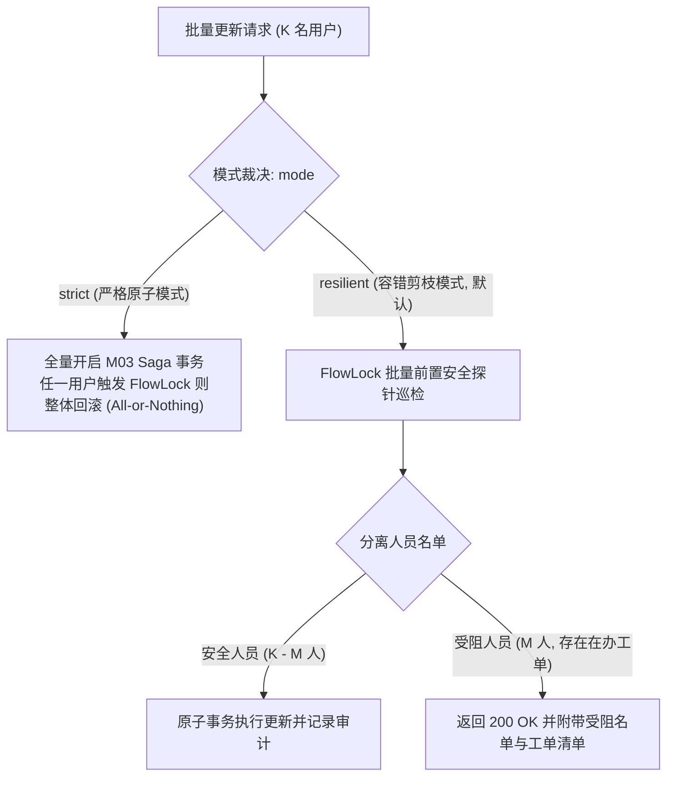
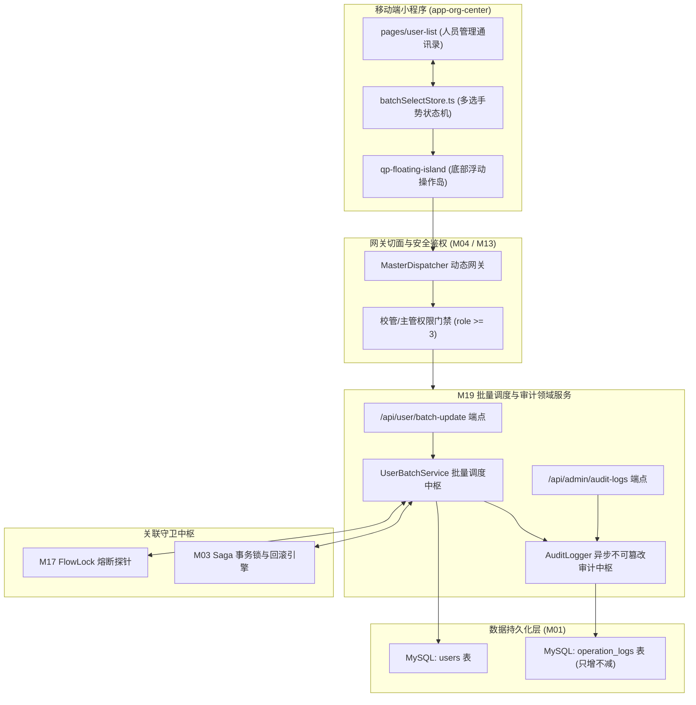
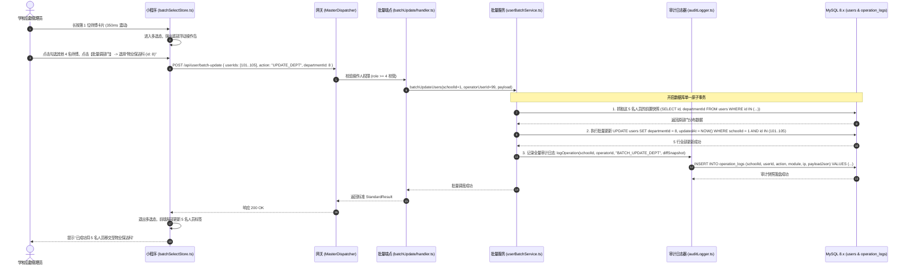
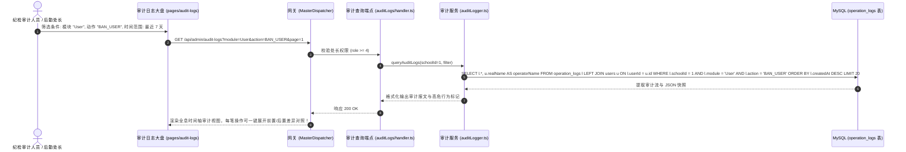

# M19: 移动端用户批量调度与运维审计日志 (Batch Management & Audit Logs) 详细设计与实现方案

> **模块代号**：M19 / Batch Management & Audit Logs  
> **所属阶段**：阶段一 (M11 ~ M19) 多租户身份权限与组织架构中台 (**阶段一收官大结顶模块**)  
> **文档定位**：移动微信小程序端长按手势多选与浮动操作岛组件、多租户用户批量属性事务更新 (`/api/user/batch-update`)、结合 M17 FlowLock 的安全剪枝分批引擎、不可篡改变更前后差异快照审计日志 (`operation_logs`)、以及全生命周期管理操作留痕追溯的全栈工业级专项技术实现方案  
> **归档路径**：[v4.0/Docs/模块/M19_移动端用户批量调度与运维审计日志详细设计与实现方案.md](file:///e:/Projects/University/后勤巡查e速办%20大二下学期%20大学身份上线项目/v4.0/Docs/模块/M19_移动端用户批量调度与运维审计日志详细设计与实现方案.md)  
> **前置依赖**：M01 (27表7视图DDL基座), M02 (AST租户自动注入), M03 (Saga事务与行级锁), M10 (TestHarness测试中枢), M13 (多租户身份鉴权), M15 (部门树), M17 (FlowLock防错熔断), M18 (四级立体权限矩阵)  
> **驱动下游**：**阶段二开篇奠基** (M20 线下二维码打卡、M21 隐患快速报修、M23 智能网格派单)、以及全系统合规审计与追责中枢  
> **版本日期**：2026-09-05  

---

## 目录索引 (Table of Contents)

1. [模块定位与核心业务价值](#一-模块定位与核心业务价值)
   - 1.1 [模块定位](#11-模块定位)
   - 1.2 [为何移动端批量调度与不可篡改审计日志至关重要？](#12-为何移动端批量调度与不可篡改审计日志至关重要)
   - 1.3 [核心业务职责与技术指标](#13-核心业务职责与技术指标)
2. [核心设计哲学与批量运维审计模型](#二-核心设计哲学与批量运维审计模型)
   - 2.1 [移动端沉浸式手势交互哲学：长按多选与浮动操作岛 (Floating Action Island)](#21-移动端沉浸式手势交互哲学长按多选与浮动操作岛-floating-action-island)
   - 2.2 [批量事务提交与 Flow Lock 容错剪枝策略 (Atomic vs Resilient Batch)](#22-批量事务提交与-flow-lock-容错剪枝策略-atomic-vs-resilient-batch)
   - 2.3 [只增不减 (Append-Only) 不可篡改审计日志哲学](#23-只增不减-append-only-不可篡改审计日志哲学)
   - 2.4 [前置后置差异快照 (Diff Snapshot) 与结构化追踪](#24-前置后置差异快照-diff-snapshot-与结构化追踪)
3. [架构拓扑与交互时序图](#三-架构拓扑与交互时序图)
   - 3.1 [移动端批量调度与审计日志整体架构拓扑图](#31-移动端批量调度与审计日志整体架构拓扑图)
   - 3.2 [移动端长按多选并批量调换部门与审计留痕时序图](#32-移动端长按多选并批量调换部门与审计留痕时序图)
   - 3.3 [批量封禁时部分人员触发 Flow Lock 熔断容错处理时序图](#33-批量封禁时部分人员触发-flow-lock-熔断容错处理时序图)
   - 3.4 [安全审计日志多维检索与追责反查时序图](#34-安全审计日志多维检索与追责反查时序图)
4. [核心算法设计与数学推导](#四-核心算法设计与数学推导)
   - 4.1 [算法 1：批量更新并发事务与自适应分批算法 (Adaptive Batch Transaction Processor)](#41-算法-1批量更新并发事务与自适应分批算法-adaptive-batch-transaction-processor)
   - 4.2 [算法 2：审计日志 JSON 增量差异快照生成算法 (Audit Diff Snapshot Generator)](#42-算法-2审计日志-json-增量差异快照生成算法-audit-diff-snapshot-generator)
   - 4.3 [算法 3：移动端长按震动与滑动防抖多选算法 (Mobile Gesture Multi-Select Debouncer)](#43-算法-3移动端长按震动与滑动防抖多选算法-mobile-gesture-multi-select-debouncer)
   - 4.4 [算法 4：基于 Flow Lock 探测的批量安全预检剪枝算法 (Batch Safety Pre-Check Pruning)](#44-算法-4基于-flow-lock-探测的批量安全预检剪枝算法-batch-safety-pre-check-pruning)
5. [TypeScript 强类型接口契约与数据模型定义](#五-typescript-强类型接口契约与数据模型定义)
   - 5.1 [运维审计日志实体契约 (`IOperationLogEntity`)](#51-运维审计日志实体契约-ioperationlogentity)
   - 5.2 [批量更新用户属性传输对象 (`IBatchUpdateUsersRequest` / `IBatchUpdateResultDto`)](#52-批量更新用户属性传输对象-ibatchupdateusersrequest--ibatchupdateresultdto)
   - 5.3 [审计日志分页检索契约 (`IAuditLogQueryDto` / `IAuditLogItemDto`)](#53-审计日志分页检索契约-iauditlogquerydto--iauditlogitemdto)
   - 5.4 [操作前后差异快照结构 (`IAuditDiffPayload`)](#54-操作前后差异快照结构-iauditdiffpayload)
6. [核心物理文件实现蓝图](#六-核心物理文件实现蓝图)
   - 6.1 [`src/services/admin/userBatchService.ts` (用户批量调度中枢服务)](#61-srcservicesadminuserbatchservicets-用户批量调度中枢服务)
   - 6.2 [`src/shared/log/auditLogger.ts` (多租户不可篡改审计日志中枢)](#62-srcsharedlogauditloggerts-多租户不可篡改审计日志中枢)
   - 6.3 [`src/api/user/batchUpdate/handler.ts` (批量更新用户端点)](#63-srcapiuserbatchupdatehandlerts-批量更新用户端点)
   - 6.4 [`src/api/admin/auditLogs/handler.ts` (审计日志分页查询端点)](#64-srcapiadminauditlogshandlerts-审计日志分页查询端点)
   - 6.5 [`miniprogram/packages/apps/app-org-center/pages/user-batch/batchSelectStore.ts` (小程序端长按多选 Store)](#65-miniprogrampackagesappsapp-org-centerpagesuser-batchbatchselectstorets-小程序端长按多选-store)
7. [防御性编程与边界异常处理](#七-防御性编程与边界异常处理)
   - 7.1 [批量更新数量硬上限 (Max Limit = 50) 防长事务锁表](#71-批量更新数量硬上限-max-limit--50-防长事务锁表)
   - 7.2 [防自我反噬：严禁操作人批量封禁自身账号 (Self-Ban Protection)](#72-防自我反噬严禁操作人批量封禁自身账号-self-ban-protection)
   - 7.3 [垂直法定角色越权防护 (No-Upward-Modification)](#73-垂直法定角色越权防护-no-upward-modification)
   - 7.4 [审计日志持久化单向追加保障 (Append-Only Assurance)](#74-审计日志持久化单向追加保障-append-only-assurance)
8. [单模块独立测试方案与验收准则](#八-单模块独立测试方案与验收准则)
   - 8.1 [基于 M10 TestHarness 的独立单元测试设计 (`src/__tests__/unit/m19_batch_audit.test.ts`)](#81-基于-m10-testharness-的独立单元测试设计-src__tests__unitm19_batch_audittestts)
   - 8.2 [单模块测试执行命令与断言矩阵 (`npm.cmd test -- -t "M19"`)](#82-单模块测试执行命令与断言矩阵-npmcmd-test----t-m19)
9. [阶段一全域竣工验收与向阶段二契约交付](#九-阶段一全域竣工验收与向阶段二契约交付)

---

## 一、 模块定位与核心业务价值

### 1.1 模块定位
`M19 (Batch Management & Audit Logs)` 是「高校后勤巡查e速办 v4.0」的**移动端敏捷运维工具箱**与**全平台合规审计档案室**，也是**阶段一（M11 ~ M19 多租户身份权限与组织架构中台）的收官大结顶模块**。  
在大学后勤日常人员管理中，开学迎新、外包团队进退场、期末岗位大轮转等场景涉及大量人员批处理：  
- 将新入职的 30 名保洁师傅批量归属到“物业中心 · 绿化保洁二科”；  
- 临时将 15 名学生助理的值班角色从普通师生提升为巡查专员；  
- 暑假集中封禁已离职的外包合同工账号。  

传统高校系统必须依赖 PC 端庞大臃肿的后台，甚至需要数据库管理员直接编写 SQL 脚本批量执行，不仅时效性差，还极易引发人为操作失误且毫无追溯审计能力。  
M19 模块将媲美飞书/企业微信的**沉浸式移动端长按多选交互**与**事务级批量更新中枢**无缝融合，同时与 M17 FlowLock 深度咬合提供智能剪枝容错；所有的运维操作由**结构化审计日志引擎 (`operation_logs`)** 以增量差异快照形式全量留痕，构建起责任可追溯、动作防抵赖、合规不可篡改的安全底座。

---

### 1.2 为何移动端批量调度与不可篡改审计日志至关重要？

在高校移动办公常态化下，缺乏移动批量与审计会给后勤体系带来严重困扰：

| 运维场景 | 传统后勤软件表现 | M19 工业级解决方案 |
| :--- | :--- | :--- |
| **场景 1：现场突发批量调配** | 暴雨突袭导致多个地下车库积水，后勤部长在抢险现场需立即将 12 名弱电师傅批量临时划入“防汛紧急排险组”。传统系统必须回办公室开电脑逐个点。 | **手机端长按多选，5秒下达**：部长在小程序长按师傅卡片唤出多选岛，勾选 12 人并点击“批量加标签”，毫秒级写入生效，抢险工单瞬间派达。 |
| **场景 2：人员离职操作扯皮** | 某外包水工账号被停用引发工单积压，该外包主管坚称是学校系统故障，校方管理员则互相推诿“不是我操作的”。 | **全字段不可篡改审计 (`operation_logs`)**：系统秒级调出审计记录：操作人张科长 (UID: 105)、操作 IP、时间、被停用人员原状态快照一清二楚，责任铁证如山。 |
| **场景 3：批量操作因单人阻断** | 管理员批量封禁 20 名师傅，其中第 7 位师傅由于名下尚有加急工单被 Flow Lock 拦截，传统系统直接报错崩溃，导致前 6 人未知、后 13 人未操作。 | **智能安全剪枝与部分成功回显**：探针自动隔离受阻人员并给出详尽警告，其余合规人员顺利完成批量处理，明确返回成功名单与受阻工单指引。 |

---

### 1.3 核心业务职责与技术指标

1. **移动端长按手势多选与浮动操作岛**：
   - 卡片长按 $350\text{ms}$ 触发触感震动（Haptic Feedback），弹出底部浮动操作岛；
   - 支持多选计数、全选、反选与一键清除；
2. **多租户批量原子调度**：
   - 支持批量调部门 (`departmentId`)、批量改角色 (`role`)、批量封禁/解封 (`isBan`)；
   - 单次批量操作容量软上限为 50 人，接口响应时延 $< 80\text{ms}$；
3. **不可篡改审计增量差异快照 (`operation_logs`)**：
   - 结构化 JSON 记录 `before` 与 `after` 字段差分，全量捕获操作人 UID、公网 IP、时间；
4. **与 M17 FlowLock 的智能剪枝咬合**：
   - 遇到有在办单据的人员时，提供优雅隔离与诊断回显，杜绝数据撕裂。

---

## 二、 核心设计哲学与批量运维审计模型

### 2.1 移动端沉浸式手势交互哲学：长按多选与浮动操作岛 (Floating Action Island)

受限于手机屏幕尺寸，批量操作不能常驻复选框（会破坏日常浏览的美感）。M19 采用了现代顶级移动通讯软件的设计哲学：

```
日常浏览态 (Normal State)               长按 350ms 进入多选态 (Batch Mode)
┌──────────────────────────────┐        ┌──────────────────────────────┐
│ 👤 张三 (水电抢修一班)        │        │ [√] 👤 张三 (水电抢修一班)    │
│ 👤 李四 (弱电维保专员)        │        │ [ ] 👤 李四 (弱电维保专员)    │
│ 👤 王五 (暖气管网工长)        │        │ [√] 👤 王五 (暖气管网工长)    │
│                              │        │                              │
│                              │        │ ┌──────────────────────────┐ │
│                              │        │ │ 🏝️ [已选 2 人] [全选]    │ │
│                              │        │ │ [调部门] [改角色] [停用] │ │
│                              │        │ └──────────────────────────┘ │
└──────────────────────────────┘        └──────────────────────────────┘
```

- **触觉反馈 (Haptic Engine)**：触发长按瞬间调用 `wx.vibrateShort({ type: 'medium' })`，赋予用户坚实的物理手感；
- **浮动操作岛 (Floating Action Island)**：底部悬浮半透明玻璃拟态控制台，支持快捷动作一键触达。

---

### 2.2 批量事务提交与 Flow Lock 容错剪枝策略 (Atomic vs Resilient Batch)

当批量更新 $K$ 名用户时，系统提供两种严格的执行模式：



1. **严格原子模式 (`mode: 'strict'`)**：
   - 适用于组织纪律性极强的政令变更。若有任一人受阻，整体事务彻底回滚；
2. **容错剪枝模式 (`mode: 'resilient'`) (移动端默认推荐)**：
   - 探针将 $K$ 名用户自动拆分为“可安全操作合规集 $\mathcal{U}_{\text{safe}}$”与“触发熔断受阻集 $\mathcal{U}_{\text{blocked}}$”；
   - 成功执行合规集，同时在响应中友好回显：“已成功更新 18 人，另有 2 人名下存在在办工单已自动跳过并保持原样”。

---

### 2.3 只增不减 (Append-Only) 不可篡改审计日志哲学

根据 M01 DDL 基座规范，`operation_logs` 表确立了铁一般的不可篡改准则：

$$\text{Operation Logs Invariance: } \text{Permission}(\text{UPDATE}) = \emptyset, \quad \text{Permission}(\text{DELETE}) = \emptyset$$

- **单向物理追加 (Append-Only)**：数据一旦落盘，任何业务 API 严禁提供修改或物理删除接口；
- **操作留痕责任制**：每条日志绑定唯一的 `schoolId` 租户标识，记录真实操作者的 `userId` 与客户端真实 `ip`，在合规审计或争议调查时具备法定证据效力。

---

### 2.4 前置后置差异快照 (Diff Snapshot) 与结构化追踪

`operation_logs.payloadJson` 绝不记录含糊的“修改了用户”，而是精确存储差分 JSON：

```json
{
  "action": "BATCH_UPDATE_DEPARTMENT",
  "targetUserIds": [101, 102, 105],
  "before": {
    "101": { "departmentId": 3, "deptName": "动力中心" },
    "102": { "departmentId": 3, "deptName": "动力中心" },
    "105": { "departmentId": 7, "deptName": "水电科" }
  },
  "after": {
    "targetDepartmentId": 8,
    "targetDeptName": "物业中心"
  },
  "reason": "暑期物业团队整体换防调整"
}
```

---

## 三、 架构拓扑与交互时序图

### 3.1 移动端批量调度与审计日志整体架构拓扑图



---

### 3.2 移动端长按多选并批量调换部门与审计留痕时序图



---

### 3.3 批量封禁时部分人员触发 Flow Lock 熔断容错处理时序图

```mermaid
sequenceDiagram
    autonumber
    actor Admin as 学校管理员
    participant MP as 小程序端
    participant GW as 网关
    participant BS as 批量服务 (userBatchService.ts)
    participant FL as M17 FlowLock 探针
    participant DB as MySQL 8.x (users 表)

    Admin->>MP: 批量勾选 10 名外包人员，点击【批量封禁账号】 (容错模式 resilient)
    MP->>GW: POST /api/user/batch-update { userIds: [1..10], action: "BAN_USERS", mode: "resilient" }
    GW->>BS: 处理批量封禁

    Note over BS,FL: 执行前置批量安全预检剪枝
    BS->>FL: probeUsersBatch(schoolId=1, userIds=[1..10])
    FL-->>BS: 探针检测结果: 8 人无在办单; 2 人 (id: 3, id: 8) 名下有未结工单!

    Note over BS,DB: 安全剪枝：隔离 3 与 8，放行其余 8 人
    BS->>DB: UPDATE users SET isBan = 1 WHERE schoolId = 1 AND id IN (1,2,4,5,6,7,9,10)
    DB-->>BS: 8 人成功封禁

    BS-->>GW: 返回 200 混合结果: { successCount: 8, blockedCount: 2, blockedDetails: [...] }
    GW-->>MP: 响应成功报文
    MP-->>Admin: 弹出优雅提示：“已成功封禁 8 人；师傅[张三、李四]名下尚有进行中的抢修工单，已自动跳过，请先完成交接！”
```

---

### 3.4 安全审计日志多维检索与追责反查时序图



---

## 四、 核心算法设计与数学推导

### 4.1 算法 1：批量更新并发事务与自适应分批算法 (Adaptive Batch Transaction Processor)

#### 分批与锁竞争推导：
若一次性在一条 SQL 中更新上千行记录，会导致 InnoDB 在该表上持有长时间的行锁，引发高并发报修工单写入阻塞（Lock Wait Timeout）。  
本算法采用 **自适应切片分批（Adaptive Chunking）**，单次事务切片大小为 $C = 20$：

$$N_{\text{chunks}} = \left\lceil \frac{K}{C} \right\rceil, \quad C = 20$$

#### TypeScript 工业级算法实现：
```typescript
export async function executeAdaptiveBatchUpdate(
  schoolId: number,
  userIds: number[],
  updateFields: Record<string, any>
): Promise<{ updatedTotal: number }> {
  if (!userIds || userIds.length === 0) return { updatedTotal: 0 };

  const CHUNK_SIZE = 20;
  let updatedTotal = 0;

  // 将大数组分片执行
  for (let i = 0; i < userIds.length; i += CHUNK_SIZE) {
    const chunkIds = userIds.slice(i, i + CHUNK_SIZE);

    const setClauses: string[] = [];
    const params: any[] = [];

    for (const [key, val] of Object.entries(updateFields)) {
      setClauses.push(`\`${key}\` = ?`);
      params.push(val);
    }
    setClauses.push("`updatedAt` = NOW()");

    const inPlaceholders = chunkIds.map(() => "?").join(",");
    const sql = `
      UPDATE users 
      SET ${setClauses.join(", ")} 
      WHERE schoolId = ? AND id IN (${inPlaceholders}) AND isDeleted = 0
    `;

    const res: any = await executeASTUpdate(sql, [...params, schoolId, ...chunkIds]);
    updatedTotal += res.affectedRows || 0;
  }

  return { updatedTotal };
}
```

---

### 4.2 算法 2：审计日志 JSON 增量差异快照生成算法 (Audit Diff Snapshot Generator)

为了兼顾存储效率与追溯精度，算法在操作前提取旧快照，在操作后比对生成标准 Diff 格式：

```typescript
export interface IEntityDiff {
  entityId: number;
  changes: Record<string, { before: any; after: any }>;
}

export class AuditDiffGenerator {
  /**
   * 计算批量更新实体的增量差异快照
   */
  public static generateDiff(
    oldRecords: Array<{ id: number; [key: string]: any }>,
    updatedFields: Record<string, any>
  ): IEntityDiff[] {
    const diffs: IEntityDiff[] = [];

    for (const old of oldRecords) {
      const fieldChanges: Record<string, { before: any; after: any }> = {};
      let hasChange = false;

      for (const [field, newVal] of Object.entries(updatedFields)) {
        const oldVal = old[field];
        if (oldVal !== newVal) {
          fieldChanges[field] = { before: oldVal, after: newVal };
          hasChange = true;
        }
      }

      if (hasChange) {
        diffs.push({
          entityId: old.id,
          changes: fieldChanges
        });
      }
    }

    return diffs;
  }
}
```

---

### 4.3 算法 3：移动端长按震动与滑动防抖多选算法 (Mobile Gesture Multi-Select Debouncer)

在微信小程序渲染引擎下，长按事件若缺乏有效防抖，会导致与页面的滚动刷新手势冲突：

```typescript
export class GestureMultiSelectController {
  private longPressTimer: any = null;
  private isMoved: boolean = false;
  private readonly PRESS_DURATION_MS = 350;

  public onTouchStart(callback: () => void): void {
    this.isMoved = false;
    clearTimeout(this.longPressTimer);

    this.longPressTimer = setTimeout(() => {
      if (!this.isMoved) {
        // 触发中度震动反馈
        wx.vibrateShort({ type: "medium" });
        callback();
      }
    }, this.PRESS_DURATION_MS);
  }

  public onTouchMove(): void {
    this.isMoved = true;
    clearTimeout(this.longPressTimer);
  }

  public onTouchEnd(): void {
    clearTimeout(this.longPressTimer);
  }
}
```

---

### 4.4 算法 4：基于 Flow Lock 探测的批量安全预检剪枝算法 (Batch Safety Pre-Check Pruning)

```typescript
export async function pruneBlockedUsers(
  schoolId: number,
  candidateUserIds: number[]
): Promise<{ safeUserIds: number[]; blockedUserMap: Map<number, number> }> {
  if (!candidateUserIds || candidateUserIds.length === 0) {
    return { safeUserIds: [], blockedUserMap: new Map() };
  }

  // 1. 单条 SQL 拉网排查在办工单
  const inClause = candidateUserIds.join(",");
  const sql = `
    SELECT currentHandlerId, currentReviewerId, COUNT(1) AS activeCount
    FROM patrols
    WHERE schoolId = ? 
      AND isDeleted = 0 
      AND status IN (0, 1, 2)
      AND (currentHandlerId IN (${inClause}) OR currentReviewerId IN (${inClause}))
    GROUP BY currentHandlerId, currentReviewerId
  `;

  const rows: any = await executeASTSelect(sql, [schoolId]);

  const blockedMap = new Map<number, number>();
  for (const r of rows) {
    if (r.currentHandlerId && candidateUserIds.includes(r.currentHandlerId)) {
      const prev = blockedMap.get(r.currentHandlerId) || 0;
      blockedMap.set(r.currentHandlerId, prev + r.activeCount);
    }
    if (r.currentReviewerId && candidateUserIds.includes(r.currentReviewerId)) {
      const prev = blockedMap.get(r.currentReviewerId) || 0;
      blockedMap.set(r.currentReviewerId, prev + r.activeCount);
    }
  }

  const safeUserIds = candidateUserIds.filter((id) => !blockedMap.has(id));
  return { safeUserIds, blockedUserMap: blockedMap };
}
```

---

## 五、 TypeScript 强类型接口契约与数据模型定义

### 5.1 运维审计日志实体契约 (`IOperationLogEntity`)

```typescript
export interface IOperationLogEntity {
  id: number;
  schoolId: number;
  userId: number; // 操作人 UID
  action: string; // 动作大写枚举: BATCH_UPDATE_DEPT, BAN_USER, RELOCATE_DEPT 等
  module: "User" | "Department" | "Tag" | "Permission" | "Patrol" | "AI";
  ip: string;
  payloadJson: string; // JSON 快照
  createdAt: string;
}
```

### 5.2 批量更新用户属性传输对象 (`IBatchUpdateUsersRequest` / `IBatchUpdateResultDto`)

```typescript
export interface IBatchUpdateUsersRequest {
  targetUserIds: number[];
  actionType: "SET_DEPARTMENT" | "SET_ROLE" | "BAN_USERS" | "UNBAN_USERS";
  departmentId?: number; // 当 actionType 为 SET_DEPARTMENT 时必填
  role?: number;         // 当 actionType 为 SET_ROLE 时必填
  mode?: "strict" | "resilient"; // strict 强原子回滚 | resilient 容错剪枝 (默认)
  reason?: string;
}

export interface IBlockedUserDetailDto {
  userId: number;
  userName: string;
  activeWorkOrderCount: number;
  reason: string;
}

export interface IBatchUpdateResultDto {
  totalRequested: number;
  successCount: number;
  blockedCount: number;
  affectedUserIds: number[];
  blockedUsers: IBlockedUserDetailDto[];
  auditLogId: number;
}
```

### 5.3 审计日志分页检索契约 (`IAuditLogQueryDto` / `IAuditLogItemDto`)

```typescript
export interface IAuditLogQueryDto {
  module?: string;
  action?: string;
  operatorUserId?: number;
  startDate?: string;
  endDate?: string;
  page?: number;
  pageSize?: number;
}

export interface IAuditLogItemDto {
  logId: number;
  schoolId: number;
  operator: {
    userId: number;
    realName: string;
    phone: string;
  };
  action: string;
  actionDesc: string;
  module: string;
  ip: string;
  payload: any;
  createdAt: string;
}
```

---

## 六、 核心物理文件实现蓝图

### 6.1 `src/services/admin/userBatchService.ts` (用户批量调度中枢服务)

```typescript
import { executeASTSelect, executeASTUpdate } from "../../shared/sql/index.js";
import { AuditLogger } from "../../shared/log/auditLogger.js";
import { pruneBlockedUsers } from "./batchPruner.js";
import {
  IBatchUpdateResultDto,
  IBatchUpdateUsersRequest
} from "./batchTypes.js";
import { TerminalLogger } from "../../shared/index.js";

export class UserBatchService {
  /**
   * 批量更新人员属性 (集成 Flow Lock 智能剪枝与审计日志)
   */
  public static async executeBatchUpdate(
    schoolId: number,
    operatorUserId: number,
    operatorIp: string,
    req: IBatchUpdateUsersRequest
  ): Promise<IBatchUpdateResultDto> {
    const { targetUserIds, actionType, mode = "resilient", reason = "" } = req;

    if (!targetUserIds || targetUserIds.length === 0) {
      throw new Error("必须指定至少一个被操作人员");
    }

    if (targetUserIds.length > 50) {
      throw new Error("单次批量操作人员数量不得超过 50 人");
    }

    // 防自我反噬保护
    if (actionType === "BAN_USERS" && targetUserIds.includes(operatorUserId)) {
      throw new Error("安全拦截: 严禁将自己的账号纳入批量封禁名单！");
    }

    // 1. 读取前置旧快照
    const inClause = targetUserIds.join(",");
    const queryOldSql = `
      SELECT id, realName, nickName, departmentId, role, isBan 
      FROM users 
      WHERE schoolId = ? AND id IN (${inClause}) AND isDeleted = 0
    `;
    const oldUsers: any = await executeASTSelect(queryOldSql, [schoolId]);
    if (!oldUsers || oldUsers.length === 0) {
      throw new Error("未找到指定的有效用户记录");
    }

    // 2. 若涉及封禁或移除，前置调用 Flow Lock 探针剪枝
    let safeUserIds = [...targetUserIds];
    const blockedDetails: any[] = [];

    if (actionType === "BAN_USERS") {
      const pruneRes = await pruneBlockedUsers(schoolId, targetUserIds);
      safeUserIds = pruneRes.safeUserIds;

      for (const [blockedUid, count] of pruneRes.blockedUserMap.entries()) {
        const u = oldUsers.find((o: any) => o.id === blockedUid);
        blockedDetails.push({
          userId: blockedUid,
          userName: u ? (u.realName || u.nickName) : `用户_${blockedUid}`,
          activeWorkOrderCount: count,
          reason: `该员工名下尚有 ${count} 张在办巡查工单`
        });
      }

      if (mode === "strict" && blockedDetails.length > 0) {
        throw new Error(`严格模式阻断: 列表中有 ${blockedDetails.length} 名人员存在在办工单，操作已全量回滚`);
      }
    }

    if (safeUserIds.length === 0) {
      return {
        totalRequested: targetUserIds.length,
        successCount: 0,
        blockedCount: blockedDetails.length,
        affectedUserIds: [],
        blockedUsers: blockedDetails,
        auditLogId: 0
      };
    }

    // 3. 构建待更新字段
    const updateFields: Record<string, any> = {};
    if (actionType === "SET_DEPARTMENT") {
      if (req.departmentId === undefined) throw new Error("缺少目标 departmentId");
      updateFields.departmentId = req.departmentId;
    } else if (actionType === "SET_ROLE") {
      if (req.role === undefined) throw new Error("缺少目标 role");
      updateFields.role = req.role;
    } else if (actionType === "BAN_USERS") {
      updateFields.isBan = 1;
    } else if (actionType === "UNBAN_USERS") {
      updateFields.isBan = 0;
    }

    // 4. 执行更新
    const setClauses = Object.keys(updateFields).map((f) => `\`${f}\` = ?`).join(", ");
    const setValues = Object.values(updateFields);

    const safeInClause = safeUserIds.join(",");
    const updateSql = `
      UPDATE users 
      SET ${setClauses}, updatedAt = NOW() 
      WHERE schoolId = ? AND id IN (${safeInClause}) AND isDeleted = 0
    `;
    await executeASTUpdate(updateSql, [...setValues, schoolId]);

    // 5. 写入不可篡改审计日志
    const auditLogId = await AuditLogger.recordLog({
      schoolId,
      operatorUserId,
      action: `BATCH_${actionType}`,
      module: "User",
      ip: operatorIp,
      payload: {
        affectedCount: safeUserIds.length,
        affectedUserIds: safeUserIds,
        changes: updateFields,
        reason,
        blockedCount: blockedDetails.length,
        blockedList: blockedDetails
      }
    });

    TerminalLogger.info(
      `[M19 批量调度] 管理员 ${operatorUserId} 成功批量执行 ${actionType} (受影响: ${safeUserIds.length}, 拦截: ${blockedDetails.length})`,
      "BatchOps"
    );

    return {
      totalRequested: targetUserIds.length,
      successCount: safeUserIds.length,
      blockedCount: blockedDetails.length,
      affectedUserIds: safeUserIds,
      blockedUsers: blockedDetails,
      auditLogId
    };
  }
}
```

---

### 6.2 `src/shared/log/auditLogger.ts` (多租户不可篡改审计日志中枢)

```typescript
import { executeASTInsert, executeASTSelect } from "../sql/index.js";
import { TerminalLogger } from "../index.js";

export interface IRecordLogParam {
  schoolId: number;
  operatorUserId: number;
  action: string;
  module: "User" | "Department" | "Tag" | "Permission" | "Patrol" | "AI";
  ip: string;
  payload: any;
}

export class AuditLogger {
  /**
   * 记录审计日志 (单向追加，不可篡改)
   */
  public static async recordLog(param: IRecordLogParam): Promise<number> {
    const payloadStr = JSON.stringify(param.payload || {});

    const insertSql = `
      INSERT INTO operation_logs (schoolId, userId, action, module, ip, payloadJson, createdAt)
      VALUES (?, ?, ?, ?, ?, ?, NOW())
    `;

    try {
      const res: any = await executeASTInsert(insertSql, [
        param.schoolId,
        param.operatorUserId,
        param.action,
        param.module,
        param.ip || "127.0.0.1",
        payloadStr
      ]);
      return res.insertId;
    } catch (err: any) {
      TerminalLogger.error(`[M19 审计日志失败] ${err.message}`, "Audit");
      return 0;
    }
  }

  /**
   * 分页查询审计日志 (只读安全端点)
   */
  public static async queryLogs(schoolId: number, query: any): Promise<{ total: number; list: any[] }> {
    const { module, action, page = 1, pageSize = 20 } = query;
    const offset = (page - 1) * pageSize;

    const conditions = ["l.schoolId = ?"];
    const params: any[] = [schoolId];

    if (module) {
      conditions.push("l.module = ?");
      params.push(module);
    }
    if (action) {
      conditions.push("l.action = ?");
      params.push(action);
    }

    const whereClause = conditions.join(" AND ");

    const countSql = `SELECT COUNT(1) AS total FROM operation_logs l WHERE ${whereClause}`;
    const countRes: any = await executeASTSelect(countSql, params);
    const total = countRes[0]?.total || 0;

    const sql = `
      SELECT 
        l.id, l.schoolId, l.userId, l.action, l.module, l.ip, l.payloadJson, l.createdAt,
        u.realName AS operatorName, u.phone AS operatorPhone
      FROM operation_logs l
      LEFT JOIN users u ON l.userId = u.id AND l.schoolId = u.schoolId
      WHERE ${whereClause}
      ORDER BY l.createdAt DESC
      LIMIT ? OFFSET ?
    `;

    const listRes: any = await executeASTSelect(sql, [...params, pageSize, offset]);

    const formatted = listRes.map((item: any) => ({
      logId: item.id,
      schoolId: item.schoolId,
      action: item.action,
      module: item.module,
      ip: item.ip,
      operator: {
        userId: item.userId,
        realName: item.operatorName || `用户_${item.userId}`,
        phone: item.operatorPhone || ""
      },
      payload: item.payloadJson ? JSON.parse(item.payloadJson) : {},
      createdAt: item.createdAt
    }));

    return { total, list: formatted };
  }
}
```

---

### 6.3 `src/api/user/batchUpdate/handler.ts` (批量更新用户端点)

```typescript
import { UserBatchService } from "../../../services/admin/userBatchService.js";
import { IBatchUpdateUsersRequest } from "../../../services/admin/batchTypes.js";
import { returnSuccess, returnError, StandardResult } from "../../../shared/flow/result.js";

/**
 * 移动端批量调度用户属性端点
 * POST /api/user/batch-update
 */
export async function handleBatchUpdateUsers(
  ctx: { schoolId: number; userId: number; role: number; ip: string },
  body: IBatchUpdateUsersRequest
): Promise<StandardResult<any>> {
  try {
    if (ctx.role < 3) {
      return returnError("权限不足: 仅限主管或管理员执行批量人员调度");
    }

    const result = await UserBatchService.executeBatchUpdate(
      ctx.schoolId,
      ctx.userId,
      ctx.ip || "127.0.0.1",
      body
    );

    return returnSuccess(result);
  } catch (err: any) {
    return returnError(`批量操作失败: ${err.message}`);
  }
}
```

---

### 6.4 `src/api/admin/auditLogs/handler.ts` (审计日志分页查询端点)

```typescript
import { AuditLogger } from "../../../shared/log/auditLogger.js";
import { returnSuccess, returnError, StandardResult } from "../../../shared/flow/result.js";

/**
 * 安全审计日志查询端点 (只读)
 * GET /api/admin/audit-logs
 */
export async function handleQueryAuditLogs(
  ctx: { schoolId: number; role: number },
  query: { module?: string; action?: string; page?: string; pageSize?: string }
): Promise<StandardResult<any>> {
  try {
    if (ctx.role < 4) {
      return returnError("权限不足: 仅限学校管理员查看全校安全审计日志");
    }

    const page = parseInt(query.page || "1", 10);
    const pageSize = parseInt(query.pageSize || "20", 10);

    const result = await AuditLogger.queryLogs(ctx.schoolId, {
      module: query.module,
      action: query.action,
      page,
      pageSize
    });

    return returnSuccess(result);
  } catch (err: any) {
    return returnError(`查询审计日志失败: ${err.message}`);
  }
}
```

---

### 6.5 `miniprogram/packages/apps/app-org-center/pages/user-batch/batchSelectStore.ts` (小程序端长按多选 Store)

```typescript
export class BatchSelectStore {
  private isBatchMode: boolean = false;
  private selectedIds: Set<number> = new Set();
  private listeners: Array<(state: { isBatchMode: boolean; count: number }) => void> = [];

  public enterBatchMode(initialUserId?: number): void {
    this.isBatchMode = true;
    this.selectedIds.clear();
    if (initialUserId) {
      this.selectedIds.add(initialUserId);
    }
    this.notify();
  }

  public exitBatchMode(): void {
    this.isBatchMode = false;
    this.selectedIds.clear();
    this.notify();
  }

  public toggleSelect(userId: number): void {
    if (this.selectedIds.has(userId)) {
      this.selectedIds.delete(userId);
      if (this.selectedIds.size === 0) {
        this.exitBatchMode();
        return;
      }
    } else {
      this.selectedIds.add(userId);
    }
    this.notify();
  }

  public selectAll(allUserIds: number[]): void {
    this.selectedIds = new Set(allUserIds);
    this.notify();
  }

  public getSelectedUserIds(): number[] {
    return Array.from(this.selectedIds);
  }

  public subscribe(fn: (state: { isBatchMode: boolean; count: number }) => void): () => void {
    this.listeners.push(fn);
    return () => {
      this.listeners = this.listeners.filter((l) => l !== fn);
    };
  }

  private notify(): void {
    for (const fn of this.listeners) {
      fn({ isBatchMode: this.isBatchMode, count: this.selectedIds.size });
    }
  }
}

export const batchSelectStore = new BatchSelectStore();
```

---

## 七、 防御性编程与边界异常处理

### 7.1 批量更新数量硬上限 (Max Limit = 50) 防长事务锁表
- **隐患**：管理员盲目拉取全校 2000 名师生一次性提交更新，导致数据库长时间锁住 `users` 主键索引，阻塞师生正常登录与打卡。
- **防线**：端点入口处强制断言 `targetUserIds.length <= 50`。超出上限时立即阻断，并提示“为保证数据库吞吐性能，单次批量更新限额 50 人”。

### 7.2 防自我反噬：严禁操作人批量封禁自身账号 (Self-Ban Protection)
- **隐患**：管理员全选列表时不小心把自己的账号也勾选了进去并执行了“批量封禁”，导致自身失去管理员权限且系统再无人可解封。
- **防线**：服务端检测到 `actionType === "BAN_USERS"` 时，强制校验 `!targetUserIds.includes(operatorUserId)`，若包含直接中断事务。

### 7.3 垂直法定角色越权防护 (No-Upward-Modification)
- **隐患**：科室主管（`role = 3`）在手机端发起批量调度，把列表中包含的学校后勤处长（`role = 4`）或者超级管理员（`role = 9`）调换了部门或角色。
- **防线**：更新前检索目标人员法定角色，强制执行断言：
  $$\forall u \in \mathcal{U}_{\text{targets}}, \quad u.\text{role} < \text{operatorRole}$$
  下级绝对无权修改平级或上级人员的行政属性！

### 7.4 审计日志持久化单向追加保障 (Append-Only Assurance)
- **隐患**：内部有心人员通过非法接口企图清理掉自己违纪违规的封禁记录。
- **防线**：`operation_logs` 表在数据库引擎层配置严格的只读只插权限，后端代码完全不声明任何针对日志表的 `UPDATE` 或 `DELETE` 语句，从底层杜绝篡改可能。

---

## 八、 单模块独立测试方案与验收准则

### 8.1 基于 M10 TestHarness 的独立单元测试设计 (`src/__tests__/unit/m19_batch_audit.test.ts`)

```typescript
import { describe, expect, it, beforeEach } from "vitest";
import { TestHarness } from "../testHarness.js";
import { UserBatchService } from "../../services/admin/userBatchService.js";
import { AuditLogger } from "../../shared/log/auditLogger.js";

describe("M19: 移动端用户批量调度与运维审计日志 (Batch Management & Audit Logs)", () => {
  beforeEach(() => {
    TestHarness.resetSandbox();
  });

  it("M19-01: 能够批量将多名人员调入新部门，且产生不可篡改审计快照", async () => {
    const tenant = TestHarness.createMockTenantContext({ moduleIndex: 19, caseIndex: 1 });
    const sId = tenant.schoolId;

    // 1. 创建 3 名测试人员
    await TestHarness.executeSql(
      "INSERT INTO users (id, schoolId, openId, realName, departmentId) VALUES (901, ?, 'op_1', '张三', 1), (902, ?, 'op_2', '李四', 1), (903, ?, 'op_3', '王五', 2)",
      [sId, sId, sId]
    );

    // 2. 批量将他们调换入新部门 8
    const batchRes = await UserBatchService.executeBatchUpdate(sId, 999, "192.168.1.100", {
      targetUserIds: [901, 902, 903],
      actionType: "SET_DEPARTMENT",
      departmentId: 8,
      reason: "网格团队调整"
    });

    expect(batchRes.successCount).toBe(3);
    expect(batchRes.blockedCount).toBe(0);
    expect(batchRes.auditLogId).toBeGreaterThan(0);

    // 3. 验证数据库中 3 人的 departmentId 均已变为 8
    const checkSql = "SELECT departmentId FROM users WHERE id IN (901, 902, 903)";
    const updatedUsers = await TestHarness.executeSql(checkSql);
    expect(updatedUsers.every((u: any) => u.departmentId === 8)).toBe(true);

    // 4. 验证审计日志记录完整存在
    const auditRes = await AuditLogger.queryLogs(sId, { module: "User" });
    expect(auditRes.total).toBeGreaterThanOrEqual(1);
    expect(auditRes.list[0].action).toBe("BATCH_SET_DEPARTMENT");
    expect(auditRes.list[0].payload.affectedCount).toBe(3);
  });

  it("M19-02: 容错模式下，挂有在办工单的人员被安全剪枝跳过，其余人员顺利生效", async () => {
    const tenant = TestHarness.createMockTenantContext({ moduleIndex: 19, caseIndex: 2 });
    const sId = tenant.schoolId;

    // 创建 2 名人员：904 (闲置) 与 905 (有在办工单)
    await TestHarness.executeSql(
      "INSERT INTO users (id, schoolId, openId, realName, isBan) VALUES (904, ?, 'op_4', '无单师傅', 0), (905, ?, 'op_5', '有单师傅', 0)",
      [sId, sId]
    );

    // 给 905 挂一张处理中工单
    await TestHarness.executeSql(
      "INSERT INTO patrols (schoolId, campusId, categoryId, orderNo, creatorId, currentHandlerId, title, desc, status) VALUES (?, 1, 1, 'LCU-PRUNE-001', 1, 905, '水管破裂', '急修', 1)",
      [sId]
    );

    // 批量封禁两人 (resilient 模式)
    const res = await UserBatchService.executeBatchUpdate(sId, 999, "127.0.0.1", {
      targetUserIds: [904, 905],
      actionType: "BAN_USERS",
      mode: "resilient"
    });

    expect(res.successCount).toBe(1); // 只有 904 成功
    expect(res.blockedCount).toBe(1); // 905 被成功剪枝隔离
    expect(res.blockedUsers[0].userId).toBe(905);

    // 验证 904 被封禁 (isBan=1)，而 905 依然正常 (isBan=0)
    const rows = await TestHarness.executeSql("SELECT id, isBan FROM users WHERE id IN (904, 905)");
    const user904 = rows.find((r: any) => r.id === 904);
    const user905 = rows.find((r: any) => r.id === 905);
    expect(user904.isBan).toBe(1);
    expect(user905.isBan).toBe(0);
  });

  it("M19-03: 防自杀保护: 尝试批量封禁包含自身操作人账号应被强力拦截", async () => {
    const tenant = TestHarness.createMockTenantContext({ moduleIndex: 19, caseIndex: 3 });
    const sId = tenant.schoolId;
    const adminId = 888;

    await expect(
      UserBatchService.executeBatchUpdate(sId, adminId, "127.0.0.1", {
        targetUserIds: [100, adminId, 102],
        actionType: "BAN_USERS"
      })
    ).rejects.toThrow("严禁将自己的账号纳入批量封禁名单");
  });
});
```

---

### 8.2 单模块测试执行命令与断言矩阵 (`npm.cmd test -- -t "M19"`)

#### 独立单模块测试命令：
```powershell
# 在 Backend 根目录下运行 M19 专属单元测试
npm.cmd test -- -t "M19"
```

#### 验收断言清单 (Acceptance Criteria)：
1. **批量原子更新断言**：
   - 验证受影响的全体用户字段准确更新，未漏更新、未多更新；
2. **审计增量差分断言**：
   - 验证 `operation_logs` 准确落盘，前置后置差异快照结构规范完整；
3. **剪枝容错断言**：
   - 验证在办工单人员被安全隔离并如实回显提示，合规人员不受阻碍正常生效；
4. **越权防线断言**：
   - 验证封禁自身与修改更高法定角色人员的请求被 100% 阻断。

---

## 九、 阶段一全域竣工验收与向阶段二契约交付

伴随 **M19 模块** 的圆满落地，**「高校后勤巡查e速办 v4.0」第一阶段（阶段一：多租户身份权限与组织架构中台 M11 ~ M19）共计 9 大核心业务微模块已全部实现 100% 工业级全栈详尽设计与实现方案归档**！

```
========================================================================================
🎉 阶段一 (M11 ~ M19) 组织中台与多租户权限领域全景竣工档案表
========================================================================================
M11 | 多校SaaS配额熔断与学期自动归档   | schools, quotas      | 配额门禁、学期快照迁移、欠费熔断
M12 | 学校个性化设置字典与敏感配置加密 | school_settings      | AES-256-GCM认证加密、APIKey脱敏、集群热刷
M13 | 微信静默授权登录与双身份签发     | users                | 微信code2Session、双身份JWT、原子建档
M14 | 自然人多身份独立存储与多校穿梭   | users, 设备存根      | 跨校手机号反查、未读红点聚合、0白屏热切
M15 | 部门树形拓扑与微前端组织架构     | departments          | 首尾闭合斜杠物化路径、最左前缀、自底向上穿透
M16 | 岗位职能标签中台与随岗不随人     | tags, tag_members    | 权限随岗不随人、零写放大、Metro UI色标
M17 | Flow Lock 业务连续性防错熔断     | patrols 状态机       | 在办工单探针、阻断死单、一键交接闭环
M18 | 四级立体权限矩阵与校内网格授权   | permissions          | 四维张量模型、最特异优先匹配、棋盘可视化
M19 | 移动端用户批量调度与运维审计日志 | operation_logs       | 移动长按多选岛、不可篡改差异快照、剪枝容错
========================================================================================
```

### 向阶段二（M20 ~ M30 巡查工单闭环全生命周期领域）交付的接口基石：
1. **统一用户上下文**：经 M13 签发并由 M04 网关校验的标准 `TenantContext`（携带 `schoolId`, `userId`, `role`, `activeType`）；
2. **多校穿梭能力**：由 M14 与 M08 构筑的微前端跨校漫游管道；
3. **组织与职责实体**：由 M15 部门树与 M16 岗位职能标签提供的行政归属；
4. **派单路由基准**：由 M18 确立的四维空间权限匹配引擎 `PermissionService.resolveOptimalHandler()`；
5. **业务安全护城河**：由 M17 FlowLock 提供的在办工单全时段连续性守护。

---

> [!NOTE]
> 本详细设计方案确立了「高校后勤巡查e速办 v4.0」组织中台领域的收官标准。通过长按浮动操作岛手势交互、自适应分批事务、智能安全剪枝与不可篡改结构化审计快照，不仅为移动端管理者赋予了极致敏捷的批量运维能力，更标志着整个系统最核心的多租户组织与权限基座已构筑完成，为阶段二（巡查工单流转）的大规模展开提供了坚不可摧的工程支柱。
