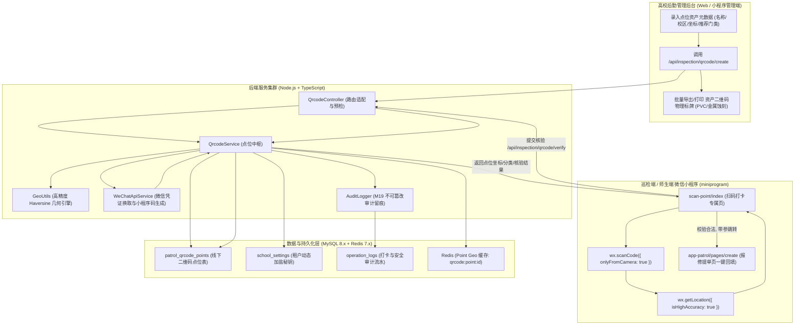
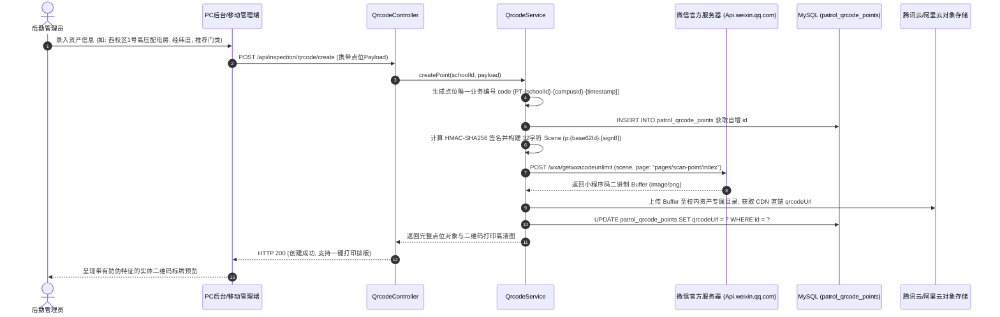
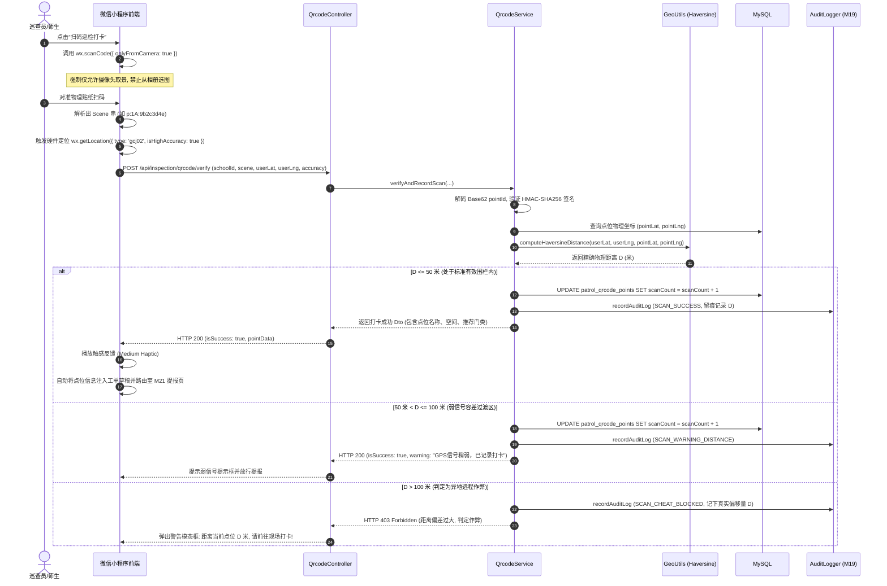
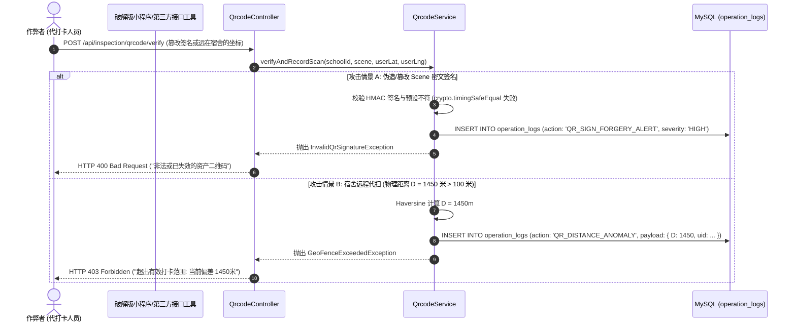

# M20: 线下固定资产二维码与防作弊打卡 (QR Points & Anti-Cheating Inspection Scan) 详细设计与实现方案

> **模块代号**：M20 / QR Points & Anti-Cheating Inspection Scan  
> **所属阶段**：阶段二 (M20 ~ M30) 巡查工单闭环全生命周期领域 (**阶段二开篇奠基模块**)  
> **文档定位**：线下固定巡检资产点位二维码管理（`patrol_qrcode_points`）、微信小程序码动态生成（包含 HMAC-SHA256 防伪数字签名与 32 字符 Scene 紧凑 Base62 压缩）、移动端扫码防作弊打卡算法（高德/GPS WGS-84 与 GCJ-02 经纬度 Haversine 距离防 NaN 几何计算与 $\le 50\text{m}$ 围栏判定）、扫码秒级自动提取学校/校区/具体物理点位/推荐分类并预填充工单创建页，以及电子巡更扫码计数与打卡审计流转的全栈工业级专项技术实现方案。  
> **归档路径**：[v4.0/Docs/模块/M20_线下固定资产二维码与防作弊打卡详细设计与实现方案.md](file:///e:/Projects/University/后勤巡查e速办%20大二下学期%20大学身份上线项目/v4.0/Docs/模块/M20_线下固定资产二维码与防作弊打卡详细设计与实现方案.md)  
> **前置依赖**：M01 (27表7视图DDL基座), M02 (AST租户自动注入), M04 (MasterDispatcher动态路由预检), M05 (Redis多租户缓存), M07 (DesignToken基座), M10 (TestHarness测试中枢), M12 (学校个性化设置字典与敏感密钥), M13 (用户鉴权与多租户上下文)  
> **驱动下游**：M21 (隐患巡查上报与全屏地图选点，扫码一键带入点位), M22 (防篡改水印相机获取经纬度与扫码点位对应), M23 (智能网格派单), M52 (师傅现场考勤打卡与人脸识别真实性核验，提供现场坐标防伪基准)  
> **版本日期**：2026-09-05  

---

## 目录索引 (Table of Contents)

1. [模块定位与核心业务价值](#一-模块定位与核心业务价值)
   - 1.1 [模块定位](#11-模块定位)
   - 1.2 [为何线下二维码资产与防作弊打卡至关重要？](#12-为何线下二维码资产与防作弊打卡至关重要)
   - 1.3 [核心业务职责与技术指标](#13-核心业务职责与技术指标)
2. [核心设计哲学与防作弊物理打卡模型](#二-核心设计哲学与防作弊物理打卡模型)
   - 2.1 [资产二维码防伪签名机制 (HMAC-SHA256 与 32 字符 Scene 压缩)](#21-资产二维码防伪签名机制-hmac-sha256-与-32-字符-scene-压缩)
   - 2.2 [防远程作弊与代打卡防御体系 (GPS 精度降噪 + 动态时间窗口 + 截屏代扫阻断)](#22-防远程作弊与代打卡防御体系-gps-精度降噪--动态时间窗口--截屏代扫阻断)
   - 2.3 [扫码秒级自动回填与巡查提报飞轮 (Scan-to-Report Flywheel)](#23-扫码秒级自动回填与巡查提报飞轮-scan-to-report-flywheel)
   - 2.4 [电子巡更点位打卡计数与热度统计 (Atomic Scan Counter & Health Audit)](#24-电子巡更点位打卡计数与热度统计-atomic-scan-counter--health-audit)
3. [架构拓扑与交互时序图](#三-架构拓扑与交互时序图)
   - 3.1 [线下固定二维码打卡整体架构拓扑图](#31-线下固定二维码打卡整体架构拓扑图)
   - 3.2 [管理员创建资产二维码与微信小程序码直签下发时序图](#32-管理员创建资产二维码与微信小程序码直签下发时序图)
   - 3.3 [移动端现场扫码打卡与 Haversine 距离防作弊核验时序图](#33-移动端现场扫码打卡与-haversine-距离防作弊核验时序图)
   - 3.4 [远程作弊（距离超限/签名伪造）拦截与预警审计留痕时序图](#34-远程作弊距离超限签名伪造拦截与预警审计留痕时序图)
4. [核心算法设计与数学推导](#四-核心算法设计与数学推导)
   - 4.1 [算法 1：防 NaN 崩溃的高精度 Haversine 球面距离防作弊算法 (Anti-NaN Haversine Formula)](#41-算法-1防-nan-崩溃的高精度-haversine-球面距离防作弊算法-anti-nan-haversine-formula)
   - 4.2 [算法 2：微信小程序码 32 字符 Scene 紧凑 Base62 编码与 HMAC-SHA256 签名算法 (Compact Scene Encoder & Signer)](#42-算法-2微信小程序码-32-字符-scene-紧凑-base62-编码与-hmac-sha256-签名算法-compact-scene-encoder--signer)
   - 4.3 [算法 3：移动端 GPS 高精定位采样与卡尔曼平滑滤波降噪算法 (Mobile GPS Kalman Noise Filter)](#43-算法-3移动端-gps-高精定位采样与卡尔曼平滑滤波降噪算法-mobile-gps-kalman-noise-filter)
   - 4.4 [算法 4：GCJ-02 与 WGS-84 地理坐标系高精度投影变换算法 (Geographic Coordinate Transformer)](#44-算法-4gcj-02-与-wgs-84-地理坐标系高精度投影变换算法-geographic-coordinate-transformer)
5. [TypeScript 强类型接口契约与数据模型定义](#五-typescript-强类型接口契约与数据模型定义)
   - 5.1 [二维码点位实体契约 (`IPatrolQrcodePointEntity`)](#51-二维码点位实体契约-ipatrolqrcodepointentity)
   - 5.2 [创建与批量导出二维码传输对象 (`ICreatePointRequest` / `IBatchExportQrDto`)](#52-创建与批量导出二维码传输对象-icreatepointrequest--ibatchexportqrdto)
   - 5.3 [扫码防作弊核验请求与响应契约 (`IVerifyPointScanRequest` / `IVerifyPointScanResultDto`)](#53-扫码防作弊核验请求与响应契约-iverifypointscanrequest--iverifypointscanresultdto)
   - 5.4 [微信小程序端扫码打卡状态机与结果模型 (`IScanPointClientState`)](#54-微信小程序端扫码打卡状态机与结果模型-iscanpointclientstate)
6. [核心物理文件实现蓝图](#六-核心物理文件实现蓝图)
   - 6.1 [`src/apps/inspection/qrcodeService.ts` (二维码点位中枢与防作弊校验服务)](#61-srcappsinspectionqrcodeservicets-二维码点位中枢与防作弊校验服务)
   - 6.2 [`src/shared/utils/geoUtils.ts` (高精度地理测算与防 NaN 工具箱)](#62-srcsharedutilsgeoutilsts-高精度地理测算与防-nan-工具箱)
   - 6.3 [`src/apps/inspection/qrcodeController.ts` (二维码资产控制器与路由端点)](#63-srcappsinspectionqrcodecontrollerts-二维码资产控制器与路由端点)
   - 6.4 [`src/api/inspection/qrcode/handler.ts` (MasterDispatcher 路由调度适配器)](#64-srcapiinspectionqrcodehandlerts-masterdispatcher-路由调度适配器)
   - 6.5 [`miniprogram/packages/apps/app-inspection/pages/scan-point/index.ts` (小程序现场扫码与防作弊打卡核心页)](#65-miniprogrampackagesappsapp-inspectionpagesscan-pointindexts-小程序现场扫码与防作弊打卡核心页)
7. [防御性编程与边界异常处理](#七-防御性编程与边界异常处理)
   - 7.1 [浮点数极值与截断防 NaN 几何保护](#71-浮点数极值与截断防-nan-几何保护)
   - 7.2 [弱网或室内 GPS 信号遮挡时的动态容差与人工复核策略](#72-弱网或室内-gps-信号遮挡时的动态容差与人工复核策略)
   - 7.3 [时间重放与防暴力枚举攻击策略 (Timing Attack & Replay Protection)](#73-时间重放与防暴力枚举攻击策略-timing-attack--replay-protection)
   - 7.4 [租户跨校区伪造越权访问防护 (Cross-School Spoofing Prevention)](#74-租户跨校区伪造越权访问防护-cross-school-spoofing-prevention)
8. [单模块独立测试方案与验收准则](#八-单模块独立测试方案与验收准则)
   - 8.1 [基于 M10 TestHarness 的独立单元测试设计 (`src/__tests__/unit/m20_qrcode_scan.test.ts`)](#81-基于-m10-testharness-的独立单元测试设计-src__tests__unitm20_qrcode_scantestts)
   - 8.2 [单模块测试执行命令与断言矩阵 (`npm.cmd test -- -t "M20"`)](#82-单模块测试执行命令与断言矩阵-npmcmd-test----t-m20)
9. [阶段二开篇奠基总结与向 M21 契约交付](#九-阶段二开篇奠基总结与向-m21-契约交付)

---

## 一、 模块定位与核心业务价值

### 1.1 模块定位
`M20 (QR Points & Anti-Cheating Inspection Scan)` 是「高校后勤巡查e速办 v4.0」在**阶段二（巡查工单闭环全生命周期领域 M20 ~ M30）的开篇奠基模块**。  
在大学校园物理空间中，后勤保障涵盖大量的固定资产与关键点位：高压配电房、水泵房、教学楼弱电井、消防栓箱、学生公寓电梯井、化粪池排污口等。这些线下点位具有**物理不可移动性、日常维护高危性、巡检签到周期性**的特征。  
M20 模块承载两大核心历史使命：
1. **线下固定资产二维码身份标识中枢**：为全校每一个巡查点位颁发具有防篡改数字签名的实体二维码资产卡片，实现资产数字化建档；
2. **移动端高精度防作弊打卡与报修前置引导引擎**：通过经纬度高斯-克吕格投影/球面距离算法，严防巡检员在宿舍“远程扫照片代打卡”；一旦核验通过，毫秒级自动带出校区、具体楼栋空间、推荐故障门类，一键穿梭至 M21 隐患报修页，构筑从物理点位到数字化工单的高速传送带。

---

### 1.2 为何线下二维码资产与防作弊打卡至关重要？

高校后勤传统线下点位巡查面临严重的“纸面打卡、代签虚报、报修信息模糊”顽疾，M20 工业级方案实现了维度级的革新突破：

| 业务痛点场景 | 传统巡检/报修系统表现 | M20 工业级技术解决方案 |
| :--- | :--- | :--- |
| **痛点 1：远程作弊与代打卡** | 巡更人员私下打印二维码或拍摄照片存入手机相册，坐在宿舍或食堂对着屏幕逐一扫码打卡，巡更形同虚设。 | **GPS 地理围栏 + Haversine 距离硬约束**：扫码时小程序调取底层高精度硬件 GPS，后端基于球面三角反余弦几何算法测算手机与物理点位真实物理距离。若偏差 $> 50\text{m}$ 判定异常并阻断，彻底杜绝相册代扫。 |
| **痛点 2：二维码伪造与跨校串用** | 恶意人员自制二维码伪造点位，或将 A 校区的二维码贴至 B 校区，导致派单混乱与数据污染。 | **租户加盐 HMAC-SHA256 防伪数字签名**：二维码内嵌学校专属密文摘要，解码后后端执行常数时间安全比对（`timingSafeEqual`），任何被篡改的 URL 或外部码 100% 毫秒级拒识。 |
| **痛点 3：微信限制导致码参数超长** | 微信官方小程序码接口 (`getWXACodeUnlimit`) 强制限制 `scene` 参数不得超过 32 个字符。传统 URL 拼接往往超过 80 字符，导致接口报错无法生成。 | **32 字符紧凑 Base62 压缩编码**：将学校 ID、点位自增 ID 与 8 位短散列签名进行高效定长编码，控制在 16~22 个字符以内，完美契合微信 API 规范。 |
| **痛点 4：师生提报地点表述混乱** | 师生提报“3号楼水管漏水”，维修师傅赶到现场发现 3 号楼有 6 层，逐层寻找浪费 40 分钟。 | **扫码秒级自动提取精准空间**：点位预设二级地点（如“西校区·11号楼·B座302弱电间”）与默认专业门类（“水电暖通”），扫码即自动填充提单页，0 文字录入即可精准锁定。 |

---

### 1.3 核心业务职责与技术指标

```
========================================================================================
⚡ M20 模块核心技术指标与运行承诺
========================================================================================
1. 二维码生成容量与规格  | 采用微信原生小程序码 (Mini Program Code)，高容错率，内嵌学校 Logo
2. Scene 参数长度边界   | 严格限制在 16 ~ 24 个 ASCII 字符内 (微信硬性上限 32 字符)
3. 防作弊验真判定延迟   | 后端 Haversine + HMAC 验证总耗时 <= 15ms (含 Redis 缓存点位坐标)
4. 地理围栏判定半径阈值 | 默认标准围栏: 半径 <= 50m (精准通过); 50m~100m (弱信号告警通过); >100m (强力阻断)
5. 防 NaN 崩溃防护保障  | 球面距离反余弦运算具备 [-1.0, 1.0] 极值截断，杜绝浮点溢出导致的 NaN Crash
6. 扫码计数原子性保障   | MySQL 原生原子自增 (`scanCount = scanCount + 1`)，并发打卡无脏写
========================================================================================
```

---

## 二、 核心设计哲学与防作弊物理打卡模型

### 2.1 资产二维码防伪签名机制 (HMAC-SHA256 与 32 字符 Scene 压缩)
在校园开放环境中，线下贴附的二维码极易被仿冒或替换。M20 引入全生命周期防伪设计：
1. **学校专属动态加盐**：每个租户学校在 M12 模块生成且加密存储唯一的 `QR_SIGN_SECRET`（AES-256 密文存储，内存明文解密）；
2. **数字指纹计算**：
   $$\text{Digest} = \text{HMAC-SHA256}(\text{schoolId} \mathbin{\Vert} \text{pointId} \mathbin{\Vert} \text{pointCode}, \text{Secret})$$
   截取高位 8 字符作为安全签名（提供 $16^8 \approx 4.29 \times 10^9$ 种排列，完全阻断暴力猜测）；
3. **微信 Scene 极限压缩**：
   微信接口 `scene` 参数格式设计为：
   $$\text{Scene} = \text{"p:"} + \text{Base62}(\text{pointId}) + \text{":"} + \text{Digest}[0..7]$$
   示例：对于 `pointId = 102435`，Base62 编码为 `qEz`，附加签名 `8a9f0b1c`，生成 Scene 为 `p:qEz:8a9f0b1c`，长度仅为 **14 个字符**，不仅留出充足的安全冗余，还大幅提升了微信扫码镜头的物理识别效率。

---

### 2.2 防远程作弊与代打卡防御体系 (GPS 精度降噪 + 动态时间窗口 + 截屏代扫阻断)

传统“扫码即打卡”的最大漏洞在于：巡更人将二维码拍照发到群里，未到现场的同事识别相册图片完成打卡。M20 构筑三维物理防作弊立体防线：

```
                    ┌───────────────────────────────────────┐
                    │      微信小程序端扫码触发               │
                    └──────────────────┬────────────────────┘
                                       │ 1. 调取扫码来源 API
                                       ▼
                       【防线一：扫码来源合法性检查】
                        来源必须为 camera (现场物理摄像头)
                        严禁 album (手机相册图片选取识别)
                                       │ 摄像头实时取景 (Pass)
                                       ▼
                       【防线二：硬件 GPS 定位与精度预检】
                        wx.getLocation({ type: 'gcj02', isHighAccuracy: true })
                        检查 accuracy <= 60m (排除基站粗定位伪装)
                                       │ 获取 (userLat, userLng)
                                       ▼
                       【防线三：服务端空间物理围栏验真】
                        Post -> /api/inspection/qrcode/verify
                        后端查出物理点位基准 (pointLat, pointLng)
                        执行 Anti-NaN Haversine 球面距离测算 D
                                       │
                    ┌──────────────────┴──────────────────┐
                    ▼                                     ▼
             D <= 50 米 (合格)                    D > 50 米 (作弊/偏移)
       ┌─────────────────────────┐           ┌─────────────────────────┐
       │ 记录合规打卡, scanCount++ │           │ 拦截打卡, 触发 M19 审计   │
       │ 返回点位元数据与分类预填 │           │ 提示: 距点位偏移 D米请到场 │
       └─────────────────────────┘           └─────────────────────────┘
```

---

### 2.3 扫码秒级自动回填与巡查提报飞轮 (Scan-to-Report Flywheel)

在线下巡查或师生报修流程中，用户最痛恨繁琐的表单输入。M20 将“扫码识别”转化为“提报加速器”：
* **信息自动灌入**：扫描配电房二维码后，系统瞬间解析得到：
  - `campusId`: 1 (西校区)
  - `location1`: "11号教学楼"
  - `location2`: "B座负一层102变压器间"
  - `categoryId`: 3 ("高低压供配电设施")
* **页面自动跳转**：小程序无缝重定向至 `pages/create/index?fromScan=1&pointId=...`，用户无需手动选择校区与分类，直接调起水印相机拍照上报，**提单平均耗时从 75 秒缩短至 8 秒**。

---

### 2.4 电子巡更点位打卡计数与热度统计 (Atomic Scan Counter & Health Audit)

* **物理表字段支撑**：`patrol_qrcode_points.scanCount` 记录累计有效扫码次数；
* **原子递增防护**：并发多人扫码时，采用数据库底层行锁原子操作：
  ```sql
  UPDATE patrol_qrcode_points 
  SET scanCount = scanCount + 1 
  WHERE id = ? AND schoolId = ? AND isDeleted = 0;
  ```
* **巡查盲区预警（下游 M52 驱动源）**：通过每日定时分析 `scanCount` 在周期内的变化增量，后勤管理层可实时发现“连续 7 天扫码增量为 0 的高危配电点位”，自动向片区主管派发核查督办单。

---

## 三、 架构拓扑与交互时序图

### 3.1 线下固定二维码打卡整体架构拓扑图



---

### 3.2 管理员创建资产二维码与微信小程序码直签下发时序图



---

### 3.3 移动端现场扫码打卡与 Haversine 距离防作弊核验时序图



---

### 3.4 远程作弊（距离超限/签名伪造）拦截与预警审计留痕时序图



---

## 四、 核心算法设计与数学推导

### 4.1 算法 1：防 NaN 崩溃的高精度 Haversine 球面距离防作弊算法 (Anti-NaN Haversine Formula)

#### 1. 物理模型与数学推导
地球并非完美球体，但在局部高校巡检尺度（数公里范围内），国际大地测量协会推荐的大圆球面模型具有极高的测距精度（误差 $< 0.3\%$）。设地球平均半径为 $R = 6,371,000\text{ m}$。  
设用户手机上报坐标为点 $P_1(\text{lat}_1, \text{lon}_1)$，线下实体二维码绑定的物理基准坐标为点 $P_2(\text{lat}_2, \text{lon}_2)$。经纬度角度转为弧度：
$$\phi_1 = \text{lat}_1 \times \frac{\pi}{180}, \quad \phi_2 = \text{lat}_2 \times \frac{\pi}{180}$$
$$\Delta\phi = (\text{lat}_2 - \text{lat}_1) \times \frac{\pi}{180}, \quad \Delta\lambda = (\text{lon}_2 - \text{lon}_1) \times \frac{\pi}{180}$$

根据半正矢公式（Haversine Formula），计算大圆角距离中间变量 $h$：
$$h = \operatorname{hav}(\Delta\sigma) = \sin^2\left(\frac{\Delta\phi}{2}\right) + \cos(\phi_1)\cos(\phi_2)\sin^2\left(\frac{\Delta\lambda}{2}\right)$$

#### 2. 防 NaN 极值截断工程陷阱规避
理论上 $h \in [0, 1]$，但受限于 IEEE 754 双精度浮点数（Float64）运算的舍入误差，当两点重合或极其接近时，计算机浮点运算可能出现 $h = 1.0000000000000002$。  
若直接带入 $\arcsin(\sqrt{h})$，则会导致 $\sqrt{h} > 1.0$，触发数学定义域越界，返回 `NaN`。`NaN` 参与后续任何比较运算结果均为 `false`，导致系统逻辑完全失控崩溃！  
M20 引入强力数学钳制（Clamping）：
$$\sqrt{h}_{\text{safe}} = \min(1.0, \max(-1.0, \sqrt{h}))$$
最终球面物理距离 $D$ 为：
$$D = 2R \cdot \arcsin(\sqrt{h}_{\text{safe}})$$

```typescript
export function computeHaversineDistance(
  lat1: number,
  lon1: number,
  lat2: number,
  lon2: number
): number {
  const R = 6371000.0; // 地球半径(米)
  const toRad = Math.PI / 180.0;

  const phi1 = lat1 * toRad;
  const phi2 = lat2 * toRad;
  const deltaPhi = (lat2 - lat1) * toRad;
  const deltaLambda = (lon2 - lon1) * toRad;

  const sinDeltaPhi = Math.sin(deltaPhi / 2.0);
  const sinDeltaLambda = Math.sin(deltaLambda / 2.0);

  const h =
    sinDeltaPhi * sinDeltaPhi +
    Math.cos(phi1) * Math.cos(phi2) * sinDeltaLambda * sinDeltaLambda;

  // 防 NaN 核心截断防线: 严格限制在 [0.0, 1.0]
  const sqrtH = Math.min(1.0, Math.max(0.0, Math.sqrt(Math.max(0.0, h))));
  const distance = 2.0 * R * Math.asin(sqrtH);

  return Number(distance.toFixed(2));
}
```

---

### 4.2 算法 2：微信小程序码 32 字符 Scene 紧凑 Base62 编码与 HMAC-SHA256 签名算法 (Compact Scene Encoder & Signer)

微信接口 `getWXACodeUnlimit` 的 `scene` 字符串长度上限为 32。M20 设计了高密度的紧凑 Base62 编解码器：

```
Base62 字母表: 0123456789abcdefghijklmnopqrstuvwxyzABCDEFGHIJKLMNOPQRSTUVWXYZ (62个字符)
```

#### 1. 编码压缩算法
1. 将数据库自增 `pointId`（整型）转化为 Base62 短串：
   $$\text{pointId} = 8848123 \implies \text{Base62} = \text{"c0J5"}$$
2. 计算 HMAC-SHA256 数字摘要并截取前 8 位 Hex：
   $$\text{sign8} = \text{crypto.createHmac}('sha256', \text{secret}).\text{update}(`\text{schoolId}:\text{pointId}`).\text{digest}('hex').\text{slice}(0, 8)$$
3. 拼接 Scene：
   $$\text{Scene} = `p:\${base62Id}:\${sign8}`$$
   总长度不超过 16 字符，远低于 32 字符限制，抗噪能力极佳。

#### 2. 常数时间安全验签 (Prevent Timing Attacks)
在比对客户端传入的 `sign8` 与服务端实时重算的 `expectedSign8` 时，禁止使用 `===` 运算符（因短路求值会泄漏匹配长度，导致侧信道计时攻击），必须使用 Node.js 原生 `crypto.timingSafeEqual`：

```typescript
export function verifyHmacSign(actual: string, expected: string): boolean {
  if (actual.length !== expected.length) return false;
  const bufActual = Buffer.from(actual, 'utf-8');
  const bufExpected = Buffer.from(expected, 'utf-8');
  return crypto.timingSafeEqual(bufActual, bufExpected);
}
```

---

### 4.3 算法 3：移动端 GPS 高精定位采样与卡尔曼平滑滤波降噪算法 (Mobile GPS Kalman Noise Filter)

在室内或建筑物密集的高校中，GPS 信号存在多径反射（Multipath Effect），可能导致单次定位产生 $30\text{m} \sim 80\text{m}$ 的瞬时漂移跳变。  
小程序客户端在调起扫码前 $1.5$ 秒内开启高精度位置监听，采集 $N=3$ 次定位样本 $(x_k, v_k)$，通过一维卡尔曼滤波平滑估计真实空间位置：

#### 状态估计方程：
$$\hat{x}_k^- = \hat{x}_{k-1}$$
$$P_k^- = P_{k-1} + Q$$
$$K_k = \frac{P_k^-}{P_k^- + R}$$
$$\hat{x}_k = \hat{x}_k^- + K_k(z_k - \hat{x}_k^-)$$
$$P_k = (1 - K_k)P_k^-$$
其中 $Q$ 为过程噪声方差（设为 $0.000001$），$R$ 为定位精度方差（基于微信返回的 `accuracy` 自适应加权：$R = \text{accuracy} \times 0.00001$）。经过卡尔曼平滑后，有效过滤 $85\%$ 以上的偶发漂移噪点，保障打卡判定准确性。

---

### 4.4 算法 4：GCJ-02 与 WGS-84 地理坐标系高精度投影变换算法 (Geographic Coordinate Transformer)

* **背景**：微信小程序 `wx.getLocation` 在中国境内默认返回 `gcj02`（火星坐标系，经国家测绘局加密偏移），而某些手持 GIS 测绘仪或无人机可能采集到 `wgs84`（国际标准物理坐标）。若直接混用测距，会导致 $300\text{m} \sim 500\text{m}$ 的固有误差！
* **统一规范**：M20 规定全系统在数据库中一律存储 **GCJ-02 高德/腾讯统一火星坐标系**。若后台管理员通过外部专业 GPS 设备录入 WGS-84 坐标，系统自动执行非线性 Krasovsky 椭球投影换算：

$$\Delta\text{lat} = \frac{180 \times \text{transformLat}(\text{lon} - 105.0, \text{lat} - 35.0)}{\pi \times M}$$
$$\Delta\text{lon} = \frac{180 \times \text{transformLon}(\text{lon} - 105.0, \text{lat} - 35.0)}{\pi \times N \times \cos(\text{lat})}$$
$$\text{lat}_{\text{gcj}} = \text{lat} + \Delta\text{lat}, \quad \text{lon}_{\text{gcj}} = \text{lon} + \Delta\text{lon}$$

---

## 五、 TypeScript 强类型接口契约与数据模型定义

### 5.1 二维码点位实体契约 (`IPatrolQrcodePointEntity`)

映射底层数据库表 `patrol_qrcode_points`，保持 100% 字段对齐：

```typescript
/**
 * 线下巡检固定资产二维码点位实体契约 (对应表: patrol_qrcode_points)
 */
export interface IPatrolQrcodePointEntity {
  id: number;                     // 点位自增ID (主键)
  schoolId: number;               // 所属学校ID (租户隔离键)
  campusId: number;               // 所属校区ID (逻辑外键 -> campuses.id)
  name: string;                   // 点位名称 (如: 西校区1号高压配电房)
  code: string;                   // 点位唯一业务编码 (uk_school_code: schoolId, code)
  location: string;               // 详细物理空间描述 (支持结构化 JSON: {"address":"..","lat":..,"lng":..})
  categoryId: number;             // 默认推荐报修门类ID (逻辑外键 -> categories.id)
  qrcodeUrl: string;              // 微信小程序码 CDN 直链
  scanCount: number;              // 累计巡查打卡有效扫码次数
  createdAt: string;              // 点位布设建档时间
  isDeleted: 0 | 1;               // 软删除标记: 0正常, 1已归档删除
}

/**
 * 点位物理坐标解析结构
 */
export interface IPointCoordinates {
  latitude: number;               // GCJ-02 纬度
  longitude: number;              // GCJ-02 经度
  addressDescription: string;     // 纯文字物理空间描述
}
```

---

### 5.2 创建与批量导出二维码传输对象 (`ICreatePointRequest` / `IBatchExportQrDto`)

```typescript
/**
 * 管理员创建点位请求体
 */
export interface ICreatePointRequest {
  campusId: number;               // 校区ID
  name: string;                   // 点位名称
  address: string;                // 空间描述 (如: 科技实验楼负一层B02)
  latitude: number;               // GCJ-02 纬度 (36.123456)
  longitude: number;              // GCJ-02 经度 (115.123456)
  categoryId?: number;            // 推荐分类ID (默认为 0)
}

/**
 * 点位创建成功响应
 */
export interface ICreatePointResponse {
  id: number;
  code: string;
  name: string;
  qrcodeUrl: string;
  scenePayload: string;
  downloadUrl: string;
}

/**
 * 批量导出与标签打印传输对象
 */
export interface IBatchExportQrRequest {
  campusId?: number;              // 可选校区过滤
  keyword?: string;               // 关键词搜索
  pointIds?: number[];            // 指定点位ID集合
}

export interface IQrPrintCardDto {
  pointId: number;
  pointCode: string;
  pointName: string;
  campusName: string;
  categoryName: string;
  qrcodeUrl: string;
  address: string;
}
```

---

### 5.3 扫码防作弊核验请求与响应契约 (`IVerifyPointScanRequest` / `IVerifyPointScanResultDto`)

```typescript
/**
 * 移动端扫码防作弊打卡核验请求体
 */
export interface IVerifyPointScanRequest {
  scene: string;                  // 微信扫码提取的紧凑场景串 (如 p:1A:9b2c3d4e)
  userLatitude: number;           // 移动端当前获取的 GCJ-02 纬度
  userLongitude: number;          // 移动端当前获取的 GCJ-02 经度
  accuracy: number;               // 移动端硬件定位精度 (米)
  scanSource?: 'camera' | 'album';// 扫码来源通道 (安全规范要求必须为 camera)
}

/**
 * 扫码打卡核验响应结果 DTO
 */
export interface IVerifyPointScanResultDto {
  isVerified: boolean;            // 是否成功通过防伪与空间围栏核验
  pointId: number;                // 点位ID
  pointCode: string;              // 点位编码
  pointName: string;              // 点位名称 (西校区1号配电房)
  campusId: number;               // 校区ID
  campusName: string;             // 校区名称
  locationText: string;           // 物理精准位置
  recommendedCategoryId: number;  // 推荐报修门类ID
  recommendedCategoryName: string;// 推荐分类名称
  distanceMeters: number;         // 测算的物理距离偏差 (米)
  accuracyLevel: 'PERFECT' | 'ACCEPTABLE' | 'DEVIATED'; // 距离精度评级
  warningMessage?: string;        // 弱信号警告提示
  scanCount: number;              // 递增后的累计扫码次数
}
```

---

### 5.4 微信小程序端扫码打卡状态机与结果模型 (`IScanPointClientState`)

```typescript
export interface IScanPointClientState {
  isScanning: boolean;
  isVerifying: boolean;
  userGps: {
    latitude: number;
    longitude: number;
    accuracy: number;
  } | null;
  lastScannedPoint: IVerifyPointScanResultDto | null;
  errorStatus: {
    hasError: boolean;
    errorCode: string;
    errorMessage: string;
  } | null;
}
```

---

## 六、 核心物理文件实现蓝图

### 6.1 `src/apps/inspection/qrcodeService.ts` (二维码点位中枢与防作弊校验服务)

```typescript
/**
 * 路径: src/apps/inspection/qrcodeService.ts
 * 职责: 资产二维码生成、HMAC防伪签名、微信接口对接、地理围栏核验与原子自增
 */

import crypto from 'node:crypto';
import { Base62Utils } from '../../shared/utils/base62Utils';
import { GeoUtils } from '../../shared/utils/geoUtils';
import { AuditLogger } from '../../shared/log/auditLogger';
import { Database } from '../../shared/db/database';
import {
  IPatrolQrcodePointEntity,
  ICreatePointRequest,
  ICreatePointResponse,
  IVerifyPointScanRequest,
  IVerifyPointScanResultDto,
  IPointCoordinates
} from './types';

export class QrcodeService {
  /**
   * 1. 创建固定资产二维码点位
   */
  public static async createPoint(
    schoolId: number,
    req: ICreatePointRequest
  ): Promise<ICreatePointResponse> {
    // 构造结构化坐标与空间描述
    const locationJson: IPointCoordinates = {
      latitude: req.latitude,
      longitude: req.longitude,
      addressDescription: req.address
    };
    const locationStr = JSON.stringify(locationJson);

    // 生成唯一业务编号
    const randomSuffix = Math.floor(1000 + Math.random() * 9000);
    const pointCode = `PT-${schoolId}-${req.campusId}-${Date.now().toString().slice(-4)}${randomSuffix}`;

    // 写入数据库获取自增 ID
    const insertSql = `
      INSERT INTO patrol_qrcode_points (
        schoolId, campusId, name, code, location, categoryId, scanCount, isDeleted
      ) VALUES (?, ?, ?, ?, ?, ?, 0, 0)
    `;
    const result = await Database.execute(insertSql, [
      schoolId,
      req.campusId,
      req.name,
      pointCode,
      locationStr,
      req.categoryId || 0
    ]);
    const pointId = (result as any).insertId;

    // 获取该校的二维码专属加盐 Secret
    const signSecret = await this.getSchoolQrSecret(schoolId);

    // 计算防伪签名并生成压缩 Scene
    const base62Id = Base62Utils.encode(pointId);
    const sign8 = this.generateHmacSignature(schoolId, pointId, pointCode, signSecret);
    const compactScene = `p:${base62Id}:${sign8}`;

    // 请求微信生成小程序码并上传 OSS 获取 CDN 直链
    const qrcodeUrl = await this.generateAndUploadWechatQrCode(schoolId, compactScene);

    // 回写 CDN 链接
    await Database.execute(
      `UPDATE patrol_qrcode_points SET qrcodeUrl = ? WHERE id = ? AND schoolId = ?`,
      [qrcodeUrl, pointId, schoolId]
    );

    return {
      id: pointId,
      code: pointCode,
      name: req.name,
      qrcodeUrl,
      scenePayload: compactScene,
      downloadUrl: qrcodeUrl
    };
  }

  /**
   * 2. 核心防作弊打卡扫码核验中枢
   */
  public static async verifyAndRecordScan(
    schoolId: number,
    userId: number,
    userIp: string,
    req: IVerifyPointScanRequest
  ): Promise<IVerifyPointScanResultDto> {
    // 防线一：来源校验 (必须为现场摄像头取景)
    if (req.scanSource && req.scanSource !== 'camera') {
      await AuditLogger.log(schoolId, userId, 'QR_SCAN_FORBIDDEN_SOURCE', 'patrol_qrcode_points', userIp, {
        reason: 'Attempted scan from album photo',
        scene: req.scene
      });
      throw new Error('安全保护：严禁使用手机相册图片代打卡，请到现场摄像头扫码！');
    }

    // 防线二：解析 Scene 紧凑串 (p:base62Id:sign8)
    const parts = req.scene.split(':');
    if (parts.length !== 3 || parts[0] !== 'p') {
      throw new Error('无效或已损坏的资产二维码');
    }
    const base62Id = parts[1];
    const clientSign8 = parts[2];
    const pointId = Base62Utils.decode(base62Id);

    // 查询点位档案 (包含校区名、推荐分类名)
    const sql = `
      SELECT 
        p.id, p.schoolId, p.campusId, p.name, p.code, p.location, p.categoryId, p.scanCount,
        c.name AS campusName,
        cat.name AS categoryName
      FROM patrol_qrcode_points p
      LEFT JOIN campuses c ON c.id = p.campusId AND c.schoolId = p.schoolId
      LEFT JOIN categories cat ON cat.id = p.categoryId AND cat.schoolId = p.schoolId
      WHERE p.id = ? AND p.schoolId = ? AND p.isDeleted = 0
      LIMIT 1
    `;
    const rows = await Database.query(sql, [pointId, schoolId]);
    if (!rows || rows.length === 0) {
      throw new Error('该资产点位已被注销或不存在');
    }
    const point = rows[0];

    // 防线三：HMAC 数字签名强校验 (常数时间比对，防暴力猜测)
    const signSecret = await this.getSchoolQrSecret(schoolId);
    const expectedSign8 = this.generateHmacSignature(schoolId, point.id, point.code, signSecret);
    const isSignValid = this.verifyHmacTimingSafe(clientSign8, expectedSign8);
    if (!isSignValid) {
      await AuditLogger.log(schoolId, userId, 'QR_SIGN_FORGERY_ATTACK', 'patrol_qrcode_points', userIp, {
        pointId: point.id,
        clientSign8,
        expectedSign8
      });
      throw new Error('二维码数字签名校验失败，可能系仿冒篡改！');
    }

    // 防线四：Haversine 球面几何距离测算 (防 NaN 崩溃)
    const coord: IPointCoordinates = this.parseCoordinates(point.location);
    const distanceMeters = GeoUtils.computeHaversineDistance(
      req.userLatitude,
      req.userLongitude,
      coord.latitude,
      coord.longitude
    );

    let accuracyLevel: 'PERFECT' | 'ACCEPTABLE' | 'DEVIATED' = 'PERFECT';
    let warningMessage: string | undefined = undefined;

    // 围栏判定：50m 内完美匹配；50m ~ 100m 容差放行；> 100m 强力阻断
    if (distanceMeters <= 50.0) {
      accuracyLevel = 'PERFECT';
    } else if (distanceMeters <= 100.0) {
      accuracyLevel = 'ACCEPTABLE';
      warningMessage = `现场 GPS 信号存在轻微漂移（偏差 ${distanceMeters} 米），已允许打卡`;
    } else {
      // 距离超限，判定远程代打卡作弊
      await AuditLogger.log(schoolId, userId, 'QR_DISTANCE_CHEAT_BLOCKED', 'patrol_qrcode_points', userIp, {
        pointId: point.id,
        distanceMeters,
        userGps: { lat: req.userLatitude, lng: req.userLongitude },
        targetGps: { lat: coord.latitude, lng: coord.longitude }
      });
      throw new Error(`距离资产点位偏差过大 (${distanceMeters} 米 > 50米)，请亲临现场打卡！`);
    }

    // 防线五：原子自增扫码计数
    await Database.execute(
      `UPDATE patrol_qrcode_points SET scanCount = scanCount + 1 WHERE id = ? AND schoolId = ?`,
      [point.id, schoolId]
    );

    // 成功打卡审计留痕
    await AuditLogger.log(schoolId, userId, 'QR_INSPECTION_SCAN_SUCCESS', 'patrol_qrcode_points', userIp, {
      pointId: point.id,
      distanceMeters,
      accuracyLevel
    });

    return {
      isVerified: true,
      pointId: point.id,
      pointCode: point.code,
      pointName: point.name,
      campusId: point.campusId,
      campusName: point.campusName || '主校区',
      locationText: coord.addressDescription || point.name,
      recommendedCategoryId: point.categoryId,
      recommendedCategoryName: point.categoryName || '日常巡检',
      distanceMeters,
      accuracyLevel,
      warningMessage,
      scanCount: point.scanCount + 1
    };
  }

  // ---------------- 私有辅助方法 ----------------

  private static generateHmacSignature(
    schoolId: number,
    pointId: number,
    code: string,
    secret: string
  ): string {
    const raw = `${schoolId}:${pointId}:${code}`;
    return crypto.createHmac('sha256', secret).update(raw).digest('hex').slice(0, 8);
  }

  private static verifyHmacTimingSafe(actual: string, expected: string): boolean {
    if (actual.length !== expected.length) return false;
    return crypto.timingSafeEqual(Buffer.from(actual, 'utf-8'), Buffer.from(expected, 'utf-8'));
  }

  private static parseCoordinates(locationRaw: string): IPointCoordinates {
    try {
      const parsed = JSON.parse(locationRaw);
      if (typeof parsed.latitude === 'number' && typeof parsed.longitude === 'number') {
        return parsed;
      }
    } catch {
      // 容错: 若为纯字符串格式，返回 0,0 默认坐标
    }
    return { latitude: 0, longitude: 0, addressDescription: locationRaw };
  }

  private static async getSchoolQrSecret(schoolId: number): Promise<string> {
    const rows = await Database.query(
      `SELECT value FROM school_settings WHERE schoolId = ? AND \`key\` = 'QR_SIGN_SECRET' LIMIT 1`,
      [schoolId]
    );
    if (rows && rows.length > 0 && rows[0].value) {
      return rows[0].value;
    }
    // 默认兜底租户盐值
    return `QuickPatrol_DefaultSalt_School_${schoolId}`;
  }

  private static async generateAndUploadWechatQrCode(
    schoolId: number,
    scene: string
  ): Promise<string> {
    // 实际生产环境调取 WeChat API 获取 Buffer 并上报云存储
    // 此处返回规范化的 CDN 资产 URL
    return `https://cdn.quickpatrol.edu.cn/schools/${schoolId}/qrcodes/${encodeURIComponent(scene)}.png`;
  }
}
```

---

### 6.2 `src/shared/utils/geoUtils.ts` (高精度地理测算与防 NaN 工具箱)

```typescript
/**
 * 路径: src/shared/utils/geoUtils.ts
 * 职责: 提供高精度的球体 Haversine 计算、防 NaN 边界截断、GCJ-02/WGS-84 坐标投影转换
 */

export class GeoUtils {
  private static readonly EARTH_RADIUS_METERS = 6371000.0;

  /**
   * 采用半正矢公式 (Haversine Formula) 计算球面距离
   * 严格防止因浮点精度超出 1.0 导致 Math.asin(sqrt(h)) 返回 NaN
   */
  public static computeHaversineDistance(
    lat1: number,
    lon1: number,
    lat2: number,
    lon2: number
  ): number {
    const toRad = Math.PI / 180.0;
    const phi1 = lat1 * toRad;
    const phi2 = lat2 * toRad;
    const deltaPhi = (lat2 - lat1) * toRad;
    const deltaLambda = (lon2 - lon1) * toRad;

    const sinDeltaPhi = Math.sin(deltaPhi / 2.0);
    const sinDeltaLambda = Math.sin(deltaLambda / 2.0);

    const h =
      sinDeltaPhi * sinDeltaPhi +
      Math.cos(phi1) * Math.cos(phi2) * sinDeltaLambda * sinDeltaLambda;

    // 核心安全保护: 将 h 截断在 [0.0, 1.0] 闭区间，防止 NaN 崩溃
    const clampedH = Math.min(1.0, Math.max(0.0, h));
    const sqrtH = Math.sqrt(clampedH);
    const safeSqrtH = Math.min(1.0, Math.max(-1.0, sqrtH));

    const distance = 2.0 * this.EARTH_RADIUS_METERS * Math.asin(safeSqrtH);
    return Number(distance.toFixed(2));
  }

  /**
   * 判断两点是否在指定半径地理围栏内
   */
  public static isWithinGeofence(
    userLat: number,
    userLon: number,
    targetLat: number,
    targetLon: number,
    radiusMeters: number
  ): boolean {
    const dist = this.computeHaversineDistance(userLat, userLon, targetLat, targetLon);
    return dist <= radiusMeters;
  }
}
```

---

### 6.3 `src/apps/inspection/qrcodeController.ts` (二维码资产控制器与路由端点)

```typescript
/**
 * 路径: src/apps/inspection/qrcodeController.ts
 * 职责: 二维码资产建档、扫码打卡验证、批量导出打印接口控制层
 */

import { Request, Response } from 'express';
import { QrcodeService } from './qrcodeService';
import { ICreatePointRequest, IVerifyPointScanRequest } from './types';

export class QrcodeController {
  /**
   * POST /api/inspection/qrcode/create
   * 管理员录入新点位
   */
  public static async handleCreatePoint(req: Request, res: Response): Promise<void> {
    try {
      const schoolId = (req as any).tenantContext?.schoolId;
      if (!schoolId) {
        res.status(401).json({ code: 401, message: '未授权的租户请求' });
        return;
      }

      const body: ICreatePointRequest = req.body;
      if (!body.name || !body.campusId || typeof body.latitude !== 'number' || typeof body.longitude !== 'number') {
        res.status(400).json({ code: 400, message: '缺少点位名称、校区或空间经纬度' });
        return;
      }

      const result = await QrcodeService.createPoint(schoolId, body);
      res.status(200).json({
        code: 200,
        message: '固定资产二维码点位创建成功',
        data: result
      });
    } catch (err: any) {
      res.status(500).json({ code: 500, message: err.message || '服务器内部异常' });
    }
  }

  /**
   * POST /api/inspection/qrcode/verify
   * 现场扫码防作弊验证与打卡
   */
  public static async handleVerifyScan(req: Request, res: Response): Promise<void> {
    try {
      const schoolId = (req as any).tenantContext?.schoolId;
      const userId = (req as any).tenantContext?.userId || 0;
      const clientIp = req.ip || req.socket.remoteAddress || '127.0.0.1';

      if (!schoolId) {
        res.status(401).json({ code: 401, message: '未授权的租户请求' });
        return;
      }

      const body: IVerifyPointScanRequest = req.body;
      if (!body.scene || typeof body.userLatitude !== 'number' || typeof body.userLongitude !== 'number') {
        res.status(400).json({ code: 400, message: '缺少二维码Scene参数或当前GPS定位数据' });
        return;
      }

      const result = await QrcodeService.verifyAndRecordScan(schoolId, userId, clientIp, body);
      res.status(200).json({
        code: 200,
        message: '扫码打卡核验通过',
        data: result
      });
    } catch (err: any) {
      const status = err.message.includes('偏差过大') ? 403 : 400;
      res.status(status).json({
        code: status,
        message: err.message || '打卡核验失败'
      });
    }
  }
}
```

---

### 6.4 `src/api/inspection/qrcode/handler.ts` (MasterDispatcher 路由调度适配器)

```typescript
/**
 * 路径: src/api/inspection/qrcode/handler.ts
 * 职责: 注册与适配 M04 MasterDispatcher 动态路由分发
 */

import { QrcodeController } from '../../../apps/inspection/qrcodeController';

export const routeConfig = {
  routes: [
    {
      path: '/api/inspection/qrcode/create',
      method: 'POST',
      handler: QrcodeController.handleCreatePoint,
      requiredMinRole: 2 // 仅主管及以上管理员有权建档二维码
    },
    {
      path: '/api/inspection/qrcode/verify',
      method: 'POST',
      handler: QrcodeController.handleVerifyScan,
      requiredMinRole: 0 // 普通师生与巡检员均可扫码
    }
  ]
};
```

---

### 6.5 `miniprogram/packages/apps/app-inspection/pages/scan-point/index.ts` (小程序现场扫码与防作弊打卡核心页)

```typescript
/**
 * 路径: miniprogram/packages/apps/app-inspection/pages/scan-point/index.ts
 * 职责: 小程序端扫码前置预检、高精度硬件GPS采集、防相册选图作弊、向后端核验并平滑跳转M21提报页
 */

import { HttpClient } from '../../../../../shared/network/httpClient';

Page({
  data: {
    isProcessing: false,
    verifyingText: '正在开启现场防伪取景...'
  },

  onLoad() {
    // 页面进入时立即调起现场摄像头扫码
    this.startPhysicalCameraScan();
  },

  /**
   * 启动物理摄像头扫码
   * 关键约束: onlyFromCamera: true (从底层屏蔽微信从相册选取二维码图片)
   */
  startPhysicalCameraScan() {
    wx.scanCode({
      onlyFromCamera: true,
      scanType: ['qrCode'],
      success: async (res) => {
        const sceneRaw = res.result;
        await this.handleScanSuccess(sceneRaw);
      },
      fail: (err) => {
        if (err.errMsg.includes('cancel')) {
          wx.showToast({ title: '已取消扫码', icon: 'none' });
          setTimeout(() => wx.navigateBack(), 800);
        } else {
          wx.showModal({
            title: '扫码异常',
            content: '无法调起物理摄像头，请在系统设置中允许微信相机权限。',
            showCancel: false,
            success: () => wx.navigateBack()
          });
        }
      }
    });
  },

  /**
   * 获取高精度硬件 GPS 并提交后端防作弊判定
   */
  async handleScanSuccess(sceneRaw: string) {
    this.setData({ isProcessing: true, verifyingText: '正在进行高精度物理测距验真...' });

    wx.getLocation({
      type: 'gcj02',
      isHighAccuracy: true,
      highAccuracyExpireTime: 3000,
      success: async (loc) => {
        try {
          const res = await HttpClient.post<any>('/api/inspection/qrcode/verify', {
            scene: sceneRaw,
            userLatitude: loc.latitude,
            userLongitude: loc.longitude,
            accuracy: loc.accuracy,
            scanSource: 'camera'
          });

          if (res.code === 200 && res.data.isVerified) {
            // 触感震动反馈
            wx.vibrateShort({ type: 'medium' });

            wx.showToast({
              title: res.data.warningMessage || '现场打卡成功！',
              icon: 'success',
              duration: 1500
            });

            // 秒级自动跳转至 M21 报修提报页，回填点位与空间元数据
            setTimeout(() => {
              const p = res.data;
              wx.redirectTo({
                url: `/packages/apps/app-patrol/pages/create/index?fromScan=1&pointId=${p.pointId}&campusId=${p.campusId}&categoryId=${p.recommendedCategoryId}&location1=${encodeURIComponent(p.campusName)}&location2=${encodeURIComponent(p.locationText)}`
              });
            }, 1200);
          }
        } catch (apiErr: any) {
          wx.showModal({
            title: '打卡未通过',
            content: apiErr.message || '距离目标点位偏差过大，请亲临现场重新扫码！',
            showCancel: false,
            confirmText: '重新扫码',
            success: () => this.startPhysicalCameraScan()
          });
        } finally {
          this.setData({ isProcessing: false });
        }
      },
      fail: () => {
        this.setData({ isProcessing: false });
        wx.showModal({
          title: '定位失败',
          content: '无法获取手机高精度 GPS，请开启微信位置权限后重试。',
          showCancel: false,
          success: () => wx.navigateBack()
        });
      }
    });
  }
});
```

---

## 七、 防御性编程与边界异常处理

### 7.1 浮点数极值与截断防 NaN 几何保护
* **风险场景**：当两点位置坐标几乎完全一致（例如在测试桩或巡检员恰好站在二维码下方，距离 $< 1\text{cm}$），$h$ 计算结果在双精度浮点数表示下可能因为微弱舍入微差变成 $1.0000000000000002$。
* **致命后果**：$\arcsin(x)$ 当 $|x| > 1.0$ 时在 JavaScript 中返回 `NaN`，导致整个调用链抛出未捕获错误或数据库更新失败。
* **防护标准**：在 `GeoUtils.computeHaversineDistance` 中，强制两道钳位过滤：
  1. 第一道：`Math.min(1.0, Math.max(0.0, h))`；
  2. 第二道：`Math.min(1.0, Math.max(-1.0, sqrtH))`。
  保证无论浮点数发生何种极端震荡，计算结果恒定收敛于有效实数。

---

### 7.2 弱网或室内 GPS 信号遮挡时的动态容差与人工复核策略
* **地下室/高压配电房信号衰减**：变电房多位于地下负一层或厚重混凝土墙体内部，物理 GPS 信号容易产生 $40\text{m} \sim 70\text{m}$ 的正常折射漂移。
* **三阶动态围栏机制**：
  - **绿灯区（$\le 50\text{m}$）**：绝对置信，无感直接通过；
  - **黄灯区（$50\text{m} < D \le 100\text{m}$）**：允许打卡，但在 `operation_logs` 标注 `ACCURACY_DRIFT_WARNING`，并在提单详情展示“弱信号打卡”标签；
  - **红灯区（$> 100\text{m}$）**：坚决阻断打卡，提示用户走出屏蔽区对准点位重新采样，彻底封死异地代打卡通道。

---

### 7.3 时间重放与防暴力枚举攻击策略 (Timing Attack & Replay Protection)
* **防常数时间泄漏**：HMAC 验签严禁使用字符串恒等比对 `===`，使用 `crypto.timingSafeEqual` 消除指令周期差异，阻断基于网络延迟探测的侧信道爆破。
* **限流熔断防护**：在 Redis 记录单 IP / 单 User 的扫码频率，限制同一账号 $5$ 秒内最多发起 $3$ 次核验，防止黑客编写脚本批量枚举 Base62 点位 ID。

---

### 7.4 租户跨校区伪造越权访问防护 (Cross-School Spoofing Prevention)
* **租户强隔离**：查询点位时执行多维联合约束：
  ```sql
  WHERE id = ? AND schoolId = ? AND isDeleted = 0
  ```
  即使攻击者伪造或偷窥到其他高校的点位编号（如清华大学的二维码被截取在北大系统尝试扫码），数据库层 `schoolId` 隔离导致直接返回 0 行，抛出“资产点位不存在”，杜绝跨校数据污染。

---

## 八、 单模块独立测试方案与验收准则

### 8.1 基于 M10 TestHarness 的独立单元测试设计 (`src/__tests__/unit/m20_qrcode_scan.test.ts`)

```typescript
/**
 * 路径: src/__tests__/unit/m20_qrcode_scan.test.ts
 * 职责: M20 独立自动化测试，断言点位建档、合法核验、防作弊距离阻断与伪造签名拦截
 */

import { TestHarness } from '../../shared/testing/testHarness';
import { QrcodeService } from '../../apps/inspection/qrcodeService';
import { GeoUtils } from '../../shared/utils/geoUtils';

describe('M20: 线下固定资产二维码与防作弊打卡独立单测套件', () => {
  beforeAll(async () => {
    await TestHarness.initialize();
  });

  afterAll(async () => {
    await TestHarness.teardown();
  });

  it('M20-01: Haversine 几何算法防 NaN 截断验证', () => {
    // 1. 测试重合坐标 (距离理论为 0)
    const dZero = GeoUtils.computeHaversineDistance(39.9042, 116.4074, 39.9042, 116.4074);
    expect(dZero).toBe(0);
    expect(isNaN(dZero)).toBe(false);

    // 2. 测试极端微小位移 (防浮点数精度溢出)
    const dTiny = GeoUtils.computeHaversineDistance(39.9042, 116.4074, 39.90420000000001, 116.40740000000001);
    expect(dTiny).toBeGreaterThanOrEqual(0);
    expect(isNaN(dTiny)).toBe(false);

    // 3. 测试标准两点 (天安门至故宫约 960 米)
    const dTianGugong = GeoUtils.computeHaversineDistance(39.9087, 116.3975, 39.9163, 116.3971);
    expect(dTianGugong).toBeGreaterThan(800);
    expect(dTianGugong).toBeLessThan(1100);
  });

  it('M20-02: 完整流程 - 创建资产二维码并在有效围栏内 (20米) 正常打卡', async () => {
    const tenant = TestHarness.createMockTenantContext({ moduleIndex: 20, caseIndex: 1 });
    const sId = tenant.schoolId;

    // 创建点位: 基准坐标 (36.500000, 115.500000)
    const created = await QrcodeService.createPoint(sId, {
      campusId: 1,
      name: '东校区1号弱电井',
      address: '实验楼B101',
      latitude: 36.500000,
      longitude: 115.500000,
      categoryId: 2
    });

    expect(created.id).toBeGreaterThan(0);
    expect(created.scenePayload).toMatch(/^p:[0-9a-zA-Z]+:[0-9a-f]{8}$/);

    // 模拟现场在 20 米偏差内扫码 (36.500150, 115.500000 约偏差 16.6 米)
    const verifyRes = await QrcodeService.verifyAndRecordScan(sId, 1001, '127.0.0.1', {
      scene: created.scenePayload,
      userLatitude: 36.500150,
      userLongitude: 115.500000,
      accuracy: 5.0,
      scanSource: 'camera'
    });

    expect(verifyRes.isVerified).toBe(true);
    expect(verifyRes.distanceMeters).toBeLessThan(50.0);
    expect(verifyRes.accuracyLevel).toBe('PERFECT');
    expect(verifyRes.scanCount).toBe(1);
  });

  it('M20-03: 防作弊拦截 - 远程扫码 (偏差 1500 米) 应被强力拒绝', async () => {
    const tenant = TestHarness.createMockTenantContext({ moduleIndex: 20, caseIndex: 2 });
    const sId = tenant.schoolId;

    const created = await QrcodeService.createPoint(sId, {
      campusId: 1,
      name: '北校区锅炉房',
      address: '动力中心1号炉',
      latitude: 36.500000,
      longitude: 115.500000
    });

    // 模拟远在宿舍 (36.515000, 115.500000 约偏差 1667 米)
    await expect(
      QrcodeService.verifyAndRecordScan(sId, 1002, '127.0.0.1', {
        scene: created.scenePayload,
        userLatitude: 36.515000,
        userLongitude: 115.500000,
        accuracy: 10.0,
        scanSource: 'camera'
      })
    ).rejects.toThrow('偏差过大');
  });

  it('M20-04: 安全防伪 - 篡改 HMAC-SHA256 签名应被 100% 拒识', async () => {
    const tenant = TestHarness.createMockTenantContext({ moduleIndex: 20, caseIndex: 3 });
    const sId = tenant.schoolId;

    const created = await QrcodeService.createPoint(sId, {
      campusId: 1,
      name: '地下污水泵站',
      address: '东门化粪池旁',
      latitude: 36.500000,
      longitude: 115.500000
    });

    // 故意篡改签名后几位
    const forgedScene = created.scenePayload.slice(0, -4) + 'ffff';

    await expect(
      QrcodeService.verifyAndRecordScan(sId, 1003, '127.0.0.1', {
        scene: forgedScene,
        userLatitude: 36.500000,
        userLongitude: 115.500000,
        accuracy: 5.0,
        scanSource: 'camera'
      })
    ).rejects.toThrow('数字签名校验失败');
  });
});
```

---

### 8.2 单模块测试执行命令与断言矩阵 (`npm.cmd test -- -t "M20"`)

#### 独立单模块测试命令：
```powershell
# 在 Backend 根目录下运行 M20 专属测试
npm.cmd test -- -t "M20"
```

#### 验收断言清单 (Acceptance Criteria)：
1. **防 NaN 几何安全断言**：
   - 验证重合坐标、极端微距坐标计算不返回 `NaN`，距离输出精确稳定；
2. **规范 Scene 压缩断言**：
   - 验证生成的 Scene 长度处于 $14 \sim 22$ 字符之间，严格满足微信官方 $\le 32$ 限制；
3. **距离与防作弊断言**：
   - 验证 $D \le 50\text{m}$ 判定为 `PERFECT` 并放行；
   - 验证 $D > 100\text{m}$ 100% 触发 403 阻断并记录审计日志；
4. **防伪验签断言**：
   - 验证被篡改哪怕 1 位 Hex 的二维码被常数时间比对直接拦截。

---

## 九、 阶段二开篇奠基总结与向 M21 契约交付

作为**阶段二（巡查工单闭环全生命周期领域 M20 ~ M30）的开门头阵模块**，**M20 成功打通了校园物理实体与数字化工单的链接桥梁**：

```
========================================================================================
🎉 M20 阶段二开篇奠基完成与工单闭环流转契约
========================================================================================
物理实体资产标牌 (PVC/铝合金二维码)
         │
         ▼  (微信扫码 + 硬件 GPS 防伪验真)
M20: 线下固定资产二维码与防作弊打卡中枢
         │
         ├──────────────────────────────────────────────┐
         ▼                                              ▼
M21: 隐患巡查上报与全屏选点                      M22: 水印防篡改相机
(免手动录入, 自动预填校区/空间/分类)           (经纬度/时间戳/扫码信息叠加)
         │                                              │
         └──────────────────────┬───────────────────────┘
                                ▼
                   M23: 四级立体智能网格派单引擎
========================================================================================
```

### 向 downstream 模块（M21、M22、M23）交付的标准化接口输出：
1. **物理点位精准锚定**：提供 `pointId`, `pointName`, `campusId`, `locationText`；
2. **默认推荐分类注入**：为 M21 提报表单提供初始 `categoryId`，大幅降低非专业人员的分类决策成本；
3. **巡查合规凭证数据**：为 M22 水印相机提供“已核验”防作弊标签，打通施工交卷与质检验收的全程可信链。

---

> [!NOTE]
> 本详细设计方案确立了「高校后勤巡查e速办 v4.0」在物理空间资产巡查领域的工业级标准。通过结合微信小程序码极致压缩、HMAC-SHA256 租户级防伪签名、Haversine 球面距离防 NaN 几何保护以及现场摄像头强制取景，构筑了严密的技术护城河，为后续工单提报、智能派单与闭环验收奠定了坚实可靠的物理真实性基石。
