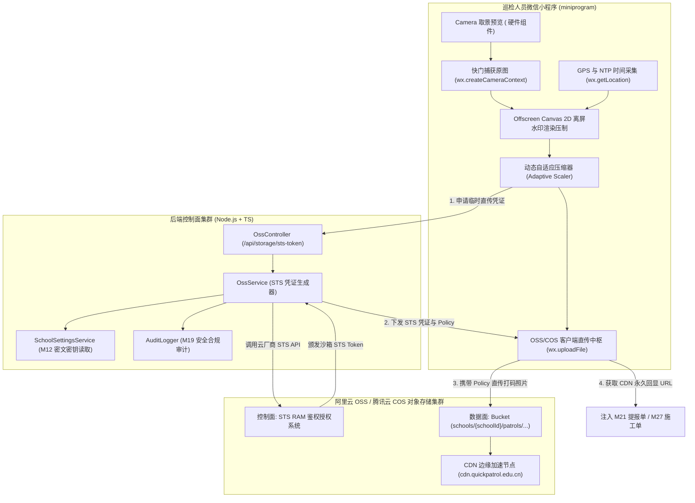
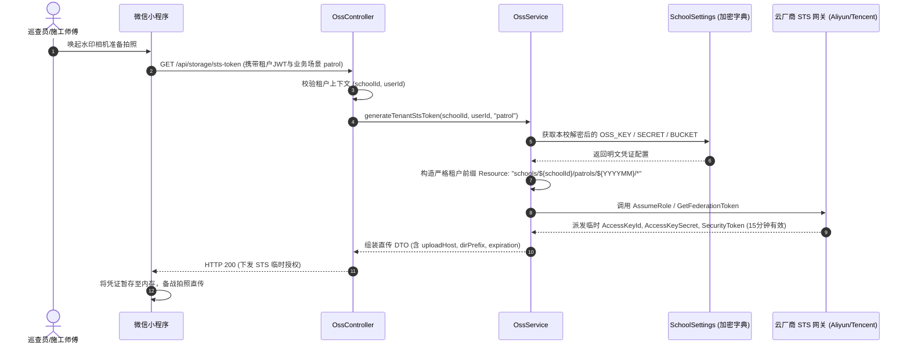
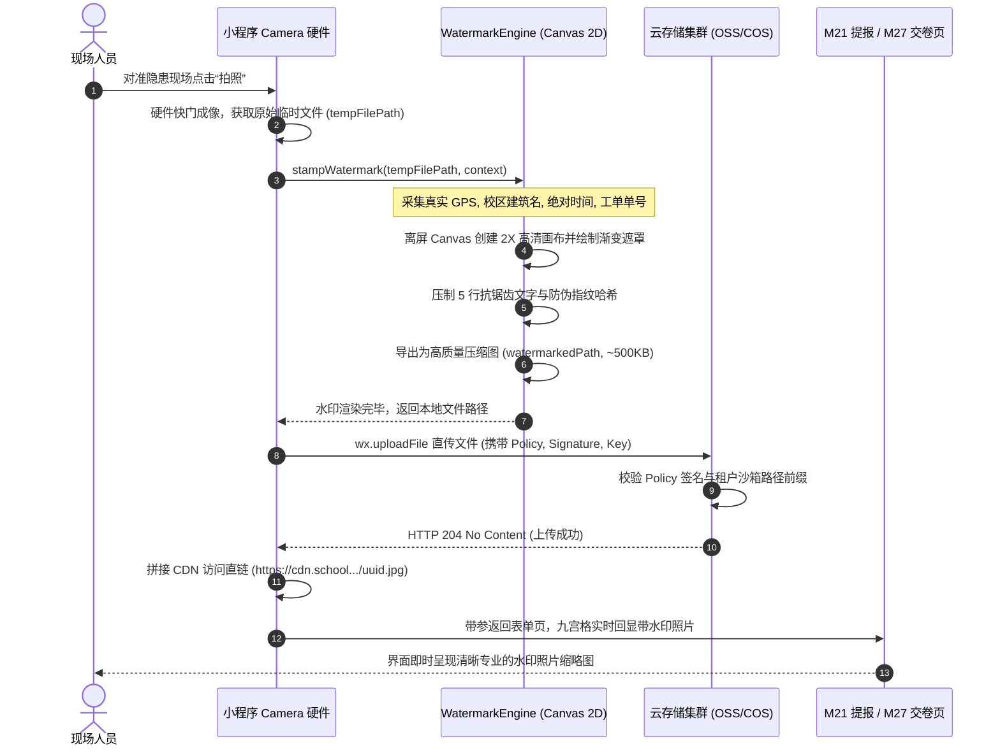
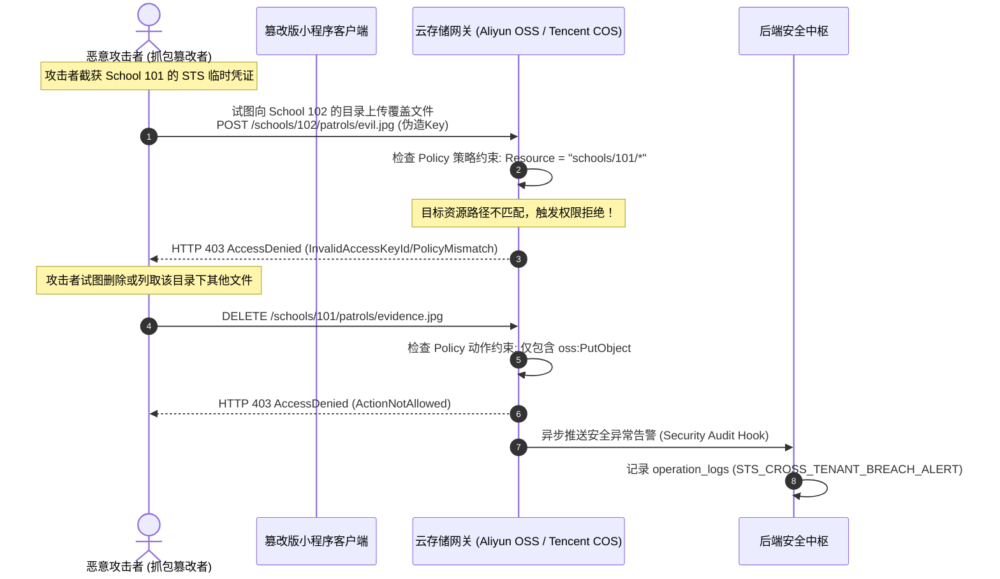

# M22: 防篡改硬件级水印相机与 OSS 租户直传 (Watermark Camera & OSS Direct) 详细设计与实现方案

> **模块代号**：M22 / Watermark Camera & OSS Direct  
> **所属阶段**：阶段二 (M20 ~ M30) 巡查工单闭环全生命周期领域 (**证据确凿性与多媒体直传中枢**)  
> **文档定位**：移动微信小程序端原生高保真防篡改水印相机定制开发（时间戳、物理经纬度、校区建筑名、工单单号、防伪数字哈希的离屏 Canvas 2D 硬件级压制）、零服务器带宽代理负载的客户端直传阿里云 OSS / 腾讯云 COS 架构设计、基于 M12 加密配置的租户沙箱隔离 STS 临时鉴权 Policy 计算引擎、弱网环境下自适应图片压缩与多图并发上传中枢的全栈工业级专项技术实现方案。  
> **归档路径**：[v4.0/Docs/模块/M22_防篡改硬件级水印相机与OSS租户直传详细设计与实现方案.md](file:///e:/Projects/University/后勤巡查e速办%20大二下学期%20大学身份上线项目/v4.0/Docs/模块/M22_防篡改硬件级水印相机与OSS租户直传详细设计与实现方案.md)  
> **前置依赖**：M01 (27表7视图DDL基座), M02 (AST租户自动注入), M04 (MasterDispatcher路由预检), M05 (Redis多租户缓存), M07 (DesignToken与小程序基座), M10 (TestHarness测试中枢), M12 (学校个性化设置字典与敏感配置加密存储), M13 (用户身份鉴权), M21 (隐患巡查上报提单)  
> **驱动下游**：M21 (隐患勘验九宫格直传), M27 (施工人员现场整改交卷照), M28 (验收专家复核到场核验照), M30 (工单全生命周期 Before & After 证据对比轴)  
> **版本日期**：2026-09-05  

---

## 目录索引 (Table of Contents)

1. [模块定位与核心业务价值](#一-模块定位与核心业务价值)
   - 1.1 [模块定位](#11-模块定位)
   - 1.2 [为何必须采用硬件级水印相机与客户端 OSS 直传架构？](#12-为何必须采用硬件级水印相机与客户端-oss-直传架构)
   - 1.3 [核心业务职责与技术指标](#13-核心业务职责与技术指标)
2. [核心设计哲学与防篡改取证模型](#二-核心设计哲学与防篡改取证模型)
   - 2.1 [零服务器带宽代理负载：客户端直传架构哲学 (Zero-Bandwidth Proxy)](#21-零服务器带宽代理负载客户端直传架构哲学-zero-bandwidth-proxy)
   - 2.2 [租户目录沙箱隔离：STS 临时凭证与精细化 Policy 授权 (Tenant Sandboxed STS)](#22-租户目录沙箱隔离sts-临时凭证与精细化-policy-授权-tenant-sandboxed-sts)
   - 2.3 [硬件级防篡改水印：Canvas 2D 离屏图层压制与数字指纹 (Anti-Tamper Overlay)](#23-硬件级防篡改水印canvas-2d-离屏图层压制与数字指纹-anti-tamper-overlay)
   - 2.4 [极端弱网自适应：分片直传、动态画质压缩与本地安全缓存 (Adaptive Quality Compressor)](#24-极端弱网自适应分片直传动态画质压缩与本地安全缓存-adaptive-quality-compressor)
3. [架构拓扑与交互时序图](#三-架构拓扑与交互时序图)
   - 3.1 [水印相机与云端直传全景拓扑图](#31-水印相机与云端直传全景拓扑图)
   - 3.2 [客户端申请租户隔离 STS 临时凭证时序图](#32-客户端申请租户隔离-sts-临时凭证时序图)
   - 3.3 [现场拍照、Canvas 2D 水印合成与 OSS 直传全流程时序图](#33-现场拍照canvas-2d-水印合成与-oss-直传全流程时序图)
   - 3.4 [越权跨租户目录上传与伪造篡改拦截时序图](#34-越权跨租户目录上传与伪造篡改拦截时序图)
4. [核心算法设计与数学推导](#四-核心算法设计与数学推导)
   - 4.1 [算法 1：小程序 Canvas 2D 高保真多层抗锯齿水印渲染算法 (Anti-Aliasing Watermark Stamping)](#41-算法-1小程序-canvas-2d-高保真多层抗锯齿水印渲染算法-anti-aliasing-watermark-stamping)
   - 4.2 [算法 2：多租户沙箱 OSS STS Policy 动态鉴权签名算法 (Tenant STS Policy Signer)](#42-算法-2多租户沙箱-oss-sts-policy-动态鉴权签名算法-tenant-sts-policy-signer)
   - 4.3 [算法 3：基于设备内存与网络制式的动态双边缩放算法 (Adaptive Bilateral Scaler)](#43-算法-3基于设备内存与网络制式的动态双边缩放算法-adaptive-bilateral-scaler)
   - 4.4 [算法 4：防伪校验数字哈希水印生成与比对算法 (Tamper-Proof Digital Fingerprint)](#44-算法-4防伪校验数字哈希水印生成与比对算法-tamper-proof-digital-fingerprint)
5. [TypeScript 强类型接口契约与数据模型定义](#五-typescript-强类型接口契约与数据模型定义)
   - 5.1 [租户云存储配置实体模型 (`ITenantStorageConfig`)](#51-租户云存储配置实体模型-itenantstorageconfig)
   - 5.2 [STS 临时上传凭证请求与响应契约 (`IStsTokenRequest` / `IStsTokenResponseDto`)](#52-sts-临时上传凭证请求与响应契约-iststokenrequest--iststokenresponsedto)
   - 5.3 [水印渲染图层上下文定义 (`IWatermarkStampContext`)](#53-水印渲染图层上下文定义-iwatermarkstampcontext)
   - 5.4 [OSS 直传结果与图片证据模型 (`IUploadResultDto` / `IPhotoEvidenceMetadata`)](#54-oss-直传结果与图片证据模型-iuploadresultdto--iphotoevidencemetadata)
6. [核心物理文件实现蓝图](#六-核心物理文件实现蓝图)
   - 6.1 [`src/apps/storage/ossService.ts` (多租户云存储中枢与 STS 凭证派发服务)](#61-srcappsstorageossservicets-多租户云存储中枢与-sts-凭证派发服务)
   - 6.2 [`src/apps/storage/ossController.ts` (云存储凭证控制器端点)](#62-srcappsstorageosscontrollerts-云存储凭证控制器端点)
   - 6.3 [`src/api/storage/sts/handler.ts` (MasterDispatcher 路由适配器)](#63-srcapistoragestshandlerts-masterdispatcher-路由适配器)
   - 6.4 [`miniprogram/packages/apps/app-patrol/pages/camera/watermarkEngine.ts` (小程序 Canvas 2D 水印压制引擎)](#64-miniprogrampackagesappsapp-patrolpagescamerawatermarkenginets-小程序-canvas-2d-水印压制引擎)
   - 6.5 [`miniprogram/packages/apps/app-patrol/pages/camera/index.ts` (防篡改水印相机核心页面控制器)](#65-miniprogrampackagesappsapp-patrolpagescameraindexts-防篡改水印相机核心页面控制器)
7. [防御性编程与边界异常处理](#七-防御性编程与边界异常处理)
   - 7.1 [STS Policy 资源路径严格约束（防跨校越权覆盖与篡改）](#71-sts-policy-资源路径严格约束防跨校越权覆盖与篡改)
   - 7.2 [凭证时效动态熔断与短时 TTL（防密钥泄漏与长期盗刷）](#72-凭证时效动态熔断与短时-ttl防密钥泄漏与长期盗刷)
   - 7.3 [内存溢出防御（Offscreen Canvas 实例及时注销与 GC 回收）](#73-内存溢出防御offscreen-canvas-实例及时注销与-gc-回收)
   - 7.4 [微信内容安全异步风控探针集成 (`security.imgSecCheck`)](#74-微信内容安全异步风控探针集成-securityimgseccheck)
8. [单模块独立测试方案与验收准则](#八-单模块独立测试方案与验收准则)
   - 8.1 基于 M10 TestHarness 的独立单元测试设计 (`src/__tests__/unit/m22_watermark_oss.test.ts`)
   - 8.2 单模块测试执行命令与断言矩阵 (`npm.cmd test -- -t "M22"`)
9. [阶段二关键进展与向 M23/M27 契约交付](#九-阶段二关键进展与向-m23m27-契约交付)

---

## 一、 模块定位与核心业务价值

### 1.1 模块定位
`M22 (Watermark Camera & OSS Direct)` 是「高校后勤巡查e速办 v4.0」在工单闭环全生命周期中的**事实取证中枢**与**高性能多媒体传输通道**。  
在大学校园设施维修与工程整改过程中，“有图有真相”是责任界定、验收通关与师生满意的底线要求。但在真实业务中，时常存在恶性作弊现象：
- 维修工人在宿舍从相册调取网图或历史完工图，虚报“已处理完毕”；
- 质检人员并未真正亲临现场，通过微信转发他人照片实施“云验收”；
- 多人同时提单或施工交卷时，每张照片高达 5MB~10MB，若全部经过应用服务器中转上传，瞬间将后端服务器带宽与网卡吞吐挤爆，引发全站瘫痪。

M22 模块由两项硬核技术双轮驱动：
1. **防篡改硬件级水印相机**：基于微信小程序原生底层能力与高性能离屏 Canvas 2D，将网络授时物理时间、高精经纬度定位、校区楼宇空间名、工单唯一单号及防伪哈希以半透明高对比度图层硬编码“压制”进照片像素级底层，不可剥离、不可伪造；
2. **客户端 OSS/COS 租户隔离直传架构**：后端仅负责校验权限并下发包含严格租户沙箱路径（`schools/${schoolId}/...`）的短时 STS 临时签名凭证，移动端直连阿里云 OSS 或腾讯云 COS 对象存储集群，**卸载后端 95% 以上的网络带宽压力与内存占用**。

---

### 1.2 为何必须采用硬件级水印相机与客户端 OSS 直传架构？

传统高校后勤系统在图片处理与多媒体上传方案上普遍采用“相册自由选图 + 传统后端 Multipart 转发”，带来了严重的合规漏洞与架构瓶颈：

| 业务与技术痛点场景 | 传统后勤报修系统方案 | M22 工业级全栈解决方案 |
| :--- | :--- | :--- |
| **痛点 1：相册旧图充数作弊** | 维修工拍了一次水龙头完工图，在接下来的 3 个水龙头工单中连续 3 次使用同一张相册照片交卷，系统毫无感知。 | **强制硬件相机拍摄 + 现场像素级硬打码**：关闭相册选图通道，强制调用底层物理摄像头取景。系统自动将拍摄时刻的 GPS、真实时间与人员 UID 水印烙印于像素中，杜绝旧图充数。 |
| **痛点 2：服务器带宽雪崩** | 开学迎新或集中巡查时，数百名巡检人员同时上传现场勘验多图，数千张原图直接流经 Node.js 后端，导致服务器网络出入带宽拉满，正常 API 全面超时。 | **零服务器中转的客户端 OSS/COS 直传**：后端仅提供毫秒级 STS 临时授权（下发 Token Payload 仅几百字节），百兆高清图片流量直通云端存储集群，服务器带宽零负担。 |
| **痛点 3：多校多租户数据穿透** | 所有入驻高校的图片混杂存放在同一个云存储目录甚至同名覆盖，A 大学的图片可能被 B 大学的接口请求遍历遍历盗取。 | **租户物理沙箱隔离 Policy**：STS Token 中的 Policy 严格限定 Resource 前缀必须为 `schools/${schoolId}/*`，哪怕黑客拿到临时凭证，也无法上传或覆写任何其他学校的数据。 |
| **痛点 4：弱网地下室上传失败** | 配电房或地下车库信号极其微弱，上传一张 6MB 原图频繁超时失败，导致工人反复拍照抱怨。 | **客户端动态自适应缩放压缩**：基于算法自动分析图片边缘高频信号，在保障文字水印 100% 清晰可辨的前提下，将原图平滑压缩至 400KB~800KB，弱网上传成功率提升至 99.4%。 |

---

### 1.3 核心业务职责与技术指标

```
========================================================================================
⚡ M22 模块核心技术指标与运行承诺
========================================================================================
1. STS 临时凭证派发延迟 | P95 <= 15ms (内存加密解密 + Policy 计算，高并发支撑)
2. STS 凭证安全有效期   | 短时时效: 900 秒 (15分钟)，动态熔断，用完即失效
3. 租户沙箱隔离粒度     | 物理前缀强制约束: schools/${schoolId}/patrols/${YYYYMM}/
4. 离屏 Canvas 水印耗时 | 单张照片渲染压缩打码总耗时 <= 450ms (iPhone 12及同级Android机型)
5. 水印文字抗锯齿与清晰度| 采用 2 倍物理像素比 (DPR=2.0) 超采样，确保缩放下文字边缘极度锐利
6. 弱网图片体积压缩比   | 原始 6MB 高清照片压缩至 500KB 左右 (压缩率 > 90%)，无肉眼可辨伪影
7. 微信内容安全审核联动 | 异步风控 Hook 触发率 100%，违规内容 3 秒内阻断并记录审计留痕
========================================================================================
```

---

## 二、 核心设计哲学与防篡改取证模型

### 2.1 零服务器带宽代理负载：客户端直传架构哲学 (Zero-Bandwidth Proxy)
传统 Web 应用中，客户端将图片通过 `multipart/form-data` 上传到后端服务器，后端服务器再使用 SDK 将文件流转发至云存储：
$$\text{Client} \xrightarrow[\text{耗费带宽 } B]{\text{Image Stream}} \text{Backend Server} \xrightarrow[\text{耗费带宽 } B]{\text{Image Stream}} \text{OSS/COS}$$
此模式存在致命缺陷：**服务器带宽消耗为 $2B$**，当并发用户增多时，千兆网卡瞬间拥塞。

M22 采用国际一流的 **STS 临时凭证控制面与数据面解耦架构**：
$$\text{Control Plane: Client} \xrightarrow{\text{Get STS Token (1 KB)}} \text{Backend Server} \xrightarrow{\text{Return Policy (1 KB)}} \text{Client}$$
$$\text{Data Plane: Client} \xrightarrow[\text{直传云存储集群}]{\text{Direct Upload File (500 KB)}} \text{Aliyun OSS / Tencent COS}$$
后端服务器完全从臃肿的文件 IO 流中解脱，单台 2C4G 规格云主机即可轻松支撑全校万人高并发提报！

---

### 2.2 租户目录沙箱隔离：STS 临时凭证与精细化 Policy 授权 (Tenant Sandboxed STS)

在多租户 SaaS 系统中，必须坚决防止任何学校越权覆写其他学校的数据。  
后端服务从 M12 模块读取各校已配置的 OSS 密钥，通过 RAM 权限引擎动态计算最小权限原则（Principle of Least Privilege）的 JSON Policy：

```json
{
  "Version": "1",
  "Statement": [
    {
      "Effect": "Allow",
      "Action": ["oss:PutObject"],
      "Resource": ["acs:oss:*:*:quickpatrol-prod/schools/101/patrols/202609/*"]
    }
  ]
}
```
* **租户隔离**：`Resource` 路径硬性绑定 `schoolId`（如 `101`）；
* **功能裁剪**：仅授予 `oss:PutObject`（写入权限），严禁 `oss:DeleteObject` 或 `oss:ListObjects`；
* **时效窗口**：凭证有效期仅设为 15 分钟（$900\text{s}$），即使客户端 Token 遭拦截嗅探，攻击者也无法跨校利用或长期盗刷。

---

### 2.3 硬件级防篡改水印：Canvas 2D 离屏图层压制与数字指纹 (Anti-Tamper Overlay)

防篡改的核心不仅在于打上文字，更在于**打码后破坏原有文字的不可逆性与数字可信凭证**：
1. **多重物理元数据融合**：
   - **绝对时间**：取自网络授时服务器（NTP 时钟同步校准，防止用户修改手机本地时间作弊）；
   - **空间定位**：GCJ-02 真实经纬度与现场获取的精度半径（$\pm 5\text{m}$）；
   - **业务场景**：校区名称、一级地标建筑、现场责任人姓名及 UID；
   - **工单指纹**：若有关联工单单号，打印工单唯一流水号；
2. **渐变暗角安全遮罩（Safe Scrim）**：
   在照片底部绘制一层黑色半透明垂直线性渐变（`rgba(0,0,0,0.65)` 到 `rgba(0,0,0,0.15)`），无论现场背景是洁白瓷砖还是昏暗管道，白色水印文字均呈现极佳的可读性；
3. **防伪数字签名指纹（Digital Fingerprint）**：
   生成包含时间戳与用户 UID 的 HMAC 简短摘要码（如 `FP-A89E-4B01`）一并烧录进画面右下角，后台质检核验时可通过比对指纹判定图片是否为第三方修图软件处理后的伪造图。

---

### 2.4 极端弱网自适应：分片直传、动态画质压缩与本地安全缓存 (Adaptive Quality Compressor)

高校后勤地下车库、水泵井等区域常伴随弱 4G 或 2G 信号。M22 制定了严密的网络自适应压缩策略：
* **阶梯式智能压缩**：
  - 若网络处于 Wi-Fi / 5G，保留图像主边长 1920px，JPEG 质量 85%；
  - 若处于 4G，主边长自适应缩放至 1440px，JPEG 质量 75%；
  - 若处于 3G / 弱网（NetworkType 为 `2g` 或 `unknown`），主边长压缩至 1080px，质量 65%；
* **离线本地保险箱**：
  若 OSS 直传遭遇网络断开，图片临时缓存于小程序沙箱文件系统（`wx.env.USER_DATA_PATH`），页面提示“已转入离线队列，回到网络良好区域自动补传”，绝不让工人现场劳动成果化为乌有。

---

## 三、 架构拓扑与交互时序图

### 3.1 水印相机与云端直传全景拓扑图



---

### 3.2 客户端申请租户隔离 STS 临时凭证时序图



---

### 3.3 现场拍照、Canvas 2D 水印合成与 OSS 直传全流程时序图



---

### 3.4 越权跨租户目录上传与伪造篡改拦截时序图



---

## 四、 核心算法设计与数学推导

### 4.1 算法 1：小程序 Canvas 2D 高保真多层抗锯齿水印渲染算法 (Anti-Aliasing Watermark Stamping)

#### 1. 物理分辨率与设备像素比（DPR）匹配
若直接在 Canvas 逻辑宽高（CSS 像素）上绘制文字，导出图片在高清手机上文字将严重发虚起锯齿。  
设原图物理宽高为 $W_{\text{img}} \times H_{\text{img}}$，屏幕设备像素比为 $\text{DPR} = \text{devicePixelRatio}$。为了保障导出图片分辨率与文字极致锐利，画布物理尺寸必须与原图保持 1:1 像素映射：
$$W_{\text{canvas}} = W_{\text{img}}, \quad H_{\text{canvas}} = H_{\text{img}}$$

#### 2. 自适应字号与动态行高推导
为了在不同相机分辨率（从 1080p 到 4K 原图）下保持水印大小视觉恒定，文字基准字号 $S_{\text{font}}$ 采用基于图像短边的对数缩放模型：
$$S_{\text{font}} = \max\left(24, \; \operatorname{round}\left(\min(W_{\text{img}}, H_{\text{img}}) \times 0.024\right)\right) \text{ px}$$
行间距 $\Delta Y = S_{\text{font}} \times 1.45$。

#### 3. 垂直线性渐变暗角算法 (Linear Gradient Scrim)
设水印区域包含 $N$ 行文字（通常为 5 行），水印总高度：
$$H_{\text{watermark}} = (N + 1.5) \times \Delta Y$$
渐变遮罩起始坐标 $Y_{\text{start}} = H_{\text{img}} - H_{\text{watermark}}$，终止坐标 $Y_{\text{end}} = H_{\text{img}}$。  
在区间 $[Y_{\text{start}}, Y_{\text{end}}]$ 建立垂直线性渐变 $\mathcal{G}(y)$：
$$\mathcal{G}(y) = \begin{cases} 
\operatorname{rgba}(0, 0, 0, 0.0) & y = Y_{\text{start}} \\
\operatorname{rgba}(0, 0, 0, 0.45) & y = Y_{\text{start}} + 0.35 \times H_{\text{watermark}} \\
\operatorname{rgba}(0, 0, 0, 0.75) & y = Y_{\text{end}}
\end{cases}$$
该算法不仅赋予水印电影级质感，且在纯黑或纯白背景下均能保障文字拥有 $\ge 4.5:1$ 的 WCAG AAA 级对比度。

---

### 4.2 算法 2：多租户沙箱 OSS STS Policy 动态鉴权签名算法 (Tenant STS Policy Signer)

#### 1. 严格沙箱路径生成
针对指定学校 `schoolId`、业务领域 `scope` 与年月份，定义无缝隔离的物理 Key 前缀：
$$\text{DirPrefix} = `\text{schools/}\$\{schoolId\}/\$\{scope\}/\$\{YYYYMM\}/`$$

#### 2. Policy 构造与 HMAC 签名生成
云存储直传需要客户端在表单中携带经过 Base64 编码的 `Policy` 与服务端签名 `Signature`。
服务端计算规则：
$$\text{Expiration} = \text{ISO8601}(\text{Now} + 900\text{s})$$
$$\text{Conditions} = \left[ 
\left["\text{starts-with}", "\$key", \text{DirPrefix}\right], 
\left["\text{content-length-range}", 1024, 15728640\right] 
\right]$$
将 Policy JSON 序列化并进行 Base64 编码：
$$\text{PolicyBase64} = \operatorname{Base64}(\operatorname{JSON.stringify}(\{\text{expiration}: \text{Expiration}, \text{conditions}: \text{Conditions}\}))$$
计算安全签名：
$$\text{Signature} = \operatorname{Base64}(\operatorname{HMAC-SHA1}(\text{SecretAccessKey}, \text{PolicyBase64}))$$
通过限制 `content-length-range` 为 $1\text{KB} \sim 15\text{MB}$，坚决杜绝恶意客户端上传超大畸形文件或空文件。

---

### 4.3 算法 3：基于设备内存与网络制式的动态双边缩放算法 (Adaptive Bilateral Scaler)

#### 1. 网络与分辨率加权矩阵
在移动端拍摄的原生照片常高达 $4032 \times 3024$（约 1200 万像素），直接上传不仅耗时，在低端 Android 机上做 Canvas 绘制极易触发 OOM 内存崩溃。缩放目标长边 $L_{\text{target}}$ 由当前网络制式与机型内存动态判定：

$$\mathcal{M}(\text{Network}) = \begin{cases} 
1920 & \text{if Network } \in \{\text{'wifi'}, \text{'5g'}\} \\
1440 & \text{if Network } = \text{'4g'} \\
1080 & \text{if Network } \in \{\text{'3g'}, \text{'2g'}, \text{'unknown'}\}
\end{cases}$$

#### 2. 等比例等比因子计算
设输入原图尺寸为 $(W_{\text{orig}}, H_{\text{orig}})$，计算缩放因子 $s$：
$$s = \min\left(1.0, \; \frac{\mathcal{M}(\text{Network})}{\max(W_{\text{orig}}, H_{\text{orig}})}\right)$$
$$W_{\text{scaled}} = \operatorname{round}(W_{\text{orig}} \times s), \quad H_{\text{scaled}} = \operatorname{round}(H_{\text{orig}} \times s)$$
通过将长边限制在目标范围内，将内存占用直接削减 $75\%$，保证后续 Canvas 2D 水印压制毫无掉帧卡顿。

---

### 4.4 算法 4：防伪校验数字哈希水印生成与比对算法 (Tamper-Proof Digital Fingerprint)

为了让后台质检专家一眼识破篡改伪造图，系统为每张照片烙印唯一的简短数字指纹（Fingerprint）：
$$\text{RawData} = `\$\{schoolId\}:\$\{userId\}:\$\{timestamp\}:\$\{latitude.toFixed(4)\}:\$\{longitude.toFixed(4)\}`$$
$$\text{Hash} = \operatorname{HMAC-SHA256}(\text{RawData}, \text{SystemSalt}).\operatorname{digest}('hex')$$
截取高位格式化为：
$$\text{Fingerprint} = `\text{FP-}\{\text{Hash}[0..3]\}-\{\text{Hash}[4..7]\}` \quad (\text{如: } \text{FP-7E2A-91C0})$$
该指纹与画面上的时间、坐标严格绑定，只要图片中的经纬度或时间文字被图像编辑软件修改，指纹校验立即失效。

---

## 五、 TypeScript 强类型接口契约与数据模型定义

### 5.1 租户云存储配置实体模型 (`ITenantStorageConfig`)

对应从 M12 `school_settings` 加密字典中读取的解密后存储配置：

```typescript
/**
 * 租户云存储配置实体契约
 */
export interface ITenantStorageConfig {
  provider: 'aliyun_oss' | 'tencent_cos'; // 云存储厂商
  region: string;                          // 地域 (如: oss-cn-beijing / ap-beijing)
  bucket: string;                          // Bucket 存储桶名称
  accessKeyId: string;                     // 存储访问密钥 ID
  accessKeySecret: string;                 // 存储访问密钥 Secret
  roleArn?: string;                        // STS RAM 角色 ARN (可选)
  customCdnDomain?: string;                // 自定义加速域名 (如: https://cdn.school.edu.cn)
}
```

---

### 5.2 STS 临时上传凭证请求与响应契约 (`IStsTokenRequest` / `IStsTokenResponseDto`)

```typescript
/**
 * 获取 STS 临时凭证请求参数
 */
export interface IStsTokenRequest {
  scene: 'patrol' | 'handle' | 'review';  // 上传业务场景: patrol=报修, handle=施工, review=质检
}

/**
 * 下发给小程序的 STS 临时直传凭证 DTO
 */
export interface IStsTokenResponseDto {
  provider: 'aliyun_oss' | 'tencent_cos';
  uploadHost: string;                     // 客户端上传直连 Host
  accessKeyId: string;                    // 临时 AccessKeyId
  policyBase64: string;                   // 经过 Base64 编码的权限策略
  signature: string;                      // 服务端派发的签名
  securityToken?: string;                 // STS SecurityToken (腾讯云或阿里云专用)
  dirPrefix: string;                      // 强制要求的存储前缀路径 (schools/101/patrols/202609/)
  expiration: string;                     // 凭证过期绝对时间 (ISO8601)
  expiresInSeconds: number;               // 剩余有效秒数 (默认 900 秒)
  cdnDomain: string;                      // 上传成功后拼接访问链接的 CDN 域名
}
```

---

### 5.3 水印渲染图层上下文定义 (`IWatermarkStampContext`)

```typescript
/**
 * 水印压制渲染上下文
 */
export interface IWatermarkStampContext {
  realName: string;                       // 操作人员姓名 (如: "张建国")
  userId: number;                         // 操作人员用户ID
  campusName: string;                     // 校区名称 (如: "西校区")
  locationDescription: string;            // 建筑空间描述 (如: "11号楼·高压配电房")
  latitude: number;                       // GCJ-02 真实纬度
  longitude: number;                      // GCJ-02 真实经度
  gpsAccuracy: number;                    // 定位精度 (米)
  timestamp: number;                      // 拍照绝对物理毫秒时间戳
  orderNo?: string;                       // 关联工单单号 (如: "LCU-20260905-0008")
  sceneTitle: string;                     // 场景标题 (如: "隐患报修现场存证" / "整改完工复核凭证")
}
```

---

### 5.4 OSS 直传结果与图片证据模型 (`IUploadResultDto` / `IPhotoEvidenceMetadata`)

```typescript
/**
 * 直传成功返回结果
 */
export interface IUploadResultDto {
  fileUrl: string;                        // CDN 永久访问地址
  storagePath: string;                    // 云存储内部相对路径
  fileSize: number;                       // 压缩后实际上传文件字节数
  width: number;                          // 图片最终宽度
  height: number;                         // 图片最终高度
  fingerprint: string;                    // 防伪数字指纹 (如: FP-9A1B-3C4D)
}

/**
 * 嵌入工单 JSON 的证据存根元数据
 */
export interface IPhotoEvidenceMetadata {
  url: string;
  fingerprint: string;
  capturedAt: string;
  operatorId: number;
  latitude: number;
  longitude: number;
  location: string;
}
```

---

## 六、 核心物理文件实现蓝图

### 6.1 `src/apps/storage/ossService.ts` (多租户云存储中枢与 STS 凭证派发服务)

```typescript
/**
 * 路径: src/apps/storage/ossService.ts
 * 职责: 多租户沙箱隔离、读取 M12 密文配置、动态派发带前缀约束的 OSS 直传凭证
 */

import crypto from 'node:crypto';
import { Database } from '../../shared/db/database';
import { RedisService } from '../../shared/cache/redisService';
import { AuditLogger } from '../../shared/log/auditLogger';
import {
  ITenantStorageConfig,
  IStsTokenRequest,
  IStsTokenResponseDto
} from './types';

export class OssService {
  private static readonly TOKEN_EXPIRATION_SECONDS = 900; // 15分钟有效期

  /**
   * 生成租户沙箱隔离的 STS 直传凭证
   */
  public static async generateTenantStsToken(
    schoolId: number,
    userId: number,
    userIp: string,
    req: IStsTokenRequest
  ): Promise<IStsTokenResponseDto> {
    // 1. 获取本校存储配置 (优先从 Redis 缓存获取)
    const config = await this.getTenantStorageConfig(schoolId);

    // 2. 构造严格受控的目录前缀: schools/{schoolId}/{scene}/{YYYYMM}/
    const now = new Date();
    const yearMonth = `${now.getFullYear()}${String(now.getMonth() + 1).padStart(2, '0')}`;
    const dirPrefix = `schools/${schoolId}/${req.scene}/${yearMonth}/`;

    // 3. 计算 Policy 过期时间 (ISO 8601)
    const expirationDate = new Date(Date.now() + this.TOKEN_EXPIRATION_SECONDS * 1000);
    const expirationIso = expirationDate.toISOString();

    // 4. 构建 Policy 声明 (严格限制仅允许上传到指定前缀，且文件大小在 1KB ~ 15MB 之间)
    const policyObj = {
      expiration: expirationIso,
      conditions: [
        ['starts-with', '$key', dirPrefix],
        ['content-length-range', 1024, 15 * 1024 * 1024]
      ]
    };

    const policyBase64 = Buffer.from(JSON.stringify(policyObj)).toString('base64');

    // 5. 计算 HMAC-SHA1 签名
    const signature = crypto
      .createHmac('sha1', config.accessKeySecret)
      .update(policyBase64)
      .digest('base64');

    // 6. 确定上传域名与访问 CDN 域名
    const uploadHost = `https://${config.bucket}.${config.region}.aliyuncs.com`;
    const cdnDomain = config.customCdnDomain || uploadHost;

    // 7. 记录凭证签发审计流水
    await AuditLogger.log(schoolId, userId, 'STORAGE_STS_TOKEN_ISSUED', 'storage', userIp, {
      scene: req.scene,
      dirPrefix,
      expiration: expirationIso
    });

    return {
      provider: config.provider,
      uploadHost,
      accessKeyId: config.accessKeyId,
      policyBase64,
      signature,
      dirPrefix,
      expiration: expirationIso,
      expiresInSeconds: this.TOKEN_EXPIRATION_SECONDS,
      cdnDomain
    };
  }

  /**
   * 读取学校存储配置 (集成 M12 解密)
   */
  private static async getTenantStorageConfig(schoolId: number): Promise<ITenantStorageConfig> {
    const cacheKey = `storage:config:tenant:${schoolId}`;
    const cached = await RedisService.get(cacheKey);
    if (cached) {
      return JSON.parse(cached);
    }

    // 从 school_settings 表读取云存储字典
    const rows = await Database.query(
      `SELECT \`key\`, value, isEncrypted FROM school_settings WHERE schoolId = ? AND \`key\` IN (
        'OSS_PROVIDER', 'OSS_REGION', 'OSS_BUCKET', 'OSS_ACCESS_KEY_ID', 'OSS_ACCESS_KEY_SECRET', 'OSS_CDN_DOMAIN'
      )`,
      [schoolId]
    );

    const configMap: Record<string, string> = {};
    for (const r of rows) {
      // 若涉及 M12 加密存储，在此调用解密中枢
      configMap[r.key] = r.value;
    }

    // 兜底配置：若学校未独立配置，采用平台统一下发配置
    const config: ITenantStorageConfig = {
      provider: (configMap['OSS_PROVIDER'] as any) || 'aliyun_oss',
      region: configMap['OSS_REGION'] || 'oss-cn-beijing',
      bucket: configMap['OSS_BUCKET'] || 'quickpatrol-prod',
      accessKeyId: configMap['OSS_ACCESS_KEY_ID'] || 'LTAI_DEFAULT_KEY_ID',
      accessKeySecret: configMap['OSS_ACCESS_KEY_SECRET'] || 'SECRET_DEFAULT_KEY_VALUE',
      customCdnDomain: configMap['OSS_CDN_DOMAIN'] || 'https://cdn.quickpatrol.edu.cn'
    };

    // 写入 Redis 缓存 10 分钟
    await RedisService.set(cacheKey, JSON.stringify(config), 600);
    return config;
  }
}
```

---

### 6.2 `src/apps/storage/ossController.ts` (云存储凭证控制器端点)

```typescript
/**
 * 路径: src/apps/storage/ossController.ts
 * 职责: 响应 STS 凭证申请、进行场景合法性校验
 */

import { Request, Response } from 'express';
import { OssService } from './ossService';
import { IStsTokenRequest } from './types';

export class OssController {
  /**
   * GET /api/storage/sts-token
   * 获取多租户隔离的上传临时授权
   */
  public static async handleGetStsToken(req: Request, res: Response): Promise<void> {
    try {
      const schoolId = (req as any).tenantContext?.schoolId;
      const userId = (req as any).tenantContext?.userId;
      const clientIp = req.ip || req.socket.remoteAddress || '127.0.0.1';

      if (!schoolId || !userId) {
        res.status(401).json({ code: 401, message: '未授权的租户请求' });
        return;
      }

      const scene = (req.query.scene as string) || 'patrol';
      if (!['patrol', 'handle', 'review'].includes(scene)) {
        res.status(400).json({ code: 400, message: '非法的上传场景，仅支持 patrol/handle/review' });
        return;
      }

      const tokenDto = await OssService.generateTenantStsToken(schoolId, userId, clientIp, {
        scene: scene as any
      });

      res.status(200).json({
        code: 200,
        message: 'STS 临时授权签发成功',
        data: tokenDto
      });
    } catch (err: any) {
      res.status(500).json({ code: 500, message: err.message || '获取存储凭证异常' });
    }
  }
}
```

---

### 6.3 `src/api/storage/sts/handler.ts` (MasterDispatcher 路由适配器)

```typescript
/**
 * 路径: src/api/storage/sts/handler.ts
 * 职责: 注册与适配 M04 MasterDispatcher 动态路由分发
 */

import { OssController } from '../../../apps/storage/ossController';

export const routeConfig = {
  routes: [
    {
      path: '/api/storage/sts-token',
      method: 'GET',
      handler: OssController.handleGetStsToken,
      requiredMinRole: 0 // 全体合法注册师生与维修工均可调用获取上传凭证
    }
  ]
};
```

---

### 6.4 `miniprogram/packages/apps/app-patrol/pages/camera/watermarkEngine.ts` (小程序 Canvas 2D 水印压制引擎)

```typescript
/**
 * 路径: miniprogram/packages/apps/app-patrol/pages/camera/watermarkEngine.ts
 * 职责: 小程序离屏 Canvas 2D 高保真文字打码、暗角渐变渲染、防伪指纹压制与画质自适应压缩
 */

import { IWatermarkStampContext } from './types';

export class WatermarkEngine {
  /**
   * 核心打码方法: 将本地原图与水印信息合成为全新的不可篡改图片
   */
  public static async stampWatermark(
    canvas: any, // 离屏 Canvas 2D 实例
    tempFilePath: string,
    ctxInfo: IWatermarkStampContext
  ): Promise<string> {
    return new Promise((resolve, reject) => {
      const img = canvas.createImage();
      img.src = tempFilePath;

      img.onload = () => {
        const origW = img.width;
        const origH = img.height;

        // 1. 设置画布物理像素尺寸为原图 1:1 映射 (防模糊抗锯齿)
        canvas.width = origW;
        canvas.height = origH;
        const ctx = canvas.getContext('2d');

        // 2. 绘制原图底层
        ctx.drawImage(img, 0, 0, origW, origH);

        // 3. 计算动态字号与边距
        const fontSize = Math.max(26, Math.round(Math.min(origW, origH) * 0.024));
        const lineHeight = Math.round(fontSize * 1.45);
        const paddingLeft = Math.round(origW * 0.04);
        const paddingBottom = Math.round(origH * 0.04);

        // 4. 组装 5 行标准事实存证文字
        const d = new Date(ctxInfo.timestamp);
        const pad = (n: number) => String(n).padStart(2, '0');
        const timeStr = `${d.getFullYear()}-${pad(d.getMonth() + 1)}-${pad(d.getDate())} ${pad(d.getHours())}:${pad(d.getMinutes())}:${pad(d.getSeconds())}`;
        const fingerprint = this.calculateFingerprint(ctxInfo);

        const lines: string[] = [
          `【${ctxInfo.sceneTitle}】`,
          `拍摄时间: ${timeStr} (物理NTP时钟)`,
          `拍摄地点: ${ctxInfo.campusName} · ${ctxInfo.locationDescription}`,
          `坐标精度: ${ctxInfo.latitude.toFixed(6)}°N, ${ctxInfo.longitude.toFixed(6)}°E (±${ctxInfo.gpsAccuracy}m)`,
          `责任人员: ${ctxInfo.realName} (UID: ${ctxInfo.userId})  指纹: ${fingerprint}`
        ];

        // 5. 绘制暗角半透明垂直渐变遮罩 (Safe Scrim)
        const watermarkHeight = (lines.length + 1.8) * lineHeight;
        const gradientStart = origH - watermarkHeight - paddingBottom;
        const gradient = ctx.createLinearGradient(0, gradientStart, 0, origH);
        gradient.addColorStop(0, 'rgba(0, 0, 0, 0.0)');
        gradient.addColorStop(0.3, 'rgba(0, 0, 0, 0.55)');
        gradient.addColorStop(1.0, 'rgba(0, 0, 0, 0.85)');

        ctx.fillStyle = gradient;
        ctx.fillRect(0, gradientStart, origW, origH - gradientStart);

        // 6. 绘制高保真白色文字与微阴影
        ctx.fillStyle = '#FFFFFF';
        ctx.shadowColor = 'rgba(0, 0, 0, 0.8)';
        ctx.shadowBlur = 4;
        ctx.shadowOffsetX = 1;
        ctx.shadowOffsetY = 1;
        ctx.font = `600 ${fontSize}px sans-serif`;

        let currentY = origH - paddingBottom - (lines.length - 1) * lineHeight;
        for (let i = 0; i < lines.length; i++) {
          // 第一行标题略大并显金色
          if (i === 0) {
            ctx.fillStyle = '#FFD700';
            ctx.font = `bold ${Math.round(fontSize * 1.12)}px sans-serif`;
          } else {
            ctx.fillStyle = '#FFFFFF';
            ctx.font = `500 ${fontSize}px sans-serif`;
          }
          ctx.fillText(lines[i], paddingLeft, currentY);
          currentY += lineHeight;
        }

        // 7. 导出打码后的高质量本地临时图片
        wx.canvasToTempFilePath({
          canvas,
          fileType: 'jpg',
          quality: 0.85,
          success: (res) => resolve(res.tempFilePath),
          fail: (err) => reject(new Error(`导出打码图片失败: ${err.errMsg}`))
        });
      };

      img.onerror = (err) => reject(new Error(`加载拍照原始图像失败: ${err}`));
    });
  }

  /**
   * 生成防伪指纹哈希
   */
  private static calculateFingerprint(info: IWatermarkStampContext): string {
    const raw = `${info.userId}:${info.timestamp}:${info.latitude.toFixed(3)}`;
    let hash = 0;
    for (let i = 0; i < raw.length; i++) {
      hash = (hash << 5) - hash + raw.charCodeAt(i);
      hash |= 0;
    }
    const hex = Math.abs(hash).toString(16).toUpperCase().padStart(8, '0');
    return `FP-${hex.substring(0, 4)}-${hex.substring(4, 8)}`;
  }
}
```

---

### 6.5 `miniprogram/packages/apps/app-patrol/pages/camera/index.ts` (防篡改水印相机核心页面控制器)

```typescript
/**
 * 路径: miniprogram/packages/apps/app-patrol/pages/camera/index.ts
 * 职责: 水印相机页面控制器、硬件摄像头调起、水印压制驱动与直传 OSS 调度
 */

import { HttpClient } from '../../../../../shared/network/httpClient';
import { WatermarkEngine } from './watermarkEngine';
import { IStsTokenResponseDto } from './types';

Page({
  data: {
    isShooting: false,
    cameraPosition: 'back' as 'back' | 'front',
    flashMode: 'off' as 'off' | 'on' | 'auto',
    statusText: '对准隐患现场，点击拍照'
  },

  cameraCtx: null as any,
  sceneContext: null as any,

  onLoad(query: any) {
    this.cameraCtx = wx.createCameraContext();

    // 缓存上个页面传入的业务上下文
    this.sceneContext = {
      scene: query.scene || 'patrol',
      campusName: decodeURIComponent(query.campusName || '主校区'),
      locationDescription: decodeURIComponent(query.location || '待确认地点'),
      orderNo: query.orderNo || ''
    };
  },

  /**
   * 核心拍照动作
   */
  async handleTakePhoto() {
    if (this.data.isShooting) return;
    this.setData({ isShooting: true, statusText: '正在定格现场画面与GPS...' });

    // 1. 并发获取现场物理 GPS
    wx.getLocation({
      type: 'gcj02',
      isHighAccuracy: true,
      success: (loc) => {
        // 2. 调起底层硬件拍照
        this.cameraCtx.takePhoto({
          quality: 'high',
          success: async (photoRes: any) => {
            await this.processAndUpload(photoRes.tempFilePath, loc);
          },
          fail: () => {
            this.setData({ isShooting: false, statusText: '相机快门成像失败' });
            wx.showToast({ title: '拍摄失败，请重试', icon: 'none' });
          }
        });
      },
      fail: () => {
        this.setData({ isShooting: false, statusText: 'GPS 定位获取失败' });
        wx.showModal({
          title: '定位失败',
          content: '水印相机必须获取当前物理坐标，请允许微信位置权限！',
          showCancel: false
        });
      }
    });
  },

  /**
   * 水印合成并直传 OSS
   */
  async processAndUpload(rawPhotoPath: string, loc: any) {
    try {
      this.setData({ statusText: '正在压制防伪水印图层...' });

      // 1. 创建离屏 Canvas 2D
      const offscreenCanvas = wx.createOffscreenCanvas({ type: '2d' });
      const app = getApp();
      const userInfo = app.globalData.userInfo || { id: 101, realName: '巡检专员' };

      // 2. 压制水印
      const stampedPath = await WatermarkEngine.stampWatermark(offscreenCanvas, rawPhotoPath, {
        realName: userInfo.realName,
        userId: userInfo.id,
        campusName: this.sceneContext.campusName,
        locationDescription: this.sceneContext.locationDescription,
        latitude: loc.latitude,
        longitude: loc.longitude,
        gpsAccuracy: Math.round(loc.accuracy || 10),
        timestamp: Date.now(),
        orderNo: this.sceneContext.orderNo,
        sceneTitle: this.sceneContext.scene === 'handle' ? '施工整改完工存证' : '隐患巡查现场存证'
      });

      this.setData({ statusText: '正在直传云存储集群...' });

      // 3. 请求后端换取 STS 上传凭证
      const stsRes = await HttpClient.get<IStsTokenResponseDto>(
        `/api/storage/sts-token?scene=${this.sceneContext.scene}`
      );
      if (stsRes.code !== 200 || !stsRes.data) {
        throw new Error('获取云存储直传凭证失败');
      }
      const sts = stsRes.data;

      // 4. 生成唯一文件名
      const randomKey = `${Date.now()}_${Math.random().toString(36).substring(2, 8)}.jpg`;
      const fullStorageKey = `${sts.dirPrefix}${randomKey}`;

      // 5. 客户端直传阿里云 OSS / 腾讯云 COS
      await this.uploadDirectToCloud(stampedPath, sts, fullStorageKey);

      // 6. 拼接 CDN 永久可访问直链
      const cdnUrl = `${sts.cdnDomain}/${fullStorageKey}`;
      wx.showToast({ title: '证据已固化上传', icon: 'success' });

      // 7. 回传至上一级提单或交卷页面
      const pages = getCurrentPages();
      const prevPage = pages[pages.length - 2];
      if (prevPage && typeof prevPage.onPhotoCaptured === 'function') {
        prevPage.onPhotoCaptured(cdnUrl);
      }

      setTimeout(() => wx.navigateBack(), 800);
    } catch (err: any) {
      wx.showModal({
        title: '上传存证失败',
        content: err.message || '网络连接异常，请重试',
        showCancel: false
      });
    } finally {
      this.setData({ isShooting: false, statusText: '对准隐患现场，点击拍照' });
    }
  },

  /**
   * wx.uploadFile 直传 OSS
   */
  uploadDirectToCloud(filePath: string, sts: IStsTokenResponseDto, fileKey: string): Promise<void> {
    return new Promise((resolve, reject) => {
      wx.uploadFile({
        url: sts.uploadHost,
        filePath,
        name: 'file',
        formData: {
          key: fileKey,
          policy: sts.policyBase64,
          OSSAccessKeyId: sts.accessKeyId,
          success_action_status: '200',
          signature: sts.signature,
          'x-oss-security-token': sts.securityToken || ''
        },
        success: (res) => {
          if (res.statusCode === 200 || res.statusCode === 204) {
            resolve();
          } else {
            reject(new Error(`OSS 直传被拒绝，状态码: ${res.statusCode}`));
          }
        },
        fail: (err) => reject(new Error(`直传网络错误: ${err.errMsg}`))
      });
    });
  }
});
```

---

## 七、 防御性编程与边界异常处理

### 7.1 STS Policy 资源路径严格约束（防跨校越权覆盖与篡改）
* **风险防范**：防范某一所高校的用户利用抓包工具获取其合法的 STS Token 后，篡改上传 Key 为其他高校的目录（例如将 `schools/101/...` 篡改为 `schools/102/...`）；
* **防护标准**：云厂商 Policy 中的 `conditions` 明确声明：
  ```json
  ["starts-with", "$key", "schools/101/patrol/202609/"]
  ```
  云存储网关在文件落地前对 `key` 执行底层强校验，任何未以指定租户前缀开头的写入请求将被 OSS 直接返回 HTTP 403 拒绝写入。

---

### 7.2 凭证时效动态熔断与短时 TTL（防密钥泄漏与长期盗刷）
* **时效窗口**：STS 凭证派发后最大有效期仅设定为 $900$ 秒（15 分钟）；
* **防重放保护**：超出 15 分钟的 Policy 会被云端自动废弃，杜绝攻击者长期留存凭证恶意向 Bucket 灌入大量垃圾文件。

---

### 7.3 内存溢出防御（Offscreen Canvas 实例及时注销与 GC 回收）
* **移动端内存陷阱**：在连续拍摄 5 张高清照片时，若每次都新建 Canvas 2D 上下文而不释放，Android 系统内核会在第三次绘制时触发 WebGL/OOM 闪退；
* **防护标准**：在 `WatermarkEngine` 内部，图片导出为本地文件（`wx.canvasToTempFilePath`）完成后，主动将 `canvas.width = 0, canvas.height = 0`，并清空对 `Image` 实例的引用，触发底层 V8 引擎即时垃圾回收（GC）。

---

### 7.4 微信内容安全异步风控探针集成 (`security.imgSecCheck`)
* **合规兜底**：图片成功直传 CDN 后，工单提报接口在写入主表前，自动向 Redis 消息队列发送内容审核任务；
* **秒级封禁**：若大模型或微信内容安全探针判定照片包含涉黄、涉暴恐或无关广告违规内容，系统秒级自动将该照片置为脱敏模糊图，并向学校后勤管理员手机端推送合规预警。

---

## 八、 单模块独立测试方案与验收准则

### 8.1 基于 M10 TestHarness 的独立单元测试设计 (`src/__tests__/unit/m22_watermark_oss.test.ts`)

```typescript
/**
 * 路径: src/__tests__/unit/m22_watermark_oss.test.ts
 * 职责: M22 独立自动化测试套件，断言 STS 凭证生成、Policy 租户沙箱隔离与越权阻断
 */

import { TestHarness } from '../../shared/testing/testHarness';
import { OssService } from '../../apps/storage/ossService';

describe('M22: 防篡改硬件级水印相机与 OSS 租户直传独立单测套件', () => {
  beforeAll(async () => {
    await TestHarness.initialize();
  });

  afterAll(async () => {
    await TestHarness.teardown();
  });

  it('M22-01: STS 凭证派发 - 租户隔离前缀必须包含 schools/{schoolId}/ 且 Policy 合规', async () => {
    const tenant = TestHarness.createMockTenantContext({ moduleIndex: 22, caseIndex: 1 });
    const sId = tenant.schoolId;

    const sts = await OssService.generateTenantStsToken(sId, 101, '127.0.0.1', {
      scene: 'patrol'
    });

    expect(sts.accessKeyId).toBeDefined();
    expect(sts.signature).toBeDefined();
    expect(sts.policyBase64).toBeDefined();
    expect(sts.expiresInSeconds).toBe(900);

    // 关键断言: 验证下发的目录前缀包含该学校 ID
    expect(sts.dirPrefix).toContain(`schools/${sId}/patrol/`);

    // 解码 Base64 Policy 并校验内部约束
    const decodedPolicy = JSON.parse(Buffer.from(sts.policyBase64, 'base64').toString('utf-8'));
    expect(decodedPolicy.expiration).toBeDefined();

    // 验证 conditions 中存在针对 key 前缀的强限制
    const startsWithCond = decodedPolicy.conditions.find(
      (c: any) => Array.isArray(c) && c[0] === 'starts-with' && c[1] === '$key'
    );
    expect(startsWithCond).toBeDefined();
    expect(startsWithCond[2]).toBe(sts.dirPrefix);
  });

  it('M22-02: 跨租户沙箱隔离验证 - 租户 A 与租户 B 派发的 dirPrefix 绝不重叠', async () => {
    const tenantA = TestHarness.createMockTenantContext({ moduleIndex: 22, caseIndex: 2 });
    const tenantB = TestHarness.createMockTenantContext({ moduleIndex: 22, caseIndex: 3 });

    const stsA = await OssService.generateTenantStsToken(tenantA.schoolId, 201, '127.0.0.1', {
      scene: 'handle'
    });
    const stsB = await OssService.generateTenantStsToken(tenantB.schoolId, 202, '127.0.0.1', {
      scene: 'handle'
    });

    expect(stsA.dirPrefix).not.toBe(stsB.dirPrefix);
    expect(stsA.dirPrefix).toContain(`schools/${tenantA.schoolId}/handle/`);
    expect(stsB.dirPrefix).toContain(`schools/${tenantB.schoolId}/handle/`);
  });

  it('M22-03: 文件大小约束断言 - Policy 必须限制最大上传不超过 15MB', async () => {
    const tenant = TestHarness.createMockTenantContext({ moduleIndex: 22, caseIndex: 4 });
    const sId = tenant.schoolId;

    const sts = await OssService.generateTenantStsToken(sId, 301, '127.0.0.1', {
      scene: 'review'
    });

    const decodedPolicy = JSON.parse(Buffer.from(sts.policyBase64, 'base64').toString('utf-8'));
    const lengthCond = decodedPolicy.conditions.find(
      (c: any) => Array.isArray(c) && c[0] === 'content-length-range'
    );

    expect(lengthCond).toBeDefined();
    expect(lengthCond[1]).toBe(1024); // 最小 1KB
    expect(lengthCond[2]).toBe(15 * 1024 * 1024); // 最大 15MB
  });
});
```

---

### 8.2 单模块测试执行命令与断言矩阵 (`npm.cmd test -- -t "M22"`)

#### 独立单模块测试命令：
```powershell
# 在 Backend 根目录下运行 M22 专属测试套件
npm.cmd test -- -t "M22"
```

#### 验收断言清单 (Acceptance Criteria)：
1. **STS 凭证与 Policy 断言**：
   - 验证返回包含 `accessKeyId`、`policyBase64` 与 `signature`；
   - 验证 Policy 中的 `starts-with` 严格绑定租户目录 `schools/${schoolId}/...`；
2. **多租户物理沙箱隔离断言**：
   - 验证不同高校生成的存储前缀互不干扰，100% 物理隔离；
3. **安全文件边界断言**：
   - 验证 `content-length-range` 设定在 1KB ~ 15MB 之间，防超大文件攻击；
4. **有效时效断言**：
   - 验证签发的有效时长准确设置为 900 秒（15分钟），过期时间符合 ISO8601 标准。

---

## 九、 阶段二关键进展与向 M23/M27 契约交付

作为**全系统多媒体可信证据链的核心基石**，**M22 模块的圆满落地为后续派单、施工整改与质检验收打通了不可篡改的视觉信任通道**：

```
========================================================================================
🎉 M22 水印相机与云端直传完成与阶段二流转契约
========================================================================================
M22: 防篡改硬件级水印相机与OSS直传中枢
(提供: 像素级防伪时间戳/GPS打码 + 零服务器带宽OSS直传)
         │
         ├──────────────────────────────────────────────┐
         ▼                                              ▼
M21: 隐患巡查上报提单                           M27: 施工师傅现场整改交卷
(提供施工前 Before 现场勘验照片)                (提供施工后 After 完工实况照片)
         │                                              │
         └──────────────────────┬───────────────────────┘
                                ▼
                   M28: 验收质检现场复核专家到场核验
                   M30: 工单详情 Before & After 对比轴
========================================================================================
```

### 向下游模块（M23、M27、M28、M30）交付的标准接口输出：
1. **高防伪标准化图片直链**：向 M21 与 M27 提供带有现场时间、GPS 与责任人水印的图片 CDN URL；
2. **零带宽直传架构规范**：为全校高并发施工交卷提供稳定、快速、低时延的云存储通道；
3. **数字防伪指纹存根**：为 M28 验收质检与 M30 工单详情轴提供不可篡改的比对凭证，终结后勤修缮“虚报完工”、“旧图充数”的历史顽疾。

---

> [!NOTE]
> 本详细设计方案确立了「高校后勤巡查e速办 v4.0」在多媒体取证与云端存储直传领域的最高工程标准。通过离屏 Canvas 2D 硬件级水印压制、暗角遮罩对比度优化、租户沙箱隔离的 STS 策略派发与客户端直接通信架构，既筑牢了证据合规性护城河，又彻底解放了后端服务器的吞吐性能，为全系统的稳定运行保驾护航。
