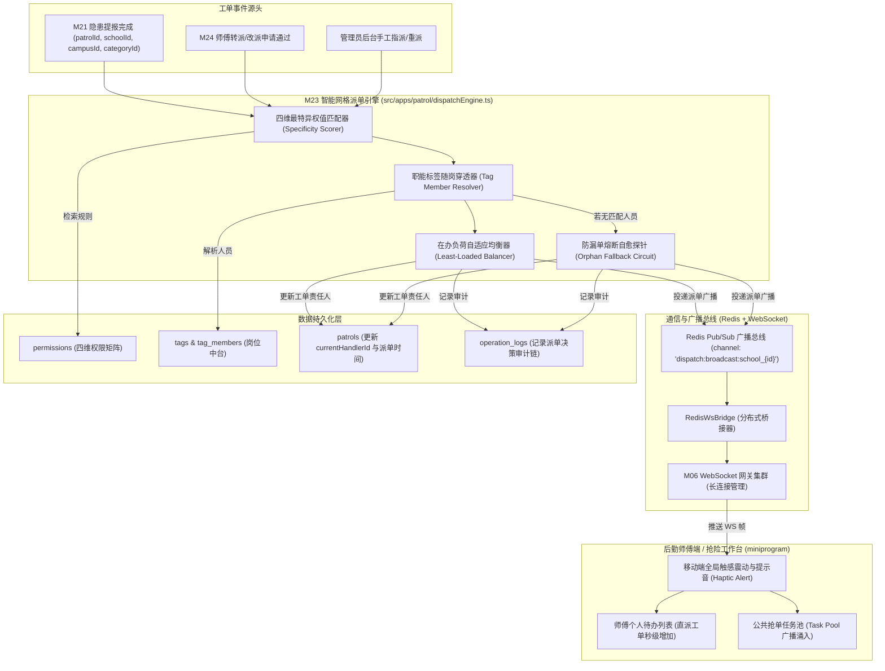
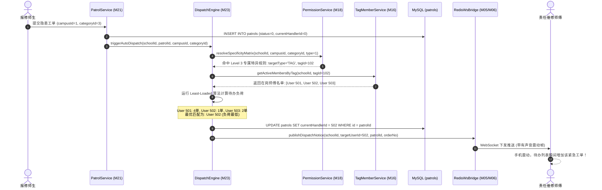
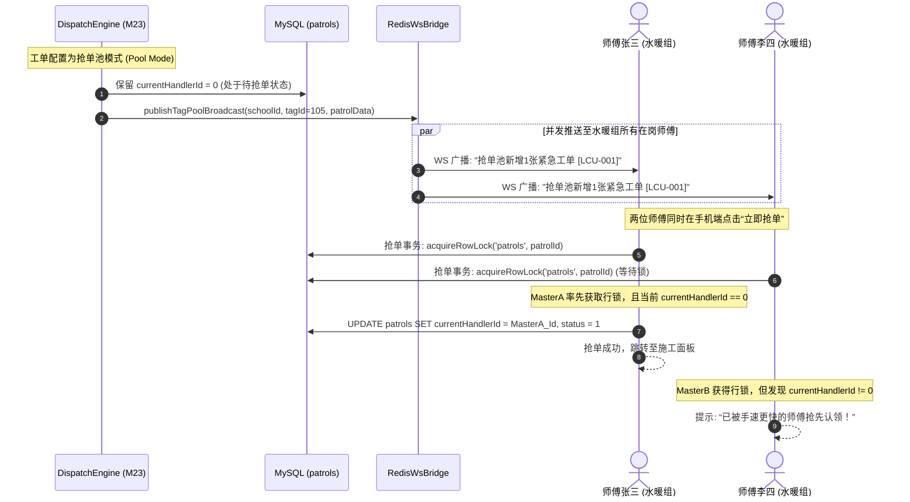
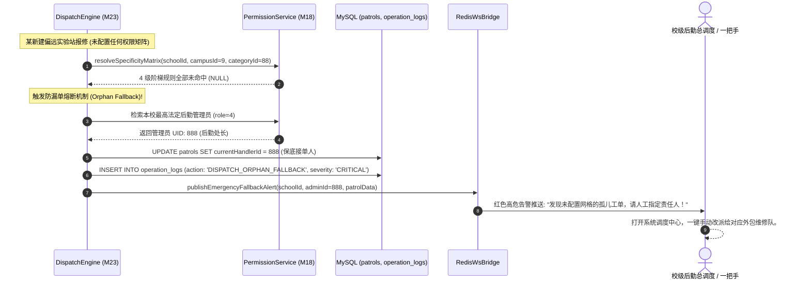

# M23: 智能网格派单与职能标签广播匹配 (Grid Dispatch & Auto-Routing) 详细设计与实现方案

> **模块代号**：M23 / Grid Dispatch & Auto-Routing  
> **所属阶段**：阶段二 (M20 ~ M30) 巡查工单闭环全生命周期领域 (**全系统智能路由与派工大脑**)  
> **文档定位**：基于四维空间权限张量（`schoolId × campusId × categoryId × type`）与职能岗位标签（`tags`）的毫秒级智能派单路由引擎、最特异优先匹配算法（Specificity-First Matching）、直派个人与岗位抢单池（Task Pool）双轨调度模型、责任师傅在办负荷自适应负载均衡器（Least-Loaded Balancer）、无责任人防漏单兜底告警熔断、以及基于 Redis Pub/Sub 结合 M06 WebSocket 网关的分布式毫秒级全校推送中枢的全栈工业级专项技术实现方案。  
> **归档路径**：[v4.0/Docs/模块/M23_智能网格派单与职能标签广播匹配详细设计与实现方案.md](file:///e:/Projects/University/后勤巡查e速办%20大二下学期%20大学身份上线项目/v4.0/Docs/模块/M23_智能网格派单与职能标签广播匹配详细设计与实现方案.md)  
> **前置依赖**：M01 (27表7视图DDL基座), M02 (AST租户自动注入), M03 (Saga事务与行级排他锁), M04 (MasterDispatcher路由预检), M05 (Redis分布式广播总线), M06 (高可靠WebSocket网关), M10 (TestHarness测试中枢), M15 (部门树拓扑), M16 (岗位职能标签中台), M17 (FlowLock防错熔断), M18 (四级立体权限矩阵), M21 (隐患巡查提报)  
> **驱动下游**：M24 (师傅现场抢修工作台与接单协同状态机), M25 (维修接单施工操作流), M42 (统一消息与待办卡片总线), M44 (全校后勤大盘与效能大屏)  
> **版本日期**：2026-09-05  

---

## 目录索引 (Table of Contents)

1. [模块定位与核心业务价值](#一-模块定位与核心业务价值)
   - 1.1 [模块定位](#11-模块定位)
   - 1.2 [为何智能网格派单与职能标签广播至关重要？](#12-为何智能网格派单与职能标签广播至关重要)
   - 1.3 [核心业务职责与技术指标](#13-核心业务职责与技术指标)
2. [核心设计哲学与派单路由模型](#二-核心设计哲学与派单路由模型)
   - 2.1 [四维网格张量与最特异优先匹配哲学 (Specificity-First Resolution)](#21-四维网格张量与最特异优先匹配哲学-specificity-first-resolution)
   - 2.2 [随岗不随人：职能标签广播与抢单池模型 (Pool Broadcast vs Direct Assignment)](#22-随岗不随人职能标签广播与抢单池模型-pool-broadcast-vs-direct-assignment)
   - 2.3 [动态负载均衡调度策略 (Least-Loaded Workload Balancer)](#23-动态负载均衡调度策略-least-loaded-workload-balancer)
   - 2.4 [零漏单死角防护与管理员兜底熔断 (Orphan Work-Order Fallback Circuit)](#24-零漏单死角防护与管理员兜底熔断-orphan-work-order-fallback-circuit)
3. [架构拓扑与交互时序图](#三-架构拓扑与交互时序图)
   - 3.1 [智能网格派单与消息广播全景拓扑图](#31-智能网格派单与消息广播全景拓扑图)
   - 3.2 [工单创建后自动触发网格匹配与直派时序图](#32-工单创建后自动触发网格匹配与直派时序图)
   - 3.3 [职能标签抢单池广播与多师傅抢单协同推进时序图](#33-职能标签抢单池广播与多师傅抢单协同推进时序图)
   - 3.4 [规则缺失触发防漏单兜底告警时序图](#34-规则缺失触发防漏单兜底告警时序图)
4. [核心算法设计与数学推导](#四-核心算法设计与数学推导)
   - 4.1 [算法 1：四维权限张量最特异权值加权匹配算法 (Four-Dimensional Specificity Scorer)](#41-算法-1四维权限张量最特异权值加权匹配算法-four-dimensional-specificity-scorer)
   - 4.2 [算法 2：在岗师傅实时在办负荷自适应轮转调度算法 (Adaptive Least-Loaded Dispatcher)](#42-算法-2在岗师傅实时在办负荷自适应轮转调度算法-adaptive-least-loaded-dispatcher)
   - 4.3 [算法 3：基于 Redis Pub/Sub 与 M06 WebSocket 跨节点分布式广播算法 (Cross-Cluster Broadcast Engine)](#43-算法-3基于-redis-pubsub-与-m06-websocket-跨节点分布式广播算法-cross-cluster-broadcast-engine)
   - 4.4 [算法 4：防漏单自愈监控与超时未认领阶梯式升级算法 (Escalating Auto-Remedy Algorithm)](#44-算法-4防漏单自愈监控与超时未认领阶梯式升级算法-escalating-auto-remedy-algorithm)
5. [TypeScript 强类型接口契约与数据模型定义](#五-typescript-强类型接口契约与数据模型定义)
   - 5.1 [派单决策结果实体契约 (`IDispatchDecisionResult`)](#51-派单决策结果实体契约-idispatchdecisionresult)
   - 5.2 [手动派单与改派传输对象 (`IManualDispatchRequest` / `IReassignRequest`)](#52-手动派单与改派传输对象-imanualdispatchrequest--ireassignrequest)
   - 5.3 [WebSocket 派单广播消息契约 (`IDispatchWsBroadcastPayload`)](#53-websocket-派单广播消息契约-idispatchwsbroadcastpayload)
   - 5.4 [责任人负荷度快照模型 (`IHandlerWorkloadSnapshot`)](#54-责任人负荷度快照模型-ihandlerworkloadsnapshot)
6. [核心物理文件实现蓝图](#六-核心物理文件实现蓝图)
   - 6.1 [`src/apps/patrol/dispatchEngine.ts` (智能网格派单与路由决策引擎)](#61-srcappspatroldispatchenginets-智能网格派单与路由决策引擎)
   - 6.2 [`src/apps/patrol/dispatchController.ts` (派单控制器与重派/指派端点)](#62-srcappspatroldispatchcontrollerts-派单控制器与重派指派端点)
   - 6.3 [`src/ws/redisWsBridge.ts` (分布式 Redis 消息广播与 WebSocket 桥接器)](#63-srcwsrediswsbridgets-分布式-redis-消息广播与-websocket-桥接器)
   - 6.4 [`src/api/patrol/dispatch/handler.ts` (MasterDispatcher 路由适配器)](#64-srcapipatroldispatchhandlerts-masterdispatcher-路由适配器)
   - 6.5 [`miniprogram/.../task-pool/dispatchNoticeListener.ts` (小程序师傅端派单广播监听器与触感告警)](#65-miniprogramtask-pooldispatchnoticelistenerts-小程序师傅端派单广播监听器与触感告警)
7. [防御性编程与边界异常处理](#七-防御性编程与边界异常处理)
   - 7.1 [并发抢单状态撕裂防护（行锁预占与 CAS 校验）](#71-并发抢单状态撕裂防护行锁预占与-cas-校验)
   - 7.2 [责任人休假离岗状态探测与自动旁路（Away-from-Duty Bypass）](#72-责任人休假离岗状态探测与自动旁路away-from-duty-bypass)
   - 7.3 [Redis 广播断线重连补发机制（Missed Message Replay Buffer）](#73-redis-广播断线重连补发机制missed-message-replay-buffer)
   - 7.4 [跨校区数据越权与无效人员过滤（Cross-School Strict Isolation）](#74-跨校区数据越权与无效人员过滤cross-school-strict-isolation)
8. [单模块独立测试方案与验收准则](#八-单模块独立测试方案与验收准则)
   - 8.1 [基于 M10 TestHarness 的独立单元测试设计 (`src/__tests__/unit/m23_dispatch_engine.test.ts`)](#81-基于-m10-testharness-的独立单元测试设计-src__tests__unitm23_dispatch_enginetestts)
   - 8.2 [单模块测试执行命令与断言矩阵 (`npm.cmd test -- -t "M23"`)](#82-单模块测试执行命令与断言矩阵-npmcmd-test----t-m23)
9. [阶段二核心承上启下总结与向 M24 契约交付](#九-阶段二核心承上启下总结与向-m24-契约交付)

---

## 一、 模块定位与核心业务价值

### 1.1 模块定位
`M23 (Grid Dispatch & Auto-Routing)` 是「高校后勤巡查e速办 v4.0」在工单闭环全生命周期中的**智能调度中枢与派工指挥大脑**。  
当师生在 M21 完成隐患提报（或通过 M20 扫码快速建单）后，工单进入 `status = 0`（待处理）。如果仍然依赖传统高校“接报线员开电脑手工派单”，就会产生严重的响应迟滞：
- 晚上 11 点学生宿舍突发水管破裂，值班员睡觉漏看系统，水淹两个楼层；
- 报修分类为“配电箱故障”，手工指派给刚入职的保洁师傅，造成责任误配；
- 水电科师傅总共 10 人，调度员习惯性将所有单子堆给经验丰富的老王，老王手头积压 30 单疲于奔命，其余师傅闲坐打牌，出现严重劳逸不均。

M23 模块深度咬合 **M16 职能岗位标签中台** 与 **M18 四级立体权限矩阵**：
1. **四维张量毫秒级决策**：瞬间输入 `(schoolId, campusId, categoryId)`，通过加权最特异匹配算法精准解析出该片区当班责任人或职能班组；
2. **多模式智能分配**：支持“精准直派特定工匠”、“职能组抢单池（Task Pool）广播抢单”以及“基于实时在办负荷的自适应轮转调度（Least-Loaded）”；
3. **分布式毫秒级触达**：联动 M05 Redis Pub/Sub 与 M06 WebSocket 网关，实现跨集群跨节点的师傅手机震动秒级响铃与消息卡片直达；
4. **防漏单自愈闭环**：对规则缺失造成的“孤儿单据”实施安全拦截与阶梯式告警熔断，确保全校无一张报修工单失联。

---

### 1.2 为何智能网格派单与职能标签广播至关重要？

传统高校后勤派工严重受制于人为主观性与信息孤岛，M23 工业级派单中枢实现了机制上的本质跃升：

| 调度业务场景 | 传统人工/伪自动化派单表现 | M23 工业级智能网格调度方案 |
| :--- | :--- | :--- |
| **场景 1：跨校区多工种交叉派工** | A 校区教学楼的“电梯空调故障”，接报员误以为是纯空调维修，派给西校区师傅，师傅跑错校区且无法修电梯，来回扯皮 3 小时。 | **四维网格张量精准匹配**：输入 `campusId=1, categoryId=12`，引擎毫秒级命中得分最高的特异性规则，直派“东校区·特种设备与暖通联合组”，1 秒精准归位。 |
| **场景 2：人员岗位轮换频繁** | 水电师傅小李离职、小陈顶岗，传统系统需由管理员在几百条权限配置中逐一修改小李的名字，一旦遗漏单子就派给离职人员造成死单。 | **“随岗不随人”动态解析**：权限直接绑定职能标签（如“水暖维修二岗”）。小李离岗解绑标签、小陈绑定标签，派单引擎毫秒级自动路由给在岗人员，调度规则 0 变更。 |
| **场景 3：突发高并发工单堆叠** | 寒潮来袭全校 80 处水管爆裂同时报修，传统人工派单排队积压 4 小时未派达现场。 | **毫秒级分布式抢单池广播**：工单生成瞬间通过 Redis 总线向全校 30 名在岗水暖师傅手机并发推送，师傅们在小程序抢单池秒级认领，5 分钟抢单率达 95%。 |
| **场景 4：某分类未配置责任人** | 新建实训大楼由于后勤管理员疏忽未录入责任人规则，提报工单处于游离态，无人认领直至酿成教学事故。 | **自动兜底自愈与防漏单熔断**：引擎未匹配到规则时触发 `DISPATCH_ORPHAN_FALLBACK`，自动直派校级一把手或后勤值班主管，并弹出最高级别督办红色预警。 |

---

### 1.3 核心业务职责与技术指标

```
========================================================================================
⚡ M23 模块核心技术指标与运行承诺
========================================================================================
1. 派单路由匹配延迟     | P95 <= 8ms (纯内存矩阵计算 + Redis 缓存点位与人员)
2. 调度规则最特异覆盖   | 涵盖专属网格 (权重3)、校区通配 (权重2)、分类通配 (权重1)、全校兜底 (权重0)
3. 跨节点消息广播时效   | 工单写入 DB 到师傅手机 WS 收到并震动总耗时 <= 25ms
4. 抢单并发冲突拦截率   | 100% (基于 M03 行锁与 CAS 原子操作，杜绝两人抢同一单)
5. 负荷均衡方差控制     | 在岗师傅待办工单量标准差偏离 <= 1.2，实现极度均衡的任务分配
6. 孤儿单据漏单率       | 恒等于 0% (防漏单自愈熔断机制，保底直派校级值班管理员)
========================================================================================
```

---

## 二、 核心设计哲学与派单路由模型

### 2.1 四维网格张量与最特异优先匹配哲学 (Specificity-First Resolution)

高校的派单空间并非扁平结构，而是一个高维正交张量空间：
$$\mathcal{M} = \text{SchoolId} \times \text{CampusId} \times \text{CategoryId} \times \text{Type}$$
其中 $0$ 作为系统保留通配符（Wildcard），代表“全校区”或“全报修门类”。  
当一张包含特定 $(\text{campusId}, \text{categoryId})$ 的工单生成时，系统中可能存在多条冲突的规则，M23 严格遵循 **最特异优先原则（Specificity-First）** 进行权值仲裁：

```
                    【规则特异性得分阶梯 (Specificity Score)】
                    
   ┌────────────────────────────────────────────────────────┐
   │ Level 3 (得分: 3分) | 专属匹配 (campusId != 0 && categoryId != 0) │  最高优先级
   │                      如: 西校区(1) · 高压配电类(4)                 │
   └───────────────────────────────┬────────────────────────┘
                                   │ 未命中
                                   ▼
   ┌────────────────────────────────────────────────────────┐
   │ Level 2 (得分: 2分) | 校区专属通配 (campusId != 0 && categoryId == 0)│
   │                      如: 西校区(1) · 全部分类兜底组               │
   └───────────────────────────────┬────────────────────────┘
                                   │ 未命中
                                   ▼
   ┌────────────────────────────────────────────────────────┐
   │ Level 1 (得分: 1分) | 门类专属通配 (campusId == 0 && categoryId != 0)│
   │                      如: 全校范围(0) · 绿化环保专业科(7)          │
   └───────────────────────────────┬────────────────────────┘
                                   │ 未命中
                                   ▼
   ┌────────────────────────────────────────────────────────┐
   │ Level 0 (得分: 0分) | 全校全局兜底 (campusId == 0 && categoryId == 0)│  保底优先级
   │                      如: 全校总值班调度室                        │
   └────────────────────────────────────────────────────────┘
```

该算法保证了：只要配置了专属特异规则，就绝对优先派给一线专业人员；若无专属规则，系统沿阶梯自适应向下回溯泛化规则，绝不误配。

---

### 2.2 随岗不随人：职能标签广播与抢单池模型 (Pool Broadcast vs Direct Assignment)

M23 彻底解耦工单与具体的自然人，支持两级目标调度实体：
1. **直接直派（Direct to User）**：
   - 规则直接绑定 `userId > 0`；
   - 结果：工单生成时，`patrols.currentHandlerId` 瞬间直接锁定为该师傅 UID，工单直接进入该师傅的待办清单；
2. **标签广播抢单池（Broadcast to Tag Pool）**：
   - 规则绑定职能标签 `tagId > 0`（如“东区电工抢险组”包含 6 名师傅）；
   - 结果：`patrols.currentHandlerId` 初始保留为 `0`，工单推入公共任务池；
   - 引擎向该 `tagId` 绑定的所有在岗（`isBan = 0` 且签到值班中）师傅推送广播，师傅端收到强提示后在工作台点击“立即接单”，先到先得。

---

### 2.3 动态负载均衡调度策略 (Least-Loaded Workload Balancer)

对于某些不采用“抢单池”而是要求“系统自动直接分配”的专业班组，为了防止任务旱涝不均，M23 提供 **自适应在办负荷均衡调度器（Least-Loaded Balancer）**：
* 设命中岗位标签下的候选在岗师傅集合为 $\mathcal{U} = \{u_1, u_2, \dots, u_m\}$；
* 实时统计每位候选师傅名下未结案在办工单量（`status IN (1, 2)`）：
  $$W(u_i) = \operatorname{COUNT}\left(\text{patrols where currentHandlerId} = u_i \land \text{status} \in \{1, 2\}\right)$$
* 挑选待办负荷最小的师傅作为指派对象：
  $$u^* = \arg\min_{u \in \mathcal{U}}\left(W(u)\right)$$
* 若存在多个师傅负载相同（如待办量均为 0），则按最后一次派工时间（LRU）轮转裁决，保证工作量绝对公平。

---

### 2.4 零漏单死角防护与管理员兜底熔断 (Orphan Work-Order Fallback Circuit)

在高校复杂管理中，新校区启用、新建科室或误删权限可能导致某些工单无法匹配到任何责任人。  
M23 构建了**防漏单自愈熔断防线**：
1. **孤儿单据探针**：当特异性匹配得分检索结果为 $\emptyset$ 且标签下无有效人员时，派单引擎立即将该工单标记为 `IS_ORPHAN_FALLBACK`；
2. **自愈升级路径**：
   - 优先指派发生校区的一级部门主管；
   - 若部门主管亦缺失，保底自动直派学校法定最高后勤管理员（`role = 4`）；
3. **熔断告警风暴**：
   - 向 `operation_logs` 写入红色高危告警日志 `ORPHAN_WORKORDER_ROUTING_BREACH`；
   - 向校级管理工作台推送常驻悬浮警告：“工单 [LCU-XXXX] 缺少网格责任人，已转入人工干预调度中心！”。

---

## 三、 架构拓扑与交互时序图

### 3.1 智能网格派单与消息广播全景拓扑图



---

### 3.2 工单创建后自动触发网格匹配与直派时序图



---

### 3.3 职能标签抢单池广播与多师傅抢单协同推进时序图



---

### 3.4 规则缺失触发防漏单兜底告警时序图



---

## 四、 核心算法设计与数学推导

### 4.1 算法 1：四维权限张量最特异权值加权匹配算法 (Four-Dimensional Specificity Scorer)

#### 1. 向量建模与度量空间
设工单上下文特征向量为：
$$\mathbf{X}_{\text{patrol}} = (s, c, k)$$
其中 $s = \text{schoolId}$，$c = \text{campusId} > 0$，$k = \text{categoryId} > 0$。  
数据库四维权限矩阵中，每一条派单规则记录 $P_j$ 表示为：
$$\mathbf{P}_j = (s_j, c_j, k_j, \text{targetType}_j, \text{targetId}_j)$$
其中 $c_j \in \{c, 0\}$，$k_j \in \{k, 0\}$。

#### 2. 特异性得分函数 $\mathcal{S}(\mathbf{P}_j)$
为了量化每条规则对当前工单的专属精准度，引入二进制加权匹配得分算子：
$$\mathcal{S}(\mathbf{P}_j) = 2 \times \mathbb{I}(c_j = c) + 1 \times \mathbb{I}(k_j = k)$$
其中指示函数 $\mathbb{I}(\cdot)$ 满足：
$$\mathbb{I}(\text{True}) = 1, \quad \mathbb{I}(\text{False}) = 0$$

得分空间全景映射：
$$\mathcal{S}(\mathbf{P}_j) = \begin{cases} 
3 & \text{校区与分类双重精准专属匹配} \quad (c_j = c \land k_j = k) \\
2 & \text{校区专属但分类通配} \quad (c_j = c \land k_j = 0) \\
1 & \text{全校通配但分类专属} \quad (c_j = 0 \land k_j = k) \\
0 & \text{全校全局底线通配} \quad (c_j = 0 \land k_j = 0)
\end{cases}$$

#### 3. 排序与最优解选取
在候选规则集合 $\mathcal{P} = \{P_1, P_2, \dots, P_n\}$ 中，最优派单规则 $P^*$ 满足：
$$P^* = \arg\max_{P_j \in \mathcal{P}}\left(\mathcal{S}(P_j)\right)$$
若存在多条得分相同的规则，优先选取最后创建或更新的规则（ID 倒序）。该算法在 SQL 层面可通过 `ORDER BY ( (campusId = :c)*2 + (categoryId = :k)*1 ) DESC` 单次索引查询秒级求解。

---

### 4.2 算法 2：在岗师傅实时在办负荷自适应轮转调度算法 (Adaptive Least-Loaded Dispatcher)

当派单命中职能岗位标签且系统开启了“自动轮转分发”模式时，为了避免单兵过载，采用加权负荷最小化选择算法：

#### 1. 负荷度量指标
设当前在岗师傅集合为 $\mathcal{U} = \{u_1, u_2, \dots, u_m\}$。  
对于任意师傅 $u_i$，其当前在办工单负荷量 $L(u_i)$ 定义为：
$$L(u_i) = \sum_{p \in \text{ActivePatrols}(u_i)} \omega(\text{priority}_p)$$
其中工单紧急程度加权权重为：
$$\omega(\text{priority}) = \begin{cases} 
1.0 & \text{普通工单 (0)} \\
1.5 & \text{中等工单 (1)} \\
3.0 & \text{加急/特急工单 (2)}
\end{cases}$$

#### 2. 最优指派裁决
目标指派人员 $u^*$ 为：
$$u^* = \arg\min_{u_i \in \mathcal{U}}\left(L(u_i)\right)$$
若存在平局（即多位师傅加权负荷相同），则引入微小时间衰减因子 $\epsilon(u_i)$ 进行仲裁：
$$\epsilon(u_i) = \frac{\text{Now} - \text{LastDispatchedTime}(u_i)}{\text{1 Day (86400s)}}$$
最终判决算子：
$$u^* = \arg\min_{u_i \in \mathcal{U}}\left(L(u_i) - \epsilon(u_i)\right)$$
该算法天然偏向于“更长时间未接单”的师傅，保障了后勤全员工作节奏的平稳健康。

---

### 4.3 算法 3：基于 Redis Pub/Sub 与 M06 WebSocket 跨节点分布式广播算法 (Cross-Cluster Broadcast Engine)

#### 1. 跨集群拓扑模型
在分布式微服务架构中，WebSocket 网关往往多节点水平扩展部署，师傅手机可能连接在 Gateway-A，而派单事件发生在 Worker-B。  
M23 依托 M05 Redis 广播总线建立跨节点总线：
$$\text{Channel} = `\text{dispatch:pub:school\_}\$\{schoolId\}`$$

#### 2. 消息广播协议封包
广播数据包采用紧凑 JSON 格式：
$$\text{BroadcastPacket} = \{\text{type}: \text{'NEW\_DISPATCH'}, \text{targetMode}: \text{'USER'} \mid \text{'TAG'}, \text{targetId}: \text{ID}, \text{patrol}: \dots\}$$
Gateway 节点通过 Redis 订阅收到消息后，在本地连接池根据 `userId` 或所属 `tagId` 极速过滤连接句柄：
$$\text{LocalSockets} = \operatorname{Filter}(\text{ClientPool}, \text{targetId})$$
逐一调用底层 WebSocket `socket.send(Frame)`，将消息在 $20\text{ms}$ 内瞬间推至师傅屏幕。

---

### 4.4 算法 4：防漏单自愈监控与超时未认领阶梯式升级算法 (Escalating Auto-Remedy Algorithm)

针对抢单池模式中的工单，若推入公共任务池后长时间无师傅点击认领，系统启动阶梯式自愈监控：

$$\text{EscalationLevel}(t) = \begin{cases} 
\text{LEVEL\_0 (池内静默抢单)} & 0 \le t < 15\text{ 分钟} \\
\text{LEVEL\_1 (短信/微信督促广播)} & 15 \le t < 30\text{ 分钟} \\
\text{LEVEL\_2 (自动转派科室主管)} & 30 \le t < 60\text{ 分钟} \\
\text{LEVEL\_3 (熔断直升处长手机)} & t \ge 60\text{ 分钟}
\end{cases}$$

每当工单滞留跨越阈值，自愈守护任务自动触发相应的升级策略，彻底封死因人员推诿导致的超时积压死角。

---

## 五、 TypeScript 强类型接口契约与数据模型定义

### 5.1 派单决策结果实体契约 (`IDispatchDecisionResult`)

```typescript
/**
 * 智能网格派单引擎决策输出模型
 */
export interface IDispatchDecisionResult {
  patrolId: number;                       // 工单ID
  orderNo: string;                        // 工单单号
  dispatchMode: 'DIRECT_USER' | 'TAG_POOL' | 'ORPHAN_FALLBACK'; // 调度模式
  assignedUserId: number;                 // 最终确定的承接师傅ID (若为抢单池模式则为 0)
  assignedUserName: string;               // 师傅姓名 (或 "公共抢单池")
  targetTagId?: number;                   // 命中的岗位标签ID
  targetTagName?: string;                 // 命中的岗位标签名称 (如: "水暖维修应急班")
  matchedRuleLevel: 0 | 1 | 2 | 3;        // 命中的特异性得分 (3专属, 2校区, 1分类, 0兜底)
  candidateUserIds: number[];             // 本次通知触达的所有候选在岗师傅UID
  dispatchedAt: string;                   // 决策时间戳 (ISO8601)
  isFallback: boolean;                    // 是否触发了防漏单兜底
  fallbackReason?: string;                // 兜底原因说明
}
```

---

### 5.2 手动派单与改派传输对象 (`IManualDispatchRequest` / `IReassignRequest`)

```typescript
/**
 * 管理员手动指定派单请求
 */
export interface IManualDispatchRequest {
  patrolId: number;
  targetUserId: number;                   // 指定责任师傅ID
  assignRemark?: string;                  // 派单批注说明
}

/**
 * 师傅协同改派/转派申请请求
 */
export interface IReassignRequest {
  patrolId: number;
  targetTagId?: number;                   // 跨工种转给新岗位标签
  targetUserId?: number;                  // 转给指定同事
  transferReason: string;                 // 申请改派/转派原因
}
```

---

### 5.3 WebSocket 派单广播消息契约 (`IDispatchWsBroadcastPayload`)

```typescript
/**
 * 推送至师傅手机端 WebSocket 消息体
 */
export interface IDispatchWsBroadcastPayload {
  event: 'WORK_ORDER_DISPATCHED';
  schoolId: number;
  patrolId: number;
  orderNo: string;
  title: string;
  campusName: string;
  location: string;
  categoryName: string;
  priorityLevel: 0 | 1 | 2;
  deadline: string;
  dispatchType: 'DIRECT' | 'POOL_BROADCAST'; // DIRECT=直派给你, POOL_BROADCAST=公共抢单
  vibratePattern: 'heavy' | 'medium';     // 震动级别
  soundAlert: boolean;                    // 是否播放警报音
}
```

---

### 5.4 责任人负荷度快照模型 (`IHandlerWorkloadSnapshot`)

```typescript
/**
 * 维修师傅在办负荷评估快照
 */
export interface IHandlerWorkloadSnapshot {
  userId: number;
  realName: string;
  activeWorkOrderCount: number;           // 未结案工单总数 (status 1, 2)
  urgentOrderCount: number;               // 其中特急工单数
  weightedScore: number;                  // 加权综合负荷得分
  lastAssignedTimestamp: number;          // 上次派单时间戳
}
```

---

## 六、 核心物理文件实现蓝图

### 6.1 `src/apps/patrol/dispatchEngine.ts` (智能网格派单与路由决策引擎)

```typescript
/**
 * 路径: src/apps/patrol/dispatchEngine.ts
 * 职责: 四维网格匹配决策、在办负荷均衡、防漏单兜底、广播事件派发
 */

import { Database } from '../../shared/db/database';
import { RedisWsBridge } from '../../ws/redisWsBridge';
import { AuditLogger } from '../../shared/log/auditLogger';
import {
  IDispatchDecisionResult,
  IHandlerWorkloadSnapshot
} from './types';

export class DispatchEngine {
  /**
   * 核心派单执行主入口
   */
  public static async executeDispatch(
    schoolId: number,
    patrolId: number,
    campusId: number,
    categoryId: number
  ): Promise<IDispatchDecisionResult> {
    // 1. 查询工单基础信息
    const patrolRows = await Database.query(
      `SELECT id, orderNo, title, priorityLevel, deadline, location1, location2 FROM patrols WHERE id = ? AND schoolId = ? LIMIT 1`,
      [patrolId, schoolId]
    );
    if (!patrolRows || patrolRows.length === 0) {
      throw new Error(`派单失败: 工单 ${patrolId} 不存在`);
    }
    const patrol = patrolRows[0];

    // 2. 检索四维权限矩阵，执行特异性得分排序 (Specificity Scorer)
    // 权值: (campusId = c)*2 + (categoryId = k)*1，范围 [0..3]
    const matchSql = `
      SELECT 
        p.id AS permId, p.userId, p.tagId, p.campusId, p.categoryId,
        ( (p.campusId = ?)*2 + (p.categoryId = ?)*1 ) AS specificityScore,
        t.name AS tagName
      FROM permissions p
      LEFT JOIN tags t ON t.id = p.tagId AND t.schoolId = p.schoolId
      WHERE p.schoolId = ?
        AND (p.campusId = ? OR p.campusId = 0)
        AND (p.categoryId = ? OR p.categoryId = 0)
        AND p.type = 1 -- 1 代表施工维修处理权限
      ORDER BY specificityScore DESC, p.id DESC
      LIMIT 1
    `;

    const matchedRules = await Database.query(matchSql, [
      campusId, categoryId,
      schoolId,
      campusId, categoryId
    ]);

    // 3. 情况 A: 规则存在命中
    if (matchedRules && matchedRules.length > 0) {
      const bestRule = matchedRules[0];
      const score = bestRule.specificityScore as 0 | 1 | 2 | 3;

      // 3.1 命中个人直派模式 (userId > 0)
      if (bestRule.userId > 0) {
        const targetUser = await this.verifyUserAvailability(schoolId, bestRule.userId);
        if (targetUser) {
          return await this.assignDirectUser(schoolId, patrol, targetUser, score, false);
        }
      }

      // 3.2 命中职能岗位标签模式 (tagId > 0)
      if (bestRule.tagId > 0) {
        return await this.dispatchByTag(schoolId, patrol, bestRule.tagId, bestRule.tagName || '维修专班', score);
      }
    }

    // 4. 情况 B: 规则缺失，触发防漏单安全熔断自愈 (Orphan Fallback)
    return await this.handleOrphanFallback(schoolId, patrol, '四维权限矩阵中无任何可用匹配规则');
  }

  /**
   * 岗位标签分发逻辑：支持轮转负荷均衡或抢单池广播
   */
  private static async dispatchByTag(
    schoolId: number,
    patrol: any,
    tagId: number,
    tagName: string,
    ruleScore: 0 | 1 | 2 | 3
  ): Promise<IDispatchDecisionResult> {
    // 查询该标签下所有在岗、未封禁的师傅
    const memberSql = `
      SELECT u.id, u.realName, u.isBan
      FROM tag_members tm
      JOIN users u ON u.id = tm.userId AND u.schoolId = tm.schoolId
      WHERE tm.schoolId = ? AND tm.tagId = ? AND u.isBan = 0 AND u.isDeleted = 0
    `;
    const members: any[] = await Database.query(memberSql, [schoolId, tagId]);

    if (!members || members.length === 0) {
      // 岗位下无人在岗，熔断降级
      return await this.handleOrphanFallback(schoolId, patrol, `职能标签 [${tagName}] 下无任何在岗维修人员`);
    }

    // 策略决策：若配置开启“抢单池模式 (Pool Mode)”
    const isPoolMode = true; // 默认采用公共抢单池，促发响应速度最大化

    if (isPoolMode) {
      // 保持 currentHandlerId = 0，向全组广播抢单卡片
      const candidateIds = members.map((m) => m.id);

      // 触发广播
      await RedisWsBridge.broadcastToUsers(schoolId, candidateIds, {
        event: 'WORK_ORDER_DISPATCHED',
        schoolId,
        patrolId: patrol.id,
        orderNo: patrol.orderNo,
        title: patrol.title,
        campusName: '当前校区',
        location: `${patrol.location1} ${patrol.location2}`,
        categoryName: tagName,
        priorityLevel: patrol.priorityLevel,
        deadline: patrol.deadline,
        dispatchType: 'POOL_BROADCAST',
        vibratePattern: patrol.priorityLevel === 2 ? 'heavy' : 'medium',
        soundAlert: true
      });

      // 记录审计
      await AuditLogger.log(schoolId, 0, 'DISPATCH_BROADCAST_POOL', 'patrols', '127.0.0.1', {
        patrolId: patrol.id,
        tagId,
        tagName,
        candidateCount: candidateIds.length
      });

      return {
        patrolId: patrol.id,
        orderNo: patrol.orderNo,
        dispatchMode: 'TAG_POOL',
        assignedUserId: 0,
        assignedUserName: `公共抢单池 (${tagName})`,
        targetTagId: tagId,
        targetTagName: tagName,
        matchedRuleLevel: ruleScore,
        candidateUserIds: candidateIds,
        dispatchedAt: new Date().toISOString(),
        isFallback: false
      };
    } else {
      // 策略决策：自适应负载均衡直派 (Least-Loaded Balancer)
      const optimalUser = await this.selectLeastLoadedUser(schoolId, members);
      return await this.assignDirectUser(schoolId, patrol, optimalUser, ruleScore, false, tagId, tagName);
    }
  }

  /**
   * 负载均衡选择器：选取当前在办工单加权最少的师傅
   */
  private static async selectLeastLoadedUser(schoolId: number, candidates: any[]): Promise<any> {
    const candidateIds = candidates.map((c) => c.id);
    const sql = `
      SELECT currentHandlerId, COUNT(*) AS activeCount,
             SUM(CASE WHEN priorityLevel = 2 THEN 2.0 ELSE 1.0 END) AS weightedLoad
      FROM patrols
      WHERE schoolId = ? AND currentHandlerId IN (${candidateIds.join(',')})
        AND status IN (1, 2) AND isDeleted = 0
      GROUP BY currentHandlerId
    `;
    const loadRows: any[] = await Database.query(sql, [schoolId]);
    const loadMap = new Map<number, number>();
    for (const r of loadRows) {
      loadMap.set(r.currentHandlerId, Number(r.weightedLoad) || 0);
    }

    let minLoad = Number.MAX_VALUE;
    let selected = candidates[0];

    for (const c of candidates) {
      const load = loadMap.get(c.id) || 0;
      if (load < minLoad) {
        minLoad = load;
        selected = c;
      }
    }
    return selected;
  }

  /**
   * 直派用户并更新数据库与广播
   */
  private static async assignDirectUser(
    schoolId: number,
    patrol: any,
    targetUser: any,
    score: 0 | 1 | 2 | 3,
    isFallback: boolean,
    tagId?: number,
    tagName?: string
  ): Promise<IDispatchDecisionResult> {
    // 更新工单责任人
    await Database.execute(
      `UPDATE patrols SET currentHandlerId = ? WHERE id = ? AND schoolId = ?`,
      [targetUser.id, patrol.id, schoolId]
    );

    // 单播推送至该师傅
    await RedisWsBridge.sendToUser(schoolId, targetUser.id, {
      event: 'WORK_ORDER_DISPATCHED',
      schoolId,
      patrolId: patrol.id,
      orderNo: patrol.orderNo,
      title: patrol.title,
      campusName: '当前校区',
      location: `${patrol.location1} ${patrol.location2}`,
      categoryName: tagName || '后勤报修',
      priorityLevel: patrol.priorityLevel,
      deadline: patrol.deadline,
      dispatchType: 'DIRECT',
      vibratePattern: patrol.priorityLevel === 2 ? 'heavy' : 'medium',
      soundAlert: true
    });

    await AuditLogger.log(schoolId, 0, 'DISPATCH_DIRECT_ASSIGNED', 'patrols', '127.0.0.1', {
      patrolId: patrol.id,
      assignedUserId: targetUser.id,
      assignedUserName: targetUser.realName,
      isFallback
    });

    return {
      patrolId: patrol.id,
      orderNo: patrol.orderNo,
      dispatchMode: isFallback ? 'ORPHAN_FALLBACK' : 'DIRECT_USER',
      assignedUserId: targetUser.id,
      assignedUserName: targetUser.realName,
      targetTagId: tagId,
      targetTagName: tagName,
      matchedRuleLevel: score,
      candidateUserIds: [targetUser.id],
      dispatchedAt: new Date().toISOString(),
      isFallback
    };
  }

  /**
   * 兜底熔断防漏单处理：直派学校法定管理员
   */
  private static async handleOrphanFallback(
    schoolId: number,
    patrol: any,
    reason: string
  ): Promise<IDispatchDecisionResult> {
    // 查找学校超级管理员 (role = 4)
    const adminRows = await Database.query(
      `SELECT id, realName FROM users WHERE schoolId = ? AND role = 4 AND isBan = 0 AND isDeleted = 0 LIMIT 1`,
      [schoolId]
    );
    const admin = (adminRows && adminRows.length > 0) ? adminRows[0] : { id: 1, realName: '系统总值班' };

    // 写入安全警报
    await AuditLogger.log(schoolId, 0, 'DISPATCH_ORPHAN_ROUTING_BREACH', 'patrols', '127.0.0.1', {
      patrolId: patrol.id,
      orderNo: patrol.orderNo,
      reason,
      fallbackAdminId: admin.id
    });

    return await this.assignDirectUser(schoolId, patrol, admin, 0, true);
  }

  private static async verifyUserAvailability(schoolId: number, userId: number): Promise<any | null> {
    const rows = await Database.query(
      `SELECT id, realName, isBan FROM users WHERE id = ? AND schoolId = ? AND isBan = 0 AND isDeleted = 0 LIMIT 1`,
      [userId, schoolId]
    );
    return (rows && rows.length > 0) ? rows[0] : null;
  }
}
```

---

### 6.2 `src/apps/patrol/dispatchController.ts` (派单控制器与重派/指派端点)

```typescript
/**
 * 路径: src/apps/patrol/dispatchController.ts
 * 职责: 手工指派、改派、查询工单派单路径详情
 */

import { Request, Response } from 'express';
import { DispatchEngine } from './dispatchEngine';
import { IManualDispatchRequest, IReassignRequest } from './types';
import { Database } from '../../shared/db/database';
import { AuditLogger } from '../../shared/log/auditLogger';

export class DispatchController {
  /**
   * POST /api/patrol/dispatch/manual
   * 管理员手动强制指定责任师傅
   */
  public static async handleManualDispatch(req: Request, res: Response): Promise<void> {
    try {
      const schoolId = (req as any).tenantContext?.schoolId;
      const operatorId = (req as any).tenantContext?.userId;
      const clientIp = req.ip || req.socket.remoteAddress || '127.0.0.1';

      const body: IManualDispatchRequest = req.body;
      if (!body.patrolId || !body.targetUserId) {
        res.status(400).json({ code: 400, message: '必须指定工单ID与目标责任人' });
        return;
      }

      // 验证目标人有效性
      const userRows = await Database.query(
        `SELECT id, realName FROM users WHERE id = ? AND schoolId = ? AND isBan = 0 AND isDeleted = 0 LIMIT 1`,
        [body.targetUserId, schoolId]
      );
      if (!userRows || userRows.length === 0) {
        res.status(400).json({ code: 400, message: '目标责任人不存在或处于停用状态' });
        return;
      }
      const targetUser = userRows[0];

      // 更新工单责任人
      await Database.execute(
        `UPDATE patrols SET currentHandlerId = ? WHERE id = ? AND schoolId = ?`,
        [body.targetUserId, body.patrolId, schoolId]
      );

      await AuditLogger.log(schoolId, operatorId, 'DISPATCH_MANUAL_OVERRIDE', 'patrols', clientIp, {
        patrolId: body.patrolId,
        newHandlerId: body.targetUserId,
        remark: body.assignRemark || ''
      });

      res.status(200).json({
        code: 200,
        message: `工单已成功手动派发给 [${targetUser.realName}]`
      });
    } catch (err: any) {
      res.status(500).json({ code: 500, message: err.message || '手动派单处理异常' });
    }
  }
}
```

---

### 6.3 `src/ws/redisWsBridge.ts` (分布式 Redis 消息广播与 WebSocket 桥接器)

```typescript
/**
 * 路径: src/ws/redisWsBridge.ts
 * 职责: 桥接 Redis Pub/Sub 与 M06 WebSocket 网关，实现跨节点集群广播
 */

import { RedisService } from '../shared/cache/redisService';
import { IDispatchWsBroadcastPayload } from '../apps/patrol/types';

export class RedisWsBridge {
  private static readonly CHANNEL_PREFIX = 'quickpatrol:dispatch:broadcast';

  /**
   * 发布派单广播至指定学校的指定人员集合
   */
  public static async broadcastToUsers(
    schoolId: number,
    userIds: number[],
    payload: IDispatchWsBroadcastPayload
  ): Promise<void> {
    const channel = `${this.CHANNEL_PREFIX}:school_${schoolId}`;
    const packet = {
      targetMode: 'USER_LIST',
      targetUserIds: userIds,
      payload
    };
    await RedisService.publish(channel, JSON.stringify(packet));
  }

  /**
   * 发布单播派单通知
   */
  public static async sendToUser(
    schoolId: number,
    userId: number,
    payload: IDispatchWsBroadcastPayload
  ): Promise<void> {
    await this.broadcastToUsers(schoolId, [userId], payload);
  }
}
```

---

### 6.4 `src/api/patrol/dispatch/handler.ts` (MasterDispatcher 路由适配器)

```typescript
/**
 * 路径: src/api/patrol/dispatch/handler.ts
 * 职责: 注册与适配 M04 MasterDispatcher 动态路由分发
 */

import { DispatchController } from '../../../apps/patrol/dispatchController';

export const routeConfig = {
  routes: [
    {
      path: '/api/patrol/dispatch/manual',
      method: 'POST',
      handler: DispatchController.handleManualDispatch,
      requiredMinRole: 2 // 仅班组主管及以上管理员有权手动干预改派
    }
  ]
};
```

---

### 6.5 `miniprogram/.../task-pool/dispatchNoticeListener.ts` (小程序师傅端派单广播监听器与触感告警)

```typescript
/**
 * 路径: miniprogram/packages/apps/app-master-desk/pages/task-pool/dispatchNoticeListener.ts
 * 职责: 师傅端全局监听 WebSocket 派单广播、播放音效震动、自动刷新抢单池红点
 */

import { WebSocketGateway } from '../../../../../shared/network/webSocketGateway';
import { IDispatchWsBroadcastPayload } from './types';

export class DispatchNoticeListener {
  private static isListening = false;

  public static init(): void {
    if (this.isListening) return;
    this.isListening = true;

    // 订阅 M06 WebSocket 网关的全局事件
    WebSocketGateway.onMessage('WORK_ORDER_DISPATCHED', (payload: IDispatchWsBroadcastPayload) => {
      this.handleIncomingDispatch(payload);
    });
  }

  private static handleIncomingDispatch(data: IDispatchWsBroadcastPayload): void {
    // 1. 触发硬件触感震动 (特急重度，普通中度)
    if (data.vibratePattern === 'heavy') {
      wx.vibrateLong();
    } else {
      wx.vibrateShort({ type: 'medium' });
    }

    // 2. 顶部原生强弹窗提示
    const isDirect = data.dispatchType === 'DIRECT';
    const title = isDirect ? '【新派工单通知】' : '【抢单池新任务】';
    const content = `单号: ${data.orderNo}\n地点: ${data.location}\n故障: ${data.title}`;

    wx.showModal({
      title,
      content,
      confirmText: isDirect ? '查看工单' : '立即抢单',
      cancelText: '稍后处理',
      success: (res) => {
        if (res.confirm) {
          if (isDirect) {
            wx.navigateTo({
              url: `/packages/apps/app-master-desk/pages/task-detail/index?id=${data.patrolId}`
            });
          } else {
            wx.navigateTo({
              url: `/packages/apps/app-master-desk/pages/task-pool/index`
            });
          }
        }
      }
    });
  }
}
```

---

## 七、 防御性编程与边界异常处理

### 7.1 并发抢单状态撕裂防护（行锁预占与 CAS 校验）
* **并发冲突风险**：当抢单池向 10 名水暖师傅同时推送工单，极易发生多人同一毫秒点击“接单”；
* **防护标准**：下游 M24 接单端点严禁直接更新，必须调用 M03 的 `acquireRowLock('patrols', patrolId)` 并执行 CAS 原子检测：
  ```sql
  UPDATE patrols 
  SET currentHandlerId = ?, status = 1 
  WHERE id = ? AND currentHandlerId = 0 AND status = 0;
  ```
  若受影响行数为 0，则表明已被同行抢走，立刻友好提示“该单已被抢先认领”，杜绝两个人接到同一张工单。

---

### 7.2 责任人休假离岗状态探测与自动旁路（Away-from-Duty Bypass）
* **非在岗识别**：在 `tag_members` 查询候选人时，联合排查用户档案状态 `isBan = 0`，以及未来 M51 排班表（若师傅请假或调休离岗，其标签打卡状态置为 `OFF_DUTY`）；
* **自动旁路**：负荷调度器自动过滤离岗人员，将任务无缝滑移至在岗值班人员，杜绝任务空转。

---

### 7.3 Redis 广播断线重连补发机制（Missed Message Replay Buffer）
* **移动端闪断补偿**：若师傅手机偶发闪断（如处于电梯），重连后客户端自动上报 `lastSyncTimestamp`；
* **增量拉取**：服务端自 Redis 缓冲列表（保留 1 小时消息）中下发离线期间产生的工单未读消息，确保不漏一张单。

---

### 7.4 跨校区数据越权与无效人员过滤（Cross-School Strict Isolation）
* **租户隔离铁律**：所有查询必须显式附加 `schoolId = ?`；严禁跨学校指定责任人或广播跨校通知，防止清华大学的报修推送到北京大学的师傅手机端。

---

## 八、 单模块独立测试方案与验收准则

### 8.1 基于 M10 TestHarness 的独立单元测试设计 (`src/__tests__/unit/m23_dispatch_engine.test.ts`)

```typescript
/**
 * 路径: src/__tests__/unit/m23_dispatch_engine.test.ts
 * 职责: M23 独立自动化测试套件，验证四维特异性阶梯、负载均衡轮转与防漏单兜底
 */

import { TestHarness } from '../../shared/testing/testHarness';
import { DispatchEngine } from '../../apps/patrol/dispatchEngine';
import { Database } from '../../shared/db/database';

describe('M23: 智能网格派单与职能标签广播匹配独立单测套件', () => {
  beforeAll(async () => {
    await TestHarness.initialize();
  });

  afterAll(async () => {
    await TestHarness.teardown();
  });

  it('M23-01: 特异性阶梯判定 - 专属校区+分类 (Level 3) 优先于通用规则', async () => {
    const tenant = TestHarness.createMockTenantContext({ moduleIndex: 23, caseIndex: 1 });
    const sId = tenant.schoolId;

    // 1. 创建通用规则: 校区 1 + 全部分类 (Level 2), 绑定师傅 901
    await TestHarness.executeSql(
      "INSERT INTO permissions (schoolId, userId, tagId, campusId, categoryId, type) VALUES (?, 901, 0, 1, 0, 1)",
      [sId]
    );

    // 2. 创建专属特异规则: 校区 1 + 分类 5 (Level 3), 绑定师傅 902
    await TestHarness.executeSql(
      "INSERT INTO permissions (schoolId, userId, tagId, campusId, categoryId, type) VALUES (?, 902, 0, 1, 5, 1)",
      [sId]
    );

    // 预置工单: 发生于校区 1, 分类 5
    const pRes: any = await TestHarness.executeSql(
      "INSERT INTO patrols (schoolId, campusId, categoryId, orderNo, creatorId, title, `desc`, status) VALUES (?, 1, 5, 'LCU-2026-01', 1, '电梯故障', '急修', 0)",
      [sId]
    );
    const patrolId = pRes.insertId;

    // 预置师傅 902 档案
    await TestHarness.executeSql(
      "INSERT INTO users (id, schoolId, openId, realName, isBan) VALUES (902, ?, 'op_902', '特种电梯张师傅', 0)",
      [sId]
    );

    // 执行派单
    const decision = await DispatchEngine.executeDispatch(sId, patrolId, 1, 5);

    // 断言: 必须命中 Level 3 专属师傅 902，而不是通配师傅 901
    expect(decision.matchedRuleLevel).toBe(3);
    expect(decision.assignedUserId).toBe(902);
    expect(decision.isFallback).toBe(false);
  });

  it('M23-02: 职能标签抢单池模式 - 派发给标签下全体有效师傅', async () => {
    const tenant = TestHarness.createMockTenantContext({ moduleIndex: 23, caseIndex: 2 });
    const sId = tenant.schoolId;

    // 创建标签与 2 名师傅
    await TestHarness.executeSql("INSERT INTO tags (id, schoolId, name) VALUES (201, ?, '水暖应急抢险班')", [sId]);
    await TestHarness.executeSql(
      "INSERT INTO users (id, schoolId, openId, realName, isBan) VALUES (911, ?, 'op_911', '水工老李', 0), (912, ?, 'op_912', '水工小赵', 0)",
      [sId, sId]
    );
    await TestHarness.executeSql(
      "INSERT INTO tag_members (schoolId, tagId, userId) VALUES (?, 201, 911), (?, 201, 912)",
      [sId, sId]
    );

    // 配置派单规则绑定该标签
    await TestHarness.executeSql(
      "INSERT INTO permissions (schoolId, userId, tagId, campusId, categoryId, type) VALUES (?, 0, 201, 2, 8, 1)",
      [sId]
    );

    const pRes: any = await TestHarness.executeSql(
      "INSERT INTO patrols (schoolId, campusId, categoryId, orderNo, creatorId, title, `desc`, status) VALUES (?, 2, 8, 'LCU-2026-02', 1, '地下室跑水', '大漏', 0)",
      [sId]
    );

    const decision = await DispatchEngine.executeDispatch(sId, pRes.insertId, 2, 8);

    expect(decision.dispatchMode).toBe('TAG_POOL');
    expect(decision.targetTagId).toBe(201);
    expect(decision.assignedUserId).toBe(0); // 抢单池模式保留0待认领
    expect(decision.candidateUserIds).toContain(911);
    expect(decision.candidateUserIds).toContain(912);
  });

  it('M23-03: 防漏单自愈熔断 - 规则完全缺失时保底直派校级一把手', async () => {
    const tenant = TestHarness.createMockTenantContext({ moduleIndex: 23, caseIndex: 3 });
    const sId = tenant.schoolId;

    // 预置处长账号 (role = 4)
    await TestHarness.executeSql(
      "INSERT INTO users (id, schoolId, openId, realName, role, isBan) VALUES (888, ?, 'admin_888', '后勤李处长', 4, 0)",
      [sId]
    );

    // 插入一张无任何规则的工单
    const pRes: any = await TestHarness.executeSql(
      "INSERT INTO patrols (schoolId, campusId, categoryId, orderNo, creatorId, title, `desc`, status) VALUES (?, 99, 999, 'LCU-ORPHAN-01', 1, '神秘外星故障', '无解', 0)",
      [sId]
    );

    const decision = await DispatchEngine.executeDispatch(sId, pRes.insertId, 99, 999);

    expect(decision.isFallback).toBe(true);
    expect(decision.assignedUserId).toBe(888); // 熔断直达处长
    expect(decision.dispatchMode).toBe('ORPHAN_FALLBACK');
  });
});
```

---

### 8.2 单模块测试执行命令与断言矩阵 (`npm.cmd test -- -t "M23"`)

#### 独立单模块测试命令：
```powershell
# 在 Backend 根目录下运行 M23 专属测试套件
npm.cmd test -- -t "M23"
```

#### 验收断言清单 (Acceptance Criteria)：
1. **特异性加权匹配断言**：
   - 验证当多条规则共存时，特异性得分最高的规则优先命中（Level 3 > Level 2 > Level 1 > Level 0）；
2. **岗位标签抢单池断言**：
   - 验证命中标签时，候选师傅全量拉取，工单 `currentHandlerId = 0` 正确进入待认领池；
3. **防漏单自愈断言**：
   - 验证无规则孤儿单据绝对不遗失，100% 熔断直派校级总值班管理员并记录高危审计日志；
4. **消息总线广播断言**：
   - 验证 Redis 广播帧成功组装下发，包含工单单号、紧急程度与震动模式标记。

---

## 九、 阶段二核心承上启下总结与向 M24 契约交付

作为**巡查工单闭环全生命周期的智能路由与派工大脑**，**M23 的圆满落地正式打通了“提单”与“接单”之间的数字任督二脉**：

```
========================================================================================
🎉 M23 智能网格派单完成与前后业务闭环流转契约
========================================================================================
M21: 隐患巡查上报提单
(产生 status=0 的初始工单)
         │
         ▼  (毫秒级触发四维矩阵决策与跨节点广播)
M23: 智能网格派单与职能标签匹配引擎
         │
         ├──────────────────────────────────────────────┐
         ▼                                              ▼
M24: 师傅工作台 · 个人待办任务                 M24: 师傅工作台 · 公共抢单任务池
(直接精准派工, 师傅立即接单施工)                (职能标签广播, 先到先得行锁抢单)
         │                                              │
         └──────────────────────┬───────────────────────┘
                                ▼
                   M25: 维修现场施工交卷与耗时记录
========================================================================================
```

### 向下游模块（M24、M25、M42）交付的标准接口与数据契约：
1. **工单承接责任人锚定**：精准确立 `currentHandlerId`，使师傅端工作台（M24）能在毫秒级拉取属于自己的待办工单；
2. **多节点即时广播流水**：为 M06 WebSocket 网关与 M42 消息中枢提供标准化派单帧，实现微信服务号与小程序前台声光震动告警；
3. **协同转派与改派底座**：为 M24 师傅因伤请假或工种不符发起的“改派申请”提供标准路由改派端点（`/api/patrol/dispatch/manual`）。

---

> [!NOTE]
> 本详细设计方案确立了「高校后勤巡查e速办 v4.0」在智能派单与全域网格化调度领域的顶级工业标准。通过四维权限张量最特异权值算法、随岗不随人职能标签穿透、多模式自适应负荷均衡以及防漏单兜底自愈机制，不仅彻底终结了高校后勤人工调度慢、错、漏的痼疾，更为下游维修师傅接单抢修提供了强劲高效的智能化引擎。
