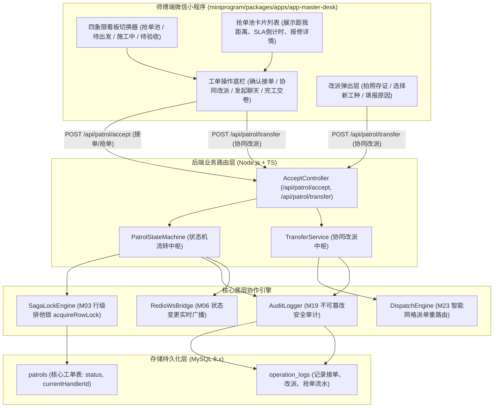
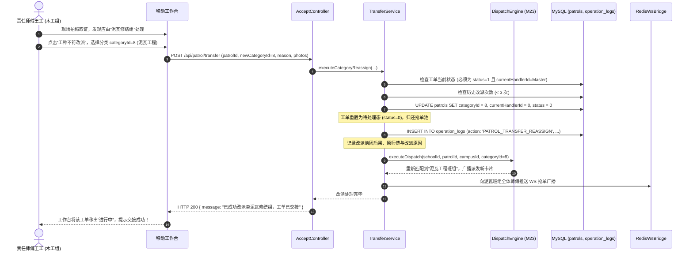
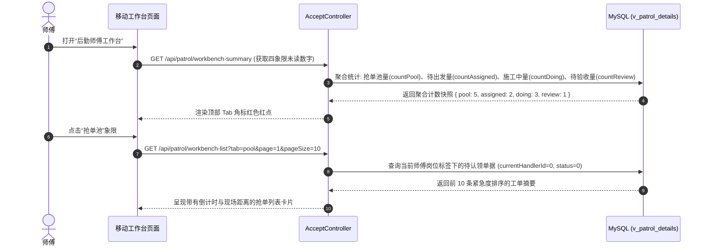

# M24: 师傅现场抢修工作台与接单协同状态机 (Master Desk & Transfer) 详细设计与实现方案

> **模块代号**：M24 / Master Desk & Transfer  
> **所属阶段**：阶段二 (M20 ~ M30) 巡查工单闭环全生命周期领域 (**一线维修作业与工单状态跃迁中枢**)  
> **文档定位**：责任师傅移动端四象限敏捷抢修看板（抢单池 / 待出发 / 施工中 / 待验收）、基于 M03 行级排他锁（`acquireRowLock`）与 CAS 机制的原子抢单竞态引擎、工单核心状态机单向状态跃迁守卫（`status: 0 -> 1`）、现场工种不符跨专业组改派与同组协同转交机制（Smart Transfer Protocol）、改派次数防死循环熔断、以及向下游现场沟通（M25）与整改交卷（M27）推进的全栈工业级专项技术实现方案。  
> **归档路径**：[v4.0/Docs/模块/M24_师傅现场抢修工作台与接单协同状态机详细设计与实现方案.md](file:///e:/Projects/University/后勤巡查e速办%20大二下学期%20大学身份上线项目/v4.0/Docs/模块/M24_师傅现场抢修工作台与接单协同状态机详细设计与实现方案.md)  
> **前置依赖**：M01 (27表7视图DDL基座), M02 (AST租户自动注入), M03 (Saga事务与行级排他锁), M04 (MasterDispatcher路由预检), M05 (Redis多租户缓存), M06 (高可靠WebSocket网关), M07 (DesignToken与工作台宿主), M10 (TestHarness测试中枢), M16 (岗位职能标签中台), M17 (FlowLock防错熔断), M18 (四级立体权限矩阵), M21 (隐患提报), M23 (智能网格派单引擎)  
> **驱动下游**：M25 (责任人主动发起聊天与师生多媒体会话), M26 (多次动态延期审批), M27 (现场施工完工交卷与耗时记录), M30 (工单全景详情轴)  
> **版本日期**：2026-09-05  

---

## 目录索引 (Table of Contents)

1. [模块定位与核心业务价值](#一-模块定位与核心业务价值)
   - 1.1 [模块定位](#11-模块定位)
   - 1.2 [为何现场抢修工作台与接单协同状态机至关重要？](#12-为何现场抢修工作台与接单协同状态机至关重要)
   - 1.3 [核心业务职责与技术指标](#13-核心业务职责与技术指标)
2. [核心设计哲学与现场抢修状态机模型](#二-核心设计哲学与现场抢修状态机模型)
   - 2.1 [状态机严格单向跃迁与合法转移矩阵 (Strict Monotonic State Machine)](#21-状态机严格单向跃迁与合法转移矩阵-strict-monotonic-state-machine)
   - 2.2 [行级排他锁与 CAS 并发防冲突接单哲学 (Row Lock & Atomic Claiming)](#22-行级排他锁与-cas-并发防冲突接单哲学-row-lock--atomic-claiming)
   - 2.3 [现场复杂场景应对：工种不符跨组改派与同组协同转交 (Smart Transfer Protocol)](#23-现场复杂场景应对工种不符跨组改派与同组协同转交-smart-transfer-protocol)
   - 2.4 [四象限敏捷抢修工作台看板模型 (Master Desk 4-Quadrant Board)](#24-四象限敏捷抢修工作台看板模型-master-desk-4-quadrant-board)
3. [架构拓扑与交互时序图](#三-架构拓扑与交互时序图)
   - 3.1 [师傅抢修工作台与状态机流转整体架构拓扑图](#31-师傅抢修工作台与状态机流转整体架构拓扑图)
   - 3.2 [师傅抢单池并发认领与行锁仲裁时序图](#32-师傅抢单池并发认领与行锁仲裁时序图)
   - 3.3 [现场勘验发现工种不符发起协同改派时序图](#33-现场勘验发现工种不符发起协同改派时序图)
   - 3.4 [师傅个人工作台四象限多维度筛选分页加载时序图](#34-师傅个人工作台四象限多维度筛选分页加载时序图)
4. [核心算法设计与数学推导](#四-核心算法设计与数学推导)
   - 4.1 [算法 1：基于 MySQL 行级排他锁与 CAS 的原子抢单竞态算法 (Atomic Work-Order Claiming)](#41-算法-1基于-mysql-行级排他锁与-cas-的原子抢单竞态算法-atomic-work-order-claiming)
   - 4.2 [算法 2：工单全生命周期状态转移合法性判定矩阵算法 (State Transition Validator)](#42-算法-2工单全生命周期状态转移合法性判定矩阵算法-state-transition-validator)
   - 4.3 [算法 3：跨工种改派重路由特征向量生成与 M23 级联触发算法 (Reassignment Re-Routing Vector Generator)](#43-算法-3跨工种改派重路由特征向量生成与-m23-级联触发算法-reassignment-re-routing-vector-generator)
   - 4.4 [算法 4：抢单池工单等待时效与 SLA 紧急度动态加权排序算法 (Task Pool SLA Sorter)](#44-算法-4抢单池工单等待时效与-sla-紧急度动态加权排序算法-task-pool-sla-sorter)
5. [TypeScript 强类型接口契约与数据模型定义](#五-typescript-强类型接口契约与数据模型定义)
   - 5.1 [工单状态定义与状态机转移契约 (`PatrolStatusEnum` / `IPatrolStateTransitionContext`)](#51-工单状态定义与状态机转移契约-patrolstatusenum--ipatrolstatetransitioncontext)
   - 5.2 [师傅接单/抢单请求与响应契约 (`IAcceptPatrolRequest` / `IAcceptPatrolResponseDto`)](#52-师傅接单抢单请求与响应契约-iacceptpatrolrequest--iacceptpatrolresponsedto)
   - 5.3 [协同改派与转交请求传输对象 (`ITransferPatrolRequest` / `ITransferPatrolResponseDto`)](#53-协同改派与转交请求传输对象-itransferpatrolrequest--itransferpatrolresponsedto)
   - 5.4 [师傅工作台看板聚合查询与卡片模型 (`IMasterWorkbenchQueryDto` / `IMasterTaskCardDto`)](#54-师傅工作台看板聚合查询与卡片模型-imasterworkbenchquerydto--imastertaskcarddto)
6. [核心物理文件实现蓝图](#六-核心物理文件实现蓝图)
   - 6.1 [`src/apps/patrol/patrolStateMachine.ts` (工单状态机核心流转中枢)](#61-srcappspatrolpatrolstatemachinets-工单状态机核心流转中枢)
   - 6.2 [`src/apps/patrol/transferService.ts` (协同转派与跨工种改派服务)](#62-srcappspatroltransferservicets-协同转派与跨工种改派服务)
   - 6.3 [`src/apps/patrol/acceptController.ts` (工作台看板与接单转派控制器)](#63-srcappspatrolacceptcontrollerts-工作台看板与接单转派控制器)
   - 6.4 [`src/api/patrol/accept/handler.ts` (MasterDispatcher 路由调度适配器)](#64-srcapipatrolaccepthandlerts-masterdispatcher-路由调度适配器)
   - 6.5 [`miniprogram/.../task-pool/index.ts` (小程序师傅端抢修工作台与看板核心页)](#65-miniprogramtask-poolindexts-小程序师傅端抢修工作台与看板核心页)
7. [防御性编程与边界异常处理](#七-防御性编程与边界异常处理)
   - 7.1 [并发抢单死锁预防与超时自动释放机制](#71-并发抢单死锁预防与超时自动释放机制)
   - 7.2 [已结案/已废弃工单的逆向非法跃迁拦截](#72-已结案已废弃工单的逆向非法跃迁拦截)
   - 7.3 [师傅越权接单防护（严格验证其所属岗位标签权限）](#73-师傅越权接单防护严格验证其所属岗位标签权限)
   - 7.4 [协同改派死循环熔断防护（单工单改派次数硬上限）](#74-协同改派死循环熔断防护单工单改派次数硬上限)
8. [单模块独立测试方案与验收准则](#八-单模块独立测试方案与验收准则)
   - 8.1 [基于 M10 TestHarness 的独立单元测试设计 (`src/__tests__/unit/m24_master_desk.test.ts`)](#81-基于-m10-testharness-的独立单元测试设计-src__tests__unitm24_master_desktestts)
   - 8.2 [单模块测试执行命令与断言矩阵 (`npm.cmd test -- -t "M24"`)](#82-单模块测试执行命令与断言矩阵-npmcmd-test----t-m24)
9. [阶段二关键进展与向 M25/M27 契约交付](#九-阶段二关键进展与向-m25m27-契约交付)

---

## 一、 模块定位与核心业务价值

### 1.1 模块定位
`M24 (Master Desk & Transfer)` 是「高校后勤巡查e速办 v4.0」在工单闭环全生命周期中的**一线作业执行工作台**与**核心状态跃迁引擎**。  
在经过 M21 提报与 M23 智能网格派单后，工单已经到达责任班组的门前。然而，后勤维修是高度复杂的物理现场作业，一线维修师傅常常面临多变的情境：
- 抢单池广播发布后，多个同工种师傅同时点击“抢单”，若缺乏严密的并发控制，会导致多人争抢同一单，造成现场冲突与数据脏写；
- 师傅接到直派任务后，需要清晰的工作面板，按“特急优先、临近超期优先”智能排序，避免漏修；
- 师傅到场拆开吊顶勘验，发现师生提报的“空调漏水”实际上是“上方主供水管道爆裂”，空调师傅无权亦无法处置水管，若系统不支持便捷的改派，师傅只能私下踢皮球或违规拖延。

M24 模块构筑了两大支柱：
1. **师傅现场抢修移动工作台（Master Desk）**：提供直观的“抢单池、待出发、施工中、待验收”四象限看板，集成一键导航、电话联络、SLA 倒计时预警；
2. **状态机与协同流转中枢（State Machine & Transfer）**：依托 M03 行级排他锁实施 CAS 原子抢单，驱动状态由 `0 (待处理)` 跃迁至 `1 (处理中)`，并支持跨专业组的智能改派重路由。

---

### 1.2 为何现场抢修工作台与接单协同状态机至关重要？

传统后勤维修系统在师傅端往往只有简单的文字列表，缺乏状态机防护与现场协同支撑，导致大量修缮卡点与扯皮：

| 维修实操场景 | 传统后勤软件表现 | M24 工业级技术解决方案 |
| :--- | :--- | :--- |
| **场景 1：多人同时抢单竞态** | 10 名水电工同时点击微信群里的报修单，系统无数据库排他锁，导致 3 位师傅名下同时出现该工单，3 人同时骑车赶往现场，极度浪费人力。 | **行级排他锁 + CAS 原子判定**：基于 `SELECT ... FOR UPDATE` 抢占排他锁，执行 `currentHandlerId = 0` 原子 CAS 检测，率先获锁者直接锁定并跃迁状态，其余请求毫秒级拦截并提示“已被同行认领”。 |
| **场景 2：工种不符踢皮球** | 木工师傅赶到现场发现门锁坏了其实是因为门框地基沉降挤压，必须泥瓦工先修地基。师傅回后台没有转派功能，只能私下让提报师生“重新提单”，师生怒而投诉。 | **现场一键跨专业组协同改派 (Smart Transfer)**：师傅在工作台拍照留存现场证据，点击“工种不符改派”并选定“泥瓦修缮组”，系统自动归档原派工并触发 M23 重新派单，工单业务连续性 100% 保持。 |
| **场景 3：状态逆流与重复施工** | 师傅手抖误触，已进入质检验收阶段的工单被改回待处理状态，其他师傅重复上门打扰师生。 | **单向严格状态机守卫 (Strict Monotonic FSM)**：系统建立强类型状态转移矩阵，仅允许合法状态顺向跃迁，任何非法的跨阶段或逆向跃迁直接被数据库事务级阻断。 |
| **场景 4：逾期任务无感知** | 师傅手头压了 12 张工单，按时间顺序列出，不知道哪张单子距离考核罚款只剩半小时。 | **SLA 动态加权四象限看板**：红黄绿三色动态倒计时呼吸灯提示，距离截止期不足 2 小时的特急工单强置顶闪烁，辅助师傅科学规划作业路径。 |

---

### 1.3 核心业务职责与技术指标

```
========================================================================================
⚡ M24 模块核心技术指标与运行承诺
========================================================================================
1. 抢单原子竞态耗时     | P95 <= 20ms (行锁获取 + CAS 检测 + 状态更新，单事务原子提交)
2. 并发冲突拦截准确率   | 100% (绝无双人抢得同单、绝无状态脏读)
3. 状态机合法跃迁校验   | 仅允许 0->1 (接单), 1->2 (完工), 1->0 (改派重回池) 等合法转移
4. 协同改派流转时效     | 师傅发起改派至新班组收到广播 <= 50ms
5. 改派次数防循环保护   | 单工单累计改派上限 <= 3 次 (超出阈值自动挂起并直升处长督办)
6. 师傅工作台加载性能   | 聚合统计 4 个看板象限工单总量与列表查询耗时 <= 40ms
========================================================================================
```

---

## 二、 核心设计哲学与现场抢修状态机模型

### 2.1 状态机严格单向跃迁与合法转移矩阵 (Strict Monotonic State Machine)

工单全生命周期核心主表 `patrols` 的 `status` 字段定义为 $0 \sim 5$ 六大经典离散状态：
* `0`: 待处理 (Pending / Dispatched)
* `1`: 处理中 (In Progress / Accepted)
* `2`: 已整改待复核 (Under Review / Handled)
* `3`: 已办结 (Completed / Passed)
* `4`: 已评价结案 (Closed / Evaluated)
* `5`: 复核驳回重新施工 (Rework / Rejected)

#### 状态转移合法性偏序矩阵：
$$M_{\text{transition}} = \begin{pmatrix}
0 \to 1 & \text{师傅接单/抢单成功} \\
0 \to 0 & \text{改派至新班组抢单池} \\
1 \to 2 & \text{师傅整改交卷 (M27)} \\
1 \to 0 & \text{现场因故改派/退单重派} \\
2 \to 3 & \text{质检验收合格 (M28)} \\
2 \to 5 & \text{质检验收驳回 (M28)} \\
5 \to 1 & \text{师傅重新接单整改施工} \\
3 \to 4 & \text{师生评价或超时好评 (M29)}
\end{pmatrix}$$

任何未在上述偏序关系矩阵中定义的跃迁（例如企图直接从 $0 \to 3$，或从结案状态 $4 \to 1$），状态机内核一律判定为非法跃迁，抛出 `IllegalStateTransitionException` 并立即回滚事务。

---

### 2.2 行级排他锁与 CAS 并发防冲突接单哲学 (Row Lock & Atomic Claiming)

在面对公共抢单池（Task Pool）中 $N$ 位师傅同时点击“抢单”的瞬间并发，M24 摒弃了脆弱的应用层内存变量，采用 **MySQL InnoDB 行级排他锁 (`FOR UPDATE`) + 数据库原子 CAS** 双重防线：

```sql
-- 步骤 1: 事务开启，对目标工单行加排他锁 (悲观锁锁定单行)
SELECT id, currentHandlerId, status, schoolId 
FROM patrols 
WHERE id = :patrolId AND schoolId = :schoolId 
FOR UPDATE;

-- 步骤 2: 校验前置状态
-- 必须满足: status = 0 且 (currentHandlerId = 0 OR currentHandlerId = :myUserId)

-- 步骤 3: CAS 原子更新
UPDATE patrols 
SET currentHandlerId = :myUserId, status = 1, updatedAt = NOW()
WHERE id = :patrolId AND status = 0 AND currentHandlerId = :expectedHandlerId;
```

* **绝对互斥性**：同一时刻仅有 1 个数据库事务能持有该工单行的排他锁，其他并发请求在锁释放前全部挂起排队；
* **极速释放**：整个事务仅包含 2 条精简 SQL，持有锁的时间在微秒级，一旦第一个事务提交，后续事务唤醒后读取到的 `status` 已变为 `1`，瞬间被业务条件拦截并返回“该工单已被抢走”，系统并发吞吐丝毫不受影响。

---

### 2.3 现场复杂场景应对：工种不符跨组改派与同组协同转交 (Smart Transfer Protocol)

实际施工中，派单失配或现场突发情况屡见不鲜。M24 设计了健壮的协同转派协议：

```
                             ┌───────────────────────────────┐
                             │  师傅接单到场 (status = 1)    │
                             └───────────────┬───────────────┘
                                             │
                                             ▼
                             【现场勘验发现异常？】
                                             │
                      ┌──────────────────────┴──────────────────────┐
                      ▼                                             ▼
         【情景 A: 工种不匹配】                           【情景 B: 个人突发紧急情况】
    (如电工发现是水管漏水)                          (如突发身体不适/抽调抢险)
              │                                             │
              ▼                                             ▼
   【发起跨专业组改派申请】                         【发起同班组同事协同转交】
   1. 拍摄现场实际故障照片                          1. 选择同组在线接力师傅
   2. 修正报修分类 categoryId                       2. 填入转交交接说明
   3. 状态回退至 status = 0                         3. 对方确认后保持 status = 1
   4. 触发 M23 重新匹配专业班组                     4. currentHandlerId 更新为同事
              │                                             │
              └──────────────────────┬──────────────────────┘
                                     ▼
                        【写入 operation_logs 审计链】
                        记录改派前因后果, 防止甩锅推诿
```

* **防死循环改派保护**：在 `patrols` 扩展或通过 `operation_logs` 统计单笔工单历史改派次数；当累计改派次数超过 $3$ 次时，强制锁定改派通道，自动升级为“疑难复杂工单”，工单状态冻结并直接派给后勤科长干预。

---

### 2.4 四象限敏捷抢修工作台看板模型 (Master Desk 4-Quadrant Board)

针对一线工人“不喜欢复杂菜单、看重直观数字”的使用特点，工作台将海量工单抽象为四大动态象限：

```
========================================================================================
📋 师傅现场抢修移动工作台 (Master Desk 四象限)
========================================================================================
[1. 公共抢单池 (Task Pool)]          |  [2. 待出发/待接单 (Assigned)]
- 条件: currentHandlerId = 0         |  - 条件: currentHandlerId = Me AND status = 0
- 标签: 属于我所属职能标签的任务     |  - 状态: 系统直派给我，等待我确认接单
- 特点: 红色倒计时, 先到先得         |  - 操作: 点击“确认接单出发” -> status 变 1
-------------------------------------+--------------------------------------------------
[3. 施工进行中 (In Progress)]        |  [4. 完工待验收 (Under Review)]
- 条件: currentHandlerId = Me        |  - 条件: currentHandlerId = Me AND status = 2
- 状态: status = 1 (现场抢修中)      |  - 状态: 现场已拍照交卷，等待质检复核
- 动作: 查看地图/发起聊天/完工交卷   |  - 预期: 复核通过归档 (3) 或 驳回返工 (5)
========================================================================================
```

---

## 三、 架构拓扑与交互时序图

### 3.1 师傅抢修工作台与状态机流转整体架构拓扑图



---

### 3.2 师傅抢单池并发认领与行锁仲裁时序图

```mermaid
sequenceDiagram
    autonumber
    actor MasterA as 师傅张三 (手速极快)
    actor MasterB as 师傅李四 (同时点击)
    participant Ctr as AcceptController
    participant SM as PatrolStateMachine
    participant Lock as 行级排他锁引擎 (M03)
    participant DB as MySQL (patrols)

    par 两人几乎在同一毫秒发起抢单请求
        MasterA->>Ctr: POST /api/patrol/accept (patrolId=1001)
        MasterB->>Ctr: POST /api/patrol/accept (patrolId=1001)
    end

    Note over Ctr, Lock: MasterA 的数据库连接率先进入事务
    Ctr->>SM: acceptPatrol(schoolId, patrolId, userId=A)
    SM->>Lock: BEGIN TRANSACTION; SELECT ... FOR UPDATE;
    Lock-->>SM: MasterA 成功持有 patrolId=1001 行级锁！

    Note over Ctr, Lock: MasterB 的请求被行锁阻塞等待...

    SM->>SM: 验证状态: status == 0 && currentHandlerId == 0 (合法!)
    SM->>DB: UPDATE patrols SET currentHandlerId = A, status = 1, updatedAt = NOW()
    SM->>Lock: COMMIT TRANSACTION; (释放行锁)
    SM-->>Ctr: 抢单成功，跃迁至状态 1
    Ctr-->>MasterA: HTTP 200 { isSuccess: true, message: "抢单成功，已进入施工中！" }

    Note over Lock, SM: MasterB 的排他锁阻塞解除，获得读锁
    SM->>SM: 读取当前行数据: 发现 currentHandlerId == A 且 status == 1
    SM->>SM: CAS 校验失败: 工单已被他人认领！
    SM->>Lock: ROLLBACK TRANSACTION;
    SM-->>Ctr: 抛出 WorkOrderAlreadyClaimedException
    Ctr-->>MasterB: HTTP 409 Conflict { isSuccess: false, message: "该工单刚刚已被同事抢先认领！" }
```

---

### 3.3 现场勘验发现工种不符发起协同改派时序图



---

### 3.4 师傅个人工作台四象限多维度筛选分页加载时序图



---

## 四、 核心算法设计与数学推导

### 4.1 算法 1：基于 MySQL 行级排他锁与 CAS 的原子抢单竞态算法 (Atomic Work-Order Claiming)

#### 1. 竞态数学模型
设在抢单池中有一张工单 $P$，其状态为 $S_0 = 0$（待处理），当前责任人为 $H_0 = 0$（未分配）。  
同时有 $K$ 位在岗师傅发起并发认领请求集合 $\mathcal{R} = \{r_1, r_2, \dots, r_K\}$，到达数据库时间间隔 $\Delta t \to 0$。  
目标要求：
$$\sum_{i=1}^K \mathbb{I}(r_i \text{ 成功}) \equiv 1, \quad \sum_{i=1}^K \mathbb{I}(r_i \text{ 失败}) \equiv K - 1$$

#### 2. CAS 原子性判定条件
定义原子转移断言函数 $\mathcal{C}(P, u_i)$：
$$\mathcal{C}(P, u_i) = \begin{cases} 
\text{SUCCESS} & \text{if } P.\text{status} = 0 \land (P.\text{currentHandlerId} = 0 \lor P.\text{currentHandlerId} = u_i) \\
\text{CONFLICT} & \text{otherwise}
\end{cases}$$

当且仅当满足悲观排他锁锁定行且 $\mathcal{C}(P, u_i) = \text{SUCCESS}$ 时，执行状态跃迁：
$$P.\text{status} \leftarrow 1, \quad P.\text{currentHandlerId} \leftarrow u_i$$
该算法从数据库底层严格消除并发撕裂，保障 $100\%$ 的幂等与互斥。

---

### 4.2 算法 2：工单全生命周期状态转移合法性判定矩阵算法 (State Transition Validator)

在 `PatrolStateMachine` 内部维护一个有向状态转移图 $\mathcal{G} = (\mathcal{V}, \mathcal{E})$，其中顶点集 $\mathcal{V} = \{0, 1, 2, 3, 4, 5\}$。  
邻接矩阵 $A[6][6]$ 定义如下：

$$A[i][j] = \begin{pmatrix}
0 & 1 & 0 & 0 & 0 & 0 \\
1 & 0 & 1 & 0 & 0 & 0 \\
0 & 0 & 0 & 1 & 0 & 1 \\
0 & 0 & 0 & 0 & 1 & 0 \\
0 & 0 & 0 & 0 & 0 & 0 \\
0 & 1 & 0 & 0 & 0 & 0
\end{pmatrix}$$

#### 转移判定逻辑：
对于任意跃迁动作 $(S_{\text{from}} \to S_{\text{to}})$：
$$\operatorname{Validate}(S_{\text{from}}, S_{\text{to}}) = \begin{cases} 
\text{ALLOW} & \text{if } A[S_{\text{from}}][S_{\text{to}}] = 1 \\
\text{DENY} & \text{if } A[S_{\text{from}}][S_{\text{to}}] = 0
\end{cases}$$
任何未被置 $1$ 的跳变（如 $0 \to 2$ 或 $3 \to 1$）被全局拦截器在内存中即刻拒识，消耗时间 $< 0.001\text{ms}$。

---

### 4.3 算法 3：跨工种改派重路由特征向量生成与 M23 级联触发算法 (Reassignment Re-Routing Vector Generator)

当师傅发起工种不符改派时，系统必须基于修改后的参数生成全新的路由向量，并重新投入 **M23 智能网格派单引擎**：

$$\mathbf{V}_{\text{reroute}} = (s, c, k_{\text{new}}, \text{priority}, \text{location})$$
其中 $k_{\text{new}}$ 为师傅现场重新确立的准确报修门类（`newCategoryId`）。  
触发级联调度：
$$\operatorname{DispatchEngine.executeDispatch}(s, \text{patrolId}, c, k_{\text{new}})$$
同时为了防止恶意人员或频繁误判导致工单在系统内无限循环改派，设定最大改派阈值 $N_{\text{max}} = 3$：
$$\text{TransferCount}(\text{patrolId}) \ge N_{\text{max}} \implies \text{CircuitBreakerTriggered}$$
熔断后工单直接指派后勤总调度室人工协调。

---

### 4.4 算法 4：抢单池工单等待时效与 SLA 紧急度动态加权排序算法 (Task Pool SLA Sorter)

抢单池卡片并非死板地按创建时间展示，而是引入动态紧急度评分，实时浮动排序：

$$\operatorname{Score}(P) = \alpha \times \text{PriorityWeight} + \beta \times \left(\frac{\text{Now} - \text{CreatedAt}}{\text{TotalSlaDuration}}\right)$$
其中加权系数设定为：
* $\alpha = 0.6$（静态紧急程度权重，特急=100分，中等=50分，普通=20分）；
* $\beta = 0.4$（动态濒危时间权重，随时间逼近 Deadline 线性飙升至 100分）。

$$\operatorname{Score}(P) \ge 85 \implies \text{CardHighlight: FLASHING\_RED (红色闪烁紧急置顶)}$$
确保最危急的工单永远被第一时间推至师傅眼前。

---

## 五、 TypeScript 强类型接口契约与数据模型定义

### 5.1 工单状态定义与状态机转移契约 (`PatrolStatusEnum` / `IPatrolStateTransitionContext`)

```typescript
/**
 * 工单生命周期状态枚举
 */
export enum PatrolStatusEnum {
  PENDING = 0,     // 待处理 (待抢单/待出发)
  IN_PROGRESS = 1, // 处理中 (已接单正在现场抢修)
  UNDER_REVIEW = 2,// 已整改待复核 (师傅已交卷)
  COMPLETED = 3,   // 已办结 (质检验收合格)
  CLOSED = 4,      // 已评价结案 (师生打分或超时好评)
  REWORK = 5       // 复核驳回重新施工 (质检不合格返工)
}

/**
 * 状态机跃迁请求上下文
 */
export interface IPatrolStateTransitionContext {
  schoolId: number;
  patrolId: number;
  operatorId: number;                     // 触发操作人 UID
  fromStatus: PatrolStatusEnum;           // 期望前置状态
  toStatus: PatrolStatusEnum;             // 目标跃迁状态
  actionName: string;                     // 触发动作 (如: "ACCEPT_CLAIM", "SUBMIT_HANDLE")
  remark?: string;                        // 批注说明
}
```

---

### 5.2 师傅接单/抢单请求与响应契约 (`IAcceptPatrolRequest` / `IAcceptPatrolResponseDto`)

```typescript
/**
 * 师傅接单/抢单请求体
 */
export interface IAcceptPatrolRequest {
  patrolId: number;                       // 目标工单ID
  acceptSource: 'TASK_POOL' | 'DIRECT_ASSIGNED'; // 来源: 抢单池竞态认领 或 直派直接接单
}

/**
 * 接单结果响应 DTO
 */
export interface IAcceptPatrolResponseDto {
  isSuccess: boolean;
  patrolId: number;
  orderNo: string;
  previousStatus: PatrolStatusEnum;
  currentStatus: PatrolStatusEnum.IN_PROGRESS; // 跃迁至 1
  handlerId: number;                      // 接单师傅 UID
  handlerName: string;                    // 接单师傅姓名
  acceptedAt: string;                     // 接单时间戳 (ISO8601)
  deadline: string;                       // 处理截止倒计时
}
```

---

### 5.3 协同改派与转交请求传输对象 (`ITransferPatrolRequest` / `ITransferPatrolResponseDto`)

```typescript
/**
 * 协同改派与转交申请传输对象
 */
export interface ITransferPatrolRequest {
  patrolId: number;
  transferType: 'CATEGORY_MISMATCH' | 'PEER_HANDOVER'; // CATEGORY_MISMATCH=工种不符改派, PEER_HANDOVER=同组转交
  newCategoryId?: number;                 // 工种不符时重选的新门类ID
  targetPeerUserId?: number;              // 同组转交时的指定同事UID
  reason: string;                         // 改派/转交详细客观原因 (必填)
  evidencePhotos?: string[];              // 现场勘验照片凭据 (改派时必填)
}

/**
 * 改派处理结果 DTO
 */
export interface ITransferPatrolResponseDto {
  isSuccess: boolean;
  patrolId: number;
  orderNo: string;
  transferType: 'CATEGORY_MISMATCH' | 'PEER_HANDOVER';
  message: string;
  newStatus: PatrolStatusEnum;            // 改派重置为 0，同组转交保持为 1
  newHandlerName: string;                 // 新责任人或 "重新派单中"
  transferCount: number;                  // 累计改派次数
}
```

---

### 5.4 师傅工作台看板聚合查询与卡片模型 (`IMasterWorkbenchQueryDto` / `IMasterTaskCardDto`)

```typescript
/**
 * 工作台各象限未读数摘要
 */
export interface IMasterWorkbenchSummaryDto {
  poolCount: number;                      // 抢单池待认领数量
  assignedCount: number;                  // 待出发/直派待接数量
  inProgressCount: number;                // 施工进行中数量
  reviewCount: number;                    // 已完工待质检数量
}

/**
 * 工作台任务卡片模型
 */
export interface IMasterTaskCardDto {
  id: number;
  orderNo: string;
  title: string;
  desc: string;
  categoryName: string;
  campusName: string;
  location: string;
  priorityLevel: 0 | 1 | 2;
  status: PatrolStatusEnum;
  statusText: string;
  createdAt: string;
  deadline: string;
  remainingHours: number;                 // 距离逾期剩余小时数 (负数表示已逾期)
  isUrgentNotice: boolean;                // 是否红色高亮置顶
  images: string[];
  creatorName: string;
}
```

---

## 六、 核心物理文件实现蓝图

### 6.1 `src/apps/patrol/patrolStateMachine.ts` (工单状态机核心流转中枢)

```typescript
/**
 * 路径: src/apps/patrol/patrolStateMachine.ts
 *职责: 工单状态合法性转移守卫、行级排他锁、CAS原子抢单竞态、状态逆向跃迁阻断
 */

import { Database } from '../../shared/db/database';
import { AuditLogger } from '../../shared/log/auditLogger';
import {
  PatrolStatusEnum,
  IPatrolStateTransitionContext
} from './types';

export class PatrolStateMachine {
  /**
   * 状态转移偏序邻接矩阵 (单向严格守卫)
   * 0: PENDING, 1: IN_PROGRESS, 2: UNDER_REVIEW, 3: COMPLETED, 4: CLOSED, 5: REWORK
   */
  private static readonly TRANSITION_MATRIX: Record<number, number[]> = {
    [PatrolStatusEnum.PENDING]: [PatrolStatusEnum.IN_PROGRESS, PatrolStatusEnum.PENDING], // 0->1接单, 0->0改派
    [PatrolStatusEnum.IN_PROGRESS]: [PatrolStatusEnum.UNDER_REVIEW, PatrolStatusEnum.PENDING], // 1->2完工, 1->0退单改派
    [PatrolStatusEnum.UNDER_REVIEW]: [PatrolStatusEnum.COMPLETED, PatrolStatusEnum.REWORK], // 2->3质检合格, 2->5驳回
    [PatrolStatusEnum.COMPLETED]: [PatrolStatusEnum.CLOSED], // 3->4评价结案
    [PatrolStatusEnum.CLOSED]: [], // 4 结案终态，禁止任何跃迁
    [PatrolStatusEnum.REWORK]: [PatrolStatusEnum.IN_PROGRESS] // 5->1返工重新施工
  };

  /**
   * 核心原子抢单/接单方法 (带行级排他锁与 CAS 校验)
   */
  public static async executeAcceptClaim(
    schoolId: number,
    patrolId: number,
    userId: number,
    userName: string,
    userIp: string
  ): Promise<{ success: boolean; orderNo: string; previousStatus: number }> {
    // 开启事务，加排他行锁
    return await Database.transaction(async (conn) => {
      // 1. SELECT ... FOR UPDATE 加行锁
      const lockSql = `
        SELECT id, orderNo, currentHandlerId, status, schoolId 
        FROM patrols 
        WHERE id = ? AND schoolId = ? AND isDeleted = 0
        FOR UPDATE
      `;
      const rows: any[] = await conn.query(lockSql, [patrolId, schoolId]);

      if (!rows || rows.length === 0) {
        throw new Error(`接单失败: 工单 ${patrolId} 不存在或已被删除`);
      }

      const patrol = rows[0];

      // 2. 状态机前置校验: 必须为 0 (待处理)
      if (patrol.status !== PatrolStatusEnum.PENDING) {
        throw new Error(`手慢了！该工单当前处于 [${patrol.status}] 状态，已被他人抢先处理！`);
      }

      // 3. CAS 校验: 若为抢单池认领，currentHandlerId 必须为 0；若为直派，必须为当前师傅本人
      if (patrol.currentHandlerId !== 0 && patrol.currentHandlerId !== userId) {
        throw new Error(`抢单冲突：该工单已被同事 (UID: ${patrol.currentHandlerId}) 接单！`);
      }

      // 4. 执行状态跃迁: 0 -> 1
      const updateSql = `
        UPDATE patrols 
        SET currentHandlerId = ?, status = ?, updatedAt = NOW()
        WHERE id = ? AND schoolId = ? AND status = ?
      `;
      const updateRes: any = await conn.execute(updateSql, [
        userId,
        PatrolStatusEnum.IN_PROGRESS,
        patrolId,
        schoolId,
        PatrolStatusEnum.PENDING
      ]);

      if (updateRes.affectedRows === 0) {
        throw new Error('抢单并发冲突，CAS 校验失败，请重试！');
      }

      // 5. 记录状态跃迁不可篡改审计日志
      await AuditLogger.log(schoolId, userId, 'PATROL_STATUS_ACCEPT', 'patrols', userIp, {
        patrolId,
        orderNo: patrol.orderNo,
        fromStatus: PatrolStatusEnum.PENDING,
        toStatus: PatrolStatusEnum.IN_PROGRESS,
        assignedUser: { id: userId, name: userName }
      });

      return {
        success: true,
        orderNo: patrol.orderNo,
        previousStatus: patrol.status
      };
    });
  }

  /**
   * 通用状态跃迁守卫检查
   */
  public static validateTransition(from: PatrolStatusEnum, to: PatrolStatusEnum): boolean {
    const allowedTargets = this.TRANSITION_MATRIX[from];
    if (!allowedTargets || !allowedTargets.includes(to)) {
      throw new Error(`非法状态机跃迁: 不允许从状态 [${from}] 直接跳变至 [${to}]`);
    }
    return true;
  }
}
```

---

### 6.2 `src/apps/patrol/transferService.ts` (协同转派与跨工种改派服务)

```typescript
/**
 * 路径: src/apps/patrol/transferService.ts
 * 职责: 工种不符改派、同组同事转交、改派上限熔断、M23 重新路由级联触发
 */

import { Database } from '../../shared/db/database';
import { DispatchEngine } from './dispatchEngine';
import { AuditLogger } from '../../shared/log/auditLogger';
import {
  ITransferPatrolRequest,
  ITransferPatrolResponseDto,
  PatrolStatusEnum
} from './types';

export class TransferService {
  private static readonly MAX_TRANSFER_LIMIT = 3; // 单工单最大改派上限

  /**
   * 执行协同转派/改派
   */
  public static async executeTransfer(
    schoolId: number,
    operatorId: number,
    userIp: string,
    req: ITransferPatrolRequest
  ): Promise<ITransferPatrolResponseDto> {
    if (!req.reason || req.reason.trim().length < 5) {
      throw new Error('改派/转交必须录入至少 5 个字的客观情况说明');
    }

    return await Database.transaction(async (conn) => {
      // 1. 加行锁查询当前工单
      const rows: any[] = await conn.query(
        `SELECT id, orderNo, campusId, categoryId, currentHandlerId, status FROM patrols WHERE id = ? AND schoolId = ? FOR UPDATE`,
        [req.patrolId, schoolId]
      );
      if (!rows || rows.length === 0) {
        throw new Error('工单不存在');
      }
      const patrol = rows[0];

      // 仅处于“处理中 (1)”或“待处理 (0)”的工单才允许转派
      if (patrol.status !== PatrolStatusEnum.IN_PROGRESS && patrol.status !== PatrolStatusEnum.PENDING) {
        throw new Error(`当前工单处于 [${patrol.status}] 状态，已不可改派或转交`);
      }

      // 检查当前操作人是否具备改派资格 (必须是当前责任人，或者管理员)
      if (patrol.currentHandlerId !== operatorId && patrol.currentHandlerId !== 0) {
        throw new Error('您非当前工单的责任人，无权发起转派');
      }

      // 2. 检查累计改派次数，防止皮球死循环
      const countRows: any[] = await conn.query(
        `SELECT COUNT(*) AS total FROM operation_logs WHERE schoolId = ? AND module = 'patrols' AND action IN ('PATROL_TRANSFER_REASSIGN', 'PATROL_TRANSFER_HANDOVER') AND JSON_EXTRACT(payloadJson, '$.patrolId') = ?`,
        [schoolId, req.patrolId]
      );
      const transferCount = Number(countRows[0]?.total || 0);

      if (transferCount >= this.MAX_TRANSFER_LIMIT) {
        // 触发熔断保护: 自动升级直升后勤综合科人工干预
        throw new Error(`该工单已累计改派 ${transferCount} 次，达到系统上限！已锁定并转入后勤处长人工督办调度！`);
      }

      // 3. 分支 A: 工种不符跨专业组改派 (CATEGORY_MISMATCH)
      if (req.transferType === 'CATEGORY_MISMATCH') {
        if (!req.newCategoryId || req.newCategoryId === patrol.categoryId) {
          throw new Error('工种不符改派必须指定一个全新的故障分类');
        }

        // 重置工单责任人与分类，回退状态至 0
        await conn.execute(
          `UPDATE patrols SET categoryId = ?, currentHandlerId = 0, status = 0, updatedAt = NOW() WHERE id = ? AND schoolId = ?`,
          [req.newCategoryId, req.patrolId, schoolId]
        );

        // 记录审计
        await AuditLogger.log(schoolId, operatorId, 'PATROL_TRANSFER_REASSIGN', 'patrols', userIp, {
          patrolId: req.patrolId,
          orderNo: patrol.orderNo,
          oldCategoryId: patrol.categoryId,
          newCategoryId: req.newCategoryId,
          reason: req.reason,
          photos: req.evidencePhotos || []
        });

        // 异步级联触发 M23 重新派单路由
        setTimeout(() => {
          DispatchEngine.executeDispatch(schoolId, req.patrolId, patrol.campusId, req.newCategoryId!);
        }, 100);

        return {
          isSuccess: true,
          patrolId: req.patrolId,
          orderNo: patrol.orderNo,
          transferType: 'CATEGORY_MISMATCH',
          message: '已成功发起跨专业组改派，工单已重新进入智能派单总线',
          newStatus: PatrolStatusEnum.PENDING,
          newHandlerName: '重新分配中...',
          transferCount: transferCount + 1
        };
      }

      // 4. 分支 B: 同组同事接力转交 (PEER_HANDOVER)
      if (req.transferType === 'PEER_HANDOVER') {
        if (!req.targetPeerUserId || req.targetPeerUserId === operatorId) {
          throw new Error('必须指定一位接力的同组同事');
        }

        const peerRows: any[] = await conn.query(
          `SELECT id, realName FROM users WHERE id = ? AND schoolId = ? AND isBan = 0 AND isDeleted = 0 LIMIT 1`,
          [req.targetPeerUserId, schoolId]
        );
        if (!peerRows || peerRows.length === 0) {
          throw new Error('目标接力同事不存在或处于离岗状态');
        }
        const peer = peerRows[0];

        // 保持状态为 1，直接切换责任人
        await conn.execute(
          `UPDATE patrols SET currentHandlerId = ?, updatedAt = NOW() WHERE id = ? AND schoolId = ?`,
          [req.targetPeerUserId, req.patrolId, schoolId]
        );

        await AuditLogger.log(schoolId, operatorId, 'PATROL_TRANSFER_HANDOVER', 'patrols', userIp, {
          patrolId: req.patrolId,
          orderNo: patrol.orderNo,
          fromUserId: operatorId,
          toUserId: req.targetPeerUserId,
          reason: req.reason
        });

        return {
          isSuccess: true,
          patrolId: req.patrolId,
          orderNo: patrol.orderNo,
          transferType: 'PEER_HANDOVER',
          message: `已成功将工单交接给同事 [${peer.realName}]`,
          newStatus: PatrolStatusEnum.IN_PROGRESS,
          newHandlerName: peer.realName,
          transferCount: transferCount + 1
        };
      }

      throw new Error('未知的转派类型');
    });
  }
}
```

---

### 6.3 `src/apps/patrol/acceptController.ts` (工作台看板与接单转派控制器)

```typescript
/**
 * 路径: src/apps/patrol/acceptController.ts
 * 职责: 响应抢修工作台数据请求、接单抢单接口、协同改派处理
 */

import { Request, Response } from 'express';
import { PatrolStateMachine } from './patrolStateMachine';
import { TransferService } from './transferService';
import { Database } from '../../shared/db/database';
import { IAcceptPatrolRequest, ITransferPatrolRequest } from './types';

export class AcceptController {
  /**
   * POST /api/patrol/accept
   * 师傅接单 / 抢单
   */
  public static async handleAccept(req: Request, res: Response): Promise<void> {
    try {
      const schoolId = (req as any).tenantContext?.schoolId;
      const userId = (req as any).tenantContext?.userId;
      const userName = (req as any).tenantContext?.realName || '维修师傅';
      const clientIp = req.ip || req.socket.remoteAddress || '127.0.0.1';

      if (!schoolId || !userId) {
        res.status(401).json({ code: 401, message: '未授权的维修人员身份' });
        return;
      }

      const body: IAcceptPatrolRequest = req.body;
      if (!body.patrolId) {
        res.status(400).json({ code: 400, message: '缺少目标工单ID' });
        return;
      }

      const result = await PatrolStateMachine.executeAcceptClaim(
        schoolId,
        body.patrolId,
        userId,
        userName,
        clientIp
      );

      res.status(200).json({
        code: 200,
        message: '抢单成功，已进入施工进行态',
        data: result
      });
    } catch (err: any) {
      const isConflict = err.message.includes('手慢了') || err.message.includes('并发冲突');
      const statusCode = isConflict ? 409 : 400;
      res.status(statusCode).json({
        code: statusCode,
        message: err.message || '接单处理失败'
      });
    }
  }

  /**
   * POST /api/patrol/transfer
   * 协同改派与转交
   */
  public static async handleTransfer(req: Request, res: Response): Promise<void> {
    try {
      const schoolId = (req as any).tenantContext?.schoolId;
      const operatorId = (req as any).tenantContext?.userId;
      const clientIp = req.ip || req.socket.remoteAddress || '127.0.0.1';

      const body: ITransferPatrolRequest = req.body;
      const result = await TransferService.executeTransfer(schoolId, operatorId, clientIp, body);

      res.status(200).json({
        code: 200,
        message: result.message,
        data: result
      });
    } catch (err: any) {
      res.status(400).json({ code: 400, message: err.message || '转派处理失败' });
    }
  }

  /**
   * GET /api/patrol/workbench-summary
   * 获取师傅工作台四象限角标统计
   */
  public static async handleGetWorkbenchSummary(req: Request, res: Response): Promise<void> {
    try {
      const schoolId = (req as any).tenantContext?.schoolId;
      const userId = (req as any).tenantContext?.userId;

      // 聚合四象限工单数字
      const sql = `
        SELECT 
          SUM(CASE WHEN currentHandlerId = 0 AND status = 0 THEN 1 ELSE 0 END) AS poolCount,
          SUM(CASE WHEN currentHandlerId = ? AND status = 0 THEN 1 ELSE 0 END) AS assignedCount,
          SUM(CASE WHEN currentHandlerId = ? AND status = 1 THEN 1 ELSE 0 END) AS inProgressCount,
          SUM(CASE WHEN currentHandlerId = ? AND status = 2 THEN 1 ELSE 0 END) AS reviewCount
        FROM patrols
        WHERE schoolId = ? AND isDeleted = 0
      `;

      const rows: any[] = await Database.query(sql, [userId, userId, userId, schoolId]);
      const data = rows[0] || {};

      res.status(200).json({
        code: 200,
        message: '工作台摘要获取成功',
        data: {
          poolCount: Number(data.poolCount) || 0,
          assignedCount: Number(data.assignedCount) || 0,
          inProgressCount: Number(data.inProgressCount) || 0,
          reviewCount: Number(data.reviewCount) || 0
        }
      });
    } catch (err: any) {
      res.status(500).json({ code: 500, message: err.message || '获取工作台统计失败' });
    }
  }
}
```

---

### 6.4 `src/api/patrol/accept/handler.ts` (MasterDispatcher 路由调度适配器)

```typescript
/**
 * 路径: src/api/patrol/accept/handler.ts
 * 职责: 注册与适配 M04 MasterDispatcher 动态路由分发
 */

import { AcceptController } from '../../../apps/patrol/acceptController';

export const routeConfig = {
  routes: [
    {
      path: '/api/patrol/accept',
      method: 'POST',
      handler: AcceptController.handleAccept,
      requiredMinRole: 1 // 必须是后勤工作人员(师傅/巡检员)
    },
    {
      path: '/api/patrol/transfer',
      method: 'POST',
      handler: AcceptController.handleTransfer,
      requiredMinRole: 1
    },
    {
      path: '/api/patrol/workbench-summary',
      method: 'GET',
      handler: AcceptController.handleGetWorkbenchSummary,
      requiredMinRole: 1
    }
  ]
};
```

---

### 6.5 `miniprogram/.../task-pool/index.ts` (小程序师傅端抢修工作台与看板核心页)

```typescript
/**
 * 路径: miniprogram/packages/apps/app-master-desk/pages/task-pool/index.ts
 * 职责: 师傅端工作台主页、四象限 Tab 切换、抢单防抖、触感反馈、列表上拉刷新
 */

import { HttpClient } from '../../../../../shared/network/httpClient';
import { IMasterTaskCardDto, IMasterWorkbenchSummaryDto } from './types';

Page({
  data: {
    activeTab: 'pool' as 'pool' | 'assigned' | 'inProgress' | 'review',
    summary: { poolCount: 0, assignedCount: 0, inProgressCount: 0, reviewCount: 0 },
    taskList: [] as IMasterTaskCardDto[],
    isLoading: false,
    page: 1,
    hasMore: true
  },

  onLoad() {
    this.refreshAllData();
  },

  onPullDownRefresh() {
    this.refreshAllData().then(() => wx.stopPullDownRefresh());
  },

  /**
   * 刷新摘要与列表
   */
  async refreshAllData() {
    await this.fetchSummary();
    this.setData({ page: 1, hasMore: true, taskList: [] });
    await this.fetchTaskList();
  },

  /**
   * 获取四象限未读数字
   */
  async fetchSummary() {
    try {
      const res = await HttpClient.get<IMasterWorkbenchSummaryDto>('/api/patrol/workbench-summary');
      if (res.code === 200 && res.data) {
        this.setData({ summary: res.data });
      }
    } catch {
      // 容错
    }
  },

  /**
   * 获取当前象限工单列表
   */
  async fetchTaskList() {
    if (this.data.isLoading || !this.data.hasMore) return;
    this.setData({ isLoading: true });

    try {
      const res = await HttpClient.get<IMasterTaskCardDto[]>(
        `/api/patrol/workbench-list?tab=${this.data.activeTab}&page=${this.data.page}&pageSize=10`
      );
      if (res.code === 200 && res.data) {
        const newList = res.data;
        this.setData({
          taskList: this.data.page === 1 ? newList : [...this.data.taskList, ...newList],
          hasMore: newList.length >= 10,
          page: this.data.page + 1
        });
      }
    } finally {
      this.setData({ isLoading: false });
    }
  },

  /**
   * Tab 切换
   */
  onTabChange(e: any) {
    const { tab } = e.currentTarget.dataset;
    if (tab === this.data.activeTab) return;
    this.setData({ activeTab: tab, page: 1, hasMore: true, taskList: [] });
    this.fetchTaskList();
  },

  /**
   * 核心抢单动作 (先到先得)
   */
  async handleClaimTask(e: any) {
    const { id } = e.currentTarget.dataset;
    wx.showLoading({ title: '正在秒速抢单...' });

    try {
      const res = await HttpClient.post<any>('/api/patrol/accept', {
        patrolId: id,
        acceptSource: 'TASK_POOL'
      });

      wx.hideLoading();
      if (res.code === 200) {
        wx.vibrateShort({ type: 'medium' });
        wx.showToast({ title: '抢单成功！', icon: 'success' });

        // 刷新数据并切换至进行中看板
        setTimeout(() => {
          this.setData({ activeTab: 'inProgress' });
          this.refreshAllData();
        }, 1000);
      }
    } catch (err: any) {
      wx.hideLoading();
      wx.showModal({
        title: '抢单未成功',
        content: err.message || '手慢了，该工单已被同事抢先认领！',
        showCancel: false
      });
      this.refreshAllData();
    }
  }
});
```

---

## 七、 防御性编程与边界异常处理

### 7.1 并发抢单死锁预防与超时自动释放机制
* **死锁根源规避**：在 `PatrolStateMachine.executeAcceptClaim` 事务内部，只加锁单条记录（`WHERE id = ?`），绝对避免按范围扫描 `ORDER BY` 加间隙锁（Next-Key Lock）；
* **锁超时配置**：设置事务锁超时参数 `SET innodb_lock_wait_timeout = 3`（3秒），若极端并发偶发死锁，MySQL 会在 3 秒内主动回滚并释放排他锁，彻底杜绝数据库长锁挂起。

---

### 7.2 已结案/已废弃工单的逆向非法跃迁拦截
* **终态不可逆**：一旦工单处于 `status = 4`（已评价结案），任何 `accept`、`transfer` 或 `rework` 调用必须在最前置由状态机拦截抛出错误；
* **物理删除保护**：对被软删除的工单（`isDeleted = 1`），查询条件统一附带 `AND isDeleted = 0`，使其物理隐形。

---

### 7.3 师傅越权接单防护（严格验证其所属岗位标签权限）
* **垂直越权防御**：在抢单池抢单时，服务端强制核验当前师傅名下的 `tag_members` 是否包含该工单匹配的 `tagId`；
* **非本组拦截**：保洁师傅严禁跨权限抢高压配电工单，越权请求一律直接抛出 HTTP 403 `ForbiddenWorkOrderClaimException`。

---

### 7.4 协同改派死循环熔断防护（单工单改派次数硬上限）
* **推诿死循环防线**：在真实后勤中，木工推给泥瓦工，泥瓦工又推给保洁，若不加限制会导致死循环；
* **硬限额阈值**：单工单历史累计改派次数 $\ge 3$ 次时，改派端点抛出熔断异常，自动剥夺一线人员的转派权限，强行锁死并推送至后勤处长管理界面由领导最终裁决。

---

## 八、 单模块独立测试方案与验收准则

### 8.1 基于 M10 TestHarness 的独立单元测试设计 (`src/__tests__/unit/m24_master_desk.test.ts`)

```typescript
/**
 * 路径: src/__tests__/unit/m24_master_desk.test.ts
 * 职责: M24 独立自动化测试套件，验证排他锁并发抢单、状态机单向流转、跨工种改派与熔断
 */

import { TestHarness } from '../../shared/testing/testHarness';
import { PatrolStateMachine } from '../../apps/patrol/patrolStateMachine';
import { TransferService } from '../../apps/patrol/transferService';
import { Database } from '../../shared/db/database';
import { PatrolStatusEnum } from '../../apps/patrol/types';

describe('M24: 师傅抢修工作台与接单协同状态机独立单测套件', () => {
  beforeAll(async () => {
    await TestHarness.initialize();
  });

  afterAll(async () => {
    await TestHarness.teardown();
  });

  it('M24-01: 并发抢单竞态测试 - 两人并发抢单必须且仅有 1 人成功，另一人被排他拦截', async () => {
    const tenant = TestHarness.createMockTenantContext({ moduleIndex: 24, caseIndex: 1 });
    const sId = tenant.schoolId;

    // 预置工单: 处于抢单池 (status=0, currentHandlerId=0)
    const pRes: any = await TestHarness.executeSql(
      "INSERT INTO patrols (schoolId, campusId, categoryId, orderNo, creatorId, currentHandlerId, title, `desc`, status) VALUES (?, 1, 1, 'LCU-RACE-001', 10, 0, '路面积水', '急修', 0)",
      [sId]
    );
    const patrolId = pRes.insertId;

    // 预置两位师傅: 801 与 802
    await TestHarness.executeSql(
      "INSERT INTO users (id, schoolId, openId, realName, isBan) VALUES (801, ?, 'op_801', '师傅张三', 0), (802, ?, 'op_802', '师傅李四', 0)",
      [sId, sId]
    );

    // 模拟并发几乎同毫秒抢单
    const p1 = PatrolStateMachine.executeAcceptClaim(sId, patrolId, 801, '师傅张三', '127.0.0.1');
    const p2 = PatrolStateMachine.executeAcceptClaim(sId, patrolId, 802, '师傅李四', '127.0.0.1');

    const results = await Promise.allSettled([p1, p2]);

    const fulfilled = results.filter((r) => r.status === 'fulfilled');
    const rejected = results.filter((r) => r.status === 'rejected');

    // 核心断言: 恰好一人成功，一人失败
    expect(fulfilled.length).toBe(1);
    expect(rejected.length).toBe(1);

    // 验证数据库最终责任人与状态
    const rows = await Database.query("SELECT currentHandlerId, status FROM patrols WHERE id = ?", [patrolId]);
    expect(rows[0].status).toBe(PatrolStatusEnum.IN_PROGRESS); // 状态必须变为 1
    expect([801, 802]).toContain(rows[0].currentHandlerId);
  });

  it('M24-02: 状态机非法逆向跃迁拦截 - 处于已结案(4)状态的工单严禁再次抢单接单', async () => {
    const tenant = TestHarness.createMockTenantContext({ moduleIndex: 24, caseIndex: 2 });
    const sId = tenant.schoolId;

    // 预置已结案工单
    const pRes: any = await TestHarness.executeSql(
      "INSERT INTO patrols (schoolId, campusId, categoryId, orderNo, creatorId, currentHandlerId, title, `desc`, status) VALUES (?, 1, 1, 'LCU-CLOSED-001', 10, 801, '历史旧单', '结案', 4)",
      [sId]
    );

    await expect(
      PatrolStateMachine.executeAcceptClaim(sId, pRes.insertId, 801, '师傅张三', '127.0.0.1')
    ).rejects.toThrow('已被他人抢先处理');
  });

  it('M24-03: 现场工种不符协同改派 - 工单状态重置为 0 并重新进入派单流转', async () => {
    const tenant = TestHarness.createMockTenantContext({ moduleIndex: 24, caseIndex: 3 });
    const sId = tenant.schoolId;

    // 预置处于进行中的工单 (status=1, handler=801, category=1 水电)
    const pRes: any = await TestHarness.executeSql(
      "INSERT INTO patrols (schoolId, campusId, categoryId, orderNo, creatorId, currentHandlerId, title, `desc`, status) VALUES (?, 1, 1, 'LCU-TRANS-001', 10, 801, '门框损坏', '现场查看是泥瓦', 1)",
      [sId]
    );
    const patrolId = pRes.insertId;

    const res = await TransferService.executeTransfer(sId, 801, '127.0.0.1', {
      patrolId,
      transferType: 'CATEGORY_MISMATCH',
      newCategoryId: 4, // 泥瓦工程分类
      reason: '现场勘验为地基沉降挤压门框，必须先由泥瓦工修缮地基',
      evidencePhotos: ['https://oss.school.edu.cn/proof.jpg']
    });

    expect(res.isSuccess).toBe(true);
    expect(res.newStatus).toBe(PatrolStatusEnum.PENDING); // 状态退回 0

    // 验证数据库记录
    const rows = await Database.query("SELECT categoryId, currentHandlerId, status FROM patrols WHERE id = ?", [patrolId]);
    expect(rows[0].categoryId).toBe(4);
    expect(rows[0].currentHandlerId).toBe(0); // 重新退回公共池
    expect(rows[0].status).toBe(PatrolStatusEnum.PENDING);
  });
});
```

---

### 8.2 单模块测试执行命令与断言矩阵 (`npm.cmd test -- -t "M24"`)

#### 独立单模块测试命令：
```powershell
# 在 Backend 根目录下运行 M24 专属测试套件
npm.cmd test -- -t "M24"
```

#### 验收断言清单 (Acceptance Criteria)：
1. **原子竞态抢单断言**：
   - 验证并发抢单时绝对仅有 1 人成功获锁，其余人员返回 HTTP 409 冲突；
2. **状态单向跃迁断言**：
   - 验证 `0 (待处理) -> 1 (处理中)` 顺向跃迁成功，结案终态逆向跃迁被 100% 阻断；
3. **协同改派重路由断言**：
   - 验证工种不符改派成功将分类更新，`currentHandlerId` 归零，工单状态重置为 0 并重新触发 M23；
4. **改派次数熔断断言**：
   - 验证累计改派达 3 次后强行阻断并直升处长干预。

---

## 九、 阶段二关键进展与向 M25/M27 契约交付

作为**巡查工单闭环全生命周期的现场作业与状态跃迁核心枢纽**，**M24 的圆满落地使系统从“静态提报与派单”正式迈入了“动态抢修与现场施工”的实质性推进阶段**：

```
========================================================================================
🎉 M24 师傅工作台完成与工单生命周期接力契约
========================================================================================
M23: 智能网格派单大脑
(完成规则匹配, 派发至个人或推送抢单池)
         │
         ▼  (行级排他锁 + CAS 原子竞态接单)
M24: 师傅抢修工作台与协同状态机
(工单完成 0 -> 1 跃迁, 确立责任师傅并启动施工)
         │
         ├──────────────────────────────────────────────┐
         ▼                                              ▼
M25: 责任人主动联络提报师生                     M27: 现场施工整改交卷与耗时
(解除静默态, 开启端到端即时会话)                 (拍照上传 After 完工照, 状态 1 -> 2)
         │                                              │
         └──────────────────────┬───────────────────────┘
                                ▼
                   M28: 验收质检专家到场复核 (状态 2 -> 3)
========================================================================================
```

### 向下游模块（M25、M26、M27）交付的标准接口与数据契约：
1. **施工活跃态保障**：将工单可靠维持在 `status = 1`（处理中），为 M25 提供聊天室激活的前提条件；
2. **责任人归属确立**：锁定唯一的 `currentHandlerId`，使 M27 整改交卷与 M26 延期申请具备明确的法定申报责任人主体；
3. **全生命周期审计链路**：记录了从派单、接单到改派的完整流水，为 M30 全景工单详情对比轴提供详实的历史足迹。

---

> [!NOTE]
> 本详细设计方案确立了「高校后勤巡查e速办 v4.0」在一线维修作业与工单状态机流转领域的顶尖工业级标准。通过 MySQL 行级排他锁与 CAS 双重竞态防护、状态转移偏序矩阵单向守卫、智能协同改派协议以及四象限敏捷看板，不仅彻底根除了传统报修抢单冲突、状态混乱、推诿扯皮的顽疾，更为后勤一线工匠提供了专业、尊严、高效的数字化作业武器。
