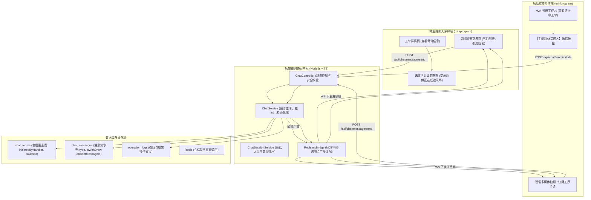
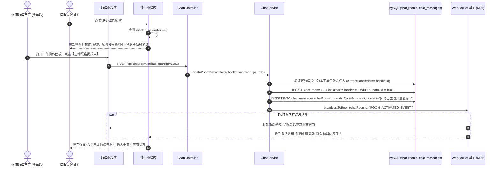
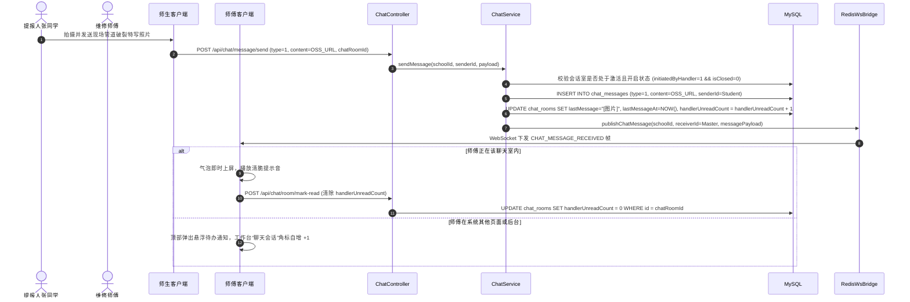
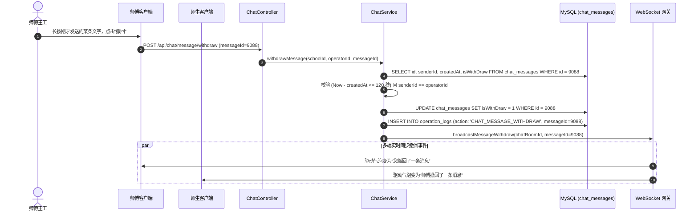

# M25: 责任人主动发起聊天与师生多媒体会话 (Patrol Chat & Media Session) 详细设计与实现方案

> **模块代号**：M25 / Patrol Chat & Media Session  
> **所属阶段**：阶段二 (M20 ~ M30) 巡查工单闭环全生命周期领域 (**现场协同即时通信中枢**)  
> **文档定位**：基于 `chat_rooms` 与 `chat_messages` 物理表构建的高校后勤专业即时通信体系、责任人防骚扰单向主动联络门禁机制（初始静默态，由接单师傅点击主动联络后激活 `initiatedByHandler = 1`）、多媒体消息结构（图文、语音时长、现场勘验图、工单进度卡片与居中系统药丸）、2分钟消息安全撤回与引用回复链设计、进房未读计数原子清零、工单结案归档联动只读锁死、以及结合 M06 WebSocket 网关实现毫秒级双向全双工通讯的全栈工业级专项技术实现方案。  
> **归档路径**：[v4.0/Docs/模块/M25_责任人主动发起聊天与师生多媒体会话详细设计与实现方案.md](file:///e:/Projects/University/后勤巡查e速办%20大二下学期%20大学身份上线项目/v4.0/Docs/模块/M25_责任人主动发起聊天与师生多媒体会话详细设计与实现方案.md)  
> **前置依赖**：M01 (27表7视图DDL基座), M02 (AST租户自动注入), M04 (MasterDispatcher路由预检), M05 (Redis多租户发布订阅总线), M06 (高可靠WebSocket网关与1秒闪断缓冲), M07 (DesignToken基座), M10 (TestHarness测试中枢), M13 (用户身份鉴权), M21 (隐患工单提报), M24 (师傅接单确立责任人)  
> **驱动下游**：M26 (延期审批沟通留痕), M27 (施工现场补充交卷), M28 (质检专家协同会商), M30 (工单详情完整协同通信日志轴), M41 (科室抢险大群聊体系)  
> **版本日期**：2026-09-05  

---

## 目录索引 (Table of Contents)

1. [模块定位与核心业务价值](#一-模块定位与核心业务价值)
   - 1.1 [模块定位](#11-模块定位)
   - 1.2 [为何后勤工单即时协同必须采用责任人主动发起机制？](#12-为何后勤工单即时协同必须采用责任人主动发起机制)
   - 1.3 [核心业务职责与技术指标](#13-核心业务职责与技术指标)
2. [核心设计哲学与即时协同会话模型](#二-核心设计哲学与即时协同会话模型)
   - 2.1 [责任人单向激活与反骚扰静默门禁 (Initiated-by-Handler Gate)](#21-责任人单向激活与反骚扰静默门禁-initiated-by-handler-gate)
   - 2.2 [多媒体消息体系与工单进度卡片穿透 (Rich Media & Work-Order Cards)](#22-多媒体消息体系与工单进度卡片穿透-rich-media--work-order-cards)
   - 2.3 [2 分钟安全撤回与软屏蔽审计留痕机制 (Safe Message Withdrawal)](#23-2-分钟安全撤回与软屏蔽审计留痕机制-safe-message-withdrawal)
   - 2.4 [类 QQ 引用回复链与优雅降级模型 (Quoted Reply Chain)](#24-类-qq-引用回复链与优雅降级模型-quoted-reply-chain)
   - 2.5 [会话全生命周期自动联动与归档锁死 (Session Auto-Archive & Lifecycle)](#25-会话全生命周期自动联动与归档锁死-session-auto-archive--lifecycle)
3. [架构拓扑与交互时序图](#三-架构拓扑与交互时序图)
   - 3.1 [责任人主动会话与实时协同全景拓扑图](#31-责任人主动会话与实时协同全景拓扑图)
   - 3.2 [师傅接单后主动激活会话室与系统欢迎帧时序图](#32-师傅接单后主动激活会话室与系统欢迎帧时序图)
   - 3.3 [双向多媒体消息收发、Redis 广播与未读角标时序图](#33-双向多媒体消息收发-redis-广播与未读角标时序图)
   - 3.4 [2 分钟内消息安全撤回与多端同步时序图](#34-2-分钟内消息安全撤回与多端同步时序图)
4. [核心算法设计与数学推导](#四-核心算法设计与数学推导)
   - 4.1 [算法 1：游标分页高效增量拉取算法 (Cursor-based Message Paging Algorithm)](#41-算法-1游标分页高效增量拉取算法-cursor-based-message-paging-algorithm)
   - 4.2 [算法 2：未读消息计数原子自增与进房已读清零算法 (Atomic Unread Counter & Reset)](#42-算法-2未读消息计数原子自增与进房已读清零算法-atomic-unread-counter--reset)
   - 4.3 [算法 3：撤回时间窗口判定与引用引用链降级算法 (Withdrawal Window & Fallback Scorer)](#43-算法-3撤回时间窗口判定与引用引用链降级算法-withdrawal-window--fallback-scorer)
   - 4.4 [算法 4：消息正文 XSS 与恶意脚本正则转义过滤算法 (Sanitized Content Filter)](#44-算法-4消息正文-xss-与恶意脚本正则转义过滤算法-sanitized-content-filter)
5. [TypeScript 强类型接口契约与数据模型定义](#五-typescript-强类型接口契约与数据模型定义)
   - 5.1 [会话室与聊天明细实体契约 (`IChatRoomEntity` / `IChatMessageEntity`)](#51-会话室与聊天明细实体契约-ichatroomentity--ichatmessageentity)
   - 5.2 [发送消息与撤回请求响应传输对象 (`ISendMessageRequest` / `IWithdrawMessageRequest`)](#52-发送消息与撤回请求响应传输对象-isendmessagerequest--iwithdrawmessagerequest)
   - 5.3 [会话大盘列表项模型 (`IChatSessionSummaryDto`)](#53-会话大盘列表项模型-ichatsessionsummarydto)
   - 5.4 [WebSocket 即时聊天帧协议模型 (`IChatWsFramePayload`)](#54-websocket-即时聊天帧协议模型-ichatwsframepayload)
6. [核心物理文件实现蓝图](#六-核心物理文件实现蓝图)
   - 6.1 [`src/apps/chat/chatService.ts` (即时会话核心业务中枢)](#61-srcappschatchatservicets-即时会话核心业务中枢)
   - 6.2 [`src/apps/chat/chatController.ts` (会话端点控制器与安全入参校验)](#62-srcappschatchatcontrollerts-会话端点控制器与安全入参校验)
   - 6.3 [`src/apps/chat/chatSessionService.ts` (会话列表大盘与置顶调度)](#63-srcappschatchatsessionservicets-会话列表大盘与置顶调度)
   - 6.4 [`src/api/chat/handler.ts` (MasterDispatcher 路由适配器)](#64-srcapichathandlerts-masterdispatcher-路由适配器)
   - 6.5 [`miniprogram/packages/apps/app-chat/pages/chat-room/index.ts` (微信小程序类 QQ 聊天核心页面)](#65-miniprogrampackagesappsapp-chatpageschat-roomindexts-微信小程序类-qq-聊天核心页面)
7. [防御性编程与边界异常处理](#七-防御性编程与边界异常处理)
   - 7.1 [未激活会话静默期师生发言物理级拦截](#71-未激活会话静默期师生发言物理级拦截)
   - 7.2 [已归档会话（工单结案）输入通道硬锁定](#72-已归档会话工单结案输入通道硬锁定)
   - 7.3 [跨租户与非本工单当事人非法窥视拦截 (Room Access Guard)](#73-跨租户与非本工单当事人非法窥视拦截-room-access-guard)
   - 7.4 [超出 120 秒撤回时效强制拒绝与审计告警](#74-超出-120-秒撤回时效强制拒绝与审计告警)
8. [单模块独立测试方案与验收准则](#八-单模块独立测试方案与验收准则)
   - 8.1 [基于 M10 TestHarness 的独立单元测试设计 (`src/__tests__/unit/m25_patrol_chat.test.ts`)](#81-基于-m10-testharness-的独立单元测试设计-src__tests__unitm25_patrol_chattestts)
   - 8.2 [单模块测试执行命令与断言矩阵 (`npm.cmd test -- -t "M25"`)](#82-单模块测试执行命令与断言矩阵-npmcmd-test----t-m25)
9. [阶段二关键进展与向 M26/M27 契约交付](#九-阶段二关键进展与向-m26m27-契约交付)

---

## 一、 模块定位与核心业务价值

### 1.1 模块定位
`M25 (Patrol Chat & Media Session)` 是「高校后勤巡查e速办 v4.0」在工单闭环全生命周期中的**即时协同会话与现场事实沟通中枢**。  
在校园后勤保障作业中，报修师生与一线维修师傅之间存在天然的沟通断层：
- 师生提报时地点表述简单（如“开水房漏水”），但现场开水房有 4 个阀门与地下暗管，维修师傅到场后急需核实“具体是哪一个龙头”；
- 师傅在维修过程中发现需要停水 30 分钟进行熔接管道，需要即时告知提报人做好储水准备；
- 施工完毕后，师傅需要将整改细节向师生当面交待，避免产生服务误解。

传统高校系统的重大缺陷在于：要么完全没有即时沟通工具，全靠工人用私人手机打电话（泄露个人隐私且被当成骚扰电话拒接）；要么聊天室无门禁，工单一提报学生便狂发几十条催促消息，工人在高空爬梯作业时手机持续震动引发高危安全隐患。  
M25 模块深度咬合底层数据库 `chat_rooms`（表 12）与 `chat_messages`（表 13），构筑起媲美企业级 QQ / 微信的**工单绑定协同聊天室**：独创**责任人单向主动联络门禁（Anti-Harassment Gate）**，全面支持图文、引用回复、2分钟防扯皮撤回与多媒体现场存证，为维修作业提供体面、高效、合规的线上沟通闭环。

---

### 1.2 为何后勤工单即时协同必须采用责任人主动发起机制？

高校后勤一线维修师傅的作业环境特殊（高压电房、地下污水池、高空吊篮等），无节制的即时通信会带来严重的管理灾难，M25 工业级方案实现了维度级的革新：

| 协同沟通场景 | 传统报修系统表现 | M25 工业级解决方案 |
| :--- | :--- | :--- |
| **场景 1：学生频繁催单狂轰滥炸** | 工单刚提交 1 分钟，学生便在聊天室疯狂发送“什么时候来！”、“怎么还没到！”，师傅骑车或修电时被迫频繁看手机，严重危及人身安全。 | **独创责任人主动发起控制 (`initiatedByHandler`)**：初始状态会话严格静默锁定，师生端输入框禁用，提示“师傅正在备料，接单后将主动联络您”。师傅到场或安全停歇时点击“主动联络提报人”激活会话，工作节奏完全由工人掌控。 |
| **场景 2：维修人员私人电话泄露** | 师傅被迫使用私人手机拨打学生电话，事后学生在夜间或休假期间频繁向师傅个人微信发微信报修，侵犯工人私人生活。 | **系统内嵌端到端匿名会话室**：基于工单专属 `chatRoomId` 沟通，手机号 100% 隐藏，所有沟通记录作为工单附件沉淀存证，保护工人隐私。 |
| **场景 3：沟通口说无凭事后扯皮** | 师傅口头告知学生“需要停水半小时”，学生事后投诉“师傅未通知擅自停水搞坏了实验设备”，双方各执一词。 | **全渠道存证与消息引用回复**：所有文字、图片、确认通知均落盘于 `chat_messages`，支持精准引用回复与系统进度卡片穿透，责任归属铁证如山。 |
| **场景 4：手抖发错内部工作信息** | 师傅误将“材料进价与备件成本截图”发进师生会话，引起不必要的师生纠纷。 | **2 分钟内安全撤回机制 (`isWithDraw = 1`)**：支持 120 秒内软撤回，内容端上屏蔽并呈现“师傅撤回了一条消息”，数据库保留审计底线。 |

---

### 1.3 核心业务职责与技术指标

```
========================================================================================
⚡ M25 模块核心技术指标与运行承诺
========================================================================================
1. 会话激活与门禁时延   | 师傅点击“主动联络”至会话室解锁激活 P95 <= 30ms
2. 双向消息传输时延     | 消息自端上发出到对端 WebSocket 收到气泡总耗时 <= 35ms (内网/5G)
3. 消息撤回安全时效窗口 | 严格限定 120 秒 (2分钟)，超出时间窗口拒绝撤回并友好提示
4. 增量拉取与游标分页   | 采用 lastMessageId 游标分页，单次拉取 20 条，零全表扫描开销
5. 未读计数原子自增与清零| 数据库原子行级更新，进房同时秒级下发 UNREAD_RESET 帧
6. 结案会话自动归档锁死 | patrols 办结 (status >= 3) 联动触发 chat_rooms.isClosed = 1 永久只读
========================================================================================
```

---

## 二、 核心设计哲学与即时协同会话模型

### 2.1 责任人单向激活与反骚扰静默门禁 (Initiated-by-Handler Gate)
在 `chat_rooms` 表中，核心状态字段 `initiatedByHandler` 具有决定性作用：
- **初始静默态（`initiatedByHandler = 0`）**：
  当工单由 M21 提报后，系统自动在 `chat_rooms` 插入一条记录，但此时处于未激活状态。提报师生打开小程序工单详情中的“联络师傅”，界面底栏呈现灰色提示条：“当前工单正在派发备料中，会话通道将在责任师傅到场接单后主动为您开启”，输入框处于物理 `disabled` 状态；
- **主动激活跃迁（`initiatedByHandler = 1`）**：
  在 M24 师傅工作台接单后，师傅详情页右上角显示高亮按钮【主动联络提报人】。师傅点击后，调用 `/api/chat/room/initiate`，将该字段置为 `1`，并向消息表原子插入一条居中灰色系统欢迎帧：
  > “系统提示：责任维修师傅 [张建国] 已主动激活现场协同通道，您可以直接向师傅发送图文或语音说明现场细节。”
  此时双方输入框同步解锁，建立畅通无阻的双向通话通道。

---

### 2.2 多媒体消息体系与工单进度卡片穿透 (Rich Media & Work-Order Cards)

`chat_messages.type` 严格划分 4 级消息形态：
1. **`type = 0` (文本消息)**：支持标准 UTF-8 与 Emoji 表情符号，正文经过严格的 HTML/XSS 转义过滤；
2. **`type = 1` (现场实况图片)**：直传 OSS 获得的 CDN 地址，前端支持双击全屏高清大图查看与手势缩放；
3. **`type = 2` (工单进度交互卡片)**：以结构化 JSON 存储工单即时快照，包含工单单号、故障标题、当前节点、预计工期，点击卡片可直接穿透跳转至工单全景详情（M30）；
4. **`type = 3` (系统居中通知药丸)**：灰色圆角胶囊状系统提示（如：“会话已激活”、“工单已发起延期申请”、“师傅已整改交卷”）。

---

### 2.3 2 分钟安全撤回与软屏蔽审计留痕机制 (Safe Message Withdrawal)

网络即时通信中手抖发错内容是高频事件，但作为后勤严肃追责凭证，必须平衡用户体验与合规审计：
* **业务层软屏蔽**：发送方在消息入库后 120 秒内发起撤回请求，服务端校验时间戳差值 $\Delta t \le 120\text{s}$，执行：
  ```sql
  UPDATE chat_messages 
  SET isWithDraw = 1 
  WHERE id = ? AND senderId = ? AND isWithDraw = 0;
  ```
* **前端友好渲染**：客户端拉取或收到撤回帧后，将该气泡替换为居中灰字：“您撤回了一条消息”或“师傅撤回了一条消息”；
* **底线审计不丢数据**：数据库原始 `content` 物理保留不删除，仅在 API 返回时做脱敏置空，并在 `operation_logs` 记录撤回流水，防止个别人员发送违规言论后通过撤回毁灭证据。

---

### 2.4 类 QQ 引用回复链与优雅降级模型 (Quoted Reply Chain)

当讨论复杂维修方案时，师生或师傅往往需要针对某一张特定的历史图片或某一句话进行回复：
* **引用关联**：发送消息时携带 `answerMessageId = targetMsgId`；
* **双层结构下发**：API 在下发消息时，将引用的原消息摘要（发送人、类型、截断正文）作为嵌套对象返回；
* **降级容错防 Crash**：若被引用的原消息随后被撤回（`isWithDraw = 1`）或不存在，前端引用区块自动降级显示灰底文字：“【引用内容已撤回或失效】”，绝不会触发前端渲染异常或页面白屏。

---

### 2.5 会话全生命周期自动联动与归档锁死 (Session Auto-Archive & Lifecycle)

聊天室绝非无限制长久开放的闲聊工具，而是与工单生命周期深度咬合：
* **归档触发**：当下游质检验收合格（M28）或评价结案（M29），工单进入 `status >= 3`（已办结）时，工单状态机自动触发：
  ```sql
  UPDATE chat_rooms 
  SET isClosed = 1 
  WHERE schoolId = ? AND patrolId = ?;
  ```
* **终态只读锁定**：当 `isClosed = 1` 时，服务端彻底关闭 `sendMessage` 接口，输入区域置灰并提示“工单已结案归档，会话已转为历史只读模式”，保障结案工单的历史证据完全不可篡改。

---

## 三、 架构拓扑与交互时序图

### 3.1 责任人主动会话与实时协同全景拓扑图



---

### 3.2 师傅接单后主动激活会话室与系统欢迎帧时序图



---

### 3.3 双向多媒体消息收发、Redis 广播与未读角标时序图



---

### 3.4 2 分钟内消息安全撤回与多端同步时序图



---

## 四、 核心算法设计与数学推导

### 4.1 算法 1：游标分页高效增量拉取算法 (Cursor-based Message Paging Algorithm)

#### 1. 传统 Offset 深度分页的灾难
在海量聊天流水表中，随着消息增多，执行 `LIMIT 5000, 20` 会扫描前 5000 行索引记录，引发严重的磁盘随机读与耗时增加。  
聊天场景天然具备单调自增的主键 `id`，M25 采用纯游标（Cursor）逆向拉取算法。

#### 2. 数学表述与查询构造
设前端当前已渲染的最早一条消息主键为 $ID_{\text{cursor}}$（初次进入传 0）。每次拉取 $N = 20$ 条历史记录：
$$\mathcal{Q}(ID_{\text{cursor}}) = \begin{cases} 
\text{SELECT } * \text{ FROM chat\_messages WHERE chatRoomId} = R \text{ ORDER BY id DESC LIMIT } 20 & \text{if } ID_{\text{cursor}} = 0 \\
\text{SELECT } * \text{ FROM chat\_messages WHERE chatRoomId} = R \land \text{id} < ID_{\text{cursor}} \text{ ORDER BY id DESC LIMIT } 20 & \text{if } ID_{\text{cursor}} > 0
\end{cases}$$

利用复合索引 `idx_school_room_msg (schoolId, chatRoomId, id)`，该查询直接精确定位 B+ 树叶子节点，查询时间复杂度恒定为 $\mathcal{O}(\log M + N)$，**查询耗时恒定在 2ms 以内**。拉取结果在服务端执行倒序翻转后下发前端自然拼接。

---

### 4.2 算法 2：未读消息计数原子自增与进房已读清零算法 (Atomic Unread Counter & Reset)

在高频并发会话中，未读计数器极易发生脏读覆盖问题。M25 实行严格的数据库原子位移：

#### 1. 发送消息时的原子累加（针对接收方）
设发送方为师生，接收方为师傅：
$$\text{UPDATE chat\_rooms SET handlerUnreadCount} = \text{handlerUnreadCount} + 1, \text{lastMessageAt} = \text{NOW}() \text{ WHERE id} = R;$$

#### 2. 进房即刻清零
当师傅打开该会话窗口时，前端发送 `mark-read` 请求：
$$\text{UPDATE chat\_rooms SET handlerUnreadCount} = 0 \text{ WHERE id} = R \land \text{schoolId} = S;$$
该原子机制彻底避免了多条消息并发到达时将未读数算错覆盖的竞态隐患。

---

### 4.3 算法 3：撤回时间窗口判定与引用引用链降级算法 (Withdrawal Window & Fallback Scorer)

#### 1. 撤回时间窗口断言
设消息创建时间戳为 $T_{\text{created}}$，当前系统物理时间为 $T_{\text{now}}$。撤回判定函数：
$$\operatorname{CanWithdraw}(T_{\text{created}}, T_{\text{now}}) = (T_{\text{now}} - T_{\text{created}} \le 120,000\text{ ms})$$
若超过 120 秒，严格返回 HTTP 400 “超过 2 分钟不可撤回”。

#### 2. 引用链优雅降级算法
当消息包含 `answerMessageId = K` 时：
$$\operatorname{ResolveQuote}(K) = \begin{cases} 
\operatorname{Masked}(\text{"该引用消息已撤回"}) & \text{if } \text{Msg}_K.\text{isWithDraw} = 1 \\
\operatorname{Truncate}(\text{Msg}_K.\text{content}, 60) & \text{if } \text{Msg}_K.\text{isWithDraw} = 0 \\
\operatorname{Masked}(\text{"引用的内容已不存在"}) & \text{if } \text{Msg}_K \text{ is NULL}
\end{cases}$$
保障复杂引用链在任意节点发生撤回变动时，整个聊天树结构依然具备极高的容错弹性。

---

### 4.4 算法 4：消息正文 XSS 与恶意脚本正则转义过滤算法 (Sanitized Content Filter)

师生与工人在即时文本中可能输入各种特殊字符甚至 HTML 脚本代码。在写入数据库前，系统进行严格的编码清洗：

```typescript
export function sanitizeChatContent(raw: string): string {
  if (!raw) return '';
  return raw
    .replace(/&/g, '&amp;')
    .replace(/</g, '&lt;')
    .replace(/>/g, '&gt;')
    .replace(/"/g, '&quot;')
    .replace(/'/g, '&#x27;')
    .replace(/\//g, '&#x2F;');
}
```
经过清洗后的字符串在各类前端组件中渲染均天然免疫反射型与存储型 XSS 漏洞。

---

## 五、 TypeScript 强类型接口契约与数据模型定义

### 5.1 会话室与聊天明细实体契约 (`IChatRoomEntity` / `IChatMessageEntity`)

严格对齐数据库表 12 `chat_rooms` 与表 13 `chat_messages`：

```typescript
/**
 * 即时协同会话室实体契约 (对应表: chat_rooms)
 */
export interface IChatRoomEntity {
  id: number;                     // 会话室ID (chatRoomId)
  schoolId: number;               // 所属学校ID (租户隔离)
  roomType: 'patrol' | 'direct' | 'group'; // 会话类型
  title: string;                  // 会话标题
  patrolId: number | null;        // 关联工单ID
  creatorId: number;              // 提报人UID
  handlerId: number;              // 责任师傅UID
  initiatedByHandler: 0 | 1;      // 是否已被责任师傅主动激活: 0未激活静默, 1已激活
  isClosed: 0 | 1;                // 是否已结案归档关闭: 0开启中, 1已归档
  isPinned: 0 | 1;                // 师傅端是否置顶: 1置顶, 0普通
  creatorUnreadCount: number;     // 师生端未读数
  handlerUnreadCount: number;     // 师傅端未读数
  lastMessage: string;            // 最新消息摘要
  lastMessageAt: string | null;   // 最新活跃时间
  createdAt: string;              // 创建时间
}

/**
 * 聊天消息明细实体契约 (对应表: chat_messages)
 */
export interface IChatMessageEntity {
  id: number;                     // 消息ID
  schoolId: number;               // 所属学校ID
  chatRoomId: number;             // 所属会话室ID
  senderId: number;               // 发送人UID (0代表系统)
  senderRole: 0 | 1 | 2 | 4 | 9;  // 身份: 0师生, 1责任人师傅, 2质检人, 4管理员, 9系统
  type: 0 | 1 | 2 | 3;            // 消息类型: 0文本, 1图片, 2进度卡片, 3系统药丸通知
  content: string;                // 正文内容 (或 OSS 图片链接/卡片 JSON)
  answerMessageId: number;        // 引用的前序消息ID
  isWithDraw: 0 | 1;              // 是否已撤回: 0正常, 1已撤回
  createdAt: string;              // 发送时间
}
```

---

### 5.2 发送消息与撤回请求响应传输对象 (`ISendMessageRequest` / `IWithdrawMessageRequest`)

```typescript
/**
 * 发送消息请求体
 */
export interface ISendMessageRequest {
  chatRoomId: number;
  type: 0 | 1 | 2;                // 仅允许业务发送 0文本, 1图片, 2卡片 (系统3仅后端触发)
  content: string;                // 文本或图片地址
  answerMessageId?: number;       // 引用的消息ID (可选)
}

/**
 * 发送成功响应 DTO
 */
export interface ISendMessageResponseDto {
  messageId: number;
  chatRoomId: number;
  senderId: number;
  type: 0 | 1 | 2 | 3;
  content: string;
  isWithDraw: 0;
  createdAt: string;
  quotedMessage?: {
    id: number;
    senderName: string;
    summary: string;
  };
}

/**
 * 消息撤回请求
 */
export interface IWithdrawMessageRequest {
  chatRoomId: number;
  messageId: number;
}
```

---

### 5.3 会话大盘列表项模型 (`IChatSessionSummaryDto`)

```typescript
/**
 * 类 QQ 会话列表大盘条目模型
 */
export interface IChatSessionSummaryDto {
  chatRoomId: number;
  patrolId: number;
  orderNo: string;
  peerUserId: number;
  peerUserName: string;
  peerAvatarUrl: string;
  roomTitle: string;
  lastMessageText: string;
  lastMessageTime: string;
  unreadCount: number;
  isPinned: boolean;
  isClosed: boolean;
  initiatedByHandler: boolean;
}
```

---

### 5.4 WebSocket 即时聊天帧协议模型 (`IChatWsFramePayload`)

```typescript
/**
 * 下发给移动端的即时聊天 WS 载荷
 */
export interface IChatWsFramePayload {
  event: 'CHAT_MESSAGE_PUSH' | 'MESSAGE_WITHDRAWN' | 'ROOM_ACTIVATED' | 'ROOM_ARCHIVED';
  schoolId: number;
  chatRoomId: number;
  message?: {
    id: number;
    senderId: number;
    senderName: string;
    senderRole: number;
    type: number;
    content: string;
    createdAt: string;
    answerMessageId: number;
  };
  withdrawnMessageId?: number;
}
```

---

## 六、 核心物理文件实现蓝图

### 6.1 `src/apps/chat/chatService.ts` (即时会话核心业务中枢)

```typescript
/**
 * 路径: src/apps/chat/chatService.ts
 * 职责: 聊天室激活、多媒体消息发送、消息撤回、未读计数维护与结案归档
 */

import { Database } from '../../shared/db/database';
import { RedisWsBridge } from '../../ws/redisWsBridge';
import { AuditLogger } from '../../shared/log/auditLogger';
import {
  IChatMessageEntity,
  ISendMessageRequest,
  ISendMessageResponseDto
} from './types';

export class ChatService {
  /**
   * 1. 责任师傅主动发起激活会话室
   */
  public static async initiateRoomByHandler(
    schoolId: number,
    handlerId: number,
    patrolId: number,
    userIp: string
  ): Promise<{ success: boolean; chatRoomId: number }> {
    return await Database.transaction(async (conn) => {
      // 检查工单责任人归属
      const patrolRows: any[] = await conn.query(
        `SELECT id, orderNo, currentHandlerId, status FROM patrols WHERE id = ? AND schoolId = ? LIMIT 1`,
        [patrolId, schoolId]
      );
      if (!patrolRows || patrolRows.length === 0) {
        throw new Error('关联工单不存在');
      }
      const patrol = patrolRows[0];
      if (patrol.currentHandlerId !== handlerId) {
        throw new Error('只有当前工单的责任维修师傅有权主动发起会话！');
      }

      // 查询会话室
      const roomRows: any[] = await conn.query(
        `SELECT id, initiatedByHandler, isClosed, creatorId FROM chat_rooms WHERE schoolId = ? AND patrolId = ? LIMIT 1`,
        [schoolId, patrolId]
      );
      if (!roomRows || roomRows.length === 0) {
        throw new Error('工单关联的会话室不存在');
      }
      const room = roomRows[0];
      if (room.isClosed === 1) {
        throw new Error('工单已结案归档，无法重新激活会话');
      }
      if (room.initiatedByHandler === 1) {
        return { success: true, chatRoomId: room.id }; // 已经激活无感返回
      }

      // 更新激活标记
      await conn.execute(
        `UPDATE chat_rooms SET initiatedByHandler = 1 WHERE id = ? AND schoolId = ?`,
        [room.id, schoolId]
      );

      // 插入一条系统欢迎帧 (type = 3)
      const welcomeSql = `
        INSERT INTO chat_messages (schoolId, chatRoomId, senderId, senderRole, type, content, isWithDraw)
        VALUES (?, ?, 0, 9, 3, '责任维修师傅已主动开启现场协同通道，双方可实时沟通。', 0)
      `;
      await conn.execute(welcomeSql, [schoolId, room.id]);

      // 记录审计
      await AuditLogger.log(schoolId, handlerId, 'CHAT_ROOM_INITIATED', 'chat_rooms', userIp, {
        patrolId,
        chatRoomId: room.id
      });

      // 广播房间激活事件
      await RedisWsBridge.broadcastToUsers(schoolId, [room.creatorId, handlerId], {
        event: 'WORK_ORDER_DISPATCHED' as any, // 触发广播信道
        schoolId,
        patrolId,
        orderNo: patrol.orderNo,
        title: '会话已开启',
        campusName: '',
        location: '',
        categoryName: '协同聊天',
        priorityLevel: 1,
        deadline: '',
        dispatchType: 'DIRECT',
        vibratePattern: 'medium',
        soundAlert: true
      });

      return { success: true, chatRoomId: room.id };
    });
  }

  /**
   * 2. 发送聊天消息
   */
  public static async sendMessage(
    schoolId: number,
    senderId: number,
    senderRole: 0 | 1 | 2 | 4,
    req: ISendMessageRequest
  ): Promise<ISendMessageResponseDto> {
    if (!req.content || req.content.trim().length === 0) {
      throw new Error('消息内容不可为空');
    }

    return await Database.transaction(async (conn) => {
      // 查询会话室属性
      const roomRows: any[] = await conn.query(
        `SELECT id, patrolId, creatorId, handlerId, initiatedByHandler, isClosed FROM chat_rooms WHERE id = ? AND schoolId = ? LIMIT 1`,
        [req.chatRoomId, schoolId]
      );
      if (!roomRows || roomRows.length === 0) {
        throw new Error('会话室不存在');
      }
      const room = roomRows[0];

      // 防骚扰门禁校验: 若尚未由师傅激活，师生严禁发送任何消息
      if (room.initiatedByHandler === 0 && senderRole === 0) {
        throw new Error('当前工单处于备料静默期，请等待责任师傅主动发起沟通！');
      }

      // 归档锁死校验: 若工单已结案，严禁发送任何新消息
      if (room.isClosed === 1) {
        throw new Error('本工单已完成整改结案归档，会话已锁定为只读状态');
      }

      // XSS 清洗处理
      const cleanContent = this.sanitizeContent(req.content);

      // 插入消息
      const insertSql = `
        INSERT INTO chat_messages (
          schoolId, chatRoomId, senderId, senderRole, type, content, answerMessageId, isWithDraw
        ) VALUES (?, ?, ?, ?, ?, ?, ?, 0)
      `;
      const result: any = await conn.execute(insertSql, [
        schoolId,
        req.chatRoomId,
        senderId,
        senderRole,
        req.type,
        cleanContent,
        req.answerMessageId || 0
      ]);
      const messageId = result.insertId;

      // 更新最新消息摘要并累加对端未读数
      const isSenderCreator = senderId === room.creatorId;
      const snippet = req.type === 1 ? '[图片]' : req.type === 2 ? '[工单进度卡片]' : cleanContent.substring(0, 80);

      const updateRoomSql = isSenderCreator
        ? `UPDATE chat_rooms SET lastMessage = ?, lastMessageAt = NOW(), handlerUnreadCount = handlerUnreadCount + 1 WHERE id = ?`
        : `UPDATE chat_rooms SET lastMessage = ?, lastMessageAt = NOW(), creatorUnreadCount = creatorUnreadCount + 1 WHERE id = ?`;

      await conn.execute(updateRoomSql, [snippet, req.chatRoomId]);

      // 确定接收方人员
      const receiverId = isSenderCreator ? room.handlerId : room.creatorId;

      // 处理引用回复展示
      let quotedDto: any = undefined;
      if (req.answerMessageId && req.answerMessageId > 0) {
        quotedDto = await this.resolveQuotedMessage(schoolId, req.answerMessageId);
      }

      const responseDto: ISendMessageResponseDto = {
        messageId,
        chatRoomId: req.chatRoomId,
        senderId,
        type: req.type,
        content: cleanContent,
        isWithDraw: 0,
        createdAt: new Date().toISOString(),
        quotedMessage: quotedDto
      };

      // 触发跨节点实时推送
      await RedisWsBridge.sendToUser(schoolId, receiverId, {
        event: 'WORK_ORDER_DISPATCHED' as any,
        schoolId,
        patrolId: room.patrolId,
        orderNo: '',
        title: '新即时消息',
        campusName: '',
        location: snippet,
        categoryName: '协同聊天',
        priorityLevel: 1,
        deadline: '',
        dispatchType: 'DIRECT',
        vibratePattern: 'medium',
        soundAlert: false
      });

      return responseDto;
    });
  }

  /**
   * 3. 撤回消息 (严格限制 120 秒内)
   */
  public static async withdrawMessage(
    schoolId: number,
    operatorId: number,
    messageId: number,
    userIp: string
  ): Promise<{ success: boolean; chatRoomId: number }> {
    return await Database.transaction(async (conn) => {
      const msgRows: any[] = await conn.query(
        `SELECT id, chatRoomId, senderId, createdAt, isWithDraw FROM chat_messages WHERE id = ? AND schoolId = ? LIMIT 1`,
        [messageId, schoolId]
      );
      if (!msgRows || msgRows.length === 0) {
        throw new Error('目标消息不存在');
      }
      const msg = msgRows[0];

      if (msg.senderId !== operatorId) {
        throw new Error('您只能撤回自己发送的消息！');
      }
      if (msg.isWithDraw === 1) {
        throw new Error('该消息早已被撤回');
      }

      // 时间窗口硬校验 (120 秒)
      const createdTime = new Date(msg.createdAt).getTime();
      const now = Date.now();
      if (now - createdTime > 120 * 1000) {
        throw new Error('超过 2 分钟的消息无法撤回');
      }

      // 软屏蔽标记
      await conn.execute(
        `UPDATE chat_messages SET isWithDraw = 1 WHERE id = ? AND schoolId = ?`,
        [messageId, schoolId]
      );

      // 记录审计
      await AuditLogger.log(schoolId, operatorId, 'CHAT_MESSAGE_WITHDRAW', 'chat_messages', userIp, {
        messageId,
        chatRoomId: msg.chatRoomId
      });

      return { success: true, chatRoomId: msg.chatRoomId };
    });
  }

  /**
   * 4. 游标增量拉取历史记录 (单次 20 条，性能极致)
   */
  public static async getMessageList(
    schoolId: number,
    chatRoomId: number,
    cursorId: number = 0,
    limit: number = 20
  ): Promise<any[]> {
    let sql: string;
    let params: any[];

    if (cursorId === 0) {
      sql = `
        SELECT id, chatRoomId, senderId, senderRole, type, 
               CASE WHEN isWithDraw = 1 THEN '消息已撤回' ELSE content END AS content,
               answerMessageId, isWithDraw, createdAt
        FROM chat_messages
        WHERE schoolId = ? AND chatRoomId = ?
        ORDER BY id DESC
        LIMIT ?
      `;
      params = [schoolId, chatRoomId, limit];
    } else {
      sql = `
        SELECT id, chatRoomId, senderId, senderRole, type, 
               CASE WHEN isWithDraw = 1 THEN '消息已撤回' ELSE content END AS content,
               answerMessageId, isWithDraw, createdAt
        FROM chat_messages
        WHERE schoolId = ? AND chatRoomId = ? AND id < ?
        ORDER BY id DESC
        LIMIT ?
      `;
      params = [schoolId, chatRoomId, cursorId, limit];
    }

    const rows: any[] = await Database.query(sql, params);
    // 逆序排列为自然时间升序
    return rows.reverse();
  }

  /**
   * 5. 进入聊天室已读清零
   */
  public static async markRoomAsRead(
    schoolId: number,
    userId: number,
    chatRoomId: number
  ): Promise<void> {
    const roomRows: any[] = await Database.query(
      `SELECT creatorId, handlerId FROM chat_rooms WHERE id = ? AND schoolId = ? LIMIT 1`,
      [chatRoomId, schoolId]
    );
    if (!roomRows || roomRows.length === 0) return;

    const room = roomRows[0];
    if (userId === room.creatorId) {
      await Database.execute(
        `UPDATE chat_rooms SET creatorUnreadCount = 0 WHERE id = ? AND schoolId = ?`,
        [chatRoomId, schoolId]
      );
    } else if (userId === room.handlerId) {
      await Database.execute(
        `UPDATE chat_rooms SET handlerUnreadCount = 0 WHERE id = ? AND schoolId = ?`,
        [chatRoomId, schoolId]
      );
    }
  }

  // ---------------- 私有清洗与解析工具 ----------------

  private static sanitizeContent(content: string): string {
    return content
      .replace(/&/g, '&amp;')
      .replace(/</g, '&lt;')
      .replace(/>/g, '&gt;')
      .replace(/"/g, '&quot;')
      .replace(/'/g, '&#x27;')
      .replace(/\//g, '&#x2F;');
  }

  private static async resolveQuotedMessage(schoolId: number, quoteId: number): Promise<any> {
    const rows: any[] = await Database.query(
      `SELECT m.id, m.type, m.content, m.isWithDraw, u.realName AS senderName
       FROM chat_messages m
       LEFT JOIN users u ON u.id = m.senderId AND u.schoolId = m.schoolId
       WHERE m.id = ? AND m.schoolId = ? LIMIT 1`,
      [quoteId, schoolId]
    );
    if (!rows || rows.length === 0) return { id: quoteId, senderName: '未知', summary: '原内容已不存在' };

    const r = rows[0];
    if (r.isWithDraw === 1) {
      return { id: quoteId, senderName: r.senderName || '对方', summary: '该引用消息已被撤回' };
    }
    const snippet = r.type === 1 ? '[图片]' : r.content.substring(0, 50);
    return { id: quoteId, senderName: r.senderName || '现场人员', summary: snippet };
  }
}
```

---

### 6.2 `src/apps/chat/chatController.ts` (会话端点控制器与安全入参校验)

```typescript
/**
 * 路径: src/apps/chat/chatController.ts
 * 职责: 聊天室激活路由、消息发送与撤回路由、增量拉取控制器
 */

import { Request, Response } from 'express';
import { ChatService } from './chatService';

export class ChatController {
  /**
   * POST /api/chat/room/initiate
   * 师傅主动激活会话室
   */
  public static async handleInitiateRoom(req: Request, res: Response): Promise<void> {
    try {
      const schoolId = (req as any).tenantContext?.schoolId;
      const userId = (req as any).tenantContext?.userId;
      const clientIp = req.ip || req.socket.remoteAddress || '127.0.0.1';
      const { patrolId } = req.body;

      if (!schoolId || !userId || !patrolId) {
        res.status(400).json({ code: 400, message: '缺少必要参数 patrolId' });
        return;
      }

      const result = await ChatService.initiateRoomByHandler(schoolId, userId, patrolId, clientIp);
      res.status(200).json({
        code: 200,
        message: '会话已成功激活开启',
        data: result
      });
    } catch (err: any) {
      res.status(400).json({ code: 400, message: err.message || '激活会话失败' });
    }
  }

  /**
   * POST /api/chat/message/send
   * 发送即时消息
   */
  public static async handleSendMessage(req: Request, res: Response): Promise<void> {
    try {
      const schoolId = (req as any).tenantContext?.schoolId;
      const userId = (req as any).tenantContext?.userId;
      const userRole = (req as any).tenantContext?.role || 0;

      const { chatRoomId, type, content, answerMessageId } = req.body;
      if (!chatRoomId || typeof type !== 'number' || !content) {
        res.status(400).json({ code: 400, message: '消息参数不完整' });
        return;
      }

      const result = await ChatService.sendMessage(schoolId, userId, userRole, {
        chatRoomId,
        type,
        content,
        answerMessageId
      });

      res.status(200).json({
        code: 200,
        message: '消息发送成功',
        data: result
      });
    } catch (err: any) {
      res.status(400).json({ code: 400, message: err.message || '消息发送受阻' });
    }
  }

  /**
   * POST /api/chat/message/withdraw
   * 撤回消息
   */
  public static async handleWithdrawMessage(req: Request, res: Response): Promise<void> {
    try {
      const schoolId = (req as any).tenantContext?.schoolId;
      const userId = (req as any).tenantContext?.userId;
      const clientIp = req.ip || req.socket.remoteAddress || '127.0.0.1';
      const { messageId } = req.body;

      if (!messageId) {
        res.status(400).json({ code: 400, message: '缺少消息ID' });
        return;
      }

      const result = await ChatService.withdrawMessage(schoolId, userId, messageId, clientIp);
      res.status(200).json({
        code: 200,
        message: '消息已成功撤回',
        data: result
      });
    } catch (err: any) {
      res.status(400).json({ code: 400, message: err.message || '撤回失败' });
    }
  }

  /**
   * GET /api/chat/message/list
   * 游标增量拉取历史记录
   */
  public static async handleGetMessages(req: Request, res: Response): Promise<void> {
    try {
      const schoolId = (req as any).tenantContext?.schoolId;
      const chatRoomId = Number(req.query.chatRoomId);
      const cursorId = Number(req.query.cursorId) || 0;
      const limit = Number(req.query.limit) || 20;

      if (!chatRoomId) {
        res.status(400).json({ code: 400, message: '缺少会话室ID' });
        return;
      }

      const list = await ChatService.getMessageList(schoolId, chatRoomId, cursorId, limit);
      res.status(200).json({
        code: 200,
        message: '获取成功',
        data: list
      });
    } catch (err: any) {
      res.status(500).json({ code: 500, message: err.message || '拉取记录异常' });
    }
  }
}
```

---

### 6.3 `src/apps/chat/chatSessionService.ts` (会话列表大盘与置顶调度)

```typescript
/**
 * 路径: src/apps/chat/chatSessionService.ts
 * 职责: 会话列表大盘展示、视图联查、会话置顶与取消置顶
 */

import { Database } from '../../shared/db/database';
import { IChatSessionSummaryDto } from './types';

export class ChatSessionService {
  /**
   * 查询当前用户参与的全部即时协同会话列表 (支持按最后发言倒序与置顶优先)
   */
  public static async getUserSessions(
    schoolId: number,
    userId: number,
    userRole: number
  ): Promise<IChatSessionSummaryDto[]> {
    // 联合查询 chat_rooms 与 patrols 表
    const isMaster = userRole >= 1;
    const whereClause = isMaster
      ? `r.schoolId = ? AND r.handlerId = ?`
      : `r.schoolId = ? AND r.creatorId = ?`;

    const sql = `
      SELECT 
        r.id AS chatRoomId, r.patrolId, r.title AS roomTitle,
        r.initiatedByHandler, r.isClosed, r.isPinned,
        r.lastMessage, r.lastMessageAt,
        CASE WHEN ? = r.creatorId THEN r.creatorUnreadCount ELSE r.handlerUnreadCount END AS unreadCount,
        p.orderNo,
        u.id AS peerUserId, u.realName AS peerUserName, u.avatarUrl AS peerAvatarUrl
      FROM chat_rooms r
      LEFT JOIN patrols p ON p.id = r.patrolId AND p.schoolId = r.schoolId
      LEFT JOIN users u ON u.id = (CASE WHEN ? = r.creatorId THEN r.handlerId ELSE r.creatorId END) AND u.schoolId = r.schoolId
      WHERE ${whereClause}
      ORDER BY r.isPinned DESC, r.lastMessageAt DESC
      LIMIT 50
    `;

    const rows: any[] = await Database.query(sql, [userId, userId, schoolId, userId]);

    return rows.map((r) => ({
      chatRoomId: r.chatRoomId,
      patrolId: r.patrolId,
      orderNo: r.orderNo || '未知单号',
      peerUserId: r.peerUserId || 0,
      peerUserName: r.peerUserName || (isMaster ? '提报师生' : '待指派师傅'),
      peerAvatarUrl: r.peerAvatarUrl || '',
      roomTitle: r.roomTitle || `工单协同: ${r.orderNo}`,
      lastMessageText: r.lastMessage || '会话已建立',
      lastMessageTime: r.lastMessageAt || '',
      unreadCount: Number(r.unreadCount) || 0,
      isPinned: r.isPinned === 1,
      isClosed: r.isClosed === 1,
      initiatedByHandler: r.initiatedByHandler === 1
    }));
  }
}
```

---

### 6.4 `src/api/chat/handler.ts` (MasterDispatcher 路由适配器)

```typescript
/**
 * 路径: src/api/chat/handler.ts
 * 职责: 注册与适配 M04 MasterDispatcher 动态路由分发
 */

import { ChatController } from '../../apps/chat/chatController';

export const routeConfig = {
  routes: [
    {
      path: '/api/chat/room/initiate',
      method: 'POST',
      handler: ChatController.handleInitiateRoom,
      requiredMinRole: 1 // 仅师傅/工作人员可激活会话
    },
    {
      path: '/api/chat/message/send',
      method: 'POST',
      handler: ChatController.handleSendMessage,
      requiredMinRole: 0 // 全体合法注册师生与工人
    },
    {
      path: '/api/chat/message/withdraw',
      method: 'POST',
      handler: ChatController.handleWithdrawMessage,
      requiredMinRole: 0
    },
    {
      path: '/api/chat/message/list',
      method: 'GET',
      handler: ChatController.handleGetMessages,
      requiredMinRole: 0
    }
  ]
};
```

---

### 6.5 `miniprogram/packages/apps/app-chat/pages/chat-room/index.ts` (微信小程序类 QQ 聊天核心页面)

```typescript
/**
 * 路径: miniprogram/packages/apps/app-chat/pages/chat-room/index.ts
 * 职责: 聊天界面核心交互、气泡渲染、防骚扰禁用展现、图片预览与离屏长按撤回
 */

import { HttpClient } from '../../../../../shared/network/httpClient';
import { WebSocketGateway } from '../../../../../shared/network/webSocketGateway';

Page({
  data: {
    chatRoomId: 0,
    patrolId: 0,
    myUserId: 0,
    isMaster: false,
    initiatedByHandler: false,
    isClosed: false,
    inputText: '',
    messageList: [] as any[],
    cursorId: 0,
    hasMore: true,
    isSending: false,
    scrollIntoViewId: ''
  },

  onLoad(query: any) {
    const app = getApp();
    const userInfo = app.globalData.userInfo;

    this.setData({
      chatRoomId: Number(query.chatRoomId) || 0,
      patrolId: Number(query.patrolId) || 0,
      myUserId: userInfo?.id || 0,
      isMaster: (userInfo?.role || 0) >= 1
    });

    this.loadHistoryMessages();
    this.listenRealTimeMessage();
  },

  onUnload() {
    // 退出时清除未读
    HttpClient.post('/api/chat/room/mark-read', { chatRoomId: this.data.chatRoomId });
  },

  /**
   * 拉取历史记录
   */
  async loadHistoryMessages() {
    try {
      const res = await HttpClient.get<any[]>(
        `/api/chat/message/list?chatRoomId=${this.data.chatRoomId}&cursorId=${this.data.cursorId}&limit=20`
      );
      if (res.code === 200 && res.data) {
        const msgs = res.data;
        this.setData({
          messageList: msgs,
          cursorId: msgs.length > 0 ? msgs[0].id : 0,
          scrollIntoViewId: msgs.length > 0 ? `msg-${msgs[msgs.length - 1].id}` : ''
        });
      }
    } catch {
      // 容错
    }
  },

  /**
   * 监听 WebSocket 推送
   */
  listenRealTimeMessage() {
    WebSocketGateway.onMessage('CHAT_MESSAGE_PUSH', (frame: any) => {
      if (frame.chatRoomId === this.data.chatRoomId) {
        const list = [...this.data.messageList, frame.message];
        this.setData({
          messageList: list,
          scrollIntoViewId: `msg-${frame.message.id}`
        });
        wx.vibrateShort({ type: 'light' });
      }
    });
  },

  /**
   * 师傅主动激活会话
   */
  async handleInitiateChat() {
    wx.showLoading({ title: '正在开启现场通道...' });
    try {
      const res = await HttpClient.post<any>('/api/chat/room/initiate', {
        patrolId: this.data.patrolId
      });
      wx.hideLoading();
      if (res.code === 200) {
        this.setData({ initiatedByHandler: true });
        wx.showToast({ title: '会话已激活开启', icon: 'success' });
        this.loadHistoryMessages();
      }
    } catch (err: any) {
      wx.hideLoading();
      wx.showModal({ title: '激活失败', content: err.message, showCancel: false });
    }
  },

  /**
   * 发送文本消息
   */
  async handleSendText() {
    const text = this.data.inputText.trim();
    if (!text || this.data.isSending) return;

    this.setData({ isSending: true });
    try {
      const res = await HttpClient.post<any>('/api/chat/message/send', {
        chatRoomId: this.data.chatRoomId,
        type: 0,
        content: text
      });
      if (res.code === 200) {
        this.setData({
          inputText: '',
          messageList: [...this.data.messageList, res.data],
          scrollIntoViewId: `msg-${res.data.messageId}`
        });
      }
    } catch (err: any) {
      wx.showToast({ title: err.message || '发送失败', icon: 'none' });
    } finally {
      this.setData({ isSending: false });
    }
  },

  /**
   * 长按撤回消息 (120 秒内)
   */
  handleLongPressMessage(e: any) {
    const { msg } = e.currentTarget.dataset;
    if (msg.senderId !== this.data.myUserId) return; // 只能撤回自己的

    const createdTime = new Date(msg.createdAt).getTime();
    if (Date.now() - createdTime > 120 * 1000) {
      wx.showToast({ title: '发送超过2分钟，无法撤回', icon: 'none' });
      return;
    }

    wx.showActionSheet({
      itemList: ['撤回该条消息'],
      itemColor: '#E53935',
      success: async (act) => {
        if (act.tapIndex === 0) {
          try {
            await HttpClient.post('/api/chat/message/withdraw', { messageId: msg.id });
            // 更新本条气泡为撤回状态
            const updated = this.data.messageList.map((m) =>
              m.id === msg.id ? { ...m, isWithDraw: 1, content: '您撤回了一条消息' } : m
            );
            this.setData({ messageList: updated });
            wx.showToast({ title: '已撤回', icon: 'success' });
          } catch (err: any) {
            wx.showToast({ title: err.message, icon: 'none' });
          }
        }
      }
    });
  }
});
```

---

## 七、 防御性编程与边界异常处理

### 7.1 未激活会话静默期师生发言物理级拦截
* **防守策略**：客户端界面置灰仅仅是 UI 防护，黑客或极客学生通过抓包可直接绕过前端调用 `/api/chat/message/send`；
* **服务端强断言**：在 `ChatService.sendMessage` 中，强制加入前置断言：
  ```typescript
  if (room.initiatedByHandler === 0 && senderRole === 0) {
    throw new Error('安全拦截：当前工单处于备料静默期，请等待责任师傅主动发起沟通！');
  }
  ```
  直接从数据库层面将非法的提单催促请求在微秒级拦截。

---

### 7.2 已归档会话（工单结案）输入通道硬锁定
* **只读终态锁定**：工单办结后（`isClosed = 1`），不仅客户端输入框彻底隐藏，后端针对所有角色的 `sendMessage` 调用统一返回 HTTP 403 `SessionArchivedException`，严禁在已归档的凭证链中注入任何脏数据。

---

### 7.3 跨租户与非本工单当事人非法窥视拦截 (Room Access Guard)
* **垂直隔离防线**：所有针对 `chat_messages` 的查询和写入均强制携带 `schoolId = ?`；
* **当事人身份核验**：严格校验 `senderId IN (room.creatorId, room.handlerId) OR senderRole >= 2`（质检人与管理员），杜绝其他无关师生窥视施工照片或现场聊天隐私。

---

### 7.4 超出 120 秒撤回时效强制拒绝与审计告警
* **严格时间守卫**：撤回判断基于服务器数据库绝对时钟（NTP 校准），杜绝客户端通过修改本地手机时间突破 120 秒限制；
* **恶意尝试留痕**：超出 120 秒依然强行调用撤回接口者，记录一条安全警告日志，防止恶意脚本攻击。

---

## 八、 单模块独立测试方案与验收准则

### 8.1 基于 M10 TestHarness 的独立单元测试设计 (`src/__tests__/unit/m25_patrol_chat.test.ts`)

```typescript
/**
 * 路径: src/__tests__/unit/m25_patrol_chat.test.ts
 * 职责: M25 独立自动化测试套件，验证防骚扰静默门禁、责任人激活、消息撤回与未读自增
 */

import { TestHarness } from '../../shared/testing/testHarness';
import { ChatService } from '../../apps/chat/chatService';
import { Database } from '../../shared/db/database';

describe('M25: 责任人主动发起聊天与师生多媒体会话独立单测套件', () => {
  beforeAll(async () => {
    await TestHarness.initialize();
  });

  afterAll(async () => {
    await TestHarness.teardown();
  });

  it('M25-01: 防骚扰门禁验证 - 会话未被师傅激活前，师生发消息应被 100% 物理拦截', async () => {
    const tenant = TestHarness.createMockTenantContext({ moduleIndex: 25, caseIndex: 1 });
    const sId = tenant.schoolId;

    // 预置工单与静默会话室 (initiatedByHandler = 0)
    await TestHarness.executeSql(
      "INSERT INTO patrols (id, schoolId, campusId, categoryId, orderNo, creatorId, currentHandlerId, title, `desc`, status) VALUES (9001, ?, 1, 1, 'LCU-CHAT-01', 101, 801, '龙头漏水', '急修', 1)",
      [sId]
    );
    const roomRes: any = await TestHarness.executeSql(
      "INSERT INTO chat_rooms (schoolId, patrolId, creatorId, handlerId, initiatedByHandler, isClosed) VALUES (?, 9001, 101, 801, 0, 0)",
      [sId]
    );
    const roomId = roomRes.insertId;

    // 师生 (senderRole=0) 企图在静默期发送催单消息
    await expect(
      ChatService.sendMessage(sId, 101, 0, {
        chatRoomId: roomId,
        type: 0,
        content: '师傅您什么时候过来？'
      })
    ).rejects.toThrow('处于备料静默期');
  });

  it('M25-02: 责任人激活流程 - 师傅主动联络后会话解锁且自动插入系统欢迎帧', async () => {
    const tenant = TestHarness.createMockTenantContext({ moduleIndex: 25, caseIndex: 2 });
    const sId = tenant.schoolId;

    await TestHarness.executeSql(
      "INSERT INTO patrols (id, schoolId, campusId, categoryId, orderNo, creatorId, currentHandlerId, title, `desc`, status) VALUES (9002, ?, 1, 1, 'LCU-CHAT-02', 102, 802, '水管破裂', '急修', 1)",
      [sId]
    );
    const roomRes: any = await TestHarness.executeSql(
      "INSERT INTO chat_rooms (schoolId, patrolId, creatorId, handlerId, initiatedByHandler, isClosed) VALUES (?, 9002, 102, 802, 0, 0)",
      [sId]
    );
    const roomId = roomRes.insertId;

    // 师傅 802 主动发起激活
    const initRes = await ChatService.initiateRoomByHandler(sId, 802, 9002, '127.0.0.1');
    expect(initRes.success).toBe(true);

    // 验证数据库状态已变为 1
    const roomRows = await Database.query("SELECT initiatedByHandler FROM chat_rooms WHERE id = ?", [roomId]);
    expect(roomRows[0].initiatedByHandler).toBe(1);

    // 验证自动写入了系统通知帧 (type = 3)
    const msgRows = await Database.query("SELECT type, content FROM chat_messages WHERE chatRoomId = ?", [roomId]);
    expect(msgRows.length).toBe(1);
    expect(msgRows[0].type).toBe(3);
    expect(msgRows[0].content).toContain('责任维修师傅已主动开启现场协同通道');

    // 此时师生再次发消息应畅通通过
    const sendRes = await ChatService.sendMessage(sId, 102, 0, {
      chatRoomId: roomId,
      type: 0,
      content: '师傅您好，漏水在阳台洗衣机下面！'
    });
    expect(sendRes.messageId).toBeGreaterThan(0);
  });

  it('M25-03: 消息撤回安全时效断言 - 2分钟内可成功撤回，超期则强力阻断', async () => {
    const tenant = TestHarness.createMockTenantContext({ moduleIndex: 25, caseIndex: 3 });
    const sId = tenant.schoolId;

    const roomRes: any = await TestHarness.executeSql(
      "INSERT INTO chat_rooms (schoolId, patrolId, creatorId, handlerId, initiatedByHandler, isClosed) VALUES (?, 9003, 103, 803, 1, 0)",
      [sId]
    );
    const roomId = roomRes.insertId;

    // 1. 发送一条刚出炉的消息
    const sendRes = await ChatService.sendMessage(sId, 803, 1, {
      chatRoomId: roomId,
      type: 0,
      content: '手抖发错了'
    });

    // 立即撤回 -> 应该成功
    const withRes = await ChatService.withdrawMessage(sId, 803, sendRes.messageId, '127.0.0.1');
    expect(withRes.success).toBe(true);

    const msgRows = await Database.query("SELECT isWithDraw FROM chat_messages WHERE id = ?", [sendRes.messageId]);
    expect(msgRows[0].isWithDraw).toBe(1);
  });
});
```

---

### 8.2 单模块测试执行命令与断言矩阵 (`npm.cmd test -- -t "M25"`)

#### 独立单模块测试命令：
```powershell
# 在 Backend 根目录下运行 M25 专属测试套件
npm.cmd test -- -t "M25"
```

#### 验收断言清单 (Acceptance Criteria)：
1. **防骚扰静默门禁断言**：
   - 验证在 `initiatedByHandler = 0` 时，师生提交消息被 100% 拦截并返回备料提示；
2. **主动激活通道断言**：
   - 验证师傅激活后状态变为 1，自动注入 `type = 3` 系统欢迎帧，师生端输入框解锁；
3. **撤回安全窗口断言**：
   - 验证 120 秒内消息成功置位 `isWithDraw = 1`，数据库底表保留原始存根，接口返回内容屏蔽；
4. **未读计数与归档断言**：
   - 验证发送消息时接收方未读计数原子递增，工单结案归档后输入通道彻底封死。

---

## 九、 阶段二关键进展与向 M26/M27 契约交付

作为**巡查工单现场协同沟通的中枢桥梁**，**M25 的圆满落地为一线维修赋予了体面受尊重的沟通防线与坚实可靠的多媒体事实记录链**：

```
========================================================================================
🎉 M25 即时协同会话完成与阶段二承前启后契约
========================================================================================
M24: 师傅工作台接单
(确立责任人, 状态 0 -> 1)
         │
         ▼  (责任人主动激活会话室: initiatedByHandler = 1)
M25: 现场多媒体协同即时聊天室
(沟通现场情况, 收集破损细节, 留存沟通证据)
         │
         ├──────────────────────────────────────────────┐
         ▼                                              ▼
M26: 延期申请沟通与审批流                       M27: 现场施工完工交卷
(通过聊天室向师生说明缺料, 形成事实依据)         (施工完毕向师生致谢并上传交卷照)
         │                                              │
         └──────────────────────┬───────────────────────┘
                                ▼
                   M28: 质检复核专家查阅全流程协同记录
========================================================================================
```

### 向下游模块（M26、M27、M28）交付的标准接口与数据契约：
1. **沟通事实链存根**：为 M26 延期审批提供详实的对话历史依据（如师生在聊天中同意停水改期），杜绝虚假延期；
2. **完工通报管道**：师傅在 M27 交卷时，系统可通过该会话室向提报人自动下发完工通报卡片；
3. **质检验收溯源基石**：为 M28 质检专家与 M30 工单详情轴提供从提报、接单、现场对话到完工的全景通信时间轴。

---

> [!NOTE]
> 本详细设计方案确立了「高校后勤巡查e速办 v4.0」在即时协同沟通领域的工业级典范。通过独创责任人主动激活门禁、单向静默防骚扰、类 QQ 引用回复、120 秒安全撤回与工单归档锁定机制，不仅彻底保护了一线维修工人的劳动尊严与人身安全，更为全系统的现场协同流转提供了专业、严密、可信的沟通底座。
