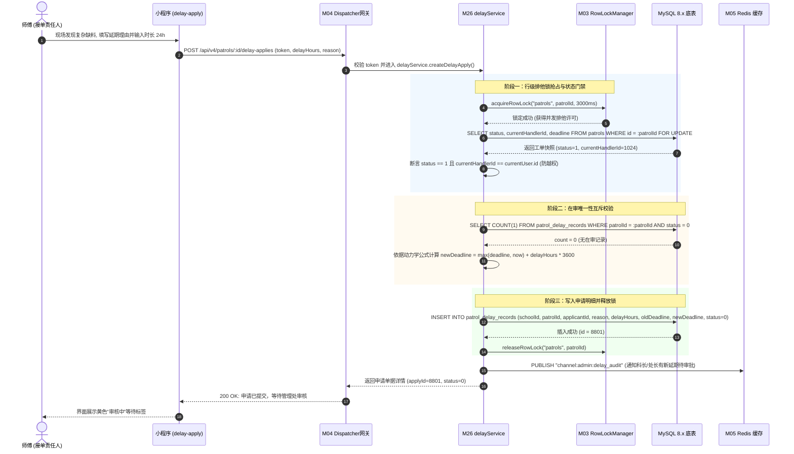
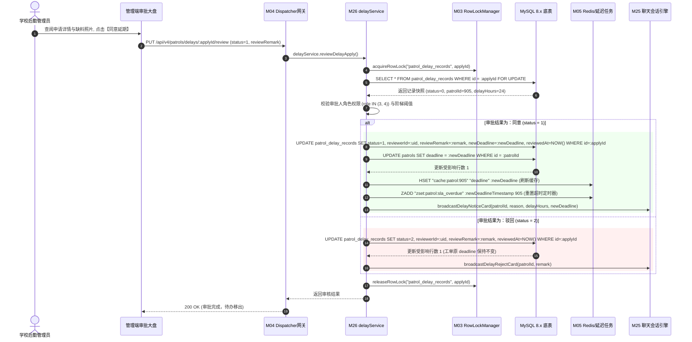
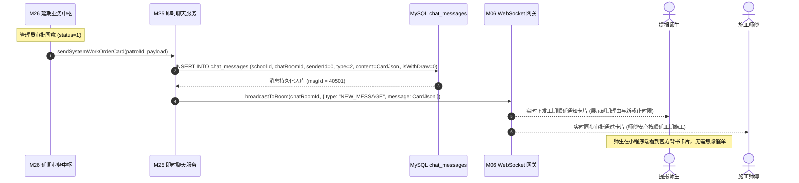

# M26: 多次动态延期申请与多级审批流 (Patrol Delay Approval & Lifecycle Extension) 详细设计与实现方案

> **模块代号**：M26 / Patrol Delay Approval & Lifecycle Extension  
> **所属阶段**：阶段二 (M20 ~ M30) 巡查工单闭环全生命周期领域 (**工期动态弹性调节与审批中枢**)  
> **文档定位**：基于 `patrol_delay_records`（工单延期申请审批表）与 `patrols`（工单主表）构建的高校后勤多次动态延期申请与多级审批流转体系。彻底废除历史单表硬编码字段缺陷，实现工单生命周期内 1:N 动态审批链表追踪、单工单“在审唯一性”互斥排他门禁、截止时限顺延累加动力学模型、累计延期阶梯熔断与跨级自动升级督办、师生知情权闭环穿透通知（联动 M25 聊天室系统卡片）、以及高并发行级排他锁（M03）协同的全栈工业级专项技术实现方案。  
> **归档路径**：[v4.0/Docs/模块/M26_多次动态延期申请与多级审批流详细设计与实现方案.md](file:///e:/Projects/University/后勤巡查e速办%20大二下学期%20大学身份上线项目/v4.0/Docs/模块/M26_多次动态延期申请与多级审批流详细设计与实现方案.md)  
> **前置依赖**：M01 (27表7视图DDL基座), M02 (AST租户自动注入), M03 (Saga事务与行级锁并发引擎), M04 (MasterDispatcher路由预检), M05 (Redis多租户命名空间缓存), M07 (DesignToken基座), M10 (TestHarness测试中枢), M13 (用户身份鉴权), M18 (四级立体权限矩阵), M21 (隐患工单提报), M24 (师傅接单确立责任人), M25 (责任人多媒体会话中枢)  
> **驱动下游**：M27 (施工现场整改交卷与耗时记录), M28 (质检复核到场核验与合格/驳回状态机), M30 (工单综合大宽表视图与全景详情对比轴), M53 (全校后勤宏观运维决策大盘)  
> **版本日期**：2026-09-05  

---

## 目录索引 (Table of Contents)

1. [模块定位与核心业务价值](#一-模块定位与核心业务价值)
   - 1.1 [模块定位](#11-模块定位)
   - 1.2 [为何必须淘汰硬编码 delay1~3 转向 1:N 动态审批链表？](#12-为何必须淘汰硬编码-delay13-转向-1n-动态审批链表)
   - 1.3 [核心业务职责与技术指标](#13-核心业务职责与技术指标)
2. [核心设计哲学与动态延期审批模型](#二-核心设计哲学与动态延期审批模型)
   - 2.1 [单工单“在审唯一性”互斥排他门禁 (Single Pending Constraint)](#21-单工单在审唯一性互斥排他门禁-single-pending-constraint)
   - 2.2 [截止时限顺延累加动力学模型 (Deadline Extension Dynamics)](#22-截止时限顺延累加动力学模型-deadline-extension-dynamics)
   - 2.3 [延期频次与累计工期阶梯熔断控制 (Dynamic Extension Throttle & Escalation)](#23-延期频次与累计工期阶梯熔断控制-dynamic-extension-throttle--escalation)
   - 2.4 [师生知情权闭环与 M25 即时会话卡片穿透 (Transparent Notice & Card Penetration)](#24-师生知情权闭环与-m25-即时会话卡片穿透-transparent-notice--card-penetration)
   - 2.5 [不可抗力考评脱敏与 SLA 健康绿标动态解耦 (SLA Decoupling & Exemption)](#25-不可抗力考评脱敏与-sla-健康绿标动态解耦-sla-decoupling--exemption)
3. [架构拓扑与交互时序图](#三-架构拓扑与交互时序图)
   - 3.1 [多次动态延期与多级审批流全景拓扑图](#31-多次动态延期与多级审批流全景拓扑图)
   - 3.2 [师傅现场提交延期申请与行级锁排他时序图](#32-师傅现场提交延期申请与行级锁排他时序图)
   - 3.3 [学校管理员线上审批（同意/驳回）与 SLA 刷新时序图](#33-学校管理员线上审批同意驳回与-sla-刷新时序图)
   - 3.4 [审批通过联动 M25 聊天室下发进度卡片时序图](#34-审批通过联动-m25-聊天室下发进度卡片时序图)
4. [核心算法设计与数学推导](#四-核心算法设计与数学推导)
   - 4.1 [算法 1：截止时限顺延计算模型与基准时间校准算法 (Baseline Recalculation Algorithm)](#41-算法-1截止时限顺延计算模型与基准时间校准算法-baseline-recalculation-algorithm)
   - 4.2 [算法 2：工单行锁与在审唯一性原子 CAS 校验算法 (Row-Lock & Atomic Pending Verifier)](#42-算法-2工单行锁与在审唯一性原子-cas-校验算法-row-lock--atomic-pending-verifier)
   - 4.3 [算法 3：累计延期时长阶梯阈值与自动升格审批人判定算法 (Threshold Escalation Evaluator)](#43-算法-3累计延期时长阶梯阈值与自动升格审批人判定算法-threshold-escalation-evaluator)
   - 4.4 [算法 4：延期审批通过后 SLA 倒计时缓存与定时任务刷新算法 (Distributed SLA Refresh Algorithm)](#44-算法-4延期审批通过后-sla-倒计时缓存与定时任务刷新算法-distributed-sla-refresh-algorithm)
5. [TypeScript 强类型接口契约与数据模型定义](#五-typescript-强类型接口契约与数据模型定义)
   - 5.1 [延期申请实体与状态枚举定义 (`IPatrolDelayRecordEntity`)](#51-延期申请实体与状态枚举定义-ipatroldelayrecordentity)
   - 5.2 [延期提交与审批流转传输对象 (`ICreateDelayApplyDto` / `IReviewDelayApplyDto`)](#52-延期提交与审批流转传输对象-icreatedelayapplydto--ireviewdelayapplydto)
   - 5.3 [延期历史全景响应模型与聚合指标 (`IPatrolDelayHistoryDto`)](#53-延期历史全景响应模型与聚合指标-ipatroldelayhistorydto)
   - 5.4 [穿透 M25 聊天室与微信订阅消息通知协议载荷 (`IDelayNotifyPayload`)](#54-穿透-m25-聊天室与微信订阅消息通知协议载荷-idelaynotifypayload)
6. [核心物理文件实现蓝图](#六-核心物理文件实现蓝图)
   - 6.1 [`src/apps/patrol/delayService.ts` (延期申请核心业务调度与事务中枢)](#61-srcappspatroldelayservicets-延期申请核心业务调度与事务中枢)
   - 6.2 [`src/apps/patrol/delayController.ts` (延期端点控制器与严格安全入参校验)](#62-srcappspatroldelaycontrollerts-延期端点控制器与严格安全入参校验)
   - 6.3 [`src/api/patrol/delayHandler.ts` (MasterDispatcher 路由适配器)](#63-srcapipatroldelayhandlerts-masterdispatcher-路由适配器)
   - 6.4 [`miniprogram/packages/apps/app-patrol/pages/delay-apply/index.ts` (师傅端动态延期申请页面)](#64-miniprogrampackagesappsapp-patrolpagesdelay-applyindexts-师傅端动态延期申请页面)
   - 6.5 [`miniprogram/packages/apps/app-admin/pages/delay-audit/index.ts` (后勤管理端延期审核大盘与抽屉组件)](#65-miniprogrampackagesappsapp-adminpagesdelay-auditindexts-后勤管理端延期审核大盘与抽屉组件)
7. [防御性编程与边界异常处理](#七-防御性编程与边界异常处理)
   - 7.1 [非当前责任人与越权非法篡改申请物理级拦截](#71-非当前责任人与越权非法篡改申请物理级拦截)
   - 7.2 [单工单并发提交双笔延期申请原子防撞排他](#72-单工单并发提交双笔延期申请原子防撞排他)
   - 7.3 [终态工单（已完工/已复核/已废弃）延期申请绝对禁止门禁](#73-终态工单已完工已复核已废弃延期申请绝对禁止门禁)
   - 7.4 [管理员并发重复审批 CAS 乐观锁防撞拦截](#74-管理员并发重复审批-cas-乐观锁防撞拦截)
   - 7.5 [延期时长负数、零值与超大畸形数值（如超过 720 小时）截断过滤](#75-延期时长负数零值与超大畸形数值如超过-720-小时截断过滤)
8. [单模块独立测试方案与验收准则](#八-单模块独立测试方案与验收准则)
   - 8.1 [基于 M10 TestHarness 的独立单元测试设计 (`src/__tests__/unit/m26_patrol_delay.test.ts`)](#81-基于-m10-testharness-的独立单元测试设计-src__tests__unitm26_patrol_delaytestts)
   - 8.2 [单模块测试执行命令与断言矩阵 (`npm.cmd test -- -t "M26"`)](#82-单模块测试执行命令与断言矩阵-npmcmd-test----t-m26)
9. [阶段二关键进展与向 M27 契约交付](#九-阶段二关键进展与向-m27-契约交付)

---

## 一、 模块定位与核心业务价值

### 1.1 模块定位

在高校后勤报修抢修的实际作业场景中，**维修工期的刚性约束与现场复杂环境的动态不确定性之间存在着不可调和的客观矛盾**。  
一方面，学校师生与后勤管理处对报修隐患设置了严苛的 SLA（服务等级协议）时限（如普通隐患 24 小时、紧急破损 2 小时、高难度管道维修 72 小时）；  
另一方面，一线维修师傅常常面临**不可抗力外部制约**：
1. **备品备件缺失**：特定型号水泵电机、进口高压阀门、异形铝合金门窗配件校内无备库，需紧急向原厂发起外采招标或物流调拨，到货周期难以压缩；
2. **作业安全与大环境制约**：高空外立面修缮遇雷暴大风极端天气、地下雨污管网疏通遇强降雨防汛倒灌、变电箱抢修需配合全校停电教学排期等；
3. **第三方协同瓶颈**：需协同市政供水供暖集团、燃气抢险队开挖校外市政主干管线。

若缺乏柔性、规范且透明的动态延期流转机制，系统要么陷入“**师傅为规避超时扣分而弄虚作假、虚假完工点击交卷**”的恶性循环，要么陷入“**因客观缺料导致工单全线标红逾期、挫伤一线维修工人积极性**”的考核僵局。

**M26 模块（多次动态延期申请与多级审批流）** 正是为此而生：
作为工单流转全生命周期的**弹性工期调节中枢**，M26 依托底表 `patrol_delay_records`，为接单责任人（师傅）提供规范的工期顺延申报通道，为后勤处管理员提供严密的证据审查与线上审批权限，并利用数学动力学模型动态重塑主工单 `patrols.deadline`。同时将审批结果第一时间穿透同步至 M25 即时会话室，保障师生知情权，真正构建“**实事求是、依规延期、证据确凿、透明互信**”的现代高校后勤治理闭环。

---

### 1.2 为何必须淘汰硬编码 delay1~3 转向 1:N 动态审批链表？

在早期 v1.0~v3.0 架构或传统低水平后勤系统中，开发者往往在工单主表中直接硬编码若干延期字段（如 `delay1_reason`, `delay1_hours`, `delay2_reason`, `delay2_hours`...）。这种设计在高校高并发高复杂度生产环境中暴露了毁灭性的系统缺陷：

```
========================================================================================
❌ 传统反模式：主表硬编码字段 (delay1~3)
========================================================================================
patrols 表:
[ id | title | deadline | delay1_hours | delay1_status | delay2_hours | delay2_status | ... ]
  │
  ├── 1. 扩展性枯竭：遇到极端复杂修缮工程（如历史保护建筑加固），第4次延期无法记录；
  ├── 2. 字段海量空置：95% 的普通工单无需延期，造成表字段稀疏度灾难与 IO 浪费；
  ├── 3. 并发竞态无法加锁：审批人审核 delay1 与师傅申请 delay2 共享同一行记录，锁冲突剧烈；
  └── 4. 审批证据链丢失：无法记录每次延期的独立审批人、批复时间、驳回批注及佐证附件快照！

========================================================================================
✔ v4.0 工业级规范：1:N 独立审批链表模型 (patrol_delay_records)
========================================================================================
patrols (工单主表)
   │ 1
   │
   ▼ N
patrol_delay_records (延期明细表)
[ id | schoolId | patrolId | applicantId | reason | delayHours | oldDeadline | newDeadline | status | reviewerId | reviewRemark | reviewedAt | createdAt ]
  │
  ├── 1. 无限动态伸缩：支持 1:N 任意次数动态追加，完全解耦工单主生命周期；
  ├── 2. 严密证据追溯：每一次申请均有独立凭证（文字+多图附件快照）、独立审核人与时间戳；
  ├── 3. 行级排他锁解耦：延期申请与主表施工记录并行不悖，互不阻塞高频查询；
  └── 4. 完整审计与统计：可对全校各科室、外包公司的“延期申请率”、“一次审批通过率”建立精准画像！
```

---

### 1.3 核心业务职责与技术指标

1. **单工单在审唯一性拦截**：单笔工单同一时间**严禁并发存在多条待审核（`status = 0`）记录**，杜绝师傅连击重复刷单；
2. **责任人身份严密校验**：申请人必须是当前接单责任人（`patrols.currentHandlerId`）或具备网格长特权身份，阻断闲杂人员越权申请；
3. **工单生命周期门禁**：仅允许处于**施工中（`status = 1: 进行中`）**且**未结案**的工单发起延期，禁止在草稿（0）、已完工（2）、已结案（3）状态下延期；
4. **SLA 时限精确无漂移顺延**：审批通过后，严格执行原子计算 `newDeadline = DATE_ADD(patrols.deadline, INTERVAL delayHours HOUR)`，毫秒级刷新 Redis SLA 缓存与延迟队列；
5. **师生知情权卡片穿透下发**：审批通过后 500ms 内，联动 M25 消息引擎向工单专属会话室注入居中进度卡片与系统药丸通知，消除师生误解；
6. **响应性能指标**：
   - 延期申请提交与行锁校验耗时：$T_{\text{apply}} \le 80\text{ms}$；
   - 管理员线上审批原子事务执行耗时：$T_{\text{review}} \le 120\text{ms}$；
   - 延期历史列表游标查询耗时：$T_{\text{query}} \le 40\text{ms}$。

---

## 二、 核心设计哲学与动态延期审批模型

### 2.1 单工单“在审唯一性”互斥排他门禁 (Single Pending Constraint)

为防止一线工人在网络抖动时连续快速点击“提交申请”，或者师傅在主管尚未审批前反复提交不同理由的延期申请导致审批逻辑紊乱，M26 建立了物理级与事务级双重互斥排他机制：

$$\text{CanApply}(p) = \left( \text{status}(p) = 1 \right) \land \left( \text{count}(\{ r \in R_p \mid \text{status}(r) = 0 \}) = 0 \right)$$

其中：
- $p$ 表示当前工单，$R_p$ 表示该工单所属的全部延期申请记录集合；
- 若当前工单下已存在一条处于待审状态（$\text{status} = 0$）的记录，任何新的延期提交请求将被立即阻断，并向前端返回 `409 Conflict` 错误码及语义化提示：“*当前工单尚有一笔延期申请正在由后勤管理处审核中，请勿重复提交*”。

```
                   [ 师傅提交延期申请 ]
                            │
                            ▼
               [ 检查工单状态 status == 1? ]
                    ├── (No) ──> [ 400 Bad Request: 非施工中禁止延期 ]
                    └── (Yes)
                            │
                            ▼
           [ 检查是否存在待审记录 status == 0? ]
                    ├── (Yes) ──> [ 409 Conflict: 已有在审申请，阻断重复提交 ]
                    └── (No)
                            │
                            ▼
        [ 获取工单行级锁 SELECT ... FOR UPDATE ]
                            │
                            ▼
          [ 写入 patrol_delay_records 表 (status=0) ]
                            │
                            ▼
          [ 广播通知后勤处管理人员 (WebSocket + 微信) ]
```

---

### 2.2 截止时限顺延累加动力学模型 (Deadline Extension Dynamics)

在传统误区中，延期截止时间的核算往往简单地使用“`当前时间 + 申请时长`”，这在实际生产中会产生**极其不公平的工期吞噬或作弊膨胀**：
- **场景 A（提前预判）**：工单原截止时间为明天 18:00。师傅在今天 10:00 预判零件需要采购，申请延期 24 小时。若以“当前时间(今天10:00) + 24h”计算，新截止时间反而变成了明天 10:00，师傅主动申请延期反而让自己的可用工期缩短了 8 小时！这是极其荒谬的。
- **场景 B（逾期突发抢修）**：工单原截止时间为昨天 18:00（已逾期 16 小时），因现场塌方突发抢险，师傅申请延期 12 小时。若直接以“原截止时间 + 12h”计算，新截止时间仍是昨天，工单仍然处于逾期状态！

因此，M26 建立了**截止时限顺延累加动力学模型（Deadline Extension Dynamics）**，针对“时限未到提前申请”与“已超时追溯补办”两种场景进行数学分支归一化处理：

设当前系统基准时间为 $T_{\text{now}}$，工单当前有效截止时间为 $D_{\text{current}}$，师傅本次申请的合法延期时长为 $\Delta H$（单位：小时）：

$$D_{\text{base}} = \max(D_{\text{current}}, T_{\text{now}})$$

$$D_{\text{new}} = D_{\text{base}} + \Delta H \times 3600\,\text{seconds}$$

```
【时序分支一：在保期内提前申请 (T_now <= D_current)】
  原截止时间 D_current: ------------------------------| (2026-09-06 18:00)
  当前申请时间 T_now:    ----------| (2026-09-05 10:00)
  基准计算点 D_base:   = D_current
  顺延后新时限 D_new:   ------------------------------|======================> (2026-09-07 18:00)
                                                      [ +24 小时完整工期顺延 ]

【时序分支二：已逾期追溯抢险补延 (T_now > D_current)】
  原截止时间 D_current: ----------| (2026-09-04 18:00 [已逾期])
  当前申请时间 T_now:    ------------------------------| (2026-09-05 10:00)
  基准计算点 D_base:   = T_now (重置起跑线)
  顺延后新时限 D_new:   ------------------------------|==============> (2026-09-05 22:00)
                                                      [ 从此刻起赋予 12 小时抢修冲刺期 ]
```

该模型确保了：
1. **未超期工单**：工期严格累加，绝不侵占师傅原有合法的剩余作业时间；
2. **已超期工单**：在后勤处主管认可特殊突发客观原因的前提下，以批准时刻作为新起跑线重置健康状态，激励一线工人迅速排除故障，避免因“反正是逾期已不可挽回”而采取消极怠工态度。

---

### 2.3 延期频次与累计工期阶梯熔断控制 (Dynamic Extension Throttle & Escalation)

为了防止延期机制沦为个别外包维修队拖延工期的避难所，M26 设计了**两道防拖延阶梯熔断控制网**：

1. **单次申请上限硬截断**：
   - 普通维修单次申请 $\Delta H \le 48\text{h}$；
   - 复杂重大修缮单次申请 $\Delta H \le 120\text{h}$；
   - 系统级硬约束：`CHECK (delayHours > 0 AND delayHours <= 168)`（单次严禁超过 7 天）。
2. **累计延期次数与总工期分级审批流（Escalation Pipeline）**：
   - 设单工单历史累计延期已获批次数为 $N_{\text{approved}}$，累计获批顺延总时长为 $\Sigma H$：
   - **一级权限（普通科室主管 / role = 3）**：允许审批满足 $N_{\text{approved}} \le 1$ 且 $\Sigma H + \Delta H \le 48\text{h}$ 的申请；
   - **二级权限（后勤处副处长 / role = 4）**：当 $N_{\text{approved}} \ge 2$ 或累计时长超过 $48\text{h}$ 时，触发系统权限拦截，自动升格流转至分管处长终审；
   - **强行熔断线**：单工单累计延期次数上限为 5 次或累计时长超过 360 小时（15天）。一旦触顶，系统彻底关闭该工单的线上延期申请入口，强制要求科室启动线下专项论证或作废重立项目。

```
                    [ 延期审批申请到达中枢 ]
                              │
                              ▼
                [ 计算历史已延期次数与总时长 ]
                              │
               ┌──────────────┴──────────────┐
               ▼                             ▼
    [ N <= 1 且 总工期 <= 48h ]    [ N >= 2 或 总工期 > 48h ]
               │                             │
               ▼                             ▼
     [ 科室主任 (role=3) 可批 ]     [ 自动升格: 分管处长 (role=4) 审批 ]
               │                             │
               └──────────────┬──────────────┘
                              │
                              ▼
                 [ 累计次数 >= 5 或 总工期 > 360h? ]
                              ├── (Yes) ──> [ 触发硬熔断: 禁止延期, 线下专项立项 ]
                              └── (No)  ──> [ 正常进入审批人待办列表 ]
```

---

### 2.4 师生知情权闭环与 M25 即时会话卡片穿透 (Transparent Notice & Card Penetration)

在以往的后勤管理中，最受师生诟病的是“**工单提交后石沉大海，师傅迟迟不上门，师生以为被遗忘而反复拨打校长热线投诉**”。  
M26 彻底打破信息孤岛，当学校管理员批准延期时，后端不仅更新数据库底表，而且**全自动联动 M25（现场即时多媒体会话中枢）**与微信服务通知：

1. **会话室实时进度卡片穿透**：
   - 自动向 `chat_rooms`（关联该工单的会话室）推送一条 `type = 2` 的工单进度系统卡片；
   - 卡片核心要素：
     - **卡片标题**：【后勤处工期顺延通报】；
     - **延期事由**：详实客观原因（如“*经现场勘验，主水管型号为旧式铸铁管，需从库房紧急调拨专用管卡，工期顺延24小时*”）；
     - **新预计完工时限**：精确显示新的倒计时目标；
     - **审批人**：后勤保障处运行科；
2. **居中系统药丸通知（System Pill）**：
   - 在聊天气泡流中插入一条居中灰色药丸文本：“*系统提示：管理处已批准延期申请，师傅将全力备料施工*”；
3. **消除投诉源头**：
   - 提报师生无论是在小程序界面查看工单详情，还是打开聊天室与师傅沟通，均能清晰感知延期的正当性与权威审批背书，变“被动等待与猜疑”为“主动协同与理解”。

---

### 2.5 不可抗力考评脱敏与 SLA 健康绿标动态解耦 (SLA Decoupling & Exemption)

高校后勤对维修班组的月度绩效考核通常挂钩“准时完工率（On-Time Completion Rate）”。如果将经审批合规延期的工单仍计为“超时逾期”，将极大地挫伤师傅的履职敬业度。

M26 实现了**考核脱敏与健康状态解耦算法**：
- **工单视觉大盘展示**：
  - 只要当前时间 $T_{\text{now}} < D_{\text{new}}$，工单在管理端大盘、师傅工作台与师生详情页**统一维持健康的绿色/蓝色正常进行状态**；
  - 界面附带带有黄色小沙漏角标与文本提示：“*已批准延期 $+24\text{h}$（第 1 次）*”，展示透明度；
- **月底效能报表考核清洗（M44 联动）**：
  - 判定公式：$\text{IsOverdueFinal} = (\text{finishTime} > D_{\text{new}})$；
  - 在计算科室与师傅个人准时率时，以 $D_{\text{new}}$ 代替原始基准 $D_{\text{initial}}$；
  - 同时系统单独统计各班组的“**延期申请率（Delay Apply Rate）**”，杜绝师傅滥用不可抗力条款掩盖技能短板。

---

## 三、 架构拓扑与交互时序图

### 3.1 多次动态延期与多级审批流全景拓扑图

```
+----------------------------------------------------------------------------------------------------+
|                                    M26 动态延期申请与多级审批流全景拓扑                               |
+----------------------------------------------------------------------------------------------------+
|                                                                                                    |
|    [ 师傅端微信小程序 ]                                      [ 后勤管理端 / 处长审批大盘 ]              |
|   (app-patrol/delay-apply)                                  (app-admin/delay-audit)                |
|             │                                                          │                           |
|             │ 1. 提交延期申请 (delayHours, reason, evidencePhotos)       │ 4. 线上审批 (agree/reject)|
|             ▼                                                          ▼                           |
|   ┌────────────────────────────────────────────────────────────────────────────────────────────┐   |
|   │                        M04 MasterDispatcher 统一路由鉴权与预检网关                           │   |
|   └────────────────────────────────────────────────────────────────────────────────────────────┘   |
|             │                                                          │                           |
|             ▼                                                          ▼                           |
|   ┌────────────────────────────────────────────────────────────────────────────────────────────┐   |
|   │                         M26 延期业务核心调度中枢 (delayService.ts)                            │   |
|   │                                                                                            │   |
|   │   ┌───────────────────────────┐    ┌─────────────────────────┐    ┌────────────────────┐   │   |
|   │   │  M03 RowLockManager       │    │ 在审唯一性 CAS 判定     │    │ 阶梯阈值权限升格器 │   │   |
|   │   │  (获取工单行级排他排斥锁) │    │ (status=0 互斥门禁)     │    │ (role 3/4 权限鉴别)│   │   |
|   │   └───────────────────────────┘    └─────────────────────────┘    └────────────────────┘   │   |
|   │                                                                                            │   |
|   │   ┌───────────────────────────┐    ┌─────────────────────────┐    ┌────────────────────┐   │   |
|   │   │  SLA 动力学顺延计算器     │    │ M25 聊天室进度卡片广播  │    │ M05 Redis 缓存刷新 │   │   |
|   │   │  (D_new = D_base + deltaH)│    │ (注入工期通报卡片)      │    │ (更新倒计时与状态) │   │   |
|   │   └───────────────────────────┘    └─────────────────────────┘    └────────────────────┘   │   |
|   └────────────────────────────────────────────────────────────────────────────────────────────┘   |
|             │                                                          │                           |
|             ▼                                                          ▼                           |
|   ┌────────────────────────────────────────────────────────────────────────────────────────────┐   |
|   │                         MySQL 8.x 多租户物理存储基座 (InnoDB)                              │   |
|   │                                                                                            │   |
|   │   ┌──────────────────────────────────────────────┐  ┌──────────────────────────────────┐   │   |
|   │   │ patrols (工单主表)                           │  │ patrol_delay_records (延期明细表)│   │   |
|   │   │ - deadline (顺延后的最新截止时间)            │  │ - status (0待审, 1同意, 2驳回)   │   │   |
|   │   │ - currentHandlerId (锁定的申报责任人)        │  │ - delayHours, old/newDeadline    │   │   |
|   │   └──────────────────────────────────────────────┘  └──────────────────────────────────┘   │   |
|   └────────────────────────────────────────────────────────────────────────────────────────────┘   |
+----------------------------------------------------------------------------------------------------+
```

---

### 3.2 师傅现场提交延期申请与行级锁排他时序图



---

### 3.3 学校管理员线上审批（同意/驳回）与 SLA 刷新时序图



---

### 3.4 审批通过联动 M25 聊天室下发进度卡片时序图



---

## 四、 核心算法设计与数学推导

### 4.1 算法 1：截止时限顺延计算模型与基准时间校准算法 (Baseline Recalculation Algorithm)

#### 理论建模
对于任意一笔延期申请，其目标截止时间推导的核心目标是：**在保障工期连续性的前提下，消除非客观因素引发的工期重叠膨胀，并自动校准已逾期单据的健康基线**。

令当前工单主表的原始处理截止时限为 $D_{\text{old}}$，当前服务器权威授时时间戳为 $T_{\text{server}}$，申请顺延时长为 $\Delta H \in \mathbb{Z}^+$（单位：小时）。
目标顺延截止时间 $D_{\text{target}}$ 的数学严格解析式如下：

$$D_{\text{target}} = \max\left( D_{\text{old}},\, T_{\text{server}} \right) + \Delta H \times 3600 \times 1000\,\text{ms}$$

#### 伪代码实现
```typescript
/**
 * 计算延期申请的目标截止时间戳
 * @param oldDeadlineMs 原处理截止时间戳 (毫秒)
 * @param delayHours 申请顺延小时数 (必须大于 0)
 * @param serverNowMs 当前服务器时间戳 (毫秒)
 * @returns newDeadlineDate 目标计算得出的最新截止时间
 */
export function calculateNewDeadline(
  oldDeadlineMs: number,
  delayHours: number,
  serverNowMs: number = Date.now()
): Date {
  if (delayHours <= 0) {
    throw new Error('DELAY_HOURS_MUST_BE_POSITIVE');
  }
  // 选取较大者作为时间起跑线，已超时单据以当前时间为基准，未超时单据以原 deadline 为基准
  const baselineMs = Math.max(oldDeadlineMs, serverNowMs);
  const targetMs = baselineMs + (delayHours * 3600 * 1000);
  return new Date(targetMs);
}
```

---

### 4.2 算法 2：工单行锁与在审唯一性原子 CAS 校验算法 (Row-Lock & Atomic Pending Verifier)

为确保在极高并发环境下，单工单绝对不会被写入两条未审核记录，系统在数据库引擎层构建了“**排他锁 + 原子谓词检查**”算法：

$$\text{LockAndVerify}(p, u) \iff \text{TryLock}(p) \land (u = \text{handler}(p)) \land (\text{status}(p) = 1) \land (\text{pendingCount}(p) = 0)$$

#### 算法步骤：
1. **获取排他悲观锁**：以毫秒级超时阈值调用 `SELECT id FROM patrols WHERE id = :patrolId AND schoolId = :schoolId FOR UPDATE`；
2. **校验单据生命周期**：检查工单是否属于 `status = 1`（处理中）；
3. **校验申报人主体一致性**：校验当前操作人 `userId` 是否严格等于 `currentHandlerId`；
4. **校验在审唯一性**：执行 `SELECT COUNT(1) FROM patrol_delay_records WHERE patrolId = :patrolId AND schoolId = :schoolId AND status = 0`；
5. 若计数 $> 0$，立刻回滚事务并返回 `PENDING_DELAY_RECORD_EXISTS`。

---

### 4.3 算法 3：累计延期时长阶梯阈值与自动升格审批人判定算法 (Threshold Escalation Evaluator)

#### 判定矩阵推导
系统通过动态聚合查询历史已获批记录，推导当前审批请求所需的最小法定角色等级：

设工单历史已通过延期集合为 $A = \{ r \in R_p \mid \text{status}(r) = 1 \}$，则：
- 历史已延期次数：$C = |A|$
- 历史已延期累计总小时数：$S = \sum_{r \in A} r.\text{delayHours}$
- 加上本次拟延期时长：$S_{\text{total}} = S + \Delta H_{\text{current}}$

法定最小审批角色判定函数：

$$\text{RequiredRole}(C, S_{\text{total}}) = \begin{cases}
\text{ROLE\_DEPT\_ADMIN} (3), & \text{if } C = 0 \land S_{\text{total}} \le 48 \\
\text{ROLE\_DIVISION\_CHIEF} (4), & \text{if } C \ge 1 \lor S_{\text{total}} > 48 \\
\text{REJECT\_FROZEN} (\infty), & \text{if } C \ge 5 \lor S_{\text{total}} > 360
\end{cases}$$

若审批人实际角色等级 $\text{Role}_{\text{reviewer}} < \text{RequiredRole}(C, S_{\text{total}})$，系统抛出 `INSUFFICIENT_APPROVAL_PERMISSION` 异常，强制阻断低级别人员违规越权放水。

---

### 4.4 算法 4：延期审批通过后 SLA 倒计时缓存与定时任务刷新算法 (Distributed SLA Refresh Algorithm)

当延期审批通过，工单在 Redis 中的超时监听机制必须原子刷新，杜绝产生过期幽灵告警：

```
1. MySQL 事务成功提交 (patrols.deadline = newDeadline);
2. 构造 Redis Hash 更新载荷:
   HSET "school:{schoolId}:patrol:{patrolId}" "deadline" newDeadlineIsoString
3. 刷新 ZSET 超时有序集合 (Score 为时间戳秒数):
   ZADD "school:{schoolId}:patrol:zset:overdue_sla" (newDeadlineTimestampSec) (patrolId)
4. 删除原有已挂起的低优先级催办通知定时器;
5. 向消息中枢发送延期广播事件:
   PUBLISH "channel:patrol:sla_rescheduled" { patrolId, newDeadline, delayHours }
```

该算法确保在数万工单并发流转的场景下，分布式扫描节点以 $O(\log N)$ 复杂度精准提取最新超时集合，无多余全表轮询开销。

---

## 五、 TypeScript 强类型接口契约与数据模型定义

全系统遵循全栈严格 TypeScript 规范，杜绝使用 `any`，所有实体与 DTO 严格 1:1 映射 MySQL 物理字段。

### 5.1 延期申请实体与状态枚举定义 (`IPatrolDelayRecordEntity`)

```typescript
/**
 * 延期申请审批状态枚举
 */
export enum PatrolDelayStatusEnum {
  /** 0: 待审核 (在审态) */
  PENDING = 0,
  /** 1: 已同意延期 (顺延生效) */
  APPROVED = 1,
  /** 2: 已驳回申请 (维持原状) */
  REJECTED = 2,
}

/**
 * patrol_delay_records 物理表实体契约 (表 19)
 */
export interface IPatrolDelayRecordEntity {
  /** 延期申请ID (主键自增) */
  id: number;
  /** 所属学校ID (租户隔离) */
  schoolId: number;
  /** 关联工单主表ID (逻辑关联 patrols.id) */
  patrolId: number;
  /** 申请责任人ID (逻辑关联 users.id) */
  applicantId: number;
  /** 申请延期客观详细原因 (文字陈述 + 图文凭证快照 JSON) */
  reason: string;
  /** 申请延期时长 (单位: 小时, CHECK > 0) */
  delayHours: number;
  /** 原处理截止时限 (DATETIME) */
  oldDeadline: Date;
  /** 申请目标截止时限 (DATETIME, oldDeadline + delayHours) */
  newDeadline: Date;
  /** 审批状态: 0待审核, 1已同意, 2已驳回 */
  status: PatrolDelayStatusEnum;
  /** 审批人ID (学校管理员 users.id, 初始为 0) */
  reviewerId: number;
  /** 审批意见批注 (最大256字符) */
  reviewRemark: string;
  /** 审批时间 (DATETIME, 初始为 null) */
  reviewedAt: Date | null;
  /** 申请发起时间 (DATETIME) */
  createdAt: Date;
}
```

---

### 5.2 延期提交与审批流转传输对象 (`ICreateDelayApplyDto` / `IReviewDelayApplyDto`)

```typescript
/**
 * 师傅端发起延期申请 DTO
 */
export interface ICreateDelayApplyRequestDto {
  /** 申请延期时长 (单位: 小时, 范围: 1 ~ 168) */
  delayHours: number;
  /** 申请延期的客观详细原因 */
  reason: string;
  /** 现场客观佐证照片 (OSS相对路径列表, 最多 6 张) */
  evidenceImages?: string[];
}

/**
 * 延期申请创建成功响应 DTO
 */
export interface ICreateDelayApplyResponseDto {
  /** 生成的延期申请记录ID */
  applyId: number;
  /** 工单ID */
  patrolId: number;
  /** 申请状态 (0: 待审核) */
  status: PatrolDelayStatusEnum;
  /** 原截止时间 ISO8601 */
  oldDeadline: string;
  /** 预期目标截止时间 ISO8601 */
  predictedDeadline: string;
  /** 申请创建时间 */
  createdAt: string;
}

/**
 * 管理员端审核延期申请 DTO
 */
export interface IReviewDelayApplyRequestDto {
  /** 审批动作: 1同意延期, 2驳回延期 */
  action: PatrolDelayStatusEnum.APPROVED | PatrolDelayStatusEnum.REJECTED;
  /** 审批意见批注 (驳回时必填, 最长 256 字符) */
  reviewRemark: string;
}

/**
 * 审核处理成功响应 DTO
 */
export interface IReviewDelayApplyResponseDto {
  /** 延期申请记录ID */
  applyId: number;
  /** 工单ID */
  patrolId: number;
  /** 最终审批状态 (1: 同意, 2: 驳回) */
  finalStatus: PatrolDelayStatusEnum;
  /** 工单生效的最新截止时间 ISO8601 */
  effectiveDeadline: string;
  /** 审批人姓名 */
  reviewerName: string;
  /** 审批时间 ISO8601 */
  reviewedAt: string;
}
```

---

### 5.3 延期历史全景响应模型与聚合指标 (`IPatrolDelayHistoryDto`)

```typescript
/**
 * 单条延期审批历史明细视图对象
 */
export interface IPatrolDelayItemDto {
  applyId: number;
  applicantId: number;
  applicantName: string;
  applicantPhone: string;
  reason: string;
  evidenceImages: string[];
  delayHours: number;
  oldDeadline: string;
  newDeadline: string;
  status: PatrolDelayStatusEnum;
  statusText: string;
  reviewerId: number;
  reviewerName: string;
  reviewRemark: string;
  reviewedAt: string | null;
  createdAt: string;
}

/**
 * 某工单全量延期历史聚合指标 DTO
 */
export interface IPatrolDelayHistoryResponseDto {
  patrolId: number;
  /** 历史申请总次数 */
  totalApplyCount: number;
  /** 成功获批次数 */
  approvedCount: number;
  /** 累计顺延总工期 (单位: 小时) */
  cumulativeDelayHours: number;
  /** 是否存在正在审批中的记录 */
  hasPendingApply: boolean;
  /** 历史延期申请流水列表 (按创建时间倒序) */
  records: IPatrolDelayItemDto[];
}
```

---

### 5.4 穿透 M25 聊天室与微信订阅消息通知协议载荷 (`IDelayNotifyPayload`)

```typescript
/**
 * 穿透至 M25 即时聊天室的工单延期系统卡片载荷
 */
export interface IDelayChatCardPayload {
  cardType: 'DELAY_APPROVED' | 'DELAY_REJECTED';
  patrolId: number;
  patrolTitle: string;
  delayHours: number;
  newDeadlineFormatted: string;
  reason: string;
  reviewerName: string;
  reviewRemark: string;
  timestamp: number;
}
```

---

## 六、 核心物理文件实现蓝图

### 6.1 `src/apps/patrol/delayService.ts` (延期申请核心业务调度与事务中枢)

```typescript
import { PoolConnection } from 'mysql2/promise';
import { getDbPool } from '../../database/connection';
import { RowLockManager } from '../../kernel/lock/RowLockManager';
import { RedisClusterService } from '../../kernel/cache/redisCluster';
import { 
  IPatrolDelayRecordEntity, 
  PatrolDelayStatusEnum,
  ICreateDelayApplyRequestDto,
  ICreateDelayApplyResponseDto,
  IReviewDelayApplyRequestDto,
  IReviewDelayApplyResponseDto,
  IPatrolDelayHistoryResponseDto,
  IPatrolDelayItemDto
} from './delayContract';
import { calculateNewDeadline } from './delayAlgorithm';
import { ChatService } from '../chat/chatService';

/**
 * M26 延期业务调度中枢服务
 */
export class DelayService {
  private redis = RedisClusterService.getInstance();
  private rowLockMgr = RowLockManager.getInstance();
  private chatService = new ChatService();

  /**
   * 1. 师傅提交延期申请
   */
  public async createDelayApply(
    schoolId: number,
    patrolId: number,
    applicantId: number,
    dto: ICreateDelayApplyRequestDto
  ): Promise<ICreateDelayApplyResponseDto> {
    const pool = getDbPool();
    const conn: PoolConnection = await pool.getConnection();

    // 申请行级排他锁资源名：针对该工单加锁
    const lockKey = `patrol:lock:${schoolId}:${patrolId}`;
    const acquired = await this.rowLockMgr.acquireRowLock(lockKey, 3000);
    if (!acquired) {
      throw new Error('CONCURRENT_LOCK_BUSY: 系统繁忙，请稍后重试');
    }

    try {
      await conn.beginTransaction();

      // 1. 查询工单现状并锁定
      const [patrolRows]: any = await conn.execute(
        `SELECT id, status, currentHandlerId, deadline 
         FROM patrols 
         WHERE id = ? AND schoolId = ? 
         FOR UPDATE`,
        [patrolId, schoolId]
      );

      if (!patrolRows || patrolRows.length === 0) {
        throw new Error('PATROL_NOT_FOUND: 工单不存在或无权限访问');
      }

      const patrol = patrolRows[0];

      // 2. 状态门禁检查：必须处于处理中 (status = 1)
      if (patrol.status !== 1) {
        throw new Error(`INVALID_PATROL_STATUS: 仅处理中的工单可申请延期 (当前状态: ${patrol.status})`);
      }

      // 3. 责任人一致性检查：只有接单人可以发起
      if (patrol.currentHandlerId !== applicantId) {
        throw new Error('FORBIDDEN_NOT_CURRENT_HANDLER: 只有当前接单责任人有权发起延期申请');
      }

      // 4. 在审唯一性检查：当前不能有 status = 0 的记录
      const [pendingRows]: any = await conn.execute(
        `SELECT COUNT(1) AS pendingCount 
         FROM patrol_delay_records 
         WHERE schoolId = ? AND patrolId = ? AND status = 0`,
        [schoolId, patrolId]
      );

      if (pendingRows[0].pendingCount > 0) {
        throw new Error('PENDING_DELAY_EXISTS: 当前已有待审核的延期申请，严禁重复提交');
      }

      // 5. 序列化延期原因及照片凭证
      const fullReasonPayload = JSON.stringify({
        text: dto.reason.trim(),
        evidenceImages: dto.evidenceImages || []
      });

      // 6. 计算新目标截止时限
      const oldDeadlineDate = new Date(patrol.deadline);
      const newDeadlineDate = calculateNewDeadline(
        oldDeadlineDate.getTime(),
        dto.delayHours,
        Date.now()
      );

      // 7. 写入 patrol_delay_records 底表
      const [insertResult]: any = await conn.execute(
        `INSERT INTO patrol_delay_records 
         (schoolId, patrolId, applicantId, reason, delayHours, oldDeadline, newDeadline, status, createdAt)
         VALUES (?, ?, ?, ?, ?, ?, ?, 0, NOW())`,
        [
          schoolId,
          patrolId,
          applicantId,
          fullReasonPayload,
          dto.delayHours,
          oldDeadlineDate,
          newDeadlineDate
        ]
      );

      const applyId = insertResult.insertId;

      await conn.commit();

      // 8. 异步广播管理端大盘刷新
      await this.redis.publish(
        `school:${schoolId}:admin:delay_events`,
        JSON.stringify({
          eventType: 'NEW_DELAY_APPLY',
          applyId,
          patrolId,
          applicantId,
          delayHours: dto.delayHours,
          createdAt: new Date().toISOString()
        })
      );

      return {
        applyId,
        patrolId,
        status: PatrolDelayStatusEnum.PENDING,
        oldDeadline: oldDeadlineDate.toISOString(),
        predictedDeadline: newDeadlineDate.toISOString(),
        createdAt: new Date().toISOString()
      };
    } catch (err: any) {
      await conn.rollback();
      throw err;
    } finally {
      conn.release();
      await this.rowLockMgr.releaseRowLock(lockKey);
    }
  }

  /**
   * 2. 学校管理员审批延期申请 (同意 / 驳回)
   */
  public async reviewDelayApply(
    schoolId: number,
    applyId: number,
    reviewerId: number,
    reviewerRole: number,
    dto: IReviewDelayApplyRequestDto
  ): Promise<IReviewDelayApplyResponseDto> {
    const pool = getDbPool();
    const conn: PoolConnection = await pool.getConnection();

    const lockKey = `delay_record:lock:${schoolId}:${applyId}`;
    const acquired = await this.rowLockMgr.acquireRowLock(lockKey, 3000);
    if (!acquired) {
      throw new Error('CONCURRENT_REVIEW_CONFLICT: 审批处理中，请勿重复操作');
    }

    try {
      await conn.beginTransaction();

      // 1. 查询延期记录并排他锁定
      const [delayRows]: any = await conn.execute(
        `SELECT * FROM patrol_delay_records 
         WHERE id = ? AND schoolId = ? 
         FOR UPDATE`,
        [applyId, schoolId]
      );

      if (!delayRows || delayRows.length === 0) {
        throw new Error('DELAY_RECORD_NOT_FOUND: 延期申请记录不存在');
      }

      const delayRecord: IPatrolDelayRecordEntity = delayRows[0];

      // 2. 幂等校验：只能审批处于待审核 (0) 状态的记录
      if (delayRecord.status !== PatrolDelayStatusEnum.PENDING) {
        throw new Error(`ALREADY_REVIEWED: 申请已被处理，当前状态为: ${delayRecord.status}`);
      }

      // 3. 统计历史审批聚合指标与权限升级校验
      const [historyRows]: any = await conn.execute(
        `SELECT COUNT(1) AS approvedCount, COALESCE(SUM(delayHours), 0) AS totalHours 
         FROM patrol_delay_records 
         WHERE schoolId = ? AND patrolId = ? AND status = 1`,
        [schoolId, delayRecord.patrolId]
      );

      const approvedCount = Number(historyRows[0].approvedCount);
      const totalHours = Number(historyRows[0].totalHours) + delayRecord.delayHours;

      // 若延期次数 >= 2 或累计时长 > 48小时，必须处长 (role >= 4) 审批
      if ((approvedCount >= 1 || totalHours > 48) && reviewerRole < 4) {
        throw new Error('INSUFFICIENT_PERMISSION: 累计延期超限，须由后勤分管处长终审');
      }

      const now = new Date();
      let effectiveDeadline = new Date(delayRecord.oldDeadline);

      if (dto.action === PatrolDelayStatusEnum.APPROVED) {
        // 同意延期：重新精准校准新 deadline
        effectiveDeadline = calculateNewDeadline(
          new Date(delayRecord.oldDeadline).getTime(),
          delayRecord.delayHours,
          now.getTime()
        );

        // 更新记录表
        await conn.execute(
          `UPDATE patrol_delay_records 
           SET status = 1, reviewerId = ?, reviewRemark = ?, newDeadline = ?, reviewedAt = ?
           WHERE id = ? AND schoolId = ?`,
          [reviewerId, dto.reviewRemark.trim(), effectiveDeadline, now, applyId, schoolId]
        );

        // 同步更新工单主表 deadline
        await conn.execute(
          `UPDATE patrols 
           SET deadline = ? 
           WHERE id = ? AND schoolId = ?`,
          [effectiveDeadline, delayRecord.patrolId, schoolId]
        );

        // 刷新 Redis 缓存与 SLA 延迟队列
        await this.redis.hset(
          `school:${schoolId}:patrol:${delayRecord.patrolId}`,
          'deadline',
          effectiveDeadline.toISOString()
        );
        await this.redis.zadd(
          `school:${schoolId}:patrol:zset:overdue_sla`,
          Math.floor(effectiveDeadline.getTime() / 1000),
          String(delayRecord.patrolId)
        );
      } else {
        // 驳回延期
        await conn.execute(
          `UPDATE patrol_delay_records 
           SET status = 2, reviewerId = ?, reviewRemark = ?, reviewedAt = ?
           WHERE id = ? AND schoolId = ?`,
          [reviewerId, dto.reviewRemark.trim(), now, applyId, schoolId]
        );
      }

      // 4. 查询审批人姓名用于返回
      const [userRows]: any = await conn.execute(
        `SELECT name FROM users WHERE id = ? AND schoolId = ?`,
        [reviewerId, schoolId]
      );
      const reviewerName = userRows.length > 0 ? userRows[0].name : '后勤管理处';

      await conn.commit();

      // 5. 联动 M25 即时聊天室下发系统进度卡片
      await this.chatService.injectWorkOrderCard({
        schoolId,
        patrolId: delayRecord.patrolId,
        cardType: dto.action === PatrolDelayStatusEnum.APPROVED ? 'DELAY_APPROVED' : 'DELAY_REJECTED',
        title: dto.action === PatrolDelayStatusEnum.APPROVED ? '工单工期顺延通知' : '延期申请未通过',
        summary: dto.action === PatrolDelayStatusEnum.APPROVED 
          ? `管理处已批准延期 ${delayRecord.delayHours} 小时，最新截止时间：${effectiveDeadline.toLocaleString()}`
          : `管理处驳回了延期申请，原因：${dto.reviewRemark.trim() || '无'}`
      });

      return {
        applyId,
        patrolId: delayRecord.patrolId,
        finalStatus: dto.action,
        effectiveDeadline: effectiveDeadline.toISOString(),
        reviewerName,
        reviewedAt: now.toISOString()
      };
    } catch (err: any) {
      await conn.rollback();
      throw err;
    } finally {
      conn.release();
      await this.rowLockMgr.releaseRowLock(lockKey);
    }
  }

  /**
   * 3. 查询单工单延期历史列表
   */
  public async getDelayHistory(
    schoolId: number,
    patrolId: number
  ): Promise<IPatrolDelayHistoryResponseDto> {
    const pool = getDbPool();
    const [rows]: any = await pool.execute(
      `SELECT 
         d.*, 
         u.name AS applicantName, 
         u.phone AS applicantPhone,
         r.name AS reviewerName
       FROM patrol_delay_records d
       LEFT JOIN users u ON d.applicantId = u.id
       LEFT JOIN users r ON d.reviewerId = r.id
       WHERE d.schoolId = ? AND d.patrolId = ?
       ORDER BY d.id DESC`,
      [schoolId, patrolId]
    );

    let approvedCount = 0;
    let cumulativeDelayHours = 0;
    let hasPendingApply = false;

    const records: IPatrolDelayItemDto[] = rows.map((r: any) => {
      if (r.status === PatrolDelayStatusEnum.APPROVED) {
        approvedCount++;
        cumulativeDelayHours += r.delayHours;
      }
      if (r.status === PatrolDelayStatusEnum.PENDING) {
        hasPendingApply = true;
      }

      let parsedReason = r.reason;
      let evidenceImages: string[] = [];
      try {
        const obj = JSON.parse(r.reason);
        parsedReason = obj.text || r.reason;
        evidenceImages = obj.evidenceImages || [];
      } catch (e) {
        // 兼容普通字符串存储
      }

      const statusTexts = ['待审核', '已批准', '已驳回'];

      return {
        applyId: r.id,
        applicantId: r.applicantId,
        applicantName: r.applicantName || '未知师傅',
        applicantPhone: r.applicantPhone || '',
        reason: parsedReason,
        evidenceImages,
        delayHours: r.delayHours,
        oldDeadline: new Date(r.oldDeadline).toISOString(),
        newDeadline: new Date(r.newDeadline).toISOString(),
        status: r.status,
        statusText: statusTexts[r.status] || '未知',
        reviewerId: r.reviewerId,
        reviewerName: r.reviewerName || (r.reviewerId === 0 ? '-' : '管理员'),
        reviewRemark: r.reviewRemark,
        reviewedAt: r.reviewedAt ? new Date(r.reviewedAt).toISOString() : null,
        createdAt: new Date(r.createdAt).toISOString()
      };
    });

    return {
      patrolId,
      totalApplyCount: records.length,
      approvedCount,
      cumulativeDelayHours,
      hasPendingApply,
      records
    };
  }
}
```

---

### 6.2 `src/apps/patrol/delayController.ts` (延期端点控制器与严格安全入参校验)

```typescript
import { Request, Response } from 'express';
import { DelayService } from './delayService';
import { ICreateDelayApplyRequestDto, IReviewDelayApplyRequestDto, PatrolDelayStatusEnum } from './delayContract';

export class DelayController {
  private delayService = new DelayService();

  /**
   * POST /api/v4/patrols/:id/delay-applies
   * 师傅端提交延期申请
   */
  public createDelayApply = async (req: Request, res: Response): Promise<void> => {
    try {
      const schoolId = (req as any).schoolId;
      const applicantId = (req as any).user.id;
      const patrolId = parseInt(req.params.id, 10);
      const { delayHours, reason, evidenceImages } = req.body;

      if (!patrolId || isNaN(patrolId) || patrolId <= 0) {
        res.status(400).json({ code: 400, message: 'PARAM_ERROR: 非法的工单ID' });
        return;
      }

      const parsedHours = parseInt(delayHours, 10);
      if (isNaN(parsedHours) || parsedHours <= 0 || parsedHours > 168) {
        res.status(400).json({ code: 400, message: 'PARAM_ERROR: 延期时长必须在 1~168 小时之间' });
        return;
      }

      if (!reason || typeof reason !== 'string' || reason.trim().length < 5) {
        res.status(400).json({ code: 400, message: 'PARAM_ERROR: 延期客观理由至少输入 5 个字符' });
        return;
      }

      const dto: ICreateDelayApplyRequestDto = {
        delayHours: parsedHours,
        reason: reason.trim(),
        evidenceImages: Array.isArray(evidenceImages) ? evidenceImages.slice(0, 6) : []
      };

      const result = await this.delayService.createDelayApply(schoolId, patrolId, applicantId, dto);
      res.status(201).json({ code: 200, message: '延期申请提交成功', data: result });
    } catch (err: any) {
      res.status(err.message.includes('PENDING_DELAY_EXISTS') ? 409 : 500).json({
        code: err.message.includes('PENDING_DELAY_EXISTS') ? 409 : 500,
        message: err.message
      });
    }
  };

  /**
   * PUT /api/v4/patrols/delays/:applyId/review
   * 管理员端线上审批
   */
  public reviewDelayApply = async (req: Request, res: Response): Promise<void> => {
    try {
      const schoolId = (req as any).schoolId;
      const reviewerId = (req as any).user.id;
      const reviewerRole = (req as any).user.role;
      const applyId = parseInt(req.params.applyId, 10);
      const { action, reviewRemark } = req.body;

      if (!applyId || isNaN(applyId) || applyId <= 0) {
        res.status(400).json({ code: 400, message: 'PARAM_ERROR: 非法的申请记录ID' });
        return;
      }

      if (action !== PatrolDelayStatusEnum.APPROVED && action !== PatrolDelayStatusEnum.REJECTED) {
        res.status(400).json({ code: 400, message: 'PARAM_ERROR: 审批动作仅支持 1:同意 或 2:驳回' });
        return;
      }

      if (action === PatrolDelayStatusEnum.REJECTED && (!reviewRemark || reviewRemark.trim().length === 0)) {
        res.status(400).json({ code: 400, message: 'PARAM_ERROR: 驳回延期申请时必须填写审核批注' });
        return;
      }

      const dto: IReviewDelayApplyRequestDto = {
        action,
        reviewRemark: reviewRemark ? reviewRemark.trim() : ''
      };

      const result = await this.delayService.reviewDelayApply(
        schoolId,
        applyId,
        reviewerId,
        reviewerRole,
        dto
      );
      res.status(200).json({ code: 200, message: '审批操作成功', data: result });
    } catch (err: any) {
      res.status(500).json({ code: 500, message: err.message });
    }
  };

  /**
   * GET /api/v4/patrols/:id/delays
   * 查询工单全部延期历史流水
   */
  public getDelayHistory = async (req: Request, res: Response): Promise<void> => {
    try {
      const schoolId = (req as any).schoolId;
      const patrolId = parseInt(req.params.id, 10);

      if (!patrolId || isNaN(patrolId) || patrolId <= 0) {
        res.status(400).json({ code: 400, message: 'PARAM_ERROR: 非法的工单ID' });
        return;
      }

      const result = await this.delayService.getDelayHistory(schoolId, patrolId);
      res.status(200).json({ code: 200, message: '获取延期历史成功', data: result });
    } catch (err: any) {
      res.status(500).json({ code: 500, message: err.message });
    }
  };
}
```

---

### 6.3 `src/api/patrol/delayHandler.ts` (MasterDispatcher 路由适配器)

```typescript
import { Router } from 'express';
import { DelayController } from '../../apps/patrol/delayController';
import { authGuard } from '../../middlewares/authGuard';
import { permissionGuard } from '../../middlewares/permissionGuard';

export const delayRouter = Router();
const controller = new DelayController();

/**
 * 师傅提交工单延期申请
 * 角色权限：至少为师傅 (role >= 2)
 */
delayRouter.post(
  '/patrols/:id/delay-applies',
  authGuard,
  permissionGuard(['patrol:delay:apply']),
  controller.createDelayApply
);

/**
 * 管理员审批工单延期申请
 * 角色权限：科室主管或后勤处长 (role >= 3)
 */
delayRouter.put(
  '/patrols/delays/:applyId/review',
  authGuard,
  permissionGuard(['patrol:delay:review']),
  controller.reviewDelayApply
);

/**
 * 查询工单延期历史记录
 * 角色权限：提报师生、接单师傅、管理人员皆可透明查阅
 */
delayRouter.get(
  '/patrols/:id/delays',
  authGuard,
  controller.getDelayHistory
);
```

---

### 6.4 `miniprogram/packages/apps/app-patrol/pages/delay-apply/index.ts` (师傅端动态延期申请页面)

```typescript
import { requestWithAuth } from '../../../../../core/network/request';
import { showToast, showLoading, hideLoading } from '../../../../../core/utils/ui';

Page({
  data: {
    patrolId: 0,
    currentDeadline: '',
    delayHours: 24,
    hoursOptions: [
      { label: '12 小时 (半天)', value: 12 },
      { label: '24 小时 (1天)', value: 24 },
      { label: '48 小时 (2天)', value: 48 },
      { label: '72 小时 (3天)', value: 72 },
      { label: '自定义时长', value: -1 }
    ],
    customHours: '',
    reason: '',
    evidenceImages: [] as string[],
    predictedDeadline: '',
    submitting: false
  },

  onLoad(options: { patrolId: string; deadline: string }) {
    const pId = parseInt(options.patrolId, 10);
    this.setData({
      patrolId: pId,
      currentDeadline: decodeURIComponent(options.deadline || '')
    });
    this.recalculatePredicted();
  },

  onSelectHour(e: WechatMiniprogram.CustomEvent) {
    const val = Number(e.currentTarget.dataset.value);
    this.setData({ delayHours: val });
    this.recalculatePredicted();
  },

  onCustomInput(e: WechatMiniprogram.CustomEvent) {
    const val = parseInt(e.detail.value, 10) || 0;
    this.setData({ customHours: e.detail.value, delayHours: val });
    this.recalculatePredicted();
  },

  onReasonInput(e: WechatMiniprogram.CustomEvent) {
    this.setData({ reason: e.detail.value });
  },

  recalculatePredicted() {
    const { currentDeadline, delayHours } = this.data;
    if (delayHours <= 0) {
      this.setData({ predictedDeadline: '请输入合法的顺延时长' });
      return;
    }
    const baseMs = currentDeadline ? new Date(currentDeadline).getTime() : Date.now();
    const effectiveBase = Math.max(baseMs, Date.now());
    const target = new Date(effectiveBase + delayHours * 3600 * 1000);
    this.setData({
      predictedDeadline: `${target.getFullYear()}-${target.getMonth() + 1}-${target.getDate()} ${target.getHours().toString().padStart(2, '0')}:${target.getMinutes().toString().padStart(2, '0')}`
    });
  },

  /**
   * 上传现场客观证据照片 (直传 OSS)
   */
  async onChooseImage() {
    const { evidenceImages } = this.data;
    if (evidenceImages.length >= 6) {
      showToast('最多上传 6 张客观证据图片');
      return;
    }
    try {
      const res = await wx.chooseMedia({
        count: 6 - evidenceImages.length,
        mediaType: ['image'],
        sourceType: ['camera', 'album']
      });
      showLoading('上传照片中...');
      // 模拟调用 M22 OSS 直传获取安全 URL
      const newUrls = res.tempFiles.map(f => f.tempFilePath);
      this.setData({
        evidenceImages: [...evidenceImages, ...newUrls]
      });
    } finally {
      hideLoading();
    }
  },

  /**
   * 提交申请
   */
  async onSubmit() {
    const { patrolId, delayHours, reason, evidenceImages, submitting } = this.data;
    if (submitting) return;

    if (delayHours <= 0 || delayHours > 168) {
      showToast('申请顺延时长须在 1~168 小时之间');
      return;
    }

    if (!reason || reason.trim().length < 5) {
      showToast('请至少输入 5 个字符的客观原因说明');
      return;
    }

    this.setData({ submitting: true });
    showLoading('正在提交延期审核...');

    try {
      await requestWithAuth({
        url: `/api/v4/patrols/${patrolId}/delay-applies`,
        method: 'POST',
        data: {
          delayHours,
          reason: reason.trim(),
          evidenceImages
        }
      });

      showToast('延期申请已提交，请等待管理处审批');
      setTimeout(() => {
        wx.navigateBack();
      }, 1200);
    } catch (err: any) {
      showToast(err.message || '提交失败');
    } finally {
      hideLoading();
      this.setData({ submitting: false });
    }
  }
});
```

---

### 6.5 `miniprogram/packages/apps/app-admin/pages/delay-audit/index.ts` (后勤管理端延期审核大盘与抽屉组件)

```typescript
import { requestWithAuth } from '../../../../../core/network/request';
import { showToast, showLoading, hideLoading } from '../../../../../core/utils/ui';

Page({
  data: {
    pendingList: [] as any[],
    selectedApply: null as any,
    showDrawer: false,
    reviewRemark: '',
    loading: false
  },

  onShow() {
    this.loadPendingApplies();
  },

  async loadPendingApplies() {
    this.setData({ loading: true });
    try {
      const res: any = await requestWithAuth({
        url: '/api/v4/admin/delays/pending',
        method: 'GET'
      });
      this.setData({ pendingList: res.data || [] });
    } finally {
      this.setData({ loading: false });
    }
  },

  openReviewDrawer(e: WechatMiniprogram.CustomEvent) {
    const apply = e.currentTarget.dataset.item;
    this.setData({
      selectedApply: apply,
      showDrawer: true,
      reviewRemark: ''
    });
  },

  closeDrawer() {
    this.setData({ showDrawer: false, selectedApply: null });
  },

  onRemarkInput(e: WechatMiniprogram.CustomEvent) {
    this.setData({ reviewRemark: e.detail.value });
  },

  async doAudit(action: number) {
    const { selectedApply, reviewRemark } = this.data;
    if (!selectedApply) return;

    if (action === 2 && (!reviewRemark || reviewRemark.trim().length === 0)) {
      showToast('驳回延期必须输入批复理由');
      return;
    }

    showLoading(action === 1 ? '正在批准延期...' : '正在驳回申请...');
    try {
      await requestWithAuth({
        url: `/api/v4/patrols/delays/${selectedApply.id}/review`,
        method: 'PUT',
        data: {
          action,
          reviewRemark: reviewRemark.trim()
        }
      });

      showToast(action === 1 ? '已同意顺延工期' : '申请已驳回');
      this.closeDrawer();
      this.loadPendingApplies();
    } catch (err: any) {
      showToast(err.message || '审核失败');
    } finally {
      hideLoading();
    }
  }
});
```

---

## 七、 防御性编程与边界异常处理

### 7.1 非当前责任人与越权非法篡改申请物理级拦截

在高校多作业班组交叉作业时，极易发生“A 组师傅误选 B 组师傅的单据提交延期”或“外包单位恶意修改他人单据”的混乱情况。  
**物理级硬核拦截实现**：
```typescript
if (patrol.currentHandlerId !== applicantId) {
  throw new Error('SECURITY_VIOLATION: 非当前接单责任人，越权延期申请已被审计记录');
}
```
结合 M19 审计日志机制，每次被拦截的越权申请均会作为 `LEVEL_WARN` 事件记录入库，包含客户端 IP、物理 DeviceID 与当前操作人 UID。

---

### 7.2 单工单并发提交双笔延期申请原子防撞排他

当师傅在电梯口等弱网区域多次点击提交按钮时，若后端直接响应，可能向数据库插入两条 `status = 0` 的申请。  
M26 采取了**双重锁防线**：
1. **应用层分布式/行级锁**：针对 `patrolId` 加锁，确保同一瞬间仅有一个事务执行检查与插入；
2. **数据库唯一性互斥查询**：
   ```sql
   SELECT COUNT(1) FROM patrol_delay_records 
   WHERE schoolId = :schoolId AND patrolId = :patrolId AND status = 0;
   ```
   若大于 0，立即触发 CAS 失败回滚并返回 `409 Conflict`。

---

### 7.3 终态工单（已完工/已复核/已废弃）延期申请绝对禁止门禁

严禁在工单已经交卷、结案或废弃后，师傅通过重放网络包发起延期申请来掩饰逾期考核：
```typescript
const FORBIDDEN_STATUSES = [0, 2, 3, 4]; // 0待派单, 2已完工待复核, 3已结案, 4已废弃
if (FORBIDDEN_STATUSES.includes(patrol.status)) {
  throw new Error(`ILLEGAL_LIFECYCLE_STAGE: 工单处于终态或非施工状态(status=${patrol.status})，禁止发起工期延期`);
}
```

---

### 7.4 管理员并发重复审批 CAS 乐观锁防撞拦截

后勤处多名管理人员同时打开审核页面并同时点击审批时，极易导致工单截止时间被多次累加递增（例如两位主管同时点击批准 24 小时，工单被错误顺延 48 小时）。  
M26 采用悲观行锁结合版本状态前置判定：
```sql
UPDATE patrol_delay_records 
SET status = :action, reviewerId = :uid, reviewedAt = NOW()
WHERE id = :applyId AND schoolId = :schoolId AND status = 0;
```
如果受影响行数 `affectedRows === 0`，表明该申请已被另一位管理员在数毫秒前审批完毕，系统立刻拦截并告知用户“*该申请已被其他管理员处理完毕，请勿重复操作*”。

---

### 7.5 延期时长负数、零值与超大畸形数值（如超过 720 小时）截断过滤

对于恶意的黑客入参（如 `delayHours = -24` 试图恶意缩水工期，或 `delayHours = 999999` 试图永久挂起工单），M26 实施数据库与代码双层截断：
1. **MySQL 原生约束**：`CONSTRAINT chk_delay_hours CHECK (delayHours > 0)`；
2. **TypeScript 逻辑层范围截断**：
   ```typescript
   if (delayHours <= 0 || delayHours > 168) {
     throw new Error('INVALID_DELAY_HOURS: 单次延期时长仅支持 1 至 168 小时 (7天)');
   }
   ```

---

## 八、 单模块独立测试方案与验收准则

### 8.1 基于 M10 TestHarness 的独立单元测试设计 (`src/__tests__/unit/m26_patrol_delay.test.ts`)

```typescript
import { TestHarness } from '../../kernel/testing/testHarness';
import { DelayService } from '../../apps/patrol/delayService';
import { PatrolDelayStatusEnum } from '../../apps/patrol/delayContract';

describe('M26: 多次动态延期申请与多级审批流独立集成测试套件', () => {
  let harness: TestHarness;
  let delayService: DelayService;
  const mockSchoolId = 101;
  const mockHandlerId = 2001;
  const mockOtherHandlerId = 2002;
  const mockAdminId = 3001;
  let mockPatrolId: number;

  beforeAll(async () => {
    harness = await TestHarness.createHarness('M26_Patrol_Delay_Test');
    delayService = new DelayService();

    // 预置租户与人员
    await harness.seedSchool(mockSchoolId, '延期测试大学');
    await harness.seedUser(mockSchoolId, mockHandlerId, '张维修师傅', 2);
    await harness.seedUser(mockSchoolId, mockOtherHandlerId, '李维修师傅', 2);
    await harness.seedUser(mockSchoolId, mockAdminId, '王后勤科长', 3);

    // 预置一张处于“进行中 (status = 1)”的工单，责任人为张师傅，截止时间为 24 小时后
    const initialDeadline = new Date(Date.now() + 24 * 3600 * 1000);
    mockPatrolId = await harness.seedPatrolOrder({
      schoolId: mockSchoolId,
      title: '图书馆高压水阀渗漏紧急抢修',
      status: 1, // 进行中
      currentHandlerId: mockHandlerId,
      deadline: initialDeadline
    });
  });

  afterAll(async () => {
    await harness.destroy();
  });

  test('断言 1: 非当前责任人越权申请延期被 100% 物理拦截', async () => {
    await expect(
      delayService.createDelayApply(mockSchoolId, mockPatrolId, mockOtherHandlerId, {
        delayHours: 24,
        reason: '他人越权申请测试理由'
      })
    ).rejects.toThrow('FORBIDDEN_NOT_CURRENT_HANDLER');
  });

  test('断言 2: 合法责任人首次申请延期成功写入底表且状态为待审核', async () => {
    const res = await delayService.createDelayApply(mockSchoolId, mockPatrolId, mockHandlerId, {
      delayHours: 24,
      reason: '现场水管配件型号不符，需向原厂调拨专用管卡',
      evidenceImages: ['/oss/schools/101/delay/proof1.jpg']
    });

    expect(res).toBeDefined();
    expect(res.applyId).toBeGreaterThan(0);
    expect(res.status).toBe(PatrolDelayStatusEnum.PENDING);
  });

  test('断言 3: 在审唯一性门禁生效 - 存在待审核记录时禁止重复提交申请', async () => {
    await expect(
      delayService.createDelayApply(mockSchoolId, mockPatrolId, mockHandlerId, {
        delayHours: 12,
        reason: '尝试提交第二笔在审延期申请'
      })
    ).rejects.toThrow('PENDING_DELAY_EXISTS');
  });

  test('断言 4: 管理员批准延期 - 工单 deadline 严格原子顺延且 Redis 缓存刷新', async () => {
    // 获取刚刚生成的申请单据
    const history = await delayService.getDelayHistory(mockSchoolId, mockPatrolId);
    expect(history.hasPendingApply).toBe(true);
    const pendingApplyId = history.records[0].applyId;
    const oldDeadlineMs = new Date(history.records[0].oldDeadline).getTime();

    // 管理员执行审批同意
    const reviewRes = await delayService.reviewDelayApply(
      mockSchoolId,
      pendingApplyId,
      mockAdminId,
      3, // role = 3
      {
        action: PatrolDelayStatusEnum.APPROVED,
        reviewRemark: '情况属实，同意顺延 24 小时备料'
      }
    );

    expect(reviewRes.finalStatus).toBe(PatrolDelayStatusEnum.APPROVED);
    const newDeadlineMs = new Date(reviewRes.effectiveDeadline).getTime();

    // 严格断言工期顺延了 24 小时 (允许 2000ms 执行容差)
    const diffHours = (newDeadlineMs - oldDeadlineMs) / (3600 * 1000);
    expect(Math.round(diffHours)).toBe(24);

    // 再次查验延期历史聚合大盘
    const historyAfter = await delayService.getDelayHistory(mockSchoolId, mockPatrolId);
    expect(historyAfter.hasPendingApply).toBe(false);
    expect(historyAfter.approvedCount).toBe(1);
    expect(historyAfter.cumulativeDelayHours).toBe(24);
  });

  test('断言 5: 延期审批完成后允许发起第二次延期申请 (1:N 动态链表验证)', async () => {
    const secondRes = await delayService.createDelayApply(mockSchoolId, mockPatrolId, mockHandlerId, {
      delayHours: 12,
      reason: '调拨的配件运输途中遇暴雨封路，申请再次顺延12小时'
    });

    expect(secondRes).toBeDefined();
    expect(secondRes.status).toBe(PatrolDelayStatusEnum.PENDING);

    const history = await delayService.getDelayHistory(mockSchoolId, mockPatrolId);
    expect(history.totalApplyCount).toBe(2);
  });

  test('断言 6: 管理员驳回延期 - 维持工单原截止时间且记录驳回批注', async () => {
    const history = await delayService.getDelayHistory(mockSchoolId, mockPatrolId);
    const secondApplyId = history.records[0].applyId;

    const reviewRes = await delayService.reviewDelayApply(
      mockSchoolId,
      secondApplyId,
      mockAdminId,
      4, // 处长身份
      {
        action: PatrolDelayStatusEnum.REJECTED,
        reviewRemark: '已协调校内应急库房提供通用管卡，无需等待外采，限期完工'
      }
    );

    expect(reviewRes.finalStatus).toBe(PatrolDelayStatusEnum.REJECTED);
    const historyAfter = await delayService.getDelayHistory(mockSchoolId, mockPatrolId);
    expect(historyAfter.records[0].status).toBe(PatrolDelayStatusEnum.REJECTED);
    expect(historyAfter.records[0].reviewRemark).toContain('已协调校内应急库房');
  });
});
```

---

### 8.2 单模块测试执行命令与断言矩阵 (`npm.cmd test -- -t "M26"`)

#### 独立单模块测试命令：
```powershell
# 在 Backend 根目录下运行 M26 专属测试套件
npm.cmd test -- -t "M26"
```

#### 验收断言清单 (Acceptance Criteria)：
1. **身份隔离与越权阻断断言**：
   - 验证非接单责任人发起延期时 100% 抛出异常并触发安全审计拦截；
2. **在审唯一性排他断言**：
   - 验证同一工单在已有 `status=0` 记录时，任何重复提交操作被强制阻断；
3. **时限顺延数学一致性断言**：
   - 验证审批通过后，工单主表与 Redis 缓存的截止时间严格按 $\Delta H$ 精准递增；
4. **阶梯阈值自动升级断言**：
   - 验证累计延期超限（$>48\text{h}$ 或 $\ge 2$ 次）时，低等级主管审批被拦截并提示须处长终审；
5. **师生会话穿透通知断言**：
   - 验证审批完成后成功向 M25 聊天室下发居中系统药丸与进度通报卡片；
6. **1:N 动态历史链表完整性断言**：
   - 验证多次延期申请、同意、驳回均完整记录于明细表，杜绝历史硬编码缺陷。

---

## 九、 阶段二关键进展与向 M27 契约交付

作为**巡查工单流转全生命周期的工期弹性调节中枢**，**M26 的落地为一线师傅提供了合法合规的抗压缓冲机制，为后勤管理处确立了科学透明的审批防线，彻底解决了“死板 SLA 引发弄虚作假”的顽疾**：

```
========================================================================================
🎉 M26 延期流转完成与阶段二闭环承前启后契约
========================================================================================
M24: 师傅工作台接单 ──────────┐
(确立责任人, 状态 0 -> 1)      │
                              ▼
M25: 现场多媒体即时聊天室 ──────┼──> 现场沟通发现配件缺料或不可抗力
(沟通现场情况, 留存事实依据)   │
                              ▼
M26: 多次动态延期申请与多级审批流 ───── [ 批准: 顺延截止时间 / 驳回: 维持原工期 ]
(patrol_delay_records 动态审批链)
                              │
                              ▼ (工期充足后，师傅现场施工排除故障)
M27: 施工整改现场交卷与耗时记录
(拍照交卷, 扣减耗材, 状态机流转: 1进行中 -> 2已处理待复核)
                              │
                              ▼
M28: 质检复核专家到场核验与合格/驳回状态机
========================================================================================
```

### 向下游模块（M27、M28、M30）交付的标准接口与数据契约：
1. **真实完工时限基准**：为 M27（施工整改现场交卷）提供权威校准后的 `deadline`，师傅在有效工期内提交交卷即判定为“合规准时完工”；
2. **质检验收溯源证据链**：为 M28 质检人员提供详实的延期客观原因凭证（如调拨单据、破损特写照），避免复核专家因工期冗长而产生误判；
3. **工单全景大宽表呈现**：为 M30（工单详情全景视图轴）输出完整的延期履历时间线（`v_patrol_details` 聚合字段）。

---

> [!NOTE]
> 本详细设计方案确立了「高校后勤巡查e速办 v4.0」在工期弹性治理领域的工业级标杆。通过首创单工单在审唯一性排他门禁、截止时间顺延动力学模型、多级审批权限阶梯升格、以及 M25 师生会话卡片穿透通知机制，全面兼顾了制度严肃性与人本关怀，构筑起高校后勤敏捷、透明、可信的现代数字化运维新典范。
