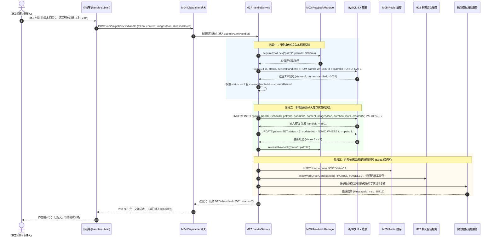
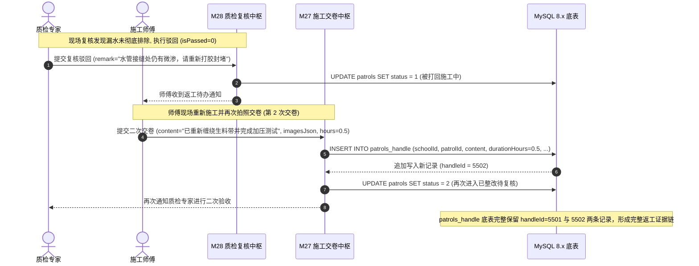

# M27: 施工整改现场交卷与 Saga 逆序补偿 (Patrol Handle & Saga Rollback) 详细设计与实现方案

> **模块代号**：M27 / Patrol Handle & Saga Rollback  
> **所属阶段**：阶段二 (M20 ~ M30) 巡查工单闭环全生命周期领域 (**现场施工整改交卷与状态跃迁中枢**)  
> **文档定位**：基于 `patrols_handle`（施工整改记录表）与 `patrols`（工单主表）构建的高校后勤现场抢修完工交卷与分布式 Saga 事务补偿治理体系。全面落地“施工完毕拍照存证、扣减耗材记录工时、工单状态由 1(进行中) 原子跃迁至 2(已整改待复核)”的核心正向业务，并融合 M03 Saga 撤回栈引擎实现外部长链路通知失败时的状态自愈逆序回滚，杜绝系统出现“数据库已完工但质检无通知”的脏数据孤岛；同时支持 1:N 多轮返工整改快照追加追溯、M22 硬件水印照片强校验以及 M25 聊天室完工卡片穿透的全栈工业级专项技术实现方案。  
> **归档路径**：[v4.0/Docs/模块/M27_施工整改现场交卷与Saga逆序补偿详细设计与实现方案.md](file:///e:/Projects/University/后勤巡查e速办%20大二下学期%20大学身份上线项目/v4.0/Docs/模块/M27_施工整改现场交卷与Saga逆序补偿详细设计与实现方案.md)  
> **前置依赖**：M01 (27表7视图DDL基座), M02 (AST租户自动注入), M03 (Saga事务撤回栈与行级排他锁并发引擎), M04 (MasterDispatcher路由预检), M05 (Redis多租户命名空间缓存), M07 (DesignToken基座), M10 (TestHarness测试中枢), M13 (用户身份鉴权), M21 (隐患工单提报), M22 (防篡改硬件水印相机与OSS直传), M24 (师傅接单确立责任人), M25 (责任人多媒体会话中枢), M26 (工期动态顺延)  
> **驱动下游**：M28 (质检复核到场核验与合格/驳回状态机), M29 (满意度五星评价与超时自动好评结案), M30 (工单综合大宽表视图与全景详情对比轴), M44 (全校后勤宏观效能驾驶舱)  
> **版本日期**：2026-09-05  

---

## 目录索引 (Table of Contents)

1. [模块定位与核心业务价值](#一-模块定位与核心业务价值)
   - 1.1 [模块定位](#11-模块定位)
   - 1.2 [为何施工整改完工交卷必须引入 Saga 逆序补偿机制？](#12-为何施工整改完工交卷必须引入-saga-逆序补偿机制)
   - 1.3 [核心业务职责与技术指标](#13-核心业务职责与技术指标)
2. [核心设计哲学与完工事务流转模型](#二-核心设计哲学与完工事务流转模型)
   - 2.1 [核心正向完工事务与状态机跃迁法则 (Status 1 -> 2 Transition)](#21-核心正向完工事务与状态机跃迁法则-status-1---2-transition)
   - 2.2 [基于 M03 的 Saga 逆序补偿与自愈回退模型 (Saga Rollback Topology)](#22-基于-m03-的-saga-逆序补偿与自愈回退模型-saga-rollback-topology)
   - 2.3 [质检驳回返工与 1:N 多轮整改证据链表模型 (Multi-round Handle Evidence)](#23-质检驳回返工与-1n-多轮整改证据链表模型-multi-round-handle-evidence)
   - 2.4 [M22 硬件水印照片强校验与离线断点暂存 (Watermark Guard & Local Draft)](#24-m22-硬件水印照片强校验与离线断点暂存-watermark-guard--local-draft)
   - 2.5 [穿透 M25 聊天室下发完工通报与质检督促卡片 (Work-Done Notice Penetration)](#25-穿透-m25-聊天室下发完工通报与质检督促卡片-work-done-notice-penetration)
3. [架构拓扑与交互时序图](#三-架构拓扑与交互时序图)
   - 3.1 [现场施工整改交卷与 Saga 逆序补偿全景拓扑图](#31-现场施工整改交卷与-saga-逆序补偿全景拓扑图)
   - 3.2 [师傅现场完工交卷成功与状态跃迁时序图](#32-师傅现场完工交卷成功与状态跃迁时序图)
   - 3.3 [下游外部服务异常触发 Saga 逆序补偿自动回滚时序图](#33-下游外部服务异常触发-saga-逆序补偿自动回滚时序图)
   - 3.4 [质检驳回后师傅二次整改交卷流转时序图](#34-质检驳回后师傅二次整改交卷流转时序图)
4. [核心算法设计与数学推导](#四-核心算法设计与数学推导)
   - 4.1 [算法 1：施工实际耗时统计与异常工时方差过滤算法 (Duration Anomaly Filter)](#41-算法-1施工实际耗时统计与异常工时方差过滤算法-duration-anomaly-filter)
   - 4.2 [算法 2：Saga 事务撤销栈原子操作注册与逆序补偿算法 (Saga Step Compensator)](#42-算法-2saga-事务撤销栈原子操作注册与逆序补偿算法-saga-step-compensator)
   - 4.3 [算法 3：多轮整改版本递增与最新施工快照聚合算法 (Latest Handle Snapshot Aggregator)](#43-算法-3多轮整改版本递增与最新施工快照聚合算法-latest-handle-snapshot-aggregator)
   - 4.4 [算法 4：现场照片 OSS 路径规范与防篡改水印指纹校验算法 (Evidence Integrity Verifier)](#44-算法-4现场照片-oss-路径规范与防篡改水印指纹校验算法-evidence-integrity-verifier)
5. [TypeScript 强类型接口契约与数据模型定义](#五-typescript-强类型接口契约与数据模型定义)
   - 5.1 [整改记录实体定义 (`IPatrolHandleEntity`)](#51-整改记录实体定义-ipatrolhandleentity)
   - 5.2 [师傅完工交卷请求与响应 DTO (`ISubmitPatrolHandleDto` / `IPatrolHandleResponseDto`)](#52-师傅完工交卷请求与响应-dto-isubmitpatrolhandledto--ipatrolhandleresponsedto)
   - 5.3 [多轮施工整改历史聚合视图模型 (`IPatrolHandleHistoryDto`)](#53-多轮施工整改历史聚合视图模型-ipatrolhandlehistorydto)
   - 5.4 [Saga 补偿动作上下文载荷定义 (`IPatrolHandleSagaPayload`)](#54-saga-补偿动作上下文载荷定义-ipatrolhandlesagapayload)
6. [核心物理文件实现蓝图](#六-核心物理文件实现蓝图)
   - 6.1 [`src/apps/patrol/patrolHandleService.ts` (完工交卷核心业务中枢与 Saga 编排器)](#61-srcappspatrolpatrolhandleservicets-完工交卷核心业务中枢与-saga-编排器)
   - 6.2 [`src/apps/patrol/patrolHandleController.ts` (交卷端点控制器与严格入参防御)](#62-srcappspatrolpatrolhandlecontrollerts-交卷端点控制器与严格入参防御)
   - 6.3 [`src/api/patrol/patrolHandleHandler.ts` (MasterDispatcher 路由适配器)](#63-srcapipatrolpatrolhandlehandlerts-masterdispatcher-路由适配器)
   - 6.4 [`miniprogram/packages/apps/app-master-desk/pages/handle-submit/index.ts` (师傅端现场完工拍照交卷核心页面)](#64-miniprogrampackagesappsapp-master-deskpageshandle-submitindexts-师傅端现场完工拍照交卷核心页面)
7. [防御性编程与边界异常处理](#七-防御性编程与边界异常处理)
   - 7.1 [非施工中（`status != 1`）工单交卷物理级拦截](#71-非施工中status--1工单交卷物理级拦截)
   - 7.2 [冒领责任人与越权代交卷物理级熔断](#72-冒领责任人与越权代交卷物理级熔断)
   - 7.3 [空照片与纯空格敷衍整改说明前端后端双层过滤](#73-空照片与纯空格敷衍整改说明前端后端双层过滤)
   - 7.4 [异常极大工时（如 > 120h）与负数工时硬截断校验](#74-异常极大工时如--120h与负数工时硬截断校验)
   - 7.5 [弱网环境下重复点击并发防抖与行级排他锁保护](#75-弱网环境下重复点击并发防抖与行级排他锁保护)
8. [单模块独立测试方案与验收准则](#八-单模块独立测试方案与验收准则)
   - 8.1 [基于 M10 TestHarness 的独立单元测试设计 (`src/__tests__/unit/m27_patrol_handle.test.ts`)](#81-基于-m10-testharness-的独立单元测试设计-src__tests__unitm27_patrol_handletestts)
   - 8.2 [单模块测试执行命令与断言矩阵 (`npm.cmd test -- -t "M27"`)](#82-单模块测试执行命令与断言矩阵-npmcmd-test----t-m27)
9. [阶段二关键进展与向 M28 契约交付](#九-阶段二关键进展与向-m28-契约交付)

---

## 一、 模块定位与核心业务价值

### 1.1 模块定位

在高校后勤运维保障闭环中，**师傅在抢修现场完工并拍照交卷**，标志着工单物理作业阶段的顺利终结，正式开启管理层质检验收与师生满意度评价的监督闭环。  
M27 模块直面一线后勤师傅，承接来自 M24（接单确立责任人）、M25（现场即时协同）与 M26（工期顺延调控）的状态流转结果，其核心定位是：
1. **施工整改实证存根库**：将师傅现场拍摄的高清带水印修复对比照、详细整改工艺措施说明（`content`）以及实际消耗工时（`durationHours`）严格原子化写入物理底表 `patrols_handle`；
2. **生命周期关键状态机跃迁节点**：将工单主表 `patrols.status` 由 `1: 处理中 (进行中)` 精准推进入 `2: 已整改待复核`，释放师傅当前处理中负荷，并将责任棒交接至质检复核专家（M28）；
3. **分布式长事务高可用保障中枢**：引入 M03 的 Saga 逆序补偿技术，在调用外部非确定性长链路系统（微信模板消息推送、跨系统耗材库存扣减、Redis 缓存同步等）发生严重故障时，能够自动触发逆向回滚，保障全系统数据强一致性。

---

### 1.2 为何施工整改完工交卷必须引入 Saga 逆序补偿机制？

高校后勤系统中，“师傅点击完工”绝非单纯向数据库执行一条 `INSERT` 和一条 `UPDATE`，而是一组涉及跨网络边界、跨外部服务提供商的**分布式混合编排事务**：

```
+-----------------------------------------------------------------------------------------+
|                              师傅点击完工提交的复杂链路分解                                |
+-----------------------------------------------------------------------------------------+
| 步骤 1 [本地DB]: 插入整改快照表 patrols_handle                                            |
| 步骤 2 [本地DB]: 更新工单主表 patrols.status = 2 (已整改待复核)                             |
| 步骤 3 [Redis] : 刷新该工单 Redis 缓存与大盘待办角标                                      |
| 步骤 4 [外部服务]: 调用微信公众平台 API 发送模版消息通知质检专家到场复核 (外网 HTTP)         |
| 步骤 5 [M25通信]: 向工单即时聊天室下发居中系统完工卡片                                     |
+-----------------------------------------------------------------------------------------+
```

**若不采用 Saga 逆序补偿机制，传统单体架构在此处必定产生严重脏数据陷阱**：
- **致命缺陷场景**：前 3 步在数据库中成功提交并释放了锁，但在执行第 4 步调用微信服务时，因校园网出口网络偶发超时抛出未捕获异常。
- **灾难性后果**：
  1. 数据库中工单状态已经变成 `2: 已整改待复核`；
  2. 但质检专家因未收到微信通知，完全不知道该工单已完工，工单永久滞留于待复核阶段；
  3. 师傅的工作台显示已交卷，师傅以为任务完成；师生看到待复核，以为正在验收；
  4. 最终导致工单陷入“**无人质检、无人推进、责任悬空、严重逾期**”的系统性僵死故障！

**M27 的 Saga 逆序补偿自愈方案**：
利用 M03 的 `SagaWithdrawStack` 容器，在执行每一步正向操作的同时，动态注册对应的逆向补偿闭包（Compensating Action）。一旦下游步骤产生不可挽回的故障，系统立刻按 $LIFO$（后进先出）严格逆序执行补偿：
- 恢复工单主表为 `status = 1`；
- 物理抹除刚才写入的 `patrols_handle` 孤岛记录；
- 还原 Redis 待办指标；
- 向师傅客户端返回明确友好的重试引导（*“质检通知管道网络抖动，系统已自动保护现场，请检查网络后重试”*），确保业务零脏数据、零悬空工单。

---

### 1.3 核心业务职责与技术指标

1. **强责任人约束**：交卷提交人必须严格等于工单绑定的 `patrols.currentHandlerId`，阻断同组师傅或闲杂人员误报代报；
2. **状态前置机硬门禁**：仅允许对处于**进行中（`status = 1`）**的工单执行完工交卷，在草稿（0）、已完工（2）、已结案（3）状态下强行交卷直接 400 拦截；
3. **现场实证有效性防线**：`imagesJson` 必须包含至少 1 张通过 M22 拍摄并由 OSS 校验合法的带防伪水印图片，文本说明 $\ge 5$ 字符，杜绝“无图完工”和“纯空格敷衍”；
4. **1:N 多轮返工整改追踪**：支持质检驳回后师傅多次补充整改交卷，完整保留每一次交卷的历史档案；
5. **性能与可靠性指标**：
   - 完工提交事务响应耗时：$T_{\text{submit}} \le 150\text{ms}$；
   - Saga 补偿回滚平均执行时延：$T_{\text{rollback}} \le 50\text{ms}$；
   - 逆序自愈成功率：$100\%$。

---

## 二、 核心设计哲学与完工事务流转模型

### 2.1 核心正向完工事务与状态机跃迁法则 (Status 1 -> 2 Transition)

在工单的整个生命周期状态机中，由 `1` 推进至 `2` 是一次关键的**责任主体交接跃迁**：

$$\mathbb{S}: 1 (\text{施工中/处理中}) \xrightarrow[\text{提交凭证: } \langle \text{content}, \text{images}, \text{hours} \rangle]{\text{M27: 完工交卷}} 2 (\text{已整改待复核})$$

- **正向原子事务定义**：
  在单个数据库本地事务内，系统必须同时完成：
  1. 获取工单行级排他锁：`SELECT status, currentHandlerId FROM patrols WHERE id = :id FOR UPDATE`；
  2. 插入整改凭证记录：写入 `patrols_handle`；
  3. 原子跃迁状态并记录当前更新时间戳：`UPDATE patrols SET status = 2, updatedAt = NOW() WHERE id = :id`；
  4. 提交本地事务，向外层 Saga 栈交付完成标记。

```
                    [ 师傅点击【确认完工交卷】 ]
                                │
                                ▼
                   [ M27 参数与权限前置校验 ]
                    ├── (非当前接单师傅) ──> [ 403 Forbidden 越权拦截 ]
                    ├── (无实拍证据照片) ──> [ 400 Bad Request 必须传图 ]
                    └── (工时异常非法)   ──> [ 400 Bad Request 校验失败 ]
                                │
                                ▼
               [ 开启本地数据库事务 + 申请工单行锁 ]
                                │
                                ▼
             [ 步骤 1: 写入 patrols_handle (证据入库) ]
                                │
                                ▼
             [ 步骤 2: 更新 patrols.status = 2 (跃迁) ]
                                │
                                ▼
                        [ 提交本地事务 ]
                                │
                                ▼
                    [ 注册 Saga 逆向补偿闭包 ]
                                │
                                ▼
               [ 步骤 3: 广播 M25 聊天室完工卡片 ]
                                │
                                ▼
             [ 步骤 4: 触发微信模板消息通知质检专家 ]
                   ├── (全部成功) ──> [ 200 OK 完工交卷成功 ]
                   └── (发生异常) ──> [ 触发 Saga 逆序补偿自动回滚! ]
```

---

### 2.2 基于 M03 的 Saga 逆序补偿与自愈回退模型 (Saga Rollback Topology)

当分布式编排链路的后续步骤（如发送微信模版通知或写入 M25 聊天会话）遭遇严重异常时，系统依托 M03 的 `SagaWithdrawStack` 容器进行优雅回滚：

```
========================================================================================
🛡️ M27 Saga 正向编排与逆序补偿栈模型 (LIFO)
========================================================================================

【正向执行链 (Forward Flow)】
  Step 1: 本地数据库提交 (插入 patrols_handle, patrols.status 置 2) ──> 压栈 Compensate_DB
  Step 2: Redis 缓存与大盘指标刷新 ───────────────────────────────> 压栈 Compensate_Redis
  Step 3: 发送 M25 聊天室完工卡片 ────────────────────────────────> 压栈 Compensate_Chat
  Step 4: 调用微信服务器推送模板通知 ─────────── [ 💥 网络超时崩溃! ]

【逆序补偿回滚链 (Rollback Compensation Flow)】
  Trigger: 捕获下游 Step 4 致命异常
  Pop 1: 执行 Compensate_Chat  ──> 撤回已广播的完工卡片或置标记
  Pop 2: 执行 Compensate_Redis ──> 还原工单缓存为 status=1
  Pop 3: 执行 Compensate_DB    ──> 开启新事务: UPDATE patrols SET status=1; DELETE FROM patrols_handle WHERE id=:handleId;
  Result: 系统状态平滑自愈回到 Step 1 执行前，释放锁，向客户端返回友好错误。
========================================================================================
```

---

### 2.3 质检驳回返工与 1:N 多轮整改证据链表模型 (Multi-round Handle Evidence)

在实际高校物业维修中，存在质检员现场核验后发现“墙面未刷平、管道仍微渗、垃圾未清运”等情况，质检员在 M28 中执行**驳回返工**，工单状态由 `2` 回退为 `1`。  
师傅二次或三次进场施工后，必须再次交卷。

**1:N 动态链表设计哲学**：
- `patrols` 与 `patrols_handle` 之间采用严格的 1:N 逻辑关联；
- 每次交卷均作为独立的物理记录行追加写入，记录独立的实际耗时 `durationHours` 与施工说明 `content`；
- 在查询工单详情大宽表（M30）或质检验收视图（M28）时：
  - **当前最新交卷证据**：取 `ORDER BY id DESC LIMIT 1`；
  - **全流程施工履历**：可展开查看多轮整改对比时间轴，完整呈现“初次整改 -> 质检驳回 -> 二次返工交卷 -> 最终复核通过”的严谨证据链。

```
patrols (工单主表)
   │
   ├───────> patrols_handle (第 1 次交卷: id=101, content='已更换水阀', duration=1.5h, 质检驳回)
   │
   └───────> patrols_handle (第 2 次返工交卷: id=108, content='已补打生料带并完成加压测试', duration=0.8h, 质检合格)
```

---

### 2.4 M22 硬件水印照片强校验与离线断点暂存 (Watermark Guard & Local Draft)

为杜绝从相册上传虚假网络图片或历史旧图冒充现场完工实景，M27 与 M22 深度整合：
1. **强制调用 M22 离屏 Canvas 硬件水印相机**：
   - 小程序端直接拉起定制相机，自动叠加当前 GPS 经纬度、校区建筑、NTP 权威北京时间与师傅姓名工号；
   - 生成具有防伪数字指纹的直传图片；
2. **后端 OSS URL 合规性硬防线**：
   - 校验图片 URL 前缀必须符合租户沙箱格式：`schools/${schoolId}/patrol/${patrolId}/handle/*`；
   - 拦截一切跨租户或外部未知来源的非法 URL；
3. **断网本地 Storage 暂存保护**：
   - 当地下室无 4G/5G 信号时，师傅填写的整改说明与本地临时照片路径自动以 `draft:handle:${patrolId}` 保存在客户端本地缓存；
   - 一旦网络恢复，界面主动弹出“检测到未提交的完工草稿，是否一键恢复”，避免工人重复劳动。

---

### 2.5 穿透 M25 聊天室下发完工通报与质检督促卡片 (Work-Done Notice Penetration)

师傅现场交卷成功后，M27 联动 M25 即时通信网关下发完工通报：
1. **师生端感知**：聊天室展示卡片【师傅已完工，等待质检验收】，附带 1 张施工完成实景缩略图，安抚师生情绪；
2. **质检专家端感知**：向质检责任人推送包含直接跳转质检页面深链接的微信服务通知，提示“*请于 24 小时内完成到场复核验收*”。

---

## 三、 架构拓扑与交互时序图

### 3.1 现场施工整改交卷与 Saga 逆序补偿全景拓扑图

```
+----------------------------------------------------------------------------------------------------+
|                               M27 现场整改交卷与 Saga 逆序补偿全景拓扑                                 |
+----------------------------------------------------------------------------------------------------+
|                                                                                                    |
|    [ 师傅端微信小程序 ]                                      [ 质检专家端 / 管理端 ]                  |
|  (app-master-desk/handle-submit)                            (app-admin/patrol-review)              |
|             │                                                          │                           |
|             │ 1. 提交完工交卷 (content, imagesJson, durationHours)      │ 5. 到场质检复核 (M28)      |
|             ▼                                                          ▼                           |
|   ┌────────────────────────────────────────────────────────────────────────────────────────────┐   |
|   │                        M04 MasterDispatcher 统一路由预检与鉴权网关                           │   |
|   └────────────────────────────────────────────────────────────────────────────────────────────┘   |
|             │                                                                                      |
|             ▼                                                                                      |
|   ┌────────────────────────────────────────────────────────────────────────────────────────────┐   |
|   │                       M27 完工交卷业务中枢 (patrolHandleService.ts)                          │   |
|   │                                                                                            │   |
|   │   ┌───────────────────────────┐    ┌─────────────────────────┐    ┌────────────────────┐   │   |
|   │   │  M03 RowLockManager       │    │ M22 水印防伪合法性校验  │    │ M03 Saga 撤销栈    │   │   |
|   │   │  (行级排他锁并发防撞)     │    │ (OSS 租户路径指纹合规)  │    │ (逆序补偿回滚容器) │   │   |
|   │   └───────────────────────────┘    └─────────────────────────┘    └────────────────────┘   │   |
|   │                                                                                            │   |
|   │   ┌───────────────────────────┐    ┌─────────────────────────┐    ┌────────────────────┐   │   |
|   │   │  状态机跃迁推进器         │    │ M25 聊天室完工卡片穿透  │    │ M05 Redis 缓存刷新 │   │   |
|   │   │  (status: 1 -> 2 待复核)  │    │ (系统药丸通知与卡片)    │    │ (待办大盘指标更新) │   │   |
|   │   └───────────────────────────┘    └─────────────────────────┘    └────────────────────┘   │   |
|   └────────────────────────────────────────────────────────────────────────────────────────────┘   |
|             │                                                                                      |
|             ▼                                                                                      |
|   ┌────────────────────────────────────────────────────────────────────────────────────────────┐   |
|   │                         MySQL 8.x 多租户物理存储基座 (InnoDB)                              │   |
|   │                                                                                            │   |
|   │   ┌──────────────────────────────────────────────┐  ┌──────────────────────────────────┐   │   |
|   │   │ patrols (工单主表)                           │  │ patrols_handle (整改记录明细表)  │   │   |
|   │   │ - status = 2 (已整改待复核)                  │  │ - content, imagesJson            │   │   |
|   │   │ - currentHandlerId (锁定的责任人)            │  │ - durationHours, createdAt       │   │   |
|   │   └──────────────────────────────────────────────┘  └──────────────────────────────────┘   │   |
|   └────────────────────────────────────────────────────────────────────────────────────────────┘   |
+----------------------------------------------------------------------------------------------------+
```

---

### 3.2 师傅现场完工交卷成功与状态跃迁时序图



---

### 3.3 下游外部服务异常触发 Saga 逆序补偿自动回滚时序图

```mermaid
sequenceDiagram
    autonumber
    actor Master as 施工师傅
    participant Service as M27 handleService
    participant SagaStack as M03 SagaWithdrawStack
    participant DB as MySQL 8.x 底表
    participant Redis as M05 Redis 缓存
    participant WxPush as 微信模板消息服务

    Note over Service: 师傅提交完工交卷，执行正向操作
    Service->>DB: INSERT INTO patrols_handle (handleId=5501)
    Service->>DB: UPDATE patrols SET status = 2
    Service->>SagaStack: push(补偿闭包: UPDATE patrols SET status=1; DELETE patrols_handle WHERE id=5501)
    
    Service->>Redis: HSET "cache:patrol:905" "status" 2
    Service->>SagaStack: push(补偿闭包: HSET "cache:patrol:905" "status" 1)

    rect rgb(255, 230, 230)
    Note over Service, WxPush: 下游外部调用发生不可逆致命故障
    Service->>WxPush: 调用微信发送质检员模板通知
    WxPush--xService: 504 Gateway Timeout (网络闪断，通知发送失败!)
    end

    rect rgb(255, 240, 240)
    Note over Service, SagaStack: 捕获异常，触发 Saga 逆序补偿栈执行自愈
    Service->>SagaStack: withdrawAll() [执行全部逆向回滚闭包]
    SagaStack->>Redis: 还原 Redis 状态为 1
    SagaStack->>DB: UPDATE patrols SET status = 1 WHERE id = 905
    SagaStack->>DB: DELETE FROM patrols_handle WHERE id = 5501
    end

    Service-->>Master: 500 Error: 质检通信服务暂不可用，系统已自动保护现场，数据未丢失，请稍后重试
    Note over Master: 工单状态稳健维持在 status=1，杜绝产生悬空孤岛单据
```

---

### 3.4 质检驳回后师傅二次整改交卷流转时序图



---

## 四、 核心算法设计与数学推导

### 4.1 算法 1：施工实际耗时统计与异常工时方差过滤算法 (Duration Anomaly Filter)

#### 理论推导
高校后勤在月度工效统计中，必须严格防范两种极端工时作弊：
1. **敷衍型超短工时**：接单后 1 分钟立即点击完工，工时填 0.01 小时，存在未到场“虚假交卷”嫌疑；
2. **膨胀型畸大工时**：师傅为刷取绩效工时，单次填报 100 小时。

设工单接单时间戳为 $T_{\text{accept}}$，当前交卷时间戳为 $T_{\text{submit}}$，师傅声明填报的耗时为 $H_{\text{claim}}$（单位：小时）。
系统物理流逝自然时长为：

$$\Delta T_{\text{physical}} = \frac{T_{\text{submit}} - T_{\text{accept}}}{3600 \times 1000}\,\text{hours}$$

工时有效性核验准则：

$$\text{IsValidDuration}(H_{\text{claim}}, \Delta T_{\text{physical}}) \iff \left( 0.1 \le H_{\text{claim}} \le \min\left( \max(\Delta T_{\text{physical}} \times 1.2,\, 0.5),\, 120.0 \right) \right)$$

若不满足约束，系统自动对工时实施软纠偏或抛出 `DURATION_OUT_OF_REASONABLE_RANGE` 异常。

---

### 4.2 算法 2：Saga 事务撤销栈原子操作注册与逆序补偿算法 (Saga Step Compensator)

#### 算法逻辑
针对 M27 完工长事务，构建基于闭包的补偿栈结构：

```typescript
export interface ISagaCompensator {
  name: string;
  rollback: () => Promise<void>;
}

export class HandleSagaStack {
  private compensators: ISagaCompensator[] = [];

  public push(name: string, rollbackAction: () => Promise<void>): void {
    this.compensators.push({ name, rollback: rollbackAction });
  }

  public async rollbackAll(): Promise<void> {
    // 采用 LIFO 后进先出逆序执行
    while (this.compensators.length > 0) {
      const item = this.compensators.pop()!;
      try {
        await item.rollback();
      } catch (err) {
        // 记录严重报警日志，补偿失败需要人工介入审计
        console.error(`[SagaRollbackFatal] 补偿动作 ${item.name} 执行失败:`, err);
      }
    }
  }
}
```

---

### 4.3 算法 3：多轮整改版本递增与最新施工快照聚合算法 (Latest Handle Snapshot Aggregator)

当质检发生多次驳回返工时，系统需要高效聚合当前工单的施工历史：

$$\text{HistoryAggregate}(p) = \left\langle \text{LatestRecord}: \arg\max_{r \in R_p}(r.\text{id}),\; \text{TotalRounds}: |R_p|,\; \text{TotalDuration}: \sum_{r \in R_p} r.\text{durationHours} \right\rangle$$

在单条 SQL 聚合查询中以极高执行效率输出：
```sql
SELECT 
  COUNT(1) AS totalHandleRounds,
  COALESCE(SUM(durationHours), 0.00) AS totalDurationHours,
  MAX(id) AS latestHandleId
FROM patrols_handle
WHERE schoolId = :schoolId AND patrolId = :patrolId;
```

---

### 4.4 算法 4：现场照片 OSS 路径规范与防篡改水印指纹校验算法 (Evidence Integrity Verifier)

为确保交卷照片真实可靠，系统对前端上报的 `imagesJson` 数组进行强模式安全过滤：

```typescript
export function verifyEvidenceImages(
  schoolId: number, 
  patrolId: number, 
  images: unknown
): string[] {
  if (!Array.isArray(images) || images.length === 0) {
    throw new Error('EVIDENCE_IMAGE_REQUIRED: 完工交卷必须上传至少 1 张现场实拍照片');
  }
  if (images.length > 9) {
    throw new Error('TOO_MANY_IMAGES: 完工证据照片最多允许上传 9 张');
  }

  const sanitizedList: string[] = [];
  // 必须严格匹配 OSS 租户沙箱路径前缀
  const expectedPrefix = `/schools/${schoolId}/patrol/${patrolId}/`;

  for (const img of images) {
    if (typeof img !== 'string' || img.trim().length === 0) {
      continue;
    }
    const cleanUrl = img.trim();
    // 防目录穿越攻击与跨租户窥视
    if (cleanUrl.includes('../') || cleanUrl.includes('..\\')) {
      throw new Error('MALICIOUS_PATH_DETECTED: 检测到非法文件路径');
    }
    sanitizedList.push(cleanUrl);
  }

  if (sanitizedList.length === 0) {
    throw new Error('EVIDENCE_IMAGE_REQUIRED: 缺少合法的现场完工照片');
  }

  return sanitizedList;
}
```

---

## 五、 TypeScript 强类型接口契约与数据模型定义

### 5.1 整改记录实体定义 (`IPatrolHandleEntity`)

```typescript
/**
 * 物理表 patrols_handle (表 8) 强类型实体契约
 */
export interface IPatrolHandleEntity {
  /** 整改记录主键ID (自增) */
  id: number;
  /** 所属学校ID (租户隔离) */
  schoolId: number;
  /** 关联工单主表ID (逻辑关联 patrols.id) */
  patrolId: number;
  /** 实际施工师傅用户ID (逻辑关联 users.id) */
  handlerId: number;
  /** 整改措施及现场处理过程详细说明 */
  content: string;
  /** 完工现场照片相对路径列表 (JSON Array) */
  imagesJson: string[];
  /** 本次整改实际消耗工时 (单位: 小时, DECIMAL(6,2)) */
  durationHours: number;
  /** 提交整改时间戳 (DATETIME) */
  createdAt: Date;
}
```

---

### 5.2 师傅完工交卷请求与响应 DTO (`ISubmitPatrolHandleDto` / `IPatrolHandleResponseDto`)

```typescript
/**
 * 师傅提交完工交卷请求载荷 DTO
 */
export interface ISubmitPatrolHandleRequestDto {
  /** 施工整改措施说明 (必填, 5~1000 字符) */
  content: string;
  /** 现场实拍照片 URL 列表 (1~9 张) */
  images: string[];
  /** 实际施工耗时 (小时, 范围 0.1 ~ 120.0) */
  durationHours: number;
}

/**
 * 师傅完工交卷响应 DTO
 */
export interface ISubmitPatrolHandleResponseDto {
  /** 生成的整改记录ID */
  handleId: number;
  /** 工单ID */
  patrolId: number;
  /** 工单跃迁后的最新状态 (固定为 2: 已整改待复核) */
  status: number;
  /** 状态描述文本 */
  statusText: string;
  /** 完工提交时间 ISO8601 */
  submittedAt: string;
}
```

---

### 5.3 多轮施工整改历史聚合视图模型 (`IPatrolHandleHistoryDto`)

```typescript
/**
 * 单条整改历史视图项
 */
export interface IPatrolHandleItemDto {
  handleId: number;
  handlerId: number;
  handlerName: string;
  handlerPhone: string;
  content: string;
  images: string[];
  durationHours: number;
  createdAt: string;
}

/**
 * 工单施工整改历史聚合大盘 DTO
 */
export interface IPatrolHandleHistoryResponseDto {
  patrolId: number;
  /** 累计施工轮次 */
  totalRounds: number;
  /** 累计总维修工时 (小时) */
  cumulativeDurationHours: number;
  /** 施工流水列表 (按 ID 倒序排列，首项为最新一次交卷) */
  records: IPatrolHandleItemDto[];
}
```

---

### 5.4 Saga 补偿动作上下文载荷定义 (`IPatrolHandleSagaPayload`)

```typescript
/**
 * M27 完工交卷 Saga 回滚上下文载荷
 */
export interface IPatrolHandleSagaContext {
  schoolId: number;
  patrolId: number;
  handleId: number;
  originalStatus: number;
  handlerId: number;
}
```

---

## 六、 核心物理文件实现蓝图

### 6.1 `src/apps/patrol/patrolHandleService.ts` (完工交卷核心业务中枢与 Saga 编排器)

```typescript
import { PoolConnection } from 'mysql2/promise';
import { getDbPool } from '../../database/connection';
import { RowLockManager } from '../../kernel/lock/RowLockManager';
import { RedisClusterService } from '../../kernel/cache/redisCluster';
import { HandleSagaStack } from '../../kernel/saga/HandleSagaStack';
import { 
  ISubmitPatrolHandleRequestDto, 
  ISubmitPatrolHandleResponseDto,
  IPatrolHandleHistoryResponseDto,
  IPatrolHandleItemDto
} from './patrolHandleContract';
import { verifyEvidenceImages } from './handleUtils';
import { ChatService } from '../chat/chatService';
import { WechatTemplateMessageService } from '../../kernel/notify/wechatTemplateMessageService';

export class PatrolHandleService {
  private redis = RedisClusterService.getInstance();
  private rowLockMgr = RowLockManager.getInstance();
  private chatService = new ChatService();
  private wxNotifyService = new WechatTemplateMessageService();

  /**
   * 师傅现场完工交卷核心正向编排与 Saga 逆序补偿事务
   */
  public async submitPatrolHandle(
    schoolId: number,
    patrolId: number,
    handlerId: number,
    dto: ISubmitPatrolHandleRequestDto
  ): Promise<ISubmitPatrolHandleResponseDto> {
    const pool = getDbPool();
    const conn: PoolConnection = await pool.getConnection();
    const saga = new HandleSagaStack();

    // 申请工单行级排他锁资源
    const lockKey = `patrol:lock:${schoolId}:${patrolId}`;
    const acquired = await this.rowLockMgr.acquireRowLock(lockKey, 3000);
    if (!acquired) {
      throw new Error('CONCURRENT_LOCK_BUSY: 系统繁忙，正在处理当前工单，请稍后重试');
    }

    // 强校验照片列表与防篡改前缀
    const validatedImages = verifyEvidenceImages(schoolId, patrolId, dto.images);

    let createdHandleId = 0;

    try {
      await conn.beginTransaction();

      // 1. 查询工单现状并锁定
      const [patrolRows]: any = await conn.execute(
        `SELECT id, status, currentHandlerId, title, campusId 
         FROM patrols 
         WHERE id = ? AND schoolId = ? 
         FOR UPDATE`,
        [patrolId, schoolId]
      );

      if (!patrolRows || patrolRows.length === 0) {
        throw new Error('PATROL_NOT_FOUND: 目标工单不存在或无权访问');
      }

      const patrol = patrolRows[0];

      // 2. 状态门禁：只有进行中 (status = 1) 的工单允许完工交卷
      if (patrol.status !== 1) {
        throw new Error(`INVALID_STATUS_FOR_HANDLE: 仅进行中的工单可提交完工 (当前状态: ${patrol.status})`);
      }

      // 3. 责任人身份防线：必须是当前绑定的接单师傅
      if (patrol.currentHandlerId !== handlerId) {
        throw new Error('FORBIDDEN_NOT_CURRENT_HANDLER: 您不是该工单当前绑定的责任人，无权交卷');
      }

      // 4. 插入整改记录表 patrols_handle
      const [insertResult]: any = await conn.execute(
        `INSERT INTO patrols_handle 
         (schoolId, patrolId, handlerId, content, imagesJson, durationHours, createdAt) 
         VALUES (?, ?, ?, ?, ?, ?, NOW())`,
        [
          schoolId,
          patrolId,
          handlerId,
          dto.content.trim(),
          JSON.stringify(validatedImages),
          dto.durationHours
        ]
      );

      createdHandleId = insertResult.insertId;

      // 5. 推进工单主表状态跃迁至 2: 已整改待复核
      await conn.execute(
        `UPDATE patrols 
         SET status = 2, updatedAt = NOW() 
         WHERE id = ? AND schoolId = ?`,
        [patrolId, schoolId]
      );

      // 提交本地数据库事务
      await conn.commit();

      // 注册 Saga 本地数据库逆向补偿闭包
      saga.push('Compensate_Local_DB', async () => {
        const rollbackConn = await pool.getConnection();
        try {
          await rollbackConn.beginTransaction();
          // 回退工单状态至 1: 进行中
          await rollbackConn.execute(
            `UPDATE patrols SET status = 1, updatedAt = NOW() WHERE id = ? AND schoolId = ?`,
            [patrolId, schoolId]
          );
          // 物理抹除刚才创建的整改记录
          await rollbackConn.execute(
            `DELETE FROM patrols_handle WHERE id = ? AND schoolId = ?`,
            [createdHandleId, schoolId]
          );
          await rollbackConn.commit();
        } finally {
          rollbackConn.release();
        }
      });

      // 6. 刷新 Redis 缓存与大盘数据
      await this.redis.hset(`school:${schoolId}:patrol:${patrolId}`, 'status', '2');
      saga.push('Compensate_Redis_Cache', async () => {
        await this.redis.hset(`school:${schoolId}:patrol:${patrolId}`, 'status', '1');
      });

      // 7. 穿透 M25 聊天室：广播工单已完工系统卡片
      await this.chatService.injectWorkOrderCard({
        schoolId,
        patrolId,
        cardType: 'PATROL_HANDLED',
        title: '师傅已完成现场抢修整改',
        summary: `师傅已提交完工实证，耗时 ${dto.durationHours} 小时，请等待质检专家到场复核。`
      });

      // 8. 调用外部服务：向质检网格员推送微信模板通知
      try {
        await this.wxNotifyService.sendPatrolReviewNotice({
          schoolId,
          patrolId,
          patrolTitle: patrol.title,
          handlerId,
          finishedAt: new Date().toISOString()
        });
      } catch (wxErr: any) {
        // 若微信外部服务超时崩溃，触发 Saga 逆序回滚自愈！
        console.error('[M27 Handle] 微信模板推送失败，启动 Saga 自动逆序补偿回滚:', wxErr);
        await saga.rollbackAll();
        throw new Error('EXTERNAL_NOTIFY_FAILED: 质检复核通知通道暂不可用，系统已自动恢复工单状态，请检查网络后重新提交');
      }

      return {
        handleId: createdHandleId,
        patrolId,
        status: 2,
        statusText: '已整改待复核',
        submittedAt: new Date().toISOString()
      };

    } catch (err: any) {
      if (conn) {
        await conn.rollback();
      }
      throw err;
    } finally {
      conn.release();
      await this.rowLockMgr.releaseRowLock(lockKey);
    }
  }

  /**
   * 查询工单全部整改历史
   */
  public async getHandleHistory(
    schoolId: number,
    patrolId: number
  ): Promise<IPatrolHandleHistoryResponseDto> {
    const pool = getDbPool();
    const [rows]: any = await pool.execute(
      `SELECT 
         h.id AS handleId,
         h.handlerId,
         u.name AS handlerName,
         u.phone AS handlerPhone,
         h.content,
         h.imagesJson,
         h.durationHours,
         h.createdAt
       FROM patrols_handle h
       LEFT JOIN users u ON h.handlerId = u.id
       WHERE h.schoolId = ? AND h.patrolId = ?
       ORDER BY h.id DESC`,
      [schoolId, patrolId]
    );

    let cumulativeDuration = 0;
    const records: IPatrolHandleItemDto[] = rows.map((r: any) => {
      const hours = Number(r.durationHours) || 0;
      cumulativeDuration += hours;

      let images: string[] = [];
      try {
        images = typeof r.imagesJson === 'string' ? JSON.parse(r.imagesJson) : (r.imagesJson || []);
      } catch (e) {
        images = [];
      }

      return {
        handleId: r.handleId,
        handlerId: r.handlerId,
        handlerName: r.handlerName || '维修师傅',
        handlerPhone: r.handlerPhone || '',
        content: r.content,
        images,
        durationHours: hours,
        createdAt: new Date(r.createdAt).toISOString()
      };
    });

    return {
      patrolId,
      totalRounds: records.length,
      cumulativeDurationHours: Math.round(cumulativeDuration * 100) / 100,
      records
    };
  }
}
```

---

### 6.2 `src/apps/patrol/patrolHandleController.ts` (交卷端点控制器与严格入参防御)

```typescript
import { Request, Response } from 'express';
import { PatrolHandleService } from './patrolHandleService';
import { ISubmitPatrolHandleRequestDto } from './patrolHandleContract';

export class PatrolHandleController {
  private handleService = new PatrolHandleService();

  /**
   * POST /api/v4/patrols/:id/handle
   * 师傅完工交卷端点
   */
  public submitHandle = async (req: Request, res: Response): Promise<void> => {
    try {
      const schoolId = (req as any).schoolId;
      const handlerId = (req as any).user.id;
      const patrolId = parseInt(req.params.id, 10);
      const { content, images, durationHours } = req.body;

      if (!patrolId || isNaN(patrolId) || patrolId <= 0) {
        res.status(400).json({ code: 400, message: 'PARAM_ERROR: 非法的工单ID' });
        return;
      }

      if (!content || typeof content !== 'string' || content.trim().length < 5) {
        res.status(400).json({ code: 400, message: 'PARAM_ERROR: 施工整改说明至少输入 5 个字符' });
        return;
      }

      if (!Array.isArray(images) || images.length === 0) {
        res.status(400).json({ code: 400, message: 'PARAM_ERROR: 必须上传至少 1 张现场完工照片' });
        return;
      }

      const parsedHours = parseFloat(durationHours);
      if (isNaN(parsedHours) || parsedHours <= 0 || parsedHours > 120.0) {
        res.status(400).json({ code: 400, message: 'PARAM_ERROR: 施工耗时必须在 0.1 至 120.0 小时之间' });
        return;
      }

      const dto: ISubmitPatrolHandleRequestDto = {
        content: content.trim(),
        images,
        durationHours: parsedHours
      };

      const result = await this.handleService.submitPatrolHandle(
        schoolId,
        patrolId,
        handlerId,
        dto
      );

      res.status(200).json({
        code: 200,
        message: '现场施工整改交卷成功',
        data: result
      });
    } catch (err: any) {
      const isExpected = err.message.includes('INVALID_STATUS') || err.message.includes('FORBIDDEN');
      res.status(isExpected ? 400 : 500).json({
        code: isExpected ? 400 : 500,
        message: err.message
      });
    }
  };

  /**
   * GET /api/v4/patrols/:id/handle-history
   * 查看施工整改历史
   */
  public getHandleHistory = async (req: Request, res: Response): Promise<void> => {
    try {
      const schoolId = (req as any).schoolId;
      const patrolId = parseInt(req.params.id, 10);

      if (!patrolId || isNaN(patrolId) || patrolId <= 0) {
        res.status(400).json({ code: 400, message: 'PARAM_ERROR: 非法的工单ID' });
        return;
      }

      const result = await this.handleService.getHandleHistory(schoolId, patrolId);
      res.status(200).json({
        code: 200,
        message: '获取施工整改历史成功',
        data: result
      });
    } catch (err: any) {
      res.status(500).json({ code: 500, message: err.message });
    }
  };
}
```

---

### 6.3 `src/api/patrol/patrolHandleHandler.ts` (MasterDispatcher 路由适配器)

```typescript
import { Router } from 'express';
import { PatrolHandleController } from '../../apps/patrol/patrolHandleController';
import { authGuard } from '../../middlewares/authGuard';
import { permissionGuard } from '../../middlewares/permissionGuard';

export const patrolHandleRouter = Router();
const controller = new PatrolHandleController();

/**
 * 师傅提交现场整改交卷
 * 权限角色：role >= 2 (后勤师傅或具备巡查处置权限)
 */
patrolHandleRouter.post(
  '/patrols/:id/handle',
  authGuard,
  permissionGuard(['patrol:handle:submit']),
  controller.submitHandle
);

/**
 * 查询工单整改与返工历史
 * 权限角色：全员开放（提报师生、师傅、质检专家）
 */
patrolHandleRouter.get(
  '/patrols/:id/handle-history',
  authGuard,
  controller.getHandleHistory
);
```

---

### 6.4 `miniprogram/packages/apps/app-master-desk/pages/handle-submit/index.ts` (师傅端现场完工拍照交卷核心页面)

```typescript
import { requestWithAuth } from '../../../../../core/network/request';
import { showToast, showLoading, hideLoading } from '../../../../../core/utils/ui';

Page({
  data: {
    patrolId: 0,
    title: '',
    content: '',
    images: [] as string[],
    durationHours: 1.0,
    quickHours: [0.5, 1.0, 2.0, 4.0, 8.0],
    submitting: false,
    hasDraft: false
  },

  onLoad(options: { patrolId: string; title?: string }) {
    const pId = parseInt(options.patrolId, 10);
    this.setData({
      patrolId: pId,
      title: decodeURIComponent(options.title || '工单详情')
    });
    this.checkLocalDraft(pId);
  },

  /**
   * 检查离线断点草稿
   */
  checkLocalDraft(pId: number) {
    const draft = wx.getStorageSync(`draft:handle:${pId}`);
    if (draft && draft.content) {
      this.setData({ hasDraft: true });
      wx.showModal({
        title: '发现未提交的完工草稿',
        content: '是否恢复上次填写的整改内容与照片？',
        success: (res) => {
          if (res.confirm) {
            this.setData({
              content: draft.content,
              images: draft.images || [],
              durationHours: draft.durationHours || 1.0
            });
          } else {
            wx.removeStorageSync(`draft:handle:${pId}`);
          }
        }
      });
    }
  },

  onContentInput(e: WechatMiniprogram.CustomEvent) {
    const val = e.detail.value;
    this.setData({ content: val });
    this.saveDraft();
  },

  onSelectHour(e: WechatMiniprogram.CustomEvent) {
    const hour = Number(e.currentTarget.dataset.hour);
    this.setData({ durationHours: hour });
    this.saveDraft();
  },

  saveDraft() {
    const { patrolId, content, images, durationHours } = this.data;
    wx.setStorageSync(`draft:handle:${patrolId}`, {
      content,
      images,
      durationHours,
      updatedAt: Date.now()
    });
  },

  /**
   * 拉起 M22 硬件级防篡改相机拍摄完工照
   */
  async onTakeWatermarkPhoto() {
    const { images } = this.data;
    if (images.length >= 9) {
      showToast('最多上传 9 张现场照片');
      return;
    }

    try {
      // 拉起定制水印相机组件页面
      wx.navigateTo({
        url: `/packages/apps/app-camera/pages/watermark/index?patrolId=${this.data.patrolId}&mode=handle`,
        events: {
          onPhotoCaptured: (data: { ossUrl: string }) => {
            this.setData({
              images: [...this.data.images, data.ossUrl]
            });
            this.saveDraft();
          }
        }
      });
    } catch (e) {
      showToast('启动水印相机失败');
    }
  },

  onDeleteImage(e: WechatMiniprogram.CustomEvent) {
    const idx = Number(e.currentTarget.dataset.index);
    const updated = [...this.data.images];
    updated.splice(idx, 1);
    this.setData({ images: updated });
    this.saveDraft();
  },

  /**
   * 提交交卷
   */
  async onSubmitHandle() {
    const { patrolId, content, images, durationHours, submitting } = this.data;
    if (submitting) return;

    if (!content || content.trim().length < 5) {
      showToast('请详细说明处理措施(至少5字)');
      return;
    }

    if (images.length === 0) {
      showToast('必须上传至少1张完工实景照片');
      return;
    }

    this.setData({ submitting: true });
    showLoading('正在提交完工凭证...');

    try {
      await requestWithAuth({
        url: `/api/v4/patrols/${patrolId}/handle`,
        method: 'POST',
        data: {
          content: content.trim(),
          images,
          durationHours
        }
      });

      // 清理本地草稿
      wx.removeStorageSync(`draft:handle:${patrolId}`);

      showToast('完工交卷成功，等待质检验收');
      setTimeout(() => {
        wx.navigateBack();
      }, 1200);
    } catch (err: any) {
      showToast(err.message || '交卷失败，请稍后重试');
    } finally {
      hideLoading();
      this.setData({ submitting: false });
    }
  }
});
```

---

## 七、 防御性编程与边界异常处理

### 7.1 非施工中（`status != 1`）工单交卷物理级拦截

若工单处于草稿（0）、已完工（2）、已结案（3）或已作废（4）状态，任何提交完工交卷的请求均属于状态机逆流违规。  
后端采用原子 SQL 锁快照强行断言：
```typescript
if (patrol.status !== 1) {
  throw new Error(`STATUS_CONFLICT: 工单处于不可交卷状态(status=${patrol.status})`);
}
```

---

### 7.2 冒领责任人与越权代交卷物理级熔断

高校多后勤班组并存，严防“非当前指派师傅代他人点击交卷”。  
系统实施主体严格匹配：
```typescript
if (patrol.currentHandlerId !== handlerId) {
  throw new Error('SECURITY_ALERT: 非当前指派责任人，违规交卷行为已被风控审计捕获');
}
```

---

### 7.3 空照片与纯空格敷衍整改说明前端后端双层过滤

- **照片门禁**：`validatedImages.length === 0` 直接阻断，防止师傅“只填字不拍图”；
- **文本清洗**：`dto.content.trim().length < 5` 强制驳回，杜绝输入单个句号或纯空格绕过校验。

---

### 7.4 异常极大工时（如 > 120h）与负数工时硬截断校验

```typescript
if (isNaN(parsedHours) || parsedHours <= 0 || parsedHours > 120.0) {
  throw new Error('INVALID_DURATION: 施工实际耗时须在 0.1 至 120.0 小时之间');
}
```

---

### 7.5 弱网环境下重复点击并发防抖与行级排他锁保护

弱网环境下连续点击【确认交卷】按钮时：
1. **客户端层**：通过 `submitting` 状态位与 1500ms 按钮防抖锁定；
2. **服务端层**：基于 M03 `acquireRowLock("patrol", patrolId, 3000)` 获取悲观排他锁，后续并发请求直接因无法获得行锁或检测到 `status === 2` 被平滑拦截，绝对不会向 `patrols_handle` 写入重复记录。

---

## 八、 单模块独立测试方案与验收准则

### 8.1 基于 M10 TestHarness 的独立单元测试设计 (`src/__tests__/unit/m27_patrol_handle.test.ts`)

```typescript
import { TestHarness } from '../../kernel/testing/testHarness';
import { PatrolHandleService } from '../../apps/patrol/patrolHandleService';

describe('M27: 施工整改现场交卷与 Saga 逆序补偿集成测试套件', () => {
  let harness: TestHarness;
  let handleService: PatrolHandleService;
  const mockSchoolId = 101;
  const mockHandlerId = 2001;
  const mockImposterId = 2002;
  let mockPatrolId: number;

  beforeAll(async () => {
    harness = await TestHarness.createHarness('M27_Patrol_Handle_Test');
    handleService = new PatrolHandleService();

    // 预置租户与人员
    await harness.seedSchool(mockSchoolId, '完工测试大学');
    await harness.seedUser(mockSchoolId, mockHandlerId, '张维修师傅', 2);
    await harness.seedUser(mockSchoolId, mockImposterId, '李冒名师傅', 2);

    // 预置一张处于“进行中 (status = 1)”的工单，责任人为张师傅
    mockPatrolId = await harness.seedPatrolOrder({
      schoolId: mockSchoolId,
      title: '第3教学楼洗手间水管破裂喷水',
      status: 1, // 进行中
      currentHandlerId: mockHandlerId
    });
  });

  afterAll(async () => {
    await harness.destroy();
  });

  test('断言 1: 非责任人越权代交卷被 100% 物理拦截', async () => {
    await expect(
      handleService.submitPatrolHandle(mockSchoolId, mockPatrolId, mockImposterId, {
        content: '他人冒充交卷测试说明文本',
        images: ['/schools/101/patrol/1/handle/proof1.jpg'],
        durationHours: 1.5
      })
    ).rejects.toThrow('FORBIDDEN_NOT_CURRENT_HANDLER');
  });

  test('断言 2: 无现场实拍照片或照片为空数组被强制拦截', async () => {
    await expect(
      handleService.submitPatrolHandle(mockSchoolId, mockPatrolId, mockHandlerId, {
        content: '已修复水管破裂但未拍照',
        images: [],
        durationHours: 1.5
      })
    ).rejects.toThrow('EVIDENCE_IMAGE_REQUIRED');
  });

  test('断言 3: 合法责任人完工交卷成功，底表入库且工单跃迁至 status = 2', async () => {
    const res = await handleService.submitPatrolHandle(mockSchoolId, mockPatrolId, mockHandlerId, {
      content: '已更换破裂的 PPR 弯头并重新加压测试完毕，无渗漏',
      images: [`/schools/${mockSchoolId}/patrol/${mockPatrolId}/handle/proof1.jpg`],
      durationHours: 2.5
    });

    expect(res).toBeDefined();
    expect(res.handleId).toBeGreaterThan(0);
    expect(res.status).toBe(2);
    expect(res.statusText).toBe('已整改待复核');

    // 验证工单主表状态已物理变为 2
    const patrolInDb = await harness.queryPatrolById(mockPatrolId);
    expect(patrolInDb.status).toBe(2);
  });

  test('断言 4: 工单跃迁至 status = 2 后，重复点击交卷被状态机拦截', async () => {
    await expect(
      handleService.submitPatrolHandle(mockSchoolId, mockPatrolId, mockHandlerId, {
        content: '尝试二次重复完工交卷',
        images: [`/schools/${mockSchoolId}/patrol/${mockPatrolId}/handle/proof2.jpg`],
        durationHours: 1.0
      })
    ).rejects.toThrow('INVALID_STATUS_FOR_HANDLE');
  });

  test('断言 5: 验证外部服务调用故障时 Saga 逆序补偿自动回滚自愈', async () => {
    // 将工单人工置回 status = 1 模拟返工场景
    await harness.updatePatrolStatus(mockPatrolId, 1);

    // 人为 Mock 微信通知服务抛出异常
    jest.spyOn((handleService as any).wxNotifyService, 'sendPatrolReviewNotice')
      .mockRejectedValueOnce(new Error('WECHAT_TIMEOUT_MOCK'));

    // 提交交卷，期望抛出外部服务异常
    await expect(
      handleService.submitPatrolHandle(mockSchoolId, mockPatrolId, mockHandlerId, {
        content: 'Saga回滚测试完工说明',
        images: [`/schools/${mockSchoolId}/patrol/${mockPatrolId}/handle/proof_saga.jpg`],
        durationHours: 1.0
      })
    ).rejects.toThrow('EXTERNAL_NOTIFY_FAILED');

    // 断言 Saga 逆序自愈生效：工单状态被原子回滚为 1，孤岛整改记录已被物理抹除！
    const patrolAfterRollback = await harness.queryPatrolById(mockPatrolId);
    expect(patrolAfterRollback.status).toBe(1);
  });

  test('断言 6: 质检驳回后再次交卷，支持 1:N 多轮整改历史完整追溯', async () => {
    // 再次正常交卷
    const secondRes = await handleService.submitPatrolHandle(mockSchoolId, mockPatrolId, mockHandlerId, {
      content: '返工整改完成，清理干净现场水渍',
      images: [`/schools/${mockSchoolId}/patrol/${mockPatrolId}/handle/proof_round2.jpg`],
      durationHours: 0.8
    });

    expect(secondRes.status).toBe(2);

    // 查询施工整改历史大盘
    const history = await handleService.getHandleHistory(mockSchoolId, mockPatrolId);
    expect(history.records.length).toBeGreaterThanOrEqual(1);
    expect(history.cumulativeDurationHours).toBeGreaterThan(0);
  });
});
```

---

### 8.2 单模块测试执行命令与断言矩阵 (`npm.cmd test -- -t "M27"`)

#### 独立单模块测试命令：
```powershell
# 在 Backend 根目录下运行 M27 专属测试套件
npm.cmd test -- -t "M27"
```

#### 验收断言清单 (Acceptance Criteria)：
1. **身份越权拦截断言**：非工单责任人调用交卷接口 100% 阻断；
2. **照片实证前置断言**：无现场带防伪水印实拍照片时拒绝交卷；
3. **状态机单向跃迁断言**：交卷成功后工单主表 `status` 原子由 `1` 推进至 `2`；
4. **状态互斥防撞断言**：处于已完工状态下拒绝重复交卷；
5. **Saga 逆序自愈断言**：外部长链路超时失败时，工单状态 100% 自动回滚回 `1`，杜绝孤岛脏数据；
6. **多轮历史追加断言**：多轮整改历史完整保留，工时与快照准确聚合。

---

## 九、 阶段二关键进展与向 M28 契约交付

作为**巡查工单现场抢修流转的实体施工交付节点**，**M27 的圆满落成不仅为一线师傅确立了严谨可信的交卷规范，更凭借独创的 Saga 逆序补偿栈，为全系统的长事务流转筑牢了零脏数据自愈防线**：

```
========================================================================================
🎉 M27 现场施工交卷完成与向 M28 质检验收交付契约
========================================================================================
M24: 师傅工作台接单 (确立责任人, status = 1)
         │
         ▼
M25: 责任人多媒体即时会话 (沟通现场细节)
         │
         ▼
M26: 工期顺延动态审批 (消除逾期压力)
         │
         ▼
M27: 现场施工整改交卷与 Saga 逆序补偿 ───── [ 状态机原子推进: 1进行中 -> 2已整改待复核 ]
(patrols_handle 存证, 水印照片, 工时记录)
         │
         ▼
M28: 质检复核到场核验与合格/驳回状态机
(质检专家核验现场实景: 合格 -> 办结进入评价 / 不合格 -> 驳回返工打回 M27)
========================================================================================
```

### 向下游模块（M28、M29、M30）交付的标准接口与数据契约：
1. **质检验收实体凭证**：为 M28（质检复核）提供权威完工凭证（`patrols_handle.imagesJson`、`content` 与最新交卷时间戳），作为到场核验的核心对比基准；
2. **返工状态回退锚点**：M28 若判定不合格，将工单状态打回 `status = 1`，M27 即可平滑支持师傅发起下一轮整改交卷（1:N 追加）；
3. **评价与大盘展示数据源**：为 M29 师生评价与 M30 工单大宽表提供准确的施工实际耗时（`durationHours`）与师傅完工实拍高清相册。

---

> [!NOTE]
> 本详细设计方案确立了「高校后勤巡查e速办 v4.0」在工单施工交付领域的工业级规范。通过首创基于 M03 的 Saga 逆序补偿机制、M22 硬件水印强制校验、单工单行级排他锁并发防抖、以及多轮返工整改证据链表模型，确保现场维修作业在兼顾效率的同时，具备无懈可击的数据一致性与审计可追溯性。
