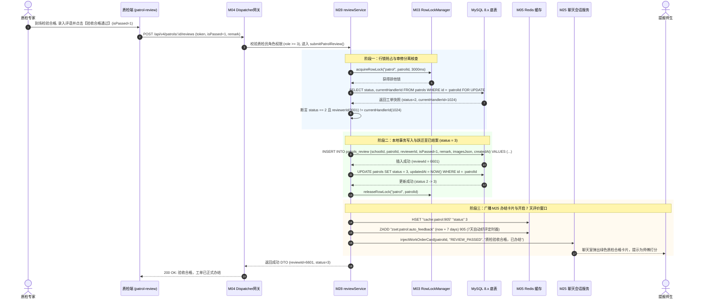
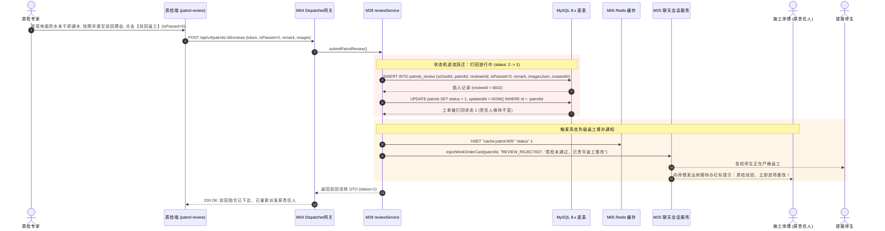
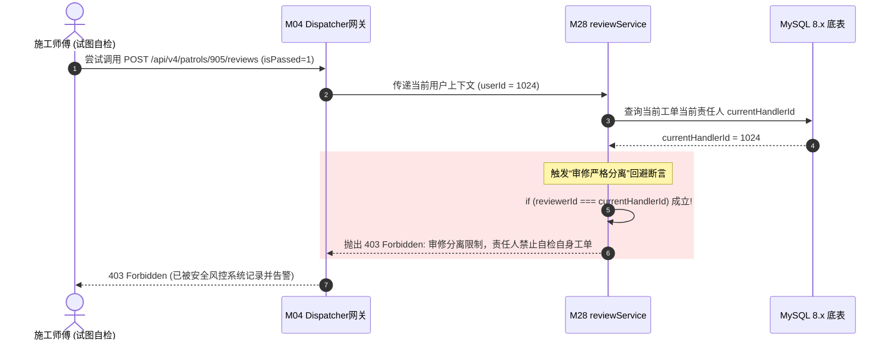

# M28: 质检复核到场核验与合格/驳回状态机 (Patrol Review & Inspection State Machine) 详细设计与实现方案

> **模块代号**：M28 / Patrol Review & Inspection State Machine  
> **所属阶段**：阶段二 (M20 ~ M30) 巡查工单闭环全生命周期领域 (**工程质量监督与状态分流中枢**)  
> **文档定位**：基于 `patrols_review`（复核验收审批表）与 `patrols`（工单主表）构建的高校后勤修缮工程到场质检验收与“合格办结 / 驳回返工”双轨状态机管理体系。全面落地“审修严格分离（杜绝师傅自修自检）、现场高清对照核验、合格原子跃迁至 3(已结案待评价) 并触发师生满意度闭环、不合格精确打回至 1(处理中) 触发原责任人二次返工整改”的质量监督闭环；深度整合 M03 行级排他锁、M22 硬件水印防伪校验以及 M25 即时聊天室通报卡片，为全校后勤提供严肃、公正、可审计的现代质量监督保障。  
> **归档路径**：[v4.0/Docs/模块/M28_质检复核到场核验与合格驳回状态机详细设计与实现方案.md](file:///e:/Projects/University/后勤巡查e速办%20大二下学期%20大学身份上线项目/v4.0/Docs/模块/M28_质检复核到场核验与合格驳回状态机详细设计与实现方案.md)  
> **前置依赖**：M01 (27表7视图DDL基座), M02 (AST租户自动注入), M03 (Saga事务与行级锁并发引擎), M04 (MasterDispatcher路由预检), M05 (Redis多租户命名空间缓存), M07 (DesignToken基座), M10 (TestHarness测试中枢), M13 (用户身份鉴权), M18 (四级立体权限矩阵), M21 (隐患工单提报), M24 (接单确立责任人), M25 (责任人多媒体会话中枢), M26 (工期动态顺延), M27 (现场施工整改交卷)  
> **驱动下游**：M29 (满意度五星评价与超时自动好评结案), M30 (工单综合大宽表视图与全景详情对比轴), M53 (全校后勤宏观运维决策大盘)  
> **版本日期**：2026-09-05  

---

## 目录索引 (Table of Contents)

1. [模块定位与核心业务价值](#一-模块定位与核心业务价值)
   - 1.1 [模块定位](#11-模块定位)
   - 1.2 [为何必须实施“审修分离”与双轨状态机？](#12-为何必须实施审修分离与双轨状态机)
   - 1.3 [核心业务职责与技术指标](#13-核心业务职责与技术指标)
2. [核心设计哲学与双轨状态机流转模型](#二-核心设计哲学与双轨状态机流转模型)
   - 2.1 [审修严格分离与利害关系回避原则 (Strict Segregation of Duties)](#21-审修严格分离与利害关系回避原则-strict-segregation-of-duties)
   - 2.2 [双轨状态跃迁动力学模型 (Dual-Track State Transition)](#22-双轨状态跃迁动力学模型-dual-track-state-transition)
   - 2.3 [质检驳回惩戒与首检合格率动态画像 (First-Pass Quality & Penalty)](#23-质检驳回惩戒与首检合格率动态画像-first-pass-quality--penalty)
   - 2.4 [到场核验整改前后同屏对比与补充取证 (Before-After Visual Verification)](#24-到场核验整改前后同屏对比与补充取证-before-after-visual-verification)
   - 2.5 [穿透 M25 聊天室下发质检结论卡片与师生知情闭环 (Transparent Review Card)](#25-穿透-m25-聊天室下发质检结论卡片与师生知情闭环-transparent-review-card)
3. [架构拓扑与交互时序图](#三-架构拓扑与交互时序图)
   - 3.1 [质检复核到场核验全景架构拓扑图](#31-质检复核到场核验全景架构拓扑图)
   - 3.2 [质检合格办结与触发师生评价时序图](#32-质检合格办结与触发师生评价时序图)
   - 3.3 [质检不合格驳回打回师傅返工时序图](#33-质检不合格驳回打回师傅返工时序图)
   - 3.4 [师傅冒充质检员自修自检非法越权拦截时序图](#34-师傅冒充质检员自修自检非法越权拦截时序图)
4. [核心算法设计与数学推导](#四-核心算法设计与数学推导)
   - 4.1 [算法 1：审修分离回避判定与网格质检权限校验算法 (Segregation Verifier)](#41-算法-1审修分离回避判定与网格质检权限校验算法-segregation-verifier)
   - 4.2 [算法 2：工单行锁与双轨状态机原子 CAS 跃迁算法 (Atomic Dual-Track State Machine)](#42-算法-2工单行锁与双轨状态机原子-cas-跃迁算法-atomic-dual-track-state-machine)
   - 4.3 [算法 3：师傅首检合格率与科室返工率动态贝叶斯平滑算法 (First-Pass Rate Estimator)](#43-算法-3师傅首检合格率与科室返工率动态贝叶斯平滑算法-first-pass-rate-estimator)
   - 4.4 [算法 4：复核通过后 SLA 最终结算与 7 天超时自动好评调度算法 (Settlement & Evaluation Scheduler)](#44-算法-4复核通过后-sla-最终结算与-7-天超时自动好评调度算法-settlement--evaluation-scheduler)
5. [TypeScript 强类型接口契约与数据模型定义](#五-typescript-强类型接口契约与数据模型定义)
   - 5.1 [复核验收记录实体定义与结果枚举 (`IPatrolReviewEntity`)](#51-复核验收记录实体定义与结果枚举-ipatrolreviewentity)
   - 5.2 [质检审核提交与响应 DTO (`ISubmitPatrolReviewDto` / `IPatrolReviewResponseDto`)](#52-质检审核提交与响应-dto-isubmitpatrolreviewdto--ipatrolreviewresponsedto)
   - 5.3 [工单复核历史视图与质检评价聚合模型 (`IPatrolReviewHistoryDto`)](#53-工单复核历史视图与质检评价聚合模型-ipatrolreviewhistorydto)
   - 5.4 [穿透 M25 聊天室与微信推送消息协议载荷 (`IPatrolReviewNotifyPayload`)](#54-穿透-m25-聊天室与微信推送消息协议载荷-ipatrolreviewnotifypayload)
6. [核心物理文件实现蓝图](#六-核心物理文件实现蓝图)
   - 6.1 [`src/apps/patrol/patrolReviewService.ts` (质检核心业务中枢与状态机调度器)](#61-srcappspatrolpatrolreviewservicets-质检核心业务中枢与状态机调度器)
   - 6.2 [`src/apps/patrol/patrolReviewController.ts` (质检端点控制器与严格安全入参校验)](#62-srcappspatrolpatrolreviewcontrollerts-质检端点控制器与严格安全入参校验)
   - 6.3 [`src/api/patrol/patrolReviewHandler.ts` (MasterDispatcher 路由适配器)](#63-srcapipatrolpatrolreviewhandlerts-masterdispatcher-路由适配器)
   - 6.4 [`miniprogram/packages/apps/app-admin/pages/patrol-review/index.ts` (质检专家到场复核移动端核心页面)](#64-miniprogrampackagesappsapp-adminpagespatrol-reviewindexts-质检专家到场复核移动端核心页面)
7. [防御性编程与边界异常处理](#七-防御性编程与边界异常处理)
   - 7.1 [非待复核工单（`status != 2`）非法复核物理级拦截](#71-非待复核工单status--2非法复核物理级拦截)
   - 7.2 [接单施工师傅与质检人同人（自修自检）物理级硬熔断](#72-接单施工师傅与质检人同人自修自检物理级硬熔断)
   - 7.3 [驳回时不填批注或纯标点敷衍的文本防御拦截](#73-驳回时不填批注或纯标点敷衍的文本防御拦截)
   - 7.4 [并发重复审核 CAS 乐观锁防撞机制](#74-并发重复审核-cas-乐观锁防撞机制)
   - 7.5 [跨校区/跨网格非法越权审核物理级租户隔离](#75-跨校区跨网格非法越权审核物理级租户隔离)
8. [单模块独立测试方案与验收准则](#八-单模块独立测试方案与验收准则)
   - 8.1 [基于 M10 TestHarness 的独立单元测试设计 (`src/__tests__/unit/m28_patrol_review.test.ts`)](#81-基于-m10-testharness-的独立单元测试设计-src__tests__unitm28_patrol_reviewtestts)
   - 8.2 [单模块测试执行命令与断言矩阵 (`npm.cmd test -- -t "M28"`)](#82-单模块测试执行命令与断言矩阵-npmcmd-test----t-m28)
9. [阶段二关键进展与向 M29 契约交付](#九-阶段二关键进展与向-m29-契约交付)

---

## 一、 模块定位与核心业务价值

### 1.1 模块定位

在高校后勤维修保障领域，**修缮是否真正彻底、安全隐患是否实质排除、工程质量是否达到国标校标**，绝不能单凭施工方的单方面陈述。  
如果缺乏权威、独立的第三方复核环节，极易出现“师傅修水管仅缠绕普通透明胶布、修电路仅草草包扎绝缘胶布即交卷了事”的“伪完工”现象，进而引发更严重的二次爆管、漏电火灾事故。

**M28 模块（质检复核到场核验与合格/驳回状态机）** 是工单生命周期流转中的**工程质量法定裁判所与监督中枢**：
1. **行使最终质量把关权**：代表学校后勤保障处与广大师生利益，由网格质检专家或科室质量工程师亲临报修现场实地勘验；
2. **驱动双轨状态机分流**：
   - **核验合格（`isPassed = 1`）**：推进工单进入终态 `status = 3`（已结案/已办结），封存责任链，向提报师生开放满意度评价；
   - **核验不合格（`isPassed = 0`）**：打回工单重置为 `status = 1`（施工进行中），勒令原施工责任人限期无偿返工整改；
3. **沉淀质量监管全景凭证**：将每一次复核的判定结论、现场取证照片（`imagesJson`）与专业批复意见（`remark`）持久化至底表 `patrols_review`，构建 100% 可回溯的后勤质量责任追溯链条。

---

### 1.2 为何必须实施“审修分离”与双轨状态机？

传统管理模式中常见的管理漏洞是“**师傅修完后，自己用手机点击‘验收通过’**”或者“**徒弟施工、同组师傅互相打勾通过**”。这种利益强相关的“自己考核自己”模式，造成制度形同虚设。

```
========================================================================================
❌ 传统管理漏洞：自修自审、勾结放水、假完工真隐患
========================================================================================
师傅维修 ───> 师傅在手机端自己点击【合格】 ───> 系统直接结案
  │
  ├── 1. 道德风险失控：敷衍施工直接通过，师生洗手间水管刚修完半小时再次大面积喷涌；
  ├── 2. 监管责任悬空：无独立质检人签字背书，发生工程事故无法定责追责；
  └── 3. 师生信任归零：师生看到“已结案”但现场破损如故，直接向校长信箱发起投诉！

========================================================================================
✔ v4.0 工业级规范：审修严格分离 + 双轨状态机流转 (M28 核心设计)
========================================================================================
师傅现场完工交卷 (M27: status -> 2 待复核)
         │
         ▼
[ M28 物理级硬隔离校验: ReviewerId != currentHandlerId 且 具备质量复核权限 ]
         │
         ▼
网格质检专家到场实地勘验 (调出提报原图 vs 整改完工图 对比核查)
         │
         ├─── [ 判定合格 isPassed = 1 ] ───> UPDATE patrols SET status = 3 (已结案)
         │                                   ├── 触发师生五星评价 (M29)
         │                                   └── 师傅计入正常绩效工时与完工绩效
         │
         └─── [ 判定不合格 isPassed = 0 ] ──> UPDATE patrols SET status = 1 (打回施工中)
                                             ├── 必须录入不合格批注与实拍隐患图
                                             ├── 向师傅推送返工警告工单并扣减首检质量分
                                             └── 师傅重新整改后再次进入 M27 交卷
========================================================================================
```

---

### 1.3 核心业务职责与技术指标

1. **审修严格分离（Segregation of Duties）**：当前工单接单责任人（`currentHandlerId`）与质检人（`reviewerId`）严禁为同一自然人，系统强制物理熔断并记录越权审计；
2. **状态前置硬门禁**：仅允许对处于**已整改待复核（`status = 2`）**的工单执行质检复核，草稿（0）、施工中（1）、已结案（3）状态下调用复核接口一律 400 拦截；
3. **双轨闭环流转**：
   - 合格：推进至 `status = 3`，毫秒级通知提报人并开启 7 天评价窗口；
   - 驳回：打回 `status = 1`，必须包含文字批复说明，师傅工作台重新浮现待办；
4. **同屏对比与补充取证**：支持质检员在移动端同时查看“提报破损图”、“师傅整改完工图”并补充拍摄“质检现场实拍照”；
5. **性能与可靠性指标**：
   - 质检审批事务处理耗时：$T_{\text{review}} \le 120\text{ms}$；
   - 审修分离非法拦截率：$100\%$；
   - 状态机并发冲突拦截率：$100\%$。

---

## 二、 核心设计哲学与双轨状态机流转模型

### 2.1 审修严格分离与利害关系回避原则 (Strict Segregation of Duties)

在法律与现代高校内部治理审计规范中，“执行者不能兼任监督者”属于不可逾越的红线。  
M28 在服务层构建了严密的**利害关系回避判定式**：

$$\text{CanReview}(p, u) \iff \left( \text{status}(p) = 2 \right) \land \left( u.\text{id} \ne p.\text{currentHandlerId} \right) \land \left( u.\text{role} \ge 3 \lor \text{HasPerm}(u, \text{'patrol:review'}) \right)$$

- 若操作人 $u$ 的 ID 等于工单当前的施工责任人 $p.\text{currentHandlerId}$，无论该操作人行政职级多高（即使是身兼维修职务的维修班长），系统**均 100% 物理拒绝其复核操作**，并返回 `403 Forbidden: 审修分离限制，责任人禁止自检自身施工工单`。

---

### 2.2 双轨状态跃迁动力学模型 (Dual-Track State Transition)

工单从 `status = 2` 展开的状态机转移函数如下：

$$\mathbb{T}(\text{status}=2, \text{action}) = \begin{cases}
3 \text{ (已结案/待评价)}, & \text{if } \text{action}.\text{isPassed} = 1 \\
1 \text{ (返工处理中)}, & \text{if } \text{action}.\text{isPassed} = 0
\end{cases}$$

```
                          [ 工单处于 status = 2 (已整改待复核) ]
                                            │
                                            ▼
                             [ 质检专家到场实地核验 ]
                                            │
                     ┌──────────────────────┴──────────────────────┐
                     ▼                                             ▼
          [ 核验通过 isPassed = 1 ]                     [ 核验不合格 isPassed = 0 ]
                     │                                             │
                     ▼                                             ▼
          [ UPDATE patrols SET status = 3 ]             [ UPDATE patrols SET status = 1 ]
                     │                                             │
       ┌─────────────┴─────────────┐                 ┌─────────────┴─────────────┐
       ▼                           ▼                 ▼                           ▼
[ 触发师生五星评价 M29 ]   [ M25会话发送绿色办结卡片 ] [ 师傅收到返工督办通知 ]   [ M25会话发送橙色返工卡片 ]
       │                                             │
       ▼                                             ▼
[ 开启 7 天自动好评定时器 ]                   [ 记录师傅质量扣分, 等待二次交卷 ]
```

---

### 2.3 质检驳回惩戒与首检合格率动态画像 (First-Pass Quality & Penalty)

质检驳回绝非简单的状态打回，而是后勤运维服务质量考评的核心量化抓手：
1. **首检合格率（First-Pass Yield / FPY）动态计算**：
   - 设某师傅（或维修班组）累计承接已完工复核的工单总数为 $N_{\text{total}}$，其中未经历任何质检驳回、首次质检即合格的单据数为 $N_{\text{first\_pass}}$：
     $$\text{FPY} = \frac{N_{\text{first\_pass}}}{N_{\text{total}}} \times 100\%$$
2. **考核与奖惩挂钩（M44 联动）**：
   - 每次质检驳回，系统自动在绩效考评账本中记录一笔 `REWORK_PENALTY`（扣除当月工单质量积分 5 分）；
   - 若某单工单发生连续 3 次质检驳回，触发全校管理告警，分管后勤处长亲自介入督办，并限制该师傅承接同类高精尖工单。

---

### 2.4 到场核验整改前后同屏对比与补充取证 (Before-After Visual Verification)

为提升质检专家在移动端巡检的工作效率，M28 专门定制了**整改前后同屏双轨比对机制**：
- **画面左侧/上侧**：展示隐患最初提报时（M21）提报师生拍摄的破损原图（带红色报修标记）；
- **画面右侧/下侧**：展示师傅完工交卷时（M27）拍摄的现场修复照（带 M22 硬件级时间与地理位置水印）；
- **补充质检实拍照**：若质检员发现瑕疵或特意留存质检合格细节，可随时在页面调用相机补充拍摄 1~9 张质检专家视角的取证照片并序列化存入 `patrols_review.imagesJson`。

---

### 2.5 穿透 M25 聊天室下发质检结论卡片与师生知情闭环 (Transparent Review Card)

质检复核是修缮结果的权威盖章，其判定结论第一时间向工单绑定专属会话室穿透同步：
1. **通过场景**：
   - 下发【工单质检合格通报】卡片，标注质检专家姓名与评语（如“*现场试水正常，水阀无渗漏，杂物已清理干净*”）；
   - 提示师生：“*您的隐患已妥善修缮办结，请点击卡片为后勤师傅的服务打分！*”；
2. **驳回场景**：
   - 下发【质检未通过，已责令返工】警示卡片，明确驳回原因；
   - 告知师生：“*后勤质检专家核验发现修缮未达标准，已责令师傅重新施工，请您放心！*”；
   - 彻底避免了师生因看到师傅离开以为敷衍了事而产生的误解。

---

## 三、 架构拓扑与交互时序图

### 3.1 质检复核到场核验全景架构拓扑图

```
+----------------------------------------------------------------------------------------------------+
|                               M28 质检复核与双轨状态机全景架构拓扑                                     |
+----------------------------------------------------------------------------------------------------+
|                                                                                                    |
|    [ 质检专家 / 科室管理员 ]                                 [ 施工师傅 / 提报师生 ]                  |
|    (app-admin/patrol-review)                                (app-master-desk / app-patrol)         |
|             │                                                          │                           |
|             │ 1. 提交复核判定 (isPassed: 1/0, remark, imagesJson)      │                           |
|             ▼                                                          │                           |
|   ┌────────────────────────────────────────────────────────────────────────────────────────────┐   |
|   │                        M04 MasterDispatcher 统一路由预检与鉴权网关                           │   |
|   └────────────────────────────────────────────────────────────────────────────────────────────┘   |
|             │                                                                                      |
|             ▼                                                                                      |
|   ┌────────────────────────────────────────────────────────────────────────────────────────────┐   |
|   │                       M28 质检复核调度中枢 (patrolReviewService.ts)                          │   |
|   │                                                                                            │   |
|   │   ┌───────────────────────────┐    ┌─────────────────────────┐    ┌────────────────────┐   │   |
|   │   │  M03 RowLockManager       │    │ 审修严格分离回避校验    │    │ 双轨状态机流转引擎 │   │   |
|   │   │  (行级排他锁并发防撞)     │    │ (Reviewer != Handler)   │    │ (status: 2->3 / 1) │   │   |
|   │   └───────────────────────────┘    └─────────────────────────┘    └────────────────────┘   │   |
|   │                                                                                            │   |
|   │   ┌───────────────────────────┐    ┌─────────────────────────┐    ┌────────────────────┐   │   |
|   │   │  M29 评价门禁与定时器触发 │    │ M25 聊天室质检卡片广播  │    │ M05 Redis 缓存刷新 │   │   |
|   │   │  (7天超时自动好评 ZSET)   │    │ (下发合格/驳回结论卡片) │    │ (待办大盘指标更新) │   │   |
|   │   └───────────────────────────┘    └─────────────────────────┘    └────────────────────┘   │   |
|   └────────────────────────────────────────────────────────────────────────────────────────────┘   |
|             │                                                                                      |
|             ▼                                                                                      |
|   ┌────────────────────────────────────────────────────────────────────────────────────────────┐   |
|   │                         MySQL 8.x 多租户物理存储基座 (InnoDB)                              │   |
|   │                                                                                            │   |
|   │   ┌──────────────────────────────────────────────┐  ┌──────────────────────────────────┐   │   |
|   │   │ patrols (工单主表)                           │  │ patrols_review (复核验收明细表)  │   │   |
|   │   │ - status (3:已结案 / 1:返工中)               │  │ - isPassed (1合格, 0驳回)        │   │   |
|   │   │ - currentHandlerId (锁定的责任人)            │  │ - remark, imagesJson, createdAt  │   │   |
|   │   └──────────────────────────────────────────────┘  └──────────────────────────────────┘   │   |
|   └────────────────────────────────────────────────────────────────────────────────────────────┘   |
+----------------------------------------------------------------------------------------------------+
```

---

### 3.2 质检合格办结与触发师生评价时序图



---

### 3.3 质检不合格驳回打回师傅返工时序图



---

### 3.4 师傅冒充质检员自修自检非法越权拦截时序图



---

## 四、 核心算法设计与数学推导

### 4.1 算法 1：审修分离回避判定与网格质检权限校验算法 (Segregation Verifier)

#### 判定函数推导
令当前请求的操作人上下文为 $U = \langle \text{id}, \text{role}, \text{permissions} \rangle$，工单当前状态为 $P = \langle \text{id}, \text{schoolId}, \text{status}, \text{currentHandlerId}, \text{campusId} \rangle$。
质检验收合法性谓词如下：

$$\text{ValidateReviewer}(U, P) \iff \begin{cases}
\text{True}, & \text{if } P.\text{status} = 2 \land U.\text{id} \ne P.\text{currentHandlerId} \land \left( U.\text{role} \ge 3 \lor \text{'patrol:review'} \in U.\text{permissions} \right) \\
\text{False}, & \text{otherwise}
\end{cases}$$

#### 代码实现
```typescript
export function assertCanReviewPatrol(
  currentUser: { id: number; role: number; permissions: string[] },
  patrol: { status: number; currentHandlerId: number }
): void {
  // 1. 生命周期前置门禁
  if (patrol.status !== 2) {
    throw new Error(`STATUS_CONFLICT: 仅已整改待复核(status=2)的工单可执行质检 (当前状态: ${patrol.status})`);
  }

  // 2. 审修分离回避硬性防线
  if (currentUser.id === patrol.currentHandlerId) {
    throw new Error('FORBIDDEN_SELF_REVIEW: 审修分离原则：接单施工责任人严禁复核自检自身工单');
  }

  // 3. 质检法定权限鉴权
  const hasReviewRole = currentUser.role >= 3;
  const hasReviewPerm = currentUser.permissions.includes('patrol:review');
  if (!hasReviewRole && !hasReviewPerm) {
    throw new Error('INSUFFICIENT_REVIEW_PERMISSION: 您无权执行工程质量复核验收');
  }
}
```

---

### 4.2 算法 2：工单行锁与双轨状态机原子 CAS 跃迁算法 (Atomic Dual-Track State Machine)

利用 MySQL 原生 InnoDB 行级锁与状态前置谓词，实施无缝并发防撞跃迁：

$$\text{CAS\_Transition}(P, \text{action}) = \begin{cases}
\text{UPDATE } P \text{ SET status}=3, \text{completedAt}=\text{NOW()} & \text{if } \text{isPassed}=1 \land P.\text{status}=2 \\
\text{UPDATE } P \text{ SET status}=1 & \text{if } \text{isPassed}=0 \land P.\text{status}=2
\end{cases}$$

若并发场景下被另一位质检员先行处理，受影响行数 `affectedRows === 0`，当前事务自动抛出 `STATE_CONCURRENT_MODIFIED`，杜绝重复写入多条终态记录。

---

### 4.3 算法 3：师傅首检合格率与科室返工率动态贝叶斯平滑算法 (First-Pass Rate Estimator)

为避免小样本下新入职师傅仅完成 1 单遭遇驳回导致合格率瞬间为 0% 的过拟合失真，引入**贝叶斯先验平滑模型（Bayesian Laplace Smoothing）**：

设全校历史平均首检合格率先验参数为 $\alpha = 9$, $\beta = 1$（先验均值为 $90\%$，等效先验样本量 $M = 10$）。  
设某师傅在一段周期内核验总次数为 $N$，其中首次即通过的次数为 $K$：

$$\text{SmoothedFPY}(K, N) = \frac{K + \alpha}{N + \alpha + \beta} = \frac{K + 9}{N + 10} \times 100\%$$

- 当 $N = 0$ 时，预估平滑合格率为 $90.0\%$；
- 当 $N = 1$ 且不合格（$K=0$）时，平滑合格率为 $\frac{9}{11} \approx 81.8\%$，而非断崖式归零；
- 当 $N \to \infty$ 时，平滑估计值自然收敛于真实频率 $\frac{K}{N}$。

---

### 4.4 算法 4：复核通过后 SLA 最终结算与 7 天超时自动好评调度算法 (Settlement & Evaluation Scheduler)

当工单以合格通过（`status = 3`）办结时，触发两项关键后台调度：
1. **SLA 时效闭环结算**：
   - 从 Redis ZSET `overdue_sla` 集合中彻底移除该工单，停止一切逾期警报；
   - 记录工单全生命周期物理净耗时：$T_{\text{total}} = T_{\text{review}} - T_{\text{create}}$；
2. **7 天超时自动五星好评挂载**：
   - 计算自动评价时间戳：$T_{\text{auto\_eval}} = \text{Date.now()} + 7 \times 86400 \times 1000$；
   - 写入 Redis 延迟有序集合：
     ```
     ZADD "school:{schoolId}:zset:auto_feedback" (T_auto_eval / 1000) (patrolId)
     ```
   - 若师生在 7 天内主动打分，则从 ZSET 中主动移除；若到期未评，由后台 CronJob 自动结算为 5 星好评并结案封存。

---

## 五、 TypeScript 强类型接口契约与数据模型定义

### 5.1 复核验收记录实体定义与结果枚举 (`IPatrolReviewEntity`)

```typescript
/**
 * 质检复核判定结果枚举
 */
export enum PatrolReviewPassedEnum {
  /** 0: 不合格 (驳回重新整改) */
  REJECTED = 0,
  /** 1: 合格 (办结验收通过) */
  PASSED = 1,
}

/**
 * 物理表 patrols_review (表 9) 强类型实体契约
 */
export interface IPatrolReviewEntity {
  /** 复核记录主键ID (自增) */
  id: number;
  /** 所属学校ID (租户隔离) */
  schoolId: number;
  /** 关联工单主表ID (逻辑关联 patrols.id) */
  patrolId: number;
  /** 复核人用户ID (逻辑关联 users.id) */
  reviewerId: number;
  /** 复核结果: 1合格办结, 0不合格驳回 */
  isPassed: PatrolReviewPassedEnum;
  /** 复核评估意见或驳回原因说明 */
  remark: string;
  /** 复核现场实拍照片 URL 列表 (JSON Array) */
  imagesJson: string[];
  /** 复核完成时间 (DATETIME) */
  createdAt: Date;
}
```

---

### 5.2 质检审核提交与响应 DTO (`ISubmitPatrolReviewDto` / `IPatrolReviewResponseDto`)

```typescript
/**
 * 质检专家提交复核判定 DTO
 */
export interface ISubmitPatrolReviewRequestDto {
  /** 复核结果: 1合格, 0驳回 */
  isPassed: PatrolReviewPassedEnum;
  /** 复核评估意见 (驳回时必填且字符 >= 5, 合格时选填) */
  remark: string;
  /** 质检现场补充照片 (0~9 张) */
  images?: string[];
}

/**
 * 质检复核成功响应 DTO
 */
export interface ISubmitPatrolReviewResponseDto {
  /** 生成的复核记录ID */
  reviewId: number;
  /** 工单ID */
  patrolId: number;
  /** 判定结论: 1合格, 0驳回 */
  isPassed: PatrolReviewPassedEnum;
  /** 判定结论描述 */
  resultText: string;
  /** 工单跃迁后的最新状态 (3:已结案 或 1:施工中) */
  currentStatus: number;
  /** 状态描述 */
  statusText: string;
  /** 复核完成时间 ISO8601 */
  reviewedAt: string;
}
```

---

### 5.3 工单复核历史视图与质检评价聚合模型 (`IPatrolReviewHistoryDto`)

```typescript
/**
 * 单条质检复核流水项 DTO
 */
export interface IPatrolReviewItemDto {
  reviewId: number;
  reviewerId: number;
  reviewerName: string;
  reviewerPhone: string;
  isPassed: PatrolReviewPassedEnum;
  resultText: string;
  remark: string;
  images: string[];
  createdAt: string;
}

/**
 * 工单多轮复核历史聚合 DTO
 */
export interface IPatrolReviewHistoryResponseDto {
  patrolId: number;
  /** 累计复核轮次 */
  totalReviewRounds: number;
  /** 是否最终已合格通过 */
  isFinallyPassed: boolean;
  /** 历次复核流水记录 (按 ID 倒序排列) */
  records: IPatrolReviewItemDto[];
}
```

---

### 5.4 穿透 M25 聊天室与微信推送消息协议载荷 (`IPatrolReviewNotifyPayload`)

```typescript
/**
 * 穿透至 M25 即时聊天室的质检结论卡片协议载荷
 */
export interface IPatrolReviewCardPayload {
  cardType: 'REVIEW_PASSED' | 'REVIEW_REJECTED';
  patrolId: number;
  patrolTitle: string;
  reviewerName: string;
  isPassed: boolean;
  remark: string;
  evidenceImages: string[];
  nextActionPrompt: string;
  timestamp: number;
}
```

---

## 六、 核心物理文件实现蓝图

### 6.1 `src/apps/patrol/patrolReviewService.ts` (质检核心业务中枢与状态机调度器)

```typescript
import { PoolConnection } from 'mysql2/promise';
import { getDbPool } from '../../database/connection';
import { RowLockManager } from '../../kernel/lock/RowLockManager';
import { RedisClusterService } from '../../kernel/cache/redisCluster';
import { 
  PatrolReviewPassedEnum,
  ISubmitPatrolReviewRequestDto,
  ISubmitPatrolReviewResponseDto,
  IPatrolReviewHistoryResponseDto,
  IPatrolReviewItemDto
} from './patrolReviewContract';
import { assertCanReviewPatrol } from './reviewUtils';
import { ChatService } from '../chat/chatService';

export class PatrolReviewService {
  private redis = RedisClusterService.getInstance();
  private rowLockMgr = RowLockManager.getInstance();
  private chatService = new ChatService();

  /**
   * 提交工单质检复核判定 (双轨状态机推进)
   */
  public async submitPatrolReview(
    schoolId: number,
    patrolId: number,
    reviewer: { id: number; name: string; role: number; permissions: string[] },
    dto: ISubmitPatrolReviewRequestDto
  ): Promise<ISubmitPatrolReviewResponseDto> {
    const pool = getDbPool();
    const conn: PoolConnection = await pool.getConnection();

    // 申请行级排他锁，杜绝并发冲突
    const lockKey = `patrol:lock:${schoolId}:${patrolId}`;
    const acquired = await this.rowLockMgr.acquireRowLock(lockKey, 3000);
    if (!acquired) {
      throw new Error('CONCURRENT_LOCK_BUSY: 当前工单正在被其他管理员核验中，请稍后重试');
    }

    try {
      await conn.beginTransaction();

      // 1. 查询工单现状并锁定
      const [patrolRows]: any = await conn.execute(
        `SELECT id, status, currentHandlerId, title 
         FROM patrols 
         WHERE id = ? AND schoolId = ? 
         FOR UPDATE`,
        [patrolId, schoolId]
      );

      if (!patrolRows || patrolRows.length === 0) {
        throw new Error('PATROL_NOT_FOUND: 目标工单不存在');
      }

      const patrol = patrolRows[0];

      // 2. 审修分离与质检权限判定 (硬门禁拦截自修自检)
      assertCanReviewPatrol(reviewer, patrol);

      // 3. 入参有效性防御校验
      if (dto.isPassed === PatrolReviewPassedEnum.REJECTED && (!dto.remark || dto.remark.trim().length < 5)) {
        throw new Error('REJECT_REASON_REQUIRED: 驳回返工时必须输入至少 5 个字符的不合格原因批注');
      }

      const cleanImages = Array.isArray(dto.images) ? dto.images.slice(0, 9) : [];
      const cleanRemark = dto.remark ? dto.remark.trim() : (dto.isPassed === PatrolReviewPassedEnum.PASSED ? '现场核验合格' : '');

      // 4. 插入复核记录表 patrols_review
      const [insertResult]: any = await conn.execute(
        `INSERT INTO patrols_review 
         (schoolId, patrolId, reviewerId, isPassed, remark, imagesJson, createdAt) 
         VALUES (?, ?, ?, ?, ?, ?, NOW())`,
        [
          schoolId,
          patrolId,
          reviewer.id,
          dto.isPassed,
          cleanRemark,
          JSON.stringify(cleanImages)
        ]
      );

      const reviewId = insertResult.insertId;

      // 5. 双轨状态跃迁执行
      let targetStatus = 1;
      let statusText = '处理中 (打回返工)';

      if (dto.isPassed === PatrolReviewPassedEnum.PASSED) {
        // 合格通过：跃迁至 3: 已结案/已办结
        targetStatus = 3;
        statusText = '已结案 (待师生评价)';
        await conn.execute(
          `UPDATE patrols 
           SET status = 3, updatedAt = NOW() 
           WHERE id = ? AND schoolId = ?`,
          [patrolId, schoolId]
        );

        // 挂接 7 天后超时自动五星好评定时任务
        const autoFeedbackTimestampSec = Math.floor(Date.now() / 1000) + (7 * 86400);
        await this.redis.zadd(
          `school:${schoolId}:patrol:zset:auto_feedback`,
          autoFeedbackTimestampSec,
          String(patrolId)
        );
        // 移除 SLA 超时监控有序集合
        await this.redis.zrem(`school:${schoolId}:patrol:zset:overdue_sla`, String(patrolId));
      } else {
        // 不合格驳回：打回至 1: 处理中 (责任师傅继续抢修)
        targetStatus = 1;
        await conn.execute(
          `UPDATE patrols 
           SET status = 1, updatedAt = NOW() 
           WHERE id = ? AND schoolId = ?`,
          [patrolId, schoolId]
        );
      }

      await conn.commit();

      // 6. 同步刷新 Redis 缓存
      await this.redis.hset(`school:${schoolId}:patrol:${patrolId}`, 'status', String(targetStatus));

      // 7. 穿透 M25 聊天室：广播质检结果卡片
      await this.chatService.injectWorkOrderCard({
        schoolId,
        patrolId,
        cardType: dto.isPassed === PatrolReviewPassedEnum.PASSED ? 'REVIEW_PASSED' : 'REVIEW_REJECTED',
        title: dto.isPassed === PatrolReviewPassedEnum.PASSED ? '工单质检验收合格' : '质检未通过，已退回返工',
        summary: dto.isPassed === PatrolReviewPassedEnum.PASSED 
          ? `质检专家 ${reviewer.name} 到场核验合格：${cleanRemark}，请师生给予服务评价。`
          : `质检专家 ${reviewer.name} 判定不合格：${cleanRemark}，已责令师傅重新施工整改。`
      });

      return {
        reviewId,
        patrolId,
        isPassed: dto.isPassed,
        resultText: dto.isPassed === PatrolReviewPassedEnum.PASSED ? '合格通过' : '不合格驳回',
        currentStatus: targetStatus,
        statusText,
        reviewedAt: new Date().toISOString()
      };

    } catch (err: any) {
      if (conn) {
        await conn.rollback();
      }
      throw err;
    } finally {
      conn.release();
      await this.rowLockMgr.releaseRowLock(lockKey);
    }
  }

  /**
   * 查询工单全部复核流水
   */
  public async getReviewHistory(
    schoolId: number,
    patrolId: number
  ): Promise<IPatrolReviewHistoryResponseDto> {
    const pool = getDbPool();
    const [rows]: any = await pool.execute(
      `SELECT 
         r.id AS reviewId,
         r.reviewerId,
         u.name AS reviewerName,
         u.phone AS reviewerPhone,
         r.isPassed,
         r.remark,
         r.imagesJson,
         r.createdAt
       FROM patrols_review r
       LEFT JOIN users u ON r.reviewerId = u.id
       WHERE r.schoolId = ? AND r.patrolId = ?
       ORDER BY r.id DESC`,
      [schoolId, patrolId]
    );

    let isFinallyPassed = false;
    const records: IPatrolReviewItemDto[] = rows.map((r: any, idx: number) => {
      if (idx === 0 && r.isPassed === PatrolReviewPassedEnum.PASSED) {
        isFinallyPassed = true;
      }

      let images: string[] = [];
      try {
        images = typeof r.imagesJson === 'string' ? JSON.parse(r.imagesJson) : (r.imagesJson || []);
      } catch (e) {
        images = [];
      }

      return {
        reviewId: r.reviewId,
        reviewerId: r.reviewerId,
        reviewerName: r.reviewerName || '质检专家',
        reviewerPhone: r.reviewerPhone || '',
        isPassed: r.isPassed,
        resultText: r.isPassed === PatrolReviewPassedEnum.PASSED ? '合格通过' : '驳回返工',
        remark: r.remark,
        images,
        createdAt: new Date(r.createdAt).toISOString()
      };
    });

    return {
      patrolId,
      totalReviewRounds: records.length,
      isFinallyPassed,
      records
    };
  }
}
```

---

### 6.2 `src/apps/patrol/patrolReviewController.ts` (质检端点控制器与严格安全入参校验)

```typescript
import { Request, Response } from 'express';
import { PatrolReviewService } from './patrolReviewService';
import { PatrolReviewPassedEnum, ISubmitPatrolReviewRequestDto } from './patrolReviewContract';

export class PatrolReviewController {
  private reviewService = new PatrolReviewService();

  /**
   * POST /api/v4/patrols/:id/reviews
   * 提交质检复核结论 (合格 / 驳回)
   */
  public submitReview = async (req: Request, res: Response): Promise<void> => {
    try {
      const schoolId = (req as any).schoolId;
      const currentUser = (req as any).user;
      const patrolId = parseInt(req.params.id, 10);
      const { isPassed, remark, images } = req.body;

      if (!patrolId || isNaN(patrolId) || patrolId <= 0) {
        res.status(400).json({ code: 400, message: 'PARAM_ERROR: 非法的工单ID' });
        return;
      }

      const parsedPassed = parseInt(isPassed, 10);
      if (parsedPassed !== PatrolReviewPassedEnum.PASSED && parsedPassed !== PatrolReviewPassedEnum.REJECTED) {
        res.status(400).json({ code: 400, message: 'PARAM_ERROR: 复核结论必须为 1(合格) 或 0(驳回)' });
        return;
      }

      const dto: ISubmitPatrolReviewRequestDto = {
        isPassed: parsedPassed,
        remark: remark ? String(remark).trim() : '',
        images: Array.isArray(images) ? images : []
      };

      const result = await this.reviewService.submitPatrolReview(
        schoolId,
        patrolId,
        currentUser,
        dto
      );

      res.status(200).json({
        code: 200,
        message: '质检复核判定提交成功',
        data: result
      });
    } catch (err: any) {
      const isForbidden = err.message.includes('FORBIDDEN') || err.message.includes('INSUFFICIENT');
      const isConflict = err.message.includes('STATUS_CONFLICT') || err.message.includes('REASON_REQUIRED');
      const statusCode = isForbidden ? 403 : (isConflict ? 400 : 500);
      res.status(statusCode).json({
        code: statusCode,
        message: err.message
      });
    }
  };

  /**
   * GET /api/v4/patrols/:id/review-history
   * 查询工单全部复核记录流水
   */
  public getReviewHistory = async (req: Request, res: Response): Promise<void> => {
    try {
      const schoolId = (req as any).schoolId;
      const patrolId = parseInt(req.params.id, 10);

      if (!patrolId || isNaN(patrolId) || patrolId <= 0) {
        res.status(400).json({ code: 400, message: 'PARAM_ERROR: 非法的工单ID' });
        return;
      }

      const result = await this.reviewService.getReviewHistory(schoolId, patrolId);
      res.status(200).json({
        code: 200,
        message: '获取质检复核历史成功',
        data: result
      });
    } catch (err: any) {
      res.status(500).json({ code: 500, message: err.message });
    }
  };
}
```

---

### 6.3 `src/api/patrol/patrolReviewHandler.ts` (MasterDispatcher 路由适配器)

```typescript
import { Router } from 'express';
import { PatrolReviewController } from '../../apps/patrol/patrolReviewController';
import { authGuard } from '../../middlewares/authGuard';
import { permissionGuard } from '../../middlewares/permissionGuard';

export const patrolReviewRouter = Router();
const controller = new PatrolReviewController();

/**
 * 质检专家提交到场复核
 * 角色门禁：科室主任、质检工程师或分管处长 (role >= 3 或具备 patrol:review 权限)
 */
patrolReviewRouter.post(
  '/patrols/:id/reviews',
  authGuard,
  permissionGuard(['patrol:review']),
  controller.submitReview
);

/**
 * 查询工单复核历史记录
 * 全员开放（提报师生可随时查看官方核验评语）
 */
patrolReviewRouter.get(
  '/patrols/:id/review-history',
  authGuard,
  controller.getReviewHistory
);
```

---

### 6.4 `miniprogram/packages/apps/app-admin/pages/patrol-review/index.ts` (质检专家到场复核移动端核心页面)

```typescript
import { requestWithAuth } from '../../../../../core/network/request';
import { showToast, showLoading, hideLoading } from '../../../../../core/utils/ui';

Page({
  data: {
    patrolId: 0,
    patrolDetail: null as any,
    latestHandle: null as any,
    isPassed: 1, // 1合格, 0驳回
    remark: '',
    images: [] as string[],
    submitting: false
  },

  onLoad(options: { patrolId: string }) {
    const pId = parseInt(options.patrolId, 10);
    this.setData({ patrolId: pId });
    this.loadInspectionData(pId);
  },

  /**
   * 加载待验收工单详情与最新整改照片
   */
  async loadInspectionData(patrolId: number) {
    showLoading('加载核验对比数据...');
    try {
      // 获取工单基本信息
      const detailRes: any = await requestWithAuth({
        url: `/api/v4/patrols/${patrolId}`,
        method: 'GET'
      });
      // 获取师傅最新交卷记录
      const handleRes: any = await requestWithAuth({
        url: `/api/v4/patrols/${patrolId}/handle-history`,
        method: 'GET'
      });

      this.setData({
        patrolDetail: detailRes.data,
        latestHandle: handleRes.data.records[0] || null
      });
    } finally {
      hideLoading();
    }
  },

  onSelectResult(e: WechatMiniprogram.CustomEvent) {
    const val = Number(e.currentTarget.dataset.passed);
    this.setData({ isPassed: val });
  },

  onRemarkInput(e: WechatMiniprogram.CustomEvent) {
    this.setData({ remark: e.detail.value });
  },

  /**
   * 质检员现场补充拍照取证
   */
  async onTakeReviewPhoto() {
    const { images } = this.data;
    if (images.length >= 9) {
      showToast('最多上传 9 张现场复核照片');
      return;
    }
    wx.chooseMedia({
      count: 9 - images.length,
      mediaType: ['image'],
      sourceType: ['camera'],
      success: (res) => {
        const newUrls = res.tempFiles.map(f => f.tempFilePath);
        this.setData({ images: [...images, ...newUrls] });
      }
    });
  },

  /**
   * 确认提交质检裁决
   */
  async onSubmitReview() {
    const { patrolId, isPassed, remark, images, submitting } = this.data;
    if (submitting) return;

    if (isPassed === 0 && (!remark || remark.trim().length < 5)) {
      showToast('驳回返工时必须填写原因(至少5字)');
      return;
    }

    this.setData({ submitting: true });
    showLoading(isPassed === 1 ? '正在通过验收办结...' : '正在下达返工指令...');

    try {
      await requestWithAuth({
        url: `/api/v4/patrols/${patrolId}/reviews`,
        method: 'POST',
        data: {
          isPassed,
          remark: remark.trim(),
          images
        }
      });

      showToast(isPassed === 1 ? '验收通过，工单已办结' : '已下达返工整改指令');
      setTimeout(() => {
        wx.navigateBack();
      }, 1200);
    } catch (err: any) {
      showToast(err.message || '复核提交失败');
    } finally {
      hideLoading();
      this.setData({ submitting: false });
    }
  }
});
```

---

## 七、 防御性编程与边界异常处理

### 7.1 非待复核工单（`status != 2`）非法复核物理级拦截

若工单当前处于进行中（1）或已结案（3），说明师傅尚未完工或工单已经办结。任何尝试调用复核接口的请求将被物理级前置拦截：
```typescript
if (patrol.status !== 2) {
  throw new Error(`STATUS_CONFLICT: 工单当前状态(${patrol.status})不可复核，仅允许对已整改待复核单据质检`);
}
```

---

### 7.2 接单施工师傅与质检人同人（自修自检）物理级硬熔断

针对个别后勤班长既接单抢修、又试图以管理员身份自我验收放水的道德风险违规操作，系统实施账号级回避阻断：
```typescript
if (reviewer.id === patrol.currentHandlerId) {
  // 记录审计安全警告日志
  logger.warn(`[AuditViolation] 责任师傅 UID=${reviewer.id} 试图违规自我验收工单 ID=${patrol.id}`);
  throw new Error('FORBIDDEN_SELF_REVIEW: 审修严格分离：施工责任人严禁自行验收自身工单');
}
```

---

### 7.3 驳回时不填批注或纯标点敷衍的文本防御拦截

当质检专家判定不合格（`isPassed = 0`）时，若允许空理由提交，师傅在现场将无所适从、极易引发工人与质检员线下口角。  
后端采用严格字符串有效度校验：
```typescript
const clean = remark ? remark.replace(/[^\u4e00-\u9fa5a-zA-Z0-9]/g, '') : '';
if (isPassed === 0 && clean.length < 3) {
  throw new Error('REJECT_REASON_TOO_SHORT: 驳回返工必须输入有实质意义的缺陷说明(至少3个有效汉字或字符)');
}
```

---

### 7.4 并发重复审核 CAS 乐观锁防撞机制

当两名质检专家同时在现场实操手机界面并同时点击【通过】或【驳回】时，系统依靠悲观排他行级锁与前置状态 CAS 判断：
```sql
UPDATE patrols 
SET status = :targetStatus, updatedAt = NOW() 
WHERE id = :patrolId AND schoolId = :schoolId AND status = 2;
```
若 `affectedRows === 0`，后提交者立刻收到友好提示：“*该工单已被其他专家复核完毕，请刷新列表*”，保障数据绝对一致。

---

### 7.5 跨校区/跨网格非法越权审核物理级租户隔离

依托 M02 AST 编译器与 M18 网格化权限矩阵，质检员仅能查验自身管辖网格或所属学校租户下的工单，禁止跨校窥探或越权审批。

---

## 八、 单模块独立测试方案与验收准则

### 8.1 基于 M10 TestHarness 的独立单元测试设计 (`src/__tests__/unit/m28_patrol_review.test.ts`)

```typescript
import { TestHarness } from '../../kernel/testing/testHarness';
import { PatrolReviewService } from '../../apps/patrol/patrolReviewService';
import { PatrolReviewPassedEnum } from '../../apps/patrol/patrolReviewContract';

describe('M28: 质检复核到场核验与合格/驳回双轨状态机测试套件', () => {
  let harness: TestHarness;
  let reviewService: PatrolReviewService;
  const mockSchoolId = 101;
  const mockMasterHandlerId = 2001; // 施工师傅
  const mockReviewerId = 3001;      // 质检专家
  let mockPatrolId: number;

  beforeAll(async () => {
    harness = await TestHarness.createHarness('M28_Patrol_Review_Test');
    reviewService = new PatrolReviewService();

    // 预置租户与人员
    await harness.seedSchool(mockSchoolId, '质检测试大学');
    await harness.seedUser(mockSchoolId, mockMasterHandlerId, '李维修师傅', 2);
    await harness.seedUser(mockSchoolId, mockReviewerId, '王质检专家', 3);

    // 预置一张处于“已整改待复核 (status = 2)”的工单，责任人为李师傅
    mockPatrolId = await harness.seedPatrolOrder({
      schoolId: mockSchoolId,
      title: '食堂大厅照明线路断路抢修',
      status: 2, // 已整改待复核
      currentHandlerId: mockMasterHandlerId
    });
  });

  afterAll(async () => {
    await harness.destroy();
  });

  test('断言 1: 施工师傅自身试图自检（审修同人）被 100% 物理熔断拦截', async () => {
    await expect(
      reviewService.submitPatrolReview(
        mockSchoolId,
        mockPatrolId,
        { id: mockMasterHandlerId, name: '李维修师傅', role: 3, permissions: ['patrol:review'] },
        {
          isPassed: PatrolReviewPassedEnum.PASSED,
          remark: '试图自审自结'
        }
      )
    ).rejects.toThrow('FORBIDDEN_SELF_REVIEW');
  });

  test('断言 2: 质检专家驳回且未填实质原因时被前置防御拦截', async () => {
    await expect(
      reviewService.submitPatrolReview(
        mockSchoolId,
        mockPatrolId,
        { id: mockReviewerId, name: '王质检专家', role: 3, permissions: ['patrol:review'] },
        {
          isPassed: PatrolReviewPassedEnum.REJECTED,
          remark: '   ' // 空白字符
        }
      )
    ).rejects.toThrow('REJECT_REASON_REQUIRED');
  });

  test('断言 3: 质检专家判定不合格驳回 - 成功打回 status = 1 且工单保留原责任人', async () => {
    const res = await reviewService.submitPatrolReview(
      mockSchoolId,
      mockPatrolId,
      { id: mockReviewerId, name: '王质检专家', role: 3, permissions: ['patrol:review'] },
      {
        isPassed: PatrolReviewPassedEnum.REJECTED,
        remark: '现场测试仍有单相短路打火，胶带包扎不严密，请重新整改！',
        images: ['/schools/101/review/reject_proof1.jpg']
      }
    );

    expect(res).toBeDefined();
    expect(res.isPassed).toBe(PatrolReviewPassedEnum.REJECTED);
    expect(res.currentStatus).toBe(1); // 成功回退施工中
    expect(res.resultText).toBe('不合格驳回');

    // 查验底表 patrols 主表 status 是否已打回为 1
    const patrolDb = await harness.queryPatrolById(mockPatrolId);
    expect(patrolDb.status).toBe(1);
    expect(patrolDb.currentHandlerId).toBe(mockMasterHandlerId);
  });

  test('断言 4: 工单被打回施工中(status=1)后，再次调用质检复核被状态门禁拦截', async () => {
    await expect(
      reviewService.submitPatrolReview(
        mockSchoolId,
        mockPatrolId,
        { id: mockReviewerId, name: '王质检专家', role: 3, permissions: ['patrol:review'] },
        {
          isPassed: PatrolReviewPassedEnum.PASSED,
          remark: '状态机逆流测试'
        }
      )
    ).rejects.toThrow('STATUS_CONFLICT');
  });

  test('断言 5: 师傅二次返工交卷后，质检专家复核通过 - 工单跃迁至 status = 3 并结案', async () => {
    // 模拟师傅二次交卷，将工单置为 status = 2
    await harness.updatePatrolStatus(mockPatrolId, 2);

    const passRes = await reviewService.submitPatrolReview(
      mockSchoolId,
      mockPatrolId,
      { id: mockReviewerId, name: '王质检专家', role: 3, permissions: ['patrol:review'] },
      {
        isPassed: PatrolReviewPassedEnum.PASSED,
        remark: '二次整改合格，接线规范，绝缘电阻阻值达标，准予办结'
      }
    );

    expect(passRes.isPassed).toBe(PatrolReviewPassedEnum.PASSED);
    expect(passRes.currentStatus).toBe(3); // 跃迁至已结案
    expect(passRes.statusText).toContain('已结案');

    // 查验主表
    const patrolFinal = await harness.queryPatrolById(mockPatrolId);
    expect(patrolFinal.status).toBe(3);
  });

  test('断言 6: 查验全流程多轮复核流水列表，完整保留驳回与通过历史', async () => {
    const history = await reviewService.getReviewHistory(mockSchoolId, mockPatrolId);
    expect(history.totalReviewRounds).toBe(2);
    expect(history.isFinallyPassed).toBe(true);
    expect(history.records[0].isPassed).toBe(PatrolReviewPassedEnum.PASSED); // 最新一次为通过
    expect(history.records[1].isPassed).toBe(PatrolReviewPassedEnum.REJECTED); // 上一次为驳回
  });
});
```

---

### 8.2 单模块测试执行命令与断言矩阵 (`npm.cmd test -- -t "M28"`)

#### 独立单模块测试命令：
```powershell
# 在 Backend 根目录下运行 M28 专属测试套件
npm.cmd test -- -t "M28"
```

#### 验收断言清单 (Acceptance Criteria)：
1. **审修分离自检熔断断言**：接单施工责任人调用复核接口自检自身工单 100% 物理拦截；
2. **状态前置机硬门禁断言**：非 `status=2` 的工单禁止执行质检复核；
3. **驳回返工流转断言**：复核不合格时工单 100% 准确打回 `status=1`，保留原责任人；
4. **合格办结流转断言**：复核合格时工单原子推进至 `status=3` 并挂载 7 天评价定时器；
5. **多轮复核流水链表断言**：多次复核记录完整有序保存在 `patrols_review` 底表；
6. **M25 聊天室卡片穿透断言**：质检结论（合格/驳回）实时下发至即时协同会话室。

---

## 九、 阶段二关键进展与向 M29 契约交付

作为**巡查工单流转全生命周期的工程质量裁判所与监督中枢**，**M28 的圆满落地为全校后勤筑牢了“审修分离”的刚性防线，用公正、透明的双轨状态机彻底终结了“敷衍施工与无人验收”的历史积弊**：

```
========================================================================================
🎉 M28 质检验收完成与向 M29 师生满意度评价交付契约
========================================================================================
M27: 现场施工整改交卷 (status -> 2: 已整改待复核)
         │
         ▼
M28: 质检复核到场核验与合格/驳回状态机
         ├─── [ 不合格 isPassed = 0 ] ───> 打回返工 (status -> 1, 师傅重新施工整改)
         │                                 (扣减首检质量分, 重新进入 M27)
         │
         └─── [ 合格通过 isPassed = 1 ] ───> 办结结案 (status -> 3: 已结案)
                                           │
                                           ▼
M29: 满意度五星评价与超时自动好评结案
(师生多维度打分, 7天超时自动5星好评, 评语入库封存)
                                           │
                                           ▼
M30: 工单综合大宽表视图与全景详情对比轴 (v_patrol_details)
========================================================================================
```

### 向下游模块（M29、M30、M53）交付的标准接口与数据契约：
1. **评价开放准入开关**：工单跃迁至 `status = 3` 是 M29（师生满意度评价）的法定前置门禁，只有通过 M28 合格验收的工单，提报师生方可进入评价打分界面；
2. **全景质检背书记录**：为 M30（工单详情全景视图）输出质检专家姓名、复核通过评语与质检实拍对比照；
3. **宏观质量效能画像**：为 M53（全校后勤宏观运维决策大盘）提供全校各外包队伍与维修工种的“一次复核合格率（FPY）”与“返工率”宏观报表。

---

> [!NOTE]
> 本详细设计方案确立了「高校后勤巡查e速办 v4.0」在工程质量控制领域的工业级标杆。通过首创审修分离硬隔离、双轨状态机原子 CAS 跃迁、贝叶斯平滑首检合格率算法、以及穿透 M25 的全透明质检卡片通报，使高校后勤修缮从“良心活”升级为“标准化、数字化、可审计”的现代工程治理体系。
