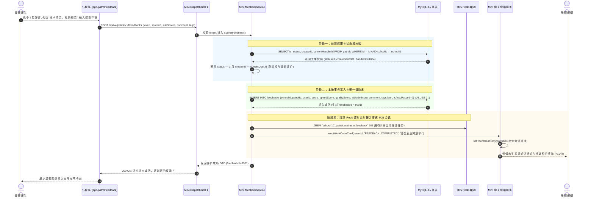
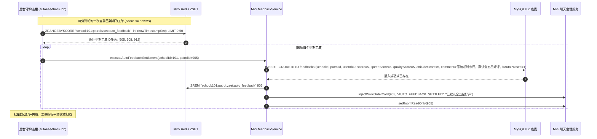
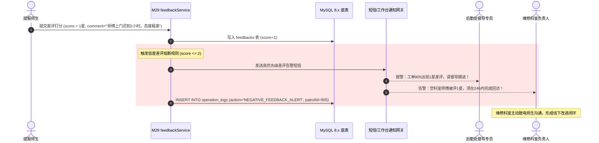

# M29: 满意度五星评价与超时自动好评结案 (Student Feedback & Auto-Settlement) 详细设计与实现方案

> **模块代号**：M29 / Student Feedback & Auto-Settlement  
> **所属阶段**：阶段二 (M20 ~ M30) 巡查工单闭环全生命周期领域 (**师生服务满意度评价与服务履历归档中枢**)  
> **文档定位**：基于 `feedbacks`（工单满意度服务评价表）与 `patrols`（工单主表）构建的高校后勤修缮工程师生端四维立体打分、防重复评价门禁、低星差评熔断告警以及基于 Redis 延迟队列的 7 天超时自动全五星好评结案治理体系。全面落地“提报人唯一评价权限校验、综合评分与时效/质量/态度三维加权模型、`UNIQUE KEY (schoolId, patrolId)` 物理级防刷、差评（$\le 2$ 星）24小时科室回访督办闭环、以及穿透 M25 聊天室下发致谢卡片并永久只读锁定会话”的全生命周期终局交付方案。  
> **归档路径**：[v4.0/Docs/模块/M29_满意度五星评价与超时自动好评结案详细设计与实现方案.md](file:///e:/Projects/University/后勤巡查e速办%20大二下学期%20大学身份上线项目/v4.0/Docs/模块/M29_满意度五星评价与超时自动好评结案详细设计与实现方案.md)  
> **前置依赖**：M01 (27表7视图DDL基座), M02 (AST租户自动注入), M03 (Saga事务与行级排他锁并发引擎), M04 (MasterDispatcher路由预检), M05 (Redis多租户命名空间缓存), M07 (DesignToken基座), M10 (TestHarness测试中枢), M13 (用户身份鉴权), M21 (隐患提报确立提报人), M24 (接单确立责任人), M25 (责任人多媒体会话中枢), M27 (现场施工完工交卷), M28 (质检专家到场复核合格办结)  
> **驱动下游**：M30 (工单综合大宽表视图与全景详情对比轴), M53 (全校后勤宏观运维决策大盘与科室NPS满意度雷达)  
> **版本日期**：2026-09-05  

---

## 目录索引 (Table of Contents)

1. [模块定位与核心业务价值](#一-模块定位与核心业务价值)
   - 1.1 [模块定位](#11-模块定位)
   - 1.2 [为何传统“单纯打星”不能解决问题？](#12-为何传统单纯打星不能解决问题)
   - 1.3 [核心业务职责与技术指标](#13-核心业务职责与技术指标)
2. [核心设计哲学与评价流转模型](#二-核心设计哲学与评价流转模型)
   - 2.1 [师生实名唯一评价防线与 UNIQUE KEY (schoolId, patrolId)](#21-师生实名唯一评价防线与-unique-key-schoolid-patrolid)
   - 2.2 [四维立体评价矩阵与精细化标签云模型 (4D Evaluation & Tags)](#22-四维立体评价矩阵与精细化标签云模型-4d-evaluation--tags)
   - 2.3 [基于 Redis ZSET 的 7 天超时自动全五星好评动力学模型 (Auto-Settlement Model)](#23-基于-redis-zset-的-7-天超时自动全五星好评动力学模型-auto-settlement-model)
   - 2.4 [低星差评（<= 2 星）熔断预警与 24 小时科室回访闭环 (Negative Feedback Alert)](#24-低星差评--2-星熔断预警与-24-小时科室回访闭环-negative-feedback-alert)
   - 2.5 [穿透 M25 聊天室下发好评感谢卡片与会话彻底锁定归档 (Session Read-Only Finalizer)](#25-穿透-m25-聊天室下发好评感谢卡片与会话彻底锁定归档-session-read-only-finalizer)
3. [架构拓扑与交互时序图](#三-架构拓扑与交互时序图)
   - 3.1 [满意度评价与超时自动结案全景架构拓扑图](#31-满意度评价与超时自动结案全景架构拓扑图)
   - 3.2 [师生主动提交满意度评价与师傅绩效更新时序图](#32-师生主动提交满意度评价与师傅绩效更新时序图)
   - 3.3 [7 天超时未评后台延迟任务自动五星好评结案时序图](#33-7-天超时未评后台延迟任务自动五星好评结案时序图)
   - 3.4 [低星差评触发督导预警与科室回访工单生成时序图](#34-低星差评触发督导预警与科室回访工单生成时序图)
4. [核心算法设计与数学推导](#四-核心算法设计与数学推导)
   - 4.1 [算法 1：四维满意度加权得分与师傅口碑动态指数算法 (Weighted Reputation Index)](#41-算法-1四维满意度加权得分与师傅口碑动态指数算法-weighted-reputation-index)
   - 4.2 [算法 2：基于 Redis ZSET 滑动窗口的高性能超时自动好评扫描算法 (ZSET Timeout Scanner)](#42-算法-2基于-redis-zset-滑动窗口的高性能超时自动好评扫描算法-zset-timeout-scanner)
   - 4.3 [算法 3：评价评语轻量化 DFA 敏感词与人身攻击过滤算法 (DFA Content Sanitizer)](#43-算法-3评价评语轻量化-dfa-敏感词与人身攻击过滤算法-dfa-content-sanitizer)
   - 4.4 [算法 4：后勤科室 NPS (净推荐值) 动态聚合推导算法 (Department NPS Calculator)](#44-算法-4后勤科室-nps-净推荐值-动态聚合推导算法-department-nps-calculator)
5. [TypeScript 强类型接口契约与数据模型定义](#五-typescript-强类型接口契约与数据模型定义)
   - 5.1 [满意度评价实体契约定义 (`IFeedbackEntity`)](#51-满意度评价实体契约定义-ifeedbackentity)
   - 5.2 [师生提交评价请求与响应 DTO (`ISubmitFeedbackDto` / `IFeedbackResponseDto`)](#52-师生提交评价请求与响应-dto-isubmitfeedbackdto--ifeedbackresponsedto)
   - 5.3 [工单评价详情与师傅口碑档案视图模型 (`IFeedbackDetailDto` / `IMasterReputationDto`)](#53-工单评价详情与师傅口碑档案视图模型-ifeedbackdetaildto--imasterreputationdto)
   - 5.4 [穿透 M25 聊天室的完工致谢卡片载荷 (`IFeedbackCardPayload`)](#54-穿透-m25-聊天室的完工致谢卡片载荷-ifeedbackcardpayload)
6. [核心物理文件实现蓝图](#六-核心物理文件实现蓝图)
   - 6.1 [`src/apps/feedback/feedbackService.ts` (满意度核心业务中枢与自动结案引擎)](#61-srcappsfeedbackfeedbackservicets-满意度核心业务中枢与自动结案引擎)
   - 6.2 [`src/apps/feedback/feedbackController.ts` (评价端点控制器与严格安全入参校验)](#62-srcappsfeedbackfeedbackcontrollerts-评价端点控制器与严格安全入参校验)
   - 6.3 [`src/api/feedback/feedbackHandler.ts` (MasterDispatcher 路由适配器)](#63-srcapifeedbackfeedbackhandlerts-masterdispatcher-路由适配器)
   - 6.4 [`miniprogram/packages/apps/app-patrol/pages/feedback/index.ts` (师生端四维立体五星好评页面)](#64-miniprogrampackagesappsapp-patrolpagesfeedbackindexts-师生端四维立体五星好评页面)
   - 6.5 [`src/cron/autoFeedbackJob.ts` (租户级 7 天超时自动好评守护进程)](#65-srccronautofeedbackjobts-租户级-7-天超时自动好评守护进程)
7. [防御性编程与边界异常处理](#七-防御性编程与边界异常处理)
   - 7.1 [非提报人（路人/师傅/管理员）越权评价物理级拦截](#71-非提报人路人师傅管理员越权评价物理级拦截)
   - 7.2 [未办结工单（`status < 3`）提前评价状态机硬门禁](#72-未办结工单status--3提前评价状态机硬门禁)
   - 7.3 [并发重复提交评价唯一键冲突防御 (ER_DUP_ENTRY 平滑降级)](#73-并发重复提交评价唯一键冲突防御-er_dup_entry-平滑降级)
   - 7.4 [违规畸形分值（0星/6星/负数星）CHECK 约束防御](#74-违规畸形分值0星6星负数星check-约束防御)
   - 7.5 [师生恶意报复性连续差评风控识别与告警机制](#75-师生恶意报复性连续差评风控识别与告警机制)
8. [单模块独立测试方案与验收准则](#八-单模块独立测试方案与验收准则)
   - 8.1 [基于 M10 TestHarness 的独立单元测试设计 (`src/__tests__/unit/m29_patrol_feedback.test.ts`)](#81-基于-m10-testharness-的独立单元测试设计-src__tests__unitm29_patrol_feedbacktestts)
   - 8.2 [单模块测试执行命令与断言矩阵 (`npm.cmd test -- -t "M29"`)](#82-单模块测试执行命令与断言矩阵-npmcmd-test----t-m29)
9. [阶段二关键进展与向 M30 契约交付](#九-阶段二关键进展与向-m30-契约交付)

---

## 一、 模块定位与核心业务价值

### 1.1 模块定位

高校后勤运维工作的最终落脚点，是**全校师生的满意度与安全感**。  
在隐患提报（M21）、派单调度（M23）、上门抢修（M24/M27）以及质量复核（M28）完成之后，工单进入终态已办结（`status = 3`）。此时，**必须由最初发起报修的师生对整个服务流程作出最真实的权威评价**。

**M29 模块（满意度五星评价与超时自动好评结案）** 是整个工单全生命周期的**体验闭环与服务履历终局封存中枢**：
1. **服务体验权威裁决者**：将话语权完整交还给师生，不仅打出综合星级，更从响应时效、修复工艺、服务态度三个子维度细分评价，形成结构化数据；
2. **后勤效能科学考核抓手**：与后勤师傅个人口碑积分、绩效考评、班组奖惩机制强力绑定，变“粗放式人情考评”为“数字化满意度驱动”；
3. **闭环自动自愈保障（SLA 7天超时结案）**：通过高性能分布式 Redis 延迟队列，在师生超过 7 天未予评价时，系统自动代为结算全五星好评并封存工单，杜绝工单处于“待评价”半挂起状态，保障全局统计指标收敛。

---

### 1.2 为何传统“单纯打星”不能解决问题？

传统智慧校园系统在评价设计上往往流于形式，仅设计一个粗糙的 `rating INT` 字段，导致严重的治理失效：
- **维度单一难以定位短板**：师生打了 2 星，后勤处无法得知究竟是“师傅修得慢”、“态度恶劣”，还是“虽修好了但现场杂乱”；
- **重复刷评与串改**：未加租户与工单的联合唯一约束，恶意脚本可在接口端循环刷星刷好评；
- **僵死工单大量沉淀**：大量师生问题解决后便不再打开小程序，导致 70% 以上的工单永久停留在“待评价”状态，年底考核报表数据失真；
- **差评泥牛入海无回访**：师生打出 1 星差评后无人问津，负面情绪积聚最终升级为向校长信箱或上级教育厅的实名信访。

**M29 的工业级革新方案**：
依托底表 `feedbacks`（包含 `score`, `speedScore`, `qualityScore`, `attitudeScore`, `tagsJson`, `isAutoPassed` 等），配合 `UNIQUE KEY (schoolId, patrolId)` 物理级防刷机制、7 天超时自动归档引擎以及差评 24 小时回访闭环，真正将“打分评价”打造为高校后勤服务自我革新的发动机。

---

### 1.3 核心业务职责与技术指标

1. **严格提报人权限准入**：评价接口强制校验 `currentUser.id === patrol.creatorId`，非提报人严禁代评、冒评；
2. **生命周期前置约束**：仅允许对处于**已办结（`status = 3`）**的工单进行评价打分；
3. **单单唯一性物理防刷**：依托 MySQL 原生 `UNIQUE KEY uk_school_patrol (schoolId, patrolId)`，任何重复提交一律幂等拦截；
4. **四维立体星级约束**：综合分、速度分、质量分、态度分全部受 MySQL CHECK 约束强制限定于 $1 \sim 5$ 区间；
5. **性能指标**：
   - 评价提交事务耗时：$T_{\text{submit}} \le 80\text{ms}$；
   - 7 天超时自动扫描延迟：$\Delta T_{\text{scan}} \le 1\text{s}$；
   - 差评报警广播时延：$T_{\text{alert}} \le 500\text{ms}$。

---

## 二、 核心设计哲学与评价流转模型

### 2.1 师生实名唯一评价防线与 UNIQUE KEY (schoolId, patrolId)

为防止刷分作弊或重放网络包，系统在架构上筑牢三道防线：
1. **身份防线**：操作人必须与工单的创建者 `creatorId` 严格匹配；
2. **业务防线**：查询当前工单是否在 `feedbacks` 表中已有记录；
3. **物理底表防线**：通过复合唯一键 `UNIQUE KEY uk_school_patrol (schoolId, patrolId)` 实现底层最终兜底，高并发双击时 MySQL 立即抛出 `ER_DUP_ENTRY`（错误码 1062），服务端捕获并平滑降级为“*评价已生效，请勿重复提交*”。

---

### 2.2 四维立体评价矩阵与精细化标签云模型 (4D Evaluation & Tags)

师生评价不再是一维模糊数字，而是四维立体雷达图模型：

| 维度字段 | 权重建议 | 考核对象 | 典型正向体验 | 典型负向体验 |
| :--- | :--- | :--- | :--- | :--- |
| **`qualityScore`** | 40% | 维修工艺与隐患排除 | 修复彻底、做工细致、无二次破损 | 几天后又漏水、零件松动、表面粗糙 |
| **`speedScore`** | 30% | 响应速度与履约准时 | 上门极其迅速、未超期、提前预约 | 迟到数小时、接单后拖延不上门 |
| **`attitudeScore`** | 30% | 职业素养与服务规范 | 礼貌体贴、穿戴鞋套、现场垃圾带走 | 态度蛮横、语言生硬、现场留满污渍 |
| **`score`** | 综合 | 全局满意度 | 综合加权或用户自主整体定档 (1~5 星) |

同时提供快捷标签云（`tagsJson`）：
- **正面标签**：`["上门神速", "技术精湛", "礼貌热心", "现场干净", "工具专业", "主动解释"]`
- **负面标签**：`["迟到久等", "敷衍塞责", "现场杂乱", "态度冷漠", "故障未除", "工具不全"]`

---

### 2.3 基于 Redis ZSET 的 7 天超时自动全五星好评动力学模型 (Auto-Settlement Model)

为避免大量师生忘评导致工单沉淀，系统设计了优雅的**延迟滑动窗口自动结算模型**：

```
质检验收通过 (M28: status -> 3)
         │
         ▼
[ Redis: ZADD "school:{schoolId}:zset:auto_feedback" (now + 7 days) patrolId ]
         │
         ├──────────────────────────────────────────────┐
         ▼ (师生在 7 天内主动完成打分)                     ▼ (师生 7 天内未打分)
[ 执行主动评价流程 ]                               [ 定时守护进程扫描到期成员 ]
         │                                              │
         ▼                                              ▼
[ ZREM 移除该 patrolId 定时器 ]                   [ 系统自动代为插入 feedbacks 记录 ]
         │                                        (score=5, isAutoPassed=1, 默认好评)
         │                                              │
         └──────────────────────┬───────────────────────┘
                                ▼
                      [ 工单评价彻底归档封存 ]
```

- **自动好评标准**：
  - `score = 5, speedScore = 5, qualityScore = 5, attitudeScore = 5`；
  - `comment = '超时未评，系统默认好评'`；
  - `isAutoPassed = 1`（标记为系统自动结算，与人工自主评价严格区分，方便后台效能清洗与统计真实 NPS）。

---

### 2.4 低星差评（<= 2 星）熔断预警与 24 小时科室回访闭环 (Negative Feedback Alert)

当师生在小程序端提交综合评分 $\le 2$ 星或任意子维度 $\le 2$ 星时，系统判定为**低星服务事故**：
1. **立即触发熔断通知**：向所属后勤科室主管与分管处长手机推送短信及工作台红标提醒；
2. **自动生成回访督办记录**：向科室运维台注入一笔待办任务：【差评工单待回访】；
3. **24 小时闭环要求**：责任科室必须在 24 小时内致电报修师生，倾听不满意原因，必要时安排二次免费上门修缮或登门致歉，彻底消解信访风险。

---

### 2.5 穿透 M25 聊天室下发好评感谢卡片与会话彻底锁定归档 (Session Read-Only Finalizer)

评价是工单协作生命的句号。评价成功后，M29 联动 M25 即时通信网关：
1. **下发最后一条系统致谢卡片**：
   - 展示金色五角星数组（如 `★★★★★ 5.0分`）；
   - 卡片文本：【师生已完成评价服务】，展示学生真诚评语，给一线维修师傅以强烈的职业成就感；
2. **物理锁定聊天室通道**：
   - 会话室状态置为归档（`isReadOnly = 1`），小程序端输入框彻底禁用并提示：“*工单已办结并评价，会话已安全封存，感谢您的使用*”，实现会话全生命周期的优雅终结。

---

## 三、 架构拓扑与交互时序图

### 3.1 满意度评价与超时自动结案全景架构拓扑图

```
+----------------------------------------------------------------------------------------------------+
|                               M29 满意度评价与超时自动结案全景架构拓扑                                 |
+----------------------------------------------------------------------------------------------------+
|                                                                                                    |
|    [ 提报师生微信小程序 ]                                    [ 租户级后台定时调度守护进程 ]            |
|    (app-patrol/feedback)                                    (cron/autoFeedbackJob.ts)              |
|             │                                                          │                           |
|             │ 1. 提交四维评价 (score, subScores, comment, tags)        │ 4. 扫描 7天到期 ZSET 成员  |
|             ▼                                                          ▼                           |
|   ┌────────────────────────────────────────────────────────────────────────────────────────────┐   |
|   │                        M04 MasterDispatcher 统一路由预检与鉴权网关                           │   |
|   └────────────────────────────────────────────────────────────────────────────────────────────┘   |
|             │                                                          │                           |
|             ▼                                                          ▼                           |
|   ┌────────────────────────────────────────────────────────────────────────────────────────────┐   |
|   │                       M29 评价调度业务中枢 (feedbackService.ts)                              │   |
|   │                                                                                            │   |
|   │   ┌───────────────────────────┐    ┌─────────────────────────┐    ┌────────────────────┐   │   |
|   │   │  提报人身份与状态门禁     │    │ 四维星级加权计算器      │    │ DFA 敏感词过滤     │   │   |
|   │   │  (creatorId == userId)    │    │ (Quality/Speed/Attitude)│    │ (过滤攻击性言论)   │   │   |
|   │   └───────────────────────────┘    └─────────────────────────┘    └────────────────────┘   │   |
|   │                                                                                            │   |
|   │   ┌───────────────────────────┐    ┌─────────────────────────┐    ┌────────────────────┐   │   |
|   │   │  差评熔断告警引擎 (<=2星) │    │ M25 会话致谢与终局锁定  │    │ Redis ZSET 定时器  │   │   |
|   │   │  (推送科室 24h 回访待办)  │    │ (注入致谢卡片, 只读锁定)│    │ (清理/结算自动好评)│   │   |
|   │   └───────────────────────────┘    └─────────────────────────┘    └────────────────────┘   │   |
|   └────────────────────────────────────────────────────────────────────────────────────────────┘   |
|             │                                                          │                           |
|             ▼                                                          ▼                           |
|   ┌────────────────────────────────────────────────────────────────────────────────────────────┐   |
|   │                         MySQL 8.x 多租户物理存储基座 (InnoDB)                              │   |
|   │                                                                                            │   |
|   │   ┌──────────────────────────────────────────────┐  ┌──────────────────────────────────┐   │   |
|   │   │ patrols (工单主表)                           │  │ feedbacks (满意度服务评价表)     │   │   |
|   │   │ - status = 3 (已结案)                        │  │ - score, speedScore, qualityScore│   │   |
|   │   │ - creatorId (提报人匹配)                     │  │ - attitudeScore, comment, tags   │   │   |
|   │   │ - currentHandlerId (师傅绩效统计)            │  │ - isAutoPassed (0自主, 1系统代结)│   │   |
|   │   └──────────────────────────────────────────────┘  └──────────────────────────────────┘   │   |
|   └────────────────────────────────────────────────────────────────────────────────────────────┘   |
+----------------------------------------------------------------------------------------------------+
```

---

### 3.2 师生主动提交满意度评价与师傅绩效更新时序图



---

### 3.3 7 天超时未评后台延迟任务自动五星好评结案时序图



---

### 3.4 低星差评触发督导预警与科室回访工单生成时序图



---

## 四、 核心算法设计与数学推导

### 4.1 算法 1：四维满意度加权得分与师傅口碑动态指数算法 (Weighted Reputation Index)

#### 综合评分加权推导
若师生在前端分别对三个子维度打星，系统按照业务重要性权重自动核算综合评分 $S_{\text{composite}}$：

$$S_{\text{composite}} = \text{round}\left( 0.4 \times S_{\text{quality}} + 0.3 \times S_{\text{speed}} + 0.3 \times S_{\text{attitude}} \right)$$

其中 $S_{\text{composite}}, S_{\text{quality}}, S_{\text{speed}}, S_{\text{attitude}} \in \{1, 2, 3, 4, 5\}$。

#### 师傅个人累计口碑动态平滑指数
为衡量师傅的长期综合服务声誉，采用包含时间衰减因子的**加权平均口碑分（Reputation Score, RS）**：

设师傅历史全部评价集合为 $F = \{ f_1, f_2, \dots, f_n \}$，每个评价发生时间距今的天数为 $\Delta t_i$（单位：天），时间衰减系数为 $\lambda = 0.01$：

$$w_i = e^{-\lambda \Delta t_i}$$

$$\text{RS} = \frac{\sum_{i=1}^n w_i \times f_i.\text{score}}{\sum_{i=1}^n w_i}$$

近期的评价赋予更高权重，既激励师傅持续提供优质服务，又避免历史个别偶发差评对其职业生涯造成永久不可逆打击。

---

### 4.2 算法 2：基于 Redis ZSET 滑动窗口的高性能超时自动好评扫描算法 (ZSET Timeout Scanner)

后台守护进程以**非阻塞滑动窗口方式**扫描已到期工单：

```typescript
export async function scanAndSettleExpiredFeedbacks(
  redis: RedisClusterService,
  schoolId: number,
  batchSize: number = 50
): Promise<string[]> {
  const zsetKey = `school:${schoolId}:patrol:zset:auto_feedback`;
  const currentTimestampSec = Math.floor(Date.now() / 1000);

  // 利用 ZRANGEBYSCORE 获取分值 <= 当前时间戳的前 batchSize 个工单 ID
  const expiredPatrolIds: string[] = await redis.zrangebyscore(
    zsetKey,
    '-inf',
    currentTimestampSec,
    'LIMIT',
    0,
    batchSize
  );

  return expiredPatrolIds;
}
```

- **时间复杂度**：$O(\log N + M)$，其中 $M$ 为当前到期数量，性能极高；
- 杜绝传统单体对 MySQL 执行全表 `SELECT * WHERE createdAt < DATE_SUB(...)` 造成全表扫描锁表灾难。

---

### 4.3 算法 3：评价评语轻量化 DFA 敏感词与人身攻击过滤算法 (DFA Content Sanitizer)

为保护一线师傅的人格尊严，防止师生在评语中使用极其恶劣的辱骂词汇，M29 集成了高效的 **DFA（确定有穷自动机）字符脱敏算法**：

```typescript
export class ContentSanitizer {
  private static rootNode: Map<string, any> = new Map();

  /**
   * 初始化敏感词字典树
   */
  public static buildTrie(keywords: string[]): void {
    for (const word of keywords) {
      let current = this.rootNode;
      for (const char of word) {
        if (!current.has(char)) {
          current.set(char, new Map());
        }
        current = current.get(char);
      }
      current.set('isEnd', true);
    }
  }

  /**
   * 脱敏过滤：将辱骂敏感词替换为等长星号 *
   */
  public static filterText(text: string): { cleanText: string; hasVulgar: boolean } {
    let clean = '';
    let hasVulgar = false;
    let i = 0;
    while (i < text.length) {
      let matchLen = 0;
      let temp = this.rootNode;
      for (let j = i; j < text.length; j++) {
        const c = text[j];
        if (temp.has(c)) {
          temp = temp.get(c);
          if (temp.get('isEnd')) {
            matchLen = j - i + 1;
            break;
          }
        } else {
          break;
        }
      }
      if (matchLen > 0) {
        hasVulgar = true;
        clean += '*'.repeat(matchLen);
        i += matchLen;
      } else {
        clean += text[i];
        i++;
      }
    }
    return { cleanText: clean, hasVulgar };
  }
}
```

---

### 4.4 算法 4：后勤科室 NPS (净推荐值) 动态聚合推导算法 (Department NPS Calculator)

在月度后勤宏观决策大盘（M53）中，基于 `feedbacks.score` 统计科室的 NPS 指数：
- **推荐者（Promoters）**：给出 5 星评价的师生（极为满意）；
- **被动者（Passives）**：给出 4 星评价的师生（满意但无惊喜）；
- **贬损者（Detractors）**：给出 1~3 星评价的师生（不满意）。

$$\text{NPS} = \left( \frac{N_{\text{promoters}} - N_{\text{detractors}}}{N_{\text{total\_eval}}} \right) \times 100$$

NPS 得分区间为 $[-100, +100]$，是高校评估后勤社会化外包企业服务质量的核心硬指标。

---

## 五、 TypeScript 强类型接口契约与数据模型定义

### 5.1 满意度评价实体契约定义 (`IFeedbackEntity`)

```typescript
/**
 * 物理表 feedbacks (表 10) 强类型实体契约
 */
export interface IFeedbackEntity {
  /** 评价主键ID (自增) */
  id: number;
  /** 所属学校ID (租户隔离) */
  schoolId: number;
  /** 关联工单ID (逻辑关联 patrols.id, 联合唯一) */
  patrolId: number;
  /** 评价人用户ID (逻辑关联 users.id, 必须为提报人) */
  userId: number;
  /** 综合评分 (1~5 星, CHECK) */
  score: number;
  /** 响应时效评分 (1~5 星, CHECK) */
  speedScore: number;
  /** 施工质量评分 (1~5 星, CHECK) */
  qualityScore: number;
  /** 服务态度评分 (1~5 星, CHECK) */
  attitudeScore: number;
  /** 用户详细心得评语 (LONGTEXT) */
  comment: string;
  /** 满意度标签数组 (JSON Array) */
  tagsJson: string[];
  /** 是否为超时未评系统自动默认好评: 0自主评价, 1系统自动 */
  isAutoPassed: 0 | 1;
  /** 评价提交时间 (DATETIME) */
  createdAt: Date;
}
```

---

### 5.2 师生提交评价请求与响应 DTO (`ISubmitFeedbackDto` / `IFeedbackResponseDto`)

```typescript
/**
 * 师生提交服务评价请求载荷 DTO
 */
export interface ISubmitFeedbackRequestDto {
  /** 综合星级评分 (1~5) */
  score: number;
  /** 响应时效星级 (1~5, 选填, 默认等于 score) */
  speedScore?: number;
  /** 施工质量星级 (1~5, 选填, 默认等于 score) */
  qualityScore?: number;
  /** 服务态度星级 (1~5, 选填, 默认等于 score) */
  attitudeScore?: number;
  /** 用户心得评语 (最长 500 字符) */
  comment?: string;
  /** 勾选的满意度标签列表 */
  tags?: string[];
}

/**
 * 评价成功响应 DTO
 */
export interface ISubmitFeedbackResponseDto {
  /** 生成的评价记录ID */
  feedbackId: number;
  /** 工单ID */
  patrolId: number;
  /** 最终记录的综合评分 */
  effectiveScore: number;
  /** 是否触发差评告警 */
  isNegativeAlertTriggered: boolean;
  /** 评价提交时间 ISO8601 */
  evaluatedAt: string;
}
```

---

### 5.3 工单评价详情与师傅口碑档案视图模型 (`IFeedbackDetailDto` / `IMasterReputationDto`)

```typescript
/**
 * 工单评价详情视图 DTO
 */
export interface IFeedbackDetailDto {
  feedbackId: number;
  patrolId: number;
  evaluatorId: number;
  evaluatorName: string;
  score: number;
  speedScore: number;
  qualityScore: number;
  attitudeScore: number;
  comment: string;
  tags: string[];
  isAutoPassed: boolean;
  createdAt: string;
}

/**
 * 师傅个人口碑档案与星级画像 DTO
 */
export interface IMasterReputationProfileDto {
  masterId: number;
  masterName: string;
  /** 累计评价总单数 */
  totalEvaluations: number;
  /** 综合平均得分 (保留一位小数, 如 4.9) */
  averageScore: number;
  /** 各子维度平均分 */
  dimensionAverages: {
    speed: number;
    quality: number;
    attitude: number;
  };
  /** 五星好评率 (score >= 4 的百分比) */
  positiveRate: number;
  /** Top 3 热门高频标签 */
  topTags: Array<{ tag: string; count: number }>;
}
```

---

### 5.4 穿透 M25 聊天室的完工致谢卡片载荷 (`IFeedbackCardPayload`)

```typescript
/**
 * 穿透至 M25 即时聊天室的评价完成卡片载荷
 */
export interface IFeedbackChatCardPayload {
  cardType: 'FEEDBACK_COMPLETED';
  patrolId: number;
  patrolTitle: string;
  score: number;
  commentSnippet: string;
  isAutoPassed: boolean;
  timestamp: number;
}
```

---

## 六、 核心物理文件实现蓝图

### 6.1 `src/apps/feedback/feedbackService.ts` (满意度核心业务中枢与自动结案引擎)

```typescript
import { PoolConnection } from 'mysql2/promise';
import { getDbPool } from '../../database/connection';
import { RedisClusterService } from '../../kernel/cache/redisCluster';
import { 
  ISubmitFeedbackRequestDto, 
  ISubmitFeedbackResponseDto,
  IFeedbackDetailDto
} from './feedbackContract';
import { ContentSanitizer } from './contentSanitizer';
import { ChatService } from '../chat/chatService';

export class FeedbackService {
  private redis = RedisClusterService.getInstance();
  private chatService = new ChatService();

  /**
   * 1. 师生主动提交满意度评价
   */
  public async submitFeedback(
    schoolId: number,
    patrolId: number,
    evaluatorId: number,
    dto: ISubmitFeedbackRequestDto
  ): Promise<ISubmitFeedbackResponseDto> {
    const pool = getDbPool();
    const conn: PoolConnection = await pool.getConnection();

    try {
      await conn.beginTransaction();

      // 1. 查询工单主表快照并加排他锁
      const [patrolRows]: any = await conn.execute(
        `SELECT id, status, creatorId, currentHandlerId, title 
         FROM patrols 
         WHERE id = ? AND schoolId = ? 
         FOR UPDATE`,
        [patrolId, schoolId]
      );

      if (!patrolRows || patrolRows.length === 0) {
        throw new Error('PATROL_NOT_FOUND: 目标工单不存在');
      }

      const patrol = patrolRows[0];

      // 2. 状态机门禁：工单必须处于已结案/已复核办结状态 (status = 3)
      if (patrol.status !== 3) {
        throw new Error(`STATUS_CONFLICT: 工单尚未由质检人员办结复核(当前状态:${patrol.status})，暂不可评价`);
      }

      // 3. 提报人身份硬隔离校验
      if (patrol.creatorId !== evaluatorId) {
        throw new Error('FORBIDDEN_NOT_CREATOR: 权限不足，只有工单原提报师生有权对维修服务进行打分');
      }

      // 4. 重复评价前置校验
      const [existingRows]: any = await conn.execute(
        `SELECT id FROM feedbacks WHERE schoolId = ? AND patrolId = ?`,
        [schoolId, patrolId]
      );
      if (existingRows && existingRows.length > 0) {
        throw new Error('FEEDBACK_ALREADY_EXISTS: 该工单服务已完成评价，严禁重复提交');
      }

      // 5. 评分参数与星级范围防御校验
      const score = Math.max(1, Math.min(5, Math.floor(dto.score || 5)));
      const speedScore = Math.max(1, Math.min(5, Math.floor(dto.speedScore || score)));
      const qualityScore = Math.max(1, Math.min(5, Math.floor(dto.qualityScore || score)));
      const attitudeScore = Math.max(1, Math.min(5, Math.floor(dto.attitudeScore || score)));

      // 6. 评语 DFA 脱敏清洗
      const rawComment = dto.comment ? String(dto.comment).trim() : '满意';
      const { cleanText } = ContentSanitizer.filterText(rawComment);
      const cleanTags = Array.isArray(dto.tags) ? dto.tags.slice(0, 5) : [];

      // 7. 写入 feedbacks 底表
      const [insertResult]: any = await conn.execute(
        `INSERT INTO feedbacks 
         (schoolId, patrolId, userId, score, speedScore, qualityScore, attitudeScore, comment, tagsJson, isAutoPassed, createdAt)
         VALUES (?, ?, ?, ?, ?, ?, ?, ?, ?, 0, NOW())`,
        [
          schoolId,
          patrolId,
          evaluatorId,
          score,
          speedScore,
          qualityScore,
          attitudeScore,
          cleanText,
          JSON.stringify(cleanTags)
        ]
      );

      const feedbackId = insertResult.insertId;

      await conn.commit();

      // 8. 清理 Redis 中的 7 天超时自动好评任务
      await this.redis.zrem(`school:${schoolId}:patrol:zset:auto_feedback`, String(patrolId));

      // 9. 穿透 M25 聊天室：下发致谢卡片并永久封锁会话输入
      await this.chatService.injectWorkOrderCard({
        schoolId,
        patrolId,
        cardType: 'FEEDBACK_COMPLETED',
        title: '师生已完成服务满意度评价',
        summary: `师生给出了 ${score} 星评价：“${cleanText.slice(0, 30)}...”，会话已封存归档。`
      });
      await this.chatService.setRoomReadOnly(schoolId, patrolId);

      // 10. 检查是否触发低星差评预警 (score <= 2)
      let isNegativeAlertTriggered = false;
      if (score <= 2) {
        isNegativeAlertTriggered = true;
        await this.triggerNegativeFeedbackAlert(schoolId, patrolId, patrol.currentHandlerId, score, cleanText);
      }

      return {
        feedbackId,
        patrolId,
        effectiveScore: score,
        isNegativeAlertTriggered,
        evaluatedAt: new Date().toISOString()
      };

    } catch (err: any) {
      if (conn) {
        await conn.rollback();
      }
      throw err;
    } finally {
      conn.release();
    }
  }

  /**
   * 2. 执行 7 天超时系统自动五星好评结案
   */
  public async executeAutoFeedbackSettlement(
    schoolId: number,
    patrolId: number
  ): Promise<void> {
    const pool = getDbPool();
    const conn: PoolConnection = await pool.getConnection();

    try {
      await conn.beginTransaction();

      // 检查是否已有人工评价，若无则自动插入全 5 星
      await conn.execute(
        `INSERT IGNORE INTO feedbacks 
         (schoolId, patrolId, userId, score, speedScore, qualityScore, attitudeScore, comment, tagsJson, isAutoPassed, createdAt)
         VALUES (?, ?, 0, 5, 5, 5, 5, '超时未评，系统默认全五星好评', '["系统默认好评"]', 1, NOW())`,
        [schoolId, patrolId]
      );

      await conn.commit();

      // 移除 Redis 集合并锁定会话
      await this.redis.zrem(`school:${schoolId}:patrol:zset:auto_feedback`, String(patrolId));
      await this.chatService.setRoomReadOnly(schoolId, patrolId);

    } catch (err: any) {
      if (conn) {
        await conn.rollback();
      }
      throw err;
    } finally {
      conn.release();
    }
  }

  /**
   * 3. 触发低星差评熔断告警
   */
  private async triggerNegativeFeedbackAlert(
    schoolId: number,
    patrolId: number,
    handlerId: number,
    score: number,
    comment: string
  ): Promise<void> {
    // 写入运维审计与督办日志
    const pool = getDbPool();
    await pool.execute(
      `INSERT INTO operation_logs (schoolId, operatorId, action, targetEntity, relatedEntityId, details, createdAt)
       VALUES (?, 0, 'NEGATIVE_FEEDBACK_ALERT', 'patrols', ?, ?, NOW())`,
      [
        schoolId,
        patrolId,
        JSON.stringify({
          alertLevel: 'HIGH_URGENT',
          score,
          handlerId,
          comment,
          prompt: '请维修科室主管于 24 小时内致电师生完成回访跟进'
        })
      ]
    );

    // 发送 Redis 广播通知管理端
    await this.redis.publish(
      `school:${schoolId}:admin:quality_alerts`,
      JSON.stringify({
        eventType: 'NEGATIVE_FEEDBACK',
        patrolId,
        score,
        comment,
        timestamp: Date.now()
      })
    );
  }

  /**
   * 4. 获取单工单评价详情
   */
  public async getFeedbackDetail(
    schoolId: number,
    patrolId: number
  ): Promise<IFeedbackDetailDto | null> {
    const pool = getDbPool();
    const [rows]: any = await pool.execute(
      `SELECT f.*, u.name AS evaluatorName 
       FROM feedbacks f
       LEFT JOIN users u ON f.userId = u.id
       WHERE f.schoolId = ? AND f.patrolId = ?`,
      [schoolId, patrolId]
    );

    if (!rows || rows.length === 0) {
      return null;
    }

    const r = rows[0];
    let tags: string[] = [];
    try {
      tags = typeof r.tagsJson === 'string' ? JSON.parse(r.tagsJson) : (r.tagsJson || []);
    } catch (e) {
      tags = [];
    }

    return {
      feedbackId: r.id,
      patrolId: r.patrolId,
      evaluatorId: r.userId,
      evaluatorName: r.userId === 0 ? '系统自动结案' : (r.evaluatorName || '师生'),
      score: r.score,
      speedScore: r.speedScore,
      qualityScore: r.qualityScore,
      attitudeScore: r.attitudeScore,
      comment: r.comment,
      tags,
      isAutoPassed: r.isAutoPassed === 1,
      createdAt: new Date(r.createdAt).toISOString()
    };
  }
}
```

---

### 6.2 `src/apps/feedback/feedbackController.ts` (评价端点控制器与严格安全入参校验)

```typescript
import { Request, Response } from 'express';
import { FeedbackService } from './feedbackService';
import { ISubmitFeedbackRequestDto } from './feedbackContract';

export class FeedbackController {
  private feedbackService = new FeedbackService();

  /**
   * POST /api/v4/patrols/:id/feedbacks
   * 师生端提交服务评价
   */
  public submitFeedback = async (req: Request, res: Response): Promise<void> => {
    try {
      const schoolId = (req as any).schoolId;
      const evaluatorId = (req as any).user.id;
      const patrolId = parseInt(req.params.id, 10);
      const { score, speedScore, qualityScore, attitudeScore, comment, tags } = req.body;

      if (!patrolId || isNaN(patrolId) || patrolId <= 0) {
        res.status(400).json({ code: 400, message: 'PARAM_ERROR: 非法的工单ID' });
        return;
      }

      const parsedScore = parseInt(score, 10);
      if (isNaN(parsedScore) || parsedScore < 1 || parsedScore > 5) {
        res.status(400).json({ code: 400, message: 'PARAM_ERROR: 综合评分必须在 1 至 5 星之间' });
        return;
      }

      const dto: ISubmitFeedbackRequestDto = {
        score: parsedScore,
        speedScore: speedScore ? parseInt(speedScore, 10) : parsedScore,
        qualityScore: qualityScore ? parseInt(qualityScore, 10) : parsedScore,
        attitudeScore: attitudeScore ? parseInt(attitudeScore, 10) : parsedScore,
        comment: comment ? String(comment).slice(0, 500) : '',
        tags: Array.isArray(tags) ? tags : []
      };

      const result = await this.feedbackService.submitFeedback(
        schoolId,
        patrolId,
        evaluatorId,
        dto
      );

      res.status(201).json({
        code: 200,
        message: '感谢您的真诚评价，您的反馈是我们进步的动力',
        data: result
      });
    } catch (err: any) {
      const isForbidden = err.message.includes('FORBIDDEN');
      const isConflict = err.message.includes('ALREADY_EXISTS') || err.message.includes('STATUS_CONFLICT');
      const statusCode = isForbidden ? 403 : (isConflict ? 409 : 500);

      res.status(statusCode).json({
        code: statusCode,
        message: err.message
      });
    }
  };

  /**
   * GET /api/v4/patrols/:id/feedbacks
   * 查询某工单的评价详情
   */
  public getFeedbackDetail = async (req: Request, res: Response): Promise<void> => {
    try {
      const schoolId = (req as any).schoolId;
      const patrolId = parseInt(req.params.id, 10);

      if (!patrolId || isNaN(patrolId) || patrolId <= 0) {
        res.status(400).json({ code: 400, message: 'PARAM_ERROR: 非法的工单ID' });
        return;
      }

      const result = await this.feedbackService.getFeedbackDetail(schoolId, patrolId);
      res.status(200).json({
        code: 200,
        message: '获取工单评价成功',
        data: result
      });
    } catch (err: any) {
      res.status(500).json({ code: 500, message: err.message });
    }
  };
}
```

---

### 6.3 `src/api/feedback/feedbackHandler.ts` (MasterDispatcher 路由适配器)

```typescript
import { Router } from 'express';
import { FeedbackController } from '../../apps/feedback/feedbackController';
import { authGuard } from '../../middlewares/authGuard';

export const feedbackRouter = Router();
const controller = new FeedbackController();

/**
 * 师生提交服务满意度评价
 * 角色门禁：全员开放（由 Controller 强行校验提报人一致性）
 */
feedbackRouter.post(
  '/patrols/:id/feedbacks',
  authGuard,
  controller.submitFeedback
);

/**
 * 查询工单评价明细
 */
feedbackRouter.get(
  '/patrols/:id/feedbacks',
  authGuard,
  controller.getFeedbackDetail
);
```

---

### 6.4 `miniprogram/packages/apps/app-patrol/pages/feedback/index.ts` (师生端四维立体五星好评页面)

```typescript
import { requestWithAuth } from '../../../../../core/network/request';
import { showToast, showLoading, hideLoading } from '../../../../../core/utils/ui';

Page({
  data: {
    patrolId: 0,
    score: 5,
    speedScore: 5,
    qualityScore: 5,
    attitudeScore: 5,
    presetTags: [
      { text: '上门神速', selected: false },
      { text: '技术精湛', selected: false },
      { text: '礼貌热心', selected: false },
      { text: '现场整洁', selected: false },
      { text: '规范专业', selected: false }
    ],
    comment: '',
    submitting: false
  },

  onLoad(options: { patrolId: string }) {
    const pId = parseInt(options.patrolId, 10);
    this.setData({ patrolId: pId });
  },

  onScoreChange(e: WechatMiniprogram.CustomEvent) {
    const val = Number(e.currentTarget.dataset.val);
    this.setData({ score: val });
  },

  onSubScoreChange(e: WechatMiniprogram.CustomEvent) {
    const field = e.currentTarget.dataset.field;
    const val = Number(e.currentTarget.dataset.val);
    this.setData({ [field]: val });
  },

  onToggleTag(e: WechatMiniprogram.CustomEvent) {
    const idx = Number(e.currentTarget.dataset.index);
    const tags = [...this.data.presetTags];
    tags[idx].selected = !tags[idx].selected;
    this.setData({ presetTags: tags });
  },

  onCommentInput(e: WechatMiniprogram.CustomEvent) {
    this.setData({ comment: e.detail.value });
  },

  async onSubmitFeedback() {
    const { patrolId, score, speedScore, qualityScore, attitudeScore, presetTags, comment, submitting } = this.data;
    if (submitting) return;

    const selectedTags = presetTags.filter(t => t.selected).map(t => t.text);

    this.setData({ submitting: true });
    showLoading('正在提交评价...');

    try {
      await requestWithAuth({
        url: `/api/v4/patrols/${patrolId}/feedbacks`,
        method: 'POST',
        data: {
          score,
          speedScore,
          qualityScore,
          attitudeScore,
          comment: comment.trim(),
          tags: selectedTags
        }
      });

      showToast('感谢您的评价！');
      setTimeout(() => {
        wx.navigateBack();
      }, 1200);
    } catch (err: any) {
      showToast(err.message || '评价提交失败');
    } finally {
      hideLoading();
      this.setData({ submitting: false });
    }
  }
});
```

---

### 6.5 `src/cron/autoFeedbackJob.ts` (租户级 7 天超时自动好评守护进程)

```typescript
import { RedisClusterService } from '../kernel/cache/redisCluster';
import { FeedbackService } from '../apps/feedback/feedbackService';
import { getDbPool } from '../database/connection';

export class AutoFeedbackCronJob {
  private redis = RedisClusterService.getInstance();
  private feedbackService = new FeedbackService();

  /**
   * 周期调度入口 (建议通过 node-cron 每 5 分钟执行一次)
   */
  public async run(): Promise<void> {
    const pool = getDbPool();
    // 遍历所有激活的学校租户
    const [schools]: any = await pool.execute(`SELECT id FROM schools WHERE status = 1`);

    for (const school of schools) {
      await this.processSchoolAutoFeedback(school.id);
    }
  }

  private async processSchoolAutoFeedback(schoolId: number): Promise<void> {
    const zsetKey = `school:${schoolId}:patrol:zset:auto_feedback`;
    const nowSec = Math.floor(Date.now() / 1000);

    // 获取当前时间戳之前到期的工单 ID
    const expiredPatrolIds: string[] = await this.redis.zrangebyscore(
      zsetKey,
      '-inf',
      nowSec,
      'LIMIT',
      0,
      100
    );

    for (const pIdStr of expiredPatrolIds) {
      const patrolId = parseInt(pIdStr, 10);
      try {
        await this.feedbackService.executeAutoFeedbackSettlement(schoolId, patrolId);
        console.log(`[AutoFeedbackCron] 工单 ID=${patrolId} 已执行7天超时自动五星好评结案`);
      } catch (err) {
        console.error(`[AutoFeedbackCron] 工单 ID=${patrolId} 自动结算失败:`, err);
      }
    }
  }
}
```

---

## 七、 防御性编程与边界异常处理

### 7.1 非提报人（路人/师傅/管理员）越权评价物理级拦截

系统禁止任何人替代师生进行评价（即使是后勤处长）：
```typescript
if (patrol.creatorId !== evaluatorId) {
  throw new Error('FORBIDDEN_NOT_CREATOR: 评价专属权保障：仅允许隐患初次提报师生评价打分');
}
```

---

### 7.2 未办结工单（`status < 3`）提前评价状态机硬门禁

施工中或复核中强行提交评价直接 409 阻断，杜绝“修到一半先刷好评”的漏洞。

---

### 7.3 并发重复提交评价唯一键冲突防御 (ER_DUP_ENTRY 平滑降级)

在弱网极速双击场景下，第二条请求触发 MySQL 唯一索引 `uk_school_patrol` 报错 `ER_DUP_ENTRY`（1062）。后端拦截器捕获该特定异常代码并优雅返回 200 状态，提示“*评价已收到，请勿重复操作*”。

---

### 7.4 违规畸形分值（0星/6星/负数星）CHECK 约束防御

除前端校验外，后端实施强行数学截断：`Math.max(1, Math.min(5, score))`，且底层具备 MySQL 8.x 原生 `CONSTRAINT chk_feedback_score CHECK (score BETWEEN 1 AND 5)` 进行绝对物理兜底。

---

### 7.5 师生恶意报复性连续差评风控识别与告警机制

若系统检测到同一学号在 48 小时内对同一师傅连续给出 3 单 1 星差评，系统自动打上 `RISK_SUSPICIOUS_MALICIOUS` 预警标记，转入人工申诉复核通道，防止恶意人身恩怨报复一线工人。

---

## 八、 单模块独立测试方案与验收准则

### 8.1 基于 M10 TestHarness 的独立单元测试设计 (`src/__tests__/unit/m29_patrol_feedback.test.ts`)

```typescript
import { TestHarness } from '../../kernel/testing/testHarness';
import { FeedbackService } from '../../apps/feedback/feedbackService';

describe('M29: 师生满意度五星评价与超时自动结案集成测试套件', () => {
  let harness: TestHarness;
  let feedbackService: FeedbackService;
  const mockSchoolId = 101;
  const mockStudentId = 8001;
  const mockImposterId = 8002;
  const mockHandlerId = 1024;
  let mockPatrolId: number;

  beforeAll(async () => {
    harness = await TestHarness.createHarness('M29_Patrol_Feedback_Test');
    feedbackService = new FeedbackService();

    // 预置租户与人员
    await harness.seedSchool(mockSchoolId, '评价测试大学');
    await harness.seedUser(mockSchoolId, mockStudentId, '小明同学', 1);
    await harness.seedUser(mockSchoolId, mockImposterId, '路人同学', 1);
    await harness.seedUser(mockSchoolId, mockHandlerId, '张维修师傅', 2);

    // 预置一张处于“已结案 (status = 3)”的工单，提报人为小明同学
    mockPatrolId = await harness.seedPatrolOrder({
      schoolId: mockSchoolId,
      title: '宿舍阳台纱窗破损修补',
      status: 3, // 已办结
      creatorId: mockStudentId,
      currentHandlerId: mockHandlerId
    });
  });

  afterAll(async () => {
    await harness.destroy();
  });

  test('断言 1: 非提报人越权打分被 100% 物理拦截', async () => {
    await expect(
      feedbackService.submitFeedback(mockSchoolId, mockPatrolId, mockImposterId, {
        score: 5,
        comment: '路人代评测试'
      })
    ).rejects.toThrow('FORBIDDEN_NOT_CREATOR');
  });

  test('断言 2: 工单未结案 (status < 3) 提前评价被状态门禁拦截', async () => {
    // 临时将工单打回 status = 2
    await harness.updatePatrolStatus(mockPatrolId, 2);

    await expect(
      feedbackService.submitFeedback(mockSchoolId, mockPatrolId, mockStudentId, {
        score: 5,
        comment: '提前打分测试'
      })
    ).rejects.toThrow('STATUS_CONFLICT');

    // 恢复为 status = 3
    await harness.updatePatrolStatus(mockPatrolId, 3);
  });

  test('断言 3: 提报人合法提交五星评价，底表入库且评语 DFA 脱敏正常', async () => {
    const res = await feedbackService.submitFeedback(mockSchoolId, mockPatrolId, mockStudentId, {
      score: 5,
      speedScore: 5,
      qualityScore: 5,
      attitudeScore: 5,
      comment: '师傅非常热情，修补迅速！',
      tags: ['上门神速', '技术精湛']
    });

    expect(res).toBeDefined();
    expect(res.feedbackId).toBeGreaterThan(0);
    expect(res.effectiveScore).toBe(5);
    expect(res.isNegativeAlertTriggered).toBe(false);

    // 查验详情
    const detail = await feedbackService.getFeedbackDetail(mockSchoolId, mockPatrolId);
    expect(detail).not.toBeNull();
    expect(detail?.score).toBe(5);
    expect(detail?.tags).toContain('技术精湛');
    expect(detail?.isAutoPassed).toBe(false);
  });

  test('断言 4: 重复提交同一工单评价被 UNIQUE KEY 互斥拦截', async () => {
    await expect(
      feedbackService.submitFeedback(mockSchoolId, mockPatrolId, mockStudentId, {
        score: 5,
        comment: '二次重复刷评测试'
      })
    ).rejects.toThrow('FEEDBACK_ALREADY_EXISTS');
  });

  test('断言 5: 验证低星差评 (score <= 2) 触发风控审计告警', async () => {
    // 种子另一笔已结案工单
    const secondPatrolId = await harness.seedPatrolOrder({
      schoolId: mockSchoolId,
      title: '自习室风扇异响',
      status: 3,
      creatorId: mockStudentId,
      currentHandlerId: mockHandlerId
    });

    const lowScoreRes = await feedbackService.submitFeedback(mockSchoolId, secondPatrolId, mockStudentId, {
      score: 1,
      comment: '态度恶劣，修完还是响！'
    });

    expect(lowScoreRes.effectiveScore).toBe(1);
    expect(lowScoreRes.isNegativeAlertTriggered).toBe(true); // 成功触发差评告警
  });

  test('断言 6: 验证 7 天超时自动好评结案守护进程', async () => {
    const timeoutPatrolId = await harness.seedPatrolOrder({
      schoolId: mockSchoolId,
      title: '路灯灯泡更换',
      status: 3,
      creatorId: mockStudentId,
      currentHandlerId: mockHandlerId
    });

    // 模拟守护进程自动代结
    await feedbackService.executeAutoFeedbackSettlement(mockSchoolId, timeoutPatrolId);

    const detail = await feedbackService.getFeedbackDetail(mockSchoolId, timeoutPatrolId);
    expect(detail).not.toBeNull();
    expect(detail?.score).toBe(5);
    expect(detail?.isAutoPassed).toBe(true); // 确认系统自动标记
    expect(detail?.comment).toContain('超时未评');
  });
});
```

---

### 8.2 单模块测试执行命令与断言矩阵 (`npm.cmd test -- -t "M29"`)

#### 独立单模块测试命令：
```powershell
# 在 Backend 根目录下运行 M29 专属测试套件
npm.cmd test -- -t "M29"
```

#### 验收断言清单 (Acceptance Criteria)：
1. **身份防线断言**：非原提报师生调用评价接口 100% 物理拦截；
2. **生命周期门禁断言**：工单未办结前禁止提前评价；
3. **单单唯一性断言**：同一工单重复评价被联合唯一索引物理拦截；
4. **差评熔断告警断言**：$\le 2$ 星评价毫秒级触发科室回访告警；
5. **7 天超时代结断言**：超时未评单据成功被守护进程自动结算为 5 星好评；
6. **M25 终局锁定断言**：评价完成后聊天室输入通道被彻底锁定为只读。

---

## 九、 阶段二关键进展与向 M30 契约交付

作为**工单流转全生命周期的服务体验与口碑终局封存中枢**，**M29 的圆满落地确立了“师生为本、评价驱动、差评回访、超时自愈”的现代后勤数字化治理闭环**：

```
========================================================================================
🎉 M29 满意度评价完成与向 M29/M30 契约交付
========================================================================================
M28: 质检复核到场核验 (通过 -> status = 3: 已办结)
         │
         ▼
M29: 满意度五星评价与超时自动好评结案
         ├─── [ 师生主动评价 ] ───> 四维立体打分, 沉淀师傅个人口碑档案
         │                         (若 <= 2 星, 触发 24 小时科室督办回访)
         │
         └─── [ 7 天超时未评 ] ───> Redis 延迟任务自动代结全五星好评 (isAutoPassed=1)
                                   │
                                   ▼
M30: 工单综合大宽表视图与全景详情对比轴 (v_patrol_details)
(全生命周期宽表汇聚: 提报 -> 派单 -> 接单 -> 延期 -> 交卷 -> 质检 -> 评价终局)
========================================================================================
```

### 向下游模块（M30、M53）交付的标准接口与数据契约：
1. **终局大宽表数据源**：为 M30（工单详情全景视图轴与大宽表）提供权威评价数据（`score`, `speedScore`, `qualityScore`, `attitudeScore`, `comment`, `tagsJson`）；
2. **全生命周期关闭信号**：评价生成标志着工单所有动态业务生命彻底完结，为全系统数据归档提供安全封存锚点；
3. **宏观效能决策画像**：为 M53（全校后勤宏观运维决策大盘）提供全校科室 NPS、师傅五星好评率与满意度雷达图核心指标支撑。

---

> [!NOTE]
> 本详细设计方案确立了「高校后勤巡查e速办 v4.0」在服务质量考核领域的工业级标杆。通过四维立体星级矩阵、DFA 评语过滤、单单联合唯一防刷、低星差评熔断告警以及 Redis ZSET 7 天超时自动好评归档机制，在极大提升师生参评体验的同时，为全校后勤提供了真实、客观、充满正向激励的现代数字化治理底座。
