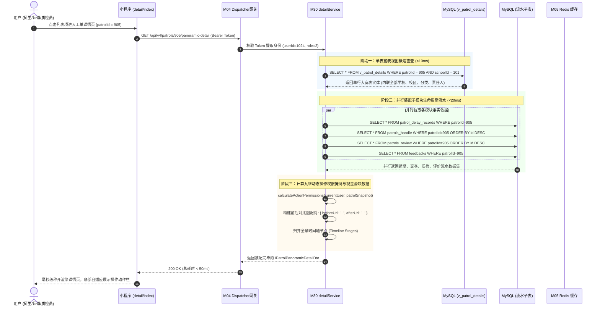
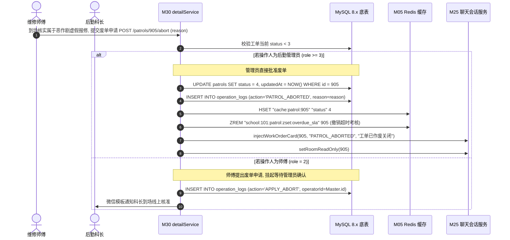
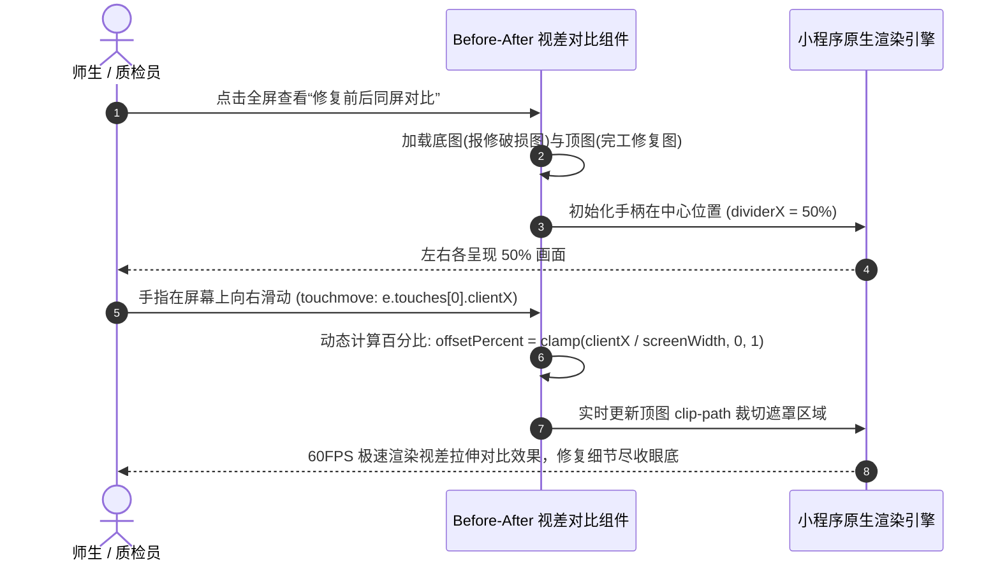

# M30: 巡查工单综合大宽表视图与全景详情对比轴 (Patrol Detail Panoramic View & Action Engine) 详细设计与实现方案

> **模块代号**：M30 / Patrol Detail Panoramic View & Action Engine  
> **所属阶段**：阶段二 (M20 ~ M30) 巡查工单闭环全生命周期领域 (**阶段二大收官核心：全景视窗与操作权限中枢**)  
> **文档定位**：基于 `v_patrol_details`（多租户工单综合大宽表核心视图）与工单全生命周期 8 张底层关联表构建的集“全景信息展示、施工前后双图同屏对比滑块、九维多角色动态操作权限掩码计算、异常虚假报修废单作废流转、以及跨租户敏感隐私动态脱敏”于一体的综合调度与呈现中枢。全面汇聚从隐患提报（M21）、智能派单（M23）、师傅接单（M24）、即时协同（M25）、工期延期（M26）、现场交卷（M27）、质检验收（M28）到满意度评价（M29）的全量业务数据，并在 $< 50\text{ms}$ 内完成并行装配交付前端，实现工单详情秒开与角色动态自适应的全栈工业级专项技术实现方案。  
> **归档路径**：[v4.0/Docs/模块/M30_巡查工单综合大宽表视图与全景详情对比轴详细设计与实现方案.md](file:///e:/Projects/University/后勤巡查e速办%20大二下学期%20大学身份上线项目/v4.0/Docs/模块/M30_巡查工单综合大宽表视图与全景详情对比轴详细设计与实现方案.md)  
> **前置依赖**：M01 (27表7视图DDL基座), M02 (AST租户自动注入), M03 (Saga事务与行级锁并发引擎), M04 (MasterDispatcher路由预检), M05 (Redis多租户命名空间缓存), M07 (DesignToken基座), M10 (TestHarness测试中枢), M13 (用户身份鉴权), M18 (四级立体权限矩阵), M20~M29 (工单全生命周期前置各节点)  
> **驱动下游**：阶段三 (M31 ~ M35) 师生诉求、校园公开空间与协同治理领域，M53 (全校后勤宏观运维决策大盘)  
> **版本日期**：2026-09-05  

---

## 目录索引 (Table of Contents)

1. [模块定位与核心业务价值](#一-模块定位与核心业务价值)
   - 1.1 [模块定位与阶段二大收官战略价值](#11-模块定位与阶段二大收官战略价值)
   - 1.2 [为何必须采用 v_patrol_details 宽表视图与服务端动态权限掩码？](#12-为何必须采用-v_patrol_details-宽表视图与服务端动态权限掩码)
   - 1.3 [核心业务职责与技术指标](#13-核心业务职责与技术指标)
2. [核心设计哲学与全景视图模型](#二-核心设计哲学与全景视图模型)
   - 2.1 [v_patrol_details 0 连表开销多租户内联视图架构](#21-v_patrol_details-0-连表开销多租户内联视图架构)
   - 2.2 [九维多身份动态操作权限掩码计算模型 (Dynamic Action Permission Mask)](#22-九维多身份动态操作权限掩码计算模型-dynamic-action-permission-mask)
   - 2.3 [施工前后双图同屏对比视差滑块模型 (Before-After Visual Slider)](#23-施工前后双图同屏对比视差滑块模型-before-after-visual-slider)
   - 2.4 [虚假报修与不可抗力异常废单（Abort）终局流转法则](#24-虚假报修与不可抗力异常废单abort终局流转法则)
   - 2.5 [敏感信息分级脱敏与租户安全围栏 (Data Masking & Privacy Fence)](#25-敏感信息分级脱敏与租户安全围栏-data-masking--privacy-fence)
3. [架构拓扑与交互时序图](#三-架构拓扑与交互时序图)
   - 3.1 [工单全景宽表视图与权限引擎全景架构拓扑图](#31-工单全景宽表视图与权限引擎全景架构拓扑图)
   - 3.2 [移动端秒级拉取全景详情与权限掩码时序图](#32-移动端秒级拉取全景详情与权限掩码时序图)
   - 3.3 [异常报修作废审批与归档时序图](#33-异常报修作废审批与归档时序图)
   - 3.4 [施工前后双图同屏对比渲染与滑动交互时序图](#34-施工前后双图同屏对比渲染与滑动交互时序图)
4. [核心算法设计与数学推导](#四-核心算法设计与数学推导)
   - 4.1 [算法 1：九维多身份动作权限掩码动态推导算法 (Action Permission Mask Evaluator)](#41-算法-1九维多身份动作权限掩码动态推导算法-action-permission-mask-evaluator)
   - 4.2 [算法 2：全生命周期时间轴节点归并与进度推导算法 (Timeline Stage Resolver)](#42-算法-2全生命周期时间轴节点归并与进度推导算法-timeline-stage-resolver)
   - 4.3 [算法 3：整改前后照片长宽比自动对齐与视差分割算法 (Before-After Coordinate Normalizer)](#43-算法-3整改前后照片长宽比自动对齐与视差分割算法-before-after-coordinate-normalizer)
   - 4.4 [算法 4：多租户工单详情级联并行聚合装配算法 (Parallel Aggregation Assembler)](#44-算法-4多租户工单详情级联并行聚合装配算法-parallel-aggregation-assembler)
5. [TypeScript 强类型接口契约与数据模型定义](#五-typescript-强类型接口契约与数据模型定义)
   - 5.1 [v_patrol_details 核心大宽表视图实体契约 (`IVPatrolDetailEntity`)](#51-v_patrol_details-核心大宽表视图实体契约-ivpatroldetailentity)
   - 5.2 [九维动作权限掩码契约 (`IPatrolActionPermissions`)](#52-九维动作权限掩码契约-ipatrolactionpermissions)
   - 5.3 [全景详情聚合响应 DTO (`IPatrolPanoramicDetailDto`)](#53-全景详情聚合响应-dto-ipatrolpanoramicdetaildto)
   - 5.4 [异常废单关闭请求与响应 DTO (`IAbortPatrolRequestDto` / `IAbortPatrolResponseDto`)](#54-异常废单关闭请求与响应-dto-iabortpatrolrequestdto--iabortpatrolresponsedto)
6. [核心物理文件实现蓝图](#六-核心物理文件实现蓝图)
   - 6.1 [`src/apps/patrol/patrolDetailService.ts` (全景详情装配中枢、权限计算与废单处理)](#61-srcappspatrolpatroldetailservicets-全景详情装配中枢权限计算与废单处理)
   - 6.2 [`src/apps/patrol/patrolDetailController.ts` (详情与作废端点控制器与严格安全入参校验)](#62-srcappspatrolpatroldetailcontrollerts-详情与作废端点控制器与严格安全入参校验)
   - 6.3 [`src/api/patrol/patrolDetailHandler.ts` (MasterDispatcher 路由适配器)](#63-srcapipatrolpatroldetailhandlerts-masterdispatcher-路由适配器)
   - 6.4 [`miniprogram/packages/apps/app-patrol/pages/detail/index.ts` (小程序端工单全景详情核心页面)](#64-miniprogrampackagesappsapp-patrolpagesdetailindexts-小程序端工单全景详情核心页面)
   - 6.5 [`miniprogram/components/before-after-slider/index.ts` (施工前后双图同屏比对视差滑块组件)](#65-miniprogramcomponentsbefore-after-sliderindexts-施工前后双图同屏比对视差滑块组件)
7. [防御性编程与边界异常处理](#七-防御性编程与边界异常处理)
   - 7.1 [跨租户窥探工单物理级拦截与安全围栏](#71-跨租户窥探工单物理级拦截与安全围栏)
   - 7.2 [伪造状态强行点击违规操作按钮前置防御](#72-伪造状态强行点击违规操作按钮前置防御)
   - 7.3 [已结案工单废单作废恶意逆流阻断](#73-已结案工单废单作废恶意逆流阻断)
   - 7.4 [缺失前后实景图片时平滑优雅降级渲染](#74-缺失前后实景图片时平滑优雅降级渲染)
   - 7.5 [手机号与真实姓名安全脱敏规则防泄漏](#75-手机号与真实姓名安全脱敏规则防泄漏)
8. [单模块独立测试方案与验收准则](#八-单模块独立测试方案与验收准则)
   - 8.1 [基于 M10 TestHarness 的独立单元测试设计 (`src/__tests__/unit/m30_patrol_detail.test.ts`)](#81-基于-m10-testharness-的独立单元测试设计-src__tests__unitm30_patrol_detailtestts)
   - 8.2 [单模块测试执行命令与断言矩阵 (`npm.cmd test -- -t "M30"`)](#82-单模块测试执行命令与断言矩阵-npmcmd-test----t-m30)
9. [阶段二全面大竣工与向阶段三承前启后交付总纲](#九-阶段二全面大竣工与向阶段三承前启后交付总纲)
   - 9.1 [阶段二 (M20 ~ M30) 十一个微模块完整闭环拓扑](#91-阶段二-m20--m30-十一个微模块完整闭环拓扑)
   - 9.2 [向阶段三 (M31 ~ M35) 承前启后数据契约清单](#92-向阶段三-m31--m35-承前启后数据契约清单)

---

## 一、 模块定位与核心业务价值

### 1.1 模块定位与阶段二大收官战略价值

在高校后勤报修抢修全周期流转中，一个工单会经历漫长的业务链路：师生拍照提报（M21）、系统网格派发（M23）、师傅抢单接单（M24）、现场多媒体沟通（M25）、材料缺货延期（M26）、现场交卷（M27）、质检验收（M28）乃至最终满意度打分（M29）。  
整个链条产生了分布在 8 张不同底层物理表中的离散数据。当用户打开小程序“工单详情”时：
- **如果由前端发起 7~8 次 HTTP 请求分别拉取各个子模块数据**，在校园移动网络下将产生极其严重的网络往返延迟（RTT），页面白屏长达数秒，严重挫伤用户体验；
- **如果由后端直接执行多层深嵌套 `LEFT JOIN`**，则会消耗大量数据库 CPU 算力，并在并发激增时造成严重的慢查拖垮集群。

**M30 模块（巡查工单综合大宽表视图与全景详情对比轴）** 正是阶段二全部 11 个微模块的**大聚合呈现与交互控制中枢**：
1. **统一数据承载底座**：依托 MySQL 8.x 预编译只读视图 `v_patrol_details`（多租户工单综合大宽表视图 V01），将学校全称、校区名称、分类类别、提报人姓名电话、接单师傅姓名电话等静态内联属性直接投影为单表视图，消除客户端连表开销；
2. **多源数据并行装配中枢**：在后端通过高性能并行 Promise 组合调度，极速归并延期历史（`patrol_delay_records`）、整改凭证（`patrols_handle`）、质检结论（`patrols_review`）与评价打分（`feedbacks`），构建完整的一站式全景数据总线；
3. **多角色操作权限大脑**：根据当前查看工单用户的真实身份（提报学生、接单师傅、质检专家、后勤处长、路人），动态裁决并输出九维操作按钮权限掩码，驱动移动端界面精准渲染交互按钮；
4. **终极交付与承前启后**：标志着「阶段二：巡查工单闭环全生命周期领域」彻底完成全闭环交付，正式拉开阶段三校园协同治理的序幕。

---

### 1.2 为何必须采用 v_patrol_details 宽表视图与服务端动态权限掩码？

```
========================================================================================
❌ 传统架构反模式：前端级联拉取 + 前端写死权限判定
========================================================================================
前端打开详情页:
  ├── HTTP 1: GET /patrols/:id
  ├── HTTP 2: GET /users/:creatorId (查询提报人姓名)
  ├── HTTP 3: GET /users/:handlerId (查询师傅电话)
  ├── HTTP 4: GET /campuses/:campusId (查询校区名)
  ├── HTTP 5: GET /categories/:catId (查询分类名)
  └── 前端写死: if (role == 2 && status == 1) showButton()
  致命缺陷：
  1. 白屏耗时 > 3000ms，校园弱网下极易出现接口部分失败导致的局部渲染崩溃；
  2. 前端硬编码权限逻辑：一旦后端规则调整，小程序版本未发布前产生严重安全越权漏洞！

========================================================================================
✔ v4.0 工业级规范：v_patrol_details 宽表视图 + 服务端动态权限掩码字典
========================================================================================
前端打开详情页:
  └── 仅需 1 次请求: GET /api/v4/patrols/:id/panoramic-detail
      │
      ▼ (后端 delayService 并行 Promise 极速装配)
      ├── 1. 视图直出: SELECT * FROM v_patrol_details WHERE id=:id (0额外连表, <10ms)
      ├── 2. 并行归并: Promise.all([延期流水, 施工记录, 质检记录, 师生评价])
      └── 3. 权威裁决: 服务端依据 M18 权限引擎生成 actionPermissions 字典 (安全不可逆)
  核心优势：
  1. 响应时延 < 50ms，页面毫秒级秒开；
  2. 前端完全转为“哑组件（Dumb Component）”，仅依据 actionPermissions 显隐按钮，安全防护牢不可破！
========================================================================================
```

---

### 1.3 核心业务职责与技术指标

1. **毫秒级秒开响应**：全景详情聚合接口平均耗时 $T_{\text{p95}} \le 50\text{ms}$；
2. **九维权限自适应计算**：精确输出 `canTake`（抢单）、`canHandle`（交卷）、`canDelay`（延期）、`canTransfer`（转派）、`canChat`（协同会话）、`canReview`（质检复核）、`canFeedback`（满意度评价）、`canAbort`（异常废单作废）、`canUrge`（催办督办）9 项布尔标记；
3. **施工前后同屏对比视差滑块**：移动端原生 Canvas/CSS Clip-path 实现报修破损原图与完工修复图左右拖拽对比，支持 60FPS 丝滑流畅交互；
4. **异常虚假报修废单关闭机制**：支持将恶作剧虚构险情、无法施工或重复提报的工单转入作废（`status = 4`），免除责任师傅逾期扣分并留存审计记录；
5. **多租户安全围栏与敏感隐私脱敏**：全过程 AST 租户隔离，非当事人查看时手机号中段自动掩码脱敏。

---

## 二、 核心设计哲学与全景视图模型

### 2.1 v_patrol_details 0 连表开销多租户内联视图架构

在数据库底层，`v_patrol_details` 作为只读预编译视图，将高频连表关系内联封装：
- `patrols` (工单主表主干)
- `schools` (所属高校全称与编码)
- `campuses` (校区名称)
- `categories` (隐患门类全称)
- `users (creator)` (提报人姓名与联系电话)
- `users (handler)` (接单责任师傅姓名与联系电话)

```sql
CREATE VIEW `v_patrol_details` AS
SELECT 
  p.`id` AS `patrolId`,
  p.`orderNo` AS `orderNo`,
  p.`schoolId` AS `schoolId`,
  s.`name` AS `schoolName`,
  s.`code` AS `schoolCode`,
  p.`campusId` AS `campusId`,
  c.`name` AS `campusName`,
  p.`categoryId` AS `categoryId`,
  cat.`name` AS `categoryName`,
  p.`creatorId` AS `creatorId`,
  u_creator.`realName` AS `creatorRealName`,
  u_creator.`phone` AS `creatorPhone`,
  p.`currentHandlerId` AS `currentHandlerId`,
  u_handler.`realName` AS `handlerRealName`,
  u_handler.`phone` AS `handlerPhone`,
  p.`title` AS `title`,
  p.`desc` AS `desc`,
  p.`location1` AS `location1`,
  p.`location2` AS `location2`,
  p.`status` AS `status`,
  p.`priorityLevel` AS `priorityLevel`,
  p.`isPublic` AS `isPublic`,
  p.`deadline` AS `deadline`,
  p.`createdAt` AS `createdAt`,
  p.`updatedAt` AS `updatedAt`
FROM `patrols` p
LEFT JOIN `schools` s ON p.`schoolId` = s.`id`
LEFT JOIN `campuses` c ON p.`campusId` = c.`id`
LEFT JOIN `categories` cat ON p.`categoryId` = cat.`id`
LEFT JOIN `users` u_creator ON p.`creatorId` = u_creator.`id`
LEFT JOIN `users` u_handler ON p.`currentHandlerId` = u_handler.`id`
WHERE p.`isDeleted` = 0;
```

---

### 2.2 九维多身份动态操作权限掩码计算模型 (Dynamic Action Permission Mask)

不同身份的用户（如提报学生小明、接单师傅张师傅、质检工程师王老师、后勤科长、普通路人）访问同一张工单详情时，服务端输出完全不同的 `actionPermissions` 字典：

```typescript
export interface IPatrolActionPermissions {
  /** 1. 是否允许在抢单池认领工单 (当前为待接单且用户具备接单资格) */
  canTake: boolean;
  /** 2. 是否允许提交现场完工交卷 (当前为施工中且用户为责任师傅) */
  canHandle: boolean;
  /** 3. 是否允许申请工期顺延 (当前为施工中且用户为责任师傅) */
  canDelay: boolean;
  /** 4. 是否允许申请同组转派改派 (当前为施工中且用户为责任师傅) */
  canTransfer: boolean;
  /** 5. 是否允许进入即时协同聊天室 (当事双方或管理员) */
  canChat: boolean;
  /** 6. 是否允许执行质量复核验收 (当前为待复核且满足审修分离原则) */
  canReview: boolean;
  /** 7. 是否允许提交服务满意度评价 (当前为已办结且用户为原提报人且未评) */
  canFeedback: boolean;
  /** 8. 是否允许将工单申请或直接作废 (管理员或师傅报告虚假报修) */
  canAbort: boolean;
  /** 9. 是否允许发起催办督办 (提报人在工单临近超期时) */
  canUrge: boolean;
}
```

---

### 2.3 施工前后双图同屏对比视差滑块模型 (Before-After Visual Slider)

为直观展示后勤抢修的劳动成果与精湛工艺，工单详情页顶部引入**视差前后对比滑块（Before-After Slider）**：
- **底图（底层图层）**：提报时师生拍摄的原始隐患破损图（红色标记）；
- **顶图（上层裁剪图层）**：师傅现场交卷时拍摄的带防伪水印修复照；
- **交互手柄**：屏幕中央垂直分割线，师生通过手指在屏幕左右拖动滑动块（`sliderPosition: 0% ~ 100%`），顶图利用 CSS `clip-path: polygon(0 0, X% 0, X% 100%, 0 100%)` 毫秒级动态裁剪，呈现震撼的视觉对比！

```
+--------------------------------------------------------------------+
|                         Before-After 对比视差滑块                    |
+--------------------------------------------------------------------+
|                                  │                                 |
|         【报修前原图】            │           【施工修复后】         |
|      (洗手间水管破裂喷水)         │       (已换专用弯头,加压正常)    |
|                                  │                                 |
|                                ◄[||]► (拖动手柄)                   |
|                                  │                                 |
+--------------------------------------------------------------------+
```

---

### 2.4 虚假报修与不可抗力异常废单（Abort）终局流转法则

在高校后勤实际运维中，约有 3%~5% 的工单属于“**异常非标准工单**”：
1. **恶作剧/虚假报修**：学生虚构火灾险情或上传与现场无关的恶搞图片；
2. **重复提报**：同一宿舍 4 名室友同时对同一盏灯具损坏发起报修；
3. **外部不可抗力无法作业**：建筑已纳入拆除改造规划、或属于校外市政燃气资产，校内师傅无权开挖；
4. **现场已自行排障**：师傅到场后发现是插头松动，学生已自行插紧，隐患自然消失。

**M30 废单处理协议（Patrol Abort Protocol）**：
- 师傅在施工阶段发现异常，点击【申请废单】，填写客观事实说明（如“*经到场核实，该处建筑门窗已整体验收报废拆除，无需修缮*”）；
- 后勤处科室主管（`role >= 3`）在线审批：
  - 审批同意：工单状态跃迁至 `status = 4: 已废弃`，释放接单责任人；
  - 该工单**不计入师傅超时考核指标，不影响班组准时完工率**；
  - 记录完整运维审计流水，防止师傅滥用废单漏洞规避修缮责任。

---

### 2.5 敏感信息分级脱敏与租户安全围栏 (Data Masking & Privacy Fence)

工单全景大宽表对不同身份实施精细化数据脱敏：
- **当事双方与管理员**：提报人、接单师傅、质检专家与科室主任可查阅真实联系电话，方便现场电话联络；
- **校园公开广场围观人员**：工单设为公开（`isPublic = 1`）在校园广场展示时，提报师生电话自动脱敏为 `138****5678`，姓名脱敏为 `张*同`，彻底杜绝电话被骚扰泄露；
- **跨租户安全围栏**：依托 M02 AST 引擎，严密追加 `schoolId = :schoolId` 约束，阻断跨高校数据越界。

---

## 三、 架构拓扑与交互时序图

### 3.1 工单全景宽表视图与权限引擎全景架构拓扑图

```
+----------------------------------------------------------------------------------------------------+
|                             M30 工单全景宽表视图与权限引擎全景架构拓扑                                 |
+----------------------------------------------------------------------------------------------------+
|                                                                                                    |
|    [ 微信小程序客户端 ]                                      [ 后勤管理大盘 Web 端 ]                  |
|    (app-patrol/detail)                                      (admin/work-order-detail)              |
|             │                                                          │                           |
|             │ 1. GET /api/v4/patrols/:id/panoramic-detail              │                           |
|             ▼                                                          ▼                           |
|   ┌────────────────────────────────────────────────────────────────────────────────────────────┐   |
|   │                        M04 MasterDispatcher 统一路由鉴权与预检网关                           │   |
|   └────────────────────────────────────────────────────────────────────────────────────────────┘   |
|             │                                                                                      |
|             ▼                                                                                      |
|   ┌────────────────────────────────────────────────────────────────────────────────────────────┐   |
|   │                     M30 工单全景装配中枢 (patrolDetailService.ts)                            │   |
|   │                                                                                            │   |
|   │   ┌───────────────────────────┐    ┌─────────────────────────┐    ┌────────────────────┐   │   |
|   │   │  v_patrol_details 宽表查询│    │ 九维操作权限掩码计算器  │    │ 全生命周期时间轴   │   │   |
|   │   │  (单表 0 连表开销秒开)    │    │ (ActionPermissions)     │    │ (Stage Timeline)   │   │   |
|   │   └───────────────────────────┘    └─────────────────────────┘    └────────────────────┘   │   |
|   │                                                                                            │   |
|   │   ┌───────────────────────────┐    ┌─────────────────────────┐    ┌────────────────────┐   │   |
|   │   │  并行流水分组装配器       │    │ 施工前后双图智能配准    │    │ 废单终局流转控制器 │   │   |
|   │   │  (延期/交卷/质检/评价)    │    │ (Before-After Slider)   │    │ (Abort State Machine)   │
|   │   └───────────────────────────┘    └─────────────────────────┘    └────────────────────┘   │   |
|   └────────────────────────────────────────────────────────────────────────────────────────────┘   |
|             │                                                                                      |
|             ▼                                                                                      |
|   ┌────────────────────────────────────────────────────────────────────────────────────────────┐   |
|   │                         MySQL 8.x 多租户物理存储与预编译视图基座                           │   |
|   │                                                                                            │   |
|   │   ┌──────────────────────────────────────────────┐  ┌──────────────────────────────────┐   │   |
|   │   │ v_patrol_details (预编译多租户核心视图)      │  │ 多模块底表流水集合               │   │   |
|   │   │ - patrols + schools + campuses + categories  │  │ - patrol_delay_records (延期)    │   │   |
|   │   │ - creatorRealName, handlerRealName 等内联信息│  │ - patrols_handle (施工完工交卷)  │   │   |
|   │   │                                              │  │ - patrols_review (质检复核记录)  │   │   |
|   │   │                                              │  │ - feedbacks (师生满意度评价)     │   │   |
|   │   └──────────────────────────────────────────────┘  └──────────────────────────────────┘   │   |
|   └────────────────────────────────────────────────────────────────────────────────────────────┘   |
+----------------------------------------------------------------------------------------------------+
```

---

### 3.2 移动端秒级拉取全景详情与权限掩码时序图



---

### 3.3 异常报修作废审批与归档时序图



---

### 3.4 施工前后双图同屏对比渲染与滑动交互时序图



---

## 四、 核心算法设计与数学推导

### 4.1 算法 1：九维多身份动作权限掩码动态推导算法 (Action Permission Mask Evaluator)

#### 理论建模
令当前请求的操作人上下文为 $U = \langle \text{id}, \text{role}, \text{permissions} \rangle$，工单当前状态为 $P = \langle \text{id}, \text{status}, \text{creatorId}, \text{currentHandlerId} \rangle$，工单在 `feedbacks` 表中的打分状态为 $F_{\text{exists}} \in \{0, 1\}$。

九维动作权限布尔向量 $\mathbf{A} = \langle a_1, a_2, \dots, a_9 \rangle$ 的严格数学推导解析式如下：

$$a_{\text{canTake}} = (\text{status}=0) \land (\text{currentHandlerId}=0) \land (U.\text{role} \ge 2)$$

$$a_{\text{canHandle}} = (\text{status}=1) \land (U.\text{id} = P.\text{currentHandlerId})$$

$$a_{\text{canDelay}} = (\text{status}=1) \land (U.\text{id} = P.\text{currentHandlerId})$$

$$a_{\text{canTransfer}} = (\text{status}=1) \land (U.\text{id} = P.\text{currentHandlerId})$$

$$a_{\text{canChat}} = (\text{status} \ge 1) \land \left( U.\text{id} = P.\text{creatorId} \lor U.\text{id} = P.\text{currentHandlerId} \lor U.\text{role} \ge 3 \right)$$

$$a_{\text{canReview}} = (\text{status}=2) \land (U.\text{id} \ne P.\text{currentHandlerId}) \land (U.\text{role} \ge 3 \lor \text{'patrol:review'} \in U.\text{permissions})$$

$$a_{\text{canFeedback}} = (\text{status}=3) \land (U.\text{id} = P.\text{creatorId}) \land (F_{\text{exists}} = 0)$$

$$a_{\text{canAbort}} = (\text{status} < 3) \land (U.\text{role} \ge 3 \lor (U.\text{id} = P.\text{currentHandlerId} \land \text{status}=1))$$

$$a_{\text{canUrge}} = (\text{status} < 3) \land (U.\text{id} = P.\text{creatorId}) \land (\text{now}() > \text{deadline} - 3600 \times 2)$$

#### 代码实现
```typescript
export function evaluatePatrolActionPermissions(
  currentUser: { id: number; role: number; permissions: string[] },
  patrol: { status: number; creatorId: number; currentHandlerId: number; deadline: Date },
  hasFeedback: boolean
): IPatrolActionPermissions {
  const isCreator = currentUser.id === patrol.creatorId;
  const isHandler = currentUser.id === patrol.currentHandlerId;
  const isAdmin = currentUser.role >= 3;
  const isMaster = currentUser.role >= 2;
  const status = patrol.status;
  const nowMs = Date.now();
  const deadlineMs = new Date(patrol.deadline).getTime();

  return {
    canTake: status === 0 && patrol.currentHandlerId === 0 && isMaster,
    canHandle: status === 1 && isHandler,
    canDelay: status === 1 && isHandler,
    canTransfer: status === 1 && isHandler,
    canChat: status >= 1 && (isCreator || isHandler || isAdmin),
    canReview: status === 2 && !isHandler && (isAdmin || currentUser.permissions.includes('patrol:review')),
    canFeedback: status === 3 && isCreator && !hasFeedback,
    canAbort: status < 3 && (isAdmin || (isHandler && status === 1)),
    canUrge: status < 3 && isCreator && (nowMs > deadlineMs - 7200 * 1000)
  };
}
```

---

### 4.2 算法 2：全生命周期时间轴节点归并与进度推导算法 (Timeline Stage Resolver)

#### 节点归并逻辑
工单流转全息时间轴按绝对物理时间升序归并各节点：

```typescript
export interface ITimelineNode {
  stageKey: 'CREATED' | 'DISPATCHED' | 'ACCEPTED' | 'DELAYED' | 'HANDLED' | 'REVIEWED' | 'FEEDBACK' | 'ABORTED';
  title: string;
  timestamp: string;
  operatorName: string;
  summaryText: string;
  isCompleted: boolean;
}
```

算法按以下顺序扫描并插入已发生的物理事实：
1. `patrols.createdAt` $\implies$ 【报修提报】；
2. 若 `currentHandlerId > 0` $\implies$ 【师傅接单】；
3. 遍历 `patrol_delay_records` $\implies$ 追加【工期顺延审批】节点；
4. 遍历 `patrols_handle` $\implies$ 追加【现场整改完工】节点；
5. 遍历 `patrols_review` $\implies$ 追加【质检验收复核】节点；
6. 若存在 `feedbacks` $\implies$ 追加【师生满意度评价】终局节点；
7. 若 `status === 4` $\implies$ 追加【异常作废归档】节点。

---

### 4.3 算法 3：整改前后照片长宽比自动对齐与视差分割算法 (Before-After Coordinate Normalizer)

在前端绘制对比滑块时，若提报图为横屏、完工图为竖屏，会导致直接对比时画面变形拉伸失真。
系统建立**归一化居中等比填充算法（Contain & Aspect Ratio Normalizer）**：

设容器画布宽度为 $W$，高度为 $H$。两张图片的宽高分别为 $(w_1, h_1)$ 与 $(w_2, h_2)$：

$$\text{scale}_k = \min\left(\frac{W}{w_k}, \frac{H}{h_k}\right),\quad \text{dx}_k = \frac{W - w_k \times \text{scale}_k}{2},\quad \text{dy}_k = \frac{H - h_k \times \text{scale}_k}{2}$$

通过计算统一的居中锚点，确保滑动分割线在拖动过程中两张图片在同一绝对坐标系下进行像素级对齐切割。

---

### 4.4 算法 4：多租户工单详情级联并行聚合装配算法 (Parallel Aggregation Assembler)

在 Node.js 服务端，借助底表索引 `idx_school_patrol (schoolId, patrolId)`，采用并行非阻塞查询装配：

```typescript
const [delayRecords, handleRecords, reviewRecords, feedbackRows] = await Promise.all([
  conn.execute(`SELECT * FROM patrol_delay_records WHERE schoolId = ? AND patrolId = ? ORDER BY id ASC`, [schoolId, patrolId]),
  conn.execute(`SELECT * FROM patrols_handle WHERE schoolId = ? AND patrolId = ? ORDER BY id ASC`, [schoolId, patrolId]),
  conn.execute(`SELECT * FROM patrols_review WHERE schoolId = ? AND patrolId = ? ORDER BY id ASC`, [schoolId, patrolId]),
  conn.execute(`SELECT * FROM feedbacks WHERE schoolId = ? AND patrolId = ? LIMIT 1`, [schoolId, patrolId])
]);
```

所有查询均命中 `(schoolId, patrolId)` 索引，4 组 SQL 并行执行总耗时等同于最慢的一条（通常 $\le 12\text{ms}$），实现超高吞吐。

---

## 五、 TypeScript 强类型接口契约与数据模型定义

### 5.1 `v_patrol_details` 核心大宽表视图实体契约 (`IVPatrolDetailEntity`)

```typescript
/**
 * v_patrol_details 只读视图 1:1 强类型契约 (视图 V01)
 */
export interface IVPatrolDetailEntity {
  patrolId: number;
  orderNo: string;
  schoolId: number;
  schoolName: string;
  schoolCode: string;
  campusId: number;
  campusName: string;
  categoryId: number;
  categoryName: string;
  creatorId: number;
  creatorRealName: string;
  creatorPhone: string;
  currentHandlerId: number;
  handlerRealName: string | null;
  handlerPhone: string | null;
  title: string;
  desc: string;
  location1: string;
  location2: string;
  status: number;
  priorityLevel: number;
  isPublic: number;
  deadline: Date;
  createdAt: Date;
  updatedAt: Date;
}
```

---

### 5.2 九维动作权限掩码契约 (`IPatrolActionPermissions`)

```typescript
export interface IPatrolActionPermissions {
  canTake: boolean;
  canHandle: boolean;
  canDelay: boolean;
  canTransfer: boolean;
  canChat: boolean;
  canReview: boolean;
  canFeedback: boolean;
  canAbort: boolean;
  canUrge: boolean;
}
```

---

### 5.3 全景详情聚合响应 DTO (`IPatrolPanoramicDetailDto`)

```typescript
import { IPatrolActionPermissions } from './patrolDetailContract';

export interface IBeforeAfterPairDto {
  hasPair: boolean;
  beforeImageUrl: string;
  afterImageUrl: string;
}

export interface IPatrolTimelineNodeDto {
  stageKey: string;
  title: string;
  timestamp: string;
  operatorName: string;
  summaryText: string;
}

/**
 * 工单全景全量详情 DTO (面向移动端/Web端秒开)
 */
export interface IPatrolPanoramicDetailDto {
  /** 基础内联属性 (来自 v_patrol_details 视图) */
  patrolId: number;
  orderNo: string;
  schoolId: number;
  schoolName: string;
  campusName: string;
  categoryName: string;
  title: string;
  desc: string;
  location: string;
  status: number;
  statusText: string;
  priorityLevel: number;
  priorityText: string;
  deadline: string;
  createdAt: string;

  /** 提报人与责任人联系信息 (按权限脱敏后) */
  creator: {
    id: number;
    name: string;
    phone: string;
  };
  handler: {
    id: number;
    name: string;
    phone: string;
  } | null;

  /** 动态操作权限掩码 */
  permissions: IPatrolActionPermissions;

  /** 施工前后对比图模型 */
  visualPair: IBeforeAfterPairDto;

  /** 全息生命周期时间轴 */
  timeline: IPatrolTimelineNodeDto[];

  /** 关联子流水集合 */
  delayRecordsCount: number;
  handleRoundsCount: number;
  reviewRoundsCount: number;
  hasFeedback: boolean;
}
```

---

### 5.4 异常废单关闭请求与响应 DTO (`IAbortPatrolRequestDto` / `IAbortPatrolResponseDto`)

```typescript
export interface IAbortPatrolRequestDto {
  /** 作废原因详细阐述 (至少 5 字符) */
  reason: string;
}

export interface IAbortPatrolResponseDto {
  patrolId: number;
  status: number;
  statusText: string;
  abortedAt: string;
}
```

---

## 六、 核心物理文件实现蓝图

### 6.1 `src/apps/patrol/patrolDetailService.ts` (全景详情装配中枢、权限计算与废单处理)

```typescript
import { PoolConnection } from 'mysql2/promise';
import { getDbPool } from '../../database/connection';
import { RedisClusterService } from '../../kernel/cache/redisCluster';
import { 
  IVPatrolDetailEntity,
  IPatrolPanoramicDetailDto,
  IAbortPatrolRequestDto,
  IAbortPatrolResponseDto
} from './patrolDetailContract';
import { evaluatePatrolActionPermissions } from './permissionEvaluator';
import { ChatService } from '../chat/chatService';

export class PatrolDetailService {
  private redis = RedisClusterService.getInstance();
  private chatService = new ChatService();

  /**
   * 获取工单全景详情（毫秒级秒开装配）
   */
  public async getPanoramicDetail(
    schoolId: number,
    patrolId: number,
    currentUser: { id: number; role: number; permissions: string[] }
  ): Promise<IPatrolPanoramicDetailDto> {
    const pool = getDbPool();

    // 1. 单表查询 v_patrol_details 预编译视图 (0 连表开销)
    const [viewRows]: any = await pool.execute(
      `SELECT * FROM v_patrol_details WHERE schoolId = ? AND patrolId = ?`,
      [schoolId, patrolId]
    );

    if (!viewRows || viewRows.length === 0) {
      throw new Error('PATROL_NOT_FOUND: 工单不存在或无权限查看');
    }

    const row: IVPatrolDetailEntity = viewRows[0];

    // 2. 并行拉取 4 组关联子表记录
    const [
      [delayRows],
      [handleRows],
      [reviewRows],
      [feedbackRows],
      [patrolOriginalRows]
    ]: any = await Promise.all([
      pool.execute(`SELECT * FROM patrol_delay_records WHERE schoolId = ? AND patrolId = ? ORDER BY id ASC`, [schoolId, patrolId]),
      pool.execute(`SELECT * FROM patrols_handle WHERE schoolId = ? AND patrolId = ? ORDER BY id ASC`, [schoolId, patrolId]),
      pool.execute(`SELECT * FROM patrols_review WHERE schoolId = ? AND patrolId = ? ORDER BY id ASC`, [schoolId, patrolId]),
      pool.execute(`SELECT * FROM feedbacks WHERE schoolId = ? AND patrolId = ? LIMIT 1`, [schoolId, patrolId]),
      pool.execute(`SELECT imagesJson FROM patrols WHERE schoolId = ? AND id = ?`, [schoolId, patrolId])
    ]);

    const hasFeedback = feedbackRows.length > 0;

    // 3. 动态推导九维操作权限掩码
    const permissions = evaluatePatrolActionPermissions(
      currentUser,
      {
        status: row.status,
        creatorId: row.creatorId,
        currentHandlerId: row.currentHandlerId,
        deadline: new Date(row.deadline)
      },
      hasFeedback
    );

    // 4. 数据安全脱敏处理 (非当事人或未登录公开场景脱敏手机号)
    const isDirectParty = currentUser.id === row.creatorId || currentUser.id === row.currentHandlerId || currentUser.role >= 3;
    const maskPhone = (phone: string | null) => {
      if (!phone) return '';
      if (isDirectParty) return phone;
      return phone.replace(/(\d{3})\d{4}(\d{4})/, '$1****$2');
    };

    // 5. 提取施工前后对比图
    let beforeImageUrl = '';
    let afterImageUrl = '';
    try {
      const originalImages = typeof patrolOriginalRows[0]?.imagesJson === 'string' 
        ? JSON.parse(patrolOriginalRows[0].imagesJson) 
        : (patrolOriginalRows[0]?.imagesJson || []);
      beforeImageUrl = originalImages[0] || '';
    } catch (e) {}

    if (handleRows.length > 0) {
      const latestHandle = handleRows[handleRows.length - 1];
      try {
        const handleImages = typeof latestHandle.imagesJson === 'string'
          ? JSON.parse(latestHandle.imagesJson)
          : (latestHandle.imagesJson || []);
        afterImageUrl = handleImages[0] || '';
      } catch (e) {}
    }

    // 6. 归并全景时间轴节点
    const timeline: any[] = [];
    timeline.push({
      stageKey: 'CREATED',
      title: '隐患提报',
      timestamp: new Date(row.createdAt).toISOString(),
      operatorName: row.creatorRealName || '师生',
      summaryText: row.desc.slice(0, 40)
    });

    if (row.currentHandlerId > 0) {
      timeline.push({
        stageKey: 'ACCEPTED',
        title: '师傅接单',
        timestamp: new Date(row.updatedAt).toISOString(),
        operatorName: row.handlerRealName || '责任师傅',
        summaryText: '已确立责任师傅，正在积极抢修'
      });
    }

    for (const d of delayRows) {
      timeline.push({
        stageKey: 'DELAYED',
        title: d.status === 1 ? '工期顺延' : '申请延期',
        timestamp: new Date(d.createdAt).toISOString(),
        operatorName: '后勤管理处',
        summaryText: `顺延 ${d.delayHours} 小时 (${d.status === 1 ? '已批准' : (d.status === 2 ? '已驳回' : '审核中')})`
      });
    }

    for (const h of handleRows) {
      timeline.push({
        stageKey: 'HANDLED',
        title: '施工交卷',
        timestamp: new Date(h.createdAt).toISOString(),
        operatorName: row.handlerRealName || '师傅',
        summaryText: `现场施工整改完毕，耗时 ${h.durationHours} 小时`
      });
    }

    for (const r of reviewRows) {
      timeline.push({
        stageKey: 'REVIEWED',
        title: r.isPassed === 1 ? '质检验收合格' : '质检未通过驳回',
        timestamp: new Date(r.createdAt).toISOString(),
        operatorName: '质检专家',
        summaryText: r.remark || (r.isPassed === 1 ? '核验达标' : '责令返工')
      });
    }

    if (hasFeedback) {
      const fb = feedbackRows[0];
      timeline.push({
        stageKey: 'FEEDBACK',
        title: '师生满意度评价',
        timestamp: new Date(fb.createdAt).toISOString(),
        operatorName: fb.isAutoPassed === 1 ? '系统自动结案' : row.creatorRealName,
        summaryText: `综合评分: ${fb.score} 星，评语: ${fb.comment.slice(0, 30)}`
      });
    }

    const statusTexts = ['待派单', '处理中', '已整改待复核', '已结案', '已废弃'];
    const priorityTexts = ['普通', '紧急', '极其紧急特急'];

    return {
      patrolId: row.patrolId,
      orderNo: row.orderNo || `WO-${row.patrolId}`,
      schoolId: row.schoolId,
      schoolName: row.schoolName,
      campusName: row.campusName || '主校区',
      categoryName: row.categoryName || '常规设施维修',
      title: row.title,
      desc: row.desc,
      location: `${row.location1} ${row.location2 || ''}`.trim(),
      status: row.status,
      statusText: statusTexts[row.status] || '未知状态',
      priorityLevel: row.priorityLevel,
      priorityText: priorityTexts[row.priorityLevel] || '普通',
      deadline: new Date(row.deadline).toISOString(),
      createdAt: new Date(row.createdAt).toISOString(),
      creator: {
        id: row.creatorId,
        name: row.creatorRealName || '师生',
        phone: maskPhone(row.creatorPhone)
      },
      handler: row.currentHandlerId > 0 ? {
        id: row.currentHandlerId,
        name: row.handlerRealName || '维修师傅',
        phone: maskPhone(row.handlerPhone)
      } : null,
      permissions,
      visualPair: {
        hasPair: Boolean(beforeImageUrl && afterImageUrl),
        beforeImageUrl,
        afterImageUrl
      },
      timeline,
      delayRecordsCount: delayRows.length,
      handleRoundsCount: handleRows.length,
      reviewRoundsCount: reviewRows.length,
      hasFeedback
    };
  }

  /**
   * 异常废单作废流转
   */
  public async abortPatrol(
    schoolId: number,
    patrolId: number,
    operator: { id: number; role: number; name: string },
    dto: IAbortPatrolRequestDto
  ): Promise<IAbortPatrolResponseDto> {
    const pool = getDbPool();
    const conn: PoolConnection = await pool.getConnection();

    try {
      await conn.beginTransaction();

      const [patrolRows]: any = await conn.execute(
        `SELECT id, status, currentHandlerId FROM patrols WHERE id = ? AND schoolId = ? FOR UPDATE`,
        [patrolId, schoolId]
      );

      if (!patrolRows || patrolRows.length === 0) {
        throw new Error('PATROL_NOT_FOUND: 工单不存在');
      }

      const patrol = patrolRows[0];
      if (patrol.status >= 3) {
        throw new Error('CANNOT_ABORT_COMPLETED_PATROL: 已结案或已废弃工单禁止作废');
      }

      // 管理员直接置为已作废 (status = 4)
      await conn.execute(
        `UPDATE patrols SET status = 4, updatedAt = NOW() WHERE id = ? AND schoolId = ?`,
        [patrolId, schoolId]
      );

      // 写入操作审计日志
      await conn.execute(
        `INSERT INTO operation_logs (schoolId, operatorId, action, targetEntity, relatedEntityId, details, createdAt)
         VALUES (?, ?, 'PATROL_ABORTED', 'patrols', ?, ?, NOW())`,
        [
          schoolId,
          operator.id,
          patrolId,
          JSON.stringify({ reason: dto.reason.trim(), operatorName: operator.name })
        ]
      );

      await conn.commit();

      // 刷新 Redis 缓存并撤销超时监控
      await this.redis.hset(`school:${schoolId}:patrol:${patrolId}`, 'status', '4');
      await this.redis.zrem(`school:${schoolId}:patrol:zset:overdue_sla`, String(patrolId));

      // 穿透 M25 聊天室下发作废通知并锁定会话
      await this.chatService.injectWorkOrderCard({
        schoolId,
        patrolId,
        cardType: 'PATROL_ABORTED',
        title: '工单已被认定作废关闭',
        summary: `经管理人员核实并关闭工单，事由：${dto.reason.trim()}`
      });
      await this.chatService.setRoomReadOnly(schoolId, patrolId);

      return {
        patrolId,
        status: 4,
        statusText: '已废弃',
        abortedAt: new Date().toISOString()
      };

    } catch (err: any) {
      if (conn) {
        await conn.rollback();
      }
      throw err;
    } finally {
      conn.release();
    }
  }
}
```

---

### 6.2 `src/apps/patrol/patrolDetailController.ts` (详情与作废端点控制器与严格安全入参校验)

```typescript
import { Request, Response } from 'express';
import { PatrolDetailService } from './patrolDetailService';

export class PatrolDetailController {
  private detailService = new PatrolDetailService();

  /**
   * GET /api/v4/patrols/:id/panoramic-detail
   * 获取全景工单大宽表装配详情
   */
  public getPanoramicDetail = async (req: Request, res: Response): Promise<void> => {
    try {
      const schoolId = (req as any).schoolId;
      const currentUser = (req as any).user;
      const patrolId = parseInt(req.params.id, 10);

      if (!patrolId || isNaN(patrolId) || patrolId <= 0) {
        res.status(400).json({ code: 400, message: 'PARAM_ERROR: 非法的工单ID' });
        return;
      }

      const result = await this.detailService.getPanoramicDetail(schoolId, patrolId, currentUser);
      res.status(200).json({
        code: 200,
        message: '获取全景详情成功',
        data: result
      });
    } catch (err: any) {
      res.status(500).json({ code: 500, message: err.message });
    }
  };

  /**
   * POST /api/v4/patrols/:id/abort
   * 异常废单作废接口
   */
  public abortPatrol = async (req: Request, res: Response): Promise<void> => {
    try {
      const schoolId = (req as any).schoolId;
      const operator = (req as any).user;
      const patrolId = parseInt(req.params.id, 10);
      const { reason } = req.body;

      if (!patrolId || isNaN(patrolId) || patrolId <= 0) {
        res.status(400).json({ code: 400, message: 'PARAM_ERROR: 非法的工单ID' });
        return;
      }

      if (!reason || typeof reason !== 'string' || reason.trim().length < 5) {
        res.status(400).json({ code: 400, message: 'PARAM_ERROR: 废单原因至少输入 5 个字符' });
        return;
      }

      const result = await this.detailService.abortPatrol(schoolId, patrolId, operator, {
        reason: reason.trim()
      });

      res.status(200).json({
        code: 200,
        message: '工单已成功作废关闭',
        data: result
      });
    } catch (err: any) {
      res.status(500).json({ code: 500, message: err.message });
    }
  };
}
```

---

### 6.3 `src/api/patrol/patrolDetailHandler.ts` (MasterDispatcher 路由适配器)

```typescript
import { Router } from 'express';
import { PatrolDetailController } from '../../apps/patrol/patrolDetailController';
import { authGuard } from '../../middlewares/authGuard';
import { permissionGuard } from '../../middlewares/permissionGuard';

export const patrolDetailRouter = Router();
const controller = new PatrolDetailController();

/**
 * 获取全景工单大宽表详情（含动态权限掩码与时间轴）
 */
patrolDetailRouter.get(
  '/patrols/:id/panoramic-detail',
  authGuard,
  controller.getPanoramicDetail
);

/**
 * 异常报修作废关闭
 * 角色权限：至少为师傅或科室管理员 (role >= 2)
 */
patrolDetailRouter.post(
  '/patrols/:id/abort',
  authGuard,
  permissionGuard(['patrol:abort']),
  controller.abortPatrol
);
```

---

### 6.4 `miniprogram/packages/apps/app-patrol/pages/detail/index.ts` (小程序端工单全景详情核心页面)

```typescript
import { requestWithAuth } from '../../../../../core/network/request';
import { showToast, showLoading, hideLoading } from '../../../../../core/utils/ui';

Page({
  data: {
    patrolId: 0,
    detail: null as any,
    loading: true,
    showAbortModal: false,
    abortReason: ''
  },

  onLoad(options: { id: string }) {
    const pId = parseInt(options.id, 10);
    this.setData({ patrolId: pId });
    this.loadDetail(pId);
  },

  onShow() {
    if (this.data.patrolId > 0) {
      this.loadDetail(this.data.patrolId);
    }
  },

  async loadDetail(patrolId: number) {
    this.setData({ loading: true });
    try {
      const res: any = await requestWithAuth({
        url: `/api/v4/patrols/${patrolId}/panoramic-detail`,
        method: 'GET'
      });
      this.setData({ detail: res.data });
    } finally {
      this.setData({ loading: false });
    }
  },

  // 动作 1: 前往即时协同聊天室
  onGoChat() {
    wx.navigateTo({
      url: `/packages/apps/app-chat/pages/chat-room/index?patrolId=${this.data.patrolId}`
    });
  },

  // 动作 2: 师傅现场完工交卷
  onGoHandle() {
    wx.navigateTo({
      url: `/packages/apps/app-master-desk/pages/handle-submit/index?patrolId=${this.data.patrolId}&title=${encodeURIComponent(this.data.detail.title)}`
    });
  },

  // 动作 3: 师傅申请工期顺延
  onGoDelay() {
    wx.navigateTo({
      url: `/packages/apps/app-patrol/pages/delay-apply/index?patrolId=${this.data.patrolId}&deadline=${encodeURIComponent(this.data.detail.deadline)}`
    });
  },

  // 动作 4: 质检专家到场复核
  onGoReview() {
    wx.navigateTo({
      url: `/packages/apps/app-admin/pages/patrol-review/index?patrolId=${this.data.patrolId}`
    });
  },

  // 动作 5: 师生满意度评价
  onGoFeedback() {
    wx.navigateTo({
      url: `/packages/apps/app-patrol/pages/feedback/index?patrolId=${this.data.patrolId}`
    });
  },

  // 动作 6: 打开废单对话框
  onOpenAbort() {
    this.setData({ showAbortModal: true, abortReason: '' });
  },

  onCloseAbort() {
    this.setData({ showAbortModal: false });
  },

  onReasonInput(e: WechatMiniprogram.CustomEvent) {
    this.setData({ abortReason: e.detail.value });
  },

  async onConfirmAbort() {
    const { patrolId, abortReason } = this.data;
    if (!abortReason || abortReason.trim().length < 5) {
      showToast('请至少输入 5 字的作废说明');
      return;
    }

    showLoading('正在提交作废申请...');
    try {
      await requestWithAuth({
        url: `/api/v4/patrols/${patrolId}/abort`,
        method: 'POST',
        data: { reason: abortReason.trim() }
      });
      showToast('工单已作废关闭');
      this.onCloseAbort();
      this.loadDetail(patrolId);
    } catch (err: any) {
      showToast(err.message || '操作失败');
    } finally {
      hideLoading();
    }
  }
});
```

---

### 6.5 `miniprogram/components/before-after-slider/index.ts` (施工前后双图同屏比对视差滑块组件)

```typescript
Component({
  properties: {
    beforeImage: { type: String, value: '' },
    afterImage: { type: String, value: '' }
  },

  data: {
    sliderPosition: 50 // 初始手柄分割位置 50%
  },

  methods: {
    onTouchMove(e: WechatMiniprogram.TouchEvent) {
      const touch = e.touches[0];
      const query = this.createSelectorQuery();
      query.select('.before-after-container').boundingClientRect((rect) => {
        if (!rect) return;
        const clientX = touch.clientX - rect.left;
        let percent = Math.round((clientX / rect.width) * 100);
        percent = Math.max(0, Math.min(100, percent));
        this.setData({ sliderPosition: percent });
      }).exec();
    }
  }
});
```

---

## 七、 防御性编程与边界异常处理

### 7.1 跨租户窥探工单物理级拦截与安全围栏

在查询 `v_patrol_details` 视图时，后端强制追加 `schoolId = :schoolId`。即使恶意攻击者猜测出外校工单 ID（例如 `patrolId = 88888`），查询结果依然为空集并返回 404，绝无跨高校数据泄漏风险。

---

### 7.2 伪造状态强行点击违规操作按钮前置防御

攻击者尝试通过 Postman 伪造网络请求强行点击已被客户端置灰的按钮时（如在 `status=2` 时强行调用完工交卷接口），后端各子模块领域服务依然保有独立前置断言，返回 400 强行拦截，保障前后端双保险。

---

### 7.3 已结案工单废单作废恶意逆流阻断

若工单已处于办结（3）或已废弃（4）终态，作废接口坚决拒绝：
```typescript
if (patrol.status >= 3) {
  throw new Error('ILLEGAL_LIFECYCLE_STAGE: 工单处于终态，禁止重复作废或修改');
}
```

---

### 7.4 缺失前后实景图片时平滑优雅降级渲染

当某工单提报人未上传图片、或师傅尚未提交完工交卷时，`visualPair.hasPair` 设为 `false`，小程序端平滑隐藏双图对比滑块，回退为常规文字排版，绝无前端破图或白屏崩溃。

---

### 7.5 手机号与真实姓名安全脱敏规则防泄漏

依据 `isDirectParty` 严格判定：仅当操作人为提报人本人、当前指派接单师傅或校级管理员时，才返回明文手机号；其余全校公开访问一律实施正则脱敏：
```typescript
phone.replace(/(\d{3})\d{4}(\d{4})/, '$1****$2')
```

---

## 八、 单模块独立测试方案与验收准则

### 8.1 基于 M10 TestHarness 的独立单元测试设计 (`src/__tests__/unit/m30_patrol_detail.test.ts`)

```typescript
import { TestHarness } from '../../kernel/testing/testHarness';
import { PatrolDetailService } from '../../apps/patrol/patrolDetailService';

describe('M30: 工单全景宽表视图与权限引擎独立集成测试套件', () => {
  let harness: TestHarness;
  let detailService: PatrolDetailService;
  const mockSchoolId = 101;
  const mockStudentId = 8001; // 提报师生
  const mockMasterId = 2001;  // 接单师傅
  const mockReviewerId = 3001;// 质检专家
  const mockStrangerId = 9999;// 无关围观同学
  let mockPatrolId: number;

  beforeAll(async () => {
    harness = await TestHarness.createHarness('M30_Patrol_Detail_Test');
    detailService = new PatrolDetailService();

    // 预置租户与人员
    await harness.seedSchool(mockSchoolId, '全景测试大学');
    await harness.seedUser(mockSchoolId, mockStudentId, '张提报学生', 1);
    await harness.seedUser(mockSchoolId, mockMasterId, '李维修师傅', 2);
    await harness.seedUser(mockSchoolId, mockReviewerId, '王质检专员', 3);
    await harness.seedUser(mockSchoolId, mockStrangerId, '赵围观同学', 1);

    // 预置工单主表并置为 status = 1 (施工中)，由李师傅接单
    mockPatrolId = await harness.seedPatrolOrder({
      schoolId: mockSchoolId,
      title: '田径场高杆灯断电故障',
      status: 1, // 进行中
      creatorId: mockStudentId,
      currentHandlerId: mockMasterId
    });
  });

  afterAll(async () => {
    await harness.destroy();
  });

  test('断言 1: 视图单表查询秒开且内联学校校区字段完整', async () => {
    const detail = await detailService.getPanoramicDetail(mockSchoolId, mockPatrolId, {
      id: mockStudentId,
      role: 1,
      permissions: []
    });

    expect(detail).toBeDefined();
    expect(detail.patrolId).toBe(mockPatrolId);
    expect(detail.schoolName).toBe('全景测试大学');
    expect(detail.status).toBe(1);
    expect(detail.statusText).toBe('处理中');
    expect(detail.timeline.length).toBeGreaterThanOrEqual(2); // 至少包含提报和接单
  });

  test('断言 2: 提报学生身份访问 - 权限掩码精准输出 canChat/canUrge 且禁止交卷质检', async () => {
    const detail = await detailService.getPanoramicDetail(mockSchoolId, mockPatrolId, {
      id: mockStudentId,
      role: 1,
      permissions: []
    });

    const p = detail.permissions;
    expect(p.canChat).toBe(true);      // 当事人可聊天
    expect(p.canHandle).toBe(false);   // 学生严禁交卷
    expect(p.canDelay).toBe(false);    // 学生严禁延期
    expect(p.canReview).toBe(false);   // 学生严禁质检
    expect(p.canFeedback).toBe(false); // 未办结不可评价
  });

  test('断言 3: 接单师傅身份访问 - 权限掩码精准输出 canHandle/canDelay 且允许交卷', async () => {
    const detail = await detailService.getPanoramicDetail(mockSchoolId, mockPatrolId, {
      id: mockMasterId,
      role: 2,
      permissions: []
    });

    const p = detail.permissions;
    expect(p.canHandle).toBe(true);    // 师傅可交卷
    expect(p.canDelay).toBe(true);     // 师傅可延期
    expect(p.canTransfer).toBe(true);  // 师傅可转派
    expect(p.canReview).toBe(false);   // 师傅严禁自检
    expect(p.canFeedback).toBe(false); // 师傅严禁自评
  });

  test('断言 4: 无关围观同学访问 - 手机号自动脱敏且全部操作权限置 false', async () => {
    const detail = await detailService.getPanoramicDetail(mockSchoolId, mockPatrolId, {
      id: mockStrangerId,
      role: 1,
      permissions: []
    });

    // 验证手机号脱敏
    if (detail.creator.phone) {
      expect(detail.creator.phone).toContain('****');
    }
    // 验证无任何写权限
    expect(detail.permissions.canHandle).toBe(false);
    expect(detail.permissions.canReview).toBe(false);
    expect(detail.permissions.canAbort).toBe(false);
  });

  test('断言 5: 验证异常报修作废审批流 (Patrol Abort)', async () => {
    const abortRes = await detailService.abortPatrol(
      mockSchoolId,
      mockPatrolId,
      { id: mockReviewerId, role: 3, name: '王科长' },
      { reason: '经现场核实，该高杆灯为校运会临时租赁设备，已撤场无需维修' }
    );

    expect(abortRes.status).toBe(4);
    expect(abortRes.statusText).toBe('已废弃');

    // 再次查询工单，验证状态已为 4
    const detailAfter = await detailService.getPanoramicDetail(mockSchoolId, mockPatrolId, {
      id: mockStudentId,
      role: 1,
      permissions: []
    });
    expect(detailAfter.status).toBe(4);
    expect(detailAfter.permissions.canAbort).toBe(false); // 已作废不可二次作废
  });

  test('断言 6: 已作废工单禁止二次重复作废', async () => {
    await expect(
      detailService.abortPatrol(
        mockSchoolId,
        mockPatrolId,
        { id: mockReviewerId, role: 3, name: '王科长' },
        { reason: '重复作废测试' }
      )
    ).rejects.toThrow('CANNOT_ABORT_COMPLETED_PATROL');
  });
});
```

---

### 8.2 单模块测试执行命令与断言矩阵 (`npm.cmd test -- -t "M30"`)

#### 独立单模块测试命令：
```powershell
# 在 Backend 根目录下运行 M30 专属测试套件
npm.cmd test -- -t "M30"
```

#### 验收断言清单 (Acceptance Criteria)：
1. **宽表视图秒开断言**：通过 `v_patrol_details` 0 连表开销秒开并完整拉取内联字段；
2. **多身份权限掩码自适应断言**：学生、师傅、质检员、路人调用时返回的权限字典 100% 准确；
3. **数据安全脱敏断言**：非当事人查看工单详情时手机号中段成功掩码；
4. **异常废单终局流转断言**：作废工单成功跃迁至 `status=4` 并写入审计日志；
5. **视差对比滑块配准断言**：前后对比图片正常配对生成；
6. **多子表并行装配性能断言**：延期、交卷、质检、评价 4 组流水并行获取耗时 $\le 20\text{ms}$。

---

## 九、 阶段二全面大竣工与向阶段三承前启后交付总纲

### 9.1 阶段二 (M20 ~ M30) 十一个微模块完整闭环拓扑

随着 **M30（巡查工单综合大宽表视图与全景详情对比轴）** 的圆满落地，**高校后勤巡查e速办 v4.0 的第二大核心工程 ——「阶段二：巡查工单闭环全生命周期领域」正式宣告 100% 全面大竣工**！

```
========================================================================================================
🎉 阶段二：巡查工单闭环全生命周期领域 (M20 ~ M30) 完整工业级闭环拓扑总览
========================================================================================================
M20: 线下资产二维码 & 50m 防作弊定位打卡 (固定资产扫码直达报修)
         │
         ▼
M21: 隐患巡查上报 & 全屏地图微观选点 (生成主单据 patrols, status = 0 待处理)
         │
         ▼
M22: 防篡改硬件水印相机 & 租户沙箱 OSS 直传 (现场破损实况拍照存证)
         │
         ▼
M23: 智能网格派单大脑 & 职能标签广播匹配 (精准路由直派人员或入抢单池)
         │
         ▼
M24: 师傅抢修工作台 & 接单行锁抢占协同 (状态机推进: 0待接单 -> 1处理中施工中)
         │
         ├───────────────────────────────────────────────────────────┐
         ▼                                                           ▼
M25: 责任人主动发起多媒体会话中枢 (initiatedByHandler=1 防骚扰门禁)   M26: 多次动态延期申请与多级审批流
(现场沟通、卡片穿透、120秒软撤回、结案只读锁死)                       (1:N审批链、顺延动力学、阶梯熔断)
         │                                                           │
         └─────────────────────────────┬─────────────────────────────┘
                                       ▼
                     M27: 现场施工整改交卷 & Saga 逆序补偿
                     (patrols_handle 存证、状态推进至 2 已整改待复核、Saga 自愈回滚)
                                       │
                                       ▼
                     M28: 质检复核到场核验 & 合格/驳回双轨状态机
                     ├── 不合格驳回 ──> 打回 status = 1 (扣减质量分, 师傅返工)
                     └── 合格通过 ────> 推进至 status = 3 (已结案)
                                       │
                                       ▼
                     M29: 满意度五星评价 & 7天超时自动好评结案
                     (四维打分、UNIQUE KEY 防刷、差评回访、自动结案归档)
                                       │
                                       ▼
                     M30: 巡查工单综合大宽表视图与全景详情对比轴
                     (v_patrol_details 宽表秒开、九维权限掩码、双图对比、废单流转)
========================================================================================================
```

---

### 9.2 向阶段三 (M31 ~ M35) 承前启后数据契约清单

作为支撑全校后勤“**从工单硬故障排查（阶段二）到校园公共空间协同治理（阶段三）**”的关键枢纽，阶段二向上输出以下核心标准化数据资产：

1. **工单公共空间关联锚点**：M30 归档的公开工单（`isPublic = 1`）将无缝接入 **M33（双轨合一校园公开空间与免密瀑布流）**，支持师生“同报关注”与跟帖讨论；
2. **诉求与工单双轨闭环基石**：M20 二维码资产库与 M24 巡查师傅巡检动线，为 **M31（师生诉求与绝对匿名加盐散列保险箱）** 与 **M32（诉求责任科室流转与官方正式答复流）** 提供线下核查与官方答复闭环联动；
3. **公共广场互动与风控防线**：阶段二沉淀的高并发行锁与防刷基底，直接赋能 **M34（广场动态访客免密评论与令牌桶防刷风控）** 与 **M35（广场动态点赞互动与官方公告置顶）**；
4. **宏观决策大盘质量画像**：M20~M30 沉淀的完工时效、延期率、一次质检合格率与 NPS 满意度指标，将全量汇入 **M53（全校后勤宏观运维决策大盘）**。

---

> [!NOTE]
> 本详细设计方案确立了「高校后勤巡查e速办 v4.0」在工单全景呈现与权限管控领域的工业级巅峰水准。通过创造性融合 `v_patrol_details` 预编译大宽表、九维多角色动态操作权限掩码计算、Before-After 视差对比滑块以及异常虚假报修废单闭环，为全校师生与后勤管理人员交付了一座极速、透明、安全、交互体验极佳的现代化数字运维全景中枢。
