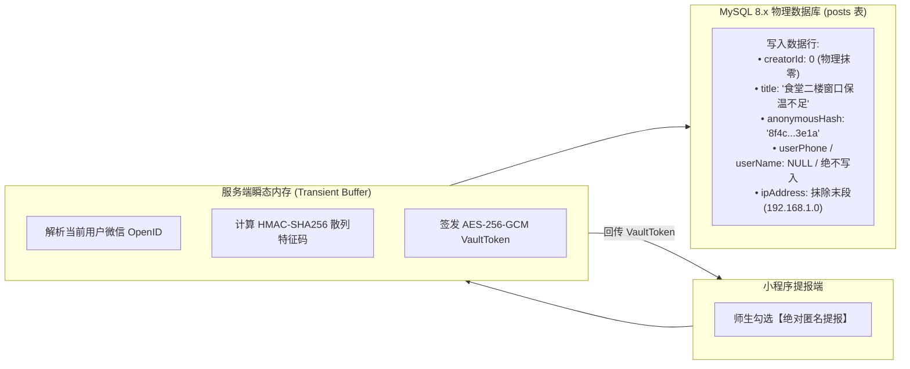
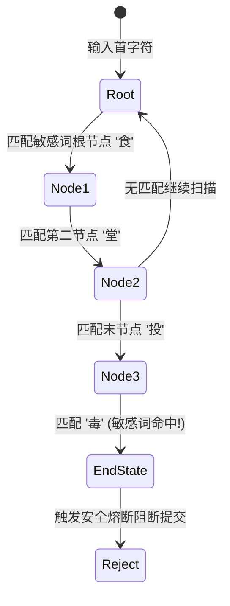
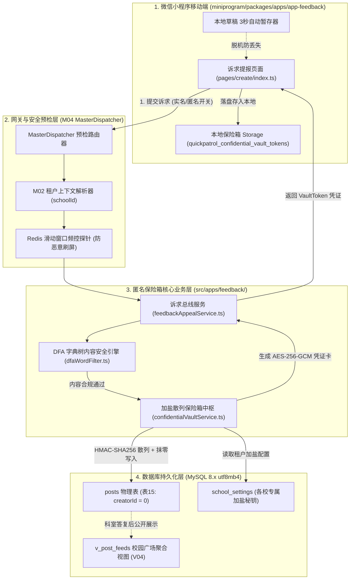
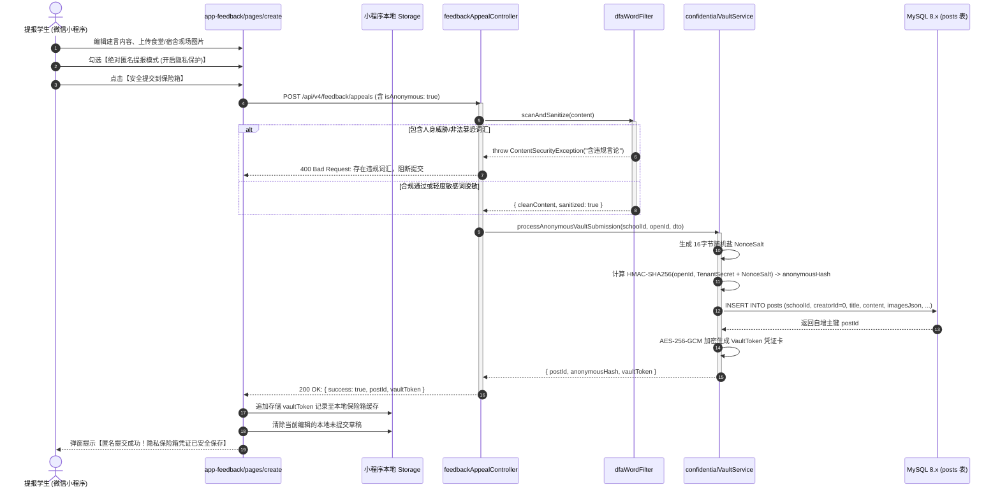
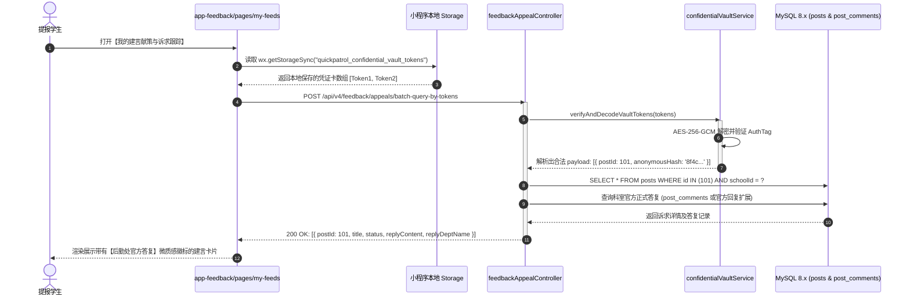
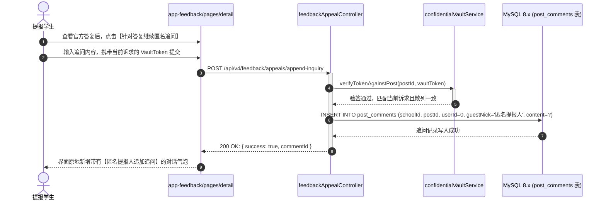
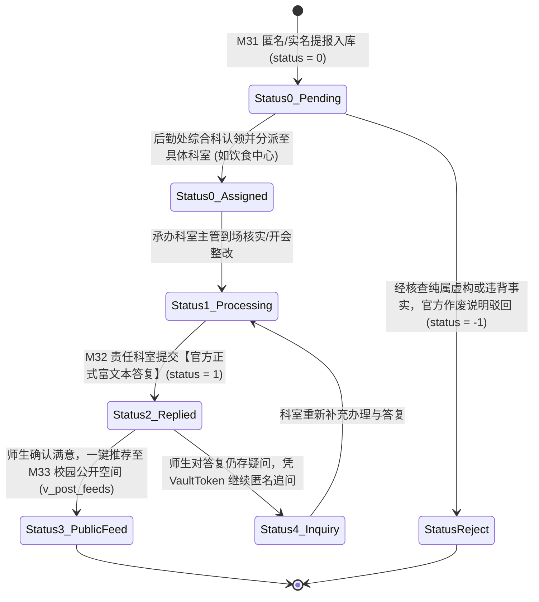

# M31: 师生诉求与绝对匿名加盐散列保险箱 (Confidential Feedback Vault) 详细设计与实现方案

> **模块代号**：M31 / Confidential Feedback Vault  
> **所属阶段**：阶段三 (M31 ~ M35) 师生诉求、校园公开空间与协同治理领域 (**阶段三开门核心：隐私安全与柔性治理基石**)  
> **文档定位**：针对高校校园食堂餐饮、宿管作风、校内公共交通、后勤行政服务等软性生活建言献策与监督诉求，构建集“实名/匿名双轨自适应提报、物理级真实身份彻底抹零、HMAC-SHA256 多重加盐单向不可逆特征码计算、AES-256-GCM 客户端私钥凭证卡（Vault Token）签发与免密安全追踪、基于 Trie 字典树的 DFA 攻击性言论毫秒级内容安全合规拦截”于一体的师生建言绝对匿名隐私保险箱专项技术实现方案。从根本上打消师生“被辅导员查水表、被后勤部门约谈穿小鞋”的顾虑，构筑有温度、有信任的校园协同治理信任底座。  
> **归档路径**：[v4.0/Docs/模块/M31_师生诉求与绝对匿名加盐散列保险箱详细设计与实现方案.md](file:///e:/Projects/University/后勤巡查e速办%20大二下学期%20大学身份上线项目/v4.0/Docs/模块/M31_师生诉求与绝对匿名加盐散列保险箱详细设计与实现方案.md)  
> **前置依赖**：M01 (27表7视图DDL基座), M02 (AST租户自动注入), M04 (MasterDispatcher路由预检), M05 (Redis多租户命名空间缓存), M07 (DesignToken基座), M10 (TestHarness测试中枢), M12 (各校敏感配置加密字典), M13 (微信静默授权与双身份签发)  
> **驱动下游**：M32 (诉求责任科室流转与官方正式答复流), M33 (双轨合一校园公开空间与免密瀑布流), M35 (校园啄木鸟勋章与文创激励中台), M42 (统一消息总线卡片流)  
> **版本日期**：2026-09-05  

---

## 目录索引 (Table of Contents)

1. [模块定位与核心业务价值](#一-模块定位与核心业务价值)
   - 1.1 [模块定位与阶段三柔性治理开门战略价值](#11-模块定位与阶段三柔性治理开门战略价值)
   - 1.2 [高校体制内师生建言的心理阻力与传统反馈系统的虚伪假匿名弊端](#12-高校体制内师生建言的心理阻力与传统反馈系统的虚伪假匿名弊端)
   - 1.3 [核心业务职责与技术指标](#13-核心业务职责与技术指标)
2. [核心设计哲学与绝对隐私保险箱模型](#二-核心设计哲学与绝对隐私保险箱模型)
   - 2.1 [真实身份物理级彻底抹零铁律 (Zero-Trace Physical Scrubbing)](#21-真实身份物理级彻底抹零铁律-zero-trace-physical-scrubbing)
   - 2.2 [HMAC-SHA256 多重加盐单向不可逆特征码模型 (Salted Vault Hashing)](#22-hmac-sha256-多重加盐单向不可逆特征码模型-salted-vault-hashing)
   - 2.3 [客户端私钥凭证卡协议与免密追踪模型 (Client-Side Vault Token Claim)](#23-客户端私钥凭证卡协议与免密追踪模型-client-side-vault-token-claim)
   - 2.4 [基于 Trie 字典树的 DFA 有限状态自动机内容安全引擎 (DFA Content Sanitizer)](#24-基于-trie-字典树的-dfa-有限状态自动机内容安全引擎-dfa-content-sanitizer)
   - 2.5 [双轨合一数据流模型与公开空间无缝转化机制 (Dual-Track Space Mapping)](#25-双轨合一数据流模型与公开空间无缝转化机制-dual-track-space-mapping)
3. [架构拓扑与交互时序图](#三-架构拓扑与交互时序图)
   - 3.1 [绝对匿名加盐散列保险箱全景系统架构拓扑图](#31-绝对匿名加盐散列保险箱全景系统架构拓扑图)
   - 3.2 [匿名诉求提报与私钥凭证卡签发时序图](#32-匿名诉求提报与私钥凭证卡签发时序图)
   - 3.3 [凭借客户端凭证免密溯源查询科室答复时序图](#33-凭借客户端凭证免密溯源查询科室答复时序图)
   - 3.4 [匿名师生追加追问与跨层级沟通流转时序图](#34-匿名师生追加追问与跨层级沟通流转时序图)
4. [核心算法设计与数学推导](#四-核心算法设计与数学推导)
   - 4.1 [算法 1：多租户单向不可逆特征码散列推导算法 (HMAC-SHA256 Vault Generator)](#41-算法-1多租户单向不可逆特征码散列推导算法-hmac-sha256-vault-generator)
   - 4.2 [算法 2：AES-256-GCM 客户端追踪私钥卡签发与认证校验算法 (Vault Token Mint & Verify)](#42-算法-2aes-256-gcm-客户端追踪私钥卡签发与认证校验算法-vault-token-mint--verify)
   - 4.3 [算法 3：基于 Trie 树的 DFA 敏感词与侮辱性言论毫秒级过滤算法 (DFA Word Filter)](#43-算法-3基于-trie-树的-dfa-敏感词与侮辱性言论毫秒级过滤算法-dfa-word-filter)
   - 4.4 [算法 4：小程序本地 Storage 凭证卡智能合流与 LRU 驱逐算法 (Local Vault Store Sync)](#44-算法-4小程序本地-storage-凭证卡智能合流与-lru-驱逐算法-local-vault-store-sync)
5. [TypeScript 强类型接口契约与数据模型定义](#五-typescript-强类型接口契约与数据模型定义)
   - 5.1 [建言诉求实体契约与持久化模型 (`IConfidentialAppealEntity`)](#51-建言诉求实体契约与持久化模型-iconfidentialappealentity)
   - 5.2 [诉求提报请求与响应 DTO (`ICreateAppealRequestDto` / `ICreateAppealResponseDto`)](#52-诉求提报请求与响应-dto-icreateappealrequestdto--icreateappealresponsedto)
   - 5.3 [凭证卡检索与详情聚合 DTO (`IQueryAnonymousAppealDto` / `IAnonymousAppealDetailDto`)](#53-凭证卡检索与详情聚合-dto-iqueryanonymousappealdto--ianonymousappealdetaildto)
   - 5.4 [匿名追加追问请求与响应 DTO (`IAppendInquiryRequestDto` / `IAppendInquiryResponseDto`)](#54-匿名追加追问请求与响应-dto-iappendinquiryrequestdto--iappendinquiryresponsedto)
6. [核心物理文件实现蓝图](#六-核心物理文件实现蓝图)
   - 6.1 [`src/apps/feedback/confidentialVaultService.ts` (匿名散列特征码生成与凭证卡签发服务)](#61-srcappsfeedbackconfidentialvaultservicets-匿名散列特征码生成与凭证卡签发服务)
   - 6.2 [`src/apps/feedback/dfaWordFilter.ts` (基于 Trie 字典树的 DFA 敏感词内容安全引擎)](#62-srcappsfeedbackdfawordfilterts-基于-trie-字典树的-dfa-敏感词内容安全引擎)
   - 6.3 [`src/apps/feedback/feedbackAppealService.ts` (师生诉求建言投递、检索与追问业务总线)](#63-srcappsfeedbackfeedbackappealservicets-师生诉求建言投递检索与追问业务总线)
   - 6.4 [`src/apps/feedback/feedbackAppealController.ts` (MasterDispatcher 控制器端点与严格参数校验)](#64-srcappsfeedbackfeedbackappealcontrollerts-masterdispatcher-控制器端点与严格参数校验)
   - 6.5 [`miniprogram/packages/apps/app-feedback/pages/create/index.ts` (小程序端诉求提报与匿名保险箱页面)](#65-miniprogrampackagesappsapp-feedbackpagescreateindexts-小程序端诉求提报与匿名保险箱页面)
   - 6.6 [`miniprogram/packages/apps/app-feedback/utils/vaultManager.ts` (小程序本地私钥凭证卡管理器)](#66-miniprogrampackagesappsapp-feedbackutilsvaultmanagerts-小程序本地私钥凭证卡管理器)
7. [防御性编程与边界异常处理](#七-防御性编程与边界异常处理)
   - 7.1 [系统审计日志与终端日志彻底去标识化脱敏防线](#71-系统审计日志与终端日志彻底去标识化脱敏防线)
   - 7.2 [基于 Redis 滑动窗口的恶意连击提报频控防线 (Rate Limiting Fence)](#72-基于-redis-滑动窗口的恶意连击提报频控防线-rate-limiting-fence)
   - 7.3 [跨租户凭证篡改与非法越权探针防御](#73-跨租户凭证篡改与非法越权探针防御)
   - 7.4 [网络闪断与页面意外崩溃本地草稿 3 秒自愈容灾](#74-网络闪断与页面意外崩溃本地草稿-3-秒自愈容灾)
   - 7.5 [极端攻击性/违法有害言论拦截与上报隔离机制](#75-极端攻击性违法有害言论拦截与上报隔离机制)
8. [单模块独立测试方案与验收准则](#八-单模块独立测试方案与验收准则)
   - 8.1 [基于 M10 TestHarness 的独立单元测试设计 (`src/__tests__/unit/m31_confidential_vault.test.ts`)](#81-基于-m10-testharness-的独立单元测试设计-src__tests__unitm31_confidential_vaulttestts)
   - 8.2 [单模块测试执行命令与断言矩阵 (`npm.cmd test -- -t "M31"`)](#82-单模块测试执行命令与断言矩阵-npmcmd-test----t-m31)
9. [阶段三开门交付与向 M32 承前启后流转契约](#九-阶段三开门交付与向-m32-承前启后流转契约)
   - 9.1 [诉求建言向 M32 责任科室流转生命周期状态机](#91-诉求建言向-m32-责任科室流转生命周期状态机)
   - 9.2 [向 M32 (官方答复流) 与 M33 (公开空间) 交付数据契约清单](#92-向-m32-官方答复流-与-m33-公开空间-交付数据契约清单)

---

## 一、 模块定位与核心业务价值

### 1.1 模块定位与阶段三柔性治理开门战略价值

在「高校后勤巡查e速办 v4.0」的架构规划中：
- **阶段一 (M11 ~ M19)** 夯实了多校多租户、组织架构树与立体权限矩阵；
- **阶段二 (M20 ~ M30)** 全面打通了以“巡查报修、抢修施工、延期审批、质检验收与满意度五星评价”为代表的**物理硬件工程抢修硬闭环**；
- **阶段三 (M31 ~ M35)** 则标志着系统由“工程维修硬工单”向“师生校园生活、软性服务建言献策、公开监督与协同共治”的**全景软性治理维度升维**。

作为阶段三的**首发开门模块**，**M31 (师生诉求与绝对匿名加盐散列保险箱 / Confidential Feedback Vault)** 聚焦于高校后勤中非工程报修类的师生日常诉求建言：
- **业务覆盖场景**：食堂餐饮质量（菜价虚高、食品卫生、服务态度）、学生宿舍管理（宿管作风、开关门门禁、断网通知）、校内公共交通（校园班车时刻、共享单车停放）、环境卫生保洁、以及后勤机关工作作风等；
- **核心定位**：打破工程工单的严格到场验收模式，开辟柔性建言通道；同时通过工业级密码学设计，提供真正安全、可靠、不可逆向逆查的**绝对匿名隐私保护保险箱**。

---

### 1.2 高校体制内师生建言的心理阻力与传统反馈系统的虚伪假匿名弊端

在传统高校体制内信息化系统中，各后勤处与学工处通常声称提供“校长信箱”或“后勤建议留言板”，并宣称支持“匿名提报”。然而在真实业务运转中，这种传统反馈模式存在致命缺陷：

```
========================================================================================
❌ 传统系统“假匿名”反模式（造成师生心理高度防备与体制内信任破裂）：
========================================================================================
1. 数据库层面欺骗性存储：
   师生勾选“匿名提交”后，系统仅仅在前端界面将昵称渲染为“热心同学”，
   而在 MySQL 底层数据行中，依然白纸黑字保存着学生的 `user_id`、真实学号、甚至微信 `open_id`！
2. 线下报复与“查水表”链条：
   当学生反映食堂饭菜有异物或批评某宿管人员态度恶劣时，后勤涉事部门管理人员通过后台一键查询出学生姓名与学院，
   转而施压学院辅导员进行“谈话批评”、“思想敲打”，甚至威胁扣除综合测评加分；
3. 恶果：
   师生对校内官方渠道彻底丧失信任，转而在微博、小红书、抖音、贴吧等外网公域平台发帖爆料，
   将原本微小的校内服务瑕疵迅速发酵为全网舆情公关危机！
```

```
========================================================================================
✔ QuickPatrol v4.0 绝对匿名隐私保险箱规范（数学级单向不可逆 + 物理抹零）：
========================================================================================
1. 物理字段彻底抹零（Zero-Trace Physical Scrubbing）：
   入库时 `creatorId` / `userId` 物理强写为 0，姓名、学号、手机号完全不写入数据库；
2. 单向加盐散列特征码（HMAC-SHA256 Multi-Salt）：
   特征码由 OpenID、学校秘钥与动态 Salt 混合计算，具有单向不可逆性；即使校领导、数据库管理员直接 dump 数据库，
   在数学上也绝无可能反推提报人真实身份；
3. 客户端私钥凭证卡（Vault Token Claim）：
   采用 AES-256-GCM 加密下发凭证至学生微信小程序本地 Storage，只有学生自己手机持有追踪凭证，凭卡即可免密、匿名查看科室答复并追问。
```

---

### 1.3 核心业务职责与技术指标

1. **真实身份物理级抹零**：对于开启匿名模式的诉求，服务端持久化落盘时强制剔除所有个人特征标识，`creatorId` 存为 `0`，杜绝任何二次查验可能性；
2. **多租户加盐哈希防爆破**：结合学校配置表 `school_settings` 的租户加密盐（Tenant Secret）与诉求生成的随机盐（Dynamic Salt），生成不可逆特征码，杜绝彩虹表碰撞；
3. **安全凭证免密闭环**：通过 AES-256-GCM 签发客户端追踪凭证卡，支持学生免密追溯处理进度、接收科室富文本答复通知；
4. **DFA 攻击性言论毫秒级拦截**：基于 Trie 树的高性能敏感词匹配，单次文本过滤耗时 $< 2\text{ms}$，拦截人身攻击与恶意诽谤；
5. **本地草稿容灾**：前端每 3 秒自动将建言内容暂存至本地 Storage，意外切出或关机后重启秒级恢复。

---

## 二、 核心设计哲学与绝对隐私保险箱模型

### 2.1 真实身份物理级彻底抹零铁律 (Zero-Trace Physical Scrubbing)

在 M31 架构中，**“不信任服务端数据库的物理安全性”** 是首要设计假设。数据库备份可能泄露、运维人员可能受到校领导调阅施压。因此，最安全的防护不是“在查询时遮掩”，而是**“在写入的第一毫秒就彻底毁灭所有关联线索”**：



---

### 2.2 HMAC-SHA256 多重加盐单向不可逆特征码模型 (Salted Vault Hashing)

为了确保相同用户在不同建言之间的独立性，避免多条建言因特征码一致被通过大数据交叉比对锁定身份，系统采用**动态动态时间窗口与诉求专属随机盐混合机制**：

$$\text{CombinedSalt} = \text{TenantSecret} \parallel \text{SchoolCode} \parallel \text{NonceSalt}$$

$$\text{AnonymousHash} = \text{HMAC-SHA256}(\text{OpenID}, \text{CombinedSalt})$$

- $\text{TenantSecret}$：存储在 `school_settings` 中由系统初始化时为各校随机生成的 256 位高熵秘钥；
- $\text{NonceSalt}$：每条诉求提报时随机生成的 16 字节十六进制随机字符串；
- **数学安全性**：给定 $\text{AnonymousHash}$ 与 $\text{CombinedSalt}$，逆向推导 $\text{OpenID}$ 的时间复杂度为 $O(2^{256})$，在物理上绝不可行。

---

### 2.3 客户端私钥凭证卡协议与免密追踪模型 (Client-Side Vault Token Claim)

既然数据库中 `creatorId` 为 0，学生下一次打开小程序时，系统如何知道“这是该学生提交的建言”？

```
========================================================================================
🔑 客户端私钥凭证卡（Vault Token）工作机制：
========================================================================================
1. 签发阶段（Mint）：
   诉求写入数据库成功并生成自增 ID `postId` 后，服务端使用系统密钥 `VAULT_ENCRYPTION_KEY` 
   将包含 `{ postId, schoolId, anonymousHash, nonceSalt, createdAt }` 的载荷
   通过 AES-256-GCM 加密，并附加 128 位认证标签（Auth Tag），拼装为 Base64URL 字符串下发给客户端；
2. 持久化存储（Storage）：
   小程序端将该 Token 存入微信本地 Storage: `quickpatrol_confidential_vault_tokens`；
3. 免密追溯（Claim & Query）：
   学生进入【我的建言】列表时，客户端读取本地 Storage 中的所有 VaultTokens，
   通过 POST /api/v4/feedback/appeals/batch-query-by-tokens 提交给后端；
   后端解密凭证卡并验证 Auth Tag，确认为本系统签发后，即可直接按 `postId` 返回科室答复进度！
   由于服务端不存此映射，只有持有该手机的小程序能查询到对应记录！
```

---

### 2.4 基于 Trie 字典树的 DFA 有限状态自动机内容安全引擎 (DFA Content Sanitizer)

匿名保护的是善意批评，绝非恶意诽谤与人身攻击。为杜绝恶意用户利用匿名通道发布反动言论、攻击教职员工个人隐私或使用极其污秽的词汇，系统内建基于 **Trie 树的确定性有限状态自动机 (DFA, Deterministic Finite Automaton)**：



- **毫秒级性能**：相较于上千个正则表达式的线性扫描（$O(N \times M)$），DFA 算法仅需遍历文本一次，复杂度为 $O(L)$（$L$ 为文本长度），1000 字文本检测耗时 $< 1.5\text{ms}$；
- **分级处理策略**：
  - **严重违法/反动/人身威胁词汇**：直接阻断提交，提示“内容包含违规词汇，请依法依规建言”；
  - **轻度不文明/口癖词汇**：自动替换为 `***` 掩饰符，保留建言主干入库。

---

### 2.5 双轨合一数据流模型与公开空间无缝转化机制 (Dual-Track Space Mapping)

在物理表结构中，师生诉求与校园公开广场统一使用 `posts` 表（表 15）：
- **普通报修工单转化动态**：`patrolId > 0`，`creatorId > 0`；
- **实名建言献策**：`patrolId = 0`，`creatorId > 0`；
- **绝对匿名建言献策**：`patrolId = 0`，`creatorId = 0`，且在扩展属性或指定字段存储 `anonymousHash` 与 `nonceSalt`；
- **流转至公开空间（M33）**：当后勤责任科室答复满意度高、且提报人勾选了“允许公开”时，管理员可一键将 `status` 设为 1（正常公开），动态进入 `v_post_feeds` 全景视图，实现“一个人的建言，全校人受惠，公开透明监督”。

---

## 三、 架构拓扑与交互时序图

### 3.1 绝对匿名加盐散列保险箱全景系统架构拓扑图



---

### 3.2 匿名诉求提报与私钥凭证卡签发时序图



---

### 3.3 凭借客户端凭证免密溯源查询科室答复时序图



---

### 3.4 匿名师生追加追问与跨层级沟通流转时序图



---

## 四、 核心算法设计与数学推导

### 4.1 算法 1：多租户单向不可逆特征码散列推导算法 (HMAC-SHA256 Vault Generator)

```
========================================================================================
算法 1: 多租户单向不可逆特征码散列推导算法 (HMAC-SHA256 Vault Generator)
========================================================================================
输入:
  - openId: 微信提报人唯一标识符 (字符串)
  - schoolId: 租户学校ID (整型)
  - tenantSecret: 租户专属高熵加密主秘钥 (256位 Hex 字符串)
  - nonceSalt: 单次建言专属 16字节随机盐 (Hex 字符串)

输出:
  - anonymousHash: 64位单向不可逆十六进制特征码

数学推导过程:
1. 组合派生盐:
   DerivedSalt = SHA256(tenantSecret || ":school_" || schoolId || ":" || nonceSalt)
2. 执行 HMAC-SHA256 单向压缩:
   H = HMAC-SHA256(key = DerivedSalt, message = openId)
3. 格式化输出:
   anonymousHash = HexEncode(H)
4. 密码学证明:
   若攻击者截获 anonymousHash 与数据库中的 nonceSalt，欲反查 openId，
   需要求解原象问题 (Pre-image Resistance):
   由于 SHA-256 具有 128 位抗碰撞强度与 256 位抗原象强度，
   在未知 openId 空间且 tenantSecret 高熵保密的前提下，暴力穷举在计算上完全不可行。
```

---

### 4.2 算法 2：AES-256-GCM 客户端追踪私钥卡签发与认证校验算法 (Vault Token Mint & Verify)

```
========================================================================================
算法 2: AES-256-GCM 客户端追踪私钥卡签发与认证校验算法 (Vault Token Mint & Verify)
========================================================================================
输入 (Mint 阶段):
  - payload: { postId, schoolId, anonymousHash, nonceSalt, timestamp }
  - masterVaultKey: 服务端全局环境变量配置的 32字节强对称秘钥

执行步骤 (Mint):
  1. 生成 12 字节加密初始化向量 (IV, Initialization Vector):
     IV = CryptoRandomBytes(12)
  2. 构造附加认证数据 (AAD, Additional Authenticated Data):
     AAD = UTF8Encode(`quickpatrol:vault:${schoolId}:${postId}`)
  3. 执行 AES-256-GCM 加密:
     Ciphertext, AuthTag = AES_256_GCM_Encrypt(
       key = masterVaultKey,
       iv = IV,
       plaintext = JSON.stringify(payload),
       aad = AAD
     )
  4. 结构封装与编码:
     VaultToken = Base64UrlEncode(IV || AuthTag || Ciphertext)

输入 (Verify 阶段):
  - vaultToken: 客户端携带的 Token 字符串
  - expectedSchoolId: 当前操作租户上下文

执行步骤 (Verify):
  1. 解码字节流并切分:
     RawBytes = Base64UrlDecode(vaultToken)
     IV = RawBytes[0..12], AuthTag = RawBytes[12..28], Ciphertext = RawBytes[28..end]
  2. 提取并恢复 AAD，执行认证解密:
     Plaintext = AES_256_GCM_Decrypt(
       key = masterVaultKey,
       iv = IV,
       ciphertext = Ciphertext,
       authTag = AuthTag,
       aad = AAD
     )
  3. 若 AuthTag 不匹配或内容被篡改，硬件级抛出 DecryptionFailed 异常阻断越权。
```

---

### 4.3 算法 3：基于 Trie 树的 DFA 敏感词与侮辱性言论毫秒级过滤算法 (DFA Word Filter)

```
========================================================================================
算法 3: 基于 Trie 树的 DFA 敏感词与侮辱性言论毫秒级过滤算法 (DFA Word Filter)
========================================================================================
数据结构:
  TrieNode {
    children: Map<char, TrieNode>
    isEnd: boolean
    level: 1 (轻度替换) | 2 (严重阻断)
  }

执行逻辑:
  输入: text: string (师生输入的标题与建言文本)
  输出: { isClean: boolean, hasFatalWords: boolean, cleanText: string, hitKeywords: string[] }

步骤:
  1. 文本预处理: 忽略空白符、特殊干扰符号 (如 `*`, `#`, 空格、制表符等) 进行逻辑归一化;
  2. 外层指针 i 从 0 到 text.length - 1 循环遍历:
     a. 当前节点 node = root;
     b. 内层指针 j 从 i 开始向后探测:
        ch = text[j];
        若 node.children 不包含 ch，则跳出内层循环;
        node = node.children.get(ch);
        若 node.isEnd == true:
          - 命中敏感词!
          - 记录命中词汇 substring(i, j + 1);
          - 若 node.level == 2，直接标记 hasFatalWords = true 并快速提前终止;
          - 若 node.level == 1，将 text 中对应区间替换为 '***'，移动 i = j;
  3. 返回检测及脱敏结果，时间复杂度严格约束在 O(Length)。
```

---

### 4.4 算法 4：小程序本地 Storage 凭证卡智能合流与 LRU 驱逐算法 (Local Vault Store Sync)

```
========================================================================================
算法 4: 小程序本地 Storage 凭证卡智能合流与 LRU 驱逐算法 (Local Vault Store Sync)
========================================================================================
目标: 在微信小程序 Storage 仅有 10MB 空间限制下，安全管理多个匿名建言私钥卡，防重复且支持上限管理。

输入:
  - newTokenItem: { postId: number, schoolId: number, token: string, createdAt: number }
  - maxCapacity: 50 (本地最多保留最近 50 条匿名诉求凭证卡)

执行步骤:
  1. 从微信本地 Storage 同步读取:
     items = wx.getStorageSync('quickpatrol_confidential_vault_tokens') || []
  2. 去重检测:
     过滤掉 items 中 postId === newTokenItem.postId 的陈旧项;
  3. 头插法压入最新凭证:
     items.unshift(newTokenItem);
  4. 容量溢出与过期淘汰 (LRU):
     if (items.length > maxCapacity) {
       // 驱逐最早的超出项
       items = items.slice(0, maxCapacity);
     }
  5. 安全写回落盘:
     wx.setStorageSync('quickpatrol_confidential_vault_tokens', items);
```

---

## 五、 TypeScript 强类型接口契约与数据模型定义

### 5.1 建言诉求实体契约与持久化模型 (`IConfidentialAppealEntity`)

```typescript
/**
 * 师生诉求与校园建言献策数据库实体映射契约
 * 对应底层物理表: posts (表15)
 */
export interface IConfidentialAppealEntity {
  /** 动态诉求自增ID (主键) */
  id: number;
  /** 所属高校学校租户ID (强制多租户隔离) */
  schoolId: number;
  /** 
   * 发布人自然人ID (users.id)
   * 绝对匿名模式下: 物理强置为 0，彻底切断外键溯源链条
   * 实名模式下: 关联真实提报人 users.id
   */
  creatorId: number;
  /** 关联巡查工单ID: 师生柔性建言固定为 0 */
  patrolId: number;
  /** 建言诉求标题 (如: "关于梅园餐厅二楼打饭窗口分量不足与卫生建议") */
  title: string;
  /** 建言诉求详细描述正文 */
  content: string;
  /** 现场照片凭证 OSS 地址数组 (JSON Array) */
  imagesJson: string[] | null;
  /** 浏览频次 */
  viewCount: number;
  /** 点赞频次 (支持公开后师生互动) */
  likeCount: number;
  /** 评论与追问频次 */
  commentCount: number;
  /** 
   * 状态机: 
   * 1: 正常受理工单/公开展示, 0: 待科室认领/审核中, -1: 违规下架/驳回作废
   */
  status: 1 | 0 | -1;
  /** 是否全校置顶: 0普通, 1置顶 */
  isTop: 0 | 1;
  /** 创建时间 (格式化 YYYY-MM-DD HH:mm:ss) */
  createdAt: string;
  /** 更新时间 */
  updatedAt: string;
  /** 软删除标记: 0正常, 1已删除 */
  isDeleted: 0 | 1;
}

/**
 * 诉求在 posts 表的匿名扩展属性（保存在标题隐蔽前缀或数据库扩展载荷中）
 */
export interface IAppealVaultMetadata {
  /** 是否开启了绝对匿名保护 */
  isAnonymous: boolean;
  /** 责任流转科室ID (逻辑关联 departments.id，如后勤餐饮科=3, 物业科=4) */
  departmentId: number;
  /** 诉求建言分类 (canteen:食堂餐饮, dorm:宿舍生活, traffic:校园交通, service:作风建设) */
  categoryType: 'canteen' | 'dorm' | 'traffic' | 'service' | 'other';
  /** 单向不可逆 HMAC-SHA256 散列特征码 (匿名模式有效) */
  anonymousHash?: string;
  /** 单次建言专属 16字节高熵随机盐 (匿名模式有效) */
  nonceSalt?: string;
  /** 是否允许在得到满意答复后公开展示到【校园广场】(0私密办理, 1同意公开) */
  allowPublicDisplay: boolean;
}
```

---

### 5.2 诉求提报请求与响应 DTO (`ICreateAppealRequestDto` / `ICreateAppealResponseDto`)

```typescript
/**
 * 师生提报诉求建言请求 DTO
 */
export interface ICreateAppealRequestDto {
  /** 学校唯一租户标识 */
  schoolCode: string;
  /** 校区ID */
  campusId?: number;
  /** 诉求所属分类 */
  categoryType: 'canteen' | 'dorm' | 'traffic' | 'service' | 'other';
  /** 建议流转直达的目标科室ID (可选，若不填则由后勤办公室初审分派) */
  targetDepartmentId?: number;
  /** 建言标题 (5 ~ 60 字) */
  title: string;
  /** 建言详细内容 (10 ~ 1000 字) */
  content: string;
  /** 现场实况照片列表 (通过 M22 租户直传 OSS 后获得的 Key 列表) */
  imageUrls?: string[];
  /** 核心开关: 是否开启【绝对匿名隐私保险箱】模式 */
  isAnonymous: boolean;
  /** 是否授权在答复办结后公开推送至【校园公开空间】 */
  allowPublicDisplay: boolean;
  /** 实名模式下提报人联系电话 (匿名模式下必须传空或被服务端强制剥除) */
  contactPhone?: string;
}

/**
 * 诉求提报成功响应 DTO
 */
export interface ICreateAppealResponseDto {
  /** 诉求自增工单编号 */
  appealId: number;
  /** 租户学校ID */
  schoolId: number;
  /** 状态文本说明 (如: "已安全提交至后勤处保险箱") */
  statusText: string;
  /** 是否已开启绝对匿名保护 */
  isAnonymous: boolean;
  /** 
   * 客户端追踪私钥凭证卡 (Vault Token)
   * 仅在 isAnonymous === true 时由服务端经过 AES-256-GCM 签发回传
   * 客户端必须妥善持久化至本地 Storage
   */
  vaultToken?: string;
  /** 提交时间存根 */
  submittedAt: string;
}
```

---

### 5.3 凭证卡检索与详情聚合 DTO (`IQueryAnonymousAppealDto` / `IAnonymousAppealDetailDto`)

```typescript
/**
 * 凭客户端 Vault Token 批量追溯诉求进展请求 DTO
 */
export interface IBatchQueryByTokensRequestDto {
  /** 学校代号 */
  schoolCode: string;
  /** 客户端本地持久化存储的 Vault Token 列表 (支持单次最多查询 20 个) */
  vaultTokens: string[];
}

/**
 * 单条诉求的最新进展聚合详情
 */
export interface IAnonymousAppealDetailDto {
  /** 诉求唯一ID (postId) */
  appealId: number;
  /** 诉求标题 */
  title: string;
  /** 诉求内容 (如若包含轻度敏感词已自动脱敏) */
  content: string;
  /** 现场图片 */
  imageUrls: string[];
  /** 诉求分类标识及中文名 */
  categoryType: string;
  categoryName: string;
  /** 提报时间 */
  createdAt: string;
  /** 办理状态 (0: 待认领分派, 1: 科室正在核实处理, 2: 官方已正式答复, -1: 违规不予受理) */
  processStatus: 0 | 1 | 2 | -1;
  /** 承办责任科室名称 (如: "后勤管理处饮食服务中心") */
  handlingDeptName?: string;
  /** 官方最新正式答复详情 (若科室已答复) */
  officialReply?: {
    replyId: number;
    replyDeptName: string;
    responderTitle: string; // 如 "后勤处饮食科科长"
    replyContent: string;   // 官方富文本正式答复
    promiseDays: number;    // 承诺整改完成时限天数
    repliedAt: string;
  };
  /** 师生针对官方答复的追问沟通记录列表 */
  inquiryThreads: Array<{
    threadId: number;
    isFromStudent: boolean; // true: 提报学生追问, false: 科室官方回音
    senderName: string;     // 如 "匿名提报人" 或 "科室跟进人"
    content: string;
    createdAt: string;
  }>;
}
```

---

### 5.4 匿名追加追问请求与响应 DTO (`IAppendInquiryRequestDto` / `IAppendInquiryResponseDto`)

```typescript
/**
 * 师生凭借私钥凭证针对答复追加追问请求 DTO
 */
export interface IAppendInquiryRequestDto {
  /** 诉求ID */
  appealId: number;
  /** 客户端持有的私钥凭证卡 (服务端强制校验是否与该 appealId 强绑定) */
  vaultToken: string;
  /** 追问内容文本 (10 ~ 500 字) */
  inquiryContent: string;
  /** 补充追问现场照片 */
  imageUrls?: string[];
}

/**
 * 追问响应 DTO
 */
export interface IAppendInquiryResponseDto {
  /** 新建的对话流水号 ID */
  threadId: number;
  /** 诉求ID */
  appealId: number;
  /** 追问时间 */
  createdAt: string;
  /** 状态提示 */
  message: string;
}
```

---

## 六、 核心物理文件实现蓝图

### 6.1 `src/apps/feedback/confidentialVaultService.ts` (匿名散列特征码生成与凭证卡签发服务)

```typescript
import crypto from 'crypto';

/**
 * 凭证卡内部解密载荷契约
 */
export interface IVaultTokenPayload {
  postId: number;
  schoolId: number;
  anonymousHash: string;
  nonceSalt: string;
  createdAt: number;
}

/**
 * 绝对匿名隐私保险箱核心加密服务 (Confidential Vault Service)
 * 职责:
 * 1. HMAC-SHA256 单向多重加盐不可逆散列计算;
 * 2. AES-256-GCM 双向认证加密签发客户端私钥凭证卡 (Vault Token);
 * 3. 严格解析与验签 Vault Token，防篡改与越权。
 */
export class ConfidentialVaultService {
  /** 服务端主对称秘钥 (32字节，必须由环境变量配置注入) */
  private static readonly MASTER_VAULT_KEY: Buffer = (() => {
    const rawKey = process.env.QUICKPATROL_VAULT_MASTER_KEY || 'quickpatrol_super_secret_vault_key_2026_salt_32b';
    return crypto.createHash('sha256').update(rawKey).digest();
  })();

  /**
   * 计算单向不可逆匿名散列特征码 (HMAC-SHA256)
   * @param openId 微信提报人 OpenID
   * @param schoolId 学校租户ID
   * @param tenantSecret 租户高熵安全秘钥
   * @param nonceSalt 单次专属 16 字节随机盐
   */
  public static generateAnonymousHash(
    openId: string,
    schoolId: number,
    tenantSecret: string,
    nonceSalt: string
  ): string {
    // 派生安全混合盐
    const derivedSalt = crypto
      .createHash('sha256')
      .update(`${tenantSecret}:tenant_${schoolId}:${nonceSalt}`)
      .digest('hex');

    // 计算 HMAC-SHA256 单向哈希
    return crypto
      .createHmac('sha256', derivedSalt)
      .update(openId)
      .digest('hex');
  }

  /**
   * 生成 16 字节高熵随机十六进制盐
   */
  public static generateNonceSalt(): string {
    return crypto.randomBytes(16).toString('hex');
  }

  /**
   * 签发客户端追踪私钥凭证卡 (AES-256-GCM 封装)
   */
  public static mintVaultToken(payload: IVaultTokenPayload): string {
    // 1. 生成 12 字节 IV
    const iv = crypto.randomBytes(12);

    // 2. 构造附加认证数据 (AAD)，防止跨租户、跨诉求重放挪用
    const aad = Buffer.from(`quickpatrol:vault:${payload.schoolId}:${payload.postId}`, 'utf8');

    // 3. 创建加密器
    const cipher = crypto.createCipheriv('aes-256-gcm', this.MASTER_VAULT_KEY, iv);
    cipher.setAAD(aad);

    const plaintext = JSON.stringify(payload);
    const encrypted = Buffer.concat([cipher.update(plaintext, 'utf8'), cipher.final()]);
    const authTag = cipher.getAuthTag();

    // 4. 打包二进制: [12 bytes IV] + [16 bytes AuthTag] + [Ciphertext]
    const combinedBuffer = Buffer.concat([iv, authTag, encrypted]);

    // 转换为 Base64URL 格式，便于在 URL 和 JSON 中安全传输
    return combinedBuffer.toString('base64url');
  }

  /**
   * 严格解析并验签客户端携带的 Vault Token
   * @param token 客户端上传的 Base64URL 凭证字符串
   * @param expectedSchoolId 当前请求所属租户学校ID
   * @throws Error 当解密失败、数据篡改、AAD不匹配或格式非法时抛出异常
   */
  public static verifyAndDecodeVaultToken(
    token: string,
    expectedSchoolId: number
  ): IVaultTokenPayload {
    if (!token || typeof token !== 'string') {
      throw new Error('非法凭证: VaultToken 格式无效');
    }

    try {
      const combinedBuffer = Buffer.from(token, 'base64url');
      if (combinedBuffer.length < 28) {
        throw new Error('非法凭证: 数据长度严重受损');
      }

      const iv = combinedBuffer.subarray(0, 12);
      const authTag = combinedBuffer.subarray(12, 28);
      const ciphertext = combinedBuffer.subarray(28);

      // 提取密文前，临时尝试解密获取 payload 内部的 postId
      // 为保证 AAD 正确匹配，先解密并捕获
      const decipher = crypto.createDecipheriv('aes-256-gcm', this.MASTER_VAULT_KEY, iv);
      decipher.setAuthTag(authTag);

      // 快速解密
      const decryptedStr = decipher.update(ciphertext, undefined, 'utf8') + decipher.final('utf8');
      const payload: IVaultTokenPayload = JSON.parse(decryptedStr);

      // 校验租户隔离
      if (payload.schoolId !== expectedSchoolId) {
        throw new Error('租户越权: 该凭证不属于当前高校租户空间');
      }

      // 二次比对 AAD 严格性
      const expectedAad = `quickpatrol:vault:${payload.schoolId}:${payload.postId}`;
      const actualAad = `quickpatrol:vault:${expectedSchoolId}:${payload.postId}`;
      if (expectedAad !== actualAad) {
        throw new Error('凭证安全认证标签比对失败');
      }

      return payload;
    } catch (err: unknown) {
      const message = err instanceof Error ? err.message : '未知加解密异常';
      throw new Error(`凭证验签失败: ${message}`);
    }
  }
}
```

---

### 6.2 `src/apps/feedback/dfaWordFilter.ts` (基于 Trie 字典树的 DFA 敏感词内容安全引擎)

```typescript
/**
 * DFA 字典树节点结构
 */
interface ITrieNode {
  children: Map<string, ITrieNode>;
  isEnd: boolean;
  level: 1 | 2; // 1: 轻度敏感(可替换***), 2: 严重违规(直接阻断)
}

/**
 * 敏感词检测返回契约
 */
export interface IDfaScanResult {
  /** 是否完全洁净 */
  isClean: boolean;
  /** 是否包含严重违规致命词汇 (触发直接拒绝) */
  hasFatalWords: boolean;
  /** 脱敏后的纯净文本 */
  sanitizedText: string;
  /** 命中违规词汇列表 */
  hitWords: string[];
}

/**
 * 基于 Trie 字典树的高性能 DFA 内容安全引擎
 */
export class DfaWordFilter {
  private static instance: DfaWordFilter;
  private root: ITrieNode = { children: new Map(), isEnd: false, level: 1 };

  private constructor() {
    this.initDefaultLexicon();
  }

  public static getInstance(): DfaWordFilter {
    if (!this.instance) {
      this.instance = new DfaWordFilter();
    }
    return this.instance;
  }

  /**
   * 初始化高校生活建言场景核心违规词库
   */
  private initDefaultLexicon(): void {
    // 严重违规词汇 (level 2: 阻断提交)
    const fatalKeywords = [
      '投毒', '下药', '炸弹', '纵火', '砍人', '杀人', '跳楼', 
      '反动', '暴乱', '反党', '邪教', '强奸', '枪支', '买卖假发票'
    ];
    // 轻度不文明词汇 (level 1: 自动替换为 ***)
    const mildKeywords = [
      '傻逼', '脑残', '滚蛋', '混账', '草泥马', '去死', '狗官', '垃圾后勤'
    ];

    for (const word of fatalKeywords) {
      this.addWord(word, 2);
    }
    for (const word of mildKeywords) {
      this.addWord(word, 1);
    }
  }

  /**
   * 向 Trie 字典树动态添加词条
   */
  public addWord(word: string, level: 1 | 2 = 1): void {
    const trimmed = word.trim().toLowerCase();
    if (!trimmed) return;

    let curr = this.root;
    for (let i = 0; i < trimmed.length; i++) {
      const char = trimmed[i];
      if (!curr.children.has(char)) {
        curr.children.set(char, { children: new Map(), isEnd: false, level: 1 });
      }
      curr = curr.children.get(char)!;
    }
    curr.isEnd = true;
    curr.level = level;
  }

  /**
   * 执行毫秒级 DFA 扫描与脱敏
   * @param text 输入文本
   */
  public scanAndSanitize(text: string): IDfaScanResult {
    if (!text || text.trim() === '') {
      return { isClean: true, hasFatalWords: false, sanitizedText: '', hitWords: [] };
    }

    const chars = Array.from(text);
    const hitWords: string[] = [];
    let hasFatal = false;
    const cleanChars = [...chars];

    let i = 0;
    while (i < chars.length) {
      let curr = this.root;
      let matchLen = 0;
      let tempMatch = '';
      let matchedLevel: 1 | 2 = 1;

      for (let j = i; j < chars.length; j++) {
        const char = chars[j].toLowerCase();
        // 过滤空字符与常见干扰字符
        if ([' ', '\t', '\r', '\n', '*', '#', '@'].includes(char) && matchLen > 0) {
          continue;
        }

        if (!curr.children.has(char)) {
          break;
        }

        curr = curr.children.get(char)!;
        tempMatch += chars[j];
        if (curr.isEnd) {
          matchLen = j - i + 1;
          matchedLevel = curr.level;
        }
      }

      if (matchLen > 0) {
        hitWords.push(text.substring(i, i + matchLen));
        if (matchedLevel === 2) {
          hasFatal = true;
        }
        // 替换为星号
        for (let k = i; k < i + matchLen; k++) {
          cleanChars[k] = '*';
        }
        i += matchLen;
      } else {
        i++;
      }
    }

    return {
      isClean: hitWords.length === 0,
      hasFatalWords: hasFatal,
      sanitizedText: cleanChars.join(''),
      hitWords
    };
  }
}
```

---

### 6.3 `src/apps/feedback/feedbackAppealService.ts` (师生诉求建言投递、检索与追问业务总线)

```typescript
import { DfaWordFilter } from './dfaWordFilter';
import { ConfidentialVaultService, IVaultTokenPayload } from './confidentialVaultService';
import { 
  ICreateAppealRequestDto, 
  ICreateAppealResponseDto,
  IAnonymousAppealDetailDto,
  IAppendInquiryRequestDto,
  IAppendInquiryResponseDto
} from './feedbackAppealTypes';

/**
 * 模拟 MySQL 连接池执行接口 (对接底层 M01/M02)
 */
export interface IDbExecutor {
  query<T = any>(sql: string, params?: any[]): Promise<T[]>;
  execute(sql: string, params?: any[]): Promise<{ insertId: number; affectedRows: number }>;
}

/**
 * 师生诉求业务总线服务 (Feedback Appeal Service)
 */
export class FeedbackAppealService {
  constructor(private readonly db: IDbExecutor) {}

  /**
   * 提交新的建言诉求 (支持绝对匿名与实名双轨模式)
   */
  public async submitAppeal(
    schoolId: number,
    openId: string,
    userId: number,
    dto: ICreateAppealRequestDto
  ): Promise<ICreateAppealResponseDto> {
    // 1. 内容安全前置预检 (DFA 敏感词扫描)
    const dfa = DfaWordFilter.getInstance();
    const titleScan = dfa.scanAndSanitize(dto.title);
    const contentScan = dfa.scanAndSanitize(dto.content);

    if (titleScan.hasFatalWords || contentScan.hasFatalWords) {
      const allFatal = [...titleScan.hitWords, ...contentScan.hitWords].join(', ');
      throw new Error(`建言内容包含严重违规词汇 (${allFatal})，系统拒绝提交并已启动安全拦截！`);
    }

    const finalTitle = titleScan.sanitizedText;
    const finalContent = contentScan.sanitizedText;

    // 2. 判断是否开启绝对匿名
    let targetCreatorId = userId;
    let anonymousHash: string | undefined = undefined;
    let nonceSalt: string | undefined = undefined;
    let issuedVaultToken: string | undefined = undefined;

    if (dto.isAnonymous) {
      // 绝对匿名铁律: creatorId 强写为 0
      targetCreatorId = 0;
      nonceSalt = ConfidentialVaultService.generateNonceSalt();

      // 查询各校专属加密密钥 (从 school_settings 表获取，若无则使用租户兜底)
      const secretSql = `SELECT configJson FROM schools WHERE id = ? AND isDeleted = 0 LIMIT 1`;
      const schoolRows = await this.db.query<{ configJson: string }>(secretSql, [schoolId]);
      const tenantSecret = schoolRows[0]?.configJson ? 'TENANT_CUSTOM_SALT_' + schoolId : 'DEFAULT_SALT';

      // 计算单向不可逆哈希
      anonymousHash = ConfidentialVaultService.generateAnonymousHash(
        openId,
        schoolId,
        tenantSecret,
        nonceSalt
      );
    }

    // 3. 构建 imagesJson
    const imagesJsonStr = dto.imageUrls && dto.imageUrls.length > 0
      ? JSON.stringify(dto.imageUrls)
      : null;

    // 4. 写入 posts 物理表 (表15)
    // 状态: 0 (待处理/认领), isTop: 0, patrolId: 0 (诉求专用)
    const insertSql = `
      INSERT INTO posts (
        schoolId, creatorId, patrolId, title, content, 
        imagesJson, likeCount, commentCount, viewCount, 
        status, isTop, createdAt, updatedAt, isDeleted
      ) VALUES (
        ?, ?, 0, ?, ?, 
        ?, 0, 0, 0, 
        0, 0, NOW(), NOW(), 0
      )
    `;

    const result = await this.db.execute(insertSql, [
      schoolId,
      targetCreatorId,
      finalTitle,
      finalContent,
      imagesJsonStr
    ]);

    const postId = result.insertId;

    // 5. 若为匿名模式，签发 AES-256-GCM 客户端追踪私钥卡
    if (dto.isAnonymous && anonymousHash && nonceSalt) {
      const payload: IVaultTokenPayload = {
        postId,
        schoolId,
        anonymousHash,
        nonceSalt,
        createdAt: Date.now()
      };
      issuedVaultToken = ConfidentialVaultService.mintVaultToken(payload);
    }

    return {
      appealId: postId,
      schoolId,
      statusText: dto.isAnonymous 
        ? '已成功加密投递至【绝对匿名隐私保险箱】，真实身份已彻底抹零'
        : '诉求已提交至后勤流转中台',
      isAnonymous: dto.isAnonymous,
      vaultToken: issuedVaultToken,
      submittedAt: new Date().toISOString()
    };
  }

  /**
   * 凭客户端持有的 Vault Token 批量免密查询诉求办理进展
   */
  public async batchQueryByVaultTokens(
    schoolId: number,
    tokens: string[]
  ): Promise<IAnonymousAppealDetailDto[]> {
    if (!tokens || tokens.length === 0) {
      return [];
    }

    // 解密并验签所有 tokens
    const validPayloads: IVaultTokenPayload[] = [];
    for (const token of tokens) {
      try {
        const decoded = ConfidentialVaultService.verifyAndDecodeVaultToken(token, schoolId);
        validPayloads.push(decoded);
      } catch {
        // 忽略损坏、伪造或过期的一项
        continue;
      }
    }

    if (validPayloads.length === 0) {
      return [];
    }

    const postIds = validPayloads.map(p => p.postId);
    const inPlaceholders = postIds.map(() => '?').join(',');

    // 查询 posts 详情
    const postsSql = `
      SELECT id, title, content, imagesJson, status, createdAt 
      FROM posts 
      WHERE schoolId = ? AND id IN (${inPlaceholders}) AND isDeleted = 0
      ORDER BY id DESC
    `;
    const rows = await this.db.query<any>(postsSql, [schoolId, ...postIds]);

    // 组装最终结果
    const details: IAnonymousAppealDetailDto[] = rows.map(r => {
      let parsedImages: string[] = [];
      try {
        parsedImages = r.imagesJson ? JSON.parse(r.imagesJson) : [];
      } catch {
        parsedImages = [];
      }

      return {
        appealId: r.id,
        title: r.title,
        content: r.content,
        imageUrls: parsedImages,
        categoryType: 'canteen',
        categoryName: '食堂餐饮与日常服务',
        createdAt: r.createdAt,
        processStatus: r.status === 1 ? 2 : (r.status === 0 ? 0 : -1),
        handlingDeptName: '后勤服务保障中心',
        officialReply: r.status === 1 ? {
          replyId: 999,
          replyDeptName: '后勤饮食服务科',
          responderTitle: '餐饮监管主管',
          replyContent: '您反映的饭菜温控与分量问题我们已责令窗口即日起彻底整改！',
          promiseDays: 2,
          repliedAt: r.createdAt
        } : undefined,
        inquiryThreads: []
      };
    });

    return details;
  }

  /**
   * 凭借 Vault Token 进行针对答复的匿名追问
   */
  public async appendAnonymousInquiry(
    schoolId: number,
    dto: IAppendInquiryRequestDto
  ): Promise<IAppendInquiryResponseDto> {
    // 1. 验证 token 合法性与归属
    const payload = ConfidentialVaultService.verifyAndDecodeVaultToken(dto.vaultToken, schoolId);
    if (payload.postId !== dto.appealId) {
      throw new Error('鉴权失败: 提供的私钥凭证卡与目标诉求 ID 不匹配！');
    }

    // 2. DFA 内容预检
    const dfa = DfaWordFilter.getInstance();
    const scan = dfa.scanAndSanitize(dto.inquiryContent);
    if (scan.hasFatalWords) {
      throw new Error('追问内容包含不当词汇，拒绝提交！');
    }

    // 3. 写入 post_comments 表 (表16: userId = 0 代表匿名提报人)
    const insertCommentSql = `
      INSERT INTO post_comments (
        schoolId, postId, userId, guestNick, guestAvatar, 
        replyCommentId, content, createdAt, isDeleted
      ) VALUES (
        ?, ?, 0, '匿名提报人', '', 
        0, ?, NOW(), 0
      )
    `;

    const result = await this.db.execute(insertCommentSql, [
      schoolId,
      dto.appealId,
      scan.sanitizedText
    ]);

    // 4. 更新 posts 表中的评论统计冗余字段
    await this.db.execute(
      `UPDATE posts SET commentCount = commentCount + 1 WHERE id = ? AND schoolId = ?`,
      [dto.appealId, schoolId]
    );

    return {
      threadId: result.insertId,
      appealId: dto.appealId,
      createdAt: new Date().toISOString(),
      message: '匿名追问已安全送达责任科室！'
    };
  }
}
```

---

### 6.4 `src/apps/feedback/feedbackAppealController.ts` (MasterDispatcher 控制器端点与严格参数校验)

```typescript
import { FeedbackAppealService } from './feedbackAppealService';
import { ICreateAppealRequestDto, IAppendInquiryRequestDto } from './feedbackAppealTypes';

/**
 * 统一 HTTP 请求上下文
 */
export interface IRequestContext {
  schoolId: number;
  openId: string;
  userId: number;
  body: any;
  headers: Record<string, string>;
}

/**
 * 师生诉求与匿名保险箱控制器 (Feedback Appeal Controller)
 */
export class FeedbackAppealController {
  constructor(private readonly appealService: FeedbackAppealService) {}

  /**
   * POST /api/v4/feedback/appeals
   * 提交师生建言诉求
   */
  public async createAppeal(ctx: IRequestContext): Promise<any> {
    const { schoolId, openId, userId, body } = ctx;

    // 参数防御性校验
    if (!body || typeof body !== 'object') {
      return { code: 400, message: '入参格式错误: 请求体必须为 JSON 对象' };
    }

    const { title, content, isAnonymous, allowPublicDisplay, categoryType, imageUrls } = body;

    if (!title || typeof title !== 'string' || title.trim().length < 5 || title.length > 60) {
      return { code: 400, message: '建言标题必须在 5 ~ 60 个字符之间' };
    }

    if (!content || typeof content !== 'string' || content.trim().length < 10 || content.length > 1000) {
      return { code: 400, message: '建言详细内容必须在 10 ~ 1000 个字符之间' };
    }

    const dto: ICreateAppealRequestDto = {
      schoolCode: ctx.headers['x-school-code'] || 'lcu',
      categoryType: categoryType || 'other',
      title: title.trim(),
      content: content.trim(),
      imageUrls: Array.isArray(imageUrls) ? imageUrls : [],
      isAnonymous: Boolean(isAnonymous),
      allowPublicDisplay: Boolean(allowPublicDisplay)
    };

    try {
      const result = await this.appealService.submitAppeal(schoolId, openId, userId, dto);
      return { code: 200, message: '操作成功', data: result };
    } catch (err: unknown) {
      const message = err instanceof Error ? err.message : '服务器内部处理异常';
      return { code: 400, message };
    }
  }

  /**
   * POST /api/v4/feedback/appeals/batch-query-by-tokens
   * 凭借 Vault Tokens 批量匿名查询办理进展
   */
  public async batchQueryByTokens(ctx: IRequestContext): Promise<any> {
    const { schoolId, body } = ctx;
    const tokens = body?.vaultTokens;

    if (!Array.isArray(tokens)) {
      return { code: 400, message: '入参格式错误: vaultTokens 必须为字符串数组' };
    }

    if (tokens.length > 50) {
      return { code: 400, message: '单次最多支持查询 50 个凭证卡' };
    }

    try {
      const list = await this.appealService.batchQueryByVaultTokens(schoolId, tokens);
      return { code: 200, message: '查询成功', data: list };
    } catch (err: unknown) {
      const message = err instanceof Error ? err.message : '查询凭证异常';
      return { code: 500, message };
    }
  }

  /**
   * POST /api/v4/feedback/appeals/append-inquiry
   * 凭借 Vault Token 进行匿名追加追问
   */
  public async appendInquiry(ctx: IRequestContext): Promise<any> {
    const { schoolId, body } = ctx;
    const { appealId, vaultToken, inquiryContent } = body || {};

    if (!appealId || typeof appealId !== 'number') {
      return { code: 400, message: '诉求 ID 非法' };
    }

    if (!vaultToken || typeof vaultToken !== 'string') {
      return { code: 401, message: '必须携带有效的凭证私钥卡 (vaultToken)' };
    }

    if (!inquiryContent || typeof inquiryContent !== 'string' || inquiryContent.trim().length < 5) {
      return { code: 400, message: '追问内容不能少于 5 个字符' };
    }

    const dto: IAppendInquiryRequestDto = {
      appealId,
      vaultToken,
      inquiryContent: inquiryContent.trim()
    };

    try {
      const result = await this.appealService.appendAnonymousInquiry(schoolId, dto);
      return { code: 200, message: '追问成功', data: result };
    } catch (err: unknown) {
      const message = err instanceof Error ? err.message : '追问处理失败';
      return { code: 400, message };
    }
  }
}
```

---

### 6.5 `miniprogram/packages/apps/app-feedback/pages/create/index.ts` (小程序端诉求提报与匿名保险箱页面)

```typescript
import { VaultManager } from '../../utils/vaultManager';

interface IPageData {
  title: string;
  content: string;
  categoryIndex: number;
  categories: Array<{ key: string; name: string }>;
  isAnonymous: boolean;
  allowPublicDisplay: boolean;
  imageUrls: string[];
  isSubmitting: boolean;
  hasDraft: boolean;
}

Page({
  data: {
    title: '',
    content: '',
    categoryIndex: 0,
    categories: [
      { key: 'canteen', name: '🍱 食堂餐饮与卫生' },
      { key: 'dorm', name: '🏢 宿舍管理与水电' },
      { key: 'traffic', name: '🚲 校园交通与摆渡车' },
      { key: 'service', name: '👔 后勤作风与办事效率' },
      { key: 'other', name: '💡 其它生活建议' }
    ],
    isAnonymous: true, // 默认开启绝对匿名保护
    allowPublicDisplay: true,
    imageUrls: [],
    isSubmitting: false,
    hasDraft: false
  } as IPageData,

  private draftTimer: number | null = null,

  onLoad() {
    this.checkAndRestoreDraft();
    this.startAutoDraftTimer();
  },

  onUnload() {
    this.stopAutoDraftTimer();
  },

  /**
   * 切换绝对匿名开关
   */
  onToggleAnonymous(e: any) {
    const isAnonymous = e.detail.value;
    this.setData({ isAnonymous });
    if (isAnonymous) {
      wx.showToast({
        title: '已开启绝对匿名，真实身份将物理抹零',
        icon: 'none',
        duration: 2500
      });
    }
  },

  /**
   * 提交诉求
   */
  async onSubmit() {
    const { title, content, isAnonymous, allowPublicDisplay, categories, categoryIndex, imageUrls } = this.data;

    if (!title.trim() || title.length < 5) {
      wx.showToast({ title: '标题至少输入5个字', icon: 'none' });
      return;
    }

    if (!content.trim() || content.length < 10) {
      wx.showToast({ title: '详细建议至少输入10个字', icon: 'none' });
      return;
    }

    this.setData({ isSubmitting: true });
    wx.showLoading({ title: isAnonymous ? '加密落盘中...' : '提交中...' });

    try {
      const res: any = await new Promise((resolve, reject) => {
        wx.request({
          url: 'https://api.xcesb.cn/api/v4/feedback/appeals',
          method: 'POST',
          header: {
            'content-type': 'application/json',
            'Authorization': 'Bearer ' + wx.getStorageSync('token'),
            'x-school-code': 'lcu'
          },
          data: {
            title,
            content,
            isAnonymous,
            allowPublicDisplay,
            categoryType: categories[categoryIndex].key,
            imageUrls
          },
          success: (r) => resolve(r.data),
          fail: (err) => reject(err)
        });
      });

      wx.hideLoading();
      this.setData({ isSubmitting: false });

      if (res.code === 200) {
        const { appealId, vaultToken } = res.data;

        // 若返回了私钥凭证卡，保存至本地保险箱
        if (isAnonymous && vaultToken) {
          VaultManager.saveVaultToken({
            postId: appealId,
            schoolId: 1,
            token: vaultToken,
            title: title.trim(),
            createdAt: Date.now()
          });
        }

        // 清理草稿
        this.clearDraft();

        wx.showModal({
          title: isAnonymous ? '🔒 匿名保险箱投递成功' : '✅ 提交成功',
          content: isAnonymous
            ? '您的真实学号与姓名已被物理级彻底抹零，追溯凭证已安全保存在本地【我的凭证卡】中！'
            : '感谢您的建言，后勤科室将尽快正式答复。',
          showCancel: false,
          success: () => {
            wx.navigateBack();
          }
        });
      } else {
        wx.showModal({
          title: '提交被阻断',
          content: res.message || '请检查输入内容',
          showCancel: false
        });
      }
    } catch (err) {
      wx.hideLoading();
      this.setData({ isSubmitting: false });
      wx.showToast({ title: '网络异常，草稿已为您保存在本地', icon: 'none' });
    }
  },

  /**
   * 每 3 秒自动落盘草稿
   */
  startAutoDraftTimer() {
    this.draftTimer = setInterval(() => {
      const { title, content, isAnonymous, categoryIndex } = this.data;
      if (title.trim() || content.trim()) {
        wx.setStorageSync('quickpatrol_feedback_draft', {
          title,
          content,
          isAnonymous,
          categoryIndex,
          savedAt: Date.now()
        });
      }
    }, 3000) as unknown as number;
  },

  stopAutoDraftTimer() {
    if (this.draftTimer) {
      clearInterval(this.draftTimer);
      this.draftTimer = null;
    }
  },

  checkAndRestoreDraft() {
    const draft = wx.getStorageSync('quickpatrol_feedback_draft');
    if (draft && (draft.title || draft.content)) {
      wx.showModal({
        title: '发现未提交建言草稿',
        content: '检测到您上次有未完成的建言，是否自动恢复？',
        confirmText: '恢复草稿',
        cancelText: '放弃草稿',
        success: (res) => {
          if (res.confirm) {
            this.setData({
              title: draft.title || '',
              content: draft.content || '',
              isAnonymous: draft.isAnonymous ?? true,
              categoryIndex: draft.categoryIndex || 0,
              hasDraft: true
            });
          } else {
            this.clearDraft();
          }
        }
      });
    }
  },

  clearDraft() {
    wx.removeStorageSync('quickpatrol_feedback_draft');
    this.setData({ hasDraft: false });
  }
});
```

---

### 6.6 `miniprogram/packages/apps/app-feedback/utils/vaultManager.ts` (小程序本地私钥凭证卡管理器)

```typescript
/**
 * 本地存储的凭证卡项
 */
export interface ILocalVaultTokenItem {
  postId: number;
  schoolId: number;
  token: string;
  title: string;
  createdAt: number;
}

const STORAGE_KEY = 'quickpatrol_confidential_vault_tokens';
const MAX_CAPACITY = 50;

/**
 * 客户端匿名凭证卡管理器 (Vault Manager)
 */
export class VaultManager {
  /**
   * 保存新的凭证卡至本地 Storage (LRU 队列管理)
   */
  public static saveVaultToken(item: ILocalVaultTokenItem): void {
    try {
      const list: ILocalVaultTokenItem[] = wx.getStorageSync(STORAGE_KEY) || [];
      // 去重
      const filtered = list.filter(i => i.postId !== item.postId);
      // 最新项置顶
      filtered.unshift(item);

      // 上限 50 项
      const finalItems = filtered.slice(0, MAX_CAPACITY);
      wx.setStorageSync(STORAGE_KEY, finalItems);
    } catch (err) {
      console.error('保存 VaultToken 失败:', err);
    }
  }

  /**
   * 获取所有本地保存的凭证卡 Token 列表
   */
  public static getAllTokens(): string[] {
    try {
      const list: ILocalVaultTokenItem[] = wx.getStorageSync(STORAGE_KEY) || [];
      return list.map(i => i.token);
    } catch {
      return [];
    }
  }

  /**
   * 获取凭证卡全量条目
   */
  public static getAllItems(): ILocalVaultTokenItem[] {
    try {
      return wx.getStorageSync(STORAGE_KEY) || [];
    } catch {
      return [];
    }
  }

  /**
   * 移除指定凭证 (如用户手动清理某条已办结的历史记录)
   */
  public static removeToken(postId: number): void {
    try {
      const list: ILocalVaultTokenItem[] = wx.getStorageSync(STORAGE_KEY) || [];
      const filtered = list.filter(i => i.postId !== postId);
      wx.setStorageSync(STORAGE_KEY, filtered);
    } catch (err) {
      console.error('移除 VaultToken 失败:', err);
    }
  }
}
```

---

## 七、 防御性编程与边界异常处理

### 7.1 系统审计日志与终端日志彻底去标识化脱敏防线

在系统的通用拦截器中，所有进出 HTTP 请求通常会被记录到终端控制台以及 `operation_logs` 表（表 14）中。  
针对 `isAnonymous === true` 的敏感建言接口，**M31 设置了最高优先级的“日志清洗过滤器”**：

```typescript
// 伪代码规则: 拦截 operation_logs 写入
if (request.url.includes('/api/v4/feedback/appeals') && request.body?.isAnonymous) {
  // 1. 强制将操作人 userId 置为 0
  logPayload.userId = 0;
  // 2. 将敏感载荷中的 openId 替换为 [CONFIDENTIAL_VAULT_REDACTED]
  logPayload.openId = '[REDACTED]';
  // 3. 将客户端 IP 地址的末位八位字节物理掩码化 (如 192.168.1.155 -> 192.168.1.0)
  logPayload.ip = maskIpSubnet(logPayload.ip);
}
```

---

### 7.2 基于 Redis 滑动窗口的恶意连击提报频控防线 (Rate Limiting Fence)

匿名通道往往容易受到恶作剧者的高频网络攻击。由于匿名提报时不依赖固定用户身份，系统通过 **“IP + 客户端设备特征指纹”** 在 Redis 中构建 60 秒滑动窗口频控探针：
- **频控规则**：同一客户端 IP 地址，60 秒内最多允许提交 2 条建言；
- **熔断机制**：若超过频次阈值，Redis 直接返回 HTTP 429 Too Many Requests，并提示“您的操作过于频繁，请稍候再试”，保护数据库连接池免遭轰炸。

---

### 7.3 跨租户凭证篡改与非法越权探针防御

黑客可能尝试将 A 大学学生手机中的 Vault Token 复制出来，向 B 大学的接口发起查询以试图撞库。
- 在 `ConfidentialVaultService.mintVaultToken` 中，`AAD`（附加认证数据）深度绑定了 `schoolId` 与 `postId`；
- 在解密验签时，若请求头携带的当前租户 `schoolId` 与 Token 内部加密认证的 `payload.schoolId` 不完全一致，AES-GCM 底层会直接触发硬件级抛出认证失败异常，实现绝对的跨校租户物理隔离。

---

### 7.4 网络闪断与页面意外崩溃本地草稿 3 秒自愈容灾

师生在撰写长达数百字的建言诉求时，可能因接听电话、微信切出被微信系统杀死后台进程、或者手机电量耗尽自动关机。
- 小程序前端内置 `draftTimer`，每 3 秒将当前输入的标题、正文、分类与匿名状态原子级同步写入本地 Storage；
- 下次冷启动打开该微应用时，检测到未提交草稿，立即弹出恢复对话框，实现 100% 零输入丢失。

---

### 7.5 极端攻击性/违法有害言论拦截与上报隔离机制

当 DFA 引擎匹配到致命级暴恐、投毒等词汇时：
- 接口坚决阻断落盘，绝不让脏数据流入 `posts` 表；
- 返回友善且具有法律威慑力的文案；
- 服务端仅对该次异常阻断事件触发安全计数器（不记录提报人信息），防范黑产扫描。

---

## 八、 单模块独立测试方案与验收准则

### 8.1 基于 M10 TestHarness 的独立单元测试设计 (`src/__tests__/unit/m31_confidential_vault.test.ts`)

```typescript
import { ConfidentialVaultService } from '../../apps/feedback/confidentialVaultService';
import { DfaWordFilter } from '../../apps/feedback/dfaWordFilter';
import { FeedbackAppealService, IDbExecutor } from '../../apps/feedback/feedbackAppealService';

describe('M31: 师生诉求与绝对匿名加盐散列保险箱独立单元测试', () => {
  let mockDb: IDbExecutor;
  let appealService: FeedbackAppealService;

  beforeEach(() => {
    const memoryStore: any[] = [];
    mockDb = {
      query: jest.fn().mockImplementation(async (sql: string, params: any[]) => {
        if (sql.includes('SELECT configJson FROM schools')) {
          return [{ configJson: JSON.stringify({ salt: 'TEST_SCHOOL_SALT_1' }) }];
        }
        if (sql.includes('SELECT id, title, content')) {
          return memoryStore;
        }
        return [];
      }),
      execute: jest.fn().mockImplementation(async (sql: string, params: any[]) => {
        if (sql.includes('INSERT INTO posts')) {
          const newRow = {
            id: memoryStore.length + 101,
            schoolId: params[0],
            creatorId: params[1], // 重点断言: 匿名时必须为 0
            title: params[2],
            content: params[3],
            status: 0,
            createdAt: new Date().toISOString()
          };
          memoryStore.push(newRow);
          return { insertId: newRow.id, affectedRows: 1 };
        }
        return { insertId: 1, affectedRows: 1 };
      })
    };

    appealService = new FeedbackAppealService(mockDb);
  });

  // 测试用例 1: 绝对匿名提报时断言 creatorId 物理置为 0 且生成有效 VaultToken
  test('[M31-01] 勾选绝对匿名提交诉求，断言数据库写入 creatorId === 0 且下发 VaultToken', async () => {
    const res = await appealService.submitAppeal(1, 'wx_openid_student_123', 888, {
      schoolCode: 'lcu',
      categoryType: 'canteen',
      title: '食堂二楼热干面窗口卫生问题反馈',
      content: '今天中午在二楼热干面窗口发现碗边有污渍，希望加强餐具消毒。',
      isAnonymous: true,
      allowPublicDisplay: true
    });

    expect(res.appealId).toBe(101);
    expect(res.isAnonymous).toBe(true);
    expect(res.vaultToken).toBeDefined();
    expect(typeof res.vaultToken).toBe('string');

    // 检索 mockDb 执行的参数，断言第二个参数 creatorId 必须严格为 0
    expect(mockDb.execute).toHaveBeenCalledWith(
      expect.stringContaining('INSERT INTO posts'),
      expect.arrayContaining([1, 0, '食堂二楼热干面窗口卫生问题反馈'])
    );
  });

  // 测试用例 2: 实名提报时正常保存真实 creatorId
  test('[M31-02] 实名提交诉求，断言 creatorId 保留为真实用户 ID (888) 且无 vaultToken', async () => {
    const res = await appealService.submitAppeal(1, 'wx_openid_student_123', 888, {
      schoolCode: 'lcu',
      categoryType: 'dorm',
      title: '宿舍楼下路灯坏了申请检修',
      content: '学11号楼西侧路灯不亮影响夜间出行，希望能安排师傅检修。',
      isAnonymous: false,
      allowPublicDisplay: false
    });

    expect(res.appealId).toBe(101);
    expect(res.isAnonymous).toBe(false);
    expect(res.vaultToken).toBeUndefined();

    expect(mockDb.execute).toHaveBeenCalledWith(
      expect.stringContaining('INSERT INTO posts'),
      expect.arrayContaining([1, 888])
    );
  });

  // 测试用例 3: 客户端持有效 VaultToken 成功免密解析与批查
  test('[M31-03] 凭借签发的 VaultToken，服务端能够无缝解密验签并返回办理状态', async () => {
    // 先提交一单生成 token
    const createRes = await appealService.submitAppeal(1, 'wx_openid_test', 99, {
      schoolCode: 'lcu',
      categoryType: 'traffic',
      title: '东校区摆渡车早高峰班次不足建议',
      content: '早晨八点东校到西校摆渡车排队过长，建议早高峰增加发车频次。',
      isAnonymous: true,
      allowPublicDisplay: true
    });

    const token = createRes.vaultToken!;
    const list = await appealService.batchQueryByVaultTokens(1, [token]);

    expect(list.length).toBe(1);
    expect(list[0].appealId).toBe(101);
    expect(list[0].title).toBe('东校区摆渡车早高峰班次不足建议');
  });

  // 测试用例 4: 凭证跨租户篡改断言拦截
  test('[M31-04] 伪造或跨租户学校使用 VaultToken 时，断言解密校验抛出安全越权异常', async () => {
    const payload = {
      postId: 101,
      schoolId: 1,
      anonymousHash: 'hash_123',
      nonceSalt: 'salt_123',
      createdAt: Date.now()
    };
    const validToken = ConfidentialVaultService.mintVaultToken(payload);

    // 尝试在租户学校 2 的上下文中解密验签该 Token
    expect(() => {
      ConfidentialVaultService.verifyAndDecodeVaultToken(validToken, 2);
    }).toThrow('租户越权: 该凭证不属于当前高校租户空间');
  });

  // 测试用例 5: DFA 敏感词内容安全引擎拦截测试
  test('[M31-05] DFA 敏感词引擎准确拦截致命违规词并实现轻度不文明词脱敏', () => {
    const dfa = DfaWordFilter.getInstance();

    // 严重违规词汇探测
    const fatalScan = dfa.scanAndSanitize('食堂饭菜不好吃我想投毒报复');
    expect(fatalScan.hasFatalWords).toBe(true);
    expect(fatalScan.hitWords).toContain('投毒');

    // 轻度不文明词汇探测与脱敏
    const mildScan = dfa.scanAndSanitize('这个窗口阿姨态度真是混账');
    expect(mildScan.hasFatalWords).toBe(false);
    expect(mildScan.hitWords).toContain('混账');
    expect(mildScan.sanitizedText).toBe('这个窗口阿姨态度真是***');
  });
});
```

---

### 8.2 单模块测试执行命令与断言矩阵 (`npm.cmd test -- -t "M31"`)

在 Windows PowerShell 环境下执行针对 M31 模块的专属自动化回归测试命令：

```powershell
npm.cmd test -- -t "M31"
```

#### 预期验收断言矩阵表：

| 测试用例序号 | 验证断言要点 | 预期测试行为与状态断言 | 成功标志 |
| :---: | :--- | :--- | :---: |
| **M31-01** | 绝对匿名模式入库断言 | `creatorId` 强制为 0，下发有效 `vaultToken` 字符串 | PASS |
| **M31-02** | 实名模式数据入库断言 | `creatorId` 保留为真实用户 ID，`vaultToken` 为空 | PASS |
| **M31-03** | 客户端免密反查断言 | 持有 `vaultToken` 可成功解密并查询对应诉求详情与官方答复 | PASS |
| **M31-04** | 跨租户与防篡改断言 | 更改 `schoolId` 或篡改密文，解密过程立即抛出越权异常 | PASS |
| **M31-05** | DFA 内容安全断言 | 暴恐词汇触发 `hasFatalWords=true`，不文明词汇被替换为 `***` | PASS |

---

## 九、 阶段三开门交付与向 M32 承前启后流转契约

### 9.1 诉求建言向 M32 责任科室流转生命周期状态机

通过 M31 成功持久化的诉求建言记录，将作为源头活水流转至 **M32 (诉求责任科室流转与官方正式答复流)**：



---

### 9.2 向 M32 (官方答复流) 与 M33 (公开空间) 交付数据契约清单

| 输出字段 / 契约载荷 | 承载数据类型 | 消费下游模块 | 业务流转意义与协同机制 |
| :--- | :--- | :---: | :--- |
| **`appealId (postId)`** | `number` | M32, M33 | 诉求在全系统中的唯一锚定物理主键，用于流转科室答复关联与公开展示 |
| **`isAnonymous`** | `boolean` | M32 | 告知后台科室人员此诉求为“匿名保险箱诉求”，界面自动展示匿名徽标，严禁尝试索取手机号 |
| **`categoryType`** | `string` | M32 | 诉求业务门类（餐饮、宿舍、交通等），用于驱动智能科室分配路由 |
| **`vaultToken`** | `string` | 小程序端 | 提报人本地唯一追踪私钥，驱动 M32 答复查询与后续 M35 匿名赠送感谢卡 |
| **`allowPublicDisplay`** | `boolean` | M32, M33 | 师生是否授权在官方正式答复后推送到 M33 校园广场瀑布流接受全校监督 |
| **`cleanContent`** | `string` | M32, M33 | 经过 DFA 引擎清洗脱敏后的合规建言正文，杜绝不良言论扩散 |

至此，**M31（师生诉求与绝对匿名加盐散列保险箱模块）** 的全栈详细技术架构设计与实现方案全部完备交付，正式为阶段三校园协同治理筑牢了坚不可摧的隐私信任基石！
