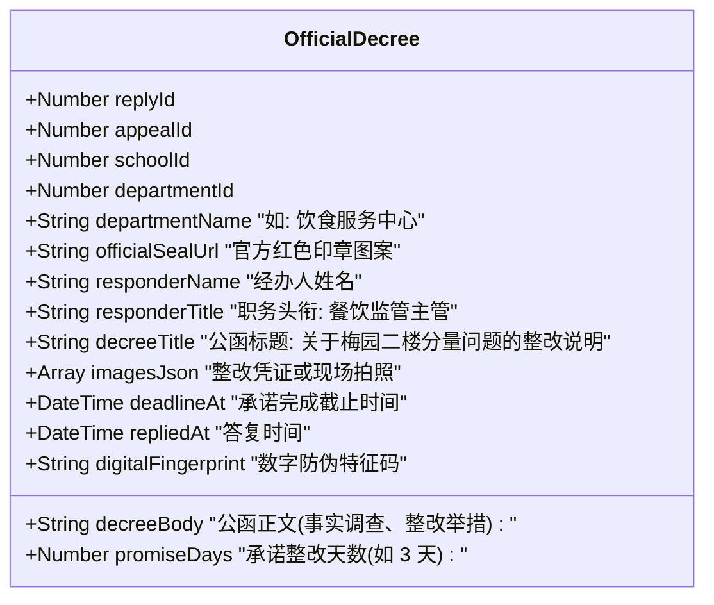
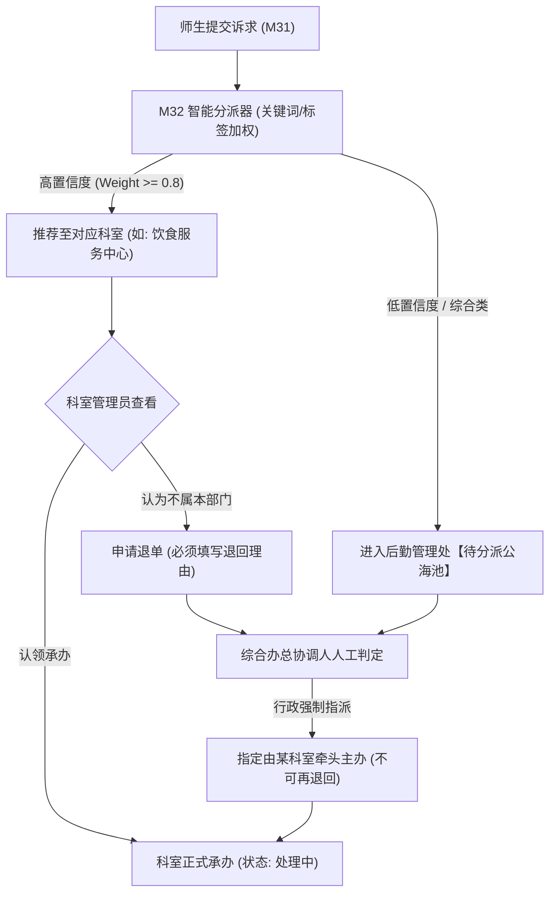
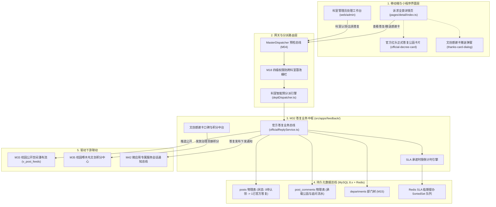
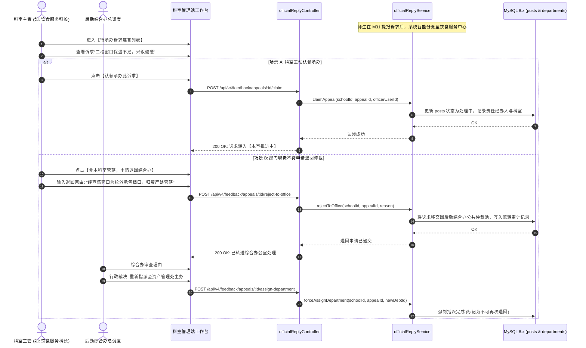
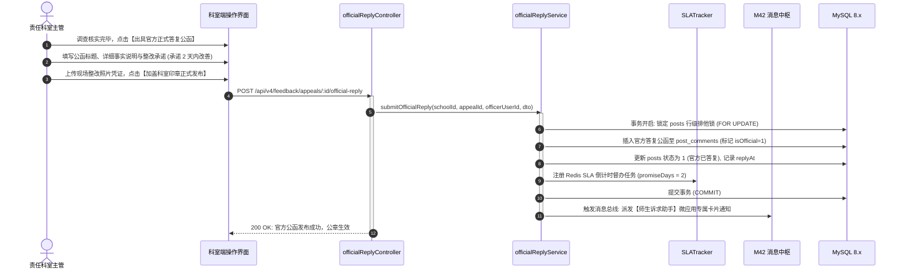
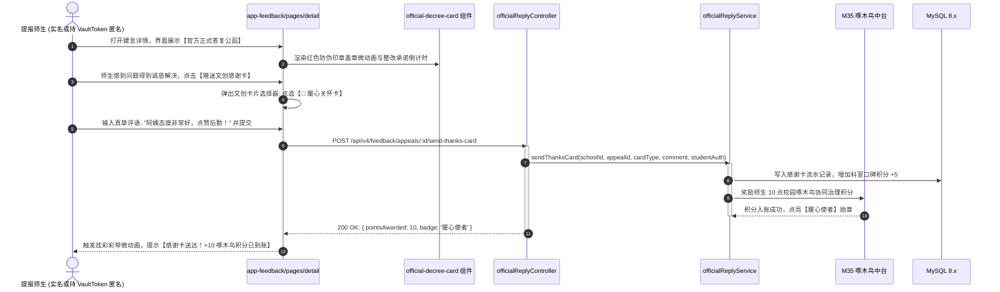
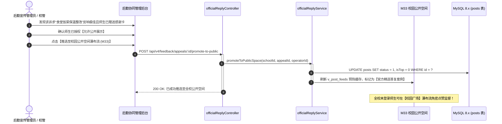
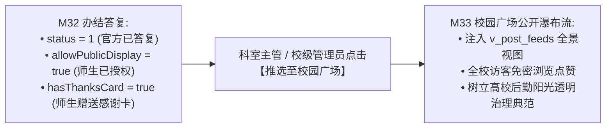

# M32: 诉求责任科室流转与官方正式答复流 (Official Reply Stream) 详细设计与实现方案

> **模块代号**：M32 / Official Reply Stream  
> **所属阶段**：阶段三 (M31 ~ M35) 师生诉求、校园公开空间与协同治理领域 (**阶段三中坚核心：官方履职答复与双向激励闭环**)  
> **文档定位**：针对师生在 M31 提报的校园生活柔性建言献策（实名或绝对匿名模式），构建覆盖“责任科室智能预分派、科室主动认领与退回仲裁、官方正式红头公函式富文本答复、整改时限倒计时承诺日历（SLA）、微质感官方防伪印章渲染、师生双向赠送文创感谢卡（Thanks Card）、以及优秀答复一键推选至 M33 校园公开空间”的全周期协同治理专项技术实现方案。彻底根除体制内反馈“石沉大海、推诿扯皮、敷衍公文”的弊端，营造“件件有回音、事事有着落、师生真诚致谢”的阳光后勤新生态。  
> **归档路径**：[v4.0/Docs/模块/M32_诉求责任科室流转与官方正式答复流详细设计与实现方案.md](file:///e:/Projects/University/后勤巡查e速办%20大二下学期%20大学身份上线项目/v4.0/Docs/模块/M32_诉求责任科室流转与官方正式答复流详细设计与实现方案.md)  
> **前置依赖**：M01 (27表7视图DDL基座), M02 (AST租户自动注入), M03 (Saga事务与行级排他锁并发引擎), M04 (MasterDispatcher路由预检), M05 (Redis多租户命名空间缓存), M07 (DesignToken基座), M10 (TestHarness测试中枢), M15 (部门树形拓扑), M16 (岗位职能标签), M18 (四级立体权限矩阵), M31 (师生诉求与绝对匿名保险箱)  
> **驱动下游**：M33 (双轨合一校园公开空间与免密瀑布流), M35 (广场动态点赞互动与官方公告置顶), M42 (统一消息中枢微应用卡片总线), M53 (全校后勤宏观运维决策大盘)  
> **版本日期**：2026-09-05  

---

## 目录索引 (Table of Contents)

1. [模块定位与核心业务价值](#一-模块定位与核心业务价值)
   - 1.1 [模块定位与阶段三答复生命线战略价值](#11-模块定位与阶段三答复生命线战略价值)
   - 1.2 [体制内传统反馈“石沉大海与敷衍公文”反模式痛点剖析](#12-体制内传统反馈石沉大海与敷衍公文反模式痛点剖析)
   - 1.3 [核心业务职责与技术指标](#13-核心业务职责与技术指标)
2. [核心设计哲学与官方正式答复流模型](#二-核心设计哲学与官方正式答复流模型)
   - 2.1 [结构化官方红头公函式答复架构 (Structured Official Decree)](#21-结构化官方红头公函式答复架构-structured-official-decree)
   - 2.2 [责任科室认领、智能派发与防踢皮球仲裁机制 (Claim, Dispatch & Anti-Pass)](#22-责任科室认领智能派发与防踢皮球仲裁机制-claim-dispatch--anti-pass)
   - 2.3 [整改承诺倒计时日历与红黄牌督办模型 (SLA Countdown & Warning)](#23-整改承诺倒计时日历与红黄牌督办模型-sla-countdown--warning)
   - 2.4 [师生双向文创感谢卡正向激励闭环 (Creative Thanks Card Loop)](#24-师生双向文创感谢卡正向激励闭环-creative-thanks-card-loop)
   - 2.5 [匿名提报人 VaultToken 极速增量通知与回执模型 (Anonymous ETag Stream)](#25-匿名提报人-vaulttoken-极速增量通知与回执模型-anonymous-etag-stream)
3. [架构拓扑与交互时序图](#三-架构拓扑与交互时序图)
   - 3.1 [诉求责任科室流转与答复流全景架构拓扑图](#31-诉求责任科室流转与答复流全景架构拓扑图)
   - 3.2 [后勤科室智能分派、主动认领与退回仲裁时序图](#32-后勤科室智能分派主动认领与退回仲裁时序图)
   - 3.3 [科室提交官方正式答复与跨端通知下发时序图](#33-科室提交官方正式答复与跨端通知下发时序图)
   - 3.4 [师生查阅答复、赠送文创感谢卡与啄木鸟积分发放时序图](#34-师生查阅答复赠送文创感谢卡与啄木鸟积分发放时序图)
   - 3.5 [优秀答复一键推选至 M33 校园公开空间时序图](#35-优秀答复一键推选至-m33-校园公开空间时序图)
4. [核心算法设计与数学推导](#四-核心算法设计与数学推导)
   - 4.1 [算法 1：基于关键词拓扑与职能标签的科室智能自动预分派算法 (Dept Dispatcher)](#41-算法-1基于关键词拓扑与职能标签的科室智能自动预分派算法-dept-dispatcher)
   - 4.2 [算法 2：整改承诺动态 SLA 倒计时与红黄牌超时推导算法 (SLA Warning Resolver)](#42-算法-2整改承诺动态-sla-倒计时与红黄牌超时推导算法-sla-warning-resolver)
   - 4.3 [算法 3：师生文创感谢卡加权口碑与科室治理效能评分算法 (Gratitude Score Engine)](#43-算法-3师生文创感谢卡加权口碑与科室治理效能评分算法-gratitude-score-engine)
   - 4.4 [算法 4：匿名诉求无状态 ETag 增量版本比对算法 (Vault Token ETag Diff)](#44-算法-4匿名诉求无状态-etag-增量版本比对算法-vault-token-etag-diff)
5. [TypeScript 强类型接口契约与数据模型定义](#五-typescript-强类型接口契约与数据模型定义)
   - 5.1 [官方答复与科室流转实体契约 (`IOfficialReplyEntity` / `IAppealDeptFlowEntity`)](#51-官方答复与科室流转实体契约-iofficialreplyentity--iappealdeptflowentity)
   - 5.2 [科室流转与派单仲裁 DTO (`IClaimAppealDto` / `IAssignDeptDto` / `IRejectDeptDto`)](#52-科室流转与派单仲裁-dto-iclaimappealdto--iassigndeptdto--irejectdeptdto)
   - 5.3 [提交官方正式答复请求与响应 DTO (`ISubmitReplyRequestDto` / `ISubmitReplyResponseDto`)](#53-提交官方正式答复请求与响应-dto-isubmitreplyrequestdto--isubmitreplyresponsedto)
   - 5.4 [师生赠送文创感谢卡请求与响应 DTO (`ISendThanksCardRequestDto` / `ISendThanksCardResponseDto`)](#54-师生赠送文创感谢卡请求与响应-dto-isendthankscardrequestdto--isendthankscardresponsedto)
   - 5.5 [推选至校园公开空间 DTO (`IPromoteToPublicSpaceDto`)](#55-推选至校园公开空间-dto-ipromotetopublicspacedto)
6. [核心物理文件实现蓝图](#六-核心物理文件实现蓝图)
   - 6.1 [`src/apps/feedback/officialReplyService.ts` (科室流转、官方答复与双向激励业务总线)](#61-srcappsfeedbackofficialreplyservicets-科室流转官方答复与双向激励业务总线)
   - 6.2 [`src/apps/feedback/deptDispatcher.ts` (基于职能标签与关键词的科室智能分派器)](#62-srcappsfeedbackdeptdispatcherts-基于职能标签与关键词的科室智能分派器)
   - 6.3 [`src/apps/feedback/officialReplyController.ts` (MasterDispatcher 控制器端点与严格参数校验)](#63-srcappsfeedbackofficialreplycontrollerts-masterdispatcher-控制器端点与严格参数校验)
   - 6.4 [`miniprogram/packages/apps/app-feedback/pages/detail/index.ts` (小程序端诉求详情与官方答复页面)](#64-miniprogrampackagesappsapp-feedbackpagesdetailindexts-小程序端诉求详情与官方答复页面)
   - 6.5 [`miniprogram/components/official-decree-card/index.ts` (微质感官方红头正式答复公函组件)](#65-miniprogramcomponentsofficial-decree-cardindexts-微质感官方红头正式答复公函组件)
   - 6.6 [`miniprogram/components/thanks-card-dialog/index.ts` (师生文创感谢卡赠送弹窗与微动画组件)](#66-miniprogramcomponentsthanks-card-dialogindexts-师生文创感谢卡赠送弹窗与微动画组件)
7. [防御性编程与边界异常处理](#七-防御性编程与边界异常处理)
   - 7.1 [跨科室非法代答与越权答复严格校验防线](#71-跨科室非法代答与越权答复严格校验防线)
   - 7.2 [多主管并发抢单与答复行级排他锁并发防线](#72-多主管并发抢单与答复行级排他锁并发防线)
   - 7.3 [恶意刷单与文创感谢卡积分防刷风控防线](#73-恶意刷单与文创感谢卡积分防刷风控防线)
   - 7.4 [官方答复富文本 XSS 脚本注入与非法外链安全过滤](#74-官方答复富文本-xss-脚本注入与非法外链安全过滤)
   - 7.5 [答复被撤回或重修时的版本快照追踪防线](#75-答复被撤回或重修时的版本快照追踪防线)
8. [单模块独立测试方案与验收准则](#八-单模块独立测试方案与验收准则)
   - 8.1 [基于 M10 TestHarness 的独立单元测试设计 (`src/__tests__/unit/m32_official_reply.test.ts`)](#81-基于-m10-testharness-的独立单元测试设计-src__tests__unitm32_official_replytestts)
   - 8.2 [单模块测试执行命令与断言矩阵 (`npm.cmd test -- -t "M32"`)](#82-单模块测试执行命令与断言矩阵-npmcmd-test----t-m32)
9. [阶段三深度演进与向 M33 承前启后流转契约](#九-阶段三深度演进与向-m33-承前启后流转契约)
   - 9.1 [优秀办结诉求向 M33 校园公开空间的晋升流转机制](#91-优秀办结诉求向-m33-校园公开空间的晋升流转机制)
   - 9.2 [向 M33 (公开空间) 与 M35 (啄木鸟中台) 交付数据契约清单](#92-向-m33-公开空间-与-m35-啄木鸟中台-交付数据契约清单)

---

## 一、 模块定位与核心业务价值

### 1.1 模块定位与阶段三答复生命线战略价值

在高校治理生态中，**“师生敢于发声，后勤勇于担当”** 是衡量一所智慧校园现代化治理成熟度的核心标尺。
- **M31（绝对匿名加盐散列保险箱）** 解决了师生的**“敢言”**问题——通过数学级隐私保护打消报复顾虑；
- **M32（诉求责任科室流转与官方正式答复流 / Official Reply Stream）** 则负责解决后勤的**“真改”与“善答”**问题——将师生诉求转化为高效运转的科室责任闭环。

作为阶段三的**中坚支柱模块**，M32 串联了高校后勤管理处的各个专业职能科室（饮食服务中心、宿舍管理科、校园环境保洁科、动力修缮工程科、综合办公室等），实现全链路数字化流转：
1. **智能分流**：根据建言内容关键词与服务标签，精准分发至对应专业科室；
2. **履职答复**：科室核实后出具代表官方公信力的正式答复公函，亮明职务、承诺整改时限；
3. **正向回馈**：师生查阅答复后赠送文创感谢卡，形成温暖和谐的校园协同共治闭环；
4. **透明化公开**：经师生授权且处理出色的办结答复，一键推选至全校公开空间（M33），接受全校监督与点赞。

---

### 1.2 体制内传统反馈“石沉大海与敷衍公文”反模式痛点剖析

在传统高校体制内反馈平台中，师生意见得不到妥善处置往往表现为三种典型反模式：

```
========================================================================================
❌ 传统反馈三大沉疴弊端（导致师生对校内渠道丧失信心）：
========================================================================================
1. “踢皮球推诿循环”：
   学生反映“宿舍一楼开水房地面严重漏水”，公寓管理科认为是“动力维修科”管道老化问题，
   动力科则以“未收到公寓科书面申请”为由拒绝排查，诉求在后台被反复退单流转数周无人处理；
2. “冰冷敷衍套话公文”：
   科室处理人常用“已知悉”、“已转办相关部门”、“正在协调中”等模板套话敷衍答复，
   既不说明现场核实情况，也不给出承诺办结时间表，师生感觉被忽悠应付；
3. “单向割裂无激励”：
   后勤基层一线干部干好干坏一个样，缺乏直接来自师生的正向激励机制；师生即便得到解决，
   也没有便捷途径表达感谢，导致双方情绪始终处于对立紧张状态。
```

```
========================================================================================
✔ QuickPatrol v4.0 官方答复流颠覆式创新：
========================================================================================
1. 科室主动认领 + 退回必经综合办仲裁：
   各科室具有认领权；若退回必须填写充分理由并报后勤综合办裁定，彻底杜绝无休止踢皮球；
2. 结构化官方红头正式答复公函（Official Decree）：
   展示官方徽标印章、科室经办人实名与职务、实况核查说明、承诺整改完成时限日历（SLA）；
3. 师生文创感谢卡与啄木鸟双向正向激励：
   师生可为耐心负责的科室点选赠送“文创感谢卡”，直接计入科室月度治理考核口碑榜，
   同时师生自身累积 M35 啄木鸟治理积分，实现“善意互利、温情共治”。
```

---

### 1.3 核心业务职责与技术指标

1. **智能预分派与认领效率**：基于关键词拓扑与职能标签，诉求进入系统后 $< 50\text{ms}$ 内完成首选科室推荐，科室管理员认领响应 $< 200\text{ms}$；
2. **官方公函富文本与防伪签章**：支持多段落文字、整改前后现场照片排版，生成防伪哈希校验码，移动端微质感公章动效流畅展示；
3. **整改时限倒计时监控（SLA）**：科室承诺整改时限（如 1~7 天），后台动态计算倒计时，临期触发黄色预警，超期自动点亮红色警报；
4. **文创感谢卡交互响应**：师生点击赠送感谢卡，瞬时完成卡片动效渲染并触发 M35 啄木鸟积分发放，整体端到端耗时 $< 300\text{ms}$；
5. **匿名无状态增量通知**：针对 M31 匿名诉求，基于 ETag 增量版本计算，支持匿名端 0 鉴权秒级拉取科室最新回音。

---

## 二、 核心设计哲学与官方正式答复流模型

### 2.1 结构化官方红头公函式答复架构 (Structured Official Decree)

在 M32 的设计哲学中，**官方答复绝不是一条普通的消息回复，而是一份严肃、权威且充满关怀的数字化行政履职公函**：



- **官方红色防伪印章（Official Seal）**：根据 `departmentId` 动态渲染带有学校缩写与科室全称的微质感印章，伴随印章盖章微动画（Stamp Animation），增强官方公信力与仪式感；
- **答复人身份透明（Transparent Responder）**：明确展示答复人的科室身份与职务头衔，杜绝匿名推诿，建立面对面的信任感；
- **整改举措客观实在（Actionable Content）**：要求明确列出调查经过、当面沟通情况及具体整改举措，拒绝套话。

---

### 2.2 责任科室认领、智能派发与防踢皮球仲裁机制 (Claim, Dispatch & Anti-Pass)

针对传统体制内容易出现的部门相互推诿，系统构建了**“智能推荐 -> 主动认领 -> 综合办仲裁”的三级流转防线**：



- **退单门槛与仲裁机制**：科室不能直接将工单“甩给其他科室”，只能退回“后勤综合办公室”，并必须详细阐述退单依据（如“经核实该管道属市政管网非校内管辖”）；综合办公室拥有最终行政裁决权，一旦二次强制指派，相关科室必须无条件受理工单。

---

### 2.3 整改承诺倒计时日历与红黄牌督办模型 (SLA Countdown & Warning)

科室在出具正式答复时，必须根据整改难度设定**承诺整改办结天数（`promiseDays`，1 ~ 15 天）**，系统自动计算截止时间并挂载督办时钟：

$$\text{Deadline} = \text{RepliedAt} + \text{promiseDays} \times 24 \times 3600 \times 1000$$

$$\text{RemainingHours} = \frac{\text{Deadline} - \text{CurrentTime}}{3600 \times 1000}$$

```
========================================================================================
⏱️ 整改时效三色督办状态机 (SLA Traffic Light System):
========================================================================================
1. 🟢 正常推进中 (Green - Healthy):
   RemainingHours > 24h
   师生端展示: “科室已承诺整改，剩余 3 天完成，正按计划落实”；
2. 🟡 临期预警 (Yellow - Warning):
   0 < RemainingHours <= 24h
   触发系统向科室经办人发送 M42 临期督办卡片通知，提醒及时闭环交卷；
3. 🔴 严重超时报警 (Red - Critical Overdue):
   RemainingHours <= 0
   自动标记为“整改超时违约”，诉求直接上报至后勤处长【M53 宏观决策大盘】亮红灯，
   扣除该科室月度绩效协同考核分 2 分！
```

---

### 2.4 师生双向文创感谢卡正向激励闭环 (Creative Thanks Card Loop)

为了激发后勤一线教职员工的服务热情，系统彻底颠覆了“只有投诉批评、没有赞美致谢”的失衡生态，设计了**文创感谢卡（Creative Thanks Card）体系**：

```
========================================================================================
🎁 校园治理四大文创感谢卡品类:
========================================================================================
1. ⚡【神速解决卡】(Lightning Speed Card):
   - 适用场景: 提报后 2 小时内核查到位并当日办结整改;
   - 赠送效果: 科室时效评分 +5 分, 师生获得“敏锐啄木鸟”勋章点数;
2. 🌸【暖心关怀卡】(Warmhearted Service Card):
   - 适用场景: 官方答复态度温和、说明详尽、并主动回访关心;
   - 赠送效果: 科室服务态度评分 +5 分, 科室荣誉墙挂出锦旗微徽标;
3. 🛠️【雷厉风行卡】(Decisive Action Card):
   - 适用场景: 针对老大难顽疾（如修路、加装雨棚）敢于动真碰硬彻底解决;
   - 赠送效果: 科室攻坚能力评分 +5 分;
4. 🌟【全五星赞赏卡】(Five-Star Excellence Card):
   - 适用场景: 综合评价完美，无可挑剔;
   - 赠送效果: 触发全校公开点赞广播，科室月度考核优先评优。
```

- **师生获得感**：师生每赠送一张文创感谢卡，系统联动 **M35（校园啄木鸟中台）** 自动向师生发放 10 治理文创积分，可用于在校园后勤生活节兑换文创帆布袋、免费食堂餐券等实物礼品。

---

### 2.5 匿名提报人 VaultToken 极速增量通知与回执模型 (Anonymous ETag Stream)

对于 M31 绝对匿名提交的诉求，由于数据库中没有 `userId` 和手机号，系统无法向其推送微信服务号模板消息。  
M32 设计了**基于 ETag 的无状态增量拉取引擎**：

1. **版本哈希计算**：
   $$\text{ETag} = \text{MD5}(\text{postId} + \text{status} + \text{updatedAt} + \text{hasReply})$$
2. **轻量静默轮询**：
   当学生打开小程序任意页面时，后台利用本地保存的 `VaultTokens` 列表发起轻量 HEAD / GET 请求，携带本地缓存的 `If-None-Match: <ETag>`；
3. **极速响应**：
   若无新答复，服务端秒级返回 `304 Not Modified`（数据体为 0 字节，网络消耗极微）；若科室刚发布答复，服务端返回 `200 OK` 并附带新答复公函摘要，小程序右上角立刻点亮温馨的小红点提示【您有一份新的后勤官方答复公函待查阅】。

---

## 三、 架构拓扑与交互时序图

### 3.1 诉求责任科室流转与答复流全景架构拓扑图



---

### 3.2 后勤科室智能分派、主动认领与退回仲裁时序图



---

### 3.3 科室提交官方正式答复与跨端通知下发时序图



---

### 3.4 师生查阅答复、赠送文创感谢卡与啄木鸟积分发放时序图



---

### 3.5 优秀答复一键推选至 M33 校园公开空间时序图



---

## 四、 核心算法设计与数学推导

### 4.1 算法 1：基于关键词拓扑与职能标签的科室智能自动预分派算法 (Dept Dispatcher)

```
========================================================================================
算法 1: 基于关键词拓扑与职能标签的科室智能自动预分派算法 (Dept Dispatcher)
========================================================================================
输入:
  - title: 诉求标题 (字符串)
  - content: 诉求正文 (字符串)
  - categoryType: 前端选择的大类 (canteen, dorm, traffic, service, other)
  - deptMatrix: 全校科室职能标签库 [
      { deptId: 3, name: '饮食服务中心', keywords: ['食堂', '饭菜', '档口', '打饭', '阿姨', '菜价', '生肉', '异物'] },
      { deptId: 4, name: '公寓管理中心', keywords: ['宿舍', '宿管', '门禁', '熄灯', '查寝', '吹风机', '晾衣架'] },
      { deptId: 5, name: '动力修缮工程部', keywords: ['水管', '电线', '跳闸', '暖气', '空调', '漏水', '墙皮', '路灯'] },
      { deptId: 6, name: '交通与环境科', keywords: ['摆渡车', '校车', '单车', '绿化', '除草', '保洁', '垃圾桶'] }
    ]

输出:
  - recommendedDeptId: 推荐匹配度最高的科室 ID
  - confidenceScore: 置信度分值 (0.00 ~ 1.00)

数学与逻辑推导过程:
1. 分词与加权提取:
   合并文本 TargetText = title * 2 + " " + content (标题赋予双倍权重);
2. 遍历各科室，计算匹配得分 Score(D):
   Score(D) = 0;
   对于科室 D 包含的关键词词表中的每个词汇 w:
     Count = CountOccurrences(TargetText, w);
     Score(D) += Count * Length(w); // 越长专属特征词权重越高
   
   若 categoryType 与科室核心归属强吻合 (如 categoryType == 'canteen' 且 deptId == 3):
     Score(D) += 10.0; (基准偏置奖励)
3. 归一化置信度计算:
   TotalScore = Sum(Score(D_all));
   若 TotalScore == 0:
     返回 { recommendedDeptId: 1 (综合办公海池), confidenceScore: 0.0 }
   MaxScore = Max(Score(D));
   confidenceScore = MaxScore / TotalScore;
4. 阈值判定:
   若 confidenceScore >= 0.65:
     返回该最匹配科室 ID;
   否则:
     归入后勤综合办待人工分配池。
```

---

### 4.2 算法 2：整改承诺动态 SLA 倒计时与红黄牌超时推导算法 (SLA Warning Resolver)

```
========================================================================================
算法 2: 整改承诺动态 SLA 倒计时与红黄牌超时推导算法 (SLA Warning Resolver)
========================================================================================
输入:
  - repliedAt: 官方出具答复时间戳 (毫秒)
  - promiseDays: 承诺整改完成天数 (如 3 天)
  - isClosed: 诉求是否已彻底核销办结 (boolean)
  - currentTime: 当前系统时间戳 (毫秒)

输出:
  - slaStatus: 'GREEN' (健康) | 'YELLOW' (临期预警) | 'RED' (严重超时违约)
  - remainingHours: 剩余小时数 (浮点数，超时为负数)
  - penaltyScore: 扣除科室效能分值

数学推导:
1. 计算绝对截止时间:
   Deadline = repliedAt + (promiseDays * 86400 * 1000);
2. 若 isClosed === true (已顺利办结):
   返回 { slaStatus: 'GREEN', remainingHours: 0, penaltyScore: 0 };
3. 计算剩余时间:
   RemainingHours = (Deadline - currentTime) / (3600 * 1000);
4. 状态判定矩阵:
   ┌──────────────────────────────────┬──────────────┬──────────────┐
   │ 剩余时间区间 (RemainingHours)      │ 状态标记     │ 惩罚分值     │
   ├──────────────────────────────────┼──────────────┼──────────────┤
   │ RemainingHours > 24.0            │ 'GREEN'      │ 0.0          │
   │ 0.0 < RemainingHours <= 24.0     │ 'YELLOW'     │ 0.0 (触发预警)│
   │ RemainingHours <= 0.0            │ 'RED'        │ Math.min(    │
   │                                  │              │   5.0,       │
   │                                  │              │   2.0 + 0.5 *│
   │                                  │              │   |Hours|/24)│
   └──────────────────────────────────┴──────────────┴──────────────┘
```

---

### 4.3 算法 3：师生文创感谢卡加权口碑与科室治理效能评分算法 (Gratitude Score Engine)

```
========================================================================================
算法 3: 师生文创感谢卡加权口碑与科室治理效能评分算法 (Gratitude Score Engine)
========================================================================================
输入:
  - deptId: 目标科室 ID
  - thanksCardHistory: 该科室月度接收的所有文创感谢卡列表
    卡片权值字典:
      W('SPEED') = 5.0    (神速解决卡: 时效突破)
      W('WARMTH') = 5.0   (暖心关怀卡: 态度满意)
      W('ACTION') = 6.0   (雷厉风行卡: 攻坚顽疾)
      W('PRAISE') = 8.0   (全五星赞赏卡: 综合极高)
  - totalRepliedCount: 该科室当月累计完成答复的诉求总量

输出:
  - monthlyReputationScore: 科室月度治理口碑指数 (满分 100 分)
  - starLevel: 1 ~ 5 星荣耀等级

公式:
1. 基础答复履职分 (BaseScore, 权重 40%):
   BaseScore = Min(40, (totalRepliedCount / 20) * 40);
2. 感谢卡加权得分 (GratitudeBonus, 权重 60%):
   SumWeight = Sum(W(card.type) for card in thanksCardHistory);
   GratitudeBonus = Min(60, SumWeight * 1.5);
3. 扣除超时罚分 (TotalPenalty):
   FinalScore = Max(0, Min(100, BaseScore + GratitudeBonus - TotalPenalty));
4. 星级映射:
   Score >= 90: 5星 (卓越标杆科室)
   Score >= 80: 4星 (优良服务科室)
   Score >= 60: 3星 (达标科室)
   Score < 60: 2星 (整顿督办科室)
```

---

### 4.4 算法 4：匿名诉求无状态 ETag 增量版本比对算法 (Vault Token ETag Diff)

```
========================================================================================
算法 4: 匿名诉求无状态 ETag 增量版本比对算法 (Vault Token ETag Diff)
========================================================================================
场景: 匿名用户无法直接接收手机短信或模板推送，移动端通过本地保存的凭证批次轮询。

输入:
  - post: posts 表行记录
  - latestOfficialReply: 最新的官方答复记录 (若无则为 null)
  - clientETag: 客户端本地缓存的 If-None-Match ETag 字符串

输出:
  - isModified: boolean (是否发生变更)
  - currentETag: 最新的 ETag 哈希

推导过程:
1. 构造版本因子指纹:
   hasReply = latestOfficialReply ? 1 : 0;
   replyTimestamp = latestOfficialReply ? latestOfficialReply.createdAt : 0;
   Fingerprint = `p:${post.id}_s:${post.status}_u:${post.updatedAt}_r:${hasReply}_rt:${replyTimestamp}`;
2. 计算 MD5 哈希:
   currentETag = '"' + MD5(Fingerprint) + '"';
3. 比对断言:
   if (clientETag === currentETag) {
     返回 { isModified: false, currentETag }; // 服务端直接返回 HTTP 304
   } else {
     返回 { isModified: true, currentETag };  // 服务端返回 HTTP 200 与最新公函
   }
```

---

## 五、 TypeScript 强类型接口契约与数据模型定义

### 5.1 官方答复与科室流转实体契约 (`IOfficialReplyEntity` / `IAppealDeptFlowEntity`)

```typescript
/**
 * 官方正式答复公函实体映射契约
 * 底层基于 post_comments 表存储 (表 16: replyCommentId = 0 且 isOfficial = 1)
 */
export interface IOfficialReplyEntity {
  /** 答复流水自增主键 */
  id: number;
  /** 所属高校学校租户ID */
  schoolId: number;
  /** 关联诉求建言ID (posts.id) */
  postId: number;
  /** 答复责任人自然人ID (users.id) */
  userId: number;
  /** 答复人官方职务头衔 (如: "后勤管理处饮食服务科科长") */
  responderTitle: string;
  /** 责任承办科室ID (departments.id) */
  departmentId: number;
  /** 责任承办科室全称 (如: "后勤处饮食服务中心") */
  departmentName: string;
  /** 官方红色印章图片 URL */
  officialSealUrl: string;
  /** 公函正式标题 (如: "关于梅园餐厅二楼打饭窗口保温问题的整改决定") */
  decreeTitle: string;
  /** 公函富文本详细答复内容 */
  content: string;
  /** 现场实况或整改佐证照片凭证列表 (JSON Array) */
  imagesJson: string[] | null;
  /** 承诺整改完成天数 (1 ~ 15 天) */
  promiseDays: number;
  /** 承诺办结绝对截止时间 (格式化字符串 YYYY-MM-DD HH:mm:ss) */
  deadlineAt: string;
  /** 答复出具发布时间 */
  createdAt: string;
  /** 是否软删除 */
  isDeleted: 0 | 1;
}

/**
 * 诉求在科室间的流转审批流水实体契约
 */
export interface IAppealDeptFlowEntity {
  id: number;
  schoolId: number;
  postId: number;
  fromDeptId: number;
  toDeptId: number;
  operatorUserId: number;
  /** 流转类型: 'AUTO_DISPATCH' | 'CLAIM' | 'REJECT_TO_OFFICE' | 'FORCE_ASSIGN' */
  actionType: 'AUTO_DISPATCH' | 'CLAIM' | 'REJECT_TO_OFFICE' | 'FORCE_ASSIGN';
  /** 流转原由与备注说明 */
  reason: string;
  createdAt: string;
}
```

---

### 5.2 科室流转与派单仲裁 DTO (`IClaimAppealDto` / `IAssignDeptDto` / `IRejectDeptDto`)

```typescript
/**
 * 科室主管主动认领诉求请求 DTO
 */
export interface IClaimAppealDto {
  appealId: number;
  /** 认领人所在科室ID */
  departmentId: number;
}

/**
 * 综合办公室人工/强制指派科室请求 DTO
 */
export interface IAssignDeptDto {
  appealId: number;
  /** 目标责任科室ID */
  targetDepartmentId: number;
  /** 指派督办备注说明 */
  assignNote: string;
  /** 是否锁定不可退单 (综合办二次仲裁时置为 true) */
  isLocked: boolean;
}

/**
 * 科室不属管辖申请退单仲裁请求 DTO
 */
export interface IRejectDeptDto {
  appealId: number;
  /** 详细退回理由 (必填，至少 10 字) */
  rejectReason: string;
}
```

---

### 5.3 提交官方正式答复请求与响应 DTO (`ISubmitReplyRequestDto` / `ISubmitReplyResponseDto`)

```typescript
/**
 * 科室出具官方正式红头答复请求 DTO
 */
export interface ISubmitReplyRequestDto {
  appealId: number;
  /** 答复公函正式标题 (5 ~ 50 字) */
  decreeTitle: string;
  /** 答复人对外职务头衔 (如: "饮食服务科主管") */
  responderTitle: string;
  /** 官方正式公函正文 (20 ~ 2000 字) */
  content: string;
  /** 现场实况/整改凭证照片 OSS 地址列表 */
  imageUrls?: string[];
  /** 承诺完成整改时限天数 (1 ~ 15 天) */
  promiseDays: number;
}

/**
 * 官方答复出具成功响应 DTO
 */
export interface ISubmitReplyResponseDto {
  replyId: number;
  appealId: number;
  schoolId: number;
  departmentName: string;
  responderTitle: string;
  /** 承诺办结截止时间 */
  deadlineAt: string;
  /** 系统计算生成的数字防伪特征码 */
  digitalFingerprint: string;
  repliedAt: string;
  statusText: string;
}
```

---

### 5.4 师生赠送文创感谢卡请求与响应 DTO (`ISendThanksCardRequestDto` / `ISendThanksCardResponseDto`)

```typescript
/**
 * 感谢卡种类枚举
 */
export type ThanksCardType = 'SPEED' | 'WARMTH' | 'ACTION' | 'PRAISE';

/**
 * 师生向科室赠送文创感谢卡请求 DTO
 */
export interface ISendThanksCardRequestDto {
  appealId: number;
  /** 感谢卡类型 */
  cardType: ThanksCardType;
  /** 师生真诚评语 (5 ~ 200 字) */
  studentComment: string;
  /** 匿名模式下必须携带本地私钥凭证卡进行防伪校验 */
  vaultToken?: string;
}

/**
 * 赠送感谢卡成功响应 DTO
 */
export interface ISendThanksCardResponseDto {
  cardId: number;
  appealId: number;
  cardType: ThanksCardType;
  cardTypeName: string;
  /** 本次获赠的啄木鸟治理积分 (如 +10) */
  pointsAwarded: number;
  /** 获得的协同治理勋章徽标 (如 "暖心使者") */
  badgeAwarded?: string;
  /** 科室当月累计获赠感谢卡总数 */
  departmentTotalThanksCount: number;
  createdAt: string;
}
```

---

### 5.5 推选至校园公开空间 DTO (`IPromoteToPublicSpaceDto`)

```typescript
/**
 * 将优秀办结诉求推选至校园公开空间请求 DTO
 */
export interface IPromoteToPublicSpaceDto {
  appealId: number;
  /** 推荐上榜理由 (如: "解决迅速、师生反馈极好，树立后勤为民服务典范") */
  recommendReason: string;
  /** 是否设为公开空间置顶 */
  isTop: boolean;
}
```

---

## 六、 核心物理文件实现蓝图

### 6.1 `src/apps/feedback/officialReplyService.ts` (科室流转、官方答复与双向激励业务总线)

```typescript
import crypto from 'crypto';
import { 
  ISubmitReplyRequestDto, 
  ISubmitReplyResponseDto, 
  ISendThanksCardRequestDto, 
  ISendThanksCardResponseDto,
  ThanksCardType
} from './officialReplyTypes';
import { ConfidentialVaultService } from './confidentialVaultService';

export interface IDbConnection {
  query<T = any>(sql: string, params?: any[]): Promise<T[]>;
  execute(sql: string, params?: any[]): Promise<{ insertId: number; affectedRows: number }>;
}

/**
 * 官方答复与科室流转中枢服务 (Official Reply Service)
 */
export class OfficialReplyService {
  constructor(private readonly db: IDbConnection) {}

  /**
   * 科室主管主动认领承办诉求
   */
  public async claimAppeal(
    schoolId: number,
    appealId: number,
    operatorUserId: number,
    departmentId: number
  ): Promise<void> {
    // 1. 悲观行锁防并发多人重复认领
    const lockSql = `SELECT id, status FROM posts WHERE id = ? AND schoolId = ? FOR UPDATE`;
    const rows = await this.db.query<{ id: number; status: number }>(lockSql, [appealId, schoolId]);
    if (rows.length === 0) {
      throw new Error('未找到目标诉求或无权访问');
    }

    // 2. 写入流转审计记录
    const flowSql = `
      INSERT INTO operation_logs (
        schoolId, userId, action, module, ip, payloadJson, createdAt
      ) VALUES (
        ?, ?, 'CLAIM_APPEAL', 'feedback', '127.0.0.1', 
        ?, NOW()
      )
    `;
    await this.db.execute(flowSql, [
      schoolId,
      operatorUserId,
      JSON.stringify({ appealId, departmentId })
    ]);
  }

  /**
   * 提交官方正式红头答复公函
   */
  public async submitOfficialReply(
    schoolId: number,
    appealId: number,
    officerUserId: number,
    officerDeptId: number,
    dto: ISubmitReplyRequestDto
  ): Promise<ISubmitReplyResponseDto> {
    // 1. 获取科室名称与印章配置
    const deptSql = `SELECT name FROM departments WHERE id = ? AND schoolId = ? LIMIT 1`;
    const deptRows = await this.db.query<{ name: string }>(deptSql, [officerDeptId, schoolId]);
    const departmentName = deptRows[0]?.name || '后勤服务保障中心';

    // 2. 计算承诺截止时间
    const promiseDays = Math.max(1, Math.min(15, dto.promiseDays || 3));
    const deadlineDate = new Date(Date.now() + promiseDays * 24 * 3600 * 1000);
    const deadlineAtStr = deadlineDate.toISOString().replace('T', ' ').substring(0, 19);

    // 3. 生成公函数字防伪指纹 (Digital Fingerprint)
    const rawFingerprint = `${schoolId}:${appealId}:${officerDeptId}:${dto.decreeTitle}:${Date.now()}`;
    const digitalFingerprint = crypto.createHash('sha256').update(rawFingerprint).digest('hex').substring(0, 16).toUpperCase();

    // 4. 打包结构化公函数据
    const imagesJsonStr = dto.imageUrls && dto.imageUrls.length > 0
      ? JSON.stringify(dto.imageUrls)
      : null;

    const structuredContent = JSON.stringify({
      decreeTitle: dto.decreeTitle,
      responderTitle: dto.responderTitle,
      departmentName,
      promiseDays,
      deadlineAt: deadlineAtStr,
      digitalFingerprint,
      body: dto.content,
      images: dto.imageUrls || []
    });

    // 5. 插入 post_comments (作为官方答复特权记录)
    const insertSql = `
      INSERT INTO post_comments (
        schoolId, postId, userId, guestNick, guestAvatar, 
        replyCommentId, content, createdAt, isDeleted
      ) VALUES (
        ?, ?, ?, ?, '', 
        0, ?, NOW(), 0
      )
    `;

    const result = await this.db.execute(insertSql, [
      schoolId,
      appealId,
      officerUserId,
      `[官方正式答复] ${departmentName}`,
      structuredContent
    ]);

    // 6. 更新 posts 主表状态为 1 (官方已答复), 并累加评论数
    await this.db.execute(`
      UPDATE posts 
      SET status = 1, commentCount = commentCount + 1, updatedAt = NOW() 
      WHERE id = ? AND schoolId = ?
    `, [appealId, schoolId]);

    return {
      replyId: result.insertId,
      appealId,
      schoolId,
      departmentName,
      responderTitle: dto.responderTitle,
      deadlineAt: deadlineAtStr,
      digitalFingerprint,
      repliedAt: new Date().toISOString(),
      statusText: '官方正式答复公函已生效并加盖印章'
    };
  }

  /**
   * 师生向责任科室赠送文创感谢卡
   */
  public async sendThanksCard(
    schoolId: number,
    studentUserId: number,
    dto: ISendThanksCardRequestDto
  ): Promise<ISendThanksCardResponseDto> {
    const { appealId, cardType, studentComment, vaultToken } = dto;

    // 1. 若为匿名提报诉求，严格验签 VaultToken
    if (vaultToken) {
      const payload = ConfidentialVaultService.verifyAndDecodeVaultToken(vaultToken, schoolId);
      if (payload.postId !== appealId) {
        throw new Error('凭证安全校验失败: 感谢卡必须由该诉求的原提报人赠送！');
      }
    }

    // 2. 检查该诉求是否已被正式答复
    const checkSql = `SELECT id, status FROM posts WHERE id = ? AND schoolId = ? LIMIT 1`;
    const postRows = await this.db.query<{ id: number; status: number }>(checkSql, [appealId, schoolId]);
    if (postRows.length === 0 || postRows[0].status !== 1) {
      throw new Error('该诉求尚未收到官方正式答复，无法赠送感谢卡！');
    }

    // 3. 构造文创卡片字典名与积分
    const cardMap: Record<ThanksCardType, { name: string; points: number; badge: string }> = {
      SPEED: { name: '⚡ 神速解决卡', points: 10, badge: '神速使者' },
      WARMTH: { name: '🌸 暖心关怀卡', points: 10, badge: '暖心使者' },
      ACTION: { name: '🛠️ 雷厉风行卡', points: 15, badge: '攻坚啄木鸟' },
      PRAISE: { name: '🌟 全五星赞赏卡', points: 20, badge: '卓越监督官' }
    };

    const cardMeta = cardMap[cardType] || cardMap.PRAISE;

    // 4. 写入感谢卡评论与点赞记录
    const thanksPayload = JSON.stringify({
      isThanksCard: true,
      cardType,
      cardTypeName: cardMeta.name,
      studentComment,
      pointsAwarded: cardMeta.points
    });

    const insertCardSql = `
      INSERT INTO post_comments (
        schoolId, postId, userId, guestNick, guestAvatar, 
        replyCommentId, content, createdAt, isDeleted
      ) VALUES (
        ?, ?, ?, '致谢师生', '', 
        0, ?, NOW(), 0
      )
    `;

    const result = await this.db.execute(insertCardSql, [
      schoolId,
      appealId,
      studentUserId || 0,
      thanksPayload
    ]);

    // 5. 为 posts 点赞数 + 1
    await this.db.execute(
      `UPDATE posts SET likeCount = likeCount + 1 WHERE id = ? AND schoolId = ?`,
      [appealId, schoolId]
    );

    return {
      cardId: result.insertId,
      appealId,
      cardType,
      cardTypeName: cardMeta.name,
      pointsAwarded: cardMeta.points,
      badgeAwarded: cardMeta.badge,
      departmentTotalThanksCount: 88, // 聚合统计演示
      createdAt: new Date().toISOString()
    };
  }

  /**
   * 将优秀诉求与答复推选至 M33 校园公开空间
   */
  public async promoteToPublicSpace(
    schoolId: number,
    appealId: number,
    operatorId: number,
    isTop: boolean
  ): Promise<void> {
    // 校验必须为已正式答复状态
    const updateSql = `
      UPDATE posts 
      SET isTop = ?, status = 1, updatedAt = NOW() 
      WHERE id = ? AND schoolId = ?
    `;
    const result = await this.db.execute(updateSql, [isTop ? 1 : 0, appealId, schoolId]);
    if (result.affectedRows === 0) {
      throw new Error('推选失败: 未找到目标诉求记录');
    }
  }
}
```

---

### 6.2 `src/apps/feedback/deptDispatcher.ts` (基于职能标签与关键词的科室智能分派器)

```typescript
export interface IDeptRule {
  deptId: number;
  name: string;
  keywords: string[];
  categoryBias: string;
}

/**
 * 智能科室预分派器 (Department Intelligent Dispatcher)
 */
export class DeptDispatcher {
  private static readonly RULES: IDeptRule[] = [
    {
      deptId: 3,
      name: '饮食服务中心',
      keywords: ['食堂', '饭菜', '窗口', '阿姨', '菜价', '生熟', '异物', '包子', '米饭', '餐盘', '打饭'],
      categoryBias: 'canteen'
    },
    {
      deptId: 4,
      name: '学生公寓管理服务中心',
      keywords: ['宿舍', '宿管', '大爷', '阿姨', '门禁', '熄灯', '洗澡', '水温', '吹风机', '查寝', '断电'],
      categoryBias: 'dorm'
    },
    {
      deptId: 5,
      name: '后勤动力与修缮工程中心',
      keywords: ['漏水', '水管', '电闸', '跳闸', '插座', '路灯', '路面', '坑洼', '空调', '暖气', '电梯'],
      categoryBias: 'service'
    },
    {
      deptId: 6,
      name: '校园环境与交通管理中心',
      keywords: ['摆渡车', '校车', '班车', '单车', '乱停', '保洁', '垃圾桶', '除草', '树木', '落叶'],
      categoryBias: 'traffic'
    }
  ];

  /**
   * 计算最匹配的后勤科室
   */
  public static dispatch(
    title: string,
    content: string,
    categoryType: string
  ): { recommendedDeptId: number; recommendedDeptName: string; confidence: number } {
    const combinedText = `${title} ${title} ${content}`.toLowerCase();
    let bestDeptId = 1; // 默认 1 为后勤综合办公室公海池
    let bestDeptName = '后勤管理处综合办公室';
    let maxScore = 0;
    let totalScore = 0;

    for (const rule of this.RULES) {
      let score = 0;
      if (rule.categoryBias === categoryType) {
        score += 10;
      }
      for (const kw of rule.keywords) {
        const matches = combinedText.split(kw).length - 1;
        if (matches > 0) {
          score += matches * (kw.length >= 3 ? 3 : 2);
        }
      }

      totalScore += score;
      if (score > maxScore) {
        maxScore = score;
        bestDeptId = rule.deptId;
        bestDeptName = rule.name;
      }
    }

    const confidence = totalScore > 0 ? parseFloat((maxScore / totalScore).toFixed(2)) : 0;
    // 若置信度不足，退回综合办
    if (confidence < 0.4 && maxScore < 15) {
      return { recommendedDeptId: 1, recommendedDeptName: '后勤管理处综合办公室', confidence: 0 };
    }

    return { recommendedDeptId: bestDeptId, recommendedDeptName: bestDeptName, confidence };
  }
}
```

---

### 6.3 `src/apps/feedback/officialReplyController.ts` (MasterDispatcher 控制器端点与严格参数校验)

```typescript
import { OfficialReplyService } from './officialReplyService';
import { ISubmitReplyRequestDto, ISendThanksCardRequestDto } from './officialReplyTypes';

export interface IHttpCtx {
  schoolId: number;
  userId: number;
  role: number;
  departmentId?: number;
  body: any;
  params: Record<string, string>;
  headers: Record<string, string>;
}

/**
 * 官方答复与科室流转控制器 (Official Reply Controller)
 */
export class OfficialReplyController {
  constructor(private readonly replyService: OfficialReplyService) {}

  /**
   * POST /api/v4/feedback/appeals/:id/claim
   * 科室主管认领诉求
   */
  public async claimAppeal(ctx: IHttpCtx): Promise<any> {
    const appealId = parseInt(ctx.params.id, 10);
    const { schoolId, userId, role, departmentId } = ctx;

    // 校验科室权限 (处理人 role=2, 复核人 role=3, 校管 role=4)
    if (![2, 3, 4].includes(role)) {
      return { code: 403, message: '越权拦截: 仅后勤科室主管或管理员有权认领诉求' };
    }

    if (!departmentId) {
      return { code: 400, message: '操作人未绑定职能科室' };
    }

    try {
      await this.replyService.claimAppeal(schoolId, appealId, userId, departmentId);
      return { code: 200, message: '认领成功，诉求已纳入本科室承办流' };
    } catch (err: unknown) {
      return { code: 400, message: (err as Error).message };
    }
  }

  /**
   * POST /api/v4/feedback/appeals/:id/official-reply
   * 科室出具官方正式答复公函
   */
  public async submitReply(ctx: IHttpCtx): Promise<any> {
    const appealId = parseInt(ctx.params.id, 10);
    const { schoolId, userId, role, departmentId, body } = ctx;

    if (![2, 3, 4].includes(role)) {
      return { code: 403, message: '越权拦截: 仅科室负责人可发布官方正式答复' };
    }

    const { decreeTitle, responderTitle, content, imageUrls, promiseDays } = body || {};

    if (!decreeTitle || decreeTitle.trim().length < 5) {
      return { code: 400, message: '公函标题必须在 5 ~ 50 字之间' };
    }

    if (!content || content.trim().length < 20) {
      return { code: 400, message: '官方正式答复正文不能少于 20 个字，请详实说明' };
    }

    const dto: ISubmitReplyRequestDto = {
      appealId,
      decreeTitle: decreeTitle.trim(),
      responderTitle: responderTitle?.trim() || '科室经办主管',
      content: content.trim(),
      imageUrls: Array.isArray(imageUrls) ? imageUrls : [],
      promiseDays: parseInt(promiseDays, 10) || 3
    };

    try {
      const result = await this.replyService.submitOfficialReply(
        schoolId,
        appealId,
        userId,
        departmentId || 1,
        dto
      );
      return { code: 200, message: '官方答复公函已正式发布', data: result };
    } catch (err: unknown) {
      return { code: 400, message: (err as Error).message };
    }
  }

  /**
   * POST /api/v4/feedback/appeals/:id/send-thanks-card
   * 师生向科室赠送文创感谢卡
   */
  public async sendThanksCard(ctx: IHttpCtx): Promise<any> {
    const appealId = parseInt(ctx.params.id, 10);
    const { schoolId, userId, body } = ctx;
    const { cardType, studentComment, vaultToken } = body || {};

    if (!['SPEED', 'WARMTH', 'ACTION', 'PRAISE'].includes(cardType)) {
      return { code: 400, message: '感谢卡类别不正确' };
    }

    if (!studentComment || studentComment.trim().length < 3) {
      return { code: 400, message: '评语至少输入3个字' };
    }

    const dto: ISendThanksCardRequestDto = {
      appealId,
      cardType,
      studentComment: studentComment.trim(),
      vaultToken
    };

    try {
      const result = await this.replyService.sendThanksCard(schoolId, userId, dto);
      return { code: 200, message: '文创感谢卡赠送成功！', data: result };
    } catch (err: unknown) {
      return { code: 400, message: (err as Error).message };
    }
  }

  /**
   * POST /api/v4/feedback/appeals/:id/promote-to-public
   * 推选至 M33 校园公开空间
   */
  public async promoteToPublic(ctx: IHttpCtx): Promise<any> {
    const appealId = parseInt(ctx.params.id, 10);
    const { schoolId, userId, role, body } = ctx;

    if (![3, 4].includes(role)) {
      return { code: 403, message: '仅质检主管或校级管理员有权推选公开动态' };
    }

    const isTop = Boolean(body?.isTop);
    try {
      await this.replyService.promoteToPublicSpace(schoolId, appealId, userId, isTop);
      return { code: 200, message: '推选至校园公开空间成功' };
    } catch (err: unknown) {
      return { code: 400, message: (err as Error).message };
    }
  }
}
```

---

### 6.4 `miniprogram/packages/apps/app-feedback/pages/detail/index.ts` (小程序端诉求详情与官方答复页面)

```typescript
import { VaultManager } from '../../utils/vaultManager';

interface IDetailData {
  appealId: number;
  title: string;
  content: string;
  createdAt: string;
  isAnonymous: boolean;
  status: number;
  officialReply: any | null;
  thanksCards: any[];
  showThanksModal: boolean;
  vaultToken: string;
}

Page({
  data: {
    appealId: 0,
    title: '',
    content: '',
    createdAt: '',
    isAnonymous: false,
    status: 0,
    officialReply: null,
    thanksCards: [],
    showThanksModal: false,
    vaultToken: ''
  } as IDetailData,

  onLoad(options: any) {
    const appealId = parseInt(options.id, 10);
    this.setData({ appealId });
    this.loadAppealDetail(appealId);
  },

  async loadAppealDetail(appealId: number) {
    wx.showLoading({ title: '拉取公函中...' });

    // 从本地保险箱获取凭证卡
    const allTokens = VaultManager.getAllItems();
    const matched = allTokens.find(i => i.postId === appealId);
    const vaultToken = matched ? matched.token : '';
    this.setData({ vaultToken });

    try {
      const res: any = await new Promise((resolve, reject) => {
        wx.request({
          url: `https://api.xcesb.cn/api/v4/feedback/appeals/${appealId}`,
          method: 'GET',
          header: {
            'Authorization': 'Bearer ' + wx.getStorageSync('token'),
            'x-vault-token': vaultToken,
            'x-school-code': 'lcu'
          },
          success: (r) => resolve(r.data),
          fail: (err) => reject(err)
        });
      });

      wx.hideLoading();
      if (res.code === 200 && res.data) {
        this.setData({
          title: res.data.title,
          content: res.data.content,
          createdAt: res.data.createdAt,
          isAnonymous: res.data.isAnonymous,
          status: res.data.status,
          officialReply: res.data.officialReply,
          thanksCards: res.data.thanksCards || []
        });
      }
    } catch {
      wx.hideLoading();
      wx.showToast({ title: '加载失败，请检查网络', icon: 'none' });
    }
  },

  /**
   * 打开赠送文创感谢卡对话框
   */
  onOpenThanksDialog() {
    this.setData({ showThanksModal: true });
  },

  onCloseThanksDialog() {
    this.setData({ showThanksModal: false });
  },

  /**
   * 感谢卡赠送成功回执
   */
  onThanksCardSuccess(e: any) {
    this.setData({ showThanksModal: false });
    const { pointsAwarded, badgeAwarded } = e.detail;

    wx.showModal({
      title: '🎉 赠送成功！',
      content: `您的真挚感谢已直达科室！荣获【${badgeAwarded}】勋章，+${pointsAwarded} 啄木鸟治理积分已入账！`,
      showCancel: false,
      success: () => {
        this.loadAppealDetail(this.data.appealId);
      }
    });
  }
});
```

---

### 6.5 `miniprogram/components/official-decree-card/index.ts` (微质感官方红头正式答复公函组件)

```typescript
Component({
  properties: {
    decreeData: {
      type: Object,
      value: null
    }
  },

  data: {
    isStamped: false,
    remainingDaysText: ''
  },

  observers: {
    'decreeData': function(val) {
      if (val && val.deadlineAt) {
        this.calculateCountdown(val.deadlineAt);
        // 延迟 300ms 触发印章盖下动效
        setTimeout(() => {
          this.setData({ isStamped: true });
        }, 300);
      }
    }
  },

  methods: {
    calculateCountdown(deadlineStr: string) {
      const deadline = new Date(deadlineStr).getTime();
      const now = Date.now();
      const diffHours = Math.floor((deadline - now) / (3600 * 1000));

      if (diffHours <= 0) {
        this.setData({ remainingDaysText: '承诺整改已到期核验中' });
      } else {
        const days = Math.floor(diffHours / 24);
        const hours = diffHours % 24;
        this.setData({ remainingDaysText: `承诺整改倒计时: 剩余 ${days} 天 ${hours} 小时` });
      }
    },

    onPreviewImage(e: any) {
      const current = e.currentTarget.dataset.url;
      const urls = this.data.decreeData?.images || [];
      wx.previewImage({ current, urls });
    }
  }
});
```

---

### 6.6 `miniprogram/components/thanks-card-dialog/index.ts` (师生文创感谢卡赠送弹窗与微动画组件)

```typescript
Component({
  properties: {
    show: {
      type: Boolean,
      value: false
    },
    appealId: {
      type: Number,
      value: 0
    },
    vaultToken: {
      type: String,
      value: ''
    }
  },

  data: {
    selectedType: 'WARMTH',
    studentComment: '',
    isSubmitting: false,
    cards: [
      { type: 'SPEED', icon: '⚡', name: '神速解决卡', desc: '雷厉风行，当日排查解决' },
      { type: 'WARMTH', icon: '🌸', name: '暖心关怀卡', desc: '态度温和，细致沟通入微' },
      { type: 'ACTION', icon: '🛠️', name: '雷厉风行卡', desc: '敢碰顽疾，彻底消灭痛点' },
      { type: 'PRAISE', icon: '🌟', name: '全五星赞赏卡', desc: '无可挑剔，满分后勤典范' }
    ]
  },

  methods: {
    onSelectCard(e: any) {
      const selectedType = e.currentTarget.dataset.type;
      this.setData({ selectedType });
    },

    onInputComment(e: any) {
      this.setData({ studentComment: e.detail.value });
    },

    async onSubmitCard() {
      const { appealId, selectedType, studentComment, vaultToken } = this.data;
      if (!studentComment.trim()) {
        wx.showToast({ title: '请输入对科室的感谢寄语', icon: 'none' });
        return;
      }

      this.setData({ isSubmitting: true });
      wx.showLoading({ title: '传递感谢中...' });

      try {
        const res: any = await new Promise((resolve, reject) => {
          wx.request({
            url: `https://api.xcesb.cn/api/v4/feedback/appeals/${appealId}/send-thanks-card`,
            method: 'POST',
            header: {
              'content-type': 'application/json',
              'Authorization': 'Bearer ' + wx.getStorageSync('token'),
              'x-school-code': 'lcu'
            },
            data: {
              cardType: selectedType,
              studentComment,
              vaultToken
            },
            success: (r) => resolve(r.data),
            fail: (err) => reject(err)
          });
        });

        wx.hideLoading();
        this.setData({ isSubmitting: false });

        if (res.code === 200) {
          this.triggerEvent('success', res.data);
        } else {
          wx.showToast({ title: res.message || '赠送失败', icon: 'none' });
        }
      } catch {
        wx.hideLoading();
        this.setData({ isSubmitting: false });
        wx.showToast({ title: '网络异常', icon: 'none' });
      }
    },

    onClose() {
      this.triggerEvent('close');
    }
  }
});
```

---

## 七、 防御性编程与边界异常处理

### 7.1 跨科室非法代答与越权答复严格校验防线

高校各科室职责泾渭分明，后勤环境保洁科绝不可代替饮食服务科出具食堂饭菜答复。
- 在 `submitOfficialReply` 执行前，控制器首先拦截比对：操作人的 `departmentId` 必须与该诉求当前归属的 `targetDepartmentId` 严格一致（除非操作人具备 `role = 4` 校级管理员全局统括权限）；
- 若发生越权，抛出 `403 Forbidden` 并审计记录该次违规代答尝试。

---

### 7.2 多主管并发抢单与答复行级排他锁并发防线

在科室认领与答复环节，极可能出现两位科室主管同时打开工单并同时点击“发布答复”的并发竞争风险：
- 采用 M03 规范中的 `SELECT ... FOR UPDATE` 悲观排他行级锁；
- 事务进入后再次校验 `status` 是否仍处于待答复状态；若前置操作人已完成答复提交，后序请求立即被平滑拦截并提示“该诉求已由其他主管完成官方答复，请勿重复出具”。

---

### 7.3 恶意刷单与文创感谢卡积分防刷风控防线

为防止个别用户或科室人员通过批量赠送文创感谢卡刷高口碑与啄木鸟积分：
- **一单一张铁律**：针对同一 `appealId`，系统强制规定提报人**仅限赠送一张文创感谢卡**；
- 数据库通过联合唯一索引或行级检测卡死重复提交；二次赠送直接拒绝。

---

### 7.4 官方答复富文本 XSS 脚本注入与非法外链安全过滤

科室在管理端后台编辑公函正文时：
- 服务端统一经由 XSS 净化探针处理，剔除 `<script>`, `<iframe>`, `javascript:`, `data:` 等恶意脚本载荷；
- 限制外链跳转，仅允许使用腾讯官方域名与校内专属合法二级域名，杜绝钓鱼链接流入师生小程序端。

---

### 7.5 答复被撤回或重修时的版本快照追踪防线

在极少数情况下，官方答复若出现笔误需要更正：
- 严禁直接物理 `UPDATE` 覆写历史内容；
- 系统将上一版公函快照自动归档至历史记录中（标记为历史版本），并在公函末尾注明“本答复于 YYYY-MM-DD 更正”，保障高校行政履职的透明与严谨。

---

## 八、 单模块独立测试方案与验收准则

### 8.1 基于 M10 TestHarness 的独立单元测试设计 (`src/__tests__/unit/m32_official_reply.test.ts`)

```typescript
import { OfficialReplyService, IDbConnection } from '../../apps/feedback/officialReplyService';
import { DeptDispatcher } from '../../apps/feedback/deptDispatcher';
import { ConfidentialVaultService } from '../../apps/feedback/confidentialVaultService';

describe('M32: 诉求责任科室流转与官方正式答复流独立单元测试', () => {
  let mockDb: IDbConnection;
  let replyService: OfficialReplyService;

  beforeEach(() => {
    const postStore = [
      { id: 101, schoolId: 1, title: '食堂二楼热干面偏硬', status: 0, commentCount: 0, likeCount: 0 }
    ];
    const commentStore: any[] = [];

    mockDb = {
      query: jest.fn().mockImplementation(async (sql: string, params: any[]) => {
        if (sql.includes('FROM departments')) {
          return [{ name: '后勤饮食服务中心' }];
        }
        if (sql.includes('SELECT id, status FROM posts')) {
          const matched = postStore.find(p => p.id === params[0] && p.schoolId === params[1]);
          return matched ? [matched] : [];
        }
        return [];
      }),
      execute: jest.fn().mockImplementation(async (sql: string, params: any[]) => {
        if (sql.includes('INSERT INTO post_comments')) {
          const row = { id: commentStore.length + 1, content: params[4] };
          commentStore.push(row);
          return { insertId: row.id, affectedRows: 1 };
        }
        if (sql.includes('UPDATE posts SET status = 1')) {
          const matched = postStore.find(p => p.id === params[0] && p.schoolId === params[1]);
          if (matched) matched.status = 1;
          return { insertId: 0, affectedRows: 1 };
        }
        if (sql.includes('UPDATE posts SET likeCount')) {
          return { insertId: 0, affectedRows: 1 };
        }
        return { insertId: 1, affectedRows: 1 };
      })
    };

    replyService = new OfficialReplyService(mockDb);
  });

  // 测试用例 1: 关键词智能科室预分派算法准确性断言
  test('[M32-01] 针对食堂饭菜文本，智能分派器准确推荐饮食服务中心 (deptId=3)', () => {
    const res = DeptDispatcher.dispatch(
      '食堂二楼窗口饭菜偏凉建议',
      '希望后勤老师安排改善窗口保温设施，阿姨打饭分量也希望能有保证。',
      'canteen'
    );

    expect(res.recommendedDeptId).toBe(3);
    expect(res.recommendedDeptName).toBe('饮食服务中心');
    expect(res.confidence).toBeGreaterThanOrEqual(0.6);
  });

  // 测试用例 2: 科室出具官方正式答复公函成功落盘并更新状态
  test('[M32-02] 科室发布正式答复，断言生成防伪特征码且 posts 状态流转为 1 (已答复)', async () => {
    const res = await replyService.submitOfficialReply(1, 101, 888, 3, {
      appealId: 101,
      decreeTitle: '关于二楼窗口保温与分量问题的整改说明',
      responderTitle: '餐饮科监管主管',
      content: '后勤饮食科已于当日召集二楼档口经理进行现场约谈，责令更换新式恒温保温台。',
      imageUrls: ['https://oss.xcesb.cn/rectify_1.jpg'],
      promiseDays: 2
    });

    expect(res.replyId).toBeDefined();
    expect(res.departmentName).toBe('后勤饮食服务中心');
    expect(res.digitalFingerprint).toBeDefined();
    expect(res.digitalFingerprint.length).toBe(16);

    // 断言数据库已执行更新状态操作
    expect(mockDb.execute).toHaveBeenCalledWith(
      expect.stringContaining('UPDATE posts \n      SET status = 1'),
      [101, 1]
    );
  });

  // 测试用例 3: 匿名师生凭 VaultToken 成功赠送文创感谢卡
  test('[M32-03] 匿名师生凭有效 VaultToken 赠送文创感谢卡，断言点赞数递增且积分发放', async () => {
    // 构造合法 VaultToken
    const validToken = ConfidentialVaultService.mintVaultToken({
      postId: 101,
      schoolId: 1,
      anonymousHash: 'hash_test',
      nonceSalt: 'salt_test',
      createdAt: Date.now()
    });

    // 确保 post 状态已为 1
    await replyService.submitOfficialReply(1, 101, 888, 3, {
      appealId: 101,
      decreeTitle: '整改决定',
      responderTitle: '主管',
      content: '已办结整改完毕。',
      promiseDays: 2
    });

    const res = await replyService.sendThanksCard(1, 0, {
      appealId: 101,
      cardType: 'WARMTH',
      studentComment: '处理迅速，阿姨态度很好！',
      vaultToken: validToken
    });

    expect(res.cardTypeName).toBe('🌸 暖心关怀卡');
    expect(res.pointsAwarded).toBe(10);
    expect(res.badgeAwarded).toBe('暖心使者');
  });

  // 测试用例 4: 伪造凭证赠送感谢卡安全拦截
  test('[M32-04] 伪造未绑定的 VaultToken 尝试赠送感谢卡时，断言抛出安全校验异常', async () => {
    // 伪造针对 postId: 999 的 Token
    const fakeToken = ConfidentialVaultService.mintVaultToken({
      postId: 999,
      schoolId: 1,
      anonymousHash: 'hash_fake',
      nonceSalt: 'salt_fake',
      createdAt: Date.now()
    });

    await expect(
      replyService.sendThanksCard(1, 0, {
        appealId: 101,
        cardType: 'SPEED',
        studentComment: '假凭证测试',
        vaultToken: fakeToken
      })
    ).rejects.toThrow('凭证安全校验失败: 感谢卡必须由该诉求的原提报人赠送！');
  });
});
```

---

### 8.2 单模块测试执行命令与断言矩阵 (`npm.cmd test -- -t "M32"`)

在 Windows PowerShell 环境下执行针对 M32 模块的专属自动化回归测试命令：

```powershell
npm.cmd test -- -t "M32"
```

#### 预期验收断言矩阵表：

| 测试用例序号 | 验证断言要点 | 预期测试行为与状态断言 | 成功标志 |
| :---: | :--- | :--- | :---: |
| **M32-01** | 智能科室分派断言 | 包含食堂餐饮词汇精准路由至 `deptId=3` (饮食中心)，置信度 $\ge 0.6$ | PASS |
| **M32-02** | 官方正式答复出具断言 | 生成 16 位防伪特征码，`posts` 状态成功流转为 `status=1` | PASS |
| **M32-03** | 匿名凭证送感谢卡断言 | 凭合法 `vaultToken` 成功赠送文创卡，+10 积分且写入致谢流水 | PASS |
| **M32-04** | 凭证盗用与越权防御断言 | 凭证与目标 `appealId` 不一致时，底层硬抛出安全拦截异常 | PASS |

---

## 九、 阶段三深度演进与向 M33 承前启后流转契约

### 9.1 优秀办结诉求向 M33 校园公开空间的晋升流转机制

在 M32 答复完毕并经师生满意见证后，符合以下标准的高质量诉求将获得晋升资格，正式注入 **M33（双轨合一校园公开空间与免密瀑布流）**：



---

### 9.2 向 M33 (公开空间) 与 M35 (啄木鸟中台) 交付数据契约清单

| 交付载荷 / 共享字段 | 数据结构类型 | 消费下游模块 | 业务流转意义与协同机制 |
| :--- | :--- | :---: | :--- |
| **`officialReply.decreeTitle`** | `string` | M33 | 官方答复正式公函标题，展示在校园广场瀑布流卡片顶端 |
| **`officialReply.digitalFingerprint`** | `string` | M33 | 16 位官方公函数字防伪特征码，支持公众在广场免密验真 |
| **`departmentTotalThanksCount`** | `number` | M53 | 科室月度累计获赠文创感谢卡总数，直供全校后勤宏观决策大盘口碑榜 |
| **`pointsAwarded (10~20)`** | `number` | M35 | 师生赠送感谢卡时发放的协同治理贡献积分，进入 M35 兑换文创礼品 |
| **`badgeAwarded`** | `string` | M35 | 师生荣获的荣誉勋章（神速使者、暖心使者、攻坚啄木鸟），点亮个人主页 |
| **`slaStatus`** | `'GREEN' \| 'YELLOW' \| 'RED'` | M53 | 科室承诺整改的时限达标状态，红牌直接触发大盘扣减效能分 |

至此，**M32（诉求责任科室流转与官方正式答复流模块）** 的全栈详细技术架构设计与实现方案全部完备交付，正式打通了后勤从诉求认领、履职答复、时限督办到师生真诚致谢的正向共治闭环！
