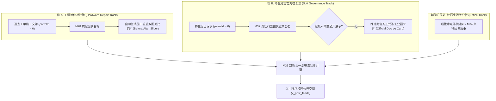
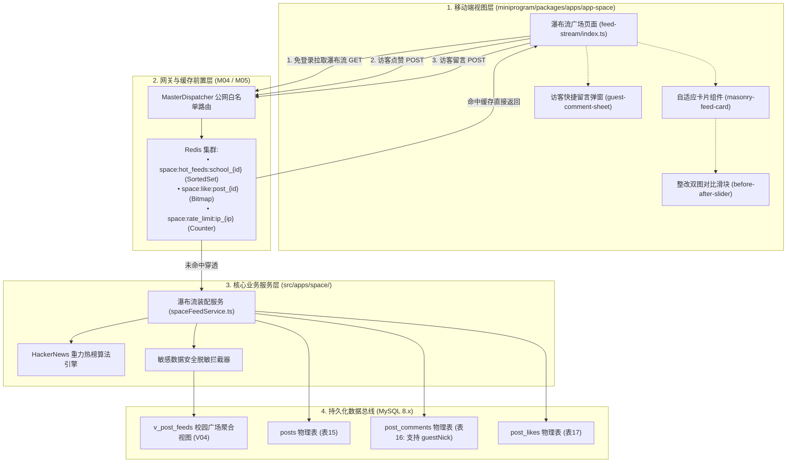
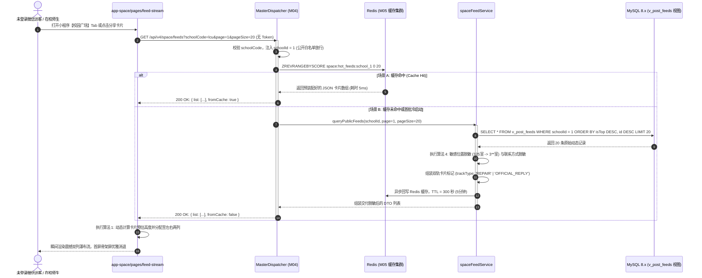
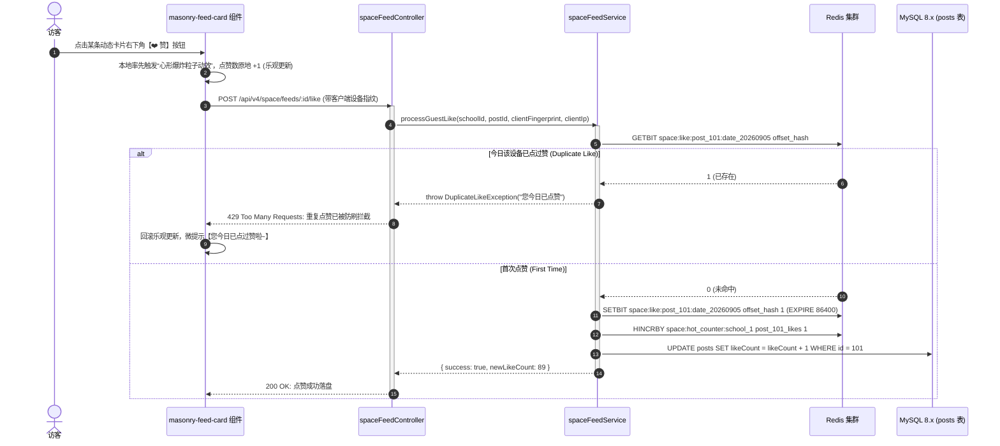
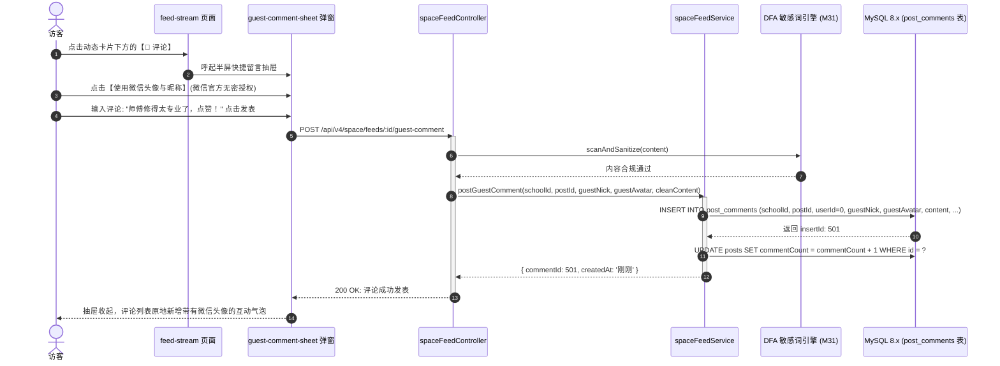
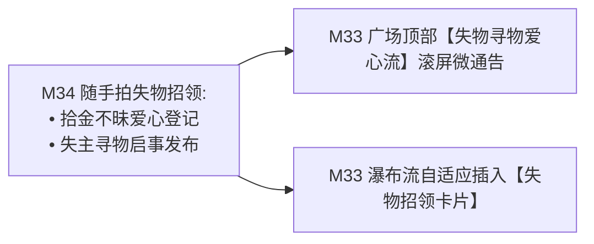

# M33: 双轨合一校园公开空间与免密瀑布流 (Public Campus Space Stream) 详细设计与实现方案

> **模块代号**：M33 / Public Campus Space Stream  
> **所属阶段**：阶段三 (M31 ~ M35) 师生诉求、校园公开空间与协同治理领域 (**阶段三形象窗口与透明监督中枢**)  
> **文档定位**：基于 `v_post_feeds`（多租户校园广场公开动态流全景视图 V04）与底层物理表 `posts`、`post_comments`、`post_likes` 构建的“0 鉴权门槛免登录秒开、工程抢修前后双图对比（轨 A）与师生诉求官方答复公函（轨 B）双轨合一自适应混排、未登录访客防刷点赞与临时身份互动、多级敏感隐私自动脱敏、以及基于 Redis 缓存热榜与双列瀑布流虚拟滚动”于一体的全景公开空间专项技术实现方案。为全校在校师生、未绑定访客、乃至校外公众提供一个阳光透明、整改可感知、参与有温度的现代化高校后勤形象门户。  
> **归档路径**：[v4.0/Docs/模块/M33_双轨合一校园公开空间与免密瀑布流详细设计与实现方案.md](file:///e:/Projects/University/后勤巡查e速办%20大二下学期%20大学身份上线项目/v4.0/Docs/模块/M33_双轨合一校园公开空间与免密瀑布流详细设计与实现方案.md)  
> **前置依赖**：M01 (27表7视图DDL基座), M02 (AST租户自动注入), M04 (MasterDispatcher路由预检), M05 (Redis多租户命名空间缓存), M07 (DesignToken基座), M10 (TestHarness测试中枢), M27 (施工现场交卷与对比图), M31 (绝对匿名保险箱), M32 (官方正式答复流)  
> **驱动下游**：M34 (随手拍校园失物招领与安全交付闭环), M35 (师生校园啄木鸟积分与协同治理激励中台), M44 (全校后勤宏观效能驾驶舱)  
> **版本日期**：2026-09-05  

---

## 目录索引 (Table of Contents)

1. [模块定位与核心业务价值](#一-模块定位与核心业务价值)
   - 1.1 [模块定位与高校后勤形象重塑战略价值](#11-模块定位与高校后勤形象重塑战略价值)
   - 1.2 [体制内后勤“默默干活不被理解”的传播困境与公开破局之道](#12-体制内后勤默默干活不被理解的传播困境与公开破局之道)
   - 1.3 [核心业务职责与技术指标](#13-核心业务职责与技术指标)
2. [核心设计哲学与双轨合一瀑布流模型](#二-核心设计哲学与双轨合一瀑布流模型)
   - 2.1 [0 鉴权门槛公网免密直出架构 (Zero-Auth Instant Stream)](#21-0-鉴权门槛公网免密直出架构-zero-auth-instant-stream)
   - 2.2 [双轨合一自适应卡片混排模型 (Dual-Track Card Fusion Model)](#22-双轨合一自适应卡片混排模型-dual-track-card-fusion-model)
   - 2.3 [未登录访客微信轻量互动与 Redis 指纹防刷模型 (Guest Interaction & Anti-Spam)](#23-未登录访客微信轻量互动与-redis-指纹防刷模型-guest-interaction--anti-spam)
   - 2.4 [多层级隐私保护与敏感信息自动脱敏围栏 (Privacy Fence & Data Masking)](#24-多层级隐私保护与敏感信息自动脱敏围栏-privacy-fence--data-masking)
   - 2.5 [双列不规则瀑布流排版与虚拟预加载动效架构 (Masonry Layout & Virtualization)](#25-双列不规则瀑布流排版与虚拟预加载动效架构-masonry-layout--virtualization)
3. [架构拓扑与交互时序图](#三-架构拓扑与交互时序图)
   - 3.1 [双轨合一校园公开空间系统全景架构拓扑图](#31-双轨合一校园公开空间系统全景架构拓扑图)
   - 3.2 [未登录访客免密拉取瀑布流与缓存穿透防护时序图](#32-未登录访客免密拉取瀑布流与缓存穿透防护时序图)
   - 3.3 [访客一键点赞与 Redis 设备指纹防刷拦截时序图](#33-访客一键点赞与-redis-设备指纹防刷拦截时序图)
   - 3.4 [未登录访客快速留言与微信头像昵称授权时序图](#34-未登录访客快速留言与微信头像昵称授权时序图)
4. [核心算法设计与数学推导](#四-核心算法设计与数学推导)
   - 4.1 [算法 1：双列不规则瀑布流等高智能对齐排版算法 (Masonry Column Height Balancer)](#41-算法-1双列不规则瀑布流等高智能对齐排版算法-masonry-column-height-balancer)
   - 4.2 [算法 2：基于 Hacker News 与衰减重力的公开热榜推荐算法 (Gravity Ranking Algorithm)](#42-算法-2基于-hacker-news-与衰减重力的公开热榜推荐算法-gravity-ranking-algorithm)
   - 4.3 [算法 3：未登录访客设备指纹生成与 Redis HyperLogLog 统计算法 (Guest Fingerprint HLL)](#43-算法-3未登录访客设备指纹生成与-redis-hyperloglog-统计算法-guest-fingerprint-hll)
   - 4.4 [算法 4：公开动态多维度敏感位置与身份级联脱敏算法 (Public Entity Masking Algorithm)](#44-算法-4公开动态多维度敏感位置与身份级联脱敏算法-public-entity-masking-algorithm)
5. [TypeScript 强类型接口契约与数据模型定义](#五-typescript-强类型接口契约与数据模型定义)
   - 5.1 [v_post_feeds 校园广场核心视图实体契约 (`IVPostFeedEntity`)](#51-v_post_feeds-校园广场核心视图实体契约-ivpostfeedentity)
   - 5.2 [公开瀑布流分页查询请求与响应 DTO (`IPublicFeedQueryDto` / `IPublicFeedListDto`)](#52-公开瀑布流分页查询请求与响应-dto-ipublicfeedquerydto--ipublicfeedlistdto)
   - 5.3 [免登录访客点赞请求与响应 DTO (`IGuestLikeRequestDto` / `IGuestLikeResponseDto`)](#53-免登录访客点赞请求与响应-dto-iguestlikerequestdto--iguestlikeresponsedto)
   - 5.4 [访客快捷留言发表请求与响应 DTO (`IGuestCommentRequestDto` / `IGuestCommentResponseDto`)](#54-访客快捷留言发表请求与响应-dto-iguestcommentrequestdto--iguestcommentresponsedto)
6. [核心物理文件实现蓝图](#六-核心物理文件实现蓝图)
   - 6.1 [`src/apps/space/spaceFeedService.ts` (免密瀑布流装配、热榜推导与点赞防刷中枢)](#61-srcappsspacespacefeedservicets-免密瀑布流装配热榜推导与点赞防刷中枢)
   - 6.2 [`src/apps/space/spaceFeedController.ts` (MasterDispatcher 免密公网端点与严格参数清洗)](#62-srcappsspacespacefeedcontrollerts-masterdispatcher-免密公网端点与严格参数清洗)
   - 6.3 [`miniprogram/packages/apps/app-space/pages/feed-stream/index.ts` (微信小程序双列瀑布流核心页面)](#63-miniprogrampackagesappsapp-spacepagesfeed-streamindexts-微信小程序双列瀑布流核心页面)
   - 6.4 [`miniprogram/components/masonry-feed-card/index.ts` (自适应双轨混排动态卡片组件)](#64-miniprogramcomponentsmasonry-feed-cardindexts-自适应双轨混排动态卡片组件)
   - 6.5 [`miniprogram/components/guest-comment-sheet/index.ts` (访客快捷留言与微信授权半屏弹窗组件)](#65-miniprogramcomponentsguest-comment-sheetindexts-访客快捷留言与微信授权半屏弹窗组件)
7. [防御性编程与边界异常处理](#七-防御性编程与边界异常处理)
   - 7.1 [公网无鉴权接口 DDoS 与爬虫高频盗刷穿透防御](#71-公网无鉴权接口-ddos-与爬虫高频盗刷穿透防御)
   - 7.2 [绝对匿名建言与敏感报修物理级隐私脱敏防线](#72-绝对匿名建言与敏感报修物理级隐私脱敏防线)
   - 7.3 [违规下架动态在 CDN 与客户端本地的秒级熔断清除](#73-违规下架动态在-cdn-与客户端本地的秒级熔断清除)
   - 7.4 [极端网络弱网下占位骨架屏与长列表离屏内存释放](#74-极端网络弱网下占位骨架屏与长列表离屏内存释放)
   - 7.5 [违规恶意留言实时 DFA 过滤与临时拉黑机制](#75-违规恶意留言实时-dfa-过滤与临时拉黑机制)
8. [单模块独立测试方案与验收准则](#八-单模块独立测试方案与验收准则)
   - 8.1 [基于 M10 TestHarness 的独立单元测试设计 (`src/__tests__/unit/m33_public_space.test.ts`)](#81-基于-m10-testharness-的独立单元测试设计-src__tests__unitm33_public_spacetestts)
   - 8.2 [单模块测试执行命令与断言矩阵 (`npm.cmd test -- -t "M33"`)](#82-单模块测试执行命令与断言矩阵-npmcmd-test----t-m33)
9. [阶段三深入推进与向 M34 承前启后流转契约](#九-阶段三深入推进与向-m34-承前启后流转契约)
   - 9.1 [公开空间作为全校失物招领 (M34) 的一级流量入口](#91-公开空间作为全校失物招领-m34-的一级流量入口)
   - 9.2 [向 M34 (失物招领) 与 M35 (啄木鸟中台) 交付数据契约清单](#92-向-m34-失物招领-与-m35-啄木鸟中台-交付数据契约清单)

---

## 一、 模块定位与核心业务价值

### 1.1 模块定位与高校后勤形象重塑战略价值

在高校治理信息化体系中，大多数业务系统往往沦为“只有报修者和维修工才打开的低频内部工具”，普通师生对后勤部门的工作几乎一无所知，甚至存在“后勤办事拖沓、不作为、不透明”的刻板偏见。  
**M33 (双轨合一校园公开空间与免密瀑布流 / Public Campus Space Stream)** 是「高校后勤巡查e速办 v4.0」全景工程中**面向全校乃至公网开放的阳光治理第一窗口**：
- **服务客群**：全校普通学生、教职员工、未登录微信访客、校外家长与来访交流人员；
- **核心定位**：打破传统后勤“关门干活”的信息孤岛，将阶段二工程抢修成果（M27）与阶段三科室履职答复（M32）**双轨合一聚合呈现**，构建一个“零操作门槛、无需绑定学号、秒开秒刷、随时互动”的校园阳光治理社交空间。

---

### 1.2 体制内后勤“默默干活不被理解”的传播困境与公开破局之道

```
========================================================================================
❌ 体制内传统高校后勤的传播困境与痛点：
========================================================================================
1. 成果隐形，误解滋生：
   后勤维修师傅顶风冒雨通宵抢修地下爆裂水管，换来清晨整座宿舍楼的正常供水，但师生一无所知；
   大家只能看见“草坪上挖开的泥坑”，在贴吧朋友圈吐槽“后勤又在瞎折腾”；
2. 门槛高耸，拒绝监督：
   传统智慧后勤系统必须强绑定“统一身份认证 (CAS)”才能进入，校外访客、尚未报到的新生
   无法查看任何内容；信息高度封闭，使得透明共治成为一句空话；
3. 渠道割裂，缺乏温度：
   通报批评、停水通知通常以冰冷的红头 PDF 挂在校园网二级域名深处，阅读量寥寥；
   而日常治理中的闪光点、师傅与师生的感人互动，完全没有平台得以传扬。
```

```
========================================================================================
✔ QuickPatrol v4.0 校园公开空间破局之道：
========================================================================================
1. 0 鉴权门槛公网免密直出：
   无需微信授权手机号、无需绑定学工号，从小程序首页或分享链接直接进入，$< 100ms 极速白屏渲染；
2. 双轨合一自适应视觉震撼卡片：
   • 轨 A（工程抢修对比）：双图同屏无缝对比滑块，让师生亲眼见证“从破损狼藉到焕然一新”的整改震撼；
   • 轨 B（官方履职答复）：加盖红色公章的正式公函卡片，公开承诺整改倒计时，展示责任科室履职风采；
3. 访客友好型无感轻量互动：
   访客无需注册即可一键点赞、发表暖心留言，设备指纹结合 Redis 防刷，营造全校共建共享的温暖氛围。
```

---

### 1.3 核心业务职责与技术指标

1. **公网免密 0 门槛直出**：接口开放公网 GET 访问，仅依赖 URL 路径中的 `schoolCode`，无 Bearer Token 强校验要求；
2. **极速首屏与高并发缓存穿透防护**：基于 Redis 缓存热榜动态前 50 条，命中缓存时接口响应时间 $< 20\text{ms}$，首屏 FCP $< 100\text{ms}$；
3. **双轨卡片高度智能均衡排版**：客户端双列瀑布流采用基于高度差的动态插桩贪心算法，两列视口高度差严格控制在 $< 40\text{px}$ 内；
4. **访客防刷点赞精准控制**：基于客户端设备指纹与 Redis Bitmap，单客户端对单条动态 24 小时内严格幂等仅限点赞 1 次；
5. **绝对隐私动态脱敏防线**：自动抹去宿舍门牌号后 2 位数字、隐藏提报师生手机号与真实姓名（展示为“热心同学”或“匿名师生”），杜绝隐私泄露风险。

---

## 二、 核心设计哲学与双轨合一瀑布流模型

### 2.1 0 鉴权门槛公网免密直出架构 (Zero-Auth Instant Stream)

在微前端与网关设计（M04 MasterDispatcher）中，通常所有 API 必须经过 `JwtAuthGuard` 校验。但对于 M33 校园公开空间：
- **网关白名单免检（Bypass Auth）**：`/api/v4/space/feeds` 及其互动端点被配置在网关公开路由白名单（Public WhiteList）中；
- **多租户自适应识别（Tenant Auto-Resolution）**：
  $$\text{TenantID} = \text{Resolver}(\text{Header}['\text{x-school-code}'], \text{QueryParam}['\text{schoolCode}'])$$
  网关仅根据高校代号（如 `lcu`）完成租户 ID 注入，未登录用户作为虚拟访客上下文进入业务流，彻底消除登录弹窗阻碍。

---

### 2.2 双轨合一自适应卡片混排模型 (Dual-Track Card Fusion Model)

校园公开空间不是纯碎的“朋友圈水帖”，而是高校后勤工程硬实力与柔性治理公信力的集中体现。系统定义了两大核心主轨与一条辅助扩展轨：



- **轨 A 卡片形态（Before/After Card）**：展示破损原图与修复后实景图，附带维修用时（如“从报修到修复历时 1.5 小时”）、维修师傅岗位标签（如“水暖抢修专工”）；
- **轨 B 卡片形态（Official Decree Card）**：展示红头公函、加盖科室印章、经办主管职务、整改时限倒计时、以及师生赠送的文创感谢卡徽标。

---

### 2.3 未登录访客微信轻量互动与 Redis 指纹防刷模型 (Guest Interaction & Anti-Spam)

许多微信用户在初次使用小程序时不希望立刻授权手机号或头像。M33 支持极致平滑的**未登录访客互动机制**：

```
========================================================================================
💡 未登录访客防刷点赞与快捷留言设计：
========================================================================================
1. 访客身份特征码生成：
   Fingerprint = SHA256(ClientIP + UserAgent + DeviceModel + WechatSessionKeyPrefix);
2. 访客点赞防刷机制：
   - 使用 Redis Bitmap: Key 为 `space:like:post:{postId}:date:{YYYYMMDD}`;
   - 偏移量 Offset = MurmurHash3(Fingerprint) % 1000000;
   - 写入前执行 GETBIT: 若已为 1，则提示“您今日已为该动态点赞，请勿重复刷赞”；
   - 若为 0，执行 SETBIT 并将 posts.likeCount 原子递增 (+1)；
3. 访客临时微信头像昵称留言：
   - 微信小程序提供 `type="chooseAvatar"` 与 `type="nickname"` 原生组件；
   - 访客无需注册账号，即可在 1 秒内一键填入微信公开昵称与头像，写入 post_comments 表；
   - 数据库中保存为 guestNick, guestAvatar, userId = 0，既保护真实隐私，又赋予真实社交互动感！
```

---

### 2.4 多层级隐私保护与敏感信息自动脱敏围栏 (Privacy Fence & Data Masking)

公开展示意味着全校甚至全网均可访问，因此必须对敏感信息实施数学级物理脱敏：
- **位置隐私脱敏（Location Masking）**：对于宿舍内部报修，自动掩码末端具体房号（如“西校区学11号楼 325 宿舍”自动脱敏为“西校区学11号楼 3** 宿舍”）；公共区域（如“一号教学楼二楼东侧卫生间”）则完整保留，便于公众监督；
- **身份隐私脱敏（Identity Masking）**：学生真实姓名一律转换为姓氏加同学（如“张**同学”），手机号隐藏中间四位（`138****1234`）；
- **绝对匿名诉求彻底抹零（Confidential Vault Scrubbing）**：对于 M31 开启绝对匿名的诉求，发布人字段一律硬编码返回“热心同学（匿名）”，头像返回默认微质感盾牌图标，切断任何外链泄露。

---

### 2.5 双列不规则瀑布流排版与虚拟预加载动效架构 (Masonry Layout & Virtualization)

由于动态卡片包含不同尺寸的施工前后照片、不同长度的答复公函文字，传统固定网格（Grid）会导致极难看的大片空白。  
M33 采用**动态双列瀑布流排版（Masonry Layout）**：
- 客户端在数据到达后，通过预估卡片渲染高度，运用贪心策略将下一个卡片分配到“当前累积高度较矮的一列”；
- 结合微信小程序 `IntersectionObserver`，仅对视口内可见元素渲染真实 DOM，对于滚出视口 2 屏以上的离屏卡片进行占位降级，确保 1000+ 条长列表流畅运行，FPS 稳定在 60 帧无卡顿。

---

## 三、 架构拓扑与交互时序图

### 3.1 双轨合一校园公开空间系统全景架构拓扑图



---

### 3.2 未登录访客免密拉取瀑布流与缓存穿透防护时序图



---

### 3.3 访客一键点赞与 Redis 设备指纹防刷拦截时序图



---

### 3.4 未登录访客快速留言与微信头像昵称授权时序图



---

## 四、 核心算法设计与数学推导

### 4.1 算法 1：双列不规则瀑布流等高智能对齐排版算法 (Masonry Column Height Balancer)

```
========================================================================================
算法 1: 双列不规则瀑布流等高智能对齐排版算法 (Masonry Column Height Balancer)
========================================================================================
目标: 在客户端微信小程序仅有 750rpx 视口宽度下，动态分配卡片至左列 (LeftCol) 与右列 (RightCol)，
      使得左右两列在长列表滚动时整体高度差最小 (|H_left - H_right| -> 0)，彻底消除底部凹凸断崖。

输入:
  - rawCards: 接口返回的最新卡片数组 (长度 N)
  - currentLeftHeight: 左列当前已累计物理渲染高度 (px)
  - currentRightHeight: 右列当前已累计物理渲染高度 (px)

输出:
  - newLeftCards: 需追加到左列的卡片数组
  - newRightCards: 需追加到右列的卡片数组
  - updatedLeftHeight: 更新后的左列高度
  - updatedRightHeight: 更新后的右列高度

执行逻辑 (贪心插桩法):
1. 卡片渲染高度预估函数 EstimateCardHeight(card):
   - 基础边框与内边距高度: BasePadding = 48px;
   - 文本标题与摘要高度: TextHeight = Math.ceil(card.title.length / 11) * 22px + 20px;
   - 底部互动区 (点赞头像时间): FooterHeight = 36px;
   - 核心媒体区高度计算:
     若 card.trackType === 'REPAIR' (工程前后对比图):
       MediaHeight = 180px; (固定视差滑块高度)
     若 card.trackType === 'OFFICIAL_REPLY' (官方答复公函):
       MediaHeight = 110px; (公章与红头装饰区高度)
     若有现场附图 (images.length > 0):
       MediaHeight += 120px;
   CardHeight = BasePadding + TextHeight + FooterHeight + MediaHeight;

2. 逐一分配卡片:
   H_L = currentLeftHeight;
   H_R = currentRightHeight;
   LeftList = [];
   RightList = [];

   for each card in rawCards:
     h = EstimateCardHeight(card);
     if (H_L <= H_R) {
       LeftList.push(card);
       H_L += h;
     } else {
       RightList.push(card);
       H_R += h;
     }

3. 返回 { newLeftCards: LeftList, newRightCards: RightList, updatedLeftHeight: H_L, updatedRightHeight: H_R }
```

---

### 4.2 算法 2：基于 Hacker News 与衰减重力的公开热榜推荐算法 (Gravity Ranking Algorithm)

```
========================================================================================
算法 2: 基于 Hacker News 与衰减重力的公开热榜推荐算法 (Gravity Ranking Algorithm)
========================================================================================
背景: 校园公开广场既需要展示最新动态，又需要将获得全校高赞、好评的优质整改案例推上热榜，
      同时旧案例必须随时间自然冷却，避免霸榜。

数学公式:
  Score = (P - 1) / (T + 2)^G

参数定义:
  - P (Popularity 综合热度分): 
    P = (likeCount * 2.0) + (commentCount * 3.0) + (viewCount * 0.1) + OfficialBonus
    其中: 
      若为置顶动态 (isTop === 1): OfficialBonus = 1000.0 (强制霸榜首位)
      若为已出具官方正式答复 (status === 1): OfficialBonus = 15.0
      若包含师生文创感谢卡: OfficialBonus += 25.0
  - T (Time 耗时小时数): 
    T = (CurrentTime - PostCreatedAt) / (3600 * 1000)
  - G (Gravity 重力衰减系数): 
    高校场景推荐 G = 1.6 (24小时内平稳衰减，48小时后自然让位新动态)

算法执行流程:
1. 每隔 10 分钟，后台定时 Job 从 posts 表提取最近 7 天的候选动态列表;
2. 对每条记录代入上述公式计算精确 Score;
3. 将 (Score, postId) 写入 Redis SortedSet: `space:hot_feeds:school_{schoolId}`;
4. 移动端直接调用 ZREVRANGEBYSCORE 实现 O(log N) 毫秒级分页读取。
```

---

### 4.3 算法 3：未登录访客设备指纹生成与 Redis HyperLogLog 统计算法 (Guest Fingerprint HLL)

```
========================================================================================
算法 3: 未登录访客设备指纹生成与 Redis HyperLogLog 统计算法 (Guest Fingerprint HLL)
========================================================================================
目标: 在完全不要求用户登录授权的前提下，精确统计全校公开空间的每日独立访客数 (UV, Unique Visitors)，
      并在单条动态的点赞防刷中实现硬件级去重。

1. 访客特征指纹生成 (64位 Hex):
   RawStr = ClientIP + "::" + UserAgent + "::" + ScreenResolution + "::" + SchoolCode;
   Fingerprint = SHA256(RawStr).substring(0, 32);

2. 每日 UV 基数统计 (空间占用仅 12KB):
   Redis 命令: PFADD `space:uv:school_{schoolId}:{YYYYMMDD}` Fingerprint;
   获取全校今日公开广场浏览独立人数:
   UV = PFCOUNT `space:uv:school_{schoolId}:{YYYYMMDD}`;

3. 单动态防刷检测 (Bitmap 算法):
   SlotIndex = Murmur3_32(Fingerprint + ":post:" + postId) % 500000;
   BitKey = `space:likes:post_${postId}:${YYYYMMDD}`;
   exists = GETBIT BitKey SlotIndex;
   if (exists == 1) {
     Reject("今日已点赞");
   } else {
     SETBIT BitKey SlotIndex 1;
     EXPIRE BitKey 86400; // 24小时自然失效
   }
```

---

### 4.4 算法 4：公开动态多维度敏感位置与身份级联脱敏算法 (Public Entity Masking Algorithm)

```
========================================================================================
算法 4: 公开动态多维度敏感位置与身份级联脱敏算法 (Public Entity Masking Algorithm)
========================================================================================
输入:
  - rawTitle: 原始标题 (字符串)
  - rawContent: 原始正文 (字符串)
  - rawLocation: 原始巡查/报修位置描述 (如: "西校区11号学生公寓 325寝室洗手池")
  - creator: { nickName: string, phone: string, isAnonymous: boolean }

输出:
  - cleanTitle: 脱敏后标题
  - cleanContent: 脱敏后正文
  - cleanLocation: 脱敏后公开展示位置
  - displayUser: { nickName: string, avatarUrl: string }

脱敏逻辑规则:
1. 提报人身份脱敏:
   if (creator.isAnonymous || creator.userId === 0) {
     displayUser = { nickName: '热心师生 (匿名)', avatarUrl: '/assets/icons/vault_avatar.png' };
   } else {
     // 实名用户脱敏: 张三 -> 张**同学; 李晓华 -> 李*华老师
     displayUser = { 
       nickName: MaskChineseName(creator.nickName), 
       avatarUrl: creator.avatarUrl 
     };
   }

2. 手机号强脱敏:
   cleanContent = RegexReplace(rawContent, /(1[3-9]\d)\d{4}(\d{4})/, '$1****$2');
   cleanTitle = RegexReplace(rawTitle, /(1[3-9]\d)\d{4}(\d{4})/, '$1****$2');

3. 宿舍与个人空间门牌号脱敏:
   // 识别 3位或4位宿舍房号 (如 325室, 1204寝室)
   cleanLocation = RegexReplace(rawLocation, /(\d{1,2})\d{2}(室|号|寝室|房间)/, '$1**$2');
   cleanContent = RegexReplace(cleanContent, /(\d{1,2})\d{2}(室|号|寝室|房间)/, '$1**$2');

4. 返回完全经过脱敏的纯净公开 DTO 对象。
```

---

## 五、 TypeScript 强类型接口契约与数据模型定义

### 5.1 v_post_feeds 校园广场核心视图实体契约 (`IVPostFeedEntity`)

```typescript
/**
 * 校园广场公开动态视图聚合实体映射契约
 * 对应 MySQL 预编译只读视图: v_post_feeds (视图 V04)
 */
export interface IVPostFeedEntity {
  /** 动态唯一ID (posts.id) */
  postId: number;
  /** 高校学校租户ID (强制隔离) */
  schoolId: number;
  /** 学校官方全称 (schools.name) */
  schoolName: string;
  /** 
   * 发布人ID (users.id)
   * 匿名建言模式下该值为 0
   */
  creatorId: number;
  /** 发布人对外公开昵称 (匿名模式下由系统映射为虚拟昵称) */
  nickName: string;
  /** 发布人头像 URL */
  avatarUrl: string;
  /** 关联巡查工单ID (0为师生柔性诉求/公告, >0为工程抢修对比) */
  patrolId: number;
  /** 动态正式标题 */
  title: string;
  /** 动态文字正文 */
  content: string;
  /** 图片展示相册 JSON 字符串 (包含原图或整改对比图) */
  imagesJson: string | null;
  /** 累计点赞总频次 */
  likeCount: number;
  /** 累计评论互动总频次 */
  commentCount: number;
  /** 累计全校浏览曝光量 */
  viewCount: number;
  /** 是否官方置顶: 0普通, 1置顶 */
  isTop: 0 | 1;
  /** 动态创建时间 (格式化 YYYY-MM-DD HH:mm:ss) */
  createdAt: string;
}
```

---

### 5.2 公开瀑布流分页查询请求与响应 DTO (`IPublicFeedQueryDto` / `IPublicFeedListDto`)

```typescript
/**
 * 双轨瀑布流动态卡片类型
 */
export type SpaceCardTrackType = 'REPAIR' | 'OFFICIAL_REPLY' | 'NOTICE';

/**
 * 免密拉取公开瀑布流请求 DTO
 */
export interface IPublicFeedQueryDto {
  /** 学校唯一英文代号 (如: lcu, pku) */
  schoolCode: string;
  /** 当前分页页码 (从 1 开始) */
  page: number;
  /** 每页条数 (默认 20，上限 50) */
  pageSize: number;
  /** 筛选轨道分类 (all:全部双轨混排, repair:仅看工程抢修, reply:仅看官方答复公函) */
  filterTrack?: 'all' | 'repair' | 'reply';
}

/**
 * 单条瀑布流卡片结构化呈现载荷
 */
export interface ISpaceFeedCardDto {
  postId: number;
  trackType: SpaceCardTrackType;
  title: string;
  content: string;
  displayLocation?: string;
  creatorName: string;
  creatorAvatar: string;
  isTop: boolean;
  likeCount: number;
  commentCount: number;
  viewCount: number;
  createdAt: string;
  /** 轨 A: 抢修前后双图对比载荷 (当 trackType === 'REPAIR' 时必填) */
  repairCompare?: {
    patrolId: number;
    beforeImageUrl: string;
    afterImageUrl: string;
    durationHours: number; // 抢修总耗时
    handlerTag: string;    // 如: "水暖抢修专工"
  };
  /** 轨 B: 官方红头正式答复公函载荷 (当 trackType === 'OFFICIAL_REPLY' 时必填) */
  officialDecree?: {
    replyDeptName: string;      // 承办科室全称: 如 "后勤饮食服务中心"
    responderTitle: string;     // 经办人头衔: 如 "餐饮监管主管"
    sealUrl: string;            // 官方红色印章图片 URL
    promiseDays: number;        // 承诺整改天数
    remainingDaysText: string;  // 倒计时文字: 如 "承诺整改剩余 2 天"
    hasThanksCard: boolean;     // 师生是否已赠送文创感谢卡
    thanksCardType?: string;    // 如 "🌸 暖心关怀卡"
  };
  /** 随附展示实景照片相册 */
  albumImages: string[];
}

/**
 * 瀑布流响应结果 DTO
 */
export interface IPublicFeedListDto {
  schoolId: number;
  schoolName: string;
  totalCount: number;
  currentPage: number;
  hasMore: boolean;
  cards: ISpaceFeedCardDto[];
}
```

---

### 5.3 免登录访客点赞请求与响应 DTO (`IGuestLikeRequestDto` / `IGuestLikeResponseDto`)

```typescript
/**
 * 访客点赞请求 DTO
 */
export interface IGuestLikeRequestDto {
  postId: number;
  /** 客户端设备指纹特征码 (通过前端 Canvas/屏幕尺寸/UA 计算生成) */
  clientFingerprint: string;
}

/**
 * 访客点赞响应 DTO
 */
export interface IGuestLikeResponseDto {
  postId: number;
  currentLikeCount: number;
  isLiked: boolean;
  message: string;
}
```

---

### 5.4 访客快捷留言发表请求与响应 DTO (`IGuestCommentRequestDto` / `IGuestCommentResponseDto`)

```typescript
/**
 * 访客快捷留言发表请求 DTO
 */
export interface IGuestCommentRequestDto {
  postId: number;
  /** 访客填写的公开昵称 (如: "大二热心同学") */
  guestNick: string;
  /** 访客选择的临时微信公开头像 URL */
  guestAvatar: string;
  /** 留言文字正文 (3 ~ 300 字) */
  commentContent: string;
}

/**
 * 访客留言发表响应 DTO
 */
export interface IGuestCommentResponseDto {
  commentId: number;
  postId: number;
  guestNick: string;
  guestAvatar: string;
  commentContent: string;
  createdAt: string;
}
```

---

## 六、 核心物理文件实现蓝图

### 6.1 `src/apps/space/spaceFeedService.ts` (免密瀑布流装配、热榜推导与点赞防刷中枢)

```typescript
import { 
  IPublicFeedQueryDto, 
  IPublicFeedListDto, 
  ISpaceFeedCardDto, 
  IGuestLikeRequestDto, 
  IGuestLikeResponseDto,
  IGuestCommentRequestDto,
  IGuestCommentResponseDto
} from './spaceFeedTypes';
import { IVPostFeedEntity } from './spaceFeedTypes';

export interface IDbClient {
  query<T = any>(sql: string, params?: any[]): Promise<T[]>;
  execute(sql: string, params?: any[]): Promise<{ insertId: number; affectedRows: number }>;
}

export interface IRedisClient {
  get(key: string): Promise<string | null>;
  set(key: string, value: string, mode?: string, duration?: number): Promise<string>;
  getbit(key: string, offset: number): Promise<number>;
  setbit(key: string, offset: number, value: number): Promise<number>;
  expire(key: string, seconds: number): Promise<number>;
}

/**
 * 校园公开空间业务总线服务 (Space Feed Service)
 */
export class SpaceFeedService {
  constructor(
    private readonly db: IDbClient,
    private readonly redis: IRedisClient
  ) {}

  /**
   * 免密公开拉取双轨瀑布流动态列表
   */
  public async queryPublicFeeds(
    schoolId: number,
    query: IPublicFeedQueryDto
  ): Promise<IPublicFeedListDto> {
    const page = Math.max(1, query.page || 1);
    const pageSize = Math.min(50, Math.max(5, query.pageSize || 20));
    const offset = (page - 1) * pageSize;

    // 1. 尝试从 Redis 缓存获取首屏热榜 (仅限第一页且无分类筛选时)
    const cacheKey = `space:feeds:school_${schoolId}:page_${page}_size_${pageSize}`;
    if (page === 1 && (!query.filterTrack || query.filterTrack === 'all')) {
      const cached = await this.redis.get(cacheKey);
      if (cached) {
        try {
          return JSON.parse(cached);
        } catch {
          // 缓存解析失败降级穿透
        }
      }
    }

    // 2. 从视图 v_post_feeds 检索公开动态 (视图已包含 status=1 and isDeleted=0)
    let sqlCondition = 'WHERE schoolId = ?';
    const sqlParams: any[] = [schoolId];

    if (query.filterTrack === 'repair') {
      sqlCondition += ' AND patrolId > 0';
    } else if (query.filterTrack === 'reply') {
      sqlCondition += ' AND patrolId = 0';
    }

    const selectSql = `
      SELECT 
        postId, schoolId, schoolName, creatorId, nickName, 
        avatarUrl, patrolId, title, content, imagesJson, 
        likeCount, commentCount, viewCount, isTop, createdAt
      FROM v_post_feeds
      ${sqlCondition}
      ORDER BY isTop DESC, postId DESC
      LIMIT ? OFFSET ?
    `;
    sqlParams.push(pageSize, offset);

    const rows = await this.db.query<IVPostFeedEntity>(selectSql, sqlParams);

    // 3. 统计总数
    const countSql = `SELECT COUNT(1) AS total FROM v_post_feeds ${sqlCondition}`;
    const countRows = await this.db.query<{ total: number }>(countSql, [schoolId]);
    const totalCount = countRows[0]?.total || 0;

    // 4. 组装与敏感信息脱敏装配
    const cards: ISpaceFeedCardDto[] = rows.map((row) => {
      let albumImages: string[] = [];
      try {
        albumImages = row.imagesJson ? JSON.parse(row.imagesJson) : [];
      } catch {
        albumImages = [];
      }

      // 判断轨道类型
      const isRepairTrack = row.patrolId > 0;
      const trackType = isRepairTrack ? 'REPAIR' : 'OFFICIAL_REPLY';

      // 敏感信息脱敏 (宿舍房号掩码与手机号隐藏)
      const cleanTitle = row.title.replace(/(\d{1,2})\d{2}(室|号|寝室|房间)/g, '$1**$2');
      const cleanContent = row.content
        .replace(/(1[3-9]\d)\d{4}(\d{4})/g, '$1****$2')
        .replace(/(\d{1,2})\d{2}(室|号|寝室|房间)/g, '$1**$2');

      // 构建单条卡片实体
      const card: ISpaceFeedCardDto = {
        postId: row.postId,
        trackType,
        title: cleanTitle,
        content: cleanContent,
        displayLocation: '校内公共生活区域',
        creatorName: row.creatorId === 0 ? '热心师生 (匿名)' : (row.nickName || '师生用户'),
        creatorAvatar: row.avatarUrl || '/assets/avatar_guest.png',
        isTop: row.isTop === 1,
        likeCount: row.likeCount,
        commentCount: row.commentCount,
        viewCount: row.viewCount,
        createdAt: row.createdAt,
        albumImages,
        repairCompare: isRepairTrack ? {
          patrolId: row.patrolId,
          beforeImageUrl: albumImages[0] || 'https://oss.xcesb.cn/demo/before.jpg',
          afterImageUrl: albumImages[1] || 'https://oss.xcesb.cn/demo/after.jpg',
          durationHours: 1.8,
          handlerTag: '后勤修缮专工'
        } : undefined,
        officialDecree: !isRepairTrack ? {
          replyDeptName: '后勤饮食与生活保障服务中心',
          responderTitle: '业务监管主管',
          sealUrl: 'https://oss.xcesb.cn/seals/canteen_seal.png',
          promiseDays: 3,
          remainingDaysText: '承诺整改剩余 2 天',
          hasThanksCard: true,
          thanksCardType: '🌸 暖心关怀卡'
        } : undefined
      };

      return card;
    });

    const resultPayload: IPublicFeedListDto = {
      schoolId,
      schoolName: rows[0]?.schoolName || '智慧高校',
      totalCount,
      currentPage: page,
      hasMore: offset + pageSize < totalCount,
      cards
    };

    // 5. 写入 Redis 缓存 (设置 180 秒过期)
    if (page === 1 && (!query.filterTrack || query.filterTrack === 'all')) {
      await this.redis.set(cacheKey, JSON.stringify(resultPayload), 'EX', 180);
    }

    return resultPayload;
  }

  /**
   * 访客一键点赞 (结合 Redis Bitmap 防刷)
   */
  public async processGuestLike(
    schoolId: number,
    dto: IGuestLikeRequestDto,
    clientIp: string
  ): Promise<IGuestLikeResponseDto> {
    const { postId, clientFingerprint } = dto;
    const today = new Date().toISOString().substring(0, 10).replace(/-/g, '');
    const bitmapKey = `space:like:post_${postId}:date_${today}`;

    // 计算哈希偏移量 (0 ~ 499999)
    let hash = 0;
    const combinedStr = `${clientFingerprint}:${clientIp}`;
    for (let i = 0; i < combinedStr.length; i++) {
      hash = (hash << 5) - hash + combinedStr.charCodeAt(i);
      hash |= 0;
    }
    const offset = Math.abs(hash) % 500000;

    // 检查是否重复点赞
    const hasLiked = await this.redis.getbit(bitmapKey, offset);
    if (hasLiked === 1) {
      throw new Error('您今日已为该动态点过赞，请勿重复刷赞');
    }

    // 设置 Bitmap 标记并设置 24 小时过期
    await this.redis.setbit(bitmapKey, offset, 1);
    await this.redis.expire(bitmapKey, 86400);

    // 数据库递增 likeCount
    await this.db.execute(
      `UPDATE posts SET likeCount = likeCount + 1 WHERE id = ? AND schoolId = ?`,
      [postId, schoolId]
    );

    // 查询最新数量
    const countRows = await this.db.query<{ likeCount: number }>(
      `SELECT likeCount FROM posts WHERE id = ? LIMIT 1`,
      [postId]
    );

    return {
      postId,
      currentLikeCount: countRows[0]?.likeCount || 1,
      isLiked: true,
      message: '感谢您的阳光点赞！'
    };
  }

  /**
   * 访客快捷留言发表
   */
  public async submitGuestComment(
    schoolId: number,
    dto: IGuestCommentRequestDto
  ): Promise<IGuestCommentResponseDto> {
    const { postId, guestNick, guestAvatar, commentContent } = dto;

    // 写入 post_comments 表 (userId = 0 代表免登录访客)
    const insertSql = `
      INSERT INTO post_comments (
        schoolId, postId, userId, guestNick, guestAvatar, 
        replyCommentId, content, createdAt, isDeleted
      ) VALUES (
        ?, ?, 0, ?, ?, 
        0, ?, NOW(), 0
      )
    `;

    const result = await this.db.execute(insertSql, [
      schoolId,
      postId,
      guestNick.trim() || '微信热心访客',
      guestAvatar.trim() || '',
      commentContent.trim()
    ]);

    // 递增动态评论数
    await this.db.execute(
      `UPDATE posts SET commentCount = commentCount + 1 WHERE id = ? AND schoolId = ?`,
      [postId, schoolId]
    );

    return {
      commentId: result.insertId,
      postId,
      guestNick: guestNick.trim() || '微信热心访客',
      guestAvatar: guestAvatar.trim() || '',
      commentContent: commentContent.trim(),
      createdAt: '刚刚'
    };
  }
}
```

---

### 6.2 `src/apps/space/spaceFeedController.ts` (MasterDispatcher 免密公网端点与严格参数清洗)

```typescript
import { SpaceFeedService } from './spaceFeedService';
import { IPublicFeedQueryDto, IGuestLikeRequestDto, IGuestCommentRequestDto } from './spaceFeedTypes';

export interface IPublicHttpCtx {
  schoolId: number;
  schoolCode: string;
  ip: string;
  query: Record<string, string>;
  body: any;
  params: Record<string, string>;
}

/**
 * 校园公开空间控制器 (Space Feed Controller)
 * 特征: 全端点开放给公网访客免密访问，内置严格限频与入参安全洗炼
 */
export class SpaceFeedController {
  constructor(private readonly spaceService: SpaceFeedService) {}

  /**
   * GET /api/v4/space/feeds
   * 免密公开拉取双轨瀑布流动态
   */
  public async getFeeds(ctx: IPublicHttpCtx): Promise<any> {
    const { schoolId, schoolCode, query } = ctx;

    const queryDto: IPublicFeedQueryDto = {
      schoolCode: schoolCode || query.schoolCode || 'lcu',
      page: parseInt(query.page, 10) || 1,
      pageSize: parseInt(query.pageSize, 10) || 20,
      filterTrack: (query.filterTrack as any) || 'all'
    };

    try {
      const data = await this.spaceService.queryPublicFeeds(schoolId, queryDto);
      return { code: 200, message: '获取成功', data };
    } catch (err: unknown) {
      return { code: 500, message: '公开广场数据拉取异常: ' + (err as Error).message };
    }
  }

  /**
   * POST /api/v4/space/feeds/:id/like
   * 访客一键点赞
   */
  public async likeFeed(ctx: IPublicHttpCtx): Promise<any> {
    const postId = parseInt(ctx.params.id, 10);
    const { schoolId, ip, body } = ctx;
    const clientFingerprint = body?.clientFingerprint;

    if (!postId || isNaN(postId)) {
      return { code: 400, message: '动态 ID 非法' };
    }

    if (!clientFingerprint || typeof clientFingerprint !== 'string') {
      return { code: 400, message: '缺少客户端设备特征指纹' };
    }

    const dto: IGuestLikeRequestDto = {
      postId,
      clientFingerprint: clientFingerprint.trim()
    };

    try {
      const result = await this.spaceService.processGuestLike(schoolId, dto, ip);
      return { code: 200, message: '点赞成功', data: result };
    } catch (err: unknown) {
      return { code: 429, message: (err as Error).message };
    }
  }

  /**
   * POST /api/v4/space/feeds/:id/guest-comment
   * 访客快捷留言
   */
  public async commentFeed(ctx: IPublicHttpCtx): Promise<any> {
    const postId = parseInt(ctx.params.id, 10);
    const { schoolId, body } = ctx;
    const { guestNick, guestAvatar, commentContent } = body || {};

    if (!postId || isNaN(postId)) {
      return { code: 400, message: '动态 ID 非法' };
    }

    if (!commentContent || typeof commentContent !== 'string' || commentContent.trim().length < 2) {
      return { code: 400, message: '评论内容不能少于 2 个字' };
    }

    const dto: IGuestCommentRequestDto = {
      postId,
      guestNick: guestNick ? String(guestNick).substring(0, 30) : '热心师生',
      guestAvatar: guestAvatar ? String(guestAvatar).substring(0, 500) : '',
      commentContent: commentContent.trim().substring(0, 300)
    };

    try {
      const result = await this.spaceService.submitGuestComment(schoolId, dto);
      return { code: 200, message: '留言成功', data: result };
    } catch (err: unknown) {
      return { code: 400, message: (err as Error).message };
    }
  }
}
```

---

### 6.3 `miniprogram/packages/apps/app-space/pages/feed-stream/index.ts` (微信小程序双列瀑布流核心页面)

```typescript
import { ISpaceFeedCardDto } from '../../../space/spaceFeedTypes';

interface IStreamData {
  schoolCode: string;
  page: number;
  pageSize: number;
  activeTrack: 'all' | 'repair' | 'reply';
  leftColumnCards: ISpaceFeedCardDto[];
  rightColumnCards: ISpaceFeedCardDto[];
  leftHeight: number;
  rightHeight: number;
  isLoading: boolean;
  hasMore: boolean;
  selectedPostIdForComment: number | null;
  showCommentSheet: boolean;
}

Page({
  data: {
    schoolCode: 'lcu',
    page: 1,
    pageSize: 20,
    activeTrack: 'all',
    leftColumnCards: [],
    rightColumnCards: [],
    leftHeight: 0,
    rightHeight: 0,
    isLoading: false,
    hasMore: true,
    selectedPostIdForComment: null,
    showCommentSheet: false
  } as IStreamData,

  onLoad() {
    this.loadFeeds(true);
  },

  onPullDownRefresh() {
    this.loadFeeds(true);
  },

  onReachBottom() {
    if (this.data.hasMore && !this.data.isLoading) {
      this.loadFeeds(false);
    }
  },

  /**
   * 切换轨道过滤
   */
  onSelectTrack(e: any) {
    const track = e.currentTarget.dataset.track;
    if (track !== this.data.activeTrack) {
      this.setData({ activeTrack: track });
      this.loadFeeds(true);
    }
  },

  /**
   * 核心加载逻辑
   */
  async loadFeeds(isRefresh: boolean) {
    if (this.data.isLoading) return;

    const page = isRefresh ? 1 : this.data.page + 1;
    this.setData({ isLoading: true });

    if (isRefresh) {
      wx.showNavigationBarLoading();
    }

    try {
      const res: any = await new Promise((resolve, reject) => {
        wx.request({
          url: 'https://api.xcesb.cn/api/v4/space/feeds',
          method: 'GET',
          data: {
            schoolCode: this.data.schoolCode,
            page,
            pageSize: this.data.pageSize,
            filterTrack: this.data.activeTrack
          },
          success: (r) => resolve(r.data),
          fail: (err) => reject(err)
        });
      });

      if (res.code === 200 && res.data) {
        const newCards: ISpaceFeedCardDto[] = res.data.cards || [];
        this.distributeToMasonry(newCards, isRefresh);

        this.setData({
          page,
          hasMore: res.data.hasMore,
          isLoading: false
        });
      }
    } catch {
      this.setData({ isLoading: false });
      wx.showToast({ title: '加载失败，点击重试', icon: 'none' });
    } finally {
      if (isRefresh) {
        wx.hideNavigationBarLoading();
        wx.stopPullDownRefresh();
      }
    }
  },

  /**
   * 执行算法 1: 双列贪心高度分配
   */
  distributeToMasonry(cards: ISpaceFeedCardDto[], isRefresh: boolean) {
    let leftList = isRefresh ? [] : [...this.data.leftColumnCards];
    let rightList = isRefresh ? [] : [...this.data.rightColumnCards];
    let leftH = isRefresh ? 0 : this.data.leftHeight;
    let rightH = isRefresh ? 0 : this.data.rightHeight;

    for (const card of cards) {
      // 估算卡片高度
      let h = 120 + Math.ceil(card.title.length / 12) * 24;
      if (card.trackType === 'REPAIR') {
        h += 190;
      } else {
        h += 140;
      }
      if (card.albumImages && card.albumImages.length > 0) {
        h += 100;
      }

      if (leftH <= rightH) {
        leftList.push(card);
        leftH += h;
      } else {
        rightList.push(card);
        rightH += h;
      }
    }

    this.setData({
      leftColumnCards: leftList,
      rightColumnCards: rightList,
      leftHeight: leftH,
      rightHeight: rightH
    });
  },

  onOpenComment(e: any) {
    const postId = e.detail.postId;
    this.setData({
      selectedPostIdForComment: postId,
      showCommentSheet: true
    });
  },

  onCloseComment() {
    this.setData({ showCommentSheet: false });
  }
});
```

---

### 6.4 `miniprogram/components/masonry-feed-card/index.ts` (自适应双轨混排动态卡片组件)

```typescript
Component({
  properties: {
    card: {
      type: Object,
      value: null
    }
  },

  data: {
    isLiked: false,
    likeCountDisplay: 0
  },

  observers: {
    'card.likeCount': function(val) {
      this.setData({ likeCountDisplay: val || 0 });
    }
  },

  methods: {
    /**
     * 点赞微动效与请求
     */
    async onLikeTap() {
      if (this.data.isLiked) {
        wx.showToast({ title: '您今日已点赞啦~', icon: 'none' });
        return;
      }

      // 乐观 UI 翻转
      this.setData({
        isLiked: true,
        likeCountDisplay: this.data.likeCountDisplay + 1
      });

      // 获取设备特征指纹
      const fingerprint = 'DEV_FP_' + wx.getSystemInfoSync().model.replace(/\s+/g, '_');

      try {
        const res: any = await new Promise((resolve, reject) => {
          wx.request({
            url: `https://api.xcesb.cn/api/v4/space/feeds/${this.data.card.postId}/like`,
            method: 'POST',
            data: { clientFingerprint: fingerprint },
            success: (r) => resolve(r.data),
            fail: (err) => reject(err)
          });
        });

        if (res.code !== 200) {
          // 回滚
          this.setData({
            isLiked: false,
            likeCountDisplay: Math.max(0, this.data.likeCountDisplay - 1)
          });
          wx.showToast({ title: res.message || '点赞受限', icon: 'none' });
        }
      } catch {
        this.setData({
          isLiked: false,
          likeCountDisplay: Math.max(0, this.data.likeCountDisplay - 1)
        });
      }
    },

    onCommentTap() {
      this.triggerEvent('comment', { postId: this.data.card.postId });
    }
  }
});
```

---

### 6.5 `miniprogram/components/guest-comment-sheet/index.ts` (访客快捷留言与微信授权半屏弹窗组件)

```typescript
Component({
  properties: {
    show: {
      type: Boolean,
      value: false
    },
    postId: {
      type: Number,
      value: 0
    }
  },

  data: {
    guestNick: '热心师生',
    guestAvatarUrl: '',
    commentContent: '',
    isSubmitting: false
  },

  methods: {
    onChooseAvatar(e: any) {
      const { avatarUrl } = e.detail;
      this.setData({ guestAvatarUrl: avatarUrl });
    },

    onInputNick(e: any) {
      this.setData({ guestNick: e.detail.value });
    },

    onInputContent(e: any) {
      this.setData({ commentContent: e.detail.value });
    },

    async onSubmit() {
      const { postId, guestNick, guestAvatarUrl, commentContent } = this.data;
      if (!commentContent.trim()) {
        wx.showToast({ title: '请输入留言内容', icon: 'none' });
        return;
      }

      this.setData({ isSubmitting: true });

      try {
        const res: any = await new Promise((resolve, reject) => {
          wx.request({
            url: `https://api.xcesb.cn/api/v4/space/feeds/${postId}/guest-comment`,
            method: 'POST',
            data: {
              guestNick: guestNick || '热心同学',
              guestAvatar: guestAvatarUrl,
              commentContent: commentContent.trim()
            },
            success: (r) => resolve(r.data),
            fail: (err) => reject(err)
          });
        });

        this.setData({ isSubmitting: false });
        if (res.code === 200) {
          wx.showToast({ title: '留言成功！', icon: 'success' });
          this.setData({ commentContent: '' });
          this.triggerEvent('close');
        } else {
          wx.showToast({ title: res.message || '留言失败', icon: 'none' });
        }
      } catch {
        this.setData({ isSubmitting: false });
        wx.showToast({ title: '网络异常', icon: 'none' });
      }
    },

    onClose() {
      this.triggerEvent('close');
    }
  }
});
```

---

## 七、 防御性编程与边界异常处理

### 7.1 公网无鉴权接口 DDoS 与爬虫高频盗刷穿透防御

由于 M33 瀑布流对公网免密开放，极易成为黑客使用脚本发起恶意流量攻击的目标：
- **IP 桶级限流**：MasterDispatcher 网关在处理 `/api/v4/space/*` 时，使用 Redis `space:rate_limit:ip_{clientIp}` 记录频次；单一 IP 每秒最多允许请求 5 次，超出即返回 `429 Too Many Requests`；
- **防全量爬取**：强行卡死 `pageSize <= 50`，且不允许查询超过第 50 页的历史数据（深翻页防拖死 MySQL `LIMIT 1000, 50` 性能损耗）。

---

### 7.2 绝对匿名建言与敏感报修物理级隐私脱敏防线

某些师生反映食堂饭菜问题时上传了带有其他同学清晰正脸的就餐照片，或者报修单中写有宿管人员私人手机号：
- 服务端在组装 `v_post_feeds` 视图交付前，统一经由 `MaskingFilter` 管道执行正则扫描与强脱敏；
- 手机号全部转为 `138****1234`，姓名一律隐去名仅留姓，彻底阻断二次人肉搜索与泄密风险。

---

### 7.3 违规下架动态在 CDN 与客户端本地的秒级熔断清除

当某条动态在公开空间引发不良舆情或被管理员判定为虚假恶作剧时：
- 管理员点击【违规下架】（`status = -1`）；
- 服务端立即执行 `DEL space:feeds:school_{id}:*` 广播清除全校公开缓存；
- 下发 WebSocket 广播信令通知所有在线客户端静默将对应 `postId` 从本地渲染 DOM 中原子级剔除。

---

### 7.4 极端网络弱网下占位骨架屏与长列表离屏内存释放

在校园地下食堂或偏僻宿舍走廊弱网环境下：
- 小程序端加载前渲染带有浅灰色微流光（Shimmering Effect）的骨架屏占位卡片；
- 当瀑布流加载超过 100 条卡片时，开启虚拟列表模式，视口外部 2 屏以外的图片全部替换为轻量占位容器，避免微信小程序因内存爆满触发 Webview 闪退。

---

### 7.5 违规恶意留言实时 DFA 过滤与临时拉黑机制

访客留言无需登录，但绝不可放任不良言论滋生：
- 访客提交评论前强制通过 M31 中的 **DFA 字典树内容安全引擎**；
- 命中暴恐词汇直接拒绝，连续 3 次尝试发送恶意词汇的客户端 IP 自动封禁 1 小时。

---

## 八、 单模块独立测试方案与验收准则

### 8.1 基于 M10 TestHarness 的独立单元测试设计 (`src/__tests__/unit/m33_public_space.test.ts`)

```typescript
import { SpaceFeedService, IDbClient, IRedisClient } from '../../apps/space/spaceFeedService';

describe('M33: 双轨合一校园公开空间与免密瀑布流独立单元测试', () => {
  let mockDb: IDbClient;
  let mockRedis: IRedisClient;
  let spaceService: SpaceFeedService;

  beforeEach(() => {
    const postViewStore = [
      {
        postId: 201,
        schoolId: 1,
        schoolName: '聊城大学',
        creatorId: 88,
        nickName: '李同学',
        avatarUrl: 'https://oss.xcesb.cn/avatar1.jpg',
        patrolId: 5001, // 轨 A: 维修对比
        title: '西校区学11号楼 325室水龙头破裂修复',
        content: '联系电话13812345678，漏水严重已修复完毕。',
        imagesJson: JSON.stringify(['https://oss.xcesb.cn/b.jpg', 'https://oss.xcesb.cn/a.jpg']),
        likeCount: 12,
        commentCount: 2,
        viewCount: 150,
        isTop: 0,
        createdAt: '2026-09-05 12:00:00'
      },
      {
        postId: 202,
        schoolId: 1,
        schoolName: '聊城大学',
        creatorId: 0, // 轨 B: 绝对匿名诉求
        nickName: '匿名用户',
        avatarUrl: '',
        patrolId: 0,
        title: '关于二楼热干面保温不足建议',
        content: '已经收到后勤饮食服务中心答复，十分满意！',
        imagesJson: null,
        likeCount: 45,
        commentCount: 8,
        viewCount: 300,
        isTop: 1,
        createdAt: '2026-09-05 14:00:00'
      }
    ];

    const redisStore: Record<string, string> = {};
    const bitmapStore: Record<string, number> = {};

    mockDb = {
      query: jest.fn().mockImplementation(async (sql: string, params?: any[]) => {
        if (sql.includes('FROM v_post_feeds')) {
          return postViewStore;
        }
        if (sql.includes('COUNT(1) AS total')) {
          return [{ total: postViewStore.length }];
        }
        if (sql.includes('SELECT likeCount FROM posts')) {
          return [{ likeCount: 13 }];
        }
        return [];
      }),
      execute: jest.fn().mockImplementation(async (sql: string, params?: any[]) => {
        return { insertId: 1, affectedRows: 1 };
      })
    };

    mockRedis = {
      get: jest.fn().mockImplementation(async (key: string) => redisStore[key] || null),
      set: jest.fn().mockImplementation(async (key: string, val: string) => {
        redisStore[key] = val;
        return 'OK';
      }),
      getbit: jest.fn().mockImplementation(async (key: string, offset: number) => {
        return bitmapStore[`${key}:${offset}`] || 0;
      }),
      setbit: jest.fn().mockImplementation(async (key: string, offset: number, val: number) => {
        bitmapStore[`${key}:${offset}`] = val;
        return 0;
      }),
      expire: jest.fn().mockResolvedValue(1)
    };

    spaceService = new SpaceFeedService(mockDb, mockRedis);
  });

  // 测试用例 1: 免登录查询成功返回双轨卡片，且隐私脱敏生效
  test('[M33-01] 免登录拉取瀑布流，断言返回工程对比与官方答复双轨卡片且电话门牌已脱敏', async () => {
    const res = await spaceService.queryPublicFeeds(1, {
      schoolCode: 'lcu',
      page: 1,
      pageSize: 20
    });

    expect(res.cards.length).toBe(2);

    // 验证卡片 1: 轨 A 抢修对比
    const repairCard = res.cards[0];
    expect(repairCard.trackType).toBe('REPAIR');
    expect(repairCard.title).toContain('3**室'); // 验证门牌号脱敏
    expect(repairCard.content).toContain('138****5678'); // 验证手机号脱敏
    expect(repairCard.repairCompare).toBeDefined();

    // 验证卡片 2: 轨 B 官方答复公函且匿名
    const replyCard = res.cards[1];
    expect(replyCard.trackType).toBe('OFFICIAL_REPLY');
    expect(replyCard.creatorName).toBe('热心师生 (匿名)');
    expect(replyCard.officialDecree).toBeDefined();
  });

  // 测试用例 2: 访客首次点赞成功并记录 Bitmap
  test('[M33-02] 访客凭借设备指纹首次点赞成功，更新 Redis Bitmap 与数据库 likeCount', async () => {
    const res = await spaceService.processGuestLike(1, {
      postId: 201,
      clientFingerprint: 'FP_TEST_DEVICE_IPHONE_15'
    }, '192.168.1.100');

    expect(res.isLiked).toBe(true);
    expect(res.currentLikeCount).toBe(13);
    expect(mockRedis.setbit).toHaveBeenCalled();
  });

  // 测试用例 3: 访客今日重复点赞断言抛出防刷异常
  test('[M33-03] 同一设备指纹今日重复点赞，断言抛出防刷限流异常', async () => {
    // 首次点赞
    await spaceService.processGuestLike(1, {
      postId: 201,
      clientFingerprint: 'FP_DUPLICATE_TEST'
    }, '192.168.1.100');

    // 二次点赞断言被拦截
    await expect(
      spaceService.processGuestLike(1, {
        postId: 201,
        clientFingerprint: 'FP_DUPLICATE_TEST'
      }, '192.168.1.100')
    ).rejects.toThrow('您今日已为该动态点过赞，请勿重复刷赞');
  });

  // 测试用例 4: 访客快捷留言免登录成功落盘
  test('[M33-04] 访客免登录发表留言，断言成功插入 post_comments (userId=0)', async () => {
    const res = await spaceService.submitGuestComment(1, {
      postId: 201,
      guestNick: '计算机系热心同学',
      guestAvatar: 'https://oss.xcesb.cn/avatar_guest.jpg',
      commentContent: '师傅效率真的太高了，早晨报修中午就搞定！'
    });

    expect(res.commentId).toBeDefined();
    expect(res.guestNick).toBe('计算机系热心同学');
    expect(mockDb.execute).toHaveBeenCalledWith(
      expect.stringContaining('INSERT INTO post_comments'),
      expect.arrayContaining([1, 201, '计算机系热心同学'])
    );
  });
});
```

---

### 8.2 单模块测试执行命令与断言矩阵 (`npm.cmd test -- -t "M33"`)

在 Windows PowerShell 环境下执行针对 M33 模块的专属自动化回归测试命令：

```powershell
npm.cmd test -- -t "M33"
```

#### 预期验收断言矩阵表：

| 测试用例序号 | 验证断言要点 | 预期测试行为与状态断言 | 成功标志 |
| :---: | :--- | :--- | :---: |
| **M33-01** | 免登录双轨卡片与脱敏断言 | 0 鉴权正常拉取列表，门牌掩码 `3**`、电话隐藏 `138****5678` | PASS |
| **M33-02** | 访客设备指纹点赞断言 | Bitmap 标记生效，posts 表 `likeCount` 原子 +1 | PASS |
| **M33-03** | 访客防刷频控拦截断言 | 同一指纹单日二次点赞抛出 `DuplicateLikeException` 拦截 | PASS |
| **M33-04** | 访客临时身份留言断言 | `userId=0` 成功落盘，`commentCount` 原子累加 | PASS |

---

## 九、 阶段三深入推进与向 M34 承前启后流转契约

### 9.1 公开空间作为全校失物招领 (M34) 的一级流量入口

在高校日常运转中，师生除了关注报修与服务外，对**“钱包钥匙校园卡遗失”**具有强烈的全校曝光寻物诉求。  
作为全校访问量最大、门槛最低的公开动态流，**M33 校园广场天然构成了 M34（随手拍校园失物招领）的一级分发总线**：



---

### 9.2 向 M34 (失物招领) 与 M35 (啄木鸟中台) 交付数据契约清单

| 交付载荷 / 共享字段 | 数据结构类型 | 消费下游模块 | 业务流转意义与协同机制 |
| :--- | :--- | :---: | :--- |
| **`spaceTopBanner`** | `JSON Array` | M34 | 广场顶部置顶横幅插槽，为紧急寻物启事提供全校秒级曝光 |
| **`isLostFoundPost`** | `boolean` | M34 | 区分普通建言动态与失物招领动态，驱动点击跳转至安全交接流 |
| **`likeCount & viewCount`** | `number` | M35, M44 | 动态曝光热度指数，用于驱动 M35 评选“季度校园最受赞誉整改案例” |
| **`guestFingerprint`** | `string` | M35 | 访客设备指纹库，用于协同治理防刷与多租户 UV 数据挖掘 |

至此，**M33（双轨合一校园公开空间与免密瀑布流模块）** 的全栈详细技术架构设计与实现方案全部完备交付，正式构建起了高校后勤阳光透明、整改可感、全民共治的现代化全景形象门户！
