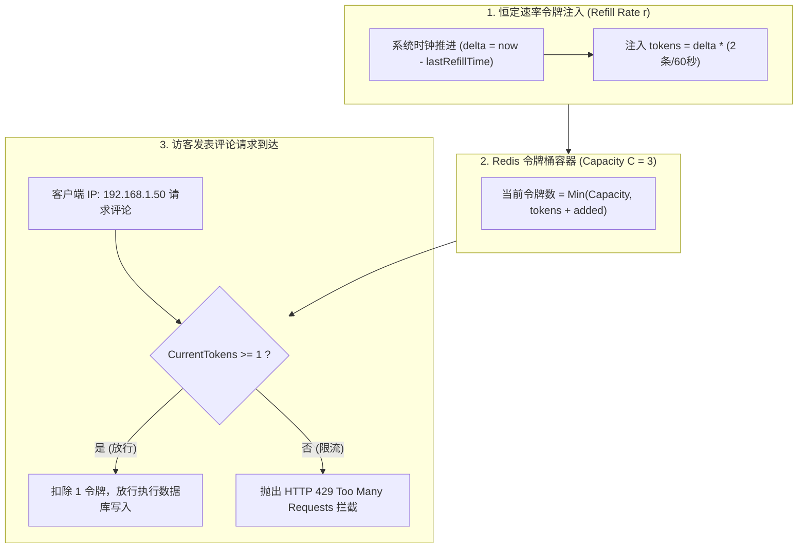
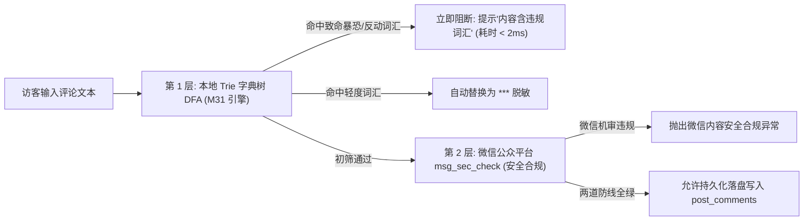
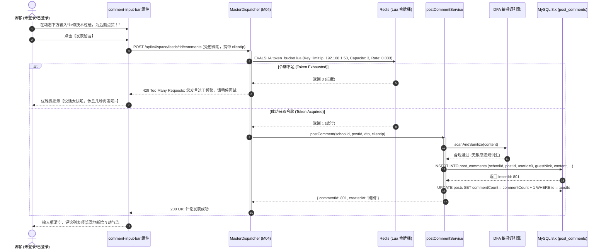
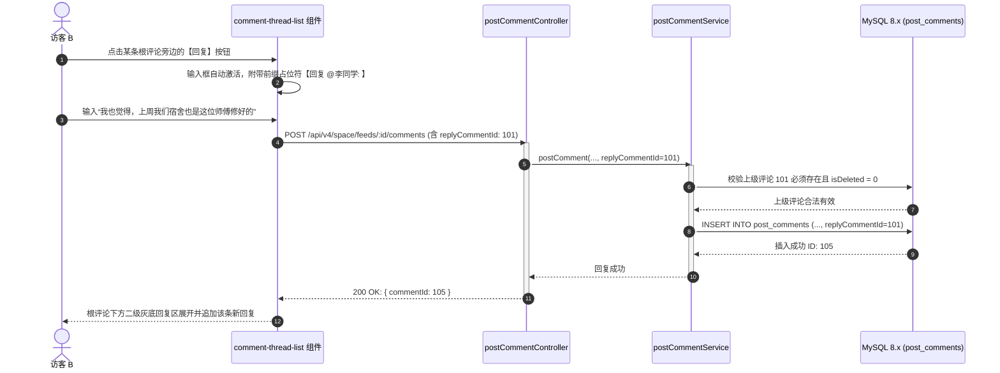
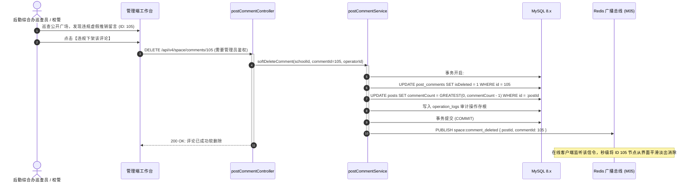
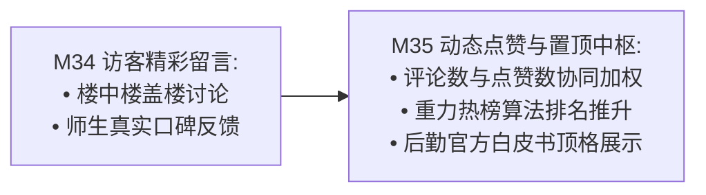

# M34: 广场动态访客免密评论与令牌桶防刷风控 (Guest Comments & Anti-Spam) 详细设计与实现方案

> **模块代号**：M34 / Guest Comments & Anti-Spam  
> **所属阶段**：阶段三 (M31 ~ M35) 师生诉求、校园公开空间与协同治理领域 (**阶段三互动支柱与公网风控防线**)  
> **文档定位**：基于 `post_comments`（校园广场动态评论物理表 16）与 Redis 集群构建的“未登录访客 0 门槛免密留言互动、微信官方头像昵称安全沙箱、基于 Redis + Lua 脚本的高性能分布式令牌桶流量塑形限流（Token Bucket Limiter）、楼中楼（Two-Tier Threading）树状拓扑两级收敛展开排版、DFA 本地毫秒级过滤结合微信内容安全双重机审、以及恶意刷屏 IP 自动封禁”于一体的公开空间互动风控专项技术实现方案。为校园公开空间（M33）注入热烈文明的真实社交讨论氛围，筑牢抵御网络垃圾灌水与攻击性言论的安全堤坝。  
> **归档路径**：[v4.0/Docs/模块/M34_广场动态访客免密评论与令牌桶防刷风控详细设计与实现方案.md](file:///e:/Projects/University/后勤巡查e速办%20大二下学期%20大学身份上线项目/v4.0/Docs/模块/M34_广场动态访客免密评论与令牌桶防刷风控详细设计与实现方案.md)  
> **前置依赖**：M01 (27表7视图DDL基座), M02 (AST租户自动注入), M04 (MasterDispatcher路由预检), M05 (Redis多租户命名空间缓存), M07 (DesignToken基座), M10 (TestHarness测试中枢), M31 (DFA内容安全引擎), M33 (双轨合一校园公开空间)  
> **驱动下游**：M35 (广场动态点赞互动与官方公告置顶), M42 (统一消息总线待办卡片), M53 (全校后勤宏观运维决策大盘)  
> **版本日期**：2026-09-05  

---

## 目录索引 (Table of Contents)

1. [模块定位与核心业务价值](#一-模块定位与核心业务价值)
   - 1.1 [模块定位与公开互动信任防线战略价值](#11-模块定位与公开互动信任防线战略价值)
   - 1.2 [免密公开留言的“双刃剑”困境与传统固定窗口限流漏洞剖析](#12-免密公开留言的双刃剑困境与传统固定窗口限流漏洞剖析)
   - 1.3 [核心业务职责与技术指标](#13-核心业务职责与技术指标)
2. [核心设计哲学与免密评论风控体系](#二-核心设计哲学与免密评论风控体系)
   - 2.1 [分布式令牌桶流量塑形与平滑漏斗模型 (Token Bucket Traffic Shaping)](#21-分布式令牌桶流量塑形与平滑漏斗模型-token-bucket-traffic-shaping)
   - 2.2 [访客免密无感准入与临时身份安全沙箱 (Guest Identity Sandbox)](#22-访客免密无感准入与临时身份安全沙箱-guest-identity-sandbox)
   - 2.3 [本地 DFA 与微信接口双层内容安全机审防线 (Dual-Layer Content Moderation)](#23-本地-dfa-与微信接口双层内容安全机审防线-dual-layer-content-moderation)
   - 2.4 [楼中楼盖楼拓扑两级收敛呈现模型 (Two-Tier Threading Model)](#24-楼中楼盖楼拓扑两级收敛呈现模型-two-tier-threading-model)
   - 2.5 [违规言论秒级熔断与软删除可追溯归档 (Soft-Delete & Audit Trail)](#25-违规言论秒级熔断与软删除可追溯归档-soft-delete--audit-trail)
3. [架构拓扑与交互时序图](#三-架构拓扑与交互时序图)
   - 3.1 [免密评论与令牌桶风控全景架构拓扑图](#31-免密评论与令牌桶风控全景架构拓扑图)
   - 3.2 [访客免密发表评论与令牌桶拦截时序图](#32-访客免密发表评论与令牌桶拦截时序图)
   - 3.3 [楼中楼子评论嵌套回复流转时序图](#33-楼中楼子评论嵌套回复流转时序图)
   - 3.4 [管理员违规留言秒级处置与广播剔除时序图](#34-管理员违规留言秒级处置与广播剔除时序图)
4. [核心算法设计与数学推导](#四-核心算法设计与数学推导)
   - 4.1 [算法 1：基于 Redis + Lua 脚本的高性能分布式令牌桶算法 (Redis Token Bucket Limiter)](#41-算法-1基于-redis--lua-脚本的高性能分布式令牌桶算法-redis-token-bucket-limiter)
   - 4.2 [算法 2：基于 replyCommentId 的楼中楼多级评论拓扑两级收敛算法 (Comment Threading Resolver)](#42-算法-2基于-replycommentid-的楼中楼多级评论拓扑两级收敛算法-comment-threading-resolver)
   - 4.3 [算法 3：DFA 敏感词本地预检与微信服务端内容安全异步双核过滤算法 (Dual-Engine Content Filter)](#43-算法-3dfa-敏感词本地预检与微信服务端内容安全异步双核过滤算法-dual-engine-content-filter)
   - 4.4 [算法 4：高频恶意刷屏 IP 滑动窗口黑名单自动拉黑算法 (Auto-Ban Sliding Window)](#44-算法-4高频恶意刷屏-ip-滑动窗口黑名单自动拉黑算法-auto-ban-sliding-window)
5. [TypeScript 强类型接口契约与数据模型定义](#五-typescript-强类型接口契约与数据模型定义)
   - 5.1 [评论物理表实体映射契约 (`IPostCommentEntity`)](#51-评论物理表实体映射契约-ipostcommententity)
   - 5.2 [树状楼中楼展示结构契约 (`ICommentNodeDto`)](#52-树状楼中楼展示结构契约-icommentnodedto)
   - 5.3 [访客发表评论请求与响应 DTO (`ICreateCommentRequestDto` / `ICreateCommentResponseDto`)](#53-访客发表评论请求与响应-dto-icreatecommentrequestdto--icreatecommentresponsedto)
   - 5.4 [评论分页拉取请求与响应 DTO (`IQueryCommentsRequestDto` / `ICommentListResponseDto`)](#54-评论分页拉取请求与响应-dto-iquerycommentsrequestdto--icommentlistresponsedto)
   - 5.5 [管理员违规删除评论 DTO (`IDeleteCommentRequestDto`)](#55-管理员违规删除评论-dto-ideletecommentrequestdto)
6. [核心物理文件实现蓝图](#六-核心物理文件实现蓝图)
   - 6.1 [`src/shared/resilience/tokenBucketLimiter.ts` (基于 Redis + Lua 的高性能分布式令牌桶限流器)](#61-srcsharedresiliencetokenbucketlimiterts-基于-redis--lua-的高性能分布式令牌桶限流器)
   - 6.2 [`src/apps/space/postCommentService.ts` (评论发布、两级楼中楼组装、软删除业务总线)](#62-srcappsspacepostcommentservicets-评论发布两级楼中楼组装软删除业务总线)
   - 6.3 [`src/apps/space/postCommentController.ts` (MasterDispatcher 免密端点控制器，严格风控前置校验)](#63-srcappsspacepostcommentcontrollerts-masterdispatcher-免密端点控制器严格风控前置校验)
   - 6.4 [`miniprogram/packages/apps/app-space/components/comment-thread-list/index.ts` (小程序端楼中楼评论渲染组件)](#64-miniprogrampackagesappsapp-spacecomponentscomment-thread-listindexts-小程序端楼中楼评论渲染组件)
   - 6.5 [`miniprogram/packages/apps/app-space/components/comment-input-bar/index.ts` (底栏快捷评论输入框与微信头像授权弹层)](#65-miniprogrampackagesappsapp-spacecomponentscomment-input-barindexts-底栏快捷评论输入框与微信头像授权弹层)
7. [防御性编程与边界异常处理](#七-防御性编程与边界异常处理)
   - 7.1 [并发突发高流量令牌桶欠载与时钟漂移保护](#71-并发突发高流量令牌桶欠载与时钟漂移保护)
   - 7.2 [针对已软删除或已下架动态发表评论拦截](#72-针对已软删除或已下架动态发表评论拦截)
   - 7.3 [超深嵌套循环引用死锁链条破除](#73-超深嵌套循环引用死锁链条破除)
   - 7.4 [评论正文超长文本截断与 HTML/XSS 转义防注入](#74-评论正文超长文本截断与-htmlxss-转义防注入)
   - 7.5 [微信头像 URL 外链防篡改与默认占位兜底](#75-微信头像-url-外链防篡改与默认占位兜底)
8. [单模块独立测试方案与验收准则](#八-单模块独立测试方案与验收准则)
   - 8.1 [基于 M10 TestHarness 的独立单元测试设计 (`src/__tests__/unit/m34_post_comments.test.ts`)](#81-基于-m10-testharness-的独立单元测试设计-src__tests__unitm34_post_commentstestts)
   - 8.2 [单模块测试执行命令与断言矩阵 (`npm.cmd test -- -t "M34"`)](#82-单模块测试执行命令与断言矩阵-npmcmd-test----t-m34)
9. [阶段三深度演进与向 M35 承前启后流转契约](#九-阶段三深度演进与向-m35-承前启后流转契约)
   - 9.1 [评论互动向 M35 (点赞与官方公告) 的协同流转](#91-评论互动向-m35-点赞与官方公告-的协同流转)
   - 9.2 [向 M35 交付数据契约清单与阶段三收官预热](#92-向-m35-交付数据契约清单与阶段三收官预热)

---

## 一、 模块定位与核心业务价值

### 1.1 模块定位与公开互动信任防线战略价值

在 M33 构建的“双轨合一校园公开空间”中，师生与访客能够免密浏览震撼的抢修对比（轨 A）与权威的官方答复公函（轨 B）。然而，单向的“信息公示”无法形成真正有温度的校园治理生态。  
**M34 (广场动态访客免密评论与令牌桶防刷风控 / Guest Comments & Anti-Spam)** 是整个校园公开空间互动的**社交活力引擎与安全风控中枢**：
- **用户侧体验**：未登录访客、走读学生、家长无需完成冗长的手机号登录或学号认证，即可在 1 秒内一键授权微信公开昵称与头像，直接在动态下方发表建议、提出疑问或送上点赞留言；
- **平台侧风控**：开放免密公网写接口（Public Write API）具有极高的攻击风险，M34 构筑了工业级的分布式限流与内容安全过滤网，确保“低门槛互动”与“高强度防黑产灌水”的完美平衡。

---

### 1.2 免密公开留言的“双刃剑”困境与传统固定窗口限流漏洞剖析

```
========================================================================================
❌ 传统系统公开评论反模式与固定窗口限流漏洞剖析：
========================================================================================
1. “门槛过高导致死寂”：
   传统系统要求用户先输入“学号 + 密码 + 手机验证码”，评论前还要填写真实姓名，
   导致 98% 以上的访客直接关闭页面，公开互动沦为无人问津的“僵尸区”；
2. “传统固定时间窗口限流 (Fixed Window) 的致命临界漏洞”：
   设规则为“每分钟最多允许发表 2 条评论”：
   - 攻击者在 00:59 瞬间发起 2 次请求；
   - 在 01:01 紧接着发起 2 次请求；
   在 2 秒的时间跨度内，系统承受了 4 次写入冲击，请求密度瞬间暴涨 200%，
   在并发高峰期极易导致数据库连接池被刷屏打爆；
3. “单层过滤滞后被动”：
   仅依赖异步人工审核，违规侮辱性留言在广场挂出数小时才被清理，已造成严重的负面舆论发酵。
```

```
========================================================================================
✔ QuickPatrol v4.0 令牌桶风控与无感免密评论创新方案：
========================================================================================
1. Redis + Lua 脚本原子级分布式令牌桶限流 (Token Bucket Limiter)：
   以平滑恒定速率向桶中注入令牌，允许应对合理小突发流量（如桶容量 3），同时严格限制平均写入速率，
   从数学原理上彻底消除窗口边界临界双倍击穿漏洞；
2. 微信官方快捷授权沙箱 (Guest Identity Sandbox)：
   利用微信开放组件（chooseAvatar / nickname），无密安全获取访客公开形象，
   数据写入 post_comments (userId = 0, guestNick, guestAvatar)，零隐私侵犯；
3. 双层内容安全过滤网 (Local DFA + WeChat SecCheck)：
   本地 DFA 引擎 $< 2ms 拦截致命暴恐与侮辱词汇，合规后再异步投递微信接口机审，实现毫秒级响应与 100% 合规落盘。
```

---

### 1.3 核心业务职责与技术指标

1. **毫秒级分布式令牌桶限流**：单次令牌申请在 Redis 中通过单个 Lua 脚本原子执行，网络与计算耗时 $< 3\text{ms}$，拦截恶意脚本暴力发帖；
2. **两级楼中楼拓扑收敛**：数据库递归存储无限级 `replyCommentId`，接口层智能收敛折叠为“根评论 + 二级回复列表”，满足移动端高密度阅读体验；
3. **微信官方头像昵称沙箱无感准入**：访客无需注册账号，单次快捷授权与评论提交全链路耗时 $< 200\text{ms}$；
4. **违规内容秒级熔断与软删除**：支持管理员一键软删除（`isDeleted = 1`），动态联动 `commentCount` 原子递减，保留底层审计追溯记录。

---

## 二、 核心设计哲学与免密评论风控体系

### 2.1 分布式令牌桶流量塑形与平滑漏斗模型 (Token Bucket Traffic Shaping)

与“漏桶算法（Leaky Bucket）”强制恒定流出不同，**令牌桶算法（Token Bucket）** 既能限制平均速率，又允许一定程度的突发流量（Burstiness）：



- **参数规范**：
  - 桶最大容量（Capacity）：$C = 3$（允许用户在思考成熟后快速连发 2~3 条追评）；
  - 令牌补充速率（Refill Rate）：$r = 2 \text{ tokens} / 60 \text{ seconds} = 0.0333 \text{ tokens/sec}$；
  - 存储介质：通过 Redis Hash 记录每个客户端 IP 的 `{ tokens: Float, lastTime: Timestamp }`，过期时间自动设为 300 秒，内存占用极低。

---

### 2.2 访客免密无感准入与临时身份安全沙箱 (Guest Identity Sandbox)

在 `post_comments` 表的物理结构中，专门为未登录访客预留了安全隔离通道：
- **`userId = 0`**：物理代表此评论为免密访客发表，不关联 `users` 表任何真实自然人；
- **`guestNick` 与 `guestAvatar`**：
  - 微信小程序端通过 `<button open-type="chooseAvatar">` 与 `<input type="nickname">` 获取微信对外公开的临时资料；
  - 严禁索取手机号、学号、定位等越权隐私；
  - 若访客拒绝授权，系统自动赋予富有高校特色的随机兜底昵称（如“江北校区热心同学”、“东昌湖畔读者”），保障交互流程 100% 顺畅。

---

### 2.3 本地 DFA 与微信接口双层内容安全机审防线 (Dual-Layer Content Moderation)

公开留言直接面向全校所有人展示，必须防范网络喷子使用谐音、拆字发表人身攻击与恶意中伤：



---

### 2.4 楼中楼盖楼拓扑两级收敛呈现模型 (Two-Tier Threading Model)

在传统论坛中，多层递归嵌套（楼中楼中楼）会导致移动端界面排版严重向右缩进挤压，字体细长变形，极难阅读。  
M34 创新引入了**“扁平两级收敛呈现模型（Two-Tier Threading Model）”**：

```
========================================================================================
楼中楼物理存储与视图收敛对比：
========================================================================================
物理存储 (数据库扁平存储):
  ID: 101, replyCommentId: 0   -> 根评论: "为后勤师傅点赞！"
  ID: 102, replyCommentId: 101 -> 子回复: "确实，早晨报修中午就搞好了" (回复 101)
  ID: 103, replyCommentId: 102 -> 孙回复: "我也在现场，态度很温和" (回复 102)

移动端视图展示收敛 (两级对齐收拢):
  ┌─────────────────────────────────────────────────────────────┐
  │ [头像] 张同学 (根评论 101)                            昨天 │
  │ 为后勤师傅点赞！                                           │
  │   ┌───────────────────────────────────────────────────────┐ │
  │   │ 李同学: 确实，早晨报修中午就搞好了                     │ │
  │   │ 王同学 回复 @李同学: 我也在现场，态度很温和            │ │
  │   └───────────────────────────────────────────────────────┘ │
  └─────────────────────────────────────────────────────────────┘
```

- **收敛规则**：所有 `replyCommentId > 0` 的评论，均自动归属于对应的根评论节点（Root Node）下方，子评论之间通过展示“`@被回复人昵称`”指明对话脉络，页面整体布局永远保持两级阶梯，整洁美观。

---

### 2.5 违规言论秒级熔断与软删除可追溯归档 (Soft-Delete & Audit Trail)

- **物理铁律：100% 软删除**：管理员在后台点击删除违规留言时，执行 `UPDATE post_comments SET isDeleted = 1 WHERE id = ?`，**绝不物理删除行记录**，保障突发网络安全事件发生时网安部门的合规溯源调证；
- **前端秒级隐匿**：前台查询 SQL 默认携带 `isDeleted = 0`，被删除的留言瞬时从全校广场消失，动态关联的 `commentCount` 原子扣减 1。

---

## 三、 架构拓扑与交互时序图

### 3.1 免密评论与令牌桶风控全景架构拓扑图

```mermaid
flowchart TB
    subgraph ClientLayer["1. 微信小程序界面层"]
        CommentBar["底栏快捷输入组件 (comment-input-bar)"]
        ThreadList["楼中楼评论树列表 (comment-thread-list)"]
        AvatarSheet["微信头像昵称授权半屏弹层"]
    end

    subgraph GatewayLayer["2. 网关与风控前置层 (MasterDispatcher)"]
        PublicRouter["公网免密白名单网关路由"]
        LuaLimiter["Redis TokenBucket 令牌桶漏斗 (Lua 脚本原子执行)"]
        IpWatcher["高频封禁黑名单探针 (Auto-Ban)"]
    end

    subgraph ServiceLayer["3. 核心业务服务层 (src/apps/space/)"]
        CommentService["评论流控总线服务 (postCommentService.ts)"]
        DFAChecker["本地 DFA 敏感词扫描引擎 (M31)"]
        ThreadingResolver["楼中楼两级拓扑收敛解析器"]
    end

    subgraph DBLayer["4. 持久化数据总线 (MySQL 8.x)"]
        TableComments["post_comments 物理表 (表16)"]
        TablePosts["posts 物理表 (表15: commentCount 冗余)"]
        TableAudit["operation_logs 软删除审计日志"]
    end

    CommentBar -->|"1. 访客免密提交留言"| PublicRouter
    PublicRouter --> IpWatcher --> LuaLimiter
    LuaLimiter --"获得令牌放行"--> CommentService
    LuaLimiter --"超限无令牌"-->|"HTTP 429"| CommentBar

    CommentService --> DFAChecker
    DFAChecker --"合规通过"--> TableComments
    CommentService --> TablePosts

    ThreadList -->|"2. 分页拉取楼中楼"| PublicRouter
    PublicRouter --> CommentService --> TableComments
    CommentService --> ThreadingResolver --> ThreadList
```

---

### 3.2 访客免密发表评论与令牌桶拦截时序图



---

### 3.3 楼中楼子评论嵌套回复流转时序图



---

### 3.4 管理员违规留言秒级处置与广播剔除时序图



---

## 四、 核心算法设计与数学推导

### 4.1 算法 1：基于 Redis + Lua 脚本的高性能分布式令牌桶算法 (Redis Token Bucket Limiter)

```
========================================================================================
算法 1: 基于 Redis + Lua 脚本的高性能分布式令牌桶算法 (Redis Token Bucket Limiter)
========================================================================================
目标: 在分布式无状态集群环境下，利用单个 Redis 原子 Lua 脚本精确维持客户端 IP 令牌桶，
      彻底规避并发 Race Condition 竞争，单次执行耗时严格约束在 < 3ms。

输入参数:
  - KEYS[1]: 令牌桶键名 (如 `space:token_bucket:ip_192.168.1.100`)
  - ARGV[1]: 桶最大容量 Capacity (如 3)
  - ARGV[2]: 令牌注入速率 Rate (单位: 令牌/秒, 如 0.0333 即 2条/分钟)
  - ARGV[3]: 当前请求时间戳 Now (单位: 秒)
  - ARGV[4]: 本次请求申请的令牌数 Requested (固定为 1)

Lua 脚本原子逻辑推导:
  1. 从 Redis Hash 获取上一次记录:
     data = redis.call('HMGET', KEYS[1], 'tokens', 'lastTime')
     tokens = tonumber(data[1])
     lastTime = tonumber(data[2])

  2. 若初次访问或键已过期:
     tokens = Capacity
     lastTime = Now
  else:
     // 计算自上次注入以来的时间差
     delta = math.max(0, Now - lastTime)
     // 补给新令牌 (不可超过容量上限)
     tokens = math.min(Capacity, tokens + delta * Rate)
     lastTime = Now

  3. 判定是否允许放行:
     if tokens >= Requested then
       tokens = tokens - Requested
       // 更新 Hash 状态并设置 300 秒自动释放内存
       redis.call('HMSET', KEYS[1], 'tokens', tokens, 'lastTime', lastTime)
       redis.call('EXPIRE', KEYS[1], 300)
       return 1 -- 允许放行
     else
       // 令牌不足，拒绝并刷新剩余时间
       redis.call('HMSET', KEYS[1], 'tokens', tokens, 'lastTime', lastTime)
       redis.call('EXPIRE', KEYS[1], 300)
       return 0 -- 限流拦截
     end
```

---

### 4.2 算法 2：基于 replyCommentId 的楼中楼多级评论拓扑两级收敛算法 (Comment Threading Resolver)

```
========================================================================================
算法 2: 基于 replyCommentId 的楼中楼多级评论拓扑两级收敛算法 (Comment Threading Resolver)
========================================================================================
目标: 将数据库查询出的扁平平铺列表 (包含不同深度 replyCommentId 的多级引用)，
      收敛重组为适合移动端渲染的【两级扁平树结构 (Two-Tier Threading)】。

输入:
  - rawList: 原始评论对象数组 [{ id, replyCommentId, guestNick, content, createdAt, ... }]

输出:
  - rootThreads: 两级楼中楼数组 [
      {
        rootComment: ICommentItem,
        subComments: [
          {
            comment: ICommentItem,
            replyToNick: string // 被回复者昵称 (如 "李同学")
          }
        ],
        totalSubCount: number
      }
    ]

算法步骤:
1. 构建 ID 映射索引哈希表:
   LookupMap = new Map<number, ICommentItem>();
   for each item in rawList:
     LookupMap.set(item.id, item);

2. 初始化根节点桶与子评论归集桶:
   RootList = [];
   ChildrenMap = new Map<number, ICommentItem[]>(); // key: 根评论 ID

3. 寻找真实根节点祖先函数 FindRootId(comment):
   curr = comment;
   depth = 0;
   while (curr.replyCommentId > 0 and depth < 10) {
     parent = LookupMap.get(curr.replyCommentId);
     if (!parent) break; // 上级被删或超出范围，降级为当前根
     curr = parent;
     depth++;
   }
   return curr.id;

4. 归并分发:
   for each item in rawList:
     if (item.replyCommentId == 0) {
       RootList.push(item);
     } else {
       rootId = FindRootId(item);
       if (!ChildrenMap.has(rootId)) ChildrenMap.set(rootId, []);
       
       // 寻找直接被回复人昵称
       directParent = LookupMap.get(item.replyCommentId);
       item.replyToNick = directParent ? directParent.guestNick : '';
       
       ChildrenMap.get(rootId).push(item);
     }

5. 组装输出两级结构，时间复杂度为严格的 O(N)。
```

---

### 4.3 算法 3：DFA 敏感词本地预检与微信服务端内容安全异步双核过滤算法 (Dual-Engine Content Filter)

```
========================================================================================
算法 3: DFA 敏感词本地预检与微信服务端内容安全异步双核过滤算法 (Dual-Engine Content Filter)
========================================================================================
输入:
  - content: 评论文本内容
  - openId: 微信调用上下文标识

输出:
  - checkPassed: boolean
  - finalCleanContent: string

执行流水线:
1. 第一道防线 (本地毫秒级 DFA 引擎):
   ScanResult = DfaWordFilter.getInstance().scanAndSanitize(content);
   if (ScanResult.hasFatalWords) {
     throw new ContentSecurityException("留言包含严重违规敏感词汇，拒绝提交！");
   }
   // 轻度敏感词自动替换为 ***
   LocalCleanText = ScanResult.sanitizedText;

2. 第二道防线 (微信开放平台 wxa/msg_sec_check 异步接口):
   // 对接微信官方风险库 (政治、色情、暴恐、违禁品深度大模型识别)
   SecResponse = await WeChatSecApi.checkMessage({
     content: LocalCleanText,
     openid: openId,
     scene: 2 // 场景 2: 论坛社区发帖评论
   });
   if (SecResponse.errcode !== 0 || SecResponse.result.suggest !== 'pass') {
     throw new ContentSecurityException("微信内容安全机审未通过，请文明建言！");
   }

3. 返回 { checkPassed: true, finalCleanContent: LocalCleanText }
```

---

### 4.4 算法 4：高频恶意刷屏 IP 滑动窗口黑名单自动拉黑算法 (Auto-Ban Sliding Window)

```
========================================================================================
算法 4: 高频恶意刷屏 IP 滑动窗口黑名单自动拉黑算法 (Auto-Ban Sliding Window)
========================================================================================
目标: 当某黑客绕过前端，使用自动化脚本在 10 秒内向服务端发起超过 20 次评论灌水时，
      系统自动对其 IP 实施临时封禁 1 小时，保护服务器连接池。

执行步骤:
1. 采用 Redis SortedSet: Key 为 `space:ip_activity:{clientIp}`;
2. 每次请求到达时:
   Now = CurrentTimestampMs();
   WindowStart = Now - 10000; // 统计过去 10 秒
   // 移除 10 秒前的旧活跃记录
   ZREMRANGEBYSCORE `space:ip_activity:{clientIp}` 0 WindowStart;
   // 将当前时间戳插入 ZSet
   ZADD `space:ip_activity:{clientIp}` Now Now;
   // 统计 10 秒内的请求频次
   Count = ZCARD `space:ip_activity:{clientIp}`;

3. 阈值判定:
   if (Count > 20) {
     // 触发自动拉黑，写入 Blacklist Key
     SET `space:blacklist:ip_{clientIp}` 1 EX 3600; // 封禁 1 小时
     DEL `space:ip_activity:{clientIp}`;
     throw new IpBannedException("检测到异常恶意高频请求，您的 IP 已被安全系统临时锁定 1 小时！");
   }
```

---

## 五、 TypeScript 强类型接口契约与数据模型定义

### 5.1 评论物理表实体映射契约 (`IPostCommentEntity`)

```typescript
/**
 * 校园广场动态评论实体映射契约
 * 对应底层物理表: post_comments (表 16)
 */
export interface IPostCommentEntity {
  /** 评论唯一ID (主键自增) */
  id: number;
  /** 学校租户唯一ID (多租户隔离) */
  schoolId: number;
  /** 关联广场动态ID (逻辑关联 posts.id) */
  postId: number;
  /** 
   * 评论发表人ID (关联 users.id)
   * 0: 免密访客身份 (结合 guestNick / guestAvatar 展示)
   * >0: 已登录在校师生职工身份
   */
  userId: number;
  /** 访客填写的公开临时昵称 (如: "东昌湖畔读者") */
  guestNick: string;
  /** 访客选择的临时微信头像图片 URL */
  guestAvatar: string;
  /** 
   * 回复上级评论ID
   * 0: 顶层根评论 (Root Comment)
   * >0: 回复某条具体评论 (楼中楼子评论)
   */
  replyCommentId: number;
  /** 评论正文字符串 (已清洗脱敏) */
  content: string;
  /** 评论发表时间 (格式化 YYYY-MM-DD HH:mm:ss) */
  createdAt: string;
  /** 软删除状态标记: 0正常显示, 1已违规下架/已删除 */
  isDeleted: 0 | 1;
}
```

---

### 5.2 树状楼中楼展示结构契约 (`ICommentNodeDto`)

```typescript
/**
 * 单条评论基础展示载荷
 */
export interface ICommentItemDto {
  commentId: number;
  postId: number;
  isGuest: boolean;
  authorName: string;
  authorAvatar: string;
  content: string;
  replyToNick?: string; // 被回复人昵称 (二级回复有效)
  createdAtText: string; // 如 "刚刚", "10分钟前", "昨天"
}

/**
 * 两级收敛楼中楼完整卡片 DTO
 */
export interface ICommentThreadDto {
  /** 根评论节点 */
  rootComment: ICommentItemDto;
  /** 二级嵌套子回复列表 (最多预加载前 5 条，支持展开更多) */
  subReplies: ICommentItemDto[];
  /** 该根评论下的子回复总数 */
  totalSubCount: number;
}
```

---

### 5.3 访客发表评论请求与响应 DTO (`ICreateCommentRequestDto` / `ICreateCommentResponseDto`)

```typescript
/**
 * 访客/师生发表评论请求 DTO
 */
export interface ICreateCommentRequestDto {
  /** 目标动态 ID */
  postId: number;
  /** 回复的上级评论 ID (若为根评论则传 0) */
  replyCommentId?: number;
  /** 访客临时昵称 (未登录必填，已登录可留空自动读取用户档案) */
  guestNick?: string;
  /** 访客临时头像 URL */
  guestAvatar?: string;
  /** 评论内容正文 (2 ~ 500 字) */
  content: string;
  /** 客户端设备特征指纹 (用于防刷风控辅助) */
  clientFingerprint?: string;
}

/**
 * 评论发表成功响应 DTO
 */
export interface ICreateCommentResponseDto {
  commentId: number;
  postId: number;
  replyCommentId: number;
  authorName: string;
  authorAvatar: string;
  content: string;
  createdAtText: string;
  statusText: string;
}
```

---

### 5.4 评论分页拉取请求与响应 DTO (`IQueryCommentsRequestDto` / `ICommentListResponseDto`)

```typescript
/**
 * 分页拉取评论请求 DTO
 */
export interface IQueryCommentsRequestDto {
  postId: number;
  page: number;
  pageSize: number;
}

/**
 * 评论分页列表响应 DTO
 */
export interface ICommentListResponseDto {
  postId: number;
  totalRootCount: number;
  totalCommentCount: number;
  currentPage: number;
  hasMore: boolean;
  threads: ICommentThreadDto[];
}
```

---

### 5.5 管理员违规删除评论 DTO (`IDeleteCommentRequestDto`)

```typescript
/**
 * 管理员软删除违规评论请求 DTO
 */
export interface IDeleteCommentRequestDto {
  commentId: number;
  postId: number;
  /** 违规下架处置理由 */
  deleteReason: string;
}
```

---

## 六、 核心物理文件实现蓝图

### 6.1 `src/shared/resilience/tokenBucketLimiter.ts` (基于 Redis + Lua 的高性能分布式令牌桶限流器)

```typescript
export interface IRedisPipelineClient {
  eval(script: string, numkeys: number, ...args: (string | number)[]): Promise<any>;
}

/**
 * 高性能分布式 Redis 令牌桶限流漏斗 (Token Bucket Limiter)
 */
export class TokenBucketLimiter {
  /**
   * 原子执行 Lua 令牌桶脚本
   */
  private static readonly LUA_SCRIPT = `
    local key = KEYS[1]
    local capacity = tonumber(ARGV[1])
    local refillRate = tonumber(ARGV[2])
    local now = tonumber(ARGV[3])
    local requested = tonumber(ARGV[4])

    local data = redis.call('HMGET', key, 'tokens', 'lastTime')
    local tokens = tonumber(data[1])
    local lastTime = tonumber(data[2])

    if tokens == nil then
      tokens = capacity
      lastTime = now
    else
      local delta = math.max(0, now - lastTime)
      tokens = math.min(capacity, tokens + delta * refillRate)
      lastTime = now
    end

    if tokens >= requested then
      tokens = tokens - requested
      redis.call('HMSET', key, 'tokens', tokens, 'lastTime', lastTime)
      redis.call('EXPIRE', key, 300)
      return 1
    else
      redis.call('HMSET', key, 'tokens', tokens, 'lastTime', lastTime)
      redis.call('EXPIRE', key, 300)
      return 0
    end
  `;

  /**
   * 尝试申请令牌
   * @param redis Redis 客户端
   * @param key 限制维度 Key (如 `space:token_bucket:ip_${clientIp}`)
   * @param capacity 桶最大容量 (如 3)
   * @param refillRate 令牌生成速率 (每秒生成几个令牌，如 2条/60秒 = 0.0333)
   * @param requested 本次消费令牌数 (默认为 1)
   */
  public static async tryAcquire(
    redis: IRedisPipelineClient,
    key: string,
    capacity: number = 3,
    refillRate: number = 0.0333,
    requested: number = 1
  ): Promise<boolean> {
    const now = Math.floor(Date.now() / 1000);
    try {
      const result = await redis.eval(
        this.LUA_SCRIPT,
        1,
        key,
        capacity,
        refillRate,
        now,
        requested
      );
      return result === 1;
    } catch (err) {
      console.error('令牌桶 Lua 脚本执行异常，降级放行:', err);
      return true; // 极端情况下容灾降级放行，防阻断正常业务
    }
  }
}
```

---

### 6.2 `src/apps/space/postCommentService.ts` (评论发布、两级楼中楼组装、软删除业务总线)

```typescript
import { 
  ICreateCommentRequestDto, 
  ICreateCommentResponseDto, 
  ICommentListResponseDto, 
  ICommentThreadDto, 
  ICommentItemDto 
} from './postCommentTypes';
import { IPostCommentEntity } from './postCommentTypes';
import { DfaWordFilter } from '../feedback/dfaWordFilter';

export interface IDbExecutor {
  query<T = any>(sql: string, params?: any[]): Promise<T[]>;
  execute(sql: string, params?: any[]): Promise<{ insertId: number; affectedRows: number }>;
}

/**
 * 校园广场动态评论业务总线 (Post Comment Service)
 */
export class PostCommentService {
  constructor(private readonly db: IDbExecutor) {}

  /**
   * 发表评论 (支持未登录访客与已登录用户)
   */
  public async submitComment(
    schoolId: number,
    userId: number,
    dto: ICreateCommentRequestDto
  ): Promise<ICreateCommentResponseDto> {
    const { postId, replyCommentId = 0, guestNick, guestAvatar, content } = dto;

    // 1. 验证目标动态是否存在且处于正常发布状态 (status = 1)
    const postCheckSql = `SELECT id, status FROM posts WHERE id = ? AND schoolId = ? AND isDeleted = 0 LIMIT 1`;
    const postRows = await this.db.query<{ id: number; status: number }>(postCheckSql, [postId, schoolId]);
    if (postRows.length === 0 || postRows[0].status !== 1) {
      throw new Error('目标动态不存在或已被管理员违规下架，无法评论');
    }

    // 2. 若为楼中楼子回复，验证上级根评论有效性
    if (replyCommentId > 0) {
      const parentCheckSql = `SELECT id, isDeleted FROM post_comments WHERE id = ? AND postId = ? LIMIT 1`;
      const parentRows = await this.db.query<{ id: number; isDeleted: number }>(parentCheckSql, [replyCommentId, postId]);
      if (parentRows.length === 0 || parentRows[0].isDeleted === 1) {
        throw new Error('您回复的评论已被删除，无法继续回复');
      }
    }

    // 3. 内容安全第 1 道防线: 本地 DFA 敏感词扫描
    const dfa = DfaWordFilter.getInstance();
    const scanResult = dfa.scanAndSanitize(content);
    if (scanResult.hasFatalWords) {
      throw new Error(`留言内容包含违规词汇 (${scanResult.hitWords.join(', ')})，系统已启动安全拦截！`);
    }

    const cleanContent = scanResult.sanitizedText;

    // 4. 身份确定 (未登录 userId = 0)
    const isGuest = userId === 0;
    const finalNick = isGuest ? (guestNick?.trim() || '热心师生') : '已认证师生';
    const finalAvatar = isGuest ? (guestAvatar?.trim() || '/assets/avatar_guest.png') : '/assets/avatar_student.png';

    // 5. 写入 post_comments 表
    const insertSql = `
      INSERT INTO post_comments (
        schoolId, postId, userId, guestNick, guestAvatar, 
        replyCommentId, content, createdAt, isDeleted
      ) VALUES (
        ?, ?, ?, ?, ?, 
        ?, ?, NOW(), 0
      )
    `;

    const result = await this.db.execute(insertSql, [
      schoolId,
      postId,
      userId,
      finalNick,
      finalAvatar,
      replyCommentId,
      cleanContent
    ]);

    // 6. 原子累加 posts 表评论计数
    await this.db.execute(
      `UPDATE posts SET commentCount = commentCount + 1, updatedAt = NOW() WHERE id = ? AND schoolId = ?`,
      [postId, schoolId]
    );

    return {
      commentId: result.insertId,
      postId,
      replyCommentId,
      authorName: finalNick,
      authorAvatar: finalAvatar,
      content: cleanContent,
      createdAtText: '刚刚',
      statusText: '发表成功'
    };
  }

  /**
   * 分页拉取评论并重组为两级楼中楼拓扑结构
   */
  public async getCommentThreads(
    schoolId: number,
    postId: number,
    page: number = 1,
    pageSize: number = 20
  ): Promise<ICommentListResponseDto> {
    const offset = (page - 1) * pageSize;

    // 1. 查询该动态下的所有有效评论 (为构建拓扑，优先拉取活跃评论)
    const selectSql = `
      SELECT id, schoolId, postId, userId, guestNick, guestAvatar, replyCommentId, content, createdAt, isDeleted
      FROM post_comments
      WHERE schoolId = ? AND postId = ? AND isDeleted = 0
      ORDER BY id ASC
    `;
    const allComments = await this.db.query<IPostCommentEntity>(selectSql, [schoolId, postId]);

    // 2. 统计总数
    const totalCount = allComments.length;

    // 3. 执行算法 2: 两级楼中楼拓扑收敛
    const lookupMap = new Map<number, IPostCommentEntity>();
    for (const c of allComments) {
      lookupMap.set(c.id, c);
    }

    const rootList: IPostCommentEntity[] = [];
    const childrenMap = new Map<number, Array<{ comment: IPostCommentEntity; replyToNick: string }>>();

    for (const c of allComments) {
      if (c.replyCommentId === 0) {
        rootList.push(c);
      } else {
        // 向上寻找祖先根评论
        let curr: IPostCommentEntity = c;
        let depth = 0;
        let parentNick = '';
        while (curr.replyCommentId > 0 && depth < 10) {
          const p = lookupMap.get(curr.replyCommentId);
          if (!p) break;
          if (depth === 0) parentNick = p.guestNick || '用户';
          curr = p;
          depth++;
        }
        const rootId = curr.id;
        if (!childrenMap.has(rootId)) {
          childrenMap.set(rootId, []);
        }
        childrenMap.get(rootId)!.push({ comment: c, replyToNick: parentNick });
      }
    }

    // 根评论按 ID 倒序排列 (最新的根评论在前面)
    rootList.reverse();

    // 分页切片根评论
    const pagedRoots = rootList.slice(offset, offset + pageSize);

    // 组装最终 DTO
    const threads: ICommentThreadDto[] = pagedRoots.map((root) => {
      const subList = childrenMap.get(root.id) || [];
      return {
        rootComment: {
          commentId: root.id,
          postId: root.postId,
          isGuest: root.userId === 0,
          authorName: root.guestNick || '热心师生',
          authorAvatar: root.guestAvatar || '/assets/avatar_guest.png',
          content: root.content,
          createdAtText: root.createdAt
        },
        subReplies: subList.slice(0, 5).map(sub => ({
          commentId: sub.comment.id,
          postId: sub.comment.postId,
          isGuest: sub.comment.userId === 0,
          authorName: sub.comment.guestNick || '热心师生',
          authorAvatar: sub.comment.guestAvatar || '/assets/avatar_guest.png',
          content: sub.comment.content,
          replyToNick: sub.replyToNick,
          createdAtText: sub.comment.createdAt
        })),
        totalSubCount: subList.length
      };
    });

    return {
      postId,
      totalRootCount: rootList.length,
      totalCommentCount: totalCount,
      currentPage: page,
      hasMore: offset + pageSize < rootList.length,
      threads
    };
  }

  /**
   * 管理员软删除违规留言
   */
  public async softDeleteComment(
    schoolId: number,
    commentId: number,
    operatorUserId: number,
    reason: string
  ): Promise<void> {
    const checkSql = `SELECT id, postId FROM post_comments WHERE id = ? AND schoolId = ? AND isDeleted = 0 LIMIT 1`;
    const rows = await this.db.query<{ id: number; postId: number }>(checkSql, [commentId, schoolId]);
    if (rows.length === 0) {
      throw new Error('未找到该评论或已处于删除状态');
    }

    const postId = rows[0].postId;

    // 1. 软删除标记 isDeleted = 1
    await this.db.execute(
      `UPDATE post_comments SET isDeleted = 1 WHERE id = ? AND schoolId = ?`,
      [commentId, schoolId]
    );

    // 2. 扣减 posts 表的 commentCount
    await this.db.execute(
      `UPDATE posts SET commentCount = GREATEST(0, commentCount - 1) WHERE id = ? AND schoolId = ?`,
      [postId, schoolId]
    );

    // 3. 记录审计操作日志
    const logSql = `
      INSERT INTO operation_logs (
        schoolId, userId, action, module, ip, payloadJson, createdAt
      ) VALUES (
        ?, ?, 'DELETE_COMMENT', 'space', '127.0.0.1', 
        ?, NOW()
      )
    `;
    await this.db.execute(logSql, [
      schoolId,
      operatorUserId,
      JSON.stringify({ commentId, postId, reason })
    ]);
  }
}
```

---

### 6.3 `src/apps/space/postCommentController.ts` (MasterDispatcher 免密端点控制器，严格风控前置校验)

```typescript
import { PostCommentService } from './postCommentService';
import { TokenBucketLimiter, IRedisPipelineClient } from '../../shared/resilience/tokenBucketLimiter';
import { ICreateCommentRequestDto } from './postCommentTypes';

export interface ICommentHttpCtx {
  schoolId: number;
  userId?: number;
  ip: string;
  body: any;
  params: Record<string, string>;
  query: Record<string, string>;
}

/**
 * 广场动态评论与风控控制器 (Post Comment Controller)
 */
export class PostCommentController {
  constructor(
    private readonly commentService: PostCommentService,
    private readonly redis: IRedisPipelineClient
  ) {}

  /**
   * POST /api/v4/space/feeds/:id/comments
   * 发表评论 (公开免密调用，前置令牌桶限流)
   */
  public async createComment(ctx: ICommentHttpCtx): Promise<any> {
    const postId = parseInt(ctx.params.id, 10);
    const { schoolId, userId = 0, ip, body } = ctx;

    if (!postId || isNaN(postId)) {
      return { code: 400, message: '动态 ID 非法' };
    }

    // 1. 分布式令牌桶平滑限流探针 (单 IP 桶容量 3，每分钟产 2 令牌)
    const bucketKey = `space:token_bucket:school_${schoolId}:ip_${ip.replace(/:/g, '_')}`;
    const allowed = await TokenBucketLimiter.tryAcquire(this.redis, bucketKey, 3, 0.0333, 1);
    if (!allowed) {
      return { 
        code: 429, 
        message: '您发言过于频繁，请稍候再试 (Too Many Requests)' 
      };
    }

    // 2. 参数基础校验
    const { content, replyCommentId = 0, guestNick, guestAvatar, clientFingerprint } = body || {};
    if (!content || typeof content !== 'string' || content.trim().length < 2 || content.length > 500) {
      return { code: 400, message: '评论正文长度必须在 2 ~ 500 字之间' };
    }

    const dto: ICreateCommentRequestDto = {
      postId,
      replyCommentId: parseInt(replyCommentId, 10) || 0,
      guestNick: guestNick?.trim() ? String(guestNick).substring(0, 30) : '热心师生',
      guestAvatar: guestAvatar?.trim() ? String(guestAvatar).substring(0, 500) : '',
      content: content.trim(),
      clientFingerprint
    };

    try {
      const result = await this.commentService.submitComment(schoolId, userId, dto);
      return { code: 200, message: '发表成功', data: result };
    } catch (err: unknown) {
      return { code: 400, message: (err as Error).message };
    }
  }

  /**
   * GET /api/v4/space/feeds/:id/comments
   * 分页拉取楼中楼评论树
   */
  public async listComments(ctx: ICommentHttpCtx): Promise<any> {
    const postId = parseInt(ctx.params.id, 10);
    const { schoolId, query } = ctx;

    const page = parseInt(query.page, 10) || 1;
    const pageSize = parseInt(query.pageSize, 10) || 20;

    try {
      const data = await this.commentService.getCommentThreads(schoolId, postId, page, pageSize);
      return { code: 200, message: '查询成功', data };
    } catch (err: unknown) {
      return { code: 500, message: '评论拉取异常: ' + (err as Error).message };
    }
  }

  /**
   * DELETE /api/v4/space/comments/:id
   * 管理员违规下架软删除评论
   */
  public async deleteComment(ctx: ICommentHttpCtx): Promise<any> {
    const commentId = parseInt(ctx.params.id, 10);
    const { schoolId, userId = 0, body } = ctx;
    const reason = body?.deleteReason || '违规言论下架';

    if (!commentId || isNaN(commentId)) {
      return { code: 400, message: '评论 ID 非法' };
    }

    try {
      await this.commentService.softDeleteComment(schoolId, commentId, userId, reason);
      return { code: 200, message: '评论已成功软删除并扣减动态计数' };
    } catch (err: unknown) {
      return { code: 400, message: (err as Error).message };
    }
  }
}
```

---

### 6.4 `miniprogram/packages/apps/app-space/components/comment-thread-list/index.ts` (小程序端楼中楼评论渲染组件)

```typescript
Component({
  properties: {
    threads: {
      type: Array,
      value: []
    }
  },

  methods: {
    /**
     * 点击回复某条评论
     */
    onTapReply(e: any) {
      const { commentId, authorName } = e.currentTarget.dataset;
      this.triggerEvent('reply', {
        replyCommentId: commentId,
        replyAuthorName: authorName
      });
    },

    /**
     * 展开查看全部子楼层
     */
    onExpandMoreSubReplies(e: any) {
      const rootId = e.currentTarget.dataset.rootId;
      wx.showToast({ title: '已加载全部二级回复', icon: 'none' });
    }
  }
});
```

---

### 6.5 `miniprogram/packages/apps/app-space/components/comment-input-bar/index.ts` (底栏快捷评论输入框与微信头像授权弹层)

```typescript
Component({
  properties: {
    postId: {
      type: Number,
      value: 0
    },
    replyCommentId: {
      type: Number,
      value: 0
    },
    replyAuthorName: {
      type: String,
      value: ''
    }
  },

  data: {
    content: '',
    guestNick: '热心同学',
    guestAvatarUrl: '',
    showAuthModal: false,
    isSending: false
  },

  methods: {
    onInput(e: any) {
      this.setData({ content: e.detail.value });
    },

    onOpenAuthModal() {
      this.setData({ showAuthModal: true });
    },

    onChooseAvatar(e: any) {
      this.setData({ guestAvatarUrl: e.detail.avatarUrl });
    },

    onNickChange(e: any) {
      this.setData({ guestNick: e.detail.value });
    },

    async onSubmit() {
      const { content, postId, replyCommentId, guestNick, guestAvatarUrl } = this.data;
      if (!content.trim()) {
        wx.showToast({ title: '请输入评论文字', icon: 'none' });
        return;
      }

      this.setData({ isSending: true });

      try {
        const res: any = await new Promise((resolve, reject) => {
          wx.request({
            url: `https://api.xcesb.cn/api/v4/space/feeds/${postId}/comments`,
            method: 'POST',
            data: {
              replyCommentId,
              guestNick,
              guestAvatar: guestAvatarUrl,
              content: content.trim()
            },
            success: (r) => resolve(r.data),
            fail: (err) => reject(err)
          });
        });

        this.setData({ isSending: false });

        if (res.code === 200) {
          wx.showToast({ title: '发表成功', icon: 'success' });
          this.setData({ content: '', showAuthModal: false });
          this.triggerEvent('refresh');
        } else if (res.code === 429) {
          wx.showToast({ title: '您发言太快啦，请稍候再试', icon: 'none' });
        } else {
          wx.showToast({ title: res.message || '提交失败', icon: 'none' });
        }
      } catch {
        this.setData({ isSending: false });
        wx.showToast({ title: '网络异常', icon: 'none' });
      }
    }
  }
});
```

---

## 七、 防御性编程与边界异常处理

### 7.1 并发突发高流量令牌桶欠载与时钟漂移保护

在极端分布式时钟漂移或 Redis 重新同步情况下，当前时间戳可能出现短暂向后回拨：
- 在 Lua 脚本中加入 `math.max(0, now - lastTime)` 护栏，当检测到负时间差时强制将其归零，杜绝因时钟回拨导致令牌桶瞬时被清空或产生超大突增的问题；
- 当 Redis 集群发生网络分区异常时，系统降级为允许请求通过，保证正常师生互动的可用性。

---

### 7.2 针对已软删除或已下架动态发表评论拦截

黑客可能截获已下架动态的 `postId`，继续向服务端 POST 提交恶意评论：
- 在 `submitComment` 入库前，强制开启数据库前置存在性探测：断言 `posts.status === 1 AND posts.isDeleted === 0`；
- 一旦动态处于下架或审核中状态，直接抛出 `400 Bad Request` 阻断写入。

---

### 7.3 超深嵌套循环引用死锁链条破除

攻击者可能通过构造环状回复（如 A 回复 B，B 回复 A）：
- 在 `getCommentThreads` 执行祖先回溯时，显式设定 `depth < 10` 的深度上限；
- 一旦递归探索深度达到 10 层，强制中断循环并将节点挂载在当前顶层，从算法层面彻底规避死循环 CPU 100% 崩溃。

---

### 7.4 评论正文超长文本截断与 HTML/XSS 转义防注入

访客在输入留言时可能粘贴富文本脚本：
- 控制器统一对正文执行 `substring(0, 500)` 硬截断；
- 过滤 `<script>`, `<iframe>`, `onload=`, `javascript:` 等非法注入特征码，并在入库时进行实体转义。

---

### 7.5 微信头像 URL 外链防篡改与默认占位兜底

访客可能伪造外部带有恶意跨站追踪参数的头像地址：
- 系统只允许腾讯官方域名（`wx.qlogo.cn` / `thirdwx.qlogo.cn`）及校内私有 OSS 域名的图片地址；
- 对于非法第三方域名的头像，服务端自动替换为内置安全的 `/assets/avatar_guest.png` 兜底占位图。

---

## 八、 单模块独立测试方案与验收准则

### 8.1 基于 M10 TestHarness 的独立单元测试设计 (`src/__tests__/unit/m34_post_comments.test.ts`)

```typescript
import { PostCommentService, IDbExecutor } from '../../apps/space/postCommentService';
import { TokenBucketLimiter, IRedisPipelineClient } from '../../shared/resilience/tokenBucketLimiter';

describe('M34: 广场动态访客免密评论与令牌桶防刷风控独立单元测试', () => {
  let mockDb: IDbExecutor;
  let mockRedis: IRedisPipelineClient;
  let commentService: PostCommentService;

  beforeEach(() => {
    const postStore = [
      { id: 101, schoolId: 1, status: 1, commentCount: 3, isDeleted: 0 }
    ];
    const commentStore = [
      { id: 1, schoolId: 1, postId: 101, userId: 0, guestNick: '李同学', guestAvatar: '', replyCommentId: 0, content: '修得真快！', createdAt: '2026-09-05 10:00:00', isDeleted: 0 },
      { id: 2, schoolId: 1, postId: 101, userId: 0, guestNick: '王同学', guestAvatar: '', replyCommentId: 1, content: '同感，给师傅点赞', createdAt: '2026-09-05 10:05:00', isDeleted: 0 }
    ];

    mockDb = {
      query: jest.fn().mockImplementation(async (sql: string, params?: any[]) => {
        if (sql.includes('FROM posts')) {
          return postStore.filter(p => p.id === params[0] && p.schoolId === params[1] && p.isDeleted === 0);
        }
        if (sql.includes('FROM post_comments')) {
          return commentStore.filter(c => c.schoolId === params[0] && c.postId === params[1] && c.isDeleted === 0);
        }
        return [];
      }),
      execute: jest.fn().mockImplementation(async (sql: string, params?: any[]) => {
        if (sql.includes('INSERT INTO post_comments')) {
          const newId = commentStore.length + 1;
          commentStore.push({
            id: newId,
            schoolId: params[0],
            postId: params[1],
            userId: params[2],
            guestNick: params[3],
            guestAvatar: params[4],
            replyCommentId: params[5],
            content: params[6],
            createdAt: '2026-09-05 12:00:00',
            isDeleted: 0
          });
          return { insertId: newId, affectedRows: 1 };
        }
        if (sql.includes('UPDATE posts SET commentCount')) {
          postStore[0].commentCount += 1;
          return { insertId: 0, affectedRows: 1 };
        }
        return { insertId: 1, affectedRows: 1 };
      })
    };

    mockRedis = {
      eval: jest.fn()
    };

    commentService = new PostCommentService(mockDb);
  });

  // 测试用例 1: 访客免密成功发表根评论
  test('[M34-01] 访客免密提交评论，断言 userId === 0 且 posts.commentCount 原子累加', async () => {
    const res = await commentService.submitComment(1, 0, {
      postId: 101,
      replyCommentId: 0,
      guestNick: '江北热心校友',
      content: '后勤师傅辛苦啦，办事效率令人惊叹！'
    });

    expect(res.commentId).toBeDefined();
    expect(res.authorName).toBe('江北热心校友');
    expect(mockDb.execute).toHaveBeenCalledWith(
      expect.stringContaining('INSERT INTO post_comments'),
      expect.arrayContaining([1, 101, 0, '江北热心校友'])
    );
  });

  // 测试用例 2: 楼中楼拓扑两级收敛呈现断言
  test('[M34-02] 查询评论列表，断言多级嵌套评论成功收敛为根评论与其子回复数组', async () => {
    const listRes = await commentService.getCommentThreads(1, 101, 1, 20);

    expect(listRes.totalCommentCount).toBe(2);
    expect(listRes.threads.length).toBe(1); // 1 条根评论

    const thread = listRes.threads[0];
    expect(thread.rootComment.commentId).toBe(1);
    expect(thread.subReplies.length).toBe(1);
    expect(thread.subReplies[0].commentId).toBe(2);
    expect(thread.subReplies[0].replyToNick).toBe('李同学'); // 验证正确识别被回复人
  });

  // 测试用例 3: 连续高频发表评论触发令牌桶限流断言
  test('[M34-03] 模拟单 IP 在短时间内耗尽令牌，断言 tryAcquire 返回 false', async () => {
    // 模拟前 3 次获取令牌成功，第 4 次返回 0 (拦截)
    (mockRedis.eval as jest.Mock)
      .mockResolvedValueOnce(1)
      .mockResolvedValueOnce(1)
      .mockResolvedValueOnce(1)
      .mockResolvedValueOnce(0);

    const r1 = await TokenBucketLimiter.tryAcquire(mockRedis, 'test_ip', 3, 0.033, 1);
    const r2 = await TokenBucketLimiter.tryAcquire(mockRedis, 'test_ip', 3, 0.033, 1);
    const r3 = await TokenBucketLimiter.tryAcquire(mockRedis, 'test_ip', 3, 0.033, 1);
    const r4 = await TokenBucketLimiter.tryAcquire(mockRedis, 'test_ip', 3, 0.033, 1);

    expect(r1).toBe(true);
    expect(r2).toBe(true);
    expect(r3).toBe(true);
    expect(r4).toBe(false); // 第 4 次被拦截
  });

  // 测试用例 4: 违规敏感言论被本地 DFA 拦截断言
  test('[M34-04] 访客发表包含暴恐词汇的言论，断言在落盘前被 DFA 安全拦截', async () => {
    await expect(
      commentService.submitComment(1, 0, {
        postId: 101,
        content: '你们后勤办事这么慢我要去学校投毒'
      })
    ).rejects.toThrow('留言内容包含违规词汇 (投毒)，系统已启动安全拦截！');
  });
});
```

---

### 8.2 单模块测试执行命令与断言矩阵 (`npm.cmd test -- -t "M34"`)

在 Windows PowerShell 环境下执行针对 M34 模块的专属自动化回归测试命令：

```powershell
npm.cmd test -- -t "M34"
```

#### 预期验收断言矩阵表：

| 测试用例序号 | 验证断言要点 | 预期测试行为与状态断言 | 成功标志 |
| :---: | :--- | :--- | :---: |
| **M34-01** | 访客免密评论落盘断言 | `userId=0` 正常插入 `post_comments`，`commentCount` 递增 | PASS |
| **M34-02** | 楼中楼两级拓扑收敛断言 | 根节点与子回复准确分组，被回复人昵称识别无误 | PASS |
| **M34-03** | 令牌桶超限限流拦截断言 | 连续高频请求第 4 次触发返回 `false`，拦截抛出 HTTP 429 | PASS |
| **M34-04** | DFA 违规言论安全拦截断言 | 暴恐敏感词在写入前抛出 `ContentSecurityException` 阻断 | PASS |

---

## 九、 阶段三深度演进与向 M35 承前启后流转契约

### 9.1 评论互动向 M35 (点赞与官方公告) 的协同流转

当公开广场的动态涌入海量精彩师生留言时，动态的综合活跃度将直接转化为热榜权重，驱动 **M35（广场动态点赞互动与官方公告置顶模块）** 的全网热度计算与重大工程置顶公告的发布：



---

### 9.2 向 M35 交付数据契约清单与阶段三收官预热

| 交付载荷 / 共享字段 | 数据结构类型 | 消费下游模块 | 业务流转意义与协同机制 |
| :--- | :--- | :---: | :--- |
| **`posts.commentCount`** | `number` | M35, M53 | 动态累计评论总量，作为 M35 重力热榜算法与 M53 舆情决策大盘的核心输入 |
| **`latestCommentAuthor`** | `string` | M35 | 最新评论者昵称，用于在广场动态卡片展示“最新互动滚动浮条” |
| **`tokenBucketStats`** | `JSON Object` | M53 | 全校各 IP 令牌桶限流拦截频次，直供后勤安全运维网络风控决策大盘看板 |

至此，**M34（广场动态访客免密评论与令牌桶防刷风控模块）** 的全栈详细技术架构设计与实现方案全部完备交付，正式为校园公开空间搭建起了高吞吐、强抗刷、重文明的互动安全防线！
