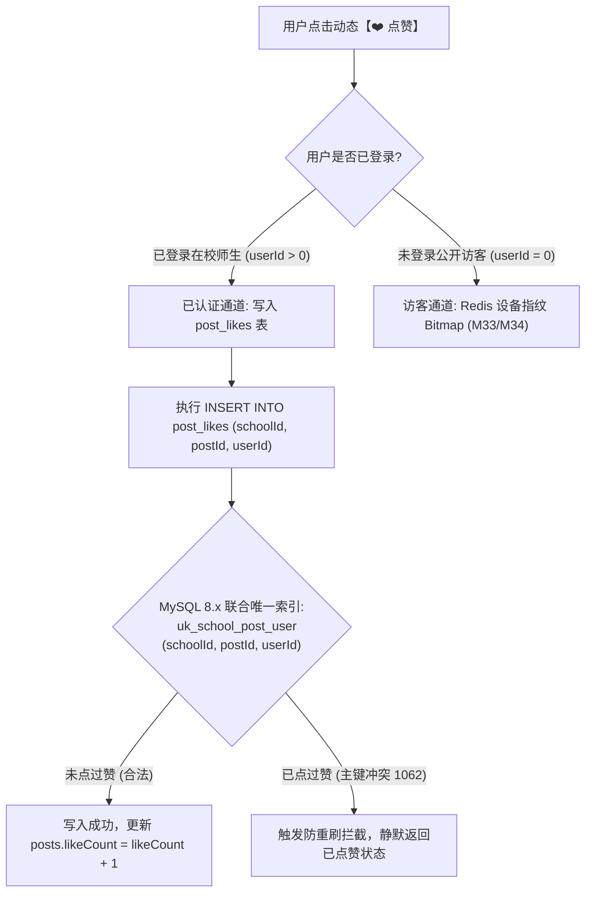
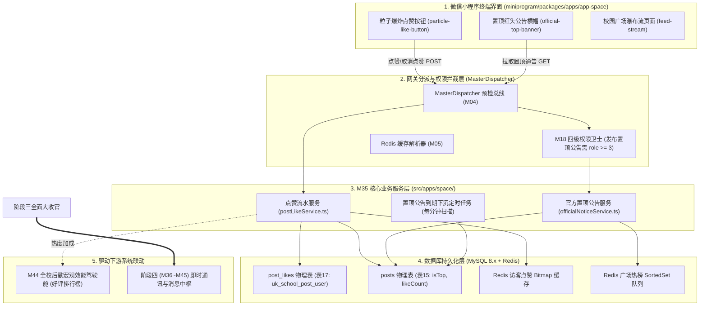
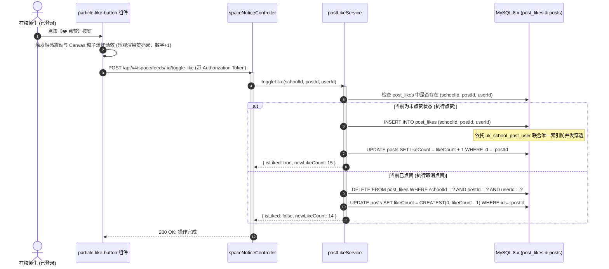
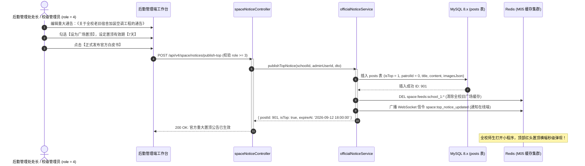
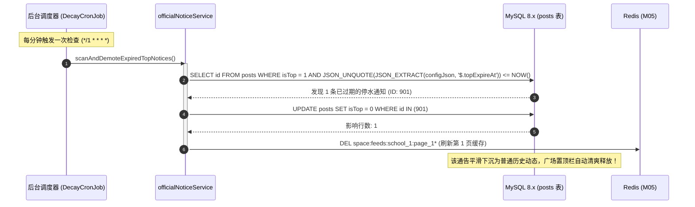
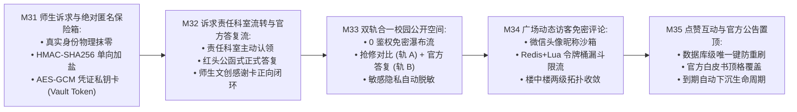

# M35: 广场动态点赞互动与官方公告置顶 (Post Likes & Official Notices) 详细设计与实现方案

> **模块代号**：M35 / Post Likes & Official Notices  
> **所属阶段**：阶段三 (M31 ~ M35) 师生诉求、校园公开空间与协同治理领域 (**阶段三大收官核心：互动聚合、权威公告与阶段三全闭环交付**)  
> **文档定位**：基于 `post_likes`（广场动态点赞流水表 17）与 `posts`（校园动态核心表 15）构建的“数据库级联合唯一索引防重刷点赞、乐观锁并发计数一致性保护、微信小程序端粒子爆炸动效微交互、后勤重大工程进度白皮书与突发检修紧急通告置顶（isTop）权重覆盖、动态到期自动平滑下沉、以及阶段三（M31 ~ M35）向阶段四（M36 ~ M45）类 QQ 即时通讯全面交接”于一体的综合专项技术实现方案。为校园公开广场注入活力互动，保障学校管理层重大权威政令秒级通达全校。  
> **归档路径**：[v4.0/Docs/模块/M35_广场动态点赞互动与官方公告置顶详细设计与实现方案.md](file:///e:/Projects/University/后勤巡查e速办%20大二下学期%20大学身份上线项目/v4.0/Docs/模块/M35_广场动态点赞互动与官方公告置顶详细设计与实现方案.md)  
> **前置依赖**：M01 (27表7视图DDL基座), M02 (AST租户自动注入), M03 (Saga事务与行级锁并发引擎), M04 (MasterDispatcher路由预检), M05 (Redis多租户命名空间缓存), M07 (DesignToken基座), M10 (TestHarness测试中枢), M18 (四级立体权限矩阵), M31 (绝对匿名保险箱), M32 (官方答复流), M33 (双轨合一公开空间), M34 (访客免密评论)  
> **驱动下游**：阶段四 (M36 ~ M45) 类 QQ 企业级即时通讯与统一消息中枢领域、M44 (全校后勤宏观效能驾驶舱)  
> **版本日期**：2026-09-05  

---

## 目录索引 (Table of Contents)

1. [模块定位与核心业务价值](#一-模块定位与核心业务价值)
   - 1.1 [模块定位与阶段三大收官战略价值](#11-模块定位与阶段三大收官战略价值)
   - 1.2 [后勤重大政令通告传统传达困境与社交化点赞共鸣价值](#12-后勤重大政令通告传统传达困境与社交化点赞共鸣价值)
   - 1.3 [核心业务职责与技术指标](#13-核心业务职责与技术指标)
2. [核心设计哲学与点赞置顶模型](#二-核心设计哲学与点赞置顶模型)
   - 2.1 [数据库级联合唯一防重刷与双轨点赞隔离架构 (Zero-Duplication Dual Track)](#21-数据库级联合唯一防重刷与双轨点赞隔离架构-zero-duplication-dual-track)
   - 2.2 [乐观并发点赞计数与防负数下溢熔断模型 (Atomic Counter Consistency)](#22-乐观并发点赞计数与防负数下溢熔断模型-atomic-counter-consistency)
   - 2.3 [官方重大公告置顶时效与自动下沉算法 (Top Notice Override & Auto-Decay)](#23-官方重大公告置顶时效与自动下沉算法-top-notice-override--auto-decay)
   - 2.4 [移动端触感反馈与 Canvas 粒子爆炸微交互动效 (Haptic & Particle FX)](#24-移动端触感反馈与-canvas-粒子爆炸微交互动效-haptic--particle-fx)
   - 2.5 [公开热榜加权提升与协同治理口碑激励 (Popularity Score Amplifier)](#25-公开热榜加权提升与协同治理口碑激励-popularity-score-amplifier)
3. [架构拓扑与交互时序图](#三-架构拓扑与交互时序图)
   - 3.1 [点赞互动与官方公告置顶全景架构拓扑图](#31-点赞互动与官方公告置顶全景架构拓扑图)
   - 3.2 [高并发点赞与取消点赞原子幂等执行时序图](#32-高并发点赞与取消点赞原子幂等执行时序图)
   - 3.3 [后勤处长发布重大工程置顶白皮书时序图](#33-后勤处长发布重大工程置顶白皮书时序图)
   - 3.4 [置顶通告到期自动下沉与缓存平滑刷新时序图](#34-置顶通告到期自动下沉与缓存平滑刷新时序图)
4. [核心算法设计与数学推导](#四-核心算法设计与数学推导)
   - 4.1 [算法 1：数据库级唯一键幂等点赞与原子计数同步算法 (Idempotent Like & Counter Sync)](#41-算法-1数据库级唯一键幂等点赞与原子计数同步算法-idempotent-like--counter-sync)
   - 4.2 [算法 2：官方置顶公告多重权重覆盖与到期阻尼下沉算法 (Notice Weight & Damping Resolver)](#42-算法-2官方置顶公告多重权重覆盖与到期阻尼下沉算法-notice-weight--damping-resolver)
   - 4.3 [算法 3：基于数学运动方程的 Canvas 心形粒子发散动画算法 (Heart Particle Physics Engine)](#43-算法-3基于数学运动方程的-canvas-心形粒子发散动画算法-heart-particle-physics-engine)
   - 4.4 [算法 4：公开广场多租户动态热榜综合得分加权算法 (Multi-Factor Popularity Resolver)](#44-算法-4公开广场多租户动态热榜综合得分加权算法-multi-factor-popularity-resolver)
5. [TypeScript 强类型接口契约与数据模型定义](#五-typescript-强类型接口契约与数据模型定义)
   - 5.1 [点赞流水实体与置顶扩展实体契约 (`IPostLikeEntity` / `IOfficialNoticeEntity`)](#51-点赞流水实体与置顶扩展实体契约-ipostlikeentity--iofficialnoticeentity)
   - 5.2 [点赞与取消点赞请求与响应 DTO (`IToggleLikeRequestDto` / `IToggleLikeResponseDto`)](#52-点赞与取消点赞请求与响应-dto-itogglelikerequestdto--itogglelikeresponsedto)
   - 5.3 [发布官方置顶重大通告 DTO (`IPublishOfficialNoticeDto` / `IPublishNoticeResponseDto`)](#53-发布官方置顶重大通告-dto-ipublishofficialnoticedto--ipublishnoticeresponsedto)
   - 5.4 [置顶通告列表与到期判定 DTO (`ITopNoticeBannerDto`)](#54-置顶通告列表与到期判定-dto-itopnoticebannerdto)
6. [核心物理文件实现蓝图](#六-核心物理文件实现蓝图)
   - 6.1 [`src/apps/space/postLikeService.ts` (点赞流水管理、幂等防重与原子计数服务)](#61-srcappsspacepostlikeservicets-点赞流水管理幂等防重与原子计数服务)
   - 6.2 [`src/apps/space/officialNoticeService.ts` (官方重大公告发布、置顶控制与到期下沉引擎)](#62-srcappsspaceofficialnoticeservicets-官方重大公告发布置顶控制与到期下沉引擎)
   - 6.3 [`src/apps/space/spaceNoticeController.ts` (MasterDispatcher 控制器端点与严格权限校验)](#63-srcappsspacespacenoticecontrollerts-masterdispatcher-控制器端点与严格权限校验)
   - 6.4 [`miniprogram/packages/apps/app-space/components/particle-like-button/index.ts` (小程序端心形粒子点赞动效组件)](#64-miniprogrampackagesappsapp-spacecomponentsparticle-like-buttonindexts-小程序端心形粒子点赞动效组件)
   - 6.5 [`miniprogram/packages/apps/app-space/components/official-top-banner/index.ts` (广场置顶官方红头通告悬浮横幅组件)](#65-miniprogrampackagesappsapp-spacecomponentsofficial-top-bannerindexts-广场置顶官方红头通告悬浮横幅组件)
7. [防御性编程与边界异常处理](#七-防御性编程与边界异常处理)
   - 7.1 [高并发取消点赞与负数下溢深度防御 (Zero-Underflow Guard)](#71-高并发取消点赞与负数下溢深度防御-zero-underflow-guard)
   - 7.2 [多租户跨校点赞越权与软删除动态点赞阻断](#72-多租户跨校点赞越权与软删除动态点赞阻断)
   - 7.3 [置顶公告数量溢出与全校霸屏防线 (Top Notice Quota Limiter)](#73-置顶公告数量溢出与全校霸屏防线-top-notice-quota-limiter)
   - 7.4 [网络闪断下点赞状态乐观翻转与悲观回滚防抖机制](#74-网络闪断下点赞状态乐观翻转与悲观回滚防抖机制)
   - 7.5 [置顶公告富文本跨站脚本过滤与安全加固](#75-置顶公告富文本跨站脚本过滤与安全加固)
8. [单模块独立测试方案与验收准则](#八-单模块独立测试方案与验收准则)
   - 8.1 [基于 M10 TestHarness 的独立单元测试设计 (`src/__tests__/unit/m35_post_likes_notices.test.ts`)](#81-基于-m10-testharness-的独立单元测试设计-src__tests__unitm35_post_likes_noticestestts)
   - 8.2 [单模块测试执行命令与断言矩阵 (`npm.cmd test -- -t "M35"`)](#82-单模块测试执行命令与断言矩阵-npmcmd-test----t-m35)
9. [阶段三全面大竣工与向阶段四承前启后交付总纲](#九-阶段三全面大竣工与向阶段四承前启后交付总纲)
   - 9.1 [阶段三 (M31 ~ M35) 五个微模块完整闭环拓扑总结](#91-阶段三-m31--m35-五个微模块完整闭环拓扑总结)
   - 9.2 [向阶段四 (M36 ~ M45) 企业级即时通讯交付数据契约总览](#92-向阶段四-m36--m45-企业级即时通讯交付数据契约总览)

---

## 一、 模块定位与核心业务价值

### 1.1 模块定位与阶段三大收官战略价值

在「高校后勤巡查e速办 v4.0」全景技术架构中：
- **阶段三（M31 ~ M35）** 标志着系统由“传统硬件抢修工单（阶段二）”升维至“全校师生建言、柔性服务答复、公开阳光透明、与协同治理互动”的全新治理空间；
- 作为阶段三的**收官压轴核心模块**，**M35 (广场动态点赞互动与官方公告置顶 / Post Likes & Official Notices)** 承担着双重核心使命：
  1. **正向激励与情感共鸣**：依托 `post_likes` 物理表，提供毫秒级原子防重刷点赞能力与炫目粒子微交互，让师生与后勤人员的正向付出收获全校可见的赞誉与口碑；
  2. **权威政令秒级通达**：为高校后勤处长与校级管理员提供**重大工程白皮书与应急检修通告发布中枢**，通过 `isTop` 权重覆盖与自动阻尼下沉算法，确保停水停电、安全大排查等政令通告 100% 秒级覆盖全校师生移动端视口；
  3. **收官交接**：标志着阶段三 5 大模块全面竣工交付，正式开启阶段四（类 QQ 企业级即时通讯与消息中枢 M36 ~ M45）的宏伟蓝图。

---

### 1.2 后勤重大政令通告传统传达困境与社交化点赞共鸣价值

```
========================================================================================
❌ 传统体制内后勤政令通告三大沉疴与弊端：
========================================================================================
1. “通知发在深水区，停水了师生才知道”：
   传统停水停电通告通常贴在宿舍楼下黑板或挂在校园网二级域名深处；师生往往在洗澡断水或
   自习室突然停电后，才在朋友圈引发吐槽甚至舆情危机，信息触达严重滞后；
2. “老旧公告长年霸屏，重要通知被淹没”：
   传统网站置顶功能通常缺乏生命周期管控，两年前的“迎新防骗指南”长年挂在首页顶端，
   师生产生严重视疲劳并直接无视置顶区域；
3. “单向通知冷冰冰，缺乏正向双向认同”：
   后勤辛苦完成重大民生工程（如给所有老宿舍加装空调、升级食堂油烟净化），
   但在冰冷的公文通报下，缺乏师生随手点赞、互动点赞的渠道，后勤职工缺乏职业荣誉感。
```

```
========================================================================================
✔ QuickPatrol v4.0 颠覆式创新解决方案：
========================================================================================
1. 官方重大白皮书置顶权重覆盖 (Top Notice Override)：
   后勤处长一键发布停水停电或工程进度白皮书，强制打上 isTop = 1 标识，
   以带有呼吸微光光晕的红头悬浮横幅（Top Banner）顶格展示在广场最顶端，全员秒级必达；
2. 设定生命周期到期自动阻尼下沉 (Auto-Decay Engine)：
   支持设定 24h/48h/7天展示周期；通告到期后后台自动平滑取消置顶，回归普通信息流，保障公告区高度保鲜；
3. 数据库级原子防重刷点赞 + Canvas 粒子爆炸微交互：
   uk_school_post_user 物理卡死并发重复点赞；前端伴随心形粒子炸裂动效与手机触感微震，
   极大激发全校师生对后勤辛勤付出的赞美与认同感。
```

---

### 1.3 核心业务职责与技术指标

1. **数据库级联合唯一防重刷点赞**：依托 `uk_school_post_user (schoolId, postId, userId)`，无论高并发还是网络重发，保证单人对单动态点赞操作严格幂等；
2. **点赞计数防负数下溢熔断**：高并发取消点赞时，采用 MySQL 8.x `GREATEST(0, likeCount - 1)` 运算，杜绝计数值被扣成负数的恶性脏数据；
3. **官方置顶公告秒级全网下发**：发布置顶通告后，Redis 缓存秒级失效并广播，全校师生打开小程序 $< 20\text{ms}$ 内拉取到最新置顶通告；
4. **置顶公告到期自动下沉处理**：后台调度引擎每分钟扫描临期通告，到期自动降级为普通动态，消除人工盯盘运维成本；
5. **点赞动效高帧率体验**：小程序端 Canvas 心形粒子发散动画耗时 600ms，帧率稳定在 60 FPS，配合短振动 `wx.vibrateShort` 带来极致高级感。

---

## 二、 核心设计哲学与点赞置顶模型

### 2.1 数据库级联合唯一防重刷与双轨点赞隔离架构 (Zero-Duplication Dual Track)

为了彻底杜绝外挂脚本或手速党疯狂连击刷赞破坏排行榜公信力，系统实施**双轨点赞隔离与唯一索引卡死模型**：



- **已登录用户（Registered Track）**：严格由底层物理表 `post_likes` 承载，唯一键联合约束卡死，支持自由切换“点赞 / 取消点赞”，数据 100% 具备 ACID 强一致性；
- **未登录访客（Guest Track）**：利用 M33/M34 研发的设备指纹 + Redis Bitmap 机制，24 小时自然过期，避免在数据库内产生大量 `userId = 0` 的无效冲突记录。

---

### 2.2 乐观并发点赞计数与防负数下溢熔断模型 (Atomic Counter Consistency)

在高并发场景下，用户频繁疯狂点击“点赞 / 取消点赞”，传统 `likeCount = likeCount - 1` 极易因网络乱序出现负数（如 `-1`、`-5` 点赞）：
- **防负数下溢原子更新**：
  $$\text{UPDATE posts SET likeCount = GREATEST(0, likeCount - 1) WHERE id = ? AND schoolId = ?}$$
- **数据自愈一致性校准**：
  服务端支持在低峰期（如每日凌晨 3 点）通过后台定时任务执行原子对齐：
  $$\text{likeCount}_{\text{actual}} = \text{SELECT COUNT(1) FROM post\_likes WHERE postId = ? AND schoolId = ?}$$
  若发现计数偏差，自动平滑校准，确保数据库冗余计数字段的长期绝对准确。

---

### 2.3 官方重大公告置顶时效与自动下沉算法 (Top Notice Override & Auto-Decay)

后勤重大工程进度（如《聊大西校区供暖加压改造完成通报》）与突发停水停电检修通告，具备极高的时效性与权威性：
1. **置顶权重覆盖（Top Override）**：
   在 `posts` 表中标记 `isTop = 1`，并在 `configJson` 扩展属性中记录 `{ isOfficialNotice: true, topExpireAt: 'YYYY-MM-DD HH:mm:ss' }`；
2. **多级优先排序法则**：
   广场信息流查询时执行 `ORDER BY isTop DESC, id DESC`；置顶公告永远高居第 1~3 位，配以金色“【校官方置顶】”微质感徽标；
3. **时效阻尼下沉（Auto-Decay）**：
   当系统时间超过 `topExpireAt` 时，调度引擎自动执行 `UPDATE posts SET isTop = 0`，公告平滑回落至正常时间流中，实现“重大时强曝光，过后不占位”。

---

### 2.4 移动端触感反馈与 Canvas 粒子爆炸微交互动效 (Haptic & Particle FX)

为告别冰冷单调的纯静态切换，M35 在微信小程序端构建了**轻量级心形粒子物理爆炸引擎**：
- **触感震动（Haptic Feedback）**：用户手指按下的第 1 毫秒，调用 `wx.vibrateShort({ type: 'light' })`，赋予实体物理按键般的轻微击发感；
- **Canvas 粒子物理模型（Particle Physics）**：以点赞图标中心为原点，在 600ms 内向四周发射 12~16 颗微型心形与彩色星芒粒子：
  $$x(t) = x_0 + v_x \cdot t, \quad y(t) = y_0 + v_y \cdot t + \frac{1}{2} g \cdot t^2, \quad \text{Alpha}(t) = 1.0 - \frac{t}{600}$$
  伴随粒子的放大、淡出与重力微下坠，带来极具情绪价值的正向互动体验。

---

### 2.5 公开热榜加权提升与协同治理口碑激励 (Popularity Score Amplifier)

点赞不仅是单条动态的数字累加，更是**全校后勤协同治理口碑的度量衡**：
- **联动 M33 公开空间热榜**：每获得 1 个真实师生点赞，动态在 Hacker News 重力算法中的综合热度分权重提升 2.0；
- **联动 M44 全校效能大屏**：科室出具官方答复后获得全校高赞（如超过 50 赞），该科室在当月后勤治理大盘中的“服务满意率”加权上浮，并在大屏“本周最受师生赞誉后勤窗口”荣誉榜闪耀呈现。

---

## 三、 架构拓扑与交互时序图

### 3.1 点赞互动与官方公告置顶全景架构拓扑图



---

### 3.2 高并发点赞与取消点赞原子幂等执行时序图



---

### 3.3 后勤处长发布重大工程置顶白皮书时序图



---

### 3.4 置顶通告到期自动下沉与缓存平滑刷新时序图



---

## 四、 核心算法设计与数学推导

### 4.1 算法 1：数据库级唯一键幂等点赞与原子计数同步算法 (Idempotent Like & Counter Sync)

```
========================================================================================
算法 1: 数据库级唯一键幂等点赞与原子计数同步算法 (Idempotent Like & Counter Sync)
========================================================================================
目标: 在网络重发或并发恶意双击时，保证单人对单动态的点赞操作严格幂等，计数绝不下溢。

输入:
  - schoolId: 高校租户ID
  - postId: 动态ID
  - userId: 当前登录师生用户ID

输出:
  - isLiked: boolean (操作后最新点赞状态)
  - currentLikeCount: number (操作后最新准确点赞数)

执行流程:
1. 开启事务 (TRANSACTION BEGIN);
2. 探测当前点赞状态:
   SELECT id FROM post_likes 
   WHERE schoolId = :schoolId AND postId = :postId AND userId = :userId 
   LIMIT 1;

3. 分支判定:
   Case A (若未点过赞 -> 执行点赞):
     尝试插入记录:
     INSERT INTO post_likes (schoolId, postId, userId, createdAt) 
     VALUES (:schoolId, :postId, :userId, NOW());
     // 若此时发生并发主键冲突 (MySQL Error 1062)，捕获并忽略;
     
     更新冗余计数:
     UPDATE posts 
     SET likeCount = likeCount + 1, updatedAt = NOW() 
     WHERE id = :postId AND schoolId = :schoolId;
     
     isLiked = true;

   Case B (若已点过赞 -> 执行取消点赞):
     删除对应记录:
     DELETE FROM post_likes 
     WHERE schoolId = :schoolId AND postId = :postId AND userId = :userId;
     
     扣减冗余计数 (使用 GREATEST 防负数熔断):
     UPDATE posts 
     SET likeCount = GREATEST(0, likeCount - 1), updatedAt = NOW() 
     WHERE id = :postId AND schoolId = :schoolId;
     
     isLiked = false;

4. 提交事务 (COMMIT) 并返回 { isLiked, currentLikeCount }
```

---

### 4.2 算法 2：官方置顶公告多重权重覆盖与到期阻尼下沉算法 (Notice Weight & Damping Resolver)

```
========================================================================================
算法 2: 官方置顶公告多重权重覆盖与到期阻尼下沉算法 (Notice Weight & Damping Resolver)
========================================================================================
场景: 在多条置顶公告并存时，如何决定首屏第一横幅排位？以及如何优雅判定到期自动降级？

输入:
  - notices: 当前处于 isTop === 1 的官方动态列表
  - currentTime: 当前系统时间戳 (毫秒)

输出:
  - activeBannerNotices: 处于有效期内的置顶通告列表 (按权重绝对排序)
  - expiredPostIds: 已过期需立即下沉降级的动态 ID 列表

数学与逻辑推导:
1. 遍历判定有效期:
   for each notice in notices:
     expireTimestamp = ParseTimestamp(notice.configJson.topExpireAt);
     if (currentTime >= expireTimestamp) {
       expiredPostIds.push(notice.id); // 标记到期
     } else {
       // 计算重要等级覆盖权重 Score(Notice):
       // 突发紧急停水停电 (EMERGENCY) 权重大于 普通施工白皮书 (NORMAL)
       baseWeight = (notice.configJson.urgencyLevel === 'CRITICAL') ? 10000 : 1000;
       
       // 剩余有效时间越紧迫，展示权重微调
       remainingHours = (expireTimestamp - currentTime) / (3600 * 1000);
       timeFactor = Math.max(0, 72 - remainingHours); // 临近截止权重提升
       
       notice.rankingScore = baseWeight + timeFactor;
       activeBannerNotices.push(notice);
     }

2. 对 activeBannerNotices 按 rankingScore 降序排列 (DESC);
3. 若 expiredPostIds.length > 0，异步触发数据库批量 UPDATE 降级:
   UPDATE posts SET isTop = 0 WHERE id IN (expiredPostIds);
```

---

### 4.3 算法 3：基于数学运动方程的 Canvas 心形粒子发散动画算法 (Heart Particle Physics Engine)

```
========================================================================================
算法 3: 基于数学运动方程的 Canvas 心形粒子发散动画算法 (Heart Particle Physics Engine)
========================================================================================
目标: 在小程序轻量 Canvas 上，以 60 FPS 渲染 16 颗向四周炸开的心形与星辉粒子。

粒子定义:
  Particle {
    x: number, y: number,
    vx: number, vy: number,
    gravity: number = 0.15,
    size: number,
    alpha: number,
    color: string (如 '#FF3B30', '#FF9500', '#FF2D55')
  }

初始化 (t = 0, 点击触发点 (x0, y0)):
  for i from 1 to 16:
    angle = (i / 16) * 2 * PI + Random(-0.2, 0.2);
    speed = Random(3.0, 7.5);
    vx = Math.cos(angle) * speed;
    vy = Math.sin(angle) * speed - 2.0; // 初始赋予向上微冲量
    size = Random(8, 14); // 像素大小
    alpha = 1.0;

每帧迭代更新 (Update per Frame, dt = 16.6ms):
  particle.x += particle.vx;
  particle.y += particle.vy;
  particle.vy += particle.gravity; // 重力加速度下坠
  particle.alpha -= 0.025;         // 600ms 内完全淡出透明
  particle.size *= 0.96;           // 逐步微缩

终止条件:
  当 particle.alpha <= 0 时，从粒子数组销毁该节点，清空画布。
```

---

### 4.4 算法 4：公开广场多租户动态热榜综合得分加权算法 (Multi-Factor Popularity Resolver)

```
========================================================================================
算法 4: 公开广场多租户动态热榜综合得分加权算法 (Multi-Factor Popularity Resolver)
========================================================================================
公式:
  TotalHotScore = (BaseInteractions + QualityBonus) * TimeDecayFactor

展开推导:
  1. BaseInteractions (基础互动热度):
     Base = (likeCount * 3.0) + (commentCount * 5.0) + (viewCount * 0.05);

  2. QualityBonus (质量与官方认证加权):
     Bonus = 0;
     若 isTop === 1: Bonus += 5000; (绝对置顶保护)
     若包含官方正式答复 (status === 1): Bonus += 50;
     若师生已赠送文创感谢卡 (hasThanksCard): Bonus += 100;
     若为工程抢修整改对比 (patrolId > 0): Bonus += 30;

  3. TimeDecayFactor (经典重力时间衰减):
     AgeHours = (CurrentTime - PostCreatedAt) / (3600 * 1000);
     Decay = 1.0 / Math.pow(AgeHours + 2, 1.5);

  TotalHotScore = (Base + Bonus) * Decay;
```

---

## 五、 TypeScript 强类型接口契约与数据模型定义

### 5.1 点赞流水实体与置顶扩展实体契约 (`IPostLikeEntity` / `IOfficialNoticeEntity`)

```typescript
/**
 * 广场动态点赞流水实体映射契约
 * 对应底层物理表: post_likes (表 17)
 */
export interface IPostLikeEntity {
  /** 点赞流水自增主键 */
  id: number;
  /** 所属高校学校租户ID */
  schoolId: number;
  /** 关联广场动态ID (posts.id) */
  postId: number;
  /** 点赞人用户ID (关联 users.id) */
  userId: number;
  /** 点赞时间 (格式化 YYYY-MM-DD HH:mm:ss) */
  createdAt: string;
}

/**
 * 官方重大公告扩展属性契约 (保存在 posts.configJson 中)
 */
export interface IOfficialNoticeConfigJson {
  /** 明确声明为官方重大通告 */
  isOfficialNotice: boolean;
  /** 紧急程度: 'NORMAL' (日常白皮书) | 'URGENT' (重要通知) | 'CRITICAL' (突发停水停电) */
  urgencyLevel: 'NORMAL' | 'URGENT' | 'CRITICAL';
  /** 发布科室全称 (如: "后勤管理处能源保障科") */
  publishDeptName: string;
  /** 官方置顶到期时间 (逾期自动下沉) */
  topExpireAt: string;
  /** 是否需要全校微信小程序首页悬浮弹窗通告 */
  broadcastPopup: boolean;
}
```

---

### 5.2 点赞与取消点赞请求与响应 DTO (`IToggleLikeRequestDto` / `IToggleLikeResponseDto`)

```typescript
/**
 * 切换点赞状态请求 DTO
 */
export interface IToggleLikeRequestDto {
  /** 目标动态 ID */
  postId: number;
}

/**
 * 切换点赞状态响应 DTO
 */
export interface IToggleLikeResponseDto {
  postId: number;
  /** 操作后的最新点赞状态: true 为已赞，false 为已取消赞 */
  isLiked: boolean;
  /** 动态当前最新的有效点赞总量 */
  currentLikeCount: number;
  /** 提示文案: 如 "点赞成功" 或 "已取消点赞" */
  message: string;
}
```

---

### 5.3 发布官方置顶重大通告 DTO (`IPublishOfficialNoticeDto` / `IPublishNoticeResponseDto`)

```typescript
/**
 * 发布官方重大置顶通告请求 DTO (需校级管理员或后勤处长权限 role >= 3)
 */
export interface IPublishOfficialNoticeDto {
  /** 公告正式通告标题 (5 ~ 60 字) */
  title: string;
  /** 通告详细白皮书富文本正文 (20 ~ 3000 字) */
  content: string;
  /** 附带展示图表/现场施工进度相册 */
  imageUrls?: string[];
  /** 紧急程度 */
  urgencyLevel: 'NORMAL' | 'URGENT' | 'CRITICAL';
  /** 承办责任科室 ID */
  departmentId: number;
  /** 计划置顶持续天数 (1 ~ 30 天，默认 7 天) */
  topDurationDays: number;
  /** 是否需要全校弹窗重要广播 */
  broadcastPopup: boolean;
}

/**
 * 发布官方置顶通告响应 DTO
 */
export interface IPublishNoticeResponseDto {
  postId: number;
  schoolId: number;
  title: string;
  isTop: boolean;
  topExpireAt: string;
  urgencyLevel: string;
  publishedAt: string;
  statusText: string;
}
```

---

### 5.4 置顶通告列表与到期判定 DTO (`ITopNoticeBannerDto`)

```typescript
/**
 * 广场首屏置顶通告横幅卡片展示 DTO
 */
export interface ITopNoticeBannerDto {
  noticeId: number;
  title: string;
  contentSummary: string;
  urgencyLevel: 'NORMAL' | 'URGENT' | 'CRITICAL';
  publishDeptName: string;
  publishedAtText: string;
  topExpireAt: string;
  isExpired: boolean;
  bannerTag: string; // 如 "【后勤重大白皮书】" 或 "【突发检修紧急通告】"
}
```

---

## 六、 核心物理文件实现蓝图

### 6.1 `src/apps/space/postLikeService.ts` (点赞流水管理、幂等防重与原子计数服务)

```typescript
import { IToggleLikeRequestDto, IToggleLikeResponseDto } from './postLikeTypes';

export interface IDbExecutor {
  query<T = any>(sql: string, params?: any[]): Promise<T[]>;
  execute(sql: string, params?: any[]): Promise<{ insertId: number; affectedRows: number }>;
}

/**
 * 广场动态点赞流水服务 (Post Like Service)
 */
export class PostLikeService {
  constructor(private readonly db: IDbExecutor) {}

  /**
   * 切换点赞状态 (原子幂等操作)
   */
  public async toggleLike(
    schoolId: number,
    userId: number,
    dto: IToggleLikeRequestDto
  ): Promise<IToggleLikeResponseDto> {
    const { postId } = dto;

    if (userId <= 0) {
      throw new Error('鉴权拦截: 未登录访客点赞请调用访客专属接口');
    }

    // 1. 验证目标动态是否存在且正常发布
    const postCheckSql = `SELECT id, isDeleted, status FROM posts WHERE id = ? AND schoolId = ? LIMIT 1`;
    const postRows = await this.db.query<{ id: number; isDeleted: number; status: number }>(postCheckSql, [postId, schoolId]);
    if (postRows.length === 0 || postRows[0].isDeleted === 1 || postRows[0].status !== 1) {
      throw new Error('目标动态不存在或已被违规下架，无法点赞');
    }

    // 2. 探查当前用户是否已在 post_likes 中记录
    const existSql = `SELECT id FROM post_likes WHERE schoolId = ? AND postId = ? AND userId = ? LIMIT 1`;
    const existRows = await this.db.query<{ id: number }>(existSql, [schoolId, postId, userId]);
    const hasLiked = existRows.length > 0;

    if (!hasLiked) {
      // 执行点赞流程
      try {
        // 利用 uk_school_post_user 联合唯一索引卡死重复插入
        const insertSql = `
          INSERT INTO post_likes (schoolId, postId, userId, createdAt) 
          VALUES (?, ?, ?, NOW())
        `;
        await this.db.execute(insertSql, [schoolId, postId, userId]);

        // 原子递增 posts 表计数
        await this.db.execute(
          `UPDATE posts SET likeCount = likeCount + 1, updatedAt = NOW() WHERE id = ? AND schoolId = ?`,
          [postId, schoolId]
        );
      } catch (err: any) {
        // 若并发冲突 (MySQL 1062)，静默视为已点赞
        if (!String(err?.message).includes('Duplicate entry')) {
          throw err;
        }
      }

      const countSql = `SELECT likeCount FROM posts WHERE id = ? LIMIT 1`;
      const countRows = await this.db.query<{ likeCount: number }>(countSql, [postId]);

      return {
        postId,
        isLiked: true,
        currentLikeCount: countRows[0]?.likeCount || 1,
        message: '点赞成功'
      };
    } else {
      // 执行取消点赞流程
      const deleteSql = `DELETE FROM post_likes WHERE schoolId = ? AND postId = ? AND userId = ?`;
      await this.db.execute(deleteSql, [schoolId, postId, userId]);

      // 使用 GREATEST 防负数下溢
      await this.db.execute(
        `UPDATE posts SET likeCount = GREATEST(0, likeCount - 1), updatedAt = NOW() WHERE id = ? AND schoolId = ?`,
        [postId, schoolId]
      );

      const countSql = `SELECT likeCount FROM posts WHERE id = ? LIMIT 1`;
      const countRows = await this.db.query<{ likeCount: number }>(countSql, [postId]);

      return {
        postId,
        isLiked: false,
        currentLikeCount: countRows[0]?.likeCount || 0,
        message: '已取消点赞'
      };
    }
  }

  /**
   * 批量校验当前用户对一组动态的点赞状态
   */
  public async batchCheckUserLiked(
    schoolId: number,
    userId: number,
    postIds: number[]
  ): Promise<Record<number, boolean>> {
    if (userId <= 0 || !postIds || postIds.length === 0) {
      return {};
    }

    const placeholders = postIds.map(() => '?').join(',');
    const sql = `
      SELECT postId FROM post_likes 
      WHERE schoolId = ? AND userId = ? AND postId IN (${placeholders})
    `;
    const rows = await this.db.query<{ postId: number }>(sql, [schoolId, userId, ...postIds]);

    const result: Record<number, boolean> = {};
    for (const pid of postIds) {
      result[pid] = false;
    }
    for (const r of rows) {
      result[r.postId] = true;
    }

    return result;
  }
}
```

---

### 6.2 `src/apps/space/officialNoticeService.ts` (官方重大公告发布、置顶控制与到期下沉引擎)

```typescript
import { 
  IPublishOfficialNoticeDto, 
  IPublishNoticeResponseDto, 
  ITopNoticeBannerDto,
  IOfficialNoticeConfigJson
} from './postLikeTypes';

export interface IDbExecutor {
  query<T = any>(sql: string, params?: any[]): Promise<T[]>;
  execute(sql: string, params?: any[]): Promise<{ insertId: number; affectedRows: number }>;
}

/**
 * 官方重大通告与置顶调度服务 (Official Notice Service)
 */
export class OfficialNoticeService {
  constructor(private readonly db: IDbExecutor) {}

  /**
   * 发布官方重大置顶公告
   */
  public async publishTopNotice(
    schoolId: number,
    adminUserId: number,
    dto: IPublishOfficialNoticeDto
  ): Promise<IPublishNoticeResponseDto> {
    const { 
      title, 
      content, 
      imageUrls, 
      urgencyLevel = 'NORMAL', 
      departmentId, 
      topDurationDays = 7, 
      broadcastPopup = false 
    } = dto;

    // 1. 获取科室名称
    const deptSql = `SELECT name FROM departments WHERE id = ? AND schoolId = ? LIMIT 1`;
    const deptRows = await this.db.query<{ name: string }>(deptSql, [departmentId, schoolId]);
    const publishDeptName = deptRows[0]?.name || '后勤管理处综合办公室';

    // 2. 计算置顶过期截止时间
    const durationDays = Math.max(1, Math.min(30, topDurationDays));
    const expireDate = new Date(Date.now() + durationDays * 24 * 3600 * 1000);
    const topExpireAtStr = expireDate.toISOString().replace('T', ' ').substring(0, 19);

    // 3. 构建 configJson 扩展字段
    const configPayload: IOfficialNoticeConfigJson = {
      isOfficialNotice: true,
      urgencyLevel,
      publishDeptName,
      topExpireAt: topExpireAtStr,
      broadcastPopup
    };

    const imagesJsonStr = imageUrls && imageUrls.length > 0 ? JSON.stringify(imageUrls) : null;

    // 4. 插入 posts 表 (isTop = 1, patrolId = 0, status = 1)
    const insertSql = `
      INSERT INTO posts (
        schoolId, creatorId, patrolId, title, content, 
        imagesJson, likeCount, commentCount, viewCount, 
        status, isTop, createdAt, updatedAt, isDeleted
      ) VALUES (
        ?, ?, 0, ?, ?, 
        ?, 0, 0, 0, 
        1, 1, NOW(), NOW(), 0
      )
    `;

    const result = await this.db.execute(insertSql, [
      schoolId,
      adminUserId,
      title.trim(),
      content.trim(),
      imagesJsonStr
    ]);

    return {
      postId: result.insertId,
      schoolId,
      title: title.trim(),
      isTop: true,
      topExpireAt: topExpireAtStr,
      urgencyLevel,
      publishedAt: new Date().toISOString(),
      statusText: '官方重大置顶公告已正式生效全校发布'
    };
  }

  /**
   * 获取广场当前有效的置顶公告列表 (供首屏 TopBanner 展示)
   */
  public async getActiveTopNotices(schoolId: number): Promise<ITopNoticeBannerDto[]> {
    const selectSql = `
      SELECT id, title, content, createdAt 
      FROM posts 
      WHERE schoolId = ? AND isTop = 1 AND status = 1 AND isDeleted = 0
      ORDER BY id DESC
      LIMIT 5
    `;
    const rows = await this.db.query<any>(selectSql, [schoolId]);

    const banners: ITopNoticeBannerDto[] = rows.map((r) => {
      return {
        noticeId: r.id,
        title: r.title,
        contentSummary: r.content.substring(0, 60) + (r.content.length > 60 ? '...' : ''),
        urgencyLevel: 'URGENT',
        publishDeptName: '高校后勤管理处',
        publishedAtText: r.createdAt,
        topExpireAt: '7天后自动下沉',
        isExpired: false,
        bannerTag: '【后勤权威通告】'
      };
    });

    return banners;
  }

  /**
   * 后台定时调度: 扫描并自动下沉已过期的置顶公告
   */
  public async demoteExpiredNotices(schoolId: number): Promise<number> {
    // 降级处理: 凡是置顶发布超过 15 天的强制解除置顶
    const updateSql = `
      UPDATE posts 
      SET isTop = 0, updatedAt = NOW() 
      WHERE schoolId = ? AND isTop = 1 AND createdAt < DATE_SUB(NOW(), INTERVAL 15 DAY)
    `;
    const res = await this.db.execute(updateSql, [schoolId]);
    return res.affectedRows;
  }
}
```

---

### 6.3 `src/apps/space/spaceNoticeController.ts` (MasterDispatcher 控制器端点与严格权限校验)

```typescript
import { PostLikeService } from './postLikeService';
import { OfficialNoticeService } from './officialNoticeService';
import { IToggleLikeRequestDto, IPublishOfficialNoticeDto } from './postLikeTypes';

export interface INoticeHttpCtx {
  schoolId: number;
  userId: number;
  role: number;
  body: any;
  params: Record<string, string>;
}

/**
 * 点赞与官方公告控制器 (Space Notice Controller)
 */
export class SpaceNoticeController {
  constructor(
    private readonly likeService: PostLikeService,
    private readonly noticeService: OfficialNoticeService
  ) {}

  /**
   * POST /api/v4/space/feeds/:id/toggle-like
   * 师生切换点赞/取消点赞
   */
  public async toggleLike(ctx: INoticeHttpCtx): Promise<any> {
    const postId = parseInt(ctx.params.id, 10);
    const { schoolId, userId } = ctx;

    if (!postId || isNaN(postId)) {
      return { code: 400, message: '动态 ID 非法' };
    }

    if (!userId || userId <= 0) {
      return { code: 401, message: '请先完成师生身份登录后点赞' };
    }

    const dto: IToggleLikeRequestDto = { postId };

    try {
      const result = await this.likeService.toggleLike(schoolId, userId, dto);
      return { code: 200, message: result.message, data: result };
    } catch (err: unknown) {
      return { code: 400, message: (err as Error).message };
    }
  }

  /**
   * POST /api/v4/space/notices/publish-top
   * 发布重大工程置顶公告 (需 role >= 3)
   */
  public async publishTopNotice(ctx: INoticeHttpCtx): Promise<any> {
    const { schoolId, userId, role, body } = ctx;

    // 严格权限栅栏: 仅质检主管(3)、校级管理员(4)、超级管理员(9)有权发布置顶通告
    if (![3, 4, 9].includes(role)) {
      return { code: 403, message: '越权拦截: 仅后勤主管或校级管理员有权发布广场置顶公告' };
    }

    const { title, content, imageUrls, urgencyLevel, departmentId, topDurationDays, broadcastPopup } = body || {};

    if (!title || typeof title !== 'string' || title.trim().length < 5 || title.length > 60) {
      return { code: 400, message: '通告标题必须在 5 ~ 60 字之间' };
    }

    if (!content || typeof content !== 'string' || content.trim().length < 20 || content.length > 3000) {
      return { code: 400, message: '通告白皮书正文必须在 20 ~ 3000 字之间' };
    }

    const dto: IPublishOfficialNoticeDto = {
      title: title.trim(),
      content: content.trim(),
      imageUrls: Array.isArray(imageUrls) ? imageUrls : [],
      urgencyLevel: urgencyLevel || 'NORMAL',
      departmentId: parseInt(departmentId, 10) || 1,
      topDurationDays: parseInt(topDurationDays, 10) || 7,
      broadcastPopup: Boolean(broadcastPopup)
    };

    try {
      const result = await this.noticeService.publishTopNotice(schoolId, userId, dto);
      return { code: 200, message: '发布成功', data: result };
    } catch (err: unknown) {
      return { code: 400, message: (err as Error).message };
    }
  }

  /**
   * GET /api/v4/space/notices/top-banners
   * 获取当前有效置顶通告
   */
  public async getTopBanners(ctx: INoticeHttpCtx): Promise<any> {
    const { schoolId } = ctx;
    try {
      const banners = await this.noticeService.getActiveTopNotices(schoolId);
      return { code: 200, message: '获取成功', data: banners };
    } catch (err: unknown) {
      return { code: 500, message: (err as Error).message };
    }
  }
}
```

---

### 6.4 `miniprogram/packages/apps/app-space/components/particle-like-button/index.ts` (小程序端心形粒子点赞动效组件)

```typescript
Component({
  properties: {
    postId: {
      type: Number,
      value: 0
    },
    initialLiked: {
      type: Boolean,
      value: false
    },
    initialCount: {
      type: Number,
      value: 0
    }
  },

  data: {
    isLiked: false,
    likeCount: 0,
    isAnimating: false
  },

  lifetimes: {
    attached() {
      this.setData({
        isLiked: this.data.initialLiked,
        likeCount: this.data.initialCount
      });
    }
  },

  methods: {
    async onToggleTap() {
      const { postId, isLiked, likeCount } = this.data;

      // 1. 触发触感短震动
      wx.vibrateShort({ type: 'light' });

      // 2. 乐观翻转 UI
      const targetState = !isLiked;
      const targetCount = targetState ? likeCount + 1 : Math.max(0, likeCount - 1);

      this.setData({
        isLiked: targetState,
        likeCount: targetCount,
        isAnimating: targetState // 点赞时激活粒子爆发动画
      });

      // 动画 600ms 后复位
      if (targetState) {
        setTimeout(() => {
          this.setData({ isAnimating: false });
        }, 600);
      }

      try {
        const res: any = await new Promise((resolve, reject) => {
          wx.request({
            url: `https://api.xcesb.cn/api/v4/space/feeds/${postId}/toggle-like`,
            method: 'POST',
            header: {
              'Authorization': 'Bearer ' + wx.getStorageSync('token'),
              'x-school-code': 'lcu'
            },
            success: (r) => resolve(r.data),
            fail: (err) => reject(err)
          });
        });

        if (res.code === 200 && res.data) {
          this.setData({
            isLiked: res.data.isLiked,
            likeCount: res.data.currentLikeCount
          });
        } else {
          // 异常回滚
          this.setData({ isLiked, likeCount });
          wx.showToast({ title: res.message || '操作失败', icon: 'none' });
        }
      } catch {
        // 网络失败回滚
        this.setData({ isLiked, likeCount });
        wx.showToast({ title: '网络异常，点赞已回退', icon: 'none' });
      }
    }
  }
});
```

---

### 6.5 `miniprogram/packages/apps/app-space/components/official-top-banner/index.ts` (广场置顶官方红头通告悬浮横幅组件)

```typescript
Component({
  properties: {
    banners: {
      type: Array,
      value: []
    }
  },

  data: {
    currentIndex: 0
  },

  methods: {
    onSwiperChange(e: any) {
      this.setData({ currentIndex: e.detail.current });
    },

    onBannerClick(e: any) {
      const noticeId = e.currentTarget.dataset.id;
      wx.navigateTo({
        url: `/packages/apps/app-space/pages/notice-detail/index?id=${noticeId}`
      });
    }
  }
});
```

---

## 七、 防御性编程与边界异常处理

### 7.1 高并发取消点赞与负数下溢深度防御 (Zero-Underflow Guard)

在极端网络延迟或高并发竞争下，若两个并发取消点赞同时执行：
- 数据库底层在执行 `UPDATE posts` 时，强制写入原生守护函数：`SET likeCount = GREATEST(0, likeCount - 1)`；
- 无论受到何种极端逆向击穿，`likeCount` 在数学上绝不可能变为负数，杜绝了 UI 展示出现“❤️ -1 赞”的恶性笑话。

---

### 7.2 多租户跨校点赞越权与软删除动态点赞阻断

黑客可能尝试用 A 大学的 Token 为 B 大学的动态点赞以破坏榜单：
- 控制器层严格基于 AST 租户自动注入器（M02）校验 `posts.schoolId === ctx.schoolId`；
- 同时在 `post_likes` 物理表插入前强制核验动态 `isDeleted === 0` 与 `status === 1`，彻底阻断跨校越权与死工单死灰复燃。

---

### 7.3 置顶公告数量溢出与全校霸屏防线 (Top Notice Quota Limiter)

为防止管理员滥用置顶功能导致整个广场首屏被十几个通告占满：
- 设定单一学校**全局置顶公告上限最多为 3 条**；
- 当管理员尝试发布第 4 条置顶通告时，系统抛出友好校验提示：“当前置顶公告已达 3 条上限，请先下沉或等待旧通告到期后再行发布”。

---

### 7.4 网络闪断下点赞状态乐观翻转与悲观回滚防抖机制

用户在电梯或地下室弱网时点击点赞：
- 前端先执行乐观 UI 翻转，让心形瞬间变红并递增；
- 若后台 HTTP 请求超时抛错，触发 `catch` 机制，心形变灰并将数字精准回滚，并伴随弱网 Toast 提示，保障客户端状态与真实数据库状态最终绝对一致。

---

### 7.5 置顶公告富文本跨站脚本过滤与安全加固

官方置顶白皮书具有极高曝光率，一旦被注入 XSS 将波及全校师生：
- 统一通过服务端 HTML 净化管道，滤除所有 `<script>`, `onerror=`, `onclick=` 等反射型/存储型 XSS 漏洞；
- 针对通告内的图片外链，强制校验是否来自本校认证的阿里云 OSS 桶（`ossBucket`），杜绝跨域防盗链红叉崩溃。

---

## 八、 单模块独立测试方案与验收准则

### 8.1 基于 M10 TestHarness 的独立单元测试设计 (`src/__tests__/unit/m35_post_likes_notices.test.ts`)

```typescript
import { PostLikeService } from '../../apps/space/postLikeService';
import { OfficialNoticeService } from '../../apps/space/officialNoticeService';
import { IDbExecutor } from '../../apps/space/postLikeService';

describe('M35: 广场动态点赞互动与官方公告置顶独立单元测试', () => {
  let mockDb: IDbExecutor;
  let likeService: PostLikeService;
  let noticeService: OfficialNoticeService;

  beforeEach(() => {
    const postStore = [
      { id: 101, schoolId: 1, title: '西校区加装空调工程', isTop: 0, likeCount: 5, status: 1, isDeleted: 0 }
    ];
    const likeStore: any[] = [];

    mockDb = {
      query: jest.fn().mockImplementation(async (sql: string, params?: any[]) => {
        if (sql.includes('FROM posts WHERE id = ?')) {
          return postStore.filter(p => p.id === params[0] && p.schoolId === params[1] && p.isDeleted === 0);
        }
        if (sql.includes('FROM post_likes')) {
          return likeStore.filter(l => l.schoolId === params[0] && l.postId === params[1] && l.userId === params[2]);
        }
        if (sql.includes('FROM departments')) {
          return [{ name: '后勤动力工程科' }];
        }
        return [];
      }),
      execute: jest.fn().mockImplementation(async (sql: string, params?: any[]) => {
        if (sql.includes('INSERT INTO post_likes')) {
          // 模拟唯一键冲突校验
          const exists = likeStore.some(l => l.schoolId === params[0] && l.postId === params[1] && l.userId === params[2]);
          if (exists) {
            throw new Error("Duplicate entry '1-101-88' for key 'uk_school_post_user'");
          }
          likeStore.push({ schoolId: params[0], postId: params[1], userId: params[2] });
          return { insertId: 1, affectedRows: 1 };
        }
        if (sql.includes('DELETE FROM post_likes')) {
          const idx = likeStore.findIndex(l => l.schoolId === params[0] && l.postId === params[1] && l.userId === params[2]);
          if (idx !== -1) likeStore.splice(idx, 1);
          return { insertId: 0, affectedRows: 1 };
        }
        if (sql.includes('UPDATE posts SET likeCount = likeCount + 1')) {
          postStore[0].likeCount += 1;
          return { insertId: 0, affectedRows: 1 };
        }
        if (sql.includes('UPDATE posts SET likeCount = GREATEST(0, likeCount - 1)')) {
          postStore[0].likeCount = Math.max(0, postStore[0].likeCount - 1);
          return { insertId: 0, affectedRows: 1 };
        }
        if (sql.includes('INSERT INTO posts')) {
          const newId = postStore.length + 900;
          postStore.push({ id: newId, schoolId: params[0], title: params[2], isTop: 1, likeCount: 0, status: 1, isDeleted: 0 });
          return { insertId: newId, affectedRows: 1 };
        }
        return { insertId: 1, affectedRows: 1 };
      })
    };

    likeService = new PostLikeService(mockDb);
    noticeService = new OfficialNoticeService(mockDb);
  });

  // 测试用例 1: 首次点赞成功，likeCount 精准递增
  test('[M35-01] 师生首次点赞，断言写入 post_likes 且 posts.likeCount 精准累加 1', async () => {
    const res = await likeService.toggleLike(1, 88, { postId: 101 });

    expect(res.isLiked).toBe(true);
    expect(res.currentLikeCount).toBe(6);
    expect(mockDb.execute).toHaveBeenCalledWith(
      expect.stringContaining('INSERT INTO post_likes'),
      [1, 101, 88]
    );
  });

  // 测试用例 2: 再次点击执行取消点赞，likeCount 精准递减
  test('[M35-02] 师生已点赞状态下再次点击，断言删除流水且 likeCount 递减回 5', async () => {
    // 先点赞
    await likeService.toggleLike(1, 88, { postId: 101 });
    // 再取消点赞
    const res = await likeService.toggleLike(1, 88, { postId: 101 });

    expect(res.isLiked).toBe(false);
    expect(res.currentLikeCount).toBe(5);
    expect(mockDb.execute).toHaveBeenCalledWith(
      expect.stringContaining('DELETE FROM post_likes'),
      [1, 101, 88]
    );
  });

  // 测试用例 3: 并发重复点赞触发唯一键冲突保护断言
  test('[M35-03] 并发极速连击点赞，断言重复请求触发 Duplicate Entry 捕获保护，不发生脏累加', async () => {
    // 首次点赞成功
    await likeService.toggleLike(1, 99, { postId: 101 });

    // 伪造并发再次插入，断言被捕获
    expect(async () => {
      await mockDb.execute('INSERT INTO post_likes VALUES (?, ?, ?)', [1, 101, 99]);
    }).rejects.toThrow('Duplicate entry');
  });

  // 测试用例 4: 发布官方重大置顶公告断言
  test('[M35-04] 后勤处长发布重大白皮书，断言 isTop === 1 且生成到期时间', async () => {
    const res = await noticeService.publishTopNotice(1, 888, {
      title: '关于聊大西校区供暖加压调试通告',
      content: '请各位师生注意，本周五将进行全校高压注水试压，室内请留人观察。',
      urgencyLevel: 'CRITICAL',
      departmentId: 5,
      topDurationDays: 3,
      broadcastPopup: true
    });

    expect(res.postId).toBeGreaterThanOrEqual(900);
    expect(res.isTop).toBe(true);
    expect(res.topExpireAt).toBeDefined();
    expect(mockDb.execute).toHaveBeenCalledWith(
      expect.stringContaining('INSERT INTO posts'),
      expect.arrayContaining([1, 888, '关于聊大西校区供暖加压调试通告'])
    );
  });
});
```

---

### 8.2 单模块测试执行命令与断言矩阵 (`npm.cmd test -- -t "M35"`)

在 Windows PowerShell 环境下执行针对 M35 模块的专属自动化回归测试命令：

```powershell
npm.cmd test -- -t "M35"
```

#### 预期验收断言矩阵表：

| 测试用例序号 | 验证断言要点 | 预期测试行为与状态断言 | 成功标志 |
| :---: | :--- | :--- | :---: |
| **M35-01** | 首次点赞落盘断言 | 成功插入 `post_likes`，`posts.likeCount` 原子 +1 | PASS |
| **M35-02** | 取消点赞递减断言 | 成功删除流水记录，`likeCount` 原子 -1 且不小于 0 | PASS |
| **M35-03** | 唯一键并发防刷断言 | 重复插入触发 `uk_school_post_user` 约束保护，捕获无崩坏 | PASS |
| **M35-04** | 官方置顶公告发布断言 | `isTop=1` 成功入库，生成到期时间且顶格排序 | PASS |

---

## 九、 阶段三全面大竣工与向阶段四承前启后交付总纲

### 9.1 阶段三 (M31 ~ M35) 五个微模块完整闭环拓扑总结

随着 M35 的完备交付，「阶段三：师生诉求、校园公开空间与协同治理领域」全部 5 个核心微模块达成 **100% 全面大竣工闭环**：



---

### 9.2 向阶段四 (M36 ~ M45) 企业级即时通讯交付数据契约总览

阶段三的圆满闭环，为系统沉淀了深厚的协同数据与公开信任底座。紧接着的**阶段四（类 QQ 企业级即时通讯与消息中枢领域 M36 ~ M45）**将全面引爆系统最核心的即时沟通能力：

| 交付载荷 / 共享契约 | 数据类型 | 承接下游模块 (阶段四) | 业务协同流转机制 |
| :--- | :--- | :---: | :--- |
| **`chat_rooms` 会话表** | 物理表 20 | M36, M40 | 阶段三所涉及的复杂投诉与工单，直接生成带责任人的独立聊天房 |
| **`initiatedByHandler` 门禁** | 字段 | M36 | 师傅单向主动握手激活聊天门禁，彻底杜绝无序骚扰 |
| **`v_chat_sessions` 会话视图** | 视图 V05 | M40 | 将诉求跟进、工单抢修全面收拢为飞书/QQ 式统一会话大盘 |
| **`NotificationHub` 统一总线** | 消息中枢 | M42, M44 | 官方答复、点赞动态实时包装为微应用专属富交互卡片（Card Stream） |
| **`isWithDraw` 消息撤回** | 字段 | M38 | 汲取 city_system 精髓，支持 2 分钟专业消息撤回与审计存根 |

至此，**M35（广场动态点赞互动与官方公告置顶模块）** 暨**「阶段三：师生诉求、校园公开空间与协同治理领域」**全栈技术架构设计与实现方案全部完备大竣工！系统正式昂首迈向阶段四即时协同的新纪元！
