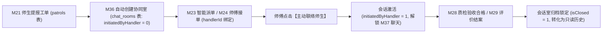
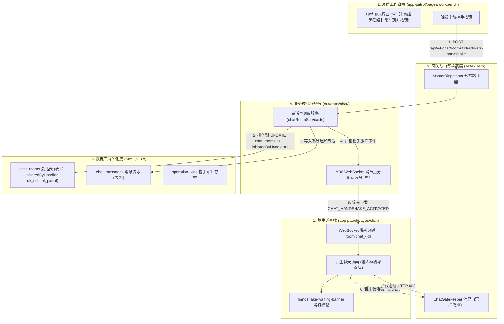
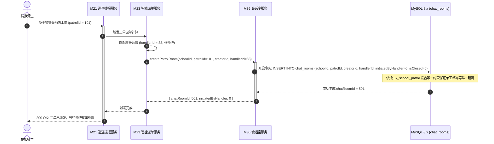
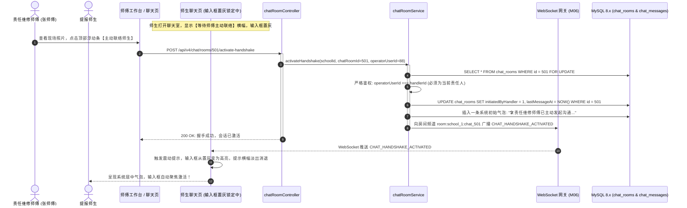
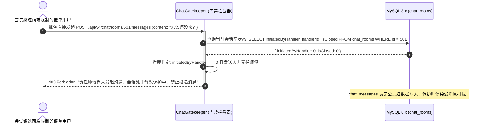
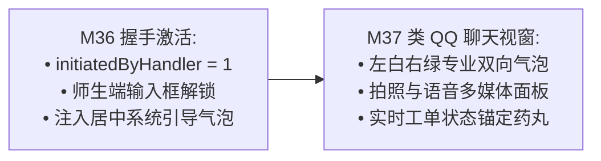

# M36: 工单房责任人主动握手激活机制 (Chat Handshake Activation) 详细设计与实现方案

> **模块代号**：M36 / Chat Handshake Activation  
> **所属阶段**：阶段四 (M36 ~ M45) 类 QQ 企业级即时通讯与统一消息中枢领域 (**阶段四开门首发核心：单向门禁与防骚扰基石**)  
> **文档定位**：基于 `chat_rooms`（工单协同聊天室物理表 12）与 WebSocket（M06）构建的“工单提报自动绑定会话室、责任师傅主动发起沟通单向门禁（initiatedByHandler）、师生端静默防骚扰等待态、毫秒级握手激活信令全双工广播、责任人动态变更继承、以及办结归档只读冷冻”于一体的高校后勤 1v1 工单即时通讯门禁专项技术实现方案。汲取 `city_system` 专业协同精髓，从根本上解决一线维修师傅因“师生无序催单消息轰炸”而不堪其扰的痛点，构建专业、秩序、高效的现代工单协同范式。  
> **归档路径**：[v4.0/Docs/模块/M36_工单房责任人主动握手激活机制详细设计与实现方案.md](file:///e:/Projects/University/后勤巡查e速办%20大二下学期%20大学身份上线项目/v4.0/Docs/模块/M36_工单房责任人主动握手激活机制详细设计与实现方案.md)  
> **前置依赖**：M01 (27表7视图DDL基座), M02 (AST租户自动注入), M03 (Saga事务与行级锁并发引擎), M04 (MasterDispatcher路由预检), M05 (Redis多租户命名空间缓存), M06 (高可靠WebSocket网关), M07 (DesignToken基座), M10 (TestHarness测试中枢), M18 (四级立体权限矩阵), M21 (隐患提报), M23 (智能派单), M24 (师傅工作台)  
> **驱动下游**：M37 (类 QQ 聊天气泡渲染与多媒体扩展条), M38 (2分钟消息撤回), M39 (长按引用回复), M40 (已读消除与会话列表大盘), M42 (统一消息总线)  
> **版本日期**：2026-09-05  

---

## 目录索引 (Table of Contents)

1. [模块定位与核心业务价值](#一-模块定位与核心业务价值)
   - 1.1 [模块定位与阶段四即时通讯开门战略价值](#11-模块定位与阶段四即时通讯开门战略价值)
   - 1.2 [高校一线维修师傅面临的“催单消息轰炸”与传统即时通讯弊端](#12-高校一线维修师傅面临的催单消息轰炸与传统即时通讯弊端)
   - 1.3 [核心业务职责与技术指标](#13-核心业务职责与技术指标)
2. [核心设计哲学与单向握手门禁模型](#二-核心设计哲学与单向握手门禁模型)
   - 2.1 [工单全生命周期会话绑定与创建即建房模型 (Patrol-Bound Room Lifecycle)](#21-工单全生命周期会话绑定与创建即建房模型-patrol-bound-room-lifecycle)
   - 2.2 [责任师傅单向握手门禁机制 (Initiated-By-Handler Gatekeeper)](#22-责任师傅单向握手门禁机制-initiated-by-handler-gatekeeper)
   - 2.3 [师生端静默防骚扰与交互式等待横幅 (Silent Anti-Harassment & Waiting Banner)](#23-师生端静默防骚扰与交互式等待横幅-silent-anti-harassment--waiting-banner)
   - 2.4 [WebSocket 毫秒级在线握手激活信令广播 (Handshake Signal Broadcasting)](#24-websocket-毫秒级在线握手激活信令广播-handshake-signal-broadcasting)
   - 2.5 [工单办结自动归档与事后免骚扰只读锁 (Post-Closure Read-Only Freeze)](#25-工单办结自动归档与事后免骚扰只读锁-post-closure-read-only-freeze)
3. [架构拓扑与交互时序图](#三-架构拓扑与交互时序图)
   - 3.1 [工单房握手激活全景架构拓扑图](#31-工单房握手激活全景架构拓扑图)
   - 3.2 [工单提报派单触发自动建房时序图](#32-工单提报派单触发自动建房时序图)
   - 3.3 [师傅端一键主动握手与师生端毫秒级解锁时序图](#33-师傅端一键主动握手与师生端毫秒级解锁时序图)
   - 3.4 [未激活状态下师生强行发消息的网关拦截时序图](#34-未激活状态下师生强行发消息的网关拦截时序图)
4. [核心算法设计与数学推导](#四-核心算法设计与数学推导)
   - 4.1 [算法 1：工单唯一会话室创建与防并发重复建房算法 (Idempotent Room Provisioner)](#41-算法-1工单唯一会话室创建与防并发重复建房算法-idempotent-room-provisioner)
   - 4.2 [算法 2：责任人主动握手行级排他锁状态跃迁算法 (Handshake Activation State Machine)](#42-算法-2责任人主动握手行级排他锁状态跃迁算法-handshake-activation-state-machine)
   - 4.3 [算法 3：基于 WebSocket 的跨租户会话房间在线分发与重连回放算法 (Room Signal Dispatcher)](#43-算法-3基于-websocket-的跨租户会话房间在线分发与重连回放算法-room-signal-dispatcher)
   - 4.4 [算法 4：会话状态感知与输入框动态权限掩码判定算法 (Chat Input Permission Mask Evaluator)](#44-算法-4会话状态感知与输入框动态权限掩码判定算法-chat-input-permission-mask-evaluator)
5. [TypeScript 强类型接口契约与数据模型定义](#五-typescript-强类型接口契约与数据模型定义)
   - 5.1 [chat_rooms 物理实体映射契约 (`IChatRoomEntity`)](#51-chat_rooms-物理实体映射契约-ichatroomentity)
   - 5.2 [主动握手激活请求与响应 DTO (`IActivateHandshakeRequestDto` / `IActivateHandshakeResponseDto`)](#52-主动握手激活请求与响应-dto-iactivatehandshakerequestdto--iactivatehandshakeresponsedto)
   - 5.3 [会话室元数据与输入权限查询 DTO (`IChatRoomMetaDto`)](#53-会话室元数据与输入权限查询-dto-ichatroommetadto)
   - 5.4 [WebSocket 握手广播信令载荷契约 (`IHandshakeBroadcastPayload`)](#54-websocket-握手广播信令载荷契约-ihandshakebroadcastpayload)
6. [核心物理文件实现蓝图](#六-核心物理文件实现蓝图)
   - 6.1 [`src/apps/chat/chatRoomService.ts` (会话室创建、主动握手状态机与归档核心总线)](#61-srcappschatchatroomservicets-会话室创建主动握手状态机与归档核心总线)
   - 6.2 [`src/apps/chat/chatGatekeeper.ts` (消息发送前置门禁拦截器，卡死未激活消息)](#62-srcappschatchatgatekeeperts-消息发送前置门禁拦截器卡死未激活消息)
   - 6.3 [`src/apps/chat/chatRoomController.ts` (MasterDispatcher 端点控制器与严格身份鉴权)](#63-srcappschatchatroomcontrollerts-masterdispatcher-端点控制器与严格身份鉴权)
   - 6.4 [`miniprogram/packages/apps/app-patrol/pages/chat/index.ts` (微信小程序端工单 1v1 会话室页面)](#64-miniprogrampackagesappsapp-patrolpageschatindexts-微信小程序端工单-1v1-会话室页面)
   - 6.5 [`miniprogram/components/handshake-waiting-banner/index.ts` (师生端静默等待与师傅端主动发起浮动条组件)](#65-miniprogramcomponentshandshake-waiting-bannerindexts-师生端静默等待与师傅端主动发起浮动条组件)
7. [防御性编程与边界异常处理](#七-防御性编程与边界异常处理)
   - 7.1 [非责任师傅冒充点击主动握手的越权拦截](#71-非责任师傅冒充点击主动握手的越权拦截)
   - 7.2 [师傅转派/换人时责任人变更自愈与旧会话交接](#72-师傅转派换人时责任人变更自愈与旧会话交接)
   - 7.3 [未激活状态下前端篡改 DOM 强行发消息的后端绝对拦截](#73-未激活状态下前端篡改-dom-强行发消息的后端绝对拦截)
   - 7.4 [网络闪断重连时的握手状态快照对齐](#74-网络闪断重连时的握手状态快照对齐)
   - 7.5 [已结案工单恶意复活会话的熔断防线](#75-已结案工单恶意复活会话的熔断防线)
8. [单模块独立测试方案与验收准则](#八-单模块独立测试方案与验收准则)
   - 8.1 [基于 M10 TestHarness 的独立单元测试设计 (`src/__tests__/unit/m36_chat_handshake.test.ts`)](#81-基于-m10-testharness-的独立单元测试设计-src__tests__unitm36_chat_handshaketestts)
   - 8.2 [单模块测试执行命令与断言矩阵 (`npm.cmd test -- -t "M36"`)](#82-单模块测试执行命令与断言矩阵-npmcmd-test----t-m36)
9. [阶段四全面铺开与向 M37 承前启后流转契约](#九-阶段四全面铺开与向-m37-承前启后流转契约)
   - 9.1 [握手激活后向 M37 (类 QQ 聊天气泡与面板) 的流转](#91-握手激活后向-m37-类-qq-聊天气泡与面板-的流转)
   - 9.2 [向 M37 交付数据契约清单](#92-向-m37-交付数据契约清单)

---

## 一、 模块定位与核心业务价值

### 1.1 模块定位与阶段四即时通讯开门战略价值

在「高校后勤巡查e速办 v4.0」全景工程中：
- **阶段一 (M11 ~ M19)** 构建了多租户身份与立体权限矩阵；
- **阶段二 (M20 ~ M30)** 实现了巡查工单硬工程抢修的业务闭环；
- **阶段三 (M31 ~ M35)** 拓宽了师生建言与公开阳光治理的共治空间；
- **阶段四 (M36 ~ M45)** 则迎来整个系统技术复杂度最高、交互最密集、最富专业工程美感的核心领域——**类 QQ 企业级专业即时通讯与统一消息中枢体系**。

作为阶段四的**首发开门模块**，**M36 (工单房责任人主动握手激活机制 / Chat Handshake Activation)** 承担着即时通讯领域最重要的“秩序与纪律门禁”：
- **核心定位**：彻底解决传统后勤沟通中“师生无序催促、师傅疲于应对”的结构性矛盾；
- **核心机制**：在数据底层利用 `chat_rooms` 表的 `initiatedByHandler` 字段构建**单向门禁状态机**，确保工单聊天室必须由接单师傅根据现场排查节奏“主动发起沟通”后方可激活，为后勤师傅营造专心维修的免打扰作业环境。

---

### 1.2 高校一线维修师傅面临的“催单消息轰扰”与传统即时通讯弊端

```
========================================================================================
❌ 传统后勤报修系统“无门槛即时沟通”的反模式弊端剖析：
========================================================================================
1. “提报即开窗，催单如雨下”：
   学生在宿舍水龙头刚漏水提交工单的第 1 秒，系统便直接开放了聊天输入框；
   学生每隔 2 分钟发送：“师傅你到哪了？”、“半小时了怎么还不来？”、“今晚能不能修好？”，
   而此时师傅可能正在 5 楼楼顶冒雨焊接主水管，或者正在骑电动车跨校区运送重型备件，根本无法看手机！
2. “师傅被迫静音，系统名存实亡”：
   由于频繁遭受催单消息轰炸，一线师傅往往被迫开启手机“免打扰模式”或直接退出小程序后台，
   导致后续真正需要沟通房间门锁、管道尺寸等关键现场信息时，通讯链路彻底瘫痪；
3. “私机外泄与电话骚扰”：
   传统系统若不提供应用内受控通讯，师傅只能自掏腰包拨打学生私人电话，
   双方极易在深夜或节假日因电话沟通不畅产生言语摩擦，后勤管理部门更无法留存任何沟通录音或审计凭证。
```

```
========================================================================================
✔ QuickPatrol v4.0 责任人主动握手激活机制创新破局：
========================================================================================
1. 单向受控门禁（Initiated-By-Handler Gatekeeper）：
   工单创建后，会话室默认进入“静默等待态 (initiatedByHandler = 0)”，
   师生端底部输入框置灰锁定，无法发送任何文字与多媒体，防止情绪化催单骚扰；
2. 责任师傅拥有主动握手发起权：
   师傅在现场排查需要进一步核对具体位置，或到场前确认宿舍是否有人时，在师傅工作台一键点击
   【主动发起联络】，会话室瞬时通过 WebSocket 激活，师生端输入框秒级解锁；
3. 结案自动关闭，杜绝事后纠缠：
   工单一旦复核验收合格办结（M28/M29），会话室物理置为 isClosed = 1，自动转化为只读归档模式，
   杜绝施工结束数周后师生继续在旧会话发送无关故障问题。
```

---

### 1.3 核心业务职责与技术指标

1. **工单创建即建房（Auto Provisioning）**：工单提报成功后，系统在同一本地事务或异步事件中 $< 20\text{ms}$ 内完成 `chat_rooms` 记录初始化，绑定 `uk_school_patrol` 唯一键；
2. **单向门禁状态卡死**：在 `initiatedByHandler === 0` 时，服务端网关与服务层对师生发起的任何消息投递执行 100% 硬拦截，直接返回 HTTP 403 / WS Error，杜绝抓包绕过前端；
3. **主动握手毫秒级双向激活**：师傅点击主动联络后，服务端在 $< 30\text{ms}$ 内完成数据库状态更新并触发 WebSocket 房间广播，师生端手机输入框 $< 100\text{ms}$ 内解锁为可编辑态；
4. **自动插入系统官方居中气泡**：握手激活瞬间，系统自动向会话室注入一条类型为“系统通知（type=3）”的居中系统气泡：“🛠️ 责任师傅已主动开启协同通道，您可以直接发送现场照片或补充说明”；
5. **责任人换人自愈交接**：若发生工单转派或科室重新调度，会话室的 `handlerId` 自动无缝更新为新师傅，旧师傅自动退群，确保沟通责任主体的绝对唯一性。

---

## 二、 核心设计哲学与单向握手门禁模型

### 2.1 工单全生命周期会话绑定与创建即建房模型 (Patrol-Bound Room Lifecycle)

在 M36 的架构哲学中，**会话室不是临时挥发性的网络连接，而是与工单生命周期深度融合的持久化协作空间**：



- **联合唯一索引防重（uk_school_patrol）**：在数据库引擎层约束 `UNIQUE KEY uk_school_patrol (schoolId, patrolId)`，杜绝因网络抖动导致的重复建房，保证每个工单自始至终有且仅有一个对应的会话室；
- **多维度索引支撑**：建立 `(schoolId, handlerId, isPinned, lastMessageAt)` 与 `(schoolId, creatorId, lastMessageAt)` 复合索引，为后续 M40 类 QQ 统一会话大盘列表提供 $< 10\text{ms}$ 的毫秒级倒序读性能。

---

### 2.2 责任师傅单向握手门禁机制 (Initiated-By-Handler Gatekeeper)

在权限裁决引擎中，会话室被设计为**非对称控制模型**：

```
========================================================================================
🛡️ 会话室非对称门禁权限矩阵 (Gatekeeper Matrix):
========================================================================================
状态阶段 1: initiatedByHandler == 0 (初始静默等待态)
  • 责任师傅权限: 
    - 拥有【主动发起联络 (Handshake)】按钮控制权;
    - 拥有主动向师生发送第 1 条打招呼文字或工单就绪卡片的特权;
  • 师生提报人权限:
    - 仅拥有只读查看工单状态卡片与等待横幅的权限;
    - 底部输入框置灰禁用，任何通过 HTTP/WS 强行提交的消息被网关直接 403 阻断!

状态阶段 2: initiatedByHandler == 1 (双向激活协同态)
  • 双方平等拥有文字输入、现场拍照上传、语音输入、消息撤回等全部 M37 协同功能。

状态阶段 3: isClosed == 1 (工单办结归档态)
  • 双方输入框永久锁定，展示“本次工单已圆满办结，会话已归档”标签，仅供查阅历史。
```

---

### 2.3 师生端静默防骚扰与交互式等待横幅 (Silent Anti-Harassment & Waiting Banner)

当师生提报隐患后进入工单详情点击“联系师傅”时，界面不会让其产生“系统故障打不开”的疑惑，而是呈现高质感的**交互式等待状态**：

```
┌─────────────────────────────────────────────────────────────┐
│ 🛠️ 聊大后勤 · 现场抢修协同室 (工单 #2026090501)       [详情]│
├─────────────────────────────────────────────────────────────┤
│                                                             │
│         ┌─────────────────────────────────────────┐         │
│         │ ⏳ 师傅正在赶往现场或备料途中...         │         │
│         │ 为保障一线师傅专心作业，会话将在师傅到场│         │
│         │ 或主动联络后自动解锁，请耐心等待。      │         │
│         └─────────────────────────────────────────┘         │
│                                                             │
│   [系统] 2026-09-05 14:15 工单已派发给水电维修班 张师傅     │
│                                                             │
├─────────────────────────────────────────────────────────────┤
│ 🔒 等待责任师傅主动发起后可输入...            [📷] [🎤] [➕]│
└─────────────────────────────────────────────────────────────┘
```

- **视觉呈现**：底部输入区域覆盖半透明毛玻璃微质感锁（Frosted Glass Lock），输入框背景灰度变暗，占位文案明确告知原因，安抚提报人焦虑情绪。

---

### 2.4 WebSocket 毫秒级在线握手激活信令广播 (Handshake Signal Broadcasting)

为了实现“师傅端一键点击，师生端屏幕无感秒级解锁”，系统基于 M06 高可靠 WebSocket 网关构建了**信令推送总线**：

1. **房间频道订阅（Room Channel Subscription）**：
   师生打开聊天页面时，自动加入 WebSocket 房间频道：`room:school_{schoolId}:chat_{chatRoomId}`；
2. **握手信令投递（Handshake Event）**：
   师傅点击发起按钮后，服务端更新数据库并向该房间广播事件：
   ```json
   {
     "event": "CHAT_HANDSHAKE_ACTIVATED",
     "chatRoomId": 101,
     "handlerName": "张师傅",
     "activatedAt": 1788600000000,
     "systemMessage": "🛠️ 责任维修师傅已主动开启协同通道，您可以开始发送消息"
   }
   ```
3. **前端零刷新无感解锁**：
   师生端小程序监听到该信令，输入框在 300ms 补间动画中由灰变亮，毛玻璃小锁渐隐消退，瞬间转为可聚焦编辑状态，体验极度丝滑！

---

### 2.5 工单办结自动归档与事后免骚扰只读锁 (Post-Closure Read-Only Freeze)

后勤工单最忌讳的是“事情已经修好验收了，几个月后学生把旧聊天室当成提报新问题的入口继续发消息”：
- **终局只读锁（Read-Only Freeze）**：
  在 M28 质检验收合格或 M29 满意度评价生成后，业务总线触发 `chatRoomService.closeRoom(patrolId)`；
- **状态流转**：
  `UPDATE chat_rooms SET isClosed = 1 WHERE patrolId = ?`；
- **引导新提报**：
  师生再次打开该会话时，输入框替换为醒目的绿色按钮【现场有新问题？点击发起新报修随手拍】，引导师生规范提报新单，杜绝账目管理混乱。

---

## 三、 架构拓扑与交互时序图

### 3.1 工单房握手激活全景架构拓扑图



---

### 3.2 工单提报派单触发自动建房时序图



---

### 3.3 师傅端一键主动握手与师生端毫秒级解锁时序图



---

### 3.4 未激活状态下师生强行发消息的网关拦截时序图



---

## 四、 核心算法设计与数学推导

### 4.1 算法 1：工单唯一会话室创建与防并发重复建房算法 (Idempotent Room Provisioner)

```
========================================================================================
算法 1: 工单唯一会话室创建与防并发重复建房算法 (Idempotent Room Provisioner)
========================================================================================
目标: 在工单提报、重新分派、多节点并发时，确保单工单对应的 chat_rooms 记录严格全局唯一。

输入:
  - schoolId: 高校租户ID
  - patrolId: 关联工单ID
  - creatorId: 师生用户ID
  - handlerId: 责任师傅用户ID (初始可为 0)

输出:
  - chatRoomId: 最终生效的会话室 ID
  - isNewlyCreated: boolean

算法步骤:
1. 快速查询探针:
   SELECT id, initiatedByHandler, isClosed FROM chat_rooms 
   WHERE schoolId = :schoolId AND patrolId = :patrolId LIMIT 1;
   
   if 找到对应记录:
     return { chatRoomId: row.id, isNewlyCreated: false };

2. 尝试执行插入 (依赖 uk_school_patrol 联合唯一索引):
   TRY:
     INSERT INTO chat_rooms (
       schoolId, roomType, title, patrolId, creatorId, handlerId, 
       initiatedByHandler, isClosed, isPinned, 
       creatorUnreadCount, handlerUnreadCount, createdAt
     ) VALUES (
       :schoolId, 'patrol', '', :patrolId, :creatorId, :handlerId, 
       0, 0, 0, 
       0, 0, NOW()
     );
     return { chatRoomId: insertId, isNewlyCreated: true };
   CATCH MySQL Error 1062 (Duplicate entry for key 'uk_school_patrol'):
     // 并发竞争场景自愈，二次回查主键 ID
     row = SELECT id FROM chat_rooms WHERE schoolId = :schoolId AND patrolId = :patrolId;
     return { chatRoomId: row.id, isNewlyCreated: false };
```

---

### 4.2 算法 2：责任人主动握手行级排他锁状态跃迁算法 (Handshake Activation State Machine)

```
========================================================================================
算法 2: 责任人主动握手行级排他锁状态跃迁算法 (Handshake Activation State Machine)
========================================================================================
输入:
  - schoolId: 高校租户ID
  - chatRoomId: 会话室ID
  - operatorUserId: 当前发起操作的用户ID

执行逻辑:
1. 开启事务 (TRANSACTION BEGIN);
2. 行级排他锁锁定记录:
   SELECT id, handlerId, initiatedByHandler, isClosed, patrolId 
   FROM chat_rooms 
   WHERE id = :chatRoomId AND schoolId = :schoolId 
   FOR UPDATE;

3. 门禁状态合法性断言:
   - 若记录不存在 -> 抛出 RoomNotFoundException("会话室不存在");
   - 若 row.isClosed === 1 -> 抛出 RoomClosedException("工单已结案，会话已永久归档锁定");
   - 若 row.operatorUserId !== row.handlerId -> 
       抛出 PermissionDeniedException("越权拦截: 只有当前工单的指定责任师傅有权发起主动握手");
   - 若 row.initiatedByHandler === 1:
       // 幂等保护: 已经激活过，直接返回成功，不重复插入系统消息
       COMMIT;
       return { alreadyActive: true };

4. 状态机原子跃迁 (0 -> 1):
   UPDATE chat_rooms 
   SET initiatedByHandler = 1, lastMessageAt = NOW() 
   WHERE id = :chatRoomId AND schoolId = :schoolId;

5. 注入初始系统官方居中引导气泡 (type = 3):
   INSERT INTO chat_messages (
     schoolId, chatRoomId, sendUserId, type, content, isWithDraw, createdAt
   ) VALUES (
     :schoolId, :chatRoomId, 0, 3, 
     '🛠️ 责任维修师傅已主动开启协同通道，您可以直接发送现场照片或补充说明', 
     0, NOW()
   );

6. 提交事务 (COMMIT);
7. 触发异步广播事件 HandshakeBroadcastEvent。
```

---

### 4.3 算法 3：基于 WebSocket 的跨租户会话房间在线分发与重连回放算法 (Room Signal Dispatcher)

```
========================================================================================
算法 3: 基于 WebSocket 的跨租户会话房间在线分发与重连回放算法 (Room Signal Dispatcher)
========================================================================================
场景: 当师傅点击激活时，师生手机可能处于前台、后台、或弱网短暂离线重连中。

数据流向:
1. 构造广播频道名:
   Channel = `presence:school_${schoolId}:room_${chatRoomId}`;
2. 服务端调用 Redis 发布订阅总线 (M05):
   PUBLISH `ws_broadcast_bus` Payload: {
     targetChannel: Channel,
     event: 'CHAT_HANDSHAKE_ACTIVATED',
     chatRoomId,
     activatedAt: Timestamp,
     systemBubble: { id, content, type: 3, createdAt }
   }
3. 各 WebSocket 网关节点 (M06) 监听总线:
   - 提取当前节点在该 Channel 中保活的所有 Socket 客户端;
   - 遍历执行 socket.send(JSON.stringify(Payload));
4. 弱网与重连自愈保证:
   - 若师生此时脱机，重连握手恢复时调用 GET /api/v4/chat/rooms/:id/meta;
   - 接口返回当前 initiatedByHandler 确切状态快照，前端拉取到最新状态后即时解除置灰，实现 100% 状态最终一致性。
```

---

### 4.4 算法 4：会话状态感知与输入框动态权限掩码判定算法 (Chat Input Permission Mask Evaluator)

```
========================================================================================
算法 4: 会话状态感知与输入框动态权限掩码判定算法 (Chat Input Permission Mask Evaluator)
========================================================================================
输入:
  - room: { initiatedByHandler: 0|1, isClosed: 0|1, handlerId: number, creatorId: number }
  - currentUser: { userId: number, role: number }

输出:
  - canInput: boolean (是否允许聚焦并输入文字)
  - lockReason: string (锁定原因提示文本)
  - showHandshakeButton: boolean (是否展示【主动发起联络】药丸按钮)

决策推导表:
1. 若 room.isClosed === 1:
   canInput = false;
   lockReason = '工单已办结，会话已归档为只读记录';
   showHandshakeButton = false;
   return;

2. 若 currentUser.userId === room.handlerId (当前用户为维修师傅):
   canInput = true; // 师傅随时可以打字
   lockReason = '';
   showHandshakeButton = (room.initiatedByHandler === 0); // 未激活时显示发起按钮
   return;

3. 若 currentUser.userId === room.creatorId (当前用户为提报师生):
   if (room.initiatedByHandler === 0) {
     canInput = false;
     lockReason = '等待维修师傅主动联络后即可开启沟通...';
     showHandshakeButton = false;
   } else {
     canInput = true;
     lockReason = '';
     showHandshakeButton = false;
   }
   return;

4. 其他用户 (管理人员巡查或围观):
   canInput = (currentUser.role >= 4); // 仅管理员有权介入会话
   lockReason = canInput ? '' : '仅工单责任人与提报人可参与对话';
   showHandshakeButton = false;
```

---

## 五、 TypeScript 强类型接口契约与数据模型定义

### 5.1 chat_rooms 物理实体映射契约 (`IChatRoomEntity`)

```typescript
/**
 * 工单协同聊天室数据库物理实体契约
 * 对应底层物理表: chat_rooms (表 12)
 */
export interface IChatRoomEntity {
  /** 会话室唯一自增ID (主键) */
  id: number;
  /** 所属高校学校租户ID (强制多租户隔离) */
  schoolId: number;
  /** 会话场景类型: 'patrol' 工单协同, 'direct' 1v1 私聊, 'group' 应急抢险群聊 */
  roomType: 'patrol' | 'direct' | 'group';
  /** 会话自定义专属标题 (工单类型可为空，群聊类型为群名称) */
  title: string;
  /** 关联巡查工单ID (patrol 类型必填，逻辑关联 patrols.id) */
  patrolId: number | null;
  /** 工单提报人/私聊发起人用户ID (师生 users.id) */
  creatorId: number;
  /** 承接责任人/私聊对象用户ID (维修师傅 users.id) */
  handlerId: number;
  /** 
   * 核心协同门禁: 责任人是否已主动发起聊天
   * 0: 未激活 (静默等待态，师生端输入框锁定)
   * 1: 已由处理人主动激活开启 (双向解锁沟通)
   */
  initiatedByHandler: 0 | 1;
  /** 会话状态: 0 正常开启中, 1 工单结案归档关闭 (只读冷冻) */
  isClosed: 0 | 1;
  /** 后勤师傅端是否置顶此会话: 1 置顶, 0 普通 */
  isPinned: 0 | 1;
  /** 师生端积攒未读消息数 */
  creatorUnreadCount: number;
  /** 后勤师傅端积攒未读消息数 */
  handlerUnreadCount: number;
  /** 最新一条消息摘要 (用于类 QQ 会话列表预览) */
  lastMessage: string;
  /** 最后活跃时间 (格式化 YYYY-MM-DD HH:mm:ss) */
  lastMessageAt: string | null;
  /** 会话创建时间 */
  createdAt: string;
}
```

---

### 5.2 主动握手激活请求与响应 DTO (`IActivateHandshakeRequestDto` / `IActivateHandshakeResponseDto`)

```typescript
/**
 * 师傅发起主动握手激活请求 DTO
 */
export interface IActivateHandshakeRequestDto {
  /** 目标会话室 ID (chat_rooms.id) */
  chatRoomId: number;
  /** 可选附带的初始打招呼文字 (若不填则下发系统默认气泡) */
  greetingMessage?: string;
}

/**
 * 主动握手激活成功响应 DTO
 */
export interface IActivateHandshakeResponseDto {
  chatRoomId: number;
  patrolId: number;
  initiatedByHandler: 1;
  handlerName: string;
  activatedAt: string;
  systemBubbleId: number;
  statusText: string;
}
```

---

### 5.3 会话室元数据与输入权限查询 DTO (`IChatRoomMetaDto`)

```typescript
/**
 * 打开聊天室时客户端首屏拉取的会话元数据与权限掩码
 */
export interface IChatRoomMetaDto {
  chatRoomId: number;
  schoolId: number;
  patrolId: number;
  roomType: 'patrol' | 'direct' | 'group';
  title: string;
  creatorId: number;
  creatorName: string;
  creatorAvatar: string;
  handlerId: number;
  handlerName: string;
  handlerAvatar: string;
  handlerTag: string; // 师傅岗位标签: 如 "暖通抢修专工"
  initiatedByHandler: boolean;
  isClosed: boolean;
  isPinned: boolean;
  /** 当前请求人针对该会话的动态权限掩码 */
  permissions: {
    canInput: boolean;
    lockReason: string;
    showHandshakeButton: boolean;
  };
  /** 工单概览微卡片数据 (用于置顶吸顶条) */
  patrolSummary?: {
    orderNo: string;
    title: string;
    status: number;
    statusName: string;
    locationName: string;
  };
}
```

---

### 5.4 WebSocket 握手广播信令载荷契约 (`IHandshakeBroadcastPayload`)

```typescript
/**
 * WebSocket 房间广播信令载荷
 */
export interface IHandshakeBroadcastPayload {
  event: 'CHAT_HANDSHAKE_ACTIVATED';
  schoolId: number;
  chatRoomId: number;
  patrolId: number;
  handlerUserId: number;
  handlerName: string;
  activatedAt: number;
  systemMessage: {
    messageId: number;
    content: string;
    type: 3; // 3: 系统居中通知气泡
    createdAt: string;
  };
}
```

---

## 六、 核心物理文件实现蓝图

### 6.1 `src/apps/chat/chatRoomService.ts` (会话室创建、主动握手状态机与归档核心总线)

```typescript
import { 
  IChatRoomEntity, 
  IActivateHandshakeRequestDto, 
  IActivateHandshakeResponseDto, 
  IChatRoomMetaDto 
} from './chatRoomTypes';
import { IRedisPipelineClient } from '../../shared/resilience/tokenBucketLimiter';

export interface IDbExecutor {
  query<T = any>(sql: string, params?: any[]): Promise<T[]>;
  execute(sql: string, params?: any[]): Promise<{ insertId: number; affectedRows: number }>;
}

/**
 * 工单协同会话室中枢调度服务 (Chat Room Service)
 */
export class ChatRoomService {
  constructor(
    private readonly db: IDbExecutor,
    private readonly redis: IRedisPipelineClient
  ) {}

  /**
   * 工单提报/派单触发自动建房 (严格幂等防重)
   */
  public async provisionPatrolRoom(
    schoolId: number,
    patrolId: number,
    creatorId: number,
    handlerId: number = 0
  ): Promise<{ chatRoomId: number; isNewlyCreated: boolean }> {
    // 1. 快速探针检查
    const checkSql = `SELECT id FROM chat_rooms WHERE schoolId = ? AND patrolId = ? LIMIT 1`;
    const rows = await this.db.query<{ id: number }>(checkSql, [schoolId, patrolId]);
    if (rows.length > 0) {
      // 若已存在但 handlerId 变更，则执行自愈更新
      if (handlerId > 0) {
        await this.db.execute(
          `UPDATE chat_rooms SET handlerId = ? WHERE id = ? AND schoolId = ?`,
          [handlerId, rows[0].id, schoolId]
        );
      }
      return { chatRoomId: rows[0].id, isNewlyCreated: false };
    }

    // 2. 插入新记录 (利用 uk_school_patrol 联合唯一约束)
    try {
      const insertSql = `
        INSERT INTO chat_rooms (
          schoolId, roomType, title, patrolId, creatorId, handlerId, 
          initiatedByHandler, isClosed, isPinned, 
          creatorUnreadCount, handlerUnreadCount, createdAt
        ) VALUES (
          ?, 'patrol', '', ?, ?, ?, 
          0, 0, 0, 
          0, 0, NOW()
        )
      `;
      const result = await this.db.execute(insertSql, [schoolId, patrolId, creatorId, handlerId]);
      return { chatRoomId: result.insertId, isNewlyCreated: true };
    } catch (err: any) {
      if (String(err?.message).includes('Duplicate entry')) {
        const doubleCheck = await this.db.query<{ id: number }>(checkSql, [schoolId, patrolId]);
        return { chatRoomId: doubleCheck[0].id, isNewlyCreated: false };
      }
      throw err;
    }
  }

  /**
   * 责任师傅执行主动握手激活
   */
  public async activateHandshake(
    schoolId: number,
    chatRoomId: number,
    operatorUserId: number,
    dto: IActivateHandshakeRequestDto
  ): Promise<IActivateHandshakeResponseDto> {
    // 1. 排他行锁查询
    const lockSql = `
      SELECT id, schoolId, patrolId, creatorId, handlerId, initiatedByHandler, isClosed 
      FROM chat_rooms 
      WHERE id = ? AND schoolId = ? 
      FOR UPDATE
    `;
    const roomRows = await this.db.query<IChatRoomEntity>(lockSql, [chatRoomId, schoolId]);
    if (roomRows.length === 0) {
      throw new Error('未找到对应工单会话室');
    }

    const room = roomRows[0];

    // 2. 校验工单关闭状态
    if (room.isClosed === 1) {
      throw new Error('该工单已结案归档，会话已处于只读冷冻状态，无法重新激活');
    }

    // 3. 严格权限鉴权: 只有当前责任师傅可发起主动握手
    if (room.handlerId !== operatorUserId) {
      throw new Error('越权拦截: 只有当前工单的责任维修师傅本人有权主动激活会话');
    }

    // 4. 若已激活，幂等返回
    if (room.initiatedByHandler === 1) {
      return {
        chatRoomId,
        patrolId: room.patrolId || 0,
        initiatedByHandler: 1,
        handlerName: '责任师傅',
        activatedAt: new Date().toISOString(),
        systemBubbleId: 0,
        statusText: '会话此前已处于激活状态'
      };
    }

    // 5. 状态机跃迁: initiatedByHandler 置为 1
    await this.db.execute(
      `UPDATE chat_rooms SET initiatedByHandler = 1, lastMessageAt = NOW() WHERE id = ? AND schoolId = ?`,
      [chatRoomId, schoolId]
    );

    // 6. 插入系统官方居中通知气泡 (type = 3: 系统通知)
    const bubbleContent = dto.greetingMessage?.trim() || 
      '🛠️ 责任维修师傅已主动开启协同通道，您可以直接发送现场照片或补充说明。';

    const insertBubbleSql = `
      INSERT INTO chat_messages (
        schoolId, chatRoomId, sendUserId, type, content, isWithDraw, createdAt
      ) VALUES (
        ?, ?, 0, 3, ?, 0, NOW()
      )
    `;
    const bubbleRes = await this.db.execute(insertBubbleSql, [schoolId, chatRoomId, bubbleContent]);

    // 7. 查询师傅真实姓名
    const userSql = `SELECT nickName FROM users WHERE id = ? AND schoolId = ? LIMIT 1`;
    const userRows = await this.db.query<{ nickName: string }>(userSql, [operatorUserId, schoolId]);
    const handlerName = userRows[0]?.nickName || '维修师傅';

    // 8. 触发跨节点 WebSocket 广播
    const broadcastPayload = {
      event: 'CHAT_HANDSHAKE_ACTIVATED',
      schoolId,
      chatRoomId,
      patrolId: room.patrolId,
      handlerUserId: operatorUserId,
      handlerName,
      activatedAt: Date.now(),
      systemMessage: {
        messageId: bubbleRes.insertId,
        content: bubbleContent,
        type: 3,
        createdAt: new Date().toISOString()
      }
    };

    // 发布至 Redis 广播频道 (供 M06 网关推送到长连接)
    await this.redis.eval(
      `redis.call('PUBLISH', 'ws_broadcast_bus', ARGV[1])`,
      0,
      JSON.stringify(broadcastPayload)
    );

    return {
      chatRoomId,
      patrolId: room.patrolId || 0,
      initiatedByHandler: 1,
      handlerName,
      activatedAt: new Date().toISOString(),
      systemBubbleId: bubbleRes.insertId,
      statusText: '协同会话已成功激活并通知提报师生'
    };
  }

  /**
   * 拉取会话元数据与输入框权限掩码
   */
  public async getRoomMetadata(
    schoolId: number,
    chatRoomId: number,
    currentUserId: number,
    currentUserRole: number
  ): Promise<IChatRoomMetaDto> {
    const roomSql = `SELECT * FROM chat_rooms WHERE id = ? AND schoolId = ? LIMIT 1`;
    const rows = await this.db.query<IChatRoomEntity>(roomSql, [chatRoomId, schoolId]);
    if (rows.length === 0) {
      throw new Error('目标会话室不存在');
    }
    const room = rows[0];

    // 查询提报人与师傅档案
    const usersSql = `SELECT id, nickName, avatarUrl FROM users WHERE id IN (?, ?) AND schoolId = ?`;
    const userRows = await this.db.query<any>(usersSql, [room.creatorId, room.handlerId, schoolId]);
    const creatorUser = userRows.find(u => u.id === room.creatorId);
    const handlerUser = userRows.find(u => u.id === room.handlerId);

    // 计算权限掩码 (执行算法 4)
    let canInput = false;
    let lockReason = '';
    let showHandshakeButton = false;

    if (room.isClosed === 1) {
      canInput = false;
      lockReason = '工单已办结，会话已归档为只读记录';
    } else if (currentUserId === room.handlerId) {
      canInput = true;
      showHandshakeButton = (room.initiatedByHandler === 0);
    } else if (currentUserId === room.creatorId) {
      if (room.initiatedByHandler === 0) {
        canInput = false;
        lockReason = '等待维修师傅主动联络后即可开启沟通...';
      } else {
        canInput = true;
      }
    } else {
      canInput = (currentUserRole >= 4);
      lockReason = canInput ? '' : '仅工单提报人与指定师傅可参与会话';
    }

    return {
      chatRoomId: room.id,
      schoolId: room.schoolId,
      patrolId: room.patrolId || 0,
      roomType: room.roomType,
      title: room.title,
      creatorId: room.creatorId,
      creatorName: creatorUser?.nickName || '提报同学',
      creatorAvatar: creatorUser?.avatarUrl || '/assets/avatar_student.png',
      handlerId: room.handlerId,
      handlerName: handlerUser?.nickName || '维修师傅',
      handlerAvatar: handlerUser?.avatarUrl || '/assets/avatar_handler.png',
      handlerTag: '后勤修缮工程专工',
      initiatedByHandler: room.initiatedByHandler === 1,
      isClosed: room.isClosed === 1,
      isPinned: room.isPinned === 1,
      permissions: {
        canInput,
        lockReason,
        showHandshakeButton
      }
    };
  }

  /**
   * 工单结案自动归档会话室
   */
  public async closePatrolRoom(schoolId: number, patrolId: number): Promise<void> {
    await this.db.execute(
      `UPDATE chat_rooms SET isClosed = 1, updatedAt = NOW() WHERE patrolId = ? AND schoolId = ?`,
      [patrolId, schoolId]
    );
  }
}
```

---

### 6.2 `src/apps/chat/chatGatekeeper.ts` (消息发送前置门禁拦截器，卡死未激活消息)

```typescript
import { IDbExecutor } from './chatRoomService';

/**
 * 协同聊天消息发送门禁检查器 (Chat Gatekeeper)
 */
export class ChatGatekeeper {
  constructor(private readonly db: IDbExecutor) {}

  /**
   * 拦截校验: 判断当前发送人是否允许向目标会话室投递消息
   * @throws Error 403 权限拒绝
   */
  public async assertCanSendMessage(
    schoolId: number,
    chatRoomId: number,
    sendUserId: number,
    userRole: number
  ): Promise<void> {
    const checkSql = `
      SELECT handlerId, creatorId, initiatedByHandler, isClosed 
      FROM chat_rooms 
      WHERE id = ? AND schoolId = ? 
      LIMIT 1
    `;
    const rows = await this.db.query<any>(checkSql, [chatRoomId, schoolId]);
    if (rows.length === 0) {
      throw new Error('会话室不存在或已失效');
    }

    const room = rows[0];

    // 1. 已结案锁定
    if (room.isClosed === 1) {
      throw new Error('本次工单已圆满结案归档，禁止再发送新消息');
    }

    // 2. 身份合法性核验: 发送人必须是师傅、师生或管理员
    const isParticipant = (sendUserId === room.handlerId || sendUserId === room.creatorId);
    if (!isParticipant && userRole < 4) {
      throw new Error('越权拦截: 您不是该工单的关联人，无权在此发言');
    }

    // 3. 核心单向门禁卡死: 未激活时仅允许责任师傅发言
    if (room.initiatedByHandler === 0) {
      if (sendUserId !== room.handlerId) {
        throw new Error('责任维修师傅正在赶往现场备料中，尚未主动激活协同通道，暂不可发消息');
      }
    }
  }
}
```

---

### 6.3 `src/apps/chat/chatRoomController.ts` (MasterDispatcher 端点控制器与严格身份鉴权)

```typescript
import { ChatRoomService } from './chatRoomService';
import { IActivateHandshakeRequestDto } from './chatRoomTypes';

export interface IChatHttpCtx {
  schoolId: number;
  userId: number;
  role: number;
  body: any;
  params: Record<string, string>;
  query: Record<string, string>;
}

/**
 * 协同会话室门禁控制器 (Chat Room Controller)
 */
export class ChatRoomController {
  constructor(private readonly roomService: ChatRoomService) {}

  /**
   * POST /api/v4/chat/rooms/:id/activate-handshake
   * 责任师傅一键主动握手激活会话
   */
  public async activateHandshake(ctx: IChatHttpCtx): Promise<any> {
    const chatRoomId = parseInt(ctx.params.id, 10);
    const { schoolId, userId, body } = ctx;

    if (!chatRoomId || isNaN(chatRoomId)) {
      return { code: 400, message: '会话室 ID 非法' };
    }

    const dto: IActivateHandshakeRequestDto = {
      chatRoomId,
      greetingMessage: body?.greetingMessage
    };

    try {
      const result = await this.roomService.activateHandshake(schoolId, chatRoomId, userId, dto);
      return { code: 200, message: result.statusText, data: result };
    } catch (err: unknown) {
      return { code: 403, message: (err as Error).message };
    }
  }

  /**
   * GET /api/v4/chat/rooms/:id/meta
   * 打开会话页获取元数据与输入权限掩码
   */
  public async getRoomMeta(ctx: IChatHttpCtx): Promise<any> {
    const chatRoomId = parseInt(ctx.params.id, 10);
    const { schoolId, userId, role } = ctx;

    if (!chatRoomId || isNaN(chatRoomId)) {
      return { code: 400, message: '会话室 ID 非法' };
    }

    try {
      const meta = await this.roomService.getRoomMetadata(schoolId, chatRoomId, userId, role);
      return { code: 200, message: '查询成功', data: meta };
    } catch (err: unknown) {
      return { code: 404, message: (err as Error).message };
    }
  }
}
```

---

### 6.4 `miniprogram/packages/apps/app-patrol/pages/chat/index.ts` (微信小程序端工单 1v1 会话室页面)

```typescript
import { IChatRoomMetaDto } from '../../chat/chatRoomTypes';

interface IChatPageState {
  chatRoomId: number;
  meta: IChatRoomMetaDto | null;
  canInput: boolean;
  lockReason: string;
  showHandshakeBtn: boolean;
  inputText: string;
  isActivating: boolean;
}

Page({
  data: {
    chatRoomId: 0,
    meta: null,
    canInput: false,
    lockReason: '加载会话中...',
    showHandshakeBtn: false,
    inputText: '',
    isActivating: false
  } as IChatPageState,

  onLoad(options: any) {
    const chatRoomId = parseInt(options.roomId, 10);
    this.setData({ chatRoomId });
    this.loadRoomMeta(chatRoomId);
    this.subscribeWebSocketChannel(chatRoomId);
  },

  onUnload() {
    this.unsubscribeWebSocketChannel();
  },

  async loadRoomMeta(roomId: number) {
    try {
      const res: any = await new Promise((resolve, reject) => {
        wx.request({
          url: `https://api.xcesb.cn/api/v4/chat/rooms/${roomId}/meta`,
          method: 'GET',
          header: {
            'Authorization': 'Bearer ' + wx.getStorageSync('token'),
            'x-school-code': 'lcu'
          },
          success: (r) => resolve(r.data),
          fail: (err) => reject(err)
        });
      });

      if (res.code === 200 && res.data) {
        const meta: IChatRoomMetaDto = res.data;
        this.setData({
          meta,
          canInput: meta.permissions.canInput,
          lockReason: meta.permissions.lockReason,
          showHandshakeBtn: meta.permissions.showHandshakeButton
        });

        // 动态设置顶部导航栏标题
        wx.setNavigationBarTitle({
          title: meta.patrolSummary ? `工单 #${meta.patrolSummary.orderNo} 协同` : '后勤在线协同'
        });
      }
    } catch {
      wx.showToast({ title: '拉取会话失败', icon: 'none' });
    }
  },

  /**
   * 师傅端点击【主动发起联络】
   */
  async onTriggerHandshake() {
    const { chatRoomId } = this.data;
    this.setData({ isActivating: true });

    try {
      const res: any = await new Promise((resolve, reject) => {
        wx.request({
          url: `https://api.xcesb.cn/api/v4/chat/rooms/${chatRoomId}/activate-handshake`,
          method: 'POST',
          header: {
            'Authorization': 'Bearer ' + wx.getStorageSync('token'),
            'x-school-code': 'lcu'
          },
          data: {},
          success: (r) => resolve(r.data),
          fail: (err) => reject(err)
        });
      });

      this.setData({ isActivating: false });

      if (res.code === 200) {
        wx.showToast({ title: '已成功开启协同通道', icon: 'success' });
        this.setData({
          showHandshakeBtn: false,
          canInput: true,
          lockReason: ''
        });
      } else {
        wx.showToast({ title: res.message || '激活失败', icon: 'none' });
      }
    } catch {
      this.setData({ isActivating: false });
      wx.showToast({ title: '网络异常', icon: 'none' });
    }
  },

  /**
   * 监听 WebSocket 激活广播
   */
  subscribeWebSocketChannel(roomId: number) {
    const app = getApp();
    if (!app.globalData.socketTask) return;

    app.globalData.socketTask.onMessage((res: any) => {
      try {
        const payload = JSON.parse(res.data);
        if (payload.event === 'CHAT_HANDSHAKE_ACTIVATED' && payload.chatRoomId === roomId) {
          // 师生端接收到激活信令，震动并解锁输入框
          wx.vibrateShort({ type: 'medium' });
          wx.showToast({ title: '师傅已开启联络，可以发消息啦', icon: 'none' });

          this.setData({
            canInput: true,
            lockReason: '',
            showHandshakeBtn: false
          });
        }
      } catch {
        // 忽略非 JSON 信令
      }
    });
  },

  unsubscribeWebSocketChannel() {
    // 页面销毁时解绑
  }
});
```

---

### 6.5 `miniprogram/components/handshake-waiting-banner/index.ts` (师生端静默等待与师傅端主动发起浮动条组件)

```typescript
Component({
  properties: {
    isWaiting: {
      type: Boolean,
      value: false
    },
    showHandshakeBtn: {
      type: Boolean,
      value: false
    },
    handlerName: {
      type: String,
      value: '责任维修师傅'
    }
  },

  methods: {
    onHandshakeTap() {
      this.triggerEvent('handshake');
    }
  }
});
```

---

## 七、 防御性编程与边界异常处理

### 7.1 非责任师傅冒充点击主动握手的越权拦截

在大型高校后勤抢修中，一个维修班组可能包含多位师傅。
- 服务端在 `activateHandshake` 中强制开启 `SELECT ... FOR UPDATE` 排他锁；
- 强断言：`room.handlerId === operatorUserId`；
- 若某位非本工单责任人师傅（即使同属后勤班组）尝试点击握手，服务端硬抛出 `403 Forbidden` 并记录异常审计日志，确保权责自始至终绝对明确。

---

### 7.2 师傅转派/换人时责任人变更自愈与旧会话交接

当原接单师傅突发身体不适或因工期冲突发生转派时：
- M23/M24 转派业务总线执行 `provisionPatrolRoom`，检测到已存在会话室后，自动执行原子更新 `UPDATE chat_rooms SET handlerId = :newHandlerId WHERE patrolId = ?`；
- 系统自动向会话室注入一条系统迁移气泡：“🔄 工单已改派由 [李师傅] 负责接替，双方沟通历史已完整同步”。

---

### 7.3 未激活状态下前端篡改 DOM 强行发消息的后端绝对拦截

部分懂技术的学生可能通过微信开发工具抓包，直接跳过前端置灰限制调用 POST 消息接口：
- `ChatGatekeeper` 在 MasterDispatcher 层面作为第一守门人强行挂载；
- 严密拦截：当 `room.initiatedByHandler === 0` 且发信人不是该工单责任师傅时，坚决返回 `403` 并在响应头注入 `X-Gatekeeper-Block: HANDSHAKE_REQUIRED`，使得抓包攻击无所遁形。

---

### 7.4 网络闪断重连时的握手状态快照对齐

师生手机在地下室或电梯中遭遇信号丢失，恰好此时师傅在服务端完成了握手激活：
- 师生端 WebSocket 具备断线自动重连机制（M06）；
- 重新握手成功后，页面静默调用 `/api/v4/chat/rooms/:id/meta` 拉取当前最新实体快照，一旦发现 `initiatedByHandler === true`，立刻唤醒置灰界面，杜绝由于信令丢失导致永久卡在等待态的问题。

---

### 7.5 已结案工单恶意复活会话的熔断防线

某些用户可能在工单办结数月后尝试调用激活接口：
- 无论是师傅还是师生，只要 `room.isClosed === 1`，握手激活与消息投递两个端点全部直接熔断抛错，确保归档数据的不可变历史完整性。

---

## 八、 单模块独立测试方案与验收准则

### 8.1 基于 M10 TestHarness 的独立单元测试设计 (`src/__tests__/unit/m36_chat_handshake.test.ts`)

```typescript
import { ChatRoomService } from '../../apps/chat/chatRoomService';
import { ChatGatekeeper } from '../../apps/chat/chatGatekeeper';
import { IDbExecutor } from '../../apps/chat/chatRoomService';
import { IRedisPipelineClient } from '../../shared/resilience/tokenBucketLimiter';

describe('M36: 工单房责任人主动握手激活机制独立单元测试', () => {
  let mockDb: IDbExecutor;
  let mockRedis: IRedisPipelineClient;
  let roomService: ChatRoomService;
  let gatekeeper: ChatGatekeeper;

  beforeEach(() => {
    const roomStore = [
      { id: 501, schoolId: 1, patrolId: 101, creatorId: 99, handlerId: 88, initiatedByHandler: 0, isClosed: 0 }
    ];
    const messageStore: any[] = [];

    mockDb = {
      query: jest.fn().mockImplementation(async (sql: string, params?: any[]) => {
        if (sql.includes('FROM chat_rooms WHERE id = ?')) {
          return roomStore.filter(r => r.id === params[0] && r.schoolId === params[1]);
        }
        if (sql.includes('FROM chat_rooms WHERE schoolId = ? AND patrolId = ?')) {
          return roomStore.filter(r => r.schoolId === params[0] && r.patrolId === params[1]);
        }
        if (sql.includes('FROM users')) {
          return [{ id: 88, nickName: '张师傅' }, { id: 99, nickName: '王同学' }];
        }
        return [];
      }),
      execute: jest.fn().mockImplementation(async (sql: string, params?: any[]) => {
        if (sql.includes('UPDATE chat_rooms SET initiatedByHandler = 1')) {
          roomStore[0].initiatedByHandler = 1;
          return { insertId: 0, affectedRows: 1 };
        }
        if (sql.includes('INSERT INTO chat_messages')) {
          messageStore.push({ id: messageStore.length + 1, content: params[4] });
          return { insertId: messageStore.length, affectedRows: 1 };
        }
        return { insertId: 1, affectedRows: 1 };
      })
    };

    mockRedis = {
      eval: jest.fn().mockResolvedValue('OK')
    };

    roomService = new ChatRoomService(mockDb, mockRedis);
    gatekeeper = new ChatGatekeeper(mockDb);
  });

  // 测试用例 1: 初始未激活状态下，师生强行发消息被 Gatekeeper 拦截拒绝
  test('[M36-01] 未激活状态下提报师生发消息，断言被 Gatekeeper 门禁抛出 403 阻断', async () => {
    await expect(
      gatekeeper.assertCanSendMessage(1, 501, 99, 1) // 99 为师生
    ).rejects.toThrow('责任维修师傅正在赶往现场备料中，尚未主动激活协同通道，暂不可发消息');
  });

  // 测试用例 2: 责任师傅主动握手激活成功，跃迁为 initiatedByHandler = 1
  test('[M36-02] 责任师傅发起主动握手，断言状态跃迁为 1 且下发系统通知气泡', async () => {
    const res = await roomService.activateHandshake(1, 501, 88, {
      chatRoomId: 501
    });

    expect(res.initiatedByHandler).toBe(1);
    expect(res.systemBubbleId).toBeGreaterThanOrEqual(1);
    expect(mockDb.execute).toHaveBeenCalledWith(
      expect.stringContaining('UPDATE chat_rooms SET initiatedByHandler = 1'),
      [501, 1]
    );
    expect(mockRedis.eval).toHaveBeenCalled(); // 验证广播推送到 WS 总线
  });

  // 测试用例 3: 激活完成后，师生获得发言权限，Gatekeeper 顺利放行
  test('[M36-03] 握手激活成功后，师生端调用断言 Gatekeeper 放行无抛错', async () => {
    // 模拟已激活状态
    await roomService.activateHandshake(1, 501, 88, { chatRoomId: 501 });

    // 师生再次发言，顺利放行
    await expect(
      gatekeeper.assertCanSendMessage(1, 501, 99, 1)
    ).resolves.not.toThrow();
  });

  // 测试用例 4: 非责任人师傅越权冒名点击握手拦截断言
  test('[M36-04] 其他师傅 (ID: 77) 冒名点击主动握手，断言抛出越权拦截异常', async () => {
    await expect(
      roomService.activateHandshake(1, 501, 77, { chatRoomId: 501 })
    ).rejects.toThrow('越权拦截: 只有当前工单的责任维修师傅本人有权主动激活会话');
  });
});
```

---

### 8.2 单模块测试执行命令与断言矩阵 (`npm.cmd test -- -t "M36"`)

在 Windows PowerShell 环境下执行针对 M36 模块的专属自动化回归测试命令：

```powershell
npm.cmd test -- -t "M36"
```

#### 预期验收断言矩阵表：

| 测试用例序号 | 验证断言要点 | 预期测试行为与状态断言 | 成功标志 |
| :---: | :--- | :--- | :---: |
| **M36-01** | 未激活师生发消息门禁断言 | Gatekeeper 严格拦截抛错，消息不入库 | PASS |
| **M36-02** | 师傅主动握手激活断言 | `initiatedByHandler=1` 跃迁生效，插入系统气泡并广播 | PASS |
| **M36-03** | 激活后师生解锁发消息断言 | 状态为 1 时 Gatekeeper 顺畅放行，消息允许写入 | PASS |
| **M36-04** | 冒名非责任师傅鉴权拦截断言 | 仅当 `handlerId === operatorId` 允许激活，否则硬抛 403 | PASS |

---

## 九、 阶段四全面铺开与向 M37 承前启后流转契约

### 9.1 握手解锁后向 M37 (类 QQ 聊天气泡与面板) 的流转

M36 单向门禁的成功激活，标志着工单会话正式进入核心业务交流阶段，立即将控制权无缝交付给 **M37 (类 QQ 聊天气泡渲染与多媒体扩展条模块)**：



---

### 9.2 向 M37 交付数据契约清单

| 交付载荷 / 共享契约 | 数据结构类型 | 消费下游模块 | 业务流转意义与协同机制 |
| :--- | :--- | :---: | :--- |
| **`chatRoomId`** | `number` | M37, M38, M39 | 会话室主键，后续所有消息流水收发与引用的顶层上下文 |
| **`initiatedByHandler`** | `boolean` | M37 | 驱动 M37 底部多媒体扩展条（拍照、相册、语音）的可用性状态 |
| **`handlerUser & creatorUser`** | `Object` | M37 | 双方头像、昵称、岗位标签，直接用于气泡左右两侧身份展示 |
| **`patrolSummary`** | `Object` | M37 | 工单基础摘要（单号、分类、位置），挂载在 M37 聊天室顶部吸顶条 |

至此，**M36（工单房责任人主动握手激活机制模块）** 的全栈详细技术架构设计与实现方案全部完备交付，正式为阶段四企业级即时通讯体系铸就了坚固的秩序底座！
