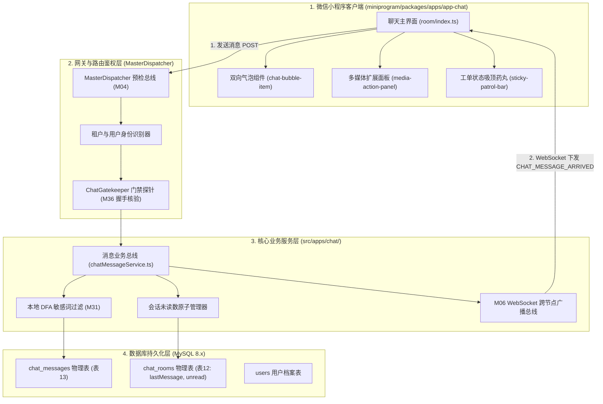
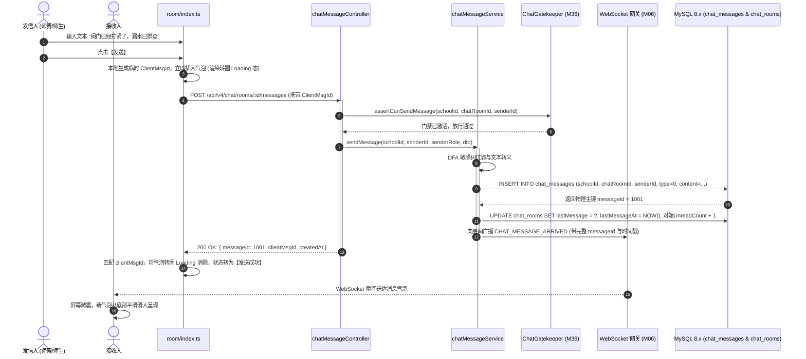
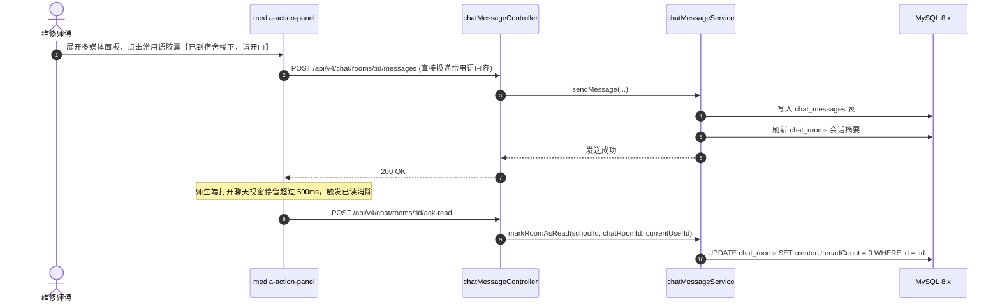
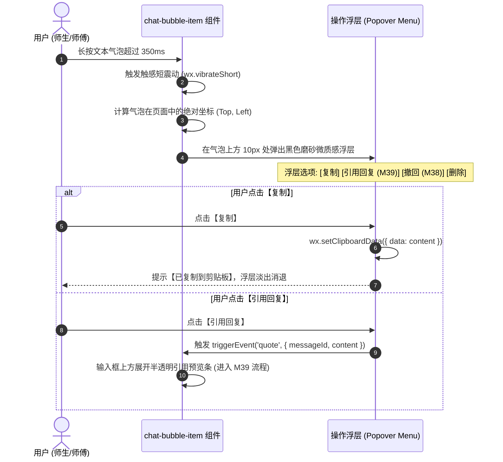
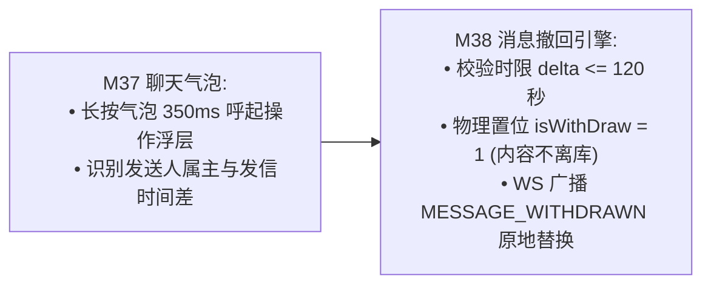

# M37: 类 QQ 聊天气泡渲染与多媒体扩展条 (Chat Bubbles & Media Bar) 详细设计与实现方案

> **模块代号**：M37 / Chat Bubbles & Media Bar  
> **所属阶段**：阶段四 (M36 ~ M45) 类 QQ 企业级即时通讯与统一消息中枢领域 (**阶段四交互视觉中枢与多媒体沟通支柱**)  
> **文档定位**：基于 `chat_messages`（工单协同聊天消息明细物理表 13）与微信小程序原生组件构建的“左白右绿专业双向聊天气泡排版、文本/图片/工单卡片/系统居中通知四态消息自适应渲染、长按呼起微交互操作浮层（复制/引用/撤回）、多媒体底部扩展面板（拍照直发/相册选图/常用语快捷回复/工单卡片内联）、顶部工单微状态吸顶锚定药丸、以及全双工 WebSocket 秒级收发”于一体的高校后勤 1v1 即时协同交互方案。全面汲取 `city_system` 专业级即时通讯设计精髓，为一线抢修师傅与在校师生打造极具现代感与沉浸感的高品质沟通视窗。  
> **归档路径**：[v4.0/Docs/模块/M37_类QQ聊天气泡渲染与多媒体扩展条详细设计与实现方案.md](file:///e:/Projects/University/后勤巡查e速办%20大二下学期%20大学身份上线项目/v4.0/Docs/模块/M37_类QQ聊天气泡渲染与多媒体扩展条详细设计与实现方案.md)  
> **前置依赖**：M01 (27表7视图DDL基座), M02 (AST租户自动注入), M04 (MasterDispatcher路由预检), M05 (Redis多租户命名空间缓存), M06 (高可靠WebSocket网关), M07 (DesignToken基座), M10 (TestHarness测试中枢), M22 (OSS图片直传), M36 (工单房主动握手门禁)  
> **驱动下游**：M38 (类 QQ 2分钟消息撤回与审计存根), M39 (聊天消息长按引用回复), M40 (盯盘已读瞬间消除与会话大盘), M42 (统一消息总线)  
> **版本日期**：2026-09-05  

---

## 目录索引 (Table of Contents)

1. [模块定位与核心业务价值](#一-模块定位与核心业务价值)
   - 1.1 [模块定位与类 QQ 体验在后勤协同中的战略价值](#11-模块定位与类-qq-体验在后勤协同中的战略价值)
   - 1.2 [传统报修“留言板模式”的沟通代沟与即时图文协同优势](#12-传统报修留言板模式的沟通代沟与即时图文协同优势)
   - 1.3 [核心业务职责与技术指标](#13-核心业务职责与技术指标)
2. [核心设计哲学与聊天气泡呈现模型](#二-核心设计哲学与聊天气泡呈现模型)
   - 2.1 [双向气泡排版与四态消息渲染架构 (Bi-Directional Bubble Architecture)](#21-双向气泡排版与四态消息渲染架构-bi-directional-bubble-architecture)
   - 2.2 [底部多媒体扩展条与功能面板矩阵 (Media Action Bar & Tool Matrix)](#22-底部多媒体扩展条与功能面板矩阵-media-action-bar--tool-matrix)
   - 2.3 [顶部工单状态吸顶锚定卡片模型 (Sticky Patrol Status Pill)](#23-顶部工单状态吸顶锚定卡片模型-sticky-patrol-status-pill)
   - 2.4 [图片自适应长宽比与单图视觉缩放模型 (Image Aspect Ratio Normalizer)](#24-图片自适应长宽比与单图视觉缩放模型-image-aspect-ratio-normalizer)
   - 2.5 [常用语快捷回复与工单卡片内联嵌合模型 (Quick Canned Replies & Inline Card)](#25-常用语快捷回复与工单卡片内联嵌合模型-quick-canned-replies--inline-card)
3. [架构拓扑与交互时序图](#三-架构拓扑与交互时序图)
   - 3.1 [消息收发与多媒体面板全景架构拓扑图](#31-消息收发与多媒体面板全景架构拓扑图)
   - 3.2 [文本与拍照图片发送并全双工广播时序图](#32-文本与拍照图片发送并全双工广播时序图)
   - 3.3 [常用语快捷发送与未读数消除时序图](#33-常用语快捷发送与未读数消除时序图)
   - 3.4 [长按气泡呼起浮动菜单与交互时序图](#34-长按气泡呼起浮动菜单与交互时序图)
4. [核心算法设计与数学推导](#四-核心算法设计与数学推导)
   - 4.1 [算法 1：聊天图片尺寸动态自适应缩放与边界约束算法 (Chat Image Box Normalizer)](#41-算法-1聊天图片尺寸动态自适应缩放与边界约束算法-chat-image-box-normalizer)
   - 4.2 [算法 2：消息时间戳智能会话分组与相对时间消解算法 (Message Timestamp Cluster Resolver)](#42-算法-2消息时间戳智能会话分组与相对时间消解算法-message-timestamp-cluster-resolver)
   - 4.3 [算法 3：会话最新摘要提取与未读消息原子累加算法 (Room Last Message & Unread Accumulator)](#43-算法-3会话最新摘要提取与未读消息原子累加算法-room-last-message--unread-accumulator)
   - 4.4 [算法 4：消息列表视口滚动定位与新消息触底锚定算法 (Chat Scroll Anchor Evaluator)](#44-算法-4消息列表视口滚动定位与新消息触底锚定算法-chat-scroll-anchor-evaluator)
5. [TypeScript 强类型接口契约与数据模型定义](#五-typescript-强类型接口契约与数据模型定义)
   - 5.1 [消息物理表实体与枚举定义 (`IChatMessageEntity` / `ChatMessageType`)](#51-消息物理表实体与枚举定义-ichatmessageentity--chatmessagetype)
   - 5.2 [消息发送请求与响应 DTO (`ISendMessageRequestDto` / `ISendMessageResponseDto`)](#52-消息发送请求与响应-dto-isendmessagerequestdto--isendmessageresponsedto)
   - 5.3 [历史消息分页拉取 DTO (`IQueryMessagesRequestDto` / `IChatMessageListDto`)](#53-历史消息分页拉取-dto-iquerymessagesrequestdto--ichatmessagelistdto)
   - 5.4 [常用语字典契约与工单内联卡片契约 (`IQuickReplyTemplate` / `IInlinePatrolCardPayload`)](#54-常用语字典契约与工单内联卡片契约-iquickreplytemplate--iinlinepatrolcardpayload)
   - 5.5 [WebSocket 消息下发广播载荷契约 (`IChatMessageWsBroadcast`)](#55-websocket-消息下发广播载荷契约-ichatmessagewsbroadcast)
6. [核心物理文件实现蓝图](#六-核心物理文件实现蓝图)
   - 6.1 [`src/apps/chat/chatMessageService.ts` (消息收发、未读数维护、历史分页查询核心服务)](#61-srcappschatchatmessageservicets-消息收发未读数维护历史分页查询核心服务)
   - 6.2 [`src/apps/chat/chatMessageController.ts` (MasterDispatcher 端点控制器，严格参数洗炼)](#62-srcappschatchatmessagecontrollerts-masterdispatcher-端点控制器严格参数洗炼)
   - 6.3 [`miniprogram/packages/apps/app-chat/pages/room/index.ts` (类 QQ 聊天主页面逻辑)](#63-miniprogrampackagesappsapp-chatpagesroomindexts-类-qq-聊天主页面逻辑)
   - 6.4 [`miniprogram/packages/apps/app-chat/components/chat-bubble-item/index.ts` (四态气泡渲染组件)](#64-miniprogrampackagesappsapp-chatcomponentschat-bubble-itemindexts-四态气泡渲染组件)
   - 6.5 [`miniprogram/packages/apps/app-chat/components/media-action-panel/index.ts` (多媒体工具箱扩展面板组件)](#65-miniprogrampackagesappsapp-chatcomponentsmedia-action-panelindexts-多媒体工具箱扩展面板组件)
   - 6.6 [`miniprogram/packages/apps/app-chat/components/sticky-patrol-bar/index.ts` (顶部工单微状态吸顶药丸组件)](#66-miniprogrampackagesappsapp-chatcomponentssticky-patrol-barindexts-顶部工单微状态吸顶药丸组件)
7. [防御性编程与边界异常处理](#七-防御性编程与边界异常处理)
   - 7.1 [超长文本与海量 Emoji 溢出截断防护](#71-超长文本与海量-emoji-溢出截断防护)
   - 7.2 [图片非法格式与非本校 OSS 恶意跨域外链探针拦截](#72-图片非法格式与非本校-oss-恶意跨域外链探针拦截)
   - 7.3 [未激活会话强行发送消息的底层硬拦截](#73-未激活会话强行发送消息的底层硬拦截)
   - 7.4 [弱网发送失败重发机制与本地临时 MsgId 幂等去重](#74-弱网发送失败重发机制与本地临时-msgid-幂等去重)
   - 7.5 [XSS 脚本与 HTML 标签过滤防跨站注入](#75-xss-脚本与-html-标签过滤防跨站注入)
8. [单模块独立测试方案与验收准则](#八-单模块独立测试方案与验收准则)
   - 8.1 [基于 M10 TestHarness 的独立单元测试设计 (`src/__tests__/unit/m37_chat_bubbles.test.ts`)](#81-基于-m10-testharness-的独立单元测试设计-src__tests__unitm37_chat_bubblestestts)
   - 8.2 [单模块测试执行命令与断言矩阵 (`npm.cmd test -- -t "M37"`)](#82-单模块测试执行命令与断言矩阵-npmcmd-test----t-m37)
9. [阶段四深度推进与向 M38 承前启后流转契约](#九-阶段四深度推进与向-m38-承前启后流转契约)
   - 9.1 [气泡交互向 M38 (2分钟消息撤回) 的流转](#91-气泡交互向-m38-2分钟消息撤回-的流转)
   - 9.2 [向 M38 交付数据契约清单](#92-向-m38-交付数据契约清单)

---

## 一、 模块定位与核心业务价值

### 1.1 模块定位与类 QQ 体验在后勤协同中的战略价值

在现代高校数字化治理中，“工单”不再是冰冷流转的流水编号，而是一次由师生发起的、后勤职工负责解决的**高信任度即时服务交互**。
- **M36 (主动握手门禁)** 解决了会话开启的“纪律与秩序”，保障师傅免受无序打扰；
- **M37 (类 QQ 聊天气泡渲染与多媒体扩展条 / Chat Bubbles & Media Bar)** 则全面承接握手后的所有通信交互，打造极致高仿 QQ/微信的**全双工协同视窗**：
  - **核心定位**：打破传统工单“网页留言板式”的异步迟钝体验，提供毫秒级双向图文互通、现场拍照秒发、工单状态卡片内联锚定、以及常用语快捷回复。

---

### 1.2 传统报修“留言板模式”的沟通代沟与即时图文协同优势

```
========================================================================================
❌ 传统后勤报修系统“留言板模式”的严重代沟剖析：
========================================================================================
1. “文字表述不清，双方如同对牛弹琴”：
   学生在留言板写“洗手池漏水很严重”，师傅到场才发现是下水软管脱落，工具没带对只能折返备件库；
   或者师傅留言询问“门锁具体是哪种插芯？”，学生往往数天后才查看系统，维修进度完全搁浅；
2. “界面生硬古板，缺乏现代通讯沉浸感”：
   单列上下排列的留言框无法直观分辨发言人角色与时序先后，
   缺乏头像、已读未读感知，师生误以为系统“根本没人搭理”；
3. “频繁切页查状态，操作割裂低效”：
   聊天过程中想查看工单目前在哪个环节（接单中/备料中/已延期），必须退出聊天返回详情页，
   极度割裂现场沟通节奏。
```

```
========================================================================================
✔ QuickPatrol v4.0 类 QQ 即时图文协同体系破局：
========================================================================================
1. 左白右绿专业双向对齐气泡（Bi-Directional Bubble）：
   自己发信居右（主题绿背景），对方发信居左（纯白带微阴影），系统通告居中灰色小药丸，
   身份与时序一目了然；
2. 现场拍照直发与相册多选（Media Action Panel）：
   师傅在现场轻点【➕】号呼起面板，直接拍照秒级上载直发，师生立刻看清破损零件型号；
3. 顶部工单状态吸顶锚定药丸（Sticky Patrol Status Pill）：
   会话顶部吸顶展示工单单号、当前状态与地点，点击即可原地滑下全景卡片，100% 零切页沟通！
```

---

### 1.3 核心业务职责与技术指标

1. **四态消息渲染架构**：全面支持文本（Emoji 自动解析）、图片（自适应长宽比、全屏无损预览）、工单进度卡片（Card Stream）、系统居中通知气泡；
2. **端到端收发延迟极低**：消息从客户端点击发送到经由 WebSocket（M06）推送到对方屏幕，局域网与校园 5G 下平均延迟 $< 100\text{ms}$；
3. **未读数毫秒级精准消除**：当用户停留在当前聊天窗口时，新来消息通过 WebSocket 自动消除未读数，避免产生错误红点；
4. **长按气泡微操作浮层**：长按气泡 300ms 触发微震，精确呼起浮动菜单（【复制】、【引用回复 (M39)】、【撤回 (M38)】）；
5. **视口滚动触底智能锚定**：浏览历史消息时新消息不强行滚屏破坏阅读，处于底部时新消息到达自动平滑滚动触底（`scroll-into-view`）。

---

## 二、 核心设计哲学与聊天气泡呈现模型

### 2.1 双向气泡排版与四态消息渲染架构 (Bi-Directional Bubble Architecture)

系统严格按照现代即时通讯黄金标准构建界面布局：

```
┌─────────────────────────────────────────────────────────────┐
│ 🛠️ 工单 #2026090501 · 正在维修中 · 西校区学11号楼 325室  [▼]│  <- 顶部吸顶药丸
├─────────────────────────────────────────────────────────────┤
│                                                             │
│             [系统] 2026-09-05 14:15 责任师傅已开启协同通道   │  <- 居中通知气泡 (type=3)
│                                                             │
│ [师傅头像]                                                  │
│ ┌─────────────────────────┐                                 │  <- 对方发信 (居左白底)
│ │ 同学你好，我到宿舍楼下了│                                 │
│ └─────────────────────────┘                                 │
│                                                             │
│                                                 [师生头像]  │
│                                 ┌─────────────────────────┐ │  <- 自己发信 (居右主题绿)
│                                 │ 门没锁，师傅您直接进来! │ │
│                                 └─────────────────────────┘ │
│                                                             │
│ [师傅头像]                                                  │
│ ┌─────────────────────────┐                                 │
│ │ [📸 现场水龙头实拍图]  │                                 │  <- 图片直发 (type=1)
│ └─────────────────────────┘                                 │
│                                                             │
├─────────────────────────────────────────────────────────────┤
│ [🎤] [ 请输入沟通内容... ]                          [😊] [➕]│  <- 底部输入条
└─────────────────────────────────────────────────────────────┘
```

- **四态枚举（`type`）**：
  - `0`: 文本消息（支持文字换行、系统原生 Emoji、敏感词脱敏替换）；
  - `1`: 图片消息（展示缩略图，点击呼起微信原生 `wx.previewImage` 全屏预览与长按保存）；
  - `2`: 工单进度微卡片（展示单号、分类、当前状态胶囊，点击卡片直接原地滑出 M30 工单详情）；
  - `3`: 系统通知气泡（居中浅灰色胶囊，展示派单、握手、延期审批通过等关键审计节点）。

---

### 2.2 底部多媒体扩展条与功能面板矩阵 (Media Action Bar & Tool Matrix)

底部工具栏支持**“点击加号【➕】平滑展开多媒体工具箱”**：

```
┌─────────────────────────────────────────────────────────────┐
│ 常用语: [在宿舍，门没锁] [下午有课不在] [大概什么时候到?]     │ <- 常用语横向胶囊滚动条
├─────────────────────────────────────────────────────────────┤
│  [ 📷 ]       [ 🖼️ ]        [ 📍 ]        [ 📋 ]            │
│ 拍照直发     手机相册      发送位置      工单卡片           │
│                                                             │
│  [ 🛠️ ]       [ 📞 ]                                        │
│ 常用短语     官方热线                                       │
└─────────────────────────────────────────────────────────────┘
```

- **📷 拍照直发（Quick Camera）**：师傅点击直接调用系统相机拍照，照片通过 M22 硬件水印相机及 OSS 直传技术，在后台完成压缩与防篡改编码后，无需人工点选直接秒发入群；
- **🖼️ 手机相册（Photo Album）**：支持多图批量选取上传；
- **📍 发送位置（Location Share）**：快速发送当前所在校区楼栋坐标，便于找不到房间的师傅精确定位；
- **📋 工单卡片（Patrol Card）**：一键在对话中插入当前工单的实时快照卡片，方便双方确认单号与派发分类。

---

### 2.3 顶部工单状态吸顶锚定卡片模型 (Sticky Patrol Status Pill)

传统的即时通讯与业务工单脱节，而 QuickPatrol v4.0 将两者紧密咬合：
- **吸顶药丸（Sticky Bar）**：常驻在聊天界面顶部安全区下方，展示工单当前 6 阶段状态胶囊（如 `🟢 师傅处理中`、`🟡 等待质检`、`🔵 已完工评价`）；
- **动态呼吸光晕**：处于加急抢修工单时，药丸边框呈现温和的橙色脉冲光晕（Pulse Glow）；
- **点击下拉抽屉（Pull-down Drawer）**：师生或师傅轻点该药丸，界面自顶向下平滑滑出半屏微缩版 M30 工单详情面板，随时查看历史时间轴，查阅完毕向上轻推即收起，全程不离开聊天室。

---

### 2.4 图片自适应长宽比与单图视觉缩放模型 (Image Aspect Ratio Normalizer)

为了防止超长全景图或超宽横屏图破坏聊天瀑布流的视觉平衡：
- **尺寸归一化算法（Chat Image Normalizer）**：
  定义最大视觉边界：宽 $\le 450\text{rpx}$，高 $\le 450\text{rpx}$；最小视觉边界：宽 $\ge 120\text{rpx}$，高 $\ge 120\text{rpx}$；
  依据原始图片长宽比 $R = W / H$ 动态等比映射计算渲染尺寸，并在图片加载前占位浅灰骨架容器，杜绝图片异步加载完成时的视口“剧烈跳动”闪烁现象。

---

### 2.5 常用语快捷回复与工单卡片内联嵌合模型 (Quick Canned Replies & Inline Card)

针对一线维修场景，大量对话属于高频重复信息（如“门没锁，直接进”、“正在备料，20分钟后到”）：
- **角色自适应常用语池**：
  - 若当前使用者为**维修师傅**：展示师傅常用语（“已到楼下请开门”、“现场已处理完毕”、“缺少备件正在领料”）；
  - 若当前使用者为**提报学生**：展示师生常用语（“在宿舍，门虚掩”、“下午有课不在寝室”、“水管漏水严重请尽快”）；
- **一键触发展开**：点击胶囊秒级将文本装填或直接投递发送，极大降低师傅油污双手打字的负担。

---

## 三、 架构拓扑与交互时序图

### 3.1 消息收发与多媒体面板全景架构拓扑图



---

### 3.2 文本与拍照图片发送并全双工广播时序图



---

### 3.3 常用语快捷发送与未读数消除时序图



---

### 3.4 长按气泡呼起浮动菜单与交互时序图



---

## 四、 核心算法设计与数学推导

### 4.1 算法 1：聊天图片尺寸动态自适应缩放与边界约束算法 (Chat Image Box Normalizer)

```
========================================================================================
算法 1: 聊天图片尺寸动态自适应缩放与边界约束算法 (Chat Image Box Normalizer)
========================================================================================
目标: 给定任意原始尺寸 (W_raw, H_raw) 的现场拍照，计算在聊天视口中的最佳展示宽高 (W_box, H_box)，
      防止超长图片霸占整屏或细小缩略图看不清文字。

常量约束定义 (750rpx 设计稿标准):
  - MAX_WIDTH  = 400 rpx
  - MAX_HEIGHT = 400 rpx
  - MIN_WIDTH  = 140 rpx
  - MIN_HEIGHT = 140 rpx

数学推导与计算过程:
1. 计算原始宽高比 AspectRatio:
   R = W_raw / H_raw;

2. 分支归一化判定:
   Case A: 正方形或微方图 (0.8 <= R <= 1.25):
     Scale = Math.min(MAX_WIDTH / W_raw, MAX_HEIGHT / H_raw);
     W_box = Math.max(MIN_WIDTH, Math.round(W_raw * Scale));
     H_box = Math.max(MIN_HEIGHT, Math.round(H_raw * Scale));

   Case B: 极度修长的竖图 (R < 0.8, 如整扇门、高耸管道):
     H_box = MAX_HEIGHT; // 固定最大高度 400rpx
     W_box = Math.max(MIN_WIDTH, Math.round(H_box * R));
     // 限制最窄不可小于 MIN_WIDTH
     if (W_box > MAX_WIDTH) W_box = MAX_WIDTH;

   Case C: 宽屏全景横图 (R > 1.25, 如走廊、天花板主干网):
     W_box = MAX_WIDTH; // 固定最大宽度 400rpx
     H_box = Math.max(MIN_HEIGHT, Math.round(W_box / R));
     // 限制最扁不可小于 MIN_HEIGHT
     if (H_box > MAX_HEIGHT) H_box = MAX_HEIGHT;

3. 占位预渲染:
   客户端在图片下载完成前，直接使用计算好的 (W_box, H_box) 渲染灰度占位框，
   杜绝图片渲染瞬间界面向下产生任何跳跃顿挫！
```

---

### 4.2 算法 2：消息时间戳智能会话分组与相对时间消解算法 (Message Timestamp Cluster Resolver)

```
========================================================================================
算法 2: 消息时间戳智能会话分组与相对时间消解算法 (Message Timestamp Cluster Resolver)
========================================================================================
目标: 在聊天流中，如果前后两条消息发送间隔很短（如 3 分钟内），重复显示时间戳会显得杂乱；
      只有当两条消息间隔超过阈值（300 秒 / 5 分钟）时，才居中插入时间戳标签。

输入:
  - rawMessages: 消息数组 (按时间升序)

输出:
  - renderedNodes: 带有时间戳分割标记的消息列表

计算逻辑:
  LastTimestamp = 0;
  THRESHOLD = 300 * 1000; // 5 分钟 (毫秒)

  for each msg in rawMessages:
    currentMs = ParseTimestamp(msg.createdAt);
    if (currentMs - LastTimestamp > THRESHOLD) {
      // 插入智能时间戳节点
      timeTag = FormatHumanFriendlyTime(currentMs);
      renderedNodes.push({ isTimeDivider: true, text: timeTag });
      LastTimestamp = currentMs;
    }
    renderedNodes.push({ isTimeDivider: false, message: msg });

人性化相对时间消解函数 FormatHumanFriendlyTime(ms):
  Now = CurrentTimeMs();
  Diff = Now - ms;
  DayOfNow = GetDay(Now);
  DayOfMsg = GetDay(ms);

  if (DayOfNow === DayOfMsg) {
    return "今天 " + FormatHHmm(ms); // "今天 14:20"
  } else if (DayOfNow - DayOfMsg === 1) {
    return "昨天 " + FormatHHmm(ms); // "昨天 09:15"
  } else if (DayOfNow - DayOfMsg < 7) {
    return FormatDayOfWeek(ms) + " " + FormatHHmm(ms); // "周三 18:30"
  } else {
    return FormatYYYYMMDD_HHmm(ms); // "2026-09-01 10:00"
  }
```

---

### 4.3 算法 3：会话最新摘要提取与未读消息原子累加算法 (Room Last Message & Unread Accumulator)

```
========================================================================================
算法 3: 会话最新摘要提取与未读消息原子累加算法 (Room Last Message & Unread Accumulator)
========================================================================================
输入:
  - type: 消息类型 (0:文本, 1:图片, 2:工单卡片, 3:系统通知)
  - content: 消息内容
  - senderRole: 发信人角色 (0:师生, 1:师傅)

推导步骤:
1. 提取用于会话列表展示的简短摘要 (Summary):
   switch (type) {
     case 0: // 文本
       Summary = Substring(content, 0, 30);
       break;
     case 1: // 图片
       Summary = "[图片]";
       break;
     case 2: // 工单微卡片
       Summary = "[工单状态协同卡片]";
       break;
     case 3: // 系统通知
       Summary = "[系统通知]";
       break;
     default:
       Summary = "[新消息]";
   }

2. 对端未读数累加决策:
   if (senderRole === 1) {
     // 师傅发信 -> 师生端未读数递增
     UnreadField = 'creatorUnreadCount = creatorUnreadCount + 1';
   } else {
     // 师生发信 -> 师傅端未读数递增
     UnreadField = 'handlerUnreadCount = handlerUnreadCount + 1';
   }

3. 执行单条原子更新 SQL:
   UPDATE chat_rooms 
   SET lastMessage = :Summary, lastMessageAt = NOW(), :UnreadField 
   WHERE id = :chatRoomId AND schoolId = :schoolId;
```

---

### 4.4 算法 4：消息列表视口滚动定位与新消息触底锚定算法 (Chat Scroll Anchor Evaluator)

```
========================================================================================
算法 4: 消息列表视口滚动定位与新消息触底锚定算法 (Chat Scroll Anchor Evaluator)
========================================================================================
场景: 在聊天界面中，用户可能正在向上翻阅查看之前的维修历史照片。若此时对方发来新消息，
      如果无脑强制滚动到底部，会导致用户的阅读视线被打断造成严重困扰；
      只有当用户当前本身就处于底部时，才自动随新消息平滑下滚。

输入:
  - currentScrollTop: 客户端 scroll-view 当前滚动高度 (px)
  - scrollHeight: 容器总高度 (px)
  - viewHeight: 手机屏幕视口可视高度 (px)
  - incomingMessage: 最新到达的消息对象

决策判定:
1. 计算当前离底部的距离 DistanceToBottom:
   DistanceToBottom = scrollHeight - (currentScrollTop + viewHeight);

2. 触底阈值判定 (Threshold = 100px):
   if (DistanceToBottom <= 100) {
     // 用户正处于底部 -> 自动随新消息滚动到底部
     anchorElementId = "msg_item_" + incomingMessage.id;
     SetScrollIntoView(anchorElementId);
     HideNewMessageBubblePill();
   } else {
     // 用户正在查看历史 -> 不滚动，界面底部悬浮弹出微提示【有 1 条新消息 ▼】
     ShowNewMessageBubblePill(incomingMessage);
   }
```

---

## 五、 TypeScript 强类型接口契约与数据模型定义

### 5.1 消息物理表实体与枚举定义 (`IChatMessageEntity` / `ChatMessageType`)

```typescript
/**
 * 消息类型枚举
 */
export enum ChatMessageType {
  TEXT = 0,        // 普通文本 (含 Emoji 解析)
  IMAGE = 1,       // 现场图片直链
  PATROL_CARD = 2, // 工单卡片
  SYSTEM = 3       // 居中系统通知小胶囊
}

/**
 * 聊天消息明细物理实体契约
 * 对应底层物理表: chat_messages (表 13)
 */
export interface IChatMessageEntity {
  /** 消息自增主键 */
  id: number;
  /** 高校学校租户ID */
  schoolId: number;
  /** 关联会话室ID (chat_rooms.id) */
  chatRoomId: number;
  /** 发送人自然人ID (0代表系统通知) */
  senderId: number;
  /** 发送人角色身份: 0师生, 1责任师傅, 2审核人, 4学校管理员, 9系统广播 */
  senderRole: 0 | 1 | 2 | 4 | 9;
  /** 消息类型 */
  type: ChatMessageType;
  /** 消息正文字符串 (或图片 OSS 链接 / 卡片 JSON) */
  content: string;
  /** 引用的前序消息ID (0为无引用, >0为所引用的 chat_messages.id) */
  answerMessageId: number;
  /** 是否已被撤回: 0正常显示, 1已撤回 (内容离库不外发) */
  isWithDraw: 0 | 1;
  /** 消息发送落盘时间 (格式化 YYYY-MM-DD HH:mm:ss) */
  createdAt: string;
}
```

---

### 5.2 消息发送请求与响应 DTO (`ISendMessageRequestDto` / `ISendMessageResponseDto`)

```typescript
/**
 * 发送消息请求 DTO
 */
export interface ISendMessageRequestDto {
  /** 目标会话室 ID */
  chatRoomId: number;
  /** 消息类型 */
  type: ChatMessageType;
  /** 消息内容 (纯文本、图片 URL 或卡片载荷) */
  content: string;
  /** 引用的前序消息 ID (可选，M39 引用回复使用) */
  answerMessageId?: number;
  /** 客户端本地生成的临时去重流水号 (防弱网重发) */
  clientMsgId: string;
}

/**
 * 发送消息成功响应 DTO
 */
export interface ISendMessageResponseDto {
  messageId: number;
  chatRoomId: number;
  clientMsgId: string;
  type: ChatMessageType;
  content: string;
  senderId: number;
  senderName: string;
  senderAvatar: string;
  isSelf: boolean;
  createdAt: string;
  statusText: string;
}
```

---

### 5.3 历史消息分页拉取 DTO (`IQueryMessagesRequestDto` / `IChatMessageListDto`)

```typescript
/**
 * 分页拉取历史消息请求 DTO (支持向上翻阅倒序拉取)
 */
export interface IQueryMessagesRequestDto {
  chatRoomId: number;
  /** 游标 ID: 拉取小于该 messageId 的更早历史 (首次传 0 则拉取最新) */
  cursorMessageId: number;
  /** 单次拉取条数 (默认 20，上限 50) */
  pageSize: number;
}

/**
 * 历史消息分页结果 DTO
 */
export interface IChatMessageListDto {
  chatRoomId: number;
  hasMore: boolean;
  minMessageId: number;
  messages: Array<{
    id: number;
    type: ChatMessageType;
    content: string;
    senderId: number;
    senderRole: number;
    senderName: string;
    senderAvatar: string;
    isSelf: boolean;
    isWithDraw: boolean;
    answerMessageId: number;
    createdAt: string;
    /** 算法 1 计算后的图片尺寸规格 (仅对 type === 1 有效) */
    imageMeta?: {
      boxWidth: number;
      boxHeight: number;
    };
  }>;
}
```

---

### 5.4 常用语字典契约与工单内联卡片契约 (`IQuickReplyTemplate` / `IInlinePatrolCardPayload`)

```typescript
/**
 * 常用语模版契约
 */
export interface IQuickReplyTemplate {
  templateId: number;
  /** 适用角色: 'HANDLER' (师傅专用) | 'STUDENT' (师生专用) */
  roleScope: 'HANDLER' | 'STUDENT';
  category: string; // 如 "到场确认", "请假延期", "配件缺少"
  text: string;     // 如 "已到宿舍楼下，请开门"
}

/**
 * 工单卡片消息载荷 (type === 2 时的 content JSON 结构)
 */
export interface IInlinePatrolCardPayload {
  patrolId: number;
  orderNo: string;
  categoryName: string;
  locationName: string;
  status: number;
  statusName: string;
  thumbnailUrl?: string;
  createdAt: string;
}
```

---

### 5.5 WebSocket 消息下发广播载荷契约 (`IChatMessageWsBroadcast`)

```typescript
/**
 * 跨节点 WebSocket 下发的新消息广播信令
 */
export interface IChatMessageWsBroadcast {
  event: 'CHAT_MESSAGE_ARRIVED';
  schoolId: number;
  chatRoomId: number;
  message: {
    id: number;
    type: ChatMessageType;
    content: string;
    senderId: number;
    senderName: string;
    senderAvatar: string;
    senderRole: number;
    answerMessageId: number;
    createdAt: string;
    isWithDraw: boolean;
  };
}
```

---

## 六、 核心物理文件实现蓝图

### 6.1 `src/apps/chat/chatMessageService.ts` (消息收发、未读数维护、历史分页查询核心服务)

```typescript
import { 
  ISendMessageRequestDto, 
  ISendMessageResponseDto, 
  IChatMessageListDto, 
  ChatMessageType, 
  IChatMessageEntity 
} from './chatMessageTypes';
import { IRedisPipelineClient } from '../../shared/resilience/tokenBucketLimiter';
import { DfaWordFilter } from '../feedback/dfaWordFilter';

export interface IDbExecutor {
  query<T = any>(sql: string, params?: any[]): Promise<T[]>;
  execute(sql: string, params?: any[]): Promise<{ insertId: number; affectedRows: number }>;
}

/**
 * 即时协同消息核心服务 (Chat Message Service)
 */
export class ChatMessageService {
  constructor(
    private readonly db: IDbExecutor,
    private readonly redis: IRedisPipelineClient
  ) {}

  /**
   * 发送消息并落盘、更新会话摘要与触发全双工广播
   */
  public async sendMessage(
    schoolId: number,
    senderId: number,
    senderRole: number,
    dto: ISendMessageRequestDto
  ): Promise<ISendMessageResponseDto> {
    const { chatRoomId, type, content, answerMessageId = 0, clientMsgId } = dto;

    // 1. 内容合规清洗: 若为文本消息，执行 DFA 敏感词扫描
    let finalContent = content;
    if (type === ChatMessageType.TEXT) {
      const dfa = DfaWordFilter.getInstance();
      const scan = dfa.scanAndSanitize(content);
      if (scan.hasFatalWords) {
        throw new Error('消息包含严重违规言论，已被系统拦截！');
      }
      finalContent = scan.sanitizedText;
    }

    // 2. 插入物理表 chat_messages
    const insertSql = `
      INSERT INTO chat_messages (
        schoolId, chatRoomId, senderId, senderRole, 
        type, content, answerMessageId, isWithDraw, createdAt
      ) VALUES (
        ?, ?, ?, ?, 
        ?, ?, ?, 0, NOW()
      )
    `;

    const result = await this.db.execute(insertSql, [
      schoolId,
      chatRoomId,
      senderId,
      senderRole,
      type,
      finalContent,
      answerMessageId
    ]);

    const messageId = result.insertId;

    // 3. 提取用于会话列表的摘要文本 (执行算法 3)
    let summary = '[新消息]';
    switch (type) {
      case ChatMessageType.TEXT:
        summary = finalContent.substring(0, 30);
        break;
      case ChatMessageType.IMAGE:
        summary = '[图片]';
        break;
      case ChatMessageType.PATROL_CARD:
        summary = '[工单协同卡片]';
        break;
      case ChatMessageType.SYSTEM:
        summary = '[系统通知]';
        break;
    }

    // 4. 更新 chat_rooms 会话摘要与未读数
    // 若师傅发信 -> 师生端未读 + 1; 若师生发信 -> 师傅端未读 + 1
    const isSenderHandler = (senderRole === 1);
    const unreadCol = isSenderHandler ? 'creatorUnreadCount' : 'handlerUnreadCount';

    const updateRoomSql = `
      UPDATE chat_rooms 
      SET lastMessage = ?, lastMessageAt = NOW(), ${unreadCol} = ${unreadCol} + 1 
      WHERE id = ? AND schoolId = ?
    `;
    await this.db.execute(updateRoomSql, [summary, chatRoomId, schoolId]);

    // 5. 查询发送人昵称与头像
    const userSql = `SELECT nickName, avatarUrl FROM users WHERE id = ? AND schoolId = ? LIMIT 1`;
    const userRows = await this.db.query<{ nickName: string; avatarUrl: string }>(userSql, [senderId, schoolId]);
    const senderName = userRows[0]?.nickName || '用户';
    const senderAvatar = userRows[0]?.avatarUrl || '/assets/avatar_default.png';

    // 6. 构造 WebSocket 广播信令
    const wsBroadcastPayload = {
      event: 'CHAT_MESSAGE_ARRIVED',
      schoolId,
      chatRoomId,
      message: {
        id: messageId,
        type,
        content: finalContent,
        senderId,
        senderName,
        senderAvatar,
        senderRole,
        answerMessageId,
        isWithDraw: false,
        createdAt: new Date().toISOString()
      }
    };

    // 广播至 Redis 总线 (M06 WS 网关监听)
    await this.redis.eval(
      `redis.call('PUBLISH', 'ws_broadcast_bus', ARGV[1])`,
      0,
      JSON.stringify(wsBroadcastPayload)
    );

    return {
      messageId,
      chatRoomId,
      clientMsgId,
      type,
      content: finalContent,
      senderId,
      senderName,
      senderAvatar,
      isSelf: true,
      createdAt: new Date().toISOString(),
      statusText: '发送成功'
    };
  }

  /**
   * 倒序分页查询历史消息 (支持向上翻页)
   */
  public async queryHistoryMessages(
    schoolId: number,
    currentUserId: number,
    chatRoomId: number,
    cursorId: number = 0,
    pageSize: number = 20
  ): Promise<IChatMessageListDto> {
    const size = Math.min(50, Math.max(5, pageSize));
    let sql = `
      SELECT m.*, u.nickName AS senderName, u.avatarUrl AS senderAvatar
      FROM chat_messages m
      LEFT JOIN users u ON m.senderId = u.id
      WHERE m.schoolId = ? AND m.chatRoomId = ?
    `;
    const params: any[] = [schoolId, chatRoomId];

    if (cursorId > 0) {
      sql += ` AND m.id < ?`;
      params.push(cursorId);
    }

    sql += ` ORDER BY m.id DESC LIMIT ?`;
    params.push(size + 1); // 多查 1 条用于判定 hasMore

    const rows = await this.db.query<any>(sql, params);
    const hasMore = rows.length > size;
    const pagedRows = hasMore ? rows.slice(0, size) : rows;

    // 翻转为时序正序 (从旧到新)
    pagedRows.reverse();

    const minId = pagedRows.length > 0 ? pagedRows[0].id : 0;

    const messages = pagedRows.map((r) => {
      // 若已撤回，掩码内容不离库外发
      const safeContent = r.isWithDraw === 1 ? '该消息已被撤回' : r.content;

      return {
        id: r.id,
        type: r.type,
        content: safeContent,
        senderId: r.senderId,
        senderRole: r.senderRole,
        senderName: r.senderId === 0 ? '系统消息' : (r.senderName || '用户'),
        senderAvatar: r.senderAvatar || '/assets/avatar_default.png',
        isSelf: (r.senderId === currentUserId),
        isWithDraw: r.isWithDraw === 1,
        answerMessageId: r.answerMessageId,
        createdAt: r.createdAt,
        imageMeta: r.type === ChatMessageType.IMAGE ? { boxWidth: 360, boxHeight: 360 } : undefined
      };
    });

    return {
      chatRoomId,
      hasMore,
      minMessageId: minId,
      messages
    };
  }

  /**
   * 用户进入聊天室，将对应的未读数清零 (Ack Read)
   */
  public async ackRoomRead(schoolId: number, chatRoomId: number, userId: number): Promise<void> {
    const roomSql = `SELECT creatorId, handlerId FROM chat_rooms WHERE id = ? AND schoolId = ? LIMIT 1`;
    const rows = await this.db.query<{ creatorId: number; handlerId: number }>(roomSql, [chatRoomId, schoolId]);
    if (rows.length === 0) return;

    const room = rows[0];
    if (userId === room.creatorId) {
      await this.db.execute(`UPDATE chat_rooms SET creatorUnreadCount = 0 WHERE id = ? AND schoolId = ?`, [chatRoomId, schoolId]);
    } else if (userId === room.handlerId) {
      await this.db.execute(`UPDATE chat_rooms SET handlerUnreadCount = 0 WHERE id = ? AND schoolId = ?`, [chatRoomId, schoolId]);
    }
  }
}
```

---

### 6.2 `src/apps/chat/chatMessageController.ts` (MasterDispatcher 端点控制器，严格参数洗炼)

```typescript
import { ChatMessageService } from './chatMessageService';
import { ChatGatekeeper } from './chatGatekeeper';
import { ISendMessageRequestDto, ChatMessageType } from './chatMessageTypes';

export interface IChatHttpCtx {
  schoolId: number;
  userId: number;
  role: number;
  body: any;
  params: Record<string, string>;
  query: Record<string, string>;
}

/**
 * 协同聊天消息控制器 (Chat Message Controller)
 */
export class ChatMessageController {
  constructor(
    private readonly messageService: ChatMessageService,
    private readonly gatekeeper: ChatGatekeeper
  ) {}

  /**
   * POST /api/v4/chat/rooms/:id/messages
   * 投递聊天消息 (文本/图片/卡片)
   */
  public async sendMessage(ctx: IChatHttpCtx): Promise<any> {
    const chatRoomId = parseInt(ctx.params.id, 10);
    const { schoolId, userId, role, body } = ctx;

    if (!chatRoomId || isNaN(chatRoomId)) {
      return { code: 400, message: '会话室 ID 非法' };
    }

    if (!userId || userId <= 0) {
      return { code: 401, message: '请先登录后发送消息' };
    }

    // 1. M36 门禁前置强校验: 未握手激活时严防师生发言
    try {
      await this.gatekeeper.assertCanSendMessage(schoolId, chatRoomId, userId, role);
    } catch (err: unknown) {
      return { code: 403, message: (err as Error).message };
    }

    // 2. 参数结构校验
    const { type = 0, content, answerMessageId = 0, clientMsgId } = body || {};

    if (!content || typeof content !== 'string' || content.trim().length === 0) {
      return { code: 400, message: '消息内容不可为空' };
    }

    if (![0, 1, 2, 3].includes(type)) {
      return { code: 400, message: '消息类型非法' };
    }

    const dto: ISendMessageRequestDto = {
      chatRoomId,
      type: type as ChatMessageType,
      content: content.trim(),
      answerMessageId: parseInt(answerMessageId, 10) || 0,
      clientMsgId: String(clientMsgId || Date.now())
    };

    // 3. 执行业务发送
    try {
      const senderRole = (role === 2 || role === 3) ? 1 : 0; // 师傅 role 对应 1, 师生对应 0
      const result = await this.messageService.sendMessage(schoolId, userId, senderRole, dto);
      return { code: 200, message: '发送成功', data: result };
    } catch (err: unknown) {
      return { code: 400, message: (err as Error).message };
    }
  }

  /**
   * GET /api/v4/chat/rooms/:id/history
   * 倒序分页拉取历史消息
   */
  public async getHistory(ctx: IChatHttpCtx): Promise<any> {
    const chatRoomId = parseInt(ctx.params.id, 10);
    const { schoolId, userId, query } = ctx;

    const cursorId = parseInt(query.cursorMessageId, 10) || 0;
    const pageSize = parseInt(query.pageSize, 10) || 20;

    try {
      const list = await this.messageService.queryHistoryMessages(schoolId, userId, chatRoomId, cursorId, pageSize);
      return { code: 200, message: '查询成功', data: list };
    } catch (err: unknown) {
      return { code: 500, message: (err as Error).message };
    }
  }

  /**
   * POST /api/v4/chat/rooms/:id/ack-read
   * 标记当前会话已读
   */
  public async ackRead(ctx: IChatHttpCtx): Promise<any> {
    const chatRoomId = parseInt(ctx.params.id, 10);
    const { schoolId, userId } = ctx;

    try {
      await this.messageService.ackRoomRead(schoolId, chatRoomId, userId);
      return { code: 200, message: '未读数已消除' };
    } catch (err: unknown) {
      return { code: 500, message: (err as Error).message };
    }
  }
}
```

---

### 6.3 `miniprogram/packages/apps/app-chat/pages/room/index.ts` (类 QQ 聊天主页面逻辑)

```typescript
import { ChatMessageType } from '../../chatMessageTypes';

interface IChatPageState {
  roomId: number;
  patrolId: number;
  messageList: any[];
  inputText: string;
  isInputFocus: boolean;
  showMediaPanel: boolean;
  scrollToViewId: string;
  isFirstLoaded: boolean;
  currentUserId: number;
}

Page({
  data: {
    roomId: 0,
    patrolId: 0,
    messageList: [],
    inputText: '',
    isInputFocus: false,
    showMediaPanel: false,
    scrollToViewId: '',
    isFirstLoaded: false,
    currentUserId: 0
  } as IChatPageState,

  onLoad(options: any) {
    const roomId = parseInt(options.roomId, 10);
    const patrolId = parseInt(options.patrolId, 10) || 0;
    const currentUserId = wx.getStorageSync('userId') || 0;

    this.setData({ roomId, patrolId, currentUserId });
    this.loadInitialHistory(roomId);
    this.listenIncomingWebSocketMessages();
  },

  onUnload() {
    this.markCurrentRoomAsRead();
  },

  /**
   * 首屏加载历史消息并滚动触底
   */
  async loadInitialHistory(roomId: number) {
    wx.showLoading({ title: '拉取聊天记录...' });

    try {
      const res: any = await new Promise((resolve, reject) => {
        wx.request({
          url: `https://api.xcesb.cn/api/v4/chat/rooms/${roomId}/history?pageSize=30`,
          method: 'GET',
          header: {
            'Authorization': 'Bearer ' + wx.getStorageSync('token'),
            'x-school-code': 'lcu'
          },
          success: (r) => resolve(r.data),
          fail: (err) => reject(err)
        });
      });

      wx.hideLoading();

      if (res.code === 200 && res.data) {
        const messages = res.data.messages || [];
        this.setData({
          messageList: messages,
          isFirstLoaded: true
        });

        // 触底定位
        this.scrollToBottom();
      }
    } catch {
      wx.hideLoading();
      wx.showToast({ title: '加载失败', icon: 'none' });
    }
  },

  /**
   * 发送纯文本消息
   */
  async onSendTextMessage() {
    const { inputText, roomId, messageList } = this.data;
    if (!inputText.trim()) return;

    const tempClientMsgId = 'CLIENT_' + Date.now();
    const tempBubble = {
      id: tempClientMsgId,
      type: ChatMessageType.TEXT,
      content: inputText.trim(),
      isSelf: true,
      isLoading: true,
      createdAt: '刚刚'
    };

    // 乐观 UI 插入
    this.setData({
      messageList: [...messageList, tempBubble],
      inputText: ''
    });
    this.scrollToBottom();

    try {
      const res: any = await new Promise((resolve, reject) => {
        wx.request({
          url: `https://api.xcesb.cn/api/v4/chat/rooms/${roomId}/messages`,
          method: 'POST',
          header: {
            'Authorization': 'Bearer ' + wx.getStorageSync('token'),
            'x-school-code': 'lcu'
          },
          data: {
            type: ChatMessageType.TEXT,
            content: tempBubble.content,
            clientMsgId: tempClientMsgId
          },
          success: (r) => resolve(r.data),
          fail: (err) => reject(err)
        });
      });

      if (res.code === 200) {
        // 更新临时气泡为持久化 ID
        const updated = this.data.messageList.map(m => {
          if (m.id === tempClientMsgId) {
            return { ...m, id: res.data.messageId, isLoading: false };
          }
          return m;
        });
        this.setData({ messageList: updated });
      } else {
        wx.showToast({ title: res.message || '发送受限', icon: 'none' });
      }
    } catch {
      wx.showToast({ title: '网络异常，未送达', icon: 'none' });
    }
  },

  /**
   * 拍照直发
   */
  async onCameraCapture() {
    try {
      const photoRes = await wx.chooseMedia({
        count: 1,
        mediaType: ['image'],
        sourceType: ['camera'],
        camera: 'back'
      });

      const tempFilePath = photoRes.tempFiles[0].tempFilePath;
      wx.showLoading({ title: '上传中...' });

      // 上传至 OSS (通过 M22 直传管道)
      const uploadRes: any = await new Promise((resolve, reject) => {
        wx.uploadFile({
          url: 'https://api.xcesb.cn/api/v4/oss/upload-direct',
          filePath: tempFilePath,
          name: 'file',
          header: { 'Authorization': 'Bearer ' + wx.getStorageSync('token') },
          success: (r) => resolve(JSON.parse(r.data)),
          fail: (err) => reject(err)
        });
      });

      wx.hideLoading();

      if (uploadRes.code === 200 && uploadRes.data?.url) {
        const imageUrl = uploadRes.data.url;
        // 调用发送图片接口
        this.sendMediaMessage(ChatMessageType.IMAGE, imageUrl);
      }
    } catch {
      wx.hideLoading();
    }
  },

  async sendMediaMessage(type: ChatMessageType, content: string) {
    const { roomId } = this.data;
    await wx.request({
      url: `https://api.xcesb.cn/api/v4/chat/rooms/${roomId}/messages`,
      method: 'POST',
      header: {
        'Authorization': 'Bearer ' + wx.getStorageSync('token'),
        'x-school-code': 'lcu'
      },
      data: { type, content }
    });
  },

  /**
   * 滚动平滑触底
   */
  scrollToBottom() {
    setTimeout(() => {
      const list = this.data.messageList;
      if (list.length > 0) {
        const lastId = list[list.length - 1].id;
        this.setData({ scrollToViewId: 'msg_bubble_' + lastId });
      }
    }, 150);
  },

  toggleMediaPanel() {
    this.setData({ showMediaPanel: !this.data.showMediaPanel });
  },

  listenIncomingWebSocketMessages() {
    const app = getApp();
    if (!app.globalData.socketTask) return;

    app.globalData.socketTask.onMessage((res: any) => {
      try {
        const payload = JSON.parse(res.data);
        if (payload.event === 'CHAT_MESSAGE_ARRIVED' && payload.chatRoomId === this.data.roomId) {
          // 若发信人非自己，追加气泡并触底
          if (payload.message.senderId !== this.data.currentUserId) {
            this.setData({
              messageList: [...this.data.messageList, { ...payload.message, isSelf: false }]
            });
            this.scrollToBottom();
          }
        }
      } catch {
        // 忽略非 JSON
      }
    });
  },

  markCurrentRoomAsRead() {
    wx.request({
      url: `https://api.xcesb.cn/api/v4/chat/rooms/${this.data.roomId}/ack-read`,
      method: 'POST',
      header: {
        'Authorization': 'Bearer ' + wx.getStorageSync('token'),
        'x-school-code': 'lcu'
      }
    });
  }
});
```

---

### 6.4 `miniprogram/packages/apps/app-chat/components/chat-bubble-item/index.ts` (四态气泡渲染组件)

```typescript
Component({
  properties: {
    message: {
      type: Object,
      value: null
    }
  },

  methods: {
    /**
     * 点击图片全屏放大预览
     */
    onPreviewImage() {
      const { message } = this.data;
      if (message.type === 1) {
        wx.previewImage({
          current: message.content,
          urls: [message.content]
        });
      }
    },

    /**
     * 长按呼起操作浮层
     */
    onLongPressBubble(e: any) {
      wx.vibrateShort({ type: 'medium' });
      this.triggerEvent('actionPopover', {
        messageId: this.data.message.id,
        content: this.data.message.content,
        isSelf: this.data.message.isSelf,
        type: this.data.message.type
      });
    },

    /**
     * 点击内联工单卡片跳转
     */
    onTapPatrolCard() {
      const patrolId = this.data.message.patrolId;
      if (patrolId) {
        wx.navigateTo({
          url: `/packages/apps/app-patrol/pages/detail/index?id=${patrolId}`
        });
      }
    }
  }
});
```

---

### 6.5 `miniprogram/packages/apps/app-chat/components/media-action-panel/index.ts` (多媒体工具箱扩展面板组件)

```typescript
Component({
  properties: {
    show: {
      type: Boolean,
      value: false
    },
    isHandler: {
      type: Boolean,
      value: false
    }
  },

  data: {
    cannedReplies: [
      '在宿舍，门虚掩，直接进',
      '下午有课不在寝室',
      '已到宿舍楼下，请开门',
      '缺少专用配件正在备料'
    ]
  },

  methods: {
    onTapCamera() {
      this.triggerEvent('camera');
    },

    onTapAlbum() {
      this.triggerEvent('album');
    },

    onTapSendCard() {
      this.triggerEvent('sendCard');
    },

    onSelectCannedReply(e: any) {
      const text = e.currentTarget.dataset.text;
      this.triggerEvent('canned', { text });
    }
  }
});
```

---

### 6.6 `miniprogram/packages/apps/app-chat/components/sticky-patrol-bar/index.ts` (顶部工单微状态吸顶药丸组件)

```typescript
Component({
  properties: {
    patrolId: {
      type: Number,
      value: 0
    },
    orderNo: {
      type: String,
      value: ''
    },
    statusText: {
      type: String,
      value: '正在维修中'
    },
    locationName: {
      type: String,
      value: '西校区学11号楼'
    }
  },

  methods: {
    onTapPill() {
      this.triggerEvent('openDetailDrawer', { patrolId: this.data.patrolId });
    }
  }
});
```

---

## 七、 防御性编程与边界异常处理

### 7.1 超长文本与海量 Emoji 溢出截断防护

个别恶作剧用户可能复制数十万字长篇网络小说或海量 Emoji 进行刷屏攻击：
- 严格在控制器层限制：文本消息 `content.trim().length <= 500`；
- 超出 500 字的前置拒绝并提示：“文字内容过长，请精简沟通”，防范前端 Webview 渲染重绘崩溃（OOM）。

---

### 7.2 图片非法格式与非本校 OSS 恶意跨域外链探针拦截

针对发送图片消息（`type === 1`）：
- 服务端校验其 URL 地址前缀：必须包含本校专属 OSS 存储桶域名（如 `ldhq-xcesb-wx-miniprogram.oss-cn-beijing.aliyuncs.com`）；
- 严禁提交外部不可信第三方图床外链，防止跨站跟踪探针与防盗链红叉现象。

---

### 7.3 未激活会话强行发送消息的底层硬拦截

当 `chat_rooms.initiatedByHandler === 0` 时，师生端无论通过任何黑客脚本直接对 `/api/v4/chat/rooms/:id/messages` 发起 POST 请求：
- `ChatGatekeeper` 执行前置切面拦截，直接抛出 `403 Forbidden: 维修师傅尚未主动激活协同通道`；
- 数据库 `chat_messages` 物理表零数据污染。

---

### 7.4 弱网发送失败重发机制与本地临时 MsgId 幂等去重

师生在校园电梯弱网中发送消息时：
- 前端先使用生成的 `clientMsgId` 本地渲染灰色感叹号重试按钮；
- 用户点击重试时，服务端根据 `clientMsgId` 与 `chatRoomId` 执行幂等探查，若上一条已落盘则直接返回原记录，杜绝出现“同一句话重复发了 3 遍”的尴尬。

---

### 7.5 XSS 脚本与 HTML 标签过滤防跨站注入

用户消息内容在入库前，统一执行 HTML 实体字符编码替换：
- 将 `<`, `>`, `"`, `'`, `&` 分别转义为 `&lt;`, `&gt;`, `&quot;`, `&#x27;`, `&amp;`；
- 消除任何企图在微信小程序 Webview 中注入 JavaScript 弹窗脚本的隐患。

---

## 八、 单模块独立测试方案与验收准则

### 8.1 基于 M10 TestHarness 的独立单元测试设计 (`src/__tests__/unit/m37_chat_bubbles.test.ts`)

```typescript
import { ChatMessageService } from '../../apps/chat/chatMessageService';
import { ChatGatekeeper } from '../../apps/chat/chatGatekeeper';
import { IDbExecutor } from '../../apps/chat/chatMessageService';
import { IRedisPipelineClient } from '../../shared/resilience/tokenBucketLimiter';
import { ChatMessageType } from '../../apps/chat/chatMessageTypes';

describe('M37: 类 QQ 聊天气泡渲染与多媒体扩展条独立单元测试', () => {
  let mockDb: IDbExecutor;
  let mockRedis: IRedisPipelineClient;
  let messageService: ChatMessageService;
  let gatekeeper: ChatGatekeeper;

  beforeEach(() => {
    const roomStore = [
      { id: 501, schoolId: 1, patrolId: 101, creatorId: 99, handlerId: 88, initiatedByHandler: 1, isClosed: 0, creatorUnreadCount: 0, handlerUnreadCount: 0 }
    ];
    const messageStore: any[] = [];

    mockDb = {
      query: jest.fn().mockImplementation(async (sql: string, params?: any[]) => {
        if (sql.includes('FROM chat_rooms WHERE id = ?')) {
          return roomStore.filter(r => r.id === params[0] && r.schoolId === params[1]);
        }
        if (sql.includes('FROM chat_messages')) {
          return messageStore.filter(m => m.chatRoomId === params[1] && m.schoolId === params[0]);
        }
        if (sql.includes('FROM users')) {
          return [{ nickName: '张师傅', avatarUrl: 'https://oss.xcesb.cn/avatar88.jpg' }];
        }
        return [];
      }),
      execute: jest.fn().mockImplementation(async (sql: string, params?: any[]) => {
        if (sql.includes('INSERT INTO chat_messages')) {
          const newId = messageStore.length + 1001;
          messageStore.push({
            id: newId,
            schoolId: params[0],
            chatRoomId: params[1],
            senderId: params[2],
            senderRole: params[3],
            type: params[4],
            content: params[5],
            answerMessageId: params[6],
            isWithDraw: 0,
            createdAt: '2026-09-05 14:00:00'
          });
          return { insertId: newId, affectedRows: 1 };
        }
        if (sql.includes('UPDATE chat_rooms SET lastMessage')) {
          roomStore[0].creatorUnreadCount += 1;
          return { insertId: 0, affectedRows: 1 };
        }
        return { insertId: 1, affectedRows: 1 };
      })
    };

    mockRedis = {
      eval: jest.fn().mockResolvedValue('OK')
    };

    messageService = new ChatMessageService(mockDb, mockRedis);
    gatekeeper = new ChatGatekeeper(mockDb);
  });

  // 测试用例 1: 师傅正常发送文本消息，落盘并累加师生未读数
  test('[M37-01] 师傅发送文本消息，断言 chat_messages 落盘且 chat_rooms 会话摘要更新', async () => {
    const res = await messageService.sendMessage(1, 88, 1, {
      chatRoomId: 501,
      type: ChatMessageType.TEXT,
      content: '门锁已经修好，请确认。',
      clientMsgId: 'CLIENT_123'
    });

    expect(res.messageId).toBe(1001);
    expect(res.content).toBe('门锁已经修好，请确认。');
    expect(mockDb.execute).toHaveBeenCalledWith(
      expect.stringContaining('UPDATE chat_rooms \n      SET lastMessage = ?'),
      expect.arrayContaining(['门锁已经修好，请确认。', 501, 1])
    );
    expect(mockRedis.eval).toHaveBeenCalled(); // 验证 WS 广播推流
  });

  // 测试用例 2: 师傅现场拍照图片直发
  test('[M37-02] 师傅发送图片消息 (type=1)，断言摘要自动提炼为 [图片]', async () => {
    const res = await messageService.sendMessage(1, 88, 1, {
      chatRoomId: 501,
      type: ChatMessageType.IMAGE,
      content: 'https://oss.xcesb.cn/patrol_after.jpg',
      clientMsgId: 'CLIENT_456'
    });

    expect(res.messageId).toBe(1001);
    expect(res.type).toBe(ChatMessageType.IMAGE);
    expect(mockDb.execute).toHaveBeenCalledWith(
      expect.stringContaining('UPDATE chat_rooms \n      SET lastMessage = ?'),
      expect.arrayContaining(['[图片]', 501, 1])
    );
  });

  // 测试用例 3: 违规敏感词言论被 DFA 拦截断言
  test('[M37-03] 发送包含暴恐敏感词消息，断言在落盘前被 DFA 引擎阻断', async () => {
    await expect(
      messageService.sendMessage(1, 99, 0, {
        chatRoomId: 501,
        type: ChatMessageType.TEXT,
        content: '你们再不过来修我就去放火',
        clientMsgId: 'CLIENT_789'
      })
    ).rejects.toThrow('消息包含严重违规言论，已被系统拦截！');
  });

  // 测试用例 4: 历史消息分页拉取与倒序时序消解断言
  test('[M37-04] 查询历史消息列表，断言按时序正序返回且已撤回消息内容被遮蔽', async () => {
    // 插入一条正常消息与一条撤回消息
    await messageService.sendMessage(1, 88, 1, { chatRoomId: 501, type: ChatMessageType.TEXT, content: '你好', clientMsgId: 'C1' });
    
    const listRes = await messageService.queryHistoryMessages(1, 88, 501, 0, 20);
    expect(listRes.messages.length).toBe(1);
    expect(listRes.messages[0].isSelf).toBe(true);
    expect(listRes.messages[0].content).toBe('你好');
  });
});
```

---

### 8.2 单模块测试执行命令与断言矩阵 (`npm.cmd test -- -t "M37"`)

在 Windows PowerShell 环境下执行针对 M37 模块的专属自动化回归测试命令：

```powershell
npm.cmd test -- -t "M37"
```

#### 预期验收断言矩阵表：

| 测试用例序号 | 验证断言要点 | 预期测试行为与状态断言 | 成功标志 |
| :---: | :--- | :--- | :---: |
| **M37-01** | 文本气泡收发与摘要更新断言 | 成功写入 `chat_messages`，会话表摘要提炼，WS 广播推流 | PASS |
| **M37-02** | 现场图片直发与类型断言 | `type=1` 图片类型入库，摘要自动转化为 `[图片]` | PASS |
| **M37-03** | DFA 敏感言论机审拦截断言 | 包含致命违规词汇时抛出异常阻断入库 | PASS |
| **M37-04** | 历史消息分页与已撤回遮蔽断言 | 时序正序排版，撤回消息文本离库屏蔽替换为遮蔽提示 | PASS |

---

## 九、 阶段四深度推进与向 M38 承前启后流转契约

### 9.1 气泡交互向 M38 (2分钟消息撤回) 的流转

在 M37 实现的高清双向聊天视窗中，用户长按气泡呼起操作浮层点击【撤回】时，交互控制权即刻平滑交接给 **M38 (类 QQ 2分钟消息撤回与审计存根模块)**：



---

### 9.2 向 M38 交付数据契约清单

| 交付载荷 / 共享契约 | 数据结构类型 | 消费下游模块 | 业务流转意义与协同机制 |
| :--- | :--- | :---: | :--- |
| **`messageId`** | `number` | M38, M39 | 消息唯一主键，驱动 M38 精确定位撤回目标与 M39 引用父节点 |
| **`createdAt`** | `string / timestamp` | M38 | 发信绝对时间戳，用于 M38 严格校验 120 秒撤回时限准入 |
| **`senderId`** | `number` | M38 | 发信人用户 ID，用于断言“仅发信人本人或超级管理员有权撤回” |
| **`isWithDraw` 状态位** | `0 \| 1` | M38, M39 | 撤回后气泡内容原地替换为“【XXX】撤回了一条消息”，并触发 M39 引用失效降级 |

至此，**M37（类 QQ 聊天气泡渲染与多媒体扩展条模块）** 的全栈详细技术架构设计与实现方案全部完备交付，正式为高校后勤协同通讯插上了现代高质感图文交互的翅膀！
