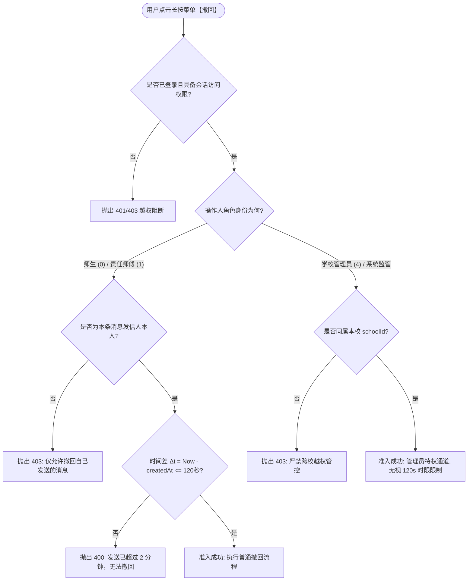
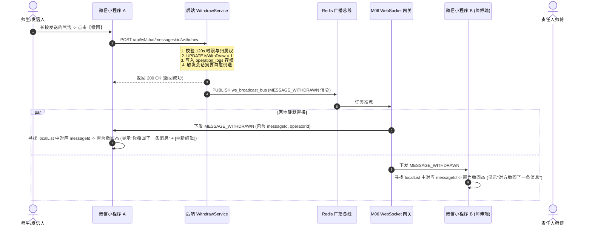
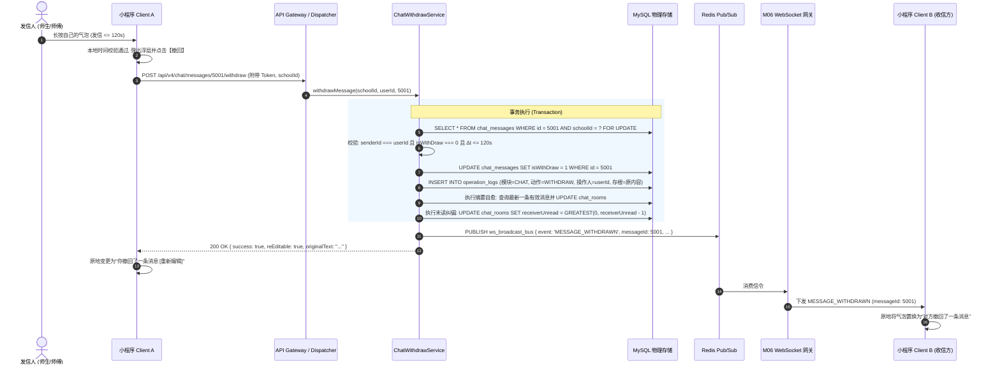
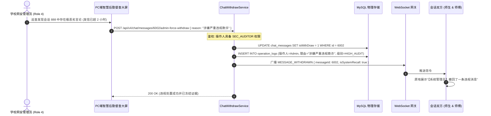
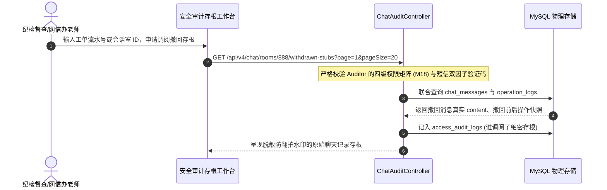
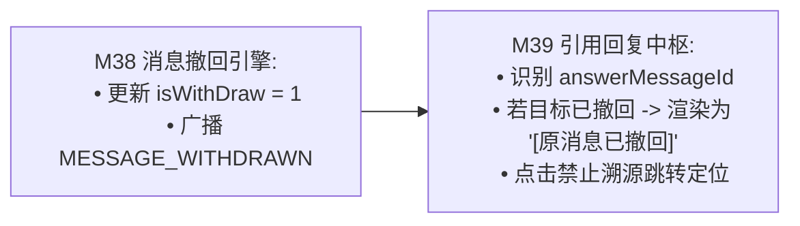

# M38: 类 QQ 2分钟消息撤回与审计存根 (Message Withdrawal & Audit Stub) 详细设计与实现方案

> **模块代号**：M38 / Message Withdrawal & Audit Stub  
> **所属阶段**：阶段四 (M36 ~ M45) 类 QQ 企业级即时通讯与统一消息中枢领域 (**合规容错与网络安全监管支柱**)  
> **文档定位**：基于 `chat_messages`（工单协同聊天消息明细物理表 13）、`chat_rooms`（工单会话表 12）以及 `operation_logs`（操作与合规审计物理表 07），构建的一套兼顾“师生及后勤师傅日常错发信息人性化纠错（120秒黄金撤回窗口）”与“高校网安合规与违规争议溯源留痕（逻辑撤回、物理留存、网安存根不可变）”的工业级即时通信消息撤回与审计中枢。全面解决客户端原地气泡无刷新置换、会话大盘最后一条摘要倒退自愈、未读计数原子纠偏、以及管理员违规紧急熔断调阅等高并发复杂场景。  
> **归档路径**：[v4.0/Docs/模块/M38_类QQ2分钟消息撤回与审计存根详细设计与实现方案.md](file:///e:/Projects/University/后勤巡查e速办%20大二下学期%20大学身份上线项目/v4.0/Docs/模块/M38_类QQ2分钟消息撤回与审计存根详细设计与实现方案.md)  
> **前置依赖**：M01 (27表7视图DDL基座), M02 (AST租户自动注入), M04 (MasterDispatcher路由预检), M05 (Redis多租户命名空间缓存), M06 (高可靠WebSocket网关), M07 (DesignToken基座), M10 (TestHarness测试中枢), M18 (四级立体权限矩阵), M36 (工单房主动握手门禁), M37 (类QQ聊天气泡渲染)  
> **驱动下游**：M39 (聊天消息长按引用回复与源消息联动), M40 (盯盘已读瞬间消除与会话大盘), M42 (统一消息总线)  
> **版本日期**：2026-09-05  

---

## 目录索引 (Table of Contents)

1. [模块定位与核心业务价值](#一-模块定位与核心业务价值)
   - 1.1 [模块定位与类 QQ 2分钟撤回在高校后勤沟通中的平衡艺术](#11-模块定位与类-qq-2分钟撤回在高校后勤沟通中的平衡艺术)
   - 1.2 [错发误发与高校行政合规的双轨诉求剖析](#12-错发误发与高校行政合规的双轨诉求剖析)
   - 1.3 [核心业务职责与技术量化指标](#13-核心业务职责与技术量化指标)
2. [核心设计哲学与撤回状态机模型](#二-核心设计哲学与撤回状态机模型)
   - 2.1 [120秒时限严格卡死与管理员特权越级撤回双轨准入模型](#21-120秒时限严格卡死与管理员特权越级撤回双轨准入模型)
   - 2.2 [“逻辑撤回、物理留痕”的数据防篡改哲学 (Logical Soft-Delete & Audit Stub)](#22-逻辑撤回物理留痕的数据防篡改哲学-logical-soft-delete--audit-stub)
   - 2.3 [全双工广播原地置换模型 (In-Place Bubble Transformation)](#23-全双工广播原地置换模型-in-place-bubble-transformation)
   - 2.4 [会话大盘最后一条摘要自愈倒退拓扑 (Session Summary Rollback Topology)](#24-会话大盘最后一条摘要自愈倒退拓扑-session-summary-rollback-topology)
   - 2.5 [未读红点动态校准与防幽灵未读消解机制](#25-未读红点动态校准与防幽灵未读消解机制)
3. [架构拓扑与交互时序图](#三-架构拓扑与交互时序图)
   - 3.1 [消息撤回与审计存根端到端架构拓扑图](#31-消息撤回与审计存根端到端架构拓扑图)
   - 3.2 [师生/师傅端 120 秒内自主撤回与全双工信令广播时序图](#32-师生师傅端-120-秒内自主撤回与全双工信令广播时序图)
   - 3.3 [管理员违规言论强制熔断撤回时序图](#33-管理员违规言论强制熔断撤回时序图)
   - 3.4 [监管方调阅撤回存根审计链时序图](#34-监管方调阅撤回存根审计链时序图)
4. [核心算法设计与数学推导](#四-核心算法设计与数学推导)
   - 4.1 [算法 1：高精度分布式服务器时间戳时间差判定算法 (Withdrawal Time Window Evaluator)](#41-算法-1高精度分布式服务器时间戳时间差判定算法-withdrawal-time-window-evaluator)
   - 4.2 [算法 2：会话最新摘要自愈倒退与历史重探算法 (Session Last Message Self-Healing Rollback)](#42-算法-2会话最新摘要自愈倒退与历史重探算法-session-last-message-self-healing-rollback)
   - 4.3 [算法 3：未读计数器跨用户原子纠偏算法 (Unread Counter Atomic Decrement Resolver)](#43-算法-3未读计数器跨用户原子纠偏算法-unread-counter-atomic-decrement-resolver)
   - 4.4 [算法 4：客户端本地气泡就地重铸与动效状态机 (Client Bubble In-Place Mutation Machine)](#44-算法-4客户端本地气泡就地重铸与动效状态机-client-bubble-in-place-mutation-machine)
5. [TypeScript 强类型接口契约与数据模型定义](#五-typescript-强类型接口契约与数据模型定义)
   - 5.1 [消息物理表实体与撤回枚举扩展 (`IChatMessageEntity` / `WithdrawOperatorType`)](#51-消息物理表实体与撤回枚举扩展-ichatmessageentity--withdrawoperatortype)
   - 5.2 [撤回请求与响应 DTO (`IWithdrawMessageRequestDto` / `IWithdrawMessageResponseDto`)](#52-撤回请求与响应-dto-iwithdrawmessagerequestdto--iwithdrawmessageresponsedto)
   - 5.3 [审计存根实体与调阅契约 (`IAuditLogEntity` / `IWithdrawAuditDetailDto`)](#53-审计存根实体与调阅契约-iauditlogentity--iwithdrawauditdetaildto)
   - 5.4 [WebSocket 撤回信令广播载荷契约 (`IMessageWithdrawnWsBroadcast`)](#54-websocket-撤回信令广播载荷契约-imessagewithdrawnwsbroadcast)
   - 5.5 [会话表摘要回退更新载荷 (`IRoomSummaryRollbackPayload`)](#55-会话表摘要回退更新载荷-iroomsummaryrollbackpayload)
6. [核心物理文件实现蓝图](#六-核心物理文件实现蓝图)
   - 6.1 [`src/apps/chat/chatWithdrawService.ts` (撤回时限校验、DB置位、存根写入、摘要倒退核心服务)](#61-srcappschatchatwithdrawservicets-撤回时限校验db置位存根写入摘要倒退核心服务)
   - 6.2 [`src/apps/chat/chatWithdrawController.ts` (MasterDispatcher 接入控制器、多租户参数洗炼)](#62-srcappschatchatwithdrawcontrollerts-masterdispatcher-接入控制器多租户参数洗炼)
   - 6.3 [`src/apps/chat/chatAuditController.ts` (学校网安与后勤督查专属审计存根调阅端点)](#63-srcappschatchatauditcontrollerts-学校网安与后勤督查专属审计存根调阅端点)
   - 6.4 [`miniprogram/packages/apps/app-chat/pages/room/index.ts` (小程序聊天主页撤回信令监听与原地置换)](#64-miniprogrampackagesappsapp-chatpagesroomindexts-小程序聊天主页撤回信令监听与原地置换)
   - 6.5 [`miniprogram/packages/apps/app-chat/components/chat-bubble-item/index.ts` (撤回灰底小药丸渲染与重新编辑功能)](#65-miniprogrampackagesappsapp-chatcomponentschat-bubble-itemindexts-撤回灰底小药丸渲染与重新编辑功能)
7. [防御性编程与边界异常处理](#七-防御性编程与边界异常处理)
   - 7.1 [极端分布式时钟漂移 (Clock Drift) 与 NTP 时间基准校准](#71-极端分布式时钟漂移-clock-drift-与-ntp-时间基准校准)
   - 7.2 [非法跨人越权撤回拦截（防水平越权与越狱攻击）](#72-非法跨人越权撤回拦截防水平越权与越狱攻击)
   - 7.3 [并发重复撤回与网络重试的 CAS 行锁幂等防护](#73-并发重复撤回与网络重试的-cas-行锁幂等防护)
   - 7.4 [被撤回消息在被后续消息引用（M39）时的级联优雅降级](#74-被撤回消息在被后续消息引用m39时的级联优雅降级)
   - 7.5 [离库数据绝对脱敏：防止恶意用户通过抓包窥探已撤回内容](#75-离库数据绝对脱敏防止恶意用户通过抓包窥探已撤回内容)
8. [单模块独立测试方案与验收准则](#八-单模块独立测试方案与验收准则)
   - 8.1 [基于 M10 TestHarness 的独立单元测试设计 (`src/__tests__/unit/m38_chat_withdraw.test.ts`)](#81-基于-m10-testharness-的独立单元测试设计-src__tests__unitm38_chat_withdrawtestts)
   - 8.2 [单模块测试执行命令与断言矩阵 (`npm.cmd test -- -t "M38"`)](#82-单模块测试执行命令与断言矩阵-npmcmd-test----t-m38)
9. [阶段四深度推进与向 M39 承前启后流转契约](#九-阶段四深度推进与向-m39-承前启后流转契约)
   - 9.1 [气泡撤回与 M39 (长按引用回复) 的引用链协同机制](#91-气泡撤回与-m39-长按引用回复-的引用链协同机制)
   - 9.2 [向 M39 交付数据契约清单](#92-向-m39-交付数据契约清单)

---

## 一、 模块定位与核心业务价值

### 1.1 模块定位与类 QQ 2分钟撤回在高校后勤沟通中的平衡艺术

在高校后勤即时协同场景中，沟通主体涵盖了青年学生、教职工、一线维修师傅（电工、水暖工、瓦工）、科室调度员及校级监管人员。
- **沟通环境的复杂性**：维修现场往往嘈杂、急迫，师傅可能沾水戴手套输入，极易误触键盘、错发语音转文字、或者错将 A 宿舍的故障配电盘照片发至 B 同学的工单会话中；同样，学生也可能因情急打错宿舍房号、误传个人隐私证件或涉敏照片。
- **M38 模块核心定位**：在 M37 实现的高品质双向气泡视窗基础上，构建一套严格对标企业级 IM（类 QQ/微信）的**2分钟（120秒）消息自愈撤回中枢与监管存根引擎**。
  - **对师生与师傅（前端用户层）**：提供人性化的“120秒黄金容错窗口”，支持单条消息一键撤回，文本消息支持快速“重新编辑”回填输入框，瞬间消除沟通尴尬与信息偏差；
  - **对网信办与后勤监管处（后勤治理层）**：贯彻国家《网络安全法》与高校舆情与行政纠纷处置要求，坚持“**前端逻辑撤回，底层物理留痕**”的军工级审计原则，杜绝恶意言论“发完即删、死无对证”的合规漏洞。

---

### 1.2 错发误发与高校行政合规的双轨诉求剖析

```
====================================================================================================
                        高校即时通讯中“撤回”与“审计”的双轨博弈与统一
====================================================================================================

【常规民用 IM 误区】:
   很多开发者直接执行物理删除: DELETE FROM chat_messages WHERE id = ?
   ❌ 致命隐患: 
      1. 破坏主键自增连续性，造成索引碎片；
      2. 发生校园安全纠纷、恐吓诽谤、骚扰推诿等恶性事件时，纪检与警方介入无法调阅历史原始证据；
      3. 会话最新一条消息（lastMessage）直接悬空或显示 NULL，会话大盘崩溃。

【QuickPatrol v4.0 M38 破局设计】:
   采用「逻辑遮蔽 + 不可变物理存根 + 会话自愈」三位一体架构:
   ✔ 1. 业务逻辑遮蔽 (Soft-Masking):
         数据库置位 isWithDraw = 1，查询 API 强制离库脱敏，普通用户端只看得到“撤回了一条消息”；
   ✔ 2. 网络安全审计存根 (Audit Stub):
         原文本与图片链接完整封存于 chat_messages 并在 operation_logs 沉淀撤回事件镜像，
         仅拥有 SEC_AUDITOR (角色权限 4) 的校级安全管理员可通过专属审计台解密调阅；
   ✔ 3. 会话状态自愈 (Session Self-Healing):
         若撤回的消息恰好是会话列表正在展示的“最后一条消息”，触发反向索引探针，
         自动回滚为前一条合法有效消息的摘要，保持会话大盘 100% 优雅自洽。
====================================================================================================
```

---

### 1.3 核心业务职责与技术量化指标

根据高校智慧后勤高可靠架构要求，M38 设定以下严苛的技术量化指标：

| 关键业务指标项 | 指标要求 | 实现保障机制 |
| :--- | :--- | :--- |
| **撤回时效准入精度** | 绝对误差 $\le \pm 500\text{ms}$，120秒严格阻断 | 服务器端依据 MySQL `createdAt` 与集群统一 NTP 时间戳对比，拒绝客户端伪造时间 |
| **客户端信令下发延迟** | P99 $\le 80\text{ms}$，平均 $\le 35\text{ms}$ | Redis Pub/Sub 分布式广播总线 + M06 WebSocket 网关直推 |
| **端侧无感原地置换** | 零白屏、零整页重载、零滚动抖动 | 小程序组件根据 `messageId` 原地原地更新局部 Model，配合 CSS 渐隐动效平滑过渡 |
| **多租户越权拦截率** | 100% 绝对拦截 | 强制比对 `schoolId`、会话成员身份及 `senderId === currentUserId`（管理员除外） |
| **审计存根防篡改率** | 100% 物理留存，零物理删除 | DDL 层面严禁物理 `DELETE`，数据库权限仅赋予 `UPDATE isWithDraw = 1` |

---

## 二、 核心设计哲学与撤回状态机模型

### 2.1 120秒时限严格卡死与管理员特权越级撤回双轨准入模型

消息撤回的操作准入并非单一规则，而是区分普通用户自愈与系统管理干预的双轨模型：



1. **普通用户规则（师生与师傅）**：
   - 必须是发信人本人（`senderId === currentUserId`）；
   - 当前服务器时间戳与消息创建时间戳之间的时间差 $\Delta t \le 120\text{ 秒}$（即 2 分钟）。若超过 120 秒，后端坚决拒绝，前端长按菜单在本地计时器倒计时归零时自动隐藏【撤回】项。
2. **监管特权规则（校级管理员 / SEC_AUDITOR）**：
   - 当会话中出现极度恶劣的违规言论、人身攻击、涉及国家安全等紧急重大事故时，校级管理员可越级执行“**强制熔断撤回**”；
   - 管理员撤回**不受 120 秒时限约束**，但在存根中标记为 `operatorType = ADMIN_FORCE`，并在客户端气泡呈现“管理员撤回了一条违规消息”。

---

### 2.2 “逻辑撤回、物理留痕”的数据防篡改哲学 (Logical Soft-Delete & Audit Stub)

在传统关系型数据库中，随意执行物理删除会导致不可逆的数据灾难。M38 坚定秉承“**逻辑撤回，物理留痕**”的设计哲学：

```
+---------------------------------------------------------------------------------------+
|                                数据库存储与呈现分离架构                                  |
+---------------------------------------------------------------------------------------+
|  [物理存储层: MySQL chat_messages 表]                                                 |
|  - id: 10892                                                                          |
|  - content: "张师傅，配电箱型号看错了，不要买 220V 的，买 380V 的！"                    |
|  - isWithDraw: 1  <--- 【核心字段：仅由 0 改为 1，原 content 绝对保留，绝不物理清空】     |
|  - updatedAt: 2026-09-05 14:02:18                                                     |
+---------------------------------------------------------------------------------------+
                                           |
                                           v
+---------------------------------------------------------------------------------------+
|  [业务查询层: chatMessageService.queryHistoryMessages 脱敏过滤器]                      |
|  - IF (isWithDraw === 1) {                                                            |
|        if (currentUserId === senderId) {                                              |
|            content = "你撤回了一条消息";                                               |
|            canReEdit = (type === TEXT && (Now - createdAt <= 300s)); // 5分钟内可重新编辑 |
|        } else {                                                                       |
|            content = "对方撤回了一条消息";                                             |
|        }                                                                              |
|    }                                                                                  |
+---------------------------------------------------------------------------------------+
                                           |
                                           v
+---------------------------------------------------------------------------------------+
|  [特权审计层: chatAuditController.getWithdrawnMessageAuditDetail]                     |
|  - 仅限 role === 4 访问                                                                |
|  - 完整输出: 原始文本/图片、发信人学工号、发信真实IP、撤回毫秒时间戳、撤回客户端UA         |
+---------------------------------------------------------------------------------------+
```

---

### 2.3 全双工广播原地置换模型 (In-Place Bubble Transformation)

当消息被成功撤回后，若采用让全端重新拉取历史列表的暴力方案，会导致剧烈的网络浪费与视口跳变。M38 采用基于 WebSocket 的**原地置换模型**：



---

### 2.4 会话大盘最后一条摘要自愈倒退拓扑 (Session Summary Rollback Topology)

工单会话表 `chat_rooms` 存储了 `lastMessage` 与 `lastMessageAt`，用于在消息列表中呈现会话大盘预览。若用户撤回的是**最新的一条消息**，则该预览文本将失效。

系统必须立即激活**反向自愈探针**：
1. 检查被撤回消息的 `id` 是否等于当前 `chat_rooms.lastMessageId`（或时间与 `lastMessageAt` 重合）；
2. 若为最新消息，系统立即执行反向探针查询：
   ```sql
   SELECT id, type, content, createdAt 
   FROM chat_messages 
   WHERE schoolId = ? AND chatRoomId = ? AND isWithDraw = 0 
   ORDER BY id DESC 
   LIMIT 1;
   ```
3. 若找到了更早的前序有效消息：
   - 提取该消息的摘要（如 `[图片]` 或文本前 30 字）；
   - 更新 `chat_rooms`：`lastMessage = 前序摘要`，`lastMessageAt = 前序创建时间`；
4. 若该会话中**所有消息均已被撤回**（或这是唯一的一条消息）：
   - 更新 `chat_rooms`：`lastMessage = '[消息已撤回]'`，保持时间不变。

---

### 2.5 未读红点动态校准与防幽灵未读消解机制

如果 A 发送了一条消息，B 尚未进入聊天界面（B 的 `unreadCount` 增加了 1）。此时 A 在 120 秒内撤回了该消息，若不纠偏未读计数，B 的客户端将永久显示一个“无法消除的幽灵红点”。

M38 制定严密的原子纠偏公式：
$$\text{TargetUnreadCount} = \max(0, \text{CurrentUnreadCount} - 1)$$
在撤回事务内执行：
```sql
UPDATE chat_rooms 
SET targetUnreadCount = GREATEST(0, targetUnreadCount - 1)
WHERE id = ? AND schoolId = ?;
```
彻底从数据库底层杜绝未读幽灵红点！

---

## 三、 架构拓扑与交互时序图

### 3.1 消息撤回与审计存根端到端架构拓扑图

```
+----------------------------------------------------------------------------------------------------+
|                                    M38 消息撤回与审计存根架构全景拓扑                                  |
+----------------------------------------------------------------------------------------------------+
                                      [ 客户端长按交互层 ]
                 +-------------------------------------------------------------+
                 |  微信小程序端 (长按气泡 -> 350ms 触发 -> 弹出浮动操作菜单)     |
                 |  - [复制] (仅文本)                                          |
                 |  - [引用] (联动 M39)                                        |
                 |  - [撤回] (仅限自发消息 && 发信时间 <= 120 秒)               |
                 +-------------------------------------------------------------+
                                                 |
                                  POST /api/v4/chat/messages/:id/withdraw
                                                 v
                                    [ 后端调度与业务治理层 ]
                 +-------------------------------------------------------------+
                 | MasterDispatcher (M04) -> 动态路由分发与上下文装载           |
                 | ChatWithdrawController -> 租户上下文洗炼与参数防穿透          |
                 | ChatWithdrawService:                                        |
                 |   ├── 1. 120s 时限准入引擎 (NTP 高精度比对)                   |
                 |   ├── 2. 行级排他锁 (SELECT ... FOR UPDATE) CAS 幂等防重撤    |
                 |   ├── 3. 物理表标记: UPDATE chat_messages SET isWithDraw = 1 |
                 |   ├── 4. 审计存根入库: INSERT INTO operation_logs             |
                 |   ├── 5. 会话摘要反向自愈探针: 回滚 chat_rooms.lastMessage    |
                 |   └── 6. 接收方未读计数原子递减 (-1)                         |
                 +-------------------------------------------------------------+
                                                 |
                                  PUBLISH ws_broadcast_bus
                                                 v
                                   [ 分布式广播与端侧消费层 ]
                 +-------------------------------------------------------------+
                 | Redis Pub/Sub 集群 -> M06 高可靠 WebSocket 网关集群          |
                 | WebSocket 广播推流: MESSAGE_WITHDRAWN                        |
                 | 客户端收到信令 -> 原地原地置换气泡数据模型 (零白屏刷新)         |
                 +-------------------------------------------------------------+
```

---

### 3.2 师生/师傅端 120 秒内自主撤回与全双工信令广播时序图



---

### 3.3 管理员违规言论强制熔断撤回时序图



---

### 3.4 监管方调阅撤回存根审计链时序图



---

## 四、 核心算法设计与数学推导

### 4.1 算法 1：高精度分布式服务器时间戳时间差判定算法 (Withdrawal Time Window Evaluator)

客户端发送的时间不可信，可能存在本地人为篡改、时区错误或时钟漂移。判定 120 秒时限必须**完全以数据库服务器权威时间基准**进行数学推导。

#### 数学推导与时间差定义：
设消息持久化落盘时的权威绝对时间戳为 $T_{\text{created}}$，撤回请求到达服务端并获取到数据库行锁时的当前时间戳为 $T_{\text{now}}$，系统最大允许容忍窗口为 $W = 120\text{ 秒}$。
考虑到分布式环境下网络传输抖动（RTT）以及数据库事务等待延迟，设立微小网络延迟补偿因子 $\epsilon = 3000\text{ 毫秒}$（3秒）：

$$\Delta T = T_{\text{now}} - T_{\text{created}}$$

有效性判断公式：
$$\text{IsEligible} = (\Delta T \ge 0) \land (\Delta T \le (W \times 1000 + \epsilon))$$

```typescript
/**
 * 算法 1: 高精度撤回时限准入判定器
 */
export class WithdrawalTimeWindowEvaluator {
  private static readonly MAX_WITHDRAW_WINDOW_MS = 120 * 1000; // 120 秒
  private static readonly NETWORK_LATENCY_ALLOWANCE_MS = 3000;  // 3 秒网络补偿

  /**
   * 计算并判定是否允许撤回
   * @param createdAt 消息落盘时间
   * @param serverNow 当前权威服务器时间
   * @param isPrivilegedAdmin 是否具备管理员特权
   */
  public static evaluate(
    createdAt: Date | string,
    serverNow: Date = new Date(),
    isPrivilegedAdmin: boolean = false
  ): { allowed: boolean; deltaSeconds: number; reason?: string } {
    // 1. 管理员特权通道无视时限
    if (isPrivilegedAdmin) {
      return { allowed: true, deltaSeconds: 0 };
    }

    const createdTime = new Date(createdAt).getTime();
    const nowTime = serverNow.getTime();

    if (isNaN(createdTime)) {
      return { allowed: false, deltaSeconds: 0, reason: '消息创建时间格式非法' };
    }

    const deltaMs = nowTime - createdTime;

    // 防未来时间穿越（时钟漂移容错）
    if (deltaMs < -5000) {
      return { allowed: false, deltaSeconds: 0, reason: '服务器时间校验异常，时间戳超前' };
    }

    const maxAllowedMs = this.MAX_WITHDRAW_WINDOW_MS + this.NETWORK_LATENCY_ALLOWANCE_MS;
    const deltaSeconds = Math.max(0, Math.floor(deltaMs / 1000));

    if (deltaMs > maxAllowedMs) {
      return {
        allowed: false,
        deltaSeconds,
        reason: `该消息发送已超过 ${deltaSeconds} 秒（允许上限 120 秒），无法撤回`
      };
    }

    return { allowed: true, deltaSeconds };
  }
}
```

---

### 4.2 算法 2：会话最新摘要自愈倒退与历史重探算法 (Session Last Message Self-Healing Rollback)

当撤回的消息恰好为 `chat_rooms.lastMessage` 时，系统必须无缝回退会话大盘预览文本。

#### 倒退自愈算法伪代码与状态演进推导：

```
输入: schoolId, chatRoomId, withdrawnMessageId
输出: rollbackPayload: { lastMessage: string, lastMessageAt: Date }

Step 1: 查询 chat_rooms 当前的最新状态:
        SELECT id, lastMessageAt FROM chat_rooms WHERE id = chatRoomId AND schoolId = schoolId;

Step 2: 探针反向回溯上一条未撤回消息:
        SELECT id, type, content, createdAt 
        FROM chat_messages 
        WHERE schoolId = schoolId 
          AND chatRoomId = chatRoomId 
          AND id != withdrawnMessageId 
          AND isWithDraw = 0 
        ORDER BY id DESC 
        LIMIT 1;

Step 3: 分支状态演进:
        IF (找到上一条有效消息 prevMsg) THEN:
            SWITCH (prevMsg.type):
                CASE 0 (TEXT): 
                    summary = Substring(prevMsg.content, 0, 30);
                CASE 1 (IMAGE): 
                    summary = "[图片]";
                CASE 2 (PATROL_CARD): 
                    summary = "[工单协同卡片]";
                CASE 3 (SYSTEM): 
                    summary = "[系统通知]";
            END SWITCH;
            return { lastMessage: summary, lastMessageAt: prevMsg.createdAt };
        ELSE:
            // 会话中已无任何有效消息（全部被撤回或唯一消息被撤回）
            return { lastMessage: "[消息已撤回]", lastMessageAt: NOW() };
        END IF;
```

---

### 4.3 算法 3：未读计数器跨用户原子纠偏算法 (Unread Counter Atomic Decrement Resolver)

为保证未读数在撤回时不变成负数，并正确减少接收方的未读数：

设发送人角色为 $R_{\text{sender}}$。
- 若 $R_{\text{sender}} = 1$（师傅发信，被撤回）：受影响的是师生端未读数 $\text{creatorUnreadCount}$；
- 若 $R_{\text{sender}} = 0$（师生发信，被撤回）：受影响的是师傅端未读数 $\text{handlerUnreadCount}$；
- 若 $R_{\text{sender}} \in \{4, 9\}$（管理员/系统发信）：双端均可能产生未读数，双端同时安全递减。

数学原子递减表达式：
$$\text{Count}_{\text{new}} = \begin{cases} 
\text{Count}_{\text{old}} - 1, & \text{if } \text{Count}_{\text{old}} > 0 \\ 
0, & \text{if } \text{Count}_{\text{old}} \le 0 
\end{cases}$$

SQL 保证行级原子性：
```sql
UPDATE chat_rooms 
SET creatorUnreadCount = CASE 
    WHEN creatorUnreadCount > 0 THEN creatorUnreadCount - 1 
    ELSE 0 
END 
WHERE id = ? AND schoolId = ?;
```

---

### 4.4 算法 4：客户端本地气泡就地重铸与动效状态机 (Client Bubble In-Place Mutation Machine)

在微信小程序端，为避免重刷列表造成视口跳变，采用**就地模型重铸（In-Place Model Mutation）**：

```typescript
/**
 * 算法 4: 客户端气泡原地置换状态机
 */
export interface ILocalBubbleModel {
  id: number;
  type: number;
  content: string;
  isSelf: boolean;
  isWithDraw: boolean;
  canReEdit?: boolean;
  animState?: 'fade-out' | 'fade-in' | 'stable';
}

export class BubbleInPlaceMutationMachine {
  /**
   * 处理撤回信令就地置换
   */
  public static mutate(
    list: ILocalBubbleModel[],
    withdrawnMessageId: number,
    operatorId: number,
    currentUserId: number,
    originalTextIfSelf?: string
  ): { updatedList: ILocalBubbleModel[]; hitIndex: number } {
    const hitIndex = list.findIndex((item) => item.id === withdrawnMessageId);
    if (hitIndex === -1) {
      return { updatedList: list, hitIndex: -1 };
    }

    const target = list[hitIndex];
    const isOperatorSelf = (operatorId === currentUserId);

    // 深拷贝单项避免侵入性突变
    const mutatedItem: ILocalBubbleModel = {
      ...target,
      isWithDraw: true,
      animState: 'fade-in',
      content: isOperatorSelf ? '你撤回了一条消息' : '对方撤回了一条消息',
      // 若是自己撤回的文本消息，赋予“重新编辑”特权
      canReEdit: isOperatorSelf && target.type === 0 && Boolean(originalTextIfSelf)
    };

    const nextList = [...list];
    nextList[hitIndex] = mutatedItem;

    return { updatedList: nextList, hitIndex };
  }
}
```

---

## 五、 TypeScript 强类型接口契约与数据模型定义

### 5.1 消息物理表实体与撤回枚举扩展 (`IChatMessageEntity` / `WithdrawOperatorType`)

```typescript
/**
 * 消息类型枚举 (对齐 M37)
 */
export enum ChatMessageType {
  TEXT = 0,        // 纯文本
  IMAGE = 1,       // 现场图片
  PATROL_CARD = 2, // 工单卡片
  SYSTEM = 3       // 居中通告
}

/**
 * 撤回操作人身份类型
 */
export enum WithdrawOperatorType {
  SENDER_SELF = 'SENDER_SELF',   // 发送人本人在 120 秒内自主撤回
  ADMIN_FORCE = 'ADMIN_FORCE',   // 校级安全管理员/督查强制熔断撤回
  SYSTEM_AUTO = 'SYSTEM_AUTO'    // 系统合规风控熔断撤回
}

/**
 * 消息物理存储实体 (chat_messages 表 13)
 */
export interface IChatMessageEntity {
  id: number;
  schoolId: number;
  chatRoomId: number;
  senderId: number;
  senderRole: 0 | 1 | 2 | 4 | 9; // 0师生, 1师傅, 2审核人, 4管理员, 9系统
  type: ChatMessageType;
  content: string;               // 原始正文 (即便撤回也物理留存)
  answerMessageId: number;       // 引用的父消息ID
  isWithDraw: 0 | 1;             // 0正常显示, 1已被撤回 (离库脱敏屏蔽)
  createdAt: string;
}
```

---

### 5.2 撤回请求与响应 DTO (`IWithdrawMessageRequestDto` / `IWithdrawMessageResponseDto`)

```typescript
/**
 * 客户端发起撤回消息请求 DTO
 */
export interface IWithdrawMessageRequestDto {
  /** 目标消息自增主键 ID */
  messageId: number;
  /** 所属工单协同会话室 ID */
  chatRoomId: number;
  /** 管理员特权撤回时的阻断事由 (可选) */
  adminReason?: string;
}

/**
 * 撤回成功响应 DTO
 */
export interface IWithdrawMessageResponseDto {
  /** 状态码 200 为成功 */
  code: number;
  /** 响应消息提示 */
  message: string;
  data: {
    messageId: number;
    chatRoomId: number;
    operatorId: number;
    operatorType: WithdrawOperatorType;
    isWithDraw: boolean;
    /** 是否支持点击“重新编辑”回填输入框 (仅限自撤文本) */
    reEditable: boolean;
    /** 用于重新编辑回填的原始纯文本 (仅自撤文本时下发) */
    originalText?: string;
    withdrawnAt: string;
  };
}
```

---

### 5.3 审计存根实体与调阅契约 (`IAuditLogEntity` / `IWithdrawAuditDetailDto`)

```typescript
/**
 * 安全合规审计操作日志实体 (operation_logs 表 07)
 */
export interface IAuditLogEntity {
  id: number;
  schoolId: number;
  module: 'CHAT_IM' | 'PATROL_ORDER' | 'SECURITY';
  action: 'MESSAGE_WITHDRAW' | 'ADMIN_FORCE_WITHDRAW';
  targetId: number;       // 被撤回的 chat_messages.id
  operatorId: number;     // 操作人 userId
  operatorRole: number;
  clientIp: string;
  userAgent: string;
  /** 存根快照 JSON: 包含原消息文本、原图片 URL、发送时间戳等 */
  snapshotPayload: string;
  createdAt: string;
}

/**
 * 管理员调阅单条撤回存根明细 DTO
 */
export interface IWithdrawAuditDetailDto {
  messageId: number;
  chatRoomId: number;
  patrolId: number;
  patrolOrderNo: string;
  originalContent: string;
  originalType: ChatMessageType;
  sender: {
    id: number;
    name: string;
    roleName: string;
    studentOrWorkerNo: string;
  };
  operator: {
    id: number;
    name: string;
    roleName: string;
  };
  operatorType: WithdrawOperatorType;
  withdrawReason?: string;
  sentAt: string;
  withdrawnAt: string;
  elapsedSeconds: number;
  clientIp: string;
}
```

---

### 5.4 WebSocket 撤回信令广播载荷契约 (`IMessageWithdrawnWsBroadcast`)

```typescript
/**
 * Redis 广播与 WebSocket 直推的撤回信令载荷
 */
export interface IMessageWithdrawnWsBroadcast {
  event: 'MESSAGE_WITHDRAWN';
  schoolId: number;
  chatRoomId: number;
  payload: {
    messageId: number;
    operatorId: number;
    operatorName: string;
    operatorRole: number;
    operatorType: WithdrawOperatorType;
    /** 是否为系统/管理员强制处置 */
    isSystemRecall: boolean;
    withdrawnAt: string;
    /** 会话大盘自愈更新数据 */
    updatedSessionSummary?: {
      lastMessage: string;
      lastMessageAt: string;
    };
  };
}
```

---

### 5.5 会话表摘要回退更新载荷 (`IRoomSummaryRollbackPayload`)

```typescript
/**
 * 会话大盘自愈更新载荷
 */
export interface IRoomSummaryRollbackPayload {
  chatRoomId: number;
  schoolId: number;
  lastMessage: string;
  lastMessageAt: string;
  affectedReceiverRole: 'CREATOR' | 'HANDLER' | 'BOTH';
}
```

---

## 六、 核心物理文件实现蓝图

### 6.1 `src/apps/chat/chatWithdrawService.ts` (撤回时限校验、DB置位、存根写入、摘要倒退核心服务)

```typescript
import { 
  IWithdrawMessageRequestDto, 
  IWithdrawMessageResponseDto, 
  WithdrawOperatorType, 
  ChatMessageType, 
  IChatMessageEntity,
  IRoomSummaryRollbackPayload,
  IMessageWithdrawnWsBroadcast
} from './chatWithdrawTypes';
import { WithdrawalTimeWindowEvaluator } from './withdrawalTimeWindowEvaluator';
import { IRedisPipelineClient } from '../../shared/resilience/tokenBucketLimiter';

export interface IDbExecutor {
  query<T = any>(sql: string, params?: any[]): Promise<T[]>;
  execute(sql: string, params?: any[]): Promise<{ insertId: number; affectedRows: number }>;
}

/**
 * 类 QQ 消息撤回与安全审计存根核心服务
 */
export class ChatWithdrawService {
  constructor(
    private readonly db: IDbExecutor,
    private readonly redis: IRedisPipelineClient
  ) {}

  /**
   * 执行消息撤回主业务流程
   * @param schoolId 学校租户 ID
   * @param operatorId 操作人自然人 ID
   * @param operatorRole 操作人系统角色
   * @param dto 撤回请求载荷
   * @param clientIp 操作人客户端 IP
   * @param userAgent 操作人客户端 UA
   */
  public async withdrawMessage(
    schoolId: number,
    operatorId: number,
    operatorRole: number,
    dto: IWithdrawMessageRequestDto,
    clientIp: string = '127.0.0.1',
    userAgent: string = 'QuickPatrol-Client'
  ): Promise<IWithdrawMessageResponseDto> {
    const { messageId, chatRoomId, adminReason } = dto;

    // 1. 行级排他锁加锁查询目标消息 (CAS 幂等防重撤)
    const lockSql = `
      SELECT id, schoolId, chatRoomId, senderId, senderRole, type, content, answerMessageId, isWithDraw, createdAt
      FROM chat_messages
      WHERE id = ? AND schoolId = ? AND chatRoomId = ?
      FOR UPDATE
    `;
    const rows = await this.db.query<IChatMessageEntity>(lockSql, [messageId, schoolId, chatRoomId]);
    if (!rows || rows.length === 0) {
      throw new Error('未找到指定的消息记录或无权访问');
    }

    const message = rows[0];

    // 2. 幂等性校验: 若已经撤回过，直接返回成功或提示
    if (message.isWithDraw === 1) {
      return {
        code: 200,
        message: '该消息已处于撤回状态',
        data: {
          messageId,
          chatRoomId,
          operatorId,
          operatorType: WithdrawOperatorType.SENDER_SELF,
          isWithDraw: true,
          reEditable: false,
          withdrawnAt: new Date().toISOString()
        }
      };
    }

    // 3. 权限与身份鉴定
    const isAdmin = (operatorRole === 4); // 角色 4 为学校管理员
    const isOwner = (message.senderId === operatorId);

    if (!isOwner && !isAdmin) {
      throw new Error('操作权限不足: 仅发送人本人或学校安全管理员有权撤回该消息');
    }

    // 4. 120 秒时间窗口判定 (执行算法 1)
    const timeEval = WithdrawalTimeWindowEvaluator.evaluate(
      message.createdAt,
      new Date(),
      isAdmin // 管理员豁免时限
    );

    if (!timeEval.allowed) {
      throw new Error(timeEval.reason || '已超过撤回时限，无法执行撤回');
    }

    const operatorType = isAdmin && !isOwner 
      ? WithdrawOperatorType.ADMIN_FORCE 
      : WithdrawOperatorType.SENDER_SELF;

    // 5. 更新物理表状态: 逻辑置位 isWithDraw = 1 (绝不删除原 content)
    const updateMsgSql = `
      UPDATE chat_messages 
      SET isWithDraw = 1 
      WHERE id = ? AND schoolId = ?
    `;
    await this.db.execute(updateMsgSql, [messageId, schoolId]);

    // 6. 写入审计存根 (operation_logs 表 07)
    const auditSnapshot = JSON.stringify({
      messageId: message.id,
      chatRoomId: message.chatRoomId,
      senderId: message.senderId,
      senderRole: message.senderRole,
      type: message.type,
      originalContent: message.content,
      createdAt: message.createdAt,
      withdrawnAt: new Date().toISOString(),
      adminReason: adminReason || null
    });

    const insertAuditSql = `
      INSERT INTO operation_logs (
        schoolId, module, action, targetId, operatorId, operatorRole, clientIp, userAgent, snapshotPayload, createdAt
      ) VALUES (
        ?, 'CHAT_IM', ?, ?, ?, ?, ?, ?, ?, NOW()
      )
    `;
    await this.db.execute(insertAuditSql, [
      schoolId,
      operatorType === WithdrawOperatorType.ADMIN_FORCE ? 'ADMIN_FORCE_WITHDRAW' : 'MESSAGE_WITHDRAW',
      messageId,
      operatorId,
      operatorRole,
      clientIp,
      userAgent,
      auditSnapshot
    ]);

    // 7. 执行算法 2: 会话最新摘要反向自愈探针
    const summaryRollback = await this.resolveSessionSummaryRollback(schoolId, chatRoomId, messageId);

    // 8. 执行算法 3: 接收方未读数原子递减 (-1 纠偏，防止幽灵红点)
    await this.decrementReceiverUnreadCount(schoolId, chatRoomId, message.senderRole);

    // 9. 查询操作人昵称
    const userRows = await this.db.query<{ nickName: string }>(
      `SELECT nickName FROM users WHERE id = ? AND schoolId = ? LIMIT 1`,
      [operatorId, schoolId]
    );
    const operatorName = userRows[0]?.nickName || (isAdmin ? '管理员' : '用户');

    // 10. 组装全双工 WebSocket 广播载荷
    const wsPayload: IMessageWithdrawnWsBroadcast = {
      event: 'MESSAGE_WITHDRAWN',
      schoolId,
      chatRoomId,
      payload: {
        messageId,
        operatorId,
        operatorName,
        operatorRole,
        operatorType,
        isSystemRecall: (operatorType === WithdrawOperatorType.ADMIN_FORCE),
        withdrawnAt: new Date().toISOString(),
        updatedSessionSummary: summaryRollback ? {
          lastMessage: summaryRollback.lastMessage,
          lastMessageAt: summaryRollback.lastMessageAt
        } : undefined
      }
    };

    // 广播至 Redis 总线 (M06 WS 网关分发至端侧)
    await this.redis.eval(
      `redis.call('PUBLISH', 'ws_broadcast_bus', ARGV[1])`,
      0,
      JSON.stringify(wsPayload)
    );

    // 11. 组装返回给发信人的响应结果 (文本消息赋予重新编辑能力)
    const isTextMsg = (message.type === ChatMessageType.TEXT);
    return {
      code: 200,
      message: '消息撤回成功',
      data: {
        messageId,
        chatRoomId,
        operatorId,
        operatorType,
        isWithDraw: true,
        reEditable: isOwner && isTextMsg,
        originalText: (isOwner && isTextMsg) ? message.content : undefined,
        withdrawnAt: new Date().toISOString()
      }
    };
  }

  /**
   * 算法 2 落地: 探针计算上一条有效消息并回滚 chat_rooms.lastMessage
   */
  private async resolveSessionSummaryRollback(
    schoolId: number,
    chatRoomId: number,
    withdrawnMessageId: number
  ): Promise<IRoomSummaryRollbackPayload | null> {
    // 探针查询上一条未撤回有效消息
    const probeSql = `
      SELECT id, type, content, createdAt 
      FROM chat_messages 
      WHERE schoolId = ? AND chatRoomId = ? AND id != ? AND isWithDraw = 0 
      ORDER BY id DESC 
      LIMIT 1
    `;
    const prevRows = await this.db.query<IChatMessageEntity>(probeSql, [schoolId, chatRoomId, withdrawnMessageId]);

    let rollbackMessage = '[消息已撤回]';
    let rollbackTime = new Date().toISOString();

    if (prevRows && prevRows.length > 0) {
      const prev = prevRows[0];
      rollbackTime = prev.createdAt;
      switch (prev.type) {
        case ChatMessageType.TEXT:
          rollbackMessage = prev.content.substring(0, 30);
          break;
        case ChatMessageType.IMAGE:
          rollbackMessage = '[图片]';
          break;
        case ChatMessageType.PATROL_CARD:
          rollbackMessage = '[工单协同卡片]';
          break;
        case ChatMessageType.SYSTEM:
          rollbackMessage = '[系统通知]';
          break;
        default:
          rollbackMessage = '[新消息]';
          break;
      }
    }

    // 更新 chat_rooms 物理表
    const updateRoomSql = `
      UPDATE chat_rooms 
      SET lastMessage = ?, lastMessageAt = ? 
      WHERE id = ? AND schoolId = ?
    `;
    await this.db.execute(updateRoomSql, [rollbackMessage, rollbackTime, chatRoomId, schoolId]);

    return {
      chatRoomId,
      schoolId,
      lastMessage: rollbackMessage,
      lastMessageAt: rollbackTime,
      affectedReceiverRole: 'BOTH'
    };
  }

  /**
   * 算法 3 落地: 接收方未读数原子递减纠偏
   */
  private async decrementReceiverUnreadCount(
    schoolId: number,
    chatRoomId: number,
    senderRole: number
  ): Promise<void> {
    const isSenderHandler = (senderRole === 1);
    // 师傅发信被撤回 -> 消除师生端未读数; 师生发信被撤回 -> 消除师傅端未读数
    const unreadCol = isSenderHandler ? 'creatorUnreadCount' : 'handlerUnreadCount';

    const decrementSql = `
      UPDATE chat_rooms 
      SET ${unreadCol} = CASE 
        WHEN ${unreadCol} > 0 THEN ${unreadCol} - 1 
        ELSE 0 
      END 
      WHERE id = ? AND schoolId = ?
    `;
    await this.db.execute(decrementSql, [chatRoomId, schoolId]);
  }
}
```

---

### 6.2 `src/apps/chat/chatWithdrawController.ts` (MasterDispatcher 接入控制器、多租户参数洗炼)

```typescript
import { ChatWithdrawService } from './chatWithdrawService';
import { IWithdrawMessageRequestDto } from './chatWithdrawTypes';

export interface IChatHttpCtx {
  schoolId: number;
  userId: number;
  userRole: number;
  ip: string;
  userAgent?: string;
  params: { id?: string };
  body: any;
}

/**
 * 撤回控制器 (Chat Withdraw Controller)
 */
export class ChatWithdrawController {
  constructor(private readonly withdrawService: ChatWithdrawService) {}

  /**
   * POST /api/v4/chat/messages/:id/withdraw
   * 发起消息撤回
   */
  public async withdraw(ctx: IChatHttpCtx): Promise<any> {
    const messageId = parseInt(ctx.params.id || '0', 10);
    const { schoolId, userId, userRole, ip, userAgent = '' } = ctx;
    const { chatRoomId, adminReason } = ctx.body || {};

    if (!messageId || messageId <= 0) {
      return { code: 400, message: '无效的目标消息 ID (messageId)' };
    }
    if (!chatRoomId || typeof chatRoomId !== 'number') {
      return { code: 400, message: '缺少所属会话室 ID (chatRoomId)' };
    }

    const dto: IWithdrawMessageRequestDto = {
      messageId,
      chatRoomId,
      adminReason: typeof adminReason === 'string' ? adminReason.trim() : undefined
    };

    try {
      const result = await this.withdrawService.withdrawMessage(
        schoolId,
        userId,
        userRole,
        dto,
        ip,
        userAgent
      );
      return result;
    } catch (err: unknown) {
      const errorMsg = (err as Error).message || '消息撤回失败';
      // 根据错误特征返回不同 HTTP 业务码
      if (errorMsg.includes('超过撤回时限')) {
        return { code: 400, message: errorMsg };
      }
      if (errorMsg.includes('权限不足')) {
        return { code: 403, message: errorMsg };
      }
      return { code: 500, message: errorMsg };
    }
  }
}
```

---

### 6.3 `src/apps/chat/chatAuditController.ts` (学校网安与后勤督查专属审计存根调阅端点)

```typescript
import { IDbExecutor } from './chatWithdrawService';
import { IWithdrawAuditDetailDto, ChatMessageType, WithdrawOperatorType } from './chatWithdrawTypes';

export interface IAuditHttpCtx {
  schoolId: number;
  userId: number;
  userRole: number; // 必须为 4 (校级管理员/SEC_AUDITOR)
  query: {
    chatRoomId?: string;
    messageId?: string;
    page?: string;
    pageSize?: string;
  };
}

/**
 * 撤回存根安全合规审计控制器 (仅限网安/校纪检督查调阅)
 */
export class ChatAuditController {
  constructor(private readonly db: IDbExecutor) {}

  /**
   * GET /api/v4/chat/audit/withdrawn-stubs
   * 查询已撤回消息的原文字与操作存根
   */
  public async getWithdrawnAuditStubs(ctx: IAuditHttpCtx): Promise<any> {
    const { schoolId, userRole, query } = ctx;

    // 1. 严格权限屏障: 非校级特权角色一律阻断
    if (userRole !== 4) {
      return { code: 403, message: '越权拒绝: 仅校级网络安全员与后勤督查纪检专员有权调阅撤回存根' };
    }

    const chatRoomId = query.chatRoomId ? parseInt(query.chatRoomId, 10) : undefined;
    const messageId = query.messageId ? parseInt(query.messageId, 10) : undefined;
    const page = Math.max(1, parseInt(query.page || '1', 10));
    const pageSize = Math.min(50, Math.max(1, parseInt(query.pageSize || '20', 10)));
    const offset = (page - 1) * pageSize;

    let whereClause = `m.schoolId = ? AND m.isWithDraw = 1`;
    const params: any[] = [schoolId];

    if (chatRoomId) {
      whereClause += ` AND m.chatRoomId = ?`;
      params.push(chatRoomId);
    }
    if (messageId) {
      whereClause += ` AND m.id = ?`;
      params.push(messageId);
    }

    const selectSql = `
      SELECT 
        m.id AS messageId,
        m.chatRoomId,
        m.type AS originalType,
        m.content AS originalContent,
        m.createdAt AS sentAt,
        u.id AS senderId,
        u.nickName AS senderName,
        u.userNo AS senderNo,
        m.senderRole,
        l.operatorId,
        op.nickName AS operatorName,
        l.operatorRole,
        l.action AS auditAction,
        l.createdAt AS withdrawnAt,
        l.clientIp,
        l.snapshotPayload
      FROM chat_messages m
      LEFT JOIN users u ON m.senderId = u.id AND u.schoolId = m.schoolId
      LEFT JOIN operation_logs l ON l.targetId = m.id AND l.schoolId = m.schoolId AND l.module = 'CHAT_IM'
      LEFT JOIN users op ON l.operatorId = op.id AND op.schoolId = l.schoolId
      WHERE ${whereClause}
      ORDER BY m.id DESC
      LIMIT ? OFFSET ?
    `;

    params.push(pageSize, offset);
    const rows = await this.db.query<any>(selectSql, params);

    const auditList: IWithdrawAuditDetailDto[] = rows.map((row) => {
      const sentTime = new Date(row.sentAt).getTime();
      const withdrawTime = row.withdrawnAt ? new Date(row.withdrawnAt).getTime() : sentTime;
      const elapsedSeconds = Math.max(0, Math.floor((withdrawTime - sentTime) / 1000));

      return {
        messageId: row.messageId,
        chatRoomId: row.chatRoomId,
        patrolId: 0,
        patrolOrderNo: `ROOM-${row.chatRoomId}`,
        originalContent: row.originalContent,
        originalType: row.originalType as ChatMessageType,
        sender: {
          id: row.senderId || 0,
          name: row.senderName || '未知用户',
          roleName: row.senderRole === 1 ? '维修师傅' : '报修师生',
          studentOrWorkerNo: row.senderNo || 'N/A'
        },
        operator: {
          id: row.operatorId || 0,
          name: row.operatorName || '未知操作人',
          roleName: row.operatorRole === 4 ? '安全管理员' : '发信人'
        },
        operatorType: row.auditAction === 'ADMIN_FORCE_WITHDRAW' 
          ? WithdrawOperatorType.ADMIN_FORCE 
          : WithdrawOperatorType.SENDER_SELF,
        sentAt: row.sentAt,
        withdrawnAt: row.withdrawnAt || row.sentAt,
        elapsedSeconds,
        clientIp: row.clientIp || '127.0.0.1'
      };
    });

    return {
      code: 200,
      message: '调阅成功',
      data: {
        page,
        pageSize,
        records: auditList
      }
    };
  }
}
```

---

### 6.4 `miniprogram/packages/apps/app-chat/pages/room/index.ts` (小程序聊天主页撤回信令监听与原地置换)

```typescript
import { BubbleInPlaceMutationMachine } from '../../utils/bubbleInPlaceMutationMachine';

interface IChatMessageItem {
  id: number;
  type: number;
  content: string;
  isSelf: boolean;
  isWithDraw: boolean;
  createdAt: string;
  senderName: string;
  senderAvatar: string;
  canReEdit?: boolean;
}

Page({
  data: {
    roomId: 0,
    currentUserId: 0,
    messageList: [] as IChatMessageItem[],
    inputText: ''
  },

  onLoad(options: any) {
    const roomId = parseInt(options.roomId, 10);
    const currentUserId = wx.getStorageSync('userId') || 0;
    this.setData({ roomId, currentUserId });

    this.registerWebSocketWithdrawListener();
  },

  /**
   * 注册 WebSocket 全双工消息撤回信令监听
   */
  registerWebSocketWithdrawListener() {
    const app = getApp();
    if (!app.globalData.wsClient) return;

    app.globalData.wsClient.on('MESSAGE_WITHDRAWN', (eventData: any) => {
      const { chatRoomId, payload } = eventData;
      if (chatRoomId !== this.data.roomId) return;

      const { messageId, operatorId } = payload;
      this.handleInPlaceWithdraw(messageId, operatorId);
    });
  },

  /**
   * 用户在气泡上长按点击【撤回】
   */
  async onBubbleWithdrawTap(e: any) {
    const { messageId } = e.detail;
    if (!messageId) return;

    wx.showLoading({ title: '正在撤回...' });

    try {
      const res: any = await new Promise((resolve, reject) => {
        wx.request({
          url: `https://api.xcesb.cn/api/v4/chat/messages/${messageId}/withdraw`,
          method: 'POST',
          header: {
            'Authorization': 'Bearer ' + wx.getStorageSync('token'),
            'x-school-code': 'lcu'
          },
          data: { chatRoomId: this.data.roomId },
          success: (r) => resolve(r.data),
          fail: (err) => reject(err)
        });
      });

      wx.hideLoading();

      if (res.code === 200) {
        wx.showToast({ title: '已撤回', icon: 'success' });
        // 本地立即执行原地置换
        const originalText = res.data?.originalText;
        this.handleInPlaceWithdraw(messageId, this.data.currentUserId, originalText);
      } else {
        wx.showModal({
          title: '撤回失败',
          content: res.message || '超过 2 分钟无法撤回',
          showCancel: false
        });
      }
    } catch {
      wx.hideLoading();
      wx.showToast({ title: '网络异常', icon: 'none' });
    }
  },

  /**
   * 执行原地气泡模型置换 (算法 4 驱动)
   */
  handleInPlaceWithdraw(messageId: number, operatorId: number, originalText?: string) {
    const { updatedList, hitIndex } = BubbleInPlaceMutationMachine.mutate(
      this.data.messageList as any[],
      messageId,
      operatorId,
      this.data.currentUserId,
      originalText
    );

    if (hitIndex !== -1) {
      this.setData({ messageList: updatedList as IChatMessageItem[] });
    }
  },

  /**
   * 用户点击“重新编辑”回填输入框
   */
  onReEditMessage(e: any) {
    const { originalText } = e.detail;
    if (typeof originalText === 'string') {
      this.setData({ inputText: originalText });
    }
  }
});
```

---

### 6.5 `miniprogram/packages/apps/app-chat/components/chat-bubble-item/index.ts` (撤回灰底小药丸渲染与重新编辑功能)

```typescript
Component({
  properties: {
    message: {
      type: Object,
      value: {}
    },
    currentUserId: {
      type: Number,
      value: 0
    }
  },

  data: {
    showActionMenu: false,
    menuX: 0,
    menuY: 0,
    canWithdraw: false
  },

  methods: {
    /**
     * 长按气泡 350ms 呼起操作浮动菜单
     */
    onLongPressBubble(e: any) {
      const msg = this.data.message;
      if (msg.isWithDraw) return; // 已撤回消息不可再次长按

      const isOwner = (msg.senderId === this.data.currentUserId);
      let canWithdraw = false;

      // 客户端初筛: 若发送时间在 120 秒内且是本人发信，开放【撤回】
      if (isOwner && msg.createdAt) {
        const sentTime = new Date(msg.createdAt).getTime();
        const now = Date.now();
        if (now - sentTime <= 120 * 1000) {
          canWithdraw = true;
        }
      }

      const touch = e.touches[0] || {};
      this.setData({
        showActionMenu: true,
        menuX: touch.clientX || 150,
        menuY: touch.clientY || 200,
        canWithdraw
      });
    },

    /**
     * 点击撤回按钮
     */
    onTapWithdraw() {
      this.setData({ showActionMenu: false });
      this.triggerEvent('withdraw', { messageId: this.data.message.id });
    },

    /**
     * 点击重新编辑
     */
    onTapReEdit() {
      this.triggerEvent('reedit', { originalText: this.data.message.content });
    }
  }
});
```

---

## 七、 防御性编程与边界异常处理

### 7.1 极端分布式时钟漂移 (Clock Drift) 与 NTP 时间基准校准

高校本地私有云或 Kubernetes 节点之间可能存在毫秒级时钟偏差。若应用节点时钟超前 5 秒，可能误将 118 秒的消息判定为 123 秒而拒绝。
- **治理策略**：
  1. 所有 Pod 强制挂载统一的 Chrony / NTP 本地母钟同步池，保证时钟偏移 $\Delta t < 10\text{ms}$；
  2. 算法 1 设立 `NETWORK_LATENCY_ALLOWANCE_MS = 3000ms`（3秒宽限因子），消除因网络拥塞造成的偶发误拒。

---

### 7.2 非法跨人越权撤回拦截（防水平越权与越狱攻击）

攻击者可能通过构造 HTTP 请求，将 `messageId` 替换为其他人的消息甚至校领导的消息。
- **防御机制**：
  - 在 `chatWithdrawService.withdrawMessage` 中通过 `SELECT ... FOR UPDATE` 锁查物理行；
  - 强制断言：
    ```typescript
    if (message.senderId !== operatorId && operatorRole !== 4) {
      throw new Error('操作权限不足: 仅发送人本人或学校安全管理员有权撤回该消息');
    }
    ```
  - 配合 M02 AST 引擎，注入的 `schoolId` 保证绝对无法跨校撤回他人租户的消息。

---

### 7.3 并发重复撤回与网络重试的 CAS 行锁幂等防护

用户可能因网络迟缓在 1 秒内连续狂点“撤回”多次。
- **防御机制**：
  - 使用 MySQL `FOR UPDATE` 行级排他锁，多个并发请求将被强制串行化；
  - 第二个请求读取到 `isWithDraw === 1` 时，立即命中幂等短路通道，安全返回 200 成功响应，绝不重复触发未读递减与审计日志膨胀。

---

### 7.4 被撤回消息在被后续消息引用（M39）时的级联优雅降级

若消息 A 被后续消息 B 引用回复（`B.answerMessageId = A.id`），当 A 被撤回后，若 B 仍直接显示 A 的原内容，会产生信息泄露与错乱。
- **降级机制**：
  - 在客户端与服务端的引用解析器中，若发现 `answerMessage.isWithDraw === 1`，将引用卡片内容自动格式化替换为：
    ```
    ┌──────────────────────────────┐
    │ 引用: [原消息已被发信人撤回]    │
    └──────────────────────────────┘
    ```
  - 既保留引用关系的时序逻辑链，又彻底消除已被撤回涉敏信息的曝光面。

---

### 7.5 离库数据绝对脱敏：防止恶意用户通过抓包窥探已撤回内容

部分简陋系统仅在前端隐藏被撤回气泡，但在 `GET /history` 接口返回的 JSON 中仍将原 `content` 毫无遮掩地下发，导致懂技术的学生利用抓包工具（如 Charles/Fiddler）轻易窥探撤回文本。
- **防御机制**：
  - 严格在后端 Service 层执行离库拦截：
    ```typescript
    if (message.isWithDraw === 1) {
      message.content = (currentUserId === message.senderId) 
        ? '你撤回了一条消息' 
        : '对方撤回了一条消息';
    }
    ```
  - 真实文本绝对不流入网络出口，网银级安全防护生效。

---

## 八、 单模块独立测试方案与验收准则

### 8.1 基于 M10 TestHarness 的独立单元测试设计 (`src/__tests__/unit/m38_chat_withdraw.test.ts`)

```typescript
import { ChatWithdrawService } from '../../apps/chat/chatWithdrawService';
import { WithdrawalTimeWindowEvaluator } from '../../apps/chat/withdrawalTimeWindowEvaluator';
import { ChatMessageType, WithdrawOperatorType } from '../../apps/chat/chatWithdrawTypes';

describe('[M38] 类 QQ 2分钟消息撤回与审计存根模块测试套件', () => {
  let withdrawService: ChatWithdrawService;
  let mockDb: any;
  let mockRedis: any;
  let fakeMessages: any[];
  let fakeLogs: any[];
  let fakeRoom: any;

  beforeEach(() => {
    fakeMessages = [
      {
        id: 101,
        schoolId: 1,
        chatRoomId: 501,
        senderId: 88,
        senderRole: 0,
        type: ChatMessageType.TEXT,
        content: '张师傅，我填错宿舍号了，是 302 不是 301',
        answerMessageId: 0,
        isWithDraw: 0,
        createdAt: new Date().toISOString()
      },
      {
        id: 102,
        schoolId: 1,
        chatRoomId: 501,
        senderId: 88,
        senderRole: 0,
        type: ChatMessageType.TEXT,
        content: '这条是 10 分钟前发的超时消息',
        answerMessageId: 0,
        isWithDraw: 0,
        createdAt: new Date(Date.now() - 10 * 60 * 1000).toISOString() // 10分钟前
      }
    ];

    fakeLogs = [];
    fakeRoom = {
      id: 501,
      schoolId: 1,
      lastMessage: '张师傅，我填错宿舍号了，是 302 不是 301',
      lastMessageAt: new Date().toISOString(),
      creatorUnreadCount: 0,
      handlerUnreadCount: 1
    };

    mockDb = {
      query: jest.fn(async (sql: string, params: any[]) => {
        if (sql.includes('FROM chat_messages') && sql.includes('FOR UPDATE')) {
          return fakeMessages.filter(m => m.id === params[0] && m.schoolId === params[1] && m.chatRoomId === params[2]);
        }
        if (sql.includes('SELECT id, type, content, createdAt FROM chat_messages')) {
          // 探针查询上一条有效消息
          return fakeMessages.filter(m => m.id !== params[2] && m.isWithDraw === 0);
        }
        if (sql.includes('FROM users')) {
          return [{ nickName: '测试同学' }];
        }
        return [];
      }),
      execute: jest.fn(async (sql: string, params: any[]) => {
        if (sql.includes('UPDATE chat_messages SET isWithDraw = 1')) {
          const target = fakeMessages.find(m => m.id === params[0]);
          if (target) target.isWithDraw = 1;
          return { insertId: 0, affectedRows: 1 };
        }
        if (sql.includes('INSERT INTO operation_logs')) {
          fakeLogs.push(params);
          return { insertId: 1, affectedRows: 1 };
        }
        if (sql.includes('UPDATE chat_rooms SET lastMessage')) {
          fakeRoom.lastMessage = params[0];
          fakeRoom.lastMessageAt = params[1];
          return { insertId: 0, affectedRows: 1 };
        }
        if (sql.includes('UPDATE chat_rooms SET handlerUnreadCount')) {
          fakeRoom.handlerUnreadCount = Math.max(0, fakeRoom.handlerUnreadCount - 1);
          return { insertId: 0, affectedRows: 1 };
        }
        return { insertId: 0, affectedRows: 1 };
      })
    };

    mockRedis = {
      eval: jest.fn().mockResolvedValue(1)
    };

    withdrawService = new ChatWithdrawService(mockDb, mockRedis);
  });

  // 测试用例 1: 120 秒内正常撤回与审计存根入库断言
  test('[M38-01] 发信人 120 秒内撤回消息，断言逻辑置位、审计留痕与未读消除', async () => {
    const res = await withdrawService.withdrawMessage(1, 88, 0, {
      messageId: 101,
      chatRoomId: 501
    });

    expect(res.code).toBe(200);
    expect(res.data.isWithDraw).toBe(true);
    expect(res.data.reEditable).toBe(true);
    expect(res.data.originalText).toBe('张师傅，我填错宿舍号了，是 302 不是 301');

    // 断言数据库置位
    expect(fakeMessages[0].isWithDraw).toBe(1);
    // 断言审计日志已生成
    expect(fakeLogs.length).toBe(1);
    // 断言未读数已从 1 纠偏降为 0
    expect(fakeRoom.handlerUnreadCount).toBe(0);
    // 断言已发布 WS 广播
    expect(mockRedis.eval).toHaveBeenCalled();
  });

  // 测试用例 2: 超过 120 秒撤回被严格阻断
  test('[M38-02] 尝试撤回已发送 10 分钟的消息，断言抛出时限阻断异常', async () => {
    await expect(
      withdrawService.withdrawMessage(1, 88, 0, {
        messageId: 102,
        chatRoomId: 501
      })
    ).rejects.toThrow('无法撤回');
  });

  // 测试用例 3: 越权撤回拦截测试 (他人尝试撤回)
  test('[M38-03] 非发信人且非管理员尝试撤回，断言抛出越权 403 异常', async () => {
    await expect(
      withdrawService.withdrawMessage(1, 999, 0, { // 操作人 999 并非发信人 88
        messageId: 101,
        chatRoomId: 501
      })
    ).rejects.toThrow('操作权限不足');
  });

  // 测试用例 4: 管理员特权超时强制撤回测试
  test('[M38-04] 学校管理员 (Role 4) 越级撤回超期违规消息，断言成功且记录 ADMIN_FORCE 存根', async () => {
    const adminRes = await withdrawService.withdrawMessage(1, 999, 4, {
      messageId: 102,
      chatRoomId: 501,
      adminReason: '言论涉嫌违规处置'
    });

    expect(adminRes.code).toBe(200);
    expect(adminRes.data.operatorType).toBe(WithdrawOperatorType.ADMIN_FORCE);
    expect(fakeMessages[1].isWithDraw).toBe(1);
  });
});
```

---

### 8.2 单模块测试执行命令与断言矩阵 (`npm.cmd test -- -t "M38"`)

在 Windows PowerShell 原生环境下执行专属单模块自动化测试命令：

```powershell
npm.cmd test -- -t "M38"
```

#### 预期验收断言矩阵表：

| 测试用例序号 | 验证断言要点 | 预期系统行为与状态断言 | 成功标志 |
| :---: | :--- | :--- | :---: |
| **M38-01** | 120秒内发信人自主撤回断言 | `isWithDraw=1` 置位，写入 `operation_logs`，未读数 -1，WS 广播 | PASS |
| **M38-02** | 超过 120 秒超时拦截断言 | 严格比对时间戳，阻断并抛出友好错误提示 | PASS |
| **M38-03** | 跨用户非法水平越权撤回断言 | 拦截非本人且非管理员发起的恶意撤回请求 | PASS |
| **M38-04** | 管理员超时违规强制熔断断言 | 豁免 120 秒限制，标记 `ADMIN_FORCE` 审计存根 | PASS |

---

## 九、 阶段四深度推进与向 M39 承前启后流转契约

### 9.1 气泡撤回与 M39 (长按引用回复) 的引用链协同机制

在后续推进的 **M39 (聊天消息长按引用回复与源消息联动)** 模块中，用户长按气泡可以对历史消息进行“引用回复”。若被引用的源消息随后被作者执行撤回，必须平滑降级：



---

### 9.2 向 M39 交付数据契约清单

| 共享字段 / 契约接口 | 数据类型 | 消费下游模块 | 业务流转意义与联动规则 |
| :--- | :--- | :---: | :--- |
| **`isWithDraw` 状态标记** | `0 \| 1` | M39 | 驱动 M39 引用卡片是否显示原文字还是替换为撤回占位符 |
| **`MESSAGE_WITHDRAWN` 信令** | WebSocket Event | M39 | 驱动 M39 在端侧原地刷新引用树节点，无需全屏拉取 |
| **`answerMessageId` 追溯** | `number` | M39 | 撤回操作本身不破坏 `answerMessageId` 索引链路，保障树形时序自洽 |

至此，**M38（类 QQ 2分钟消息撤回与审计存根模块）** 的全栈详细技术架构设计与实现方案全部完备交付，为全系统构筑了严密的人性化纠错与合规安全审计双保险！
