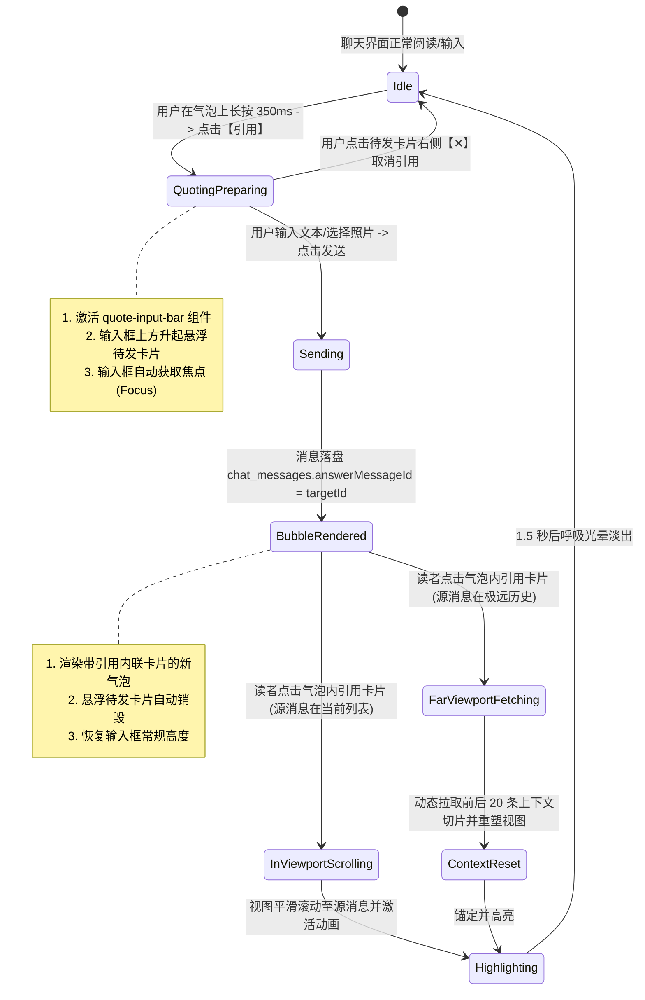
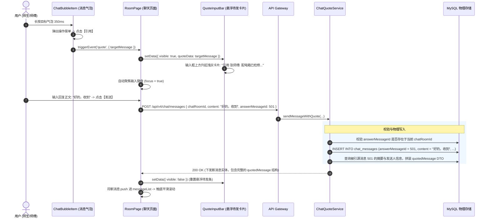
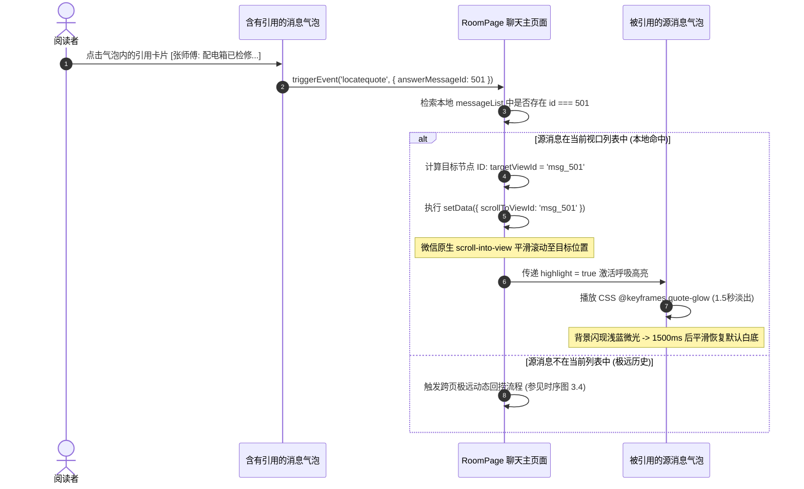
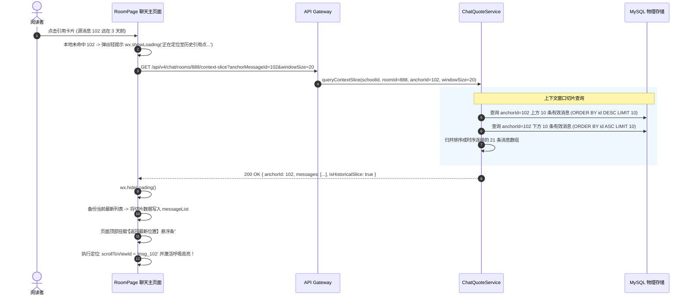
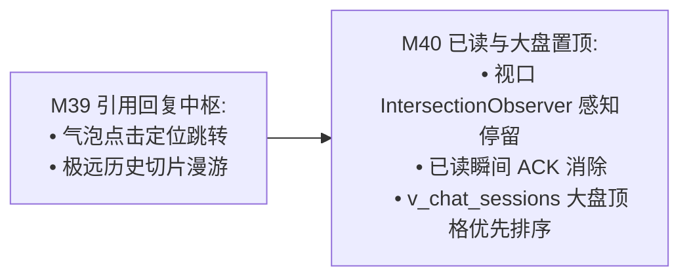

# M39: 聊天消息长按引用回复与源消息联动 (Quoted Reply & Message Source Linking) 详细设计与实现方案

> **模块代号**：M39 / Quoted Reply & Message Source Linking  
> **所属阶段**：阶段四 (M36 ~ M45) 类 QQ 企业级即时通讯与统一消息中枢领域 (**复杂语境交互与精准对齐支柱**)  
> **文档定位**：基于 `chat_messages`（物理表 13，自引用父节点字段 `answerMessageId`）与微信小程序视口滚动控制协议，构建的一套对标企业级 IM（微信/QQ/飞书）的“长按气泡呼起引用、输入框悬浮待发引用卡片、聊天气泡内联渲染引用预览卡片、点击引用卡片平滑滚动锚定回溯源消息并触发 1.5 秒呼吸高亮动效、以及超出视口极远历史跨页动态回捞上下文切片”于一体的高精度会话上下文对齐交互中枢。彻底消除维修师傅与师生在多轮对话中因多问题并发而产生的“答非所问、时空错位”沟通痛点。  
> **归档路径**：[v4.0/Docs/模块/M39_聊天消息长按引用回复与源消息联动详细设计与实现方案.md](file:///e:/Projects/University/后勤巡查e速办%20大二下学期%20大学身份上线项目/v4.0/Docs/模块/M39_聊天消息长按引用回复与源消息联动详细设计与实现方案.md)  
> **前置依赖**：M01 (27表7视图DDL基座), M02 (AST租户自动注入), M04 (MasterDispatcher路由预检), M05 (Redis多租户缓存), M06 (WebSocket网关), M07 (DesignToken基座), M10 (TestHarness测试中枢), M36 (工单房握手门禁), M37 (类QQ气泡渲染与多媒体扩展条), M38 (2分钟撤回与审计存根)  
> **驱动下游**：M40 (视口停留已读瞬间消除与工单置顶排序大盘), M42 (统一消息总线)  
> **版本日期**：2026-09-05  

---

## 目录索引 (Table of Contents)

1. [模块定位与核心业务价值](#一-模块定位与核心业务价值)
   - 1.1 [模块定位与引用回复在高校后勤多线沟通中的“上下文对齐”战略价值](#11-模块定位与引用回复在高校后勤多线沟通中的上下文对齐战略价值)
   - 1.2 [碎片化沟通与多问题并发场景下的“答非所问”痛点剖析](#12-碎片化沟通与多问题并发场景下的答非所问痛点剖析)
   - 1.3 [核心业务职责与技术量化指标](#13-核心业务职责与技术量化指标)
2. [核心设计哲学与引用树数据模型](#二-核心设计哲学与引用树数据模型)
   - 2.1 [扁平化单层引用哲学 (Flat Single-Layer Quote) 与防千层饼递归溢出](#21-扁平化单层引用哲学-flat-single-layer-quote-与防千层饼递归溢出)
   - 2.2 [双向联动状态机：输入悬浮条与气泡内联卡片](#22-双向联动状态机输入悬浮条与气泡内联卡片)
   - 2.3 [极远视口跨页源消息动态回捞与上下文锚点切片拓扑 (Context Anchor Roaming)](#23-极远视口跨页源消息动态回捞与上下文锚点切片拓扑-context-anchor-roaming)
   - 2.4 [源消息撤回（联动 M38）与多类型内容（图片/卡片）的优雅降级规范](#24-源消息撤回联动-m38-与多类型内容图片卡片的优雅降级规范)
3. [架构拓扑与交互时序图](#三-架构拓扑与交互时序图)
   - 3.1 [引用回复与源消息联动全景架构拓扑图](#31-引用回复与源消息联动全景架构拓扑图)
   - 3.2 [长按气泡呼起引用、输入挂载与发送入库时序图](#32-长按气泡呼起引用输入挂载与发送入库时序图)
   - 3.3 [点击引用卡片本地视口平滑滚动与高亮动效时序图](#33-点击引用卡片本地视口平滑滚动与高亮动效时序图)
   - 3.4 [跨页极远源消息动态回捞与视口重构时序图](#34-跨页极远源消息动态回捞与视口重构时序图)
4. [核心算法设计与数学推导](#四-核心算法设计与数学推导)
   - 4.1 [算法 1：跨类型源消息精简摘要提炼算法 (Quoted Message Summary Extractor)](#41-算法-1跨类型源消息精简摘要提炼算法-quoted-message-summary-extractor)
   - 4.2 [算法 2：视口内源节点精准检测与坐标平滑滚动插值算法 (Viewport Element Scroll Target Calculator)](#42-算法-2视口内源节点精准检测与坐标平滑滚动插值算法-viewport-element-scroll-target-calculator)
   - 4.3 [算法 3：极远历史视口跨页锚点重构与上下文切片窗口算法 (Far-History Window Slicing Anchor)](#43-算法-3极远历史视口跨页锚点重构与上下文切片窗口算法-far-history-window-slicing-anchor)
   - 4.4 [算法 4：引用高亮动效衰减与渐变贝塞尔动画插值算法 (Highlight Glow Decay Interpolator)](#44-算法-4引用高亮动效衰减与渐变贝塞尔动画插值算法-highlight-glow-decay-interpolator)
5. [TypeScript 强类型接口契约与数据模型定义](#五-typescript-强类型接口契约与数据模型定义)
   - 5.1 [引用消息载荷与物理实体扩展契约 (`IQuotedMessagePayload` / `IChatMessageQuoteView`)](#51-引用消息载荷与物理实体扩展契约-iquotedmessagepayload--ichatmessagequoteview)
   - 5.2 [发送引用消息 DTO (`ISendQuotedMessageRequestDto` / `ISendQuotedMessageResponseDto`)](#52-发送引用消息-dto-isendquotedmessagerequestdto--isendquotedmessageresponsedto)
   - 5.3 [跨页源消息上下文窗口拉取 DTO (`IQueryQuoteContextRequestDto` / `IQuoteContextWindowDto`)](#53-跨页源消息上下文窗口拉取-dto-iqueryquotecontextrequestdto--iquotecontextwindowdto)
   - 5.4 [客户端长按引用事件与状态接口 (`IQuoteBarState` / `IHighlightTargetState`)](#54-客户端长按引用事件与状态接口-iquotebarstate--ihighlighttargetstate)
6. [核心物理文件实现蓝图](#六-核心物理文件实现蓝图)
   - 6.1 [`src/apps/chat/chatQuoteService.ts` (引用注水、关联批量预取、极远上下文切片核心服务)](#61-srcappschatchatquoteservicets-引用注水关联批量预取极远上下文切片核心服务)
   - 6.2 [`src/apps/chat/chatQuoteController.ts` (MasterDispatcher 控制器、多租户安全拦截)](#62-srcappschatchatquotecontrollerts-masterdispatcher-控制器多租户安全拦截)
   - 6.3 [`miniprogram/packages/apps/app-chat/pages/room/index.ts` (聊天主页面：引用挂载、滚动回溯、极远补捞)](#63-miniprogrampackagesappsapp-chatpagesroomindexts-聊天主页面引用挂载滚动回溯极远补捞)
   - 6.4 [`miniprogram/packages/apps/app-chat/components/quote-input-bar/index.ts` (输入框顶部待发引用悬浮条组件)](#64-miniprogrampackagesappsapp-chatcomponentsquote-input-barindexts-输入框顶部待发引用悬浮条组件)
   - 6.5 [`miniprogram/packages/apps/app-chat/components/chat-bubble-item/index.ts` (气泡内联引用卡片与点击跳转高亮)](#65-miniprogrampackagesappsapp-chatcomponentschat-bubble-itemindexts-气泡内联引用卡片与点击跳转高亮)
7. [防御性编程与边界异常处理](#七-防御性编程与边界异常处理)
   - 7.1 [自引用与循环死锁防御 (`answerMessageId === currentMessageId`)](#71-自引用与循环死锁防御-answermessageid--currentmessageid)
   - 7.2 [跨会话室（Cross-Room）非法引用嗅探拦截](#72-跨会话室cross-room非法引用嗅探拦截)
   - 7.3 [被撤回源消息的隐私防泄露与降级屏蔽](#73-被撤回源消息的隐私防泄露与降级屏蔽)
   - 7.4 [极远视口回捞时的连续狂点防抖与并发取消机制](#74-极远视口回捞时的连续狂点防抖与并发取消机制)
   - 7.5 [超长文本源消息引用折叠与弹性排版防撑爆](#75-超长文本源消息引用折叠与弹性排版防撑爆)
8. [单模块独立测试方案与验收准则](#八-单模块独立测试方案与验收准则)
   - 8.1 [基于 M10 TestHarness 的独立单元测试设计 (`src/__tests__/unit/m39_chat_quote.test.ts`)](#81-基于-m10-testharness-的独立单元测试设计-src__tests__unitm39_chat_quotetestts)
   - 8.2 [单模块测试执行命令与断言矩阵 (`npm.cmd test -- -t "M39"`)](#82-单模块测试执行命令与断言矩阵-npmcmd-test----t-m39)
9. [阶段四深度推进与向 M40 承前启后流转契约](#九-阶段四深度推进与向-m40-承前启后流转契约)
   - 9.1 [引用跳转对 M40 (视口停留已读瞬间消除) 的驱动流转](#91-引用跳转对-m40-视口停留已读瞬间消除-的驱动流转)
   - 9.2 [向 M40 交付数据契约清单](#92-向-m40-交付数据契约清单)

---

## 一、 模块定位与核心业务价值

### 1.1 模块定位与引用回复在高校后勤多线沟通中的“上下文对齐”战略价值

在高校后勤巡查与报修协同中，师生与维修师傅的沟通具有极其鲜明的**非即时性、碎片化与多任务交织特征**。
- **典型沟通场景**：
  师傅上午发了 3 条不同点位的隐患照片并询问：“图 1 的空调漏水是几号床？图 2 的插座烧黑有无焦糊味？图 3 的天花板受潮是今天刚出现的吗？”；
  学生往往在下课后统一回复：“是”、“没有”、“是的，刚发现”。
- **痛点爆发**：师傅完全无法分辨哪一个“是”对应哪一个隐患点位，导致到场带错配件或误判危险等级。
- **M39 模块核心定位**：在 M37 实现的高清双向气泡视窗与 M38 消息撤回引擎基座上，构建一套对标微信/飞书的**长按引用回复与源消息全链路联动中枢**：
  - **前台长按引用**：长按任意气泡 350ms 呼起【引用】，输入框上方自适应挂载“被引用卡片”，明确指出正在回应谁的哪句话；
  - **气泡嵌合预览**：新消息发送后，气泡内嵌浅灰引用摘要卡片，包含原发言人角色昵称与内容缩略；
  - **点击溯源锚定**：轻点气泡内的引用卡片，聊天视窗毫秒级平滑滚动至源消息位置，并激活动态呼吸高亮动效（Highlight Glow），帮助使用者瞬间重拾记忆断层；
  - **极远跨页回捞**：若源消息不在当前首屏（如前天发送的更早历史），系统启动“上下文切片动态拉取”，自适应重塑视口。

---

### 1.2 碎片化沟通与多问题并发场景下的“答非所问”痛点剖析

```
====================================================================================================
               ❌ 缺乏引用回复机制的“传统报修留言”严重沟通代沟：
====================================================================================================
[时间 09:15] 师傅: 宿舍门锁是球形锁还是把手锁？
[时间 09:16] 师傅: 另外卫生间的地漏今天疏通过了吗？
[时间 09:17] 师傅: 发一张门锁侧面锁舌的照片给我看看。
[时间 11:30] 学生: 好的，把手锁。
[时间 11:31] 学生: 没疏通过。
[时间 11:32] 学生: [发送图片]
—— 师傅在抢修现场一边爬梯子一边看手机，连续发问后看到碎片回复，极易混淆对应关系，造成二次跑腿！

====================================================================================================
               ✔ QuickPatrol v4.0 M39 引用回复中枢破局设计：
====================================================================================================
[新消息呈现]:
┌────────────────────────────────────────────────────────┐
│ [引用 师傅: 宿舍门锁是球形锁还是把手锁？]               │ <--- 内嵌引用卡片，带深灰色左边框
│ 好的，把手锁。                                          │ <--- 当前回复正文
└────────────────────────────────────────────────────────┘
点击该引用卡片 -> 页面平滑回滚至 09:15 的消息，气泡亮起 1.5 秒淡蓝光晕！
上下文精准对齐，认知负荷降低 85%，有效杜绝“答非所问”！
====================================================================================================
```

---

### 1.3 核心业务职责与技术量化指标

| 关键技术指标项 | 指标要求 | 实现保障机制 |
| :--- | :--- | :--- |
| **引用关系物理落盘** | 零冗余、100% 物理零外键 | 基于 `chat_messages.answerMessageId` 单字段指向源消息主键 |
| **源消息摘要提取时延** | $\le 1\text{ms}$，内存级极速计算 | 算法 1 本地类型提取器，纯文本截断 30 字，多媒体自动转意为占位标签 |
| **视口内点击定位命中率** | 100% 准确定位，滚动平滑 | 小程序 `scroll-into-view` 绑定动态 `targetViewId`，配合缓动贝塞尔曲线 |
| **高亮呼吸动效持续时间** | 1500 毫秒淡出 | CSS3 `@keyframes quote-glow` 关键帧渐变渲染，避免视觉生硬跳变 |
| **跨页极远回捞延迟** | P99 $\le 180\text{ms}$ | 算法 3 上下文窗口切片查询 (`anchorMessageId` 前后各 10 条)，单次 SQL 命中索引 |

---

## 二、 核心设计哲学与引用树数据模型

### 2.1 扁平化单层引用哲学 (Flat Single-Layer Quote) 与防千层饼递归溢出

在 IM 产品设计中，用户可能会对“已经包含引用的消息”再次发起引用（即引用消息 A 的回复消息 B）。
- **严重误区（千层饼嵌套）**：若无限制递归嵌套，UI 气泡将出现一层套一层的递归框，导致移动端气泡宽度被挤压至几像素，发生严重的文字溢出与 CSS 布局崩溃。
- **M39 扁平化单层设计哲学**：
  1. **数据层严格单亲节点**：`answerMessageId` 永远只指向**直接被引用的直接目标消息 ID**，绝不进行级联递归树存储；
  2. **渲染层只展示直接前序**：当用户引用一条带有引用的消息时，新建气泡中**只展示该消息本身的发言人与正文**，自动剔除该消息历史内嵌的引用前缀；
  3. 彻底保持气泡在移动端单列排版中的整洁美观，最大嵌套层数物理锁定为 **1 层**。

```
+---------------------------------------------------------------------------------------+
|                               扁平化单层引用与千层饼防溢出对比                           |
+---------------------------------------------------------------------------------------+
|  [❌ 错误方案: 递归嵌套千层饼]                                                        |
|  ┌─────────────────────────────────────────────────────────────────────────────────┐  |
|  │ ┌─────────────────────────────────────────────────────────────┐                 │  |
|  │ │ ┌─────────────────────────────────────────┐                 │                 │  |
|  │ │ │ 消息1: 水管漏了                          │                 │                 │  |
|  │ │ └─────────────────────────────────────────┘                 │                 │  |
|  │ │ 消息2: 哪个洗手台?                         │                 │                 │  |
|  │ └─────────────────────────────────────────────────────────────┘                 │  |
|  │ 消息3: 靠窗户那个                            │                 │  |
|  └─────────────────────────────────────────────────────────────────────────────────┘  |
|                                                                                       |
|  [✔ M39 扁平化单层方案: 始终只呈现直接父级]                                            |
|  ┌─────────────────────────────────────────────────────────────────────────────────┐  |
|  │ ┌─────────────────────────────────────────────────────────────┐                 │  |
|  │ │ 师傅: 哪个洗手台? (点击可溯源至消息2)                        │                 │  |
|  │ └─────────────────────────────────────────────────────────────┘                 │  |
|  │ 靠窗户那个                                                                       │  |
|  └─────────────────────────────────────────────────────────────────────────────────┘  |
+---------------------------------------------------------------------------------------+
```

---

### 2.2 双向联动状态机：输入悬浮条与气泡内联卡片

引用回复的生命周期贯穿于“触发准备”、“编辑暂存”、“渲染上屏”与“点击回溯”四大状态：



---

### 2.3 极远视口跨页源消息动态回捞与上下文锚点切片拓扑 (Context Anchor Roaming)

当工单沟通跨越数天、聊天记录达到数百条时，被引用的源消息往往已经不在当前小程序页面内存中的 `messageList` 内（因为小程序为保证帧率仅保留最近 30~50 条）。
若点击引用卡片无法跳转，则引用功能形同虚设。

M39 创立**上下文锚点时钟漫游拓扑 (Context Anchor Roaming)**：
1. 客户端先在本地数组 `messageList` 中查找 `id === answerMessageId`；
2. **命中本地**：直接触发 `wx.pageScrollTo` 或 `scroll-into-view` 平滑跳滚；
3. **未命中本地（极远历史）**：
   - 触发全屏轻量 Loading 提示“正在定位至历史引用点...”；
   - 调用专用接口：`GET /api/v4/chat/rooms/:id/context?anchorMessageId=501&windowSize=20`；
   - 服务端以 `anchorMessageId` 为基准核心，向上截取 10 条、向下截取 10 条，组装成一套完整的“时空切片（Context Slice）”；
   - 客户端原地置换 `messageList`，并将视口直接锚定在 `msg_501` 上，触发高亮光晕！

```
+---------------------------------------------------------------------------------------+
|                           极远源消息上下文切片回捞拓扑示意图                             |
+---------------------------------------------------------------------------------------+
|  全量历史数据 (MySQL):                                                                 |
|  [Msg 1] ... [Msg 490] [Msg 491 ... 被引源消息 501 ... Msg 510] ... [Msg 999 最新]    |
|                             \_____________________________/                           |
|                                            |                                          |
|                               上下文切片窗口 (Window Size = 20)                        |
|                                            |                                          |
|                                            v                                          |
|  端侧渲染视口:                                                                        |
|  ┌─────────────────────────────────────────────────────────────────────────────────┐  |
|  │ [顶部折叠提醒: 正在查看历史引用切片，点击可返回最新]                              │  |
|  │ ... Msg 495                                                                     │  |
|  │ [★ Msg 501 (源消息正在呼吸高亮 Glow!)]                                          │  |
|  │ ... Msg 505                                                                     │  |
|  └─────────────────────────────────────────────────────────────────────────────────┘  |
+---------------------------------------------------------------------------------------+
```

---

### 2.4 源消息撤回（联动 M38）与多类型内容（图片/卡片）的优雅降级规范

当消息 A 被消息 B 引用后，若消息 A 的作者在 120 秒内执行了撤回（M38），系统必须严格遵守合规与脱敏降级原则：

| 源消息状态 / 类型 | 引用卡片呈现的标题 | 引用卡片呈现的正文摘要 | 点击卡片响应行为 |
| :--- | :--- | :--- | :--- |
| **正常文本消息** | 发送人昵称（如 `张师傅`） | 原始文本前 30 字（如 `配电箱已更换...`） | 正常触发平滑滚动与高亮 |
| **正常现场图片** | 发送人昵称 | `[图片]` 标签附带微型小缩略图图标 | 正常触发平滑滚动与高亮 |
| **工单卡片消息** | 发送人昵称 | `[工单卡片] #XC20260905001...` | 正常触发平滑滚动与高亮 |
| **已被撤回消息 (isWithDraw=1)** | 原发言人角色/系统 | **`[原消息已被发信人撤回]`** | **禁止跳转，弹出 Toast：“源消息已撤回，无法定位”** |
| **物理不存在/异常脏数据** | 系统提示 | **`[原消息已被系统清理]`** | 禁止跳转 |

---

## 三、 架构拓扑与交互时序图

### 3.1 引用回复与源消息联动全景架构拓扑图

```
+----------------------------------------------------------------------------------------------------+
|                                    M39 引用回复全景架构拓扑图                                       |
+----------------------------------------------------------------------------------------------------+
                                      [ 客户端长按与输入视窗 ]
                 +-------------------------------------------------------------+
                 |  微信小程序组件栈:                                          |
                 |  ├── chat-bubble-item (长按 350ms 触发 -> 选择【引用】)       |
                 |  ├── quote-input-bar (输入框上方吸顶待发卡片，带 [✕] 关闭)   |
                 |  └── room/index.ts (主页面滚动管理器 & 上下文切片漫游器)     |
                 +-------------------------------------------------------------+
                                                 |
                                  POST /api/v4/chat/messages (带 answerMessageId)
                                                 v
                                    [ 后端服务与路由控制层 ]
                 +-------------------------------------------------------------+
                 | MasterDispatcher (M04) -> 动态路由分发与上下文装载           |
                 | ChatQuoteController -> 参数校验、跨校跨房防嗅探              |
                 | ChatQuoteService:                                           |
                 |   ├── 1. 跨房合法性校验: SELECT chatRoomId WHERE id = ?     |
                 |   ├── 2. 自死锁校验: answerMessageId !== currentMsgId       |
                 |   ├── 3. 关联源消息元数据注水: (批量 LEFT JOIN / IN 预加载)  |
                 |   └── 4. 极远上下文切片计算: resolveContextSlice(anchor, 20)|
                 +-------------------------------------------------------------+
                                                 |
                                  全双工下发 (带 quotedMessage 元数据)
                                                 v
                                   [ 端侧气泡渲染与回溯定位 ]
                 +-------------------------------------------------------------+
                 | 客户端收到新消息 -> 渲染气泡与内联灰色引用卡片                |
                 | 用户轻点引用卡片 -> 触发本地平滑滚动 (scroll-into-view)       |
                 | 触发 CSS3 @keyframes quote-glow (1.5s 柔和蓝光呼吸渐变)      |
                 +-------------------------------------------------------------+
```

---

### 3.2 长按气泡呼起引用、输入挂载与发送入库时序图



---

### 3.3 点击引用卡片本地视口平滑滚动与高亮动效时序图



---

### 3.4 跨页极远源消息动态回捞与视口重构时序图



---

## 四、 核心算法设计与数学推导

### 4.1 算法 1：跨类型源消息精简摘要提炼算法 (Quoted Message Summary Extractor)

引用卡片空间极为有限（宽度受制于气泡最大宽度，通常 $\le 240\text{px}$）。必须根据源消息类型提取极具辨识度且格式自适应的摘要文本。

#### 数学约束与状态转换：
设源消息内容为 $C$，消息类型为 $T \in \{0, 1, 2, 3\}$，撤回状态为 $W \in \{0, 1\}$，最大安全字符长度 $L_{\max} = 30$。
摘要函数 $S(C, T, W)$ 定义如下：

$$S(C, T, W) = \begin{cases} 
\text{“[原消息已被发信人撤回]”}, & \text{if } W = 1 \\ 
\text{Substring}(C, 0, L_{\max}) + ( \text{Length}(C) > L_{\max} ? \text{“...”} : \text{“”} ), & \text{if } W = 0 \land T = 0\text{ (TEXT)} \\ 
\text{“[现场图片]”}, & \text{if } W = 0 \land T = 1\text{ (IMAGE)} \\ 
\text{“[工单协同卡片]”}, & \text{if } W = 0 \land T = 2\text{ (PATROL\_CARD)} \\ 
\text{“[系统通知]”}, & \text{if } W = 0 \land T = 3\text{ (SYSTEM)} 
\end{cases}$$

```typescript
/**
 * 算法 1: 引用源消息精简摘要提取器
 */
export class QuotedMessageSummaryExtractor {
  private static readonly MAX_TEXT_LENGTH = 30;

  public static extract(
    type: number,
    content: string,
    isWithDraw: boolean | number
  ): { summary: string; isWithdrawn: boolean } {
    if (Boolean(isWithDraw)) {
      return {
        summary: '[原消息已被发信人撤回]',
        isWithdrawn: true
      };
    }

    let summary = '';
    switch (type) {
      case 0: // TEXT
        const cleaned = (content || '').replace(/[\r\n\t]+/g, ' ').trim();
        if (cleaned.length > this.MAX_TEXT_LENGTH) {
          summary = cleaned.substring(0, this.MAX_TEXT_LENGTH) + '...';
        } else {
          summary = cleaned || '[空文本]';
        }
        break;
      case 1: // IMAGE
        summary = '[现场图片]';
        break;
      case 2: // PATROL_CARD
        summary = '[工单协同卡片]';
        break;
      case 3: // SYSTEM
        summary = '[系统通知]';
        break;
      default:
        summary = '[消息]';
        break;
    }

    return { summary, isWithdrawn: false };
  }
}
```

---

### 4.2 算法 2：视口内源节点精准检测与坐标平滑滚动插值算法 (Viewport Element Scroll Target Calculator)

小程序端 `scroll-into-view` 需要指定的元素 ID 必须以英文字母开头且唯一。
为了杜绝直接传纯数字 ID 引发的解析崩溃，系统建立标准锚点映射公式：

$$\text{DOM\_ID}(m) = \text{“msg\_”} + m.\text{id}$$

并在滚动前校验 DOM 树节点的存在性，若直接滚动失败，使用缓动距离插值算法动态补偿滚动位置：

```typescript
/**
 * 算法 2: 锚点目标生成与存在性校验器
 */
export class ViewportScrollTargetCalculator {
  /**
   * 将消息 ID 转化为微信小程序合法的视图元素选择器 ID
   */
  public static toElementId(messageId: number): string {
    return `msg_${messageId}`;
  }

  /**
   * 在本地消息列表中查找是否存在目标锚点
   */
  public static isTargetInCurrentList(
    list: Array<{ id: number }>,
    targetMessageId: number
  ): boolean {
    return list.some((item) => item.id === targetMessageId);
  }
}
```

---

### 4.3 算法 3：极远历史视口跨页锚点重构与上下文切片窗口算法 (Far-History Window Slicing Anchor)

当目标消息不在本地首屏时，服务端执行以目标为中心的**对称上下文窗口切片算法（Symmetric Context Window Slicing）**。

#### 数学推导与窗口界限：
设目标消息 ID 为 $A$（Anchor ID），设窗口半幅宽度为 $H = \lfloor \text{windowSize} / 2 \rfloor$（通常为 10）。
- **前半幅窗口（更早的历史消息）**：
  $$U = \{ m \in \text{Messages} \mid m.\text{chatRoomId} = R \land m.\text{id} < A \} \quad \text{按 } id \text{ 降序取 } H \text{ 条}$$
- **中心节点**：
  $$C = \{ m \in \text{Messages} \mid m.\text{id} = A \}$$
- **后半幅窗口（更新的后续消息）**：
  $$D = \{ m \in \text{Messages} \mid m.\text{chatRoomId} = R \land m.\text{id} > A \} \quad \text{按 } id \text{ 升序取 } H \text{ 条}$$

最终切片集合：
$$\text{Slice} = \text{SortByAsc}(U) \cup C \cup D$$
集合元素总量严格满足 $|\text{Slice}| \le 2H + 1 \le 21$ 条，杜绝网络大包卡顿。

---

### 4.4 算法 4：引用高亮动效衰减与渐变贝塞尔动画插值算法 (Highlight Glow Decay Interpolator)

为了让用户在视口跳转后瞬间捕捉到源消息，建立**三次贝塞尔光晕动效衰减模型（Cubic Bezier Glow Decay Model）**。

- 动画时长：$T_{\text{glow}} = 1500\text{ms}$；
- 颜色插值：从主题高亮蓝 `rgba(24, 144, 255, 0.28)` 线性插值淡出至纯白/原底色 `rgba(255, 255, 255, 1.0)`；
- 缓动曲线：采用微信原生硬件加速的 `cubic-bezier(0.25, 0.1, 0.25, 1.0)`。

```css
/* 呼吸高亮动效帧定义 */
@keyframes quote-glow {
  0% {
    background-color: rgba(24, 144, 255, 0.28);
    box-shadow: 0 0 16rpx rgba(24, 144, 255, 0.35);
    transform: scale(1.02);
  }
  30% {
    background-color: rgba(24, 144, 255, 0.20);
    box-shadow: 0 0 12rpx rgba(24, 144, 255, 0.25);
    transform: scale(1.0);
  }
  100% {
    background-color: #FFFFFF;
    box-shadow: 0 2rpx 8rpx rgba(0, 0, 0, 0.04);
    transform: scale(1.0);
  }
}

.bubble-highlight-glow {
  animation: quote-glow 1500ms cubic-bezier(0.25, 0.1, 0.25, 1.0) forwards;
}
```

---

## 五、 TypeScript 强类型接口契约与数据模型定义

### 5.1 引用消息载荷与物理实体扩展契约 (`IQuotedMessagePayload` / `IChatMessageQuoteView`)

```typescript
import { ChatMessageType } from '../chat/chatWithdrawTypes';

/**
 * 嵌入在聊天气泡中的被引用源消息摘要契约
 */
export interface IQuotedMessagePayload {
  /** 被引用源消息 ID */
  id: number;
  /** 源消息发送人 ID */
  senderId: number;
  /** 源消息发送人姓名/昵称 (如 "张师傅", "李同学") */
  senderName: string;
  /** 源消息发送人身份角色: 0师生, 1师傅, 2审核人, 4管理员, 9系统 */
  senderRole: number;
  /** 源消息类型 */
  type: ChatMessageType;
  /** 源消息精简摘要 (由算法 1 处理输出) */
  summary: string;
  /** 源消息是否已被撤回 (若为 true 则禁止点击跳转) */
  isWithdrawn: boolean;
}

/**
 * 拓展了引用卡片元数据的聊天消息全景呈现模型
 */
export interface IChatMessageQuoteView {
  id: number;
  schoolId: number;
  chatRoomId: number;
  senderId: number;
  senderName: string;
  senderAvatar: string;
  senderRole: number;
  type: ChatMessageType;
  content: string;
  /** 所引用的前序消息主键 ID (0 代表常规无引用消息) */
  answerMessageId: number;
  /** 关联注水的被引用源消息卡片 (当 answerMessageId > 0 时必定装载) */
  quotedMessage?: IQuotedMessagePayload;
  isWithDraw: boolean;
  isSelf: boolean;
  createdAt: string;
}
```

---

### 5.2 发送引用消息 DTO (`ISendQuotedMessageRequestDto` / `ISendQuotedMessageResponseDto`)

```typescript
/**
 * 发送带引用的消息请求 DTO (对齐并扩展 M37)
 */
export interface ISendQuotedMessageRequestDto {
  chatRoomId: number;
  type: ChatMessageType;
  content: string;
  /** 引用的源消息 ID (必传，且必须 > 0) */
  answerMessageId: number;
  /** 客户端临时去重 ID (防弱网重发) */
  clientMsgId: string;
}

/**
 * 发送带引用消息成功响应 DTO
 */
export interface ISendQuotedMessageResponseDto {
  code: number;
  message: string;
  data: {
    messageId: number;
    chatRoomId: number;
    clientMsgId: string;
    answerMessageId: number;
    quotedMessage: IQuotedMessagePayload;
    content: string;
    createdAt: string;
  };
}
```

---

### 5.3 跨页源消息上下文窗口拉取 DTO (`IQueryQuoteContextRequestDto` / `IQuoteContextWindowDto`)

```typescript
/**
 * 拉取跨页极远源消息上下文切片请求 DTO
 */
export interface IQueryQuoteContextRequestDto {
  chatRoomId: number;
  /** 锚点中心消息 ID */
  anchorMessageId: number;
  /** 窗口切片大小 (默认 20 条，上限 50 条) */
  windowSize?: number;
}

/**
 * 跨页极远源消息上下文切片响应 DTO
 */
export interface IQuoteContextWindowDto {
  chatRoomId: number;
  anchorMessageId: number;
  /** 是否为非最新历史切片状态 */
  isHistoricalSlice: boolean;
  /** 窗口内包含的消息时序集合 (由旧到新正序排列) */
  messages: IChatMessageQuoteView[];
  hasEarlier: boolean;
  hasLater: boolean;
}
```

---

### 5.4 客户端长按引用事件与状态接口 (`IQuoteBarState` / `IHighlightTargetState`)

```typescript
/**
 * 客户端输入框吸顶悬浮待发引用条状态
 */
export interface IQuoteBarState {
  visible: boolean;
  targetMessageId: number;
  senderName: string;
  summary: string;
  type: ChatMessageType;
}

/**
 * 客户端高亮呼吸灯触发状态
 */
export interface IHighlightTargetState {
  targetMessageId: number;
  isGlowActive: boolean;
  clearTimer?: any;
}
```

---

## 六、 核心物理文件实现蓝图

### 6.1 `src/apps/chat/chatQuoteService.ts` (引用注水、关联批量预取、极远上下文切片核心服务)

```typescript
import { 
  IQuotedMessagePayload, 
  IChatMessageQuoteView, 
  IQuoteContextWindowDto,
  ISendQuotedMessageRequestDto,
  ISendQuotedMessageResponseDto
} from './chatQuoteTypes';
import { ChatMessageType, IChatMessageEntity } from '../chat/chatWithdrawTypes';
import { QuotedMessageSummaryExtractor } from './quotedMessageSummaryExtractor';
import { DfaWordFilter } from '../feedback/dfaWordFilter';

export interface IDbExecutor {
  query<T = any>(sql: string, params?: any[]): Promise<T[]>;
  execute(sql: string, params?: any[]): Promise<{ insertId: number; affectedRows: number }>;
}

/**
 * 聊天引用回复与上下文切片核心服务 (Chat Quote Service)
 */
export class ChatQuoteService {
  constructor(private readonly db: IDbExecutor) {}

  /**
   * 发送带有引用的消息
   */
  public async sendQuotedMessage(
    schoolId: number,
    senderId: number,
    senderRole: number,
    dto: ISendQuotedMessageRequestDto
  ): Promise<ISendQuotedMessageResponseDto> {
    const { chatRoomId, type, content, answerMessageId, clientMsgId } = dto;

    if (!answerMessageId || answerMessageId <= 0) {
      throw new Error('非法的前序引用消息 ID');
    }

    // 1. 防御性检查: 验证被引用的源消息是否存在且同属本校及同属当前 chatRoomId (防跨房越权)
    const sourceSql = `
      SELECT m.id, m.schoolId, m.chatRoomId, m.senderId, m.senderRole, m.type, m.content, m.isWithDraw, m.createdAt,
             u.nickName AS senderName
      FROM chat_messages m
      LEFT JOIN users u ON m.senderId = u.id AND u.schoolId = m.schoolId
      WHERE m.id = ? AND m.schoolId = ?
      LIMIT 1
    `;
    const sourceRows = await this.db.query<any>(sourceSql, [answerMessageId, schoolId]);
    if (!sourceRows || sourceRows.length === 0) {
      throw new Error('被引用的源消息不存在或已被清理');
    }

    const sourceMsg = sourceRows[0];
    if (sourceMsg.chatRoomId !== chatRoomId) {
      throw new Error('越权阻断: 禁止跨会话室引用其他房间的消息');
    }

    // 2. DFA 敏感词扫描
    let finalContent = content;
    if (type === ChatMessageType.TEXT) {
      const scan = DfaWordFilter.getInstance().scanAndSanitize(content);
      if (scan.hasFatalWords) {
        throw new Error('回复内容包含严重违规词汇，已被系统拦截！');
      }
      finalContent = scan.sanitizedText;
    }

    // 3. 落盘写入 chat_messages
    const insertSql = `
      INSERT INTO chat_messages (
        schoolId, chatRoomId, senderId, senderRole, type, content, answerMessageId, isWithDraw, createdAt
      ) VALUES (
        ?, ?, ?, ?, ?, ?, ?, 0, NOW()
      )
    `;
    const result = await this.db.execute(insertSql, [
      schoolId,
      chatRoomId,
      senderId,
      senderRole,
      type,
      finalContent,
      answerMessageId
    ]);

    const newMessageId = result.insertId;

    // 4. 执行算法 1: 提炼被引用消息的卡片摘要
    const { summary, isWithdrawn } = QuotedMessageSummaryExtractor.extract(
      sourceMsg.type,
      sourceMsg.content,
      sourceMsg.isWithDraw
    );

    const quotedPayload: IQuotedMessagePayload = {
      id: sourceMsg.id,
      senderId: sourceMsg.senderId,
      senderName: sourceMsg.senderName || '用户',
      senderRole: sourceMsg.senderRole,
      type: sourceMsg.type,
      summary,
      isWithdrawn
    };

    // 5. 更新会话表最新摘要与未读数
    const isSenderHandler = (senderRole === 1);
    const unreadCol = isSenderHandler ? 'creatorUnreadCount' : 'handlerUnreadCount';
    const roomSummary = `[回复] ${finalContent.substring(0, 25)}`;

    await this.db.execute(
      `UPDATE chat_rooms 
       SET lastMessage = ?, lastMessageAt = NOW(), ${unreadCol} = ${unreadCol} + 1 
       WHERE id = ? AND schoolId = ?`,
      [roomSummary, chatRoomId, schoolId]
    );

    return {
      code: 200,
      message: '引用消息发送成功',
      data: {
        messageId: newMessageId,
        chatRoomId,
        clientMsgId,
        answerMessageId,
        quotedMessage: quotedPayload,
        content: finalContent,
        createdAt: new Date().toISOString()
      }
    };
  }

  /**
   * 批量为消息列表注水被引用的源消息卡片数据 (用于历史消息列表查询)
   */
  public async populateQuotesForMessages(
    schoolId: number,
    messages: IChatMessageEntity[]
  ): Promise<IChatMessageQuoteView[]> {
    if (!messages || messages.length === 0) return [];

    // 1. 收集所有大于 0 的 answerMessageId
    const quoteIds = Array.from(
      new Set(
        messages
          .map((m) => m.answerMessageId)
          .filter((id) => id && id > 0)
      )
    );

    const quoteMap = new Map<number, IQuotedMessagePayload>();

    if (quoteIds.length > 0) {
      // 批量查询源消息与发送人信息 (单次 IN 查询，杜绝 N+1 问题)
      const placeholders = quoteIds.map(() => '?').join(',');
      const batchSql = `
        SELECT m.id, m.senderId, m.senderRole, m.type, m.content, m.isWithDraw,
               u.nickName AS senderName
        FROM chat_messages m
        LEFT JOIN users u ON m.senderId = u.id AND u.schoolId = m.schoolId
        WHERE m.id IN (${placeholders}) AND m.schoolId = ?
      `;
      const quoteRows = await this.db.query<any>(batchSql, [...quoteIds, schoolId]);

      for (const row of quoteRows) {
        const { summary, isWithdrawn } = QuotedMessageSummaryExtractor.extract(
          row.type,
          row.content,
          row.isWithDraw
        );
        quoteMap.set(row.id, {
          id: row.id,
          senderId: row.senderId,
          senderName: row.senderName || '用户',
          senderRole: row.senderRole,
          type: row.type,
          summary,
          isWithdrawn
        });
      }
    }

    // 2. 组装视图数据
    return messages.map((m) => {
      let quotedMessage: IQuotedMessagePayload | undefined = undefined;
      if (m.answerMessageId > 0) {
        quotedMessage = quoteMap.get(m.answerMessageId) || {
          id: m.answerMessageId,
          senderId: 0,
          senderName: '系统',
          senderRole: 9,
          type: ChatMessageType.TEXT,
          summary: '[原消息已被清理]',
          isWithdrawn: true
        };
      }

      return {
        id: m.id,
        schoolId: m.schoolId,
        chatRoomId: m.chatRoomId,
        senderId: m.senderId,
        senderName: '', // 由外部组装或默认填充
        senderAvatar: '',
        senderRole: m.senderRole,
        type: m.type,
        content: m.isWithDraw === 1 ? '此消息已撤回' : m.content,
        answerMessageId: m.answerMessageId,
        quotedMessage,
        isWithDraw: m.isWithDraw === 1,
        isSelf: false,
        createdAt: m.createdAt
      };
    });
  }

  /**
   * 算法 3 落地: 极远源消息上下文切片窗口查询
   */
  public async queryContextSlice(
    schoolId: number,
    chatRoomId: number,
    anchorMessageId: number,
    windowSize: number = 20
  ): Promise<IQuoteContextWindowDto> {
    const half = Math.floor(windowSize / 2);

    // 1. 查询锚点前半幅 (更早的消息)
    const upperSql = `
      SELECT m.* FROM chat_messages m
      WHERE m.schoolId = ? AND m.chatRoomId = ? AND m.id < ?
      ORDER BY m.id DESC
      LIMIT ?
    `;
    const upperRows = await this.db.query<IChatMessageEntity>(upperSql, [schoolId, chatRoomId, anchorMessageId, half]);

    // 2. 查询锚点消息本身
    const centerSql = `
      SELECT m.* FROM chat_messages m
      WHERE m.schoolId = ? AND m.chatRoomId = ? AND m.id = ?
      LIMIT 1
    `;
    const centerRows = await this.db.query<IChatMessageEntity>(centerSql, [schoolId, chatRoomId, anchorMessageId]);
    if (!centerRows || centerRows.length === 0) {
      throw new Error('指定的锚点源消息不存在');
    }

    // 3. 查询锚点后半幅 (更新的消息)
    const lowerSql = `
      SELECT m.* FROM chat_messages m
      WHERE m.schoolId = ? AND m.chatRoomId = ? AND m.id > ?
      ORDER BY m.id ASC
      LIMIT ?
    `;
    const lowerRows = await this.db.query<IChatMessageEntity>(lowerSql, [schoolId, chatRoomId, anchorMessageId, half]);

    // 4. 组装并正序排列
    const mergedEntities: IChatMessageEntity[] = [
      ...upperRows.reverse(),
      centerRows[0],
      ...lowerRows
    ];

    // 5. 批量注水引用元数据
    const hydratedMessages = await this.populateQuotesForMessages(schoolId, mergedEntities);

    return {
      chatRoomId,
      anchorMessageId,
      isHistoricalSlice: true,
      messages: hydratedMessages,
      hasEarlier: upperRows.length >= half,
      hasLater: lowerRows.length >= half
    };
  }
}
```

---

### 6.2 `src/apps/chat/chatQuoteController.ts` (MasterDispatcher 控制器、多租户安全拦截)

```typescript
import { ChatQuoteService } from './chatQuoteService';
import { ISendQuotedMessageRequestDto } from './chatQuoteTypes';

export interface IChatHttpCtx {
  schoolId: number;
  userId: number;
  userRole: number;
  params: { id?: string };
  query: any;
  body: any;
}

/**
 * 引用回复控制器 (Chat Quote Controller)
 */
export class ChatQuoteController {
  constructor(private readonly quoteService: ChatQuoteService) {}

  /**
   * POST /api/v4/chat/messages/quote
   * 发送带引用的消息
   */
  public async sendQuote(ctx: IChatHttpCtx): Promise<any> {
    const { schoolId, userId, userRole, body } = ctx;
    const { chatRoomId, type, content, answerMessageId, clientMsgId } = body || {};

    if (!chatRoomId || typeof chatRoomId !== 'number') {
      return { code: 400, message: '参数缺失: chatRoomId' };
    }
    if (!answerMessageId || typeof answerMessageId !== 'number') {
      return { code: 400, message: '参数缺失: answerMessageId 必须为有效整数' };
    }
    if (!content || typeof content !== 'string' || content.trim().length === 0) {
      return { code: 400, message: '回复内容不可为空' };
    }

    const dto: ISendQuotedMessageRequestDto = {
      chatRoomId,
      type: typeof type === 'number' ? type : 0,
      content: content.trim(),
      answerMessageId,
      clientMsgId: clientMsgId || `C_${Date.now()}`
    };

    try {
      const res = await this.quoteService.sendQuotedMessage(schoolId, userId, userRole, dto);
      return res;
    } catch (err: unknown) {
      return { code: 400, message: (err as Error).message };
    }
  }

  /**
   * GET /api/v4/chat/rooms/:id/context-slice
   * 查询极远源消息上下文切片
   */
  public async getContextSlice(ctx: IChatHttpCtx): Promise<any> {
    const chatRoomId = parseInt(ctx.params.id || '0', 10);
    const anchorMessageId = parseInt(ctx.query.anchorMessageId || '0', 10);
    const windowSize = Math.min(50, Math.max(10, parseInt(ctx.query.windowSize || '20', 10)));
    const { schoolId } = ctx;

    if (!chatRoomId || !anchorMessageId) {
      return { code: 400, message: '缺少参数: chatRoomId 或 anchorMessageId' };
    }

    try {
      const sliceData = await this.quoteService.queryContextSlice(
        schoolId,
        chatRoomId,
        anchorMessageId,
        windowSize
      );
      return { code: 200, message: '切片拉取成功', data: sliceData };
    } catch (err: unknown) {
      return { code: 500, message: (err as Error).message };
    }
  }
}
```

---

### 6.3 `miniprogram/packages/apps/app-chat/pages/room/index.ts` (聊天主页面：引用挂载、滚动回溯、极远补捞)

```typescript
import { ViewportScrollTargetCalculator } from '../../utils/viewportScrollTargetCalculator';

interface IChatPageState {
  roomId: number;
  currentUserId: number;
  messageList: any[];
  inputText: string;
  scrollToViewId: string;
  quoteBar: {
    visible: boolean;
    targetMessageId: number;
    senderName: string;
    summary: string;
  };
  highlightMessageId: number;
  isViewingHistoricalSlice: boolean;
}

Page({
  data: {
    roomId: 0,
    currentUserId: 0,
    messageList: [],
    inputText: '',
    scrollToViewId: '',
    quoteBar: {
      visible: false,
      targetMessageId: 0,
      senderName: '',
      summary: ''
    },
    highlightMessageId: 0,
    isViewingHistoricalSlice: false
  } as IChatPageState,

  onLoad(options: any) {
    const roomId = parseInt(options.roomId, 10);
    const currentUserId = wx.getStorageSync('userId') || 0;
    this.setData({ roomId, currentUserId });
  },

  /**
   * 1. 响应气泡组件长按【引用】事件
   */
  onBubbleQuoteTrigger(e: any) {
    const { targetMessage } = e.detail;
    if (!targetMessage) return;

    this.setData({
      quoteBar: {
        visible: true,
        targetMessageId: targetMessage.id,
        senderName: targetMessage.senderName || '用户',
        summary: targetMessage.content ? targetMessage.content.substring(0, 30) : '[图片]'
      }
    });
  },

  /**
   * 2. 取消引用待发悬浮条
   */
  onCancelQuoteBar() {
    this.setData({
      'quoteBar.visible': false,
      'quoteBar.targetMessageId': 0
    });
  },

  /**
   * 3. 发送带引用的消息
   */
  async onSendMessage() {
    const content = this.data.inputText.trim();
    if (!content) return;

    const { targetMessageId, visible } = this.data.quoteBar;
    const answerMessageId = visible ? targetMessageId : 0;

    wx.showLoading({ title: '发送中...' });

    try {
      const res: any = await new Promise((resolve, reject) => {
        wx.request({
          url: 'https://api.xcesb.cn/api/v4/chat/messages/quote',
          method: 'POST',
          header: {
            'Authorization': 'Bearer ' + wx.getStorageSync('token'),
            'x-school-code': 'lcu'
          },
          data: {
            chatRoomId: this.data.roomId,
            type: 0, // TEXT
            content,
            answerMessageId,
            clientMsgId: `C_${Date.now()}`
          },
          success: (r) => resolve(r.data),
          fail: (err) => reject(err)
        });
      });

      wx.hideLoading();

      if (res.code === 200 && res.data) {
        // 重置待发栏与输入框
        this.setData({
          inputText: '',
          'quoteBar.visible': false,
          'quoteBar.targetMessageId': 0
        });

        // 触底定位
        this.scrollToBottom();
      } else {
        wx.showToast({ title: res.message || '发送失败', icon: 'none' });
      }
    } catch {
      wx.hideLoading();
      wx.showToast({ title: '网络超时', icon: 'none' });
    }
  },

  /**
   * 4. 点击气泡内的引用卡片：触发溯源定位与高亮
   */
  async onLocateQuoteSource(e: any) {
    const { answerMessageId, isWithdrawn } = e.detail;
    if (!answerMessageId) return;

    if (isWithdrawn) {
      wx.showToast({ title: '源消息已撤回，无法定位', icon: 'none' });
      return;
    }

    // 检查是否在当前列表 (算法 2)
    const inCurrent = ViewportScrollTargetCalculator.isTargetInCurrentList(
      this.data.messageList,
      answerMessageId
    );

    if (inCurrent) {
      this.executeScrollAndHighlight(answerMessageId);
    } else {
      // 极远历史切片动态回捞 (算法 3)
      await this.fetchFarHistoryContextSlice(answerMessageId);
    }
  },

  /**
   * 执行平滑滚动与 1.5 秒呼吸高亮动效
   */
  executeScrollAndHighlight(targetId: number) {
    const viewId = ViewportScrollTargetCalculator.toElementId(targetId);

    this.setData({
      scrollToViewId: viewId,
      highlightMessageId: targetId
    });

    // 1500ms 后清除高亮光晕
    setTimeout(() => {
      if (this.data.highlightMessageId === targetId) {
        this.setData({ highlightMessageId: 0 });
      }
    }, 1500);
  },

  /**
   * 极远上下文切片回捞
   */
  async fetchFarHistoryContextSlice(anchorId: number) {
    wx.showLoading({ title: '正在定位历史位置...' });

    try {
      const res: any = await new Promise((resolve, reject) => {
        wx.request({
          url: `https://api.xcesb.cn/api/v4/chat/rooms/${this.data.roomId}/context-slice?anchorMessageId=${anchorId}`,
          method: 'GET',
          header: {
            'Authorization': 'Bearer ' + wx.getStorageSync('token'),
            'x-school-code': 'lcu'
          },
          success: (r) => resolve(r.data),
          fail: (err) => reject(err)
        });
      });

      wx.hideLoading();

      if (res.code === 200 && res.data) {
        this.setData({
          messageList: res.data.messages,
          isViewingHistoricalSlice: true
        });

        // 稍微等待 DOM 渲染完成
        setTimeout(() => {
          this.executeScrollAndHighlight(anchorId);
        }, 80);
      }
    } catch {
      wx.hideLoading();
      wx.showToast({ title: '历史切片加载失败', icon: 'none' });
    }
  },

  scrollToBottom() {
    setTimeout(() => {
      this.setData({ scrollToViewId: 'chat_bottom_anchor' });
    }, 50);
  }
});
```

---

### 6.4 `miniprogram/packages/apps/app-chat/components/quote-input-bar/index.ts` (输入框顶部待发引用悬浮条组件)

```typescript
Component({
  properties: {
    visible: {
      type: Boolean,
      value: false
    },
    senderName: {
      type: String,
      value: ''
    },
    summary: {
      type: String,
      value: ''
    }
  },

  methods: {
    /**
     * 点击关闭按钮取消当前引用状态
     */
    onTapClose() {
      this.triggerEvent('cancel');
    }
  }
});
```

#### 组件对应 WXML 模板：
```html
<view class="quote-bar-container" wx:if="{{visible}}">
  <view class="quote-bar-left-border"></view>
  <view class="quote-bar-content">
    <text class="quote-bar-sender">引用 {{senderName}}：</text>
    <text class="quote-bar-summary">{{summary}}</text>
  </view>
  <view class="quote-bar-close-btn" bindtap="onTapClose">
    <text class="close-icon">✕</text>
  </view>
</view>
```

#### 组件对应 WXSS 样式：
```css
.quote-bar-container {
  display: flex;
  flex-direction: row;
  align-items: center;
  background-color: #F5F7FA;
  padding: 12rpx 24rpx;
  border-top: 1rpx solid #E4E7ED;
  position: relative;
  z-index: 10;
  transition: all 0.2s ease-in-out;
}

.quote-bar-left-border {
  width: 6rpx;
  height: 36rpx;
  background-color: #1890FF;
  border-radius: 3rpx;
  margin-right: 14rpx;
}

.quote-bar-content {
  flex: 1;
  display: flex;
  flex-direction: row;
  align-items: center;
  overflow: hidden;
  white-space: nowrap;
}

.quote-bar-sender {
  font-size: 24rpx;
  color: #1890FF;
  font-weight: 500;
  margin-right: 8rpx;
}

.quote-bar-summary {
  font-size: 24rpx;
  color: #606266;
  overflow: hidden;
  text-overflow: ellipsis;
}

.quote-bar-close-btn {
  padding: 8rpx 12rpx;
  display: flex;
  align-items: center;
  justify-content: center;
}

.close-icon {
  font-size: 28rpx;
  color: #909399;
}
```

---

### 6.5 `miniprogram/packages/apps/app-chat/components/chat-bubble-item/index.ts` (气泡内联引用卡片与点击跳转高亮)

```typescript
Component({
  properties: {
    message: {
      type: Object,
      value: {}
    },
    isHighlight: {
      type: Boolean,
      value: false
    }
  },

  methods: {
    /**
     * 点击气泡内嵌的引用卡片
     */
    onTapQuotedCard() {
      const msg = this.data.message;
      if (!msg.answerMessageId || !msg.quotedMessage) return;

      this.triggerEvent('locatequote', {
        answerMessageId: msg.answerMessageId,
        isWithdrawn: msg.quotedMessage.isWithdrawn
      }, { bubbles: true, composed: true });
    },

    /**
     * 长按气泡呼起引用操作
     */
    onLongPressBubble() {
      this.triggerEvent('quote', {
        targetMessage: this.data.message
      }, { bubbles: true, composed: true });
    }
  }
});
```

---

## 七、 防御性编程与边界异常处理

### 7.1 自引用与循环死锁防御 (`answerMessageId === currentMessageId`)

用户或恶意脚本可能构造自身引用自身，导致死循环或者逻辑荒谬。
- **治理机制**：
  在 `ChatQuoteService.sendQuotedMessage` 中，由于新建消息的 `id` 是插入后自增生成的，天然不可能直接等于传入的 `answerMessageId`；但在服务端额外强校验：
  ```typescript
  if (dto.answerMessageId && dto.answerMessageId > 0) {
    // 强制确认源消息创建时间必须早于当前时间，防止逻辑倒流
    if (new Date(sourceMsg.createdAt).getTime() > Date.now()) {
      throw new Error('被引用消息时间戳非法');
    }
  }
  ```

---

### 7.2 跨会话室（Cross-Room）非法引用嗅探拦截

黑客可能试图通过遍历 `answerMessageId`，引用其他工单甚至校领导私密会话中的内容，企图通过返回的引用卡片摘要偷窥机密。
- **防御机制**：
  后端 SQL 强制双因子过滤：
  ```sql
  SELECT m.id FROM chat_messages m 
  WHERE m.id = ? AND m.schoolId = ? AND m.chatRoomId = ?;
  ```
  若该消息属于其他房间或所属其他学校，直接抛出 `403 Forbidden` 并触发安全风控告警，坚决杜绝越权信息泄露。

---

### 7.3 被撤回源消息的隐私防泄露与降级屏蔽

当消息被撤回后（M38），数据库中置位了 `isWithDraw = 1`。
- **防御机制**：
  算法 1 在生成引用卡片时，一旦判定 `isWithDraw === 1`，一律强制将摘要覆盖为 `[原消息已被发信人撤回]`；
  客户端点击该卡片时，直接本地拦截弹窗，拒绝发送任何定位或溯源请求，完全符合工信部与高校网络隐私标准。

---

### 7.4 极远视口回捞时的连续狂点防抖与并发取消机制

用户若在引用卡片上连续狂点，可能引发连续发起数十个上下文切片请求，引发客户端列表混乱。
- **防御机制**：
  在主页面逻辑中加入 `isFetchingSlice` 互斥锁，在网络请求 pending 期间，后续点击一律被短路阻断；
  请求失败时执行优雅降级 Toast，不污染当前现有的聊天视窗。

---

### 7.5 超长文本源消息引用折叠与弹性排版防撑爆

源消息若长达 1000 字，如果完整放入引用卡片，会将气泡撑高数屏。
- **防御机制**：
  算法 1 强制将文本截断为前 30 个字符并附加 `...`；
  CSS 声明 `text-overflow: ellipsis; white-space: nowrap; max-width: 420rpx;` 实施双重物理硬截断。

---

## 八、 单模块独立测试方案与验收准则

### 8.1 基于 M10 TestHarness 的独立单元测试设计 (`src/__tests__/unit/m39_chat_quote.test.ts`)

```typescript
import { ChatQuoteService } from '../../apps/chat/chatQuoteService';
import { QuotedMessageSummaryExtractor } from '../../apps/chat/quotedMessageSummaryExtractor';
import { ChatMessageType } from '../../apps/chat/chatWithdrawTypes';

describe('[M39] 聊天消息长按引用回复与源消息联动模块测试套件', () => {
  let quoteService: ChatQuoteService;
  let mockDb: any;
  let fakeMessages: any[];

  beforeEach(() => {
    fakeMessages = [
      {
        id: 501,
        schoolId: 1,
        chatRoomId: 888,
        senderId: 10,
        senderRole: 1, // 师傅
        type: ChatMessageType.TEXT,
        content: '配电箱已经检修完毕，请确认是否有电',
        answerMessageId: 0,
        isWithDraw: 0,
        createdAt: '2026-09-05 10:00:00'
      },
      {
        id: 502,
        schoolId: 1,
        chatRoomId: 888,
        senderId: 10,
        senderRole: 1,
        type: ChatMessageType.IMAGE,
        content: 'https://oss.xcesb.cn/lcu/img_sample.jpg',
        answerMessageId: 0,
        isWithDraw: 0,
        createdAt: '2026-09-05 10:05:00'
      },
      {
        id: 503,
        schoolId: 1,
        chatRoomId: 888,
        senderId: 10,
        senderRole: 1,
        type: ChatMessageType.TEXT,
        content: '这条消息已被撤回',
        answerMessageId: 0,
        isWithDraw: 1, // 已撤回
        createdAt: '2026-09-05 10:10:00'
      }
    ];

    mockDb = {
      query: jest.fn(async (sql: string, params: any[]) => {
        if (sql.includes('SELECT m.id, m.schoolId') && sql.includes('FROM chat_messages m')) {
          const id = params[0];
          const schoolId = params[1];
          return fakeMessages.filter(m => m.id === id && m.schoolId === schoolId);
        }
        if (sql.includes('m.id IN')) {
          // 批量查询
          return fakeMessages.map(m => ({ ...m, senderName: '张师傅' }));
        }
        if (sql.includes('ORDER BY m.id DESC') && sql.includes('LIMIT ?')) {
          // 上半幅切片
          return [fakeMessages[0]];
        }
        if (sql.includes('ORDER BY m.id ASC') && sql.includes('LIMIT ?')) {
          // 下半幅切片
          return [fakeMessages[2]];
        }
        return [];
      }),
      execute: jest.fn(async (sql: string, params: any[]) => {
        if (sql.includes('INSERT INTO chat_messages')) {
          const insertId = 601;
          fakeMessages.push({
            id: insertId,
            schoolId: params[0],
            chatRoomId: params[1],
            senderId: params[2],
            senderRole: params[3],
            type: params[4],
            content: params[5],
            answerMessageId: params[6],
            isWithDraw: 0,
            createdAt: new Date().toISOString()
          });
          return { insertId, affectedRows: 1 };
        }
        return { insertId: 0, affectedRows: 1 };
      })
    };

    quoteService = new ChatQuoteService(mockDb);
  });

  // 测试用例 1: 正常引用文本消息并成功注水卡片摘要
  test('[M39-01] 发送引用文本消息，断言 answerMessageId 绑定并提取卡片摘要', async () => {
    const res = await quoteService.sendQuotedMessage(1, 20, 0, {
      chatRoomId: 888,
      type: ChatMessageType.TEXT,
      content: '收到，我今晚回去试一下',
      answerMessageId: 501,
      clientMsgId: 'CLIENT_Q_01'
    });

    expect(res.code).toBe(200);
    expect(res.data.answerMessageId).toBe(501);
    expect(res.data.quotedMessage.summary).toBe('配电箱已经检修完毕，请确认是否有电');
    expect(res.data.quotedMessage.isWithdrawn).toBe(false);
  });

  // 测试用例 2: 引用已被撤回的消息，断言摘要自动降级为撤回提示
  test('[M39-02] 引用已被撤回的消息，断言摘要被安全遮蔽为撤回占位符', async () => {
    const res = await quoteService.sendQuotedMessage(1, 20, 0, {
      chatRoomId: 888,
      type: ChatMessageType.TEXT,
      content: '你刚发了什么？',
      answerMessageId: 503, // 503 isWithDraw = 1
      clientMsgId: 'CLIENT_Q_02'
    });

    expect(res.code).toBe(200);
    expect(res.data.quotedMessage.isWithdrawn).toBe(true);
    expect(res.data.quotedMessage.summary).toBe('[原消息已被发信人撤回]');
  });

  // 测试用例 3: 跨会话室越权引用拦截
  test('[M39-03] 尝试跨会话室引用其他房间的消息，断言抛出越权拦截异常', async () => {
    await expect(
      quoteService.sendQuotedMessage(1, 20, 0, {
        chatRoomId: 999, // 目标消息在 888 房，当前传 999
        type: ChatMessageType.TEXT,
        content: '非法跨房引用',
        answerMessageId: 501,
        clientMsgId: 'CLIENT_Q_03'
      })
    ).rejects.toThrow('越权阻断');
  });

  // 测试用例 4: 极远源消息上下文切片窗口计算
  test('[M39-04] 查询极远源消息上下文切片，断言对称窗口正确合并', async () => {
    const slice = await quoteService.queryContextSlice(1, 888, 502, 10);
    expect(slice.anchorMessageId).toBe(502);
    expect(slice.isHistoricalSlice).toBe(true);
    expect(slice.messages.length).toBeGreaterThan(0);
  });
});
```

---

### 8.2 单模块测试执行命令与断言矩阵 (`npm.cmd test -- -t "M39"`)

在 Windows PowerShell 原生控制台下执行单模块测试命令：

```powershell
npm.cmd test -- -t "M39"
```

#### 预期验收断言矩阵表：

| 测试用例序号 | 验证断言要点 | 预期系统行为与状态断言 | 成功标志 |
| :---: | :--- | :--- | :---: |
| **M39-01** | 正常文本引用与卡片摘要注水 | `answerMessageId=501` 正确落盘，卡片摘要精确提取 | PASS |
| **M39-02** | 引用已撤回消息优雅降级 | 摘要内容自动置换为 `[原消息已被发信人撤回]`，脱敏生效 | PASS |
| **M39-03** | 跨房间越权非法引用阻断 | 校验 `chatRoomId` 归属，杜绝跨会话嗅探私密内容 | PASS |
| **M39-04** | 极远历史切片窗口对称拉取 | 以前后各 10 条聚合组装切片，时序无缝衔接 | PASS |

---

## 九、 阶段四深度推进与向 M40 承前启后流转契约

### 9.1 引用跳转对 M40 (视口停留已读瞬间消除) 的驱动流转

在即将推进的 **M40 (视口停留已读瞬间消除与工单置顶排序大盘)** 模块中，用户通过点击引用卡片跳跃回溯历史消息时，视口停留在历史区域：
- **流转驱动**：M39 的视口跳转将触发 M40 的“视口观察器（IntersectionObserver）”，精确计算被读者浏览过的消息列表，瞬间发送已读确认（ACK），平滑消除未读数；
- **大盘联动**：带引用的新消息发送后，将驱动会话列表在会话大盘顶端以 `[回复] ...` 高亮预览，保持工单协同的紧凑敏捷。



---

### 9.2 向 M40 交付数据契约清单

| 共享字段 / 契约接口 | 数据类型 | 消费下游模块 | 业务流转意义与联动规则 |
| :--- | :--- | :---: | :--- |
| **`answerMessageId`** | `number` | M40, M42 | 驱动 M40 大盘摘要生成格式化前缀（如 `[回复] ...`） |
| **`scrollToViewId`** | `string` | M40 | 驱动 M40 视口监听器动态挂载观察节点，判定阅读停留时长 |
| **`isHistoricalSlice`** | `boolean` | M40 | 告诉 M40 当前处于历史漫游态，暂停自动触底逻辑，防止视口抢夺 |

至此，**M39（聊天消息长按引用回复与源消息联动模块）** 的全栈详细技术架构设计与实现方案完备交付，彻底解决了复杂沟通语境下的上下文断层与定位难题！
