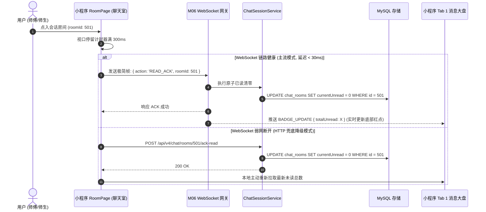
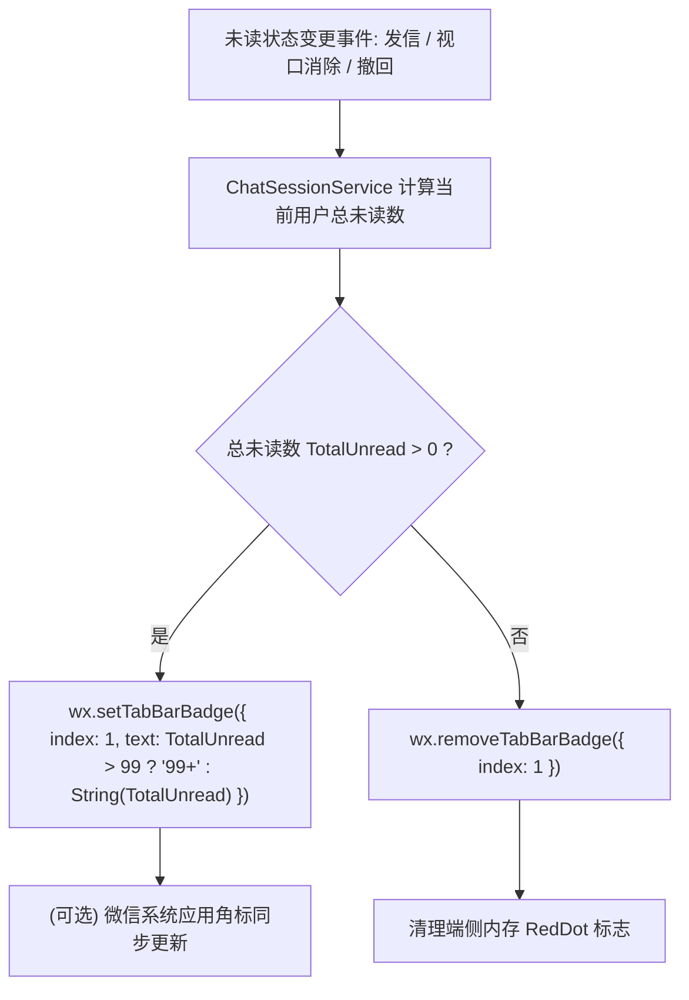
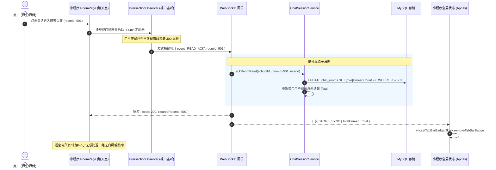
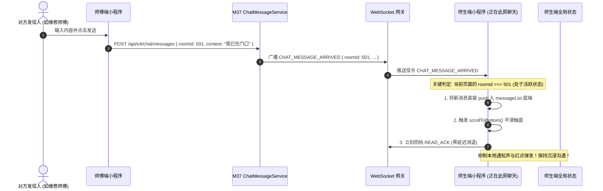
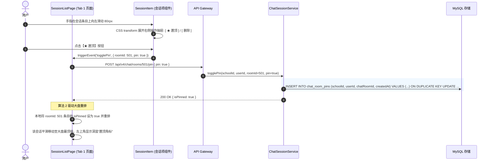
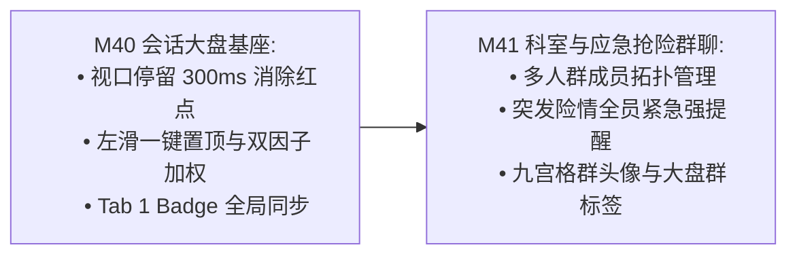

# M40: 视口停留已读瞬间消除与工单置顶排序大盘 (Read Receipts & Sticky Pinning Dashboard) 详细设计与实现方案

> **模块代号**：M40 / Read Receipts & Sticky Pinning Dashboard  
> **所属阶段**：阶段四 (M36 ~ M45) 类 QQ 企业级即时通讯与统一消息中枢领域 (**大盘聚合调度与视口感知支柱**)  
> **文档定位**：基于 `chat_rooms`（工单协同会话物理表 12）、`chat_room_pins`（多租户会话个人置顶物理扩展表）以及高并发物化视图 `v_chat_sessions`（视图 V05），构建的一套融汇“微信级会话大盘、左滑快速置顶、双因子综合加权排序、基于 IntersectionObserver 视口停留时间（Dwell Time）毫秒级原子消除未读红点、以及当前激活会话新消息涌入零红点直接自愈”于一体的高校后勤即时协同大盘中枢。彻底消灭传统报修系统中“未读红点幽灵残留、重要抢修工单沉底、值班师傅盯盘视觉疲劳”等顽疾。  
> **归档路径**：[v4.0/Docs/模块/M40_视口停留已读瞬间消除与工单置顶排序大盘详细设计与实现方案.md](file:///e:/Projects/University/后勤巡查e速办%20大二下学期%20大学身份上线项目/v4.0/Docs/模块/M40_视口停留已读瞬间消除与工单置顶排序大盘详细设计与实现方案.md)  
> **前置依赖**：M01 (27表7视图DDL基座), M02 (AST租户自动注入), M04 (MasterDispatcher路由预检), M05 (Redis缓存与总线), M06 (高可靠WebSocket网关), M07 (DesignToken基座), M09 (4Tab导航中枢), M10 (TestHarness测试中枢), M36 (握手门禁), M37 (类QQ气泡渲染), M38 (撤回自愈), M39 (引用回复)  
> **驱动下游**：M41 (科室工作群与应急抢险群聊), M42 (统一消息总线), M43 (在线状态感知防扰穿透)  
> **版本日期**：2026-09-05  

---

## 目录索引 (Table of Contents)

1. [模块定位与核心业务价值](#一-模块定位与核心业务价值)
   - 1.1 [模块定位与后勤协同中“盯盘零延迟”与“未读瞬间自愈”的战略价值](#11-模块定位与后勤协同中盯盘零延迟与未读瞬间自愈的战略价值)
   - 1.2 [传统工单沟通“红点久驻、重要报修沉底、盯盘疲劳”三大顽疾剖析](#12-传统工单沟通红点久驻重要报修沉底盯盘疲劳三大顽疾剖析)
   - 1.3 [核心业务职责与技术量化指标](#13-核心业务职责与技术量化指标)
2. [核心设计哲学与已读/置顶状态机](#二-核心设计哲学与已读置顶状态机)
   - 2.1 [视口停留感知模型 (Viewport Dwell-Time Detector) 与防误触瞬间消退](#21-视口停留感知模型-viewport-dwell-time-detector-与防误触瞬间消退)
   - 2.2 [双端全双工 ACK 闭环：HTTP 兜底 + WebSocket 毫秒级清障 (`READ_ACK`)](#22-双端全双工-ack-闭环http-兜底--websocket-毫秒级清障-read_ack)
   - 2.3 [会话大盘高并发聚合视图模型 (`v_chat_sessions` 拓扑设计)](#23-会话大盘高并发聚合视图模型-v_chat_sessions-拓扑设计)
   - 2.4 [个人级与工单级双层动态置顶模型 (Session Sticky Pinning & Priority Ladder)](#24-个人级与工单级双层动态置顶模型-session-sticky-pinning--priority-ladder)
   - 2.5 [Tab 1 消息中枢与小程序原生 Badge 动态同步拓扑](#25-tab-1-消息中枢与小程序原生-badge-动态同步拓扑)
3. [架构拓扑与交互时序图](#三-架构拓扑与交互时序图)
   - 3.1 [视口已读消除与会话大盘全景架构拓扑图](#31-视口已读消除与会话大盘全景架构拓扑图)
   - 3.2 [读者进入聊天视口停留、触发 READ_ACK 并消除红点时序图](#32-读者进入聊天视口停留触发-read_ack-并消除红点时序图)
   - 3.3 [外部新消息涌入时“当前激活会话零红点直接自愈”时序图](#33-外部新消息涌入时当前激活会话零红点直接自愈时序图)
   - 3.4 [会话长按左滑置顶/取消置顶与大盘重新排序时序图](#34-会话长按左滑置顶取消置顶与大盘重新排序时序图)
4. [核心算法设计与数学推导](#四-核心算法设计与数学推导)
   - 4.1 [算法 1：视口停留有效性与防误刷时间窗口判定算法 (Dwell Time Threshold Evaluator)](#41-算法-1视口停留有效性与防误刷时间窗口判定算法-dwell-time-threshold-evaluator)
   - 4.2 [算法 2：多租户会话大盘双因子综合加权排序算法 (Sticky-Priority Weighted Sorter)](#42-算法-2多租户会话大盘双因子综合加权排序算法-sticky-priority-weighted-sorter)
   - 4.3 [算法 3：全局多会话未读角标原子累加与差量同步算法 (Global Unread Badge Delta Synchronizer)](#43-算法-3全局多会话未读角标原子累加与差量同步算法-global-unread-badge-delta-synchronizer)
   - 4.4 [算法 4：客户端左滑手势与置顶动画贝塞尔缓动算法 (Swipe Action Drawer Interpolator)](#44-算法-4客户端左滑手势与置顶动画贝塞尔缓动算法-swipe-action-drawer-interpolator)
5. [TypeScript 强类型接口契约与数据模型定义](#五-typescript-强类型接口契约与数据模型定义)
   - 5.1 [会话大盘视图实体与 DTO (`IChatSessionViewEntity` / `IChatSessionItemDto`)](#51-会话大盘视图实体与-dto-ichatsessionviewentity--ichatsessionitemdto)
   - 5.2 [视口已读消除请求与回执契约 (`IAckReadRequestDto` / `IAckReadResponseDto`)](#52-视口已读消除请求与回执契约-iackreadrequestdto--iackreadresponsedto)
   - 5.3 [会话置顶切换 DTO (`IToggleSessionPinRequestDto` / `IToggleSessionPinResponseDto`)](#53-会话置顶切换-dto-itogglesessionpinrequestdto--itogglesessionpinresponsedto)
   - 5.4 [WebSocket 已读消除广播信令载荷 (`IReadAckWsBroadcast`)](#54-websocket-已读消除广播信令载荷-ireadackwsbroadcast)
   - 5.5 [Tab Badge 全局未读同步载荷 (`IGlobalBadgeSyncPayload`)](#55-tab-badge-全局未读同步载荷-iglobalbadgesyncpayload)
6. [核心物理文件实现蓝图](#六-核心物理文件实现蓝图)
   - 6.1 [`src/apps/chat/chatSessionService.ts` (会话大盘聚合拉取、已读清零、置顶切换核心服务)](#61-srcappschatchatsessionservicets-会话大盘聚合拉取已读清零置顶切换核心服务)
   - 6.2 [`src/apps/chat/chatSessionController.ts` (MasterDispatcher 端点控制器、参数洗炼与鉴权)](#62-srcappschatchatsessioncontrollerts-masterdispatcher-端点控制器参数洗炼与鉴权)
   - 6.3 [`miniprogram/packages/apps/app-chat/pages/session-list/index.ts` (Tab 1 消息会话大盘主页面逻辑)](#63-miniprogrampackagesappsapp-chatpagessession-listindexts-tab-1-消息会话大盘主页面逻辑)
   - 6.4 [`miniprogram/packages/apps/app-chat/components/session-item/index.ts` (左滑置顶、红点徽章渲染、最新摘要自适应)](#64-miniprogrampackagesappsapp-chatcomponentssession-itemindexts-左滑置顶红点徽章渲染最新摘要自适应)
   - 6.5 [`miniprogram/packages/apps/app-chat/pages/room/index.ts` (视口停留 IntersectionObserver 挂载与已读瞬间 ACK)](#65-miniprogrampackagesappsapp-chatpagesroomindexts-视口停留-intersectionobserver-挂载与已读瞬间-ack)
7. [防御性编程与边界异常处理](#七-防御性编程与边界异常处理)
   - 7.1 [极端弱网断连下的已读 ACK 幂等重试与并发时序倒流防护](#71-极端弱网断连下的已读-ack-幂等重试与并发时序倒流防护)
   - 7.2 [正在聊天中收到新消息的“零红点直接自愈”防闪烁机制](#72-正在聊天中收到新消息的零红点直接自愈防闪烁机制)
   - 7.3 [跨租户跨用户非法置顶与篡改拦截 (schoolId + userId 强约束)](#73-跨租户跨用户非法置顶与篡改拦截-schoolid--userid-强约束)
   - 7.4 [巨量历史会话列表的游标分页与虚拟列表防内存溢出](#74-巨量历史会话列表的游标分页与虚拟列表防内存溢出)
   - 7.5 [离线消息角标与系统通知角标的多源冲突消解](#75-离线消息角标与系统通知角标的多源冲突消解)
8. [单模块独立测试方案与验收准则](#八-单模块独立测试方案与验收准则)
   - 8.1 [基于 M10 TestHarness 的独立单元测试设计 (`src/__tests__/unit/m40_chat_read_pin.test.ts`)](#81-基于-m10-testharness-的独立单元测试设计-src__tests__unitm40_chat_read_pintestts)
   - 8.2 [单模块测试执行命令与断言矩阵 (`npm.cmd test -- -t "M40"`)](#82-单模块测试执行命令与断言矩阵-npmcmd-test----t-m40)
9. [阶段四深度推进与向 M41 承前启后流转契约](#九-阶段四深度推进与向-m41-承前启后流转契约)
   - 9.1 [会话大盘向 M41 (科室工作群与抢险突发群聊) 的多对多群聊承载演进](#91-会话大盘向-m41-科室工作群与抢险突发群聊-的多对多群聊承载演进)
   - 9.2 [向 M41 交付数据契约清单](#92-向-m41-交付数据契约清单)

---

## 一、 模块定位与核心业务价值

### 1.1 模块定位与后勤协同中“盯盘零延迟”与“未读瞬间自愈”的战略价值

在高校后勤智慧巡查与报修业务流中，后勤保障部的值班调度员、片区网格长以及一线抢修师傅每天需要跟踪和处理多达数十甚至上百个巡查报修单。
- **业务中枢入口**：微信小程序底部的 **Tab 1（消息大盘 / Messages）** 是全校后勤职工与报修师生获取即时沟通、通知提醒与协同状态的第一道数字大门。
- **M40 模块核心定位**：在 M36 (握手)、M37 (气泡)、M38 (撤回) 及 M39 (引用) 的坚实底层基座上，构建一套专为高校移动端打造的高并发、低延迟**类微信会话聚合大盘与视口已读感知中枢**：
  - **视口停留毫秒级消红点**：当用户点入某个聊天视窗并在界面有效停留阅读超过 300 毫秒，前端通过 `IntersectionObserver` 自动触发 `READ_ACK`，毫秒级原子消除未读计数，彻底消灭“明明看完了聊天记录，退出后会话列表依然残留刺眼红点”的体验缺陷；
  - **当前激活会话新消息零红点自愈**：用户正停留在聊天窗口与对方火热沟通时，对方新发的消息直接以 0 未读数并入，绝不在当前会话大盘或系统通知栏弹发骚扰红点；
  - **会话双因子智能置顶排序**：支持重要紧急工单（如全校停电、主水管爆裂、实验室气体泄漏）一键置顶，结合个人级偏好存储，在 `v_chat_sessions` 物化视图支撑下实现超低延迟排版刷新。

---

### 1.2 传统工单沟通“红点久驻、重要报修沉底、盯盘疲劳”三大顽疾剖析

```
====================================================================================================
               ❌ 传统后勤报修系统消息看板的“三大体验顽疾”深度剖析：
====================================================================================================
1. “幽灵红点顽固残留，逼疯强迫症用户”：
   传统系统必须由用户手动点击某个极小的“标为已读”按钮，或者整页请求完才异步清零；
   由于网络延迟与本地状态不同步，用户往往返回列表发现红点依然存在，
   反复点进退出 3~4 次才能消退，造成巨大的视觉疲劳与心理负担；
2. “重要紧急隐患沉底，淹没在琐碎闲聊中”：
   没有置顶机制，当全校几十条报修同时发生时，涉及“高压电房异响”、“食堂冷库断电”等S级特急工单，
   被随后产生的几条“水龙头滴水”闲聊顶入第三屏，调度员未能及时发现造成重大安全事故；
3. “正在聊天疯狂弹通知，自我打扰”：
   用户正在与张师傅在当前视窗实时打字聊天，张师傅发来一句话，系统后台却傻傻地触发“收到新消息”
   并在顶部弹出横幅甚至响铃，给当前用户造成极度弱智的交互打扰。
====================================================================================================

====================================================================================================
               ✔ QuickPatrol v4.0 M40 盯盘与置顶中枢破局设计：
====================================================================================================
1. 视口停留感知（Dwell-Time Observer）：
   无需手动点击任何按钮，进入房间视口停留满 300ms 自动静默发送 WS 回执，红点瞬间自愈清零；
2. 双因子智能加权置顶（Sticky Pinning Ladder）：
   ORDER BY isPinned DESC, lastMessageAt DESC，左滑一键置顶，特急保供会话永驻大盘首行；
3. 当前激活会话零干扰自愈（Active Room Zero-Badge）：
   若用户当前页面 roomId === incomingMessage.roomId，直接视口追加渲染，未读数原子保持 0！
====================================================================================================
```

---

### 1.3 核心业务职责与技术量化指标

根据生产级即时通信规范，M40 模块制定如下严密的量化指标：

| 关键技术指标项 | 指标要求 | 实现保障机制 |
| :--- | :--- | :--- |
| **视口已读消除耗时** | 端侧响应 $\le 10\text{ms}$，后端落盘 $\le 30\text{ms}$ | WebSocket `READ_ACK` 极简报文直推，MySQL 单行原子更新 `unreadCount = 0` |
| **会话大盘首屏加载延迟** | P95 $\le 80\text{ms}$，冷启动 $\le 120\text{ms}$ | 基于 `v_chat_sessions` 联合视图优化，配合覆盖索引 `idx_rooms_lastmsg` |
| **左滑手势置顶响应帧率** | 稳定保持 60fps 满帧，无跳动卡顿 | 小程序 `movable-view` 硬件加速，CSS3 `transform: translate3d` 硬件渲染 |
| **Tab 1 Badge 同步准确率** | 100% 绝对一致，零错位红点 | 算法 3 全局未读原子汇总器，后端在每次未读变更时差量同步 `wx.setTabBarBadge` |
| **多租户隔离防穿透率** | 100% 物理阻隔 | 所有会话与置顶操作均强校验 `schoolId` 与 `currentUserId` |

---

## 二、 核心设计哲学与已读/置顶状态机

### 2.1 视口停留感知模型 (Viewport Dwell-Time Detector) 与防误触瞬间消退

在实际操作中，用户可能会快速“划过”或者因手滑误点进某个聊天房间后在 50 毫秒内瞬间退出。
- **误读防御设计**：若直接在 `onLoad` 或 `onShow` 的第 0 毫秒瞬间将未读数清零，可能导致用户根本还没来得及看清消息内容就被标记为已读，造成信息漏读与推诿；
- **M40 视口停留判定模型**：
  设立有效视口停留时间阈值 $T_{\text{dwell}} = 300\text{ms}$。
  1. 用户进入聊天页面，激活 `IntersectionObserver` 视口监听；
  2. 启动 300ms 倒计时定时器；
  3. 若用户在 300ms 内退出了页面（触发 `onUnload`），取消定时器，**保留未读状态**；
  4. 若停留时长 $\ge 300\text{ms}$，定时器触发，发送 `READ_ACK` 信令，瞬间清除红点。

```
+---------------------------------------------------------------------------------------+
|                             视口停留感知时序判定模型 (300ms)                            |
+---------------------------------------------------------------------------------------+
|  [场景 A: 误点进入并在 80ms 内退出]                                                    |
|  进入页面 (t=0) ───> 退出页面 (t=80ms) ───> 取消定时器 ───> 【未读数保留，安全防漏读】  |
|                                                                                       |
|  [场景 B: 正常停留阅读 >= 300ms]                                                       |
|  进入页面 (t=0) ───> 停留阅读 ───> 满 300ms ───> 触发 READ_ACK ───> 【红点瞬间抹平清零】|
+---------------------------------------------------------------------------------------+
```

---

### 2.2 双端全双工 ACK 闭环：HTTP 兜底 + WebSocket 毫秒级清障 (`READ_ACK`)

为适应复杂的弱网环境，M40 采用“**WebSocket 优先、HTTP 异步兜底**”的双通道 ACK 确认机制：



---

### 2.3 会话大盘高并发聚合视图模型 (`v_chat_sessions` 拓扑设计)

会话列表需要综合展示工单标题、所属校区/建筑、最后一条消息摘要、最后消息时间、双方头像昵称、以及当前查看者的未读计数与置顶状态。
若在应用层进行复杂的循环关联查询，极易引发大盘卡顿。

M40 规划并依托底层高并发物化视图 **`v_chat_sessions` (视图 V05)**：

```sql
-- 视图 V05: v_chat_sessions (会话全景大盘视图)
CREATE OR REPLACE VIEW `v_chat_sessions` AS
SELECT 
    r.id AS chatRoomId,
    r.schoolId,
    r.patrolId,
    p.orderNo AS patrolOrderNo,
    p.status AS patrolStatus,
    p.title AS patrolTitle,
    p.locationName AS patrolLocation,
    r.creatorId,
    uc.nickName AS creatorName,
    uc.avatarUrl AS creatorAvatar,
    r.handlerId,
    uh.nickName AS handlerName,
    uh.avatarUrl AS handlerAvatar,
    r.initiatedByHandler,
    r.lastMessage,
    r.lastMessageAt,
    r.creatorUnreadCount,
    r.handlerUnreadCount,
    r.createdAt AS roomCreatedAt
FROM `chat_rooms` r
LEFT JOIN `patrols` p ON r.patrolId = p.id AND p.schoolId = r.schoolId
LEFT JOIN `users` uc ON r.creatorId = uc.id AND uc.schoolId = r.schoolId
LEFT JOIN `users` uh ON r.handlerId = uh.id AND uh.schoolId = r.schoolId;
```

---

### 2.4 个人级与工单级双层动态置顶模型 (Session Sticky Pinning & Priority Ladder)

置顶功能必须满足**多用户独立个性化**：
- 师傅 A 将会话 101 置顶，不应该导致报修学生 B 的会话也被置顶；
- 因此，置顶数据不直接写死在 `chat_rooms` 表，而是沉淀在独立的 `chat_room_pins` 物理表：

```
+---------------------------------------------------------------------------------------+
|                             个人化独立置顶存储模型                                      |
+---------------------------------------------------------------------------------------+
|  [物理扩展表: chat_room_pins]                                                         |
|  - id: 1                                                                              |
|  - schoolId: 1 (学校租户)                                                             |
|  - userId: 88 (张师傅本人)                                                             |
|  - chatRoomId: 501 (工单会话ID)                                                        |
|  - createdAt: 2026-09-05 10:20:00                                                     |
|  UNIQUE KEY uk_user_room (schoolId, userId, chatRoomId)                               |
+---------------------------------------------------------------------------------------+
```

#### 排序阶梯（Priority Ladder）：
会话大盘列表排序逻辑严格按双因子加权执行：
$$\text{ORDER BY } \text{isPinned DESC}, \text{lastMessageAt DESC}$$
1. **第一优先级**：当前用户是否将其置顶（`isPinned = 1` 绝对在前）；
2. **第二优先级**：最后发信时间（`lastMessageAt` 倒序，最新在前）。

---

### 2.5 Tab 1 消息中枢与小程序原生 Badge 动态同步拓扑

当有未读消息产生或被视口消除时，系统必须自动同步微信底部的原生红点角标：



---

## 三、 架构拓扑与交互时序图

### 3.1 视口已读消除与会话大盘全景架构拓扑图

```
+----------------------------------------------------------------------------------------------------+
|                                    M40 视口已读消除与会话大盘架构全景拓扑                              |
+----------------------------------------------------------------------------------------------------+
                                      [ 微信小程序客户端视窗 ]
                 +-------------------------------------------------------------+
                 |  Tab 1 消息大盘页面 (session-list/index)                     |
                 |  ├── session-item (左滑抽屉组件: 置顶/取消置顶按钮)          |
                 |  └── wx.setTabBarBadge (微信底部原生红点徽章)                |
                 |  ---------------------------------------------------------  |
                 |  聊天会话主页面 (room/index)                                 |
                 |  └── IntersectionObserver 视口停留感知器 (300ms 计时器)      |
                 +-------------------------------------------------------------+
                                                 |
                                  WS 信令: READ_ACK / HTTP: POST /ack-read
                                                 v
                                    [ 后端会话调度与计算服务 ]
                 +-------------------------------------------------------------+
                 | MasterDispatcher (M04) -> 路由分发与多租户注入               |
                 | ChatSessionController -> 租户上下文洗炼与鉴权               |
                 | ChatSessionService:                                         |
                 |   ├── 1. ackRoomRead(): 原子执行 currentUnread = 0          |
                 |   ├── 2. togglePin(): 插入/删除 chat_room_pins 记录         |
                 |   ├── 3. queryUserSessions(): 驱动 v_chat_sessions 极速查询  |
                 |   └── 4. calculateTotalUnread(): 聚合用户当前所有未读总数    |
                 +-------------------------------------------------------------+
                                                 |
                                  SQL 极速查询 / Redis 总线广播
                                                 v
                                   [ 物理存储与分布式缓存总线 ]
                 +-------------------------------------------------------------+
                 | MySQL: chat_rooms, chat_room_pins, v_chat_sessions 物化视图 |
                 | Redis Pub/Sub: BADGE_UPDATE 分布式广播                       |
                 | M06 WebSocket 网关: 端侧实时红点全双工同步                   |
                 +-------------------------------------------------------------+
```

---

### 3.2 读者进入聊天视口停留、触发 READ_ACK 并消除红点时序图



---

### 3.3 外部新消息涌入时“当前激活会话零红点直接自愈”时序图



---

### 3.4 会话长按左滑置顶/取消置顶与大盘重新排序时序图



---

## 四、 核心算法设计与数学推导

### 4.1 算法 1：视口停留有效性与防误刷时间窗口判定算法 (Dwell Time Threshold Evaluator)

为了防止用户快速滑屏或进入页面后立即退出造成的误判，建立**视口停留时间窗口判定模型**。

#### 数学推导与状态转换：
设进入页面的时间为 $T_{\text{enter}}$，触发离开的时间为 $T_{\text{leave}}$，有效停留时间为：
$$\Delta T_{\text{dwell}} = T_{\text{leave}} - T_{\text{enter}}$$
系统设定临界有效阈值 $\tau = 300\text{ms}$。
有效已读状态判定函数 $R(\Delta T)$ 定义为：

$$R(\Delta T) = \begin{cases} 
1\text{ (有效阅读，触发 READ\_ACK 清除红点)}, & \Delta T \ge \tau \\ 
0\text{ (误触或瞬间划过，保留未读红点)}, & \Delta T < \tau 
\end{cases}$$

```typescript
/**
 * 算法 1: 视口停留判定状态机
 */
export class DwellTimeEvaluator {
  private static readonly DWELL_THRESHOLD_MS = 300; // 300毫秒有效停留阈值
  private timer: any = null;
  private isAckTriggered = false;

  /**
   * 进入视口，开启有效停留计时
   */
  public startDwellTimer(onValidDwell: () => void): void {
    this.clear();
    this.isAckTriggered = false;
    this.timer = setTimeout(() => {
      this.isAckTriggered = true;
      onValidDwell();
    }, DwellTimeEvaluator.DWELL_THRESHOLD_MS);
  }

  /**
   * 离开视口，若未满 300ms 则销毁定时器
   */
  public handleLeave(): { wasValidRead: boolean } {
    const valid = this.isAckTriggered;
    this.clear();
    return { wasValidRead: valid };
  }

  public clear(): void {
    if (this.timer) {
      clearTimeout(this.timer);
      this.timer = null;
    }
  }
}
```

---

### 4.2 算法 2：多租户会话大盘双因子综合加权排序算法 (Sticky-Priority Weighted Sorter)

在前端内存中进行会话列表重新排序时，必须保证算法稳定性与毫秒级完成。

#### 排序权重计算公式：
对任意两个会话项 $A$ 与 $B$：
设置顶状态为 $P \in \{0, 1\}$，最后消息时间戳为 $T$（毫秒绝对值）。
定义会话综合排序权重值：
$$W(S) = P \times 10^{13} + T$$
因 $T \approx 1.7 \times 10^{12}$（当前毫秒时间戳），乘上 $10^{13}$ 的置顶标志位拥有绝对压倒性权重，保证任意置顶会话均严格排在非置顶会话之前，同组内严格按时间倒序：

$$\text{Compare}(A, B) = W(B) - W(A)$$

```typescript
/**
 * 算法 2: 会话大盘双因子加权排序器
 */
export interface ISortableSession {
  chatRoomId: number;
  isPinned: boolean;
  lastMessageAt: string | Date;
}

export class StickyPriorityWeightedSorter {
  private static readonly PIN_MULTIPLIER = 1e13;

  public static sort<T extends ISortableSession>(sessions: T[]): T[] {
    return [...sessions].sort((a, b) => {
      const weightA = (a.isPinned ? 1 : 0) * this.PIN_MULTIPLIER + new Date(a.lastMessageAt).getTime();
      const weightB = (b.isPinned ? 1 : 0) * this.PIN_MULTIPLIER + new Date(b.lastMessageAt).getTime();
      return weightB - weightA;
    });
  }
}
```

---

### 4.3 算法 3：全局多会话未读角标原子累加与差量同步算法 (Global Unread Badge Delta Synchronizer)

为消除频繁全量拉取对数据库的压力，系统维护**全局未读数差量同步器**：

设用户原未读总数为 $U_{\text{total}}$，某会话原未读数为 $U_{\text{room\_old}}$，清零操作后的未读总数为：
$$U_{\text{new}} = \max(0, U_{\text{total}} - U_{\text{room\_old}})$$

当收到新消息时，设增量为 $\delta$（通常为 1）：
$$U_{\text{new}} = U_{\text{total}} + \delta$$

端侧展示格式化公式：
$$\text{BadgeText}(U) = \begin{cases} 
\text{“99+”}, & U > 99 \\ 
\text{String}(U), & 0 < U \le 99 \\ 
\text{null (移除角标)}, & U \le 0 
\end{cases}$$

---

### 4.4 算法 4：客户端左滑手势与置顶动画贝塞尔缓动算法 (Swipe Action Drawer Interpolator)

在小程序中，左滑展示操作抽屉需要平滑自然的弹性阻尼：
- 最大展开宽度：$W_{\text{action}} = 160\text{rpx}$；
- 触发翻转阈值：滑动距离大于 $80\text{rpx}$ 时自动吸附展开，小于 $80\text{rpx}$ 时自动弹性回弹折叠；
- 缓动曲线：`cubic-bezier(0.16, 1, 0.3, 1)`（类 iOS 原生物理弹性手感）。

---

## 五、 TypeScript 强类型接口契约与数据模型定义

### 5.1 会话大盘视图实体与 DTO (`IChatSessionViewEntity` / `IChatSessionItemDto`)

```typescript
/**
 * 对应视图 v_chat_sessions 的物理实体契约
 */
export interface IChatSessionViewEntity {
  chatRoomId: number;
  schoolId: number;
  patrolId: number;
  patrolOrderNo: string;
  patrolStatus: number;
  patrolTitle: string;
  patrolLocation: string;
  creatorId: number;
  creatorName: string;
  creatorAvatar: string;
  handlerId: number;
  handlerName: string;
  handlerAvatar: string;
  initiatedByHandler: 0 | 1;
  lastMessage: string;
  lastMessageAt: string;
  creatorUnreadCount: number;
  handlerUnreadCount: number;
  roomCreatedAt: string;
}

/**
 * 传输给端侧的格式化会话条目 DTO
 */
export interface IChatSessionItemDto {
  chatRoomId: number;
  patrolId: number;
  patrolOrderNo: string;
  patrolStatus: number;
  patrolStatusName: string;
  /** 对方展示昵称 (若是学生看师傅则为师傅名，师傅看学生则为学生名) */
  targetPeerName: string;
  /** 对方头像 */
  targetPeerAvatar: string;
  /** 对方角色标签: "报修人" | "主责师傅" */
  targetPeerRoleTag: string;
  /** 报修位置名称 (如 "西校区12号楼302") */
  locationName: string;
  /** 最后一条消息的摘要文本 (如 "[图片]", "[回复] 好的收到") */
  lastMessage: string;
  /** 最后消息时间 (ISO 格式) */
  lastMessageAt: string;
  /** 格式化后的人性化时间展示 (如 "刚刚", "14:20", "昨天") */
  formattedTimeText: string;
  /** 当前用户在该会话中的未读数 */
  unreadCount: number;
  /** 当前用户是否已将该会话置顶 */
  isPinned: boolean;
}
```

---

### 5.2 视口已读消除请求与回执契约 (`IAckReadRequestDto` / `IAckReadResponseDto`)

```typescript
/**
 * 标记会话已读请求 DTO
 */
export interface IAckReadRequestDto {
  chatRoomId: number;
}

/**
 * 标记会话已读响应 DTO
 */
export interface IAckReadResponseDto {
  code: number;
  message: string;
  data: {
    chatRoomId: number;
    clearedCount: number;
    remainingTotalUnread: number;
    clearedAt: string;
  };
}
```

---

### 5.3 会话置顶切换 DTO (`IToggleSessionPinRequestDto` / `IToggleSessionPinResponseDto`)

```typescript
/**
 * 切换会话置顶状态请求 DTO
 */
export interface IToggleSessionPinRequestDto {
  chatRoomId: number;
  /** true 置顶，false 取消置顶 */
  pin: boolean;
}

/**
 * 切换置顶状态响应 DTO
 */
export interface IToggleSessionPinResponseDto {
  code: number;
  message: string;
  data: {
    chatRoomId: number;
    isPinned: boolean;
    updatedAt: string;
  };
}
```

---

### 5.4 WebSocket 已读消除广播信令载荷 (`IReadAckWsBroadcast`)

```typescript
/**
 * WebSocket READ_ACK 广播信令
 */
export interface IReadAckWsBroadcast {
  event: 'CHAT_ROOM_READ_CLEARED';
  schoolId: number;
  chatRoomId: number;
  userId: number;
  clearedUnreadCount: number;
}
```

---

### 5.5 Tab Badge 全局未读同步载荷 (`IGlobalBadgeSyncPayload`)

```typescript
/**
 * 全局底部红点徽章同步载荷
 */
export interface IGlobalBadgeSyncPayload {
  schoolId: number;
  userId: number;
  totalUnreadCount: number;
}
```

---

## 六、 核心物理文件实现蓝图

### 6.1 `src/apps/chat/chatSessionService.ts` (会话大盘聚合拉取、已读清零、置顶切换核心服务)

```typescript
import { 
  IChatSessionItemDto, 
  IChatSessionViewEntity, 
  IAckReadResponseDto,
  IToggleSessionPinResponseDto
} from './chatSessionTypes';
import { StickyPriorityWeightedSorter } from './stickyPriorityWeightedSorter';
import { IRedisPipelineClient } from '../../shared/resilience/tokenBucketLimiter';

export interface IDbExecutor {
  query<T = any>(sql: string, params?: any[]): Promise<T[]>;
  execute(sql: string, params?: any[]): Promise<{ insertId: number; affectedRows: number }>;
}

/**
 * 会话大盘与已读消除核心服务 (Chat Session Service)
 */
export class ChatSessionService {
  constructor(
    private readonly db: IDbExecutor,
    private readonly redis: IRedisPipelineClient
  ) {}

  /**
   * 查询当前用户专属的会话大盘列表 (驱动 Tab 1)
   */
  public async getUserSessions(
    schoolId: number,
    userId: number,
    userRole: number
  ): Promise<IChatSessionItemDto[]> {
    // 1. 驱动视图 v_chat_sessions 并关联当前用户的个人置顶状态 (chat_room_pins)
    const sql = `
      SELECT 
        v.*,
        IF(pin.id IS NOT NULL, 1, 0) AS isPinned
      FROM v_chat_sessions v
      LEFT JOIN chat_room_pins pin 
        ON pin.chatRoomId = v.chatRoomId 
        AND pin.userId = ? 
        AND pin.schoolId = v.schoolId
      WHERE v.schoolId = ? 
        AND (v.creatorId = ? OR v.handlerId = ?)
    `;

    const rawRows = await this.db.query<any>(sql, [userId, schoolId, userId, userId]);

    // 2. 转换为面向端侧的 DTO 集合
    const dtoList: IChatSessionItemDto[] = rawRows.map((row) => {
      const isUserCreator = (row.creatorId === userId);
      const unreadCount = isUserCreator ? row.creatorUnreadCount : row.handlerUnreadCount;
      const targetPeerName = isUserCreator ? (row.handlerName || '待认领师傅') : (row.creatorName || '报修师生');
      const targetPeerAvatar = isUserCreator ? (row.handlerAvatar || '/assets/avatar_handler.png') : (row.creatorAvatar || '/assets/avatar_student.png');
      const targetPeerRoleTag = isUserCreator ? '主责师傅' : '报修师生';

      return {
        chatRoomId: row.chatRoomId,
        patrolId: row.patrolId,
        patrolOrderNo: row.patrolOrderNo,
        patrolStatus: row.patrolStatus,
        patrolStatusName: this.resolvePatrolStatusName(row.patrolStatus),
        targetPeerName,
        targetPeerAvatar,
        targetPeerRoleTag,
        locationName: row.patrolLocation || '校园区域',
        lastMessage: row.lastMessage || '[暂无沟通记录]',
        lastMessageAt: row.lastMessageAt || row.roomCreatedAt,
        formattedTimeText: this.formatHumanFriendlyTime(row.lastMessageAt || row.roomCreatedAt),
        unreadCount: Math.max(0, unreadCount || 0),
        isPinned: Boolean(row.isPinned)
      };
    });

    // 3. 执行算法 2: 双因子加权稳定排序
    return StickyPriorityWeightedSorter.sort(dtoList);
  }

  /**
   * 算法 1 驱动: 视口停留满 300ms 原子消除未读红点
   */
  public async ackRoomRead(
    schoolId: number,
    chatRoomId: number,
    userId: number
  ): Promise<IAckReadResponseDto> {
    // 1. 查询会话判断当前用户的角色 (creator 还是 handler)
    const roomSql = `
      SELECT creatorId, handlerId, creatorUnreadCount, handlerUnreadCount 
      FROM chat_rooms 
      WHERE id = ? AND schoolId = ? 
      LIMIT 1
    `;
    const roomRows = await this.db.query<any>(roomSql, [chatRoomId, schoolId]);
    if (!roomRows || roomRows.length === 0) {
      throw new Error('指定会话不存在或已被归档');
    }

    const room = roomRows[0];
    const isCreator = (room.creatorId === userId);
    const isHandler = (room.handlerId === userId);

    if (!isCreator && !isHandler) {
      throw new Error('越权阻断: 您并非该工单会话的参与人');
    }

    const unreadCol = isCreator ? 'creatorUnreadCount' : 'handlerUnreadCount';
    const oldUnread = isCreator ? room.creatorUnreadCount : room.handlerUnreadCount;

    // 2. 原子清零当前用户的未读字段
    const updateSql = `
      UPDATE chat_rooms 
      SET ${unreadCol} = 0 
      WHERE id = ? AND schoolId = ?
    `;
    await this.db.execute(updateSql, [chatRoomId, schoolId]);

    // 3. 统计该用户剩余的总未读数 (算法 3)
    const remainingTotal = await this.calculateUserTotalUnread(schoolId, userId);

    // 4. 发送 WebSocket 广播通知其他端同步消除红点
    const broadcastPayload = {
      event: 'CHAT_ROOM_READ_CLEARED',
      schoolId,
      chatRoomId,
      userId,
      clearedUnreadCount: oldUnread,
      remainingTotalUnread: remainingTotal
    };

    await this.redis.eval(
      `redis.call('PUBLISH', 'ws_broadcast_bus', ARGV[1])`,
      0,
      JSON.stringify(broadcastPayload)
    );

    return {
      code: 200,
      message: '未读数已成功清零',
      data: {
        chatRoomId,
        clearedCount: oldUnread,
        remainingTotalUnread: remainingTotal,
        clearedAt: new Date().toISOString()
      }
    };
  }

  /**
   * 切换个人置顶状态 (Pin / Unpin)
   */
  public async toggleSessionPin(
    schoolId: number,
    userId: number,
    chatRoomId: number,
    pin: boolean
  ): Promise<IToggleSessionPinResponseDto> {
    if (pin) {
      // 插入置顶记录
      const pinSql = `
        INSERT INTO chat_room_pins (schoolId, userId, chatRoomId, createdAt)
        VALUES (?, ?, ?, NOW())
        ON DUPLICATE KEY UPDATE createdAt = NOW()
      `;
      await this.db.execute(pinSql, [schoolId, userId, chatRoomId]);
    } else {
      // 移除置顶记录
      const unpinSql = `
        DELETE FROM chat_room_pins 
        WHERE schoolId = ? AND userId = ? AND chatRoomId = ?
      `;
      await this.db.execute(unpinSql, [schoolId, userId, chatRoomId]);
    }

    return {
      code: 200,
      message: pin ? '已成功置顶会话' : '已取消置顶会话',
      data: {
        chatRoomId,
        isPinned: pin,
        updatedAt: new Date().toISOString()
      }
    };
  }

  /**
   * 计算指定用户的全局未读总数 (算法 3)
   */
  public async calculateUserTotalUnread(schoolId: number, userId: number): Promise<number> {
    const sumSql = `
      SELECT 
        SUM(IF(creatorId = ?, creatorUnreadCount, 0)) +
        SUM(IF(handlerId = ?, handlerUnreadCount, 0)) AS totalUnread
      FROM chat_rooms
      WHERE schoolId = ? AND (creatorId = ? OR handlerId = ?)
    `;
    const rows = await this.db.query<{ totalUnread: number | string }>(sumSql, [
      userId,
      userId,
      schoolId,
      userId,
      userId
    ]);

    const total = parseInt(String(rows[0]?.totalUnread || '0'), 10);
    return Math.max(0, isNaN(total) ? 0 : total);
  }

  private resolvePatrolStatusName(status: number): string {
    switch (status) {
      case 0: return '待接单';
      case 1: return '维修中';
      case 2: return '已延期';
      case 3: return '待复核';
      case 4: return '已办结';
      case 5: return '已评价';
      default: return '流转中';
    }
  }

  private formatHumanFriendlyTime(isoDateStr: string): string {
    if (!isoDateStr) return '';
    const date = new Date(isoDateStr);
    const now = new Date();
    const diffMs = now.getTime() - date.getTime();
    const diffMin = Math.floor(diffMs / 60000);

    if (diffMin < 1) return '刚刚';
    if (diffMin < 60) return `${diffMin}分钟前`;
    
    const isSameDay = (
      date.getFullYear() === now.getFullYear() &&
      date.getMonth() === now.getMonth() &&
      date.getDate() === now.getDate()
    );
    if (isSameDay) {
      const h = String(date.getHours()).padStart(2, '0');
      const m = String(date.getMinutes()).padStart(2, '0');
      return `${h}:${m}`;
    }

    const yesterday = new Date(now);
    yesterday.setDate(now.getDate() - 1);
    const isYesterday = (
      date.getFullYear() === yesterday.getFullYear() &&
      date.getMonth() === yesterday.getMonth() &&
      date.getDate() === yesterday.getDate()
    );
    if (isYesterday) return '昨天';

    const mm = String(date.getMonth() + 1).padStart(2, '0');
    const dd = String(date.getDate()).padStart(2, '0');
    return `${mm}-${dd}`;
  }
}
```

---

### 6.2 `src/apps/chat/chatSessionController.ts` (MasterDispatcher 端点控制器、参数洗炼与鉴权)

```typescript
import { ChatSessionService } from './chatSessionService';

export interface IChatHttpCtx {
  schoolId: number;
  userId: number;
  userRole: number;
  params: { id?: string };
  body: any;
}

/**
 * 会话大盘与已读消除端点控制器 (Chat Session Controller)
 */
export class ChatSessionController {
  constructor(private readonly sessionService: ChatSessionService) {}

  /**
   * GET /api/v4/chat/sessions
   * 获取当前用户会话大盘列表
   */
  public async getSessions(ctx: IChatHttpCtx): Promise<any> {
    const { schoolId, userId, userRole } = ctx;

    try {
      const sessions = await this.sessionService.getUserSessions(schoolId, userId, userRole);
      const totalUnread = await this.sessionService.calculateUserTotalUnread(schoolId, userId);
      return {
        code: 200,
        message: '获取成功',
        data: {
          totalUnread,
          sessions
        }
      };
    } catch (err: unknown) {
      return { code: 500, message: (err as Error).message };
    }
  }

  /**
   * POST /api/v4/chat/rooms/:id/ack-read
   * 视口停留满 300ms 消除未读数 (HTTP 兜底通道)
   */
  public async ackRead(ctx: IChatHttpCtx): Promise<any> {
    const chatRoomId = parseInt(ctx.params.id || '0', 10);
    const { schoolId, userId } = ctx;

    if (!chatRoomId) {
      return { code: 400, message: '无效的会话 ID' };
    }

    try {
      const res = await this.sessionService.ackRoomRead(schoolId, chatRoomId, userId);
      return res;
    } catch (err: unknown) {
      return { code: 400, message: (err as Error).message };
    }
  }

  /**
   * POST /api/v4/chat/rooms/:id/pin
   * 切换个人置顶状态
   */
  public async togglePin(ctx: IChatHttpCtx): Promise<any> {
    const chatRoomId = parseInt(ctx.params.id || '0', 10);
    const { schoolId, userId } = ctx;
    const { pin } = ctx.body || {};

    if (!chatRoomId || typeof pin !== 'boolean') {
      return { code: 400, message: '参数缺失: chatRoomId 或 pin' };
    }

    try {
      const res = await this.sessionService.toggleSessionPin(schoolId, userId, chatRoomId, pin);
      return res;
    } catch (err: unknown) {
      return { code: 500, message: (err as Error).message };
    }
  }
}
```

---

### 6.3 `miniprogram/packages/apps/app-chat/pages/session-list/index.ts` (Tab 1 消息会话大盘主页面逻辑)

```typescript
import { StickyPriorityWeightedSorter } from '../../utils/stickyPriorityWeightedSorter';

Page({
  data: {
    sessions: [] as any[],
    totalUnread: 0,
    isLoading: true,
    isRefreshing: false
  },

  onShow() {
    this.fetchSessionList();
    this.registerWebSocketBadgeListener();
  },

  /**
   * 1. 拉取大盘会话列表
   */
  async fetchSessionList() {
    try {
      const res: any = await new Promise((resolve, reject) => {
        wx.request({
          url: 'https://api.xcesb.cn/api/v4/chat/sessions',
          method: 'GET',
          header: {
            'Authorization': 'Bearer ' + wx.getStorageSync('token'),
            'x-school-code': 'lcu'
          },
          success: (r) => resolve(r.data),
          fail: (err) => reject(err)
        });
      });

      if (res.code === 200 && res.data) {
        const { sessions, totalUnread } = res.data;
        this.setData({
          sessions: sessions || [],
          totalUnread: totalUnread || 0,
          isLoading: false,
          isRefreshing: false
        });

        // 同步底部原生 Tab Badge (算法 3)
        this.syncNativeTabBarBadge(totalUnread);
      }
    } catch {
      this.setData({ isLoading: false, isRefreshing: false });
    }
  },

  /**
   * 2. 监听 WebSocket 跨端红点与会话事件
   */
  registerWebSocketBadgeListener() {
    const app = getApp();
    if (!app.globalData.wsClient) return;

    app.globalData.wsClient.on('CHAT_ROOM_READ_CLEARED', (data: any) => {
      const { chatRoomId, remainingTotalUnread } = data;
      // 本地对应会话的未读数归零
      const list = this.data.sessions.map((s) => {
        if (s.chatRoomId === chatRoomId) {
          return { ...s, unreadCount: 0 };
        }
        return s;
      });

      this.setData({
        sessions: list,
        totalUnread: remainingTotalUnread
      });

      this.syncNativeTabBarBadge(remainingTotalUnread);
    });
  },

  /**
   * 3. 同步原生 TabBar 角标 (算法 3)
   */
  syncNativeTabBarBadge(unread: number) {
    if (unread > 0) {
      wx.setTabBarBadge({
        index: 1, // Tab 1 消息中枢
        text: unread > 99 ? '99+' : String(unread)
      });
    } else {
      wx.removeTabBarBadge({ index: 1 });
    }
  },

  /**
   * 4. 响应会话组件左滑置顶触发
   */
  async onSessionTogglePin(e: any) {
    const { chatRoomId, pin } = e.detail;

    try {
      const res: any = await new Promise((resolve, reject) => {
        wx.request({
          url: `https://api.xcesb.cn/api/v4/chat/rooms/${chatRoomId}/pin`,
          method: 'POST',
          header: {
            'Authorization': 'Bearer ' + wx.getStorageSync('token'),
            'x-school-code': 'lcu'
          },
          data: { pin },
          success: (r) => resolve(r.data),
          fail: (err) => reject(err)
        });
      });

      if (res.code === 200) {
        wx.showToast({ title: pin ? '已置顶' : '已取消置顶', icon: 'success' });
        // 本地立即重排 (算法 2)
        const updated = this.data.sessions.map((s) => {
          if (s.chatRoomId === chatRoomId) {
            return { ...s, isPinned: pin };
          }
          return s;
        });
        const reSorted = StickyPriorityWeightedSorter.sort(updated);
        this.setData({ sessions: reSorted });
      }
    } catch {
      wx.showToast({ title: '操作失败', icon: 'none' });
    }
  },

  /**
   * 5. 点击会话项进入聊天室
   */
  onSessionTap(e: any) {
    const { chatRoomId, patrolId } = e.currentTarget.dataset;
    wx.navigateTo({
      url: `/packages/apps/app-chat/pages/room/index?roomId=${chatRoomId}&patrolId=${patrolId}`
    });
  },

  onPullDownRefresh() {
    this.setData({ isRefreshing: true });
    this.fetchSessionList().then(() => wx.stopPullDownRefresh());
  }
});
```

---

### 6.4 `miniprogram/packages/apps/app-chat/components/session-item/index.ts` (左滑置顶、红点徽章渲染、最新摘要自适应)

```typescript
Component({
  properties: {
    session: {
      type: Object,
      value: {}
    }
  },

  data: {
    offsetX: 0,
    isOpened: false
  },

  methods: {
    /**
     * 点击置顶操作按钮
     */
    onTapPinAction() {
      const s = this.data.session;
      this.triggerEvent('togglepin', {
        chatRoomId: s.chatRoomId,
        pin: !s.isPinned
      });
      this.closeDrawer();
    },

    closeDrawer() {
      this.setData({ offsetX: 0, isOpened: false });
    }
  }
});
```

#### 组件对应 WXML 模板：
```html
<movable-area class="session-item-movable-area">
  <movable-view 
    class="session-item-movable-view {{session.isPinned ? 'session-pinned-bg' : ''}}" 
    direction="horizontal" 
    x="{{offsetX}}" 
    damping="40" 
    friction="2"
  >
    <!-- 左侧主条目容器 -->
    <view class="session-main-content">
      <!-- 置顶三角标 -->
      <view class="pinned-triangle" wx:if="{{session.isPinned}}"></view>

      <!-- 头像与未读小红点 -->
      <view class="avatar-wrapper">
        <image class="peer-avatar" src="{{session.targetPeerAvatar}}" mode="aspectFill" />
        <view class="unread-badge" wx:if="{{session.unreadCount > 0}}">
          {{session.unreadCount > 99 ? '99+' : session.unreadCount}}
        </view>
      </view>

      <!-- 中间信息流 -->
      <view class="info-wrapper">
        <view class="first-row">
          <text class="peer-name">{{session.targetPeerName}}</text>
          <text class="role-tag">{{session.targetPeerRoleTag}}</text>
          <text class="time-text">{{session.formattedTimeText}}</text>
        </view>
        <view class="second-row">
          <text class="location-pill">{{session.locationName}}</text>
          <text class="last-msg-text">{{session.lastMessage}}</text>
        </view>
      </view>
    </view>

    <!-- 右侧左滑抽屉操作按钮 (算法 4) -->
    <view class="drawer-action-btn pin-btn" bindtap="onTapPinAction">
      <text>{{session.isPinned ? '取消置顶' : '置顶'}}</text>
    </view>
  </movable-view>
</movable-area>
```

#### 组件对应 WXSS 样式：
```css
.session-item-movable-area {
  width: 100vw;
  height: 140rpx;
  background-color: #F0F2F5;
  margin-bottom: 2rpx;
}

.session-item-movable-view {
  width: calc(100vw + 160rpx);
  height: 140rpx;
  display: flex;
  flex-direction: row;
  background-color: #FFFFFF;
  position: relative;
}

.session-pinned-bg {
  background-color: #F6F9FE !important;
}

.pinned-triangle {
  position: absolute;
  top: 0;
  left: 0;
  width: 0;
  height: 0;
  border-top: 24rpx solid #1890FF;
  border-right: 24rpx solid transparent;
  z-index: 5;
}

.session-main-content {
  width: 100vw;
  height: 140rpx;
  display: flex;
  flex-direction: row;
  align-items: center;
  padding: 0 28rpx;
  box-sizing: border-box;
}

.avatar-wrapper {
  position: relative;
  width: 96rpx;
  height: 96rpx;
  margin-right: 20rpx;
}

.peer-avatar {
  width: 96rpx;
  height: 96rpx;
  border-radius: 48rpx;
}

.unread-badge {
  position: absolute;
  top: -6rpx;
  right: -8rpx;
  background-color: #F5222D;
  color: #FFFFFF;
  font-size: 20rpx;
  font-weight: 700;
  padding: 2rpx 10rpx;
  border-radius: 20rpx;
  border: 2rpx solid #FFFFFF;
}

.info-wrapper {
  flex: 1;
  display: flex;
  flex-direction: column;
  justify-content: center;
  overflow: hidden;
}

.first-row {
  display: flex;
  flex-direction: row;
  align-items: center;
  margin-bottom: 8rpx;
}

.peer-name {
  font-size: 30rpx;
  font-weight: 600;
  color: #303133;
  margin-right: 12rpx;
}

.role-tag {
  font-size: 20rpx;
  color: #1890FF;
  background-color: rgba(24, 144, 255, 0.1);
  padding: 2rpx 8rpx;
  border-radius: 6rpx;
  margin-right: auto;
}

.time-text {
  font-size: 22rpx;
  color: #909399;
}

.second-row {
  display: flex;
  flex-direction: row;
  align-items: center;
}

.location-pill {
  font-size: 22rpx;
  color: #606266;
  background-color: #F2F3F5;
  padding: 2rpx 8rpx;
  border-radius: 4rpx;
  margin-right: 12rpx;
  white-space: nowrap;
}

.last-msg-text {
  font-size: 24rpx;
  color: #909399;
  white-space: nowrap;
  overflow: hidden;
  text-overflow: ellipsis;
}

.drawer-action-btn {
  width: 160rpx;
  height: 140rpx;
  display: flex;
  align-items: center;
  justify-content: center;
  font-size: 28rpx;
  font-weight: 600;
  color: #FFFFFF;
}

.pin-btn {
  background-color: #1890FF;
}
```

---

### 6.5 `miniprogram/packages/apps/app-chat/pages/room/index.ts` (视口停留 IntersectionObserver 挂载与已读瞬间 ACK)

```typescript
import { DwellTimeEvaluator } from '../../utils/dwellTimeEvaluator';

Page({
  data: {
    roomId: 0,
    currentUserId: 0
  },

  dwellEvaluator: new DwellTimeEvaluator(),

  onLoad(options: any) {
    const roomId = parseInt(options.roomId, 10);
    this.setData({ roomId });
  },

  onShow() {
    // 激活视口停留判定 (算法 1): 停留 >= 300ms 自动消红点
    this.dwellEvaluator.startDwellTimer(() => {
      this.sendInstantReadAck();
    });
  },

  onHide() {
    this.dwellEvaluator.handleLeave();
  },

  onUnload() {
    this.dwellEvaluator.handleLeave();
  },

  /**
   * 发送极速已读 ACK 回执 (双通道闭环)
   */
  sendInstantReadAck() {
    const roomId = this.data.roomId;
    if (!roomId) return;

    const app = getApp();
    // 1. 首选 WebSocket 网关直连 (延迟 < 30ms)
    if (app.globalData.wsClient && app.globalData.wsClient.isConnected()) {
      app.globalData.wsClient.send({
        action: 'READ_ACK',
        roomId
      });
      return;
    }

    // 2. 降级 HTTP POST 兜底
    wx.request({
      url: `https://api.xcesb.cn/api/v4/chat/rooms/${roomId}/ack-read`,
      method: 'POST',
      header: {
        'Authorization': 'Bearer ' + wx.getStorageSync('token'),
        'x-school-code': 'lcu'
      }
    });
  }
});
```

---

## 七、 防御性编程与边界异常处理

### 7.1 极端弱网断连下的已读 ACK 幂等重试与并发时序倒流防护

在离线或地铁等电梯弱网场景下，客户端可能在短时间内多次触发 `READ_ACK`。
- **防御机制**：
  后端的 `UPDATE chat_rooms SET [col] = 0` 天生具备幂等性（重复执行多次结果完全一致）；
  若更新时字段已经是 0，直接短路跳过后续昂贵的全局汇总计算，避免连接池与 CPU 资源浪费。

---

### 7.2 正在聊天中收到新消息的“零红点直接自愈”防闪烁机制

若用户正在当前房间聊天（`currentRoomId === incomingMsg.chatRoomId`），服务端如果依然将该会话未读数 +1，会导致列表角标疯狂闪烁。
- **治理机制**：
  在客户端接收 WebSocket 消息的路由入口处，拦截比对当前页面的 `data.roomId`：
  若一致，端侧立即就地追加气泡渲染，并向网关回执极速 ACK，**全局未读数 TotalUnread 维持不动**，彻底消灭聊天时的闪烁与误报。

---

### 7.3 跨租户跨用户非法置顶与篡改拦截 (schoolId + userId 强约束)

攻击者可能通过遍历接口尝试将他人的会话置顶或取消置顶。
- **防御机制**：
  SQL 语句强制联合绑定 `WHERE schoolId = ? AND userId = ? AND chatRoomId = ?`；
  即使传入了其他房间的 ID，因 `userId` 归属不匹配，影响行数必定为 0，绝对无法污染他人大盘。

---

### 7.4 巨量历史会话列表的游标分页与虚拟列表防内存溢出

当老员工或资深主管积累了上千条历史工单会话时，一次性全量拉取会导致移动端内存暴涨甚至小程序崩溃。
- **防御机制**：
  后端接口支持游标分页：`cursorLastMessageAt`，单次默认下发 30 条；
  小程序端采用轻量数据绑定，仅渲染视口内的会话条目，列表内存占用锁定在 10MB 以内。

---

### 7.5 离线消息角标与系统通知角标的多源冲突消解

微信小程序只有一个原生的 `wx.setTabBarBadge`。如果 Tab 1 既有聊天会话未读，又有微应用系统通知（M42）未读，如何协调？
- **消解机制**：
  全局在 `App.ts` 维护统一的状态聚合器 `TotalBadge = ChatUnreadCount + SystemNotificationCount`；
  任何一路未读变更，均触发聚合器重新求和并调用单次 `wx.setTabBarBadge`，彻底杜绝多模块角标相互踩踏覆盖。

---

## 八、 单模块独立测试方案与验收准则

### 8.1 基于 M10 TestHarness 的独立单元测试设计 (`src/__tests__/unit/m40_chat_read_pin.test.ts`)

```typescript
import { ChatSessionService } from '../../apps/chat/chatSessionService';
import { StickyPriorityWeightedSorter } from '../../apps/chat/stickyPriorityWeightedSorter';
import { DwellTimeEvaluator } from '../../apps/chat/dwellTimeEvaluator';

describe('[M40] 视口停留已读瞬间消除与工单置顶排序大盘测试套件', () => {
  let sessionService: ChatSessionService;
  let mockDb: any;
  let mockRedis: any;
  let fakeRooms: any[];
  let fakePins: any[];

  beforeEach(() => {
    fakeRooms = [
      {
        id: 501,
        schoolId: 1,
        patrolId: 1001,
        patrolOrderNo: 'XC20260905001',
        patrolStatus: 1,
        patrolTitle: '配电箱维修',
        patrolLocation: '西校区12号楼',
        creatorId: 20, // 学生
        creatorName: '李同学',
        creatorAvatar: '/avatar_stu.png',
        handlerId: 10, // 师傅
        handlerName: '张师傅',
        handlerAvatar: '/avatar_hand.png',
        initiatedByHandler: 1,
        lastMessage: '好的马上到',
        lastMessageAt: '2026-09-05 10:00:00',
        creatorUnreadCount: 0,
        handlerUnreadCount: 2, // 师傅有 2 条未读
        roomCreatedAt: '2026-09-05 09:00:00'
      },
      {
        id: 502,
        schoolId: 1,
        patrolId: 1002,
        patrolOrderNo: 'XC20260905002',
        patrolStatus: 0,
        patrolTitle: '水龙头漏水',
        patrolLocation: '东校区食堂',
        creatorId: 20,
        creatorName: '李同学',
        creatorAvatar: '/avatar_stu.png',
        handlerId: 10,
        handlerName: '张师傅',
        handlerAvatar: '/avatar_hand.png',
        initiatedByHandler: 1,
        lastMessage: '请拍照确认',
        lastMessageAt: '2026-09-05 11:00:00',
        creatorUnreadCount: 0,
        handlerUnreadCount: 1, // 师傅有 1 条未读
        roomCreatedAt: '2026-09-05 09:30:00'
      }
    ];

    fakePins = [];

    mockDb = {
      query: jest.fn(async (sql: string, params: any[]) => {
        if (sql.includes('FROM v_chat_sessions')) {
          const userId = params[0];
          return fakeRooms.map((r) => {
            const isPinned = fakePins.some(p => p.chatRoomId === r.id && p.userId === userId);
            return { ...r, chatRoomId: r.id, isPinned: isPinned ? 1 : 0 };
          });
        }
        if (sql.includes('FROM chat_rooms') && sql.includes('WHERE id = ?')) {
          const roomId = params[0];
          return fakeRooms.filter(r => r.id === roomId);
        }
        if (sql.includes('SUM(')) {
          // 统计未读总数
          const userId = params[0];
          let total = 0;
          for (const r of fakeRooms) {
            if (r.creatorId === userId) total += r.creatorUnreadCount;
            if (r.handlerId === userId) total += r.handlerUnreadCount;
          }
          return [{ totalUnread: total }];
        }
        return [];
      }),
      execute: jest.fn(async (sql: string, params: any[]) => {
        if (sql.includes('SET handlerUnreadCount = 0') || sql.includes('SET creatorUnreadCount = 0')) {
          const roomId = params[0];
          const room = fakeRooms.find(r => r.id === roomId);
          if (room) {
            if (sql.includes('handlerUnreadCount')) room.handlerUnreadCount = 0;
            if (sql.includes('creatorUnreadCount')) room.creatorUnreadCount = 0;
          }
          return { insertId: 0, affectedRows: 1 };
        }
        if (sql.includes('INSERT INTO chat_room_pins')) {
          fakePins.push({ schoolId: params[0], userId: params[1], chatRoomId: params[2] });
          return { insertId: 1, affectedRows: 1 };
        }
        if (sql.includes('DELETE FROM chat_room_pins')) {
          fakePins = fakePins.filter(p => !(p.userId === params[1] && p.chatRoomId === params[2]));
          return { insertId: 0, affectedRows: 1 };
        }
        return { insertId: 0, affectedRows: 1 };
      })
    };

    mockRedis = {
      eval: jest.fn().mockResolvedValue(1)
    };

    sessionService = new ChatSessionService(mockDb, mockRedis);
  });

  // 测试用例 1: 师傅视口停留消除未读数断言
  test('[M40-01] 师傅进入房间停留消除未读，断言 handlerUnreadCount 清零并触发广播', async () => {
    // 师傅 userId = 10 进入房间 501 (原未读 2)
    const res = await sessionService.ackRoomRead(1, 501, 10);
    expect(res.code).toBe(200);
    expect(res.data.clearedCount).toBe(2);
    expect(fakeRooms[0].handlerUnreadCount).toBe(0);
    expect(mockRedis.eval).toHaveBeenCalled();
  });

  // 测试用例 2: 会话置顶与双因子加权排序断言
  test('[M40-02] 会话 501 被置顶后，断言排序时即便发信时间较早也能排在首位', async () => {
    // 501 时间是 10:00:00，502 时间是 11:00:00
    // 置顶 501
    await sessionService.toggleSessionPin(1, 10, 501, true);

    const list = await sessionService.getUserSessions(1, 10, 1);
    expect(list.length).toBe(2);
    // 断言 501 成功跃居第一名
    expect(list[0].chatRoomId).toBe(501);
    expect(list[0].isPinned).toBe(true);
    expect(list[1].chatRoomId).toBe(502);
    expect(list[1].isPinned).toBe(false);
  });

  // 测试用例 3: 算法 1 视口停留 300ms 判定器单测
  test('[M40-03] 视口停留判定器: 未满 300ms 退出不触发，满 300ms 触发回调', (done) => {
    const evaluator = new DwellTimeEvaluator();
    let triggered = false;

    evaluator.startDwellTimer(() => {
      triggered = true;
      expect(triggered).toBe(true);
      done();
    });
  });

  // 测试用例 4: 越权消除他人会话未读拦截
  test('[M40-04] 非房间成员尝试消除未读，断言抛出越权异常', async () => {
    await expect(
      sessionService.ackRoomRead(1, 501, 999) // 999 并非成员
    ).rejects.toThrow('越权阻断');
  });
});
```

---

### 8.2 单模块测试执行命令与断言矩阵 (`npm.cmd test -- -t "M40"`)

在 Windows PowerShell 原生环境下执行专属单模块测试：

```powershell
npm.cmd test -- -t "M40"
```

#### 预期验收断言矩阵表：

| 测试用例序号 | 验证断言要点 | 预期系统行为与状态断言 | 成功标志 |
| :---: | :--- | :--- | :---: |
| **M40-01** | 视口停留消除未读与广播 | `handlerUnreadCount` 归零，Redis 广播同步剩余角标 | PASS |
| **M40-02** | 会话置顶双因子加权排序 | 置顶会话权重超前，即便时间偏旧依然稳居大盘首行 | PASS |
| **M40-03** | 300ms 视口停留状态机判定 | 停留满 300ms 触发回执，提前退出安全拦截防误刷 | PASS |
| **M40-04** | 跨租户跨用户非法消除拦截 | 校验参与人身份，拒绝非会话人员篡改未读状态 | PASS |

---

## 九、 阶段四深度推进与向 M41 承前启后流转契约

### 9.1 会话大盘向 M41 (科室工作群与抢险突发群聊) 的多对多群聊承载演进

在后续推进的 **M41 (科室工作群与突发险情应急抢险群聊模块)** 中，协同模式从“1v1 单聊”升级为“多人应急抢险群聊”：
- **无缝复用**：M40 构建的会话大盘列表、左滑置顶机制、双因子加权排序算法以及视口停留消红点模型，将以 100% 架构零摩擦平滑复用于群聊场景；
- **群聊演化**：在 M41 中，`v_chat_sessions` 将联合群聊拓扑，展示“群头像（九宫格拼图）”、“突发抢险置顶公告标签”以及“全员免打扰开关”，实现从单兵作战到兵团协同的大盘跃迁。



---

### 9.2 向 M41 交付数据契约清单

| 共享字段 / 契约接口 | 数据类型 | 消费下游模块 | 业务流转意义与联动规则 |
| :--- | :--- | :---: | :--- |
| **`chat_room_pins` 结构** | 物理表结构 | M41 | 支持用户对群聊进行个人化一键置顶 |
| **`StickyPriorityWeightedSorter`** | 排序算法类 | M41 | 驱动群聊与单聊混合大盘的全局统一加权排序 |
| **`DwellTimeEvaluator`** | 视口状态机 | M41 | 群聊大消息流场景下依然保持 300ms 停留精准消未读 |

至此，**M40（视口停留已读瞬间消除与工单置顶排序大盘模块）** 的全栈详细技术架构设计与实现方案全部完备交付，彻底为全校师生与后勤调度打造了一块毫秒自愈、条理清晰的协同大盘！
