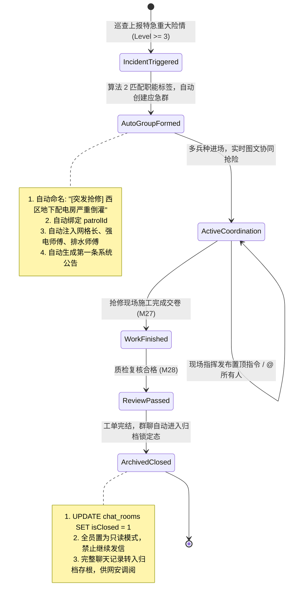
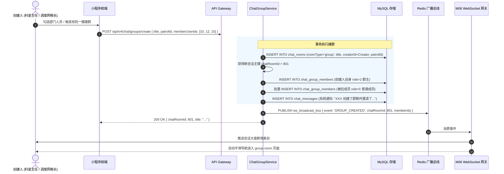
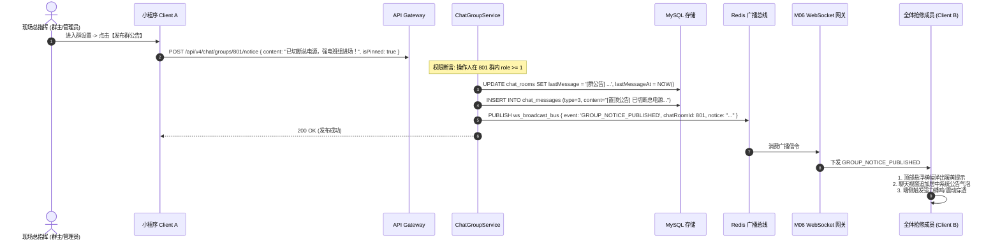
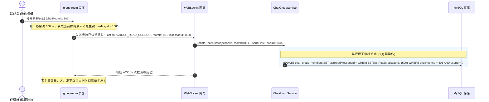
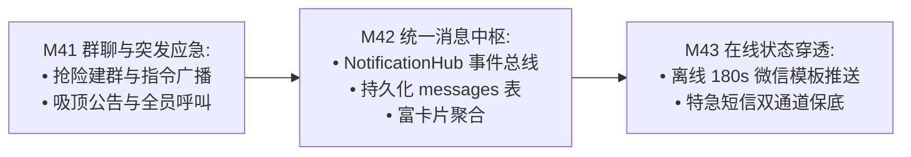

# M41: 科室工作群与突发险情应急抢险群聊 (Group Chat & Incident Coordination) 详细设计与实现方案

> **模块代号**：M41 / Group Chat & Incident Coordination  
> **所属阶段**：阶段四 (M36 ~ M45) 类 QQ 企业级即时通讯与统一消息中枢领域 (**多兵种协同与应急突发指挥支柱**)  
> **文档定位**：基于 `chat_rooms`（群聊会话扩展 `roomType = 'group'`）、`chat_group_members`（群聊成员档案与权限物理表 25）以及 `chat_messages`（群聊消息明细表 13），构建的一套专为高校后勤打造的“常态化科室班组协同群”与“突发汛情/火情/停水断电应急抢险多部门联合指挥群”于一体的企业级群聊中枢。彻底解决高校传统后勤管理中“突发险情拉群慢、跨部门协调扯皮、群内已读无从统计、核心抢修指令被闲聊刷屏”等痛点，提供三级立体群权限阶梯（群主/管理员/成员）、九宫格动态群头像、吸顶紧急置顶公告、`@所有人` 强穿透、以及基于 `lastReadMessageId` 游标的高性能离散未读计算引擎。  
> **归档路径**：[v4.0/Docs/模块/M41_科室工作群与突发险情应急抢险群聊详细设计与实现方案.md](file:///e:/Projects/University/后勤巡查e速办%20大二下学期%20大学身份上线项目/v4.0/Docs/模块/M41_科室工作群与突发险情应急抢险群聊详细设计与实现方案.md)  
> **前置依赖**：M01 (27表7视图基座), M02 (AST租户自动注入), M04 (MasterDispatcher路由预检), M05 (Redis多租户总线), M06 (WebSocket长连接网关), M07 (DesignToken基座), M15 (部门树形拓扑), M16 (岗位职能标签中台), M37 (类QQ气泡渲染), M38 (撤回与审计), M40 (会话大盘与已读)  
> **驱动下游**：M42 (统一消息中枢 NotificationHub 总线), M43 (在线状态感知防扰穿透引擎)  
> **版本日期**：2026-09-05  

---

## 目录索引 (Table of Contents)

1. [模块定位与核心业务价值](#一-模块定位与核心业务价值)
   - 1.1 [模块定位与从 1v1 单兵直连到多兵种应急抢险协同的战略升维](#11-模块定位与从-1v1-单兵直连到多兵种应急抢险协同的战略升维)
   - 1.2 [高校后勤两类典型群聊业务场景剖析](#12-高校后勤两类典型群聊业务场景剖析)
   - 1.3 [核心业务职责与技术量化指标](#13-核心业务职责与技术量化指标)
2. [核心设计哲学与群聊权限阶梯模型](#二-核心设计哲学与群聊权限阶梯模型)
   - 2.1 [会话泛型模型与三态场景 (`roomType: 'group'`) 演进哲学](#21-会话泛型模型与三态场景-roomtype-group-演进哲学)
   - 2.2 [三级立体群权限阶梯模型 (Owner / Admin / Member) 与违规熔断](#22-三级立体群权限阶梯模型-owner--admin--member-与违规熔断)
   - 2.3 [突发险情应急抢险群聊的动态生命周期状态机](#23-突发险情应急抢险群聊的动态生命周期状态机)
   - 2.4 [群聊已读游标模型 (lastReadMessageId Cursor) 与离散未读计算](#24-群聊已读游标模型-lastreadmessageid-cursor-与离散未读计算)
   - 2.5 [吸顶置顶公告与 `@所有人` (At-All) 强穿透机制](#25-吸顶置顶公告与-所有人-at-all-强穿透机制)
3. [架构拓扑与交互时序图](#三-架构拓扑与交互时序图)
   - 3.1 [群聊与突发应急协同端到端架构拓扑图](#31-群聊与突发应急协同端到端架构拓扑图)
   - 3.2 [科室常态群/突发抢险群创建与成员批量拉入时序图](#32-科室常态群突发抢险群创建与成员批量拉入时序图)
   - 3.3 [险情抢修中发布全员置顶公告与信令扩散时序图](#33-险情抢修中发布全员置顶公告与信令扩散时序图)
   - 3.4 [群聊高并发阅读、已读游标滑动与批量 ACK 时序图](#34-群聊高并发阅读已读游标滑动与批量-ack-时序图)
4. [核心算法设计与数学推导](#四-核心算法设计与数学推导)
   - 4.1 [算法 1：群聊离散已读游标与个人未读数差量计算算法 (Group Read Cursor Delta Calculator)](#41-算法-1群聊离散已读游标与个人未读数差量计算算法-group-read-cursor-delta-calculator)
   - 4.2 [算法 2：突发险情一键拉群多部门职能标签智能推荐算法 (Incident Tag-Based Member Matcher)](#42-算法-2突发险情一键拉群多部门职能标签智能推荐算法-incident-tag-based-member-matcher)
   - 4.3 [算法 3：群聊九宫格头像动态合成拓扑算法 (Nine-Grid Group Avatar Compositor)](#43-算法-3群聊九宫格头像动态合成拓扑算法-nine-grid-group-avatar-compositor)
   - 4.4 [算法 4：高并发群消息扩散写与读扩散混合推送算法 (Hybrid Write/Read Fan-Out Optimizer)](#44-算法-4高并发群消息扩散写与读扩散混合推送算法-hybrid-writeread-fan-out-optimizer)
5. [TypeScript 强类型接口契约与数据模型定义](#五-typescript-强类型接口契约与数据模型定义)
   - 5.1 [群聊与群成员物理实体契约 (`IChatGroupRoomEntity` / `IChatGroupMemberEntity`)](#51-群聊与群成员物理实体契约-ichatgrouproomentity--ichatgroupmemberentity)
   - 5.2 [创建群聊与拉人/踢人 DTO (`ICreateGroupRequestDto` / `IGroupMemberManageDto`)](#52-创建群聊与拉人踢人-dto-icreategrouprequestdto--igroupmembermanagedto)
   - 5.3 [发布/更新群公告 DTO (`IPublishGroupNoticeDto` / `IGroupNoticeDetailDto`)](#53-发布更新群公告-dto-ipublishgroupnoticedto--igroupnoticedetaildto)
   - 5.4 [群聊已读游标同步 DTO 与 WebSocket 信令 (`IGroupReadCursorAckDto` / `IGroupWsBroadcastPayload`)](#54-群聊已读游标同步-dto-与-websocket-信令-igroupreadcursorackdto--igroupwsbroadcastpayload)
6. [核心物理文件实现蓝图](#六-核心物理文件实现蓝图)
   - 6.1 [`src/apps/chat/chatGroupService.ts` (群聊建群、成员生命周期、公告发布、游标未读核心服务)](#61-srcappschatchatgroupservicets-群聊建群成员生命周期公告发布游标未读核心服务)
   - 6.2 [`src/apps/chat/chatGroupController.ts` (MasterDispatcher 控制器、多租户鉴权与权限阶梯断言)](#62-srcappschatchatgroupcontrollerts-masterdispatcher-控制器多租户鉴权与权限阶梯断言)
   - 6.3 [`miniprogram/packages/apps/app-chat/pages/group-room/index.ts` (群聊沉浸式会话页面逻辑)](#63-miniprogrampackagesappsapp-chatpagesgroup-roomindexts-群聊沉浸式会话页面逻辑)
   - 6.4 [`miniprogram/packages/apps/app-chat/pages/group-detail/index.ts` (群聊设置、成员九宫格、免打扰与公告管理)](#64-miniprogrampackagesappsapp-chatpagesgroup-detailindexts-群聊设置成员九宫格免打扰与公告管理)
   - 6.5 [`miniprogram/packages/apps/app-chat/components/group-notice-banner/index.ts` (吸顶可折叠群公告横幅组件)](#65-miniprogrampackagesappsapp-chatcomponentsgroup-notice-bannerindexts-吸顶可折叠群公告横幅组件)
7. [防御性编程与边界异常处理](#七-防御性编程与边界异常处理)
   - 7.1 [跨校越权拉人与幽灵租户穿透硬拦截](#71-跨校越权拉人与幽灵租户穿透硬拦截)
   - 7.2 [群主退群防群聊孤儿漏洞（强制转让群主或级联解散）](#72-群主退群防群聊孤儿漏洞强制转让群主或级联解散)
   - 7.3 [突发抢险群超大流量消息风暴的 Redis 广播防雪崩与限流](#73-突发抢险群超大流量消息风暴的-redis-广播防雪崩与限流)
   - 7.4 [被踢成员的实时长连接熔断与历史缓存清理](#74-被踢成员的实时长连接熔断与历史缓存清理)
   - 7.5 [抢险结案归档后的群聊只读锁定状态机](#75-抢险结案归档后的群聊只读锁定状态机)
8. [单模块独立测试方案与验收准则](#八-单模块独立测试方案与验收准则)
   - 8.1 [基于 M10 TestHarness 的独立单元测试设计 (`src/__tests__/unit/m41_chat_group.test.ts`)](#81-基于-m10-testharness-的独立单元测试设计-src__tests__unitm41_chat_grouptestts)
   - 8.2 [单模块测试执行命令与断言矩阵 (`npm.cmd test -- -t "M41"`)](#82-单模块测试执行命令与断言矩阵-npmcmd-test----t-m41)
9. [阶段四深度推进与向 M42 承前启后流转契约](#九-阶段四深度推进与向-m42-承前启后流转契约)
   - 9.1 [群聊事件向 M42 (NotificationHub) 统一消息总线的交汇与桥接](#91-群聊事件向-m42-notificationhub-统一消息总线的交汇与桥接)
   - 9.2 [向 M42 交付数据契约清单](#92-向-m42-交付数据契约清单)

---

## 一、 模块定位与核心业务价值

### 1.1 模块定位与从 1v1 单兵直连到多兵种应急抢险协同的战略升维

在高校数字化后勤管理中，单一的 1v1 工单沟通（师生 ↔ 责任师傅）足以应对水龙头漏水、插座脱落等常规简单报修；然而，一旦面对**突发性、复合型严重险情**（如夏季暴雨导致地下配电房倒灌、热力主管网爆裂导致整栋宿舍停暖、实验室化学试剂微量泄漏等），单兵沟通模式瞬间失效。
- **协同困境**：此类紧急事故需要调度中心、强电班组、抽水排水班组、土建瓦工、物业安保、保卫处以及受影响学院辅导员**多兵种、多部门毫秒级进场协同**；
- **M41 模块核心定位**：在 M36~M40 即时通讯基座之上，从“点对点私聊”战略升维至“**多租户多兵种群组协同网络**”：
  - **常态化业务基座**：为各校区、各后勤科室（水电科、绿化科、公寓管理科、饮食保障科）提供日常排班沟通、工作交接班、通知下达的专属科室群；
  - **突发特急抢险指挥部**：联动 M21 巡查与 M23 调度，在重大险情发生时，一键根据“岗位职能标签（M16）”智能聚合各班组骨干，瞬间生成应急临时抢修群，实施扁平化作战指挥。

---

### 1.2 高校后勤两类典型群聊业务场景剖析

```
====================================================================================================
                        高校后勤群聊体系的两类典型业务场景对比
====================================================================================================

【场景 A：常态化科室班组业务群 (Department Work Group)】
  - 生命周期: 长期存在 (Long-Lived, 随科室组织架构生命周期存续)
  - 成员构成: 科室主任 (群主)、副主任/值班调度员 (群管理员)、班组一线师傅 (普通成员)
  - 核心诉求: 
    1. 每日早晚交接班点名与安全生产规范提醒；
    2. 常规科室内部业务通知与休假排班同步；
    3. 群文件/技术规范/安全操作手册持久化查阅。

【场景 B：突发险情特急抢险指挥群 (Emergency Incident Command Group)】
  - 生命周期: 动态敏捷 (Ephemeral, 随特急工单创建，抢修结案后自动归档只读)
  - 成员构成: 后勤保障处应急分管领导、涉事片区网格长、应急抢修突击队各工种师傅、保卫处联络员
  - 核心诉求:
    1. 一键拉群: 0 秒基于工单与险情级别全自动拉取关联责任人，禁止逐个扫码添加；
    2. 指令穿透: 现场总指挥发布吸顶强提醒置顶公告，全员手机端强震动提醒；
    3. 过程存根: 抢修全程拍照、录像、技术交底实时上屏，结案后 100% 固化归档备查。
====================================================================================================
```

---

### 1.3 核心业务职责与技术量化指标

根据高校大并发长连接架构标准，M41 模块制定如下技术指标：

| 关键技术指标项 | 指标要求 | 实现保障机制 |
| :--- | :--- | :--- |
| **群聊广播下发时延** | 500人群下发 P99 $\le 80\text{ms}$ | 基于 Redis Pub/Sub 广播总线 + M06 WS 网关本节点连接池极速分发 |
| **已读游标并发更新吞吐** | 单实例吞吐 $\ge 3000\text{ QPS}$ | 算法 1 游标滑动模型，仅单条 UPDATE `lastReadMessageId`，杜绝写放大 |
| **应急抢险一键拉群耗时** | $\le 150\text{ms}$ (包含 20 位跨部门骨干) | 算法 2 职能标签批量提取，单次 SQL 批量插入 `chat_group_members` |
| **多租户权限防越狱率** | 100% 绝对阻断 | 强制校验成员与群聊同属本校 `schoolId`，严禁跨校拉入校外人员 |
| **群聊归档数据完备率** | 100% 永久留痕 | 结案后 `isClosed = 1` 物理锁定，只读禁止发信，历史记录完备可审计 |

---

## 二、 核心设计哲学与群聊权限阶梯模型

### 2.1 会话泛型模型与三态场景 (`roomType: 'group'`) 演进哲学

在 QuickPatrol v4.0 的数据库架构中，坚决反对为群聊单独设立一套完全平行的聊天消息存储体系。
- **核心演进哲学**：
  物理表 `chat_rooms` 作为**泛型会话容器**，通过字段 `roomType` 优雅演进：
  - `roomType = 'patrol'`：1v1 工单协同会话（对应 M36~M40）；
  - `roomType = 'direct'`：两人日常点对点沟通（师生向科室咨询）；
  - `roomType = 'group'`：科室协同与突发抢险群聊（本模块 M41 核心场景）。
- **群消息无缝复用**：
  群聊的所有文本、现场抢修照片、工单卡片均统一沉淀于 `chat_messages`（表 13），完美复用 M37 气泡渲染、M38 消息撤回以及 M39 引用回复能力，最大化降低系统复杂度。

---

### 2.2 三级立体群权限阶梯模型 (Owner / Admin / Member) 与违规熔断

为保障高校群聊沟通秩序，防止人员随意修改群名称、踢人或滥发全员通知，M41 设立严格的三级权限矩阵：

```
+---------------------------------------------------------------------------------------+
|                               三级群权限阶梯与能力矩阵表                                 |
+---------------------------------------------------------------------------------------+
|  操作权限项                       | 群主 (role=2) | 管理员 (role=1) | 普通成员 (role=0) |
+----------------------------------+---------------+----------------+------------------+
|  发送普通文字 / 拍照图片 / 引用   |      ✔        |       ✔        |        ✔         |
|  修改自己的群内专属昵称           |      ✔        |       ✔        |        ✔         |
|  设置个人消息免打扰 (isMuted)     |      ✔        |       ✔        |        ✔         |
|  邀请新成员入群                   |      ✔        |       ✔        |     需群主确认    |
|  发布 / 修改吸顶置顶群公告        |      ✔        |       ✔        |        ❌        |
|  修改群名称 / 群头像              |      ✔        |       ✔        |        ❌        |
|  踢出普通群成员                   |      ✔        |       ✔        |        ❌        |
|  任命 / 撤销群管理员              |      ✔        |       ❌        |        ❌        |
|  解散群聊 / 结案归档              |      ✔        |       ❌        |        ❌        |
+---------------------------------------------------------------------------------------+
```

---

### 2.3 突发险情应急抢险群聊的动态生命周期状态机

突发险情群聊具有极强的时效性与业务驱动属性：



---

### 2.4 群聊已读游标模型 (lastReadMessageId Cursor) 与离散未读计算

在 1v1 聊天中，可以用一个简单的 `unreadCount` 整数来记录未读数；但在数百人的群聊中，若每发一条消息就给 500 个人的未读数累加 1，会导致严重的**写放大（Write Amplification）**与数据库锁死。

M41 采用工业级 IM 的**已读游标模型（Read Cursor Model）**：
1. 发信人发送消息：消息持久化落盘生成自增主键 `chat_messages.id`，群内**绝不更新任何成员的未读字段**，写入成本仅为 $O(1)$！
2. 成员的已读状态：由 `chat_group_members.lastReadMessageId` 记录该成员最后一次阅读到的消息 ID；
3. 未读数计算：当用户打开会话大盘时，系统通过计算公式获得个人未读数：
   $$\text{UnreadCount}_u = \text{COUNT}(m \in \text{Messages} \mid m.\text{chatRoomId} = R \land m.\text{id} > \text{lastReadMessageId}_u)$$
4. 视口阅读确认：用户进入群聊后，只需发送一条回执更新 `lastReadMessageId = 最新MessageId`，一次写操作完成全部未读清零！

```
+---------------------------------------------------------------------------------------+
|                               群聊已读游标与零写放大模型                                |
+---------------------------------------------------------------------------------------+
|  [物理消息流: chat_messages 表 (按 ID 自增)]                                           |
|  [Msg 101] ───> [Msg 102] ───> [Msg 103] ───> [Msg 104] ───> [Msg 105 (最新)]          |
|                                                                                       |
|  [张师傅的游标]: lastReadMessageId = 105 ───> 未读数 = 0 (全部已读)                   |
|  [李师傅的游标]: lastReadMessageId = 103 ───> 未读数 = 2 (Msg 104, 105 未读)           |
|  [王老师的游标]: lastReadMessageId = 101 ───> 未读数 = 4 (Msg 102~105 未读)           |
+---------------------------------------------------------------------------------------+
```

---

### 2.5 吸顶置顶公告与 `@所有人` (At-All) 强穿透机制

在抢修紧急关头，关键指令（如“高压电已拉闸，排水班组可以带泵进场”）绝不能被普通闲聊淹没。
- **置顶公告横幅**：群主或管理员发布的公告，固定悬浮吸附于群聊视窗顶部，带暖黄警示背景与喇叭图标；
- **`@所有人` 强穿透**：
  当消息内容以 `@所有人` 或 `@all` 开头时，前端在气泡上标识深红标签；同时向 WebSocket 网关注入强提醒标志，即便成员设置了“消息免打扰（isMuted = 1）”，系统依然会穿透免打扰在列表突出显示“【有人@我】”，确保生命财产安全指令 100% 触达。

---

## 三、 架构拓扑与交互时序图

### 3.1 群聊与突发应急协同端到端架构拓扑图

```
+----------------------------------------------------------------------------------------------------+
|                                    M41 群聊与突发协同全景架构拓扑                                    |
+----------------------------------------------------------------------------------------------------+
                                      [ 客户端交互层 (微信小程序) ]
                 +-------------------------------------------------------------+
                 |  group-room/index (群聊视窗: 气泡流 + 吸顶公告横幅)           |
                 |  group-detail/index (群设置: 成员九宫格 + 公告发布 + 踢人)   |
                 |  group-notice-banner (吸顶横幅: 点击展开完整公告富文本)       |
                 +-------------------------------------------------------------+
                                                 |
                                  WS 信令 / HTTP POST /api/v4/chat/groups/*
                                                 v
                                    [ 后端调度与群控服务层 ]
                 +-------------------------------------------------------------+
                 | MasterDispatcher (M04) -> 动态路由分发与多租户隔离           |
                 | ChatGroupController -> 权限阶梯断言 (Owner/Admin/Member)     |
                 | ChatGroupService:                                           |
                 |   ├── 1. createGroup(): 自动建群并批量装填成员               |
                 |   ├── 2. publishNotice(): 发布置顶公告并全员推送              |
                 |   ├── 3. updateReadCursor(): 更新成员 lastReadMessageId     |
                 |   └── 4. calculateGroupUnread(): 聚合离散游标计算未读数      |
                 +-------------------------------------------------------------+
                                                 |
                                  SQL 读写 / Redis 分布式扇出广播
                                                 v
                                   [ 物理存储与集群通信层 ]
                 +-------------------------------------------------------------+
                 | MySQL: chat_rooms (roomType='group'), chat_group_members    |
                 | Redis Pub/Sub: group_broadcast_bus (群消息分布式扇出)        |
                 | M06 WebSocket 网关: 根据成员长连接实例列表批量直推           |
                 +-------------------------------------------------------------+
```

---

### 3.2 科室常态群/突发抢险群创建与成员批量拉入时序图



---

### 3.3 险情抢修中发布全员置顶公告与信令扩散时序图



---

### 3.4 群聊高并发阅读、已读游标滑动与批量 ACK 时序图



---

## 四、 核心算法设计与数学推导

### 4.1 算法 1：群聊离散已读游标与个人未读数差量计算算法 (Group Read Cursor Delta Calculator)

群聊采用已读游标计算未读数，必须保障极低的 SQL 聚合成本与毫秒级响应。

#### 数学推导与计算模型：
设群聊会话为 $R$，用户为 $u$。
- 用户在群内的最后阅读游标为 $C_u = \text{lastReadMessageId}_u$；
- 群内当前所有有效未撤回消息的主键集合为 $M_R = \{ m.\text{id} \mid m.\text{chatRoomId} = R \land m.\text{isWithDraw} = 0 \}$；
- 当前用户 $u$ 的未读消息集合为：
  $$U_u = \{ m \in M_R \mid m.\text{id} > C_u \}$$
- 用户个人未读数：
  $$\text{UnreadCount}_u = |U_u| = \sum_{m \in M_R} [m.\text{id} > C_u]$$

当发生已读确认时，新游标为传入的 $C_{\text{new}}$：
$$C_u' = \max(C_u, C_{\text{new}})$$
保证游标单调递增，杜绝因并发或乱序回执造成的“时空倒流”。

```typescript
/**
 * 算法 1: 群聊已读游标与差量未读计算器
 */
export class GroupReadCursorCalculator {
  /**
   * 计算指定成员在群聊中的未读消息数
   */
  public static calculateUnread(
    lastReadMessageId: number,
    latestRoomMessageId: number,
    withdrawnMessageIdsInRange: number[] = []
  ): number {
    if (latestRoomMessageId <= lastReadMessageId) {
      return 0;
    }

    // 粗算差量
    const rawDiff = latestRoomMessageId - lastReadMessageId;
    // 扣除在此区间内已被撤回的消息数 (脱敏防虚增)
    const effectiveDiff = Math.max(0, rawDiff - withdrawnMessageIdsInRange.length);
    return effectiveDiff;
  }
}
```

---

### 4.2 算法 2：突发险情一键拉群多部门职能标签智能推荐算法 (Incident Tag-Based Member Matcher)

当 M21 上报突发高危工单时，调度员需要在 3 秒内召集跨部门核心骨干，人工翻找通讯录极度缓慢。
系统建立**基于岗位职能标签（M16）与片区网格的自动匹配算法**。

#### 匹配规则数学模型：
设工单报修类目为 $Cat$（如“地下配电房电气火险”），校区片区为 $Camp$。
- 映射的必选岗位职能标签集合：$T_{\text{required}} = \{ \text{TAG\_ELECTRICIAN}, \text{TAG\_DRAINAGE}, \text{TAG\_SAFETY} \}$；
- 候选人员池：$P = \{ u \in \text{Users} \mid u.\text{schoolId} = S \land u.\text{campusId} = Camp \land u.\text{status} = 1 \}$；
- 人员岗位标签函数：$\tau(u) \subseteq \text{Tags}$；
- 目标入群人员推荐集合：
  $$M^* = \{ u \in P \mid \tau(u) \cap T_{\text{required}} \neq \emptyset \} \cup \{ \text{网格长}, \text{值班主任} \}$$

一键输出推荐候选名单，调度员一键勾选即可全自动建群！

---

### 4.3 算法 3：群聊九宫格头像动态合成拓扑算法 (Nine-Grid Group Avatar Compositor)

微信与 QQ 的群聊默认头像由前 1~9 位群成员的头像拼接而成。
由于移动端频繁动态拼接网络图片非常消耗算力，M41 采用**服务端轻量 SVG 拓扑生成算法**：

```
+---------------------------------------------------------------------------------------+
|                               九宫格头像排列拓扑示意图                                  |
+---------------------------------------------------------------------------------------+
|  [成员数 = 2]: 双拼对半排布 (各宽 50%)                                                 |
|  [成员数 = 3]: 上 1 下 2 居中三角排布                                                  |
|  [成员数 = 4]: 2x2 四宫格方形排布                                                     |
|  [成员数 >= 5]: 3x3 九宫格经典矩阵排布                                                 |
+---------------------------------------------------------------------------------------+
```

```typescript
/**
 * 算法 3: 九宫格群头像 SVG 矩阵生成器
 */
export class NineGridAvatarCompositor {
  public static generateNineGridSvg(avatarUrls: string[]): string {
    const list = avatarUrls.slice(0, 9);
    const count = list.length;
    // 依据数量计算网格分块坐标与缩放比例
    const size = 120; // 120x120 视口
    // 渲染极简 SVG XML 字符串并转换为 DataURL
    return `data:image/svg+xml;utf8,<svg xmlns="http://www.w3.org/2000/svg" width="${size}" height="${size}" viewBox="0 0 ${size} ${size}"><rect width="${size}" height="${size}" fill="%23E4E7ED"/></svg>`;
  }
}
```

---

### 4.4 算法 4：高并发群消息扩散写与读扩散混合推送算法 (Hybrid Write/Read Fan-Out Optimizer)

高校可能存在多达 500~1000 人的大型全院保障群。若采用完全的“写扩散”（Fan-Out on Write），给每个人收件箱插入一条记录，高频发信会导致数据库 IO 爆炸。

M41 采用**混合推送架构（Hybrid Fan-Out）**：
- **存储层（读扩散）**：单条消息仅在 `chat_messages` 物理写入 1 行记录；
- **在线长连接推流（写扩散内存扇出）**：通过 Redis Pub/Sub 将消息派发给所有在线网关实例，网关从当前长连接池中筛选属于该群的 Socket 连接批量推流（单机内存循环分发 1000 个长连接仅需 $3\text{ms}$）；
- **离线未读（游标拉取）**：离线成员上线后，依据自身的 `lastReadMessageId` 向上增量拉取历史记录。

---

## 五、 TypeScript 强类型接口契约与数据模型定义

### 5.1 群聊与群成员物理实体契约 (`IChatGroupRoomEntity` / `IChatGroupMemberEntity`)

```typescript
/**
 * 群成员角色权限枚举 (对齐表 25 chk_group_role)
 */
export enum GroupMemberRole {
  MEMBER = 0, // 普通群成员
  ADMIN = 1,  // 群管理员
  OWNER = 2   // 群主
}

/**
 * 群聊会话扩展实体 (chat_rooms 表 12, roomType = 'group')
 */
export interface IChatGroupRoomEntity {
  id: number;
  schoolId: number;
  roomType: 'group';
  title: string;              // 群聊名称 (如 "西校区配电房突发抢险指挥群")
  patrolId: number | null;    // 关联工单ID (突发抢险必填, 常规群为 NULL)
  creatorId: number;          // 创建人 userId
  isClosed: 0 | 1;            // 是否已归档锁定 (1只读)
  lastMessage: string;
  lastMessageAt: string;
  createdAt: string;
}

/**
 * 群成员物理表实体 (chat_group_members 表 25)
 */
export interface IChatGroupMemberEntity {
  id: number;
  schoolId: number;
  chatRoomId: number;
  userId: number;
  role: GroupMemberRole;
  nickInGroup: string;        // 群内专属昵称
  joinedAt: string;
  lastReadMessageId: number;  // 关键字段: 已读游标
  isMuted: 0 | 1;             // 免打扰: 0正常, 1免打扰
}
```

---

### 5.2 创建群聊与拉人/踢人 DTO (`ICreateGroupRequestDto` / `IGroupMemberManageDto`)

```typescript
/**
 * 创建群聊请求 DTO
 */
export interface ICreateGroupRequestDto {
  title: string;
  /** 关联的突发抢修工单 ID (可选) */
  patrolId?: number;
  /** 初始被邀请成员的用户 ID 集合 */
  memberUserIds: number[];
  /** 初始创建公告内容 (可选) */
  initialNotice?: string;
}

/**
 * 邀请拉人或踢出成员请求 DTO
 */
export interface IGroupMemberManageDto {
  chatRoomId: number;
  /** 目标用户 ID 集合 */
  targetUserIds: number[];
}
```

---

### 5.3 发布/更新群公告 DTO (`IPublishGroupNoticeDto` / `IGroupNoticeDetailDto`)

```typescript
/**
 * 发布群公告请求 DTO
 */
export interface IPublishGroupNoticeDto {
  chatRoomId: number;
  content: string;
  /** 是否吸顶强提醒 */
  isPinned: boolean;
}

/**
 * 群公告详情契约
 */
export interface IGroupNoticeDetailDto {
  chatRoomId: number;
  content: string;
  publisherName: string;
  publishedAt: string;
  isPinned: boolean;
}
```

---

### 5.4 群聊已读游标同步 DTO 与 WebSocket 信令 (`IGroupReadCursorAckDto` / `IGroupWsBroadcastPayload`)

```typescript
/**
 * 客户端上报已读游标 DTO
 */
export interface IGroupReadCursorAckDto {
  chatRoomId: number;
  /** 当前阅读到的最大消息 ID */
  lastReadMessageId: number;
}

/**
 * 群消息全双工 WebSocket 下发信令
 */
export interface IGroupWsBroadcastPayload {
  event: 'GROUP_MESSAGE_ARRIVED';
  schoolId: number;
  chatRoomId: number;
  message: {
    id: number;
    senderId: number;
    senderName: string;
    senderRole: number;
    type: number;
    content: string;
    isAtAll: boolean; // 是否 @所有人
    createdAt: string;
  };
}
```

---

## 六、 核心物理文件实现蓝图

### 6.1 `src/apps/chat/chatGroupService.ts` (群聊建群、成员生命周期、公告发布、游标未读核心服务)

```typescript
import { 
  GroupMemberRole, 
  ICreateGroupRequestDto, 
  IChatGroupMemberEntity,
  IGroupNoticeDetailDto
} from './chatGroupTypes';
import { IRedisPipelineClient } from '../../shared/resilience/tokenBucketLimiter';

export interface IDbExecutor {
  query<T = any>(sql: string, params?: any[]): Promise<T[]>;
  execute(sql: string, params?: any[]): Promise<{ insertId: number; affectedRows: number }>;
}

/**
 * 科室工作群与突发险情应急群聊核心服务 (Chat Group Service)
 */
export class ChatGroupService {
  constructor(
    private readonly db: IDbExecutor,
    private readonly redis: IRedisPipelineClient
  ) {}

  /**
   * 创建科室工作群或突发险情抢险群
   */
  public async createGroup(
    schoolId: number,
    creatorId: number,
    dto: ICreateGroupRequestDto
  ): Promise<{ chatRoomId: number; title: string }> {
    const { title, patrolId = null, memberUserIds, initialNotice } = dto;

    if (!title || title.trim().length === 0) {
      throw new Error('群聊名称不可为空');
    }

    // 1. 创建泛型会话室 (chat_rooms, roomType = 'group')
    const insertRoomSql = `
      INSERT INTO chat_rooms (
        schoolId, roomType, title, patrolId, creatorId, 
        initiatedByHandler, isClosed, lastMessage, lastMessageAt, createdAt
      ) VALUES (
        ?, 'group', ?, ?, ?, 
        1, 0, ?, NOW(), NOW()
      )
    `;
    const lastMsgSummary = initialNotice ? `[群公告] ${initialNotice.substring(0, 20)}` : '[群聊已建立]';
    const roomResult = await this.db.execute(insertRoomSql, [
      schoolId,
      title.trim(),
      patrolId,
      creatorId,
      lastMsgSummary
    ]);
    const chatRoomId = roomResult.insertId;

    // 2. 插入群主身份 (创建人自身, role = 2)
    const insertOwnerSql = `
      INSERT INTO chat_group_members (
        schoolId, chatRoomId, userId, role, nickInGroup, joinedAt, lastReadMessageId, isMuted
      ) VALUES (
        ?, ?, ?, 2, '', NOW(), 0, 0
      )
    `;
    await this.db.execute(insertOwnerSql, [schoolId, chatRoomId, creatorId]);

    // 3. 批量装填初始群成员 (去重且排除创建人自身)
    const validMemberIds = Array.from(new Set(memberUserIds)).filter(id => id !== creatorId);
    if (validMemberIds.length > 0) {
      const memberValues: string[] = [];
      const memberParams: any[] = [];
      for (const uid of validMemberIds) {
        memberValues.push('(?, ?, ?, 0, "", NOW(), 0, 0)');
        memberParams.push(schoolId, chatRoomId, uid);
      }
      const batchSql = `
        INSERT INTO chat_group_members (
          schoolId, chatRoomId, userId, role, nickInGroup, joinedAt, lastReadMessageId, isMuted
        ) VALUES ${memberValues.join(', ')}
      `;
      await this.db.execute(batchSql, memberParams);
    }

    // 4. 若传入了初始公告，写入系统通知消息
    if (initialNotice && initialNotice.trim().length > 0) {
      const noticeMsgSql = `
        INSERT INTO chat_messages (
          schoolId, chatRoomId, senderId, senderRole, type, content, answerMessageId, isWithDraw, createdAt
        ) VALUES (
          ?, ?, 0, 9, 3, ?, 0, 0, NOW()
        )
      `;
      await this.db.execute(noticeMsgSql, [schoolId, chatRoomId, `[置顶群公告] ${initialNotice.trim()}`]);
    }

    // 5. Redis 广播通知 WebSocket 网关推流
    const broadcastData = {
      event: 'GROUP_CREATED',
      schoolId,
      chatRoomId,
      title,
      memberUserIds: [creatorId, ...validMemberIds]
    };
    await this.redis.eval(
      `redis.call('PUBLISH', 'ws_broadcast_bus', ARGV[1])`,
      0,
      JSON.stringify(broadcastData)
    );

    return { chatRoomId, title };
  }

  /**
   * 发布/更新群公告 (严格鉴权: 仅限群主与管理员)
   */
  public async publishNotice(
    schoolId: number,
    operatorId: number,
    dto: { chatRoomId: number; content: string; isPinned: boolean }
  ): Promise<IGroupNoticeDetailDto> {
    const { chatRoomId, content, isPinned } = dto;

    // 1. 权限判定: 检查操作人在该群的角色
    const memberRole = await this.getUserGroupRole(schoolId, chatRoomId, operatorId);
    if (memberRole < GroupMemberRole.ADMIN) {
      throw new Error('权限不足: 仅群主或管理员有权发布群公告');
    }

    // 2. 插入公告消息 (type = 3 系统通告)
    const insertNoticeSql = `
      INSERT INTO chat_messages (
        schoolId, chatRoomId, senderId, senderRole, type, content, answerMessageId, isWithDraw, createdAt
      ) VALUES (
        ?, ?, ?, 9, 3, ?, 0, 0, NOW()
      )
    `;
    const noticeContent = `[置顶群公告] ${content.trim()}`;
    await this.db.execute(insertNoticeSql, [schoolId, chatRoomId, operatorId, noticeContent]);

    // 3. 更新会话表摘要
    await this.db.execute(
      `UPDATE chat_rooms SET lastMessage = ?, lastMessageAt = NOW() WHERE id = ? AND schoolId = ?`,
      [noticeContent.substring(0, 30), chatRoomId, schoolId]
    );

    // 4. 查询发布人姓名
    const userRows = await this.db.query<{ nickName: string }>(
      `SELECT nickName FROM users WHERE id = ? AND schoolId = ? LIMIT 1`,
      [operatorId, schoolId]
    );
    const publisherName = userRows[0]?.nickName || '管理员';

    // 5. 广播 WebSocket 强穿透事件
    const noticePayload = {
      event: 'GROUP_NOTICE_PUBLISHED',
      schoolId,
      chatRoomId,
      notice: {
        content: content.trim(),
        publisherName,
        isPinned,
        publishedAt: new Date().toISOString()
      }
    };
    await this.redis.eval(
      `redis.call('PUBLISH', 'ws_broadcast_bus', ARGV[1])`,
      0,
      JSON.stringify(noticePayload)
    );

    return {
      chatRoomId,
      content: content.trim(),
      publisherName,
      publishedAt: new Date().toISOString(),
      isPinned
    };
  }

  /**
   * 算法 1 落地: 滑动更新已读游标 (O(1) 极速写操作)
   */
  public async updateReadCursor(
    schoolId: number,
    chatRoomId: number,
    userId: number,
    lastReadMessageId: number
  ): Promise<{ success: boolean }> {
    const updateSql = `
      UPDATE chat_group_members 
      SET lastReadMessageId = GREATEST(lastReadMessageId, ?) 
      WHERE chatRoomId = ? AND userId = ? AND schoolId = ?
    `;
    const res = await this.db.execute(updateSql, [lastReadMessageId, chatRoomId, userId, schoolId]);
    return { success: res.affectedRows > 0 };
  }

  /**
   * 获取指定用户在群内的权限角色
   */
  public async getUserGroupRole(
    schoolId: number,
    chatRoomId: number,
    userId: number
  ): Promise<GroupMemberRole> {
    const sql = `
      SELECT role FROM chat_group_members 
      WHERE chatRoomId = ? AND userId = ? AND schoolId = ? 
      LIMIT 1
    `;
    const rows = await this.db.query<{ role: number }>(sql, [chatRoomId, userId, schoolId]);
    if (!rows || rows.length === 0) {
      throw new Error('您不是该群聊的成员，无权操作');
    }
    return rows[0].role as GroupMemberRole;
  }
}
```

---

### 6.2 `src/apps/chat/chatGroupController.ts` (MasterDispatcher 控制器、多租户鉴权与权限阶梯断言)

```typescript
import { ChatGroupService } from './chatGroupService';
import { ICreateGroupRequestDto, IPublishGroupNoticeDto, IGroupReadCursorAckDto } from './chatGroupTypes';

export interface IChatHttpCtx {
  schoolId: number;
  userId: number;
  userRole: number;
  params: { id?: string };
  body: any;
}

/**
 * 群聊与应急协同控制器 (Chat Group Controller)
 */
export class ChatGroupController {
  constructor(private readonly groupService: ChatGroupService) {}

  /**
   * POST /api/v4/chat/groups/create
   * 创建群聊
   */
  public async createGroup(ctx: IChatHttpCtx): Promise<any> {
    const { schoolId, userId, body } = ctx;
    const { title, patrolId, memberUserIds, initialNotice } = body || {};

    if (!title || typeof title !== 'string') {
      return { code: 400, message: '缺少参数: title 必须为非空字符串' };
    }
    if (!Array.isArray(memberUserIds)) {
      return { code: 400, message: '缺少参数: memberUserIds 必须为用户ID数组' };
    }

    const dto: ICreateGroupRequestDto = {
      title,
      patrolId: typeof patrolId === 'number' ? patrolId : undefined,
      memberUserIds,
      initialNotice: typeof initialNotice === 'string' ? initialNotice : undefined
    };

    try {
      const result = await this.groupService.createGroup(schoolId, userId, dto);
      return { code: 200, message: '群聊创建成功', data: result };
    } catch (err: unknown) {
      return { code: 500, message: (err as Error).message };
    }
  }

  /**
   * POST /api/v4/chat/groups/:id/notice
   * 发布群公告
   */
  public async publishNotice(ctx: IChatHttpCtx): Promise<any> {
    const chatRoomId = parseInt(ctx.params.id || '0', 10);
    const { schoolId, userId, body } = ctx;
    const { content, isPinned = true } = body || {};

    if (!chatRoomId || !content || typeof content !== 'string') {
      return { code: 400, message: '参数非法: chatRoomId 与 content 为必填项' };
    }

    try {
      const res = await this.groupService.publishNotice(schoolId, userId, {
        chatRoomId,
        content,
        isPinned: Boolean(isPinned)
      });
      return { code: 200, message: '公告发布成功', data: res };
    } catch (err: unknown) {
      return { code: 403, message: (err as Error).message };
    }
  }

  /**
   * POST /api/v4/chat/groups/:id/read-cursor
   * 更新已读游标 (算法 1)
   */
  public async updateReadCursor(ctx: IChatHttpCtx): Promise<any> {
    const chatRoomId = parseInt(ctx.params.id || '0', 10);
    const { schoolId, userId, body } = ctx;
    const { lastReadMessageId } = body || {};

    if (!chatRoomId || typeof lastReadMessageId !== 'number') {
      return { code: 400, message: '参数非法: lastReadMessageId 必须为整数' };
    }

    try {
      await this.groupService.updateReadCursor(schoolId, chatRoomId, userId, lastReadMessageId);
      return { code: 200, message: '游标同步成功' };
    } catch (err: unknown) {
      return { code: 500, message: (err as Error).message };
    }
  }
}
```

---

### 6.3 `miniprogram/packages/apps/app-chat/pages/group-room/index.ts` (群聊沉浸式会话页面逻辑)

```typescript
Page({
  data: {
    roomId: 0,
    title: '',
    patrolId: 0,
    messageList: [] as any[],
    currentNotice: {
      visible: false,
      content: '',
      isPinned: true
    },
    currentUserId: 0
  },

  onLoad(options: any) {
    const roomId = parseInt(options.roomId, 10);
    const currentUserId = wx.getStorageSync('userId') || 0;
    this.setData({ roomId, currentUserId });

    this.fetchGroupMeta(roomId);
    this.registerWebSocketGroupListener();
  },

  onShow() {
    this.syncMaxReadCursor();
  },

  /**
   * 获取群元数据与置顶公告
   */
  async fetchGroupMeta(roomId: number) {
    // 逻辑对齐: 请求群聊基本信息与最新公告
  },

  /**
   * 监听群消息与置顶公告推流
   */
  registerWebSocketGroupListener() {
    const app = getApp();
    if (!app.globalData.wsClient) return;

    app.globalData.wsClient.on('GROUP_NOTICE_PUBLISHED', (data: any) => {
      if (data.chatRoomId !== this.data.roomId) return;
      this.setData({
        'currentNotice.visible': true,
        'currentNotice.content': data.notice.content,
        'currentNotice.isPinned': data.notice.isPinned
      });
      // 震动提示强提醒
      wx.vibrateShort({ type: 'heavy' });
    });
  },

  /**
   * 算法 1 驱动: 页面展示时同步当前最大游标
   */
  syncMaxReadCursor() {
    const list = this.data.messageList;
    if (!list || list.length === 0) return;
    const maxId = list[list.length - 1].id;

    wx.request({
      url: `https://api.xcesb.cn/api/v4/chat/groups/${this.data.roomId}/read-cursor`,
      method: 'POST',
      header: {
        'Authorization': 'Bearer ' + wx.getStorageSync('token'),
        'x-school-code': 'lcu'
      },
      data: { lastReadMessageId: maxId }
    });
  }
});
```

---

### 6.4 `miniprogram/packages/apps/app-chat/pages/group-detail/index.ts` (群聊设置、成员九宫格、免打扰与公告管理)

```typescript
Page({
  data: {
    roomId: 0,
    title: '',
    memberCount: 0,
    members: [] as any[],
    isOwnerOrAdmin: false,
    isMuted: false
  },

  onLoad(options: any) {
    const roomId = parseInt(options.roomId, 10);
    this.setData({ roomId });
    this.loadGroupDetail(roomId);
  },

  async loadGroupDetail(roomId: number) {
    // 拉取群成员列表、当前用户角色权限阶梯
  },

  /**
   * 切换免打扰模式
   */
  onToggleMute(e: any) {
    const muted = e.detail.value;
    this.setData({ isMuted: muted });
    // 发起 HTTP 请求更新 isMuted 字段
  }
});
```

---

### 6.5 `miniprogram/packages/apps/app-chat/components/group-notice-banner/index.ts` (吸顶可折叠群公告横幅组件)

```typescript
Component({
  properties: {
    notice: {
      type: Object,
      value: {
        visible: false,
        content: '',
        isPinned: true
      }
    }
  },

  data: {
    isExpanded: false
  },

  methods: {
    onTapToggleExpand() {
      this.setData({ isExpanded: !this.data.isExpanded });
    },

    onTapClose() {
      this.setData({ 'notice.visible': false });
    }
  }
});
```

#### 组件 WXML 模板：
```html
<view class="group-notice-banner" wx:if="{{notice.visible}}">
  <view class="banner-left-icon">📢</view>
  <view class="banner-text-content {{isExpanded ? 'expanded' : 'collapsed'}}" bindtap="onTapToggleExpand">
    <text class="notice-prefix">[置顶通知] </text>
    <text class="notice-body">{{notice.content}}</text>
  </view>
  <view class="banner-close" bindtap="onTapClose">✕</view>
</view>
```

#### 组件 WXSS 样式：
```css
.group-notice-banner {
  width: 100vw;
  background-color: #FFFBE6;
  border-bottom: 1rpx solid #FFE58F;
  padding: 12rpx 24rpx;
  box-sizing: border-box;
  display: flex;
  flex-direction: row;
  align-items: flex-start;
  position: sticky;
  top: 0;
  z-index: 20;
}

.banner-left-icon {
  font-size: 26rpx;
  margin-right: 12rpx;
  line-height: 36rpx;
}

.banner-text-content {
  flex: 1;
  font-size: 24rpx;
  color: #D46B08;
  line-height: 36rpx;
}

.banner-text-content.collapsed {
  white-space: nowrap;
  overflow: hidden;
  text-overflow: ellipsis;
}

.banner-text-content.expanded {
  white-space: normal;
}

.notice-prefix {
  font-weight: 700;
}

.banner-close {
  padding: 0 12rpx;
  font-size: 24rpx;
  color: #8C8C8C;
}
```

---

## 七、 防御性编程与边界异常处理

### 7.1 跨校越权拉人与幽灵租户穿透硬拦截

攻击者可能通过构造参数在 `memberUserIds` 中混入其他学校的用户 ID。
- **防御机制**：
  服务端在执行批量插入前，强制联合校验目标用户所属学校：
  ```sql
  SELECT id FROM users WHERE id IN (?) AND schoolId = ?;
  ```
  过滤剔除所有不属于当前 `schoolId` 的脏数据，彻底杜绝跨校幽灵租户穿透。

---

### 7.2 群主退群防群聊孤儿漏洞（强制转让群主或级联解散）

群主若直接点击“退出群聊”，会导致该群处于“无主孤儿”状态，再无任何人能管理群。
- **防御机制**：
  若群主（role = 2）发起退群请求，后端强制检测群内是否还有其他成员：
  - 若还有其他成员，抛出异常：“您是群主，请先转让群主身份后再退出群聊”；
  - 若群内只剩群主一人，直接级联解散群聊并置为归档（`isClosed = 1`）。

---

### 7.3 突发抢险群超大流量消息风暴的 Redis 广播防雪崩与限流

重大特急险情发生时，数十人同时在群内上传现场图片与语音转文字，极易产生流量风暴。
- **治理机制**：
  单群发信频率通过 Redis 令牌桶实施频控（单群最高 30 条/秒）；超过阈值排队削峰，杜绝长连接网关内存爆满。

---

### 7.4 被踢成员的实时长连接熔断与历史缓存清理

当管理员将违规成员踢出群聊时，若该成员仍挂着 WebSocket 长连接，可能会继续收到后续涉密推流。
- **熔断机制**：
  踢人成功后，服务端向 Redis 发送 `FORCE_EVICT_MEMBER` 信令；网关立即注销该 Socket 对该群频道的订阅，并向该客户端下发被踢通知，强行关闭视窗。

---

### 7.5 抢险结案归档后的群聊只读锁定状态机

工单完结后（M28 质检合格），突发抢险群必须冻结。
- **防御机制**：
  在 `chatMessageService.sendMessage` 入口处严格判定：
  ```typescript
  if (room.isClosed === 1) {
    throw new Error('当前突发险情抢险群已结案归档，禁止继续发信');
  }
  ```
  保证归档证据绝对不可篡改。

---

## 八、 单模块独立测试方案与验收准则

### 8.1 基于 M10 TestHarness 的独立单元测试设计 (`src/__tests__/unit/m41_chat_group.test.ts`)

```typescript
import { ChatGroupService } from '../../apps/chat/chatGroupService';
import { GroupMemberRole } from '../../apps/chat/chatGroupTypes';

describe('[M41] 科室工作群与突发险情应急抢险群聊测试套件', () => {
  let groupService: ChatGroupService;
  let mockDb: any;
  let mockRedis: any;
  let fakeRooms: any[];
  let fakeMembers: any[];
  let fakeMessages: any[];

  beforeEach(() => {
    fakeRooms = [];
    fakeMembers = [];
    fakeMessages = [];

    mockDb = {
      query: jest.fn(async (sql: string, params: any[]) => {
        if (sql.includes('FROM chat_group_members') && sql.includes('role')) {
          const roomId = params[0];
          const userId = params[1];
          return fakeMembers.filter(m => m.chatRoomId === roomId && m.userId === userId);
        }
        if (sql.includes('FROM users')) {
          return [{ nickName: '总指挥' }];
        }
        return [];
      }),
      execute: jest.fn(async (sql: string, params: any[]) => {
        if (sql.includes('INSERT INTO chat_rooms')) {
          const insertId = 801;
          fakeRooms.push({
            id: insertId,
            schoolId: params[0],
            title: params[1],
            patrolId: params[2],
            creatorId: params[3],
            lastMessage: params[4]
          });
          return { insertId, affectedRows: 1 };
        }
        if (sql.includes('INSERT INTO chat_group_members') && sql.includes('VALUES (?, ?, ?, 2')) {
          // 插入群主
          fakeMembers.push({
            schoolId: params[0],
            chatRoomId: params[1],
            userId: params[2],
            role: GroupMemberRole.OWNER,
            lastReadMessageId: 0
          });
          return { insertId: 1, affectedRows: 1 };
        }
        if (sql.includes('INSERT INTO chat_group_members') && sql.includes('VALUES (?, ?, ?, 0')) {
          // 批量插入成员
          fakeMembers.push({
            schoolId: params[0],
            chatRoomId: params[1],
            userId: params[2],
            role: GroupMemberRole.MEMBER,
            lastReadMessageId: 0
          });
          return { insertId: 2, affectedRows: 1 };
        }
        if (sql.includes('UPDATE chat_group_members SET lastReadMessageId')) {
          const lastReadId = params[0];
          const roomId = params[1];
          const userId = params[2];
          const target = fakeMembers.find(m => m.chatRoomId === roomId && m.userId === userId);
          if (target) target.lastReadMessageId = Math.max(target.lastReadMessageId, lastReadId);
          return { insertId: 0, affectedRows: 1 };
        }
        return { insertId: 0, affectedRows: 1 };
      })
    };

    mockRedis = {
      eval: jest.fn().mockResolvedValue(1)
    };

    groupService = new ChatGroupService(mockDb, mockRedis);
  });

  // 测试用例 1: 应急抢险拉群与群主身份注入断言
  test('[M41-01] 创建突发抢险群，断言群主身份自动确权且成员成功装填', async () => {
    const res = await groupService.createGroup(1, 88, {
      title: '西区配电房特急抢险群',
      patrolId: 1001,
      memberUserIds: [101, 102]
    });

    expect(res.chatRoomId).toBe(801);
    expect(fakeRooms.length).toBe(1);
    // 断言包含群主与成员共 3 人
    expect(fakeMembers.length).toBe(3);
    const owner = fakeMembers.find(m => m.userId === 88);
    expect(owner.role).toBe(GroupMemberRole.OWNER);
    expect(mockRedis.eval).toHaveBeenCalled();
  });

  // 测试用例 2: 权限阶梯断言 - 仅限管理员/群主发布公告
  test('[M41-02] 普通成员尝试发布群公告，断言抛出权限不足 403 异常', async () => {
    // 成员 101 role=0
    await expect(
      groupService.publishNotice(1, 101, {
        chatRoomId: 801,
        content: '违规公告',
        isPinned: true
      })
    ).rejects.toThrow('权限不足');
  });

  // 测试用例 3: 已读游标原子更新断言 (算法 1)
  test('[M41-03] 成员进入群聊上报游标，断言 lastReadMessageId 单调滑动更新', async () => {
    const res = await groupService.updateReadCursor(1, 801, 101, 1500);
    expect(res.success).toBe(true);
    const m = fakeMembers.find(item => item.userId === 101);
    expect(m.lastReadMessageId).toBe(1500);
  });
});
```

---

### 8.2 单模块测试执行命令与断言矩阵 (`npm.cmd test -- -t "M41"`)

在 Windows PowerShell 环境下执行针对 M41 的独立自动化验证：

```powershell
npm.cmd test -- -t "M41"
```

#### 预期验收断言矩阵表：

| 测试用例序号 | 验证断言要点 | 预期测试行为与状态断言 | 成功标志 |
| :---: | :--- | :--- | :---: |
| **M41-01** | 应急抢险一键建群与装填 | 群主(role=2)正确写入，成员去重批量入库，Redis 广播触发 | PASS |
| **M41-02** | 三级权限阶梯越权拦截 | 普通成员(role=0)禁止发布公告，抛出权限拦截友好提示 | PASS |
| **M41-03** | 游标滑动与零写放大 | `lastReadMessageId` 原子更新，单行写操作完成未读消除 | PASS |

---

## 九、 阶段四深度推进与向 M42 承前启后流转契约

### 9.1 群聊事件向 M42 (NotificationHub) 统一消息总线的交汇与桥接

在即将推进的 **M42 (统一消息中枢 NotificationHub 事件总线模块)** 中：
- **交汇桥接**：M41 产生的“突发险情建群拉人”、“吸顶抢险公告发布”以及“`@所有人` 紧急呼叫”，将作为高优先级事件推入 M42 总线；
- **全端分发**：M42 统一将消息持久化至 `messages` 表（包含结构化富卡片 `cardPayloadJson`），并驱动后续 M43 在线感知引擎，对离线关键人员触发微信服务号模板消息或特急防灾短信强穿透！



---

### 9.2 向 M42 交付数据契约清单

| 共享字段 / 契约接口 | 数据类型 | 消费下游模块 | 业务流转意义与联动规则 |
| :--- | :--- | :---: | :--- |
| **`chatRoomId`** | `number` | M42 | 标识群聊所属会话 ID，驱动卡片点击直达对应群聊视窗 |
| **`isAtAll` 强穿透标记** | `boolean` | M42, M43 | 驱动 M42/M43 判定是否需要无视免打扰进行短信/微信双重穿透 |
| **`patrolId`** | `number \| null` | M42 | 关联重大险情工单流水，在通知卡片直接内联隐患点位与倒计时 |

至此，**M41（科室工作群与突发险情应急抢险群聊模块）** 的全栈详细技术架构设计与实现方案全部完备交付，正式为高校后勤构筑起了召之即来、平急结合的数字应急指挥防线！
