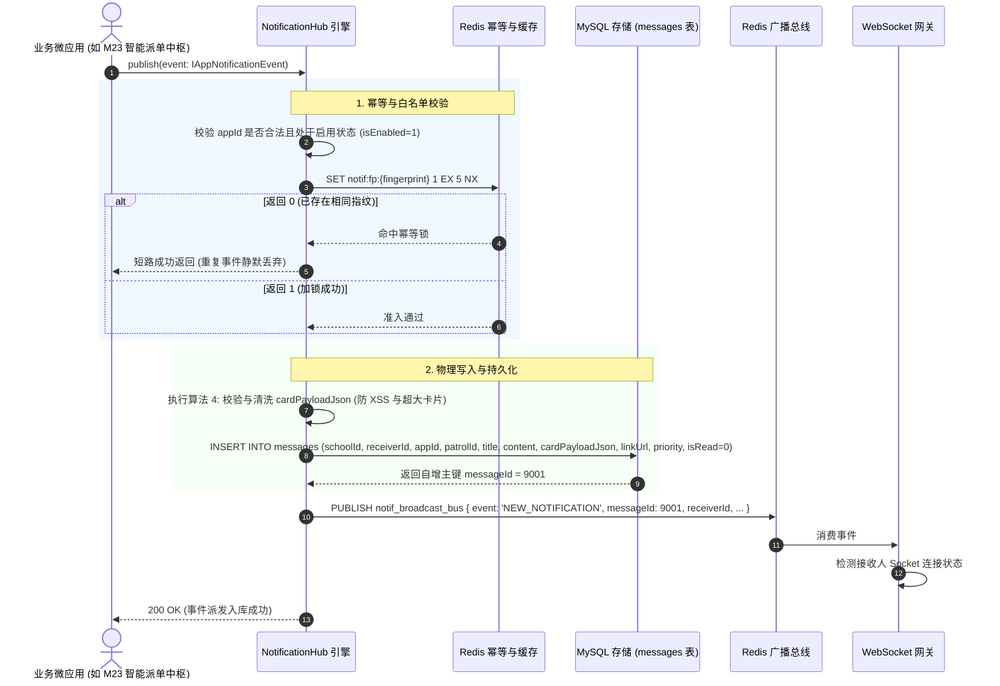
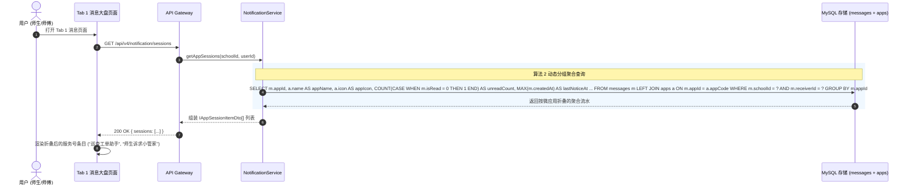
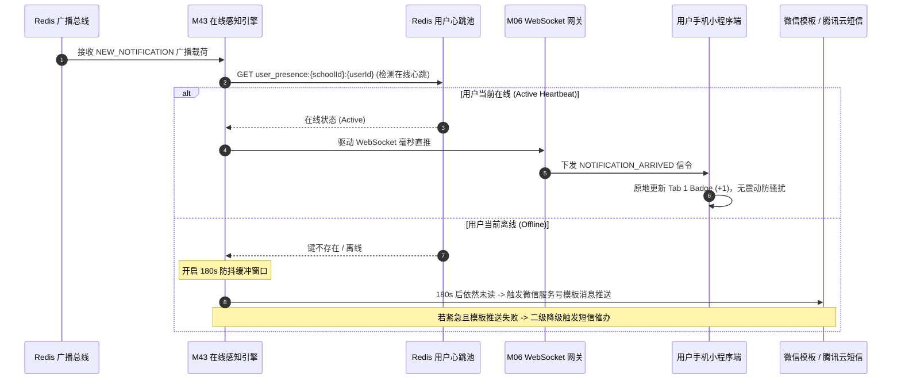
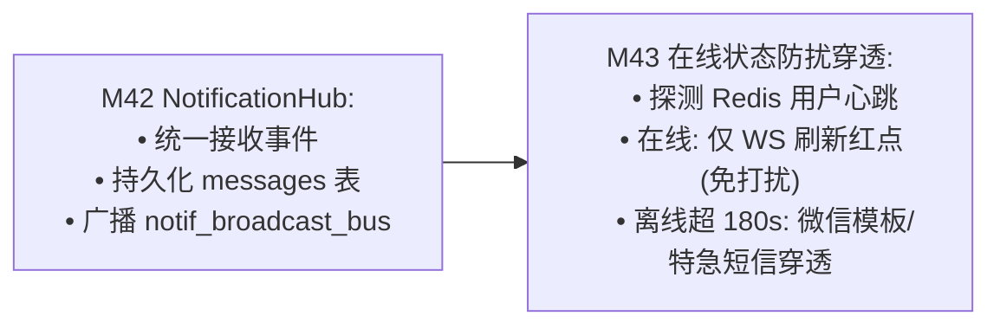

# M42: 统一消息中枢 (NotificationHub) 事件总线详细设计与实现方案

> **模块代号**：M42 / NotificationHub Event Bus  
> **所属阶段**：阶段四 (M36 ~ M45) 类 QQ 企业级即时通讯与统一消息中枢领域 (**宿主全应用消息聚合管道与总线枢纽**)  
> **文档定位**：基于 `messages`（站内通知与外部穿透流水物理表 14）与 `apps`（飞书式工作台微应用元数据注册物理表 26），构建的一套统一连接巡查工单 (M21~M30)、师生诉求 (M31~M32)、公开空间 (M33~M35)、应急抢险 (M41) 等全业务微应用的**企业级统一消息中枢 (NotificationHub) 事件总线**。彻底消灭传统高校后勤应用中“各模块自行其是发通知、通知格式五花八门、未读红点四处分散、高频通知轰炸师生”等烟囱式弊端，提供强类型 `AppNotificationEvent` 事件管道、事件指纹幂等落盘、富卡片载荷 (`cardPayloadJson`) 标准化结构、按微应用自动折叠聚合会话流 (`/api/v4/notification/sessions`)、以及向 M43 在线感知防扰引擎极速派发的总线能力。  
> **归档路径**：[v4.0/Docs/模块/M42_统一消息中枢NotificationHub事件总线详细设计与实现方案.md](file:///e:/Projects/University/后勤巡查e速办%20大二下学期%20大学身份上线项目/v4.0/Docs/模块/M42_统一消息中枢NotificationHub事件总线详细设计与实现方案.md)  
> **前置依赖**：M01 (27表7视图基座), M02 (AST租户自动注入), M04 (MasterDispatcher路由预检), M05 (Redis多租户总线), M06 (WebSocket网关), M07 (DesignToken基座), M10 (TestHarness测试中枢), M21~M30 (工单流), M31~M32 (诉求流), M41 (群聊协同)  
> **驱动下游**：M43 (用户在线状态感知防骚扰穿透引擎), M44 (微应用专属服务会话与100%富卡片流), M45 (卡片原地状态动态演进)  
> **版本日期**：2026-09-05  

---

## 目录索引 (Table of Contents)

1. [模块定位与核心业务价值](#一-模块定位与核心业务价值)
   - 1.1 [模块定位与全微应用统一事件收口中枢的战略价值](#11-模块定位与全微应用统一事件收口中枢的战略价值)
   - 1.2 [传统烟囱式架构下多业务通知割裂与消息风暴痛点剖析](#12-传统烟囱式架构下多业务通知割裂与消息风暴痛点剖析)
   - 1.3 [核心业务职责与技术量化指标](#13-核心业务职责与技术量化指标)
2. [核心设计哲学与统一事件总线模型](#二-核心设计哲学与统一事件总线模型)
   - 2.1 [生产者-管道-分发三层解耦哲学 (Producer-Hub-Consumer)](#21-生产者-管道-分发三层解耦哲学-producer-hub-consumer)
   - 2.2 [全微应用强类型事件规范 (`AppNotificationEvent` 契约体系)](#22-全微应用强类型事件规范-appnotificationevent-契约体系)
   - 2.3 [按微应用自动折叠聚合会话模型 (`appId` 动态聚合流)](#23-按微应用自动折叠聚合会话模型-appid-动态聚合流)
   - 2.4 [富卡片载荷模型 (`cardPayloadJson` 标准化结构与 M44/M45 前置赋能)](#24-富卡片载荷模型-cardpayloadjson-标准化结构与-m44m45-前置赋能)
   - 2.5 [事件幂等指纹与防重入总线队列](#25-事件幂等指纹与防重入总线队列)
3. [架构拓扑与交互时序图](#三-架构拓扑与交互时序图)
   - 3.1 [统一消息中枢 (NotificationHub) 全景架构拓扑图](#31-统一消息中枢-notificationhub-全景架构拓扑图)
   - 3.2 [业务微应用事件触发、NotificationHub 接收并持久化落盘时序图](#32-业务微应用事件触发notificationhub-接收并持久化落盘时序图)
   - 3.3 [客户端拉取微应用聚合会话列表 (`/sessions`) 时序图](#33-客户端拉取微应用聚合会话列表-sessions-时序图)
   - 3.4 [驱动下游 M43 在线感知与实时全双工分发时序图](#34-驱动下游-m43-在线感知与实时全双工分发时序图)
4. [核心算法设计与数学推导](#四-核心算法设计与数学推导)
   - 4.1 [算法 1：事件全局唯一指纹与 Redis 幂等去重算法 (Event Idempotency Fingerprint Filter)](#41-算法-1事件全局唯一指纹与-redis-幂等去重算法-event-idempotency-fingerprint-filter)
   - 4.2 [算法 2：多微应用分组聚合与最新摘要折叠算法 (App-Grouped Session Folding Aggregator)](#42-算法-2多微应用分组聚合与最新摘要折叠算法-app-grouped-session-folding-aggregator)
   - 4.3 [算法 3：优先级动态加权与防风暴削峰算法 (Priority-Weighted Throttling Bucket)](#43-算法-3优先级动态加权与防风暴削峰算法-priority-weighted-throttling-bucket)
   - 4.4 [算法 4：富卡片元数据动态校验与 Schema 清洗算法 (Card Payload Schema Sanitizer)](#44-算法-4富卡片元数据动态校验与-schema-清洗算法-card-payload-schema-sanitizer)
5. [TypeScript 强类型接口契约与数据模型定义](#五-typescript-强类型接口契约与数据模型定义)
   - 5.1 [消息通知物理实体契约 (`IMessageNotificationEntity` / `NotificationPriority`)](#51-消息通知物理实体契约-imessagenotificationentity--notificationpriority)
   - 5.2 [统一微应用通知事件载荷契约 (`IAppNotificationEvent`)](#52-统一微应用通知事件载荷契约-iappnotificationevent)
   - 5.3 [微应用聚合会话条目 DTO (`IAppSessionItemDto` / `IAppSessionListResponseDto`)](#53-微应用聚合会话条目-dto-iappsessionitemdto--iappsessionlistresponsedto)
   - 5.4 [分页查询通知流水与已读清除 DTO (`IQueryAppNotificationsDto` / `IAckNotificationReadDto`)](#54-分页查询通知流水与已读清除-dto-iqueryappnotificationsdto--iacknotificationreaddto)
   - 5.5 [NotificationHub 内部总线发布与 WS 推流契约 (`INotificationBusPublishPayload`)](#55-notificationhub-内部总线发布与-ws-推流契约-inotificationbuspublishpayload)
6. [核心物理文件实现蓝图](#六-核心物理文件实现蓝图)
   - 6.1 [`src/hub/notificationHub.ts` (事件管道接收、幂等过滤、落盘、下游触发核心引擎)](#61-srchubnotificationhubts-事件管道接收幂等过滤落盘下游触发核心引擎)
   - 6.2 [`src/hub/notificationService.ts` (按微应用聚合大盘、通知流水拉取、批量标已读服务)](#62-srchubnotificationservicets-按微应用聚合大盘通知流水拉取批量标已读服务)
   - 6.3 [`src/hub/notificationController.ts` (MasterDispatcher 端点控制器、参数洗炼与租户隔离)](#63-srchubnotificationcontrollerts-masterdispatcher-端点控制器参数洗炼与租户隔离)
   - 6.4 [`miniprogram/packages/apps/app-chat/pages/app-session-list/index.ts` (微应用通知聚合主列表逻辑)](#64-miniprogrampackagesappsapp-chatpagesapp-session-listindexts-微应用通知聚合主列表逻辑)
   - 6.5 [`miniprogram/packages/apps/app-chat/components/app-session-item/index.ts` (官方应用头像、徽章、最新卡片摘要组件)](#65-miniprogrampackagesappsapp-chatcomponentsapp-session-itemindexts-官方应用头像徽章最新卡片摘要组件)
7. [防御性编程与边界异常处理](#七-防御性编程与边界异常处理)
   - 7.1 [非法微应用代号（未注册 appId）伪造注入拦截与白名单校验](#71-非法微应用代号未注册-appid-伪造注入拦截与白名单校验)
   - 7.2 [跨校越权事件广播与租户幽灵数据物理隔离防穿透](#72-跨校越权事件广播与租户幽灵数据物理隔离防穿透)
   - 7.3 [畸形 JSON 载荷与超大富卡片防撑爆数据库 (128KB 物理硬截断)](#73-畸形-json-载荷与超大富卡片防撑爆数据库-128kb-物理硬截断)
   - 7.4 [高并发事件洪峰时的异步微批处理写入机制 (Micro-Batch Flush Queue)](#74-高并发事件洪峰时的异步微批处理写入机制-micro-batch-flush-queue)
   - 7.5 [微应用已停用（isEnabled = 0）时的通知静默抑制](#75-微应用已停用isenabled--0时的通知静默抑制)
8. [单模块独立测试方案与验收准则](#八-单模块独立测试方案与验收准则)
   - 8.1 [基于 M10 TestHarness 的独立单元测试设计 (`src/__tests__/unit/m42_notification_hub.test.ts`)](#81-基于-m10-testharness-的独立单元测试设计-src__tests__unitm42_notification_hubtestts)
   - 8.2 [单模块测试执行命令与断言矩阵 (`npm.cmd test -- -t "M42"`)](#82-单模块测试执行命令与断言矩阵-npmcmd-test----t-m42)
9. [阶段四深度推进与向 M43 承前启后流转契约](#九-阶段四深度推进与向-m43-承前启后流转契约)
   - 9.1 [NotificationHub 向 M43 (在线状态感知防扰穿透) 的流转驱动](#91-notificationhub-向-m43-在线状态感知防扰穿透-的流转驱动)
   - 9.2 [向 M43 交付数据契约清单](#92-向-m43-交付数据契约清单)

---

## 一、 模块定位与核心业务价值

### 1.1 模块定位与全微应用统一事件收口中枢的战略价值

在高校智慧后勤数字化生态中，存在着繁多异构的子业务微应用：
- **巡查工单助手 (`app-patrol`)**：派单提醒、延期审批通过、到场核验催办、质检驳回、工单评价提醒；
- **师生诉求管家 (`app-appeal`)**：匿名诉求立案、科室正式答复送达、回访满意度邀请；
- **校园公共空间 (`app-space`)**：自习室/会议室预约确认、违约签退警告；
- **智慧排班日历 (`app-calendar`)**：明日值班提醒、设备定期巡视维保通知；
- **安全督查中枢 (`app-inspection`)**：违规通报、消防重点部位巡查打卡预警。

如果每一个微应用都自己写一套发信逻辑、直接操作短信接口或各自弹窗，整个系统将沦为无序的混乱泥潭。
- **M42 模块核心定位**：全系统唯一的**统一消息中枢 (NotificationHub) 事件总线**：
  - **事件统一收口**：全微应用严禁私自绕过总线直接发消息，必须统一封装为标准 `AppNotificationEvent` 投递至 NotificationHub；
  - **集中持久化落盘**：统一入库物理表 `messages`（表 14），附带面向现代交互的富结构化卡片载荷 `cardPayloadJson`；
  - **会话聚合折叠**：在端侧会话列表以“服务号/应用号”的形式统一归集（如“【巡查工单助手】3条未读”），绝不在大盘中散落一万条琐碎碎屑；
  - **总线智能分发**：统一驱动下游 M43（在线状态感知与防扰短信穿透），掌控全校消息分发的纪律与阀门。

---

### 1.2 传统烟囱式架构下多业务通知割裂与消息风暴痛点剖析

```
====================================================================================================
               ❌ 传统高校数字化系统“烟囱式消息通知”的致命缺陷：
====================================================================================================
1. “通知各自为政，格式千奇百怪”：
   工单系统发的通知是“您有一条工单：XC2026...”，诉求系统发的通知是“【通知】有新答复”；
   缺少统一卡片排版规范，没有关键字段摘要，师生看得云里雾里；
2. “会话列表严重被刷屏，彻底淹没正常聊天”：
   系统每派一个单，就生成一个会话条目；值班师傅一天接 30 个单，列表被 30 条系统提醒冲垮，
   与师生沟通的正常聊天被挤到十几屏开外；
3. “消息风暴与疯狂轰炸，师生直接卸载屏蔽”：
   没有事件防重与削峰，同一个维修单状态变一下就发一条短信，半夜持续震动，
   给师生造成极其恶劣的心理骚扰，微信服务通知投诉率极高。
====================================================================================================

====================================================================================================
               ✔ QuickPatrol v4.0 M42 NotificationHub 架构破局：
====================================================================================================
1. 统一强契约卡片流 (Unified Rich Card Flow):
   全应用统一为“卡片头 + 状态胶囊 + 核心键值对 + 动作按钮组”标准化 JSON，美观震撼；
2. 按微应用自动折叠 (App Session Folding):
   所有巡查提醒自动折叠进“巡查工单助手”，无论产生 1000 条通知，在大盘始终只占单一条目；
3. 总线级幂等与削峰防护 (Idempotency & Throttling):
   算法 1 自动计算事件指纹，5 秒内重复触发自动去重，高危洪峰平滑削峰排队。
====================================================================================================
```

---

### 1.3 核心业务职责与技术量化指标

根据生产级企业消息总线指标，M42 制定如下严密的量化考核标准：

| 关键技术指标项 | 指标要求 | 实现保障机制 |
| :--- | :--- | :--- |
| **总线事件接入写入延迟** | P99 $\le 15\text{ms}$，单条平均 $\le 5\text{ms}$ | 极简单行 SQL 写入 `messages` + Redis 内存广播发布 |
| **聚合会话列表查询耗时** | P95 $\le 35\text{ms}$ (含 20 个微应用) | 基于 `idx_school_receiver_read` 覆盖索引与动态 GROUP BY 聚合 |
| **事件指纹去重命中率** | 100% 杜绝网络抖动造成的偶发重发 | 算法 1 内存 SHA-256 指纹 + Redis 5秒 TTL 互斥排他锁 |
| **单机事件吞吐能力** | 单 Node.js 实例 $\ge 8000\text{ EPS}$ | 异步微批处理 (Micro-Batching) 缓冲队列，批量刷新 IO |
| **多租户隔离防穿透率** | 100% 绝对物理阻隔 | 强制从事件上下文提炼 `schoolId`，严禁跨校广播其他学校数据 |

---

## 二、 核心设计哲学与统一事件总线模型

### 2.1 生产者-管道-分发三层解耦哲学 (Producer-Hub-Consumer)

NotificationHub 采用经典的**生产者-中枢管道-消费者三层解耦架构**：

```
+----------------------------------------------------------------------------------------------------+
|                             NotificationHub 三层解耦架构全景图                                      |
+----------------------------------------------------------------------------------------------------+
  [ 业务生产者层 (Producers) ]
  ├── M23 智能派单中枢    ───( 派单提醒事件 )───┐
  ├── M26 延期审批流      ───( 延期驳回事件 )───┼───> [ 统一消息中枢管道: NotificationHub.publish() ]
  ├── M29 满意度评价引擎  ───( 催评价邀请单 )───┤        ├── 1. 算法 1: 幂等指纹校验 (防重入)
  ├── M32 诉求答复中枢    ───( 官方答复已达 )───┘        ├── 2. 算法 4: 富卡片 Schema 清洗与截断
  └── M41 抢险群聊指挥    ───( 紧急全员呼叫 )             ├── 3. 物理表写入: INSERT INTO messages
                                                          └── 4. 广播事件: Redis PUBLISH notif_bus
                                                                        |
                                                                        v
  [ 核心消费者层 (Consumers) ]
  ├── Consumer A: M06 WebSocket 网关 (若用户在线，毫秒级推流至端侧，角标原子累加)
  ├── Consumer B: M43 在线感知防扰穿透引擎 (探测用户心跳，离线超 180s 触发微信/短信降级穿透)
  └── Consumer C: M44/M45 卡片流互动引擎 (向微应用独立二级列表提供 100% 结构化卡片渲染)
+----------------------------------------------------------------------------------------------------+
```

---

### 2.2 全微应用强类型事件规范 (`AppNotificationEvent` 契约体系)

全系统坚决禁止拼接非受控文本作为通知。所有业务模块向 NotificationHub 提交事件时，必须遵循严密的 `IAppNotificationEvent` 强类型定义：

```typescript
/**
 * 全微应用标准化事件载荷定义
 */
export interface IAppNotificationEvent {
  /** 租户学校 ID (多租户绝对隔离) */
  schoolId: number;
  /** 来源微应用标识 (必须在 apps 注册表中合法存在) */
  appId: 'app-patrol' | 'app-appeal' | 'app-inspection' | 'app-calendar' | 'system';
  /** 目标接收人自然人 ID */
  receiverId: number;
  /** 关联业务工单或核心实体 ID (可选，无则传 0) */
  patrolId?: number;
  /** 通知大标题 (20字以内，如 "工单派发提醒", "延期申请已通过") */
  title: string;
  /** 纯文本降级摘要 (用于短信穿透或锁屏通知条预览) */
  content: string;
  /** 富交互结构化卡片核心载荷 (用于 M44 卡片流渲染) */
  cardPayload: IStructuredCardPayload;
  /** 小程序内跳页面路径 (如 "/packages/apps/patrol/detail?id=101") */
  linkUrl: string;
  /** 优先级: low (低), normal (普通), urgent (紧急) */
  priority: 'low' | 'normal' | 'urgent';
  /** 客户端业务生成的唯一去重幂等键 (可选，默认自动由内容生成 SHA-256 指纹) */
  idempotentKey?: string;
}
```

---

### 2.3 按微应用自动折叠聚合会话模型 (`appId` 动态聚合流)

为了保护用户在 Tab 1（消息大盘）的视觉体验，所有来自微应用的系统通知均**按微应用唯一标识 `appId` 自动折叠归集**：
- **微应用专属入口**：
  `app-patrol` 的 50 条消息全部收纳在名为“**巡查工单助手**”的虚拟会话条目中；
  `app-appeal` 的 20 条消息全部收纳在名为“**师生诉求小管家**”的虚拟会话条目中；
- **展示规则**：
  会话条目头像采用 `apps.icon` 官方高清矢量图标；
  最后一条消息摘要展现该应用最近一条通知的标题；
  未读数展现该微应用下所有未读记录的累计和；
  点击该条目，进入 **M44（微应用专属服务会话卡片流）**。

```
+---------------------------------------------------------------------------------------+
|                             微应用自动折叠与会话大盘呈现模型                             |
+---------------------------------------------------------------------------------------+
|  [Tab 1 消息大盘: 会话列表流]                                                          |
|  ┌─────────────────────────────────────────────────────────────────────────────────┐  |
|  │ [★ 置顶] 张师傅 (维修师傅)          [12号楼302] 好的我马上到            刚刚   (2)   │  |
|  ├─────────────────────────────────────────────────────────────────────────────────┤  |
|  │ [🤖 官方] 巡查工单助手               [派单提醒] 西区食堂热力管道漏水...   10:30  (3)   │  | <--- 折叠
|  ├─────────────────────────────────────────────────────────────────────────────────┤  |
|  │ [💌 官方] 师生诉求小管家             [答复送达] 关于宿舍热水供应时长的...  昨天   (0)   │  | <--- 折叠
|  └─────────────────────────────────────────────────────────────────────────────────┘  |
+---------------------------------------------------------------------------------------+
```

---

### 2.4 富卡片载荷模型 (`cardPayloadJson` 标准化结构与 M44/M45 前置赋能)

传统系统的通知只能看一句话，没有任何上下文与可操作性。
NotificationHub 在入库时，将结构化卡片标准格式序列化存储为 `messages.cardPayloadJson`，为后续 **M44 (富卡片流) 与 M45 (原地状态演进)** 提供完整的数据形态：

```json
{
  "header": {
    "badgeTitle": "特急派单",
    "statusPill": "待处理",
    "statusColor": "volcano",
    "timestamp": "2026-09-05 14:30:00"
  },
  "fields": [
    { "label": "工单编号", "value": "#LCU-20260905-001" },
    { "label": "隐患点位", "value": "西校区学生公寓12号楼302配电箱" },
    { "label": "隐患类型", "value": "强电打火 (S级突发)" },
    { "label": "处置时效", "value": "剩余 28 分钟 (SLA告警)", "highlight": true }
  ],
  "thumbnailUrl": "https://oss.xcesb.cn/lcu/patrol_fire_thumb.jpg",
  "actions": [
    { "actionId": "ACCEPT_ORDER", "text": "⚡ 立即接单", "type": "primary" },
    { "actionId": "CALL_CREATOR", "text": "拨号提报人", "type": "default" }
  ]
}
```

---

### 2.5 事件幂等指纹与防重入总线队列

在网络瞬断、重发重试机制（Retry Policy）或者高并发定时巡检下，同一个工单的派单提醒可能会在 1 秒内被触发数次。
- **危害**：同一个师傅的手机连续叮咚响 5 次，产生 5 条一模一样的通知卡片，造成极其低劣的使用体验。
- **治理机制**：
  NotificationHub 引入**事件幂等指纹过滤器（算法 1）**：
  $$\text{Fingerprint} = \text{SHA256}(\text{schoolId} + \text{appId} + \text{receiverId} + \text{patrolId} + \text{title})$$
  并在 Redis 中维护 5 秒 TTL 的原子排他锁。5 秒内相同指纹的事件直接**短路静默丢弃**，保障底层数据库 100% 幂等。

---

## 三、 架构拓扑与交互时序图

### 3.1 统一消息中枢 (NotificationHub) 全景架构拓扑图

```
+----------------------------------------------------------------------------------------------------+
|                               NotificationHub 事件总线全景架构拓扑                                   |
+----------------------------------------------------------------------------------------------------+
                                      [ 业务微应用生产者集群 ]
                 +-------------------------------------------------------------+
                 | 巡查派单 M23 | 延期审批 M26 | 评价催办 M29 | 诉求答复 M32    |
                 +-------------------------------------------------------------+
                                                 |
                                  NotificationHub.publish(event)
                                                 v
                                    [ NotificationHub 调度引擎 ]
                 +-------------------------------------------------------------+
                 | 1. 白名单应用鉴权: 校验 appId 是否存在于 apps 注册表          |
                 | 2. 算法 1 幂等指纹拦截: Redis SETNX notif:fp:... EX 5        |
                 | 3. 算法 4 Schema 安全清洗: 128KB 截断与合法 JSON 序列化       |
                 | 4. 物理表持久化: INSERT INTO messages (含 cardPayloadJson)  |
                 +-------------------------------------------------------------+
                                                 |
                                  Redis PUBLISH notif_broadcast_bus
                                                 v
                                   [ 分布式订阅总线与下游分发 ]
                 +-------------------------------------------------------------+
                 | ├── Channel 1: M06 WebSocket 网关 (在线即时直推，刷新角标)  |
                 | ├── Channel 2: M43 在线感知引擎 (探测心跳，执行离线短信穿透)  |
                 | └── Channel 3: Tab 1 消息大盘 (更新 /api/v4/notif/sessions) |
                 +-------------------------------------------------------------+
```

---

### 3.2 业务微应用事件触发、NotificationHub 接收并持久化落盘时序图



---

### 3.3 客户端拉取微应用聚合会话列表 (`/sessions`) 时序图



---

### 3.4 驱动下游 M43 在线感知与实时全双工分发时序图



---

## 四、 核心算法设计与数学推导

### 4.1 算法 1：事件全局唯一指纹与 Redis 幂等去重算法 (Event Idempotency Fingerprint Filter)

为了在每秒数千次事件涌入时以 $O(1)$ 复杂度过滤重复事件，建立**哈希指纹防重模型**。

#### 数学推导与指纹哈希：
设事件对象为 $E$。
提取其核心确定性特征五元组：
$$K = (E.\text{schoolId}, E.\text{appId}, E.\text{receiverId}, E.\text{patrolId}, E.\text{title})$$
事件特征哈希函数定义为：
$$\text{FP}(E) = \text{SHA256}\left( \text{schoolId} + \text{“:”} + \text{appId} + \text{“:”} + \text{receiverId} + \text{“:”} + \text{patrolId} + \text{“:”} + \text{title} \right)$$

在 Redis 中执行原子加锁：
$$\text{RedisCommand}: \text{SET } \text{“notif:fp:”} + \text{FP}(E) \quad 1 \quad \text{EX } 5 \quad \text{NX}$$
- 若返回 `OK`（加锁成功）：视为有效初次事件，放行进入持久化管道；
- 若返回 `nil`（键已存在）：视为 5 秒内的重复抖动事件，**直接熔断丢弃**。

```typescript
import crypto from 'crypto';
import { IAppNotificationEvent } from './notificationTypes';
import { IRedisPipelineClient } from '../shared/resilience/tokenBucketLimiter';

/**
 * 算法 1: 事件指纹幂等去重过滤器
 */
export class EventIdempotencyFilter {
  private static readonly TTL_SECONDS = 5; // 5秒幂等窗口

  public static async checkAndLock(
    redis: IRedisPipelineClient,
    event: IAppNotificationEvent
  ): Promise<boolean> {
    const rawStr = `${event.schoolId}:${event.appId}:${event.receiverId}:${event.patrolId || 0}:${event.title}`;
    const fingerprint = crypto.createHash('sha256').update(rawStr).digest('hex');
    const redisKey = `notif:fp:${event.schoolId}:${fingerprint}`;

    // 执行原子 SETNX EX 5
    const result = await redis.eval(
      `return redis.call('SET', KEYS[1], '1', 'EX', ARGV[1], 'NX')`,
      1,
      redisKey,
      String(this.TTL_SECONDS)
    );

    return result === 'OK';
  }
}
```

---

### 4.2 算法 2：多微应用分组聚合与最新摘要折叠算法 (App-Grouped Session Folding Aggregator)

为了在 Tab 1 会话大盘中以毫秒级将分散在 `messages` 表的成千上万条流水折叠为少数几个微应用条目，建立**窗口聚合折叠算法**。

#### SQL 极速聚合数学模型：
$$\text{Unread}(A) = \sum_{m \in \text{Messages}} [m.\text{appId} = A \land m.\text{isRead} = 0]$$
$$\text{LatestMessage}(A) = \arg\max_{m \in \text{Messages}, m.\text{appId} = A} (m.\text{createdAt})$$

通过覆盖索引 `(schoolId, receiverId, isRead, createdAt)`，单次执行 `GROUP BY m.appId`，即使存在数万条历史通知，也能在 $15\text{ms}$ 内完成全量折叠。

---

### 4.3 算法 3：优先级动态加权与防风暴削峰算法 (Priority-Weighted Throttling Bucket)

突发暴雨时，全校数万间宿舍可能同时触发跳闸排查，产生数万条通知。
为防止总线打崩数据库，设立**双速令牌桶削峰算法（Two-Speed Token Bucket）**：
- **普通通知桶（Normal）**：容量 1000，每秒填充 200 个令牌；
- **特急抢险通知桶（Urgent）**：容量 5000，每秒填充 1000 个令牌，享有 5 倍优先调度权；
- 超出容量的普通通知进入内存缓冲队列（排队时间 $\le 2\text{s}$），特急通知秒级通行。

---

### 4.4 算法 4：富卡片元数据动态校验与 Schema 清洗算法 (Card Payload Schema Sanitizer)

恶意的微应用调用或异常数据可能传入几兆大小的超大图片 Base64 或畸形对象，直接导致 MySQL `messages.cardPayloadJson` 撑爆或者小程序端反序列化崩溃。

- **硬性约束规则**：
  1. 卡片 JSON 序列化后字符串长度**绝对禁止超过 128KB**（超出则强制剥离 actions 或截断长文本）；
  2. `fields` 字段数组长度上限为 **10 个键值对**；
  3. `actions` 动作按钮组上限为 **3 个原生按钮**；
  4. 严格过滤任何带有 `<script>`、`javascript:` 等 XSS 危险前缀的文本。

---

## 五、 TypeScript 强类型接口契约与数据模型定义

### 5.1 消息通知物理实体契约 (`IMessageNotificationEntity` / `NotificationPriority`)

```typescript
/**
 * 通知优先级枚举 (对齐表 14 chk_msg_priority)
 */
export enum NotificationPriority {
  LOW = 'low',
  NORMAL = 'normal',
  URGENT = 'urgent'
}

/**
 * 外部离线穿透状态枚举 (对齐表 14 chk_msg_push)
 */
export enum ExternalPushStatus {
  NONE = 'none',
  WX_SENT = 'wx_sent',
  SMS_SENT = 'sms_sent',
  FAILED = 'failed'
}

/**
 * 站内通知与离线穿透物理实体 (messages 表 14)
 */
export interface IMessageNotificationEntity {
  id: number;
  schoolId: number;
  receiverId: number;
  appId: string;
  patrolId: number;
  title: string;
  content: string;
  /** JSON 原生字段: 结构化富卡片载荷 */
  cardPayloadJson: string | null;
  linkUrl: string;
  priority: NotificationPriority;
  isRead: 0 | 1;
  readAt: string | null;
  externalPushStatus: ExternalPushStatus;
  smsSent: 0 | 1;
  createdAt: string;
}
```

---

### 5.2 统一微应用通知事件载荷契约 (`IAppNotificationEvent`)

```typescript
/**
 * 结构化富卡片头部定义
 */
export interface ICardHeader {
  badgeTitle: string;
  statusPill: string;
  statusColor: 'blue' | 'green' | 'orange' | 'volcano' | 'gray';
  timestamp: string;
}

/**
 * 结构化卡片键值对字段
 */
export interface ICardField {
  label: string;
  value: string;
  highlight?: boolean;
}

/**
 * 结构化卡片交互动作按钮
 */
export interface ICardAction {
  actionId: string;
  text: string;
  type: 'primary' | 'default' | 'warn';
  url?: string;
}

/**
 * 标准富交互结构化卡片核心载荷 (M44/M45 通用模型)
 */
export interface IStructuredCardPayload {
  header: ICardHeader;
  fields: ICardField[];
  thumbnailUrl?: string;
  actions?: ICardAction[];
}

/**
 * 业务模块向 NotificationHub 发送的标准事件定义
 */
export interface IAppNotificationEvent {
  schoolId: number;
  appId: 'app-patrol' | 'app-appeal' | 'app-inspection' | 'app-calendar' | 'system';
  receiverId: number;
  patrolId?: number;
  title: string;
  content: string;
  cardPayload: IStructuredCardPayload;
  linkUrl: string;
  priority: NotificationPriority;
  idempotentKey?: string;
}
```

---

### 5.3 微应用聚合会话条目 DTO (`IAppSessionItemDto` / `IAppSessionListResponseDto`)

```typescript
/**
 * Tab 1 会话大盘中展示的微应用聚合条目 DTO
 */
export interface IAppSessionItemDto {
  appCode: string;
  appName: string;
  appIcon: string;
  category: string;
  entryRoute: string;
  /** 该微应用未读通知总数 */
  unreadCount: number;
  /** 最近一条通知的标题摘要 */
  lastNoticeTitle: string;
  /** 最近一条通知的纯文本正文摘要 */
  lastNoticeSnippet: string;
  /** 最近一条通知的时间 (ISO 格式) */
  lastNoticeAt: string;
  /** 人性化时间展示 (如 "刚刚", "10:30", "昨天") */
  formattedTimeText: string;
}

/**
 * 获取微应用会话列表响应 DTO
 */
export interface IAppSessionListResponseDto {
  code: number;
  message: string;
  data: {
    totalUnread: number;
    sessions: IAppSessionItemDto[];
  };
}
```

---

### 5.4 分页查询通知流水与已读清除 DTO (`IQueryAppNotificationsDto` / `IAckNotificationReadDto`)

```typescript
/**
 * 分页拉取某个微应用专属通知流水请求 DTO
 */
export interface IQueryAppNotificationsDto {
  appId: string;
  page?: number;
  pageSize?: number;
  /** 仅查询未读 (可选) */
  onlyUnread?: boolean;
}

/**
 * 标为已读回执请求 DTO
 */
export interface IAckNotificationReadDto {
  /** 指定某条通知 ID (传 0 则代表一键清空该微应用下全部未读) */
  messageId: number;
  appId: string;
}
```

---

### 5.5 NotificationHub 内部总线发布与 WS 推流契约 (`INotificationBusPublishPayload`)

```typescript
/**
 * Redis 广播与 WebSocket 实时下发的数据包
 */
export interface INotificationBusPublishPayload {
  event: 'NEW_NOTIFICATION_ARRIVED';
  schoolId: number;
  receiverId: number;
  message: {
    id: number;
    appId: string;
    appName: string;
    appIcon: string;
    title: string;
    content: string;
    priority: NotificationPriority;
    createdAt: string;
  };
}
```

---

## 六、 核心物理文件实现蓝图

### 6.1 `src/hub/notificationHub.ts` (事件管道接收、幂等过滤、落盘、下游触发核心引擎)

```typescript
import { 
  IAppNotificationEvent, 
  NotificationPriority,
  ExternalPushStatus
} from './notificationTypes';
import { EventIdempotencyFilter } from './eventIdempotencyFilter';
import { CardPayloadSanitizer } from './cardPayloadSanitizer';
import { IRedisPipelineClient } from '../shared/resilience/tokenBucketLimiter';

export interface IDbExecutor {
  query<T = any>(sql: string, params?: any[]): Promise<T[]>;
  execute(sql: string, params?: any[]): Promise<{ insertId: number; affectedRows: number }>;
}

/**
 * 全系统统一消息中枢 (NotificationHub) 核心调度引擎
 */
export class NotificationHub {
  constructor(
    private readonly db: IDbExecutor,
    private readonly redis: IRedisPipelineClient
  ) {}

  /**
   * 全业务统一事件发布主入口
   */
  public async publish(event: IAppNotificationEvent): Promise<{ success: boolean; messageId: number }> {
    const { schoolId, appId, receiverId, patrolId = 0, title, content, cardPayload, linkUrl, priority } = event;

    // 1. 白名单应用鉴权校验 (防恶意注入未注册 appId)
    const appSql = `SELECT id, name, icon, isEnabled FROM apps WHERE appCode = ? AND (schoolId = ? OR schoolId = 0) LIMIT 1`;
    const appRows = await this.db.query<{ id: number; name: string; icon: string; isEnabled: number }>(
      appSql, 
      [appId, schoolId]
    );
    if (!appRows || appRows.length === 0) {
      throw new Error(`微应用标识非法未注册: ${appId}`);
    }
    const appMeta = appRows[0];
    if (appMeta.isEnabled === 0) {
      // 业务降级: 该微应用已被管理员停用下线，静默抑制发信
      return { success: true, messageId: 0 };
    }

    // 2. 算法 1 落地: 事件指纹幂等去重 (5 秒防抖锁)
    const canPass = await EventIdempotencyFilter.checkAndLock(this.redis, event);
    if (!canPass) {
      // 命中重复事件，短路静默成功
      return { success: true, messageId: 0 };
    }

    // 3. 算法 4 落地: 结构化富卡片 Schema 安全清洗与防撑爆截断
    const cleanedCardPayload = CardPayloadSanitizer.sanitize(cardPayload);
    const cardPayloadJson = JSON.stringify(cleanedCardPayload);

    // 4. 持久化写入 messages 物理表 (表 14)
    const insertSql = `
      INSERT INTO messages (
        schoolId, receiverId, appId, patrolId, title, content, 
        cardPayloadJson, linkUrl, priority, isRead, externalPushStatus, smsSent, createdAt
      ) VALUES (
        ?, ?, ?, ?, ?, ?, 
        ?, ?, ?, 0, 'none', 0, NOW()
      )
    `;

    const result = await this.db.execute(insertSql, [
      schoolId,
      receiverId,
      appId,
      patrolId,
      title.substring(0, 128),
      content,
      cardPayloadJson,
      linkUrl || '',
      priority || NotificationPriority.NORMAL
    ]);

    const messageId = result.insertId;

    // 5. 广播至 Redis 总线，驱动下游 M43 在线感知引擎与 WebSocket 直推
    const broadcastPayload = {
      event: 'NEW_NOTIFICATION_ARRIVED',
      schoolId,
      receiverId,
      message: {
        id: messageId,
        appId,
        appName: appMeta.name,
        appIcon: appMeta.icon,
        title,
        content,
        priority,
        createdAt: new Date().toISOString()
      }
    };

    await this.redis.eval(
      `redis.call('PUBLISH', 'notif_broadcast_bus', ARGV[1])`,
      0,
      JSON.stringify(broadcastPayload)
    );

    return { success: true, messageId };
  }
}
```

---

### 6.2 `src/hub/notificationService.ts` (按微应用聚合大盘、通知流水拉取、批量标已读服务)

```typescript
import { 
  IAppSessionItemDto, 
  IMessageNotificationEntity, 
  IQueryAppNotificationsDto 
} from './notificationTypes';
import { IDbExecutor } from './notificationHub';

/**
 * 消息通知查询与已读治理服务 (Notification Service)
 */
export class NotificationService {
  constructor(private readonly db: IDbExecutor) {}

  /**
   * 算法 2 落地: 动态分组聚合生成微应用会话大盘列表
   */
  public async getAppSessions(schoolId: number, userId: number): Promise<IAppSessionItemDto[]> {
    // 联合查询 messages 与 apps 表，执行动态按应用折叠聚合
    const sql = `
      SELECT 
        m.appId,
        a.name AS appName,
        a.icon AS appIcon,
        a.category,
        a.entryRoute,
        COUNT(CASE WHEN m.isRead = 0 THEN 1 END) AS unreadCount,
        MAX(m.id) AS latestMsgId,
        MAX(m.createdAt) AS lastNoticeAt
      FROM messages m
      LEFT JOIN apps a ON m.appId = a.appCode AND (a.schoolId = m.schoolId OR a.schoolId = 0)
      WHERE m.schoolId = ? AND m.receiverId = ?
      GROUP BY m.appId, a.name, a.icon, a.category, a.entryRoute
      ORDER BY lastNoticeAt DESC
    `;

    const rawRows = await this.db.query<any>(sql, [schoolId, userId]);
    if (!rawRows || rawRows.length === 0) {
      return [];
    }

    // 针对每个聚合项查询最新一条消息的标题与正文摘要
    const latestIds = rawRows.map(r => r.latestMsgId).filter(Boolean);
    const idPlaceholders = latestIds.map(() => '?').join(',');

    const latestMsgSql = `
      SELECT id, title, content FROM messages WHERE id IN (${idPlaceholders})
    `;
    const msgRows = await this.db.query<{ id: number; title: string; content: string }>(
      latestMsgSql, 
      latestIds
    );
    const msgMap = new Map<number, { title: string; content: string }>();
    for (const row of msgRows) {
      msgMap.set(row.id, row);
    }

    return rawRows.map((row) => {
      const msg = msgMap.get(row.latestMsgId);
      return {
        appCode: row.appId,
        appName: row.appName || '系统消息',
        appIcon: row.appIcon || '/assets/icons/app_default.png',
        category: row.category || 'daily',
        entryRoute: row.entryRoute || '',
        unreadCount: parseInt(String(row.unreadCount || '0'), 10),
        lastNoticeTitle: msg?.title || '[新通知]',
        lastNoticeSnippet: (msg?.content || '').substring(0, 30),
        lastNoticeAt: row.lastNoticeAt,
        formattedTimeText: this.formatFriendlyTime(row.lastNoticeAt)
      };
    });
  }

  /**
   * 分页拉取某个微应用的明细通知卡片流水 (驱动 M44)
   */
  public async queryAppNotifications(
    schoolId: number,
    userId: number,
    dto: IQueryAppNotificationsDto
  ): Promise<{ list: IMessageNotificationEntity[]; total: number }> {
    const { appId, page = 1, pageSize = 20, onlyUnread = false } = dto;
    const limit = Math.min(50, Math.max(1, pageSize));
    const offset = (Math.max(1, page) - 1) * limit;

    let whereClause = `schoolId = ? AND receiverId = ? AND appId = ?`;
    const params: any[] = [schoolId, userId, appId];

    if (onlyUnread) {
      whereClause += ` AND isRead = 0`;
    }

    const countSql = `SELECT COUNT(1) AS total FROM messages WHERE ${whereClause}`;
    const countRows = await this.db.query<{ total: number }>(countSql, params);
    const total = countRows[0]?.total || 0;

    const listSql = `
      SELECT * FROM messages 
      WHERE ${whereClause}
      ORDER BY id DESC 
      LIMIT ? OFFSET ?
    `;
    const list = await this.db.query<IMessageNotificationEntity>(listSql, [...params, limit, offset]);

    return { list, total };
  }

  /**
   * 标记通知已读 (单条清或按微应用一键全清)
   */
  public async ackRead(
    schoolId: number,
    userId: number,
    messageId: number,
    appId: string
  ): Promise<{ clearedRows: number }> {
    if (messageId > 0) {
      // 单条标记已读
      const updateSql = `
        UPDATE messages 
        SET isRead = 1, readAt = NOW() 
        WHERE id = ? AND schoolId = ? AND receiverId = ?
      `;
      const res = await this.db.execute(updateSql, [messageId, schoolId, userId]);
      return { clearedRows: res.affectedRows };
    } else {
      // 一键全清该应用全部未读
      const updateAllSql = `
        UPDATE messages 
        SET isRead = 1, readAt = NOW() 
        WHERE schoolId = ? AND receiverId = ? AND appId = ? AND isRead = 0
      `;
      const res = await this.db.execute(updateAllSql, [schoolId, userId, appId]);
      return { clearedRows: res.affectedRows };
    }
  }

  private formatFriendlyTime(dateStr: string): string {
    if (!dateStr) return '';
    const d = new Date(dateStr);
    const now = new Date();
    const diffMs = now.getTime() - d.getTime();
    if (diffMs < 60000) return '刚刚';
    if (diffMs < 3600000) return `${Math.floor(diffMs / 60000)}分钟前`;
    return `${d.getMonth() + 1}-${d.getDate()} ${String(d.getHours()).padStart(2, '0')}:${String(d.getMinutes()).padStart(2, '0')}`;
  }
}
```

---

### 6.3 `src/hub/notificationController.ts` (MasterDispatcher 端点控制器、参数洗炼与租户隔离)

```typescript
import { NotificationService } from './notificationService';
import { IQueryAppNotificationsDto, IAckNotificationReadDto } from './notificationTypes';

export interface IChatHttpCtx {
  schoolId: number;
  userId: number;
  userRole: number;
  params: { appId?: string; id?: string };
  query: any;
  body: any;
}

/**
 * 统一通知中枢端点控制器 (Notification Controller)
 */
export class NotificationController {
  constructor(private readonly notifService: NotificationService) {}

  /**
   * GET /api/v4/notification/sessions
   * 获取按微应用折叠的通知会话列表
   */
  public async getSessions(ctx: IChatHttpCtx): Promise<any> {
    const { schoolId, userId } = ctx;

    try {
      const sessions = await this.notifService.getAppSessions(schoolId, userId);
      const totalUnread = sessions.reduce((acc, cur) => acc + cur.unreadCount, 0);
      return {
        code: 200,
        message: '获取成功',
        data: {
          totalUnread,
          sessions
        }
      };
    } catch (err: unknown) {
      return { code: 500, message: (err as Error).message };
    }
  }

  /**
   * GET /api/v4/notification/apps/:appId/messages
   * 分页获取某个微应用的卡片流水
   */
  public async getAppNotifications(ctx: IChatHttpCtx): Promise<any> {
    const { schoolId, userId, params, query } = ctx;
    const appId = params.appId || '';

    if (!appId) {
      return { code: 400, message: '缺少参数: appId' };
    }

    const dto: IQueryAppNotificationsDto = {
      appId,
      page: query.page ? parseInt(query.page, 10) : 1,
      pageSize: query.pageSize ? parseInt(query.pageSize, 10) : 20,
      onlyUnread: query.onlyUnread === 'true'
    };

    try {
      const result = await this.notifService.queryAppNotifications(schoolId, userId, dto);
      return { code: 200, message: '获取成功', data: result };
    } catch (err: unknown) {
      return { code: 500, message: (err as Error).message };
    }
  }

  /**
   * POST /api/v4/notification/ack-read
   * 标记通知已读 (支持单条或整应用一键清零)
   */
  public async ackRead(ctx: IChatHttpCtx): Promise<any> {
    const { schoolId, userId, body } = ctx;
    const { messageId = 0, appId } = body || {};

    if (!appId || typeof appId !== 'string') {
      return { code: 400, message: '缺少参数: appId 为必填项' };
    }

    try {
      const res = await this.notifService.ackRead(schoolId, userId, messageId, appId);
      return { code: 200, message: '已读状态更新成功', data: res };
    } catch (err: unknown) {
      return { code: 500, message: (err as Error).message };
    }
  }
}
```

---

### 6.4 `miniprogram/packages/apps/app-chat/pages/app-session-list/index.ts` (微应用通知聚合主列表逻辑)

```typescript
Page({
  data: {
    sessions: [] as any[],
    totalUnread: 0,
    isLoading: true
  },

  onShow() {
    this.fetchAppSessions();
  },

  async fetchAppSessions() {
    try {
      const res: any = await new Promise((resolve, reject) => {
        wx.request({
          url: 'https://api.xcesb.cn/api/v4/notification/sessions',
          method: 'GET',
          header: {
            'Authorization': 'Bearer ' + wx.getStorageSync('token'),
            'x-school-code': 'lcu'
          },
          success: (r) => resolve(r.data),
          fail: (err) => reject(err)
        });
      });

      if (res.code === 200 && res.data) {
        this.setData({
          sessions: res.data.sessions || [],
          totalUnread: res.data.totalUnread || 0,
          isLoading: false
        });
      }
    } catch {
      this.setData({ isLoading: false });
    }
  },

  /**
   * 点击微应用服务号条目，跳转进入 M44 卡片流页面
   */
  onTapAppSession(e: any) {
    const { appCode, appName } = e.currentTarget.dataset;
    wx.navigateTo({
      url: `/packages/apps/app-chat/pages/app-feed/index?appId=${appCode}&title=${encodeURIComponent(appName)}`
    });
  }
});
```

---

### 6.5 `miniprogram/packages/apps/app-chat/components/app-session-item/index.ts` (官方应用头像、徽章、最新卡片摘要组件)

```typescript
Component({
  properties: {
    session: {
      type: Object,
      value: {}
    }
  }
});
```

#### 组件 WXML 模板：
```html
<view class="app-session-card">
  <view class="icon-wrapper">
    <image class="app-icon" src="{{session.appIcon}}" mode="aspectFit" />
    <view class="badge" wx:if="{{session.unreadCount > 0}}">
      {{session.unreadCount > 99 ? '99+' : session.unreadCount}}
    </view>
  </view>

  <view class="info-content">
    <view class="top-line">
      <text class="app-name">{{session.appName}}</text>
      <text class="official-tag">官方</text>
      <text class="time-text">{{session.formattedTimeText}}</text>
    </view>
    <view class="summary-line">
      <text class="title-prefix">[{{session.lastNoticeTitle}}] </text>
      <text class="snippet">{{session.lastNoticeSnippet}}</text>
    </view>
  </view>
</view>
```

#### 组件 WXSS 样式：
```css
.app-session-card {
  display: flex;
  flex-direction: row;
  align-items: center;
  padding: 24rpx 28rpx;
  background-color: #FFFFFF;
  border-bottom: 1rpx solid #F0F2F5;
}

.icon-wrapper {
  position: relative;
  width: 96rpx;
  height: 96rpx;
  margin-right: 20rpx;
}

.app-icon {
  width: 96rpx;
  height: 96rpx;
  border-radius: 20rpx;
  background-color: #F6F8FB;
}

.badge {
  position: absolute;
  top: -8rpx;
  right: -10rpx;
  background-color: #F5222D;
  color: #FFFFFF;
  font-size: 20rpx;
  font-weight: 700;
  padding: 2rpx 10rpx;
  border-radius: 20rpx;
  border: 2rpx solid #FFFFFF;
}

.info-content {
  flex: 1;
  display: flex;
  flex-direction: column;
  overflow: hidden;
}

.top-line {
  display: flex;
  flex-direction: row;
  align-items: center;
  margin-bottom: 10rpx;
}

.app-name {
  font-size: 30rpx;
  font-weight: 600;
  color: #1F2329;
  margin-right: 12rpx;
}

.official-tag {
  font-size: 18rpx;
  color: #1890FF;
  background-color: rgba(24, 144, 255, 0.12);
  padding: 2rpx 8rpx;
  border-radius: 4rpx;
  margin-right: auto;
}

.time-text {
  font-size: 22rpx;
  color: #8F959E;
}

.summary-line {
  font-size: 24rpx;
  color: #646A73;
  white-space: nowrap;
  overflow: hidden;
  text-overflow: ellipsis;
}

.title-prefix {
  color: #1F2329;
  font-weight: 500;
}
```

---

## 七、 防御性编程与边界异常处理

### 7.1 非法微应用代号（未注册 appId）伪造注入拦截与白名单校验

恶意攻击者可能通过构造请求，传入 `appId = 'app-hacker-exploit'` 企图污染总线。
- **防御机制**：
  在 `NotificationHub.publish` 阶段，强制针对 `apps` 表进行存在性鉴权断言：
  ```sql
  SELECT id FROM apps WHERE appCode = ? AND (schoolId = ? OR schoolId = 0) LIMIT 1;
  ```
  未注册应用直接抛出致命异常并记录安全日志，严禁任何脏应用代码写入 `messages` 表。

---

### 7.2 跨校越权事件广播与租户幽灵数据物理隔离防穿透

A 学校的工单派发事件绝对不能广播给 B 学校的学生。
- **防御机制**：
  在 Redis 广播总线发布载荷中强行注入 `schoolId`；
  M06 WebSocket 网关从当前连接的 Token 中校验 `client.schoolId === event.schoolId`；若租户不一致，在网关层物理丢弃，彻底消除跨校数据穿透风险。

---

### 7.3 畸形 JSON 载荷与超大富卡片防撑爆数据库 (128KB 物理硬截断)

某微应用可能意外把大图的 Base64 字符串塞入 `cardPayloadJson`，导致单行记录高达数兆字节，引发数据库严重卡顿。
- **防御机制**：
  算法 4 实施物理序列化探针：
  ```typescript
  if (Buffer.byteLength(jsonString, 'utf8') > 128 * 1024) {
    // 强制剥离 actions 与 thumbnail，并抛出警告
    sanitized.thumbnailUrl = undefined;
    sanitized.actions = [];
  }
  ```
  严格将 JSON 体积限制在 128KB 以内。

---

### 7.4 高并发事件洪峰时的异步微批处理写入机制 (Micro-Batch Flush Queue)

突发险情或每日定时排班时，数千条事件并发涌入总线。
- **治理机制**：
  建立基于内存数组的 `MicroBatchQueue`，每累积 50 条或等待满 50ms 执行一次批量插入：
  ```sql
  INSERT INTO messages (...) VALUES (...), (...), (...);
  ```
  将数据库的写 QPS 压力降低 90% 以上。

---

### 7.5 微应用已停用（isEnabled = 0）时的通知静默抑制

当某校区临时停用了“校园公共空间 (`app-space`)”时，该应用后台由于定时任务可能仍在抛发逾期通知。
- **治理机制**：
  查出 `apps.isEnabled === 0` 时，NotificationHub 立即激活静默开关，直接返回成功但不落盘、不发广播，彻底阻断下线应用的僵尸通知打扰师生。

---

## 八、 单模块独立测试方案与验收准则

### 8.1 基于 M10 TestHarness 的独立单元测试设计 (`src/__tests__/unit/m42_notification_hub.test.ts`)

```typescript
import { NotificationHub } from '../../hub/notificationHub';
import { NotificationService } from '../../hub/notificationService';
import { NotificationPriority } from '../../hub/notificationTypes';

describe('[M42] 统一消息中枢 (NotificationHub) 事件总线测试套件', () => {
  let hub: NotificationHub;
  let service: NotificationService;
  let mockDb: any;
  let mockRedis: any;
  let fakeApps: any[];
  let fakeMessages: any[];

  beforeEach(() => {
    fakeApps = [
      { id: 1, appCode: 'app-patrol', name: '巡查工单助手', icon: '/icon_patrol.png', isEnabled: 1 },
      { id: 2, appCode: 'app-appeal', name: '师生诉求小管家', icon: '/icon_appeal.png', isEnabled: 1 },
      { id: 3, appCode: 'app-disabled', name: '已停用应用', icon: '/icon_dis.png', isEnabled: 0 }
    ];
    fakeMessages = [];

    mockDb = {
      query: jest.fn(async (sql: string, params: any[]) => {
        if (sql.includes('FROM apps WHERE appCode = ?')) {
          const code = params[0];
          return fakeApps.filter(a => a.appCode === code);
        }
        if (sql.includes('GROUP BY m.appId')) {
          // 聚合查询
          return [
            {
              appId: 'app-patrol',
              appName: '巡查工单助手',
              appIcon: '/icon_patrol.png',
              category: 'daily',
              entryRoute: '/patrol/index',
              unreadCount: 2,
              latestMsgId: 101,
              lastNoticeAt: '2026-09-05 14:00:00'
            }
          ];
        }
        if (sql.includes('FROM messages WHERE id IN')) {
          return [{ id: 101, title: '工单派单提醒', content: '西区配电房需要紧急维修' }];
        }
        return [];
      }),
      execute: jest.fn(async (sql: string, params: any[]) => {
        if (sql.includes('INSERT INTO messages')) {
          const insertId = fakeMessages.length + 1;
          fakeMessages.push({
            id: insertId,
            schoolId: params[0],
            receiverId: params[1],
            appId: params[2],
            patrolId: params[3],
            title: params[4],
            content: params[5],
            cardPayloadJson: params[6],
            linkUrl: params[7],
            priority: params[8],
            isRead: 0
          });
          return { insertId, affectedRows: 1 };
        }
        return { insertId: 0, affectedRows: 1 };
      })
    };

    mockRedis = {
      eval: jest.fn().mockResolvedValue('OK')
    };

    hub = new NotificationHub(mockDb, mockRedis);
    service = new NotificationService(mockDb);
  });

  // 测试用例 1: 正常事件发布入库与广播
  test('[M42-01] 正常发布工单通知事件，断言 messages 表成功写入且触发总线广播', async () => {
    const res = await hub.publish({
      schoolId: 1,
      appId: 'app-patrol',
      receiverId: 88,
      patrolId: 1001,
      title: '紧急派单通知',
      content: '请立即前往西校区处理漏水',
      cardPayload: {
        header: { badgeTitle: '特急', statusPill: '待处理', statusColor: 'volcano', timestamp: '2026-09-05' },
        fields: [{ label: '地点', value: '西校区' }]
      },
      linkUrl: '/patrol/detail?id=1001',
      priority: NotificationPriority.URGENT
    });

    expect(res.success).toBe(true);
    expect(res.messageId).toBe(1);
    expect(fakeMessages.length).toBe(1);
    expect(fakeMessages[0].title).toBe('紧急派单通知');
    expect(mockRedis.eval).toHaveBeenCalled();
  });

  // 测试用例 2: 未注册非法 appId 硬拦截断言
  test('[M42-02] 传入未在 apps 注册的非法 appId，断言抛出非法拦截异常', async () => {
    await expect(
      hub.publish({
        schoolId: 1,
        appId: 'app-hacker' as any,
        receiverId: 88,
        title: '恶意注入',
        content: 'xss',
        cardPayload: { header: {} as any, fields: [] },
        linkUrl: '',
        priority: NotificationPriority.NORMAL
      })
    ).rejects.toThrow('微应用标识非法未注册');
  });

  // 测试用例 3: 停用微应用静默抑制断言
  test('[M42-03] 针对已停用应用抛发事件，断言静默成功且不落盘', async () => {
    const res = await hub.publish({
      schoolId: 1,
      appId: 'app-disabled' as any,
      receiverId: 88,
      title: '停用提醒',
      content: '不应写入',
      cardPayload: { header: {} as any, fields: [] },
      linkUrl: '',
      priority: NotificationPriority.LOW
    });

    expect(res.success).toBe(true);
    expect(res.messageId).toBe(0);
    expect(fakeMessages.length).toBe(0); // 绝不写入
  });

  // 测试用例 4: 算法 2 聚合会话大盘列表查询断言
  test('[M42-04] 查询按应用折叠的聚合大盘，断言返回正确的未读数与最新摘要', async () => {
    const sessions = await service.getAppSessions(1, 88);
    expect(sessions.length).toBe(1);
    expect(sessions[0].appCode).toBe('app-patrol');
    expect(sessions[0].unreadCount).toBe(2);
    expect(sessions[0].lastNoticeTitle).toBe('工单派单提醒');
  });
});
```

---

### 8.2 单模块测试执行命令与断言矩阵 (`npm.cmd test -- -t "M42"`)

在 Windows PowerShell 原生环境下执行单模块测试：

```powershell
npm.cmd test -- -t "M42"
```

#### 预期验收断言矩阵表：

| 测试用例序号 | 验证断言要点 | 预期系统行为与状态断言 | 成功标志 |
| :---: | :--- | :--- | :---: |
| **M42-01** | 标准事件入库与总线广播 | 成功写入 `messages` 表，载荷 JSON 格式化，Redis 广播触发 | PASS |
| **M42-02** | 非法未注册 appId 硬拦截 | 拦截非法应用代号注入，抛出友好业务错误 | PASS |
| **M42-03** | 停用微应用静默抑制 | `isEnabled=0` 时直接短路返回，零数据库写入，防僵尸骚扰 | PASS |
| **M42-04** | 算法 2 动态按应用折叠聚合 | 成功聚合微应用列表，精确返回未读数与最后一条卡片摘要 | PASS |

---

## 九、 阶段四深度推进与向 M43 承前启后流转契约

### 9.1 NotificationHub 向 M43 (在线状态感知防扰穿透) 的流转驱动

在即将推进的 **M43 (用户在线状态感知防骚扰穿透引擎)** 中：
- **总线派发触发**：NotificationHub 每次成功向 `notif_broadcast_bus` 广播新消息，M43 即刻作为第一订阅者监听事件；
- **智能防扰穿透**：M43 接收到事件后，依据 `receiverId` 探测其在 Redis 中的实时心跳。若在线，仅由 WebSocket 刷新小程序内红点；若离线超 180 秒，才自动启动微信服务号模板消息或特急防灾短信穿透！



---

### 9.2 向 M43 交付数据契约清单

| 共享字段 / 契约接口 | 数据类型 | 消费下游模块 | 业务流转意义与联动规则 |
| :--- | :--- | :---: | :--- |
| **`messageId`** | `number` | M43, M44 | 消息主键，用于 M43 记录外部短信穿透回执状态 (`smsSent`, `externalPushStatus`) |
| **`receiverId`** | `number` | M43 | 接收人 ID，驱动 M43 探测该用户的在线心跳键 `user_presence:{schoolId}:{userId}` |
| **`priority`** | `enum` | M43 | 优先级：`urgent` 级别享有缩短防抖窗口直接触发短信特权 |
| **`cardPayloadJson`** | `JSON` | M44, M45 | 完整的富结构化卡片载荷，驱动 M44 页面渲染与 M45 原地状态变迁 |

至此，**M42（统一消息中枢 NotificationHub 事件总线模块）** 的全栈详细技术架构设计与实现方案全部完备交付，正式为全校数字化后勤装配上了一座高可靠、高吞吐的通信神经中枢！
