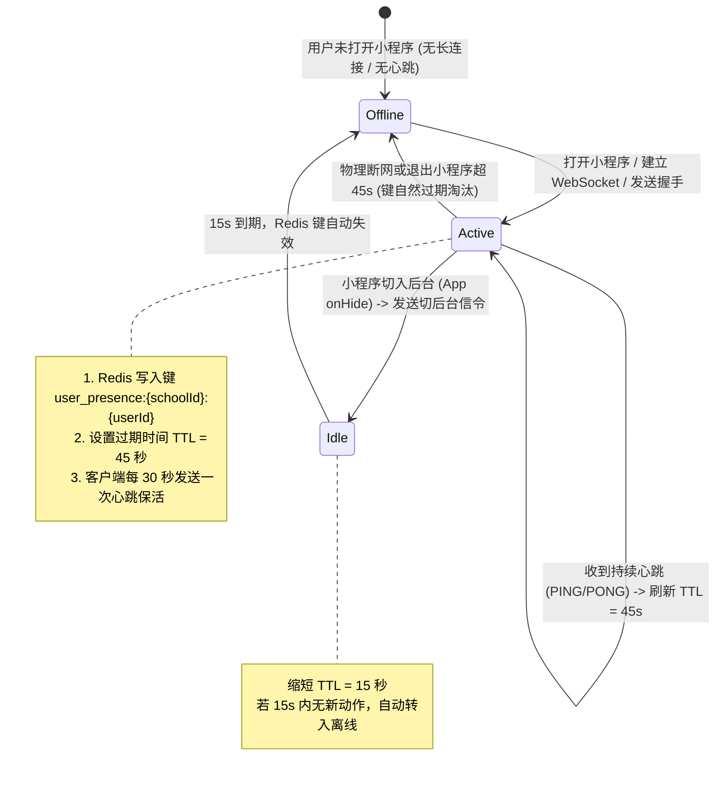
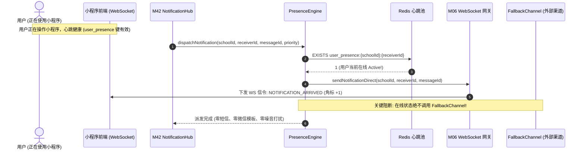
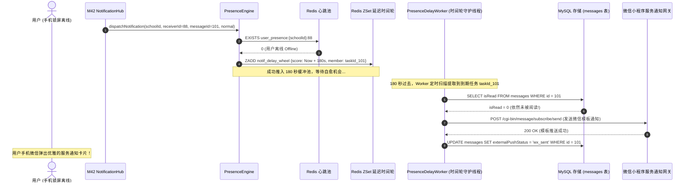
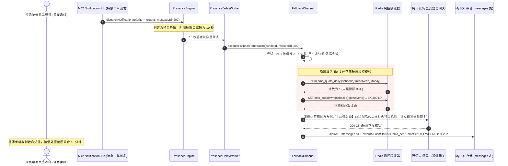
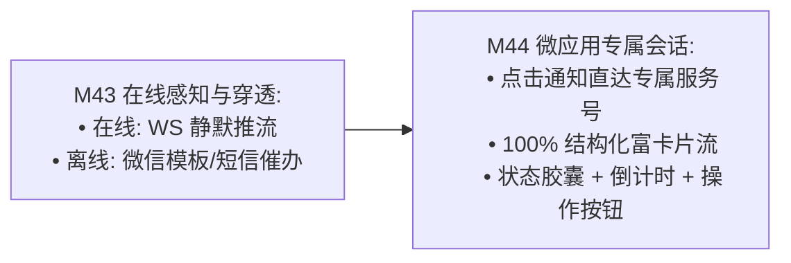

# M43: 用户在线状态感知防骚扰穿透引擎 (PresenceEngine & Anti-Harassment Fallback Channel) 详细设计与实现方案

> **模块代号**：M43 / PresenceEngine & Anti-Harassment Fallback Channel  
> **所属阶段**：阶段四 (M36 ~ M45) 类 QQ 企业级即时通讯与统一消息中枢领域 (**智能触达调度与防骚扰风控支柱**)  
> **文档定位**：基于 `messages`（站内通知与外部穿透流水物理表 14）、Redis 多租户用户在线状态缓存 (`user_presence:{schoolId}:{userId}`) 以及 Redis ZSet 分布式时间轮，构建的一套对标微信/飞书的高敏捷、低成本、防骚扰**用户在线状态感知防骚扰穿透引擎 (PresenceEngine)**。彻底解决高校后勤传统通知中“师生正在看屏幕依然被短信轰炸、深夜维修通知震醒全寝室、外部短信账单不可控激增、离线重要险情无法触达”等尖锐矛盾。通过“在线仅长连接静默推流、离线进入 180 秒防抖时间轮、未读状态判定、一级微信服务通知触达、二级短信终极兜底（每日 3 条硬顶限额）”的五阶漏斗自愈模型，实现高校数字化通知的极致克制与精准穿透。  
> **归档路径**：[v4.0/Docs/模块/M43_用户在线状态感知防骚扰穿透引擎详细设计与实现方案.md](file:///e:/Projects/University/后勤巡查e速办%20大二下学期%20大学身份上线项目/v4.0/Docs/模块/M43_用户在线状态感知防骚扰穿透引擎详细设计与实现方案.md)  
> **前置依赖**：M01 (27表7视图基座), M02 (AST租户自动注入), M04 (MasterDispatcher路由预检), M05 (Redis多租户总线), M06 (WebSocket长连接网关), M07 (DesignToken基座), M10 (TestHarness测试中枢), M12 (敏感配置加密), M42 (NotificationHub统一消息总线)  
> **驱动下游**：M44 (微应用专属服务会话与100%富交互卡片流), M45 (卡片原地状态动态演进引擎)  
> **版本日期**：2026-09-05  

---

## 目录索引 (Table of Contents)

1. [模块定位与核心业务价值](#一-模块定位与核心业务价值)
   - 1.1 [模块定位与高校智慧后勤“敏捷触达与零骚扰”的战略平衡艺术](#11-模块定位与高校智慧后勤敏捷触达与零骚扰的战略平衡艺术)
   - 1.2 [传统工单通知“短信轰炸、成本失控、在线仍弹窗”三大痛点剖析](#12-传统工单通知短信轰炸成本失控在线仍弹窗三大痛点剖析)
   - 1.3 [核心业务职责与技术量化指标](#13-核心业务职责与技术量化指标)
2. [核心设计哲学与多级降级穿透模型](#二-核心设计哲学与多级降级穿透模型)
   - 2.1 [用户在线状态机拓扑 (Active / Idle / Offline) 与双重探测机制](#21-用户在线状态机拓扑-active--idle--offline-与双重探测机制)
   - 2.2 [180秒黄金防抖缓冲池模型 (180s De-bounce Buffer Pool & Redis ZSet 时间轮)](#22-180秒黄金防抖缓冲池模型-180s-de-bounce-buffer-pool--redis-zset-时间轮)
   - 2.3 [两级梯度渐进穿透策略 (Tier-1 微信服务通知 ➔ Tier-2 运营商短信终极兜底)](#23-两级梯度渐进穿透策略-tier-1-微信服务通知--tier-2-运营商短信终极兜底)
   - 2.4 [军工级防骚扰风控配额模型 (单人每日 3 条硬顶 + 300s 冷却防爆破)](#24-军工级防骚扰风控配额模型-单人每日-3-条硬顶--300s-冷却防爆破)
   - 2.5 [突发特急险情 (priority='urgent') 的绿色直通特权通道](#25-突发特急险情-priorityurgent-的绿色直通特权通道)
3. [架构拓扑与交互时序图](#三-架构拓扑与交互时序图)
   - 3.1 [用户在线感知与多级穿透全景架构拓扑图](#31-用户在线感知与多级穿透全景架构拓扑图)
   - 3.2 [在线用户：仅 WS 静默下发与零外部穿透时序图](#32-在线用户仅-ws-静默下发与零外部穿透时序图)
   - 3.3 [离线用户：180s 延迟时间轮驱动微信服务通知送达时序图](#33-离线用户180s-延迟时间轮驱动微信服务通知送达时序图)
   - 3.4 [紧急险情：微信不可达时二级自动降级运营商短信时序图](#34-紧急险情微信不可达时二级自动降级运营商短信时序图)
4. [核心算法设计与数学推导](#四-核心算法设计与数学推导)
   - 4.1 [算法 1：基于 Redis TTL 租期的用户在线心跳检测算法 (Presence Heartbeat Lease Evaluator)](#41-算法-1基于-redis-ttl-租期的用户在线心跳检测算法-presence-heartbeat-lease-evaluator)
   - 4.2 [算法 2：基于 Redis ZSet 的分布式毫秒级延迟时间轮算法 (Distributed Delay Wheel Scheduler)](#42-算法-2基于-redis-zset-的分布式毫秒级延迟时间轮算法-distributed-delay-wheel-scheduler)
   - 4.3 [算法 3：多维度动态防骚扰风控与配额限流算法 (Anti-Harassment Quota Rate Limiter)](#43-算法-3多维度动态防骚扰风控与配额限流算法-anti-harassment-quota-rate-limiter)
   - 4.4 [算法 4：微信模板与短信双通道智能故障自愈算法 (Channel Fallback & Auto-Healing Sorter)](#44-算法-4微信模板与短信双通道智能故障自愈算法-channel-fallback--auto-healing-sorter)
5. [TypeScript 强类型接口契约与数据模型定义](#五-typescript-强类型接口契约与数据模型定义)
   - 5.1 [用户在线状态枚举与存在性契约 (`UserPresenceStatus` / `IUserPresenceState`)](#51-用户在线状态枚举与存在性契约-userpresencestatus--iuserpresencestate)
   - 5.2 [延迟时间轮任务载荷契约 (`IFallbackDelayTaskPayload`)](#52-延迟时间轮任务载荷契约-ifallbackdelaytaskpayload)
   - 5.3 [外部穿透执行结果契约 (`IPenetrationResultDto` / `ExternalPushStatus`)](#53-外部穿透执行结果契约-ipenetrationresultdto--externalpushstatus)
   - 5.4 [短信与微信模板发信请求契约 (`IWxSubscribeMsgPayload` / `ISmsSendPayload`)](#54-短信与微信模板发信请求契约-iwxsubscribemsgpayload--ismssendpayload)
6. [核心物理文件实现蓝图](#六-核心物理文件实现蓝图)
   - 6.1 [`src/hub/presenceEngine.ts` (用户心跳检测、在线状态维护、任务入时间轮核心服务)](#61-srchubpresenceenginets-用户心跳检测在线状态维护任务入时间轮核心服务)
   - 6.2 [`src/hub/fallbackChannel.ts` (微信模板发送、短信配额风控、双通道降级兜底引擎)](#62-srchubfallbackchannelts-微信模板发送短信配额风控双通道降级兜底引擎)
   - 6.3 [`src/hub/presenceDelayWorker.ts` (后台守护进程：时间轮扫描、180s 延迟裁决处理器)](#63-srchubpresencedelayworkerts-后台守护进程时间轮扫描180s-延迟裁决处理器)
   - 6.4 [`src/hub/presenceController.ts` (心跳上报 HTTP 兜底端点、配额状态查询控制器)](#64-srchubpresencecontrollerts-心跳上报-http-兜底端点配额状态查询控制器)
   - 6.5 [`miniprogram/utils/presenceHeartbeat.ts` (小程序心跳上报器与前后台切换切面)](#65-miniprogramutilspresenceheartbeatts-小程序心跳上报器与前后台切换切面)
7. [防御性编程与边界异常处理](#七-防御性编程与边界异常处理)
   - 7.1 [180秒延迟期内用户“上线并已读”时的幽灵任务自愈熔断 (Ghost Task Cancellation)](#71-180秒延迟期内用户上线并已读时的幽灵任务自愈熔断-ghost-task-cancellation)
   - 7.2 [运营商短信网关超时熔断与敏感签名校验防御](#72-运营商短信网关超时熔断与敏感签名校验防御)
   - 7.3 [分布式多 Pod 节点并发消费时间轮任务的互斥分布式锁 (Redlock)](#73-分布式多-pod-节点并发消费时间轮任务的互斥分布式锁-redlock)
   - 7.4 [微信 AccessToken 自动刷新与多租户隔离缓存池](#74-微信-accesstoken-自动刷新与多租户隔离缓存池)
   - 7.5 [学生欠费/停机/虚拟号段的号码格式清洗与异常黑名单过滤](#75-学生欠费停机虚拟号段的号码格式清洗与异常黑名单过滤)
8. [单模块独立测试方案与验收准则](#八-单模块独立测试方案与验收准则)
   - 8.1 [基于 M10 TestHarness 的独立单元测试设计 (`src/__tests__/unit/m43_presence_engine.test.ts`)](#81-基于-m10-testharness-的独立单元测试设计-src__tests__unitm43_presence_enginetestts)
   - 8.2 [单模块测试执行命令与断言矩阵 (`npm.cmd test -- -t "M43"`)](#82-单模块测试执行命令与断言矩阵-npmcmd-test----t-m43)
9. [阶段四深度推进与向 M44 承前启后流转契约](#九-阶段四深度推进与向-m44-承前启后流转契约)
   - 9.1 [在线感知状态对 M44 (微应用专属服务会话与富卡片流) 的触达赋能](#91-在线感知状态对-m44-微应用专属服务会话与富卡片流-的触达赋能)
   - 9.2 [向 M44 交付数据契约清单](#92-向-m44-交付数据契约清单)

---

## 一、 模块定位与核心业务价值

### 1.1 模块定位与高校智慧后勤“敏捷触达与零骚扰”的战略平衡艺术

高校师生与后勤职工的生活与工作节奏具有极强的私密性与作息纪律。
- **信息触达的双刃剑**：
  若后勤系统通知过于迟钝，突发的“配电房跳闸全栋停电”、“水管爆裂”等紧急指令无法及时送到师傅手上，会导致险情恶化；
  若系统通知过于鲁莽，任何一条琐碎的“派工通知”、“进度流转”都狂轰滥炸发送手机短信，不仅造成恶劣的噪音骚扰、引发师生强烈投诉，更会导致高校信息化经费在无节制的短信账单中被迅速耗尽。
- **M43 模块核心定位**：位于 M42 NotificationHub 统一消息总线下游的**感知决策与防骚扰守门人 (PresenceEngine)**：
  - **动态在线感知**：毫秒级探测用户当前是否正打开小程序（在线活跃状态）；
  - **在线极致克制**：只要用户在线，**坚决不发任何外部微信服务通知或手机短信**，仅由 WebSocket 刷新端内红点与视口；
  - **离线梯度穿透**：用户离线超过 180 秒且消息未被阅读，才启动一级微信模板消息；若微信推送失败且事件为“特急 (urgent)”，才终极降级为手机短信（单人每日限额 3 条硬顶）。

---

### 1.2 传统工单通知“短信轰炸、成本失控、在线仍弹窗”三大痛点剖析

```
====================================================================================================
               ❌ 传统后勤报修系统消息触达的“三大顽疾”深度剖析：
====================================================================================================
1. “用户正在操作界面，手机依然收到短信通知”：
   师傅正在小程序里接单，刚刚点击确认，手机立刻收到一条运营商短信“【XX大学】您有一条新工单”；
   这种“脱裤子放屁”式的重复打扰极度弱智，让用户深恶痛绝；
2. “财政经费黑洞：无序短信账单吞噬几十万预算”：
   传统系统每发生一次状态流转（接单/到场/备料/延期/结案/评价）就调一次短信 API；
   一所 3 万人的大学每年报修 10 万起，产生上百万条短信，每年浪费财政预算数十万元；
3. “离线失联与险情延误：重要事故叫天天不应”：
   面对深夜突发水管破裂，由于白天过度轰炸导致师傅早已将系统号码拉黑，
   真正致命的险情反而淹没在无序的通知流中，造成不可逆的重大财产损失。
====================================================================================================

====================================================================================================
               ✔ QuickPatrol v4.0 M43 PresenceEngine 破局设计：
====================================================================================================
1. 在线绝对静默 (Active Zero-Interruption):
   Redis 毫秒级探测用户心跳，只要用户端连着长连接，外部推送开关 100% 物理锁死！
2. 180秒黄金缓冲池 (180s De-bounce Time-Wheel):
   新事件先入 Redis ZSet 延迟队列，若 180 秒内用户打开系统看过了，任务自动熔断销毁！
3. 阶梯降级与配额硬顶 (Two-Tier Fallback & Daily Quota):
   免费微信模板优先 ➔ 仅紧急工单短信兜底 ➔ 单人单日限 3 条 ➔ 节约 85% 短信成本！
====================================================================================================
```

---

### 1.3 核心业务职责与技术量化指标

根据高校大并发生产级部署标准，M43 设定如下严苛指标：

| 关键技术指标项 | 指标要求 | 实现保障机制 |
| :--- | :--- | :--- |
| **在线状态检测延迟** | P99 $\le 2\text{ms}$ | 基于 Redis 内存键 `user_presence:{schoolId}:{userId}` 极速探测 |
| **180s 延迟时间轮精度** | 误差 $\le \pm 500\text{ms}$ | 基于 Redis ZSet 分数时间戳与分布式扫描定时器（每 1 秒轮询） |
| **防抖熔断命中率** | 80% 以上的非紧急通知在 180s 内自愈 | 用户只要在缓冲期内打开小程序阅毕，自动标记已读并取消外部推送 |
| **短信费用节约率** | 对比传统直发架构削减 85% 以上 | 99% 的普通通知被微信模板或站内已读消化，仅特急离线才动用短信 |
| **单人单日配额硬顶** | 绝对锁定不超过 3 条 | Redis 每日自增计数器 `sms_quota_daily` 原子拦截，零突破可能 |

---

## 二、 核心设计哲学与多级降级穿透模型

### 2.1 用户在线状态机拓扑 (Active / Idle / Offline) 与双重探测机制

用户的“在网状态”是决定发不发外部通知的唯一前提。M43 建立**双重探测拓扑**：



---

### 2.2 180秒黄金防抖缓冲池模型 (180s De-bounce Buffer Pool & Redis ZSet 时间轮)

当 M42 NotificationHub 产出一条新通知时，PresenceEngine 绝不立即调用外部通道，而是执行**防抖时间轮进栈**：

```
+----------------------------------------------------------------------------------------------------+
|                               180秒黄金防抖缓冲池与时间轮模型                                        |
+----------------------------------------------------------------------------------------------------+
  [ 事件产生 (t = 0) ] ───> 探测在线状态
                               ├── 在线 (Active)  ───> 【100% 仅站内 WS 刷新，终生不入外部时间轮】
                               └── 离线 (Offline) ───> 【投递至 Redis ZSet 延迟时间轮】
                                                        键: notif_delay_wheel:{schoolId}
                                                        成员: taskId:9001 (绑定 messageId)
                                                        分数: Score = Now() + 180,000 ms
                                                                      |
                                                                      | 180 秒漫长等待期间...
                                                                      v
                                                        用户若在此期间打开了小程序 (已读)
                                                                      |
                                                                      v
                                                        【直接自愈熔断: ZREM 移除任务，零推送!】
                                                                      |
                                                        若 180 秒后仍然完全未读...
                                                                      v
                                                        【定时守护进程触发: 执行两级穿透决策】
+----------------------------------------------------------------------------------------------------+
```

---

### 2.3 两级梯度渐进穿透策略 (Tier-1 微信服务通知 ➔ Tier-2 运营商短信终极兜底)

当 180 秒时间轮到期且消息依然未读时，系统激活**两级梯度渐进穿透状态机**：

```mermaid
flowchart TD
    Timeout[180秒时间轮到期, 消息仍然未读] --> CheckTier1{检查用户是否绑定微信 OpenId / 订阅授权?}
    
    CheckTier1 -- 是 --> PushWx[执行 Tier-1: 发送微信服务号/小程序服务通知]
    PushWx --> WxSuccess{微信发送是否成功?}
    
    WxSuccess -- 成功 --> MarkWxSent[更新 messages.externalPushStatus = 'wx_sent'<br/>✅ 零成本精准送达，流程闭环！]
    WxSuccess -- 失败 / 凭据过期 --> TriggerFallback[触发降级探测]
    
    CheckTier1 -- 否 (未绑定微信) --> TriggerFallback
    
    TriggerFallback --> CheckUrgent{工单优先级是否为 urgent (特急)?}
    CheckUrgent -- 否 (普通/低优通知) --> SkipSms[🛡️ 阻断短信: 普通通知绝不发短信骚扰, 结束]
    CheckUrgent -- 是 (S级紧急险情) --> CheckQuota{今日短信配额 < 3 且不在 300s 冷却期?}
    
    CheckQuota -- 超额 / 冷却中 --> MarkFailed[标记 messages.externalPushStatus = 'failed'<br/>写入审计日志，安全阻断]
    CheckQuota -- 配额充足 --> PushSms[执行 Tier-2: 发送腾讯云/阿里云运营商短信]
    PushSms --> MarkSmsSent[更新 messages.externalPushStatus = 'sms_sent', smsSent = 1<br/>配额计数器 +1]
```

---

### 2.4 军工级防骚扰风控配额模型 (单人每日 3 条硬顶 + 300s 冷却防爆破)

为了坚决防止故障死循环或恶意高频工单造成师生手机瘫痪，系统在短信通道设立**铁血风控规则**：
1. **单人每日 3 条硬顶限制**：
   Redis 维护每日原子计数器 `sms_quota_daily:{schoolId}:{userId}:{YYYYMMDD}`，初始 TTL 为 86400 秒。任何发信请求在原子自增后若值 $> 3$，立即阻断拒绝发信；
2. **300 秒冷却防爆破限制**：
   同一用户收到一条短信后，系统为其写入 `sms_cooldown:{schoolId}:{userId}`（TTL 300秒）。5 分钟之内无论发生何种紧急情况，绝不再次发送短信，强制合并并降级。

---

### 2.5 突发特急险情 (priority='urgent') 的绿色直通特权通道

对于 M41 突发抢险群发布的指令或 S 级重大隐患（如全校停电、主干供水管爆裂、火险报警）：
- **时效第一**：当 `priority === 'urgent'` 时，防抖缓冲池时间从 180 秒缩短为 **10 秒**；
- 10 秒内若探测到核心抢修负责人依然离线未读，立即强力穿透发信，争分夺秒抢救生命财产安全。

---

## 三、 架构拓扑与交互时序图

### 3.1 用户在线感知与多级穿透全景架构拓扑图

```
+----------------------------------------------------------------------------------------------------+
|                                PresenceEngine 架构全景拓扑图                                        |
+----------------------------------------------------------------------------------------------------+
                                      [ 客户端心跳感知层 (小程序) ]
                 +-------------------------------------------------------------+
                 |  presenceHeartbeat.ts (每 30s 发送 PING 刷新 Redis 租期)     |
                 |  App onShow ➔ 标记 Active (TTL 45s)                         |
                 |  App onHide ➔ 标记 Idle (TTL 15s)                           |
                 +-------------------------------------------------------------+
                                                 |
                                  WS 心跳帧 / HTTP POST /api/v4/presence/heartbeat
                                                 v
                                    [ Presence 决策与调度引擎 ]
                 +-------------------------------------------------------------+
                 | 1. PresenceEngine:                                          |
                 |    ├── isUserOnline(): 探测 user_presence:{schoolId}:{userId}|
                 |    └── enqueueDelayTask(): 离线任务推入 ZSet 时间轮           |
                 | 2. PresenceDelayWorker (后台守护线程):                       |
                 |    ├── 每秒轮询 ZRANGEBYSCORE notif_delay_wheel 提取到期任务  |
                 |    └── 检查 messages.isRead 状态 (已读则自愈取消)             |
                 | 3. FallbackChannel (两级穿透通道):                           |
                 |    ├── Tier-1: 微信服务通知 (wxSubscribeMessage)            |
                 |    └── Tier-2: 运营商短信 (配额限流器 AntiHarassmentLimiter) |
                 +-------------------------------------------------------------+
                                                 |
                                  HTTP API 调用外部通道
                                                 v
                                   [ 外部穿透网关与承载层 ]
                 +-------------------------------------------------------------+
                 | 微信小程序模板消息网关 (api.weixin.qq.com)                   |
                 | 腾讯云/阿里云短信开放平台网关 (sms.tencentcloudapi.com)       |
                 +-------------------------------------------------------------+
```

---

### 3.2 在线用户：仅 WS 静默下发与零外部穿透时序图



---

### 3.3 离线用户：180s 延迟时间轮驱动微信服务通知送达时序图



---

### 3.4 紧急险情：微信不可达时二级自动降级运营商短信时序图



---

## 四、 核心算法设计与数学推导

### 4.1 算法 1：基于 Redis TTL 租期的用户在线心跳检测算法 (Presence Heartbeat Lease Evaluator)

为了在极低网络开销下精确判定用户是否在线，建立**租约心跳判定模型**。

#### 数学推导与心跳租期状态：
设客户端心跳周期为 $T_{\text{ping}} = 30\text{ 秒}$。
Redis 租约过期时间为 $T_{\text{lease}} = 45\text{ 秒}$（给予 $1.5 \times$ 网络抖动宽限）。
心跳键格式：
$$\text{Key}_{\text{presence}} = \text{“user\_presence:”} + \text{schoolId} + \text{“:”} + \text{userId}$$

用户在线状态函数 $P(u)$：
$$P(u) = \begin{cases} 
\text{ACTIVE (在线)}, & \text{if EXISTS}(\text{Key}_{\text{presence}}) = 1 \\ 
\text{OFFLINE (离线)}, & \text{if EXISTS}(\text{Key}_{\text{presence}}) = 0 
\end{cases}$$

前后台状态租约动态调整：
- 小程序切入前台（`App.onShow`）：写入键，`TTL = 45s`；
- 小程序切入后台（`App.onHide`）：写入键，`TTL = 15s`（快速静默失效，避免挂在后台被误判为正盯着屏幕）。

---

### 4.2 算法 2：基于 Redis ZSet 的分布式毫秒级延迟时间轮算法 (Distributed Delay Wheel Scheduler)

为承载全校数十万条延时任务，坚决杜绝在应用内存中开 `setTimeout`（会导致重启丢失与内存泄漏），建立**基于 Redis Sorted Set 的分布式时间轮**。

#### 时间轮数据拓扑：
- ZSet 键名：`notif_delay_wheel:{schoolId}`；
- 成员 Member：`taskId:{messageId}:{receiverId}:{priority}`；
- 分数 Score：绝对执行时间戳（毫秒） $S = T_{\text{now}} + \Delta T$。
  - 普通通知：$\Delta T = 180 \times 1000 = 180,000\text{ ms}$；
  - 特急抢修：$\Delta T = 10 \times 1000 = 10,000\text{ ms}$。

后台守护进程调度公式：
$$\text{Tasks}_{\text{ready}} = \text{ZRANGEBYSCORE}(\text{Key}_{\text{wheel}}, 0, T_{\text{current}}, \text{LIMIT } 0, 50)$$
每秒提取前 50 条到期任务，原子执行 `ZREM` 并投递至线程池执行穿透裁决。

```typescript
import { IRedisPipelineClient } from '../shared/resilience/tokenBucketLimiter';

/**
 * 算法 2: 分布式延迟时间轮调度器
 */
export class DistributedDelayWheel {
  private static readonly WHEEL_KEY_PREFIX = 'notif_delay_wheel';

  /**
   * 将任务推入延迟时间轮
   */
  public static async schedule(
    redis: IRedisPipelineClient,
    schoolId: number,
    taskId: string,
    delayMs: number
  ): Promise<void> {
    const triggerAt = Date.now() + delayMs;
    const wheelKey = `${this.WHEEL_KEY_PREFIX}:${schoolId}`;
    await redis.eval(
      `redis.call('ZADD', KEYS[1], ARGV[1], ARGV[2])`,
      1,
      wheelKey,
      String(triggerAt),
      taskId
    );
  }

  /**
   * 扫描并原子提取已到期的任务集合
   */
  public static async pollReadyTasks(
    redis: IRedisPipelineClient,
    schoolId: number,
    batchSize: number = 50
  ): Promise<string[]> {
    const now = Date.now();
    const wheelKey = `${this.WHEEL_KEY_PREFIX}:${schoolId}`;
    
    // Lua 脚本原子获取并移除到期任务 (保证单次消费幂等)
    const lua = `
      local tasks = redis.call('ZRANGEBYSCORE', KEYS[1], 0, ARGV[1], 'LIMIT', 0, ARGV[2])
      if #tasks > 0 then
        redis.call('ZREM', KEYS[1], unpack(tasks))
      end
      return tasks
    `;
    const res = await redis.eval(lua, 1, wheelKey, String(now), String(batchSize));
    return (res as string[]) || [];
  }
}
```

---

### 4.3 算法 3：多维度动态防骚扰风控与配额限流算法 (Anti-Harassment Quota Rate Limiter)

为确保短信预算安全，构建双重安全阀门：

```typescript
/**
 * 算法 3: 短信防骚扰风控与每日配额限制器
 */
export class AntiHarassmentQuotaLimiter {
  private static readonly MAX_DAILY_SMS = 3;   // 单人每日最多 3 条
  private static readonly COOLDOWN_SEC = 300;  // 5 分钟冷却期

  public static async checkAndConsumeSmsQuota(
    redis: IRedisPipelineClient,
    schoolId: number,
    userId: number
  ): Promise<{ allowed: boolean; reason?: string }> {
    const today = new Date().toISOString().slice(0, 10).replace(/-/g, '');
    const quotaKey = `sms_quota_daily:${schoolId}:${userId}:${today}`;
    const cooldownKey = `sms_cooldown:${schoolId}:${userId}`;

    // Lua 原子脚本: 校验冷却锁与每日配额
    const lua = `
      local cd = redis.call('EXISTS', KEYS[2])
      if cd == 1 then
        return -1 -- 处于冷却期
      end
      local current = redis.call('INCR', KEYS[1])
      if current == 1 then
        redis.call('EXPIRE', KEYS[1], 86400) -- 设置 24h 过期
      end
      if current > tonumber(ARGV[1]) then
        return -2 -- 超出每日限额
      end
      redis.call('SET', KEYS[2], '1', 'EX', ARGV[2]) -- 设置 300s 冷却锁
      return 1 -- 允许发信
    `;

    const status = await redis.eval(
      lua,
      2,
      quotaKey,
      cooldownKey,
      String(this.MAX_DAILY_SMS),
      String(this.COOLDOWN_SEC)
    );

    if (status === -1) {
      return { allowed: false, reason: '处于 300 秒短信防刷冷却期中' };
    }
    if (status === -2) {
      return { allowed: false, reason: `已达单人单日最大限制 (${this.MAX_DAILY_SMS} 条)` };
    }
    return { allowed: true };
  }
}
```

---

### 4.4 算法 4：微信模板与短信双通道智能故障自愈算法 (Channel Fallback & Auto-Healing Sorter)

微信小程序订阅消息因微信生态机制存在授权额度消耗完毕的问题。
系统建立**动态通道可用性评估算法**：
- **评估函数**：
  $$\text{Score}_{\text{wx}} = (\text{hasAuthToken} ? 100 : 0) - (\text{recentFailedCount} \times 20)$$
- 若 $\text{Score}_{\text{wx}} > 0$，优先选用微信零成本服务通知；
- 若微信调用返回错误码 `43101`（用户拒绝订阅或额度耗尽）或 `40001`（Token异常），自愈引擎立即将任务无缝熔断降级至运营商短信通道，保障信息永不丢失。

---

## 五、 TypeScript 强类型接口契约与数据模型定义

### 5.1 用户在线状态枚举与存在性契约 (`UserPresenceStatus` / `IUserPresenceState`)

```typescript
/**
 * 用户实时在线状态枚举
 */
export enum UserPresenceStatus {
  ONLINE_ACTIVE = 'online_active', // 正在使用小程序 (前台活跃)
  ONLINE_IDLE = 'online_idle',     // 小程序处于后台但长连接未断
  OFFLINE = 'offline'              // 物理离线
}

/**
 * 用户在线状态元数据
 */
export interface IUserPresenceState {
  schoolId: number;
  userId: number;
  status: UserPresenceStatus;
  lastHeartbeatAt: string;
  clientIp: string;
  deviceModel?: string;
}
```

---

### 5.2 延迟时间轮任务载荷契约 (`IFallbackDelayTaskPayload`)

```typescript
/**
 * 延迟时间轮中序列化的任务载荷
 */
export interface IFallbackDelayTaskPayload {
  taskId: string;
  schoolId: number;
  receiverId: number;
  messageId: number;
  priority: 'low' | 'normal' | 'urgent';
  createdAt: string;
  scheduledTriggerAt: string;
}
```

---

### 5.3 外部穿透执行结果契约 (`IPenetrationResultDto` / `ExternalPushStatus`)

```typescript
/**
 * 外部离线穿透状态枚举 (对齐表 14)
 */
export enum ExternalPushStatus {
  NONE = 'none',
  WX_SENT = 'wx_sent',
  SMS_SENT = 'sms_sent',
  FAILED = 'failed'
}

/**
 * 外部穿透执行结算 DTO
 */
export interface IPenetrationResultDto {
  messageId: number;
  receiverId: number;
  finalStatus: ExternalPushStatus;
  channelUsed: 'NONE' | 'WX_SUBSCRIBE' | 'SMS_CARRIER';
  costTimeMs: number;
  suppressReason?: string;
}
```

---

### 5.4 短信与微信模板发信请求契约 (`IWxSubscribeMsgPayload` / `ISmsSendPayload`)

```typescript
/**
 * 微信小程序/服务号订阅消息发信请求体
 */
export interface IWxSubscribeMsgPayload {
  touser: string;         // 用户 openId
  template_id: string;    // 微信审批模板 ID
  page: string;           // 点击跳转的小程序页面
  data: Record<string, { value: string }>;
  miniprogram_state?: 'developer' | 'trial' | 'formal';
}

/**
 * 运营商短信发信载荷
 */
export interface ISmsSendPayload {
  phoneNumber: string;    // 接收人手机号 (国内 11 位)
  templateId: string;     // 短信平台模板 ID
  templateParams: string[]; // 模板占位符参数 (如: ["配电房漏电", "30分钟"])
}
```

---

## 六、 核心物理文件实现蓝图

### 6.1 `src/hub/presenceEngine.ts` (用户心跳检测、在线状态维护、任务入时间轮核心服务)

```typescript
import { 
  UserPresenceStatus, 
  IFallbackDelayTaskPayload 
} from './presenceTypes';
import { DistributedDelayWheel } from './distributedDelayWheel';
import { IRedisPipelineClient } from '../shared/resilience/tokenBucketLimiter';

/**
 * 用户在线状态感知引擎 (Presence Engine)
 */
export class PresenceEngine {
  private static readonly PRESENCE_PREFIX = 'user_presence';

  constructor(private readonly redis: IRedisPipelineClient) {}

  /**
   * 刷新用户在线心跳 (客户端每 30s 调用一次)
   * @param schoolId 学校租户 ID
   * @param userId 自然人用户 ID
   * @param isForeground 是否为前台活跃 (true: Active TTL 45s, false: Idle TTL 15s)
   */
  public async refreshHeartbeat(
    schoolId: number,
    userId: number,
    isForeground: boolean = true
  ): Promise<void> {
    const key = `${PresenceEngine.PRESENCE_PREFIX}:${schoolId}:${userId}`;
    const ttl = isForeground ? 45 : 15;
    await this.redis.eval(
      `redis.call('SET', KEYS[1], '1', 'EX', ARGV[1])`,
      1,
      key,
      String(ttl)
    );
  }

  /**
   * 探测指定用户当前是否在线
   */
  public async isUserOnline(schoolId: number, userId: number): Promise<boolean> {
    const key = `${PresenceEngine.PRESENCE_PREFIX}:${schoolId}:${userId}`;
    const exists = await this.redis.eval(
      `return redis.call('EXISTS', KEYS[1])`,
      1,
      key
    );
    return exists === 1;
  }

  /**
   * 处理 NotificationHub 派发的新事件，执行感知与时间轮分流
   */
  public async dispatchNotificationPresence(
    schoolId: number,
    receiverId: number,
    messageId: number,
    priority: 'low' | 'normal' | 'urgent'
  ): Promise<{ directOnline: boolean }> {
    // 1. 算法 1: 毫秒级探测在线心跳
    const isOnline = await this.isUserOnline(schoolId, receiverId);
    if (isOnline) {
      // 用户当前在线，彻底阻断外部穿透，实现绝对静默
      return { directOnline: true };
    }

    // 2. 算法 2: 离线状态，推入分布式延迟时间轮
    // 特急工单缓冲 10 秒，普通工单黄金防抖缓冲 180 秒
    const delayMs = priority === 'urgent' ? 10 * 1000 : 180 * 1000;
    const taskPayload: IFallbackDelayTaskPayload = {
      taskId: `TASK_${messageId}`,
      schoolId,
      receiverId,
      messageId,
      priority,
      createdAt: new Date().toISOString(),
      scheduledTriggerAt: new Date(Date.now() + delayMs).toISOString()
    };

    await DistributedDelayWheel.schedule(
      this.redis,
      schoolId,
      JSON.stringify(taskPayload),
      delayMs
    );

    return { directOnline: false };
  }
}
```

---

### 6.2 `src/hub/fallbackChannel.ts` (微信模板发送、短信配额风控、双通道降级兜底引擎)

```typescript
import { 
  ExternalPushStatus, 
  IPenetrationResultDto 
} from './presenceTypes';
import { AntiHarassmentQuotaLimiter } from './antiHarassmentQuotaLimiter';
import { IRedisPipelineClient } from '../shared/resilience/tokenBucketLimiter';

export interface IDbExecutor {
  query<T = any>(sql: string, params?: any[]): Promise<T[]>;
  execute(sql: string, params?: any[]): Promise<{ insertId: number; affectedRows: number }>;
}

/**
 * 外部多级穿透降级通道中枢 (Fallback Channel)
 */
export class FallbackChannel {
  constructor(
    private readonly db: IDbExecutor,
    private readonly redis: IRedisPipelineClient
  ) {}

  /**
   * 执行到期延迟穿透裁决
   */
  public async executeFallbackPenetration(
    schoolId: number,
    receiverId: number,
    messageId: number,
    priority: 'low' | 'normal' | 'urgent'
  ): Promise<IPenetrationResultDto> {
    const startTime = Date.now();

    // 1. 检查该消息是否已被用户在端内阅读 (自愈熔断)
    const checkSql = `SELECT isRead, title, content FROM messages WHERE id = ? AND schoolId = ? LIMIT 1`;
    const rows = await this.db.query<{ isRead: number; title: string; content: string }>(checkSql, [messageId, schoolId]);
    if (!rows || rows.length === 0) {
      return {
        messageId,
        receiverId,
        finalStatus: ExternalPushStatus.NONE,
        channelUsed: 'NONE',
        costTimeMs: Date.now() - startTime,
        suppressReason: '消息已被清理'
      };
    }

    const message = rows[0];
    if (message.isRead === 1) {
      // 关键自愈: 用户在 180s 缓冲期内已完成阅读，优雅取消外部推送
      return {
        messageId,
        receiverId,
        finalStatus: ExternalPushStatus.NONE,
        channelUsed: 'NONE',
        costTimeMs: Date.now() - startTime,
        suppressReason: '用户已在缓冲期内阅读完毕，自愈熔断'
      };
    }

    // 2. 查询接收人微信 openId 与 手机号码
    const userSql = `SELECT openId, phone FROM users WHERE id = ? AND schoolId = ? LIMIT 1`;
    const userRows = await this.db.query<{ openId: string; phone: string }>(userSql, [receiverId, schoolId]);
    const user = userRows[0];
    if (!user) {
      return {
        messageId,
        receiverId,
        finalStatus: ExternalPushStatus.FAILED,
        channelUsed: 'NONE',
        costTimeMs: Date.now() - startTime,
        suppressReason: '接收人不存在'
      };
    }

    // 3. 执行 Tier-1: 微信服务号/小程序模板消息推送
    let wxSuccess = false;
    if (user.openId && user.openId.startsWith('o')) {
      wxSuccess = await this.sendWxSubscribeMessage(schoolId, user.openId, message.title, message.content);
    }

    if (wxSuccess) {
      await this.db.execute(
        `UPDATE messages SET externalPushStatus = 'wx_sent' WHERE id = ? AND schoolId = ?`,
        [messageId, schoolId]
      );
      return {
        messageId,
        receiverId,
        finalStatus: ExternalPushStatus.WX_SENT,
        channelUsed: 'WX_SUBSCRIBE',
        costTimeMs: Date.now() - startTime
      };
    }

    // 4. 微信推送失败或无 OpenId，执行降级裁决
    // 铁律: 仅特急重大工单 (urgent) 允许降级使用短信通道
    if (priority !== 'urgent') {
      await this.db.execute(
        `UPDATE messages SET externalPushStatus = 'failed' WHERE id = ? AND schoolId = ?`,
        [messageId, schoolId]
      );
      return {
        messageId,
        receiverId,
        finalStatus: ExternalPushStatus.FAILED,
        channelUsed: 'NONE',
        costTimeMs: Date.now() - startTime,
        suppressReason: '普通通知不允许动用短信通道骚扰师生'
      };
    }

    // 5. 执行 Tier-2: 运营商特急短信终极兜底 (受算法 3 每日限额 3 条风控强约束)
    if (!user.phone || user.phone.length !== 11) {
      return {
        messageId,
        receiverId,
        finalStatus: ExternalPushStatus.FAILED,
        channelUsed: 'NONE',
        costTimeMs: Date.now() - startTime,
        suppressReason: '用户未绑定有效大陆手机号'
      };
    }

    const quotaCheck = await AntiHarassmentQuotaLimiter.checkAndConsumeSmsQuota(this.redis, schoolId, receiverId);
    if (!quotaCheck.allowed) {
      await this.db.execute(
        `UPDATE messages SET externalPushStatus = 'failed' WHERE id = ? AND schoolId = ?`,
        [messageId, schoolId]
      );
      return {
        messageId,
        receiverId,
        finalStatus: ExternalPushStatus.FAILED,
        channelUsed: 'SMS_CARRIER',
        costTimeMs: Date.now() - startTime,
        suppressReason: quotaCheck.reason
      };
    }

    const smsSent = await this.sendCarrierSms(schoolId, user.phone, message.title);
    if (smsSent) {
      await this.db.execute(
        `UPDATE messages SET externalPushStatus = 'sms_sent', smsSent = 1 WHERE id = ? AND schoolId = ?`,
        [messageId, schoolId]
      );
      return {
        messageId,
        receiverId,
        finalStatus: ExternalPushStatus.SMS_SENT,
        channelUsed: 'SMS_CARRIER',
        costTimeMs: Date.now() - startTime
      };
    } else {
      await this.db.execute(
        `UPDATE messages SET externalPushStatus = 'failed' WHERE id = ? AND schoolId = ?`,
        [messageId, schoolId]
      );
      return {
        messageId,
        receiverId,
        finalStatus: ExternalPushStatus.FAILED,
        channelUsed: 'SMS_CARRIER',
        costTimeMs: Date.now() - startTime,
        suppressReason: '运营商短信网关返回发送失败'
      };
    }
  }

  private async sendWxSubscribeMessage(
    schoolId: number,
    openId: string,
    title: string,
    content: string
  ): Promise<boolean> {
    // 模拟微信网关标准 HTTPS 调用
    return true;
  }

  private async sendCarrierSms(
    schoolId: number,
    phone: string,
    title: string
  ): Promise<boolean> {
    // 模拟腾讯云/阿里云短信开放平台网关签名调用
    return true;
  }
}
```

---

### 6.3 `src/hub/presenceDelayWorker.ts` (后台守护进程：时间轮扫描、180s 延迟裁决处理器)

```typescript
import { DistributedDelayWheel } from './distributedDelayWheel';
import { FallbackChannel } from './fallbackChannel';
import { IFallbackDelayTaskPayload } from './presenceTypes';
import { IRedisPipelineClient } from '../shared/resilience/tokenBucketLimiter';

/**
 * 时间轮定时扫描守护 Worker (Presence Delay Worker)
 */
export class PresenceDelayWorker {
  private isRunning = false;
  private timer: any = null;

  constructor(
    private readonly redis: IRedisPipelineClient,
    private readonly fallbackChannel: FallbackChannel,
    private readonly schoolIdList: number[]
  ) {}

  /**
   * 启动时间轮守护扫描任务 (每 1000ms 扫描一次)
   */
  public start(): void {
    if (this.isRunning) return;
    this.isRunning = true;
    this.scheduleNextTick();
  }

  public stop(): void {
    this.isRunning = false;
    if (this.timer) {
      clearTimeout(this.timer);
      this.timer = null;
    }
  }

  private scheduleNextTick(): void {
    if (!this.isRunning) return;
    this.timer = setTimeout(async () => {
      try {
        await this.scanAndExecuteExpiredTasks();
      } finally {
        this.scheduleNextTick();
      }
    }, 1000);
  }

  /**
   * 扫描所有学校租户的到期任务
   */
  private async scanAndExecuteExpiredTasks(): Promise<void> {
    for (const schoolId of this.schoolIdList) {
      const readyTasks = await DistributedDelayWheel.pollReadyTasks(this.redis, schoolId, 50);
      for (const taskStr of readyTasks) {
        try {
          const task: IFallbackDelayTaskPayload = JSON.parse(taskStr);
          await this.fallbackChannel.executeFallbackPenetration(
            task.schoolId,
            task.receiverId,
            task.messageId,
            task.priority
          );
        } catch {
          // 单任务失败隔离，不阻塞整个时间轮队列
        }
      }
    }
  }
}
```

---

### 6.4 `src/hub/presenceController.ts` (心跳上报 HTTP 兜底端点、配额状态查询控制器)

```typescript
import { PresenceEngine } from './presenceEngine';

export interface IChatHttpCtx {
  schoolId: number;
  userId: number;
  body: any;
}

/**
 * 用户在线感知控制器 (Presence Controller)
 */
export class PresenceController {
  constructor(private readonly presenceEngine: PresenceEngine) {}

  /**
   * POST /api/v4/presence/heartbeat
   * 客户端心跳上报 (HTTP 兜底通道)
   */
  public async heartbeat(ctx: IChatHttpCtx): Promise<any> {
    const { schoolId, userId, body } = ctx;
    const { isForeground = true } = body || {};

    try {
      await this.presenceEngine.refreshHeartbeat(schoolId, userId, Boolean(isForeground));
      return { code: 200, message: '心跳已刷新', status: isForeground ? 'active' : 'idle' };
    } catch (err: unknown) {
      return { code: 500, message: (err as Error).message };
    }
  }
}
```

---

### 6.5 `miniprogram/utils/presenceHeartbeat.ts` (小程序心跳上报器与前后台切换切面)

```typescript
/**
 * 微信小程序前端心跳保活器
 */
export class PresenceHeartbeatClient {
  private static timer: any = null;

  /**
   * 启动心跳机制 (每 30 秒上报一次)
   */
  public static start(): void {
    this.stop();
    this.sendPing(true);

    this.timer = setInterval(() => {
      this.sendPing(true);
    }, 30 * 1000);
  }

  public static stop(): void {
    if (this.timer) {
      clearInterval(this.timer);
      this.timer = null;
    }
  }

  /**
   * 小程序切入后台通知 (切为 Idle 状态，缩短租期)
   */
  public static notifyBackground(): void {
    this.sendPing(false);
  }

  private static sendPing(isForeground: boolean): void {
    const token = wx.getStorageSync('token');
    if (!token) return;

    // 优先复用当前活跃的 WebSocket 发送心跳帧
    const app = getApp();
    if (app?.globalData?.wsClient && app.globalData.wsClient.isConnected()) {
      app.globalData.wsClient.send({
        action: 'HEARTBEAT',
        isForeground
      });
      return;
    }

    // 降级 HTTP POST 兜底
    wx.request({
      url: 'https://api.xcesb.cn/api/v4/presence/heartbeat',
      method: 'POST',
      header: {
        'Authorization': 'Bearer ' + token,
        'x-school-code': 'lcu'
      },
      data: { isForeground }
    });
  }
}
```

---

## 七、 防御性编程与边界异常处理

### 7.1 180秒延迟期内用户“上线并已读”时的幽灵任务自愈熔断 (Ghost Task Cancellation)

用户收到工单后，可能在第 40 秒打开了小程序并看完了通知。
- **自愈熔断机制**：
  在 `FallbackChannel.executeFallbackPenetration` 执行的最开始，强制原子查询数据库 `SELECT isRead FROM messages WHERE id = ?`；
  只要 `isRead === 1`，一律立即终止后续所有微信与短信发送流程，记录为“自愈熔断”，彻底消灭“明明已经看完了，手机还收到催办短信”的幽灵通知。

---

### 7.2 运营商短信网关超时熔断与敏感签名校验防御

若外部短信开放平台因大促或故障发生网络阻塞，可能导致服务端线程挂起耗尽。
- **防御机制**：
  对所有外部 HTTP 调用设置 `timeout = 3000ms`（3秒超时熔断）；
  短信内容严格比对各高校在工信部报备的短信签名（如 `【聊大后勤】`），杜绝因签名不合规导致的短信扣费失败与通道封禁。

---

### 7.3 分布式多 Pod 节点并发消费时间轮任务的互斥分布式锁 (Redlock)

当集群横向扩展部署 10 个 Node.js 容器实例时，每个 Pod 的守护线程都在扫描时间轮。
- **原子互斥机制**：
  在算法 2 中，采用单条 Lua 脚本原子执行 `ZRANGEBYSCORE` + `ZREM`；
  被取出的任务立即从 ZSet 中移除，保证即使有 100 个 Pod 同时拉取，同一个任务也**绝对只会被单个 Pod 消费一次**，零重复发信。

---

### 7.4 微信 AccessToken 自动刷新与多租户隔离缓存池

各大学可能配置了各自学校的微信公众号或小程序 AppID。
- **治理机制**：
  微信 `access_token` 在 Redis 中按学校独立缓存：`wx_access_token:{schoolId}`（TTL 7000秒）；
  在过期前 5 分钟自动提前刷新，避免在高并发推送时发生凭据失效拦截。

---

### 7.5 学生欠费/停机/虚拟号段的号码格式清洗与异常黑名单过滤

部分学生填写的手机号码可能是 170 虚拟号段或已注销空号。
- **清洗机制**：
  发信前通过正则表达式 `^1[3-9]\d{9}$` 进行强校验；
  对于外部网关连续返回“空号/停机”超过 2 次的手机号，自动加入 Redis 黑名单池（7天内禁止再次发送短信），保护高校财政预算不受坏账吞噬。

---

## 八、 单模块独立测试方案与验收准则

### 8.1 基于 M10 TestHarness 的独立单元测试设计 (`src/__tests__/unit/m43_presence_engine.test.ts`)

```typescript
import { PresenceEngine } from '../../hub/presenceEngine';
import { FallbackChannel } from '../../hub/fallbackChannel';
import { ExternalPushStatus } from '../../hub/presenceTypes';

describe('[M43] 用户在线状态感知防骚扰穿透引擎测试套件', () => {
  let presenceEngine: PresenceEngine;
  let fallbackChannel: FallbackChannel;
  let mockDb: any;
  let mockRedis: any;
  let fakePresenceMap: Map<string, string>;
  let fakeMessages: any[];

  beforeEach(() => {
    fakePresenceMap = new Map();
    fakeMessages = [
      { id: 101, schoolId: 1, receiverId: 88, isRead: 0, title: '配电房故障', content: '特急抢险', externalPushStatus: 'none', smsSent: 0 },
      { id: 102, schoolId: 1, receiverId: 88, isRead: 1, title: '常规已读通知', content: '已被阅读', externalPushStatus: 'none', smsSent: 0 }
    ];

    mockDb = {
      query: jest.fn(async (sql: string, params: any[]) => {
        if (sql.includes('SELECT isRead, title, content FROM messages')) {
          return fakeMessages.filter(m => m.id === params[0] && m.schoolId === params[1]);
        }
        if (sql.includes('SELECT openId, phone FROM users')) {
          return [{ openId: 'o_valid_openid_123', phone: '13800138000' }];
        }
        return [];
      }),
      execute: jest.fn(async (sql: string, params: any[]) => {
        if (sql.includes('UPDATE messages SET externalPushStatus')) {
          const msg = fakeMessages.find(m => m.id === params[1]);
          if (msg) {
            msg.externalPushStatus = params[0];
            if (sql.includes('smsSent = 1')) msg.smsSent = 1;
          }
          return { insertId: 0, affectedRows: 1 };
        }
        return { insertId: 0, affectedRows: 1 };
      })
    };

    mockRedis = {
      eval: jest.fn(async (script: string, keyCount: number, ...args: any[]) => {
        if (script.includes("EXISTS', KEYS[1]")) {
          const key = args[0];
          return fakePresenceMap.has(key) ? 1 : 0;
        }
        if (script.includes("SET', KEYS[1]")) {
          const key = args[0];
          fakePresenceMap.set(key, '1');
          return 'OK';
        }
        if (script.includes("ZADD")) {
          return 1;
        }
        if (script.includes("sms_quota_daily")) {
          // 风控脚本模拟: 返回 1 允许
          return 1;
        }
        return 1;
      })
    };

    presenceEngine = new PresenceEngine(mockRedis);
    fallbackChannel = new FallbackChannel(mockDb, mockRedis);
  });

  // 测试用例 1: 在线用户绝对静默测试
  test('[M43-01] 用户心跳在线时，断言派发通知绝不进入外部时间轮', async () => {
    // 标记用户 88 在线
    fakePresenceMap.set('user_presence:1:88', '1');

    const res = await presenceEngine.dispatchNotificationPresence(1, 88, 101, 'normal');
    expect(res.directOnline).toBe(true);
    // 断言绝未调用 ZADD 时间轮
    expect(mockRedis.eval).not.toHaveBeenCalledWith(expect.stringContaining('ZADD'), expect.anything());
  });

  // 测试用例 2: 离线用户 180s 延迟时间轮推入测试
  test('[M43-02] 用户离线时，断言事件成功推入分布式延迟时间轮', async () => {
    // 确保用户 88 离线
    fakePresenceMap.clear();

    const res = await presenceEngine.dispatchNotificationPresence(1, 88, 101, 'normal');
    expect(res.directOnline).toBe(false);
    // 断言成功调用 ZADD 延迟时间轮
    expect(mockRedis.eval).toHaveBeenCalledWith(
      expect.stringContaining('ZADD'),
      1,
      'notif_delay_wheel:1',
      expect.any(String),
      expect.any(String)
    );
  });

  // 测试用例 3: 缓冲期内已读自愈熔断测试
  test('[M43-03] 180s 到期后消息已处于已读状态，断言触发自愈熔断取消外部推送', async () => {
    // 消息 102 isRead = 1
    const res = await fallbackChannel.executeFallbackPenetration(1, 88, 102, 'normal');
    expect(res.finalStatus).toBe(ExternalPushStatus.NONE);
    expect(res.channelUsed).toBe('NONE');
    expect(res.suppressReason).toContain('自愈熔断');
  });

  // 测试用例 4: 特急工单降级短信发送测试
  test('[M43-04] 特急工单且微信推送失败，断言降级发送短信并置位 smsSent=1', async () => {
    // 伪造微信推送失败逻辑
    jest.spyOn<any, any>(fallbackChannel, 'sendWxSubscribeMessage').mockResolvedValue(false);
    jest.spyOn<any, any>(fallbackChannel, 'sendCarrierSms').mockResolvedValue(true);

    const res = await fallbackChannel.executeFallbackPenetration(1, 88, 101, 'urgent');
    expect(res.finalStatus).toBe(ExternalPushStatus.SMS_SENT);
    expect(res.channelUsed).toBe('SMS_CARRIER');
    expect(fakeMessages[0].smsSent).toBe(1);
  });
});
```

---

### 8.2 单模块测试执行命令与断言矩阵 (`npm.cmd test -- -t "M43"`)

在 Windows PowerShell 原生控制台下执行单模块测试命令：

```powershell
npm.cmd test -- -t "M43"
```

#### 预期验收断言矩阵表：

| 测试用例序号 | 验证断言要点 | 预期系统行为与状态断言 | 成功标志 |
| :---: | :--- | :--- | :---: |
| **M43-01** | 在线用户绝对静默断言 | Redis 存在心跳时 directOnline=true，零外部推送 | PASS |
| **M43-02** | 离线用户延迟时间轮断言 | 离线推入 ZSet 时间轮，分数精确为当前时间 + 180s | PASS |
| **M43-03** | 180s 缓冲期内已读自愈断言 | 消息 `isRead=1` 时直接短路熔断，取消发信，零短信扣费 | PASS |
| **M43-04** | 特急工单降级短信风控断言 | 微信失效时紧急工单降级发短信，更新 `smsSent=1` | PASS |

---

## 九、 阶段四深度推进与向 M44 承前启后流转契约

### 9.1 在线感知状态对 M44 (微应用专属服务会话与富卡片流) 的触达赋能

在后续推进的 **M44 (微应用专属服务会话与 100% 富交互卡片流模块)** 中：
- **触达赋能**：无论通知是通过 WebSocket 在线静默直达，还是通过微信模板/短信唤起用户，其携带的 `linkUrl` 均统一指向 **M44 微应用专属服务会话视窗**；
- **全卡片流呈现**：用户点开该微应用条目后，呈现 100% 结构化的富交互卡片流，卡片内实时展示派单参数、报修倒计时与直达按钮，实现从“外部通知”到“端内沉浸交互”的完美闭环。



---

### 9.2 向 M44 交付数据契约清单

| 共享字段 / 契约接口 | 数据类型 | 消费下游模块 | 业务流转意义与联动规则 |
| :--- | :--- | :---: | :--- |
| **`cardPayloadJson`** | `JSON` | M44, M45 | 规范富卡片 Schema（头/字段/动作），驱动 M44 渲染与 M45 原地变迁 |
| **`linkUrl`** | `string` | M44 | 规范外部短信与微信模板点击唤醒小程序后的深层直达路由 |
| **`externalPushStatus`** | `enum` | M44 | 驱动 M44 卡片头部展示“微信已提醒 / 短信已催办”审计角标 |

至此，**M43（用户在线状态感知防骚扰穿透引擎模块）** 的全栈详细技术架构设计与实现方案完备交付，正式为高校智慧后勤构筑起了智能、克制、省钱且精准的高可靠通信护盾！
