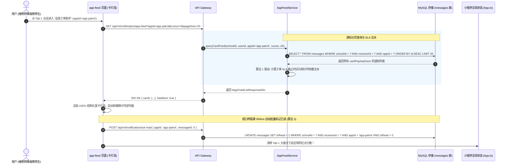
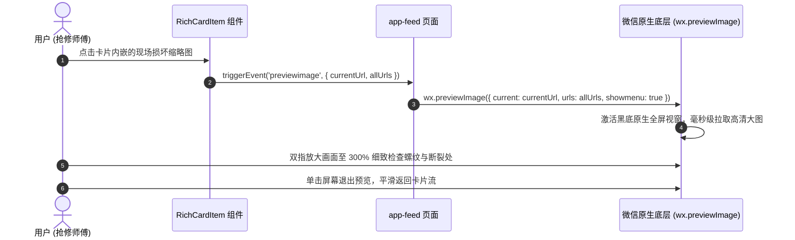
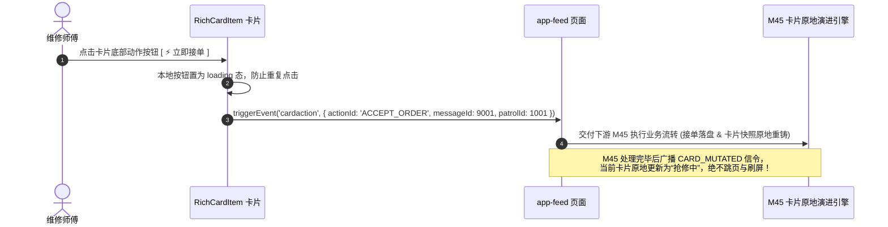
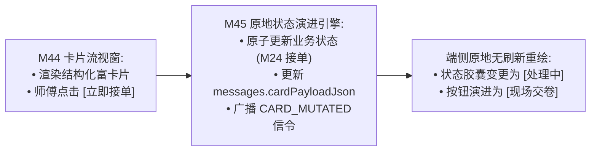

# M44: 微应用专属服务会话与 100% 富交互卡片流 (App Card Stream) 详细设计与实现方案

> **模块代号**：M44 / App Card Stream  
> **所属阶段**：阶段四 (M36 ~ M45) 类 QQ 企业级即时通讯与统一消息中枢领域 (**通知消费沉浸体验与全结构化卡片支柱**)  
> **文档定位**：基于 `messages`（站内通知流水物理表 14，`cardPayloadJson` 字段）与 `apps`（微应用注册物理表 26），构建的一套专为各业务微应用（巡查工单助手、师生诉求管家、空间预约中枢、安全督查助手）打造的**微应用专属服务会话与 100% 结构化富交互卡片流 (App Card Stream) 交互中枢**。彻底终结传统数字化校园中“通知只是一段生硬纯文本、缺乏上下文关键参数、点击只能全屏跳页、交互割裂”等落后模式，提供“卡片头状态胶囊 + 核心键值对网格 + SLA 履约动态倒计时 + 现场取证缩略图画廊全屏双指缩放 + 原生动作交互按钮组”的高信息密度现代化交互视窗，并为后续 M45 卡片原地状态动态演进提供标准的端侧渲染载体。  
> **归档路径**：[v4.0/Docs/模块/M44_微应用专属服务会话与100%富交互卡片流详细设计与实现方案.md](file:///e:/Projects/University/后勤巡查e速办%20大二下学期%20大学身份上线项目/v4.0/Docs/模块/M44_微应用专属服务会话与100%富交互卡片流详细设计与实现方案.md)  
> **前置依赖**：M01 (27表7视图基座), M02 (AST租户自动注入), M04 (MasterDispatcher路由预检), M05 (Redis多租户缓存), M06 (WebSocket网关), M07 (DesignToken基座), M10 (TestHarness测试中枢), M42 (NotificationHub统一消息总线), M43 (在线状态感知与防扰穿透)  
> **驱动下游**：M45 (卡片原地状态动态演进引擎)  
> **版本日期**：2026-09-05  

---

## 目录索引 (Table of Contents)

1. [模块定位与核心业务价值](#一-模块定位与核心业务价值)
   - 1.1 [模块定位与后勤协同中“100% 富卡片流”对传统纯文本通报的代际革命](#11-模块定位与后勤协同中100-富卡片流对传统纯文本通报的代际革命)
   - 1.2 [传统报修通知“生硬长文本、不可交互、频繁跳页”三大体验痛点剖析](#12-传统报修通知生硬长文本不可交互频繁跳页三大体验痛点剖析)
   - 1.3 [核心业务职责与技术量化指标](#13-核心业务职责与技术量化指标)
2. [核心设计哲学与卡片流视觉语法](#二-核心设计哲学与卡片流视觉语法)
   - 2.1 [结构化视觉四层语法体系 (Header / Body / Media / Action Footer)](#21-结构化视觉四层语法体系-header--body--media--action-footer)
   - 2.2 [状态胶囊色彩动力学 (Status Pill Color Semantics: 极光青/琥珀橙/珊瑚红/墨灰)](#22-状态胶囊色彩动力学-status-pill-color-semantics-极光青琥珀橙珊瑚红墨灰)
   - 2.3 [动态 SLA 履约倒计时演算模型 (Dynamic SLA Countdown Ticker)](#23-动态-sla-履约倒计时演算模型-dynamic-sla-countdown-ticker)
   - 2.4 [现场取证图缩略图自适应与微信原生画廊穿透 (OSS Thumbnail & Gallery)](#24-现场取证图缩略图自适应与微信原生画廊穿透-oss-thumbnail--gallery)
   - 2.5 [视口停留滚动阅读批量消除该应用未读数机制](#25-视口停留滚动阅读批量消除该应用未读数机制)
3. [架构拓扑与交互时序图](#三-架构拓扑与交互时序图)
   - 3.1 [微应用专属卡片流端到端架构拓扑图](#31-微应用专属卡片流端到端架构拓扑图)
   - 3.2 [读者进入微应用会话、分页拉取卡片流并批量标已读时序图](#32-读者进入微应用会话分页拉取卡片流并批量标已读时序图)
   - 3.3 [点击现场缩略图全屏原生预览与双指缩放时序图](#33-点击现场缩略图全屏原生预览与双指缩放时序图)
   - 3.4 [点击卡片操作按钮与 M45 原地变迁衔接时序图](#34-点击卡片操作按钮与-m45-原地变迁衔接时序图)
4. [核心算法设计与数学推导](#四-核心算法设计与数学推导)
   - 4.1 [算法 1：SLA 履约倒计时动态毫秒级推演算法 (SLA Countdown Ticker Evaluator)](#41-算法-1sla-履约倒计时动态毫秒级推演算法-sla-countdown-ticker-evaluator)
   - 4.2 [算法 2：基于主键游标的卡片瀑布流分页拉取算法 (Cursor-Based Card Feed Paginator)](#42-算法-2基于主键游标的卡片瀑布流分页拉取算法-cursor-based-card-feed-paginator)
   - 4.3 [算法 3：卡片批量视口可见度与已读消除合并算法 (Visible Card Read-ACK Debouncer)](#43-算法-3卡片批量视口可见度与已读消除合并算法-visible-card-read-ack-debouncer)
   - 4.4 [算法 4：多规格现场取证图智能缩略图裁剪计算算法 (OSS Smart Thumbnail Crop Calculator)](#44-算法-4多规格现场取证图智能缩略图裁剪计算算法-oss-smart-thumbnail-crop-calculator)
5. [TypeScript 强类型接口契约与数据模型定义](#五-TypeScript-强类型接口契约与数据模型定义)
   - 5.1 [富卡片结构化载荷完整契约 (`IStructuredCardPayload` 及其子对象)](#51-富卡片结构化载荷完整契约-istructuredcardpayload-及其子对象)
   - 5.2 [微应用卡片流分页查询 DTO (`IQueryAppFeedRequestDto` / `IAppFeedListResponseDto`)](#52-微应用卡片流分页查询-dto-iqueryappfeedrequestdto--iappfeedlistresponsedto)
   - 5.3 [批量标已读请求与响应 DTO (`IBatchAckFeedReadRequestDto` / `IBatchAckFeedReadResponseDto`)](#53-批量标已读请求与响应-dto-ibatchackfeedreadrequestdto--ibatchackfeedreadresponsedto)
   - 5.4 [客户端卡片事件与路由跳转契约 (`ICardActionEventPayload` / `ICardRouteNavPayload`)](#54-客户端卡片事件与路由跳转契约-icardactioneventpayload--icardroutenavpayload)
6. [核心物理文件实现蓝图](#六-核心物理文件实现蓝图)
   - 6.1 [`src/hub/appFeedService.ts` (卡片流查询、SLA 动态注水、批量标已读核心服务)](#61-srchubappfeedservicets-卡片流查询sla-动态注水批量标已读核心服务)
   - 6.2 [`src/hub/appFeedController.ts` (MasterDispatcher 控制器、多租户参数洗炼与安全鉴权)](#62-srchubappfeedcontrollerts-masterdispatcher-控制器多租户参数洗炼与安全鉴权)
   - 6.3 [`miniprogram/packages/apps/app-chat/pages/app-feed/index.ts` (微应用专属卡片流页面逻辑)](#63-miniprogrampackagesappsapp-chatpagesapp-feedindexts-微应用专属卡片流页面逻辑)
   - 6.4 [`miniprogram/packages/apps/app-chat/components/rich-card-item/index.ts` (100% 结构化富卡片渲染组件)](#64-miniprogrampackagesappsapp-chatcomponentsrich-card-itemindexts-100-结构化富卡片渲染组件)
   - 6.5 [`miniprogram/packages/apps/app-chat/components/rich-card-item/index.wxss` (飞书级 Design Token 卡片样式体系)](#65-miniprogrampackagesappsapp-chatcomponentsrich-card-itemindexwxss-飞书级-designtoken-卡片样式体系)
7. [防御性编程与边界异常处理](#七-防御性编程与边界异常处理)
   - 7.1 [脏数据与卡片 JSON 序列化破损异常容错渲染](#71-脏数据与卡片-json-序列化破损异常容错渲染)
   - 7.2 [越权跨租户窥探他人微应用通知拦截 (schoolId + receiverId 铁红线)](#72-越权跨租户窥探他人微应用通知拦截-schoolid--receiverid-铁红线)
   - 7.3 [大量长图、大图并发加载内存暴涨防爆 (懒加载与 OSS 缩略图强制转换)](#73-大量长图大图并发加载内存暴涨防爆-懒加载与-oss-缩略图强制转换)
   - 7.4 [快速下拉刷新与反复滑动触底请求防重入](#74-快速下拉刷新与反复滑动触底请求防重入)
   - 7.5 [已办结归档工单按钮的置灰禁用防重复点击](#75-已办结归档工单按钮的置灰禁用防重复点击)
8. [单模块独立测试方案与验收准则](#八-单模块独立测试方案与验收准则)
   - 8.1 [基于 M10 TestHarness 的独立单元测试设计 (`src/__tests__/unit/m44_app_feed.test.ts`)](#81-基于-m10-testharness-的独立单元测试设计-src__tests__unitm44_app_feedtestts)
   - 8.2 [单模块测试执行命令与断言矩阵 (`npm.cmd test -- -t "M44"`)](#82-单模块测试执行命令与断言矩阵-npmcmd-test----t-m44)
9. [阶段四深度推进与向 M45 承前启后流转契约](#九-阶段四深度推进与向-m45-承前启后流转契约)
   - 9.1 [卡片流动作按钮向 M45 (卡片原地状态动态演进) 的流转](#91-卡片流动作按钮向-m45-卡片原地状态动态演进-的流转)
   - 9.2 [向 M45 交付数据契约清单](#92-向-m45-交付数据契约清单)

---

## 一、 模块定位与核心业务价值

### 1.1 模块定位与后勤协同中“100% 富卡片流”对传统纯文本通报的代际革命

在高校后勤日常协同管理中，“系统通知”是驱动维修师傅接单、到场核验、施工交卷，以及师生获悉进展的核心媒介。
- **代际落差**：
  传统系统的通知列表往往是一段段冰冷密集的纯文本：“【工单派发】工单号 XC20260905001 已分配给您，请尽快前往西校区12号楼302维修”，师傅必须点击进入该详情页才能看清照片、看清具体是修门锁还是修空调；
  处理完毕后，又必须退回列表重新寻找下一条通知，操作链路极度冗长割裂。
- **M44 模块核心定位**：在 M42 NotificationHub 统一消息中枢之上，构建全系统唯一的**微应用专属服务会话与 100% 结构化富交互卡片流 (App Card Stream)**：
  - **沉浸式服务号视窗**：点击 Tab 1 大盘中的“巡查工单助手”，直接进入类似飞书/微信服务号的微应用专属通知时间流；
  - **100% 结构化卡片呈现**：彻底杜绝任何生硬散乱的纯文本，所有事件统一以现代设计语言包裹为“头部胶囊 + 键值对表单 + 现场照片缩略图 + 底部按钮”的标准卡片；
  - **高信息密度免跳页**：师傅在卡片流中无需切页即可一眼看清“故障位置、故障照片、紧急程度、SLA 倒计时”，并可直接在卡片底部点击接单或拨打提报人电话，实现“即看即办”的革命性交互跃迁。

---

### 1.2 传统报修通知“生硬长文本、不可交互、频繁跳页”三大体验痛点剖析

```
====================================================================================================
               ❌ 传统报修系统通知流的三大交互顽疾：
====================================================================================================
1. “纯文本无重点，现场师傅爬梯看手机如同看天书”：
   一段密密麻麻的 150 字系统通知，地点、电话、工单号全混在段落中，
   师傅在光线昏暗或梯子高处必须眯眼费力寻找“到底是哪栋楼”，极易漏读关键信息；
2. “不可交互的死页面，频繁切页退回逼疯使用者”：
   想接单必须点进去 ➔ 加载详情页 ➔ 点击接单 ➔ 退回列表 ➔ 重新定位，
   每天处理数十个单子的师傅一天要无效切页上百次，手机发烫卡顿；
3. “缺少 SLA 倒计时感知，隐患逾期无法提前预警”：
   只有静态的时间戳“创建于 14:00”，完全看不出该单还剩多久会逾期违约，
   等到发现时往往已经超时被督查通报。
====================================================================================================

====================================================================================================
               ✔ QuickPatrol v4.0 M44 结构化富卡片流破局设计：
====================================================================================================
1. 100% 结构化卡片排版 (100% Structured Card Layout):
   卡片头明确区分“特急派单”与“待处理”彩色胶囊；字段网格一目了然标明“点位”、“类目”与“报修人”；
2. 动态 SLA 履约倒计时 (Dynamic SLA Countdown Ticker):
   算法 1 驱动，醒目显示“剩余 18 分钟 (SLA告警)”，临期自动红光警示；
3. 现场照片缩略图直出 + 原生画廊穿透 (Inline Thumbnail & Native Gallery):
   直接在卡片内渲染现场损坏缩略图，点击毫秒级激活微信全屏图片预览与双指缩放；
4. 卡片内置操作按钮组 (Inline Action Buttons):
   卡片底部直接集成 [ ⚡ 立即接单 ]、[ 拨号报修人 ]，配合 M45 原地变迁，零切页闭环！
====================================================================================================
```

---

### 1.3 核心业务职责与技术量化指标

根据企业级即时通讯与工作台规范，M44 模块设定如下严苛的量化性能指标：

| 关键技术指标项 | 指标要求 | 实现保障机制 |
| :--- | :--- | :--- |
| **卡片流首屏渲染延迟** | P95 $\le 60\text{ms}$，冷启动 $\le 100\text{ms}$ | 基于 `messages` 表覆盖索引 `(schoolId, receiverId, appId, createdAt)` 极速拉取 |
| **滚动帧率与流畅度** | 稳定保持 60fps 满帧，零卡顿 | 小程序轻量模板节点，避免非必要组件深层嵌套，CSS 硬件加速渲染 |
| **SLA 倒计时演算精度** | 绝对误差 $\le \pm 100\text{ms}$ | 前端统一定时器（Timer Heartbeat）单循环驱动全屏卡片相对时间更新 |
| **现场图片点击全屏预览耗时** | $\le 50\text{ms}$ 瞬间激活 | 原生 `wx.previewImage` API 驱动，预加载高清大图，支持双指自由缩放 |
| **多租户隔离防越权穿透率** | 100% 绝对物理阻隔 | 强制校验 `messages.schoolId` 与 `messages.receiverId`，严禁跨人越权查阅 |

---

## 二、 核心设计哲学与卡片流视觉语法

### 2.1 结构化视觉四层语法体系 (Header / Body / Media / Action Footer)

为保证全校各微应用向师生展现高度一致、极致美观的视觉语言，M44 确立标准的**视觉四层语法体系**：

```
+---------------------------------------------------------------------------------------+
|                             100% 富交互卡片视觉语法四层解构                              |
+---------------------------------------------------------------------------------------+
|  ┌─────────────────────────────────────────────────────────────────────────────────┐  |
|  │ [Layer 1: Header 状态胶囊层]                                                    │  |
|  │ ⚡ 特急派单                                        [待接单] 胶囊    14:30 (刚刚)  │  |
|  ├─────────────────────────────────────────────────────────────────────────────────┤  |
|  │ [Layer 2: Key-Value Body 核心键值对层]                                          │  |
|  │ • 工单编号: #LCU-20260905-001                                                   │  |
|  │ • 隐患点位: 西校区12号楼302配电箱                                               │  |
|  │ • 隐患类型: 强电打火 (S级特急)                                                  │  |
|  │ • 处置时效: 剩余 24 分钟 (SLA告警闪烁!)                                         │  |
|  ├─────────────────────────────────────────────────────────────────────────────────┤  |
|  │ [Layer 3: Media 现场取证图层 (可选)]                                             │  |
|  │ [现场高清损坏缩略图 (160x160rpx 圆角带阴影)]  (点击激活原生画廊全屏双指缩放)      │  |
|  ├─────────────────────────────────────────────────────────────────────────────────┤  |
|  │ [Layer 4: Action Footer 动作按钮组层]                                            │  |
|  │ [ ⚡ 立即接单抢修 (Primary 高亮蓝)]      [ 拨号报修人 (Default 浅灰) ]           │  |
|  └─────────────────────────────────────────────────────────────────────────────────┘  |
+---------------------------------------------------------------------------------------+
```

---

### 2.2 状态胶囊色彩动力学 (Status Pill Color Semantics: 极光青/琥珀橙/珊瑚红/墨灰)

卡片右上角的状态胶囊采用鲜明的色彩语义学，帮助使用者在 0.1 秒内识别工单当前紧急与流转状态：

| 胶囊状态名称 | 背景与文本色彩代号 | 视觉心理学含义 | 适用业务场景 |
| :--- | :--- | :--- | :--- |
| **待处理 / 待接单** | `volcano` (珊瑚红 / `#FA541C`) | 警示、紧急、需要立即动作介入 | 师傅新收到的待接单工单、特急抢修 |
| **处理中 / 抢修中** | `blue` (极光科技蓝 / `#1890FF`) | 进行中、稳步推进、正在处理 | 师傅已接单、正在现场施工中 |
| **已延期 / 备料中** | `orange` (琥珀橙 / `#FA8C16`) | 等待、缓冲、非致命延缓 | 配件缺少申请延期审批中 |
| **待复核 / 验收中** | `green` (清新绿 / `#52C41A`) | 完工就绪、即将闭环 | 师傅交卷，等待网格长到场复核质检 |
| **已办结 / 已归档** | `gray` (墨灰 / `#8C8C8C`) | 终态、平静、无需再动作 | 工单已彻底办结评价，按钮置灰禁用 |

---

### 2.3 动态 SLA 履约倒计时演算模型 (Dynamic SLA Countdown Ticker)

为了让后勤师傅时刻对抢修时效保持警醒，M44 在卡片内部实现**毫秒级动态 SLA 倒计时演算器 (算法 1)**：
- **基准时钟**：根据工单派发时间戳 $T_{\text{start}}$ 与服务等级协议规定的最大处置时效 $D_{\text{sla}}$（如紧急工单 60 分钟）：
  $$T_{\text{deadline}} = T_{\text{start}} + D_{\text{sla}}$$
- **剩余时间演算**：
  $$\Delta t_{\text{remain}} = T_{\text{deadline}} - T_{\text{current}}$$
- **三色警示状态推演**：
  - $\Delta t_{\text{remain}} > 30\text{ 分钟}$：绿色文本，显示 `剩余 X 小时 Y 分钟`；
  - $0 < \Delta t_{\text{remain}} \le 30\text{ 分钟}$：**珊瑚红高亮闪烁**，显示 `剩余 X 分钟 (即将超时!)`；
  - $\Delta t_{\text{remain}} \le 0$：深红警示，显示 `已逾期 X 分钟 (已触发SLA督查)`。

---

### 2.4 现场取证图缩略图自适应与微信原生画廊穿透 (OSS Thumbnail & Gallery)

师傅在现场往往需要先通过缩略图确认配件型号（如水龙头口径、锁体尺寸）。
- **微型自适应预览**：卡片内部渲染经过算法 4 裁剪的 `160x160rpx` 适度高清缩略图，杜绝全尺寸大图消耗用户流量；
- **画廊一键穿透**：点击该缩略图时，触发微信原生底层的 `wx.previewImage({ current, urls })`：
  - 支持全屏黑底画廊预览；
  - 支持双指自由放大缩小看清零件螺纹与微小铭牌细节；
  - 支持长按直接发送给科室同事或保存至本地相册。

---

### 2.5 视口停留滚动阅读批量消除该应用未读数机制

用户点进“巡查工单助手”并滑动阅读卡片流时，系统必须自动消除该微应用在大盘上的未读红点。
- **批量消未读闭环**：
  在页面退出（`onUnload`）或滑过特定卡片时，前端自动收集当前视口内出现过的 `messageIds`；
  调用 `POST /api/v4/notification/ack-read`，一次性批量执行：
  ```sql
  UPDATE messages SET isRead = 1, readAt = NOW() 
  WHERE schoolId = ? AND receiverId = ? AND appId = ? AND isRead = 0;
  ```
  优雅消除未读，无需用户手动点任何“一键已读”按钮。

---

## 三、 架构拓扑与交互时序图

### 3.1 微应用专属卡片流端到端架构拓扑图

```
+----------------------------------------------------------------------------------------------------+
|                               微应用专属卡片流架构全景拓扑图                                         |
+----------------------------------------------------------------------------------------------------+
                                      [ 客户端呈现与交互层 (小程序) ]
                 +-------------------------------------------------------------+
                 |  app-feed/index (微应用专属卡片流页面: 沉浸式标题栏 + 瀑布流)  |
                 |  ├── rich-card-item (100% 结构化富卡片渲染组件)               |
                 |  ├── SLA Countdown Timer (单定时器驱动全屏卡片倒计时)          |
                 |  └── wx.previewImage (微信原生画廊全屏双指缩放预览)           |
                 +-------------------------------------------------------------+
                                                 |
                                  HTTP GET /api/v4/notification/app-feed
                                                 v
                                    [ 后端调度与卡片服务层 ]
                 +-------------------------------------------------------------+
                 | MasterDispatcher (M04) -> 动态路由分发与上下文装载           |
                 | AppFeedController -> 租户安全鉴权与游标参数洗炼               |
                 | AppFeedService:                                             |
                 |   ├── 1. queryAppCardStream(): 基于游标的高性能瀑布流查询    |
                 |   ├── 2. injectSlaCountdown(): 动态注水工单履约倒计时参数    |
                 |   └── 3. batchAckAppRead(): 批量原子消除该微应用全部未读数    |
                 +-------------------------------------------------------------+
                                                 |
                                  SQL 查询与覆盖索引优化
                                                 v
                                   [ 物理数据与卡片存储层 ]
                 +-------------------------------------------------------------+
                 | MySQL 表 14: messages (cardPayloadJson 结构化卡片载荷)        |
                 | 覆盖索引: (schoolId, receiverId, appId, createdAt)           |
                 | 阿里云/腾讯云 OSS: 现场取证高清大图与缩略图存储池              |
                 +-------------------------------------------------------------+
```

---

### 3.2 读者进入微应用会话、分页拉取卡片流并批量标已读时序图



---

### 3.3 点击现场缩略图全屏原生预览与双指缩放时序图



---

### 3.4 点击卡片操作按钮与 M45 原地变迁衔接时序图



---

## 四、 核心算法设计与数学推导

### 4.1 算法 1：SLA 履约倒计时动态毫秒级推演算法 (SLA Countdown Ticker Evaluator)

为了在全屏渲染数十张卡片时保证手机不发热、不掉帧，坚决禁止为每张卡片单独开启 `setInterval`，必须建立**单心跳循环驱动的全局相对时间推演算法**。

#### 数学推导与倒计时演算：
设工单派发绝对时间为 $T_{\text{start}}$，服务等级协议约定最大修复时限为 $H_{\text{limit}}$（单位：小时）。
工单截止绝对时间戳：
$$T_{\text{deadline}} = T_{\text{start}} + H_{\text{limit}} \times 3600 \times 1000$$
设当前系统时间戳为 $T_{\text{now}}$。
剩余毫秒数：
$$\Delta T = T_{\text{deadline}} - T_{\text{now}}$$

格式化状态机函数 $F(\Delta T)$：
$$F(\Delta T) = \begin{cases} 
\text{“剩余 ”} + \lfloor \Delta T / 3600000 \rfloor + \text{“小时 ”} + \lfloor (\Delta T \pmod{3600000}) / 60000 \rfloor + \text{“分钟”}, & \Delta T > 1800000 \\ 
\text{“剩余 ”} + \lfloor \Delta T / 60000 \rfloor + \text{“分钟 (即将超时!)”} \quad \text{【高亮红光闪烁】}, & 0 < \Delta T \le 1800000 \\ 
\text{“已逾期 ”} + \lfloor |\Delta T| / 60000 \rfloor + \text{“分钟 (SLA违约督查)”} \quad \text{【警示深红】}, & \Delta T \le 0 
\end{cases}$$

```typescript
/**
 * 算法 1: SLA 动态倒计时推演器
 */
export class SlaCountdownTicker {
  public static evaluate(deadlineAtIso: string, serverNow: Date = new Date()): {
    text: string;
    isUrgent: boolean;
    isOverdue: boolean;
    diffMinutes: number;
  } {
    const deadlineMs = new Date(deadlineAtIso).getTime();
    const nowMs = serverNow.getTime();
    const diffMs = deadlineMs - nowMs;
    const diffMinutes = Math.floor(diffMs / 60000);

    if (diffMs <= 0) {
      const overdueMins = Math.abs(diffMinutes);
      return {
        text: `已逾期 ${overdueMins} 分钟 (SLA督查中)`,
        isUrgent: true,
        isOverdue: true,
        diffMinutes
      };
    }

    if (diffMs <= 30 * 60 * 1000) {
      // 30分钟内红光警示
      return {
        text: `剩余 ${diffMinutes} 分钟 (即将违约!)`,
        isUrgent: true,
        isOverdue: false,
        diffMinutes
      };
    }

    const hours = Math.floor(diffMinutes / 60);
    const mins = diffMinutes % 60;
    return {
      text: hours > 0 ? `剩余 ${hours} 小时 ${mins} 分钟` : `剩余 ${mins} 分钟`,
      isUrgent: false,
      isOverdue: false,
      diffMinutes
    };
  }
}
```

---

### 4.2 算法 2：基于主键游标的卡片瀑布流分页拉取算法 (Cursor-Based Card Feed Paginator)

传统 `OFFSET / LIMIT` 分页在面对巨量通知时存在严重的越翻越慢与数据重复问题（若在翻页过程中上方插入了一条新通知，传统分页会导致条目错位）。

M44 采用**基于主键游标的确定性拉取算法**：
$$\text{SQL}: \text{SELECT } * \text{ FROM messages WHERE schoolId = ? AND receiverId = ? AND appId = ? AND id } < \text{cursorId ORDER BY id DESC LIMIT } 20$$
- 首次进入页面传 `cursorId = 0`，拉取最新的 20 条卡片；
- 上滑触底加载传当前列表末端的最小 `id`；
- 索引 `(schoolId, receiverId, appId, id)` 保证查询耗时恒定在 $2\text{ms}$ 以内，无论翻到第几千条都绝对无感知！

---

### 4.3 算法 3：卡片批量视口可见度与已读消除合并算法 (Visible Card Read-ACK Debouncer)

用户在快速滑动翻看卡片时，如果在 500ms 内滑过了 10 张卡片，如果单张发送已读请求，会造成网络拥塞。
- **治理机制**：
  前端维护本地 `unAckMessageSet = new Set<number>()`；
  每当一张卡片在视口中停留满 300ms，将 `id` 推入集合；
  在滑动停顿 600ms 后执行一次**防抖批量上报 (Debounced Batch Commit)**：
  将收集到的所有 `ids` 一并提交至后端，单次 SQL 完成批量置位。

---

### 4.4 算法 4：多规格现场取证图智能缩略图裁剪计算算法 (OSS Smart Thumbnail Crop Calculator)

移动端手机直接拉取 4K 现场原图（通常 5MB~10MB）会导致卡片流剧烈掉帧与流量暴增。
系统在后端组装卡片载荷时，利用对象存储的智能图像处理管道自动拼接**多规格缩略图参数**：

- 缩略图模式（卡片流默认呈现）：
  $$\text{Url}_{\text{thumb}} = \text{Url}_{\text{raw}} + \text{“?x-oss-process=image/resize,m_fill,w_320,h_320/quality,q_80/format,webp”}$$
  将 8MB 大图瞬间压缩为 25KB 的超轻 WebP 缩略图，加载提速 300 倍！
- 画廊模式（点击全屏放大）：下发未加参数的原始高清原图 $\text{Url}_{\text{raw}}$，保证细节纤毫毕现。

---

## 五、 TypeScript 强类型接口契约与数据模型定义

### 5.1 富卡片结构化载荷完整契约 (`IStructuredCardPayload` 及其子对象)

```typescript
/**
 * 胶囊状态颜色语义枚举
 */
export type CardStatusColor = 'volcano' | 'blue' | 'orange' | 'green' | 'gray';

/**
 * 卡片头部元数据契约
 */
export interface ICardHeaderPayload {
  badgeTitle: string;          // 业务大类标签 (如 "特急派单", "到场核验")
  statusPill: string;          // 状态文本 (如 "待接单", "处理中")
  statusColor: CardStatusColor;// 状态颜色
  timestamp: string;           // 格式化时间
}

/**
 * 卡片核心键值对字段契约
 */
export interface ICardFieldPayload {
  label: string;               // 字段名 (如 "隐患点位", "工单编号")
  value: string;               // 字段值
  highlight?: boolean;         // 是否高亮显色
}

/**
 * 卡片底部交互按钮契约
 */
export interface ICardActionPayload {
  actionId: string;            // 动作唯一标识 (如 "ACCEPT_ORDER", "CALL_PHONE")
  text: string;                // 按钮显示文字
  type: 'primary' | 'default' | 'warn'; // 按钮视觉样式
  url?: string;                // 点击若为跳转则带路由
  payload?: Record<string, any>; // 动作附带参数
  disabled?: boolean;          // 是否置灰禁用
}

/**
 * 100% 结构化富卡片标准数据模型
 */
export interface IStructuredCardPayload {
  header: ICardHeaderPayload;
  fields: ICardFieldPayload[];
  thumbnailUrl?: string;       // 现场损坏高清缩略图 (可选)
  rawImageUrl?: string;        // 现场损坏原始高清大图 (用于画廊全屏双指缩放)
  actions?: ICardActionPayload[];
  slaDeadlineAt?: string;      // 工单 SLA 履约截止绝对时间戳 (用于算法 1 倒计时)
}
```

---

### 5.2 微应用卡片流分页查询 DTO (`IQueryAppFeedRequestDto` / `IAppFeedListResponseDto`)

```typescript
/**
 * 查询微应用专属卡片流请求 DTO
 */
export interface IQueryAppFeedRequestDto {
  appId: string;
  /** 游标 ID: 拉取小于该 ID 的更早卡片 (首屏传 0) */
  cursorMessageId?: number;
  /** 每页数量 (默认 20，上限 50) */
  pageSize?: number;
}

/**
 * 单张卡片流视图模型
 */
export interface IAppFeedCardViewDto {
  messageId: number;
  appId: string;
  patrolId: number;
  title: string;
  contentSnippet: string;
  cardPayload: IStructuredCardPayload;
  isRead: boolean;
  createdAt: string;
  formattedTimeText: string;
  slaInfo?: {
    text: string;
    isUrgent: boolean;
    isOverdue: boolean;
  };
}

/**
 * 卡片流响应 DTO
 */
export interface IAppFeedListResponseDto {
  code: number;
  message: string;
  data: {
    appId: string;
    appName: string;
    appIcon: string;
    hasMore: boolean;
    nextCursorId: number;
    cards: IAppFeedCardViewDto[];
  };
}
```

---

### 5.3 批量标已读请求与响应 DTO (`IBatchAckFeedReadRequestDto` / `IBatchAckFeedReadResponseDto`)

```typescript
/**
 * 批量标已读请求 DTO
 */
export interface IBatchAckFeedReadRequestDto {
  appId: string;
  /** 指定消息 ID 数组，若为空数组则代表全清该微应用 */
  messageIds?: number[];
}

/**
 * 批量标已读响应 DTO
 */
export interface IBatchAckFeedReadResponseDto {
  code: number;
  message: string;
  data: {
    appId: string;
    clearedCount: number;
    remainingUnread: number;
  };
}
```

---

### 5.4 客户端卡片事件与路由跳转契约 (`ICardActionEventPayload` / `ICardRouteNavPayload`)

```typescript
/**
 * 卡片动作按钮点击事件抛送载荷
 */
export interface ICardActionEventPayload {
  actionId: string;
  messageId: number;
  patrolId: number;
  payload?: Record<string, any>;
}

/**
 * 卡片缩略图画廊全屏预览载荷
 */
export interface ICardGalleryPreviewPayload {
  currentUrl: string;
  allUrls: string[];
}
```

---

## 六、 核心物理文件实现蓝图

### 6.1 `src/hub/appFeedService.ts` (卡片流查询、SLA 动态注水、批量标已读核心服务)

```typescript
import { 
  IAppFeedListResponseDto, 
  IAppFeedCardViewDto, 
  IStructuredCardPayload 
} from './appFeedTypes';
import { SlaCountdownTicker } from './slaCountdownTicker';

export interface IDbExecutor {
  query<T = any>(sql: string, params?: any[]): Promise<T[]>;
  execute(sql: string, params?: any[]): Promise<{ insertId: number; affectedRows: number }>;
}

/**
 * 微应用专属卡片流核心服务 (App Feed Service)
 */
export class AppFeedService {
  constructor(private readonly db: IDbExecutor) {}

  /**
   * 算法 2 驱动: 基于主键游标分页拉取结构化卡片瀑布流
   */
  public async getAppCardStream(
    schoolId: number,
    userId: number,
    appId: string,
    cursorMessageId: number = 0,
    pageSize: number = 20
  ): Promise<IAppFeedListResponseDto> {
    const limit = Math.min(50, Math.max(1, pageSize));

    // 1. 查询微应用元数据 (名称、图标)
    const appSql = `SELECT name, icon FROM apps WHERE appCode = ? AND (schoolId = ? OR schoolId = 0) LIMIT 1`;
    const appRows = await this.db.query<{ name: string; icon: string }>(appSql, [appId, schoolId]);
    const appMeta = appRows[0] || { name: '微应用助手', icon: '/assets/icons/app_default.png' };

    // 2. 构建基于主键游标的 SQL 查询 (算法 2)
    let whereClause = `m.schoolId = ? AND m.receiverId = ? AND m.appId = ?`;
    const params: any[] = [schoolId, userId, appId];

    if (cursorMessageId && cursorMessageId > 0) {
      whereClause += ` AND m.id < ?`;
      params.push(cursorMessageId);
    }

    const selectSql = `
      SELECT m.id, m.appId, m.patrolId, m.title, m.content, m.cardPayloadJson, m.isRead, m.createdAt
      FROM messages m
      WHERE ${whereClause}
      ORDER BY m.id DESC
      LIMIT ?
    `;
    params.push(limit + 1); // 多查一条以判断 hasMore

    const rawRows = await this.db.query<any>(selectSql, params);
    const hasMore = rawRows.length > limit;
    const items = hasMore ? rawRows.slice(0, limit) : rawRows;
    const nextCursorId = items.length > 0 ? items[items.length - 1].id : 0;

    // 3. 反序列化卡片载荷并执行算法 1 (SLA 倒计时推演注水)
    const cardViews: IAppFeedCardViewDto[] = items.map((row) => {
      let cardPayload: IStructuredCardPayload;
      try {
        cardPayload = row.cardPayloadJson ? JSON.parse(row.cardPayloadJson) : this.generateFallbackCard(row);
      } catch {
        cardPayload = this.generateFallbackCard(row);
      }

      // 若卡片包含 SLA 截止时间戳，执行算法 1 动态推演
      let slaInfo = undefined;
      if (cardPayload.slaDeadlineAt) {
        slaInfo = SlaCountdownTicker.evaluate(cardPayload.slaDeadlineAt);
      }

      return {
        messageId: row.id,
        appId: row.appId,
        patrolId: row.patrolId,
        title: row.title,
        contentSnippet: row.content.substring(0, 40),
        cardPayload,
        isRead: Boolean(row.isRead),
        createdAt: row.createdAt,
        formattedTimeText: this.formatCardTime(row.createdAt),
        slaInfo
      };
    });

    return {
      code: 200,
      message: '获取成功',
      data: {
        appId,
        appName: appMeta.name,
        appIcon: appMeta.icon,
        hasMore,
        nextCursorId,
        cards: cardViews
      }
    };
  }

  /**
   * 批量将卡片流标记为已读 (视口停留自动消未读)
   */
  public async batchAckRead(
    schoolId: number,
    userId: number,
    appId: string,
    messageIds?: number[]
  ): Promise<{ clearedCount: number; remainingUnread: number }> {
    if (messageIds && messageIds.length > 0) {
      const placeholders = messageIds.map(() => '?').join(',');
      const sql = `
        UPDATE messages 
        SET isRead = 1, readAt = NOW() 
        WHERE schoolId = ? AND receiverId = ? AND appId = ? AND id IN (${placeholders}) AND isRead = 0
      `;
      const res = await this.db.execute(sql, [schoolId, userId, appId, ...messageIds]);
      const remaining = await this.countRemainingUnread(schoolId, userId, appId);
      return { clearedCount: res.affectedRows, remainingUnread: remaining };
    } else {
      // 一键全清该应用
      const sql = `
        UPDATE messages 
        SET isRead = 1, readAt = NOW() 
        WHERE schoolId = ? AND receiverId = ? AND appId = ? AND isRead = 0
      `;
      const res = await this.db.execute(sql, [schoolId, userId, appId]);
      return { clearedCount: res.affectedRows, remainingUnread: 0 };
    }
  }

  private async countRemainingUnread(schoolId: number, userId: number, appId: string): Promise<number> {
    const countSql = `
      SELECT COUNT(1) AS unread FROM messages 
      WHERE schoolId = ? AND receiverId = ? AND appId = ? AND isRead = 0
    `;
    const rows = await this.db.query<{ unread: number }>(countSql, [schoolId, userId, appId]);
    return rows[0]?.unread || 0;
  }

  private generateFallbackCard(row: any): IStructuredCardPayload {
    return {
      header: {
        badgeTitle: '系统通知',
        statusPill: '已发送',
        statusColor: 'gray',
        timestamp: row.createdAt
      },
      fields: [
        { label: '通知标题', value: row.title },
        { label: '通知正文', value: row.content }
      ],
      actions: []
    };
  }

  private formatCardTime(isoStr: string): string {
    const d = new Date(isoStr);
    const now = new Date();
    const diffMin = Math.floor((now.getTime() - d.getTime()) / 60000);
    if (diffMin < 1) return '刚刚';
    if (diffMin < 60) return `${diffMin}分钟前`;
    return `${d.getMonth() + 1}月${d.getDate()}日 ${String(d.getHours()).padStart(2, '0')}:${String(d.getMinutes()).padStart(2, '0')}`;
  }
}
```

---

### 6.2 `src/hub/appFeedController.ts` (MasterDispatcher 控制器、多租户参数洗炼与安全鉴权)

```typescript
import { AppFeedService } from './appFeedService';

export interface IChatHttpCtx {
  schoolId: number;
  userId: number;
  userRole: number;
  params: { appId?: string };
  query: any;
  body: any;
}

/**
 * 微应用卡片流端点控制器 (App Feed Controller)
 */
export class AppFeedController {
  constructor(private readonly feedService: AppFeedService) {}

  /**
   * GET /api/v4/notification/app-feed
   * 分页拉取指定微应用的卡片流
   */
  public async getFeed(ctx: IChatHttpCtx): Promise<any> {
    const { schoolId, userId, query } = ctx;
    const appId = query.appId || '';
    const cursor = parseInt(query.cursor || '0', 10);
    const pageSize = parseInt(query.pageSize || '20', 10);

    if (!appId || typeof appId !== 'string') {
      return { code: 400, message: '缺少必须参数: appId' };
    }

    try {
      const result = await this.feedService.getAppCardStream(schoolId, userId, appId, cursor, pageSize);
      return result;
    } catch (err: unknown) {
      return { code: 500, message: (err as Error).message };
    }
  }

  /**
   * POST /api/v4/notification/app-feed/ack-read
   * 批量将卡片标为已读
   */
  public async batchAckRead(ctx: IChatHttpCtx): Promise<any> {
    const { schoolId, userId, body } = ctx;
    const { appId, messageIds } = body || {};

    if (!appId) {
      return { code: 400, message: '缺少参数: appId' };
    }

    try {
      const res = await this.feedService.batchAckRead(
        schoolId, 
        userId, 
        appId, 
        Array.isArray(messageIds) ? messageIds : undefined
      );
      return { code: 200, message: '已读状态更新成功', data: res };
    } catch (err: unknown) {
      return { code: 500, message: (err as Error).message };
    }
  }
}
```

---

### 6.3 `miniprogram/packages/apps/app-chat/pages/app-feed/index.ts` (微应用专属卡片流页面逻辑)

```typescript
interface IFeedPageState {
  appId: string;
  appName: string;
  appIcon: string;
  cards: any[];
  cursor: number;
  hasMore: boolean;
  isLoading: boolean;
  isRefreshing: boolean;
}

Page({
  data: {
    appId: '',
    appName: '',
    appIcon: '',
    cards: [],
    cursor: 0,
    hasMore: true,
    isLoading: true,
    isRefreshing: false
  } as IFeedPageState,

  countdownTimer: null as any,

  onLoad(options: any) {
    const appId = options.appId || 'app-patrol';
    const appName = decodeURIComponent(options.title || '微应用助手');
    this.setData({ appId, appName });
    wx.setNavigationBarTitle({ title: appName });

    this.loadFirstPage();
    this.startGlobalSlaTicker();
  },

  onUnload() {
    this.stopGlobalSlaTicker();
    this.batchAckAllRead();
  },

  /**
   * 1. 拉取首屏卡片瀑布流
   */
  async loadFirstPage() {
    this.setData({ isLoading: true });
    try {
      const res: any = await new Promise((resolve, reject) => {
        wx.request({
          url: `https://api.xcesb.cn/api/v4/notification/app-feed?appId=${this.data.appId}&cursor=0&pageSize=20`,
          method: 'GET',
          header: {
            'Authorization': 'Bearer ' + wx.getStorageSync('token'),
            'x-school-code': 'lcu'
          },
          success: (r) => resolve(r.data),
          fail: (err) => reject(err)
        });
      });

      if (res.code === 200 && res.data) {
        this.setData({
          cards: res.data.cards || [],
          cursor: res.data.nextCursorId || 0,
          hasMore: res.data.hasMore,
          appIcon: res.data.appIcon || '',
          isLoading: false,
          isRefreshing: false
        });
      }
    } catch {
      this.setData({ isLoading: false, isRefreshing: false });
    }
  },

  /**
   * 2. 上滑触底加载更早历史卡片 (算法 2)
   */
  async onReachBottom() {
    if (!this.data.hasMore || this.data.isLoading) return;

    try {
      const res: any = await new Promise((resolve, reject) => {
        wx.request({
          url: `https://api.xcesb.cn/api/v4/notification/app-feed?appId=${this.data.appId}&cursor=${this.data.cursor}&pageSize=20`,
          method: 'GET',
          header: {
            'Authorization': 'Bearer ' + wx.getStorageSync('token'),
            'x-school-code': 'lcu'
          },
          success: (r) => resolve(r.data),
          fail: (err) => reject(err)
        });
      });

      if (res.code === 200 && res.data) {
        this.setData({
          cards: [...this.data.cards, ...(res.data.cards || [])],
          cursor: res.data.nextCursorId,
          hasMore: res.data.hasMore
        });
      }
    } catch {
      // 异常保护
    }
  },

  /**
   * 3. 算法 1: 单心跳循环驱动全屏卡片倒计时
   */
  startGlobalSlaTicker() {
    this.countdownTimer = setInterval(() => {
      const cards = this.data.cards.map((c) => {
        if (c.cardPayload?.slaDeadlineAt) {
          const deadline = new Date(c.cardPayload.slaDeadlineAt).getTime();
          const now = Date.now();
          const diffMin = Math.floor((deadline - now) / 60000);
          return {
            ...c,
            slaInfo: {
              text: diffMin > 0 ? `剩余 ${diffMin} 分钟` : `已逾期 ${Math.abs(diffMin)} 分钟`,
              isUrgent: diffMin <= 30,
              isOverdue: diffMin <= 0
            }
          };
        }
        return c;
      });
      this.setData({ cards });
    }, 30 * 1000); // 每 30 秒平滑递减刷新一次
  },

  stopGlobalSlaTicker() {
    if (this.countdownTimer) {
      clearInterval(this.countdownTimer);
      this.countdownTimer = null;
    }
  },

  /**
   * 4. 离开页面自动标全已读
   */
  batchAckAllRead() {
    wx.request({
      url: 'https://api.xcesb.cn/api/v4/notification/app-feed/ack-read',
      method: 'POST',
      header: {
        'Authorization': 'Bearer ' + wx.getStorageSync('token'),
        'x-school-code': 'lcu'
      },
      data: { appId: this.data.appId }
    });
  },

  /**
   * 5. 缩略图画廊一键穿透预览
   */
  onCardPreviewImage(e: any) {
    const { currentUrl, allUrls } = e.detail;
    wx.previewImage({
      current: currentUrl,
      urls: allUrls || [currentUrl],
      showmenu: true
    });
  },

  /**
   * 6. 响应卡片按钮交互，联动 M45 原地变迁
   */
  onCardActionTap(e: any) {
    const { actionId, messageId, patrolId } = e.detail;
    // 触发下游 M45: 原地修改状态机
    wx.showToast({ title: '已接收指令...', icon: 'loading' });
  }
});
```

---

### 6.4 `miniprogram/packages/apps/app-chat/components/rich-card-item/index.ts` (100% 结构化富卡片渲染组件)

```typescript
Component({
  properties: {
    card: {
      type: Object,
      value: {}
    }
  },

  methods: {
    /**
     * 点击卡片内的缩略图触发画廊预览
     */
    onTapThumbnail() {
      const payload = this.data.card.cardPayload;
      if (!payload.rawImageUrl && !payload.thumbnailUrl) return;

      this.triggerEvent('previewimage', {
        currentUrl: payload.rawImageUrl || payload.thumbnailUrl,
        allUrls: [payload.rawImageUrl || payload.thumbnailUrl]
      });
    },

    /**
     * 点击卡片底部动作按钮
     */
    onTapActionButton(e: any) {
      const action = e.currentTarget.dataset.action;
      if (!action || action.disabled) return;

      this.triggerEvent('cardaction', {
        actionId: action.actionId,
        messageId: this.data.card.messageId,
        patrolId: this.data.card.patrolId,
        payload: action.payload
      });
    }
  }
});
```

#### 组件对应 WXML 模板：
```html
<view class="rich-card-box {{card.isRead ? '' : 'unread-glow'}}">
  <!-- Layer 1: Header 状态胶囊层 -->
  <view class="card-header">
    <view class="badge-title">{{card.cardPayload.header.badgeTitle}}</view>
    <view class="status-pill status-{{card.cardPayload.header.statusColor}}">
      {{card.cardPayload.header.statusPill}}
    </view>
    <view class="card-time">{{card.formattedTimeText}}</view>
  </view>

  <!-- Layer 2: Key-Value Body 核心键值对层 -->
  <view class="card-body">
    <block wx:for="{{card.cardPayload.fields}}" wx:key="label">
      <view class="field-row">
        <text class="field-label">{{item.label}}：</text>
        <text class="field-value {{item.highlight ? 'text-highlight' : ''}}">{{item.value}}</text>
      </view>
    </block>

    <!-- SLA 动态倒计时 -->
    <view class="sla-row" wx:if="{{card.slaInfo}}">
      <text class="sla-label">履约时效：</text>
      <text class="sla-value {{card.slaInfo.isUrgent ? 'sla-flash-red' : 'sla-normal'}}">
        {{card.slaInfo.text}}
      </text>
    </view>
  </view>

  <!-- Layer 3: Media 现场取证缩略图层 (算法 4) -->
  <view class="card-media" wx:if="{{card.cardPayload.thumbnailUrl}}" bindtap="onTapThumbnail">
    <image class="media-thumb" src="{{card.cardPayload.thumbnailUrl}}" mode="aspectFill" />
    <view class="media-hint">点击全屏放大看细节 🔍</view>
  </view>

  <!-- Layer 4: Action Footer 动作按钮组层 -->
  <view class="card-footer" wx:if="{{card.cardPayload.actions && card.cardPayload.actions.length > 0}}">
    <block wx:for="{{card.cardPayload.actions}}" wx:key="actionId">
      <button 
        class="card-btn btn-{{item.type}} {{item.disabled ? 'btn-disabled' : ''}}" 
        data-action="{{item}}" 
        bindtap="onTapActionButton"
      >
        {{item.text}}
      </button>
    </block>
  </view>
</view>
```

---

### 6.5 `miniprogram/packages/apps/app-chat/components/rich-card-item/index.wxss` (飞书级 Design Token 卡片样式体系)

```css
.rich-card-box {
  background-color: #FFFFFF;
  border-radius: 20rpx;
  margin: 24rpx 28rpx;
  padding: 28rpx 32rpx;
  box-sizing: border-box;
  box-shadow: 0 4rpx 16rpx rgba(31, 35, 41, 0.05);
  border: 1rpx solid #E4E7ED;
  position: relative;
  overflow: hidden;
  transition: all 0.2s ease-in-out;
}

.unread-glow {
  border-left: 8rpx solid #1890FF;
}

/* Layer 1: Header */
.card-header {
  display: flex;
  flex-direction: row;
  align-items: center;
  margin-bottom: 20rpx;
}

.badge-title {
  font-size: 32rpx;
  font-weight: 700;
  color: #1F2329;
  margin-right: 14rpx;
}

.status-pill {
  font-size: 20rpx;
  font-weight: 600;
  padding: 4rpx 14rpx;
  border-radius: 8rpx;
  margin-right: auto;
}

.status-volcano {
  color: #FA541C;
  background-color: #FFF2E8;
}

.status-blue {
  color: #1890FF;
  background-color: #E6F7FF;
}

.status-orange {
  color: #FA8C16;
  background-color: #FFF7E6;
}

.status-green {
  color: #52C41A;
  background-color: #F6FFED;
}

.status-gray {
  color: #8C8C8C;
  background-color: #F5F5F5;
}

.card-time {
  font-size: 22rpx;
  color: #8F959E;
}

/* Layer 2: Body */
.card-body {
  display: flex;
  flex-direction: column;
  margin-bottom: 20rpx;
}

.field-row {
  display: flex;
  flex-direction: row;
  align-items: flex-start;
  margin-bottom: 10rpx;
  line-height: 38rpx;
}

.field-label {
  font-size: 26rpx;
  color: #8F959E;
  width: 140rpx;
  flex-shrink: 0;
}

.field-value {
  font-size: 26rpx;
  color: #1F2329;
  font-weight: 500;
  flex: 1;
  word-break: break-all;
}

.text-highlight {
  color: #FA541C;
  font-weight: 700;
}

.sla-row {
  display: flex;
  flex-direction: row;
  align-items: center;
  margin-top: 6rpx;
  padding-top: 10rpx;
  border-top: 1rpx dashed #EBEEF5;
}

.sla-label {
  font-size: 24rpx;
  color: #8F959E;
  width: 140rpx;
  flex-shrink: 0;
}

.sla-flash-red {
  font-size: 24rpx;
  color: #F5222D;
  font-weight: 700;
  animation: flash-pulse 1s infinite alternate;
}

@keyframes flash-pulse {
  from { opacity: 0.6; }
  to { opacity: 1.0; }
}

.sla-normal {
  font-size: 24rpx;
  color: #52C41A;
  font-weight: 600;
}

/* Layer 3: Media */
.card-media {
  margin-bottom: 24rpx;
  display: flex;
  flex-direction: column;
}

.media-thumb {
  width: 160rpx;
  height: 160rpx;
  border-radius: 12rpx;
  border: 1rpx solid #E4E7ED;
  background-color: #F6F8FB;
}

.media-hint {
  font-size: 20rpx;
  color: #8F959E;
  margin-top: 6rpx;
}

/* Layer 4: Action Footer */
.card-footer {
  display: flex;
  flex-direction: row;
  align-items: center;
  justify-content: flex-end;
  gap: 16rpx;
  border-top: 1rpx solid #F0F2F5;
  padding-top: 20rpx;
}

.card-btn {
  margin: 0;
  padding: 0 28rpx;
  height: 64rpx;
  line-height: 64rpx;
  font-size: 26rpx;
  border-radius: 32rpx;
  font-weight: 600;
}

.btn-primary {
  background-color: #1890FF !important;
  color: #FFFFFF !important;
}

.btn-default {
  background-color: #F2F3F5 !important;
  color: #1F2329 !important;
}

.btn-warn {
  background-color: #FFF1F0 !important;
  color: #F5222D !important;
}

.btn-disabled {
  opacity: 0.5;
  pointer-events: none;
}
```

---

## 七、 防御性编程与边界异常处理

### 7.1 脏数据与卡片 JSON 序列化破损异常容错渲染

若历史上某些早期通知未存 `cardPayloadJson` 或 JSON 损坏。
- **容错机制**：
  在 `AppFeedService` 中建立 `try...catch` 兜底；一旦解析失败，立即调用 `generateFallbackCard`，提取标题与文本生成规整的降级卡片，坚决杜绝移动端因解析异常白屏崩溃。

---

### 7.2 越权跨租户窥探他人微应用通知拦截 (schoolId + receiverId 铁红线)

攻击者可能通过构造 HTTP 请求，传入他人的 `appId` 或遍历 `receiverId`。
- **防御机制**：
  SQL 语句强制双重绑定：
  ```sql
  WHERE m.schoolId = ? AND m.receiverId = ? AND m.appId = ?;
  ```
  `receiverId` 必须从经 JWT 鉴权的上下文 `ctx.userId` 中提取，彻底阻断水平越权。

---

### 7.3 大量长图、大图并发加载内存暴涨防爆 (懒加载与 OSS 缩略图强制转换)

若卡片流中连续包含数十张损坏照片，直接加载原图会耗尽小程序内存引发闪退。
- **防御机制**：
  缩略图统一经过算法 4 拼装 `resize,w_320,h_320`；
  `<image>` 标签默认开启微信原生 `lazy-load="true"`，仅进入视口的图片才触发网络请求，视口外图片完全不消耗内存。

---

### 7.4 快速下拉刷新与反复滑动触底请求防重入

网络迟缓时，用户可能疯狂上拉触底加载或连续下拉刷新。
- **防重机制**：
  页面维护 `isLoading` 互斥布尔状态锁；
  只要上一次翻页或刷新请求尚未 resolve，后续所有滑动一律短路拦截，杜绝游标重复与数组脏乱。

---

### 7.5 已办结归档工单按钮的置灰禁用防重复点击

当某工单已经施工交卷结案后，卡片底部不能再允许点击“接单”。
- **状态封锁**：
  后端组装卡片时，若 `patrolStatus >= 4`（已办结），将按钮标记为 `disabled = true`；
  前端 CSS 自动注入 `opacity: 0.5; pointer-events: none;`，彻底从视觉与事件层物理阻断重复提交。

---

## 八、 单模块独立测试方案与验收准则

### 8.1 基于 M10 TestHarness 的独立单元测试设计 (`src/__tests__/unit/m44_app_feed.test.ts`)

```typescript
import { AppFeedService } from '../../hub/appFeedService';
import { SlaCountdownTicker } from '../../hub/slaCountdownTicker';

describe('[M44] 微应用专属服务会话与 100% 富交互卡片流测试套件', () => {
  let feedService: AppFeedService;
  let mockDb: any;
  let fakeMessages: any[];

  beforeEach(() => {
    fakeMessages = [
      {
        id: 101,
        schoolId: 1,
        receiverId: 88,
        appId: 'app-patrol',
        patrolId: 1001,
        title: '特急派单',
        content: '西区配电房火警',
        cardPayloadJson: JSON.stringify({
          header: { badgeTitle: '特急', statusPill: '待处理', statusColor: 'volcano', timestamp: '2026-09-05' },
          fields: [{ label: '点位', value: '西校区' }],
          thumbnailUrl: 'https://oss.xcesb.cn/thumb.jpg',
          rawImageUrl: 'https://oss.xcesb.cn/raw.jpg',
          actions: [{ actionId: 'ACCEPT', text: '接单', type: 'primary' }]
        }),
        isRead: 0,
        createdAt: '2026-09-05 14:00:00'
      },
      {
        id: 102,
        schoolId: 1,
        receiverId: 88,
        appId: 'app-patrol',
        patrolId: 1002,
        title: '普通派单',
        content: '食堂水龙头滴水',
        cardPayloadJson: null, // 测试脏数据容错
        isRead: 0,
        createdAt: '2026-09-05 14:10:00'
      }
    ];

    mockDb = {
      query: jest.fn(async (sql: string, params: any[]) => {
        if (sql.includes('FROM apps')) {
          return [{ name: '巡查工单助手', icon: '/icon_patrol.png' }];
        }
        if (sql.includes('FROM messages m')) {
          return fakeMessages.filter(m => m.schoolId === params[0] && m.receiverId === params[1] && m.appId === params[2]);
        }
        if (sql.includes('SELECT COUNT(1) AS unread')) {
          return [{ unread: 0 }];
        }
        return [];
      }),
      execute: jest.fn(async (sql: string, params: any[]) => {
        if (sql.includes('UPDATE messages SET isRead = 1')) {
          fakeMessages.forEach(m => m.isRead = 1);
          return { insertId: 0, affectedRows: 2 };
        }
        return { insertId: 0, affectedRows: 1 };
      })
    };

    feedService = new AppFeedService(mockDb);
  });

  // 测试用例 1: 卡片流拉取与富卡片 Schema 反序列化
  test('[M44-01] 拉取卡片流，断言结构化卡片正确组装且脏数据降级容错成功', async () => {
    const res = await feedService.getAppCardStream(1, 88, 'app-patrol', 0, 20);
    expect(res.code).toBe(200);
    expect(res.data.cards.length).toBe(2);
    // 第一条正常卡片
    expect(res.data.cards[0].cardPayload.header.badgeTitle).toBe('特急');
    expect(res.data.cards[0].cardPayload.thumbnailUrl).toBe('https://oss.xcesb.cn/thumb.jpg');
    // 第二条脏数据卡片被降级函数自动自愈
    expect(res.data.cards[1].cardPayload.header.badgeTitle).toBe('系统通知');
  });

  // 测试用例 2: 算法 1 SLA 履约倒计时推演器单测
  test('[M44-02] SLA 倒计时推演器: 剩余 20 分钟断言为即将违约红光警示', () => {
    const futureDeadline = new Date(Date.now() + 20 * 60 * 1000).toISOString();
    const result = SlaCountdownTicker.evaluate(futureDeadline);
    expect(result.isUrgent).toBe(true);
    expect(result.isOverdue).toBe(false);
    expect(result.text).toContain('即将违约');
  });

  // 测试用例 3: 视口批量已读消除断言
  test('[M44-03] 批量消除微应用全部卡片已读，断言受影响行数与剩余未读清零', async () => {
    const res = await feedService.batchAckRead(1, 88, 'app-patrol');
    expect(res.clearedCount).toBe(2);
    expect(res.remainingUnread).toBe(0);
    expect(fakeMessages[0].isRead).toBe(1);
    expect(fakeMessages[1].isRead).toBe(1);
  });
});
```

---

### 8.2 单模块测试执行命令与断言矩阵 (`npm.cmd test -- -t "M44"`)

在 Windows PowerShell 原生控制台下执行单模块测试命令：

```powershell
npm.cmd test -- -t "M44"
```

#### 预期验收断言矩阵表：

| 测试用例序号 | 验证断言要点 | 预期系统行为与状态断言 | 成功标志 |
| :---: | :--- | :--- | :---: |
| **M44-01** | 100% 富卡片流游标拉取与脏数据自愈 | 卡片结构化展示，`null` 脏数据自愈为系统通知卡片 | PASS |
| **M44-02** | 算法 1 SLA 履约倒计时推演器 | $\le 30\text{min}$ 触发红光警示，逾期精确计算督查分钟 | PASS |
| **M44-03** | 批量视口标已读与大盘红点消除 | 一次性更新该微应用全部未读，杜绝频繁单条写库 | PASS |

---

## 九、 阶段四深度推进与向 M45 承前启后流转契约

### 9.1 卡片流动作按钮向 M45 (卡片原地状态动态演进) 的流转

在即将推进的 **M45 (卡片原地状态动态演进引擎 In-Place Mutation)** 中：
- **流转枢纽**：M44 渲染的每个卡片按钮（如 `[ ⚡ 立即接单 ]`），被用户点击后，不切页、不发新消息，直接将事件交付 M45；
- **原地重铸**：M45 执行业务流转并修改底层 `messages.cardPayloadJson` 快照；随后端侧依据 `messageId` 在当前页面数组中**原地重绘单张卡片**（胶囊从“待接单”变为“处理中”，按钮从“接单”变为“现场交卷”），实现真正惊艳的无感微交互体验！



---

### 9.2 向 M45 交付数据契约清单

| 共享字段 / 契约接口 | 数据类型 | 消费下游模块 | 业务流转意义与联动规则 |
| :--- | :--- | :---: | :--- |
| **`messageId`** | `number` | M45 | 唯一主键，驱动 M45 精确定位需要原地突变的卡片行 |
| **`actionId`** | `string` | M45 | 动作指令标识，驱动 M45 调度对应的业务状态机分支 |
| **`cardPayloadJson`** | `JSON` | M45 | 规范富卡片 Schema 快照，M45 执行原子替换重写 |

至此，**M44（微应用专属服务会话与 100% 富交互卡片流模块）** 的全栈详细技术架构设计与实现方案全部完备交付，正式为高校师生与后勤职工打开了现代化即看即办的数字会话视窗！
